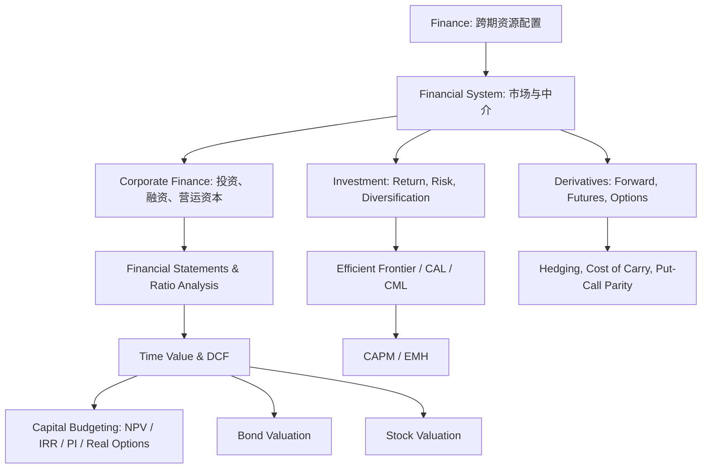

# AF5381-FINANCIAL MARKETS 总整理

> [!info] 来源文件
> 本整理覆盖 `/Users/xuji/Documents/obsidian/AF5381-FINANCIAL MARKETS` 下的 7 份笔记：  
> `Topic 1. Overview.md`、`Topic 1.2_FS&FSA.md`、`Topic 2. Financial System & Market.md`、`Topic 3&4. Time value & DCF & Capital Budgeting.md`、`Topic 5. Investment(1).md`、`Topic 6. Bond & Stock Market(1).md`、`Topic 7. Derivative Contracts(5).md`。

---

## 1. 课程主线

AF5381 的主线是：**金融系统如何把资金、风险和信息在不同主体之间重新配置**。课程从 finance 的定义开始，逐步进入公司财务决策、财务报表分析、金融市场结构、时间价值、投资组合、资产定价、证券估值和衍生品。

> [!tip] 抓主线
> 1. 金融的核心是把现金流从一个时间点搬到另一个时间点，并在过程中处理风险。
> 2. 公司财务关心 firm 如何投资、融资、分配现金流和处理代理问题。
> 3. 投资学关心投资者如何在风险和收益之间选择组合。
> 4. 金融市场与衍生品关心风险如何被交易、转移、定价和监管。

---

## 2. 文件地图

| 文件 | 主题 | 最重要的知识点 |
|---|---|---|
| [[Topic 1. Overview\|Topic 1. Overview.md]] | Finance overview 与 corporate finance | 跨期消费、投资与储蓄、公司财务三大决策、公司目标、代理理论、公司治理 |
| [[Topic 1.2_FS&FSA\|Topic 1.2_FS&FSA.md]] | Financial statements & ratio analysis | Balance sheet、income statement、cash flow from assets、五类财务比率、DuPont、IGR/SGR |
| [[Topic 2. Financial System & Market\|Topic 2. Financial System & Market.md]] | 金融系统、市场与中介 | 银行、投行、基金、ETF、资产类别、市场微观结构、交易成本、金融危机、监管 |
| [[Topic 3&4. Time value & DCF & Capital Budgeting\|Topic 3&4. Time value & DCF & Capital Budgeting.md]] | 时间价值、DCF 与资本预算 | APR/EAR、年金、增长现金流、NPV、Payback、IRR、PI、OCF、EAC、break-even、real options |
| [[Topic 5. Investment(1)\|Topic 5. Investment(1).md]] | 投资组合与资产定价 | HPR、time-weighted/dollar-weighted return、风险溢价、Sharpe ratio、efficient frontier、CAL/CML、CAPM、EMH |
| [[Topic 6. Bond & Stock Market(1)\|Topic 6. Bond & Stock Market(1).md]] | 债券与股票估值 | 债券价格、YTM、HPY、callable bond、term structure、DDM、Gordon growth、WACC、NPVGO |
| [[Topic 7. Derivative Contracts(5)\|Topic 7. Derivative Contracts(5).md]] | 衍生品 | Forward/futures、margin、cost-of-carry、basis、hedging、options payoff、bounds、put-call parity、convertible bond |

---

## 3. Topic 1：Finance、Corporate Finance 与 Governance

### 3.1 Finance 与 Economics 的区别

Economics 研究稀缺资源如何在不同商品和服务之间配置；Finance 更强调稀缺资源如何**跨时间**配置。

| 领域 | 核心问题 | 市场 |
|---|---|---|
| Economics | 今天不同商品之间如何选择 | Product market |
| Finance | 今天消费、未来消费、投资和储蓄如何选择 | Capital market |

Finance 的两个特征：

1. 决策跨越时间，例如现在消费还是未来消费。
2. 未来现金流通常不确定，因此必须处理风险。

### 3.2 跨期消费与金融市场

金融市场让 lending 和 borrowing 变得可能，使个人可以把当前收入重新分配到未来，或把未来收入提前到现在。

若现在消费为 $C_0$，未来消费为 $C_1$，利率为 $r$，则跨期预算关系可以写成：

$$
C_0+\frac{C_1}{1+r}=W_0
$$

或等价地：

$$
C_1=(W_0-C_0)(1+r)
$$

利率上升时，现在消费的机会成本上升，因此储蓄更有吸引力，借款消费更昂贵。

### 3.3 Investment、real assets 与 financial assets

Asset 是能产生未来 goods、services 或 cash flows 的东西。

| 类型 | 含义 | 例子 |
|---|---|---|
| Real assets | 用来生产商品和服务的资产 | 厂房、设备、房地产、专利 |
| Financial assets | 对 real assets 所产生现金流的索取权 | 股票、债券、基金份额、衍生品 |

投资回报包括：

$$
\mathrm{Dollar\ Return}=D_t+P_t-P_{t-1}
$$

$$
\mathrm{Rate\ of\ Return}=\frac{D_t+P_t-P_{t-1}}{P_{t-1}}
$$

### 3.4 公司财务的四类决策

从资产负债表看，firm 是一个把资金投入资产并创造现金流的生产单位。公司财务主要包括四类决策：

| 决策 | 问题 | 对应资产负债表位置 |
|---|---|---|
| Strategic planning | 公司应该进入什么业务 | 整体经营方向 |
| Capital budgeting | 应该投资哪些长期资产 | 左侧 fixed assets |
| Capital structure | 投资资金从债务还是股权来 | 右侧 debt/equity |
| Working capital management | 如何管理短期现金流缺口 | current assets 与 current liabilities |

### 3.5 公司目标

课程把公司目标落在：

$$
\text{Maximize shareholder wealth}
=
\text{Maximize share price}
=
\text{Maximize firm value}
$$

这个目标优于单纯 maximize profit，因为它考虑：

1. 利润发生的时间。
2. 利润的不确定性和风险。
3. 不同项目现金流规模和期限的差异。

### 3.6 Agency theory

公司是多方契约的集合。代理问题来自 separation of ownership and control，即股东拥有公司，但经理实际经营公司。

主要冲突：

| 冲突 | 问题 |
|---|---|
| Owner vs Manager | 经理可能追求薪酬、职位安全、声誉、私人利益，而不是股东价值最大化 |
| Shareholder vs Debtholder | 股东有 residual claim，可能偏好高风险项目；债权人偏好稳定现金流 |
| Major shareholder vs Minority shareholder | 控股股东可能通过关联交易、薪酬安排等方式侵占小股东利益 |

Agency costs 包括：

1. Direct contracting costs。
2. Monitoring costs。
3. Residual loss，即无法完全解决代理问题造成的价值损失。

### 3.7 股东与债权人的 contingent claims

若公司到期价值为 $X$，债务面值为 $F$，则债权人 payoff：

$$
\min(X,F)
$$

股东 payoff：

$$
\max(X-F,0)
$$

这说明 equity 类似一个以 firm value 为标的、strike 为 debt face value 的 call option。高杠杆下，股东可能有更强动机选择高风险项目，因为上行收益归股东，下行损失部分由债权人承担。

### 3.8 Corporate governance

Corporate governance 是减少代理问题、保护资本提供者预期回报的一套制度。它包括：

- ownership structure；
- board of directors；
- managerial compensation；
- fiduciary duties；
- creditor covenants；
- disclosure and transparency；
- corporate law and enforcement；
- independent directors and audit committees。

---

## 4. Topic 1.2：Financial Statements 与 FSA

### 4.1 Balance sheet

资产负债表描述公司在某一时点拥有和欠下什么。基本恒等式：

$$
\mathrm{Assets}
=
\mathrm{Liabilities}
+
\mathrm{Owners'\ Equity}
$$

从财务经理角度：

- 左侧 assets 来自 investment decisions。
- 右侧 liabilities/equity 来自 financing decisions。

Net working capital：

$$
\mathrm{NWC}
=
\mathrm{Current\ Assets}
-
\mathrm{Current\ Liabilities}
$$

NWC 反映 liquidity，即资产转换为现金的速度和容易程度。流动性越强通常越安全，但也可能牺牲盈利性。

### 4.2 Market value vs book value

| 概念 | 含义 |
|---|---|
| Book value | 会计账面价值，通常基于历史成本和会计规则 |
| Market value | 市场当前愿意支付的价值 |

讨论 firm value 时，finance 更关心 market value，因为它反映未来现金流和风险的市场定价。

### 4.3 Income statement

利润表描述一段期间内经营活动产生的收入和费用：

$$
\mathrm{Revenue}
-
\mathrm{Expenses}
=
\mathrm{Income}
$$

利润表上半部分从 sales 到 EBIT，主要反映投资决策的经营结果；下半部分从 EBIT 到 net income/EPS，受到融资决策、利息和税的影响。

> [!warning] 会计利润不是现金流
> Revenue recognition、matching principle、depreciation、deferred tax 等会让 accounting income 与实际现金流不同。金融估值更关心 cash flow，而不是单纯 accounting profit。

### 4.4 Cash flow from assets

直接法：

$$
\mathrm{CF(A)}
=
\mathrm{CF(B)}
+
\mathrm{CF(S)}
$$

其中：

$$
\mathrm{CF(B)}
=
\mathrm{Interest}
-
\mathrm{Net\ New\ Long\ Term\ Debt}
$$

$$
\mathrm{CF(S)}
=
\mathrm{Dividends}
-
\mathrm{Net\ New\ Equity}
$$

间接法：

$$
\mathrm{CF(A)}
=
\mathrm{OCF}
-
\Delta \mathrm{FA}
-
\Delta \mathrm{NWC}
$$

经营现金流：

$$
\mathrm{OCF}
=
\mathrm{EBIT}
-
\mathrm{Tax}
+
\mathrm{Depreciation}
$$

固定资产投资：

$$
\Delta \mathrm{FA}
=
\mathrm{Ending\ Net\ Fixed\ Assets}
-
\mathrm{Beginning\ Net\ Fixed\ Assets}
+
\mathrm{Depreciation}
$$

净营运资本变化：

$$
\Delta \mathrm{NWC}
=
\mathrm{Ending\ NWC}
-
\mathrm{Beginning\ NWC}
$$

### 4.5 Ratio analysis

财务比率用于跨公司或跨时期比较，主要分五组：

| 类别 | 衡量什么 | 典型比率 |
|---|---|---|
| Liquidity ratios | 短期偿债能力 | current ratio、quick ratio、cash ratio |
| Leverage ratios | 长期偿债能力和负债水平 | debt ratio、debt-equity ratio、equity multiplier、TIE |
| Turnover ratios | 资产管理效率 | inventory turnover、receivables turnover、total asset turnover |
| Profitability ratios | 盈利能力 | profit margin、ROA、ROE、EBITDA margin |
| Market value ratios | 市场估值 | P/E、PEG、CAPE、P/S、M/B、EV/EBITDA |

### 4.6 DuPont identity

DuPont 把 ROE 拆成三个来源：

$$
\mathrm{ROE}
=
\frac{\mathrm{Net\ Income}}{\mathrm{Sales}}
\times
\frac{\mathrm{Sales}}{\mathrm{Assets}}
\times
\frac{\mathrm{Assets}}{\mathrm{Equity}}
$$

也就是：

$$
\mathrm{ROE}
=
\mathrm{Profit\ Margin}
\times
\mathrm{Total\ Asset\ Turnover}
\times
\mathrm{Equity\ Multiplier}
$$

对应三种能力：

1. Operating efficiency。
2. Asset use efficiency。
3. Financial leverage。

### 4.7 Internal growth rate 与 sustainable growth rate

Dividend payout ratio：

$$
\mathrm{Payout\ Ratio}
=
\frac{\mathrm{Cash\ Dividends}}{\mathrm{Net\ Income}}
$$

Retention ratio：

$$
b
=
1-\mathrm{Payout\ Ratio}
$$

Internal growth rate 是不依赖外部融资时的最大增长率：

$$
\mathrm{IGR}
=
\frac{\mathrm{ROA}\times b}{1-\mathrm{ROA}\times b}
$$

Sustainable growth rate 是不发行新股、维持同一 debt-equity ratio 时的最大增长率：

$$
\mathrm{SGR}
=
\frac{\mathrm{ROE}\times b}{1-\mathrm{ROE}\times b}
$$

增长能力取决于 profit margin、retention policy、financial policy 和 asset turnover。

### 4.8 FSA 的局限

财务报表分析的问题包括：

- 没有统一理论告诉我们该看哪些比率；
- accounting numbers 不直接反映 market value 和 risk；
- conglomerate 难比较；
- 不同国家会计准则不同；
- inventory accounting、fiscal year、seasonality、one-time events 都会影响比较。

---

## 5. Topic 2：Financial System、Markets 与 Microstructure

### 5.1 金融中介

金融中介把资金从 savers 转移到 borrowers，并通过规模、专业管理、信息筛选和交易成本优势提高金融系统效率。

| 中介 | 主要客户 | 核心功能 |
|---|---|---|
| Corporate and institutional banking | 大企业、金融机构、公共部门 | 日常业务支持、长期融资、复杂产品 |
| Commercial banking | SMEs | 存款、贷款、商业银行服务 |
| Private banking | 高净值客户 | 财富管理、定制产品 |
| Retail banking | 大众个人客户 | 基础金融需求、标准化产品 |
| Investment banking | 企业发行人 | IPO、underwriting、book-building、private placement |
| Investment companies | 投资者 | pooling、diversification、professional management |

### 5.2 IPO 与 investment banking

IPO 中投行常承担 underwriting 功能。

| 术语 | 含义 |
|---|---|
| Prospectus | 描述发行条款、公司业务和前景的正式文件 |
| Red herring | 初步招股书 |
| Firm commitment | 投行买下证券，再转售给公众 |
| Roadshow | 向潜在投资者推介新股 |
| Book-building | 收集投资者需求，用于定价 |
| Shelf registration | 先注册，之后分阶段发行 |
| Private placement | 向少数机构或富裕投资者私募发行 |

### 5.3 资产类别与金融工具

Money market instruments：

- Treasury bills；
- CDs；
- Commercial paper；
- Bankers' acceptances；
- Eurodollars；
- Repos and reverses；
- Fed funds；
- Brokers' calls。

Bond market instruments：

- Treasury notes and bonds；
- TIPS；
- agency debt；
- international bonds、foreign bonds；
- municipal bonds；
- corporate bonds。

Equity market instruments：

- common stock；
- preferred stock；
- ADRs/GDRs。

### 5.4 Mutual funds 与 ETFs

Mutual fund 的 NAV：

$$
\mathrm{NAV}
=
\frac{\mathrm{Market\ Value\ of\ Assets}-\mathrm{Liabilities}}
{\mathrm{Shares\ Outstanding}}
$$

Open-end fund 由基金公司按 NAV 申购赎回；closed-end fund 份额固定，在二级市场交易，价格可能高于或低于 NAV。

ETF 与 mutual fund 类似，但 ETF 在交易所日内交易，并通过 authorized participants 进行 creation/redemption。

ETF 优点：

- 可日内交易；
- 可卖空或融资买入；
- 成本低；
- 税务效率高。

ETF 缺点：

- 价格可能短暂偏离 NAV；
- 需要通过 broker 交易。

### 5.5 Primary market 与 secondary market

| 市场 | 含义 | 资金流向 |
|---|---|---|
| Primary market | 新证券首次出售 | 发行公司收到资金 |
| Secondary market | 现有证券在投资者之间转售 | 发行公司通常不直接参与 |

### 5.6 Market microstructure

按订单交易方式：

| 市场 | 特点 | 例子 |
|---|---|---|
| Order-driven system | 公开 limit order book，透明度高 | Tokyo、Paris、Hong Kong |
| Quote-driven system | market makers/specialists 报 bid/ask | NYSE 传统 specialist 模式 |

按交易撮合方式：

| 市场 | 含义 |
|---|---|
| Direct search market | 买卖双方自己寻找对方 |
| Brokered market | broker 帮助寻找交易对手 |
| Dealer market | dealer 用自有账户买卖，赚取 bid-ask spread |
| Auction market | 买卖双方集中竞价 |

### 5.7 Order types

| 订单 | 含义 |
|---|---|
| Market order | 立即按市场可得价格成交 |
| Limit order | 指定最高买价或最低卖价 |
| Stop-loss order | 跌到触发价后卖出，用于止损 |
| Stop-buy order | 涨到触发价后买入，常用于突破或止损 |
| Good-till-cancelled | 未成交则持续有效，直到取消 |
| Fill or kill | 要么立即全部成交，要么取消 |

### 5.8 Trading costs

交易成本包括：

$$
\mathrm{Spread}
=
\frac{\mathrm{Ask}-\mathrm{Bid}}
{\mathrm{Bid\text{-}Ask\ Midpoint}}
$$

Bid-ask spread 的组成：

1. Order processing costs。
2. Inventory costs。
3. Adverse information costs。
4. Price impact costs。

Adverse selection 的核心是 market maker 无法区分 liquidity traders 和 informed traders。与 informed traders 交易会亏，必须从 liquidity traders 的 spread 中补回来。

### 5.9 Margin trading 与 short sales

Margin trading 是用部分自有资金加借款买入证券。关键概念：

- initial margin；
- maintenance margin；
- margin call。

Short sale 的流程：

1. 借入股票。
2. 卖出股票并把 proceeds 存入保证金账户。
3. 之后买回股票并归还。

### 5.10 Market failure 与监管

2008-2009 金融危机的链条：

1. Mortgage finance 从 originate-to-hold 变成 originate-to-distribute。
2. Mortgage loans 被证券化为 MBS。
3. MBS/ABS 被重新打包成 CDO tranches。
4. CDS 被当作违约保险广泛使用，但 OTC 市场透明度低、保证金要求不足。
5. 房价下跌后，复杂证券和保险链条同时失灵。

监管工具包括：

- Securities Act of 1933；
- Securities Act of 1934；
- Securities Investor Protection Act；
- FINRA self-regulation；
- SOX；
- PCAOB；
- audit committee independent directors；
- CEO/CFO certification；
- insider trading disclosure。

---

## 6. Topic 3：Time Value 与 DCF

### 6.1 Compounding 与 discounting

复利终值：

$$
FV_T=PV(1+r)^T
$$

现值：

$$
PV=\frac{FV_T}{(1+r)^T}
$$

如果一年复利 $m$ 次，APR 与 EAR 的关系：

$$
\mathrm{EAR}
=
\left(1+\frac{\mathrm{APR}}{m}\right)^m-1
$$

连续复利：

$$
FV_T=PV e^{rT}
$$

$$
\mathrm{EAR}=e^{\mathrm{APR}}-1
$$

### 6.2 年金

普通年金现值：

$$
PV=C\times
\frac{1-\frac{1}{(1+r)^T}}{r}
$$

年金因子：

$$
\mathrm{PVAF}_{T,r}
=
\frac{1-\frac{1}{(1+r)^T}}{r}
$$

所以：

$$
PV=C\times \mathrm{PVAF}_{T,r}
$$

Loan amortization 中，若本金为 $L$，每期还款为 $PMT$：

$$
L=PMT\times \mathrm{PVAF}_{T,r}
$$

因此：

$$
PMT=\frac{L}{\mathrm{PVAF}_{T,r}}
$$

### 6.3 增长现金流

增长年金现值：

$$
PV
=
\frac{C_1}{r-g}
\left[
1-
\left(\frac{1+g}{1+r}\right)^T
\right]
$$

永续增长现金流现值：

$$
PV=\frac{C_1}{r-g}
$$

前提是：

$$
r>g
$$

### 6.4 Irregular cash flows

不规则现金流没有统一年金因子，需要逐期折现或逐期滚到同一个时间点：

$$
PV=\sum_{t=1}^T \frac{CF_t}{(1+r)^t}
$$

$$
FV_T=\sum_{t=0}^T CF_t(1+r)^{T-t}
$$

---

## 7. Topic 4：Capital Budgeting

### 7.1 NPV rule

NPV：

$$
\mathrm{NPV}
=
\sum_{t=1}^T
\frac{CF_t}{(1+r)^t}
-
I_0
$$

决策规则：

- 独立项目：接受 $\mathrm{NPV}>0$ 的项目。
- 互斥项目：选择 NPV 最高的项目。

NPV 是课程中最重要的资本预算规则，因为它直接衡量 firm value 的增量。

### 7.2 Payback 与 discounted payback

Payback period 是累计现金流收回初始投资所需时间。优点是简单、偏向流动性；缺点是：

- 忽略时间价值；
- 忽略 payback period 之后的现金流；
- 可能接受负 NPV 项目；
- 若现金流符号多次变化，可能有多个 payback period。

Discounted payback 用折现现金流计算收回期，但仍会忽略回收期之后的现金流，因此不如 NPV。

### 7.3 IRR rule

IRR 是使 NPV 等于 0 的折现率：

$$
0=
\sum_{t=1}^T
\frac{CF_t}{(1+\mathrm{IRR})^t}
-
I_0
$$

决策规则：

$$
\mathrm{Accept\ if}
\quad
\mathrm{IRR}>\mathrm{Hurdle\ Rate}
$$

IRR 的问题：

1. 非正常现金流可能没有 IRR 或有多个 IRR。
2. 互斥项目可能出现 scale problem。
3. 现金流时点不同会导致 timing problem。
4. IRR 隐含再投资收益率为 IRR，本身不一定现实。

### 7.4 Cross-over rate

Cross-over rate 是两个互斥项目 NPV 相等的折现率，也叫 incremental IRR。若两个项目的现金流规模或时点不同，折现率低于或高于 cross-over rate 时，NPV 排序可能反转。

### 7.5 Profitability index

PI：

$$
\mathrm{PI}
=
\frac{PV(\mathrm{Future\ Cash\ Flows})}{\mathrm{Initial\ Cost}}
=
1+\frac{\mathrm{NPV}}{\mathrm{Initial\ Cost}}
$$

PI 决策规则：

$$
\mathrm{Accept\ if}
\quad
\mathrm{PI}>1
$$

PI 在 capital rationing 下有用，因为它衡量每一单位初始投资创造多少现值；但互斥项目中 PI 可能偏向小项目，而不是最大价值项目。

### 7.6 项目现金流

资本预算中不计入融资现金流，因为 discount rate 已经反映融资成本。核心公式：

$$
\mathrm{CFA}
=
\mathrm{OCF}
-
\Delta \mathrm{NWC}
-
\Delta \mathrm{FA}
$$

经营现金流：

$$
\mathrm{OCF}
=
\mathrm{EBIT}
-
\mathrm{Tax}
+
\mathrm{Depreciation}
$$

等价写法：

$$
\mathrm{OCF}
=
(1-t_c)\mathrm{EBIT}
+
\mathrm{Depreciation}
$$

或：

$$
\mathrm{OCF}
=
\mathrm{EBITDA}
-
t_c(\mathrm{EBITDA}-\mathrm{Depreciation})
$$

折旧税盾：

$$
\mathrm{Depreciation\ Tax\ Shield}
=
t_c \times \mathrm{Depreciation}
$$

### 7.7 Cost-cutting proposals

成本节约项目通常把节约的现金成本视为现金流入。若设备每年节省 $S$，折旧为 $D$，税率为 $t_c$：

$$
\mathrm{OCF}
=
S
-
t_c(S-D)
$$

若有税后残值 $SV$：

$$
\mathrm{After\text{-}tax\ Salvage}
=
SV(1-t_c)
$$

### 7.8 Unequal lives 与 EAC

寿命不同的设备不能直接比较 NPV。两种方法：

1. Matching cycles：找到共同使用期限，把项目重复到相同年限。
2. Equivalent annual cost：把成本现值转换成等额年成本。

EAC：

$$
\mathrm{EAC}
=
\frac{PV(\mathrm{Costs})}{\mathrm{PVAF}_{T,r}}
$$

选择 EAC 较低的方案。

### 7.9 Break-even analysis

会计利润 break-even：

$$
\mathrm{Accounting\ Profit}
=
\left[(P-v)Q-FC-D\right](1-t_c)
$$

令 accounting profit 为 0，可得会计盈亏平衡销量：

$$
Q_{\mathrm{accounting}}
=
\frac{FC+D}{P-v}
$$

Present-value break-even 把项目所需的 annualized capital cost 纳入考虑，因此更接近价值创造。

### 7.10 Real options

传统 DCF 可能低估项目价值，因为它忽略管理层未来调整项目的灵活性：

$$
M
=
\mathrm{NPV}
+
\mathrm{Option\ Value}
$$

常见 real options：

| Real option | 含义 |
|---|---|
| Option to expand | 情况好时扩张 |
| Option to abandon | 情况差时退出 |
| Timing option | 等待更好时机再投资 |
| Decision tree | 先做测试，再决定是否投入大项目 |

---

## 8. Topic 5：Investment、Portfolio 与 CAPM

### 8.1 单期收益率

持有期收益率：

$$
\mathrm{HPR}
=
\frac{P_1-P_0+D_1}{P_0}
$$

Dollar return：

$$
\mathrm{Dollar\ Return}
=
D_1+P_1-P_0
$$

### 8.2 Dollar-weighted vs time-weighted return

Dollar-weighted return 是 cash-flow-weighted 的 IRR，反映投资者真实财富增长，适合 buy-and-hold 或投资者控制现金流时使用。

Time-weighted return 先计算每一期收益，再平均或复合，更适合评价 portfolio manager，因为经理通常无法控制客户资金流入流出。

### 8.3 Arithmetic mean vs geometric mean

几何平均：

$$
\bar{R}_G
=
\left[
\prod_{t=1}^T(1+R_t)
\right]^{1/T}
-1
$$

算术平均：

$$
\bar{R}_A
=
\frac{1}{T}\sum_{t=1}^T R_t
$$

一般：

- 评价过去 buy-and-hold performance：更偏向 geometric mean。
- 预测未来 single-period expected return：更偏向 arithmetic mean。

### 8.4 Fisher equation

名义利率、实际利率和预期通胀：

$$
(1+i)=(1+r)(1+\pi^e)
$$

近似：

$$
i\approx r+\pi^e
$$

### 8.5 Expected return 与 variance

若有 $S$ 个经济状态，第 $s$ 个状态概率为 $p_s$，收益为 $R_s$：

$$
\mathbb{E}[R]
=
\sum_{s=1}^S p_sR_s
$$

$$
\sigma^2
=
\sum_{s=1}^S p_s
\left(R_s-\mathbb{E}[R]\right)^2
$$

$$
\sigma=\sqrt{\sigma^2}
$$

波动率年化：

$$
\sigma_{\mathrm{annual}}
=
\sigma_{\mathrm{period}}
\sqrt{T}
$$

### 8.6 Risk premium 与 Sharpe ratio

Risk premium：

$$
\mathrm{Risk\ Premium}
=
\mathbb{E}[R]-R_f
$$

Sharpe ratio：

$$
\mathrm{Sharpe}
=
\frac{\mathbb{E}[R]-R_f}{\sigma}
$$

Sharpe ratio 衡量每一单位总风险获得的超额回报。

### 8.7 Portfolio return and risk

两资产组合收益：

$$
\mathbb{E}[R_p]
=
w_D\mathbb{E}[R_D]
+
w_E\mathbb{E}[R_E]
$$

协方差：

$$
\mathrm{Cov}(R_D,R_E)
=
\rho_{DE}\sigma_D\sigma_E
$$

两资产组合方差：

$$
\sigma_p^2
=
w_D^2\sigma_D^2
+
w_E^2\sigma_E^2
+
2w_Dw_E\rho_{DE}\sigma_D\sigma_E
$$

$N$ 资产组合方差：

$$
\sigma_p^2
=
\sum_i\sum_j w_iw_j\mathrm{Cov}(R_i,R_j)
$$

### 8.8 Diversification

风险分为：

| 风险 | 含义 | 是否可分散 |
|---|---|---|
| Systematic risk | 市场整体风险 | 不可分散 |
| Firm-specific risk | 公司个体风险 | 可分散 |

资产相关性越低，分散化效果越强。当相关系数为 $+1$ 时，组合不能降低风险；当相关系数低于 $+1$ 时，组合通常能降低风险。

### 8.9 Efficient frontier

Minimum-variance frontier 是给定 expected return 下方差最低的组合集合。上半部分称为 efficient frontier，因为它在同等风险下提供更高收益，或在同等收益下提供更低风险。

Mean-variance criterion：

$$
A \text{ dominates } B
\quad \text{if} \quad
\mathbb{E}[R_A]\geq \mathbb{E}[R_B]
\quad \text{and} \quad
\sigma_A\leq \sigma_B
$$

### 8.10 CAL 与 CML

由一个 risky asset $A$ 和 risk-free asset 构造组合：

$$
\mathbb{E}[R_p]
=
(1-w)R_f+w\mathbb{E}[R_A]
$$

$$
\sigma_p=w\sigma_A
$$

消去 $w$：

$$
\mathbb{E}[R_p]
=
R_f
+
\frac{\mathbb{E}[R_A]-R_f}{\sigma_A}
\sigma_p
$$

这条线是 Capital Allocation Line，斜率是 Sharpe ratio。

如果 risky portfolio 是 market portfolio，则 CAL 变成 Capital Market Line：

$$
\mathbb{E}[R_p]
=
R_f
+
\frac{\mathbb{E}[R_M]-R_f}{\sigma_M}
\sigma_p
$$

### 8.11 Utility maximization

均值-方差效用：

$$
U
=
\mathbb{E}[R]
-
0.005A\sigma^2
$$

其中 $A$ 是风险厌恶系数。单一 risky asset 与 risk-free asset 下，最优 risky asset 权重：

$$
w^*
=
\frac{\mathbb{E}[R_A]-R_f}
{0.01A\sigma_A^2}
$$

风险厌恶越强，$A$ 越大，投资 risky asset 的比例越低。

### 8.12 CAPM

CAPM 假设投资者是 mean-variance optimizers，拥有同质预期，能以共同 risk-free rate 借贷，无税无交易成本。

市场组合包含所有风险资产，权重为市值权重。单个资产的期望收益由 beta 决定：

$$
\mathbb{E}[R_i]
=
R_f
+
\beta_i
\left(\mathbb{E}[R_M]-R_f\right)
$$

Beta：

$$
\beta_i
=
\frac{\mathrm{Cov}(R_i,R_M)}
{\sigma_M^2}
$$

CAPM 的直觉：资产应该因其对 market portfolio 风险的边际贡献获得风险溢价，而不是因自身总波动率获得风险溢价。

### 8.13 CML vs SML

| 项目 | CML | SML |
|---|---|---|
| 横轴 | 总风险 $\sigma$ | 系统性风险 $\beta$ |
| 适用对象 | 有效组合 | 任意资产或组合 |
| 斜率 | Market Sharpe ratio | Market risk premium |
| 公式 | $\mathbb{E}[R_p]=R_f+\frac{\mathbb{E}[R_M]-R_f}{\sigma_M}\sigma_p$ | $\mathbb{E}[R_i]=R_f+\beta_i(\mathbb{E}[R_M]-R_f)$ |

### 8.14 EMH

Efficient Market Hypothesis：

> Security prices fully reflect available information.

三种形式：

| 形式 | 信息集 | 含义 |
|---|---|---|
| Weak form | 历史价格和交易量 | 技术分析难以持续赚取异常收益 |
| Semi-strong form | 所有公开信息 | 基本面分析难以持续赚取异常收益 |
| Strong form | 包括内幕信息 | 即使内幕信息也不能赚取异常收益 |

事件研究：

$$
R_t=\alpha+\beta R_{M,t}+\varepsilon_t
$$

Abnormal return：

$$
AR_t
=
R_t-(\alpha+\beta R_{M,t})
=
\varepsilon_t
$$

Cumulative abnormal return：

$$
CAR
=
\sum_{t=-T}^{T} AR_t
$$

市场异象包括 momentum、long-term reversal、P/E effect、small firm effect、book-to-market effect、PEAD 等。解释可分为 risk premium explanation 和 behavioral/inefficiency explanation，也要警惕 data mining 和 post-publication decay。

---

## 9. Topic 6：Bond 与 Stock Valuation

### 9.1 Bond features

债券是 debt。Issuer 是 borrower，holder 是 creditor。Indenture 是发行人与债权人的契约，规定 coupon rate、maturity date、par value、call/put/convertible features 等。

债券类型：

- Treasury bills/notes/bonds；
- corporate bonds；
- floating rate bonds；
- callable/putable/convertible bonds；
- inverse floaters；
- asset-backed bonds；
- TIPS；
- equity-linked notes。

### 9.2 Clean price、dirty price 与 accrued interest

报价通常是 clean price，不包含上一付息日以来累计的利息。实际成交 invoice price：

$$
\mathrm{Invoice\ Price}
=
\mathrm{Quoted\ Price}
+
\mathrm{Accrued\ Interest}
$$

若半年度 coupon 为 $C$，距离上一付息日已过 $t$ 天，按 182 天半年计：

$$
\mathrm{Accrued\ Interest}
=
C\times \frac{t}{182}
$$

### 9.3 Bond price

普通 coupon bond 价格：

$$
P
=
\sum_{t=1}^{T}
\frac{C}{(1+y)^t}
+
\frac{F}{(1+y)^T}
$$

也可写成：

$$
P
=
C\times \mathrm{PVAF}_{T,y}
+
F\times \mathrm{PVIF}_{T,y}
$$

若 coupon semiannual，通常用半年度 coupon、半年度 yield 和总半年度期数定价。

### 9.4 Bond yields

Coupon yield：

$$
\mathrm{Coupon\ Yield}
=
\frac{\mathrm{Coupon\ Payment}}{\mathrm{Face\ Value}}
$$

Current yield：

$$
\mathrm{Current\ Yield}
=
\frac{\mathrm{Annual\ Coupon}}{\mathrm{Bond\ Price}}
$$

YTM 是使债券现金流现值等于当前价格的折现率：

$$
P
=
\sum_{t=1}^{T}
\frac{C}{(1+\mathrm{YTM})^t}
+
\frac{F}{(1+\mathrm{YTM})^T}
$$

Holding period yield：

$$
\mathrm{HPY}
=
\frac{P_1+C-P_0}{P_0}
$$

若持有到期且 coupon 能以 YTM 再投资，realized compound yield 才等于 YTM。

### 9.5 Callable bonds

Callable bond 的价值：

$$
\mathrm{Callable\ Bond}
=
\mathrm{Straight\ Bond}
-
\mathrm{Call\ Option\ Value}
$$

所以 callable bond 价值低于可比 straight bond，YTM 通常高于可比 straight bond。对 premium callable bond，yield to call 往往比 YTM 更相关。

### 9.6 Term structure 与 yield curve

Term structure 是不同 maturity 的 default-free pure discount bond 利率之间的关系。常见形状：

- upward sloping；
- hump-shaped；
- downward sloping。

决定因素：

1. real rate；
2. expected inflation；
3. interest rate risk premium。

公司债收益率还包括：

- default risk premium；
- taxability premium；
- liquidity premium。

### 9.7 Stock valuation

金融资产价值等于未来现金流现值。股票价值理论上是未来 dividends 的现值：

$$
P_0
=
\sum_{t=1}^{\infty}
\frac{D_t}{(1+r)^t}
$$

Zero growth stock 或 preferred stock：

$$
P_0=\frac{D}{r}
$$

Constant growth model：

$$
P_0=\frac{D_1}{r-g}
$$

要求：

$$
r>g
$$

由 Gordon model 反推出 required return：

$$
r=\frac{D_1}{P_0}+g
$$

### 9.8 Growth rate estimation

增长率来自 retained earnings 的再投资：

$$
g
=
\mathrm{Retention\ Ratio}
\times
\mathrm{ROE}
$$

若 retention ratio 为 $b$：

$$
g=b\times \mathrm{ROE}
$$

高增长公司通常低分红，因为 retained earnings 被投入新的正 NPV 项目。

### 9.9 Cost of capital 与 WACC

税后债务成本：

$$
R_D^{\mathrm{after\ tax}}
=
i(1-t_c)
$$

权益成本可用 CAPM：

$$
R_E
=
R_f+\beta_E(\mathbb{E}[R_M]-R_f)
$$

WACC：

$$
\mathrm{WACC}
=
\frac{E}{D+E}R_E
+
\frac{D}{D+E}R_D(1-t_c)
$$

### 9.10 Growth opportunities

股票价格可分为 no-growth cash cow 和 growth opportunities：

$$
P
=
\frac{\mathrm{EPS}}{r}
+
\mathrm{NPVGO}
$$

如果公司保留利润投资于回报率高于资本成本的项目，NPVGO 为正，股价上升。若项目回报率低于资本成本，增长会毁灭价值。

### 9.11 股票估值方法比较

| 方法 | 适用场景 | 关键点 |
|---|---|---|
| Dividend discount model | 稳定分红公司 | 直接折现 dividends |
| Free cash flow model | 不分红或外部融资需求高的公司 | 折现 firm cash flows，再扣债务得 equity value |
| Comparables | 有相似公司和估值倍数 | P/E、EV/EBITDA、P/S 等 |

三者概念上等价，但实践中取决于数据可得性和公司生命周期。

---

## 10. Topic 7：Derivatives

### 10.1 Derivatives 的功能

Derivatives 的收益来自 underlying assets，如股票、债券、外汇、商品。

主要功能：

| 功能 | 含义 |
|---|---|
| Hedging | 转移或降低已有风险 |
| Speculation | 裸露承担风险以追求收益 |
| Price discovery | 低交易成本和高流动性使衍生品价格反映市场预期 |
| Arbitrage | 利用 law of one price 被违反时的价格差 |

### 10.2 Forward vs futures

| 项目 | Forward | Futures |
|---|---|---|
| 市场 | OTC | Organized exchange |
| 条款 | 定制化 | 标准化 |
| 信用风险 | 双方互相承担 | Clearinghouse 降低对手方风险 |
| 结算 | 到期结算 | Daily settlement / mark-to-market |
| 流动性 | 通常较低 | 通常较高 |
| 目的 | 常持有到期交割 | 多数通过 offset 平仓 |

Futures margin 是 performance bond，不同于股票 margin borrowing。

### 10.3 Futures margin 与 settlement

关键概念：

- initial margin：开仓时缴纳；
- maintenance margin：账户必须维持的最低金额；
- variation margin：margin call 后补缴；
- settlement price：用于每日盯市的结算价；
- open interest：未平仓合约数量。

Daily settlement 使 futures gains/losses 每天进入保证金账户。

### 10.4 Cost-of-carry model

连续时间 cost-of-carry：

$$
F_t e^{-rT}
=
S_t e^{-yT}
$$

因此：

$$
F_t
=
S_t e^{(r-y)T}
$$

其中 $y$ 可代表：

| 标的 | $y$ 的含义 |
|---|---|
| 股票指数 | dividend yield |
| 外汇 | foreign interest rate |
| 商品 | convenience yield |
| 有仓储成本商品 | $y$ 可视为负的 storage cost adjustment |

离散直觉：

$$
\mathrm{Futures\ Price}
=
\mathrm{Spot\ Price}
+
\mathrm{Interest\ Cost}
+
\mathrm{Storage\ Cost}
-
\mathrm{Reinvested\ Dividend}
$$

### 10.5 Interest rate parity

外汇远期/期货中：

$$
F_{d/f}e^{-r_dT}
=
S_{d/f}e^{-r_fT}
$$

所以：

$$
F_{d/f}
=
S_{d/f}e^{(r_d-r_f)T}
$$

离散版本：

$$
F_{d/f}(1+r_f)
=
S_{d/f}(1+r_d)
$$

近似 log form：

$$
\ln F_{d/f}-\ln S_{d/f}
\approx
r_d-r_f
$$

### 10.6 Basis、contango 与 backwardation

Basis：

$$
\mathrm{Basis}
=
S-F
$$

| 状态 | 条件 | 含义 |
|---|---|---|
| Contango | $F>S$，basis 为负 | futures price 高于 spot |
| Backwardation | $S>F$，basis 为正 | spot price 高于 futures |

到期时 futures price 与 spot price 收敛：

$$
F_T=S_T
$$

因此 basis 到期趋近于 0。

### 10.7 Futures hedging

若要用 futures 对冲现货风险，合约数量：

$$
N^*
=
h^*
\times
\frac{\mathrm{Exposure\ Size}}{\mathrm{Contract\ Size}}
$$

其中 $h^*$ 是 hedge ratio。若 $h^*=1$，是 unitary hedge。

Hedge risk：

- quantity risk；
- basis risk；
- cross-hedging risk；
- delivery month mismatch。

用 futures 对冲本质上是把 cash price risk 换成 basis risk。

### 10.8 Option basics

Option 给 holder 权利但非义务：

- Call：买入标的的权利。
- Put：卖出标的的权利。

Option buyer 支付 premium，获得选择权；option writer 收取 premium，承担履约义务。

Moneyness：

| 条件 | Call | Put |
|---|---|---|
| $S>X$ | ITM | OTM |
| $S=X$ | ATM | ATM |
| $S<X$ | OTM | ITM |

### 10.9 Option payoff

到期 call payoff：

$$
C_T=\max(S_T-X,0)
$$

到期 put payoff：

$$
P_T=\max(X-S_T,0)
$$

Long call profit：

$$
\Pi_{\mathrm{LC}}
=
\max(S_T-X,0)-c
$$

Short call profit：

$$
\Pi_{\mathrm{SC}}
=
c-\max(S_T-X,0)
$$

Long put profit：

$$
\Pi_{\mathrm{LP}}
=
\max(X-S_T,0)-p
$$

Short put profit：

$$
\Pi_{\mathrm{SP}}
=
p-\max(X-S_T,0)
$$

### 10.10 Option bounds

Call 最低价值：

$$
C_t\geq \max(S_t-PV(X),0)
$$

Put 最低价值：

$$
P_t\geq \max(PV(X)-S_t,0)
$$

European put 最大价值：

$$
P_E\leq PV(X)
$$

American put 最大价值：

$$
P_A\leq X
$$

Option premium：

$$
\mathrm{Option\ Premium}
=
\mathrm{Intrinsic\ Value}
+
\mathrm{Time\ Premium}
$$

Call intrinsic value：

$$
\max(S_t-X,0)
$$

Put intrinsic value：

$$
\max(X-S_t,0)
$$

### 10.11 Factors affecting option prices

| 因子 | Call | Put | 直觉 |
|---|---|---|---|
| $S$ 上升 | 上升 | 下降 | 标的越贵，买权越有价值 |
| $X$ 上升 | 下降 | 上升 | 行权买入更贵、行权卖出更有利 |
| $\sigma$ 上升 | 上升 | 上升 | option 有凸性，波动越大越有价值 |
| $T$ 增加 | 通常上升 | 通常上升 | 更多时间等待有利状态 |
| $r$ 上升 | 上升 | 下降 | strike 现值下降 |
| Dividends 上升 | 下降 | 上升 | 除息降低未来股价 |

### 10.12 Put-call parity

欧式期权 put-call parity：

$$
P+S=C+PV(X)
$$

等价写法：

$$
C-P=S-PV(X)
$$

若存在 dividends：

$$
C-P=S-PV(D)-PV(X)
$$

含义：两个到期 payoff 完全相同的组合，今天价值必须相同，否则存在 arbitrage。

### 10.13 Convertible bonds

Convertible bond 价值：

$$
\mathrm{Convertible\ Bond\ Value}
=
\max(\mathrm{Straight\ Bond\ Value},\mathrm{Conversion\ Value})
+
\mathrm{Option\ Value}
$$

Conversion ratio：

$$
\mathrm{Conversion\ Ratio}
=
\frac{\mathrm{Par\ Value}}{\mathrm{Conversion\ Price}}
$$

Market conversion value：

$$
\mathrm{Market\ Conversion\ Value}
=
\mathrm{Conversion\ Ratio}
\times
\mathrm{Stock\ Price}
$$

Conversion premium：

$$
\mathrm{Conversion\ Premium}
=
\mathrm{Convertible\ Bond\ Price}
-
\mathrm{Market\ Conversion\ Value}
$$

Callable convertible 可迫使转换：若 conversion value 高于 call price，发行人 call bond 时，持有人更可能选择转换为股票。

### 10.14 Levered firm as options

从股东角度，levered equity 类似：

$$
\mathrm{Equity}
=
\max(V-D,0)
$$

也就是以 firm value $V$ 为标的、debt face value $D$ 为 strike 的 call option。

由 put-call parity：

$$
C
=
S+P-PV(X)
$$

在公司金融语境下，股东有限责任相当于持有 downside protection，这解释了为什么高杠杆公司股东可能偏好更高风险项目。

---

## 11. 关键公式速查

> [!important] 这一节的公式均使用 LaTeX，可在 Obsidian/MathJax 中渲染。

### 11.1 Finance、DCF 与 capital budgeting

| 主题 | 公式 | 用法 |
|---|---|---|
| 持有期收益 | $\mathrm{HPR}=\frac{P_1-P_0+D_1}{P_0}$ | 单期投资回报 |
| 终值 | $FV_T=PV(1+r)^T$ | 复利增长 |
| 现值 | $PV=\frac{FV_T}{(1+r)^T}$ | 折现 |
| EAR | $\mathrm{EAR}=\left(1+\frac{\mathrm{APR}}{m}\right)^m-1$ | APR 转实际年利率 |
| 连续复利 | $FV_T=PVe^{rT}$ | 连续复利终值 |
| 年金现值 | $PV=C\frac{1-\frac{1}{(1+r)^T}}{r}$ | 等额现金流折现 |
| 增长年金 | $PV=\frac{C_1}{r-g}\left[1-\left(\frac{1+g}{1+r}\right)^T\right]$ | 有期限增长现金流 |
| 永续增长 | $PV=\frac{C_1}{r-g}$ | Gordon growth / growing perpetuity |
| NPV | $\mathrm{NPV}=\sum_{t=1}^T\frac{CF_t}{(1+r)^t}-I_0$ | 资本预算首要规则 |
| IRR | $0=\sum_{t=1}^T\frac{CF_t}{(1+\mathrm{IRR})^t}-I_0$ | 使 NPV 为 0 的折现率 |
| PI | $\mathrm{PI}=1+\frac{\mathrm{NPV}}{\mathrm{Initial\ Cost}}$ | 资本约束下排序 |
| CFA | $\mathrm{CFA}=\mathrm{OCF}-\Delta\mathrm{NWC}-\Delta\mathrm{FA}$ | 项目自由现金流 |
| OCF | $\mathrm{OCF}=\mathrm{EBIT}-\mathrm{Tax}+\mathrm{Depreciation}$ | 经营现金流 |
| 折旧税盾 | $\mathrm{Tax\ Shield}=t_c\times\mathrm{Depreciation}$ | 折旧带来的节税价值 |
| EAC | $\mathrm{EAC}=\frac{PV(\mathrm{Costs})}{\mathrm{PVAF}_{T,r}}$ | 比较寿命不同设备 |
| 会计盈亏平衡 | $Q_{\mathrm{accounting}}=\frac{FC+D}{P-v}$ | accounting profit 为 0 的销量 |

### 11.2 Financial statements 与 ratio analysis

| 主题 | 公式 | 用法 |
|---|---|---|
| 会计恒等式 | $\mathrm{Assets}=\mathrm{Liabilities}+\mathrm{Owners'\ Equity}$ | Balance sheet 基础 |
| NWC | $\mathrm{NWC}=\mathrm{CA}-\mathrm{CL}$ | 短期流动性 |
| CF to creditors | $\mathrm{CF(B)}=\mathrm{Interest}-\mathrm{Net\ New\ Debt}$ | 债权人现金流 |
| CF to owners | $\mathrm{CF(S)}=\mathrm{Dividends}-\mathrm{Net\ New\ Equity}$ | 股东现金流 |
| Current ratio | $\frac{\mathrm{CA}}{\mathrm{CL}}$ | 短期偿债能力 |
| Quick ratio | $\frac{\mathrm{CA}-\mathrm{Inventory}}{\mathrm{CL}}$ | 更严格流动性 |
| Debt-equity ratio | $\frac{\mathrm{Total\ Debt}}{\mathrm{Total\ Equity}}$ | 杠杆 |
| Equity multiplier | $\frac{\mathrm{Assets}}{\mathrm{Equity}}$ | 财务杠杆 |
| Profit margin | $\frac{\mathrm{NI}}{\mathrm{Sales}}$ | 盈利能力 |
| ROA | $\frac{\mathrm{NI}}{\mathrm{Assets}}$ | 资产回报 |
| ROE | $\frac{\mathrm{NI}}{\mathrm{Equity}}$ | 股东权益回报 |
| DuPont | $\mathrm{ROE}=\frac{\mathrm{NI}}{\mathrm{Sales}}\times\frac{\mathrm{Sales}}{\mathrm{Assets}}\times\frac{\mathrm{Assets}}{\mathrm{Equity}}$ | ROE 拆解 |
| IGR | $\mathrm{IGR}=\frac{\mathrm{ROA}\times b}{1-\mathrm{ROA}\times b}$ | 无外部融资增长 |
| SGR | $\mathrm{SGR}=\frac{\mathrm{ROE}\times b}{1-\mathrm{ROE}\times b}$ | 无新股融资增长 |

### 11.3 Investment、portfolio 与 CAPM

| 主题 | 公式 | 用法 |
|---|---|---|
| 期望收益 | $\mathbb{E}[R]=\sum_s p_sR_s$ | 多状态收益 |
| 方差 | $\sigma^2=\sum_s p_s(R_s-\mathbb{E}[R])^2$ | 风险度量 |
| 风险溢价 | $\mathbb{E}[R]-R_f$ | 超额回报 |
| Sharpe ratio | $\mathrm{Sharpe}=\frac{\mathbb{E}[R]-R_f}{\sigma}$ | 每单位风险回报 |
| 两资产组合收益 | $\mathbb{E}[R_p]=w_D\mathbb{E}[R_D]+w_E\mathbb{E}[R_E]$ | 组合期望收益 |
| 协方差 | $\mathrm{Cov}(R_D,R_E)=\rho_{DE}\sigma_D\sigma_E$ | 资产共动性 |
| 两资产组合方差 | $\sigma_p^2=w_D^2\sigma_D^2+w_E^2\sigma_E^2+2w_Dw_E\rho_{DE}\sigma_D\sigma_E$ | 分散化计算 |
| 多资产组合方差 | $\sigma_p^2=\sum_i\sum_j w_iw_j\mathrm{Cov}(R_i,R_j)$ | Markowitz portfolio |
| CAL | $\mathbb{E}[R_p]=R_f+\frac{\mathbb{E}[R_A]-R_f}{\sigma_A}\sigma_p$ | risky asset + risk-free asset |
| Utility | $U=\mathbb{E}[R]-0.005A\sigma^2$ | 风险厌恶效用 |
| 最优 risky weight | $w^*=\frac{\mathbb{E}[R_A]-R_f}{0.01A\sigma_A^2}$ | 资产配置 |
| CAPM beta | $\beta_i=\frac{\mathrm{Cov}(R_i,R_M)}{\sigma_M^2}$ | 系统性风险 |
| CAPM | $\mathbb{E}[R_i]=R_f+\beta_i(\mathbb{E}[R_M]-R_f)$ | 资产均衡收益 |
| Abnormal return | $AR_t=R_t-(\alpha+\beta R_{M,t})$ | 事件研究 |
| CAR | $CAR=\sum_{t=-T}^{T}AR_t$ | 累计异常收益 |

### 11.4 Bond、stock 与 derivatives

| 主题 | 公式 | 用法 |
|---|---|---|
| 债券价格 | $P=\sum_{t=1}^{T}\frac{C}{(1+y)^t}+\frac{F}{(1+y)^T}$ | coupon bond valuation |
| Current yield | $\frac{\mathrm{Annual\ Coupon}}{P}$ | 当期收益率 |
| HPY | $\mathrm{HPY}=\frac{P_1+C-P_0}{P_0}$ | 持有期收益 |
| Callable bond | $\mathrm{Callable\ Bond}=\mathrm{Straight\ Bond}-\mathrm{Call\ Option\ Value}$ | 赎回权降低债券价值 |
| 股票 DDM | $P_0=\sum_{t=1}^{\infty}\frac{D_t}{(1+r)^t}$ | 股票现金流现值 |
| 零增长股票 | $P_0=\frac{D}{r}$ | preferred stock / no-growth |
| Gordon model | $P_0=\frac{D_1}{r-g}$ | 稳定增长股票 |
| 增长率 | $g=b\times\mathrm{ROE}$ | retained earnings growth |
| WACC | $\mathrm{WACC}=\frac{E}{D+E}R_E+\frac{D}{D+E}R_D(1-t_c)$ | 加权平均资本成本 |
| NPVGO | $P=\frac{\mathrm{EPS}}{r}+\mathrm{NPVGO}$ | 增长机会价值 |
| Futures price | $F_t=S_te^{(r-y)T}$ | cost-of-carry |
| Basis | $\mathrm{Basis}=S-F$ | futures hedge risk |
| Hedge contracts | $N^*=h^*\frac{\mathrm{Exposure\ Size}}{\mathrm{Contract\ Size}}$ | 期货对冲数量 |
| Call payoff | $C_T=\max(S_T-X,0)$ | 到期买权价值 |
| Put payoff | $P_T=\max(X-S_T,0)$ | 到期卖权价值 |
| Put-call parity | $P+S=C+PV(X)$ | 欧式期权无套利 |
| Conversion ratio | $\frac{\mathrm{Par\ Value}}{\mathrm{Conversion\ Price}}$ | 可转债转股比例 |
| Conversion value | $\mathrm{Conversion\ Ratio}\times\mathrm{Stock\ Price}$ | 可转债转股价值 |

---

## 12. 高频概念对比

### 12.1 NPV vs IRR

| 项目 | NPV | IRR |
|---|---|---|
| 衡量 | 增加多少 firm value | 项目内部收益率 |
| 决策 | 选择 NPV 最大 | IRR 高于 hurdle rate |
| 优点 | 理论最稳，适合互斥项目 | 直观、易沟通 |
| 缺点 | 需要折现率 | 多重 IRR、scale/timing problem |
| 结论 | 资本预算首选 | 辅助参考 |

### 12.2 Arithmetic vs geometric mean

| 项目 | Arithmetic mean | Geometric mean |
|---|---|---|
| 计算 | 单期收益简单平均 | 复合增长率 |
| 用途 | 预测未来单期收益 | 衡量历史 buy-and-hold performance |
| 特点 | 通常较高 | 反映 volatility drag |

### 12.3 Systematic vs firm-specific risk

| 风险 | 来源 | 是否可分散 | 是否被 CAPM 定价 |
|---|---|---|---|
| Systematic risk | 宏观、市场整体、利率、经济周期 | 不可分散 | 是 |
| Firm-specific risk | 公司个体事件、管理、产品、诉讼 | 可分散 | 否 |

### 12.4 Forward vs futures

| 项目 | Forward | Futures |
|---|---|---|
| 定制化 | 高 | 低 |
| 流动性 | 较低 | 较高 |
| 交易场所 | OTC | Exchange |
| 结算 | 到期一次结算 | 每日盯市 |
| 对手方风险 | 较高 | clearinghouse 降低风险 |

### 12.5 Call vs put

| 项目 | Call | Put |
|---|---|---|
| 权利 | 买入标的 | 卖出标的 |
| 多头最大损失 | Premium | Premium |
| 多头上行收益 | 理论无限 | 最高接近 $X-p$ |
| ITM 条件 | $S>X$ | $S<X$ |

---

## 13. 复习路线

### 第一遍：先搭框架

1. 用 Topic 1 理解 finance 是跨期资源配置。
2. 用 Topic 2 理解金融系统如何把资金、风险和信息连接起来。
3. 用 Topic 1.2 理解公司现金流从财报中如何被重构出来。

### 第二遍：攻公式

1. 时间价值：$FV$、$PV$、EAR、annuity、growing annuity。
2. 资本预算：NPV、IRR、PI、OCF、EAC、break-even。
3. 投资组合：expected return、variance、covariance、Sharpe、CAL、CAPM。
4. 估值：bond price、YTM、DDM、Gordon growth、WACC。
5. 衍生品：cost-of-carry、basis、option payoff、put-call parity。

### 第三遍：练判断题和概念题

重点比较：

- 为什么 NPV 优于 IRR；
- 为什么会有 agency problems；
- 为什么 diversification 只能消除 firm-specific risk；
- 为什么 beta 而不是 total volatility 决定 CAPM expected return；
- 为什么 callable bond 价值低于 straight bond；
- 为什么 put-call parity 是无套利条件；
- 为什么 futures hedge 不能总是 perfect hedge。

### 第四遍：把每个 topic 变成一句话

| Topic | 一句话 |
|---|---|
| Topic 1 | Finance 是跨时间、带风险的资源配置；公司目标是最大化股东财富 |
| Topic 1.2 | 财报是会计语言，估值要把它转换成现金流和比率 |
| Topic 2 | 金融系统由市场、中介、工具和监管共同完成资金与风险配置 |
| Topic 3&4 | DCF 是估值底层语言，NPV 是资本预算最稳的决策规则 |
| Topic 5 | 投资组合的核心是用分散化和 CAPM 连接风险与收益 |
| Topic 6 | 债券和股票价值都是未来现金流现值，只是现金流形态不同 |
| Topic 7 | 衍生品把风险拆出来交易，无套利关系决定基础价格边界 |

---

## 14. 总结

> [!summary] 总结
> AF5381 可以看成一门“金融市场总地图”：先定义金融系统如何支持跨期消费、投资和融资，再学习公司如何通过现金流创造价值，投资者如何用组合管理风险，证券如何用 DCF 定价，最后用 forwards、futures 和 options 解释风险如何被转移、对冲和交易。复习时最重要的是把每个公式都放回它服务的决策问题里：是估值、融资、投资、风险管理，还是市场交易。

