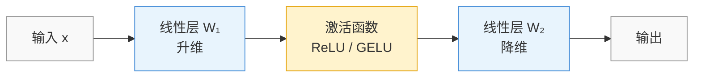
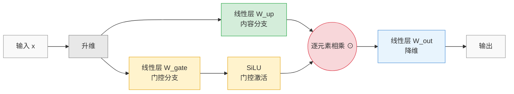

<iframe src="https://player.bilibili.com/player.html?aid=116859986777674&bvid=BV1yGMc6aEU6&cid=39639518324&page=1&autoplay=0" scrolling="no" border="0" frameborder="no" framespacing="0" allow="fullscreen; picture-in-picture" allowfullscreen="true" style="height:100%;width:100%; aspect-ratio: 16 / 9;"> </iframe>

## 简介

这期视频梳理了深度学习激活函数的完整迭代路线——从最古老的 Sigmoid、Tanh，到统治 CNN 时代的 ReLU，再到现在 LLaMA、Qwen、DeepSeek 等大模型全面采用的 SwiGLU。核心问题是：每一代激活函数解决了什么问题，又引入了什么新问题？

---

# 一、激活函数迭代全路线

## 1. Sigmoid（S 型激活函数）

### 1.1 直觉理解

Sigmoid 是神经网络早期最经典的激活函数。1838 年由比利时数学家 Verhulst 提出，1986 年被广泛用于神经网络反向传播。

**公式：**

$$\sigma(x) = \frac{1}{1 + e^{-x}}$$

- 输出范围：$(0, 1)$，非常适合**二分类**输出层
- 导数形式简洁：$\sigma'(x) = \sigma(x) \cdot (1 - \sigma(x))$，即"自己乘上 1 减自己"

### 1.2 致命缺陷：梯度消失

Sigmoid 导数最大值仅 **0.25**。在反向传播中，每一层梯度都要乘上一个 ≤0.25 的因子：

| 网络层数 | 梯度衰减（最坏情况） |
|:--:|:--:|
| 10 层 | $0.25^{10} \approx 9.5 \times 10^{-7}$ |
| 20 层 | $0.25^{20} \approx 9.1 \times 10^{-13}$ |

早期的浅层网络（几层到十几层）勉强能训练，但网络变深后，梯度指数级衰减，深层参数几乎无法更新。

---

## 2. Tanh（双曲正切）

### 2.1 直觉理解

Tanh 可以看作**以零为中心的 Sigmoid 改进版**。

**公式：**

$$\tanh(x) = \frac{e^x - e^{-x}}{e^x + e^{-x}}$$

| 对比维度 | Sigmoid | Tanh |
|:--|:--|:--|
| 输出范围 | $(0, 1)$ | $(-1, 1)$ |
| 中心点 | 0.5（正偏置） | 0（零中心） |
| 导数最大值 | 0.25 | **1** |
| 梯度衰减（10 层） | $0.25^{10}$ | $1^{10} = 1$（正向区） |

### 2.2 改进点

- **零中心**：Sigmoid 输出恒正，导致梯度更新方向一致（Zig-Zag 震荡）；Tanh 输出有正有负，训练更稳定
- **导数更大**：最大值从 0.25 提升到 1，浅层网络梯度消失大幅缓解
- 曾一度是 CNN、RNN、LSTM 的首选激活函数

### 2.3 仍未根治的问题

Tanh 导数最大值也只是 **1**，深层网络反向传播中依然会指数级衰减。网络超过几十层后，训练依然会停滞。

---

## 3. ReLU（线性修正单元）

### 3.1 直觉理解

ReLU 的公式简单到粗暴——大于零原样输出，小于零直接置零。

**公式：**

$$\text{ReLU}(x) = \max(0, x)$$

### 3.2 为什么 ReLU 成为革命性突破

- **运算极快**：只需一个 `max(0, x)` 比较，远超 Sigmoid/Tanh 的指数运算，大幅降低算力消耗
- **彻底解决梯度消失**：当 $x > 0$ 时，导数恒为 **1**，反向传播时梯度永不衰减
- **稀疏激活**：负半轴全部为 0，网络中只有部分神经元被激活，天然具备稀疏性

> 雏形在 1969 年就已出现，但直到 **2012 年 AlexNet** 使用 ReLU 训练深度卷积网络，才真正引爆了深度学习革命。从此 ReLU 成为 CNN 和深度网络的标配。

### 3.3 新问题：神经元死亡

**死神经元（Dead Neuron）**：如果参数更新导致某个神经元输入长期小于零，该神经元的梯度永远为 0，参数永远不再更新，等同于永久"死亡"。

此外，ReLU 在负区间**完全截断**梯度，意味着负数包含的信息被直接丢弃——但负数本身也是一种信息。

---

## 4. SiLU / Swish（Sigmoid 门控线性单元）

### 4.1 直觉理解

SiLU 是 Sigmoid 和 ReLU 的结合体：用 Sigmoid 作为**门控开关**，控制信息通过的比例。

**公式：**

$$\text{SiLU}(x) = x \cdot \sigma(x)$$

其中 $\sigma(x)$ 就是 Sigmoid 函数，它是一个 $(0, 1)$ 区间的门：

$$
\begin{aligned}
x = 3 &\implies \sigma(3) \approx 0.95 \implies \text{输出} \approx 2.85 \quad \text{（几乎原样通过）} \\[4pt]
x = -3 &\implies \sigma(-3) \approx 0.05 \implies \text{输出} \approx -0.15 \quad \text{（保留少量负信息）}
\end{aligned}
$$

### 4.2 解决了什么

- **不再硬截断**：负区间保留少量梯度信息，缓解神经元死亡问题
- **全程光滑可导**：不像 ReLU 在 $x = 0$ 处不可导
- **非单调**：在负区间有一个微小的"凹陷"，允许部分负数信号通过

> YOLO 系列模型中广泛使用 SiLU 作为激活函数。

---

## 5. GELU（高斯误差线性单元）

### 5.1 直觉理解

GELU 和 SiLU 思路类似，但门控函数从 Sigmoid 换成了**标准正态分布的累积分布函数（CDF）** $\Phi(x)$。

**公式：**

$$\text{GELU}(x) = x \cdot \Phi(x)$$

### 5.2 什么是 $\Phi(x)$？

$\Phi(x)$ 是标准正态分布从 $-\infty$ 到当前点 $x$ 的**积分面积**：

- $x$ 越大 → 覆盖的面积越大 → $\Phi(x)$ 越接近 1
- $x$ 越小 → 覆盖的面积越小 → $\Phi(x)$ 越接近 0

同样起到门控作用：当 $x$ 为正时"放行"，当 $x$ 为负时"抑制但不断绝"。

| 对比 | SiLU（Sigmoid 门控） | GELU（正态 CDF 门控） |
|:--|:--|:--|
| 门控函数 | $\sigma(x)$ | $\Phi(x)$ |
| 负区间保留 | 稍多 | 稍少 |
| 应用场景 | YOLO 系列 | 早期 BERT、GPT |

---

## 6. SwiGLU（Swish 门控线性单元）

### 6.1 和之前所有激活函数的本质区别

Sigmoid、Tanh、ReLU、SiLU、GELU 都是"**输入一个数，输出一个数**"——对单个特征做逐元素激活。

SwiGLU 不同：它更像是 **FFN（前馈网络）层的结构改造**，而非单纯的激活函数替换。

### 6.2 传统 FFN vs SwiGLU

**传统 FFN 流程：**



一条直线走到底：升维 → 激活 → 降维，激活函数只对单个特征做「通过 or 截断」的二元决策。

**SwiGLU 流程：**



拆成两条路：内容分支负责「生成特征」，门控分支负责「评估重要性」，两者逐元素相乘后，由门控决定每个特征**通过多少**。

用两个**不同的参数矩阵**分别生成两条分支：
- **内容分支**（$W_{\text{up}}$）：负责提取特征内容
- **门控分支**（$W_{\text{gate}}$ + SiLU）：负责评估每个特征的重要性，起到门控开关作用

数学表达：

$$\text{SwiGLU}(x) = (xW_{\text{gate}} \cdot \text{SiLU}(xW_{\text{up}})) \cdot W_{\text{out}}$$

### 6.3 为什么更强

打个比方：

- **传统 ReLU / GELU**：每个特征自己决定"我要不要保留"，像独裁决策
- **SwiGLU**：单独训练一个门控分支来独立判断"这个特征重不重要"，像**双人复核制**

假设内容分支输出特征值 10（很强的特征），但门控分支给它打分 0.1（不重要），相乘后只剩 1——模型虽然有这个特征，但门控判断它不应通过。这种**动态特征筛选**让模型具备了更精细的表达控制能力。

### 6.4 当前应用

LLaMA、Qwen、DeepSeek 等几乎所有主流大模型的 FFN 层都全面采用了 SwiGLU。

---

# 二、总结对比

## 1. 迭代脉络

```
Sigmoid ──→ Tanh ──→ ReLU ──→ SiLU ──→ GELU ──→ SwiGLU
   │          │        │        │         │          │
   │          │        │        │         │          │
 梯度消失   缓解但   根治但   门控+    门控+     双分支+
 严重      未根治   死神经元  光滑     正态分布   动态筛选
```

| 激活函数 | 年代 | 核心创新 | 解决的问题 | 引入的/残留的问题 |
|:--|:--|:--|:--|:--|
| Sigmoid | 1838/1986 | 首次用于 BP 网络 | S 形非线性映射 | 梯度消失（导数 ≤0.25） |
| Tanh | 1990s | 零中心化 | 输出偏置问题 | 梯度消失未根除（导数 ≤1） |
| ReLU | 1969/2012 | 正区间梯度恒为 1 | 深层梯度消失 | 神经元死亡、负信息丢失 |
| SiLU | 2017 | Sigmoid 门控平滑过渡 | ReLU 硬截断问题 | 计算量略高于 ReLU |
| GELU | 2016 | 正态分布 CDF 门控 | 概率化门控 | 计算复杂、负区间保留少 |
| SwiGLU | 2020 | 双分支门控结构 | 从"单特征自决"升级为"独立门控筛选" | 参数量和计算量翻倍 |

---

## 2. 一个搞笑的尾声

SwiGLU 论文的作者在结尾坦言：**这些架构到底为什么这么有效，他们也没有完整的理论解释**，甚至说"这一切都归功于神的恩赐"。

这其实也是深度学习领域的一个真实写照——很多设计在实践中效果卓越，但理论解释往往滞后于工程实践。

---

*来源：[B站 - 算法魔法师《激活函数迭代史：SwiGLU 到底强在哪？》](https://www.bilibili.com/video/BV1yGMc6aEU6/)*
