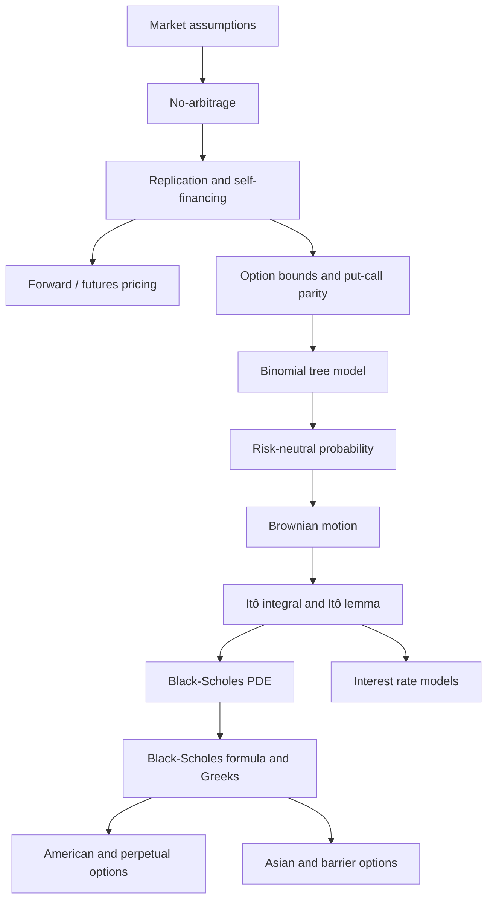

> [!info] 来源文件
> 本整理覆盖 `/Users/xuji/Documents/obsidian/AMA535A-Mathematical Models of Derivative Pricing` 下的 26 份笔记，包括 12 份 slide、13 份 tutorial answer 和 1 份 slides summary。  
> 课程主线是：**无套利与复制组合 $\rightarrow$ 利率和债券 $\rightarrow$ forward/futures $\rightarrow$ option bounds $\rightarrow$ binomial tree $\rightarrow$ Brownian motion/Itô calculus $\rightarrow$ Black-Scholes PDE/公式 $\rightarrow$ exotic options $\rightarrow$ interest rate models**。

---

## 1. 课程主线

AMA535A 是衍生品定价的数学模型课。它真正想训练的是一种定价思维：

1. **先定义市场规则**：允许 long/short、构造 portfolio、假设 frictionless market、无 bid-ask spread、无套利。
2. **再用复制组合定价**：如果一个组合能复制衍生品 payoff，它们现在必须同价。
3. **离散时间用 binomial tree**：通过 risk-neutral probability 和 backward induction 得到 option price。
4. **连续时间用 stochastic calculus**：用 Brownian motion、Itô integral、Itô lemma 描述资产随机运动。
5. **Black-Scholes 框架**：用 delta hedging 消除随机项，推导 PDE，再得到 closed-form formula。
6. **扩展到复杂产品**：American options、perpetual American put、Asian options、barrier options。
7. **扩展到底层为利率**：Vasicek、CIR、Ho-Lee、Hull-White、BDT 等 term structure models。

> [!tip] 抓主线
> 这门课所有模型都在回答同一个问题：**在无套利市场里，怎样把未来不确定 payoff 转换成今天唯一合理的价格？**

---

## 2. 文件地图

| 文件 | 主题 | 重点 |
|---|---|---|
| slide00：Subject Description.md | 课程说明 | 学习目标、assessment、syllabus、参考书 |
| slide01：introduction Financial Asset & Financial Market.md | 金融资产与衍生品简介 | debt、equity、derivative、hedging/speculation/arbitrage |
| slide02：Market Rule & Assumption.md | 市场规则与假设 | short sale、portfolio value、arbitrage、frictionless market |
| slide03：interest Rate & Bond.md | 利率与债券 | simple/compound/continuous compounding、zero rate、bootstrap、forward rate、short rate |
| slide04.md | Forward contract & futures contract | forward price、dividend adjustment、forward value、futures daily settlement |
| slide05.md | Options introduction | call/put、European/American、payoff、moneyness、time value |
| slide06.md | No-arbitrage option properties | option bounds、strike spread、put-call parity、Merton theorem、American bounds |
| slide07.md | Binomial tree model | replicating portfolio、risk-neutral probability、European/American backward induction、volatility matching |
| slide08.md | Brownian motion & stochastic calculus | Brownian motion、Markov、martingale、stopping time、Itô integral、Itô lemma、GBM |
| slide09.md | Black-Scholes model | self-financing、delta hedging、BS PDE、BS formula、Greeks、risk-neutral valuation、perpetual American put |
| slide10.md | Other options | Asian options、path-dependent PDE、geometric Asian、barrier options、reflection principle |
| slide11.md | Interest rate model | Vasicek、CIR、Ho-Lee、Hull-White、BDT、bond option |
| slidesummery2.md | 课程公式摘要 | 关键公式、BS PDE、Itô、risk-neutral、barrier PDE |
| tutorial01ans.md | Tutorial 1 | 资产分类、portfolio value、arbitrage 判断 |
| tutorial02ans.md | Tutorial 2 | zero rates、forward rates、bond yield、bootstrap |
| tutorial03ans.md | Tutorial 3 | bond valuation、gold forward、dividend stock forward、bond arbitrage |
| tutorial04ans.md | Tutorial 4 | option moneyness、FX forward payoff、bond portfolio optimization、arbitrage proof |
| tutorial05ans.md | Tutorial 5 | put monotonicity、American option strike spread、put-call parity implied rate |
| tutorial06ans.md | Tutorial 6 | two-step binomial tree、American call/European put、early exercise probability |
| tutorial07ans.md | Tutorial 7 | four-step binomial tree、Brownian variance、normal moments |
| tutorial08ans.md | Tutorial 8 | exponential martingale、optional stopping、Itô integral mean/variance |
| tutorial09ans.md | Tutorial 9 | Itô isometry、stochastic integral variance、correlated Brownian motions、CIR expectation |
| tutorial10ans.md | Tutorial 10 | Itô lemma practice、quadratic variation、martingale ODE、Gaussian stochastic integral |
| tutorial11ans.md | Tutorial 11 | martingale via Itô、quotient process、comparison-style argument、bivariate Itô |
| tutorial12ans.md | Tutorial 12 | Black-Scholes pricing、binomial approximation、BS PDE verification、Greek hedging |
| tutorial13ans.md | Tutorial 13 | perpetual American put、reflection principle、shifted Brownian motion |

---

## 3. Market Rules、Arbitrage 与 Portfolio

### 3.1 Financial assets

| 类型 | 定义 | 例子 |
|---|---|---|
| Debt | 借款人承诺未来支付固定或约定现金流 | bond、mortgage、loan |
| Equity | 对公司的所有权和剩余索取权 | common stock |
| Derivative | 价值来自 underlying asset 的金融合约 | forward、future、option、swap、convertible bond embedded option |

Derivative 的用途：

- **Hedging**：降低或消除已有风险。
- **Speculation**：主动承担风险以追求收益。
- **Arbitrage**：利用价格不一致锁定无风险利润。
- **Asset transformation**：不直接买卖 underlying，也能改变 portfolio 的风险收益形态。

### 3.2 Short sale

Short sale 是借入资产后立刻卖出，未来再买回归还。若价格下跌，short seller 获利；若价格上涨，short seller 亏损。

在衍生品定价中，允许 short sale 很重要，因为复制组合和套利组合经常需要同时 long 一些资产、short 另一些资产。

### 3.3 Portfolio value

Portfolio 是一组 long/short positions 的集合，可以是 static，也可以是 dynamic。Portfolio value 是转让该 portfolio 所需金额，可以为正、负或零。

一般写成：

$$
\Pi(t)=\sum_{i=1}^n N_i(t)S_i(t)
$$

其中 $N_i(t)$ 是第 $i$ 个资产持仓数量，$S_i(t)$ 是资产价格。

### 3.4 Arbitrage opportunity

在时间区间 $[t,T]$ 上，一个 portfolio 是 arbitrage opportunity，如果：

$$
\Pi(t)=0
$$

$$
\Pi(T)\geq 0 \quad \text{a.s.}
$$

$$
\mathbb{P}\left(\Pi(T)>0\right)>0
$$

也就是：**零成本、无亏损、正概率赚钱**。

> [!important] 无套利思想
> 如果两个 portfolio 的未来 payoff 在所有状态下都一样，则它们今天价值必须一样。否则买便宜、卖昂贵，就能构造套利。

### 3.5 Key market assumptions

| 假设 | 含义 | 为什么需要 |
|---|---|---|
| Arbitrage-free | 市场不存在套利机会 | 保证价格关系唯一、可推导 |
| Well-informed investors | 信息快速被市场参与者使用 | 套利机会会被迅速消除 |
| Frictionless market | 无交易成本、无税、资产可无限分割 | 简化复制和动态交易 |
| No bid-ask spread | 买价等于卖价 | 不用处理流动性摩擦 |
| Short selling allowed | 可以卖空资产 | 构造复制/套利组合 |

---

## 4. Interest、Bond、Zero Curve 与 Forward Rate

### 4.1 Simple interest

Simple interest 只基于本金计算：

$$
\mathrm{Simple\ Interest}
=
\mathrm{Principal}\times r\times T
$$

适用于短期、单期、不会利滚利的场景。

### 4.2 Discrete compounding

若 APR 为 $r$，一年复利 $m$ 次，投资 $M$ 一年后的价值为：

$$
M\left(1+\frac{r}{m}\right)^m
$$

$n$ 年后：

$$
M\left(1+\frac{r}{m}\right)^{mn}
$$

Effective annual rate：

$$
\mathrm{EAR}
=
\left(1+\frac{\mathrm{APR}}{m}\right)^m-1
$$

### 4.3 Continuous compounding

当复利频率趋向无穷：

$$
M(t)=M(0)e^{rt}
$$

连续复利下：

$$
\mathrm{EAR}=e^{\mathrm{APR}}-1
$$

连续复利是衍生品定价中最常用的利率表达方式，因为它和指数贴现、SDE、Black-Scholes 公式自然匹配。

### 4.4 Zero-coupon bond and zero rate

若面值为 $F$、到期为 $t$ 年的 zero-coupon bond 当前价格为 $P$，连续复利 zero rate $R_t$ 满足：

$$
Pe^{tR_t}=F
$$

所以：

$$
R_t=\frac{1}{t}\ln\left(\frac{F}{P}\right)
$$

面值为 1 的 zero-coupon bond price：

$$
P_t=e^{-tR_t}
$$

### 4.5 Bootstrap method

实际市场中不是每个 maturity 都有 zero-coupon bond，因此要用 coupon bond 价格逐步 bootstrap zero rates：

1. 用最短期限 zero-coupon bond 算短端 zero rate。
2. 用已知短端 zero rates 折现 coupon bond 的早期现金流。
3. 剩余未知项解出更长期 zero rate。

对 coupon bond：

$$
P=\sum_{i=1}^{n} C_i e^{-R_{t_i}t_i}
$$

若只有最后一个 $R_{t_n}$ 未知，就可以从 bond price 反推出。

### 4.6 Bond yield

Coupon rate：

$$
\mathrm{Coupon\ Rate}
=
\frac{\mathrm{Annual\ Coupon}}{\mathrm{Face\ Value}}
$$

Current yield：

$$
\mathrm{Current\ Yield}
=
\frac{\mathrm{Annual\ Coupon}}{\mathrm{Bond\ Price}}
$$

Yield-to-maturity 是使所有现金流现值等于债券价格的折现率：

$$
P=\sum_{i=1}^{n} C_i e^{-yt_i}
$$

### 4.7 Forward rate

若 $R_s,R_t$ 是连续复利 zero rates，$R_{s,t}$ 是从 $s$ 到 $t$ 的 forward rate，则：

$$
e^{sR_s}e^{(t-s)R_{s,t}}=e^{tR_t}
$$

因此：

$$
R_{s,t}
=
\frac{tR_t-sR_s}{t-s}
$$

### 4.8 Short rate

Instantaneous forward rate 或 short rate：

$$
r_t=\lim_{s\to t}R_{s,t}=R_t+tR_t'
$$

因为：

$$
P_t=e^{-tR_t}
$$

所以：

$$
r_t
=
R_t+tR_t'
=
-(\ln P_t)'
=
-\frac{P_t'}{P_t}
$$

反过来：

$$
R_t=\frac{1}{t}\int_0^t r_s\,ds
$$

$$
P_t=e^{-\int_0^t r_s\,ds}
$$

若 short rate 随机，则风险中性世界下 zero-coupon bond price：

$$
P(t,T)
=
\mathbb{E}^{\mathbb{Q}}
\left[
e^{-\int_t^T r_s\,ds}
\right]
$$

---

## 5. Forward Contracts 与 Futures Contracts

### 5.1 Forward payoff

Forward contract 是双方约定未来以 delivery price $K$ 买卖 underlying asset。

Long forward 到期 payoff：

$$
S_T-K
$$

Short forward 到期 payoff：

$$
K-S_T
$$

Forward 在签约时通常没有现金交换，因此初始价值为 0。

### 5.2 Forward price: no dividend

无股息股票，当前价格 $S$，连续复利无风险利率 $r$，期限 $t$，forward price：

$$
F=Se^{rt}
$$

若市场报价 $F>Se^{rt}$：

1. 借 $S$。
2. 买入股票。
3. Short forward。
4. 到期交割股票，收到 $F$，偿还 $Se^{rt}$，套利利润 $F-Se^{rt}$。

若 $F<Se^{rt}$，反向操作。

### 5.3 Forward price: with dividends

若股票在 $[0,t]$ 内支付 dividend，且 dividend 在到期 $t$ 的未来价值为 $D$，则：

$$
F=Se^{rt}-D
$$

若用 dividend 的现值 $I$ 表示，则：

$$
F=(S-I)e^{rt}
$$

直觉：forward long 不获得到期前 dividend，所以 dividend value 要从 spot carry 中扣掉。

### 5.4 Value of a forward contract

设当前 forward price 为 $F$，合约 delivery price 为 $K$，剩余期限为 $t$。Long forward 当前价值：

$$
f=(F-K)e^{-rt}
$$

无股息时：

$$
f=S-Ke^{-rt}
$$

有 dividend future value $D$ 时：

$$
f=S-De^{-rt}-Ke^{-rt}
$$

若用 dividend present value $I$：

$$
f=S-I-Ke^{-rt}
$$

### 5.5 Futures contract

Futures contract 与 forward 类似，但有三个关键区别：

| 项目 | Forward | Futures |
|---|---|---|
| 市场 | OTC | Exchange |
| 条款 | 私人定制 | 标准化 |
| 结算 | 到期一次结算 | Daily mark-to-market |
| 信用风险 | 较高 | Clearing house 降低信用风险 |
| 流动性 | 较低 | 较高 |

Futures 到期时价格必须收敛到 spot：

$$
F_T=S_T
$$

否则可通过买低卖高套利。

---

## 6. Option Basics 与 No-Arbitrage Properties

### 6.1 Option definitions

| 类型 | 权利 |
|---|---|
| Call option | 以 strike price $K$ 买入 underlying |
| Put option | 以 strike price $K$ 卖出 underlying |
| European option | 只能在 maturity $T$ 行权 |
| American option | 可在 $[0,T]$ 任意时间行权 |

Option buyer 支付 premium，获得权利；option writer 收取 premium，承担义务。

### 6.2 Payoff functions

European call payoff：

$$
(S_T-K)^+=\max(S_T-K,0)
$$

European put payoff：

$$
(K-S_T)^+=\max(K-S_T,0)
$$

其中：

$$
x^+=\max(x,0),\qquad x^-=\max(-x,0)
$$

### 6.3 Moneyness

| 情况 | Call | Put |
|---|---|---|
| $S>K$ | ITM | OTM |
| $S=K$ | ATM | ATM |
| $S<K$ | OTM | ITM |

Intrinsic value 是立即行权的价值；time value 是 option price 超过 intrinsic value 的部分。

### 6.4 European call upper bound

European call 价格满足：

$$
C_E(t)<S_t
$$

若 $C_E(t)\geq S_t$，则可 short call、long stock、long cash 构造套利。

### 6.5 Strike spread bounds

若 $0<K_1<K_2$，European calls 满足：

$$
0<C_E(t,K_1)-C_E(t,K_2)
<
(K_2-K_1)e^{-r(T-t)}
$$

European puts 满足：

$$
0<P_E(t,K_2)-P_E(t,K_1)
<
(K_2-K_1)e^{-r(T-t)}
$$

直觉：

- Call strike 越高越便宜。
- Put strike 越高越贵。
- 价格差不能超过 strike 差的贴现值，否则可构造 vertical spread arbitrage。

### 6.6 Put-call parity with dividend

若 stock 在 $[t,T]$ 支付 dividend，且 dividend 在 $T$ 的 value 为 $D$，则：

$$
C_E(t,K)+Ke^{-r(T-t)}
=
S_t-De^{-r(T-t)}+P_E(t,K)
$$

无 dividend 时：

$$
C_E(t,K)+Ke^{-r(T-t)}
=
S_t+P_E(t,K)
$$

等价写法：

$$
C_E(t,K)-P_E(t,K)=S_t-Ke^{-r(T-t)}
$$

### 6.7 American options

American option 至少值其 immediate exercise payoff：

$$
C_A(t)\geq (S_t-K)^+
$$

$$
P_A(t)\geq (K-S_t)^+
$$

无 dividend 的 American call 满足 Merton theorem：

$$
C_A(t)=C_E(t)
$$

也就是：无 dividend 情况下，American call 不应提前行权。

American put 一般可能提前行权，因此通常：

$$
P_A(t)\geq P_E(t)
$$

American put 上界：

$$
P_A(t)<K
$$

American strike spread bounds：

$$
0<C_A(t,K_1)-C_A(t,K_2)<K_2-K_1
$$

$$
0<P_A(t,K_2)-P_A(t,K_1)<K_2-K_1
$$

---

## 7. Binomial Tree Model

### 7.1 One-step binomial setup

当前 stock price 为 $S$。一个时间步 $\Delta t$ 后：

$$
S_{\Delta t}=
\begin{cases}
Su, & \text{up state},\\
Sd, & \text{down state}.
\end{cases}
$$

到期 option value 为 $f_u,f_d$。

构造 portfolio：long $\Delta$ shares，long cash $\varepsilon$，short one option。无套利要求两种状态下 payoff 为 0：

$$
\varepsilon e^{r\Delta t}+Su\Delta-f_u=0
$$

$$
\varepsilon e^{r\Delta t}+Sd\Delta-f_d=0
$$

解得：

$$
\Delta=\frac{f_u-f_d}{S(u-d)}
$$

$$
\varepsilon=e^{-r\Delta t}
\frac{uf_d-df_u}{u-d}
$$

Option price：

$$
f=S\Delta+\varepsilon
$$

### 7.2 Risk-neutral probability

将上式整理为：

$$
f=e^{-r\Delta t}
\left(
pf_u+(1-p)f_d
\right)
$$

其中：

$$
p=\frac{e^{r\Delta t}-d}{u-d}
$$

$p$ 是 risk-neutral probability，不是真实世界概率，而是让 stock 的贴现价格成为 martingale 的定价概率。

在 risk-neutral world：

$$
e^{-r\Delta t}\mathbb{E}^{\mathbb{Q}}[S_{\Delta t}]=S
$$

以及：

$$
f=e^{-r\Delta t}\mathbb{E}^{\mathbb{Q}}[f(S_{\Delta t})]
$$

### 7.3 Two-step binomial tree

最终节点 values 为 $f_{uu},f_{ud},f_{dd}$。向后递推：

$$
f_u=e^{-r\Delta t}
\left(
pf_{uu}+(1-p)f_{ud}
\right)
$$

$$
f_d=e^{-r\Delta t}
\left(
pf_{ud}+(1-p)f_{dd}
\right)
$$

初始价格：

$$
f=e^{-r\Delta t}
\left(
pf_u+(1-p)f_d
\right)
$$

闭式写法：

$$
f=e^{-2r\Delta t}
\left[
p^2f_{uu}
+2p(1-p)f_{ud}
+(1-p)^2f_{dd}
\right]
$$

### 7.4 Multi-step European option

对于 $n$ 步 tree，$\Delta t=T/n$，European option 价格为：

$$
f=e^{-rT}
\sum_{k=0}^{n}
\binom{n}{k}
p^k(1-p)^{n-k}
f_{u^kd^{n-k}}
$$

其中 $f_{u^kd^{n-k}}$ 是 $k$ 次 up、$n-k$ 次 down 后节点的 payoff。

### 7.5 American option backward induction

American option 每个节点要比较 continuation value 与 immediate exercise value。

若 payoff function 为 $\varphi(S)$，则：

$$
f_u=
\max
\left\{
\varphi(Su),
e^{-r\Delta t}
\left(
pf_{uu}+(1-p)f_{ud}
\right)
\right\}
$$

$$
f_d=
\max
\left\{
\varphi(Sd),
e^{-r\Delta t}
\left(
pf_{ud}+(1-p)f_{dd}
\right)
\right\}
$$

$$
f=
\max
\left\{
\varphi(S),
e^{-r\Delta t}
\left(
pf_u+(1-p)f_d
\right)
\right\}
$$

若定义：

$$
\alpha=e^{-r\Delta t}p,\qquad
\beta=e^{-r\Delta t}(1-p)
$$

则递推更简洁：

$$
f=\max\{\varphi(S),\alpha f_u+\beta f_d\}
$$

### 7.6 Matching volatility

为了让 binomial tree 匹配 stock volatility，常设：

$$
ud=1
$$

并令：

$$
u=e^{\sigma\sqrt{\Delta t}},
\qquad
d=e^{-\sigma\sqrt{\Delta t}}
$$

于是：

$$
p=
\frac{e^{r\Delta t}-e^{-\sigma\sqrt{\Delta t}}}
{e^{\sigma\sqrt{\Delta t}}-e^{-\sigma\sqrt{\Delta t}}}
$$

---

## 8. Brownian Motion 与 Stochastic Calculus

### 8.1 Standard Brownian motion

标准 Brownian motion $B_t$ 在概率空间 $(\Omega,\mathcal{F},\mathbb{P})$ 上满足：

1. $B_0=0$。
2. 样本路径连续。
3. Stationary increments：

$$
B_t-B_s\sim N(0,t-s)
\quad
\text{for } t>s
$$

4. Independent increments：不重叠时间区间上的增量相互独立。

因此：

$$
\mathbb{E}[B_t]=0
$$

$$
\mathrm{Var}(B_t)=t
$$

$$
\mathrm{Cov}(B_s,B_t)=\min(s,t)
$$

### 8.2 Markov property

Markov property 表示：预测未来只需要当前状态，不需要完整历史。

Brownian motion 是 Markov process。

### 8.3 Martingale

过程 $X_t$ 是 martingale，如果：

$$
\mathbb{E}\left[\lvert X_t\rvert\right]<\infty
$$

且对 $s<t$：

$$
\mathbb{E}[X_t\mid\mathcal{F}_s]=X_s
$$

直觉：在当前信息下，未来条件期望等于现在值，是“公平游戏”。

### 8.4 Exponential martingale

对任意常数 $a$：

$$
M_t=e^{aB_t-\frac{1}{2}a^2t}
$$

是 martingale。

这个工具在 tutorial 中用于 optional stopping 和 hitting time 相关计算。

### 8.5 Stopping time 与 optional stopping

随机时间 $\tau$ 是 stopping time，如果“$\tau$ 是否已经发生”只依赖当前及过去信息。

Doob optional stopping theorem：若 $X_t$ 是 martingale，$\tau$ 满足有界或 stopped process 有界等条件，则：

$$
\mathbb{E}[X_\tau]=X_0
$$

它常用于 hitting time、first passage time 的期望计算。

### 8.6 Itô integral

对适当 square-integrable adapted process $f$：

$$
\int_0^T f(t)\,dB_t
$$

是 stochastic integral。

关键性质：

$$
\mathbb{E}
\left[
\int_u^T f(s)\,dB_s
\mid
\mathcal{F}_u
\right]
=0
$$

Itô isometry：

$$
\mathbb{E}
\left[
\left(
\int_0^T f(t)\,dB_t
\right)^2
\right]
=
\int_0^T
\mathbb{E}[f^2(t)]\,dt
$$

条件版本：

$$
\mathbb{E}
\left[
\int_u^T f(s)\,dB_s
\int_u^T g(s)\,dB_s
\mid
\mathcal{F}_u
\right]
=
\int_u^T
\mathbb{E}[f(s)g(s)\mid\mathcal{F}_u]\,ds
$$

### 8.7 Itô process

Itô process：

$$
X_t
=
X_0+\int_0^t b(s)\,ds+\int_0^t\sigma(s)\,dB_s
$$

微分形式：

$$
dX_t=b(t)\,dt+\sigma(t)\,dB_t
$$

Quadratic variation：

$$
d\langle X\rangle_t=\lvert\sigma(t)\rvert^2\,dt
$$

若 drift 恒为 0，则 Itô process 是 martingale：

$$
dX_t=\sigma(t)\,dB_t
\quad\Longrightarrow\quad
X_t \text{ is a martingale}
$$

### 8.8 Itô lemma

若：

$$
dX_t=b(t)\,dt+\sigma(t)\,dB_t
$$

且 $\varphi(t,x)$ 足够光滑，则：

$$
d\varphi(t,X_t)
=
\varphi_t(t,X_t)\,dt
+\varphi_x(t,X_t)\,dX_t
+\frac{1}{2}\varphi_{xx}(t,X_t)\,d\langle X\rangle_t
$$

代入 $dX_t$ 后：

$$
d\varphi(t,X_t)
=
\left[
\varphi_t
+b\varphi_x
+\frac{1}{2}\sigma^2\varphi_{xx}
\right]dt
+\sigma\varphi_x\,dB_t
$$

### 8.9 Product rule

对两个 Itô processes：

$$
d(X_tY_t)
=
Y_t\,dX_t
+X_t\,dY_t
+d\langle X,Y\rangle_t
$$

若两个过程由相关 Brownian motions 驱动，且：

$$
dX_t=b_1(t)\,dt+\sigma_1(t)\,dB_t
$$

$$
dY_t=b_2(t)\,dt+\sigma_2(t)\,d\bar{B}_t
$$

$$
d\langle B,\bar{B}\rangle_t=\rho_t\,dt
$$

则：

$$
d\langle X,Y\rangle_t
=
\rho_t\sigma_1(t)\sigma_2(t)\,dt
$$

### 8.10 Geometric Brownian motion

Black-Scholes 中 stock price 服从：

$$
dS_t=\mu S_t\,dt+\sigma S_t\,dB_t
$$

解为：

$$
S_t=S_0
\exp
\left[
\left(\mu-\frac{1}{2}\sigma^2\right)t
+\sigma B_t
\right]
$$

因此：

$$
\ln S_t
=
\ln S_0+
\left(\mu-\frac{1}{2}\sigma^2\right)t
+\sigma B_t
$$

即 log price 正态，price 对数正态。

---

## 9. Black-Scholes Model

### 9.1 Black-Scholes assumptions

Black-Scholes framework 假设：

- no arbitrage；
- frictionless market；
- continuous trading；
- short selling allowed；
- borrowing/lending at constant risk-free rate $r$；
- stock follows GBM；
- volatility $\sigma$ constant；
- 课程中通常假设无 dividend。

Stock dynamics：

$$
dS_t=\mu S_t\,dt+\sigma S_t\,dB_t
$$

### 9.2 Self-financing portfolio

Portfolio value：

$$
\Pi(t)=\sum_{i=1}^n N_i(t)S_i(t)
$$

Self-financing 表示没有额外现金流进出，portfolio value 的变化只来自 asset price changes：

$$
d\Pi(t)=\sum_{i=1}^n N_i(t)\,dS_i(t)
$$

### 9.3 Delta hedging and BS PDE

设 European option value 为 $V(t,S_t)$。构造 portfolio：long $\Delta_t$ shares，short one option，剩余为 cash。

选择：

$$
\Delta_t=V_x(t,S_t)
$$

即可消除随机项。无套利要求确定性收益不能产生免费午餐，得到 Black-Scholes PDE：

$$
V_t(t,x)
+\frac{1}{2}\sigma^2x^2V_{xx}(t,x)
+rxV_x(t,x)
-rV(t,x)
=0
$$

对 European call：

$$
\begin{cases}
C_t+\frac{1}{2}\sigma^2x^2C_{xx}+rxC_x-rC=0,\\
C(T,x)=(x-K)^+.
\end{cases}
$$

对 European put：

$$
\begin{cases}
P_t+\frac{1}{2}\sigma^2x^2P_{xx}+rxP_x-rP=0,\\
P(T,x)=(K-x)^+.
\end{cases}
$$

### 9.4 Black-Scholes formula

设 $\tau=T-t$。European call：

$$
C_E(t,x)
=
xN(d_1)
-Ke^{-r\tau}N(d_2)
$$

European put：

$$
P_E(t,x)
=
Ke^{-r\tau}N(-d_2)
-xN(-d_1)
$$

其中：

$$
d_1
=
\frac{\ln(x/K)+(r+\frac{1}{2}\sigma^2)\tau}
{\sigma\sqrt{\tau}}
$$

$$
d_2=d_1-\sigma\sqrt{\tau}
$$

等价于讲义写法：

$$
d_{1,2}
=
\frac{\ln(x)-\ln(Ke^{-r\tau})}
{\sigma\sqrt{\tau}}
\pm
\frac{1}{2}\sigma\sqrt{\tau}
$$

### 9.5 Risk-neutral valuation

在 risk-neutral world：

$$
dS_t=rS_t\,dt+\sigma S_t\,dB_t^{\mathbb{Q}}
$$

任意 European payoff $\varphi(S_T)$ 的价格：

$$
V(t,x)
=
e^{-r(T-t)}
\mathbb{E}^{\mathbb{Q}}
\left[
\varphi(S_T)\mid S_t=x
\right]
$$

在风险中性世界中：

$$
\ln S_T
=
\ln x+
\left(r-\frac{1}{2}\sigma^2\right)(T-t)
+\sigma(B_T^{\mathbb{Q}}-B_t^{\mathbb{Q}})
$$

这就是 Black-Scholes closed form 的概率基础。

### 9.6 Greeks

若 derivative value 为 $V(t,x)$：

| Greek | 定义 | 含义 |
|---|---|---|
| Delta | $\Delta=V_x$ | 对 stock price 的一阶敏感度 |
| Gamma | $\Gamma=V_{xx}$ | Delta 对 stock price 的敏感度 |
| Theta | $\Theta=V_t$ | 对时间的敏感度 |
| Rho | $\rho=V_r$ | 对 risk-free rate 的敏感度 |
| Vega | $\mathcal{V}=V_\sigma$ | 对 volatility 的敏感度 |

由 BS PDE：

$$
\Theta
+\frac{1}{2}\sigma^2x^2\Gamma
+rx\Delta
=
rV
$$

近似：

$$
V(t,x+\epsilon)-V(t,x)
\approx
\epsilon\Delta(t,x)
+\frac{1}{2}\epsilon^2\Gamma(t,x)
$$

### 9.7 Greek-neutral hedging

若当前 portfolio 的 Delta/Gamma 为 $\Delta_P,\Gamma_P$，加入资产 A、B，持仓 $x,y$，则：

$$
\Delta_{\mathrm{new}}
=
\Delta_P+x\Delta_A+y\Delta_B
$$

$$
\Gamma_{\mathrm{new}}
=
\Gamma_P+x\Gamma_A+y\Gamma_B
$$

令二者为 0，可解 linear system 得到 hedge positions。

---

## 10. American Options 与 Perpetual American Put

### 10.1 American option variational inequality

设 payoff 为 $\varphi(t,x)$，American option value 满足：

$$
\begin{cases}
\max\left\{
V_t+\frac{1}{2}\sigma^2x^2V_{xx}+rxV_x-rV,\,
\varphi-V
\right\}=0,\\
V(T,x)=\varphi(T,x).
\end{cases}
$$

解释：

- continuation region：满足 BS PDE；
- exercise region：$V=\varphi$；
- free boundary：两者交界处。

### 10.2 Perpetual American call

无 dividend 股票的 perpetual American call 不应行权：

$$
C_A^\infty(t)=C_E(t)
$$

没有 maturity 的 call 等待价值很高；无 dividend 时提前行权会损失 time value。

### 10.3 Perpetual American put properties

Vanilla perpetual American put：

$$
0<P_A^\infty(S)\leq K
$$

若某价格 $S$ 应行权，则所有更低价格 $S'<S$ 也应行权。因此存在 critical exercise boundary：

$$
S_e^*<K
$$

当：

$$
S\leq S_e^*
$$

应立即行权。

### 10.4 Perpetual American put value

讲义给出的 closed form：

$$
P_A^\infty(S)
=
\frac{\sigma^2}{2r}
\left(
\frac{2rK}{2r+\sigma^2}
\right)^{2r/\sigma^2+1}
S^{-2r/\sigma^2}
$$

Optimal exercise boundary：

$$
S_e^*
=
\frac{2rK}{2r+\sigma^2}
$$

Continuation region 中 ODE：

$$
\frac{1}{2}\sigma^2x^2
\frac{d^2P_A^\infty}{dx^2}
+rx\frac{dP_A^\infty}{dx}
-rP_A^\infty
=0,
\qquad x>S_e
$$

Exercise region：

$$
P_A^\infty(x)=K-x,
\qquad x\leq S_e
$$

Smooth-fit condition：

$$
\frac{dP_A^\infty}{dx}(S_e^*+)=-1
=
\frac{dP_A^\infty}{dx}(S_e^*-)
$$

---

## 11. Asian Options 与 Path-Dependent PDE

### 11.1 Asian option

Asian option payoff depends on average price，而不是只看 terminal price。

设 $A_T$ 是 $[0,T]$ 上平均价格。

Fixed strike：

$$
\text{Call payoff}=(A_T-K)^+
$$

$$
\text{Put payoff}=(K-A_T)^+
$$

Floating strike：

$$
\text{Call payoff}=(S_T-A_T)^+
$$

$$
\text{Put payoff}=(A_T-S_T)^+
$$

### 11.2 Averaging methods

离散算术平均：

$$
A_T=\frac{1}{n}\sum_{i=1}^n S_{t_i}
$$

离散几何平均：

$$
A_T=
\exp
\left(
\frac{1}{n}\sum_{i=1}^n \ln S_{t_i}
\right)
=
\left(
\prod_{i=1}^nS_{t_i}
\right)^{1/n}
$$

连续算术平均：

$$
A_T=\frac{1}{T}\int_0^T S_t\,dt
$$

连续几何平均：

$$
A_T=
\exp
\left(
\frac{1}{T}\int_0^T\ln S_t\,dt
\right)
$$

### 11.3 Path-dependent state variable

定义路径变量：

$$
I_t=\int_0^t f(u,S_u)\,du
$$

令 option value 为 $V(t,x,I)$。在风险中性世界：

$$
dS_t=rS_t\,dt+\sigma S_t\,dB_t^{\mathbb{Q}}
$$

且：

$$
dI_t=f(t,S_t)\,dt
$$

Path-dependent PDE：

$$
V_t
+\frac{1}{2}\sigma^2x^2V_{xx}
+rxV_x
-rV
+V_I f(t,x)
=0
$$

路径依赖通过额外项 $V_I f(t,x)$ 进入 PDE。

### 11.4 Continuously sampled Asian boundary conditions

连续算术平均中：

$$
f(t,x)=x,\qquad A_T=\frac{I_T}{T}
$$

Fixed-strike arithmetic Asian call：

$$
V(T,x,I)=\left(\frac{I}{T}-K\right)^+
$$

Fixed-strike arithmetic Asian put：

$$
V(T,x,I)=\left(K-\frac{I}{T}\right)^+
$$

连续几何平均中：

$$
f(t,x)=\ln x,\qquad
A_T=e^{I_T/T}
$$

Fixed-strike geometric Asian call：

$$
V(T,x,I)=\left(e^{I/T}-K\right)^+
$$

Fixed-strike geometric Asian put：

$$
V(T,x,I)=\left(K-e^{I/T}\right)^+
$$

### 11.5 Geometric Asian closed-form idea

连续几何平均有 closed form，因为积分的 log price 仍是 normal。

在 risk-neutral world：

$$
\xi
=
\int_t^T
\left(\ln S_u-\ln S_t\right)\,du
$$

满足：

$$
\xi\sim N(\bar{\mu},\bar{\sigma}^2)
$$

其中：

$$
\bar{\mu}
=
\frac{(2r-\sigma^2)(T-t)^2}{4}
$$

$$
\bar{\sigma}^2
=
\frac{\sigma^2(T-t)^3}{3}
$$

因此 geometric Asian 可以转化为对 lognormal-like payoff 的 normal integral。

---

## 12. Barrier Options 与 Reflection Principle

### 12.1 Barrier option

Barrier option 的 payoff 取决于 underlying 是否触碰 barrier。

Down-and-out call：若 stock price 在存续期内从未跌破 barrier $B$，到期支付 call payoff；否则 knock out，价值归零。

Payoff：

$$
(S_T-K)^+
\mathbf{1}_{\{\inf_{0\leq t\leq T}S_t>B\}}
$$

Down-and-in call：

$$
(S_T-K)^+
\mathbf{1}_{\{\inf_{0\leq t\leq T}S_t\leq B\}}
$$

Knock-in/knock-out parity：

$$
\text{Knock-out}+\text{Knock-in}
=
\text{Vanilla European}
$$

前提是 payoff、barrier、maturity 等条款一致。

### 12.2 Reflection principle

令：

$$
m_T=\min_{0\leq s\leq T}B_s
$$

若 $y<0$ 且 $y\leq x$：

$$
\mathbb{P}
\left(
B_T\geq x,\,
m_T\leq y
\right)
=
\mathbb{P}
\left(
B_T\leq 2y-x
\right)
$$

因此：

$$
\mathbb{P}
\left(
B_T\geq x,\,
m_T>y
\right)
=
\mathbb{P}
\left(
x\leq B_T\leq x-2y
\right)
$$

Reflection principle 是连续 barrier option closed form 的核心概率工具。

### 12.3 Down-and-out barrier PDE

令 $V(t,x)$ 是 down-and-out barrier option value。若 barrier 为 $B$，则解域是：

$$
(t,x)\in[0,T]\times(B,\infty)
$$

PDE：

$$
V_t
+\frac{1}{2}\sigma^2x^2V_{xx}
+rxV_x
-rV
=0
$$

Barrier boundary：

$$
V(t,B)=0
$$

Terminal condition：

$$
V(T,x)=\varphi(x),
\qquad x>B
$$

### 12.4 Down-and-out call formula

若 $C_{DO}(t,x,B,K)$ 是 down-and-out call，$C_E(t,x,K)$ 是 vanilla European call。

当 $B\leq K$：

$$
C_{DO}(t,x,B,K)
=
C_E(t,x,K)
-
\left(\frac{B}{x}\right)^{\frac{2r}{\sigma^2}-1}
C_E\left(t,\frac{B^2}{x},K\right)
$$

这个公式可以理解为：vanilla call 减去被 barrier 敲掉的 mirror term。

---

## 13. Interest Rate Models

### 13.1 Short-rate modeling

Zero-coupon bond price：

$$
P(t,T)
=
\mathbb{E}^{\mathbb{Q}}
\left[
e^{-\int_t^T r_s\,ds}
\right]
$$

Yield-to-maturity：

$$
R(t,T)
=
-\frac{1}{T-t}
\ln
\left(
\mathbb{E}^{\mathbb{Q}}
\left[
e^{-\int_t^T r_s\,ds}
\right]
\right)
$$

一因子 short-rate model 通常写成：

$$
dr_t=\mu(r_t)\,dt+\sigma(r_t)\,dB_t^{\mathbb{Q}}
$$

### 13.2 Rendleman-Bartter model

$$
dr_t=\mu r_t\,dt+\sigma r_t\,dB_t^{\mathbb{Q}}
$$

它让 short rate 类似 stock price 的 GBM，但无法很好表达 interest rate 的 mean reversion。

### 13.3 Vasicek model

$$
dr_t=a(b-r_t)\,dt+\sigma\,dB_t^{\mathbb{Q}}
$$

特点：

- mean reversion；
- Gaussian short rate；
- 有 closed-form bond price；
- 缺点是 interest rate 可能为负。

Zero-coupon bond price：

$$
P(t,T)=A(t,T)e^{-B(t,T)r_t}
$$

其中：

$$
B(t,T)=\frac{1-e^{-a(T-t)}}{a}
$$

当 $a\neq0$：

$$
A(t,T)
=
\exp
\left[
\frac{(B(t,T)+t-T)(a^2b-\sigma^2/2)}{a^2}
-\frac{\sigma^2B^2(t,T)}{4a}
\right]
$$

Yield：

$$
R(t,T)
=
-\frac{\ln A(t,T)}{T-t}
+\frac{B(t,T)}{T-t}r_t
$$

### 13.4 CIR model

$$
dr_t=a(b-r_t)\,dt+\sigma\sqrt{r_t}\,dB_t^{\mathbb{Q}}
$$

特点：

- mean reversion；
- volatility 与 $\sqrt{r_t}$ 成正比；
- 在合适参数条件下 short rate 非负；
- 比 Vasicek 更符合利率非负直觉。

Bond price：

$$
P(t,T)=A(t,T)e^{-B(t,T)r_t}
$$

其中：

$$
\gamma=\sqrt{a^2+2\sigma^2}
$$

$$
A(t,T)
=
\left(
\frac{
2\gamma e^{(a+\gamma)(T-t)/2}
}{
(\gamma+a)(e^{\gamma(T-t)}-1)+2\gamma
}
\right)^{2ab/\sigma^2}
$$

$$
B(t,T)
=
\frac{
2(e^{\gamma(T-t)}-1)
}{
(\gamma+a)(e^{\gamma(T-t)}-1)+2\gamma
}
$$

### 13.5 Ho-Lee model

Ho-Lee 是 no-arbitrage term structure model，用时间函数拟合初始 yield curve：

$$
dr_t=\theta(t)\,dt+\sigma\,dB_t^{\mathbb{Q}}
$$

其中：

$$
\theta(t)=F_t(0,t)+\sigma^2t
$$

Bond price：

$$
P(t,T)=A(t,T)e^{-(T-t)r_t}
$$

且：

$$
\ln A(t,T)
=
\ln\frac{P(0,T)}{P(0,t)}
+(T-t)F(0,t)
-\frac{1}{2}\sigma^2t(T-t)^2
$$

### 13.6 Hull-White model

Hull-White extends Vasicek to fit initial term structure：

$$
dr_t=(\theta(t)-ar_t)\,dt+\sigma\,dB_t^{\mathbb{Q}}
$$

当 $a=0$ 时退化为 Ho-Lee；当 $\theta$ 为常数时类似 Vasicek。

$$
\theta(t)
=
F_t(0,t)+aF(0,t)
+\frac{\sigma^2}{2a}(1-e^{-2at})
$$

Bond price：

$$
P(t,T)=A(t,T)e^{-B(t,T)r_t}
$$

$$
B(t,T)=\frac{1-e^{-a(T-t)}}{a}
$$

### 13.7 Black-Derman-Toy model

BDT 拟合当前 term structure 和 volatility structure：

$$
d\ln r_t
=
\left(
\theta(t)
-\sigma'(t)\sigma^{-1}(t)\ln r_t
\right)dt
+\sigma(t)dB_t^{\mathbb{Q}}
$$

若 $\sigma(t)$ 为常数：

$$
d\ln r_t=\theta(t)\,dt+\sigma\,dB_t^{\mathbb{Q}}
$$

### 13.8 Bond option

在 Vasicek、Ho-Lee、Hull-White 下，zero-coupon bond option 有类 Black formula。

到 $T_1$ 到期、标的为 $T_2$ 到期 zero-coupon bond 的 call：

$$
LP(0,T_2)N(h_1)-KP(0,T_1)N(h_2)
$$

其中：

$$
h_{1,2}
=
\frac{
\ln\left(
\frac{LP(0,T_2)}{KP(0,T_1)}
\right)
\pm
\frac{1}{2}\sigma_p^2T_1
}{
\sigma_p\sqrt{T_1}
}
$$

Put：

$$
KP(0,T_1)N(-h_2)-LP(0,T_2)N(-h_1)
$$

---

## 14. Tutorial 题型整理

### 14.1 Tutorial 1：资产分类与套利判断

核心训练：

- Mortgage、bond issue、stock、insurance、lottery ticket 分别如何归类为 debt/equity/derivative-like claims。
- Portfolio value 可以为正、负、零。
- 判断是否套利时必须检查三件事：

$$
\Pi(0)=0,\qquad
\Pi(T)\geq0,\qquad
\mathbb{P}(\Pi(T)>0)>0
$$

### 14.2 Tutorial 2：zero rate、forward rate、bond yield

核心训练：

1. 用 coupon bond price bootstrap zero rate。
2. 用 continuously compounded zero rates 计算 forward rates：

$$
R_{s,t}=\frac{tR_t-sR_s}{t-s}
$$

3. 从 bond price 解 YTM：

$$
P=\sum_i C_i e^{-yt_i}
$$

4. 在 semiannual compounding 和 continuous compounding 之间转换。

### 14.3 Tutorial 3：forward price 与 bond arbitrage

核心训练：

- Gold forward 要把 storage cost 纳入 spot value。
- Dividend-paying stock forward 使用：

$$
K=(S-I)e^{rT}
$$

- Forward contract long value：

$$
f=S-I-Ke^{-r(T-t)}
$$

- Bond arbitrage 通过比较市场价格与用 zero curve 折现出来的理论价格，short overpriced bond、long replicating bonds。

### 14.4 Tutorial 4：option moneyness 与基础无套利

核心训练：

- Intrinsic value 和 moneyness 判断。
- 两个 FX forward 方向相反、到期相同，最终 payoff 只取决于两个 forward rates 的差：

$$
(S-F_1)+(F_2-S)=F_2-F_1
$$

- 如果 portfolio maturity value 恒为 0，则其任意时点 value 必须为 0，否则套利。
- 若 maturity value 非负，则任意时点 value 不能为负。
- European put 上界：

$$
P_E(t)<Ke^{-r(T-t)}
$$

### 14.5 Tutorial 5：option monotonicity 与 convexity

核心训练：

- Put option 对 discounted strike/maturity 的 monotonicity。
- American call 在无 dividend 下等于 European call，价格随 strike 下降。
- 用 put-call parity 反推 zero rate：

$$
C-P=S-Ke^{-rT}
$$

- American put strike spread：

$$
P_A(t,K_2)-P_A(t,K_1)<K_2-K_1
$$

- Put price 对 strike 的 convexity，可通过 butterfly-style portfolio 证明。

### 14.6 Tutorial 6-7：binomial tree 与 early exercise

核心训练：

- 两步或多步 tree 中计算：

$$
p=\frac{e^{r\Delta t}-d}{u-d}
$$

- European payoff 直接折现 risk-neutral expected payoff。
- American payoff 每个节点取：

$$
\max\{\text{exercise value},\text{continuation value}\}
$$

- Early exercise probability 是在 risk-neutral measure 下达到 exercise region 的路径概率。

### 14.7 Tutorial 7-11：Brownian motion、Itô 与 martingale

核心训练：

- Brownian increments 分解，例如：

$$
B_4=B_1+(B_2-B_1)+(B_4-B_2)
$$

用独立增量计算 variance 和 moments。

- 正态变量正部期望：

$$
\mathbb{E}[Z^+]
=
\sigma\frac{1}{\sqrt{2\pi}}
\quad
\text{if } Z\sim N(0,\sigma^2)
$$

- Itô isometry 计算 stochastic integral variance。
- 通过 drift 为 0 判断 martingale。
- 用 Itô lemma 推导 quadratic variation、quotient process、product process。
- CIR 期望满足 ODE：

$$
\frac{d}{dt}\mathbb{E}[r_t]
=
a\left(b-\mathbb{E}[r_t]\right)
$$

所以：

$$
\mathbb{E}[r_t]
=
b+(r_0-b)e^{-at}
$$

### 14.8 Tutorial 12：Black-Scholes、PDE 与 Greek hedging

核心训练：

- 用 Black-Scholes formula 计算 call/put。
- 用 put-call parity 验证：

$$
C-P=S-Ke^{-rT}
$$

- 用三步 binomial tree 近似 put price。
- 对 payoff $\ln(S)-K$ 用 risk-neutral valuation：

$$
V(t,S)
=
e^{-r\tau}
\left[
\ln S+
\left(r-\frac{1}{2}\sigma^2\right)\tau
-K
\right]
$$

- 验证该 value function 满足 BS PDE。
- 用 Delta/Gamma 做 portfolio adjustment。

### 14.9 Tutorial 13：perpetual put 与 reflection principle

核心训练：

- 先算 perpetual American put exercise boundary：

$$
S_e^*=\frac{2rK}{2r+\sigma^2}
$$

若当前 $S\leq S_e^*$，应 exercise。

- 用 reflection principle 计算：

$$
\mathbb{P}(B_T\geq x,m_T<y)
$$

- shifted Brownian motion：

$$
\widetilde{B}_t=B_{t+a}-B_a
$$

在 shifted filtration 下仍是 standard Brownian motion。

---

## 15. 关键公式速查

> [!important] 本节公式均用 LaTeX 写法，避免使用代码块，便于 Obsidian/MathJax 渲染。

### 15.1 利率、债券与 forward

| 主题 | 公式 | 用法 |
|---|---|---|
| Discrete compounding | $M_n=M_0(1+\frac{r}{m})^{mn}$ | APR 离散复利 |
| EAR | $\mathrm{EAR}=(1+\frac{\mathrm{APR}}{m})^m-1$ | 名义利率转有效年利率 |
| Continuous compounding | $M(t)=M(0)e^{rt}$ | 连续复利 |
| Continuous EAR | $\mathrm{EAR}=e^{\mathrm{APR}}-1$ | 连续复利实际年利率 |
| Zero rate | $R_t=\frac{1}{t}\ln(\frac{F}{P})$ | zero-coupon bond yield |
| Zero bond price | $P_t=e^{-tR_t}$ | 面值 1 的 zero price |
| Forward rate | $R_{s,t}=\frac{tR_t-sR_s}{t-s}$ | 从 $s$ 到 $t$ 的远期利率 |
| Short rate | $r_t=R_t+tR_t'$ | instantaneous forward rate |
| Discount factor | $P_t=e^{-\int_0^t r_s\,ds}$ | short rate 折现 |
| No-dividend forward | $F=Se^{rt}$ | 股票 forward price |
| Dividend forward | $F=(S-I)e^{rt}$ | dividend present value 为 $I$ |
| Forward value | $f=S-I-Ke^{-rt}$ | long forward 当前价值 |

### 15.2 Option no-arbitrage

| 主题 | 公式 | 用法 |
|---|---|---|
| Call payoff | $(S_T-K)^+$ | 到期 call payoff |
| Put payoff | $(K-S_T)^+$ | 到期 put payoff |
| European call upper bound | $C_E(t)<S_t$ | call 不能比 stock 更贵 |
| Put-call parity | $C_E+Ke^{-r\tau}=S_t+P_E$ | 无 dividend |
| Dividend put-call parity | $C_E+Ke^{-r\tau}=S_t-De^{-r\tau}+P_E$ | dividend future value 为 $D$ |
| Merton theorem | $C_A(t)=C_E(t)$ | 无 dividend American call |
| American put bound | $P_A(t)<K$ | put 上界 |
| American exercise lower bound | $P_A(t)\geq(K-S_t)^+$ | 至少等于 intrinsic value |

### 15.3 Binomial tree

| 主题 | 公式 | 用法 |
|---|---|---|
| Hedge ratio | $\Delta=\frac{f_u-f_d}{S(u-d)}$ | one-step 复制 |
| Risk-neutral probability | $p=\frac{e^{r\Delta t}-d}{u-d}$ | tree pricing |
| One-step price | $f=e^{-r\Delta t}(pf_u+(1-p)f_d)$ | risk-neutral valuation |
| Two-step price | $f=e^{-2r\Delta t}[p^2f_{uu}+2p(1-p)f_{ud}+(1-p)^2f_{dd}]$ | two-step tree |
| $n$-step price | $f=e^{-rT}\sum_{k=0}^n\binom{n}{k}p^k(1-p)^{n-k}f_{u^kd^{n-k}}$ | European option |
| CRR $u,d$ | $u=e^{\sigma\sqrt{\Delta t}},\ d=e^{-\sigma\sqrt{\Delta t}}$ | volatility matching |
| American recursion | $f=\max\{\varphi(S),e^{-r\Delta t}(pf_u+(1-p)f_d)\}$ | early exercise |

### 15.4 Stochastic calculus

| 主题 | 公式 | 用法 |
|---|---|---|
| Brownian increment | $B_t-B_s\sim N(0,t-s)$ | Brownian motion 定义 |
| Brownian covariance | $\mathrm{Cov}(B_s,B_t)=\min(s,t)$ | 计算方差 |
| Exponential martingale | $e^{aB_t-\frac{1}{2}a^2t}$ | martingale/optional stopping |
| Itô isometry | $\mathbb{E}[(\int_0^T f\,dB)^2]=\int_0^T\mathbb{E}[f^2]\,dt$ | stochastic integral 方差 |
| Itô process | $dX_t=b(t)\,dt+\sigma(t)\,dB_t$ | 连续时间随机过程 |
| Quadratic variation | $d\langle X\rangle_t=\sigma^2(t)\,dt$ | Itô correction |
| Itô lemma | $d\varphi=\varphi_tdt+\varphi_xdX+\frac{1}{2}\varphi_{xx}d\langle X\rangle$ | 函数变换 |
| Product rule | $d(XY)=YdX+XdY+d\langle X,Y\rangle$ | 两个 Itô processes |
| GBM solution | $S_t=S_0e^{(\mu-\frac{1}{2}\sigma^2)t+\sigma B_t}$ | stock price model |

### 15.5 Black-Scholes and Greeks

| 主题 | 公式 | 用法 |
|---|---|---|
| BS PDE | $V_t+\frac{1}{2}\sigma^2x^2V_{xx}+rxV_x-rV=0$ | European option 定价 |
| Risk-neutral SDE | $dS_t=rS_tdt+\sigma S_tdB_t^{\mathbb{Q}}$ | 风险中性世界 |
| Risk-neutral pricing | $V=e^{-r\tau}\mathbb{E}^{\mathbb{Q}}[\varphi(S_T)\mid S_t=x]$ | 连续时间定价 |
| Call formula | $C=xN(d_1)-Ke^{-r\tau}N(d_2)$ | BS call |
| Put formula | $P=Ke^{-r\tau}N(-d_2)-xN(-d_1)$ | BS put |
| $d_1$ | $d_1=\frac{\ln(x/K)+(r+\frac{1}{2}\sigma^2)\tau}{\sigma\sqrt{\tau}}$ | BS 参数 |
| $d_2$ | $d_2=d_1-\sigma\sqrt{\tau}$ | BS 参数 |
| Delta | $\Delta=V_x$ | spot sensitivity |
| Gamma | $\Gamma=V_{xx}$ | convexity |
| Theta | $\Theta=V_t$ | time sensitivity |
| Vega | $\mathcal{V}=V_\sigma$ | volatility sensitivity |
| Rho | $\rho=V_r$ | rate sensitivity |
| Greek identity | $\Theta+\frac{1}{2}\sigma^2x^2\Gamma+rx\Delta=rV$ | Greeks 与 PDE |

### 15.6 Exotic and interest rate models

| 主题 | 公式 | 用法 |
|---|---|---|
| American VI | $\max\{V_t+\frac{1}{2}\sigma^2x^2V_{xx}+rxV_x-rV,\varphi-V\}=0$ | American option |
| Perpetual put boundary | $S_e^*=\frac{2rK}{2r+\sigma^2}$ | 最优行权边界 |
| Perpetual put value | $P_A^\infty(S)=\frac{\sigma^2}{2r}(\frac{2rK}{2r+\sigma^2})^{2r/\sigma^2+1}S^{-2r/\sigma^2}$ | perpetual put |
| Path-dependent PDE | $V_t+\frac{1}{2}\sigma^2x^2V_{xx}+rxV_x-rV+V_If(t,x)=0$ | Asian/path-dependent |
| Barrier boundary | $V(t,B)=0$ | knock-out barrier |
| Reflection principle | $\mathbb{P}(B_T\geq x,m_T\leq y)=\mathbb{P}(B_T\leq2y-x)$ | barrier option |
| Vasicek | $dr_t=a(b-r_t)dt+\sigma dB_t^{\mathbb{Q}}$ | mean-reverting Gaussian rates |
| CIR | $dr_t=a(b-r_t)dt+\sigma\sqrt{r_t}dB_t^{\mathbb{Q}}$ | nonnegative short rate |
| Ho-Lee | $dr_t=\theta(t)dt+\sigma dB_t^{\mathbb{Q}}$ | fit initial curve |
| Hull-White | $dr_t=(\theta(t)-ar_t)dt+\sigma dB_t^{\mathbb{Q}}$ | no-arb Vasicek extension |
| Bond option call | $LP(0,T_2)N(h_1)-KP(0,T_1)N(h_2)$ | option on zero-coupon bond |

---

## 16. 复习路线

### 第一遍：把定价逻辑串起来

1. 先背熟 arbitrage opportunity 的三条件。
2. 再理解“同 payoff 同价格”的 replication principle。
3. 用 forward pricing 和 put-call parity 练无套利组合。
4. 用 binomial tree 把 no-arbitrage 转成 risk-neutral expectation。

### 第二遍：攻数学工具

1. Brownian motion：独立增量、正态增量、covariance。
2. Martingale：条件期望定义、exponential martingale、optional stopping。
3. Itô integral：均值为 0、Itô isometry。
4. Itô lemma：所有连续时间定价推导都靠它。

### 第三遍：攻 Black-Scholes

1. 会从 GBM 写出 $\ln S_T$ 分布。
2. 会用 delta hedging 推出 BS PDE。
3. 会写 call/put formula 和 $d_1,d_2$。
4. 会用 risk-neutral expectation 给非标准 payoff 定价。
5. 会用 Greeks 做一阶/二阶对冲。

### 第四遍：攻扩展模型

1. American option：记住 variational inequality 与 early exercise region。
2. Perpetual put：记住 boundary 和 smooth fit。
3. Asian option：多一个状态变量 $I_t$。
4. Barrier option：多一个 boundary condition $V(t,B)=0$。
5. Interest rate models：区分 equilibrium models 和 no-arbitrage models。

---

## 17. 一句话总结

> [!summary] 总结
> AMA535A 的核心是：在理想化无套利市场中，通过复制组合和风险中性测度，把各种衍生品未来随机 payoff 转换为今天的唯一价格；离散时间靠 binomial tree，连续时间靠 Brownian motion、Itô lemma 和 Black-Scholes PDE，复杂产品则通过 free boundary、path-dependent state variables、reflection principle 或 short-rate models 扩展。

