> [!info] 整理说明
> 这份笔记基于文件夹内 13 篇 lecture Markdown 重新整理。原笔记主要来自课件/OCR，部分公式符号存在识别噪声；这里按课程主线重构知识框架，保留核心公式、模型直觉、训练流程、经典架构和复习重点。

## 1. 课程总主线

AMA564 这门课可以看成一条从“函数逼近”走到“大模型训练”的深度学习链路：

1. **为什么需要深度学习**：从 AI、机器学习到深度学习，理解神经网络为何能在视觉、语言、生成任务中起作用。
2. **神经网络是什么函数**：MLP 是线性变换和非线性激活的复合函数，用参数 $\theta$ 表示可学习的函数族。
3. **如何训练网络**：把任务写成经验风险最小化，再用反向传播、GD/SGD、Momentum、AdaGrad、RMSProp、Adam、mini-batch 和学习率调度来优化。
4. **如何处理图像**：CNN 用卷积保留空间结构，用 padding/stride/pooling 控制特征图尺寸，用 LeNet、AlexNet、VGG、ResNet、BatchNorm、Dropout、数据增强等方法训练更深网络。
5. **如何做分类**：把网络输出转成概率，用 softmax 和 cross entropy 连接最大似然与经验风险最小化。
6. **如何生成数据**：VAE 用潜变量分布和 KL 正则化学习可采样的 latent space；GAN 用生成器和判别器做 minimax 对抗训练。
7. **如何处理序列和语言**：RNN/LSTM 用状态传递建模序列；word embedding 把离散词转换为连续向量；attention/Transformer 用 Q/K/V 让模型动态聚合上下文。
8. **如何训练大语言模型**：预训练学习通用表征，fine-tuning 和 instruction tuning 适配任务，RLHF/DPO 对齐人类偏好，scaling laws 用小规模实验预测大模型表现。

一句话抓主线：

> **深度学习不是某一个模型，而是一套“可微函数 + 损失函数 + 优化算法 + 数据规模 + 架构归纳偏置”的系统工程。**

## 2. 原始笔记索引

| 原笔记 | 主题定位 | 建议阅读顺序 |
| --- | --- | --- |
| AMA564_Deep Learning_Lecture1 | 课程介绍、PyTorch、AI/ML/DL 历史、应用版图 | 1 |
| AMA564_Deep Learning_Lecture2 | MLP、函数逼近、回归、经验风险、鲁棒损失、分位数回归 | 2 |
| AMA564_Deep Learning_Lecture3 | 反向传播、GD/SGD、收敛直觉、Momentum、AdaGrad/RMSProp/Adam、mini-batch | 3 |
| AMA564_Deep Learning_Lecture4 | CNN 入门、图像任务、卷积、padding、stride、pooling、感受野 | 4 |
| AMA564_Deep Learning_Lecture5 | CNN 架构：LeNet、AlexNet、VGG、GoogLeNet/Inception、ResNet、BatchNorm、Dropout、数据增强 | 5 |
| AMA564_Deep Learning_Lecture6 | 分类问题、logistic/SVM、surrogate loss、softmax、cross entropy、MNIST/LeNet-5 PyTorch 示例 | 6 |
| AMA564_Deep Learning_Lecture7(1) | 生成模型、Autoencoder、VAE、KL divergence、reparameterization trick、CVAE | 7 |
| AMA564_Deep Learning_Lecture8 | GAN、minimax game、交替训练、mode collapse、Normalizing Flow 和其他生成模型 | 8 |
| AMA564_Deep Learning_Lecture9 | RNN、many-to-one/one-to-many/many-to-many、Elman/Jordan、LSTM、word embedding | 9 |
| AMA564_Deep Learning_Lecture10 | Word2Vec、CBOW/Skip-gram、attention、self-attention、Q/K/V、Transformer | 10 |
| AMA564_Deep Learning_Lecture11(1) | Pretraining、BERT、GPT、PEFT/LoRA、prompting、instruction tuning、RLHF | 11 |
| AMA564_Deep Learning_Lecture12 | RLHF 细化、reward model、算法与实验、DPO、Mistral/LLaMA3、RewardBench | 12 |
| AMA564_Deep Learning_Lecture13 | Scaling laws、课程总复习、从 DNN 到 LLM alignment 的整合 | 13 |

## 3. 知识地图

```mermaid
graph TD
    A["深度学习主线"] --> B["函数表示"]
    A --> C["训练优化"]
    A --> D["视觉模型"]
    A --> E["生成模型"]
    A --> F["序列与语言"]
    A --> G["大模型训练与对齐"]

    B --> B1["MLP = affine + activation 的复合"]
    B --> B2["Universal approximation"]
    B --> B3["Regression / robust regression / quantile regression"]

    C --> C1["ERM"]
    C --> C2["Backpropagation"]
    C --> C3["GD / SGD / mini-batch"]
    C --> C4["Momentum / RMSProp / Adam"]

    D --> D1["Convolution"]
    D --> D2["Padding / stride / pooling"]
    D --> D3["LeNet / VGG / ResNet"]
    D --> D4["BatchNorm / Dropout / augmentation"]

    E --> E1["Autoencoder / VAE"]
    E --> E2["KL regularization"]
    E --> E3["GAN minimax"]
    E --> E4["Normalizing Flow"]

    F --> F1["RNN / LSTM"]
    F --> F2["Word embedding"]
    F --> F3["Attention / Transformer"]

    G --> G1["Pretraining"]
    G --> G2["Fine-tuning / PEFT / LoRA"]
    G --> G3["RLHF / DPO"]
    G --> G4["Scaling laws"]
```



## 4. Lecture-by-Lecture 详细整理

### Lecture 1：课程全景与深度学习历史

这一讲主要回答“这门课学什么”和“深度学习为什么会成为今天的主流”。课程覆盖 MLP、CNN、RNN、Transformer，也覆盖 regression、classification、generative learning、vision、NLP、backpropagation、optimization 和 LLM training overview。

关键脉络：

- **AI > ML > DL**：AI 是更大的目标，ML 强调从数据中学习规律，DL 用多层神经网络学习表示。
- **历史阶段**：1943 McCulloch-Pitts neuron、Rosenblatt perceptron、AI winter、1986 backpropagation 复兴、2006 deep learning 重新命名、2012 ImageNet/AlexNet 突破、VAE/GAN、Transformer/ChatGPT、大模型时代。
- **工具线索**：课程会使用 PyTorch，涉及 `torch.autograd`、tensor、module、tutorials 等生态。
- **应用版图**：回归、图像识别、视觉任务、图像生成、NLP、vision + NLP、genomics、chemistry/physics 等。

> [!tip] 复习抓手
> 这一讲不用死背年份，重点记住深度学习发展的三件事：算法可训练(backprop)、算力可支撑(GPU)、数据/任务规模足够大(ImageNet、互联网语料、大模型预训练)。

### Lecture 2：MLP、回归与损失函数

这一讲把神经网络正式写成函数：

$$
f_{\theta}(x)=\mathcal{A}_L \circ \sigma \circ \mathcal{A}_{L-1}\circ \dots \circ \sigma \circ \mathcal{A}_1(x),
$$

其中

$$
\mathcal{A}_i(x)=W_i x+b_i.
$$

这说明 MLP 的本质是：**线性变换负责混合特征，非线性激活负责打破单纯线性模型的限制，多层复合负责表达复杂函数。**

回归任务写成经验风险最小化：

$$
R_n(\theta)=\frac{1}{n}\sum_{i=1}^{n}(Y_i-f(X_i;\theta))^2.
$$

本讲还强调了普通 least square 对 outlier 敏感，因此引入更鲁棒的损失：

- **L2 / Least Square**：误差越大惩罚越重，对异常点敏感。
- **L1 / LAD**：对异常点更稳健，但在 0 点不可导。
- **Huber loss**：小误差像 L2，大误差像 L1，兼顾平滑和稳健。
- **Cauchy loss**：进一步降低极端误差的影响。
- **Quantile regression / check loss**：不只估计均值，而是估计条件分位数。

分位数回归的 check loss：

$$
\rho_{\tau}(a)=(\tau-I(a<0))a.
$$

> [!note] 这讲的核心
> 神经网络训练并不是“让网络自己学”，而是先定义一个任务目标：模型输出应该怎样才算好。损失函数决定模型偏好，优化算法只是沿着这个偏好找参数。

### Lecture 3：反向传播与优化算法

这一讲从“如何计算梯度”走到“如何更新参数”。

一般经验风险：

$$
\min_{\theta\in\mathbb{R}^s} f(\theta)=\frac{1}{n}\sum_{i=1}^{n}l(\theta;X_i,Y_i).
$$

Gradient Descent 更新：

$$
\theta^{k+1}=\theta^k-\alpha_k\nabla f(\theta^k).
$$

Backpropagation 的角色是高效计算 $\nabla f(\theta)$。它本质上是链式法则在计算图上的系统化应用：forward pass 计算预测与 loss，backward pass 把 loss 对每个中间变量、参数的梯度逐层传回去。

当数据量很大时，全量梯度太贵，于是用随机估计：

$$
\mathbb{E}_{\xi}[g(\theta,\xi)]=\nabla f(\theta),
$$

SGD 更新：

$$
\theta^{k+1}=\theta^k-\alpha_k g(\theta^k,\xi_k).
$$

Mini-batch SGD：

$$
\theta^{k+1}=\theta^k-\alpha_k\frac{1}{p}\sum_{i=1}^{p}g(\theta^k,\xi_{k_i}).
$$

优化器对照：

| 方法 | 解决的问题 | 直觉 |
| --- | --- | --- |
| GD | 基础优化 | 用全数据梯度下降，稳定但贵 |
| SGD | 全量梯度太贵 | 用随机样本估计梯度，便宜但噪声大 |
| Mini-batch | SGD 噪声与硬件效率 | 用一小批样本平衡稳定性和速度 |
| Momentum | 震荡、峡谷地形慢 | 累积历史方向，像带惯性地下坡 |
| Nesterov Momentum | momentum 可能冲过头 | 先 lookahead，再算梯度修正方向 |
| AdaGrad | 不同坐标尺度不同 | 历史梯度大的坐标自动降学习率 |
| RMSProp | AdaGrad 学习率过快衰减 | 对平方梯度做指数衰减平均 |
| Adam | 同时要 momentum 和 adaptive LR | 一阶矩 + 二阶矩 + bias correction |

> [!warning] 易混点
> Backpropagation 不是优化器，它只负责算梯度；SGD、Adam 才负责用梯度更新参数。训练一个神经网络通常是“forward -> loss -> backward -> optimizer step”。

### Lecture 4：CNN 入门、卷积与池化

这一讲从视觉任务切入 CNN。普通 MLP 把图像展平后会丢掉空间结构，而且参数量巨大；CNN 的归纳偏置是：**局部连接、权重共享、空间平移结构**。

卷积的核心：

- filter/kernel 在图像空间滑动。
- 每个输出值来自局部 receptive field 的加权和。
- 多通道图像中，filter 通常覆盖输入的完整 depth。
- Sobel operator 是经典边缘检测例子，帮助理解卷积为什么能提取局部模式。

Padding 和 stride：

- **padding**：在边界补 0，用来控制输出尺寸并保留边缘信息。
- 常见设置：stride 1、filter size $F\times F$、zero padding $(F-1)/2$，可以保持空间尺寸。
- **stride**：卷积窗口移动步长，越大输出越小。

Pooling：

- Max pooling / average pooling 是 downsampling。
- 作用是构造更紧凑、对小扰动更稳健的特征。
- 对 $D\times M\times N$ 输入，pooling size $K\times K$，stride $P$，输出尺寸约为

$$
D\times ((M-K)/P+1)\times ((N-K)/P+1).
$$

> [!tip] 复习抓手
> CNN 的尺寸题要盯住四个量：input size、kernel/filter size、padding、stride。概念题要讲清楚为什么卷积比 MLP 更适合图像：保留局部空间结构并共享参数。

### Lecture 5：经典 CNN 架构与训练技巧

这一讲系统整理 CNN architecture。

经典架构主线：

- **LeNet-5**：早期 CNN，用于手写数字识别，结构是 convolution + pooling + fully connected。
- **AlexNet**：ImageNet 2012 突破，深层 CNN、ReLU、GPU 训练、dropout 等推动视觉深度学习爆发。
- **VGG**：用小卷积核堆叠出更深网络，结构规整，体现“深度”带来的表示能力。
- **GoogLeNet / Inception**：在同一层并行使用不同尺度卷积，再拼接，提升多尺度表示能力。
- **ResNet**：用 residual/skip connection 训练非常深的网络，缓解深层网络退化。

训练技巧：

- **Batch Normalization**：对中间激活做标准化，缓解训练不稳定，让更深网络更容易训练。
- **Dropout**：训练时随机丢弃部分神经元，减少 co-adaptation，起正则化作用。
- **Data augmentation**：通过翻转、裁剪、旋转、颜色扰动等扩大有效训练集，提高泛化能力。
- **Initialization**：合理初始化可以避免信号在深层传播中过快消失或爆炸。

> [!note] 这讲的核心
> CNN 架构发展不是单纯“层数越来越多”，而是在解决三个矛盾：表达能力更强、训练更稳定、计算更可控。

### Lecture 6：分类、Softmax 与 Cross Entropy

这一讲把回归式输出转向分类概率。

二分类可以用阈值：

$$
h(X_i,\theta)=sgn\{f(X_i,\theta)\}.
$$

但 0-1 loss 不连续、不光滑，优化困难，所以引入 surrogate loss：

| Loss | 形式 | 常见关联 |
| --- | --- | --- |
| 0-1 loss | $I(yf(x,\theta)<0)$ | 真正的分类错误 |
| Exponential loss | $\exp(-yf(x,\theta))$ | AdaBoost |
| Logistic loss | $\log(1+\exp[-yf(x,\theta)])$ | Logistic regression |
| Hinge loss | $\max(1-yf(x,\theta),0)$ | SVM |

多分类中，网络先输出 logits $z_1,\dots,z_m$，再用 softmax 转成概率：

$$
\operatorname{SoftMax}(z)_j=\frac{\exp(z_j)}{\sum_{i=1}^{m}\exp(z_i)}.
$$

Cross entropy：

$$
\mathrm{Loss}=-\sum_{i=1}^{\mathrm{outputsize}} y_i\log \hat{y}_i.
$$

这可以从最大似然推导出来：最大化正确类别概率的 log likelihood，等价于最小化 negative log likelihood，也就是 cross entropy。

PyTorch 例子里用 MNIST 和 LeNet-5：

```python
criterion = nn.CrossEntropyLoss()
optimizer = optim.SGD(net.parameters(), lr=0.001, momentum=0.9)
```

> [!warning] 易混点
> `CrossEntropyLoss` 通常接收 logits，不需要手动先做 softmax。它内部会组合 `LogSoftmax` 和 negative log likelihood。

### Lecture 7：VAE 与潜变量生成模型

这一讲从 autoencoder 过渡到 VAE。

Autoencoder：

$$
x \xrightarrow{encoder} z=e(x) \xrightarrow{decoder} \hat{x}=d(z),
$$

重构损失：

$$
\text{loss}=\|x-\hat{x}\|^2=\|x-d(e(x))\|^2.
$$

普通 autoencoder 的问题是 latent space 未必规则：相近的 latent code 不一定对应语义连续的样本，因此不一定适合随机采样生成。

VAE 的核心改变：

- 不把输入编码成一个点，而是编码成分布 $N(\mu_x,\sigma_x)$。
- 从这个分布采样 $z$，再由 decoder 生成 $\hat{x}$。
- 用 KL divergence 把编码分布正则化到标准正态附近。

VAE loss：

$$
\text{loss}=\|x-\hat{x}\|^2+\mathrm{KL}[N(\mu_x,\sigma_x),N(0,1)].
$$

KL divergence：

$$
D_{KL}(p||q)=\int_x p(x)\log\frac{p(x)}{q(x)}dx.
$$

Reparameterization trick：

$$
z=\sigma_x\zeta+\mu_x,\qquad \zeta\sim N(0,I).
$$

这样随机性从 $z\sim N(\mu_x,\sigma_x)$ 的采样节点中移出，梯度可以回传到 $\mu_x$ 和 $\sigma_x$。

> [!tip] 复习抓手
> VAE 的一句话答案：它既要重构得像，又要 latent space 像标准正态一样可采样。重构项管“像不像”，KL 项管“能不能顺滑地采样”。

### Lecture 8：GAN 与其他生成模型

GAN 的基本思想是生成器和判别器对抗训练：

- **Generator $G$**：从噪声 $z$ 生成样本 $G(z)$，目标是骗过判别器。
- **Discriminator $D$**：判断样本是真实数据还是生成数据，目标是分清真假。

Value function：

$$
V(D,G)=\mathbb{E}_{x\sim p_{data}(x)}[\log D(x)]+\mathbb{E}_{z\sim p_z(z)}[\log(1-D(G(z)))].
$$

GAN objective：

$$
\min_G\max_D V(D,G).
$$

训练方式通常是交替更新：

1. 固定 $G$，训练 $D$：真实样本判为 1，生成样本判为 0。
2. 固定 $D$，训练 $G$：让 $D(G(z))\to 1$。

常见困难：

- **训练不稳定**：两个网络的目标在动态变化。
- **Mode collapse**：生成器只学会生成少数几种样本，缺少多样性。
- **梯度问题**：判别器过强时，生成器可能拿不到有效梯度。

本讲还提到 Normalizing Flow。它和 VAE/GAN 的一个重要区别是：Flow 通过可逆变换把简单分布映射到复杂分布，可以显式计算 likelihood，但要求变换函数可逆且 Jacobian determinant 可控。

### Lecture 9：RNN、LSTM 与词嵌入入门

RNN 用于序列任务，例如翻译、speech-to-text、sentiment classification、video activity classification。

常见输入输出模式：

- **many-to-one**：整段序列给一个标签，例如情感分类。
- **one-to-many**：一个输入生成序列，例如图片生成描述。
- **many-to-many**：序列到序列，例如翻译、语音识别。

Elman Network 用上一时刻 hidden state 影响当前 hidden state：

$$
h_t=\sigma_h(W_hx_t+U_hh_{t-1}+b_h),
$$

Jordan Network 用上一时刻输出影响当前 hidden state。

RNN 的问题是长期依赖难学，梯度可能消失或爆炸。LSTM 通过 memory cell 和门控机制决定何时记住、忘记、输出：

$$
f_t=\sigma_g(W_fx_t+U_fh_{t-1}+b_f),
$$

$$
i_t=\sigma_g(W_ix_t+U_ih_{t-1}+b_i),
$$

$$
o_t=\sigma_g(W_ox_t+U_oh_{t-1}+b_o),
$$

$$
\tilde{c}_t=\sigma_c(W_cx_t+U_ch_{t-1}+b_c),
$$

$$
c_t=f_t\odot c_{t-1}+i_t\odot\tilde{c}_t,\qquad h_t=o_t\odot\sigma_h(c_t).
$$

Word embedding 部分对比了 one-hot 与 dense embedding：

- one-hot 维度随词表增大，稀疏，词与词之间没有语义距离。
- dense embedding 用连续向量表示词，类似词语距离、性别/王室等关系可以在向量空间中体现。

### Lecture 10：Word2Vec、Attention 与 Transformer

Word2Vec 常见两类：

- **Skip-gram**：用中心词预测上下文词。
- **CBOW**：用上下文词预测中心词。

目标不是最终分类器，而是学习 hidden layer 的权重，也就是词向量。

Attention 的动机：让模型在处理当前 token 时，动态关注序列中更相关的位置。Self-attention 的核心步骤：

1. 输入 embedding 乘以可训练矩阵得到 $Q,K,V$。
2. 用 query 和 key 点积计算相关性分数。
3. 除以 $\sqrt{d_k}$ 做尺度归一化。
4. 对分数做 softmax 得到注意力权重。
5. 用权重加权 value。
6. 求和得到当前位置的 attention 输出。

矩阵形式：

$$
\mathrm{Attention}(Q,K,V)=\operatorname{softmax}\left(\frac{QK^T}{\sqrt{d_k}}\right)V.
$$

Transformer 的关键改进：

- **Multi-head attention**：多个 attention head 并行关注不同关系，再拼接并线性变换。
- **Position information**：由于 self-attention 本身不带顺序，需要位置编码。
- **Masked self-attention**：decoder 生成时不能偷看未来 token。
- **Feed-forward layer**：每个位置经过同一套 FFN 进一步变换。

> [!note] 这讲的核心
> RNN 是按时间一步步传递状态；Transformer 让任意位置之间直接建立 attention 连接，因此更容易并行，也更适合大规模语言模型。

### Lecture 11：Pretraining、BERT、PEFT 与 Prompting

这一讲进入现代 LLM 训练范式。

Pretraining 的关键：

- 大规模未标注语料。
- 语言建模任务。
- 几乎所有参数通过预训练初始化。
- compute-aware scaling。

Modern pretraining/fine-tuning paradigm：

1. **Pretrain**：在大语料上学习通用语言表示。
2. **Fine-tune**：在下游任务上更新模型，使其适配任务。

BERT：

- Encoder-only Transformer。
- 适合理解类任务，例如分类、问答、句子关系判断。
- 预训练任务包括 masking 和 two sentences task。

GPT：

- Decoder-only Transformer。
- 适合自回归生成。
- 能做 zero-shot、one-shot、few-shot in-context learning。

PEFT/LoRA：

- Full fine-tuning 更新所有参数，成本高。
- LoRA 约束权重更新为低秩分解：

$$
W_0+\Delta W,\qquad \Delta W=BA.
$$

- 常用于 self-attention 中的权重矩阵，显著减少可训练参数。

Prompting：

- **Zero-shot**：不给示例，直接要求模型完成任务。
- **One-shot**：给一个示例。
- **Few-shot**：给少量示例。
- **Chain-of-Thought**：让模型显式写出中间推理，提高复杂推理表现。

### Lecture 12：RLHF、Reward Model 与 DPO

Lecture 12 延续对齐训练，重点是 RLHF 管线、reward model 和 DPO。

RLHF 的典型三步：

1. **SFT**：收集人工示范数据，训练 supervised policy。
2. **Reward model**：对同一 prompt 的多个模型输出做人类偏好排序，训练 reward model。
3. **RL optimization**：用 reward model 指导策略优化，常见做法是 PPO，并加 KL penalty 防止模型偏离预训练模型太远。

RLHF 目标的核心形式：

$$
\mathbb{E}_{\hat{y}\sim p_{\theta}^{RL}(\hat{y}|x)}
\left[
RM_{\phi}(x,\hat{y})-\beta\log\frac{p_{\theta}^{RL}(\hat{y}|x)}{p^{PT}(\hat{y}|x)}
\right].
$$

DPO 的直觉：

- RLHF 需要显式 reward model 和 RL 优化，流程复杂。
- DPO 直接从偏好数据 $(x,y_w,y_l)$ 学习，让 winning answer 的相对概率高于 losing answer。
- 利用 Bradley-Terry preference model，把偏好学习写成一个 supervised-style loss。

DPO loss：

$$
J_{DPO}(\theta)=-
\mathbb{E}_{(x,y_w,y_l)\sim D}
\left[
\log\sigma\left(
\beta\log\frac{p_{\theta}^{RL}(y_w|x)}{p^{PT}(y_w|x)}
-
\beta\log\frac{p_{\theta}^{RL}(y_l|x)}{p^{PT}(y_l|x)}
\right)
\right].
$$

> [!tip] 复习抓手
> SFT 教模型“应该怎么答”，RLHF/DPO 教模型“哪种答案更符合人类偏好”。DPO 的卖点是把复杂 RL 部分替换成更直接的偏好优化。

### Lecture 13：Scaling Laws 与课程总复习

这一讲前半是 scaling laws，后半是全课程回顾。

Scaling laws 的核心观察：在 log-log scale 上，compute、data、parameters 和 test loss 之间经常近似呈 power law：

$$
L(x)=a\cdot x^{-k}.
$$

其中 $x$ 可以是 compute、dataset size 或 model parameters。

三个资源：

- **Compute (C)**：训练总计算量，像训练引擎。
- **Dataset size (D)**：训练 token 数，像燃料。
- **Model size (N)**：非 embedding 参数量，像容量。

Scaling laws 的实际用途：

- 用小模型或中间 checkpoint 拟合规律。
- 外推大模型表现，减少盲目烧钱。
- 判断固定 compute 下该用更大模型更少步，还是更小模型更多步。
- 理解 pretraining scaling、post-training scaling、test-time scaling 是一个生命周期。

局限：

- 它是经验规律，不是物理定律。
- 有些任务会 plateau。
- 有些能力会 phase transition 或 emergence，不能简单线性外推。

课程复习部分把前面内容串回一条链：

MLP/activation/universality -> loss/ERM -> optimization/backprop -> CNN/classification -> generative models -> RNN/LSTM -> attention/Transformer -> pretraining/fine-tuning/RLHF/DPO -> scaling laws。

## 5. 高频公式与核心对象

| 模块 | 公式/对象 | 怎么理解 |
| --- | --- | --- |
| MLP | $f_{\theta}=\mathcal{A}_L\circ\sigma\circ\dots\circ\mathcal{A}_1$ | 神经网络是可学习的复合函数 |
| ERM | $\frac{1}{n}\sum_i l(\theta;X_i,Y_i)$ | 用样本平均近似真实风险 |
| GD | $\theta^{k+1}=\theta^k-\alpha_k\nabla f(\theta^k)$ | 沿最陡下降方向更新 |
| SGD | $\theta^{k+1}=\theta^k-\alpha_k g(\theta^k,\xi_k)$ | 用随机梯度估计全量梯度 |
| Softmax | $\frac{\exp(z_j)}{\sum_i\exp(z_i)}$ | 把 logits 转成概率分布 |
| Cross entropy | $-\sum_i y_i\log\hat{y}_i$ | 最大化正确类别概率 |
| VAE | $\|x-\hat{x}\|^2+\mathrm{KL}[N(\mu_x,\sigma_x),N(0,1)]$ | 重构质量 + latent 正则 |
| Reparameterization | $z=\sigma_x\zeta+\mu_x$ | 让采样过程可反传 |
| GAN | $\min_G\max_D V(D,G)$ | 生成器和判别器对抗 |
| LSTM | $c_t=f_t\odot c_{t-1}+i_t\odot\tilde{c}_t$ | 用门控维护长期记忆 |
| Attention | $\operatorname{softmax}(QK^T/\sqrt{d_k})V$ | 根据相关性加权聚合信息 |
| LoRA | $\Delta W=BA$ | 用低秩更新减少可训练参数 |
| RLHF | reward - KL penalty | 追求人类偏好，同时不偏离预训练模型太远 |
| DPO | preference logistic loss | 直接用偏好对优化策略 |
| Scaling law | $L(x)=a x^{-k}$ | 用幂律预测规模变化下的性能 |

## 6. 概念对照

| 容易混的概念 | 区别 |
| --- | --- |
| Backpropagation vs Optimizer | Backprop 算梯度；optimizer 用梯度改参数 |
| Logits vs Probability | logits 是未归一化输出；softmax 后才是概率 |
| MSE vs Cross Entropy | MSE 常用于回归；cross entropy 常用于分类概率建模 |
| Autoencoder vs VAE | AE 编码为点；VAE 编码为分布并正则化 latent space |
| VAE vs GAN | VAE 有显式重构/KL 目标；GAN 用对抗训练追求逼真样本 |
| RNN vs Transformer | RNN 顺序传递 hidden state；Transformer 用 self-attention 并行建模全局依赖 |
| Fine-tuning vs Prompting | Fine-tuning 更新参数；prompting 通常不更新参数 |
| Full fine-tuning vs LoRA | 前者更新全部参数；后者只训练低秩增量 |
| RLHF vs DPO | RLHF 常含 reward model + RL；DPO 直接用偏好数据做优化 |
| Scaling law vs Guaranteed law | Scaling law 是经验外推工具，不保证所有任务都平滑扩展 |

## 7. 复习路线

### 第一轮：按模型家族复习

1. MLP：函数复合、activation、universal approximation。
2. Optimization：ERM、backprop、GD/SGD、Adam、mini-batch。
3. CNN：convolution、padding、stride、pooling、LeNet/ResNet。
4. Classification：surrogate loss、softmax、cross entropy。
5. Generative models：AE/VAE、GAN、Flow。
6. Sequence/NLP：RNN、LSTM、embedding、attention、Transformer。
7. LLM：pretraining、fine-tuning、LoRA、prompting、RLHF、DPO、scaling laws。

### 第二轮：按公式复习

把每个公式都问三件事：

1. 这个公式在优化什么？
2. 每个符号代表什么对象？
3. 如果实际训练失败，这个公式提示我该检查什么？

例如 cross entropy 训练不好，检查标签编码、logits/softmax 使用、类别不平衡、learning rate；GAN 训练不好，检查 $D$ 和 $G$ 是否失衡、是否 mode collapse、是否梯度消失。

### 第三轮：按任务复习

| 任务 | 应该想到的模型/损失 |
| --- | --- |
| 连续值预测 | MLP + MSE / Huber / quantile loss |
| 图像分类 | CNN + softmax + cross entropy |
| 手写数字识别 | LeNet-5 / MNIST / CrossEntropyLoss |
| 图像生成 | VAE / GAN / Flow |
| 序列分类 | RNN/LSTM many-to-one |
| 翻译/文本生成 | seq2seq / attention / Transformer |
| 大模型适配下游任务 | fine-tuning / instruction tuning / LoRA |
| 偏好对齐 | RLHF / DPO |
| 训练预算规划 | scaling laws |

## 8. 最小考试答案模板

### 解释一个深度学习模型

> 先说明输入输出，再说明网络结构，再说明损失函数，最后说明如何优化。

例如 CNN 图像分类：

1. 输入是 image tensor。
2. CNN 用 convolution 提取局部空间特征，用 pooling 降采样，用 fully connected 或 classifier head 输出 logits。
3. Softmax 把 logits 转成类别概率。
4. Cross entropy 衡量预测概率和 one-hot label 的差异。
5. 用 backpropagation 计算梯度，用 SGD/Adam 更新参数。

### 比较两个模型

> 先比目标，再比结构，再比训练方式，再比优缺点。

例如 VAE vs GAN：

- 目标：VAE 同时最小化重构误差和 KL 正则；GAN 做生成器与判别器的 minimax game。
- 结构：VAE 有 encoder/decoder；GAN 有 generator/discriminator。
- 训练：VAE 可用标准反向传播和 reparameterization；GAN 需要交替训练。
- 优缺点：VAE latent space 规则、可解释性较好，但样本可能偏模糊；GAN 样本锐利，但训练不稳定且可能 mode collapse。

### 推导一个训练目标

> 从概率建模或经验风险开始，说明为什么得到该 loss。

例如 cross entropy：

1. Softmax 输出类别概率 $\hat{y}$。
2. one-hot label 表示真实类别。
3. 最大化真实类别概率的 log likelihood。
4. 等价于最小化 negative log likelihood。
5. 得到 $-\sum_i y_i\log\hat{y}_i$。

## 9. 需要重点回看的原笔记位置

- **MLP 和鲁棒回归**：AMA564_Deep Learning_Lecture2
- **GD/SGD/Adam 与 mini-batch**：AMA564_Deep Learning_Lecture3
- **卷积、padding、pooling 尺寸计算**：AMA564_Deep Learning_Lecture4
- **CNN 架构和训练技巧**：AMA564_Deep Learning_Lecture5
- **Softmax、cross entropy、LeNet-5 代码**：AMA564_Deep Learning_Lecture6
- **VAE loss、KL、reparameterization**：AMA564_Deep Learning_Lecture7(1)
- **GAN minimax 和 mode collapse**：AMA564_Deep Learning_Lecture8
- **RNN/LSTM 公式**：AMA564_Deep Learning_Lecture9
- **Attention/Transformer 公式**：AMA564_Deep Learning_Lecture10
- **Pretraining、BERT、LoRA、prompting**：AMA564_Deep Learning_Lecture11(1)
- **RLHF 和 DPO**：AMA564_Deep Learning_Lecture12
- **Scaling laws 和全课程回顾**：AMA564_Deep Learning_Lecture13

## 10. 总结

> [!summary] 总结
> - **课程核心任务**：理解深度神经网络如何表示函数、如何通过损失函数和梯度优化训练、如何针对图像/序列/生成/语言任务设计架构。
> - **技术主线**：MLP 是起点，backprop 和 SGD 是训练发动机，CNN/RNN/Transformer 是不同数据结构上的架构归纳偏置，VAE/GAN 是生成建模，大模型训练把 pretraining、fine-tuning、alignment 和 scaling 合成一个系统。
> - **复习重点**：每个模型都从“输入输出、结构、loss、优化、优缺点”五件事入手。每个公式都要知道它在优化什么，以及它解决了哪个具体问题。

