# AMA 564 Deep Learning

# 2026 Spring

# Lecture

# Course Information

# Dr SHEN Guohao

TU713, Yip Kit Chuen Bldg.

guohao.shen@polyu.edu.hk

<table><tr><td rowspan="2"></td><td>Start Week</td><td>End Week</td><td>Day of Week</td><td>Start Time</td><td>End Time</td><td>Venue</td></tr><tr><td>1</td><td>13</td><td>Fri</td><td>12:30</td><td>15:20</td><td>SHA030</td></tr></table>

# Deep Neural Networks

Multi-Layer Perceptron   
Convolutional Neural networks   
Recurrent Neural Networks   
Transformer

# Learning Algorithms

Regression, classification   
Classification   
Generative Learning   
Vision   
Natural Language Processing

Backpropagation

Optimization

Overview of Training LLMs

<table><tr><td>Week</td><td>Date</td><td>Content</td></tr><tr><td>1</td><td>Jan 16</td><td>Multilayer Perceptrons I: History and Development</td></tr><tr><td>2</td><td>Jan 23</td><td>Multilayer Perceptrons II: Regression and Training</td></tr><tr><td>3</td><td>Jan 30</td><td>Backpropagation and Optimization</td></tr><tr><td>4</td><td>Feb 06</td><td>Computer Vision I: Convolution Neural Networks</td></tr><tr><td>5</td><td>Feb 13</td><td>Computer Vision II: Architectures and Training</td></tr><tr><td>6</td><td>Feb 27</td><td>Generative Models I: VAE</td></tr><tr><td>7</td><td>Mar 06</td><td>Generative Models II: GAN and others</td></tr><tr><td>8</td><td>Mar 13</td><td>Natural Language Processing I: Recurrent Neural Networks</td></tr><tr><td>9</td><td>Mar 20</td><td>Natural Language Processing II: Attention-based Models</td></tr><tr><td>10</td><td>Mar 27</td><td>Natural Language Processing III: Large Moldes and Training</td></tr><tr><td>11</td><td>Apr 03</td><td>General holiday (Good Friday)</td></tr><tr><td>12</td><td>Apr 10</td><td>Natural Language Processing IV: Fine-tuning and RLHF</td></tr><tr><td>13</td><td>Arp 17</td><td>Overall Course Review</td></tr></table>

# After this course, you will

Know different deep neural networks   
(can tell MLP, CNN, RNN, etc.)   
Understand how to train deep neural networks   
(backpropagation, optimization techniques)   
Apply or design algorithms for different learning tasks   
(regression, classification, generation; vision, natural language processing)   
Implement data analysis or learning task on python in practice   
(deep learning with PyTorch for conventional learning tasks)   
Know the key steps in building LLMs.

# Prerequisite

Linear Algebra   
Basic Calculus   
Probability and statistics   
Python Basics

# 13 Weeks

Lecture 2 hours each week Tutorial/Demo 1 hour each week   
Homework (30%) <= 3 Project (20%) 1   
Final (50%)

# References

1. Deep Learning. Goodfellow I., Bengio Y., Courville A. The MIT Press 2016.   
2. Deep Learning with Python. Francois Chollet with J. J. Allaire. Manning Publications Co.2018   
3. Foundations of Machine Learning. Mohri, M., Rostamizadeh, A., & Talwalkar, A. The MIT Press 2018.   
4. The Elements of Statistical Learning. Hastie, T.,Tibshirani, R, and Friedman, J. Springer 2009.   
5. Convex optimization: Algorithms and complexity. Bubeck, S. Now Publishers Inc.2015

Rubrics (Waiting for Approve from Department) 

<table><tr><td>Specific assessment methods/tasks</td><td>% weighting</td></tr><tr><td>Assignments</td><td>30%</td></tr><tr><td>Projects</td><td>20%</td></tr><tr><td>Midterm Test</td><td>None</td></tr><tr><td>Examination</td><td>50%</td></tr><tr><td>Total</td><td>100%</td></tr></table>

<table><tr><td>Grade Level</td><td>Cut-off</td></tr><tr><td>A-/A/A+</td><td>85</td></tr><tr><td>B-/B/B+</td><td>70</td></tr><tr><td>C-/C/C+</td><td>55</td></tr><tr><td>D/D+</td><td>40</td></tr><tr><td>F</td><td>&lt;40</td></tr></table>

# Programming


<details>
<summary>text_image</summary>

Machine Learning
War of Languages
Winner
Shield
julia
</details>

Source:https://www.codementor.io/@innat\_2k14/preferable-tools-for-machine-learning-python-matlab-r-jfozzpphz

In this course, we use Python.

# Programming


<details>
<summary>text_image</summary>

Keras
vs
TensorFlow
vs
PyTorch
</details>

Source: https://www.educba.com/keras-vs-tensorflow-vs-pytorch/

In this course, we use PyTorch.

# Programming


# PyTorch

# https://pytorch.org/


# PyTorch

Get Started

Ecosystem <

Mobile

Blog

Tutorials

Docs<

Resources <

GitHub

Q

series better and thank you all who have made the 1-series so successful.

# Shortcuts

# PYTORCH 2.X: FASTER，MORE PYTHONIC AND AS DYNAMIC AS EVER

Today, we announce torch.compile,a feature that pushes PyTorch performance to new heights and starts the move for parts of PyTorch from C++ back into Python. We believe that this is a substantial new direction for PyTorch - hence we call it 2.0. torch.compile is a fully additive (and optional) feature and hence 2.0 is 100% backward compatible by definition.

Underpinning torch.compile are new technologies - TorchDynamo, AOTAutograd, PrimTorch and TorchInductor.

·TorchDynamo captures PyTorch programs safely using Python Frame Evaluation Hooks and is a significant innovation that was a result of 5 years of our R&D into safe graph capture   
· AOTAutograd overloads PyTorch's autograd engine as a tracing autodiff for generating ahead-of-time backward traces.   
· PrimTorch canonicalizes \~2oo0+ PyTorch operators down to a closed set of \~250 primitive operators that developers can taraet to build a

# Programming

# Tutorials: https://pytorch.org/tutorials

Tutorials > Welcome to PyTorch Tutorials


# Learn the Basics

A step-by-step guide to buildinga complete ML workflow with PyTorch.

Getting Started


# Introduction to PyTorch on YouTube

# Learning PyTorch with Examples


# Programming

# Helpful Documents:

# https://pytorch.org/docs/stable/index.html

PyTorch

Get Started

Ecosystem

Mobile

Blog

Tutorials

Resources <

GitHub


tensor

Community [+]

Developer Notes [+]

Language Bindings [+]

Python APl[-]

Docs > Search

# Searching..

· torch.jit.unsupported\_tensor\_ops (Python module,in TorchScript Unsupported Pytorch Constructs)   
· torch.masked.maskedtensor (Python module,in torch.masked)   
· torch.utils.tensorboard (Python module,in torch.utils.tensorboard)   
· torch.tensor (Python function,in torch.tensor)   
· torch.Tensor (Python class,in torch.Tensor)   
· Autograd mechanics

...rations that created

the data as you execute operations, giving you a directed acyclic graph

whose leaves are the input tensors and roots are the output tensors.

by tracing this graph from roots to leaves,you can automatically

compute the...

· Automatic differentiation package - torch.autograd

...ation of arbitrary scalar valued functions.it requires minimal

changes to the existing code- you only need to declare tensor s

for which gradients should be computed with the requires\_grad=true keyword.

as of now, we only support autograd...

C++

..le model modifications if needed (e.g. pulling out submodules)

# Tutorial


<details>
<summary>text_image</summary>

jupyter
</details>

#

Personal or Course Project


<details>
<summary>natural_image</summary>

Green circular logo with abstract grid pattern (no text or symbols)
</details>

ANACONDA


<details>
<summary>text_image</summary>

PC
—
</details>


<details>
<summary>natural_image</summary>

Abstract geometric diagram with a red curved line inside a polygonal structure (no text or symbols)
</details>

SPYDER

# 2023: A Big Year for Artificial Intelligence


<details>
<summary>text_image</summary>

ChatGPT
chat.openai.com/chat
Reset Thread
Light Mode
OpenAI Discord
Learn More
Log out
This causes the component to re-render, and the updated `count` value is displayed in the `p` element.
I hope this helps! Let me know if you have any other questions.
Can you add App.tsx that uses this component?
Sure! Here's an example of an `App` component that uses the `Counter` component from the previous example:
import React from 'react';
import Counter from './Counter';
function App() {
    return (
        <div>
            <Counter />
        </div>
    );
}
In this example, the `App` component simply renders the `Counter` component. When the `Counter` component is rendered, it will display a button and a paragraph that shows the current count. When the button is clicked, the `Counter` component will update its state and re-render, showing an updated count in the paragraph.
Free Research Preview: ChatGPT is optimized for dialogue. Our goal is to make AI systems more natural to interact with, and your feedback will help us improve our systems and make them safer.
</details>

<table><tr><td></td><td>ChatGPT</td><td></td><td>Claude</td><td></td><td>Gemini</td></tr><tr><td></td><td>Meta</td><td></td><td>DeepSeek</td><td></td><td>Perplexity</td></tr><tr><td></td><td>Midjourney</td><td></td><td>Flux</td><td></td><td>Ideogram</td></tr><tr><td></td><td>Runway</td><td></td><td>Luma</td><td></td><td>Grok</td></tr></table>

# ARTIFICIAL INTELLIGENCE VSMACHINE LEARNING VS DEEP LEARNING

# O Artificial Intelligence

Development of smart systems and machines that can cary out tasks that typically require human intelligence

# 0 Machine Learning

Creates algorithms that can learn from data and make decisions based on patterns observed Require human intervention when decision is incorrect

# ③ Deep Learning

Uses an artificial neural network to reach accurate conclusions without human intervention


Source: https://www.scs.org.sg/articles/machine-learning-vs-deep-learning

Deep learning is part of a broader family of machine learning methods based on artificial neural networks with representation learning.


<details>
<summary>flowchart</summary>

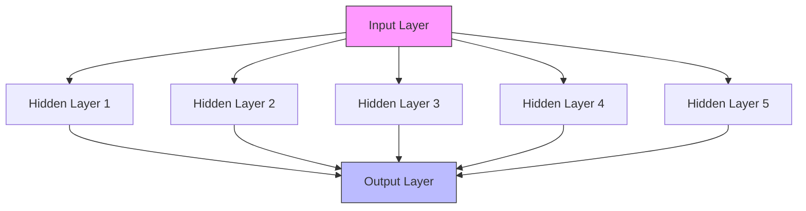
</details>

Source: https://www.tibco.com/reference-center/what-is-a-neural-network

Deep Learning utilizes Artificial Neural Networks

A Three Wave Development of Deep Learning (Deep learning. Goodfellow, Bengio & Courville.)   


<details>
<summary>line</summary>

| Model | Year | Value |
| --- | --- | --- |
| Mathematical model of neurons | 1943 | - |
| Single Layer Perceptron | 1958 | - |
| Cannot solve XOR problems | 1969 | - |
| Back propagation | 1976 | - |
| Multilayer Perceptron | 1986 | - |
| CNN & LeNet | 1997 | - |
| RNN LSTM | 1997 | - |
| Overwhelmed by SVM | 2006 | - |
| Deep belief network & deep learning | 2006 | - |
| Stacked Auto-Encoder | 2006 | - |
| GoogLeNet, GAN VGGNet, R-CNN | 2012 | - |
| ImageNet AlexNet DroupOut, ReLU | 2012 | - |
| BatchNormalization, Faster R-CNN, ResNet, FCN, UNet, YOLO, SSD | 2014 | - |
| Mask R-CNN, RetinaNet AlphaGo | 2017 | - |
| AlphaZero, GNN | 2019 | - |
</details>

Source: “Application of deep learning in ecological resource research: Theories, methods, and challenges”

Milestones   


<details>
<summary>flowchart</summary>

```mermaid
graph LR
    A["1940: Electronic Brain"] --> B["1943: Electronic Brain"]
    B --> C["1950: Perceptron"]
    C --> D["1957: Golden Age"]
    D --> E["1960: ADALINE"]
    E --> F["1969: XOR Problem"]
    F --> G["1986: Multi-layered Perceptron (Backpropagation)"]
    G --> H["1995: SVM"]
    H --> I["2006: Deep Neural Network (Pretraining)"]
    
    subgraph Time Periods
        J["S. McCulloch - W. Pitts"] --> K["F. Rosenblatt"]
        K --> L["B. Widrow - M. Hoff"]
        L --> M["M. Minsky - S. Papert"]
        M --> N["D. Rumelhart - G. Hinton - R. Williams"]
        N --> O["V. Vapnik - C. Cortes"]
        O --> P["G. Hinton - S. Ruslan"]
    end
    
    subgraph Legend
        Q["X AND Y"] --> R["+1 +2 X"]
        R --> S["+1 +2 X"]
        S --> T["+1 +2 X"]
        T --> U["+1 +2 X"]
        U --> V["+1 +2 X"]
        V --> W["+1 +2 X"]
        W --> X["+1 +2 X"]
        X --> Y["+1 +2 X"]
        Y --> Z["+1 +2 X"]
        Z --> AA["+1 +2 X"]
        AA --> AB["+1 +2 X"]
        AB --> AC["+1 +2 X"]
        AC --> AD["+1 +2 X"]
        AD --> AE["+1 +2 X"]
        AE --> AF["+1 +2 X"]
        AF --> AG["+1 +2 X"]
        AG --> AH["+1 +2 X"]
        AH --> AI["+1 +2 X"]
        AI --> AJ["+1 +2 X"]
        AJ --> AK["+1 +2 X"]
        AK --> AL["+1 +2 X"]
        AL --> AM["+1 +2 X"]
        AM --> AN["+1 +2 X"]
        AN --> AO["+1 +2 X"]
        AO --> AP["+1 +2 X"]
        AP --> AQ["+1 +2 X"]
        AQ --> AR["+1 +2 X"]
        AR --> AS["+1 +2 X"]
        AS --> AT["+1 +2 X"]
        AT --> AU["+1 +2 X"]
        AU --> AV["+1 +2 X"]
        AV --> AW["+1 +2 X"]
        AW --> AX["+1 +2 X"]
        AX --> AY["+1 +2 X"]
        AY --> AZ["+1 +2 X"]
        AZ --> BA["+1 +2 X"]
        BA --> BB["+1 +2 X"]
        BB --> BC["+1 +2 X"]
        BC --> BD["+1 +2 X"]
        BD --> BE["+1 +2 X"]
        BE --> BF["+1 +2 X"]
        BF --> BG["+1 +2 X"]
        BG --> BH["+1 +2 X"]
        BH --> BI["+1 +2 X"]
        BI --> BJ["+1 +2 X"]
        BJ --> BK["+1 +2 X"]
        BK --> BL["+1 +2 X"]
        BL --> BM["+1 +2 X"]
        BM --> BN["+1 +2 X"]
        BN --> BO["+1 +2 X"]
        BO --> BP["+1 +2 X"]
        BP --> BQ["+1 +2 X"]
        BQ --> BR["+1 +2 X"]
        BR --> BS["+1 +2 X"]
        BS --> BT["+1 +2 X"]
        BT --> BU["+1 +2 X"]
        BU --> BV["+1 +2 X"]
        BV --> BW["+1 +2 X"]
        BW --> BX["+1 +2 X"]
        BX --> BY["+1 +2 X"]
        BY --> BZ["+1 +2 X"]
        BZ --> CA["+1 +2 X"]
        CA --> CB["+1 +2 X"]
        CB --> CC["+1 +2 X"]
        CC --> CD["+1 +2 X"]
        CD --> CE["+1 +2 X"]
        CE --> CF["+1 +2 X"]
        CF --> CG["+1 +2 X"]
        CG --> CH["+1 +2 X"]
        CH --> CI["+1 +2 X"]
        CI --> CJ["+1 +2 X"]
        CJ --> CK["+1 +2 X"]
        CK --> CL["+1 +2 X"]
        CL --> CM["+1 +2 X"]
        CM --> CN["+1 +2 X"]
        CN --> CO["+1 +2 X"]
        CO --> CP["+1 +2 X"]
        CP --> CQ["+1 +2 X"]
        CQ --> CR["+1 +2 X"]
        CR --> CS["+1 +2 X"]
        CS --> CT["+1 +2 X"]
        CT --> CU["+1 +2 X"]
        CU --> CV["+1 +2 X"]
        CV --> CW["+1 +2 X"]
        CW --> CX["+1 +2 X"]
        CX --> CY["+1 +2 X"]
        CY --> CZ["+1 +2 X"]
        CZ --> DA["+1 +2 X"]
        DA --> DB["+1 +2 X"]
        DB --> DC["+1 +2 X"]
        DC --> DD["+1 +2 X"]
        DD --> DE["+1 +2 X"]
        DE --> DF["+1 +2 X"]
        DF --> DG["+1 +2 X"]
        DG --> DH["+1 +2 X"]
        DH --> DI["+1 +2 X"]
        DI --> DJ["+1 +2 X"]
        DJ --> DK["+1 +2 X"]
        DK --> DL["+1 +2 X"]
        DL --> DJ
    end
```
</details>

Source: http://beamlab.org/deeplearning/2017/02/23/deep\_learning\_101\_part1.html

# The first Neuron 1943

MP Neuron


<details>
<summary>flowchart</summary>

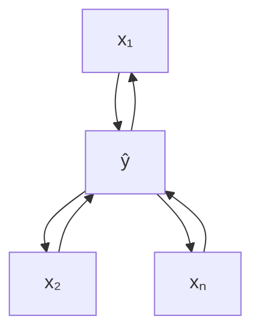
</details>

$$
\hat {y} = 1 \text {   if   } \sum_ {i = 1} ^ {n} x _ {i} \geq b
$$

$$
\hat {y} = 0 \text {   otherwise }
$$


Boolean inputs


Linear


Inputsare notweighted


Adjustable threshold

McCulloch-Pitts Neuron


<details>
<summary>natural_image</summary>

Portrait of an elderly man with a beard and mustache, wearing formal attire (no visible text or symbols)
</details>

Warren McCulloch (Neuroscientist)


<details>
<summary>natural_image</summary>

Black-and-white portrait of a man wearing glasses and a tie (no visible text or symbols)
</details>

Walter Pitts (Logician)

# The first wave: 1940s-1960s

One of the very first ideas in machine learning and artificial intelligence


<details>
<summary>flowchart</summary>

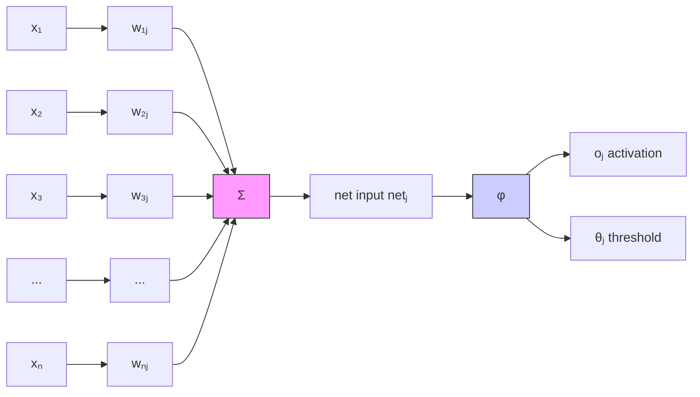
</details>

Rosenblatt’s perceptron

• Date back to 1940s   
• Could recognize letters and numbers   
Repeated promises of “True AI” that were unfulfilled

"[The perceptron is] the embryo of an electronic computer that [the Navy] expects will be able to walk, talk, see, write, reproduce itself and be conscious of its existence."

\- Frank Rosenblatt, 1958


<details>
<summary>text_image</summary>

abc
perceptron
▲ ○ □
</details>

# Frank Rosenblatt

(July 11,1928 – July 11,1971)

American psychologist

“Father of deep learning”

(Tappert, Charles C. (2019).

"Who Is the Father of Deep Learning?”)

The first wave: 1940s-1960s

# BRACEYOURSELVES


<details>
<summary>text_image</summary>

AI WINTER IS
COMING
</details>

memegenerator.net

# The first AI Winter 1969


<details>
<summary>natural_image</summary>

Black-and-white photo of two men smiling and conversing in front of a bookshelf (no visible text or symbols)
</details>

Marvin Minsky (left) and Seymour Papert (right) in 1971.

Cynthia Solomon/Courtesy of MIT

Source:https://www.npr.org/sections/ed/2016/08/05/488669276/remembering-athinker-who-thought-about-thinking

They proved that perceptron can't even solve the XOR problem.   
End Rosenblatt’s research on perceptrons when he was only 41 years old.   
Kills research on neural nets for the next 15-20 years.


<details>
<summary>text_image</summary>

Expanded Edition
Perceptrons
Marvin L. Minsky
Seymour A. Papert
</details>

The book “Perceptron”

# The first AI Winter 1969

  
Source:https://etaxfree.xyz/index.php?route=product/category&cid=28&cname=xor+deep+learning

Linear Classifier can not do XOR.

# eep Learning HistoryThe Backpropagandists Emerge 1986


<details>
<summary>natural_image</summary>

Portrait engraving of a 19th-century man in formal attire (no text or symbols visible)
</details>

George Boole

2 November 1815 – 8 December 1864

Mathematician

Logician


<details>
<summary>natural_image</summary>

Portrait of a man with gray hair wearing a sweater over a collared shirt, standing in front of a bookshelf (no visible text or symbols)
</details>

Geoffrey Hinton

born 6 December 1947

Cognitive psychologist

and computer scientist

Great-great-grandson

# eep Learning HistoryThe Backpropagandists Emerge 1986

Along with David Rumelhart and Ronald Williams, Hinton published a paper entitled “Learning representations by backpropagating errors”.   
Neural nets with many hidden layers could be effectively trained by a relatively simple procedure.   
Additional layers endowed the network with the ability to learn nonlinear functions.

Disputes: Firstly published in1970 by Finnish master student Seppo Linnainmaa.


<details>
<summary>natural_image</summary>

Portrait of a man with gray hair wearing a sweater over a collared shirt, standing in front of a bookshelf (no visible text or symbols)
</details>

Geoffrey Hinton

born 6 December 1947 Cognitive psychologist and computer scientist

# eep Learning HistoryThe Backpropagandists Emerge 1986

Neural Network - Backpropagation   


MLK

MAKINGAISIMPLE


<details>
<summary>flowchart</summary>

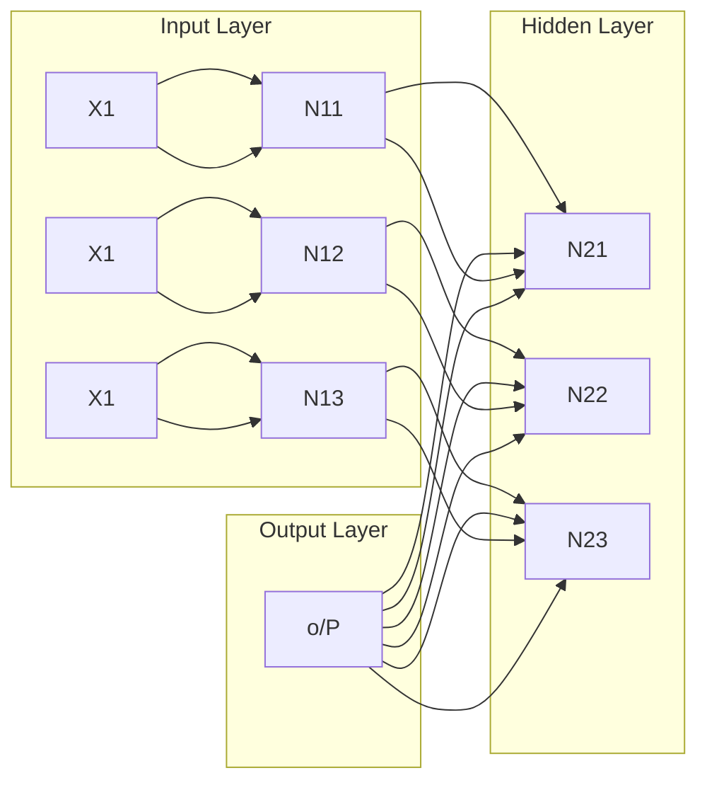
</details>

@ machinelearningknowledge.ai

eep Learning HistoryThe Convolutional network & LeNet 1998   


<details>
<summary>text_image</summary>

384
384
384
384
384
384
384
384
384
384
384
384
384
384
384
384
384
384
384
384
384
384
384
384
384
384
</details>

A project which was speared headed by Yann Lecun at AT&T Bell Labs.   
LeNet-5 on MNIST data.   
Source:http://yann.lecun.com/exdb/lenet/dancing384.html


<details>
<summary>natural_image</summary>

Portrait of a man wearing glasses and a dark polo shirt, with blurred background lighting (no text or symbols visible)
</details>

Yann LeCun   
born 8 July 1960 French computer scientist A founding father of convolutional nets

# The second AI Winter 1990s

The Network approach didn’t scale to larger problems.   
By the 90s the support vector machine (SVM) became the method of choice, and neural nets were moved back into storage.


<details>
<summary>flowchart</summary>

```mermaid
graph LR
    A["Input Points"] --> B["Kernel"]
    B --> C["Decision Surface with Red Squares"]
    style A fill:#f9f,stroke:#333
    style C fill:#bbf,stroke:#333
    note right of C Decision Surface
```
</details>


<details>
<summary>text_image</summary>

x \u00b7 f(x)
Decision
boundary
</details>

Support Vector Machines   
Source: Support Vector Machine vs. Random Forest for Remote Sensing Image Classification: A Meta-analysis and systematic review. Mohammadreza Sheykhmousa and Masoud Mahdianpari.

# Rebranding as ‘Deep Learning’ 2006

Hinton once again declared that he knew how the brain works.   
Unsupervised pretraining of "deep belief nets" allowed for large and deeper models.


<details>
<summary>flowchart</summary>

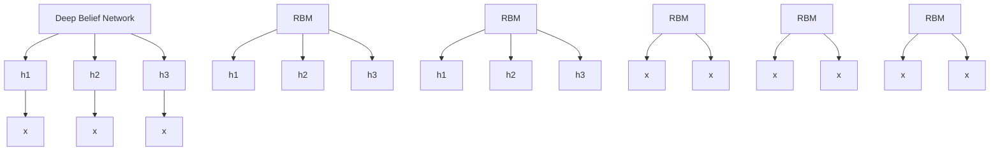
</details>

Source:https://www.toptal.com/machine-learning/an-introduction-to-deep-learningfrom-perceptrons-to-deep-networks

# The breakthrough 2012

In 2010, a large database known

as Imagenet containing millions of labelled images was created and published by Fei-Fei Li’s group at Stanford.

This database was coupled with the annual LSVRC, where contestants would build computer vision models, submit their predictions, and receive a score based on how accurate they were.

# ImageNet Challenge

# IMAGENET

1,000 object classes (categories).   
Images: 1.2M train ○100k test.


<details>
<summary>text_image</summary>

mite
mite
black widow
cockroach
tick
starfish
container ship
lifeboat
amphibian
fireboat
drilling platform
motor scooter
go-kart
moped
bumper car
golfcart
leopard
jaguar
cheetah
snow leopard
Egyptian cat
grille
mushroom
cherry
Madagascar cat
convertible
grille
pickup
beach wagon
fire engine
agaric
mushroom
jelly fungus
gill fungus
dead-man's-fingers
dalmatian
grape
elderberry
ffordshire bullterrier
currant
squirrel monkey
spider monkey
titi
indri
howler monkey
</details>


<details>
<summary>natural_image</summary>

Portrait of a smiling woman with shoulder-length brown hair wearing a patterned scarf, outdoors with blurred background (no text or symbols visible)
</details>

# Fei-Fei Li

Computer Science Department at Stanford University Co-Director of Stanford’s Human-Centered AI Institute

Homepage: https://profiles.stanford.edu/fei-fei-li/

# Winners of ILSVRC

ImageNet Large Scale Visual Recognition Challenge (ILSVRC) winners   


<details>
<summary>bar_line</summary>

| Study | Value | Layer Count (Layers) |
| :--- | :--- | :--- |
| Lin et al | 28.2 | 1 |
| Sanchez & Perronnin | 25.8 | 1 |
| Krizhevsky et al (AlexNet) | 16.4 | 8 |
| Zeiler & Fergus | 11.7 | 8 |
| Simonyan & Zisserman (VGG) | 7.3 | 19 |
| Szegedy et al (GoogLeNet) | 6.7 | 22 |
| He et al (ResNet) | 3.6 | 152 |
| Shao et al | 3 | 152 |
| Hu et al (SENet) | 2.3 | 152 |
| Russakovsky et al | 5.1 | - |
shallow
</details>

Source: https://kjhov195.github.io/2020-02-10-CNN\_architecture\_2/

# ep Learning HistoryThe hardware GPUs can help

ILSVRC GPU Usageand Winning error rate   


<details>
<summary>bar_line</summary>

| Year | Number of entries using GPUs | Winning error % |
| ---- | ---------------------------- | --------------- |
| 2010 | 0                            | 28%             |
| 2011 | 0                            | 26%             |
| 2012 | 4                            | 16%             |
| 2013 | 60                           | 12%             |
| 2014 | 110                          | 7%              |
</details>

Here is a graph showing the error rate on Imagenet over time, note the precipitous drop in 2012 and the huge uptick in teams using GPUs.

# The breakthrough 2012

Number of Al papers on Scopus by subcategory (1998-2017)

Source: Elsevier


<details>
<summary>line</summary>

| Year | Machine Learning and Probabilistic Reasoning | Neural Networks | Computer Vision | Search and Optimization | NLP and Knowledge Representation | Fuzzy Systems | Planning and Decision Making | Total |
|------|-----------------------------------------------|-----------------|-----------------|--------------------------|----------------------------------|---------------|------------------------------|-------|
| 2000 | ~3,000                                        | ~4,000          | ~3,500          | ~2,500                   | ~2,000                           | ~1,500        | ~1,000                       | ~8,000 |
| 2005 | ~10,000                                       | ~8,000          | ~7,500          | ~5,000                   | ~4,500                           | ~3,500        | ~2,500                       | ~22,000 |
| 2010 | ~16,000                                       | ~13,000         | ~14,500         | ~6,500                   | ~6,000                           | ~5,500        | ~3,500                       | ~38,000 |
| 2015 | ~25,000                                       | ~18,000         | ~22,500         | ~8,500                   | ~7,500                           | ~6,500        | ~4,500                       | ~48,000 |
| 2020 | ~33,000                                       | ~28,000         | ~24,500         | ~9,500                   | ~8,500                           | ~7,500        | ~5,500                       | ~62,000 |
</details>

Neural networks are the second best way to do almost anything.

--J.S. Denker

# Development of Deep Learning 2013


<details>
<summary>flowchart</summary>

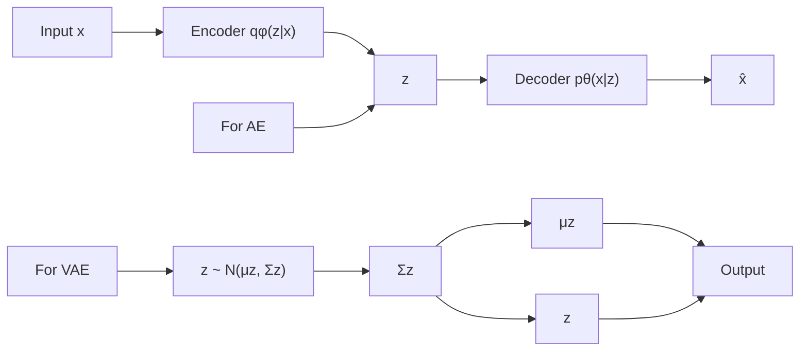
</details>

# Variational Auto-encoder

Auto-Encoding Variational Bayes (2013). Diederik P Kingma, Max

Welling. https://arxiv.org/abs/1312.6114.

Cited by 24417

Developing of Deep Learning 2014   


<details>
<summary>flowchart</summary>

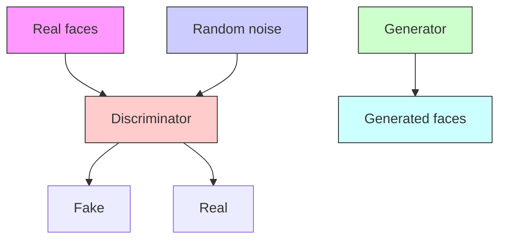
</details>

# Generative Adversarial Networks

Generative Adversarial Networks (2014). Ian J. Goodfellow, Jean

Pouget-Abadie, Mehdi Mirza, Bing Xu, David Warde-Farley, Sherjil

Ozair, Aaron Courville, Yoshua Bengio. https://arxiv.org/abs/1406.2661.

Cited by 53250

# 2018 Turing Award


<details>
<summary>text_image</summary>

Yoshua Bengio
</details>


<details>
<summary>text_image</summary>

Geoffrey Hinton
</details>


<details>
<summary>text_image</summary>

Yann LeCun
</details>

Fathers of the Deep Learning Revolution Receive ACM A.M. Turing Award.

Bengio, Hinton and LeCun Ushered in Major Breakthroughs in Artificial Intelligence

# 2022 OpenAI ChatGPT


<details>
<summary>natural_image</summary>

Abstract geometric pattern composed of interlocking curved lines forming a symmetrical design (no text or symbols)
</details>

# Step 1

Collect demonstration data and trainasupervised policy.

A prompt is sample from our prompt dataset.

A labeler demonstrates the desired output behavior.

This data is used to fine-tune GPT-3.5 with supervised learning.


Explainreinforcement learning toa6yearold.


We give treats and punishments to teach..


# Step2

Collect comparison data and traina reward model.

A prompt and several model outputs are sampled.

A labeler ranks the outputs from best to worst.

This data is used to train our reward model.


Explainreinforcement learning toa6yearold.

Inreinforcement learning,.the agentis...

Explain reasrcis..

In machine lesrning..

D

We ghro trezts and punishment8 to taach


D>C>A>B


RM


D>C>A>B

# Step3

Optimizea policy against the reward model using the PPO reinforcement learning algorithm.

A new prompt is sampled from the dataset.

The PPO model is initialized from the supervised policy.

The policy generates an output.

The reward model calculates a reward for the output.

The reward is used to update the policy using PPO.


Write astory about otters.

PPO


Ipon a time...

Rm


rk

# 2024 Nobel Prize


<details>
<summary>text_image</summary>

THE NOBEL PRIZE
IN PHYSICS 2024
Illustrations: Niklas Elmehed
</details>

John J.Hopfield

"forfoundational discoveriesandinventions thatenablemachinelearning withartificial neural networks"

THEROYALSWEDISHACADEMY OFSCIENCES


<details>
<summary>text_image</summary>

THE NOBEL PRIZE
IN CHEMISTRY 2024
Illustrations: Niklas Elmehed
</details>

David Baker

"forcomputational protein design"

Demis Hassabis

"forprotein structureprediction"

THEROYALSWEDISHACADEMY OFSCIENCES

# 2025 Turing Award


<details>
<summary>text_image</summary>

Andrew Barto
</details>


<details>
<summary>text_image</summary>

Richard Sutton
</details>

Computing Power (GPU, TPU,…)   


<details>
<summary>natural_image</summary>

Two electronic devices: a Tesla TESLA processor with green leads and a multi-chamber circuit board (no visible text or symbols)
</details>

GPU and TPU

Open Source Tools   


PYTORCH


Microsoft

CNTK


Caffe2

gensim

spaCy

dmlc

mxnet

theano

Big Data   


<details>
<summary>text_image</summary>

BIG DATA
InterviewBit
</details>

# Regression


<details>
<summary>scatter</summary>

| x    | y      |
|------|--------|
| 0.00 | 0.90   |
| 0.05 | 0.60   |
| 0.10 | 0.30   |
| 0.15 | 0.10   |
| 0.20 | -0.10  |
| 0.25 | -0.30  |
| 0.30 | -0.50  |
| 0.35 | -0.70  |
| 0.40 | -0.90  |
| 0.45 | -1.10  |
| 0.50 | -1.30  |
| 0.55 | -1.50  |
| 0.60 | -1.70  |
| 0.65 | -1.90  |
| 0.70 | -2.10  |
| 0.75 | -2.30  |
| 0.80 | -2.50  |
| 0.85 | -2.70  |
| 0.90 | -2.90  |
| 0.95 | -3.10  |
| 1.00 | -3.30  |
</details>

Least squares regression, quantile regression, robust regression…

# Image recognition


[Krizhevsky 2012] 

<table><tr><td>汗洪焕浑鉴束娇门</td><td>汉宏忠混手诚嚼圭</td><td>夯弘唤豁伎殓揽兮</td><td>龙红疾浩祭拣锭钦津</td><td>脱喉蒙伙剖捡矫襟</td><td>壞侯焕火悸旨凭紧</td><td>嚎猴渔获济俭脚铆</td><td>豪毗宜或寄剪伎仗</td><td>毫厚幻感寂减角谨</td><td>郁候荒霍计萍泛进</td></tr></table>

[Ciresan et al. 2013]


<details>
<summary>text_image</summary>

person : 0.992
horse : 0.993
person : 0.979
car : 1,000
dog : 0.967
</details>


<details>
<summary>text_image</summary>

bus : 0.996
person : 0.736
</details>


<details>
<summary>text_image</summary>

dog : 0.994
cat : 0.982
</details>


<details>
<summary>text_image</summary>

boat : 0.970
person : 0.982
person : 0.983
person : 0.925
person : 0.989
Lickety Split
</details>

[Faster R-CNN-Ren 2015]


<details>
<summary>natural_image</summary>

Street scene with purple and blue carpet, green human figures, yellow directional signs, and trees (no readable text or symbols)
</details>

[NVIDIA dev blog]

# Vision


<details>
<summary>natural_image</summary>

Medical professional examining a patient's arm with a digital device (no visible text or symbols)
</details>

[Stanford 2017]   


<details>
<summary>text_image</summary>

1.04
1.22
1.33
0.78
1.33
1.26
0.99
</details>

Figure1.Illumination andPoseinvariance.

[FaceNet- Google 2015]


<details>
<summary>natural_image</summary>

Microscopic tissue sections showing glandular structures with labeled regions (no text or symbols present)
</details>

(d) benign


<details>
<summary>natural_image</summary>

Microscopic tissue images showing cellular structures with blue and green markers, no visible text or symbols
</details>

(e) benign


<details>
<summary>natural_image</summary>

Microscopic tissue sections showing cellular structures with green and blue markers, no visible text or labels
</details>

(f) malignant   
[Nvidia Dev Blog 2017]


<details>
<summary>natural_image</summary>

Grid of nine facial face images with dot patterns, no visible text or symbols
</details>

[Facial landmark detection CUHK 2014]

# Generative models for image


<details>
<summary>natural_image</summary>

Grid of 20 diverse male and female face portraits in various styles and colors (no text or symbols visible)
</details>

Sampled celebrities [Nvidia 2017]


<details>
<summary>text_image</summary>

Text
description
This bird is
blue with white
and has a very
short beak
This bird has
wings that are
brown and has
a yellow belly
A white bird
with a black
crown and
yellow beak
This bird is
white, black,
and brown in
color, with a
brown beak
The bird has
small beak,
with reddish
brown crown
and gray belly
This is a small,
black bird with
a white breast
and white on
the wingbars.
This bird is
white black and
yellow in color,
with a short
black beak
Stage-I
images
Stage-II
images
</details>

# Image Translation


<details>
<summary>natural_image</summary>

Surreal artwork depicting mythological creatures and a giant creature in a fantasy, ornate setting (no text or symbols)
</details>

[DeepDream 2015]


[Gatys 2015]   
original   


<details>
<summary>natural_image</summary>

Illustration of a person in traditional embroidered attire with ornate headdress and floral background (no text or symbols)
</details>

bicubic   
(21.59dB/0.6423)   


<details>
<summary>natural_image</summary>

Illustration of a person in traditional ethnic attire with floral background (no text or symbols)
</details>

SRResNet   
(23.44dB/0.7777)   


<details>
<summary>natural_image</summary>

Illustration of a person in traditional attire with floral headwear, seated outdoors with autumn foliage in the background (no text or symbols visible)
</details>

SRGAN   
(20.34dB/0.6562)   


<details>
<summary>natural_image</summary>

Illustration of a person in traditional attire with embroidered headdress, seated outdoors with floral background (no text or symbols)
</details>

[Ledig 2016]


<details>
<summary>natural_image</summary>

Illustration of a person in traditional embroidered attire with ornate headdress, seated outdoors with autumn foliage in background (no text or symbols)
</details>

Image Translation   


<details>
<summary>text_image</summary>

Input
Old Eng.
Sheep Dog
Husky
German
Shepherd
Corgi
Input
Husky
Corgi
</details>

Figure 4:Dog breed translation results.   


<details>
<summary>text_image</summary>

Input
Cougar
Cheetah
Leopard
Lion
Tiger
Input
Leopard
</details>

Figure 5:Cat species translation results.

[Liu et al., 2017]

Speech to Text   


● Convolution Layer

Recurrent Layer

O Fully Connected Layer


<details>
<summary>natural_image</summary>

Abstract circular graphic with flowing wave patterns in blue and pink tones (no text or symbols)
</details>

Hey Siri


<details>
<summary>natural_image</summary>

Abstract graphic with blue and gray shapes, no text or symbols present
</details>


<details>
<summary>natural_image</summary>

Green square icon with two white speech bubbles (no text or symbols)
</details>

[Baidu 2014]

# Natural Language Processing

ENGLISH

Translate   


<details>
<summary>text_image</summary>

Italian Chinese French English - detected
English Spanish French Translate
deep learning
13/5000
l'apprentissage en profondeur
</details>

KOREAN

JAPANESE


<details>
<summary>flowchart</summary>

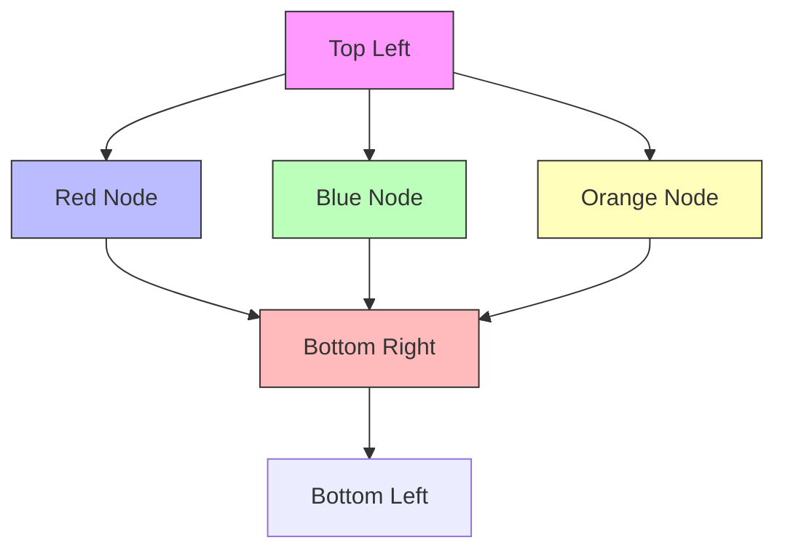
</details>

deep, leaming

[Google Translate System - 2016]   


<details>
<summary>flowchart</summary>

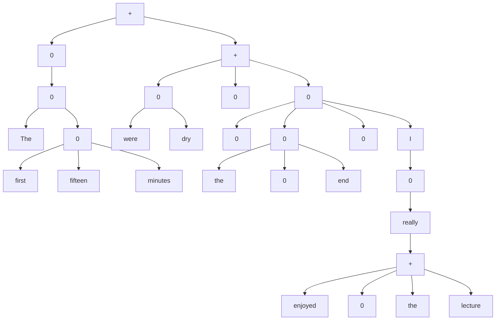
</details>

[Socher 2015]

# Natural Language Processing


SalitKulla

Hev.Wynton Marsalis is playing thisweekend.Do you havea preference between Saturdayand Sunday?

-S


[Google Inbox Smart Reply]


<details>
<summary>natural_image</summary>

Black circular Amazon coffee ear with green head cover and 'amazon' logo on front (no additional text or symbols)
</details>

[Amazon Echo/Alexa]

# Natural Language Processing


<details>
<summary>text_image</summary>

OpenAI
CHATGPT
GiP
</details>

OpenAI ChatGPT is going to make Google Obsolete for Programmers

Source: https://www.youtube.com/watch?v=Ih1FxMGfUtU


GPT-4.1 (2025-04-14)


GPT-4.1-mini (2025-04-14)


GPT-5 (2025-08-07)


GPT-5-mini (2025-08-07)


Gemini 2.5 Pro (GA)


Gemini 2.5 Flash (GA)


Qwen3-235B-A22B-Thinking-2507


Free


Qwen2.5-VL-72B-Instruct


Free


DeepSeek-R1-0528 (Azure Al Foundry)


DeepSeek-R1-0528 (Alibaba Cloud Bailian)

Generative models for Audio   


<details>
<summary>other</summary>

| Input | Hidden Layer | Output |
|-------|--------------|--------|
| 1     | 0            | 0      |
| 2     | 0            | 0      |
| 3     | 0            | 0      |
| 4     | 0            | 0      |
| 5     | 0            | 0      |
| 6     | 0            | 0      |
| 7     | 0            | 0      |
| 8     | 0            | 0      |
| 9     | 0            | 0      |
| 10    | 0            | 0      |
| 11    | 0            | 0      |
| 12    | 0            | 0      |
| 13    | 0            | 0      |
| 14    | 0            | 0      |
| 15    | 0            | 0      |
| 16    | 0            | 0      |
| 17    | 0            | 0      |
| 18    | 0            | 0      |
| 19    | 0            | 0      |
| 20    | 0            | 0      |
| 21    | 0            | 0      |
| 22    | 0            | 0      |
| 23    | 0            | 0      |
| 24    | 0            | 0      |
| 25    | 0            | 0      |
| 26    | 0            | 0      |
| 27    | 0            | 0      |
| 28    | 0            | 0      |
| 29    | 0            | 0      |
| 30    | 0            | 0      |
| 31    | 0            | 0      |
| 32    | 0            | 0      |
| 33    | 0            | 0      |
| 34    | 0            | 0      |
| 35    | 0            | 0      |
| 36    | 0            | 0      |
| 37    | 0            | 0      |
| 38    | 0            | 0      |
| 39    | 0            | 0      |
| 40    | 0            | 0      |
| 41    | 0            | 0      |
| 42    | 0            | 0      |
| 43    | 0            | 0      |
| 44    | 0            | 0      |
| 45    | 0            | 0      |
| 46    | 0            | 0      |
| 47    | 0            | 0      |
| 48    | 0            | 0      |
| 49    | 0            | 0      |
| 50    | 0            | 0      |
| Note: The actual values for Hidden Layer and Output are not provided in the code. The actual values are represented by the dots on the vertical axis.
</details>

Sound generation with WaveNet [DeepMind 2017]

Which one do you think is generated?


Tacotron 2 Natural TTS Synthesis by Conditioning WaveNet on Mel Spectrogram

# Vision + NLP


<details>
<summary>flowchart</summary>


</details>

[VQA-Mutan 2017]


<details>
<summary>natural_image</summary>

Man playing acoustic guitar with strings, wearing a T-shirt and jeans (no visible text or symbols)
</details>

"man in black shirt isplaying guitar."


<details>
<summary>natural_image</summary>

Construction worker in safety gear operating machinery on a worksite (no visible text or symbols)
</details>

"construction worker in orange safety vest is working on road."


<details>
<summary>natural_image</summary>

A woman and a baby sitting on a red surface with a colorful LEGO building (no text or symbols visible)
</details>

"two young girlsare playing with


<details>
<summary>natural_image</summary>

Person performing a mid-air acrobatic trick over a lake, with no visible text or symbols.
</details>

"boy is doing backflip on wakeboard."   
[Karpathy2015]

# Vision + NLP

an armchair in the shape of an avocado [..]


<details>
<summary>natural_image</summary>

Five modern green armchairs with yellow covers, arranged in a row (no text or symbols visible)
</details>

TEXTPROMPT

a store front that has the word 'openai' written on it [.]

AI-GENERATEDIMAGES   


<details>
<summary>text_image</summary>

OPENAI
OPENAI
OPENAI
OPENAI
OPENAI
</details>

Open-AI GPT-3, or DALL-E: https://openai.com/blog/dall-e/

# Genomics

1.High-throughput experiments   
  
PBM

  
SELEX

  
ChIP/CLIP

2.Massivelyparalleldeep learning   


<details>
<summary>flowchart</summary>

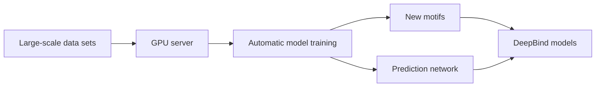
</details>

3.Community needs   
  
Generegulation

  
Precision medicine

  
Detect binding sites

[Deep Genomics 2017]   


<details>
<summary>natural_image</summary>

3D protein structure visualization with alpha helices and beta sheets in blue and green (no labels or text)
</details>

T1037 /6vr4  
90.7 GDT   
(RNA polymerase domain)


<details>
<summary>natural_image</summary>

3D protein structure diagram with blue and green secondary structure elements (no labels or text)
</details>

T1049 /6y4f  
93.3 GDT   
(adhesin tip)

AlphaFold by DeepMind

Experimental result   
Computational prediction

# Chemistry Physics


<details>
<summary>flowchart</summary>

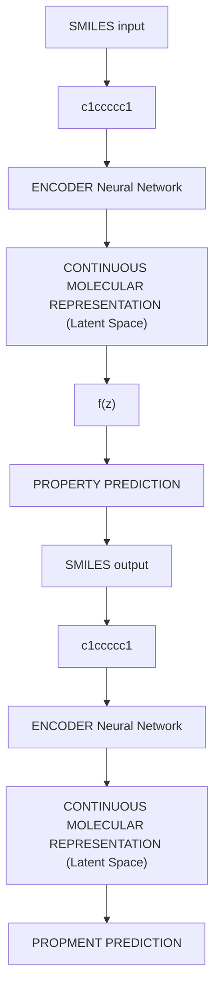
</details>

[G6mez-Bombarelli 2016]


<details>
<summary>natural_image</summary>

Three-panel image showing a mushroom cloud with a red pagoda on top, each with smoke and shadow (no text or symbols)
</details>

[Tompson 2016]   


<details>
<summary>natural_image</summary>

3D rendered image of a red arch structure with shadow figure, no text or symbols visible
</details>

Finite element simulator accelerated (\~100 fold) by a 3D convolutional network

# Deep Learning for AI


<details>
<summary>text_image</summary>

ALPHAGO
00:10:29
AlphaGo
Google DeepMind
LEE SEDOL
00:01:00
</details>


<details>
<summary>text_image</summary>

w 20/30/0, b 8/40/2
</details>

A10: English Opening   


<details>
<summary>line</summary>

| Time | Value |
|------|-------|
| 0:00 | 6%    |
| 2:00 | 12%   |
| 4:00 | 19%   |
| 6:00 | 12%   |
| 8:00 | 12%   |
</details>

[Deepmind AlphaGo／Zero 2017]


<details>
<summary>flowchart</summary>

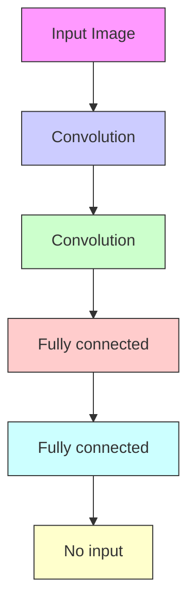
</details>

[Atari Games - DeepMind 2016]


<details>
<summary>text_image</summary>

TYPE
PLAYER
VISION
HEALTH
</details>

[Starcraft2 forAl research]

AlphaGo/Zero: Monte Carlo Tree Search, Deep Reinforcement Learning, self-play

# Won IMO Gold Medal 2025


<details>
<summary>flowchart</summary>

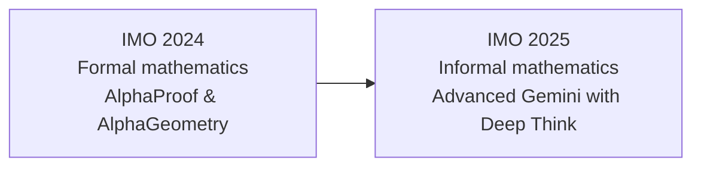
</details>

# Image editing by Gemini


<details>
<summary>natural_image</summary>

Two-panel image showing a person in an astronaut helmet, one with visible facial features and the other with a damaged face (no text or symbols)
</details>

Prompt: remove the helmet.

# Image editing by Gemini


<details>
<summary>natural_image</summary>

Two portrait photos of a woman with floral headpiece and red berries, set against blue background (no text or symbols)
</details>

Prompt: Change the head piece to something made from red flowers.

LAMBDA: A Large Model Based Data Agent   


<details>
<summary>flowchart</summary>

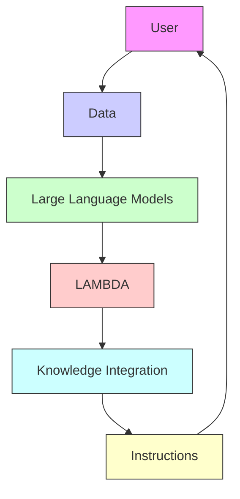
</details>

https://www.polyu.edu.hk/ama/cmfai/lambda.html

# Deep Neural Networks

# with

# motivating examples

An Example   


<details>
<summary>scatter</summary>

| x    | y    |
| ---- | ---- |
| 0.0  | -5.0 |
| 0.5  | -4.5 |
| 1.0  | -4.0 |
| 1.5  | -3.5 |
| 2.0  | -3.0 |
| 2.5  | -2.5 |
| 3.0  | -2.0 |
| 3.5  | -1.5 |
| 4.0  | -1.0 |
| 4.5  | -0.5 |
| 5.0  | 0.0  |
| 5.5  | 0.5  |
| 6.0  | 1.0  |
| 6.5  | 1.5  |
| 7.0  | 2.0  |
| 7.5  | 2.5  |
| 8.0  | 3.0  |
| 8.5  | 3.5  |
| 9.0  | 4.0  |
| 9.5  | 4.5  |
| 10.0 | 5.0  |
| 10.5 | 5.5  |
| 11.0 | 6.0  |
| 11.5 | 6.5  |
| 12.0 | 7.0  |
| 12.5 | 7.5  |
| 13.0 | 8.0  |
| 13.5 | 8.5  |
| 14.0 | 9.0  |
| 14.5 | 9.5  |
| 15.0 | 10.0 |
</details>

Least squares regression   
Data $( X _ { i } , Y _ { i } ) , i = 1 , \ldots , n .$   
To find a

$$
\boldsymbol {f} (\boldsymbol {x}; \alpha , \beta) = \boldsymbol {\beta} ^ {\prime} \boldsymbol {x} + \alpha
$$

such that

$$
\Sigma \big (Y _ {i} - f (X _ {i}) \big) ^ {2}
$$

is minimized over

$$
\begin{array}{c} \mathcal {F} = \{\boldsymbol {f} \colon \boldsymbol {f} (\boldsymbol {x}; \alpha , \beta) = \boldsymbol {\beta} ^ {\prime} \boldsymbol {x} + \alpha , \\ \boldsymbol {\alpha}, \boldsymbol {\beta} \in \mathbb {R} \} \end{array}
$$

The model $f ( x ; \pmb { \alpha } , \beta )$ is linear in the input ????.   
Simple, efficient, easy to compute.   
Not expressive, especially for nonlinear data.

An Example   


<details>
<summary>bar_line</summary>

| x      | y (red line) | y (blue dots) |
| ------ | ------------ | ------------- |
| -10.0  | 1.2          | 0.9           |
| -7.5   | 0.0          | -0.4          |
| -5.0   | -0.6         | -0.8          |
| -2.5   | 0.4          | 0.5           |
| 0.0    | 0.1          | -0.1          |
| 2.5    | -0.2         | -0.3          |
| 5.0    | 0.3          | 0.4           |
| 7.5    | 0.7          | 0.6           |
| 10.0   | -1.2         | -1.1          |
</details>

Data $( X _ { i } , Y _ { i } ) , i = 1 , \ldots , n .$   
To find a network

$$
f (x; \theta)
$$

such that

$$
\Sigma \left(Y _ {i} - f (X _ {i})\right) ^ {2}
$$

is minimized over

???? = {????: ???? ????; ???? ???????? ???? ???????????????? ???? ???????????????????????????? ???? ???? ???? ???? ???????? $\pmb { \theta } \in \mathbb { R } ^ { s } \}$

• The model ???? ????; ???? is a neural network parameterized by ????   
Can have many parameters, need training.   
• Very expressive, especially for high-dimensional nonlinear data.

# Mathematical Definition

# of

# Deep Neural Networks

# Feedforward Neural Networks (Multi-Layer Perceptrons)

• The architecture of a ${ \sf M L P }$ is expressed as a composition of a series of functions

$$
f _ {\theta} (x) = \mathcal {A} _ {L} \circ \sigma \circ \mathcal {A} _ {L - 1} \circ \sigma \circ \dots \circ \sigma \circ \mathcal {A} _ {1} (x), x \in \mathbb {R} ^ {d _ {0}}
$$

where

$$
\mathcal {A} _ {i} (x) = W _ {i} x + b _ {i}, \qquad x \in \mathbb {R} ^ {d _ {i - 1}}
$$

is the i-th linear transformation with

weight matrix $W _ { i } \in \mathbb { R } ^ { d _ { i } \times d _ { i - 1 } }$ and bias vector $b _ { i } \in \mathbb { R } ^ { d _ { i } }$ ,

and $\sigma$ is the activation function,

$\begin{array}{c} \mathsf { e . g . } , \qquad & { } \end{array}$

# Feedforward Neural Networks (Multi-Layer Perceptrons)

• The architecture of a MLP is expressed as a composition of a series of functions

$$
f _ {\theta} (x) = \mathcal {A} _ {L} \circ \sigma \circ \mathcal {A} _ {L - 1} \circ \sigma \circ \dots \circ \sigma \circ \mathcal {A} _ {1} (x), x \in \mathbb {R} ^ {d _ {0}}
$$

where

$$
\mathcal {A} _ {i} (x) = W _ {i} x + b _ {i}, \qquad x \in \mathbb {R} ^ {d _ {i - 1}}.
$$

Such MLP has ???? layers,

The input ???? is the 0-th layer and the output is the last layer.

$\begin{array} { r l } { h _ { i } ( x ) = } & { { } \circ \mathcal { A } _ { i } \circ \quad \circ \cdots \circ \quad \circ \mathcal { A } _ { 1 } ( x ) } \end{array}$ is the i-th layer, hidden layer.

The depth of the network $( L - 1 )$ , number of hidden layers.

• The width of the i-th layer is $d _ { i }$ . The width of the network is max $\{ d _ { 1 } , \dots , d _ { { L - 1 } } \}$   
• $\theta = ( W _ { 1 } , b _ { 1 } , \dots , W _ { L } , b _ { L } )$ collects all the parameters. Size of the network is # ????.

# Activation functions

$$
f _ {\theta} (x) = \mathcal {A} _ {L} \circ \sigma \circ \mathcal {A} _ {L - 1} \circ \sigma \circ \dots \circ \sigma \circ \mathcal {A} _ {1} (x), \qquad x \in \mathbb {R} ^ {d _ {0}}
$$

<table><tr><td>Sigmoid</td><td>Tanh</td><td>ReLU</td><td>Leaky ReLU</td></tr><tr><td> $g(z) = \frac{1}{1 + e^{-z}}$ </td><td> $g(z) = \frac{e^{z} - e^{-z}}{e^{z} + e^{-z}}$ </td><td> $g(z) = \max(0, z)$ </td><td> $g(z) = \max(\epsilon z, z)$ with  $\epsilon \ll 1$ </td></tr><tr><td></td><td></td><td></td><td></td></tr></table>

An Activation functions is considered non-saturated if $\operatorname* { l i m } _ { x  \infty } \sigma ( x ) = \infty$ .

# Saturated Nonlinearity : Sigmoid, Tanh

Non-saturated Nonlinearity: Rectified Linear Unit (ReLU), Leaky ReLU

ReLU is a good default choice for most problems.

# Biological Neurons & Neurons in a Network

Impulses carried toward cell body   


<details>
<summary>text_image</summary>

dendrite
presynaptic terminal
axon
cell body
Impulses carried away
from cell body
</details>

This image by Felipe Perucho is licensed under CC-BY 3.0.


<details>
<summary>flowchart</summary>

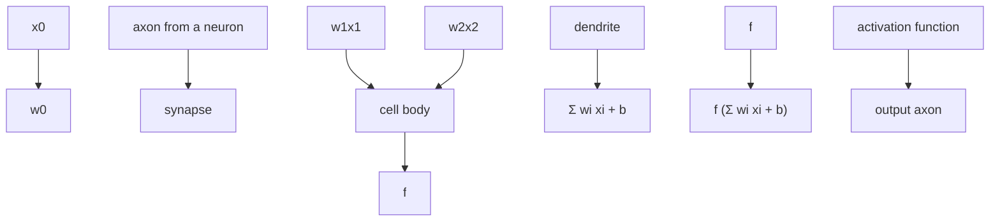
</details>


<details>
<summary>line</summary>

| x    | y     |
| ---- | ----- |
| -10  | 0.000 |
| -5   | 0.001 |
| 0    | 0.500 |
| 5    | 0.999 |
| 10   | 1.000 |
</details>

Sigmoid activation function $\frac { 1 } { 1 + e ^ { - x } }$

# Feedforward Neural Networks (Multi-Layer Perceptrons)


<details>
<summary>flowchart</summary>

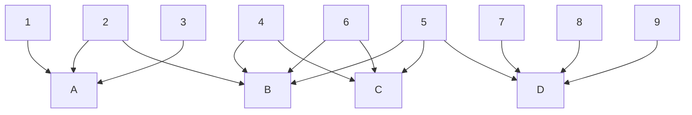
</details>


<details>
<summary>text_image</summary>

VS
</details>


<details>
<summary>flowchart</summary>

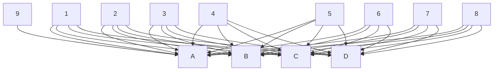
</details>

Layers in MLP are fully connected

# Biological Neurons

# Neurons in a neural network:


<details>
<summary>natural_image</summary>

Abstract illustration of branching yellow neural or vascular networks against a blue sky background (no text or symbols)
</details>

Complex connectivity


<details>
<summary>flowchart</summary>

```mermaid
graph LR
    subgraph Input Layer
        A1[" "] --> B1[" "]
        A2[" "] --> B1[" "]
        A3[" "] --> B1[" "]
        A4[" "] --> B1[" "]
    end

    subgraph Output Layer
        B1[" "] --> C1[" "]
        B1[" "] --> C2[" "]
        B1[" "] --> C3[" "]
        B1[" "] --> C4[" "]
        B1[" "] --> C5[" "]
        B1[" "] --> C6[" "]
        B1[" "] --> C7[" "]
        B1[" "] --> C8[" "]
        B1[" "] --> C9[" "]
        B1[" "] --> C10[" "]
    end

    style Input Layer fill:#f9f,stroke:#333
    style Output Layer fill:#ccf,stroke:#333
```
</details>

hidden layer 1 hidden layer 2

Layer structure

Fully connected

Computational efficient

Randomly wired neural networks generated by the classical Watts-Strogatz (WS) model: these three instances of random networks achieve (left-to-right)

79.1%, 79.1%, 79.0% classification accuracy on ImageNet under a similar computational budget to ResNet-50, which has 77.1% accuracy.

Randomly wired neural networks can also work!   


<details>
<summary>flowchart</summary>

```mermaid
graph TD
    subgraph Layer1
        A1["conv₁"] --> B1["cluster"]
        A2["conv₁"] --> B2["cluster"]
        A3["conv₁"] --> B3["cluster"]
        A4["conv₁"] --> B4["cluster"]
        A5["conv₁"] --> B5["cluster"]
        A6["conv₁"] --> B6["cluster"]
        A7["conv₁"] --> B7["cluster"]
        A8["conv₁"] --> B8["cluster"]
        A9["conv₁"] --> B9["cluster"]
        A10["conv₁"] --> B10["cluster"]
        A11["conv₁"] --> B11["cluster"]
        A12["conv₁"] --> B12["cluster"]
        A13["conv₁"] --> B13["cluster"]
        A14["conv₁"] --> B14["cluster"]
        A15["conv₁"] --> B15["cluster"]
        A16["conv₁"] --> B16["cluster"]
        A17["conv₁"] --> B17["cluster"]
        A18["conv₁"] --> B18["cluster"]
        A19["conv₁"] --> B19["cluster"]
        A20["conv₁"] --> B20["cluster"]
        A21["conv₁"] --> B21["cluster"]
        A22["conv₁"] --> B22["cluster"]
        A23["conv₁"] --> B23["cluster"]
        A24["conv₁"] --> B24["cluster"]
        A25["conv₁"] --> B25["cluster"]
        A26["conv₁"] --> B26["cluster"]
        A27["conv₁"] --> B27["cluster"]
        A28["conv₁"] --> B28["cluster"]
        A29["conv₁"] --> B29["cluster"]
        A30["conv₁"] --> B30["cluster"]
        A31["conv₁"] --> B31["cluster"]
        A32["conv₁"] --> B32["cluster"]
        A33["conv₁"] --> B33["cluster"]
        A34["conv₁"] --> B34["cluster"]
        A35["conv₁"] --> B35["cluster"]
        A36["conv₁"] --> B36["cluster"]
        A37["conv₁"] --> B37["cluster"]
        A38["conv₁"] --> B38["cluster"]
        A39["conv₁"] --> B39["cluster"]
        A40["conv₁"] --> B40["cluster"]
        A41["conv₁"] --> B41["cluster"]
        A42["conv₁"] --> B42["cluster"]
        A43["conv₁"] --> B43["cluster"]
        A44["conv₁"] --> B44["cluster"]
        A45["conv₁"] --> B45["cluster"]
        A46["conv₁"] --> B46["cluster"]
        A47["conv₁"] --> B47["cluster"]
        A48["conv₁"] --> B48["cluster"]
        A49["conv₁"] --> B49["cluster"]
        A50["conv₁"] --> B50["cluster"]
        A51["conv₁"] --> B51["cluster"]
        A52["conv₁"] --> B52["cluster"]
        A53["conv₁"] --> B53["cluster"]
        A54["conv₁"] --> B54["cluster"]
        A55["conv₁"] --> B55["cluster"]
        A56["conv₁"] --> B56["cluster"]
        A57["conv₁"] --> B57["cluster"]
        A58["conv₁"] --> B58["cluster"]
        A59["conv₁"] --> B59["cluster"]
        A60["conv₁"] --> B60["cluster"]
        A61["conv₁"] --> B61["cluster"]
        A62["conv₁"] --> B62["cluster"]
        A63["conv₁"] --> B63["cluster"]
        A64["conv₁"] --> B64["cluster"]
        A65["conv₁"] --> B65["cluster"]
        A66["conv₁"] --> B66["cluster"]
        A67["conv₁"] --> B67["cluster"]
        A68["conv₁"] --> B68["cluster"]
        A69["conv₁"] --> B69["cluster"]
        A70["conv₁"] --> B70["cluster"]
        A71["conv₁"] --> B71["cluster"]
        A72["conv₁"] --> B72["cluster"]
        A73["conv₁"] --> B73["cluster"]
        A74["conv₁"] --> B74["cluster"]
        A75["conv₁"] --> B75["cluster"]
        A76["conv₁"] --> B76["cluster"]
        A77["conv₁"] --> B77["cluster"]
        A78["conv₁"] --> B78["cluster"]
        A79["conv₁"] --> B79["cluster"]
        A80["conv₁"] --> B80["cluster"]
        A81["conv₁"] --> B81["cluster"]
        A82["conv₁"] --> B82["cluster"]
        A83["conv₁"] --> B83["cluster"]
        A84["conv₁"] --> B84["cluster"]
        A85["conv₁"] --> B85["cluster"]
        A86["conv₁"] --> B86["cluster"]
        A87["conv₁"] --> B87["cluster"]
        A88["conv₁"] --> B88["cluster"]
        A89["conv₁"] --> B89["cluster"]
```
</details>

Xie S, Kirillov A, Girshick R, He K. Exploring randomly wired neural networks for image recognition. InProceedings of the IEEE/CVF International Conference on Computer Vision 2019 (pp. 1284-1293).

# Examples of Multi-Layer Perceptron (structure)


<details>
<summary>flowchart</summary>

```mermaid
graph LR
    A["Input Layer"] --> B["Hidden Layer"]
    C["Fully Connected (weights between) Layers"] --> D["Hidden Layer"]
    E["Input Layer"] --> F["Hidden Layer"]
    G["Fully Connected (weights between) Layers"] --> H["Hidden Layer"]
    I["Output Layer"] --> J["Hidden Layer"]
    style A fill:#f9f,stroke:#333
    style C fill:#f9f,stroke:#333
    style E fill:#f9f,stroke:#333
    style G fill:#f9f,stroke:#333
    style I fill:#f9f,stroke:#333
    style B fill:#bbf,stroke:#333
    style F fill:#bbf,stroke:#333
    style H fill:#bbf,stroke:#333
    style J fill:#bbf,stroke:#333
```
</details>

2-layer MLP with 1 hidden layer, depth = 1   
Network width = 6   
$\begin{array} { r l r } { \mathrm { ~ } } & { { } } & { = \left( 4 ^ { \ast } 6 + 6 \right) + \left( 6 ^ { \ast } 2 + 2 \right) = } \\ { \mathrm { ~ } } & { { } } & { = \left( 4 ^ { \ast } 6 + 6 \right) + \left( 6 ^ { \ast } 2 + 2 \right) = } \end{array}$   
$\begin{array} { r l } { \bullet } & { { } f _ { \theta } ( x ) = W _ { 2 } \pmb { \sigma } ( W _ { 1 } x + b _ { 1 } ) + b _ { 2 } } \end{array}$ ????

where $x \in \mathbb { R } ^ { 4 }$

$$
W _ {1} \in \mathbb {R} ^ {6 \times 4}, b _ {1} \in \mathbb {R} ^ {6},
$$

$$
W _ {2} \in \mathbb {R} ^ {2 \times 6}, b _ {2} \in \mathbb {R} ^ {2}.
$$

# Examples of Multi-Layer Perceptron (computation)


<details>
<summary>flowchart</summary>

```mermaid
graph TD
    x1["x₁"] --> a1["a₁[1"]]
    x1 --> a2["a₂[1"]]
    x1 --> a3["a₃[1"]]
    x1 --> a4["a₄[1"]]
    x2["x₂"] --> a1
    x2 --> a2
    x2 --> a3
    x2 --> a4
    x3["x₃"] --> a1
    x3 --> a2
    x3 --> a3
    x3 --> a4
    a1 --> o["○"]
    a2 --> o
    a3 --> o
    a4 --> o
    o --> ŷ[ŷ]
```
</details>

$$
z _ {1} ^ {[ 1 ]} = w _ {1} ^ {[ 1 ] T} x + b _ {1} ^ {[ 1 ]}, a _ {1} ^ {[ 1 ]} = \sigma (z _ {1} ^ {[ 1 ]})
$$

$$
z _ {2} ^ {[ 1 ]} = w _ {2} ^ {[ 1 ] T} x + b _ {2} ^ {[ 1 ]}, a _ {2} ^ {[ 1 ]} = \sigma (z _ {2} ^ {[ 1 ]})
$$

$$
z _ {3} ^ {[ 1 ]} = w _ {3} ^ {[ 1 ] T} x + b _ {3} ^ {[ 1 ]}, a _ {3} ^ {[ 1 ]} = \sigma (z _ {3} ^ {[ 1 ]})
$$

$$
z _ {4} ^ {[ 1 ]} = w _ {4} ^ {[ 1 ] T} x + b _ {4} ^ {[ 1 ]}, a _ {4} ^ {[ 1 ]} = \sigma (z _ {4} ^ {[ 1 ]})
$$

$$
\widehat {\boldsymbol {y}} = \boldsymbol {w} _ {1} ^ {[ 2 ]} \cdot \boldsymbol {a} _ {1} ^ {[ 1 ]} + \boldsymbol {w} _ {2} ^ {[ 2 ]} \cdot \boldsymbol {a} _ {2} ^ {[ 1 ]} + \boldsymbol {w} _ {3} ^ {[ 2 ]} \cdot \boldsymbol {a} _ {3} ^ {[ 1 ]} + \boldsymbol {w} _ {4} ^ {[ 2 ]} \cdot \boldsymbol {a} _ {4} ^ {[ 1 ]} + \boldsymbol {b} _ {1} ^ {[ 2 ]}
$$

Different values of parameters (weights and bias) give different neural work.

Weights: $\begin{array} { r l r } { \boldsymbol { W } _ { 1 } = ( w _ { 1 } ^ { [ 1 ] } , w _ { 2 } ^ { [ 1 ] } , w _ { 3 } ^ { [ 1 ] } , w _ { 4 } ^ { [ 1 ] } ) } & { { } \boldsymbol { W } _ { 2 } = ( w _ { 1 } ^ { [ 2 ] } , w _ { 2 } ^ { [ 2 ] } , w _ { 3 } ^ { [ 2 ] } , w _ { 4 } ^ { [ 2 ] } ) } & { } \end{array}$ ????[

Biases: $b _ { 1 } = ( b _ { 1 } ^ { [ 1 ] } , b _ { 2 } ^ { [ 1 ] } , b _ { 3 } ^ { [ 1 ] } , b _ { 4 } ^ { [ 1 ] } ) \qquad b _ { 2 } = b _ { 1 } ^ { [ 2 ] }$ ????2 ???????? = ????1[2]

Examples of Multi-Layer Perceptron (programming)   


<details>
<summary>flowchart</summary>

```mermaid
graph LR
    subgraph Input Layer
        A1[" "] --> B1[" "]
        A2[" "] --> B2[" "]
        A3[" "] --> B3[" "]
    end
    subgraph Output Layer
        C1[" "] --> D1[" "]
        C2[" "] --> D2[" "]
        C3[" "] --> D3[" "]
    end
    style Input Layer fill:#f9f,stroke:#333
    style Output Layer fill:#ccf,stroke:#333
```
</details>

hidden layer 1 hidden layer 2

```python
# forward-pass of a 3-layer neural network:
f = lambda x: 1.0/(1.0 + np.exp(-x)) # activation function (use sigmoid)
x = np.random.randn(3, 1) # random input vector of three numbers (3x1)
h1 = f(np.dot(W1, x) + b1) # calculate first hidden layer activations (4x1)
h2 = f(np.dot(W2, h1) + b2) # calculate second hidden layer activations (4x1)
out = np.dot(W3, h2) + b3 # output neuron (1x1) 
```

# From shallow to deep

Shallow Neural Network   


<details>
<summary>flowchart</summary>

```mermaid
graph TD
    subgraph Input Layer
        A1["Blue Node"] --> B1["Yellow Node"]
        A2["Blue Node"] --> B1["Yellow Node"]
        A3["Blue Node"] --> B2["Yellow Node"]
        A4["Blue Node"] --> B2["Yellow Node"]
        A5["Blue Node"] --> B3["Yellow Node"]
        A6["Blue Node"] --> B3["Yellow Node"]
    end
    subgraph Hidden Layer
        B1 --> C1["Green Node"]
        B2 --> C1["Green Node"]
        B3 --> C2["Green Node"]
        B4 --> C2["Green Node"]
        B5 --> C3["Green Node"]
    end
    subgraph Output Layer
        C1 --> D1["Green Arrow"]
        C2 --> D2["Green Arrow"]
        C3 --> D3["Green Arrow"]
    end
```
</details>

  
Input Layer

Deep Neural Networks   


<details>
<summary>flowchart</summary>

```mermaid
graph TD
    subgraph Input Layer
        A1["Blue Node"] --> B1["Yellow Node"]
        A2["Blue Node"] --> B2["Yellow Node"]
        A3["Blue Node"] --> B3["Yellow Node"]
        A4["Blue Node"] --> B4["Yellow Node"]
        A5["Blue Node"] --> B5["Yellow Node"]
    end
    subgraph Hidden Layer
        C1["Yellow Node"] --> D1["Green Node"]
        C2["Yellow Node"] --> D2["Green Node"]
        C3["Yellow Node"] --> D3["Green Node"]
        C4["Yellow Node"] --> D4["Green Node"]
    end
    subgraph Output Layer
        E1["Green Node"] --> F1["Green Node"]
        E2["Green Node"] --> F2["Green Node"]
        E3["Green Node"] --> F3["Green Node"]
    end
```
</details>

  
Hidden Layer

  
Output Layer

From shallow to deep.

Do large Neural Networks overfit the data?

Underfit   


<details>
<summary>scatter</summary>

| Output variable |
| --------------- |
| 0.5             |
| 1.2             |
| 1.8             |
| 2.3             |
| 2.7             |
| 3.1             |
| 3.5             |
| 4.0             |
| 4.5             |
| 5.0             |
| 5.5             |
| 6.0             |
| 6.5             |
| 7.0             |
| 7.5             |
| 8.0             |
| 8.5             |
| 9.0             |
| 9.5             |
</details>

Predictor variable

Optimal   


<details>
<summary>scatter</summary>

| Output variable |
| --------------- |
| 0.0             |
| 0.2             |
| 0.4             |
| 0.6             |
| 0.8             |
| 1.0             |
| 1.2             |
| 1.4             |
| 1.6             |
| 1.8             |
| 2.0             |
| 2.2             |
| 2.4             |
| 2.6             |
| 2.8             |
| 3.0             |
| 3.2             |
| 3.4             |
| 3.6             |
| 3.8             |
| 4.0             |
</details>

Predictor variable

Overfit   


<details>
<summary>scatter</summary>

| Output variable |
| --------------- |
| 0               |
| 1               |
| 2               |
| 3               |
| 4               |
| 5               |
| 6               |
| 7               |
| 8               |
| 9               |
| 10              |
| 11              |
| 12              |
| 13              |
| 14              |
| 15              |
| 16              |
| 17              |
| 18              |
| 19              |
| 20              |
</details>

Predictor variable

Larger Neural Networks perform better on data with larger size   
  
Source: https://lilianweng.github.io/posts/2017-06-21-overview/

Neural networks are composited functions.

Neural networks can approximate other functions.

Neural networks can be expressive.

# Universality of Neural Networks (Arbitrary-width case)

Universal approximation theorem: Let $C ( X , Y )$ denote the set of continuous functions from $X$ to Y. Let $\sigma \in C ( \mathbb { R } , \mathbb { R } )$ . Note that $( \sigma \circ x ) _ { i } = \sigma ( x _ { i } )$ ，so $\sigma \circ x$ denotes $\sigma$ applied to each component of x.

Then $\sigma$ is not polynomial if andonly if for every $n \in \mathbb { N } , m \in \mathbb { N }$ , compact $K \subseteq \mathbb { R } ^ { n }$ $f \in C ( K , \mathbb { R } ^ { m } ) , \varepsilon > 0$ there exist $k \in \mathbb { N } , A \in \mathbb { R } ^ { k \times n } , b \in \mathbb { R } ^ { k } , C \in \mathbb { R } ^ { m \times k }$ such that

$$
\sup _ {x \in K} \| f (x) - g (x) \| <   \varepsilon
$$

where

$$
g (x) = C \cdot (\sigma \circ (A \cdot x + b))
$$

Any continuous functions defined on a compact set can be approximated arbitrarily well by a shallow neural network if the shallow neural network is arbitrarily wide.

# Universality of Neural Networks (Arbitrary-depth case)

Universal approximation theorem (L1 distance, ReLU activation, arbitrary depth, minimal width). For any Bochner-Lebesgue p-integrable function $f : \mathbb { R } ^ { n }  \mathbb { R } ^ { m }$ and any $\epsilon > 0$ there exists a fully-connected ReLU network F of width exactly $d _ { m } = \operatorname* { m a x } \{ n + 1 , m \}$ satisfying

$$
\int_ {\mathbb {R} ^ {n}} \| f (x) - F (x) \| ^ {p} \mathrm{d} x <   \epsilon .
$$

Moreover, there exists a function $f \in L ^ { p } ( \mathbb { R } ^ { n } , \mathbb { R } ^ { m } )$ and some $\epsilon > 0 .$ ,for which there is no fully-connected ReLU network of width less than $d _ { m } = \operatorname* { m a x } \{ n + 1 , m \}$ satisfying the above approximation bound.

Any continuous functions defined on a compact set can be approximated arbitrarily well by a fixed-width neural network if the neural network is arbitrarily deep.

Universality of Neural Networks   


<details>
<summary>line</summary>

| x      | actual | pred |
| ------ | ------ | ---- |
| -1.00  | -0.3   | 0.1  |
| -0.75  | -0.8   | 0.2  |
| -0.50  | -0.2   | 0.1  |
| -0.25  | 0.6    | 0.1  |
| 0.00   | 1.0    | 0.3  |
| 0.25   | 0.6    | 0.1  |
| 0.50   | -0.2   | 0.2  |
| 0.75   | -0.5   | 0.1  |
| 1.00   | -0.3   | 0.1  |
</details>

Neural networks can approximate regression functions very well.

# Universality of Neural Networks


<details>
<summary>contour</summary>

| Class   | X Range | Y Range |
|---------|---------|---------|
| Class 1 | -10 to 0 | -10 to 0 |
| Class 1 | 0 to 5  | 0 to 5  |
| Class 1 | 5 to 10 | -5 to 0 |
| Class 1 | -10 to 0 | -10 to 0 |
| Class 2 | -10 to 0 | -10 to 0 |
| Class 2 | -5 to 0 | -5 to 0 |
| Class 2 | 0 to 5  | 0 to 5  |
| Class 2 | 5 to 10 | -5 to 0 |
| Class 2 | -10 to 0 | -10 to 0 |
</details>


<details>
<summary>area</summary>

| Region | X Range | Y Range |
|---|---|---|
| Class 1 | -10 to 0 | -10 to 3 |
| Class 1 | -5 to 0 | -5 to 0 |
| Class 1 | 0 to 5 | 0 to 3 |
| Class 1 | -10 to 0 | -10 to 3 |
| Class 2 | -10 to 0 | -10 to 3 |
| Class 2 | -5 to 0 | -5 to 0 |
| Class 2 | 0 to 5 | 0 to 3 |
| Class 2 | -10 to 0 | -10 to 3 |
The chart displays a single shaded region in the upper-right quadrant (Class 1) and below the lower-left quadrant (Class 1). The label 'Class 1' appears near the top-left corner, while 'Class 2' is on the right side.
</details>


<details>
<summary>area</summary>

| x    | Class 1 | Class 2 |
| ---- | ------- | ------- |
| -10  | -5      | -5      |
| -8   | 7       | -5      |
| -6   | -5      | -5      |
| -4   | 0       | -5      |
| -2   | 2       | -5      |
| 0    | 0       | -5      |
| 2    | 2       | -5      |
| 4    | -5      | -5      |
| 6    | 0       | -5      |
| 8    | 7       | -5      |
| 10   | -5      | -5      |
</details>


<details>
<summary>flowchart</summary>

```mermaid
graph TD
    A["∫"] --> B["∫"]
    A --> C["∫"]
    A --> D["∫"]
    B --> E["∫"]
    B --> F["∫"]
    C --> G["∫"]
    C --> H["∫"]
    D --> I["∫"]
    D --> J["∫"]
    style A fill:#fff,stroke:#000
    style B fill:#fff,stroke:#000
    style C fill:#fff,stroke:#000
    style D fill:#fff,stroke:#000
    style E fill:#fff,stroke:#000
    style F fill:#fff,stroke:#000
    style G fill:#fff,stroke:#000
    style H fill:#fff,stroke:#000
    style I fill:#fff,stroke:#000
    style J fill:#fff,stroke:#000
```
</details>


<details>
<summary>flowchart</summary>

```mermaid
graph TD
    A["∫"] --> B["∫"]
    A --> C["∫"]
    B --> D["∫"]
    B --> E["∫"]
    C --> F["∫"]
    C --> G["∫"]
    D --> H["∫"]
    D --> I["∫"]
    E --> J["∫"]
    E --> K["∫"]
    F --> L["∫"]
    F --> M["∫"]
    G --> N["∫"]
    G --> O["∫"]
    H --> P["∫"]
    H --> Q["∫"]
    I --> R["∫"]
    I --> S["∫"]
    J --> T["∫"]
    J --> U["∫"]
    K --> V["∫"]
    K --> W["∫"]
    L --> X["∫"]
    L --> Y["∫"]
    M --> Z["∫"]
    M --> AA["∫"]
    N --> AB["∫"]
    N --> AC["∫"]
    O --> AD["∫"]
    O --> AE["∫"]
```
</details>


<details>
<summary>flowchart</summary>

```mermaid
graph TD
    A[" "] --> B[" "]
    A --> C[" "]
    A --> D[" "]
    A --> E[" "]
    B --> F[" "]
    C --> G[" "]
    D --> H[" "]
    E --> I[" "]
    F --> J[" "]
    G --> K[" "]
    H --> L[" "]
    I --> M[" "]
    style A fill:#fff,stroke:#000
    style B fill:#fff,stroke:#000
    style C fill:#fff,stroke:#000
    style D fill:#fff,stroke:#000
    style E fill:#fff,stroke:#000
    style F fill:#fff,stroke:#000
    style G fill:#fff,stroke:#000
    style H fill:#fff,stroke:#000
    style I fill:#fff,stroke:#000
    style J fill:#fff,stroke:#000
    style K fill:#fff,stroke:#000
    style L fill:#fff,stroke:#000
    style M fill:#fff,stroke:#000
```
</details>

Neural networks can also approximate classification regions very well.


<details>
<summary>bubble</summary>

| Model           | Operations [G-Ops] | Top-1 accuracy [%] |
| --------------- | ------------------ | ------------------ |
| Inception-v3    | 8                  | 76                 |
| ResNet-50       | 7                  | 73                 |
| ResNet-34       | 7                  | 73                 |
| ResNet-101      | 15                 | 78                 |
| ResNet-152      | 23                 | 78                 |
| VGG-16          | 30                 | 70                 |
| VGG-19          | 39                 | 70                 |
| ENet            | 2                  | 68                 |
| ResNet-18       | 3                  | 69                 |
| GoogLeNet       | 3                  | 69                 |
| BN-NIN          | 2                  | 62                 |
| BN-AlexNet      | 2                  | 55                 |
| AlexNet         | 2                  | 55                 |
</details>

Source: https://arxiv.org/pdf/1605.07678.pdf

Accuracy vs. operations, size ∝ parameters. Top-1 one-crop accuracy versus amount of operations required for a single forward pass. The size of the blobs is proportional to the number of network parameters; a legend is reported in the bottom right corner, spanning from 5×106 to 155×106 params. Both these figures share the same y-axis, and the grey dots highlight the centre of the blobs.


<details>
<summary>bar</summary>

| Model         | Top-1 accuracy density [%/M-Params] |
| ------------- | ------------------------------------ |
| VGG-19        | 0.4                                  |
| VGG-16        | 0.4                                  |
| AlexNet       | 0.8                                  |
| BN-AlexNet    | 0.9                                  |
| ResNet-152    | 1.2                                  |
| ResNet-101    | 1.7                                  |
| Inception-v4  | 2.5                                  |
| ResNet-50     | 2.9                                  |
| Inception-v3  | 3.2                                  |
| ResNet-34     | 3.3                                  |
| ResNet-18     | 5.9                                  |
| BN-MIN        | 7.2                                  |
| GoogLeNet     | 9.8                                  |
| ENet          | 11.7                                 |
</details>

Accuracy per parameter vs. network. Information density (accuracy per parameters) is an efficiency metric that highlight that capacity of a specific architecture to better utilise its parametric space. Models like VGG and AlexNet are clearly oversized, and do not take fully advantage of their potential learning ability. On the far right, ResNet-18, BN-NIN, GoogLeNet and ENet (marked by grey arrows) do a better job at “squeezing” all their neurons to learn the given task, and are the winners of this section.

# Oh no! It seems too DEEP!!!!


<details>
<summary>flowchart</summary>

```mermaid
graph LR
    subgraph Layer1
        A1["●"] --> B1["○"]
        A2["..."] --> B1
        A3["○"] --> B1
        A4["..."] --> B1
    end
    subgraph Layer2
        B1 --> C1["○"]
        B1 --> C2["○"]
        B2["..."] --> C2
        B3["○"] --> C2
        B4["..."] --> C2
    end
    subgraph OutputLayer
        C1 --> D["○"]
        C2 --> D
        C3["..."] --> D
        C4["○"] --> D
        D --> E["○"]
    end
    style Layer1 fill:#f9f,stroke:#333
    style Layer2 fill:#bbf,stroke:#333
    style OutputLayer fill:#dfd,stroke:#333
```
</details>

# Next Time

How to use Deep Neural Networks to do regression?