# AMA 564 Deep Learning

# 2026 Spring

# Lecture 10

Word Embedding   
Attention   
Transformer

# Word Embedding

In natural language processing (NLP), a word embedding is a representation of a word.   
The embedding is used in text analysis.   
Typically, the representation is a real-valued vector that encodes the meaning of the word in such a way that words that are closer in the vector space are expected to be similar in meaning.

# Extending to larger vocabularies

# Word Embeddings Properties

• Word Similarities / Synonyms   
Linguistic Relationships

Example 2D word embedding space, where similar words are found in similar locations.   
  
Source: http://suriyadeepan.github.io


<details>
<summary>text_image</summary>

king
man
woman
queen
</details>

Male-Female


<details>
<summary>text_image</summary>

walked
swam
walking
swimming
</details>

Verbtense


<details>
<summary>flowchart</summary>

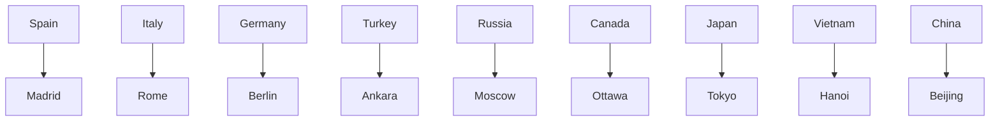
</details>

Country-Capital

Three examples of relationships that are automatically uncovered during wordembedding training – male-female, verb tense, and country-capital.

# Extending to larger vocabularies

# The most popular algorithms include

1. Word2Vec algorithm from Google   
2. GloVe algorithm from Stanford   
3. fasttext algorithm from Facebook

# • Continuous Skip-gram Model:

predicts words within a certain range before and after the current word in the same sentence.

# • Continuous Bag-of-Words Model (CBOW):

predicts the middle word based on surrounding context words. The context consists of a few words before and after the current (middle) word. This architecture is called a bag-of-words model as the order of words in the context is not important.

To train a neural network with a single hidden layer to perform a prediction task. But the goal is to learn the weights of the hidden layer–these weights are the “word vectors”.

“The wide road shimmered in the hot sun.” 

<table><tr><td>Window Size</td><td>Text</td><td>Skip-grams</td></tr><tr><td rowspan="3">2</td><td>[ The wide road shimmered ] in the hot sun.</td><td>wide, the wide, road wide, shimmered</td></tr><tr><td>The [ wide road shimmered in the ] hot sun.</td><td>shimmered, wide shimmered, road shimmered, in shimmered, the</td></tr><tr><td>The wide road shimmered in [ the hot sun ].</td><td>sun, the sun, hot</td></tr><tr><td rowspan="3">3</td><td>[ The wide road shimmered in ] the hot sun.</td><td>wide, the wide, road wide, shimmered wide, in</td></tr><tr><td>[ The wide road shimmered in the hot ] sun.</td><td>shimmered, the shimmered, wide shimmered, road shimmered, in shimmered, the shimmered, hot</td></tr><tr><td>The wide road shimmered [ in the hot sun ].</td><td>sun, in sun, the sun, hot</td></tr></table>

$\_$ One-hot embedding of the input word

$\_$ One-hot embedding of the target word

$\boldsymbol { \hat { y } } = \left( \hat { y } _ { 1 } , \cdots , \hat { y } _ { V } \right)$ Predicted vector of probabilities


<details>
<summary>flowchart</summary>

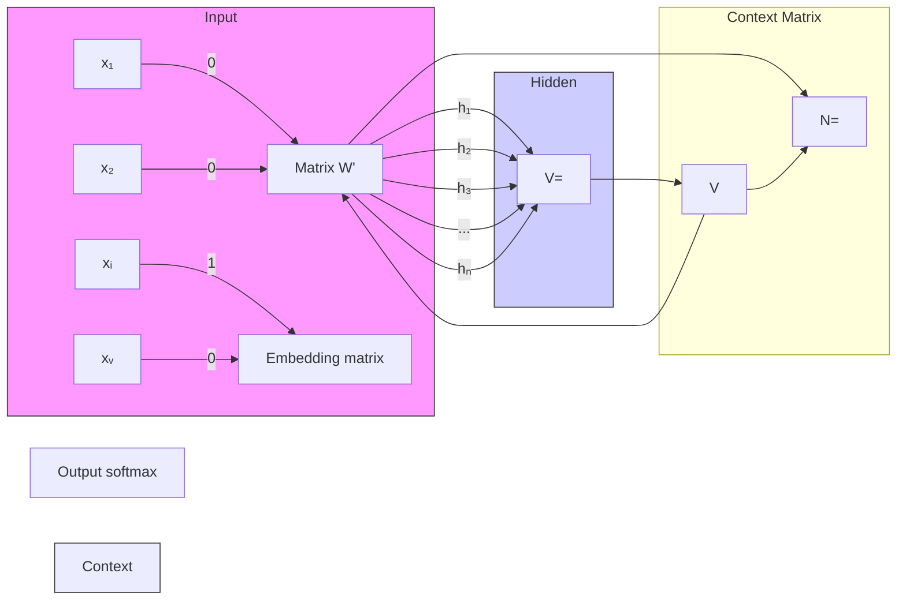
</details>


<details>
<summary>flowchart</summary>

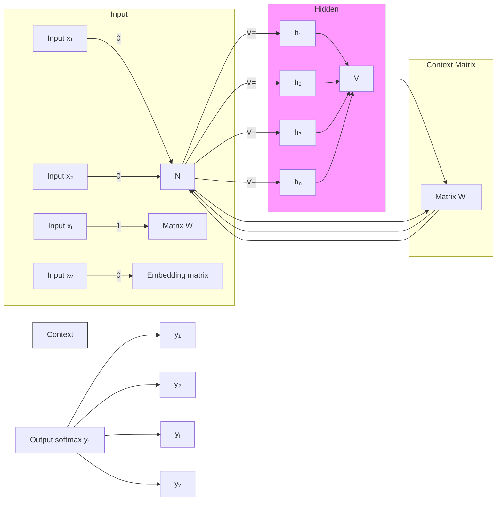
</details>

Rows of embedding matrix W are the embeddings of words.

$$
\left[ \begin{array}{l l l l l} 0 & 0 & 0 & 1 & 0 \end{array} \right] \times \left[ \begin{array}{l l l} 1 7 & 2 4 & 1 \\ 2 3 & 5 & 7 \\ 4 & 6 & 1 3 \\ 1 0 & 1 2 & 1 9 \\ 1 1 & 1 8 & 2 5 \end{array} \right] = \left[ \begin{array}{l l l} 1 0 & 1 2 & 1 9 \end{array} \right]
$$

Rows of embedding matrix W are the embeddings of words.

# “The quick brown fox jumps over the lazy dog.”

# Window size: 2 Sentence

The quickbrownfox jumps over the lazy dog.

The quick brown foxjumps over the lazy dog.

The quick brown foxjumpsover the lazy dog.

The quick brown fox jumpsoverthe lazy dog.

# Training Samples CBOW

(quick, brown), the)

(the,brown,fox),quick)

(the, quick,fox,jumps),brown)

(quick,brown,jumps,over),fox)

$X _ { 1 } , X _ { 2 } , \dots , X _ { w }$ A bag of One-hot embeddings of the input words

$\_$ One-hot embedding of the target word

$\cdot$ Predicted vector of probabilities

Input   


<details>
<summary>flowchart</summary>

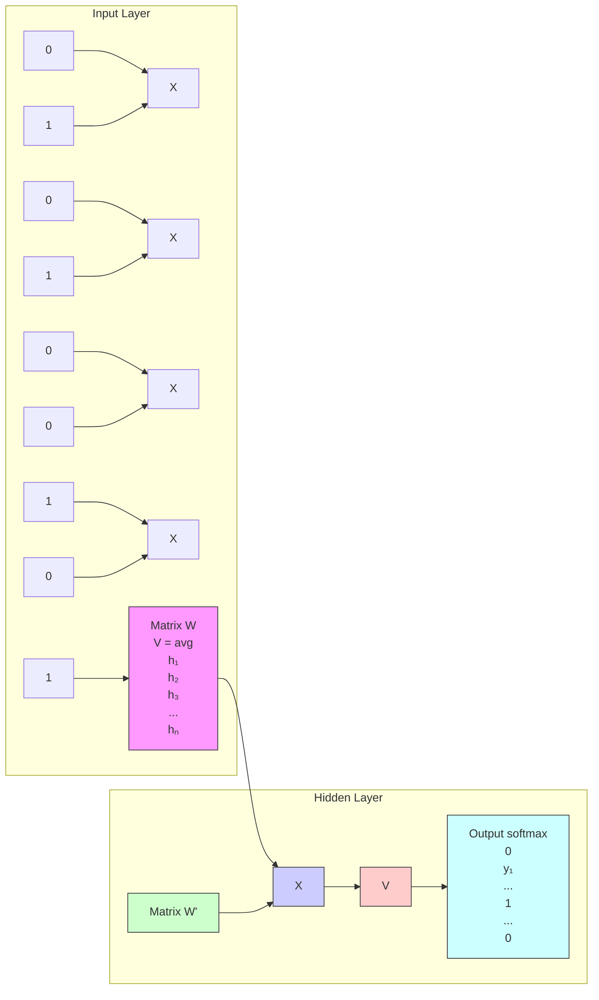
</details>

Input   


<details>
<summary>flowchart</summary>

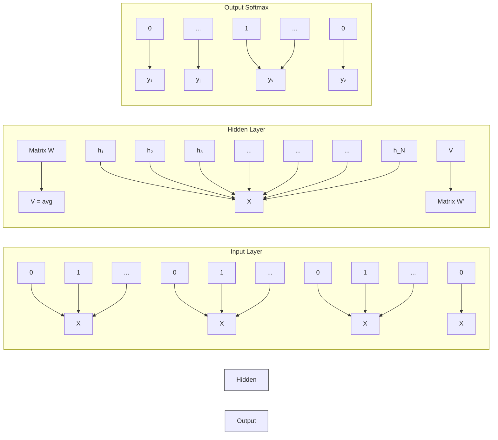
</details>

Rows of embedding matrix W are the embeddings of words.


<details>
<summary>flowchart</summary>

```mermaid
graph LR
    subgraph_Input_1["Input"]
        W_t_minus_2["W(t-2)"] --> SUM["SUM"]
        W_t_minus_1["W(t-1)"] --> SUM
        W_t_plus_1["W(t+1)"] --> SUM
        W_t_plus_2["W(t+2)"] --> SUM
    end

    subgraph_Projection_1["Projection"]
        SUM --> W_t["W(t)"]
    end

    subgraph_Output_1["Output"]
        W_t_minus_2 --> W_t_minus_1["W(t-1)"]
        W_t_minus_1 --> W_t_plus_1["W(t+1)"]
        W_t_plus_1 --> W_t_plus_2["W(t+2)"]
    end

    SUM --> W_t
    style Input_1 fill:#f9f,stroke:#333
    style Projection_1 fill:#bbf,stroke:#333
    style Output_1 fill:#bfb,stroke:#333
```
</details>

When vocabulary is extremely large, calculating the denominator of SoftMax is computationally impractical.

• Hierarchical Softmax (Morin and Bengio (2005))   
• Negative Sampling (Mikolov et al. (2013))


<details>
<summary>bar_line</summary>

| Question | Value |
| :--- | :--- |
| "What" | 0.11 |
| "I'm" | 0.28 |
| "Horse" | 0.03 |
| "Why" | 0.15 |
| "Huh" | 0.09 |
| "No" | 0.17 |
| "Yes" | 0.05 |
| "Sup" | 0.11 |
</details>


$$
\text { Computed   V   times   for   all   vocabs } \left\{ \begin{array}{l} \left[ \begin{array}{c} p (w _ {1} | w ^ {(t)}) \\ p (w _ {2} | w ^ {(t)}) \\ p (w _ {3} | w ^ {(t)}) \\ \vdots \\ p (w _ {V} | w ^ {(t)}) \end{array} \right] = \frac {\exp (W _ {\text { output }} \cdot h)}{\sum_ {i = 1} ^ {V} \exp (W _ {\text { output } _ {(i)}} \cdot h)} \in \mathbb {R} ^ {V} \\ \text { where   V   is   very   large } \\ \text { aegis4048.github.io } \\ \text { V   computations   are   needed   to } \end{array} \right.
$$

$$
\text { Complexity } = O (V + V) \approx O (V)
$$

getnormalizationfactor

$$
\left[ \begin{array}{c} p (D = 1 | w, c _ {p o s}) \\ p (D = 1 | w, c _ {n e g, 1}) \\ p (D = 1 | w, c _ {n e g, 2}) \\ p (D = 1 | w, c _ {n e g, 3}) \\ \vdots \\ p (D = 1 | w, c _ {n e g, K}) \end{array} \right]
$$

$$
= \frac {1}{1 + e x p (- (\{c _ {p o s} \} \cup W _ {n e g}) \cdot h)} \in \mathbb {R} ^ {K + 1} \tag {7}
$$

# Vanilla Skip-Gram

# Negative Sampling

W\_output (old) 

<table><tr><td>-0.560</td><td>0.340</td><td>0.160</td></tr><tr><td>-0.910</td><td>-0.440</td><td>1.560</td></tr><tr><td>-1.210</td><td>-0.130</td><td>-1.320</td></tr><tr><td>1.670</td><td>-0.150</td><td>-1.030</td></tr><tr><td>1.720</td><td>-1.460</td><td>0.730</td></tr><tr><td>0.000</td><td>1.390</td><td>-0.120</td></tr><tr><td>-0.060</td><td>1.520</td><td>-0.790</td></tr><tr><td>0.800</td><td>1.850</td><td>-1.670</td></tr><tr><td>-1.370</td><td>1.320</td><td>-0.480</td></tr><tr><td>0.670</td><td>1.990</td><td>-1.850</td></tr><tr><td>-1.520</td><td>-1.740</td><td>-1.860</td></tr></table>

（11X3）

Learning R. 

<table><tr><td>-</td><td>0.05</td><td>×</td></tr></table>

grad\_W\_output 

<table><tr><td>0.064</td><td>0.071</td><td>-0.014</td></tr><tr><td>0.098</td><td>0.015</td><td>0.063</td></tr><tr><td>0.069</td><td>0.089</td><td>0.045</td></tr><tr><td>0.014</td><td>0.085</td><td>0.079</td></tr><tr><td>-0.021</td><td>0.067</td><td>0.071</td></tr><tr><td>-0.098</td><td>-0.088</td><td>0.091</td></tr><tr><td>-0.072</td><td>-0.078</td><td>-0.089</td></tr><tr><td>0.046</td><td>-0.079</td><td>-0.053</td></tr><tr><td>-0.049</td><td>-0.087</td><td>0.025</td></tr><tr><td>-0.060</td><td>0.092</td><td>0.042</td></tr><tr><td>0.074</td><td>0.050</td><td>0.070</td></tr></table>

（11X3)

=   
W\_output (new) 

<table><tr><td>-0.563</td><td>0.336</td><td>0.161</td></tr><tr><td>-0.915</td><td>-0.441</td><td>1.557</td></tr><tr><td>-1.213</td><td>-0.134</td><td>-1.322</td></tr><tr><td>1.669</td><td>-0.154</td><td>-1.034</td></tr><tr><td>1.721</td><td>-1.463</td><td>0.726</td></tr><tr><td>0.005</td><td>1.394</td><td>-0.125</td></tr><tr><td>-0.056</td><td>1.524</td><td>-0.786</td></tr><tr><td>0.798</td><td>1.854</td><td>-1.667</td></tr><tr><td>-1.368</td><td>1.324</td><td>-0.481</td></tr><tr><td>0.673</td><td>1.985</td><td>-1.852</td></tr><tr><td>-1.524</td><td>-1.743</td><td>-1.864</td></tr></table>

（11X3）

W\_output (old) 

<table><tr><td>-0.560</td><td>0.340</td><td>0.160</td></tr><tr><td>-0.910</td><td>-0.440</td><td>1.560</td></tr><tr><td>-1.210</td><td>-0.130</td><td>-1.320</td></tr><tr><td>1.670</td><td>-0.150</td><td>-1.030</td></tr><tr><td>1.720</td><td>-1.460</td><td>0.730</td></tr><tr><td>0.000</td><td>1.390</td><td>-0.120</td></tr><tr><td>-0.060</td><td>1.520</td><td>-0.790</td></tr><tr><td>0.800</td><td>1.850</td><td>-1.670</td></tr><tr><td>-1.370</td><td>1.320</td><td>-0.480</td></tr><tr><td>0.670</td><td>1.990</td><td>-1.850</td></tr><tr><td>-1.520</td><td>-1.740</td><td>-1.860</td></tr></table>

（11×3）

LearningR. 

<table><tr><td>-</td><td>0.05</td><td>×</td></tr></table>

grad\_W\_output 

<table><tr><td>Not computed!</td></tr><tr><td>aegis4</td></tr></table>

<table><tr><td>Positive sample, w_o</td></tr><tr><td>Negative sample, k=1</td></tr><tr><td>Negative sample, k=2</td></tr><tr><td>Negative sample, k=3</td></tr></table>

<table><tr><td>0.031</td><td>0.030</td><td>0.041</td></tr><tr><td>-0.090</td><td>0.031</td><td>-0.065</td></tr><tr><td>0.056</td><td>0.098</td><td>-0.061</td></tr><tr><td>0.069</td><td>0.084</td><td>-0.044</td></tr></table>

=   
W\_output(new)

<table><tr><td>-0.560</td><td>0.340</td><td>0.160</td></tr><tr><td>-0.910</td><td>-0.440</td><td>1.560</td></tr><tr><td>-1.210</td><td>-0.130</td><td>-1.320</td></tr><tr><td>1.670</td><td>-0.150</td><td>-1.030</td></tr><tr><td>1.720</td><td>-1.460</td><td>0.730</td></tr><tr><td>0.000</td><td>1.390</td><td>-0.120</td></tr><tr><td>-0.060</td><td>1.520</td><td>-0.790</td></tr><tr><td>0.798</td><td>1.849</td><td>-1.672</td></tr><tr><td>-1.366</td><td>1.318</td><td>-0.477</td></tr><tr><td>0.667</td><td>1.985</td><td>-1.847</td></tr><tr><td>-1.523</td><td>-1.744</td><td>-1.858</td></tr></table>

（11X3）

# Binomial Classification

(regression, logistic)

(regression,machine)

(regression, sigmoid)

(regression, supervised)

(regression, neural)

# VS

(regression, zebra)

(regression, pimples)

(regression, Gangnam-Style)

(regression, toothpaste)

(regression, idiot)

Likely to observe

$$
p (D = 1 | w, c _ {p o s}) \approx 1
$$

Unlikely to observe

$$
p (D = 1 | w, c _ {n e g}) \approx 0
$$

Drilling fluids serve to balance formation pressures while drilling to ensure wellbore stability. They also carry cutings to the surface and cool the bit. The drilling engineer traditionally designs drilling fluids|with|two primary goals in mind: ↑

· To ensure safe, stable boreholes, which is accomplishel acceptable mud-weight window   
·To achieve high rates of penetration so that rig time and wellcost can be minimized4048.github.io

These|primary considerations do not include well productivity concerns. A growing recognition of the importance of drilling-induced formation damage has|led|to the use of drill-in fluids (fluids used to drill through the pay zone) that minimize formation damage. This page discusses the formation damage that may be associated with various types of drilling fluids.

Center word: drilling

$$
K = 5
$$

$$
i t e r = 1
$$

$$
i t e r = 2
$$

$$
i t e r = 3
$$

$$
i t e r = 4
$$

Current context word: engineer

$$
p \big (D = 1 | w _ {d r i l l i n g}, c _ {e n g i n e e r} \big)
$$

$$
p (D = 1 | w _ {d r i l l i n g}, c _ {m i n i m i z e d})
$$

$$
p (D = 1 | w _ {d r i l l i n g}, c _ {p r i m a r y})
$$

$$
p (D = 1 | w _ {d r i l l i n g}, c _ {c o n c e r n s})
$$

$$
p (D = 1 | w _ {d r i l l i n g}, c _ {l e d})
$$

$$
p \big (D = 1 \big | w _ {d r i l l i n g}, c _ {p a g e} \big)
$$


# Attention

Vaswani, A., Shazeer, N., Parmar, N., Uszkoreit, J., Jones, L., Gomez, A. N., ... & Polosukhin, I. (2017). Attention is all you need. Advances in neural information processing systems, 30.

Google citation: 172734


<details>
<summary>flowchart</summary>

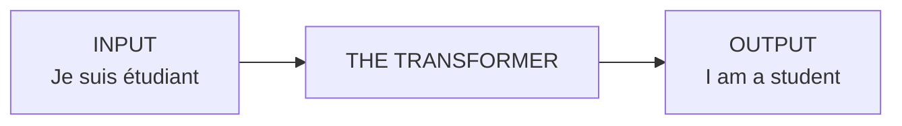
</details>


<details>
<summary>flowchart</summary>

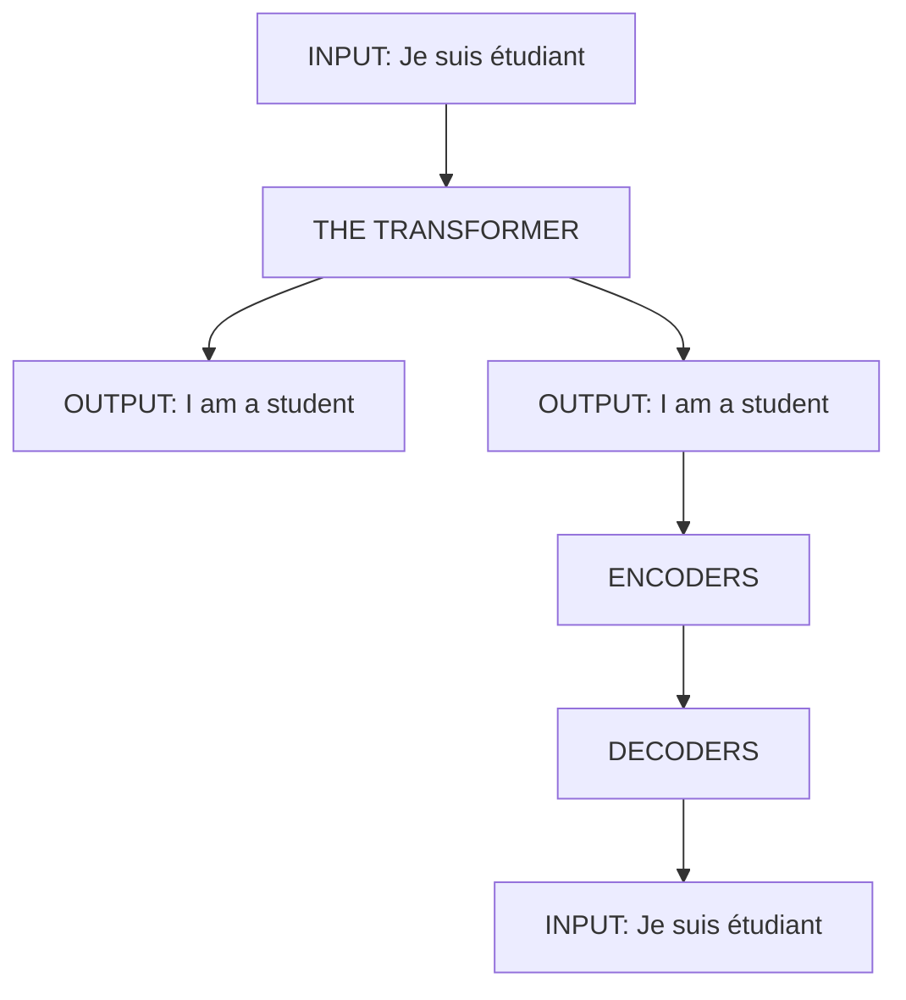
</details>


<details>
<summary>flowchart</summary>

```mermaid
graph TD
    A["INPUT"] --> B["Je suis étudiant"]
    B --> C["ENCODER"]
    C --> D["ENCODER"]
    D --> E["ENCODER"]
    E --> F["ENCODER"]
    F --> G["ENCODER"]
    G --> H["ENCODER"]
    H --> I["ENCODER"]
    I --> J["ENCODER"]
    J --> K["ENCODER"]
    K --> L["ENCODER"]
    L --> M["ENCODER"]
    M --> N["ENCODER"]
    N --> O["ENCODER"]
    O --> P["ENCODER"]
    P --> Q["ENCODER"]
    Q --> R["ENCODER"]
    R --> S["ENCODER"]
    S --> T["ENCODER"]
    T --> U["ENCODER"]
    U --> V["ENCODER"]
    V --> W["ENCODER"]
    W --> X["ENCODER"]
    X --> Y["ENCODER"]
    Y --> Z["ENCODER"]
    Z --> AA["ENCODER"]
    AA --> AB["ENCODER"]
    AB --> AC["ENCODER"]
    AC --> AD["ENCODER"]
    AD --> AE["ENCODER"]
    AE --> AF["ENCODER"]
    AF --> AG["ENCODER"]
    AG --> AH["ENCODER"]
    AH --> AI["ENCODER"]
    AI --> AJ["ENCODER"]
    AJ --> AK["ENCODER"]
    AK --> AL["ENCODER"]
    AL --> AM["ENCODER"]
    AM --> AN["ENCODER"]
    AN --> AO["ENCODER"]
    AO --> AP["ENCODER"]
    AP --> AQ["ENCODER"]
    AQ --> AR["ENCODER"]
    AR --> AS["ENCODER"]
    AS --> AT["ENCODER"]
    AT --> AU["ENCODER"]
    AU --> AV["ENCODER"]
    AV --> AW["ENCODER"]
    AW --> AX["ENCODER"]
    AX --> AY["ENCODER"]
    AY --> AZ["ENCODER"]
    AZ --> BA["ENCODER"]
    BA --> BB["ENCODER"]
    BB --> BC["ENCODER"]
    BC --> BD["ENCODER"]
    BD --> BE["ENCODER"]
    BE --> BF["ENCODER"]
    BF --> BG["ENCODER"]
    BG --> BH["ENCODER"]
    BH --> BI["ENCODER"]
    BI --> BJ["ENCODER"]
    BJ --> BK["ENCODER"]
    BK --> BL["ENCODER"]
    BL --> BM["ENCODER"]
    BM --> BN["ENCODER"]
    BN --> BO["ENCODER"]
    BO --> BP["ENCODER"]
    BP --> BQ["ENCODER"]
    BQ --> BR["ENCODER"]
    BR --> BS["ENCODER"]
    BS --> BT["ENCODER"]
    BT --> BU["ENCODER"]
    BU --> BV["ENCODER"]
    BV --> BW["ENCODER"]
    BW --> BX["ENCODER"]
    BX --> BY["ENCODER"]
    BY --> BZ["ENCODER"]
    BZ --> CA["ENCODER"]
    CA --> CB["ENCODER"]
    CB --> CC["ENCODER"]
    CC --> CD["ENCODER"]
    CD --> CE["ENCODER"]
    CE --> CF["ENCODER"]
    CF --> CG["ENCODER"]
    CG --> CH["ENCODER"]
    CH --> CI["ENCODER"]
    CI --> CJ["ENCODER"]
    CJ --> CK["ENCODER"]
    CK --> CR["ENCODER"]
    CR --> CS["ENCODER"]
    CS --> CT["ENCODER"]
    CT --> CU["ENCODER"]
    CU --> CV["ENCODER"]
    CV --> CW["ENCODER"]
    CW --> CX["ENCODER"]
    CX --> CY["ENCODER"]
    CY --> CZ["ENCODER"]
    CZ --> DA["ENCODER"]
    DA --> DB["ENCODER"]
    DB --> DC["ENCODER"]
    DC --> DD["ENCODER"]
    DD --> DE["ENCODER"]
    DE --> DF["ENCODER"]
    DF --> DG["ENCODER"]
    DG --> DH["ENCODER"]
    DH --> DI["ENCODER"]
    DI --> DJ["ENCODER"]
    DJ --> DK["ENCODER"]
    DK --> DL["ENCODER"]
    DL --> DV["ENCODER"]
    DV --> DW["ENCODER"]
    DW --> DX["ENCODER"]
    DX --> DY["ENCODER"]
```
</details>

Encode the input information (obtain the embedding)   
Decode the information (predict words)


<details>
<summary>flowchart</summary>

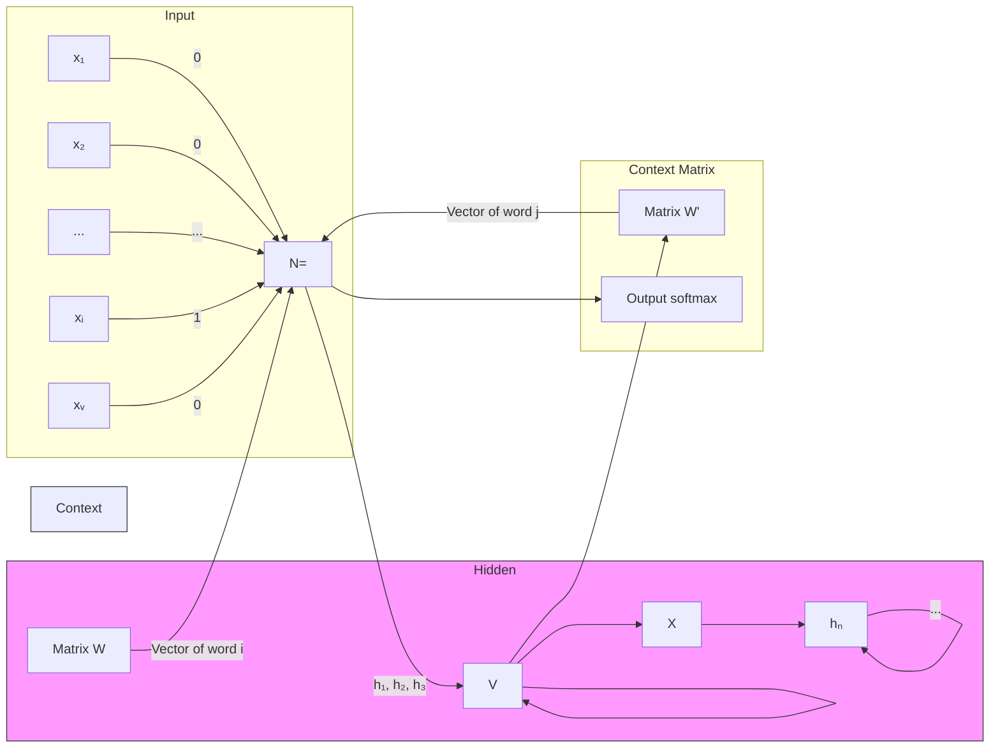
</details>

What are the disadvantages of MLP?


<details>
<summary>flowchart</summary>

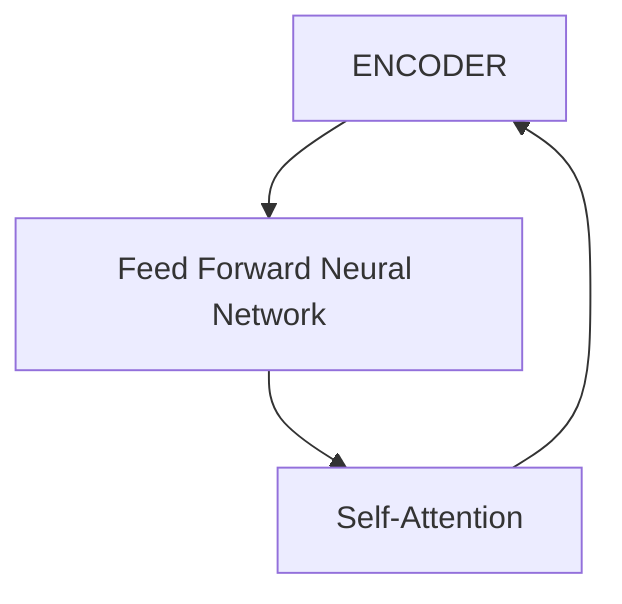
</details>


<details>
<summary>flowchart</summary>

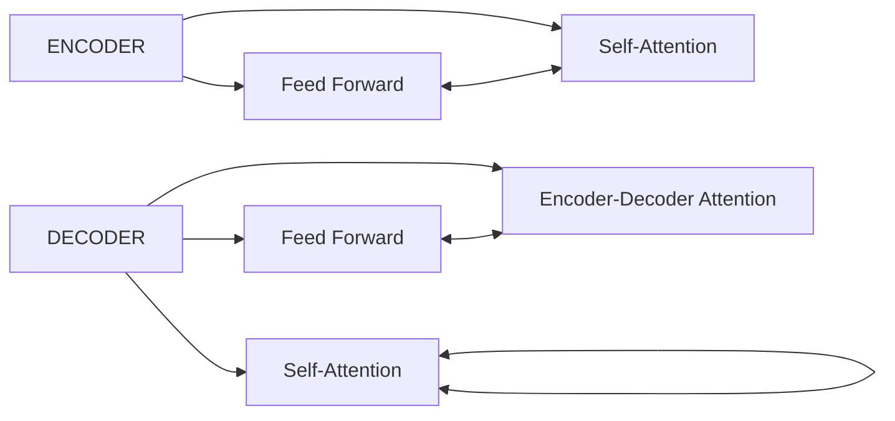
</details>

The additional attention layer is to help the model focuses on the right parts of the data!


<details>
<summary>text_image</summary>

original
</details>


<details>
<summary>text_image</summary>

men
Fixation Length
High Low
</details>


<details>
<summary>text_image</summary>

women
Fixation Length
High
Low
</details>

source: https://packageinsight.com/the-importance-of-visual-attention/


<details>
<summary>text_image</summary>

Tel: 212-285-0668
錦江飯店
健康堂
喜運來大酒來
AHEAD
知乎 @赵强
</details>


<details>
<summary>text_image</summary>

Tel: 212-285-0668
錦江飯店
健康堂
喜運來大酒來
AHEAD
知乎 @赵强
</details>


<details>
<summary>text_image</summary>

Tel:212-285-0668
錦江飯店
健康堂
喜運來大酒來
AHEAD
優の良品
知乎 @赵强
</details>


<details>
<summary>flowchart</summary>

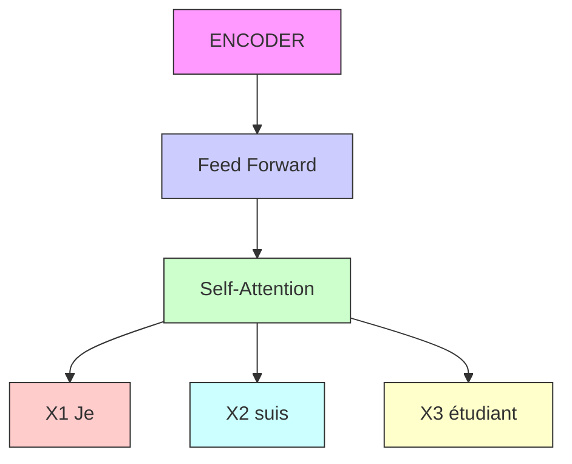
</details>

Conceptually, the attention layer will give some weights to the embedding of each word.


<details>
<summary>flowchart</summary>

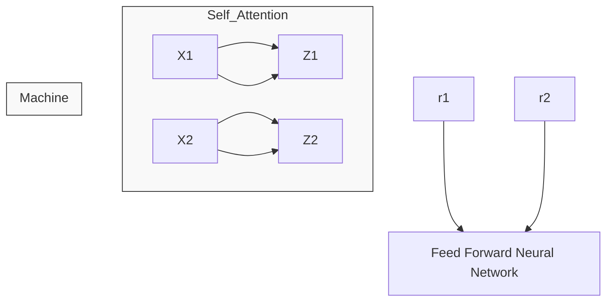
</details>

The word at each position passes through a self-attention process. Then, they each pass through a feed-forward neural network -- the exact same network with each vector flowing through it separately.

# Consider translating the following sentence:

“The animal didn't cross the street because it was too tired”

# Question: What does the word “it” refer to?

The context is very important!!!


<details>
<summary>flowchart</summary>

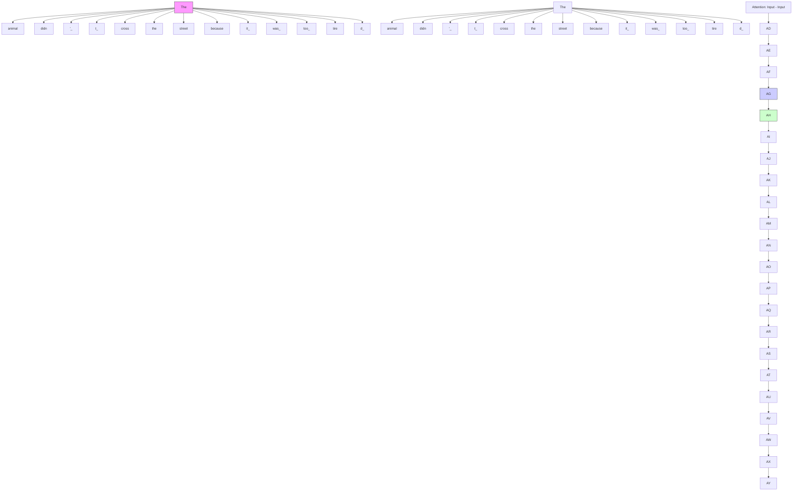
</details>


<details>
<summary>flowchart</summary>

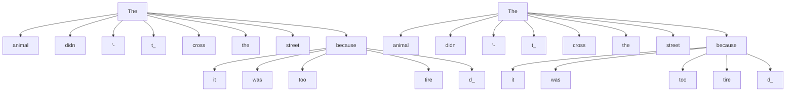
</details>

Self-attention


<details>
<summary>flowchart</summary>

```mermaid
graph TD
    subgraph_LSTM_Memory_Cell["LSTM Memory Cell"]
        A["Forget gate"] --> B["σ"]
        C["Input gate"] --> D["σ"]
        E["tanh"] --> F["σ"]
        G["tanh"] --> H["×"]
        I["×"] --> J["×"]
        K["+"] --> L["+"]
    end
    subgraph_Output_Gage["Output gate"]
        M["tanh"] --> N["×"]
        O["σ"] --> P["×"]
        Q["h_t"] --> R["ht"]
        S["h_t-1"] --> T["x_t"]
    end
    style LSTM_Memory_Cell fill:#f9f,stroke:#333
    style Output_Gage fill:#ccf,stroke:#333
    style Output_Gage fill:#cfc,stroke:#333
```
</details>

LSTM


<details>
<summary>flowchart</summary>

```mermaid
graph TD
    subgraph_Encoder_1["ENCODER #1"]
        A["Feed Forward Neural Network"] --> B["Self-Attention"]
        C["Feed Forward Neural Network"] --> B
        D["z1"] --> B
        E["z2"] --> B
    end
    subgraph_Encoder_2["ENCODER #2"]
        F["r1"] --> G["Self-Attention"]
        H["r2"] --> I["Machines"]
    end
    J["x1"] --> K["Thinking"]
    L["x2"] --> M["Machines"]
    style Encoder_1 fill:#f9f,stroke:#333
    style Encoder_2 fill:#bbf,stroke:#333
```
</details>

Step 1: Given the embedding x, we will compute the Query vector, the Key vector, and the Value vector.

How to create Q, K, V?

These vectors are created by multiplying the embedding by three matrices that we trained during the training process.

Input

Embedding

Queries

Keys

Values


Machines


(Dimension 64)


<details>
<summary>natural_image</summary>

Grid pattern with 10 cells in light gray and 3 cells in light purple, no text or symbols present
</details>

WQ


<details>
<summary>natural_image</summary>

Grid pattern with 10 squares in orange border, no text or symbols present
</details>


<details>
<summary>natural_image</summary>

Grid pattern with 10 squares in light blue, no text or symbols present
</details>

Step 2: The score is calculated by taking the dot product of the query vector with the key vector of the respective word we’re scoring.

Input

Embedding

Queries

Keys

Values

Score


$\mathsf { q } _ { 1 }$


$\cdot$


$\boldsymbol { \mathsf { v } } _ { 1 }$


$$
\mathbf {q} _ {1} \cdot \mathbf {k} _ {1} = 1 1 2
$$


$\mathbf { q } _ { 2 }$


${ \bf k } _ { 2 }$


$\mathsf { v } _ { 2 }$


$$
\mathbf {q} _ {1} \cdot \mathbf {k} _ {2} = 9 6
$$

Step 3: normalize the score by $\sqrt { d _ { k } }$ , where $\sqrt { d _ { k } }$ is the dimension of the key vector.

Input

Embedding

Queries

Keys

Values

Score

Divide by $8 ( \sqrt { d _ { k } } )$

Softmax


$$
\mathbf {q} _ {1} \cdot \mathbf {k} _ {1} = 1 1 2
$$


$$
\mathbf {q} _ {1} \cdot \mathbf {k} _ {2} = 9 6
$$

Step 4: Further normalize the score by softmax.   


Step 5: Multiply each value vector by the softmax score (in preparation to sum them up).


<details>
<summary>bar</summary>

| Input        | Thinking | Machines |
| ------------ | -------- | -------- |
| Embedding    | x₁       | x₂       |
| Queries      | q₁       | q₂       |
| Keys         | k₁       | k₂       |
| Values       | v₁       | v₂       |
| Score        | q₁ • k₁ = 112 | q₁ • k₂ = 96 |
| Divide by 8 (√dk) | 14     | 12       |
| Softmax      | 0.88     | 0.12     |
| Softmax X Value | v₁     | v₂      |
| Sum          | z₁       | z₂      |
</details>

Step 6: Sum up the weighted value vectors. This produces the output of the self-attention layer at this position (for the first word).


<details>
<summary>bar</summary>

| Input        | Thinking | Machines |
| ------------ | -------- | -------- |
| Embedding    | x₁       | x₂       |
| Queries      | q₁       | q₂       |
| Keys         | k₁       | k₂       |
| Values       | v₁       | v₂       |
| Score        | q₁ • k₁ = 112 | q₁ • k₂ = 96 |
| Divide by 8 (√dk) | 14     | 12       |
| Softmax      | 0.88     | 0.12     |
| Softmax X Value | v₁     | v₂      |
| Sum          | z₁       | z₂      |
</details>

Create the Q, K, V: Every row in the X matrix corresponds to a word in the input sentence. Here, $W ^ { Q } , W ^ { K } , W ^ { V }$ are trained parameters.


<details>
<summary>text_image</summary>

softmax( Q × K^T ) V
√d_k
</details>


<details>
<summary>text_image</summary>

= \n\nZ
</details>


<details>
<summary>flowchart</summary>

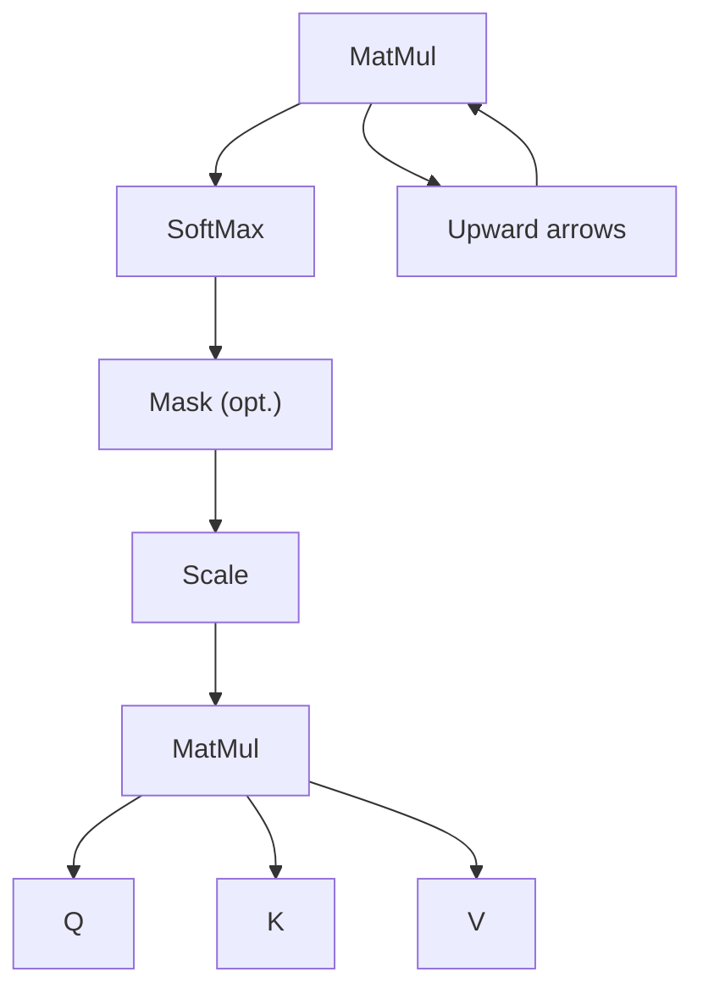
</details>

# Attention Animation

https://www.bilibili.com/video/BV1dt4y1J7ov/?spm\_id\_from=333.337.search-

card.all.click&vd\_source=cc88065420e6f003010306f4a620f7f3

# Attention in Neural Networks

https://www.youtube.com/watch?v=W2rWgXJBZhU

# Attention Mechanism In a nutshell

https://www.youtube.com/watch?v=oMeIDqRguLY

# The math behind Attention: Keys, Queries, and Values matrices

https://www.youtube.com/watch?v=UPtG\_38Oq8o

# Transformer

X   
  
ATTENTION HEAD #0


  
WoQ


ATTENTION HEAD #1   


# Motivations:

1. Increase capability for focusing on different positions of the input sequence data.   
2. Increase the representation power of the value vectors.


<details>
<summary>flowchart</summary>

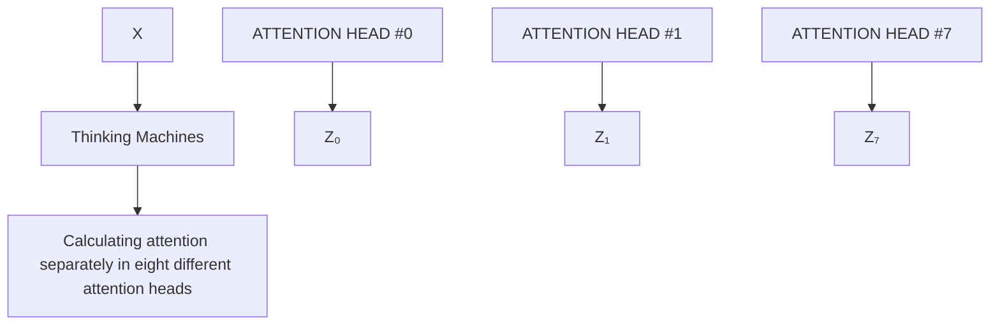
</details>

1) Concatenate all the attention heads


<details>
<summary>text_image</summary>

Z₀ Z₁ Z₂ Z₃ Z₄ Z₅ Z₆ Z₇
</details>

2) Multiply with a weight matrix W° that was trained jointly with the model

X

3) The result would be the Z matrix that captures information from all the attention heads.We can send this forward to the FFNN


<details>
<summary>text_image</summary>

= \n\nZ
</details>


<details>
<summary>text_image</summary>

W°
</details>

1) This is our input sentence\*

2) We embed each word\*

3) Split into 8 heads. We multiply X or R with weight matrices

4) Calculate attention using the resulting Q/K/V matrices

5) Concatenate the resulting Z matrices, then multiply with weight matrix W to produce the output of the layer


\* In all encoders other than #0, we don't need embedding. We start directly with the output of the encoder right below this one


<details>
<summary>text_image</summary>

W₀^Q
W₀^K
W₀^V
</details>


<details>
<summary>text_image</summary>

Q₀
K₀
V₀
</details>


<details>
<summary>text_image</summary>

W₁^Q
W₁^K
W₁^V
</details>


<details>
<summary>text_image</summary>

W7^Q
W7^K
W7^V
</details>


<details>
<summary>text_image</summary>

Q7
K7
V7
</details>


<details>
<summary>text_image</summary>

W°
</details>


<details>
<summary>tree</summary>

| Part       | Value |
| ---------- | ----- |
| The_       | 1     |
| animal_    | 1     |
| didn_      | 1     |
| _          | 1     |
| t_         | 1     |
| cross_     | 1     |
| the_       | 1     |
| street_    | 1     |
| because_   | 1     |
| it_        | 1     |
| was_       | 1     |
| too_       | 1     |
| tire       | 1     |
| d_         | 1     |
</details>


<details>
<summary>other</summary>

| Input Type | Attention Direction |
| ---------- | ------------------- |
| The        | 100                 |
| animal     | 80                  |
| didn       | 70                  |
| '          | 60                  |
| t          | 50                  |
| cross      | 40                  |
| the        | 30                  |
| street     | 20                  |
| because    | 10                  |
| it         | 5                   |
| was        | 3                   |
| too        | 2                   |
| tire       | 1                   |
| d          | 0                   |
</details>

Challenges: Difficult to explain if we put all of them together!!! Position information is not really embedded.


<details>
<summary>flowchart</summary>

```mermaid
graph TD
    A["ENCODER #0"] --> B["DECODER #0"]
    C["ENCODER #1"] --> D["DECODER #1"]
    E["EMBEDDINGS"] --> F["POSITIONAL ENCOING"]
    G["Embedding WITH TIME SIGNAL"] --> H["X1 = Je"]
    I["Positional ENCOING"] --> J["t1 + suis"]
    K["Embeddings"] --> L["X1 + étudiant"]
    style A fill:#e6f3ff,stroke:#333
    style C fill:#e6f3ff,stroke:#333
    style E fill:#e6f3ff,stroke:#333
    style G fill:#e6f3ff,stroke:#333
    style B fill:#e6f3ff,stroke:#333
    style D fill:#e6f3ff,stroke:#333
    style F fill:#e6f3ff,stroke:#333
    style J fill:#e6f3ff,stroke:#333
    style L fill:#e6f3ff,stroke:#333
```
</details>

Idea: Create an additional vector with the same dimension which helps it determine the position of each word or the distance between different words in the sequence.

POSITIONAL ENCODING

EMBEDDINGS

INPUT


<details>
<summary>text_image</summary>

0 0 1 1
</details>

+   


<details>
<summary>heatmap</summary>

| Value | Color |
|---|---|
| 0.84 | Green |
| 0.0001 | Teal |
| 0.54 | Green |
| 1 | Yellow |
</details>

+   


<details>
<summary>heatmap</summary>

| Value |
|---|
| 0.91 |
| 0.0002 |
| -0.42 |
| 1 |
</details>

+   


Let t be the desired position in an input sentence, $\vec { p _ { t } } \in \mathbb { R } ^ { d }$ corresponding encoding, and d be the encoding dimension (where $d \equiv _ { 2 } 0 )$ Then $f : \mathbb { N } \to \mathbb { R } ^ { d }$ will be te function that produces the output vector $\xrightarrow [ { p _ { t } ^ { \prime } } ] { }$ and it is defined as follows:

$$
\overrightarrow {p _ {t}} ^ {(i)} = f (t) ^ {(i)} := \left\{ \begin{array}{l l} \sin (\omega_ {k}. t), & \text { if } i = 2 k \\ \cos (\omega_ {k}. t), & \text { if } i = 2 k + 1 \end{array} \right.
$$

where

$$
\omega_ {k} = \frac {1}{1 0 0 0 0 ^ {2 k / d}}
$$


<details>
<summary>heatmap</summary>

| Depth | Position | Value  |
|-------|----------|--------|
| 0     | 0        | 1.00   |
| 0     | 10       | 0.75   |
| 0     | 20       | 0.50   |
| 0     | 30       | 0.25   |
| 0     | 40       | 0.00   |
| 0     | 50       | -0.25  |
| 10    | 0        | 0.75   |
| 10    | 10       | 0.50   |
| 10    | 20       | 0.25   |
| 10    | 30       | 0.00   |
| 10    | 40       | -0.25  |
| 10    | 50       | -1.00  |
| 20    | 0        | 0.75   |
| 20    | 10       | 0.50   |
| 20    | 20       | 0.25   |
| 20    | 30       | 0.00   |
| 20    | 40       | -0.25  |
| 20    | 50       | -1.00  |
| 30    | 0        | 0.75   |
| 30    | 10       | 0.50   |
| 30    | 20       | 0.25   |
| 30    | 30       | 0.00   |
| 30    | 40       | -0.25  |
| 30    | 50       | -1.00  |
| 40    | 0        | 0.75   |
| 40    | 10       | 0.50   |
| 40    | 20       | 0.25   |
| 40    | 30       | 0.00   |
| 40    | 40       | -0.25  |
| 40    | 50       | -1.00  |
| 50    | 0        | 0.75   |
| 50    | 10       | 0.50   |
| 50    | 20       | 0.25   |
| 50    | 30       | 0.00   |
| 50    | 40       | -0.25  |
| 50    | 50       | -1.00  |
| 60    | 0        | 0.75   |
| 60    | 10       | 0.50   |
| 60    | 20       | 0.25   |
| 60    | 30       | 0.00   |
| 60    | 40       | -0.25  |
| 60    | 50       | -1.00  |
| 70    | 0        | 0.75   |
| 70    | 10       | 0.50   |
| 70    | 20       | 0.25   |
| 70    | 30       | 0.00   |
| 70    | 40       | -0.25  |
| 70    | 50       | -1.00  |
| 80    | 0        | 0.75   |
| 80    | 10       | 0.50   |
| 80    | 20       | 0.25   |
| 80    | 30       | 0.00   |
| 80    | 40       | -0.25  |
| 80    | 50       | -1.00  |
| 90    | 0        | 0.75   |
| 90    | 10       | 0.50   |
| 90    | 20       | 0.25   |
| 90    | 30       | 0.00   |
| 90    | 40       | -0.25  |
| 90    | 50       | -1.00  |
| 100   | 0        | 0.75   |
| 100   | 10       | 0.50   |
| 100   | 20       | 0.25   |
| 100   | 30       | 0.00   |
| 100   | 40       | -0.25  |
| 100   | 50       | -1.00  |
| 110   | 0        | 0.75   |
| 110   | 10       | 0.50   |
| 110   | 20       | 0.25   |
| 110   | 30       | 0.00   |
| 110   | 40       | -0.25  |
| 110   | 50       | -1.00  |
| 120   | 0        | 0.75   |
| 120   | 10       | 0.50   |
| 120   | 20       | 0.25   |
| 120   | 30       | -1.75   |
|          |          |         |
</details>


<details>
<summary>flowchart</summary>

```mermaid
graph TD
    A["Encoder #1"] --> B["Add & Normalize"]
    A --> C["Feed Forward"]
    A --> D["Add & Normalize"]
    A --> E["Self-Attention"]
    B --> F["Positional Encoding"]
    C --> G["Residual connection"]
    D --> H["Thinking"]
    E --> I["Machines"]
    style A fill:#f9f,stroke:#333
    style B fill:#ccf,stroke:#333
    style C fill:#cfc,stroke:#333
    style D fill:#fcc,stroke:#333
    style E fill:#cff,stroke:#333
    style F fill:#ffc,stroke:#333
    style G fill:#cfc,stroke:#333
    style H fill:#cfc,stroke:#333
```
</details>


<details>
<summary>flowchart</summary>

```mermaid
graph TD
    A["Add & Normalize"] --> B["Feed Forward"]
    B --> C["Z1"]
    B --> D["Z2"]
    C --> E["LayerNorm( X + Z ) "]
    D --> F["Self-Attention"]
    E --> G["POSitional Encoding"]
    F --> H["Thinking"]
    F --> I["Machines"]
    J["ENCODER #1"] --> K["Input: x1, x2"]
    style A fill:#d4edda,stroke:#000
    style B fill:#d4edda,stroke:#000
    style C fill:#d4edda,stroke:#000
    style D fill:#d4edda,stroke:#000
    style E fill:#d4edda,stroke:#000
    style F fill:#d4edda,stroke:#000
    style G fill:#d4edda,stroke:#000
    style H fill:#d4edda,stroke:#000
    style I fill:#d4edda,stroke:#000
```
</details>


<details>
<summary>flowchart</summary>

```mermaid
graph TD
    subgraph_Encoder_1["ENCODER #1"]
        A["Add & Normalize"] --> B["Self-Attention"]
        C["Add & Normalize"] --> D["Feed Forward"]
        E["Add & Normalize"] --> F["Feed Forward"]
        G["Add & Normalize"] --> H["Feed Forward"]
        I["Add & Normalize"] --> J["Feed Forward"]
        K["Add & Normalize"] --> L["Feed Forward"]
        M["Add & Normalize"] --> N["Feed Forward"]
        O["Add & Normalize"] --> P["Feed Forward"]
        Q["Add & Normalize"] --> R["Feed Forward"]
        S["Add & Normalize"] --> T["Feed Forward"]
        U["Add & Normalize"] --> V["Feed Forward"]
        W["Add & Normalize"] --> X["Feed Forward"]
        Y["Add & Normalize"] --> Z["Feed Forward"]
        AA["Add & Normalize"] --> AB["Feed Forward"]
        AC["Add & Normalize"] --> AD["Feed Forward"]
        AE["Add & Normalize"] --> AF["Feed Forward"]
        AG["Add & Normalize"] --> AH["Feed Forward"]
        AI["Add & Normalize"] --> AJ["Feed Forward"]
        AK["Add & Normalize"] --> AL["Feed Forward"]
        AM["Add & Normalize"] --> AN["Feed Forward"]
        AO["Add & Normalize"] --> AP["Feed Forward"]
        AQ["Add & Normalize"] --> AR["Feed Forward"]
        AS["Add & Normalize"] --> AT["Feed Forward"]
        AU["Add & Normalize"] --> AV["Feed Forward"]
        AW["Add & Normalize"] --> AX["Feed Forward"]
        AY["Softmax"] --> AZ["Linear"]
        BA["DECODER #2"] --> BB["Decoder #1"]
    end

    subgraph_Encoder_2["ENCODER #2"]
        B --> AC
        D --> AE
        F --> AG
        H --> AI
        J --> AQ
        AL --> AM
    end

    subgraph_Decoder_1["DECODER #1"]
        B --> AA
        D --> AB
        E --> AC
        F --> AD
        G --> AE
        H --> AF
        I --> AG
        J --> AH
        K --> AI
        AA --> AJ
        AB --> AK
        AC --> AL
        AD --> AM
        AE --> AN
        AF --> AO
        AG --> AP
        AH --> AQ
        AI --> AQ
        AJ --> AQ
        AK --> AQ
    end

    style Encoder_1 fill:#f9f,stroke:#333
    style Decoder_1 fill:#bbf,stroke:#333
    style Encoder_2 fill:#dfd,stroke:#333
    style Decoder_2 fill:#dfd,stroke:#333
```
</details>

Decoding time step:①2 3 4 5 6

OUTPUT


<details>
<summary>flowchart</summary>

```mermaid
graph TD
    A["INPUT"] --> B["EMBEDDING WITH TIME SIGNAL"]
    A --> C["EMBEDDINGS"]
    C --> D["ENCODER"]
    D --> E["DECODER"]
    E --> F["Linear + Softmax"]
    F --> G["ENCODER"]
    G --> H["DECODER"]
    H --> I["DECODER"]
    I --> J["Linear + Softmax"]
    style A fill:#f9f,stroke:#333
    style B fill:#ccf,stroke:#333
    style C fill:#ccf,stroke:#333
    style D fill:#cfc,stroke:#333
    style E fill:#cfc,stroke:#333
    style F fill:#fcc,stroke:#333
    style G fill:#fcc,stroke:#333
    style H fill:#fcc,stroke:#333
    style I fill:#fcc,stroke:#333
    style J fill:#fcc,stroke:#333
```
</details>

Decoding time step: 1②3 4 5 6

OUTPUT


<details>
<summary>flowchart</summary>

```mermaid
graph TD
    A["Input"] --> B["Je"]
    A --> C["suis"]
    A --> D["étudiant"]
    E["EMBEDDING WITH TIME SIGNAL"] --> F["ENCODERS"]
    G["Previous OUTPUTS"] --> H["DECODERS"]
    I["Linear + Softmax"] --> J["ENCODERS"]
    K["K_encdec"] --> L["V_encdec"]
    M["1"] --> N["DECODERS"]
    style A fill:#f9f,stroke:#333
    style B fill:#ccf,stroke:#333
    style C fill:#ccf,stroke:#333
    style D fill:#ccf,stroke:#333
    style E fill:#cfc,stroke:#333
    style F fill:#fcc,stroke:#333
    style G fill:#fcc,stroke:#333
    style H fill:#fcc,stroke:#333
    style I fill:#fcc,stroke:#333
    style J fill:#fcc,stroke:#333
    style K fill:#cff,stroke:#333
    style L fill:#ffc,stroke:#333
    style M fill:#ffc,stroke:#333
    style N fill:#ffc,stroke:#333
```
</details>

Warning: The self-attention layer is only allowed to attend to earlier positions in the output sequence. This is done by masking future positions (setting them to - inf) before the softmax step in the self-attention calculation.

# Convert the output of the decoder to words

Which word in our vocabulary is associated with this index?

Get the index of the cell with the highest value (argmax)

5

log\_probs


<details>
<summary>flowchart</summary>

```mermaid
graph TD
    A["Softmax"] --> B["... vocab_size"]
    C["Linear"] --> D["... vocab_size"]
    A --> E["0 1 2 3 4 5 ... vocab_size"]
    C --> F["0 1 2 3 4 5 ... vocab_size"]
    G[" "] --> H[" "]
```
</details>

logits

Decoder stack output

# Train the Transformer

1. English to German: WMT 2014 English-German dataset (4.5 M sentence pairs). Vocabulary token size: 37000.   
2. English to French: WMT 2014 English-French dataset (36 M sentence pairs). Vocabulary token size: 32000.

Training batch size: one batch contains about 25000 source tokens and 25000 target tokens.

Optimizer: ADAM with $\beta _ { 1 } = 0 . 9 , \ \beta _ { 2 } = 0 . 9 8 , \epsilon = 1 0 ^ { - 9 }$ . The learning rate is scheduled as

$$
l _ {r} = d _ {m o d e l} ^ {- 0. 5} \times \min \big (n u m _ {s t e p} ^ {- 0. 5}, n u m _ {s t e p} \times n u m _ {w a r m u p} ^ {- 1. 5} \big),
$$

where ?????????????????? = 400.

Regularization: Dropout for each sublayer with probability 0.1.

# Applications

Devlin, J., Chang, M. W., Lee, K., & Toutanova, K. (2019). Bert: Pre-training of deep bidirectional transformers for language understanding. NAACL.


<details>
<summary>text_image</summary>

NLP
BERT、GPT
Transformer
Attention
</details>

Devlin, J., Chang, M. W., Lee, K., & Toutanova, K. (2019). Bert: Pre-training of deep bidirectional transformers for language understanding. NAACL.


<details>
<summary>flowchart</summary>

```mermaid
graph TD
    NSP["NSP"] --> C["C"]
    NSP --> T1["T₁"]
    MaskLM["Mask LM"] --> TN["Tₙ"]
    MaskLM --> TSEP["T[{SEP}"]
    MaskLM --> T1'[T₁']
    MaskLM --> TM["Tₘ'"]
    BERT["BERT"] --> ECLS["E[CLS"]]
    BERT --> ENEN["EN"]
    BERT --> ESEP1["E[{SEP}"]
    BERT --> E1'1["E₁'"]
    BERT --> EMEM["EM'"]
    ECLS --> [CLS]
    ECLS --> Tok1["Tok 1"]
    ECLS --> ...[...]
    ENEN --> TokN["Tok N"]
    ESEP1 --> [SEP]
    E1'1 --> Tok1a["Tok 1"]
    EMEM --> TokM["TokM"]
    MaskLM --> MaskSentenceA["Masked Sentence A"]
    MaskLM --> MaskSentenceB["Masked Sentence B"]
    MaskSentenceA --> UnlabeledSentenceA["Unlabeled Sentence A and B Pair"]
    MaskSentenceB --> UnlabeledSentenceA2["Unlabeled Sentence A and B Pair"]
```
</details>

Pre-training


<details>
<summary>flowchart</summary>

```mermaid
graph TD
    subgraph MNLI
        A["Input Layer"]
        B["NER"]
        C["SQuAD"]
    end

    subgraph NER
        D["Input Layer"]
        E["Input Layer"]
        F["SQuAD"]
    end

    subgraph SQuAD
        G["Output Layer"]
        H["Output Layer"]
        I["BERT"]
    end

    J["Question Answer Pair"] --> K["Question"]
    K --> L["Paragraph"]
    L --> M["Start/End Span"]
    M --> N["Output Layer"]
    style MNLI fill:#f9f,stroke:#333
    style NER fill:#bbf,stroke:#333
    style SQuAD fill:#dfd,stroke:#333
    style SQuAD fill:#dfd,stroke:#333
    style SQuAD fill:#dfd,stroke:#333
    style BERT fill:#dfd,stroke:#333
    style SQuAD fill:#dfd,stroke:#333
```
</details>

Fine-Tuning

Brown, T., Mann, B., Ryder, N., Subbiah, M., Kaplan, J. D., Dhariwal, P., ... & Amodei, D. (2020). Language models are few-shot learners. Advances in neural information processing systems, 33, 1877-1901.


<details>
<summary>text_image</summary>

OpenAI GPT-3
</details>