# AMA 564 Deep Learning

# 2026 Spring

# Lecture 11

Pretraining   
BERT   
PEFT


<details>
<summary>flowchart</summary>

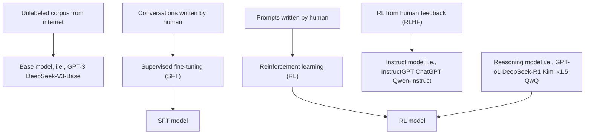
</details>

Step1

Collect demonstration data, and train a supervised policy.

A prompt is sampled from our prompt dataset.

A labeler demonstrates the desired output behavior.

This data is used to fine-tune GPT-3 with supervised learning.


Explain the moon landing to a 6 year old


Some people went to the moon...

  
自自目

Step 2

Collect comparison data, and train a reward model.

A prompt and several model outputs are sampled.

A labeler ranks the outputs from best to worst.

This data is used to train our reward model.


Explain the moon landing to a6 year old


melie ol\_


Peeple went t the moon


RM   


Step 3

Optimize a policy against the reward model using reinforcement learning.

A new prompt is sampled from the dataset.

The policy generates an output.

The reward model calculates a reward for the output.

The reward is used to update the policy using PPO.


about frogs


Once upon a time...

  
rk  
Figure 2: A diagram illustrating the three steps of our method: (1) supervised fine-tuning (SFT),(2) reward model (RM) training,and (3) reinforcement learning via proximal policy optimization (PPO) on this reward model. Blue arrows indicate that this data is used to train one of our models.In Step 2, boxes A-D are samples from our models that get ranked by labelers.See Sectionfor more details on our method.

# Pretraining


<details>
<summary>line</summary>

| Date     | Models with highest EM | Other models |
| -------- | ---------------------- | ------------ |
| Jan '18  | 70                     | -            |
| Sep '18  | 75                     | -            |
| Jan '19  | 85                     | -            |
| May '19  | 88                     | -            |
| Sep '19  | 90                     | -            |
| Jan '20  | 90                     | -            |
| May '20  | 90                     | -            |
| Sep '20  | 90                     | -            |
| Jan '21  | 90                     | -            |
| May '21  | 90                     | -            |
</details>

Pretraining has had a major, tangible impact on how well NLP systems work

# Keys in pretraining:

1. Make sure your model can process large-scale, diverse datasets.   
2. Use unlabeled data.   
3. Compute-aware scaling.

Tokenizer   


<details>
<summary>flowchart</summary>

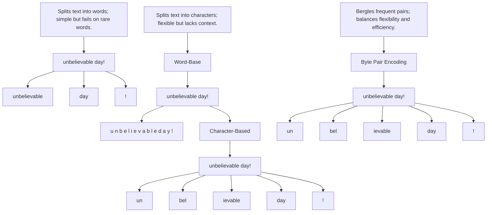
</details>

“Byte Pair Encoding (BPE) is a data compression technique that iteratively merges the most frequent pair of consecutive bytes (or characters) in a text or data sequence into a single, new symbol. The process is repeated until a specified number of merges is reached or no more frequent pairs remain”.


<details>
<summary>flowchart</summary>

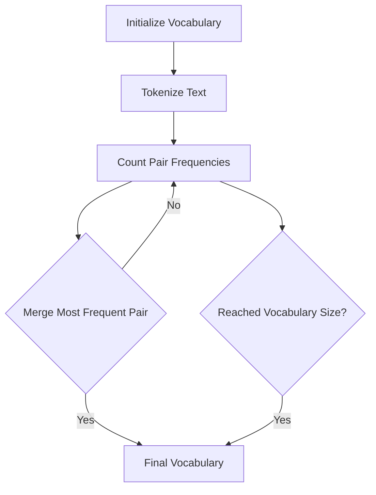
</details>

# Dictionary

5low   
2 lower   
6 newest   
3widest

5low   
2lower   
6 newest   
3widest

5low   
2lower   
6 newest   
3 widest

# Vocabulary

I, o, w,e, r,n,w, s,t,i, d

l,o, w,e,r,n,w, s,t,i, d,es

l,o,w,e,r，n,w,s,t,i,d,e,est

Common words end up being a part of the subword vocabulary, while rarer words are split into (sometimes intuitive, sometimes not) components.


<details>
<summary>flowchart</summary>

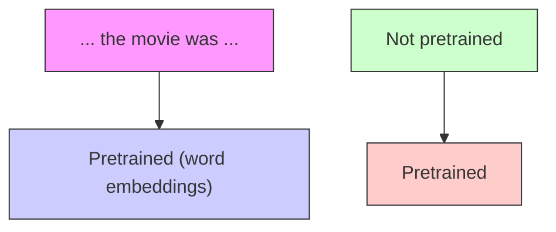
</details>

[Recall, movie gets the same word embedding, no matter what sentence it shows up in]

# Potential Issues:

1. The training data we have for our downstream task (like question answering) must be sufficient to teach all contextual aspects of language.   
2. Most of the parameters in our network are randomly initialized!

1. (Almost) all parameters in the networks are initialized via pretraining.   
2. Pretraining methods hide parts of the input from the model, and train the model to reconstruct those parts.


<details>
<summary>flowchart</summary>

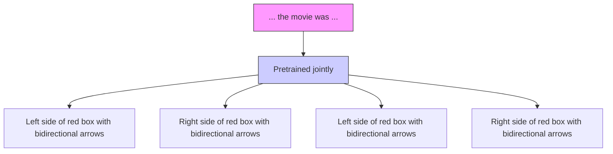
</details>

[This model has learned how to represent entire sentences through pretraining]

# Step1: Pretrain (on language modeling)

Lots of text; learn general things!


<details>
<summary>flowchart</summary>

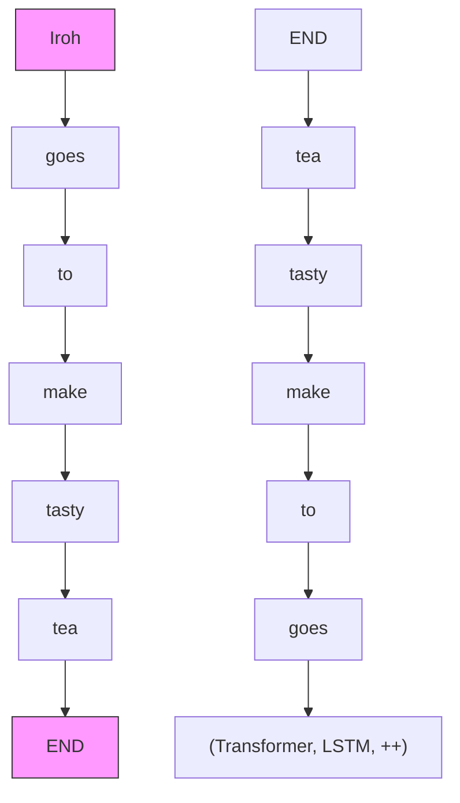
</details>

# Step 2: Finetune (on your task)

Not many labels; adapt to the task!


<details>
<summary>text_image</summary>

(Transformer, LSTM, ++ )
... the movie was ...
</details>

CompositionofthePilebyCategory   


<table><tr><td>Model</td><td>Training Data</td></tr><tr><td>BERT</td><td>BookCorpus, English Wikipedia</td></tr><tr><td>GPT-1</td><td>BookCorpus</td></tr><tr><td>GPT-3</td><td>CommonCrawl, WebText, English Wikipedia, and 2 book databases (“Books 1” and “Books 2”)</td></tr><tr><td>GPT-3.5+</td><td>Undisclosed</td></tr></table>


<details>
<summary>flowchart</summary>

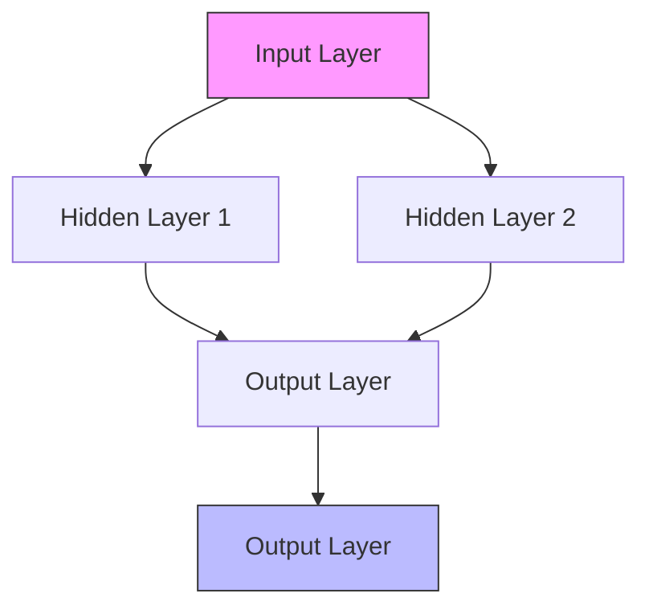
</details>

# Encoders

Gets bidirectional context -can condition on future!   
. How do we train them to build strong representations?


<details>
<summary>flowchart</summary>

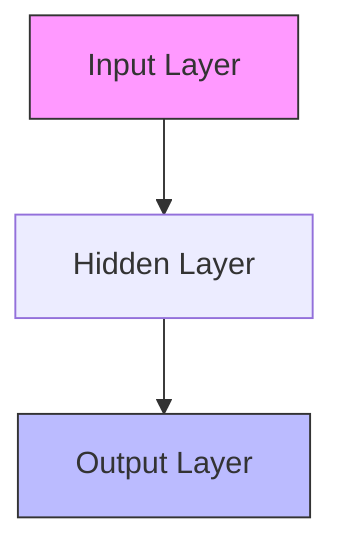
</details>

# Encoder-Decoders

Good parts of decoders and encoders?   
What's the best way to pretrain them?


<details>
<summary>flowchart</summary>

```mermaid
graph TD
    A[" "] --> B[" "]
    C[" "] --> D[" "]
    E[" "] --> F[" "]
    G[" "] --> H[" "]
    I[" "] --> J[" "]
    K[" "] --> L[" "]
    M[" "] --> N[" "]
    O[" "] --> P[" "]
    Q[" "] --> R[" "]
    S[" "] --> T[" "]
    U[" "] --> V[" "]
    W[" "] --> X[" "]
    Y[" "] --> Z[" "]
    AA[" "] --> AB[" "]
    AC[" "] --> AD[" "]
    AE[" "] --> AF[" "]
    AG[" "] --> AH[" "]
    AI[" "] --> AJ[" "]
    AK[" "] --> AL[" "]
    AM[" "] --> AN[" "]
    AO[" "] --> AP[" "]
    AQ[" "] --> AR[" "]
    AS[" "] --> AT[" "]
    AU[" "] --> AV[" "]
    AW[" "] --> AX[" "]
    AY[" "] --> AZ[" "]
    BA[" "] --> BB[" "]
    BC[" "] --> BD[" "]
    BE[" "] --> BF[" "]
    BG[" "] --> BH[" "]
    BI[" "] --> BJ[" "]
    BK[" "] --> BL[" "]
    BM[" "] --> BN[" "]
    BO[" "] --> BP[" "]
    BQ[" "] --> BR[" "]
    BS[" "] --> BT[" "]
    BU[" "] --> BV[" "]
    BW[" "] --> BX[" "]
    BY[" "] --> BZ[" "]
    CA[" "] --> CB[" "]
    CC[" "] --> CD[" "]
    CE[" "] --> CF[" "]
    CG[" "] --> DH[" "]
    DI[" "] --> DJ[" "]
    DK[" "] --> DL[" "]
    DM[" "] --> DJ
    DB[" "] --> DJ
    DB --> CK[" "]
    DB --> DL
    DB --> DK
    DB --> DL
    DB --> CK
    DB --> DL
    DB --> DK
    DB --> DW
    DB --> DW
    DB --> DW
    DB --> DW
    DB --> DW
    DB --> DW
    DB --> DW
    DB --> DW
    DB --> DW
    DB --> DW
    DB --> DW
    DB --> DW
    DB --> DW
    DB --> DW
    DB --> DW
    DB --> DW
    DB --> DW
    DB --> DW
    DB --> DW
    DB --> DW
    DB --> DN
    DB --> DN
    DB --> DN
    DB --> DN
    DB --> DN
    DB --> DN
    DB --> DN
    DB --> DN
    DB --> DN
    DB --> DN
    DB --> DN
    DB --> DN
    DB --> DN
    DB --> DN
    DB --> DN
    DB --> DN
    DB --> DN
    DB --> DN
    DB --> DN
    DB --> DN
    DB --> BN
    DB --> BN
    DB --> BN
    DB --> BN
    DB --> BN
    DB --> BN
    DB --> BN
    DB --> BN
    DB --> BN
    DB --> BN
    DB --> BN
```
</details>

# Decoders

Language models! What we've seen so far.   
Nice to generate from; can't condition on future words

# BERT

Devlin, J., Chang, M. W., Lee, K., & Toutanova, K. (2019). Bert: Pre-training of deep bidirectional transformers for language understanding. NAACL.

Google citation: 127375


<details>
<summary>text_image</summary>

NLP
BERT、GPT
Transformer
Attention
</details>

Suggested reading: The Illustrated BERT, ELMo, and co.

of text (books, wikipedia..etc).


<details>
<summary>text_image</summary>

Model:
BERT
Dataset:
WIKIPEDIA
Die freie Enzyklopädie
Objective:
Predict the masked word
(langauge modeling)
</details>

labeled dataset.


<details>
<summary>flowchart</summary>

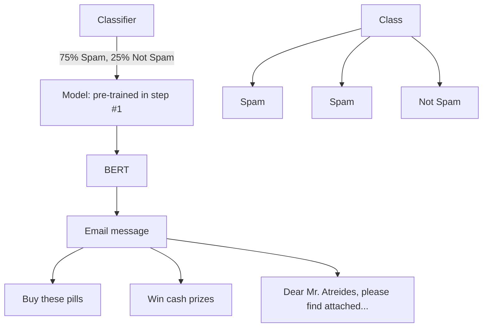
</details>


<details>
<summary>flowchart</summary>

```mermaid
graph LR
    subgraph_Pre-training["Pre-training"]
        A1["NSP"] --> B1["BERT"]
        A2["Mask LM"] --> B1
        A3["Mask LM"] --> B1
        B1 --> C1["C"]
        B1 --> C2["T₁"]
        B1 --> C3["..."]
        B1 --> C4["Tₙ"]
        B1 --> C5["T_[SEP"]]
        B1 --> C6["T₁'"]
        B1 --> C7["..."]
        B1 --> C8["Tₘ'"]
        B1 --> C9["Tₘ'"]
    end

    subgraph_Fine-Tuning["Fine-Tuning"]
        D1["MNLI"] --> E1["NER"]
        D2["SQuAD"] --> E2["SQuAD"]
        D3["BERT"] --> E3["BERT"]
        D4["Question"] --> E4["E_[CLS"]]
        D5["Paragraph"] --> E5["E_1"]
        D6["Question Answer Pair"] --> E6["E_N"]
        D7["Question Answer Pair"] --> E7["E_[SEP"]]
        D8["Question Answer Pair"] --> E8["E_1'"]
        D9["Question Answer Pair"] --> E9["E_M'"]
    end

    style Pre-training fill:#f9f,stroke:#333
    style Fine-Tuning fill:#bbf,stroke:#333
```
</details>

Pretraining with encoders only! But encoders get bidirectional context, so we can’t do language modeling!

replace some fraction of words in the input with a special [MASK] token; predict these words. Masking 15% words randomly.

Replace input word with [MASK] 80% of the time.   
Replace input word with a random token 10% of the time.   
• Leave input word unchanged 10% of the time (but still predict it!).


<details>
<summary>bar_stacked</summary>

| Position | Aardvark (%) | Improvisation (%) | Zyzzyva (%) |
| -------- | ------------ | ----------------- | ----------- |
| 1        | 0.1          | 10                | 0           |
| 2        | 0.1          | 10                | 0           |
| 3        | 0.1          | 10                | 0           |
| 4        | 0.1          | 10                | 0           |
| 5        | 0.1          | 10                | 0           |
| 6        | 0.1          | 10                | 0           |
| 7        | 0.1          | 10                | 0           |
| 8        | 0.1          | 10                | 0           |
| ...      | ...          | ...               | ...         |
| 512      | ...          | ...               | ...         |
| Randomly mask 15% of tokens | 1            | 1                 | 1           |
| Randomly mask 15% of tokens | 2            | 2                 | 2           |
| Randomly mask 15% of tokens | 3            | 3                 | 3           |
| Randomly mask 15% of tokens | 4            | 4                 | 4           |
| Randomly mask 15% of tokens | 5            | 5                 | 5           |
| Randomly mask 15% of tokens | 6            | 6                 | 6           |
| Randomly mask 15% of tokens | 7            | 7                 | 7           |
| Randomly mask 15% of tokens | 8            | 8                 | 8           |
| Randomly mask 15% of tokens | ...          | ...               | ...         |
| Input    | ...          | ...               | ...         |
| Note: Input values are not explicitly labeled; they are estimated based on the code execution.
</details>

# Ideas for Pretraining BERT: Masking

replace some fraction of words in the input with a special [MASK] token; predict these words.

$$
\begin{array}{l} h _ {1}, \dots , h _ {T} = \operatorname{Encoder} (w _ {1}, \dots , w _ {T}) \\ y _ {i} \sim A h _ {i} + b \\ \end{array}
$$

If ????� is the masked version of $x ,$ we will learn

$$
p _ {\theta} (x | \tilde {x})
$$

via the masked Language Model.


<details>
<summary>flowchart</summary>

```mermaid
graph TD
    subgraph Input Layer
        I["Input Layer I"] --> H1["[M"]]
        H1 --> H2["to"]
        H2 --> H3["the"]
        H3 --> H4["[M"]]
    end
    subgraph Hidden Layer
        H1 --> H5["[M"]]
        H5 --> H6["to"]
        H6 --> H7["the"]
        H7 --> H8["[M"]]
    end
    subgraph Output Layer
        H5 --> H9["[M"]]
        H9 --> H10["to"]
        H10 --> H11["the"]
        H11 --> H12["[M"]]
    end
    subgraph Storage Layer
        H9 --> H13["[M"]]
        H13 --> H14["to"]
        H14 --> H15["the"]
        H15 --> H16["[M"]]
    end
    I -->|went| A["Input Layer A,b"]
    H1 -->|went| B["Input Layer b"]
    H2 -->|went| C["Input Layer c"]
    H3 -->|went| D["Input Layer d"]
    H4 -->|went| E["Input Layer e"]
    H5 -->|went| F["Input Layer f"]
    H6 -->|went| G["Input Layer g"]
    H7 -->|went| H["Input Layer h"]
    H8 -->|went| I["Input Layer i"]
    H9 -->|went| J["Input Layer j"]
    H10 -->|went| K["Input Layer k"]
    H11 -->|went| L["Input Layer l"]
    H12 -->|went| M["Input Layer m"]
    H13 -->|went| N["Input Layer n"]
    H14 -->|went| O["Input Layer o"]
    H15 -->|went| P["Input Layer p"]
    H16 -->|went| Q["Input Layer q"]
    H17 -->|went| R["Input Layer r"]
    H18 -->|went| S["Input Layer s"]
    H19 -->|went| T["Input Layer t"]
    H20 -->|went| U["Input Layer u"]
    H21 -->|went| V["Input Layer v"]
    H22 -->|went| W["Input Layer w"]
    H23 -->|went| X["Input Layer x"]
    H24 -->|went| Y["Input Layer y"]
    H25 -->|went| Z["Input Layer z"]
    H26 -->|went| AA["Input Layer a"]
    H27 -->|went| AB["Input Layer b"]
    H28 -->|went| AC["Input Layer c"]
    H29 -->|went| AD["Input Layer d"]
    H30 -->|went| AE["Input Layer e"]
    H31 -->|went| AF["Input Layer f"]
    H32 -->|went| AG["Input Layer g"]
    H33 -->|went| AH["Input Layer h"]
    H34 -->|went| AI["Input Layer i"]
    H35 -->|went| AJ["Input Layer j"]
    H36 -->|went| AK["Input Layer k"]
    H37 -->|went| AL["Input Layer l"]
    H38 -->|went| AM["Input Layer m"]
    H39 -->|went| AN["Input Layer n"]
    H40 -->|went| AO["Input Layer o"]
```
</details>

# Ideas for Pretraining BERT: Two Sentences Task

To make BERT better at handling relationships between multiple sentences, the pretraining process includes an additional task: Given two sentences (A and B), is B likely to be the sentence that follows A, or not?


<details>
<summary>bar_stacked</summary>

| Input | Tokenized Input | Percentage |
|-------|-----------------|----------|
| Input | Sentence A      | 1%       |
| Input | Sentence B      | 99%      |
</details>

# Ideas for Pretraining BERT: Two Sentences Task

To make BERT better at handling relationships between multiple sentences, the pretraining process includes an additional task: Given two sentences (A and B), is B likely to be the sentence that follows A, or not?

The pretraining input to BERT was two separate contiguous chunks of text:   


<details>
<summary>other</summary>

| Input | [CLS] | my | dog | is | cute | [SEP] | he | likes | play | ##ing | [SEP] |
|---|---|---|---|---|---|---|---|---|---|---|---|
| Token Embeddings | E[CLS] | Emy | Edog | Eis | Ecute | E[SEP] | Ehe | Elikes | Eplay | En-ing | E[SEP] |
| Segment Embeddings | EA | EA | EA | EA | EA | EA | EB | EB | EB | EB | EB |
| Position Embeddings | E0 | E1 | E2 | E3 | E4 | E5 | E6 | E7 | E8 | E9 | E10 |
</details>

Two models were released:

·BERT-base: 12 layers,768-dim hidden states,12 attention heads,110 millon params.   
· BERT-large: 24layers,1024-dim hidden states,16 attention heads,340 millon params.

Trained on:

BooksCorpus (800 million words)   
English Wikipedia (2,500 million words)

Pretraining is expensive and impractical on a single GPU.

BERT was pretrained with 64 TPU chips for a total of 4 days.   
(TPUs are special tensor operation acceleration hardware)

Finetuning is practical and common on a single GPU

"Pretrain once, finetune many times."

BERT was massively popular and hugely versatile; finetuning BERT led to new state-ofthe-art results on a broad range of tasks.

QQP:Quora Question Pairs (detect paraphrase · questions)   
QNLI: natural language inference over question· answering data   
SST-2: sentiment analysis

CoLA: corpus of linguistic acceptability (detect whether sentences are grammatical.)

STS-B: semantic textual similarity

MRPC: microsoft paraphrase corpus   
RTE: a small natural language inference corpus

<table><tr><td>System</td><td>MNLI-(m/mm)392k</td><td>QQP363k</td><td>QNLI108k</td><td>SST-267k</td><td>CoLA8.5k</td><td>STS-B5.7k</td><td>MRPC3.5k</td><td>RTE2.5k</td><td>Average-</td></tr><tr><td>Pre-OpenAI SOTA</td><td>80.6/80.1</td><td>66.1</td><td>82.3</td><td>93.2</td><td>35.0</td><td>81.0</td><td>86.0</td><td>61.7</td><td>74.0</td></tr><tr><td>BiLSTM+ELMo+Attn</td><td>76.4/76.1</td><td>64.8</td><td>79.8</td><td>90.4</td><td>36.0</td><td>73.3</td><td>84.9</td><td>56.8</td><td>71.0</td></tr><tr><td>OpenAI GPT</td><td>82.1/81.4</td><td>70.3</td><td>87.4</td><td>91.3</td><td>45.4</td><td>80.0</td><td>82.3</td><td>56.0</td><td>75.1</td></tr><tr><td>BERTBASE</td><td>84.6/83.4</td><td>71.2</td><td>90.5</td><td>93.5</td><td>52.1</td><td>85.8</td><td>88.9</td><td>66.4</td><td>79.6</td></tr><tr><td>BERTLARGE</td><td>86.7/85.9</td><td>72.1</td><td>92.7</td><td>94.9</td><td>60.5</td><td>86.5</td><td>89.3</td><td>70.1</td><td>82.1</td></tr></table>

# Parameter-Efficient Fine-Tuning

Sparse Subnetworks   
Low-rank Composition


<details>
<summary>flowchart</summary>

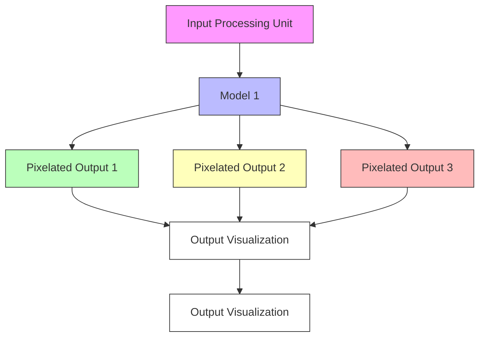
</details>

. During pruning,a fraction of the lowest-magnitude weights are removed   
The non-pruned weights are re-trained   
· Pruning for multiple iterations is more common (Frankle & Carbin,2019)


<details>
<summary>flowchart</summary>

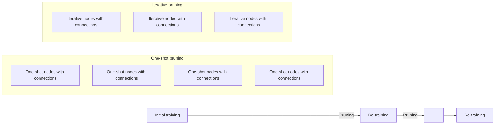
</details>

# The Lottery Ticket Hypothesis

Dense,randomly-initialized models contain subnetworks("winning tickets") that一 when trained in isolation一reach test accuracy comparable to the original network in a similar number of iterations [Frankle& Carbin, 2019]

√ Sparse Subnetworks   
Low-rank Composition


<details>
<summary>flowchart</summary>

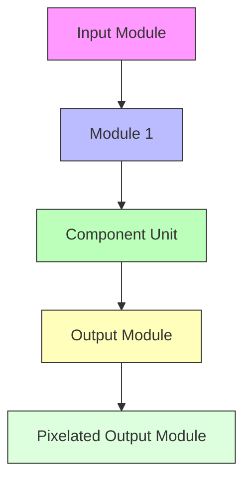
</details>

Assume we have a pre-trained autoregressive language model $P _ { \phi } ( y | x )$

· E.g., GPT based on Transformer

. Adapt this pretrained model to downstream tasks (e.g., summarization, NL2SQL, reading comprehension)

· Training dataset ofcontext-target pairs $\{ ( x _ { i } , y _ { i } ) \} _ { i = 1 , \dots , N }$

. During fullfine-tuning,we update $\phi _ { o }$ to $\phi _ { o } + \Delta \phi$ by following the gradient to maximize the conditional language modeling objective

$$
\max _ {\phi} \sum_ {(x, y)} \sum_ {t = 1} ^ {| y |} \log (P _ {\phi} (y _ {t} | x, y _ {<   t}))
$$

Hu, E. J., Wallis, P., Allen-Zhu, Z., Li, Y., Wang, S., Wang, L., & Chen, W. LoRA: Low-Rank Adaptation of Large Language Models. In International Conference on Learning Representations, 2021.

Google citation: 12416

. For each downstream task,we learn a different set of parameters $\Delta \phi$

$| \Delta \phi | = | \phi _ { o } |$   
GPT-3 has a $\mid \phi _ { o } \mid$ of 175 billion   
· Expensive and challenging for storing and deploying many independent instances

Key idea: encode the task-specific parameter increment $\Delta \phi = \Delta \phi ( \Theta )$ by a smaller-sized set of parameters 0, $| \Theta | \ll | \phi _ { o }$

The task of finding $\Delta \phi$ becomes optimizing over 0

$$
\max _ {\Theta} \sum_ {(x, y)} \sum_ {t = 1} ^ {| y |} \log (P _ {\phi_ {o} + \Delta \phi (\Theta)} (y _ {t} | x, y _ {<   t}))
$$

Updates to the weights have a low“intrinsic rank" during adaptation (Aghajanyan et al.2020)   
$W _ { 0 } \in \mathbb { R } ^ { d \times k }$ : a pretrained weight matrix Constrain its update with a low-rank decomposition:

$$
W _ {0} + \Delta W = W _ {0} + \alpha B A
$$

where $B \in \mathbb { R } ^ { d \times r } , A \in \mathbb { R } ^ { r \times k } , r \ll \operatorname* { m i n } ( d , k )$

α is the tradeoff between pre-trained "knowledge"and task-specific “knowledge"   
Only A and B contain trainable parameters


<details>
<summary>flowchart</summary>

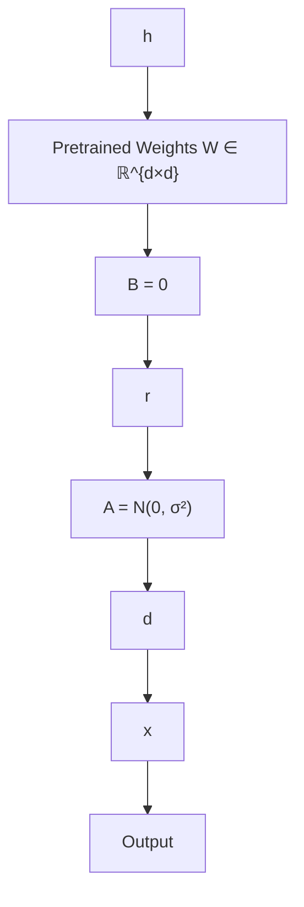
</details>

Few-shot learner: In-Context Learning   
Instruction Fine-tuning   
RLHF

# The blessings of scale

Altraining runs,estimated computing resources used

Floating-pointoperations,selectedsystems,bytype,logsale


<details>
<summary>scatter</summary>

| Model        | Value     |
| ------------ | --------- |
| PaLM (540B)  | ~10^24    |
| LaMDA        | ~10^23    |
| GPT-3        | ~10^23    |
| DALL-E       | ~10^22    |
| GPT-2        | ~10^22    |
| BERT-Large   | ~10^21    |
| NPLM         | ~10^18    |
| NetTalk      | ~10^16    |
| Neocognitron | ~10^15    |
| ADALINE      | ~10^14    |
| Theseus      | ~1        |
</details>


<100 Million

3 Billion

13 y.0. Human

BERT (2018)

30 Billion RoBERTa (2019)

200 Billion

1.4 Trillion

Chinchilla(2022)

\# tokens seen during training

# Math Problems

Wecan describe circles in thexy-plane using equations in terms ofxand y. Circleequationsquestionsrequireus to understand the connection between theseequationsandthe featuresof circles.

Forexample,theequation $( x + 2 ) ^ { 2 } + ( y - 3 ) ^ { 2 } = 4 ^ { 2 }$ is graphedin thecy-plane below.It isa circle withacenterat(-2,3)andaradiusof4.

# Coding Problems

```typescript
// Determine whether the sentiment of text is positive
// Use a web service
async function isPositive(text: string): Promise<boollean> {
    const response = await fetch(`http://text-processing.com/api/sentiment/`, {
    method: "POST",
    body: `text=${text Clark},
    headers: {
    "Content-Type": "application/x-www-form-urlencoded",
    },
    });
    const json = await response.json();
    return json.label === "pos";
} 
```

# Planning

Ineed to throwa dinner party for 6 people who are vegetarian. Can you suggest a 3-course menu with a chocolate dessert?

Sure,l can suggest a 3-course menu with a chocolate dessert for your vegetarian dinner party.Hereare some possible options:

· Starter:Wild Mushroom Tartlets with Onion Sauceor Vegan Popcorn Tofu Nuggets 2   
· Main: Vegan Butternut Squash Mac 2 or Vegetarian Three-Bean Chili   
· Dessert: Chocolate Lava Cake 4or Chocolate Pasta with Chocolate Hazelnut Cream Sauce, White Chocolate Shavings,and Fresh Berries4

I hope this helps you plan your party. Enjoy! O

Learn more:1.booths.co.uk+10 more

How do we get from

The Hong Kong Polytechnic University is located in

to

What can lhelp with?   


<details>
<summary>text_image</summary>

Message ChatGPT
+ Search ...
Create image Summarize text Make a plan Get advice More
</details>

Brown, T., Mann, B., Ryder, N., Subbiah, M., Kaplan, J. D., Dhariwal, P., ... & Amodei, D. (2020). Language models are few-shot learners. Advances in neural information processing systems, 33, 1877-1901.

Google citation: 43367

# GPT-3 (175B parameters; Brown et al., 2020)

Another increase in size (1.5B -> 175B)   
and data (40GB -> over 600GB)

Specify a task by simply prepending examples of the task before your example   
. Also called in-context learning, to stress that no gradient updates are performed when learning a new task (there is aseparate literature on few-shot learning with gradient updates)


<details>
<summary>text_image</summary>

1 gaot => goat
2 sakne => snake
3 brid => bird
4 fsih => fish
5 dcuk => duck
6 cmihp => chimp
In-context learning
1 thanks => merci
2 hello => bonjour
3 mint => menthe
4 wall => mur
5 otter => loutre
6 bread => pain
In-context learning
</details>

# Zero-shot

In-Context Learning on SuperGLUE   


<details>
<summary>line</summary>

| Number of Examples in Context (K) | Value |
| --------------------------------- | ----- |
| 0                                 | 58    |
| 1                                 | 69    |
| 2                                 | 69    |
| 3                                 | 69    |
| 4                                 | 70    |
| 8                                 | 72    |
| 16                                | 73    |
| 32                                | 74    |
</details>

# One-shot

In-Context Learning on SuperGLUE   


<details>
<summary>line</summary>

| Number of Examples in Context (K) | Value |
| --------------------------------- | ----- |
| 0                                 | 58    |
| 1                                 | 69    |
| 2                                 | 69    |
| 3                                 | 69    |
| 4                                 | 70    |
| 8                                 | 72    |
| 16                                | 73    |
| 32                                | 74    |
</details>

# Few-shot

In-Context Learning on SuperGLUE   


<details>
<summary>line</summary>

| Number of Examples in Context (K) | Few-shot GPT-3 175B |
| --------------------------------- | ------------------- |
| 0                                 | 58                  |
| 1                                 | 69                  |
| 2                                 | 69                  |
| 3                                 | 69                  |
| 4                                 | 70                  |
| 8                                 | 72                  |
| 16                                | 73                  |
| 32                                | 74                  |
</details>

Zero/few-shot prompting   
```txt
Translate English to French:
sea otter => loutre de mer
peppermint => menthe poivrée
plush girafe => girafe peluche
cheese => 
```

Traditional fine-tuning   
```txt
1 sea otter => loutre de mer
    ↓
    gradient update
    ↓
1 peppermint => menthe poivrée
    ↓
    gradient update
    ↓
    • • •
    ↓
1 cheese => 
```

Some tasks seem too hard for even large LMs to learn through prompting alone.

Especially tasks involving richer, multi-step reasoning.

(Humans struggle at these tasks too!)

$$
\begin{array}{l} 1 9 5 8 3 + 2 9 5 3 4 = 4 9 1 1 7 \\ 9 8 3 9 4 + 4 9 3 8 4 = 1 4 7 7 7 8 \\ 2 9 3 8 2 + 1 2 3 4 7 = 4 1 7 2 9 \\ 9 3 8 4 7 + 3 9 2 9 9 = ? \\ \end{array}
$$

Solution: Change the prompt!!!

Wei, J., Wang, X., Schuurmans, D., Bosma, M., Xia, F., Chi, E., ... & Zhou, D. (2022). Chain-of-thought prompting elicits reasoning in large language models. Advances in neural information processing systems, 35, 24824-24837.

Google citation: 12853

# Standard Prompting

# Model Input

Q:Roger has 5 tennis balls.He buys2 more cans of tennis bals. Each can has 3 tennis balls. How many tennis balls does he have now?

A: The answer is 11.

Q: The cafeteria had 23 apples.If they used 20 to make lunch and bought6 more,how many apples do they have？

# Model Output

A: The answer is 27.


# Chain-of-Thought Prompting

# Model Input

Q: Roger has 5 tennis balls.He buys2 more cans of tennis balls.Each can has3 tennis balls.Howmany tennis balls does he havenow?

A: Roger started with 5 balls. 2 cans of 3 tennis balls each is 6 tennis balls. 5 + 6 = 11. The answer is 11.

Q: The cafeteria had 23 apples.If they used 20 to make lunch and bought 6 more,how many apples do they have?

# Model Output

A: The cafeteria had 23 apples originally. They used 20 to make lunch. So they had 23 - 20 = 3. They bought 6 more apples, so they have 3 + 6 = 9. The answer is 9.

Middle school math word problems   


-— Standard prompung   
Chain-of-thought prompting   
Prior supervised best

Model scale (# parameters in billions)

# Model Input

Q: Roger has 5 tennis bals. He buys 2 more cans of tennis balls.Each can has 3 tennis balls.Howmany tennis balls does he have now?

A: Roger started with 5 balls. 2 cans of 3 tennis balls each is 6 tennis balls. 5 + 6 = 11. The answer is 11.

Q: The cafeteria had 23 apples. If they used 20 to make lunch and bought 6 more, how many apples do they have?

# Model Output

A: The cafeteria had 23 apples originally. They used 20 to make lunch. So they had 23 - 20 = 3. They bought6 more apples, so they have 3+6=9.The answer is 9.

Q: A juggler can juggle 16 bals. Half of the balls are golf balls,and half of the golf balls are blue. How many blue golf balls are there?

A: Let's think step by step. There are 16 balls in total. Half of the balls are golf balls. That means there are 8 golf balls. Half of the golf balls are blue.That means there are 4 blue golf balls.

<table><tr><td>No.</td><td>Category</td><td>Zero-shot CoT Trigger Prompt</td><td>Accuracy</td></tr><tr><td>1</td><td>LM-Designed</td><td>Let&#x27;s work this out in a step by step way to be sure we have the right answer.</td><td>82.0</td></tr><tr><td>2</td><td rowspan="4">Human-Designed</td><td>Let&#x27;s think step by step. (*1)</td><td>78.7</td></tr><tr><td>3</td><td>First, (*2)</td><td>77.3</td></tr><tr><td>4</td><td>Let&#x27;s think about this logically.</td><td>74.5</td></tr><tr><td>5</td><td>Let&#x27;s solve this problem by splitting it into steps. (*3)</td><td>72.2</td></tr><tr><td>6</td><td rowspan="5"></td><td>Let&#x27;s be realistic and think step by step.</td><td>70.8</td></tr><tr><td>7</td><td>Let&#x27;s think like a detective step by step.</td><td>70.3</td></tr><tr><td>8</td><td>Let&#x27;s think</td><td>57.5</td></tr><tr><td>9</td><td>Before we dive into the answer,</td><td>55.7</td></tr><tr><td>10</td><td>The answer is after the proof.</td><td>45.7</td></tr><tr><td>-</td><td></td><td>(Zero-shot)</td><td>17.7</td></tr></table>

WIKIPEDIA The Free Encyclopedia


# Prompt engineering

文A 5 languages

Article

More

FromWikipedia,the free encyclopedia

Prompt engineering is a concept in artificial intelligence, particularly natural language processing (NLP). In prompt engineering, the description of the task is

# Prompt Engineerand Librarian

# Pros:

No finetuning needed, prompt engineering (e.g. CoT) can improve performance.

# Cons:

Limits to what you can fit in context   
Complex tasks will probably need gradient steps

Few-shot learner: In-Context Learning   
Instruction Fine-tuning   
RLHF

Ouyang, L., Wu, J., Jiang, X., Almeida, D., Wainwright, C., Mishkin, P., ... & Lowe, R. (2022). Training language models to follow instructions with human feedback. Advances in neural information processing systems, 35, 27730-27744. Google citation: 13430

PROMPT Explain the moon landing to a 6 year old in a few sentences.

COMPLETIONGPT-3

Explain the theory of gravity to a 6 year old.

Explain the theory of relativity to a 6 year old in a few sentences.

Explain the big bang theory to a 6 year old.

Explain evolution to a 6 year old.

Language models are not aligned with user intent [Ouyang et al.\_2022]

Finetuning to the rescue!

# PROMPT

Explain the moon landing to a 6 year old in a few sentences.

# COMPLETION

# Human

A giant rocket ship blasted offrom Earth carrying astronauts to the moon. The astronauts landed their spaceship on the moon and walked around exploring the lunar surface. Then they returned safely back to Earth, bringing home moon rocks to show everyone.

Language models are not aligned with user intent [Ouyang et al.\_ 2022]

Finetuning to the rescue!

# The Modern Pretraining/Fine-tuning Paradigm

# Step1: Pretrain (on language modeling)

Lots of text; learn general things!


<details>
<summary>flowchart</summary>

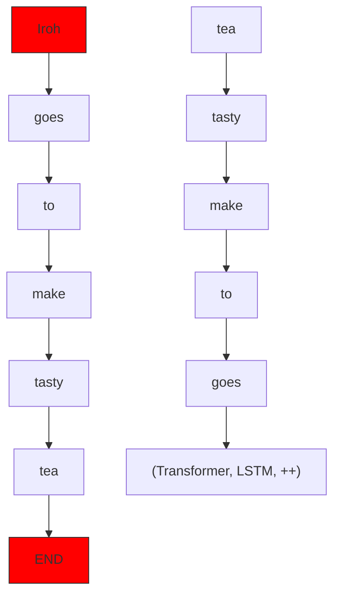
</details>

# Step 2: Finetune (on your task)

Not many labels; adapt to the task!


<details>
<summary>text_image</summary>

(Transformer, LSTM, ++ )
... the movie was ...
</details>

Pretraining can improve NLP applications by serving as parameter initialization.

Step 1: Pretrain (on language modeling)

Lots of text; learn general things!


<details>
<summary>flowchart</summary>

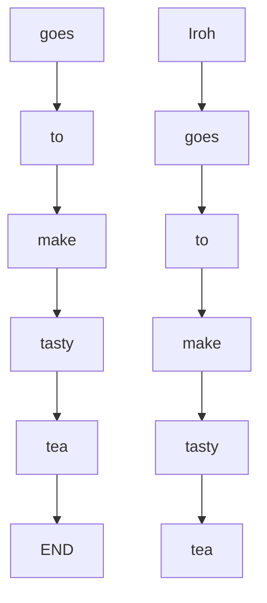
</details>

Step 2: Finetune (on many tasks)

Net many labels; adapt to the tasks!


<details>
<summary>text_image</summary>

Decoder
(Transformer, LSTM, ++ )
</details>

... the movie was...

Collect examples of (instruction,output) pairs across many tasks and finetune an LM


<details>
<summary>flowchart</summary>

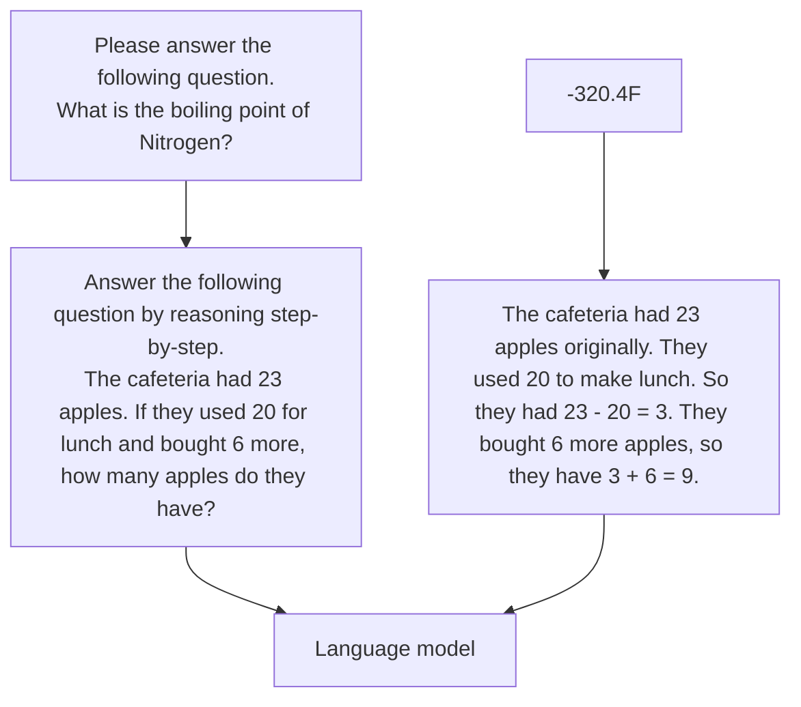
</details>

Evaluate on unseen tasks

Q: Can Geoffrey Hinton have a conversation with George Washington? Give the rationale before answering.

Geoffrey Hinton isa British-Canadian computer scientist born in 1947.George Washingtondiedin 1799.Thus,they could not have had a conversation together.So the answer is"no".

[FLAN-T5; Chung et al., 2022]

  
(a) SUP-NATINST (this work)


<details>
<summary>flowchart</summary>

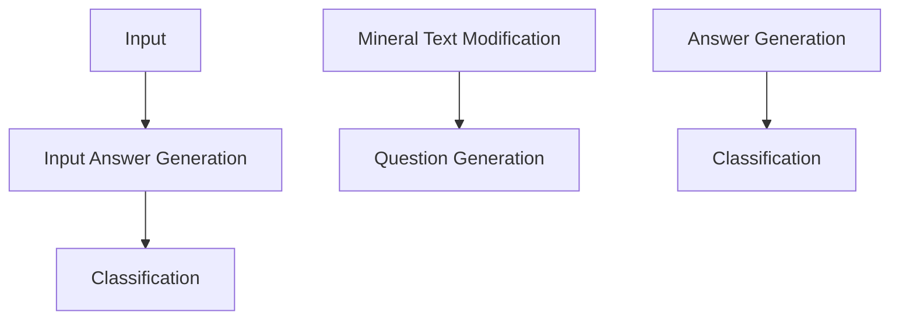
</details>

(b) NATINST


<details>
<summary>bubble</summary>

| Category | Value |
|---|---|
| QA Multiple Choice | 100 |
| QA Extractive | 85 |
| Blue and Fairness | 70 |
| QA Closed Book | 65 |
| Bond Options | 60 |
| Investment | 55 |
| Tax Classification | 50 |
| Real Estate | 45 |
| Housing & Other | 40 |
| Fundraising | 35 |
| Communication | 30 |
| Financial Services | 25 |
| Insurance | 20 |
</details>

(C) PROMPTSOURCE (TO subset)


<details>
<summary>bubble</summary>

| Category | Value |
|---|---|
| Summarization | 100 |
| Translation | 85 |
| Mac | 70 |
| Speech | 60 |
| Other | 55 |
| Social Work | 50 |
| Social Work (Other) | 45 |
| Other | 40 |
| Other | 35 |
| Other | 30 |
| Other | 25 |
| Other | 20 |
| Other | 15 |
| Other | 10 |
| Other | 5 |
| Other | 0 |
</details>

(d) FLAN


<details>
<summary>bubble</summary>

| Category | Value |
|---|---|
| Generation | 100 |
| Enzyming | 35 |
| Close CA | 40 |
| Enzymation | 25 |
| Natural Species | 15 |
| Natural Species (Other) | 10 |
| Natural Species (Other) | 8 |
| Natural Species (Other) | 7 |
| Natural Species (Other) | 6 |
| Natural Species (Other) | 5 |
| Natural Species (Other) | 4 |
| Natural Species (Other) | 3 |
| Natural Species (Other) | 2 |
| Natural Species (Other) | 1 |
| Natural Species (Other) | 0.5 |
</details>

(e) INSTRUCTGPT   
Figure 2: Compared to other datasets, Sup-NATINsT covers a more diverse range of task types. InstructGPT reports a very coarse categorization of their task types. Bubble size represents the number of tasks ofeach type in log scale.

As is usually the case, data + model scale iskey for this to work!   
Super-Naturallnstructions dataset contains over 1.6K tasks, 3M+ examples

Classification,sequence tagging, rewriting, translation, QA..

Q: how do we evaluate such a model?

# Massive Multitask Language Understanding (MMLU)

[Hendrycks et al., 2021]

New benchmarks for measuring LM performance on 57 diverse knowledgeintensivetasks


<details>
<summary>bar</summary>

| Field | GPT-3 | UnifiedQA |
| --- | --- | --- |
| Abstract Algebra | 45 | 42 |
| Anatomy | 68 | 58 |
| Astronomy | 72 | 65 |
| Business Ethics | 65 | 95 |
| Clinical Knowledge | 70 | 78 |
| College Biology | 68 | 60 |
| College Chemistry | 35 | 45 |
| College Comp Sci | 75 | 68 |
| College Mathematics | 60 | 55 |
| College Medicine | 75 | 65 |
| College Physics | 35 | 45 |
| Computer Security | 85 | 90 |
| Conceptual Physics | 65 | 70 |
| Econometrics | 55 | 45 |
| Electrical Engineering | 75 | 72 |
| Elementary Mathematics | 45 | 50 |
| Formal Logic | 40 | 35 |
| Global Facts | 60 | 55 |
| High School Biology | 75 | 80 |
| High School Chemistry | 50 | 55 |
| High School Comp Sci | 65 | 75 |
| High School European History | 80 | 90 |
</details>

# Astronomy

What is true for a type-Ia supernova?

A.This type occurs in binary systems.   
B.This type occurs in young galaxies.   
C. This type produces gamma-ray bursts.   
D. This type produces high amounts of X-rays.

# High School Biology

In a population of giraffes,an environmental change occurs that favors individuals that are tallest. As a result, more of the taller individuals are able to obtain nutrients and survive to pass along their genetic information. This is an example of

A. directional selection.   
B.stabilizing selection.   
C. sexual selection.   
D. disruptive selection


<details>
<summary>line</summary>

| Model | Average (%) |
| --- | --- |
| RoBERTa-base 125M (fine-tuned) | 28 |
| UnifiedQA 11B | 50 |
| Gopher 280B (5-shot) | 60 |
| Chinchilla 70B (5-shot) | 68 |
| Flan-U-PaLM-540B | 73 |
| GPT-4 (few-shot) | 85 |
| Leeroo (5-shot) | 85 |
| Other models | Scatter points (approximate range) |
</details>

Rapid,impressive progress on challenging knowledge-intensive benchmarks

# Model input (Disambiguation QA)

Q: In the following sentences, explain the antecedent of the pronoun (which thing the pronoun refers to), or state that it is ambiguous.

Sentence: The reporter and the chef will discuss their favorite dishes.

Options:

(A) They will discuss the reporter's favorite dishes   
(B) They will discuss the chef's favorite dishes   
(C) Ambiguous

A: Let's think step by step.

# Before instruction finetuning

The reporter and the chef will discuss their favorite dishes.

The reporter and the chef will discuss the reporter's favorite dishes.

The reporter and the chef will discuss the chef's favorite dishes.

The reporter and the chef will discuss the reporter's and the chefs favorite dishes.


(doesn't answer question)

# Model input (Disambiguation QA)

Q: In the following sentences, explain the antecedent of the pronoun (which thing the pronoun refers to), or state that it is ambiguous.

Sentence: The reporter and the chef will discuss their favorite dishes.

Options:

(A) They willdiscuss the reporter's favorite dishes   
(B)They will discuss the chef's favorite dishes   
(C) Ambiguous

A: Let's think step by step.

# After instruction finetuning

The reporter and the chef will discuss their favorite dishes does not indicate whose favorite dishes they will discuss. So, the answer is (C).


<details>
<summary>flowchart</summary>

```mermaid
graph TD
    A["Falcon"] --> B[" RWKV "]
    B --> C["PaLM 2 "]
    C --> D["Pythia"]
    D --> E["RedPajama-INCITE-Base"]
    E --> F["MPT-30B"]
    F --> G["MPT-7B Base"]
    G --> H["MPT-7B-StoryWriter-65k+"]
    H --> I["MPT-7B-Chat"]
    I --> J["StarCoderData"]
    J --> K["RedPajama-INCITE-Chat"]
    K --> L["XGen-7B"]
    L --> M["MPT-7B-Instruct"]
    C --> N["OpenLLaMA"]
    N --> O["RedPajama-INCITE-Base"]
    O --> P["MPT-7B-Chat"]
    P --> Q["OASST1"]
    Q --> R["databricks-dolly-15k"]
    R --> S["AmbiEnt"]
    S --> T["Sparks of AGI"]
    T --> U["BLOOM"]
    U --> V["The Stack"]
    V --> W["Roots"]
    W --> X["BloombergGPT"]
    X --> Y["Alpaca"]
    Y --> Z["GPT4All-j"]
    Z --> AA["LLaMA-Adapter"]
    AA --> AB["LLaMA"]
    AB --> AC["GPT4All"]
    AC --> AD["LLaMA"]
    AD --> AE["Self-Instruct"]
    AE --> AF["Flan-UL2"]
    AF --> AG["Bard"]
    AG --> AH["OpenAssistant"]
    AH --> AI["Koala"]
    AI --> AJ["GPT4All-j"]
    AJ --> AK["Baize"]
    AK --> AL["StableLM"]
    AL --> AM["OpenOrca-Preview1-13B"]
    AM --> AN["Llama 2"]
    AN --> AO["Orca"]
    AO --> AP["OpenOrca"]
    AP --> AQ["MPT-7B-Chat"]
    AQ --> AR["StarCoderData"]
    AR --> AS["RedPajama-INCITE-Chat"]
    AS --> AT["MPT-7B-Instruct"]
```
</details>

· The release of LlaMA led to open-source attempts to \`create'instruction tuning data

Generate instructions, input,and output from a LM [Wang et al., 2022]

Alpaca: fine-tuned from the LLaMA 7B model on 52K instruction-following examples

You don't need many samples to instruction tune (e.g., "LIMA: Less Is More for Alignment" Zhou et al., 2023)


<details>
<summary>flowchart</summary>

```mermaid
graph TD
    A["Text-davinci-003"] --> B["Modified Self-instruct Instruction Generation"]
    C["175 Self-Instruct seed tasks"] --> B
    B --> D["52K Instruction-following examples"]
    D --> E["Supervised Finetuning"]
    E --> F["Alpaca 7B"]
    G["Example Seed Task"] --> H["Example Generated Task"]
    H --> I["Output: ... incorporating flexible components, such as moveable walls and furniture ..."]
    style A fill:#f9f,stroke:#333
    style C fill:#f9f,stroke:#333
    style G fill:#ccf,stroke:#333
    style H fill:#cfc,stroke:#333
    style I fill:#fcc,stroke:#333
```
</details>

<table><tr><td>Source</td><td>#Examples</td></tr><tr><td colspan="2">Training</td></tr><tr><td>Stack Exchange (STEM)</td><td>200</td></tr><tr><td>Stack Exchange (Other)</td><td>200</td></tr><tr><td>wikiHow</td><td>200</td></tr><tr><td>Pushshift r/WritingPrompts</td><td>150</td></tr><tr><td>Natural Instructions</td><td>50</td></tr><tr><td>Paper Authors (Group A)</td><td>200</td></tr></table>


<details>
<summary>bar_stacked</summary>

| Model | LIMA wins (%) | Tie (%) | LIMA Loses (%) |
|---|---|---|---|
| Alpaca 65B | 53 | 21 | 26 |
| DaVinci003 | 44 | 21 | 35 |
| BARD (April) | 33 | 25 | 42 |
| Claude (April) | 24 | 22 | 54 |
| GPT-4 (April) | 18 | 25 | 57 |
</details>

Few-shot learner: In-Context Learning   
Instruction Fine-tuning   
RLHF

One limitation of instruction finetuning is obvious: it's expensive to colect ground-truth data for tasks.   
But there are other,subtler limitations too.Can you think of any?   
Problem 1: tasks like open-ended creative generation have no right answer.

Write me a story about a dog and her pet grasshopper.

Problem 2: language modeling penalizes alltoken-level mistakes equaly, but some errors are worse than others.   
Even with instruction finetuning, there a mismatch between the LM objective and the objective of "satisfy human preferences"!   
. Can we explicitly attempt to satisfy human preferences?


<details>
<summary>text_image</summary>

adventure
is a fantasy TV show END
LM
Avatar is a fantasy TV show
adventure
musical
show END
</details>

. Let's say we were training a language model on some task (e.g. summarization).   
For each LM sample s,imagine we had a way to obtain a human reward of that summary: R(s) ∈ R,higher is better.

SAN FRANCISCO, California (CNN) 一 A magnitude 4.2 earthquake shook the San Francisco ·· overturn unstable objects.

An earthquake hit San Francisco. There was minor property damage, but no injuries.

$$
R (s _ {1}) ^ {s _ {1}} = 8. 0
$$

The Bay Area has good weather but is prone to earthquakes and wildfires.

$$
R (s _ {2}) ^ {s _ {2}} = 1. 2
$$

. Now we want to maximize the expected reward of samples from our LM:

$$
\mathbb {E} _ {\hat {s} \sim p _ {\theta} (s)} [ R (\hat {s}) ]
$$

Note: for mathematical simplicity we're assuming only one "prompt"

# Reinforce Learning with Human Feedback Pipeline

Step1

Collect demonstration data, and train a supervised policy.

A promptis sampled fromour promptdataset.

Alabeler demonstrates the desired output behavior.

Thisdata isused to fine-tune GPT-3 with supervised learning.


<details>
<summary>flowchart</summary>

```mermaid
graph TD
    A["Explain the moon landing to a 6 year old"] --> B["Some people went to the moon..."]
    B --> C["SFT"]
    C --> D["Document icon: document with crosshairs, file icons: paper, print, etc."]
```
</details>

Step2

Collect comparison data, and train a reward model.

Apromptand severalmodel outputsare sampled.

Alabelerranks the outputs from best toworst.

Thisdata isused to train our reward model.


<details>
<summary>flowchart</summary>

```mermaid
graph TD
    A["Explain the moon landing to a 6 year old"] --> B["A Explain gravity..."]
    A --> C["B Explain war..."]
    A --> D["C Moon is natural satellite of..."]
    A --> E["D People went to the moon..."]
    B --> F["RM"]
    C --> F
    D --> F
    E --> F
    F --> G["D > C > A = B"]
```
</details>

Step3

Optimize a policy against the reward model using reinforcement learning.

Anew prompt is sampled from thedataset.

The policy generates anoutput.

Therewardmodel calculatesa reward for the output.

Thereward is used toupdate the policy using PPO.


<details>
<summary>flowchart</summary>

```mermaid
graph TD
    A["Write a story about frogs"] --> B["PPO"]
    B --> C["Once upon a time..."]
    C --> D["RM"]
    D --> E["r_k"]
    E --> D
```
</details>

First step: instruction tuning!   
Second + third steps: maximize reward (but how??)

The field of reinforcement learning (RL) has studied these (and related) problems for many years now [Williams, 1992: Sutton and Barto, 1998]   
Circa 2013: resurgence of interest in RL applied to deep learning, game-playing [Mnih et al.,2013]   
But the interest in applying RL to modern LMs is an even newer phenomenon [Ziegler et al.,2019; Stiennon et al., 2020; Ouyang et al., 2022]. Why?

RL w/ LMs has commonly been viewed as very hard to get right (still is!)

Neweradvances in RLalgorithms thatwork for large neural models,including language models (e.g. PPO; [Schulman et al., 201Z])


<details>
<summary>text_image</summary>

nature
THE INTERNATIONAL WEEKLY JOURNAL OF SCIENCE
LEARNING CURVE
Self-taught AI software
attains human-level
performance in video games
PACS 406.8.529
</details>


AlphaGo


<details>
<summary>natural_image</summary>

Portrait of a man wearing a cap and white shirt, pointing with his finger (no visible text or symbols)
</details>

# LExplained

# in24Min


<details>
<summary>natural_image</summary>

Two pixelated icons: a small robot and a globe, connected by curved arrows (no text or symbols)
</details>

https://www.youtube.com/watch?v=3vFISl7qMFI

RL-AlphaGo: https://www.youtube.com/watch?v=4PyWLgrt7YY

RL-ChatGPT and RLHF: https://www.youtube.com/watch?v=WMmGzx-jWvs&t=101s

How do we actually change our LM parameters $\theta$ to maximize this?

$$
\mathbb {E} _ {\hat {s} \sim p _ {\theta} (s)} [ R (\hat {s}) ]
$$

Let's try doing gradient ascent!

$$
\theta_ {t + 1} := \theta_ {t} + \alpha \nabla_ {\theta_ {t}} \mathbb {E} _ {\hat {s} \sim p _ {\theta_ {t} (s)}} [ R (\hat {s}) ]
$$

How do we estimate this expectation??


What if our reward function is nondifferentiable??

. Policy gradient methods in RL (e.g. REINFORCE; [Wiliams,1992]) give us tools for estimating and optimizing this objective.

We want to obtain

(defn.of expectation) (linearity of gradient)

$$
\nabla_ {\theta} \mathbb {E} _ {\hat {s} \sim p _ {\theta} (s)} [ R (\hat {s}) ] = \nabla_ {\theta} \sum_ {s} R (s) p _ {\theta} (s) = \sum_ {s} R (s) \nabla_ {\theta} p _ {\theta} (s)
$$

. Here we'll use a very handy trick known as the log-derivative trick.Let's try taking the gradient of log $p _ { \theta } ( s )$

$$
\nabla_ {\theta} \log p _ {\theta} (s) = \frac {1}{p _ {\theta} (s)} \nabla_ {\theta} p _ {\theta} (s) \quad \Rightarrow \quad \nabla_ {\theta} p _ {\theta} (s) = p _ {\theta} (s) \nabla_ {\theta} \log p _ {\theta} (s)
$$

(chain rule)

Plug back in:

This is an

$$
\sum_ {s} R (s) \nabla_ {\theta} p _ {\theta} (s) = \sum_ {s} p _ {\theta} (s) R (s) \nabla_ {\theta} \log p _ {\theta} (s)
$$

. Now we have put the gradient “inside" the expectation, we can approximate this objective with Monte Carlo samples:

$$
\nabla_ {\theta} \mathbb {E} _ {\hat {s} \sim p _ {\theta} (s)} [ R (\hat {s}) ] = \mathbb {E} _ {\hat {s} \sim p _ {\theta} (s)} [ R (\hat {s}) \nabla_ {\theta} \log p _ {\theta} (\hat {s}) ] \approx \frac {1}{m} \sum_ {i = 1} ^ {m} R (s _ {i}) \nabla_ {\theta} \log p _ {\theta} (s _ {i})
$$

This is why it's called "reinforcement learning": we reinforce good actions, increasing the chance they happen again.

Giving us the update rule:

$$
\begin{array}{l} \theta_ {t + 1} := \theta_ {t} + \alpha \frac {1}{m} \sum_ {i = 1} ^ {r} R (s _ {i})   \nabla_ {\theta_ {t}} \log p _ {\theta_ {t}} (s _ {i}) \\ \text {   is   a   lot   } \\ \text {   an   you   } \end{array}
$$

This is heavily simplified! There i more needed to do RL w/ LMs. Ca see any problems with this objective?

steps to minimize $p _ { \theta } ( s _ { i } )$

. Awesome: now for any arbitrary, non-differentiable reward function R(s),we can train our language model to maximize expected reward.   
Not so fast! (Why not?)   
Problem 1: human-in-the-loop is expensive!

· Solution: instead of directly asking humans for preferences, model their preferences as a separate (NLP) problem! [Knox and Stone,2009]

An earthquake hit San Francisco. There was minor property damage, but no injuries.


<details>
<summary>text_image</summary>

S₁
R(s₁) = 8.0
</details>

The Bay Area has good weather but is prone to earthquakes and wildfires.

$$
R (s _ {2}) ^ {s _ {2}} = 1. 2
$$


Train an LM $R M _ { \phi } ( s )$ to predict human preferences from an annotated dataset, then optimize for $R M _ { \phi }$ instead.

Problem 2: human judgments are noisy and miscalibrated!   
Solution: instead of asking for direct ratings, askfor pairwise comparisons, which can be more reliable [Phelps et al.,2015; Clark et al.,2018]

A 4.2 magnitude earthquake hit San Francisco, resulting in massive damage.

$$
S _ {3}
$$

$$
R (s _ {3}) = 4. 1? 6. 6? 3. 2?
$$

Problem 2: human judgments are noisy and miscalibrated!   
Solution:instead of asking fordirect ratings,askfor pairwise comparisons, which can be more reliable [Phelps et al., 2015; Clark et al., 2018]

An earthquake hit San Francisco. There was minor property damage, but no injuries.

V

A 4.2 magnitude earthquake hit San Francisco, resulting in massive damage.

V

The Bay Area has good weather but is prone to earthquakes and wildfires.


<details>
<summary>bar</summary>

| Category | Value |
|---|---|
| The | ↑ |
| Bay | ↑ |
| Area | ↑ |
| ... | ↑ |
| ... | ↑ |
| wildfires | ↑ |
S1 | ↑ |
| 1.2 | ↑ |
</details>

S2

Bradley-Terry [1952] paired comparison model

$$
J _ {R M} (\phi) = - \mathbb {E} _ {(s ^ {w}, s ^ {l}) \sim D} \big [ \log \sigma (R M _ {\phi} (s ^ {w}) - R M _ {\phi} (s ^ {l})) \big ]
$$

"losing"

sample

sample

W should score higher than $s ^ { l }$

Evaluate RM on predicting outcome of held-out human judgments   
  
[Stiennon et al., 2020]

Finally, we have everything we need:

A pretrained (possibly instruction-finetuned) $\mathsf { L } \mathsf { M } \ p ^ { P T } ( S )$   
· A reward model $R M _ { \phi } ( s )$ that produces scalar rewards for LM outputs,trained on a dataset of human comparisons   
· A method for optimizing LM parameters towards an arbitrary reward function.

Now to do RLHF:

· Initializea copy of the model $p _ { \theta } ^ { R L } ( s )$ ,with parameters $\theta$ we would like to optimize   
Optimize the following reward with RL:

$$
R (s) = R M _ {\phi} (s) - \underbrace {\beta \log \left(\frac {p _ {\theta} ^ {R L} (s)}{p ^ {P T} (s)}\right)} _ {\text {Pay a price when}} p _ {\theta} ^ {R L} (s) > p ^ {P T} (s)
$$

This isa penalty which prevents us from diverging too far from the pretrained model. In expectation,it is known as the Kullback-Leibler (KL) divergence between $p _ { \theta } ^ { R L } ( s )$ and $\mathcal { P } ^ { P T } ( s )$


<details>
<summary>line</summary>

| Model size | Human feedback | Supervised learning | p^PL(S) | p^IFT(S) | p^PT(S) | Pretrain only |
| ---------- | -------------- | ------------------- | ------- | -------- | ------- | ------------- |
| 1.3B       | 0.61           | 0.39                | -       | -        | -       | 0.23          |
| 2.7B       | 0.65           | 0.40                | -       | -        | -       | 0.31          |
| 6.7B       | 0.68           | 0.42                | -       | -        | -       | 0.29          |
| 12.9B      | 0.70           | 0.44                | -       | -        | -       | 0.36          |
</details>

# 30K Tasks

Step1

Collect demonstratjon data, and train a supervjsed policy.

Aprompt is sampled from our promptdataset.

A labeler demonstrates the desired output behavior.

This data is used to fine-tune GPT-3 with supervised learning.


Explain the moon landing toa 6 year old


Some people went to the moon...


Step 2

Collect comparison data, and train a reward model.

A prompt and severalmodel outputs are sampled.

A labeler ranks the outputs from best to worst.

This data is used to train our reward model.


Explain the moon landing toa 6year old


Explain grawity..


Explain war..


satelite e..


Pecple went to them.oon..


Step3

Optimize a policy against the reward model using reinforcement learning.

A new prompt is sampled from the dataset.

The policy generates an output.

The reward model calculatesa reward for the output.

Thereward is used to update the policy using PPO.


Write a story about frogs


PPO   


Once upon a time...

  
RM


# Tasks collected from labelers:

· Plain: We simply ask the labelers to come up with an arbitrary task, while ensuring the tasks had sufficient diversity.   
· Few-shot: We ask the labelers to come up with an instruction,and multiple query/response pairs for that instruction.   
· User-based: We had a number of use-cases stated in waitlist applications to the OpenAI API. We asked labelers to come up with prompts corresponding to these use cases.

<table><tr><td>Use-case</td><td>Prompt</td></tr><tr><td>Brainstorming</td><td>List five ideas for how to regain enthusiasm for my career</td></tr><tr><td>Generation</td><td>Write a short story where a bear goes to the beach, makes friends with a seal, and then returns home.</td></tr></table>

PROMPTWrite a short poem about a wise frog.

# COMPLETION

Write a short story in which a character has two different names.

Write a short story in which you try to get something back that you have lost.

Write a short story in which a character has a bad dream.

#

The frog is a symbol of wisdom

He knows all the secrets of the world

He is a master of disguise

And a great teacher of life

He is a symbol of transformation

And the bringer of change

He is the frog who has seen it all

And knows the meaning of it all

# ChatGPT: Optimizing Language Models for Dialogue

Note: OpenAl (and similar companies) are keeping more details secretabout ChatGPT training (including data, training parameters,model size) perhaps to keep a competitive edge...

# Methods

We trained this model using Reinforcement Learning from Human Feedback (RLHF),using the same methods as InstructGPT, but with slight differences in the data collection setup.We trained an initial model using supervised fine-tuning: human AI trainers provided conversations in which they played both sides-the user and an AI assistant.We gave the trainers access to model-written suggestions to help them compose their responses.We mixed this new dialogue dataset with the InstructGPT dataset,which we transformed into a dialogue format.

(lnstruction finetuning!)

# ChatGPT: Optimizing Language Models for Dialogue

Note: OpenAl (and similar companies) are keeping more details secret about ChatGPT training (including data, training parameters,model size) perhaps to keep a competitive edge...

# Methods

To create a reward model for reinforcement learning, we needed to collect comparison data, which consisted of two or more model responses ranked by quality. To collect this data, we took conversations that AI trainers had with the chatbot.We randomly selected a model-written message, sampled several alternative completions,and had AI trainers rank them. Using these reward models, we can fine-tune the model using Proximal Policy Optimization. We performed several iterations of this process.

(RLHF!)