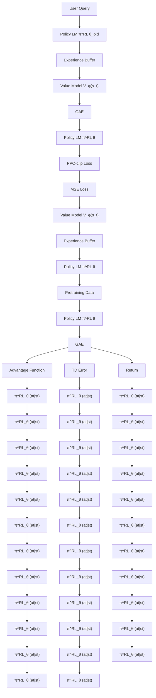
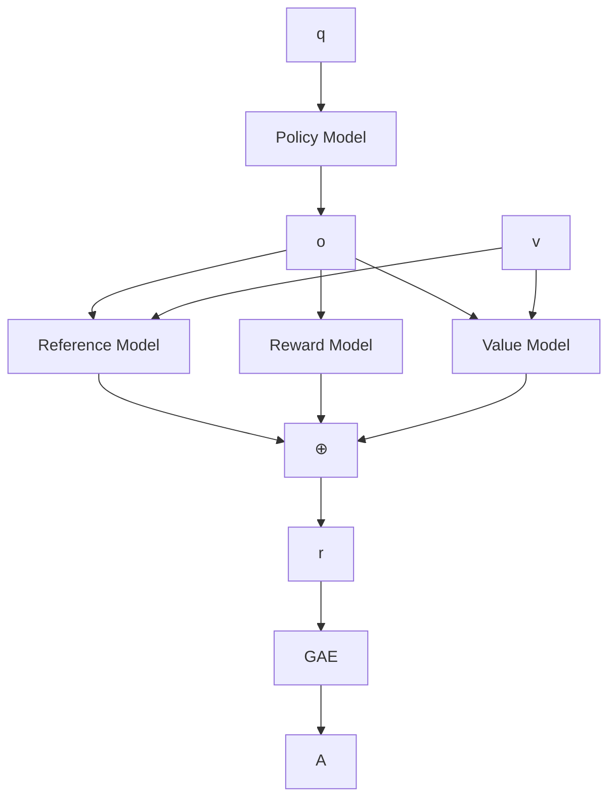
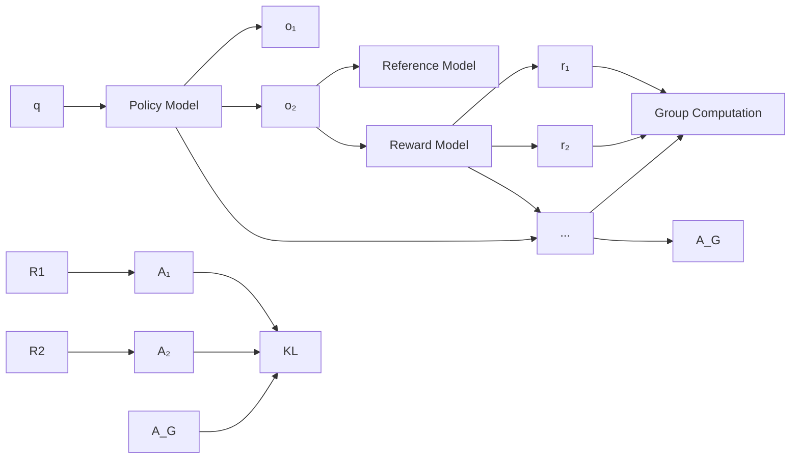
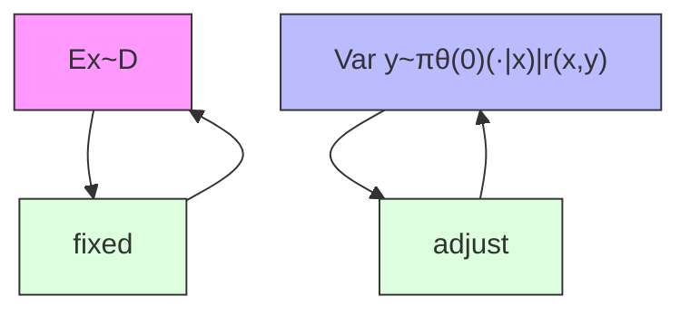
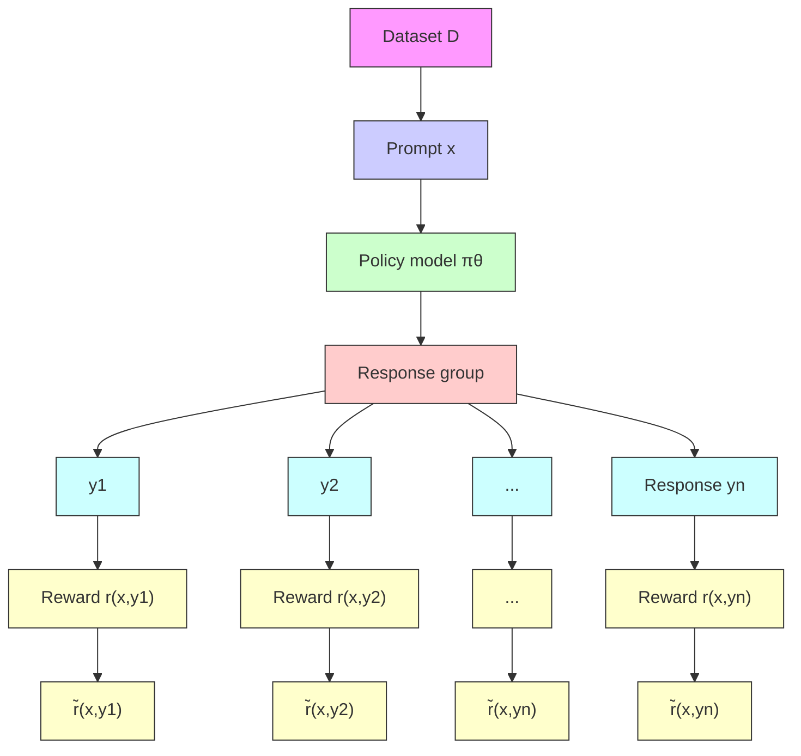
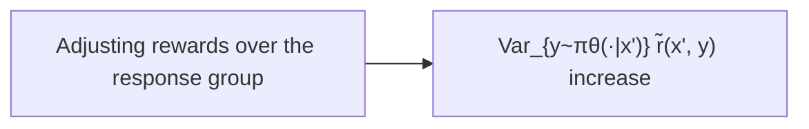
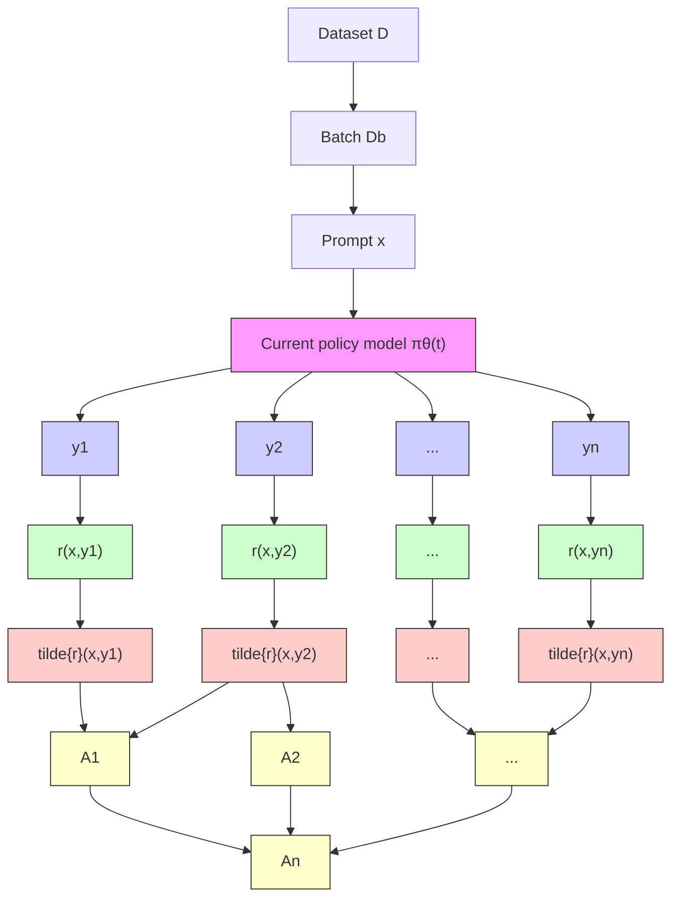

# AMA 564 Deep Learning

# 2026 Spring

# Lecture 12

# 30K Tasks

Step1

Collect demonstratjondata, and traina supervised policy.

Apromptis sampledfromour promptdataset.

Explain the moon landing toa6year old

Some people went to themoon...

Alabeler demonstratesthe desired output behavior.

Thisdata isused to fine-tune GPT-3 with supervised learning.

Step2

Collect comparisondata, andtrainarewardmodel.

Apromptand severalmodel outputsare sampled.

Alabelerranks the outputs from best to worst.

This data is used totrain our reward model.

Explain themoon landing toa6year old

Explaingraity.

Explain war

Meanis natural

Pecple went to themocn.

Step3

Optimizeapolicyagainst therewardmodel using reinforcementlearning.

Anewprompt issampledfrom thedataset.

Thepolicy generates anoutput.

Write astory about frogs

PPO   

Onceuponatime...

  
RM

Thereward model calculatesa rewardfor theoutput.

Thereward is usedtoupdate thepolicy using PPO.

How do we actually change our LM parameters $\theta$ to maximize this?

$$
\mathbb {E} _ {\hat {s} \sim p _ {\theta} (s)} [ R (\hat {s}) ]
$$

· Let's try doing gradient ascent!

$$
\theta_ {t + 1} := \theta_ {t} + \alpha \nabla_ {\theta_ {t}} \mathbb {E} _ {\hat {s} \sim p _ {\theta_ {t} (s)}} [ R (\hat {s}) ]
$$

How do we estimate this expectation??

What if our reward function is nondifferentiable??

Policy gradient methods in RL (e.g., REINFORCE;[Wiliams,1992]) give us tools for estimating and optimizing this objective.

We want to obtain

(defn.of expectation） (linearity of gradient)

$$
\nabla_ {\theta} \mathbb {E} _ {\hat {s} \sim p _ {\theta} (s)} [ R (\hat {s}) ] = \nabla_ {\theta} \sum_ {s} R (s) p _ {\theta} (s) = \sum_ {s} R (s) \nabla_ {\theta} p _ {\theta} (s)
$$

Here we'lluse a very handy trick known as the log-derivative trick. Let's try taking the gradient of log $p _ { \theta } ( s )$

$$
\nabla_ {\theta} \log p _ {\theta} (s) = \frac {1}{p _ {\theta} (s)} \nabla_ {\theta} p _ {\theta} (s) \quad \Rightarrow \quad \nabla_ {\theta} p _ {\theta} (s) = p _ {\theta} (s) \nabla_ {\theta} \log p _ {\theta} (s)
$$

(chain rule)

This is an

Plug back in:

$$
\sum_ {s} R (s) \nabla_ {\theta} p _ {\theta} (s) = \sum_ {s} p _ {\theta} (s) R (s) \nabla_ {\theta} \log p _ {\theta} (s)
$$

Now we have put the gradient “inside" the expectation,we can approximate this objective with Monte Carlo samples:

$$
\nabla_ {\theta} \mathbb {E} _ {\hat {s} \sim p _ {\theta} (s)} [ R (\hat {s}) ] = \mathbb {E} _ {\hat {s} \sim p _ {\theta} (s)} [ R (\hat {s}) \nabla_ {\theta} \log p _ {\theta} (\hat {s}) ] \approx \frac {1}{m} \sum_ {i = 1} ^ {m} R (s _ {i}) \nabla_ {\theta} \log p _ {\theta} (s _ {i})
$$

This is why it's called "reinforcement learning": we reinforce good actions, increasing the chance they happen again.

Giving us the update rule:

$$
\begin{array}{l} \theta_ {t + 1} := \theta_ {t} + \alpha \frac {1}{m} \sum_ {i = 1} ^ {m} R (s _ {i})   \nabla_ {\theta_ {t}} \log p _ {\theta_ {t}} (s _ {i}) \\ \text {   is   a   lot   } \\ \text {   an   you   } \end{array}
$$

This is heavily simplified! There is more needed to do RL w/ LMs.Ca see any problems with this objective?

$p _ { \theta } ( s _ { i } )$

ke steps to minimize $p _ { \theta } ( s _ { i } )$

Awesome: now for any arbitrary, non-differentiable reward function R(s),we can train our language model to maximize expected reward.   
Not so fast!(Why not?)   
Problem 1: human-in-the-loop is expensive!

· Solution: instead of directly asking humans for preferences, model their preferences as a separate (NLP) problem![Knox and Stone,2009]

An earthquake hit San Francisco. There was minor property damage, but no injuries. The Bay Area has good weather but is prone to earthquakes and wildfires.

Train an LM $R M _ { \phi } ( s )$ predict human preferences from an annotated dataset, then optimize for $R M _ { \phi }$ instead.

text_image

S₁
R(s₁) = 8.0

$$
R (s _ {2}) ^ {s _ {2}} = 1. 2
$$

·Problem 2: human judgments are noisy and miscalibrated!   
Solution: instead of asking for direct ratings,ask for pairwise comparisons, which can be more reliable [Phelps et al.,2015; Clark et al.,2018]

A 4.2 magnitude earthquake hit San Francisco, resulting in massive damage.

$$
S _ {3}
$$

$$
R (s _ {3}) = 4. 1? \quad 6. 6? \quad 3. 2?
$$

. Problem 2: human judgments are noisy and miscalibrated!   
Solution: instead of asking for direct ratings,ask for pairwise comparisons, which can be more reliable [Phelps et al.,2015; Clark et al., 2018]

An earthquake hit San Francisco. There was minor property damage, but no injuries.

V

A 4.2 magnitude earthquake hit San Francisco, resulting in massive damage.

V

The Bay Area has good weather but is prone to earthquakes and wildfires.

bar

| Category       | Value |
| -------------- | ----- |
| The            | 1.2   |
| Bay            | 1.2   |
| Area           | 1.2   |
| ...            | 1.2   |
| ...            | 1.2   |
| wildfires      | 1.2   |

S3

S2

Bradley-Terry [1952] paired comparison model

$$
J _ {R M} (\phi) = - \mathbb {E} _ {(s ^ {w}, s ^ {l}) \sim D} \big [ \log \sigma (R M _ {\phi} (s ^ {w}) - R M _ {\phi} (s ^ {l})) \big ]
$$

"losing"

sample

sW should score higher than $s ^ { l }$

Feedbackcomesaspreferencesovermodelsamples: $\mathcal { D } = \{ x ^ { i } , y _ { w } ^ { i } , y _ { l } ^ { i } \}$ Prompt Dispreferred response Preferred response

Bradley-Terry Model connects rewards to preferences:

$$
p (y _ {w} \succ y _ {l} \mid x) = \sigma (r (x, y _ {w}) - r (x, y _ {l}))
$$

Train the reward model by minimizing negative log likelihood:

$$
\mathcal {L} _ {R} (\phi , \mathcal {D}) = - \mathbb {E} _ {(x, y _ {w}, y _ {l}) \sim \mathcal {D}} \left[ \log \sigma (r _ {\phi} (x, y _ {w}) - r _ {\phi} (x, y _ {l})) \right]
$$

Now we have a reward model $r _ { \phi }$ that represents\* goodness according to humans

Now,learn a policy $\pi _ { \theta }$ achieving highrewardwhilestaying close to original model $\pi _ { \mathrm { r e f } }$

$$
\max _ {\pi_ {\theta}} \mathbb {E} _ {x \sim \mathcal {D}, y \sim \pi_ {\theta} (y | x)} [ r _ {\phi} (x, y) ] - \beta \mathbb {D} _ {\mathrm{KL}} [ \pi_ {\theta} (y | x) | | \pi_ {\text {ref}} (y | x) ]
$$

Sample from policy

Want high reward...

...but keep KL to original model small!

flowchart

Figure1:PPO workflow,depicting thesequential steps in thealgorithm's execution. The process beginswithsampling from the environment,followed bytheapplicationof GAE for improved advantage approximation. The diagram then illustrates the computation of various lossfunctions employed in PPO,signifyingthe iterative nature of the learning processand the policy updates derived from these losses.

Accelerate RLHF with Variance Increase   
Direct Preference Optimization

flowchart

text_image

Trained
Models
Frozen
Models

flowchart

Fig. 3. Comparison of popular RL fine-tuning methods in RLHF

• GRPO has exhibited comparable performance with less computational cost compared to PPO.

[2] Shao, Z., Wang, P., Zhu, Q., Xu, R., Song, J., Bi, X., ... & Guo, D. (2024). Deepseekmath: Pushing the limits of mathematical reasoning in open language models. arXiv preprint arXiv:2402.03300.   
[3] Guo, D., Yang, D., Zhang, H., Song, J., Zhang, R., Xu, R., ... & He, Y. (2025). Deepseek-r1: Incentivizing reasoning capability in llms via reinforcement learning. arXiv preprint arXiv:2501.12948.

line

| train/global_step | GRPO  | PPO   |
| ----------------- | ----- | ----- |
| 0                 | -0.2  | -0.2  |
| 20                | 0.1   | 0.1   |
| 40                | 0.3   | 0.4   |
| 60                | 0.4   | 0.5   |
| 80                | 0.5   | 0.6   |
| 100               | 0.5   | 0.8   |

Fig. 4. Performance of PPO and GRPO during training process

GRPO has comparable performance compared to PPO at the beginning but suffers from slow training in the end.

GRPO has comparable performance compared to PPO at the beginning but suffers from slow training in the end.   
• Although GRPO needs less training resources, it suffers from its slow training in practice.   
• How to accelerate GRPO?

[2] Shao, Z., Wang, P., Zhu, Q., Xu, R., Song, J., Bi, X., ... & Guo, D. (2024). Deepseekmath: Pushing the limits of mathematical [2]Shao,Z.,Wang，P.,ZuQ.,Xu，R.,Song,J.Bi,X,.,&GuoD.(2024).Deepseekmath:Pushing thelimitsofmathematical reasoning in open language models. arXiv preprint arXiv:2402.03300. reasoning in open language models. arXiv preprint arXiv:2402.03300. [3] Guo, D., Yang, D., Zhang, H., Song, J., Zhang, R., Xu, R., ... & He, Y. (2025). Deepseek-r1: Incentivizing reasoning capability in [3]Guo,DangD,ZangHongJZang,RXuR&He.(25)Deepseek:ncentivingreasonngaiit llms via reinforcement learning. arXiv preprint arXiv:2501.12948. IIms via reinforcement learning. arXiv preprint arXiv:2501.12948. [4] Hou, Z., Du, P., Niu, Y., Du, Z., Zeng, A., Liu, X., ... & Dong, Y. (2024). Does RLHF Scale? Exploring the Impacts From Data, [4] Hou,Z,Du,P.,NiuY.,Du,Z,Zeng,A,Liu,X.,&DongY.(2024).DoesRLHFScaleExploringtheImpactsFromData Model, and Method. arXiv preprint arXiv:2412.06000. Model,and ethod.arXivpreprintarXiv:241206000. [5] Li, G., Lin, M., Galanti, T., Tu, Z., & Yang, T. (2025). DisCO: Reinforcing Large Reasoning Models with Discriminative Constrained [5]LiG,LinalantiuZngT(2).DisCOReinforingargeReasoingModelswithiscriminatieContrned Optimization. arXiv preprint arXiv:2505.12366. Optimization.arXiv preprint arXiv:2505.12366.

• Both accuracy and reward variance matter in RLHF training!

text_image

Initial policy

Reward Model   

flowchart

Reward Variance   

flowchart

Fig. 5. Illustration of the roles of accuracy and reward variance in RLHF

Theorem. For RLHF objective

$$
\mathbb {E} _ {\mathbf {x} \sim \mathcal {D}} \left[ \mathbb {E} _ {\mathbf {y} \sim \pi_ {\theta} (\cdot | \mathbf {y})} [ r (\mathbf {x}, \mathbf {y}) ] - \lambda D _ {\mathrm{KL}} \big (\pi_ {\theta} (\cdot | \mathbf {y}) | | \pi_ {\mathrm{ref}} (\cdot | \mathbf {y}) \big) \right]
$$

Given any $\gamma > 0$ , prompt $\mathbf { x } \in \mathcal X$ , the time it takes until

$$
\mathbb {E} _ {\mathbf {y} \sim \pi_ {\theta (t)} (\cdot | \mathbf {y})} [ r (\mathbf {x}, \mathbf {y}) ] \geq \mathbb {E} _ {\mathbf {y} \sim \pi_ {\theta (0)} (\cdot | \mathbf {y})} [ r (\mathbf {x}, \mathbf {y}) ] + \gamma
$$

is at least:

$$
\Omega \left(\mathbb {E} _ {\mathbf {x ^ {\prime}} \sim \mathcal {D}} \left[ \mathrm{Var} _ {\mathbf {y} \sim \pi_ {\theta (0)} (\cdot | \mathbf {x ^ {\prime}})} r (\mathbf {x ^ {\prime}}, \mathbf {y}) \right] ^ {- \frac {1}{3}}\right)
$$

Natural idea: accelerating by increasing $\begin{array} { r } { \mathbb { E } _ { \mathbf { x } ^ { \prime } \sim \mathcal { D } } \left[ \operatorname { V a r } _ { \mathbf { y } \sim \pi _ { \theta ( 0 ) } ( \cdot | \mathbf { x } ^ { \prime } ) } r ( \mathbf { x } ^ { \prime } , \mathbf { y } ) \right] ^ { - \frac { 1 } { 3 } } } \end{array}$

How to increase?

flowchart

Idea: adjust $r ( \mathbf { x } , \mathbf { y } )$ to increase Var $\mathbf { \dot { y } } { \sim } { \pi } _ { \boldsymbol { \theta } ( 0 ) } ( \mathbf { \cdot } | \mathbf { x } ) ^ { r } \mathbf { ( x , y ) }$ for each $\mathbf { x } \in \mathcal { D }$

flowchart

# Reward adjustment model

Objective: increase reward variance.   
Requirement 1: preserve reward boundness.   
Requirement 2: preserve reward expectation.   
Requirement 3: preserve relative preferences.

WLOG, suppose original reward model is ??: $\mathcal { X } \times \mathcal { Y }  [ m , M ]$ and ${ \bf y } _ { 1 } , { \bf y } _ { 2 } , \cdots , { \bf y _ { n } }$ are ordered such that

$$
r (\mathbf {x}, \mathbf {y} _ {1}) \geq r (\mathbf {x}, \mathbf {y} _ {2}) \geq \dots \geq r (\mathbf {x}, \mathbf {y} _ {n}).
$$

We propose a reward adjustment model.

$$
\max _ {\mathbf {z} \in \mathbb {R} ^ {n}} f (\mathbf {z}) := \sum_ {i = 1} ^ {n} p _ {i} z _ {i} ^ {2}
$$

$\begin{array} { r } { \mathrm { s . t . } m \leq z _ { i } \leq M \forall 1 \leq i \leq M , } \end{array}$ Boundedness

$$
\begin{array}{l} \sum_ {i = 1} ^ {n} p _ {i} z _ {i} = \sum_ {i = 1} ^ {n} p _ {i} r _ {i}, \\ z _ {i} \geq z _ {i + 1} \forall 1 \leq i \leq n - 1, \\ \end{array}
$$

where $p _ { i } = \pi _ { \theta ( 0 ) } ( \mathbf { y } _ { i } | \mathbf { x } )$ .

Suppose we have a solution $\mathbf { z } ^ { \ast }$ . Then the reward $r ( \mathbf { x } , \mathbf { y } _ { i } )$ is adjusted to $\tilde { r } ( \mathbf { x } , \mathbf { y } _ { i } ) = \mathbf { z } _ { i } ^ { * }$ .

flowchart

Theorem 1. Let $\mathbf { x } \in \mathcal { D }$ be a given prompt and $\left\{ \mathbf { y } _ { 1 } , \mathbf { y } _ { 2 } , \cdots , \mathbf { y } _ { n } \right\} \subset { \mathcal { Y } }$ be the response group. If the reward $\left( { \tilde { r } } ( \mathbf { x } , \mathbf { y } _ { 1 } ) , { \tilde { r } } ( \mathbf { x } , \mathbf { y } _ { 2 } ) , \cdots , { \tilde { r } } ( \mathbf { x } , \mathbf { y } _ { n } ) \right)$ is a global optimal solution of the reward adjustment model, with $r _ { i } = r ( \mathbf { x } , \mathbf { y } _ { i } )$ and $p _ { i } = \pi _ { \theta } ( \mathbf { y } _ { i } | \mathbf { x } ) \forall i \in \{ 1 , 2 , \cdots , n \}$ , then the reward variance of policy model $\pi _ { \theta } ( \cdot | \mathbf { x } )$ over the response space can be increased for the prompt $\mathbf { x } \in \mathcal { D }$ .

Properties of the proposed reward adjustment model:

Non-convex optimization problem, usually NP-hard to solve.   
The feasible set is a bounded and non-empty polyhedral.

$$
\mathcal {P} := \{\mathbf {z} \in \mathbb {R} ^ {n} | \sum_ {i = 1} ^ {n} p _ {i} z _ {i} = \sum_ {i = 1} ^ {n} p _ {i} r _ {i}, m \leq z _ {i} \leq M \forall 1 \leq i \leq n, z _ {i} \geq z _ {i + 1} \forall 1 \leq i \leq n - 1 \}
$$

Objective function is convex.

• The global optimal solution is attained at one of the extreme points.

Lemma 1. Define a subset of extreme point set ?? as

$$
\mathcal {V} ^ {*} := \left\{\mathbf {v} \in \mathcal {V} | f (\mathbf {v}) = \max _ {\mathbf {v} ^ {\prime} \in \mathcal {V}} f (\mathbf {v} ^ {\prime}) \right\},
$$

then the point(s) in $\mathcal { V } ^ { \ast }$ are global solution(s) to the reward adjustment model.

The set of extreme points can be characterized.

# Lemma 2. The set of extreme points ?? of ?? is

$$
\mathcal {V} = \left\{\mathbf {v} = (v _ {1}, \dots v _ {n}) \in \mathcal {P} \left| \begin{array}{c} \exists 0 \leq k \leq l \leq n, m <   \alpha <   M \mathrm{s.t.} \\ v _ {1} = \dots = v _ {k} = M, \\ v _ {k + 1} = \dots = v _ {l} = \alpha , \\ v _ {l + 1} = \dots = v _ {n} = m, \\ \alpha = \frac {\sum_ {i = 1} ^ {n} p _ {i} r _ {i} - M \sum_ {i = 1} ^ {k} p _ {i} - m \sum_ {i = l + 1} ^ {n} p _ {i}}{\sum_ {i = k + 1} ^ {l} p _ {i}}. \end{array} \right. \right\}
$$

• Therefore, the extreme point $\mathbf { v } = ( v _ { 1 } , v _ { 2 } , \cdots , v _ { n } )$ has the following form.

bar_stacked

| Segment | Value |
|---------|-------|
| v1      | M     |
| ...     | M     |
| vk      | α     |
| vk+1    | α     |
| ...     | α     |
| vl      | m     |
| vl+1    | m     |
| ...     | m     |
| vn      | m     |

Based on the special form, an $O ( n )$ solving algorithm is designed.

# Algorithms

Enumerate ?? from ?? to ??. (inner loop)

text_image

k = 2
l = 3 →

text_image

k = 2
l = 4 →

text_image

k = 2
l = 5 →

Enumerate ?? from ?? to ??. (outer loop)

text_image

k = 2 →
l = 3

text_image

k = 3 →
l = 4

text_image

k = 4 →
l = 5

• An $O ( n ^ { 2 } )$ algorithm to find the global optimal solution.

Algorithm 1 Enumeration search algorithm for   
1: Input: $p = (p_1, p_2, \cdots, p_n)$ with 0 < $p_i < 1$ . A sorted reward $r = (r_1, r_2, \cdots, r_n)$ . An upper bound M and a lower bound m.

2: Output: A optimal solution $z^*$ to (3) and the optimal objective value $f^*$ .

3: Initialization: $c = \sum_{i=1}^{n} p_i r_i$ , $z^* = r$ , $f^* = 0$ , $k^* = 0$ , $l^* = 0$ , $\alpha^* = 0$ .

4: for $k = 0, 1, \ldots, n$ do

5: for $l = k, k + 1, \ldots, n$ do

6: Compute $\alpha$ based on lemma 2.

7: Compute current objective value $\bar{f}$ based on c, M, m, p.

8: if $\bar{f} > f^*$ then

9: Set $f^* = \bar{f}$ , $k^* = k$ , $l^* = l$ , $\alpha^* = \alpha$ .

10: end if

11: end for

12: end for

13: Set $z_1^* = \cdots = z_{k^*}^* = M$ , $z_{k^*+1}^* = \cdots = z_{l^*}^* = \alpha^*$ , $z_{l^*+1}^* = \cdots = z_n^* = m$ .

14: return $z^* = (z_1^*, z_2^*, \cdots, z_n^*)$ and $f^*$

An $O ( n )$ search algorithm.   
• Search strategy: start search from two ends to the center.

$$
k = 0 \longrightarrow \qquad \qquad \qquad \qquad \qquad \longleftarrow l = n
$$

natural_image

A row of eight green rectangular blocks with black borders, no text or symbols present.

$$
k = 1 \longrightarrow \qquad \qquad \qquad \longleftarrow l = n
$$

natural_image

Simple horizontal bar divided into two sections: red on the left and green on the right, with no text or symbols.

$$
k = 1 \longrightarrow \qquad \qquad \qquad \longleftarrow l = n - 1
$$

natural_image

Simple horizontal bar divided into three colored sections (red, green, blue) with no text or symbols

Once a solution becomes infeasible, all subsequent solutions along that search direction are infeasible.

Define $\begin{array} { r } { S _ { A } = \sum _ { i = 1 } ^ { k } p _ { i } , S _ { B } = \sum _ { i = k + 1 } ^ { l } p _ { i } , S _ { C } = \sum _ { i = l + 1 } ^ { n } p _ { i } } \end{array}$

Lemma 3. Suppose $k < l - 1$

$\begin{array} { r } { | \mathsf { f } M < \frac { c - M S _ { A } - m S _ { C } } { S _ { B } } , \mathsf { t h e n } \frac { c - M S _ { A } - m S _ { C } } { S _ { B } } < \frac { c - M ( S _ { A } + p _ { k + 1 } ) - m S _ { C } } { S _ { B } - p _ { k + 1 } } ; } \end{array}$ < ??−??????−??????, then

$\begin{array} { r } { \mathsf { I f } m > \frac { c - M S _ { A } - m S _ { C } } { S _ { B } } , \mathsf { t h e n } \frac { c - M S _ { A } - m S _ { C } } { S _ { B } } > \frac { c - M S _ { A } - m ( S _ { C } + p _ { l } ) } { S _ { B } - p _ { l } } . } \end{array}$ ??−??????−??????, then >

Once a solution becomes infeasible, all subsequent solutions along that search direction are infeasible.   
• Illustration:

text_image

k = 2
l = n - 1

$\textsf { f } k = 2 , l = n - 1$ is infeasible,

text_image

k = 3 → l = n - 1

then $k \geq 3 , l = n - 1$ are all infeasible.

The objective function value exhibits a monotonically increasing trend if the solution is feasible.

# Lemma 5. Assume $m < \alpha < M$ .

$\begin{array} { r } { \vert \textsf { f } \frac { c - M ( S _ { A } + p _ { k + 1 } ) - m S _ { C } } { S _ { B } - p _ { k + 1 } } > m } \end{array}$ , then it can strictly increase the objective function value by setting $k = k + 1$ and ?? = ??;

$\begin{array} { r } { \mathsf { I f } \frac { c - M S _ { A } - m ( S _ { C } + p _ { l } ) } { S _ { B } - p _ { l } } < M } \end{array}$ ????−???? , then it can strictly increase the objective function value by setting ?? = ?? and ?? = ?? − 1.

The objective function value exhibits a monotonically increasing trend if the solution is feasible.   
• Illustration

text_image

k = 0 → ← l = n
f₀
k = 1 → ← l = n
f₁
k = 1 → ← l = n - 1
f₂

If those three solutions are all feasible, then $f _ { 2 } > f _ { 1 } > f _ { 0 }$

One-pass search algorithm is an ??(??) algorithm. If the rewards are not sorted at first, then it will requires ??(??log??) to sort the rewards and probabilities.

Algorithm 2 One-pass search algorithm for (3)   
1: Input: $p = (p_1, p_2, \cdots, p_n)$ with $0 < p_i < 1$ . A sorted reward $r = (r_1, r_2, \cdots, r_n)$ . An upper bound M and a lower bound m.

2: Output: A optimal solution $z^*$ to (3) and the optimal objective value $f^*$ .

3: Initialization: $c = \sum_{i=1}^{n} p_i r_i$ , k = 0, l = n, iter = 0.

4: Define $C(0) = 0$ and compute the cumulative sums $C(i) = \sum_{j=1}^{i} p_j \quad 1 \leq i \leq n$ .

5: while iter < n do

6: Compute $S_A = C(k)$ , $S_C = C(n) - C(l)$ , $S_B = C(l) - C(k)$ .

7: if $S_B \leq 0$ then

8: Break.

9: end if

10: Set $\alpha = (c - MS_A - mS_C)/S_B$ . Compute objective $f = SA M^2 + S_B \alpha^2 + S_C m^2$ .

11: Set $f^* = f, k^* = k, l^* = l, flags = 0$ .

12: if k < l and $S_B - p_{k+1} > 0$ then

13: $\bar{\alpha} = \frac{c - (S_A + p_{k+1}) M - S_c m}{S_B - p_{k+1}}$ .

14: if $m \leq \bar{\alpha} \leq M$ then

15: $f_{new} = (S_A + p_{k+1}) M^2 + (S_B - p_{k+1}) \bar{\alpha}^2 + S_C m^2$ .

16: if $f_{new} > f^*$ then

17: $f^* = f_{new}, k^* = k + 1, l^* = l, flags = 1$ .

18: end if

19: end if

20: end if

21: if l > k and $S_B - p_l > 0$ then

22: $\bar{\alpha} = \frac{c - S_A M - (S_C + p_l)m}{S_B - p_l}$ .

23: if $m \leq \bar{\alpha} \leq M$ then

24: $f_{new} = S_A M^2 + (S_B - p_l) \bar{\alpha}^2 + (S_C + p_l) m^2$ .

25: if $f_{new} > f^*$ then

26: $f^* = f_{new}, k^* = k, l^* = l - 1, flags = 1$ .

27: end if

28: end if

29: end if

30: if flags = 1 then

31: k = k*, l = l*.

32: Continue.

33: else

34: Break.

35: end if

36: iter = iter + 1.

37: end while

38: Set $z_1^* = \cdots = z_{k^*}^* = M$ , $z_{k^*+1}^* = \cdots = z_{l^*}^* = \alpha$ , $z_{l^*+1}^* = \cdots = z_n^* = m$ .

39: return $z^* = (z_1^*, z_2^*, \cdots, z_n^*)$ and $f^*$

Search from the left side

Search from the right side

Integrate the reward adjustment model into the standard GRPO algorithm, resulting in the GRPOVI algorithm.   
• The responses are generated from the current policy model.   
• The corresponding probabilities are from the initial policy model.   
• The guarantee for reward variance increase can be easily derived.

Corollary 1. Let $\mathbf { x } \in \mathcal { D }$ be any given prompt. Assume that the responses $\left\{ \mathbf { y } _ { 1 } , \mathbf { y } _ { 2 } , \cdots , \mathbf { y } _ { n } \right\}$ are generated from the policy model $\pi _ { \theta ( t ) } ( \cdot | \mathbf { x } )$ . If the reward $\left( { \tilde { r } } ( \mathbf { x } , \mathbf { y } _ { 1 } ) , { \tilde { r } } ( \mathbf { x } , \mathbf { y } _ { 2 } ) , \cdots , { \tilde { r } } ( \mathbf { x } , \mathbf { y } _ { n } ) \right)$ is a global optimal solution of the reward adjustment model, with $r _ { i } = r ( \mathbf { x } , \mathbf { y } _ { i } )$ and $p _ { i } = \pi _ { \theta ( 0 ) } ( \mathbf { y } _ { i } | \mathbf { x } ) \forall i \in \{ 1 , 2 , \cdots , n \}$ , then the reward variance of policy model $\pi _ { \theta ( 0 ) } ( \cdot | \mathbf { x } )$ over the response space can be increased for the prompt $\mathbf { x } \in \mathcal { D }$ .

flowchart

Update policy model

The pseudo code of GRPOVI algorithm.

Algorithm 3 GRPOVI: GRPO with reward variance increase   
1: Input: reference model $\pi_{ref}$ , reward model r, dataset D, group size n.
2: Output: policy model $\pi_{\theta(T)}$ .
3: Initialization: $\pi_{\theta(0)} = \pi_{\text{ref}}$ .
4: for step $t = 0, 1, \cdots, T$ do
5: Choose a batch $D_b$ from D.
6: Generate n responses $\{\mathbf{y}_i\}_{i=1}^n$ from $\pi_{\theta(t)}(\cdot|\mathbf{x})$ for each $x \in D_b$ .
7: Compute the probability $p_i = \pi_{\text{ref}}(\mathbf{y}_i|\mathbf{x})$ based on reference model $\pi_{ref}$ for each $i = 1, 2, \cdots, n$ .
8: Normalize the probabilities $p_i = \frac{p_i}{\sum_{i=1}^n p_i}$ .
9: Compute reward $r_i = r(\mathbf{x}, \mathbf{y}_i)$ for each $i = 1, 2, \cdots, n$ .
10: Sort $\{p_i\}_{i=1}^n$ and $\{r_i\}_{i=1}^n$ such that $r_1 \geq r_2 \geq \cdots \geq r_n$ .
11: Compute the adjusted rewards $\{\tilde{r}_i\}_{i=1}^n$ based on $\{p_i\}_{i=1}^n$ and $\{r_i\}_{i=1}^n$ (algorithm [1] or algorithm [2]).
12: Compute advantages in GRPO based on $\{\tilde{r}_i\}_{i=1}^n$ .
13: Update policy model $\pi_{\theta(t)}$ according to GRPO-based RLHF training method.
14: end for
15: return policy model $\pi_{\theta(T)}$

# Experiments

• The comparative experiment on the search algorithms.

<table><tr><td rowspan="2">Size n</td><td colspan="2">Enumeration search algorithm</td><td colspan="2">One-pass search algorithm</td></tr><tr><td>Optimal value  $f_1^*$ </td><td>Running time (s)</td><td>Optimal value  $f_2^*$ </td><td>Running time (s)</td></tr><tr><td>10</td><td>0.3918</td><td>0.0022</td><td>0.3918</td><td>0.0015</td></tr><tr><td>50</td><td>0.4260</td><td>0.0438</td><td>0.4260</td><td>0.0057</td></tr><tr><td>100</td><td>0.5159</td><td>0.1707</td><td>0.5159</td><td>0.0112</td></tr><tr><td>500</td><td>0.4970</td><td>4.2043</td><td>0.4970</td><td>0.0539</td></tr><tr><td>1000</td><td>0.4938</td><td>16.9763</td><td>0.4938</td><td>0.1106</td></tr><tr><td>5000</td><td>0.4919</td><td>408.9071</td><td>0.4919</td><td>0.5515</td></tr><tr><td>10000</td><td>0.4933</td><td>1659.4376</td><td>0.4933</td><td>1.0561</td></tr></table>

Table 1 Comparison of enumeration search algorithm (algorithm ) and one-pass search algorithm (algorithm) for solving )

• The experiment between original GRPO and GRPOVI algorithms on LLM RLHF training.

• Policy model: Pythia-1B   
• Reward model: GRM-Gemma-2-2B

line

| Checkpoints | GRPOVI  | GRPO    |
| ----------- | ------- | ------- |
| 1           | 0.0578  | 0.0568  |
| 2           | 0.0655  | 0.0640  |
| 3           | 0.0670  | 0.0648  |
| 4           | 0.0660  | 0.0635  |
| 5           | 0.0660  | 0.0610  |
| 6           | 0.0635  | 0.0598  |
| 7           | 0.0640  | 0.0612  |
| 8           | 0.0648  | 0.0612  |

(a) Performance on the training set.

line

| Checkpoints | GRPOVI  | GRPO    |
| ----------- | ------- | ------- |
| 1           | 0.0565  | 0.0558  |
| 2           | 0.0648  | 0.0635  |
| 3           | 0.0672  | 0.0640  |
| 4           | 0.0658  | 0.0627  |
| 5           | 0.0658  | 0.0607  |
| 6           | 0.0637  | 0.0593  |
| 7           | 0.0641  | 0.0607  |
| 8           | 0.0644  | 0.0602  |

(b) Performance on the test set.

• The experiment between original GRPO and GRPOVI algorithms on LLM RLHF training.

• Policy model: Pythia-1B   
• Reward model: GRM-Llama-3.2-3B

line

| Checkpoints | GRPOVI  | GRPO    |
| ----------- | ------- | ------- |
| 1           | 0.056   | 0.0535  |
| 2           | 0.058   | 0.0542  |
| 3           | 0.058   | 0.0537  |
| 4           | 0.059   | 0.0538  |
| 5           | 0.059   | 0.0552  |
| 6           | 0.0595  | 0.0558  |
| 7           | 0.0602  | 0.0562  |
| 8           | 0.0608  | 0.0572  |

(a) Performance on the training set.

line

| Checkpoints | GRPOVI  | GRPO    |
| ----------- | ------- | ------- |
| 1           | 0.055   | 0.0525  |
| 2           | 0.057   | 0.053   |
| 3           | 0.0575  | 0.053   |
| 4           | 0.058   | 0.0535  |
| 5           | 0.0585  | 0.0545  |
| 6           | 0.059   | 0.055   |
| 7           | 0.060   | 0.0555  |
| 8           | 0.060   | 0.0545  |

(b) Performance on the test set.

# Direct Preference Optimization

Feedbackcomesaspreferencesovermodelsamples: $\mathcal { D } = \{ x ^ { i } , y _ { w } ^ { i } , y _ { l } ^ { i } \}$ Prompt Dispreferred response Preferred response

Bradley-Terry Model connects rewards to preferences:

$$
p (y _ {w} \succ y _ {l} \mid x) = \sigma (r (x, y _ {w}) - r (x, y _ {l}))
$$

Train the reward model by minimizing negative log likelihood:

$$
\mathcal {L} _ {R} (\phi , \mathcal {D}) = - \mathbb {E} _ {(x, y _ {w}, y _ {l}) \sim \mathcal {D}} \left[ \log \sigma (r _ {\phi} (x, y _ {w}) - r _ {\phi} (x, y _ {l})) \right]
$$

Now we have a reward model $r _ { \phi }$ that represents\* goodness according to humans

Now,learn a policy $\pi _ { \theta }$ achieving highrewardwhilestaying close to original model $\pi _ { \mathrm { r e f } }$

$$
\max _ {\pi_ {\theta}} \mathbb {E} _ {x \sim \mathcal {D}, y \sim \pi_ {\theta} (y | x)} [ r _ {\phi} (x, y) ] - \beta \mathbb {D} _ {\mathrm{KL}} [ \pi_ {\theta} (y | x) | | \pi_ {\mathrm{ref}} (y | x) ]
$$

Sample from policy

Want high reward...

...but keep KL to original model small!

$$
\begin{array}{l} \max _ {\pi} \mathbb {E} _ {x \sim \mathcal {D}, y \sim \pi} [ r (x, y) ] - \beta \mathbb {D} _ {\mathrm{KL}} \overbrace {[ \pi (y | x) | | \pi_ {\mathrm{ref}} (y | x) ]} ^ {} (1) D _ {K L} [ \pi (y | x) | | \pi_ {\mathrm{ref}} (y | x) ] = \mathbb {E} _ {y \sim \pi (y | x)} \left[ \log \frac {\pi (y | x)}{\pi_ {\mathrm{ref}} (y | x)} \right] \\ \begin{array}{l} = \max _ {\pi} \mathbb {E} _ {x \sim \mathcal {D}} \mathbb {E} _ {y \sim \pi (y | x)} \left[ r (x, y) - \beta \log \frac {\pi (y | x)}{\pi_ {\text {ref}} (y | x)} \right] \\ = \min _ {\pi} \mathbb {E} _ {x \sim \mathcal {D}} \mathbb {E} _ {y \sim \pi (y | x)} \left[ \log \frac {\pi (y | x)}{\pi_ {\text {ref}} (y | x)} - \frac {1}{\beta} r (x, y) \right] \\ = \min _ {\pi} \mathbb {E} _ {x \sim \mathcal {D}} \mathbb {E} _ {y \sim \pi (y | x)} \left[ \log \frac {\pi (y | x)}{\pi_ {\text {ref}} (y | x) \exp \left(\frac {1}{\beta} r (x , y)\right)} \right] \end{array} \\ \end{array}
$$

$$
\begin{array}{r l} & \min _ {\pi} \mathbb {E} _ {x \sim \mathcal {D}} \mathbb {E} _ {y \sim \pi (y | x)} \left[ \log \frac {\pi (y | x)}{\pi_ {\mathrm{ref}} (y | x) \exp \left(\frac {1}{\beta} r (x , y)\right)} \right] \longrightarrow D _ {K L} \left[ \pi (y | x) \| \pi_ {\mathrm{ref}} (y | x) \exp \left(\frac {1}{\beta} r (x, y)\right) \right] \\ & \quad \frac {1}{Z (x)} \pi_ {\mathrm{ref}} (y | x) \exp \left(\frac {1}{\beta} r (x, y)\right) \\ & \quad = \min _ {\pi} \mathbb {E} _ {x \sim \mathcal {D}} \mathbb {E} _ {y \sim \pi (y | x)} \left[ \log \frac {\pi (y | x)}{\frac {1}{Z (x)} \pi_ {\mathrm{ref}} (y | x) \exp \left(\frac {1}{\beta} r (x , y)\right)} - \log Z (x) \right] \end{array} \tag {3}
$$

$$
\pi^ {*} (y | x) = \frac {1}{Z (x)} \pi_ {\mathrm{ref}} (y | x) \exp \left(\frac {1}{\beta} r (x, y)\right),
$$

$$
Z (x) = \sum_ {y} \pi_ {\mathrm{ref}} (y \mid x) \exp \left(\frac {1}{\beta} r (x, y)\right)
$$

$$
\pi_ {r} (y \mid x) = \frac {1}{Z (x)} \pi_ {\text { ref }} (y \mid x) \exp \left(\frac {1}{\beta} r (x, y)\right)
$$

$$
r (x, y) = \beta \log \frac {\pi_ {r} (y \mid x)}{\pi_ {\mathrm{ref}} (y \mid x)} + \beta \log Z (x).
$$

Therefore,

$$
r (x, y _ {2}) - r (x, y _ {1})
$$

$$
= \beta \log \frac {\pi_ {r} (y _ {2} | x)}{\pi_ {r e f} (y _ {2} | x)} + \beta \log Z (x)) - (\beta \log \frac {\pi_ {r} (y _ {1} | x)}{\pi_ {r e f} (y _ {1} | x)} + \beta \log Z (x))
$$

$$
= \beta \log \frac {\pi_ {r} (y _ {2} | x)}{\pi_ {r e f} (y _ {2} | x)} - \beta \log \frac {\pi_ {r} (y _ {1} | x)}{\pi_ {r e f} (y _ {1} | x)}
$$

$$
\frac {e ^ {A}}{e ^ {A} + e ^ {B}} = \frac {1}{1 + e ^ {B - A}} = \sigma (B - A)
$$

$$
r (x, y _ {2}) - r (x, y _ {1}) = \beta \log \frac {\pi_ {r} (y _ {2} | x)}{\pi_ {r e f} (y _ {2} | x)} - \beta \log \frac {\pi_ {r} (y _ {1} | x)}{\pi_ {r e f} (y _ {1} | x)}
$$

$$
p ^ {*} (y _ {1} \succ y _ {2} \mid x) = \frac {1}{1 + \exp \left(\beta \log \frac {\pi^ {*} (y _ {2} | x)}{\pi_ {\mathrm{ref}} (y _ {2} | x)} - \beta \log \frac {\pi^ {*} (y _ {1} | x)}{\pi_ {\mathrm{ref}} (y _ {1} | x)}\right)}
$$

$$
\mathcal {L} _ {\mathrm{DPO}} \left(\pi_ {\theta}; \pi_ {\text {ref}}\right) = - \mathbb {E} _ {(x, y _ {w}, y _ {l}) \sim \mathcal {D}} \left[ \log \sigma \left(\beta \log \frac {\pi_ {\theta} \left(y _ {w} \mid x\right)}{\pi_ {\text {ref}} \left(y _ {w} \mid x\right)} - \beta \log \frac {\pi_ {\theta} \left(y _ {l} \mid x\right)}{\pi_ {\text {ref}} \left(y _ {l} \mid x\right)}\right) \right]
$$

$$
\frac {\sigma^ {\prime} (u)}{\sigma (u)} = \frac {\sigma (u) * (1 - \sigma (u))}{\sigma (u)} = \sigma (- u)
$$

$$
\nabla_ {\theta} \mathcal {L} _ {\mathrm{DPO}} (\pi_ {\theta}; \pi_ {\text { ref }}) = - \mathbb {E} _ {(x, y _ {w}, y _ {l}) \sim \mathcal {D}} \left[ \frac {\sigma^ {\prime} (u)}{\sigma (u)} \nabla_ {\theta} (u) \right]
$$

$$
u = \beta \log \frac {\pi_ {\theta} (y _ {l} \mid x)}{\pi_ {\text { ref }} (y _ {l} \mid x)} - \beta \log \frac {\pi_ {\theta} (y _ {w} \mid x)}{\pi_ {\text { ref }} (y _ {w} \mid x)}
$$

$$
\nabla_ {\theta} \mathcal {L} _ {\mathrm{DPO}} (\pi_ {\theta}; \pi_ {\text { ref }}) =
$$

$$
\left. \right. - \mathbb {E} _ {\left(x, y _ {w}, y _ {l}\right) \sim \mathcal {D}} \left[ \beta \sigma \left(\beta \log \frac {\pi_ {\theta} \left(y _ {w} \mid x\right)}{\pi_ {\text { ref}} \left(y _ {w} \mid x\right)} - \beta \log \frac {\pi_ {\theta} \left(y _ {l} \mid x\right)}{\pi_ {\text { ref}} \left(y _ {l} \mid x\right)}\right)\left[ \nabla_ {\theta} \log \pi \left(y _ {w} \mid x\right) - \nabla_ {\theta} \log \pi \left(y _ {l} \mid x\right)\right]\right]
$$

Reinforcement Learning from Human Feedback (RLHF)   

flowchart

Direct Preference Optimization (DPO)   

flowchart

TL;DRSummarization Win Ratevs Reference   

line

| Sampling temperature | DPO    | PPO    | Preferred-FT | SFT    | GPT-J  | Best of 128 |
| -------------------- | ------ | ------ | ------------ | ------ | ------ | ----------- |
| 0.00                 | 0.62   | 0.58   | 0.38         | 0.40   | 0.06   | 0.42        |
| 0.25                 | 0.61   | 0.52   | 0.39         | 0.40   | 0.06   | 0.52        |
| 0.50                 | 0.60   | 0.40   | 0.41         | 0.38   | 0.10   | 0.58        |
| 0.75                 | 0.52   | 0.20   | 0.38         | 0.34   | 0.07   | 0.52        |
| 1.00                 | 0.40   | 0.08   | 0.36         | 0.28   | 0.06   | 0.48        |

You can replace the complex RL part with a very simple weighted MLEobjective   
Othervariants (KTO,IPO) now emerging too   
TL;DR summarization win rates vs.humanwritten summaries (GPT-4asa judge)

IMDb Sentiment Generation  

1. Generate positive IMDB reviews from GPT2-XL   
2.Use pre-trained sentiment classifier as Gold RM   
3． Create preferences based on Gold RM   
4.Optimize with PPO and DPO

# Mistral

# 4Instruction Fine-tuning

WetrainMixtral-Instruct usingsupervisedfine-tuning (SFT)onaninstruction dataset followed by DirectPreferenceOptimization(DPO)[25]onapaired feedbackdataset.Mixtral-Instruct reachesa score of 8.30onMT-Bench[33](seeTable2),makingit thebest open-weightsmodelasofDecember 2023.Independent humanevaluationconductedbyLMSys isreported inFigure6and shows that Mixtral-InstructoutperformsGPT-3.5-Turbo，GeminiPro,Claude-2.1,andLlama27OBchat.

<table><tr><td>Model</td><td>Arena Elo rating</td><td>MT-bench (score)</td><td>License</td></tr><tr><td>GPT-4-Turbo</td><td>1243</td><td>9.32</td><td>Proprietary</td></tr><tr><td>GPT-4-0314</td><td>1192</td><td>8.96</td><td>Proprietary</td></tr><tr><td>GPT-4-0613</td><td>1158</td><td>9.18</td><td>Proprietary</td></tr><tr><td>Claude-1</td><td>1149</td><td>7.9</td><td>Proprietary</td></tr><tr><td>Claude-2.0</td><td>1131</td><td>8.06</td><td>Proprietary</td></tr><tr><td>Mixtral-8x7b-Instruct-v0.1</td><td>1121</td><td>8.3</td><td>Apache 2.0</td></tr><tr><td>Claude-2.1</td><td>1117</td><td>8.18</td><td>Proprietary</td></tr><tr><td>GPT-3.5-Turbo-0613</td><td>1117</td><td>8.39</td><td>Proprietary</td></tr><tr><td>Gemini Pro</td><td>1111</td><td></td><td>Proprietary</td></tr><tr><td>Claude-Instant-1</td><td>1110</td><td>7.85</td><td>Proprietary</td></tr><tr><td>Tulu-2-DPO-708</td><td>1110</td><td>7.89</td><td>AI2 ImpACT Low-risk</td></tr><tr><td>Yi-34B-Chat</td><td>1110</td><td></td><td>Yi License</td></tr><tr><td>GPT-3.5-Turbo-0314</td><td>1105</td><td>7.94</td><td>Proprietary</td></tr><tr><td>Llama-2-70b-chat</td><td>1077</td><td>6.86</td><td>Llama 2 Community</td></tr></table>

Figure6:LMSysLeaderboard.(Screenshot fromDec22,2023)Mixtral8x7BInstructvO1achievesanArena Eloratingof1121outperformingClaude-2.1(1117),allversionsofGP-3.5-Turbo(1117best),GeminiPro (1111),andLlama-2-7Ob-chat(1o77).Mixtraliscurrentlythebestopen-weightsmodelbyalargemargin.

# LLaMa3

# Instruction fine-tuning

Tofully unlock thepotential of ourpretrainedmodelsinchat usecases,we innovated onour approach toinstruction-tuningaswellOurapproachtopost-training isa combinationof supervised fine-tuning(SFT),rejection sampling,proximal policyoptimization (PPO),and directpreferenceoptimization(DPO).The quality of the prompts that areused in SFTand thepreferencerankingsthatare usedin PPOand DPO hasanoutsized influenceonthe performanceof alignedmodels.Someof ourbiggestimprovements inmodel qualitycame fromcarefullycuratingthisdataand performingmultiple rounds of qualityassuranceon annotationsprovided by human annotators.

Learning frompreferencerankings via PPO andDPoalso greatly improvedtheperformance ofLlama3onreasoningand coding tasks.Wefoundthatif youaskamodelareasoning question thatit struggles toanswer,themodel willsometimesproduce therightreasoning trace:Themodel knows howtoproducetherightanswer，butitdoesnotknowhowtoselect it.Training on preferencerankings enablesthemodel to learn howto select it.

bar

| Category | DPO | PPO |
|---|---|---|
| TL;DR (t=0) | 62 | 58 |
| TL;DR (t=0.25) | 61 | 53 |
| CNN/DailyMail (t=0) | 36 | 31 |
| CNN/DailyMail (t=0.25) | 32 | 23 |

DPO is trained only on the Reddit TL;DR feedback data.   
2. PPO uses a trained reward function and additional prompts for RL training.   
3. We evaluate the trained policies on OOD CNN/DailyMail news summarization task.

DPO fits an implicit reward function:

1. Is the DPO implicit reward as good as the explicit one?   
2． Does using a weaker optimizer,such as PPO provide a better solution (regularization).

# RewardBench:Evaluating Reward Models

Evaluatingthecapabilities,safetyandpitfallsofrewardmodels

# FEuArdbench

RewardBench Leaderboard

Seq.Classifiers

DPO

CustomClassifiers

Generative

Al2Experiments

Model

29

11

49

48

Model Type

DPO

DPO

DPO

Seq.Classifier

Custom Classifier

Seq.Classifier

DPO

DPO

DPO

DPO

DPO

Score

68.75

68.21

81.55

83.62

55.01

56.14

73.35

Chat

53.6

81.6

99.4

95

72.9

38.8

91.6

atHard

68.

65.

64

62.5

Safety

81.2

61

61.8

Reasoning

85.5

86.3

86.4

59.8

Prior Sets(0.5 weight)

DPO fits an implicit reward function:

1. Is the DPO implicit reward as good as the explicit one?   
2. Does using a weaker optimizer, such as PPO provide a better solution (regularization).

bar_stacked

HH (β=0.05)
| Length | Dataset chosen | Dataset rejected | DPO (β=0.05, α=0.0) |
|---|---|---|---|
| 0-50 | 115 | 25 | 0 |
| 50-100 | 73 | 0 | 30 |
| 100-150 | 25 | 12 | 52 |
| 150-200 | 5 | 0 | 56 |
| 200-250 | 8 | 0 | 34 |
| 250-300 | 3 | 0 | 34 |
| 300-350 | 2 | 0 | 12 |
| 350-400 | 1 | 0 | 4 |
The chart displays the distribution of sample lengths for three models: Dataset chosen, Dataset rejected, and DPO (β=0.05, α=0.0). Vertical dashed lines indicate thresholds at approximately 75 and 150 length units.

bar_stacked

TLDR (β=0.5)
| Length | Dataset chosen | Dataset rejected | DPO (β=0.5, α=0.0) |
|---|---|---|---|
| 0-10 | 0 | 0 | 2 |
| 10-20 | 5 | 10 | 0 |
| 20-30 | 35 | 25 | 0 |
| 30-40 | 68 | 12 | 0 |
| 40-50 | 102 | 5 | 78 |
| 50-60 | 0 | 0 | 47 |
| 60-70 | 0 | 0 | 17 |
| 70-80 | 0 | 0 | 6 |
| 80-90 | 0 | 0 | 3 |
| 90-100 | 0 | 0 | 2 |

  
Disentangling Length from Qualityin Direct Preference Optimization,Park et.al.

DPO fits an implicit reward function:

1. Is the DPO implicit reward as good as the explicit one? YES   
2. Does using a weaker optimizer, such as PPO provide a better solution (regularization).   
NO