# AMA 564 Deep Learning

# 2026 Spring

# Lecture 13

# AI Scaling Laws

# The Billion-Dollar Question

Training state-of-the-art Al is oneofthe most expensive engineering endeavors in history. Decisions have multi-million dollar consequences.

# \$10,000,000+

Estimated cost to train a single large model.


<details>
<summary>bar</summary>

| Category | CO2e (lbs) |
|---|---|
| Car (1 lifetime) | 126,000 |
| Training a Transformer w/ NAS | 626,155 |
</details>

# The Old Way


<details>
<summary>text_image</summary>

"Hyperparameter tuning was a huge cost... guess and pray... exhaustive search."
</details>

# The New Way


<details>
<summary>text_image</summary>

"Tune on small models,
extrapolate to large ones...
simple, predictive rules for
model performance."
</details>


<details>
<summary>scatter</summary>

| Compute (log scale) | Test Loss (log scale) |
| ------------------- | --------------------- |
| 10                  | 0.1                   |
| 20                  | 0.08                  |
| 50                  | 0.06                  |
| 100                 | 0.04                  |
| 200                 | 0.03                  |
| 500                 | 0.02                  |
| 1000                | 0.015                 |
| 2000                | 0.01                  |
| 5000                | 0.007                 |
| 10000               | 0.005                 |
| 20000               | 0.003                 |
| 50000               | 0.002                 |
| 100000              | 0.001                 |
</details>

When plotted ona log-logscale, the relationship between key resources and model performance (test loss) becomes a remarkably straight line-apower law.

Scalinglaws describe how the performance of Al systems improves as the size of the trainingdata,model parametersor computational resources increases.

$$
L (x) = a \cdot x ^ {- k}
$$

Power law equation examut typeseting \*x can be Compute,Data,or Parameters.

  
Compute (C)

Thetotal computational effort (FLOPs).Theengine of training.


<details>
<summary>line</summary>

| Compute | Test Loss |
| ------- | --------- |
| 0       | 100       |
| 1       | 80        |
| 2       | 60        |
| 3       | 40        |
| 4       | 20        |
| 5       | 0         |
</details>

  
Dataset Size (D)

Thenumber of tokens themodel is trainedon.Thefuel for learning.


<details>
<summary>line</summary>

| Dataset Size | Test Loss |
| ------------ | --------- |
| 1            | 10.0      |
| 2            | 8.5       |
| 3            | 7.0       |
| 4            | 5.5       |
| 5            | 4.0       |
| 6            | 2.5       |
| 7            | 1.0       |
</details>

  
Model Size (N)

The number of non-embedding parameters.Themodel'scapacitytolearn.


<details>
<summary>line</summary>

| Parameters | Test Loss |
| ---------- | --------- |
| 1          | 10        |
| 2          | 8         |
| 3          | 6         |
| 4          | 4         |
| 5          | 2         |
| 6          | 0         |
</details>

Each of these three elements is interrelated.When larger models arefedwithmore data,the overallperformance improves.

The original pretraining law has evolved.We now think about scaling across the entire Al lifecycle.


<details>
<summary>flowchart</summary>

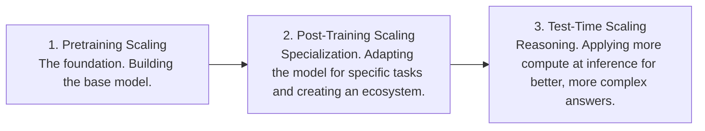
</details>

Distilled recommendations for estimating your own scaling laws, based on a meta-analysis of over 1,0oo scaling law fits.

1 |& Use Intermediate Checkpoints   
1.More reliable for fitting the law than just final losses.   
Discard Early, Noisy Data   
2. Ignore training data from before \~10 billion tokens to improve accuracy.   
3.品 Prioritize More Models, Not Just Bigger Ones   
3.A spread of sizes is key; five models provides a solid starting point.   
4 Partially Train Your Target   
4. m Geta reliable signal by training to \~30% of the dataset and extrapolating.

Source:Choshen,Zhang,&Andreas,2025

Fora fixed compute budget,should we train a larger model for fewer steps,or a smaller model for more steps?

Performance vs Compute Budget   


<details>
<summary>line</summary>

| Model Type | Test Loss (PF-days) |
|------------|---------------------|
| Saturated  | 1.0                 |
| Optimal    | 1.0                 |
| Undertrained | 1.0                 |
</details>

Parameters (non-embedding)

Ifperformanceonaspecifictaskfollowsapredictablesalinglwecan extrapolate to estimate the compute needed to reach adesired performance level.

Winogrande Performance   


<details>
<summary>line</summary>

| Parameters in LM (Billions) | Few-Shot (K=50) | One-Shot | Zero-Shot |
| --------------------------- | --------------- | -------- | --------- |
| 0.1B                        | 65%             | 60%      | 55%       |
| 1.3B                        | 70%             | 63%      | 57%       |
| 6.7B                        | 78%             | 70%      | 62%       |
| 13B                         | 85%             | 77%      | 66%       |
| 175B                        | 88%             | 80%      | 70%       |
</details>

If the scaling law holds...

Roughly 64 times more parameters will get us to human-level on Winogrande.

Scaling laws are an empirical tool, not a law of physics.Not alltasks scale smoothly.

# Case 1: Plateaus

Some tasks show diminishing or no returns from scale.


<details>
<summary>line</summary>

| Parameters (Billions) | Accuracy |
| --------------------- | -------- |
| 0.1B                  | 52       |
| 1.3B                  | 53       |
| 6.7B                  | 54       |
| 13B                   | 54       |
| 175B                  | 54       |
</details>

# Case 2:Phase Transitions

Some“emergent abilities”appear suddenly and discontinuously ata certain scale.


<details>
<summary>line</summary>

| Parameters (Billions) | Accuracy |
| --------------------- | -------- |
| 0.1B                  | ~2       |
| 1.3B                  | ~3       |
| 6.7B                  | ~5       |
| 13B                   | ~75      |
| 175B                  | ~92      |
</details>


<details>
<summary>flowchart</summary>

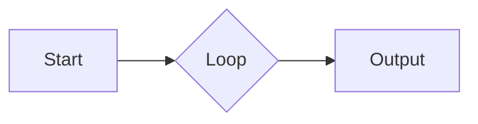
</details>

# 1. From Art to Science

Scaling laws have turned large-model training from a black art into a predictive, quantitative science.


<details>
<summary>flowchart</summary>

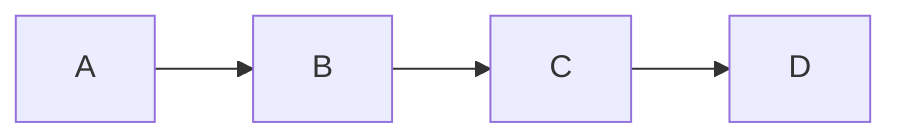
</details>

# 2. A Lifecycle of Scale

Optimizing compute is not just about pretraining,but also about the vast ecosystems of post-training and the new frontier of test-time reasoning.


<details>
<summary>natural_image</summary>

Simple line drawing of a telescope with a star light emission (no text or symbols)
</details>

# 3.Prediction is Power

These laws are our best tool for efficientlyallocating massive budgets and forecasting the future of AI.

# Review of the course

# ARTIFICIAL INTELLIGENCEVSMACHINE LEARNING VS DEEP LEARNING

# O Artificial Intelligence

Developmentofsmartsystemsand machines that cancarry outtasksthattypicallyrequirehumanintelligence

# @ Machine Learning

Creates algorithms that can learn from data and make decisions based on patterns observed Require human intervention when decision is incorrect

# Deep Learning

Uses an artificial neural network toreachaccurate conclusions without human intervention


Source: https://www.scs.org.sg/articles/machine-learning-vs-deep-learning

Deep learning is part of a broader family of machine learning methods based on artificial neural networks with representation learning.

# Milestones


<details>
<summary>flowchart</summary>

```mermaid
graph LR
    A["1940: Electronic Brain"] --> B["1943: Electronic Brain"]
    B --> C["1950: Perceptron"]
    C --> D["1957: Golden Age"]
    D --> E["1960: ADALINE"]
    E --> F["1969: XOR Problem"]
    F --> G["1986: Multi-layered Perceptron (Backpropagation)"]
    G --> H["1995: SVM"]
    H --> I["2006: Deep Neural Network (Pretraining)"]
    
    subgraph Time Periods
        J["S. McCulloch - W. Pitts"] --> K["F. Rosenblatt"]
        K --> L["B. Widrow - M. Hoff"]
        L --> M["M. Minsky - S. Papert"]
        M --> N["D. Rumelhart - G. Hinton - R. Williams"]
        N --> O["V. Vapnik - C. Cortes"]
        O --> P["G. Hinton - S. Ruslan"]
    end
    
    subgraph Legend
        Q["X AND Y"] --> R["+1 +2 X"]
        R --> S["+1 +2 X"]
        S --> T["+1 +2 X"]
        T --> U["+1 +2 X"]
        U --> V["+1 +2 X"]
        V --> W["+1 +2 X"]
        W --> X["+1 +2 X"]
        X --> Y["+1 +2 X"]
        Y --> Z["+1 +2 X"]
        Z --> AA["+1 +2 X"]
        AA --> AB["+1 +2 X"]
        AB --> AC["+1 +2 X"]
        AC --> AD["+1 +2 X"]
        AD --> AE["+1 +2 X"]
        AE --> AF["+1 +2 X"]
        AF --> AG["+1 +2 X"]
        AG --> AH["+1 +2 X"]
        AH --> AI["+1 +2 X"]
        AI --> AJ["+1 +2 X"]
        AJ --> AK["+1 +2 X"]
        AK --> AL["+1 +2 X"]
        AL --> AM["+1 +2 X"]
        AM --> AN["+1 +2 X"]
        AN --> AO["+1 +2 X"]
        AO --> AP["+1 +2 X"]
        AP --> AQ["+1 +2 X"]
        AQ --> AR["+1 +2 X"]
        AR --> AS["+1 +2 X"]
        AS --> AT["+1 +2 X"]
        AT --> AU["+1 +2 X"]
        AU --> AV["+1 +2 X"]
        AV --> AW["+1 +2 X"]
        AW --> AX["+1 +2 X"]
        AX --> AY["+1 +2 X"]
        AY --> AZ["+1 +2 X"]
        AZ --> BA["+1 +2 X"]
        BA --> BB["+1 +2 X"]
        BB --> BC["+1 +2 X"]
        BC --> BD["+1 +2 X"]
        BD --> BE["+1 +2 X"]
        BE --> BF["+1 +2 X"]
        BF --> BG["+1 +2 X"]
        BG --> BH["+1 +2 X"]
        BH --> BI["+1 +2 X"]
        BI --> BJ["+1 +2 X"]
        BJ --> BK["+1 +2 X"]
        BK --> BL["+1 +2 X"]
        BL --> BM["+1 +2 X"]
        BM --> BN["+1 +2 X"]
        BN --> BO["+1 +2 X"]
        BO --> BP["+1 +2 X"]
        BP --> BQ["+1 +2 X"]
        BQ --> BR["+1 +2 X"]
        BR --> BS["+1 +2 X"]
        BS --> BT["+1 +2 X"]
        BT --> BU["+1 +2 X"]
        BU --> BV["+1 +2 X"]
        BV --> BW["+1 +2 X"]
        BW --> BX["+1 +2 X"]
        BX --> BY["+1 +2 X"]
        BY --> BZ["+1 +2 X"]
        BZ --> CA["+1 +2 X"]
        CA --> CB["+1 +2 X"]
        CB --> CC["+1 +2 X"]
        CC --> CD["+1 +2 X"]
        CD --> CE["+1 +2 X"]
        CE --> CF["+1 +2 X"]
        CF --> CG["+1 +2 X"]
        CG --> CH["+1 +2 X"]
        CH --> CI["+1 +2 X"]
        CI --> CJ["+1 +2 X"]
        CJ --> CK["+1 +2 X"]
        CK --> CL["+1 +2 X"]
        CL --> CM["+1 +2 X"]
        CM --> CN["+1 +2 X"]
        CN --> CO["+1 +2 X"]
        CO --> CP["+1 +2 X"]
        CP --> CQ["+1 +2 X"]
        CQ --> CR["+1 +2 X"]
        CR --> CS["+1 +2 X"]
        CS --> CT["+1 +2 X"]
        CT --> CU["+1 +2 X"]
        CU --> CV["+1 +2 X"]
        CV --> CW["+1 +2 X"]
        CW --> CX["+1 +2 X"]
        CX --> CY["+1 +2 X"]
        CY --> CZ["+1 +2 X"]
        CZ --> DA["+1 +2 X"]
        DA --> DB["+1 +2 X"]
        DB --> DC["+1 +2 X"]
        DC --> DD["+1 +2 X"]
        DD --> DE["+1 +2 X"]
        DE --> DF["+1 +2 X"]
        DF --> DG["+1 +2 X"]
        DG --> DH["+1 +2 X"]
        DH --> DI["+1 +2 X"]
        DI --> DJ["+1 +2 X"]
        DJ --> DK["+1 +2 X"]
        DK --> DL["+1 +2 X"]
        DL --> DJ
    end
```
</details>

Source: http://beamlab.org/deeplearning/2017/02/23/deep\_learning\_101\_part1.html

# DNN

# Feedforward Neural Networks (Multi-Layer Perceptrons)

• The architecture of a ${ \sf M L P }$ is expressed as a composition of a series of functions

$$
f _ {\theta} (x) = \mathcal {A} _ {L} \circ \sigma \circ \mathcal {A} _ {L - 1} \circ \sigma \circ \dots \circ \sigma \circ \mathcal {A} _ {1} (x), x \in \mathbb {R} ^ {d _ {0}}
$$

where

$$
\mathcal {A} _ {i} (x) = W _ {i} x + b _ {i}, \qquad x \in \mathbb {R} ^ {d _ {i - 1}}
$$

is the i-th linear transformation with

weight matrix $W _ { i } \in \mathbb { R } ^ { d _ { i } \times d _ { i - 1 } }$ and bias vector $b _ { i } \in \mathbb { R } ^ { d _ { i } }$ ,

and $\cdot$ is the activation function,

$\begin{array}{c} \mathsf { e . g . } , \qquad & { } \end{array}$

# Feedforward Neural Networks (Multi-Layer Perceptrons)

• The architecture of a MLP is expressed as a composition of a series of functions

$$
f _ {\theta} (x) = \mathcal {A} _ {L} \circ \sigma \circ \mathcal {A} _ {L - 1} \circ \sigma \circ \dots \circ \sigma \circ \mathcal {A} _ {1} (x), x \in \mathbb {R} ^ {d _ {0}}
$$

where

$$
\mathcal {A} _ {i} (x) = W _ {i} x + b _ {i}, \qquad x \in \mathbb {R} ^ {d _ {i - 1}}.
$$

Such MLP has 끫롾 layers,

The input 끫뤲 is the 0-th layer and the output is the last layer.

$\begin{array} { r l } { h _ { i } ( x ) = } & { { } \circ \mathcal { A } _ { i } \circ \quad \circ \cdots \circ \quad \circ \mathcal { A } _ { 1 } ( x ) } \end{array}$ is the i-th layer, hidden layer.

The depth of the network $( L - 1 )$ , number of hidden layers.

• The width of the i-th layer is $d _ { i }$ . The width of the network is max $\{ d _ { 1 } , \dots , d _ { { L - 1 } } \}$   
• $\theta = ( W _ { 1 } , b _ { 1 } , \dots , W _ { L } , b _ { L } )$ collects all the parameters. Size of the network is # 끫븆.

# Activation functions

$$
f _ {\theta} (x) = \mathcal {A} _ {L} \circ \sigma \circ \mathcal {A} _ {L - 1} \circ \sigma \circ \dots \circ \sigma \circ \mathcal {A} _ {1} (x), \qquad x \in \mathbb {R} ^ {d _ {0}}
$$

<table><tr><td>Sigmoid</td><td>Tanh</td><td>ReLU</td><td>Leaky ReLU</td></tr><tr><td> $g(z) = \frac{1}{1 + e^{-z}}$ </td><td> $g(z) = \frac{e^{z} - e^{-z}}{e^{z} + e^{-z}}$ </td><td> $g(z) = \max(0, z)$ </td><td> $g(z) = \max(\epsilon z, z)$ with  $\epsilon \ll 1$ </td></tr><tr><td></td><td></td><td></td><td></td></tr></table>

An Activation functions is considered non-saturated if $\operatorname* { l i m } _ { x  \infty } \sigma ( x ) = \infty$

# Saturated Nonlinearity : Sigmoid, Tanh

Non-saturated Nonlinearity: Rectified Linear Unit (ReLU), Leaky ReLU

ReLU is a good default choice for most problems.

# Universality of Neural Networks (Arbitrary-width case)

Universal approximation theorem:Let $C ( X , Y )$ denote the set of continuous functions fromXtoY.Let $\sigma \in C ( \mathbb { R } , \mathbb { R } )$ .Notethat $( \sigma \circ x ) _ { i } = \sigma ( x _ { i } )$ ,so $\sigma \circ x$ denotesgapplied to each component ofx.

Then $\sigma$ is not polynomial ifandonlyifforevery $n \in \mathbb { N } , m \in \mathbb { N }$ ,compact $K \subseteq \mathbb { R } ^ { n }$ $f \in C ( K , \mathbb { R } ^ { m } ) , \varepsilon > 0$ there exist $k \in \mathbb { N } , A \in \mathbb { R } ^ { k \times n } , b \in \mathbb { R } ^ { k } , C \in \mathbb { R } ^ { m \times k }$ such that

$$
\sup _ {x \in K} \| f (x) - g (x) \| <   \varepsilon
$$

where

$$
g (x) = C \cdot (\sigma \circ (A \cdot x + b))
$$

Any continuous functions defined on a compact set can be approximated arbitrarily well by a shallow neural network if the shallow neural network is arbitrarily wide.

# Universality of Neural Networks (Arbitrary-depth case)

Universalapproximationtheorem(L1distance,ReLUactivation,arbitrarydepth,minimal width).Forany Bochner-Lebesguep-integrable function $f : \mathbb { R } ^ { n }  \mathbb { R } ^ { m }$ andany $\epsilon > 0$ thereexistsa fully-connected ReLU network Fof width exactly $d _ { m } = \operatorname* { m a x } \{ n + 1 , m \}$ satisfying

$$
\int_ {\mathbb {R} ^ {n}} \| f (x) - F (x) \| ^ {p} \mathrm{d} x <   \epsilon .
$$

Moreover,thereexistsa function $f \in L ^ { p } ( \mathbb { R } ^ { n } , \mathbb { R } ^ { m } )$ andsome $\epsilon > 0 .$ forwhich there is no fully-connected ReLU network of width less than $d _ { m } = \operatorname* { m a x } \{ n + 1 , m \}$ satisfying the aboveapproximation bound.

Any continuous functions defined on a compact set can be approximated arbitrarily well by a fixed-width neural network if the neural network is arbitrarily deep.

From shallow to deep.

Do large Neural Networks overfit the data?

Underfit   


<details>
<summary>scatter</summary>

| Output variable |
| --------------- |
| 0               |
| 1               |
| 2               |
| 3               |
| 4               |
| 5               |
| 6               |
| 7               |
| 8               |
| 9               |
| 11              |
| 13              |
| 15              |
| 17              |
| 19              |
| 21              |
| 23              |
| 25              |
| 27              |
| 29              |
| 31              |
| 33              |
| 35              |
| 37              |
| 39              |
| 41              |
| 43              |
| 45              |
| 47              |
| 49              |
| 51              |
| 53              |
| 55              |
| 57              |
| 59              |
| 61              |
| 63              |
| 65              |
| 67              |
| 69              |
| 71              |
| 73              |
| 75              |
| 77              |
| 79              |
| 81              |
| 83              |
| 85              |
| 87              |
| 89              |
| 91              |
| 93              |
| 95              |
| 97              |
| 99              |
</details>

Predictor variable

Optimal   


<details>
<summary>scatter</summary>

| Output variable |
| --------------- |
| 0.0             |
| 0.1             |
| 0.2             |
| 0.3             |
| 0.4             |
| 0.5             |
| 0.6             |
| 0.7             |
| 0.8             |
| 0.9             |
| 1.0             |
</details>

Predictor variable

Overfit   


<details>
<summary>scatter</summary>

| Output variable |
| --------------- |
| 0               |
| 1               |
| 2               |
| 3               |
| 4               |
| 5               |
| 6               |
| 7               |
| 8               |
| 9               |
| 10              |
</details>

Predictor variable

An Example   


<details>
<summary>bar_line</summary>

| x      | y (red line) | y (blue dots) |
| ------ | ------------ | ------------- |
| -10.0  | 1.2          | 0.9           |
| -7.5   | 0.0          | -0.4          |
| -5.0   | -0.6         | -0.8          |
| -2.5   | 0.4          | 0.5           |
| 0.0    | 0.1          | -0.1          |
| 2.5    | -0.2         | -0.3          |
| 5.0    | 0.3          | 0.4           |
| 7.5    | 0.7          | 0.6           |
| 10.0   | -1.2         | -1.1          |
</details>

Data $( X _ { i } , Y _ { i } ) , i = 1 , \ldots , n .$   
To find a network

$$
\boldsymbol {f} (\boldsymbol {x}; \boldsymbol {\theta})
$$

such that

$$
\Sigma \big (Y _ {i} - f (X _ {i}; \theta) \big) ^ {2}
$$

is minimized over

$$
\mathcal {F} = \{f: f (x; \theta) i s a
$$

끫뤞끫뤞끫뤞끫뤞 끫뤞 끫뤞끫뤞끫뤞끫뤞끫뤞끫뤞끫뤞

끫뤢 끫뤢 끫뤢 끫뤢 끫뤆끫뤆 $\in \mathbb { R } ^ { s } \}$

How do we solve for 끫빺 ? It seems hard to get no closed-form solution.   
• Search for 끫빺 using optimization algorithms. e.g., (stochastic) gradient decent and its variants.

# The optimization problem

Data $( X _ { i } , Y _ { i } ) , i = 1 , \dots , n$   
The empirical risk

$$
R _ {n} (\pmb {\theta}) = R _ {n} \big (f (\cdot , \pmb {\theta}) \big) = \frac {1}{n} \sum \big (Y _ {i} - f (X _ {i}; \pmb {\theta}) \big) ^ {2}.
$$

• The target is to minimize $R _ { n } ( \theta )$ over $\mathbf { \xi } \in \mathbb { R } ^ { s }$ .

The loss, objective function $\smash { R _ { n } ( \mathbf { \theta } ) }$ .

The parameter $\mathbf { \chi } \in \mathbb { R } ^ { s }$ .


<details>
<summary>natural_image</summary>

Scenic mountain landscape with a cartoon character walking through the valley, snow-capped peaks in the background under a blue sky with clouds.
</details>

Source: https://www.maxpixel.net/Mountains-Valleys-Landscape-Hills-Grass-Green-699369

# The optimization problem

Data $( X _ { i } , Y _ { i } ) , i = 1 , \dots , n$ .   
The empirical risk

$$
R _ {n} (\theta) = R _ {n} \big (f (\cdot , \theta) \big) = \frac {1}{n} \sum \big (Y _ {i} - f (X _ {i}; \theta) \big) ^ {2}.
$$

To minimize $R _ { n } ( \mathbf { \theta } )$ over $\theta \in \mathbb { R } ^ { s }$ .

Initialize $\in \mathbb { R } ^ { s }$ by some randomization

For $\cdot$

Calculate $\cdot$ |끫빺=끫빺

Set stepsize $\alpha _ { t } > 0$

Update $\begin{array} { r } { \theta _ { t } = \theta _ { t - 1 } - \alpha _ { t } \cdot \lbrack \frac { d R _ { n } ( \theta ) } { d \theta } \vert _ { \theta = \theta _ { t - 1 } } \rbrack } \end{array}$ ⋅[

After T times iterations, we got $\pmb { \theta } _ { T }$ such that $\cal R _ { n } ( \mathrm { ~  ~ \xi ~ } )$ is small.


<details>
<summary>text_image</summary>

Stop!
</details>

Stop somewhere after some iterations of optimization.

# Robust loss for regression

Problem: Regression with outliers   


<details>
<summary>scatter</summary>

| x       | y_data | y_fitted_curve |
| ------- | ------ | -------------- |
| -0.95   | 0.0    | 0.0            |
| -0.85   | 0.1    | 0.0            |
| -0.75   | -0.1   | 0.0            |
| -0.65   | 0.0    | 0.0            |
| -0.55   | 0.3    | 0.2            |
| -0.45   | 0.5    | 0.3            |
| -0.35   | 0.4    | 0.4            |
| -0.25   | 0.3    | 0.4            |
| -0.15   | 0.2    | 0.3            |
| -0.05   | 0.1    | 0.2            |
| 0.05    | 0.0    | 0.1            |
| 0.15    | -0.1   | 0.0            |
| 0.25    | -0.3   | -0.1           |
| 0.35    | -0.5   | -0.3           |
| 0.45    | -0.7   | -0.5           |
| 0.55    | -1.2   | -1.1           |
| 0.65    | -1.1   | -1.2           |
| 0.75    | -0.8   | -1.0           |
| 0.85    | -0.4   | -0.6           |
| 0.95    | 3.1    | 3.5            |
</details>

（a） $( \cdot ) ^ { 2 }$ without outlier


<details>
<summary>scatter</summary>

| x       | y     |
| ------- | ----- |
| -0.9    | 0.0   |
| -0.8    | 0.1   |
| -0.7    | 0.2   |
| -0.6    | 0.3   |
| -0.5    | 0.4   |
| -0.4    | 0.5   |
| -0.3    | 0.6   |
| -0.2    | 0.7   |
| -0.1    | 0.8   |
| 0.0     | 0.9   |
| 0.1     | 1.0   |
| 0.2     | 1.1   |
| 0.3     | 1.2   |
| 0.4     | 1.3   |
| 0.5     | 1.4   |
| 0.6     | 1.5   |
| 0.7     | 1.6   |
| 0.8     | 1.7   |
| 0.9     | 1.8   |
| 1.0     | 2.9   |
</details>

（b） $( \cdot ) ^ { 2 }$ with outlier  
Source: Figure 7.11 of the book "Intro to Probability for Data Science”

Contaminated data can deteriorate the least squares regression.

Problem: Regression with outliers   


<details>
<summary>scatter</summary>

| x       | y_data | y_fitted_curve |
| ------- | ------ | -------------- |
| -1.0    | 0.0    | 0.0            |
| -0.8    | 0.1    | 0.0            |
| -0.6    | 0.3    | 0.1            |
| -0.4    | 0.5    | 0.3            |
| -0.2    | 0.4    | 0.4            |
| 0.0     | 0.2    | 0.3            |
| 0.2     | -0.1   | 0.1            |
| 0.4     | -0.5   | -0.1           |
| 0.6     | -1.2   | -1.1           |
| 0.8     | -0.8   | -0.7           |
| 1.0     | 3.0    | 3.5            |
</details>

（a） $( \cdot ) ^ { 2 }$ without outlier


<details>
<summary>scatter</summary>

| x       | y     |
| ------- | ----- |
| -0.98   | -0.12 |
| -0.96   | 0.05  |
| -0.94   | 0.18  |
| -0.92   | 0.02  |
| -0.90   | -0.05 |
| -0.88   | -0.18 |
| -0.86   | -0.03 |
| -0.84   | 0.07  |
| -0.82   | 0.15  |
| -0.80   | 0.22  |
| -0.78   | 0.30  |
| -0.76   | 0.38  |
| -0.74   | 0.45  |
| -0.72   | 0.52  |
| -0.70   | 0.60  |
| -0.68   | 0.68  |
| -0.66   | 0.75  |
| -0.64   | 0.82  |
| -0.62   | 0.90  |
| -0.60   | 0.98  |
| -0.58   | 1.05  |
| -0.56   | 1.12  |
| -0.54   | 1.18  |
| -0.52   | 1.25  |
| -0.50   | 1.32  |
| -0.48   | 1.38  |
| -0.46   | 1.45  |
| -0.44   | 1.52  |
| -0.42   | 1.58  |
| -0.40   | 1.65  |
| -0.38   | 1.72  |
| -0.36   | 1.78  |
| -0.34   | 1.85  |
| -0.32   | 1.92  |
| -0.30   | 1.98  |
| -0.28   | 2.05  |
| -0.26   | 2.12  |
| -0.24   | 2.18  |
| -0.22   | 2.25  |
| -0.20   | 2.32  |
| -0.18   | 2.38  |
| -0.16   | 2.45  |
| -0.14   | 2.52  |
| -0.12   | 2.58  |
| -0.10   | 2.65  |
| -0.08   | 2.72  |
| -0.06   | 2.78  |
| -0.04   | 2.85  |
| -0.02   | 2.92  |
| 0.00    | 2.98  |
| 0.02    | 3.05  |
| 0.04    | 3.12  |
| 0.06    | 3.18  |
| 0.08    | 3.25  |
| 0.10    | 3.32  |
| 0.12    | 3.38  |
| 0.14    | 3.45  |
| 0.16    | 3.52  |
| 0.18    | 3.58  |
| 0.20    | 3.65  |
| 0.22    | 3.72  |
| 0.24    | 3.78  |
| 0.26    | 3.85  |
| 0.28    | 3.92  |
| 0.30    | 3.98  |
| 0.32    | 4.05  |
| 0.34    | 4.12  |
| 0.36    | 4.18  |
| 0.38    | 4.25  |
| 0.40    | 4.32  |
| 0.42    | 4.38  |
| 0.44    | 4.45  |
| 0.46    | 4.52  |
| 0.48    | 4.58  |
| 0.50    | 4.65  |
| 0.52    | 4.72  |
| 0.54    | 4.78  |
| 0.56    | 4.85  |
| 0.58    | 4.92  |
| 0.60    | 4.98  |
| 0.62    | 5.05  |
| 0.64    | 5.12  |
| 0.66    | 5.18  |
| 0.68    | 5.25  |
| 0.70    | 5.32  |
| 0.72    | 5.38  |
| 0.74    | 5.45  |
| 0.76    | 5.52  |
| 0.78    | 5.58  |
| 0.80    | 5.65  |
| 0.82    | 5.72  |
| 0.84    | 5.78  |
| 0.86    | 5.85  |
| 0.88    | 5.92  |
| 0.90    | 5.98  |
| -1      | -1    |
| -1      | -1    |
| -1      | -1    |
| -1      | -1    |
| -1      | -1    |
| -1      | -1    |
| -1      | -1    |
| -1      | -1    |
| -1      | -1    |
| -1      | -1    |
| -1      | -1    |
| -1      | -1    |
</details>

（b） $( \cdot ) ^ { 2 }$ with outlier  
Source: Figure 7.11 of the book "Intro to Probability for Data Science”

But Why do least square regression fail?

# Problem: Regression with outliers

• Data $( X _ { i } , Y _ { i } ) , i = 1 , \dots , n$ . Minimize empirical risk $\begin{array} { r } { R _ { n } ( \theta ) = R _ { n } \big ( f ( \cdot , \theta ) \big ) = \frac { 1 } { n } \sum \big ( Y _ { i } - \big . } \end{array}$ $f { ( X _ { i } ; \theta ) } \big ) ^ { 2 }$ over $\mathbf { \chi } \in \mathbb { R } ^ { s }$ . Or minimize $R _ { n } ( f )$ over 끫릪.   
• Let $R ( f ) = \mathbb { E } \left( Y _ { i } - f ( X _ { i } ) \right) ^ { 2 }$ be the risk of a function 끫뢦, then for each 끫룊

$$
f ^ {*} (x) = \mathbb {E} [ Y | X = x ] = \operatorname{argmin} _ {f} \mathbb {E} \left[ \left(Y _ {i} - f (X _ {i})\right) ^ {2} \mid X _ {i} = x \right]. (\text {Try proving it.})
$$

• Then the targets of the minimization of $R _ { n } ( f )$ is the conditional mean of 끫뢘 given 끫뢖. In other words, least squares regression targets for “conditional mean”.

a OLS and robust fit   


<details>
<summary>scatter</summary>

| H   | W    |
| --- | ---- |
| 160 | 61   |
| 162 | 62   |
| 164 | 65   |
| 166 | 66   |
| 168 | 67   |
| 170 | 68   |
</details>

b Effect of an outlier on OLS and robust fit   


<details>
<summary>scatter</summary>

| H   | W    |
| --- | ---- |
| 160 | 61   |
| 162 | 62   |
| 164 | 65   |
| 166 | 66   |
| 168 | 67   |
| 170 | 68   |
</details>

# Loss functions and their derivatives

Least Square   


<details>
<summary>line</summary>

| x  | y  |
|----|----|
| -10 | 60 |
| -5  | 30 |
| 0   | 0  |
| 5   | 30 |
| 10  | 60 |
</details>

LAD   


<details>
<summary>line</summary>

| x  | y |
|----|---|
| -10 | 8 |
| -5  | 4 |
| 0   | 0 |
| 5   | 4 |
| 10  | 8 |
</details>

Huber   


<details>
<summary>line</summary>

| x  | y |
|----|---|
| -10 | 8 |
| -5  | 4 |
| 0   | 0 |
| 5   | 4 |
| 10  | 8 |
</details>

Cauchy   


<details>
<summary>line</summary>

| x  | y |
|----|---|
| -10 | 4 |
| -5  | 3 |
| 0   | 0 |
| 5   | 3 |
| 10  | 4 |
</details>

Tukey   


<details>
<summary>line</summary>

| x  | y  |
|----|----|
| -7 | -16 |
| -5 | -10 |
| 0  | 0   |
| 5  | 10  |
| 7  | 16 |
</details>


<details>
<summary>line</summary>

| x   | y   |
| --- | --- |
| -7.5 | -1.0 |
| -5  | -1.0 |
| -2.5 | -1.0 |
| 0   | 1.0 |
| 2.5 | 1.0 |
| 5   | 1.0 |
| 7.5 | 1.0 |
</details>


<details>
<summary>line</summary>

| x   | y    |
| --- | ---- |
| -7  | -1.0 |
| -5  | -1.0 |
| -3  | -1.0 |
| -1  | -1.0 |
| 0   | 1.0  |
| 3   | 1.0  |
| 5   | 1.0  |
| 7   | 1.0  |
</details>


<details>
<summary>line</summary>

| x    | y     |
| ---- | ----- |
| -7   | -0.2  |
| -5   | -0.4  |
| -3   | -0.6  |
| -1   | -0.8  |
| 0    | -1.0  |
| 1    | 1.0   |
| 3    | 0.6   |
| 5    | 0.4   |
| 7    | 0.2   |
</details>


<details>
<summary>line</summary>

| x    | y     |
| ---- | ----- |
| -7   | 0.0   |
| -5   | 0.0   |
| -3   | -1.0  |
| -1   | -1.5  |
| 1    | 1.0   |
| 3    | 0.0   |
| 5    | 0.0   |
</details>

Least square (LS): $\phi ( a ) = a ^ { 2 }$

Least absolute deviation (LAD): $\phi ( a ) = | a |$

Huber loss: $i f { \begin{array} { c } { { \begin{array} { r } { i f } \end{array} } } \end{array} } \qquad i f \qquad { \begin{array} { r } { i f } \end{array} } \qquad $ for some $\pmb { \tau } > \mathbf { 0 }$

Cauchy loss: $\begin{array} { r } { \phi ( \pmb { a } ) = l o g [ 1 + \kappa ^ { 2 } \pmb { a } ^ { 2 } ] } \end{array}$ for some $\cdot$

Tukey loss: $\cdot$ 끫뤔 $\_$ /끫뾨 끫뤠

# Loss functions and their derivatives

Least Square   


<details>
<summary>line</summary>

| x  | y  |
|----|----|
| -10 | 60 |
| -5  | 30 |
| 0   | 0  |
| 5   | 30 |
| 10  | 60 |
</details>

LAD   


<details>
<summary>line</summary>

| x  | y |
|----|---|
| -10 | 8 |
| -5  | 4 |
| 0   | 0 |
| 5   | 4 |
| 10  | 8 |
</details>

Huber   


<details>
<summary>line</summary>

| x  | y |
|----|---|
| -10 | 8 |
| -5  | 4 |
| 0   | 0 |
| 5   | 4 |
| 10  | 8 |
</details>

Cauchy   


<details>
<summary>line</summary>

| x  | y |
|----|---|
| -10 | 4 |
| -5  | 3 |
| 0   | 0 |
| 5   | 3 |
| 10  | 4 |
</details>

Tukey   


<details>
<summary>line</summary>

| x  | y  |
|----|----|
| -7 | -16 |
| -5 | -10 |
| -3 | -5  |
| -1 | 0   |
| 1  | 5   |
| 3  | 10  |
| 5  | 15  |
| 7  | 20  |
</details>


<details>
<summary>line</summary>

| x   | y   |
| --- | --- |
| -6  | -1.0 |
| -5  | -1.0 |
| -4  | -1.0 |
| -3  | -1.0 |
| -2  | -1.0 |
| -1  | -1.0 |
| 0   | 1.0 |
| 1   | 1.0 |
| 2   | 1.0 |
| 3   | 1.0 |
| 4   | 1.0 |
| 5   | 1.0 |
| 6   | 1.0 |
</details>


<details>
<summary>line</summary>

| x   | y    |
| --- | ---- |
| -7  | -1.0 |
| -5  | -1.0 |
| -3  | -1.0 |
| -1  | -1.0 |
| 0   | 1.0  |
| 3   | 1.0  |
| 5   | 1.0  |
| 7   | 1.0  |
</details>


<details>
<summary>line</summary>

| x    | y     |
| ---- | ----- |
| -7   | -0.2  |
| -5   | -0.4  |
| -3   | -0.6  |
| -1   | -0.8  |
| 0    | -1.0  |
| 1    | 1.0   |
| 3    | 0.6   |
| 5    | 0.4   |
| 7    | 0.2   |
</details>


<details>
<summary>line</summary>

| x    | y     |
| ---- | ----- |
| -7   | 0.0   |
| -5   | 0.0   |
| -3   | -1.0  |
| -1   | -1.5  |
| 1    | 1.0   |
| 3    | 0.0   |
| 5    | 0.0   |
| 7    | 0.0   |
</details>

Recall: the empirical risk $\begin{array} { r } { R _ { n } ( \theta ) = \frac { 1 } { n } \sum \phi ( Y _ { i } - f ( X _ { i } ; \theta ) ) } \end{array}$

Gradient: $\begin{array} { r } { \frac { d } { d } R _ { n } ( { \it \Delta \phi } ) = - \frac { 1 } { n } \sum \phi ^ { \prime } ( Y _ { i } - f ( X _ { i } ; { \it \Delta \phi } ~ ) ) \frac { d } { d } f ( X _ { i } ; { \it \Delta \phi } ~ ) } \end{array}$

To compute $\frac { d } { d } f ( X _ { i } ; \mathbf { \lambda } )$ , use Chain rule.

# Let’s consider the Least Absolute Deviation (LAD)

Data $( X _ { i } , Y _ { i } ) , i = 1 , \dots , n$ drawn from $( X , Y )$ .   
• To find a network $\pmb { f } ( \pmb { x } ; \pmb { \theta } )$ such that $\begin{array} { r } { R _ { n } ( \theta ) = R _ { n } ( f ( \cdot , \theta ) ) = \frac { 1 } { n } \sum | Y _ { i } - f ( X _ { i } ; \theta ) | } \end{array}$ is minimized over $\mathbf { \xi } \in \mathbb { R } ^ { s }$ or over $f \in { \mathcal { F } }$ .   
Let $\pmb { R } ( \mathbf { \theta } ) = \mathbb { E } \| \pmb { Y } - \mathbf { \theta } ( \pmb { X } ) \|$ be the risk of a function 끫뤎. Then under mild condition, for each 끫뤲

$$
\boldsymbol {f} ^ {*} (\boldsymbol {x}) = \text {meadian} (Y | X = x) = \operatorname{argmin} _ {\boldsymbol {f}} \mathbb {E} \left\{\| Y - \boldsymbol {f} (X) \| \mid X = x \right\}.
$$

Then the targets of the minimization of $\pmb { R _ { n } } ( f )$ is the conditional median of 끫뤀 given 끫룾. In other words, LAD regression targets for “conditional median”.

Least Absolute Deviation, regression for median   


<details>
<summary>scatter</summary>

| distortion | confidence |
| ---------- | ---------- |
| 0.0        | 0.53       |
| 0.5        | 0.52       |
| 1.0        | 0.50       |
| 1.5        | 0.47       |
| 2.0        | 0.44       |
| 2.5        | 0.41       |
| 3.0        | 0.38       |
| 3.5        | 0.35       |
| 4.0        | 0.33       |
</details>

Source: https://doi.org/10.1117/12.2559457

# Optimization

Given data $( X _ { i } , Y _ { i } ) , i = 1 , \dots , n$ . Minimize a loss function over $\theta \in \mathbb { R } ^ { s }$ :

$$
\min _ {\theta \in \mathbb {R} ^ {s}} f (\theta) := \frac {1}{n} \sum_ {i = 1} ^ {n} l (\theta ; X _ {i}, Y _ {i}).
$$


<details>
<summary>natural_image</summary>

3D surface plot with a curved path and contour lines, rendered in rainbow colors (no text or labels)
</details>

# Assumption 3.1

끫뤎(끫빺) is continuously differentiable and 끫붂끫붂(끫빺) is Lipschitz continuous:

$$
\left| \left| \nabla \mathbf {f} (\mathbf {x}) - \nabla \mathbf {f} (\mathbf {y}) \right| \right| \leq L \left| \left| x - y \right| \right|
$$

for some L > 0. We call 끫뤎 satisfying this property is a L-smooth function.

Start from some $\theta ^ { 0 } \in \mathbb { R } ^ { s }$ , gradient descent (GD) algorithm updates as:

$$
\theta^ {k + 1} = \theta^ {k} - \alpha_ {k} \nabla f (\theta^ {k}),
$$

until

$$
| | \nabla f (\theta^ {k + 1}) | | \leq \varepsilon ,
$$

for some tolerance $\varepsilon > 0 .$

# Key points:

1. Compute $\cdot$ .   
2. Choose step size $\cdot$ satisfying

$$
\boldsymbol {f} \left(\boldsymbol {\theta} ^ {k + 1}\right) <   \boldsymbol {f} \left(\boldsymbol {\theta} ^ {k}\right).
$$

Theorem 3.1 Let 끫뢦 be a L-smooth function and $f ( \theta ) \geq \bar { f } > - \infty$ for any 끫븆. Let $\{ \theta ^ { k } \} _ { k = 0 } ^ { T }$ be the sequence generated by the gradient descent algorithm with step size 1/L, then

$$
\min _ {1 \leq k \leq T} \| \nabla f (\theta^ {k}) \| ^ {2} \leq \frac {2 L (f (\theta^ {0}) - \bar {f})}{T}.
$$

We leave the proof as a question in Assignment 1.

# Hint:

Step 1: Apply Lemma 3.1 at step k.

Step 2: Sum them up for ${ \sf k } = 0 , 1 , . . . , { \sf T } .$

Step 3: Realize that f is bounded from below.

In gradient descent, we need to compute

$$
\nabla f (\theta^ {k}) = \frac {1}{n} \sum_ {i = 1} ^ {n} \nabla_ {\theta} l (\theta^ {k}; X _ {i}, Y _ {i}).
$$

This computation is expensive if n is huge !!!

Question: How to overcome it?

Hint: How to estimate the expectation of a random variable?

Start from some $\mathbf { \Xi } \in \mathbb { R } ^ { s }$ , the SGD algorithm updates iteratively as:

$$
\theta^ {k + 1} = \theta^ {k} - \alpha_ {k} g (\theta^ {k}, \xi_ {k}),
$$

where $g ( \theta ^ { k } , \xi _ { k } )$ is the stochastic gradient computed at $\theta ^ { k }$ .

# Key points:

1. Sampling strategy to compute $g ( \theta ^ { k } , \xi _ { k } )$ .   
2. Choose step size $\alpha _ { k } > 0$

# Assumption 3.2 끫뢦 is a convex function and

$$
\begin{array}{l} \mathbb {E} _ {\xi} [ g (\theta , \xi) ] = \nabla f (\theta), \\ \mathbb {E} _ {\xi} [ \| g (\theta , \xi) \| ^ {2} ] \leq B ^ {2}, \forall \theta . \\ \end{array}
$$

where 끫롪 is a given parameters.

Theorem 3.2 Let $\{ \theta ^ { k } \}$ be the sequence generated by SGD with step size $\alpha _ { k } > 0$ , under Assumption 3.2, for any ${ \sf T } > 0$ ,

$$
\mathbb {E} [ f (\bar {\theta} ^ {T}) - f ^ {*} ] \leq \frac {| | \theta^ {0} - \theta^ {*} | | ^ {2} + B ^ {2} \sum_ {j = 0} ^ {T} \alpha_ {j} ^ {2}}{2 \sum_ {j = 0} ^ {T} \alpha_ {j}},
$$

where

$$
\lambda_ {k} = \sum_ {j = 0} ^ {k} \alpha_ {j}, \bar {\theta} ^ {k} = \lambda_ {k} ^ {- 1} \sum_ {j = 0} ^ {k} \alpha_ {j} \theta^ {j}.
$$

Proposition 3.1 If we take $\alpha _ { j } = \alpha > 0$ , then

$$
\mathbb {E} [ f (\bar {\theta} ^ {T}) - f ^ {*} ] \leq \frac {\| \theta^ {0} - \theta^ {*} \| ^ {2} + B ^ {2} (T + 1) \alpha^ {2}}{2 (T + 1)}.
$$


<details>
<summary>text_image</summary>

w⁰
fast convergence
to this region.
w*
(solution)
→ ball with radius
</details>

As $\cdot$ , the estimator

$$
\hat {\theta} ^ {T}
$$

will be in a ball with radius

$$
B ^ {2} \alpha^ {2} / 2
$$

# 1. Slow convergence.


<details>
<summary>text_image</summary>

SGD without momentum
</details>


<details>
<summary>text_image</summary>

SGD with momentum
</details>

# 2. Converge to local optimal solution.


<details>
<summary>text_image</summary>

Local Minimum
Overview Step-by-Step
Gradient Arrows
Adjusted Gradient Arrows
Momentum Arrows
Sum of Gradient Squared
Path
Gradient Descent
Learning Rate: 1e -2
Momentum
Learning Rate: 1e -2
Decay rate: 0.900
Adagrad
Learning Rate: 1e -3
RMSprop
Learning Rate: 1e -3
Decay rate: 0.900
Run
Learning Rate: 1e -3
</details>

# 3. Converge to saddle points.

$$
\begin{array}{l} f (x, y) = x ^ {2} - y ^ {2}. \\ \frac {\partial}{\partial x} f (0, 0) = 2 * 0 = 0, \\ \frac {\partial}{\partial y} f (0, 0) = - 2 * 0 = 0. \\ \end{array}
$$


<details>
<summary>surface_3d</summary>

| x    | y    | z    |
| ---- | ---- | ---- |
| -1.0 | 0.0  | 0.0  |
| -0.5 | 0.5  | 0.5  |
| 0.0  | 1.0  | 1.0  |
| 0.5  | 0.5  | 0.5  |
| 1.0  | 0.0  | 0.0  |
</details>

Start from some $\theta ^ { 0 } \in \mathbb { R } ^ { s } , v _ { 0 } = g ( \theta ^ { 0 } , \xi _ { 0 } )$ , for $k \geq 0$ :

$$
v ^ {k + 1} = \gamma v ^ {k} + (1 - \gamma) g (\theta^ {k}, \xi_ {k}),
$$

$$
\theta^ {k + 1} = \theta^ {k} - v ^ {k + 1}.
$$


<details>
<summary>text_image</summary>

Local Minimum
Overview Step-by-Step
Gradient Arrows
Adjusted Gradient Arrows
Momentum Arrows
Sum of Gradient Squared
Path
✓ Gradient Descent
Learning Rate: 1e -2
✓ Momentum
Learning Rate: 1e -2
Decay rate: 0.900
Adagrad
Learning Rate: 1e -3
RM5prop
Learning Rate: 1e -3
Decay rate: 0.900
Action
Learning Rate: 1e -3
</details>

끫뷼 is usually chosen to be 0.9 in practice.

Momentumupdate   


<details>
<summary>text_image</summary>

momentum
step
actual step
gradient
step
</details>

Nesterovmomentumupdate   


<details>
<summary>flowchart</summary>

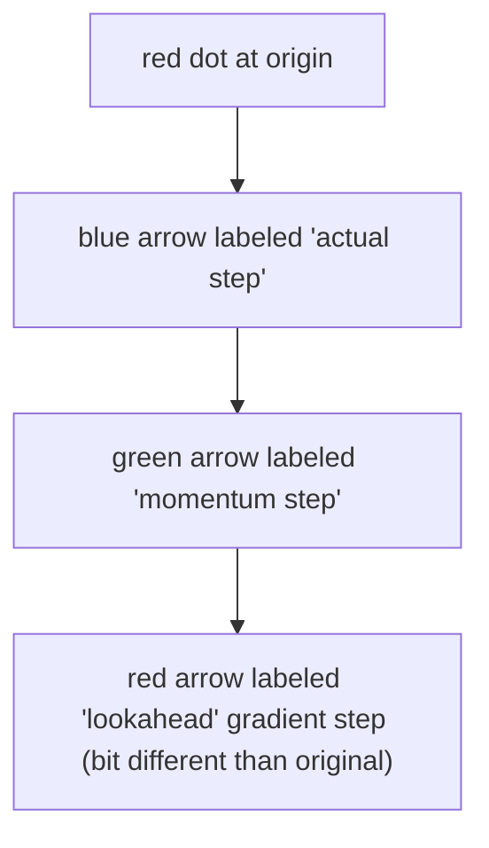
</details>

Start from some $\theta ^ { 0 } \in \mathbb { R } ^ { s } , v _ { 0 } = g ( \theta ^ { 0 } , \xi _ { 0 } )$ , for $k \geq 0$ :

$$
\begin{array}{l} \vartheta^ {k} \quad = \theta^ {k} - \beta_ {k} v ^ {k}, \\ v ^ {k + 1} = \beta_ {k} v ^ {k} + \alpha_ {k} g (\vartheta^ {k}, \xi_ {k}), \\ \theta^ {k + 1} = \theta^ {k} - v ^ {k + 1}. \\ \end{array}
$$

An advantage: prevent overshot!

Key idea: Rescale the learning rate of each coordinate by the historical progress.

Start from some $\theta ^ { 0 } \in \mathbb { R } ^ { s } , n _ { g } = 0 , \mathsf { f o r } k \geq 0 { : }$

$$
\begin{array}{l} {n _ {g}} = {n _ {g} + g (\theta^ {k}, \xi_ {k}). * g (\theta^ {k}, \xi_ {k}),} \\ \theta^ {k + 1} = \theta^ {k} - \alpha_ {k} g (\theta^ {k}, \xi_ {k}). / (n _ {g} + 1 0 ^ {- 8}). \\ \end{array}
$$

Issue: The learning rate (step size) goes to zero quickly.

Key idea: Consider momentum and adaptive learning rate (secondorder momentum) together.

Require::Stepsize

Require: $\beta _ { 1 } , \beta _ { 2 } \in [ 0 , 1 )$ : Exponential decay rates for the moment estimates

Require: f(0):Stochastic objective function with parameters $\theta$

Require: $\theta _ { 0 }$ :Initial parameter vector

$m _ { 0 } \gets 0$ (Initialize $1 ^ { \mathrm { s t } }$ moment vector)

v←O (Initialize $2 ^ { \mathrm { n d } }$ moment vector)

t←O(Initialize timestep)

while $\theta _ { t }$ not converged do

$t \gets t + 1$

$g _ { t } \gets \nabla _ { \theta } f _ { t } ( \theta _ { t - 1 } )$ (Get gradients W.r.t.stochastic objective at timestep t)

$m _ { t } \gets \beta _ { 1 } \cdot m _ { t - 1 } + ( 1 - \beta _ { 1 } ) \cdot g _ { t }$ (Update biased first moment estimate)

$v _ { t }  \beta _ { 2 } \cdot v _ { t - 1 } + ( 1 - \beta _ { 2 } ) \cdot g _ { t } ^ { 2 }$ (Update biased second raw moment estimate)

$\widehat { m } _ { t } \gets m _ { t } / ( 1 - \beta _ { 1 } ^ { t } )$ (Compute bias-corrected first moment estimate)

$\widehat { v } _ { t } \gets v _ { t } / ( 1 - \beta _ { 2 } ^ { t } )$ (Compute bias-corrected second raw moment estimate)

$\theta _ { t }  \theta _ { t - 1 } - \alpha \cdot \widehat { m } _ { t } / ( \sqrt { v _ { t } } + \epsilon )$ (Update parameters)

endwhile

return $\theta _ { t }$ (Resulting parameters)

Adam: A Method for Stochastic Optimization,

Diederik P. Kingma, Jimmy Ba,

International Conference for Learning Representations, 2015

Google Citation: 130,829

In the original paper of ADAM, the following hyper-parameter settings are recommended:

$$
\alpha = 0. 0 0 1, \quad \beta_ {1} = 0. 9, \qquad \beta_ {2} = 0. 9 9 9, \qquad \epsilon = 1 0 ^ {- 8}.
$$

Y. Zhang, C. Chen, N. Shi, R. Sun, Z.-Q. Luo

Adam Can Converge Without Any Modification on Update Rules.

NeurIPS 2022


<details>
<summary>area</summary>

| β₁   | β₂   | Region              |
|------|------|---------------------|
| 0    | 1    | Converge (ours)     |
| 0    | 0    | Diverge (ours)     |
| 1    | 1    | Converge (ours)     |
| 1    | 0    | Diverge (ours)     |
</details>


<details>
<summary>flowchart</summary>


</details>

Try to reduce the “B” in Assumption 3.2.

Start from some $\mathbf { \Xi } \in \mathbb { R } ^ { s }$ , updates iteratively as:

$$
\theta^ {k + 1} = \theta^ {k} - \alpha_ {k} \frac {1}{| S _ {k} |} \sum_ {i \in S _ {k}} g (\theta^ {k}, \xi_ {k, i}),
$$

where $g ( \theta ^ { k } , \xi _ { k , i } )$ are i.i.d. stochastic gradients computed at $\theta ^ { k }$ .

Strategy to select $| S _ { k } |$ : Choose some $N _ { m a x } > 0$ and $\tau > 1$ :

$$
| S _ {k} | = \min \{N _ {m a x}, f l o o r (\tau^ {k}) \}.
$$


<details>
<summary>flowchart</summary>

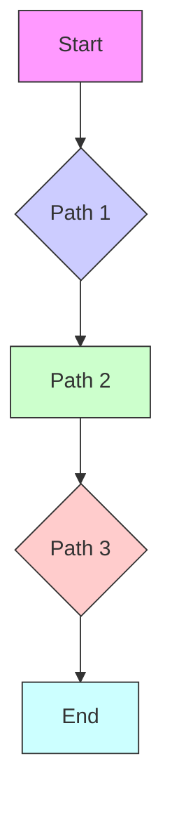
</details>

# Batch GD

-Slowest   
-Perfect gradient

# StochasticGD

-Fastest   
-Rough-estimategrad

# Mini-batch GD

-Compromise

# Backpropogation

Neuron is modeled by a unit connected by weighted links $w _ { i }$ to other units 끫뢬.


<details>
<summary>flowchart</summary>

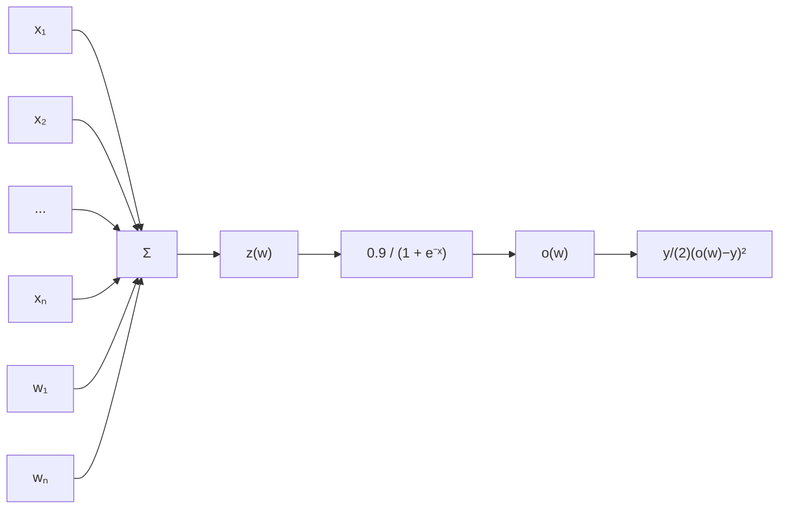
</details>

$$
L (w) = \frac {1}{2} (o (w) - y) ^ {2},
$$

$$
o (w) = \text {sigmoid} (z (w)),
$$

$$
z (w) = w _ {0} + \sum_ {i = 1} ^ {n} w _ {i} x _ {i}.
$$

$$
\frac {\partial L}{\partial w _ {i}} = \frac {d L}{d o (w)} \times \frac {d o (z (w))}{d z (w)} \times \frac {\partial z (w)}{\partial w _ {i}}
$$

$$
{\frac {d L}{d o (w)}} = {\frac {d}{d o (w)}} \left[ {\frac {1}{2}} (o (w) - y) ^ {2} \right] = o (w) - y
$$

$$
{\frac {d o (z (w))}{d z (w)}} = {\frac {d}{d z (w)}} \left[ {\frac {1}{1 + e ^ {- z (w)}}} \right] = {\frac {1}{1 + e ^ {- z (w)}}} \times (1 - {\frac {1}{1 + e ^ {- z (w)}}})
$$

$$
\frac {\partial z (w)}{\partial w _ {i}} = \frac {\partial}{\partial w _ {i}} \left[ w _ {0} + \sum_ {j = 1} ^ {n} w _ {j} x _ {j} \right] = x _ {i}
$$

Note: we denote $x _ { 0 } = 1$ .


<details>
<summary>tree</summary>

| Node | Weight    |
|------|-----------|
| w0   | 0.8622    |
| w1   | 0.5377    |
| x1   | -0.4336   |
| w2   | 0.3188    |
| x2   | 1.8339    |
| w3   | -1.3077   |
| x3   | -2.2588   |
| *    | 0.5846    |
| *    | 2.9539    |
| Σ    | 3.5684    |
| σ    | 0.9726    |
| L    | 0.4730    |
</details>


<details>
<summary>tree</summary>

| Node | Value   |
|------|---------|
| w0   | -0.4336 |
| w1   | 0.8622  |
| x1   | 0.5377  |
| w2   | 0.3188  |
| x2   | 1.8339  |
| w3   | -1.3077 |
| x3   | -2.2588 |
| *    | 0.0259  |
| *    | 0.5846  |
| σ    | 3.5684  |
| σ    | 0.0259  |
| L    | 0.9726  |
| L    | 0.9726  |
| y    | 0       |
| L    | 0.4730  |
</details>

$$
\frac {\partial z (w)}{\partial w _ {i}} = \frac {\partial}{\partial w _ {i}} \left[ w _ {0} + \sum_ {j = 1} ^ {n} w _ {j} x _ {j} \right] = x _ {i}
$$

# CNN

32x32x3 image   


<details>
<summary>text_image</summary>

32 height
32 width
3 depth
</details>


<details>
<summary>text_image</summary>

32x32x3 image
32 height
32
width
3
depth
Filters always extend the full
depth of the input volume
5x5x3 filter
Convolve the filter with the in
i.e. "slide over the image spa
computing dot products"
</details>

mage tially,


<details>
<summary>text_image</summary>

32x32x3 image
5x5x3 filter w
32
32
1 number:
the result of
filter and a s
(i.e. 5*5*3 =
</details>

#

f taking a dot product between the small 5x5x3 chunk of the image = 75-dimensional dot product + bias)

$$
\boldsymbol {w} ^ {T} \boldsymbol {x} + \boldsymbol {b}
$$


<details>
<summary>flowchart</summary>

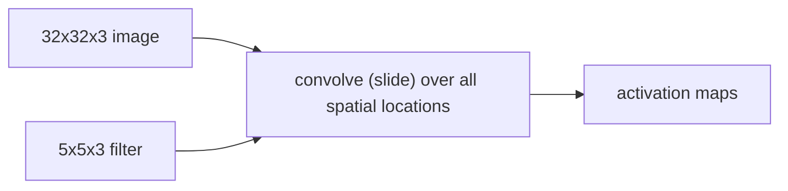
</details>


<details>
<summary>natural_image</summary>

3D geometric diagram showing two stacked blue squares with a teal top layer, connected by lines to form a triangular structure (no text or symbols)
</details>

Output

Filter

Input

Padding


<details>
<summary>text_image</summary>

32x32x3 image
2 5x5x3 filters
convolve (slide) over all spatial
locations
32
32
3
</details>

activation maps


<details>
<summary>natural_image</summary>

3D diagram of two stacked panels with red numbers 2 and 28 labeled on each panel (no text or symbols beyond labels)
</details>


<details>
<summary>text_image</summary>

3
32
32
</details>

  
1 number: Convolution Layers

activation maps   


<details>
<summary>text_image</summary>

28
28
6
</details>

Stack these up to get a new “image” of size 28x28x6!

N

<table><tr><td></td><td></td><td></td><td></td><td></td><td></td><td></td></tr><tr><td></td><td></td><td></td><td>F</td><td></td><td></td><td></td></tr><tr><td></td><td></td><td></td><td></td><td></td><td></td><td></td></tr><tr><td></td><td>F</td><td></td><td></td><td></td><td></td><td></td></tr><tr><td></td><td></td><td></td><td></td><td></td><td></td><td></td></tr><tr><td></td><td></td><td></td><td></td><td></td><td></td><td></td></tr><tr><td></td><td></td><td></td><td></td><td></td><td></td><td></td></tr></table>

Output size:

(N - F) / stride + 1

N

e.g. N = 7, F = 3:

stride 1 => (7 - 3)/1 + 1 = 5

stride 2 => (7 - 3)/2 + 1 = 3

stride 3 => (7 - 3)/3 + 1 = 2.33

Padding: Pad zeros on the boundary.

<table><tr><td>0</td><td>0</td><td>0</td><td>0</td><td>0</td><td>0</td><td>0</td><td>0</td><td>0</td></tr><tr><td>0</td><td></td><td></td><td></td><td></td><td></td><td></td><td></td><td>0</td></tr><tr><td>0</td><td></td><td></td><td></td><td></td><td></td><td></td><td></td><td>0</td></tr><tr><td>0</td><td></td><td></td><td></td><td></td><td></td><td></td><td></td><td>0</td></tr><tr><td>0</td><td></td><td></td><td></td><td></td><td></td><td></td><td></td><td>0</td></tr><tr><td>0</td><td></td><td></td><td></td><td></td><td></td><td></td><td></td><td>0</td></tr><tr><td>0</td><td></td><td></td><td></td><td></td><td></td><td></td><td></td><td>0</td></tr><tr><td>0</td><td></td><td></td><td></td><td></td><td></td><td></td><td></td><td>0</td></tr><tr><td>0</td><td></td><td></td><td></td><td></td><td></td><td></td><td></td><td>0</td></tr><tr><td>0</td><td>0</td><td>0</td><td>0</td><td>0</td><td>0</td><td>0</td><td>0</td><td>0</td></tr></table>

e.g. input 7x7

3x3 filter, applied with stride 1

pad with 1 pixel border => what is the output?

7 x 7 Output !

Recall:

(N - F) / stride + 1

# Padding: Pad zeros on the boundary.

<table><tr><td>0</td><td>0</td><td>0</td><td>0</td><td>0</td><td>0</td><td>0</td><td>0</td><td>0</td></tr><tr><td>0</td><td></td><td></td><td></td><td></td><td></td><td></td><td></td><td>0</td></tr><tr><td>0</td><td></td><td></td><td></td><td></td><td></td><td></td><td></td><td>0</td></tr><tr><td>0</td><td></td><td></td><td></td><td></td><td></td><td></td><td></td><td>0</td></tr><tr><td>0</td><td></td><td></td><td></td><td></td><td></td><td></td><td></td><td>0</td></tr><tr><td>0</td><td></td><td></td><td></td><td></td><td></td><td></td><td></td><td>0</td></tr><tr><td>0</td><td></td><td></td><td></td><td></td><td></td><td></td><td></td><td>0</td></tr><tr><td>0</td><td></td><td></td><td></td><td></td><td></td><td></td><td></td><td>0</td></tr><tr><td>0</td><td></td><td></td><td></td><td></td><td></td><td></td><td></td><td>0</td></tr><tr><td>0</td><td>0</td><td>0</td><td>0</td><td>0</td><td>0</td><td>0</td><td>0</td><td>0</td></tr></table>

In general, common to see CONV layers with stride 1, filters of size FxF, and zero-padding with (F-1)/2. (will preserve size spatially)

e.g. F = 3 => zero pad with 1

$$
F = 5 \Rightarrow \text { zero   pad   with } 2
$$

$$
F = 7 \Rightarrow \text { zero   pad   with } 3
$$

CNN is a sequence of Convolution Layers , interspersed with activation functions.32


CONV,

ReLU

e.g. 6 5x5x3

filters

CONV,

ReLU

e.g. 10 5x5x6

filters

CONV,

ReLU

# Pooling Layer is a down sampling strategy.

1. Construct better translationally invariant features.   
2. Learn more compact features.


<details>
<summary>flowchart</summary>

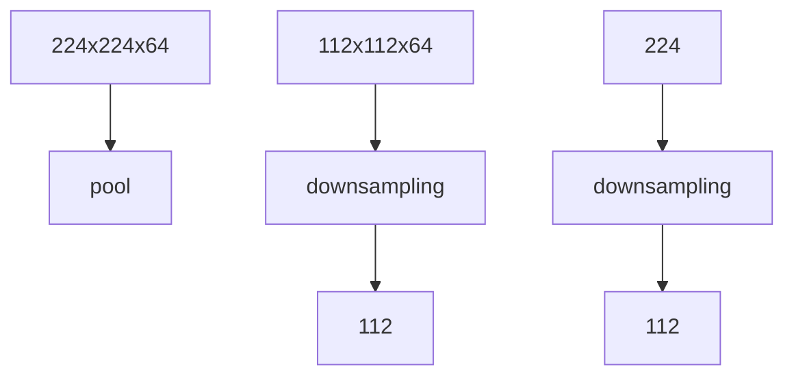
</details>

<table><tr><td>1</td><td>1</td><td>2</td><td>4</td></tr><tr><td>5</td><td>6</td><td>7</td><td>8</td></tr><tr><td>3</td><td>2</td><td>1</td><td>0</td></tr><tr><td>1</td><td>2</td><td>3</td><td>4</td></tr></table>

max pool with 2x2 filters and stride 2

<table><tr><td>6</td><td>8</td></tr><tr><td>3</td><td>4</td></tr></table>

Max Pooling Layer is robust to small perturbation.

<table><tr><td>1</td><td>1</td><td>2</td><td>4</td></tr><tr><td>5</td><td>6</td><td>7</td><td>8</td></tr><tr><td>3</td><td>2</td><td>1</td><td>0</td></tr><tr><td>1</td><td>2</td><td>3</td><td>4</td></tr></table>

average pool with 2x2 filters and stride 2

<table><tr><td>3.25</td><td>5.25</td></tr><tr><td>2</td><td>1.75</td></tr></table>

Given a D x M x N tensor, if we apply the pooling operator with size K x K and Stride P, what are the dimensions of the output?

$$
D \times ((M - K) / P + 1) \times ((N - K) / P + 1)
$$

For convolution with kernel size K, each element in the output depends on a K x K receptive field in the input.


<details>
<summary>natural_image</summary>

Simple geometric diagram with a square and a dashed-line box, no text or symbols present
</details>

Input

Output

Each successive convolution contains multiple regions from the previous one.


<details>
<summary>flowchart</summary>

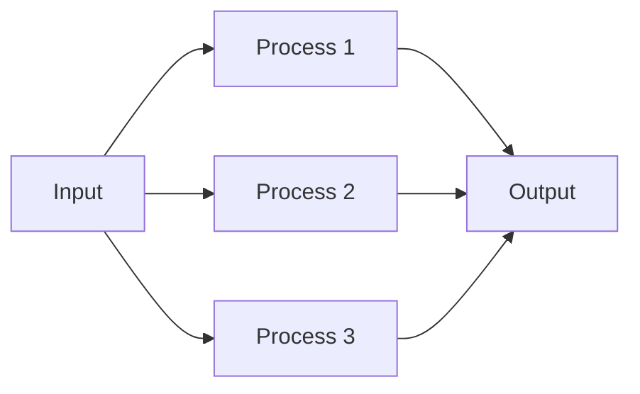
</details>

Suggested Reading: Computing receptive fields of convolutional neural network.

# Loss function for Classification


<details>
<summary>scatter</summary>

| x1 | x2 | Class |
|----|----|-------|
| 0.1 | 0.3 | Red Circle |
| 0.2 | 0.4 | Red Circle |
| 0.3 | 0.5 | Red Circle |
| 0.4 | 0.6 | Red Circle |
| 0.5 | 0.7 | Red Circle |
| 0.6 | 0.8 | Red Circle |
| 0.7 | 0.9 | Red Circle |
| 0.8 | 1.0 | Red Circle |
| 0.9 | 1.1 | Red Circle |
| 1.0 | 1.2 | Red Circle |
| 0.1 | 0.2 | Green Plus |
| 0.2 | 0.3 | Green Plus |
| 0.3 | 0.4 | Green Plus |
| 0.4 | 0.5 | Green Plus |
| 0.5 | 0.6 | Green Plus |
| 0.6 | 0.7 | Green Plus |
| 0.7 | 0.8 | Green Plus |
| 0.8 | 0.9 | Green Plus |
| 0.9 | 1.0 | Green Plus |
| 1.0 | 1.1 | Green Plus |
| 1.1 | 1.2 | Green Plus |
| 1.2 | 1.3 | Green Plus |
| 1.3 | 1.4 | Green Plus |
| 1.4 | 1.5 | Green Plus |
| 1.5 | 1.6 | Green Plus |
| 1.6 | 1.7 | Green Plus |
| 1.7 | 1.8 | Green Plus |
| 1.8 | 1.9 | Green Plus |
| 1.9 | 2.0 | Green Plus |
| 2.0 | 2.1 | Green Plus |
| 2.1 | 2.2 | Green Plus |
| 2.2 | 2.3 | Green Plus |
| 2.3 | 2.4 | Green Plus |
| 2.4 | 2.5 | Green Plus |
| 2.5 | 2.6 | Green Plus |
| 2.6 | 2.7 | Green Plus |
| 2.7 | 2.8 | Green Plus |
| 2.8 | 2.9 | Green Plus |
| 2.9 | 3.0 | Green Plus |
| 3.0 | 3.1 | Green Plus |
| 3.1 | 3.2 | Green Plus |
| 3.2 | 3.3 | Green Plus |
| 3.3 | 3.4 | Green Plus |
| 3.4 | 3.5 | Green Plus |
| 3.5 | 3.6 | Green Plus |
| 3.6 | 3.7 | Green Plus |
| 3.7 | 3.8 | Green Plus |
| 3.8 | 3.9 | Green Plus |
| 3.9 | 4.0 | Green Plus |
| 4.0 | 4.1 | Green Plus |
| 4.1 | 4.2 | Green Plus |
| 4.2 | 4.3 | Green Plus |
| 4.3 | 4.4 | Green Plus |
| 4.4 | 4.5 | Green Plus |
| 4.5 | 4.6 | Green Plus |
| 4.6 | 4.7 | Green Plus |
| 4.7 | 4.8 | Green Plus |
| 4.8 | 4.9 | Green Plus |
| 4.9 | 5.0 | Green Plus |
| 5.0 | 5.1 | Green Plus |
| 5.1 | 5.2 | Green Plus |
| 5.2 | 5.3 | Green Plus |
| 5.3 | 5.4 | Green Plus |
| 5.4 | 5.5 | Green Plus |
| 5.5 | 5.6 | Green Plus |
| 5.6 | 5.7 | Green Plus |
| 5.7 | 5.8 | Green Plus |
| 5.8 | 5.9 | Green Plus |
| 5.9 | 6.0 | Green Plus |
| 6.0 | 6.1 | Green Plus |
| 6.1 | 6.2 | Green Plus |
| 6.2 | 6.3 | Green Plus |
| 6.3 | 6.4 | Green Plus |
| 6.4 | 6.5 | Green Plus |
| 6.5 | 6.6 | Green Plus |
| 6.6 | 6.7 | Green Plus |
| 6.7 | 6.8 | Green Plus |
| 6.8 | 6.9 | Green Plus |
| 6.9 | 7.0 | Green Plus |
| 7.0 | 7.1 | Green Plus |
| 7.1 | 7.2 | Green Plus |
| 7.2 | 7.3 | Green Plus |
| 7.3 | 7.4 | Green Plus |
| 7.4 | 7.5 | Green Plus |
| 7.5 | 7.6 | Green Plus |
| 7.6 | 7.7 | Green Plus |
| 7.7 | 7.8 | Green Plus |
| 7.8 | 7.9 | Green Plus |
| 7.9 | 8.0 | Green Plus |
| -    | -   | New Data Point (Blue Star) |
The chart includes a dashed reference line from the New Data Point to the right.
</details>

Data $( X _ { i } , Y _ { i } ) , i = 1 , \dots , n$ i.i.d drawn from a distribution 끫롐 $( X , Y )$ where ${ \cal Y } _ { i } \in \{ { \bf 1 } , - { \bf 1 } \}$ .   
To find a function $h ( \cdot )$ to maximize

$$
\mathbb {P} (\boldsymbol {h} (X _ {0}) = Y _ {0})
$$

or equivalently to minimize

$$
\mathbb {P} (\boldsymbol {h} (X _ {0}) \neq Y _ {0})
$$

over

$$
\mathcal {H} = \{\boldsymbol {h}: \boldsymbol {h} (\cdot) \in \{\mathbf {1}, - \mathbf {1} \} \}
$$

Empirical risk minimization:

to find a function $( \cdot )$ to minimize

$$
\frac {1}{n} \sum_ {i = 1} ^ {n} I (\boldsymbol {h} (X _ {i}) \neq Y _ {i})
$$

over

$$
\mathcal {H} = \{\boldsymbol {h}: \boldsymbol {h} (\cdot) \in \{\mathbf {1}, - \mathbf {1} \} \}
$$

# Empirical risk minimization: to find a function ⋅ to minimize

$$
\frac {1}{n} \sum_ {i = 1} ^ {n} I (\boldsymbol {h} (X _ {i}) \neq Y _ {i})
$$

over

$$
\mathcal {H} = \{\boldsymbol {h} \colon \boldsymbol {h} (\cdot) \in \{\mathbf {1}, - \mathbf {1} \} \}.
$$

• 0-1 Loss function 끫룠(⋅): non-continuous, non-smooth   
Classifier (⋅): not regular smooth function   
The optimization problem is extremely hard !

# Empirical risk minimization: to find a function 끫뤎 ⋅ to minimize

$$
\frac {1}{n} \sum_ {i = 1} ^ {n} L (f (X _ {i}, \theta), Y _ {i})
$$

over

$$
\mathcal {F} = \{f: f (x; \theta) \text {is a neural network}
$$

끫뤢 끫뤢 끫뤢 끫뤢 끫뤆끫뤆 $\pmb \theta \in \mathbb { R } ^ { s }$ 끫뤮 }.

# We expect

Surrogate Loss function $\pmb { L } ( \cdot , \cdot )$ : continuous, smooth   
• Neural network $f ( \cdot ; \mathbf { \lambda } )$ : output continuous value   
• The estimation easy to implement and explain

Empirical risk minimization: to find a function 끫뤎 ⋅ to minimize

$$
\frac {1}{n} \sum_ {i = 1} ^ {n} L (f (X _ {i}, \theta), Y _ {i})
$$

over

$$
\mathcal {F} = \{f: f (x; \theta) i s a n e u r a l n e t w o r k
$$

끫뤢 끫뤢 끫뤢 끫뤢 끫뤆끫뤆 $\mathbf { \xi } \in \mathbb { R } ^ { s }$ 끫뤮 }.

Idea: use threshold value to create a classifier

$$
\boldsymbol {h} (\boldsymbol {X} _ {i}, \theta) = \operatorname{sgn} \{\boldsymbol {f} (\boldsymbol {X} _ {i}, \theta) \}
$$

If $f ( x _ { 0 } ; \theta ) > { \bf 0 }$ , then predict $\widehat { y } _ { 0 } = + 1$ ;

${ \sf I f } f ( x _ { 0 } ; \theta ) < { \bf 0 }$ , then predict $\widehat { y } _ { 0 } = - 1$ .

Empirical risk minimization: to find a function 끫뤎 ⋅ to minimize

$$
\frac {1}{n} \sum_ {i = 1} ^ {n} \phi (\textbf {\textit {f}} (X _ {i}, \theta) \times Y _ {i})
$$

where $\phi ( \cdot )$ in general is continuous and decreasing.

끫뺦( $\phi ( \cdot )$ is the surrogate loss function.

Idea:

If label $Y _ { i } = + 1$ , then larger positive $f ( X _ { i } ; \theta ) > 0$ decreases the loss, and it predicts $\widehat { Y } _ { i } = + 1$ .

If label $Y _ { i } = - 1$ , then smaller negative $f ( X _ { i } ; \theta ) < \mathbf { 0 }$ decreases the loss. and it predicts $\widehat { Y } _ { i } = - 1$ .


<details>
<summary>line</summary>

| x    | Hinge | Logistic | Exponential | Zero-One |
| ---- | ----- | -------- | ----------- | -------- |
| -3   | 4.0   | 3.0      | 5.0         | 1.0      |
| 0    | 1.0   | 0.7      | 1.0         | 1.0      |
| 1    | 0.0   | 0.3      | 0.3         | 0.0      |
| 3    | 0.0   | 0.0      | 0.0         | 0.0      |
</details>

0-1 loss:

$$
\boldsymbol {\phi} (\mathbf {y} \cdot \boldsymbol {f} (x, \boldsymbol {\theta})) = \boldsymbol {I} (\mathbf {y} \cdot \boldsymbol {f} (x, \boldsymbol {\theta}) <   \mathbf {0})
$$

Exponential loss (AdaBoost):

$$
\phi (\mathbf {y} \cdot \mathbf {f} (x, \theta)) = e x p (- \mathbf {y} \cdot \mathbf {f} (x, \theta))
$$

Logistic loss :

$$
\boldsymbol {\phi} (\mathbf {y} \cdot \boldsymbol {f} (x, \theta)) = \log \left\{\mathbf {1} + e x p [ - \mathbf {y} \cdot \boldsymbol {f} (x, \theta) ] \right\}
$$

Hinge loss (SVM):

$$
\phi (\mathbf {y} \cdot \mathbf {f} (x, \theta)) = m a x \{\mathbf {1} - \mathbf {y} \cdot \mathbf {f} (x, \theta), \mathbf {0} \}
$$

• Given a surrogate loss $\phi ,$ let $\begin{array} { r } { \hat { \boldsymbol { f } } _ { n } = \boldsymbol { a r g m i n } \frac { 1 } { n } \sum _ { i = 1 } ^ { n } \phi ( f ( \boldsymbol { X } _ { i } , \boldsymbol { \theta } ) \times \boldsymbol { Y } _ { i } ) } \end{array}$ 끫뾞   
• Let $\widehat { h } _ { n } = s g n ( \widehat { f } _ { n } )$ be a classifier based on $\hat { \ b { f } } _ { n }$   
• Then $\cdot$ is a good classifier in the sense that when sample size n is very large,

$$
\widehat {\boldsymbol {h}} _ {n} \approx a r g m i n \frac {1}{n} \sum_ {i = 1} ^ {n} I (\boldsymbol {h} (X _ {i}) \neq Y _ {i})
$$

Proper surrogate loss function will lead to a consistent classifier.

Suggested Reference:

Bartlett, P. L., Jordan, M. I., & McAuliffe, J. D. (2006). Convexity, classification, and risk bounds. Journal of the American Statistical Association, 101(473), 138-156.

# How to use Deep Neural Networks

# to do

# Multi-class classification?

# Adjust the output of neural network

Binary classification example:

$$
X _ {i} \text {is an image}, \quad Y _ {i} \in \{0, 1 \} ^ {2} \subset \mathbb {R} ^ {2}
$$

$$
\text { Cat: } Y _ {i} = (0, 1) \text { Dog: } Y _ {i} = (1, 0)
$$

• Let $\mathbb { R } ^ { d } \to \mathbb { R } ^ { 2 } , \mathsf { i . e . } \quad ( \pmb { x } , \mathsf { \Omega } ) = ( \mathbf { z } _ { 1 } , \mathbf { z } _ { 2 } )$ .   
• We hope $( X _ { i } , \mathbf { \lambda } ) = ( \mathbf { \lambda } _ { \mathbf { 1 } } , \mathbf { \lambda } _ { \mathbf { Z } _ { 2 } } ) = ( \mathbf { 1 } , \mathbf { 0 } ) \mathfrak { i f } \ : Y _ { i } = ( 1 , 0 )$ ,   
• We hope use $\mathbf { z } _ { 1 } , \mathbf { z } _ { 2 } \in [ \mathbf { 0 } , \mathbf { 1 } ]$ to model class probabilities.

$$
\text { and } \boldsymbol {h} (\boldsymbol {X} _ {i}, \boldsymbol {\theta}) = (\mathbf {z} _ {1}, \mathbf {z} _ {2}) = (\mathbf {0}, \mathbf {1}) \text { if } Y _ {i} = (0, 1).
$$

# Adjust the output of neural network

Binary classification example:

• Let $h \colon  { \mathbb { R } } ^ { d } \to  { \mathbb { R } } ^ { 2 }$ , i.e. $h ( x , \theta ) = ( z _ { 1 } , z _ { 2 } )$ . Note $\cdot$ .   
Use an additional SoftMax layer to :

$$
\operatorname{SoftMax} \left(h (x, \theta)\right)
$$

$$
= \operatorname{SoftMax} \left(\left(z _ {1}, z _ {2}\right)\right) = \left(\widehat {y _ {1}}, \widehat {y _ {2}}\right)
$$

$$
= \binom{\frac {e x p (z _ {1})}{\sum_ {i = 1} ^ {2} e x p (z _ {i})}}{\frac {e x p (z _ {2})}{\sum_ {i = 1} ^ {2} e x p (z _ {i})}}
$$

$\_$ can be the class probabilities.

# Adjust the output of neural network

Binary classification example:


<details>
<summary>flowchart</summary>

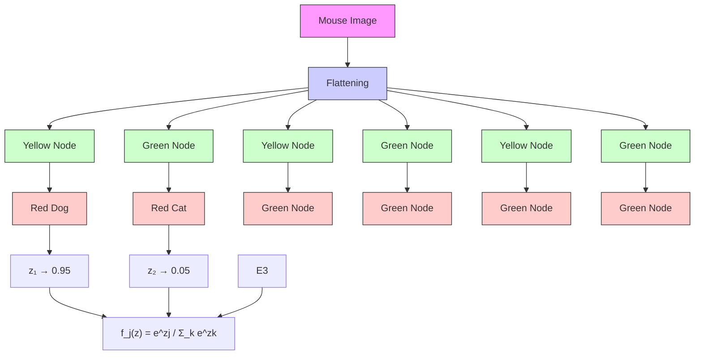
</details>

Source: https://www.andreaperlato.com/aipost/cnn-and-softmax/

$$
\operatorname{SoftMax} \left(h (x, \theta)\right) = \left(\widehat {y _ {1}}, \widehat {y _ {2}}\right). \text {Note} \widehat {y _ {1}}, \widehat {y _ {2}} \in [ 0, 1 ] \text {and} \widehat {y _ {1}} + \widehat {y _ {2}} = 1.
$$

$$
\text { Model } \mathbb {P} (Y _ {i} = (\mathbf {1}, \mathbf {0}) \mid X _ {i} = x) \text { by } \widehat {y _ {1}}. \text { Model } \mathbb {P} (Y _ {i} = (\mathbf {0}, \mathbf {1}) \mid X _ {i} = x) \text { by } \widehat {y _ {2}}.
$$

# What is the Objective?

Binary classification example:

# Model

$$
\operatorname{SoftMax} \bigl (h (x, \theta) \bigr) = (\widehat {y _ {1}}, \widehat {y _ {2}}). \text {Note} \widehat {y _ {1}}, \widehat {y _ {2}} \in [ 0, 1 ] \text {and} \widehat {y _ {1}} + \widehat {y _ {2}} = 1.
$$

$$
\operatorname{SoftMax} \left(h (x, \theta)\right) _ {1} = \widehat {y _ {1}} \text {is the predicted value for} \mathbb {P} \left(Y _ {i} = (1, 0) \mid X _ {i} = x\right).
$$

$$
\operatorname{SoftMax} \left(h (x, \theta)\right) _ {2} = \widehat {y _ {2}} \text {is the predicted value for} \mathbb {P} \left(Y _ {i} = (0, 1) \mid X _ {i} = x\right).
$$

# Data

$$
\begin{array}{l} Y _ {i} = (Y _ {i 1}, Y _ {i 2}) \\ Y _ {i 1} = 1 \text { implies } Y _ {i} = (1, 0) \text { and   the   picture   is   a   dog. } \\ Y _ {i 2} = 1 \quad \text { implies } Y _ {i} = (0, 1) \text { and   the   picture   is   a   cat. } \\ \end{array}
$$

# What is the Objective?

Binary classification example:

# The Likelihood function

$$
[ \mathbb {P} (\textbf {Y} _ {i} = (\textbf {1}, \textbf {0}) \mid X _ {i} = x) ] ^ {I (Y _ {i} = (\textbf {1}, \textbf {0}))} \times [ \mathbb {P} (\textbf {Y} _ {i} = (\textbf {0}, \textbf {1}) \mid X _ {i} = x) ] ^ {I (Y _ {i} = (\textbf {0}, \textbf {1}))}
$$

$$
\left[ S o f t M a x \big (h (x, \theta) \big) _ {1} \right] ^ {I (Y _ {i} = (\mathbf {1}, \mathbf {0}))} \times \left[ S o f t M a x \big (h (x, \theta) \big) _ {2} \right] ^ {I (Y _ {i} = (\mathbf {0}, \mathbf {1}))}
$$

$$
= [ \widehat {\pmb {y}} _ {1} ] ^ {I (Y _ {i 1} = 1)} \times [ \widehat {\pmb {y}} _ {2} ] ^ {I (Y _ {i 2} = 1)}
$$

$$
= [ \widehat {\mathbf {y}} _ {1} ] ^ {Y _ {i 1}} \times [ \widehat {\mathbf {y}} _ {2} ] ^ {Y _ {i 2}}
$$

The log Likelihood function

$$
Y _ {i 1} \times l o g [ \widehat {y} _ {1} ] + Y _ {i 2} \times l o g [ \widehat {y} _ {2} ]
$$

# What is the Objective?

Binary classification example:

Maximize the log Likelihood function

$$
m a x Y _ {i 1} \times l o g [ \widehat {y} _ {1} ] + Y _ {i 2} \times l o g [ \widehat {y} _ {2} ]
$$

Minimize the negative log Likelihood function

$$
\min - Y _ {i 1} \times l o g [ \widehat {y} _ {1} ] - Y _ {i 2} \times l o g [ \widehat {y} _ {2} ]
$$

$$
\min - \sum_ {j = 1} ^ {m} Y _ {i j} \times l o g \widehat {y} _ {j}
$$

# Loss function for classification

Cross Entropy loss function :

$$
\mathrm{Loss} = - \sum_ {i = 1} ^ {\mathrm{outputsize}} y _ {i} \cdot \log \hat {y} _ {i}
$$

For binary classification, output size=2

• Label $-$   
• Prediction $-$

# Empirical risk minimization: to find a function ⋅ to minimize

$$
\frac {1}{n} \sum_ {i = 1} ^ {n} C E L o s s (h (X _ {i}, \theta), Y _ {i})
$$

over

$$
\begin{array}{r} \mathcal {H} = \{\boldsymbol {h} \colon \boldsymbol {h} (x; \theta) \text {is a neural network} \\ \text {parameterized by} \theta \in \mathbb {R} ^ {s} \}, \end{array}
$$

where

$$
C E L o s s (\boldsymbol {h} (X _ {i}, \boldsymbol {\theta}), Y _ {i}) = \frac {1}{n} \sum_ {i = 1} ^ {n} \left[ - \sum_ {j = 1} ^ {m} Y _ {i j} \cdot l o g \left\{\frac {e x p (\boldsymbol {h} (X _ {i} , \boldsymbol {\theta}) _ {j})}{\sum_ {j = 1} ^ {m} e x p (\boldsymbol {h} (X _ {i} , \boldsymbol {\theta}) _ {j})} \right\} \right]
$$

is the output size of or the number of classes (categories).

# Apply to multi-class problem

Cross Entropy loss function :

$$
\mathrm{Loss} = - \sum_ {i = 1} ^ {\mathrm{outputsize}} y _ {i} \cdot \log \hat {y} _ {i}
$$

Output size is the number of classes (categories)

in this classification task.

# CNN architectures

LeCun, Y., Bottou, L., Bengio, Y., & Haffner, P. (1998). Gradient-based learning applied to document recognition. Proceedings of the IEEE, 86(11), 2278-2324.


<details>
<summary>bar</summary>

| Layer | Feature Maps | Convolutional Segments | Subsampling Segments |
|-------|--------------|------------------------|----------------------|
| C1    | feature maps  | 6@28x28                | -                    |
| C3    | f. maps      | 16@10x10               | -                    |
| S2    | f. maps      | 6@14x14                | -                    |
| S4    | f. maps      | 16@5x5                 | -                    |
| C5    | layer        | 120                    | -                    |
| F6    | layer        | 84                     | -                    |
| OUTPUT | -            | -                      | 10                   |
</details>

Krizhevsky, A., Sutskever, I., & Hinton, G. E. (2012). Imagenet classification with deep convolutional neural networks. NIPS.


<details>
<summary>flowchart</summary>

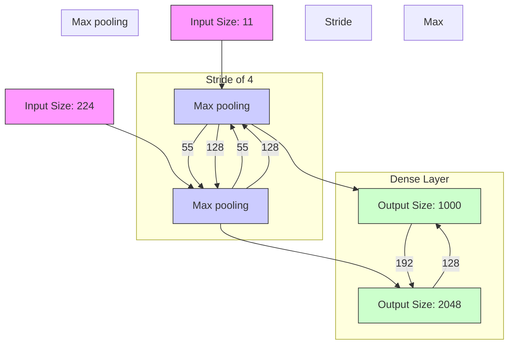
</details>


<details>
<summary>flowchart</summary>

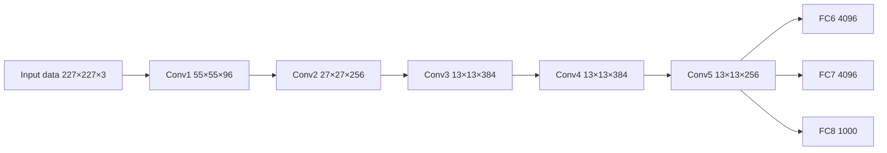
</details>


CNNs that use ReLU achieved a 25% error rate on CIFAR-10 is six times faster than those that used Tanh.

Simonyan, K., & Zisserman, A. (2014). Very deep convolutional networks for large-scale image recognition. ICLR 2015.

VGG-16   


<details>
<summary>flowchart</summary>

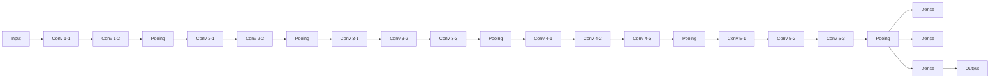
</details>

The Architecture

The architecture depicted below is VGG16.   


<details>
<summary>bar</summary>

| Layer Description         | Value     |
| ------------------------- | --------- |
| 224 × 224 × 3             | 224 × 224 × 64 |
| 112 × 112 × 128          | 112 × 112 × 128 |
| 56 × 56 × 256            | 56 × 56 × 256 |
| 28 × 28 × 512            | 28 × 28 × 512 |
| 14 × 14 × 512            | 14 × 14 × 512 |
| 7 × 7 × 512              | 7 × 7 × 512 |
| 1 × 1 × 4096             | 1 × 1 × 4096 |
| 1 × 1 × 1000             | 1 × 1 × 1000 |
</details>


<details>
<summary>line</summary>

| iter. (1e4) | 20-layer | 56-layer |
| ----------- | -------- | -------- |
| 0           | 20       | 20       |
| 1           | ~15      | ~18      |
| 2           | ~10      | ~19      |
| 3           | ~8       | ~18      |
| 4           | ~5       | ~10      |
| 5           | ~3       | ~7       |
| 6           | ~2       | ~6       |
</details>


<details>
<summary>line</summary>

| iter. (1e4) | 56-layer | 20-layer |
| ----------- | -------- | -------- |
| 0           | 20       | 20       |
| 1           | ~18      | ~17      |
| 2           | ~17      | ~15      |
| 3           | ~16      | ~12      |
| 4           | ~14      | ~10      |
| 5           | ~13      | ~10      |
| 6           | ~13      | ~10      |
</details>

Deep model may be difficult to optimize.

Intuitive sense: Deep model should be at least as good as shallow ones?

He, K., Zhang, X., Ren, S., & Sun, J. (2016). Deep residual learning for image recognition. CVPR.


<details>
<summary>flowchart</summary>


</details>

Key numbers: 152 layers for ImageNet.

3.57% Top 5 Error!!!

A Key Motivation: It is not easy to learn an identity mapping f(x) = x.


<details>
<summary>flowchart</summary>

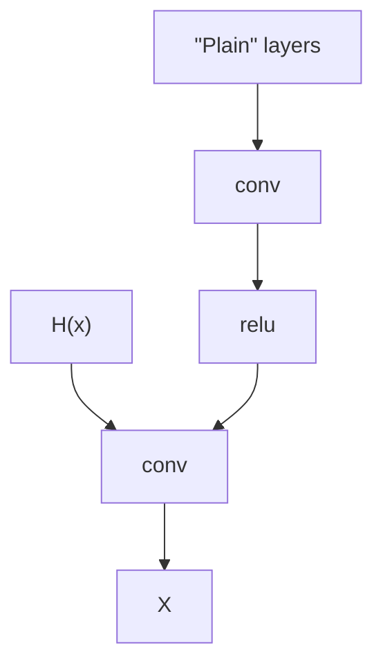
</details>


<details>
<summary>flowchart</summary>

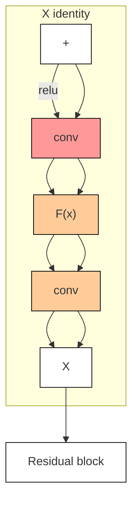
</details>

An identity mapping can now be obtained if F = 0.

Huang, G., Liu, Z., Van Der Maaten, L., & Weinberger, K. Q. (2017). Densely connected convolutional networks. CVPR


<details>
<summary>flowchart</summary>

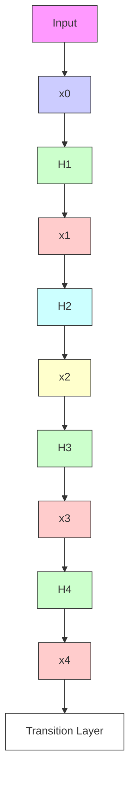
</details>

Szegedy, C., Liu, W., Jia, Y., Sermanet, P., Reed, S., Anguelov, D., ... & Rabinovich, A. (2015). Going deeper with convolutions. CVPR


<details>
<summary>flowchart</summary>

```mermaid
graph TD
    A["Input"] --> B["13+1/320 CSA"]
    B --> C["13+1/321 MPAQ"]
    C --> D["TCMgMgMgMn"]
    D --> E["TCMgMgMgMn"]
    E --> F["TCMgMgMgMn"]
    F --> G["TCMgMgMgMn"]
    G --> H["TCMgMgMgMn"]
    H --> I["TCMgMgMgMn"]
    I --> J["TCMgMgMgMn"]
    J --> K["TCMgMgMgMn"]
    K --> L["TCMgMgMgMn"]
    L --> M["TCMgMgMgMn"]
    M --> N["TCMgMgMgMn"]
    N --> O["TCMgMgMgMn"]
    O --> P["TCMgMgMgMn"]
    P --> Q["TCMgMgMgMn"]
    Q --> R["TCMgMgMgMn"]
    R --> S["TCMgMgMgMn"]
    S --> T["TCMgMgMgMn"]
    T --> U["TCMgMgMgMn"]
    U --> V["TCMgMgMgMn"]
    V --> W["TCMgMgMgMn"]
    W --> X["TCMgMgMgMn"]
    X --> Y["TCMgMgMgMn"]
    Y --> Z["TCMgMgMgMn"]
    Z --> AA["TCMgMgMgMn"]
    AA --> AB["TCMgMgMgMn"]
    AB --> AC["TCMgMgMgMn"]
    AC --> AD["TCMgMgMgMn"]
    AD --> AE["TCMgMgMgMn"]
    AE --> AF["TCMgMgMgMn"]
    AF --> AG["TCMgMgMgMn"]
    AG --> AH["TCMgMgMgMn"]
    AH --> AI["TCMgMgMgMn"]
    AI --> AJ["TCMgMgMgMn"]
    AJ --> AK["TCMgMgMgMn"]
    AK --> AL["TCMgMgMgMn"]
    AL --> AM["TCMgMgMgMn"]
    AM --> AN["TCMgMgMgMn"]
    AN --> AO["TCMgMgMgMn"]
    AO --> AP["TCMgMgMgMn"]
    AP --> AQ["TCMgMgMgMn"]
    AQ --> AR["TCMgMgMgMn"]
    AR --> AS["TCMgMgMgMn"]
    AS --> AT["TCMgMgMgMn"]
    AT --> AU["TCMgMgMgMn"]
    AU --> AV["TCMgMgMgMn"]
    AV --> AW["TCMgMgMgMn"]
    AW --> AX["TCMgMgMgMn"]
    AX --> AY["TCMgMgMgMn"]
    AY --> AZ["TCMgMgMgMn"]
    AZ --> BA["TCMgMgMgMn"]
    BA --> BB["TCMgMgMgMn"]
    BB --> BC["TCMgMgMgMn"]
    BC --> BD["TCMgMgMgMn"]
    BD --> BE["TCMgMgMgN"]
    BE --> BF["TCMSO"]
    BF --> BG["TLC"]
    BG --> BH["LIC"]
    BH --> BI["LIC"]
    BI --> BJ["LIC"]
    BJ --> BK["LIC"]
    BK --> BL["LIC"]
    BL --> BM["LIC"]
    BM --> BN["LIC"]
    BN --> BO["LIC"]
    BO --> BP["LIC"]
    BP --> BQ["LIC"]
    BQ --> BR["LIC"]
    BR --> BS["LIC"]
    BS --> BT["LIC"]
    BT --> BU["LIC"]
    BU --> BV["LIC"]
    BV --> BW["LIC"]
```
</details>


<details>
<summary>flowchart</summary>

```mermaid
graph TD
    A["Filter concatenation"] --> B["3×3 convolutions"]
    A --> C["5×5 convolutions"]
    A --> D["1×1 convolutions"]
    B --> E["1×1 convolutions"]
    C --> F["1×1 convolutions"]
    D --> G["3×3 max pooling"]
    E --> H["Pervious layer"]
    F --> H
    G --> H
```
</details>

Key component.

# Initialization, Normalization, Regularization

# And

# Data augmentation

Key Motivation: Keep a same variance for the input and the output.

Consider a 10-layer DNN with tanh activation function. If we initialize all the weights with normal distribution N(0, 1)/sqrt(n\_in).


Consider $y = w _ { 1 } x _ { 1 } + w _ { 2 } x _ { 2 } + \cdots + w _ { n } x _ { n } , x _ { \mathrm { i } }$ are i.i.d. with zero mean, $w _ { i }$ are i.i.d with zero mean.

Target: Compute $\cdot$ .

$\mathsf { L e m m a } _ { \equiv } V a r [ w _ { i } x _ { i } ] = ( E [ w _ { i } ] ) ^ { 2 } V a r [ x _ { i } ] + ( E [ x _ { i } ] ) ^ { 2 } V a r [ w _ { i } ] + V a r [ w _ { i } ] V a r [ x _ { i } ] .$

Thus, $V a r [ w _ { i } x _ { i } ] = V a r [ w _ { i } ] V a r [ x _ { i } ]$ and

$$
V a r [ y ] = V a r [ w _ {1} x _ {1} + w _ {2} x _ {2} + \dots + w _ {n} x _ {n} ] = \sum_ {i = 1} ^ {n} V a r [ w _ {i} x _ {i} ] = n V a r [ w _ {i} ] V a r [ x _ {i} ]
$$

Thus,

$$
V a r [ w _ {i} ] = 1 / n
$$

Key Motivation: Assume that only a half of the neurons are activated in each layer.

He’s Xavier initialization: N(0, 1)/sqrt(n\_in/2).


<details>
<summary>flowchart</summary>

```mermaid
graph LR
    subgraph Input Layer
        n["n"] --> Conv1
        Conv1 --> Conv2
        Conv1 --> Conv3
        Conv1 --> Conv4
        Conv1 --> Conv5
    end

    subgraph Convolutional Layer
        b["b"] --> Conv1
        b --> Conv2
        b --> Conv3
        b --> Conv4
        b --> Conv5
    end

    Conv1 --> BN["BN"]
    Conv2 --> BN
    Conv3 --> BN
    Conv4 --> BN
    Conv5 --> BN

    BN --> b["b"]
    BN --> 3["3"]
    BN --> 3b["3"]
    style n fill:#f9f,stroke:#333
    style b fill:#ccf,stroke:#333
    style 3 fill:#cfc,stroke:#333
```
</details>

Input data batch : $x ^ { 1 } , \dots , x ^ { N } \in R ^ { d }$


<details>
<summary>text_image</summary>

x¹ x² ... xᴺ
</details>

$$
\pmb {\mu} _ {j} = \frac {1}{N} \sum_ {i = 1} ^ {N} x _ {j} ^ {i}
$$

$$
\pmb {\sigma} _ {j} ^ {2} = \frac {1}{N} \sum_ {i = 1} ^ {N} \left(x _ {j} ^ {i} - \mu_ {j}\right) ^ {2}
$$

$$
\widehat {x} _ {j} ^ {i} = \frac {x _ {j} ^ {i} - \mu_ {j}}{\sqrt {\sigma_ {j} ^ {2} + \varepsilon}}
$$

Input data batch : $x ^ { 1 } , \ldots , x ^ { N } \in R ^ { d }$ , Learnable scale $\cdot$ and $\beta$

$$
\pmb {\mu} _ {j} = \frac {1}{N} \sum_ {i = 1} ^ {N} x _ {j} ^ {i}
$$

$$
\pmb {\sigma} _ {j} ^ {2} = \frac {1}{N} \sum_ {i = 1} ^ {N} \left(x _ {j} ^ {i} - \mu_ {j}\right) ^ {2}
$$

$$
\widehat {x} _ {j} ^ {i} = \frac {x _ {j} ^ {i} - \mu_ {j}}{\sqrt {\sigma_ {j} ^ {2} + \varepsilon}}
$$

$$
y _ {j} ^ {i} = \gamma_ {j} \widehat {x} _ {j} ^ {i} + \beta_ {j}
$$


<details>
<summary>flowchart</summary>

```mermaid
graph TD
    A["Input Layer"] --> B["Hidden Layer"]
    B --> C["Output Layer"]
    style A fill:#f9f,stroke:#333
    style B fill:#bbf,stroke:#333
    style C fill:#f96,stroke:#333
```
</details>


<details>
<summary>flowchart</summary>

```mermaid
graph TD
    A["Input Node"] --> B["Hidden Node 1"]
    A --> C["Hidden Node 2"]
    A --> D["Hidden Node 3"]
    B --> E["X̄"]
    C --> F["X̄"]
    D --> G["X̄"]
    E --> H["Output Node"]
    F --> H
    G --> H
    H --> I["X̄"]
    H --> J["X̄"]
    I --> K["Output Node"]
    J --> K
    style A fill:#cce5ff,stroke:#333
    style B fill:#cce5ff,stroke:#333
    style C fill:#cce5ff,stroke:#333
    style D fill:#cce5ff,stroke:#333
    style E fill:#cce5ff,stroke:#333
    style F fill:#cce5ff,stroke:#333
    style G fill:#cce5ff,stroke:#333
    style H fill:#cce5ff,stroke:#333
    style I fill:#cce5ff,stroke:#333
    style J fill:#cce5ff,stroke:#333
```
</details>

A dropout layer randomly sets input elements to zero with a given probability.

AlexNet uses dropout layers with a probability 0.5.


000

Resize&Crop

9255

255

Random Crops

2


<details>
<summary>natural_image</summary>

Close-up of a tabby cat with green eyes and white whiskers, looking upward (no text or symbols visible)
</details>

Mirror Image


<details>
<summary>natural_image</summary>

Close-up of a tabby cat with green eyes and white whiskers, looking upward (no text or symbols visible)
</details>


<details>
<summary>natural_image</summary>

Close-up of a tabby cat with green eyes and striped stripes, looking upward (no text or symbols visible)
</details>


<details>
<summary>natural_image</summary>

Close-up of a tabby cat with green eyes and white whiskers, looking upward (no text or symbols visible)
</details>

Rotation   


<details>
<summary>natural_image</summary>

Close-up of a tabby cat with green eyes and striped fur, looking upward (no text or symbols visible)
</details>

# Generative Models

GAN: minimax the classification error loss.


VAE:maximize ELBO.

Flow-based generative models: minimize the negative log-likelihood

Source:https://lilianweng.github.io/posts/2018-10-13-flow-models/

Source: https://towardsdatascience.com/understanding-variational-autoencoders-vaes-f70510919f73


<details>
<summary>flowchart</summary>

```mermaid
graph LR
    A["x"] --> B["neural network encoder"]
    B --> C["z = e(x)"]
    C --> D["neural network decoder"]
    D --> E["x̂ = d(z)"]
```
</details>

$$
\text { loss } = \left| \left| \mathbf {x} - \hat {\mathbf {x}} \right| \right| ^ {2} = \left| \left| \mathbf {x} - \mathbf {d} (\mathbf {z}) \right| \right| ^ {2} = \left| \left| \mathbf {x} - \mathbf {d} (\mathbf {e} (\mathbf {x})) \right| \right| ^ {2}
$$

Illustration of an autoencoder with its loss function.

# Instead of encoding an input as a single point, VAE encode it as a distribution over the latent space.


<details>
<summary>flowchart</summary>

```mermaid
graph LR
    A["simple autoencoders"] --> B["input x"]
    B --> C["encoding"]
    C --> D["latent representation z = e(x)"]
    D --> E["decoding"]
    E --> F["input reconstruction d(z)"]
    G["variational autoencoders"] --> H["input x"]
    H --> I["encoding"]
    I --> J["latent distribution p(z|x)"]
    J --> K["sampling"]
    K --> L["sampled latent representation z ~ p(z|x)"]
    L --> M["decoding"]
    M --> N["input reconstruction d(z)"]
```
</details>

Latent distribution p(z|x): normal distribution


<details>
<summary>flowchart</summary>

```mermaid
graph LR
    A["x"] --> B["neural network encoder"]
    B --> C["μₓ σₓ"]
    C --> D["sampling"]
    D --> E["z ~ N(μₓ, σₓ)"]
    E --> F["neural network decoder"]
    F --> G["\hat{x} = d(z)"]
```
</details>

$$
\text { loss } = \left| \left| x - \hat {x} \right| \right| ^ {2} + \text { KL } [ N (\mu_ {x}, \sigma_ {x}), N (0, 1) ] = \left| \left| x - d (z) \right| \right| ^ {2} + \text { KL } [ N (\mu_ {x}, \sigma_ {x}), N (0, 1) ]
$$

The loss function is composed of a reconstruction term and a regularisation term.

To measure the distance between two distribution p and q, we use Kullback–Leibler divergence

$$
D _ {K L} (p | | q) = \int_ {x} p (x) \log \frac {p (x)}{q (x)} d x
$$

1. KL divergence is non-negative   
2. KL divergence is zero if and only if $p { = } q$

# Sampling prevents backpropagation and the training

no problem for backpropagation


<details>
<summary>flowchart</summary>

```mermaid
graph TD
    A["μₓ"] -->|sampling prevents backpropagation and then training| B["z ~ N(μₓ, σₓ)"]
    C["σₓ"] -->|feedback| A
    C --> D["..."]
```
</details>

# Reparameterization trick

$$
z = \sigma_ {x} \zeta + \mu_ {x} \qquad \zeta \sim N (0, I)
$$

backpropagation is not possible due to sampling


<details>
<summary>flowchart</summary>

```mermaid
graph TD
    A["ζ ~ N(0, 1)"] --> B["μₓ"]
    B --> C["z = σₓζ + μₓ"]
    D["σₓ"] --> C
    style A fill:#f9f,stroke:#333
    style B fill:#ccf,stroke:#333
    style C fill:#cfc,stroke:#333
    note right of C: "no backpropagation is required"
```
</details>


<details>
<summary>flowchart</summary>

```mermaid
graph TD
    A["x"] --> B["h"]
    A --> C["g"]
    B --> D["f"]
    C --> D
    E["N(0,1)"] --> F["Output Layer"]
    G["μx = g(x)"]
    H["σx = h(x)"]
    I["z ~ N(0,1)"] --> J["Output Layer"]
    K["z = σx ζ + μx"] --> L["Output Layer"]
    M["ˆx = f(z)"] --> N["Output Layer"]
```
</details>

$$
\text { loss } = C \left| \left| x - \hat {x} \right| \right| ^ {2} + K L [ N (\mu_ {x}, \sigma_ {x}), N (0, I) ] = C \left| \left| x - f (z) \right| \right| ^ {2} + K L [ N (g (x), h (x)), N (0, I) ]
$$


<details>
<summary>flowchart</summary>

```mermaid
graph LR
    A["Random noise"] --> B["Generator"]
    B --> C["Fake image"]
    C --> D["Discriminator"]
    D --> E["Real"]
    D --> F["Fake"]
    G["Training set"] --> H["800000000000000"]
    H --> I["Discriminator"]
    I --> J["Real"]
    I --> K["Fake"]
```
</details>

# The value function of GAN

$$
V (D, G) = \mathbb {E} _ {\pmb {x} \sim p _ {\mathrm{data}} (\pmb {x})} [ \log D (\pmb {x}) ] + \mathbb {E} _ {\pmb {z} \sim p _ {\pmb {z}} (\pmb {z})} [ \log (1 - D (G (\pmb {z}))) ]
$$

$p _ { d a t a }$ the density of data distribution

$\cdot$ the density of noise distribution

D Discriminator, a neural network Maximize $\cdot$

Generator, a neural network minimize $V ( D , G )$

# Target of discriminator

$$
V (D, G) = \mathbb {E} _ {\pmb {x} \sim p _ {\mathrm{data}} (\pmb {x})} [ \log D (\pmb {x}) ] + \mathbb {E} _ {\pmb {z} \sim p _ {\pmb {z}} (\pmb {z})} [ \log (1 - D (G (\pmb {z}))) ]
$$

$D ( x ) \to 1$ for 끫룊 comes from the real data

끫룖 끫룜( ) → 끫뾜 for 끫롴(끫룎) comes from the generated data


<details>
<summary>natural_image</summary>

Solid red downward-pointing arrow shape (no text or symbols)
</details>

Given generator 끫룜 the value 끫룺 끫룖, 끫룜 increases

# Target of generator

$$
V (D, G) = \mathbb {E} _ {\pmb {x} \sim p _ {\mathrm{data}} (\pmb {x})} [ \log D (\pmb {x}) ] + \mathbb {E} _ {\pmb {z} \sim p _ {\pmb {z}} (\pmb {z})} [ \log (1 - D (G (\pmb {z}))) ]
$$

# Generate $G ( z )$ where 끫룎 comes from the noise distribution such that $D ( G ( z ) ) \to 1$


<details>
<summary>natural_image</summary>

Solid red downward-pointing arrow shape (no text or symbols)
</details>

Given discriminator 끫룖 the value 끫룺 끫룖, 끫룜 decreases

# The objective of GAN: Two-player minimax game

$$
\min _ {G} \max _ {D} V (D, G) = \mathbb {E} _ {\pmb {x} \sim p _ {\mathrm{data}} (\pmb {x})} [ \log D (\pmb {x}) ] + \mathbb {E} _ {\pmb {z} \sim p _ {\pmb {z}} (\pmb {z})} [ \log (1 - D (G (\pmb {z}))) ]
$$

D: Discriminator, a neural network maximize V(D,G)

G: Generator, a neural network minimize V(D,G)

Algorithm 1 Minibatch stochastic gradient descent training of generative adversarial nets. The number of steps to apply to the discriminator, k,is a hyperparameter. We used k =1, the least expensive option, in our experiments.

for number of training iterations do

for k steps do

· Sample minibatch of m noise samples $\{ z ^ { ( 1 ) } , \dots , z ^ { ( m ) } \}$ from noise prior $p _ { g } ( z )$   
· Sample minibatch of m examples $\{ \pmb { x } ^ { ( 1 ) } , \ldots , \pmb { x } ^ { ( m ) } \}$ from data generating distribution $p _ { \mathrm { d a t a } } ( \pmb { x } )$   
· Update the discriminator by ascending its stochastic gradient:

$$
\nabla_ {\theta_ {d}} \frac {1}{m} \sum_ {i = 1} ^ {m} \left[ \log D \left(\boldsymbol {x} ^ {(i)}\right) + \log \left(1 - D \left(G \left(\boldsymbol {z} ^ {(i)}\right)\right)\right) \right].
$$

# end for

·Sample minibatch of m noise samples $\{ z ^ { ( 1 ) } , \dots , z ^ { ( m ) } \}$ from noise prior $p _ { g } ( z )$   
· Update the generator by descending its stochastic gradient:

$$
\nabla_ {\theta_ {g}} \frac {1}{m} \sum_ {i = 1} ^ {m} \log \left(1 - D \left(G \left(\boldsymbol {z} ^ {(i)}\right)\right)\right).
$$

# end for

The gradient-based updates can use any standard gradient-based learning rule. We used momen-tum in our experiments.

# Difficulties in training GAN

• Model doesn’t converge

G,D parameters may oscillate

Uneven progress between G,D

• Mode collapse (the Helvetica scenario)

G will only generate samples from a single mode

• Samples lack global structure

E.g., Some generated faces will have 3 eyes

# Mode collapse


<details>
<summary>line</summary>

| x | real data distribution | generated data distribution |
| --- | --- | --- |
| 0 | 0 | 0 |
| 1 | Low | Low |
| 2 | High | High |
| 3 | Low | Low |
| 4 | High | High |
| 5 | Low | Low |
| 6 | High | High |
| 7 | Low | Low |
| 8 | High | High |
| 9 | Low | Low |
| 10 | High | High |
| 11 | Low | Low |
| 12 | High | High |
| 13 | Low | Low |
| 14 | High | High |
| 15 | Low | Low |
| 16 | High | High |
| 17 | Low | Low |
| 18 | High | High |
| 19 | Low | Low |
| 20 | High | High |
| 21 | Low | Low |
| 22 | High | High |
| 23 | Low | Low |
| 24 | High | High |
| 25 | Low | Low |
| 26 | High | High |
| 27 | Low | Low |
| 28 | High | High |
| 29 | Low | Low |
| 30 | High | High |
| 31 | Low | Low |
| 32 | High | High |
| 33 | Low | Low |
| 34 | High | High |
| 35 | Low | Low |
| 36 | High | High |
| 37 | Low | Low |
| 38 | High | High |
| 39 | Low | Low |
| 40 | High | High |
| 41 | Low | Low |
| 42 | High | High |
| 43 | Low | Low |
| 44 | High | High |
| 45 | Low | Low |
| 46 | High | High |
| 47 | Low | Low |
| 48 | High | High |
| 49 | Low | Low |
| 50 | High | High |
| 51 | Low | Low |
| 52 | High | High |
| 53 | Low | Low |
| 54 | High | High |
| 55 | Low | Low |
| 56 | High | High |
| 57 | Low | Low |
| 58 | High | High |
| 59 | Low | Low |
| 60 | High | High |
| 61 | Low | Low |
| 62 | High | High |
| 63 | Low | Low |
| 64 | High | High |
| 65 | Low | Low |
| 66 | High | High |
| 67 | Low | Low |
| 68 | High | High |
| 69 | Low | Low |
| 70 | High | High |
| 71 | Low | Low |
| 72 | High | High |
| 73 | Low | Low |
| 74 | High | High |
| 75 | Low | Low |
| 76 | High | High |
| 77 | Low | Low |
| 78 | High | High |
| 79 | Low | Low |
| 80 | High | High |
| 81 | Low | Low |
| 82 | High | High |
| 83 | Low | Low |
| 84 | High | High |
| 85 | Low | Low |
| 86 | High | High |
| 87 | Low | Low |
| 88 | High | High |
| 89 | Low | Low |
| 90 | High | High |
| 91 | Low | Low |
| 92 | High | High |
| 93 | Low | Low |
| 94 | High | High |
| 95 | Low | Low |
| 96 | High | High |
| 97 | Low | Low |
| 98 | High | High |
| 99 | Low | Low |
| 100 | High | High |
| 101 | Low | Low |
| 102 | High | High |
| 103 | Low | Low |
| 104 | High | High |
| 105 | Low | Low |
| 106 | High | High |
| 107 | Low | Low |
| 108 | High | High |
| 109 | Low | Low |
| 110 | High | High |
| 111 | Low | Low |
| 112 | High | High |
| 113 | Low | Low |
| 114 | High | High |
| 115 | Low | Low |
| 116 | High | High |
| 117 | Low | Low |
| 118 | High | High |
| 119 | Low | Low |
| 120 | High | High |
| 121 | Low | Low |
| 122 | High | High |
| 123 | Low | Low |
| 124 | High | High |
| 125 | Low | Low |
| 126 | High | High |
| 127 | Low | Low |
| 128 | High | High |
| 129 | Low | Low |
| 130+ (additional points) are not provided in the image. The y-axis label is 'real data distribution' and the x-axis label is 'generated data distribution'.
</details>

（a）


<details>
<summary>natural_image</summary>

Grid of 25 grayscale portrait photos of a person, showing facial features and expressions (no text or symbols)
</details>

(b)   
Source: https://www.researchgate.net/publication/354203725\_Modified\_generative\_adversarial\_networks\_for\_image\_classification


$$
\mathbf {x} = \mathbf {z} _ {K} = f _ {K} \circ f _ {K - 1} \circ \dots \circ f _ {1} (\mathbf {z} _ {0})
$$

$$
\log p (\mathbf {x}) = \log \pi_ {K} (\mathbf {z} _ {K}) = \log \pi_ {K - 1} (\mathbf {z} _ {K - 1}) - \log \left| \det \frac {d f _ {K}}{d \mathbf {z} _ {K - 1}} \right|
$$

$$
= \log \pi_ {K - 2} (\mathbf {z} _ {K - 2}) - \log \left| \det \frac {d f _ {K - 1}}{d \mathbf {z} _ {K - 2}} \right| - \log \left| \det \frac {d f _ {K}}{d \mathbf {z} _ {K - 1}} \right|
$$

$$
= \dots
$$

$$
= \log \pi_ {0} (\mathbf {z} _ {0}) - \sum_ {i = 1} ^ {K} \log \left| \det \frac {d f _ {i}}{d \mathbf {z} _ {i - 1}} \right|
$$


As a result, the training criterion of flow-based generative model is simply the negative log-likelihood (NLL) over the training dataset 끫롮 :

$$
\mathcal {L} (\mathcal {D}) = - \frac {1}{| \mathcal {D} |} \sum_ {\mathbf {x} \in \mathcal {D}} \log p (\mathbf {x})
$$

Likelihood-based models directly model the probability density function

$$
p _ {\theta} (\mathbf {x}) = \frac {e ^ {- f _ {\theta} (\mathbf {x})}}{Z _ {\theta}}
$$

where $f _ { \theta } ( x ) \in \mathbb { R }$ is a real-valued function parameterized by a learnable parameter 끫븆, $\mathord { > } 0$ is a normalizing constant dependent on 끫븆, such that $\begin{array} { r } { \int p _ { \theta } ( x ) = 1 } \end{array}$ .

But $\cdot$ is typically an intractable quantity which can not be evaluated.

• The score function of a distribution 끫뢺(끫룊) is defined as

$$
\nabla_ {\mathbf {x}} \log p (\mathbf {x})
$$

and a model for the score function is called a score-based model, which we denote as $S _ { \theta } ( x )$ .

• The score-based model is learned such that $S _ { \theta } ( x ) \approx \nabla _ { x } \log p ( x )$ .   
• By modeling the score function instead of the density function, we can sidestep the difficulty of intractable normalizing constants.

$$
\mathbf {s} _ {\theta} (\mathbf {x}) = \nabla_ {\mathbf {x}} \log p _ {\theta} (\mathbf {x}) = - \nabla_ {\mathbf {x}} f _ {\theta} (\mathbf {x}) - \underbrace {\nabla_ {\mathbf {x}} \log Z _ {\theta}} _ {= 0} = - \nabla_ {\mathbf {x}} f _ {\theta} (\mathbf {x})
$$

$$
p _ {\theta} (\mathbf {x}) = \frac {e ^ {- f _ {\theta} (\mathbf {x})}}{Z _ {\theta}}
$$

• Train score-based models by minimizing the Fisher divergence

$$
\mathbb {E} _ {p (\mathbf {x})} [ \| \nabla_ {\mathbf {x}} \log p (\mathbf {x}) - \mathbf {s} _ {\theta} (\mathbf {x}) \| _ {2} ^ {2} ]
$$

Once trained a model $s _ { \theta } ( x ) \approx \varnabla _ { \mathbf { x } } \mathrm { l o g } p ( x )$ , we can use an iterative procedure called Langevin dynamics to draw samples from it.   
• It initializes the chain from an arbitrary prior distribution $x _ { 0 } \sim \pi ( x )$ , and then iterates the following

$$
\mathbf {x} _ {i + 1} \leftarrow \mathbf {x} _ {i} + \epsilon \nabla_ {\mathbf {x}} \log p (\mathbf {x}) + \sqrt {2 \epsilon} \mathbf {z} _ {i}, i = 0, 1, \dots , K,
$$

where $z _ { i }$ follow standard Gaussian distribution.

• When $\epsilon \to 0$ and $K \to \infty , x _ { K }$ obtained from the procedure converges to a sample from $p ( x )$ under some regularity conditions

Perturbed density   


<details>
<summary>natural_image</summary>

Gradient background with warm orange-to-white transition, no text or symbols present
</details>

01


<details>
<summary>natural_image</summary>

Vector field diagram with arrows indicating direction and a central orange-red gradient (no text or symbols)
</details>

Perturbed scores   


<details>
<summary>text_image</summary>

Accurate
</details>

02   


<details>
<summary>natural_image</summary>

Vector field visualization with arrows indicating direction and a gradient orange-red-orange core (no text or symbols)
</details>

Estimated scores   


<details>
<summary>text_image</summary>

Accurate
</details>

03   


<details>
<summary>natural_image</summary>

Vector field diagram with arrows indicating direction and blue dots on a gradient background (no text or symbols)
</details>

Solution: perturb data points with noise and train score-based models on the noisy data points instead


256 x 256 samples on CelebA-HQ.

# Recurrent Neural Networks

• The structure of traditional neural networks is relatively simple: input layer-hidden layer-output layer.   
The biggest difference between RNN and traditional neural networks is that each time the previous output is brought to the next hidden layer and trained together.


<details>
<summary>flowchart</summary>

```mermaid
graph TD
    A["Input"] --> B["Hidden"]
    C["Input"] --> B
    D["Output"] --> B
    B --> E["Feedback Loop"]
    style A fill:#f9f,stroke:#333
    style C fill:#bbf,stroke:#333
    style D fill:#dfd,stroke:#333
```
</details>

# Different Types of RNN

one to one


<details>
<summary>flowchart</summary>

```mermaid
graph TD
    A["Blue Block"] --> B["Green Block"]
    B --> C["Pink Block"]
    A <--> B
    B <--> C
```
</details>

one to many


<details>
<summary>flowchart</summary>

```mermaid
graph TD
    A[" "] --> B[" "]
    C[" "] --> D[" "]
    E[" "] --> F[" "]
    B --> D --> F
    D --> G[" "]
    style A fill:#f9f,stroke:#333
    style C fill:#f9f,stroke:#333
    style E fill:#f9f,stroke:#333
    style B fill:#ccf,stroke:#333
    style D fill:#ccf,stroke:#333
    style F fill:#ccf,stroke:#333
```
</details>

many toone


<details>
<summary>flowchart</summary>

```mermaid
graph TD
    A["Blue Block"] --> B["Green Block"]
    B --> C["Light Green Block"]
    C --> D["Light Green Block"]
    D --> E["Light Green Block"]
    E --> F["Light Green Block"]
    F --> G["Light Green Block"]
    G --> H["Light Green Block"]
    H --> I["Light Green Block"]
    I --> J["Light Green Block"]
    J --> K["Light Green Block"]
    K --> L["Light Green Block"]
    L --> M["Light Green Block"]
    M --> N["Light Green Block"]
    N --> O["Light Green Block"]
    O --> P["Light Green Block"]
    P --> Q["Light Green Block"]
    Q --> R["Light Green Block"]
    R --> S["Light Green Block"]
    S --> T["Light Green Block"]
    T --> U["Light Green Block"]
    U --> V["Light Green Block"]
    V --> W["Light Green Block"]
    W --> X["Light Green Block"]
    X --> Y["Light Green Block"]
    Y --> Z["Light Green Block"]
```
</details>

many tomany


<details>
<summary>flowchart</summary>

```mermaid
graph TD
    A["Stage 1"] --> B["Stage 2"]
    B --> C["Stage 3"]
    C --> D["Stage 4"]
    D --> E["Stage 5"]
    E --> F["Stage 6"]
    F --> G["Stage 7"]
    G --> H["Stage 8"]
    H --> I["Stage 9"]
    I --> J["Stage 10"]
    style A fill:#e6f3ff,stroke:#333
    style B fill:#e6f3ff,stroke:#333
    style C fill:#e6f3ff,stroke:#333
    style D fill:#e6f3ff,stroke:#333
    style E fill:#e6f3ff,stroke:#333
    style F fill:#e6f3ff,stroke:#333
    style G fill:#e6f3ff,stroke:#333
    style H fill:#e6f3ff,stroke:#333
    style I fill:#e6f3ff,stroke:#333
    style J fill:#e6f3ff,stroke:#333
```
</details>

many tomany


<details>
<summary>flowchart</summary>

```mermaid
graph TD
    A["Light Blue Block"] --> B["Light Green Block"]
    C["Light Blue Block"] --> D["Light Green Block"]
    E["Light Blue Block"] --> F["Light Green Block"]
    G["Light Blue Block"] --> H["Light Green Block"]
    I["Light Green Block"] --> J["Light Green Block"]
    K["Light Green Block"] --> L["Light Green Block"]
    M["Light Green Block"] --> N["Light Green Block"]
    O["Light Green Block"] --> P["Light Green Block"]
    Q["Light Green Block"] --> R["Light Green Block"]
    S["Light Green Block"] --> T["Light Green Block"]
    U["Light Green Block"] --> V["Light Green Block"]
    W["Light Green Block"] --> X["Light Green Block"]
    Y["Light Green Block"] --> Z["Light Green Block"]
    AA["Light Green Block"] --> AB["Light Green Block"]
    AC["Light Green Block"] --> AD["Light Green Block"]
    AE["Light Green Block"] --> AF["Light Green Block"]
    AG["Light Green Block"] --> AH["Light Green Block"]
    AI["Light Green Block"] --> AJ["Light Green Block"]
    AK["Light Green Block"] --> AL["Light Green Block"]
    AM["Light Green Block"] --> AN["Light Green Block"]
    AO["Light Green Block"] --> AP["Light Green Block"]
    AQ["Light Green Block"] --> AR["Light Green Block"]
    AS["Light Green Block"] --> AT["Light Green Block"]
    AU["Light Green Block"] --> AV["Light Green Block"]
    AW["Light Green Block"] --> AX["Light Green Block"]
    AY["Blue Arrow"] --> B
    AZ["Blue Arrow"] --> D
    BA["Blue Arrow"] --> F
    BB["Blue Arrow"] --> H
    BC["Blue Arrow"] --> L
    BD["Blue Arrow"] --> Y
    BE["Blue Arrow"] --> AA
    BF["Blue Arrow"] --> AG
    BG["Blue Arrow"] --> AC
    BH["Blue Arrow"] --> AI
    BI["Blue Arrow"] --> AJ
    BJ["Blue Arrow"] --> AK
    BK["Blue Arrow"] --> AA
    BL["Blue Arrow"] --> AB
    BM["Blue Arrow"] --> AC
    BN["Blue Arrow"] --> Y
    BO["Blue Arrow"] --> AA
    BP["Blue Arrow"] --> AF
    BQ["Red Arrow"] --> AA
    CA["Red Arrow"] --> AB
    CB["Red Arrow"] --> AC
    CC["Red Arrow"] --> Y
    DD["Red Arrow"] --> AB
    EE["Red Arrow"] --> AC
```
</details>

Source: http://karpathy.github.io/2015/05/21/rnn-effectiveness/

# Elman Network


<details>
<summary>flowchart</summary>

```mermaid
graph TD
    x["Input Layer x"] -->|w¹| h["Hidden Layer h"]
    h -->|w| c["Hidden Layer c"]
    c -->|w| h
    h -->|w²| y["Output Layer ŷ"]
    style h fill:#f9f,stroke:#333
    style c fill:#ccf,stroke:#333
    style x fill:#cfc,stroke:#333
    style y fill:#fcc,stroke:#333
    note right of h: "hidden layer"
    note right of c: "cloned state (memory)"
    note left of x: "input layer"
    note right of c: "output layer"
```
</details>


<details>
<summary>flowchart</summary>

```mermaid
graph TD
    A["x_t"] -->|w^1| B["h_t"]
    C["output layer at t"] -->|w^2| D["c_t"]
    E["output layer at t+1"] -->|w^2| F["h_{t+1}"]
    G["input layer at t"] -->|w^1| H["x_{t+1}"]
    I["input layer at t+1"] -->|w^1| J["c_{t+1}"]
    style A fill:#f9f,stroke:#333
    style B fill:#ccf,stroke:#333
    style C fill:#f9f,stroke:#333
    style D fill:#ccf,stroke:#333
    style E fill:#f9f,stroke:#333
    style F fill:#ccf,stroke:#333
    style G fill:#f9f,stroke:#333
    style H fill:#ccf,stroke:#333
    style I fill:#f9f,stroke:#333
    style J fill:#ccf,stroke:#333
```
</details>

# Elman Network

$$
\begin{array}{l} X _ {1} \colon \mathsf {H e} \quad \longrightarrow \quad h _ {1} = \sigma_ {h} (\mathsf {W} _ {h} X _ {1} + U _ {h} h _ {0} + b _ {h}) \quad \longrightarrow \quad Y _ {1} = \sigma_ {y} (\mathsf {W} _ {y} h _ {1} + b _ {y}) \\ X _ {2}: \text {is} \quad \longrightarrow \quad h _ {2} = \sigma_ {h} \left(\mathrm{W} _ {h} X _ {2} + U _ {h} h _ {1} + b _ {h}\right) \quad \longrightarrow \quad Y _ {2} = \sigma_ {y} \left(\mathrm{W} _ {y} h _ {2} + b _ {y}\right) \\ X _ {3} \colon \mathbf {a} \qquad \longrightarrow \quad h _ {3} = \sigma_ {h} (\mathrm{W} _ {h} X _ {3} + U _ {h} h _ {2} + b _ {h}) \quad \longrightarrow \quad Y _ {3} = \sigma_ {y} (\mathrm{W} _ {y} h _ {3} + b _ {y}) \\ X _ {4}: \text {   lucky   } \longrightarrow h _ {4} = \sigma_ {h} (W _ {h} X _ {4} + U _ {h} h _ {3} + b _ {h}) \longrightarrow Y _ {4} = \sigma_ {y} (W _ {y} h _ {4} + b _ {y}) \\ X _ {5} \colon \mathsf {d o g} \quad \longrightarrow \quad h _ {5} = \sigma_ {h} (\mathsf {W} _ {h} X _ {5} + U _ {h} h _ {4} + b _ {h}) \quad \longrightarrow \quad Y _ {5} = \sigma_ {y} (\mathsf {W} _ {y} h _ {5} + b _ {y}) \\ \end{array}
$$


# Jordan Network


<details>
<summary>flowchart</summary>

```mermaid
graph TD
    x["Input x"] --> h["Hidden Layer h"]
    h --> y["Output y"]
    y --> h
    h --> μ[Hidden Layer μ]
    μ --> y
    style h fill:#f9f,stroke:#333
    style μ fill:#ccf,stroke:#333
    style x fill:#cfc,stroke:#333
    style y fill:#fcc,stroke:#333
    style μ fill:#ffc,stroke:#333
    note right of h: w²
    note left of x: w¹
    note right of μ: running average (memory)
    note right of y: 1
    note left of x: hidden layer
    note right of μ: 1
```
</details>


<details>
<summary>flowchart</summary>

```mermaid
graph TD
    A["x_t"] -->|w^1| B["h_t"]
    B -->|w^2| C["\hat{y}_t"]
    C -->|1| D["\mu_t"]
    D -->|1| E["h_{t+1}"]
    E -->|w^1| F["x_{t+1}"]
    F -->|w^2| G["\hat{y}_{t+1}"]
    G -->|1| H["\mu_{t+1}"]
    H -->|1| I["Output Layer at t+1"]
    style A fill:#f9f,stroke:#333
    style B fill:#ccf,stroke:#333
    style C fill:#cfc,stroke:#333
    style D fill:#fcc,stroke:#333
    style E fill:#cff,stroke:#333
    style F fill:#ffc,stroke:#333
    style G fill:#fcf,stroke:#333
    style H fill:#cff,stroke:#333
    style I fill:#ffc,stroke:#333
```
</details>

# Jordan Network

$$
\begin{array}{l} X _ {1}: \mathsf {H e} \quad \longrightarrow \quad h _ {1} = \sigma_ {h} (\mathsf {W} _ {h} X _ {1} + U _ {h} Y _ {0} + b _ {h}) \quad \longrightarrow \quad Y _ {1} = \sigma_ {y} (\mathsf {W} _ {y} h _ {1} + b _ {y}) \\ X _ {2}: \text {is} \quad \longrightarrow \quad h _ {2} = \sigma_ {h} \left(W _ {h} X _ {2} + U _ {h} Y _ {1} + b _ {h}\right) \longrightarrow Y _ {2} = \sigma_ {y} \left(W _ {y} h _ {2} + b _ {y}\right) \\ X _ {3}: \mathbf {a} \quad \longrightarrow \quad h _ {3} = \sigma_ {h} \left(\mathrm{W} _ {h} X _ {3} + U _ {h} Y _ {2} + b _ {h}\right) \longrightarrow Y _ {3} = \sigma_ {y} \left(\mathrm{W} _ {y} h _ {3} + b _ {y}\right) \\ X _ {4}: \text {   lucky   } \longrightarrow h _ {4} = \sigma_ {h} (W _ {h} X _ {4} + U _ {h} Y _ {3} + b _ {h}) \longrightarrow Y _ {4} = \sigma_ {y} (W _ {y} h _ {4} + b _ {y}) \\ X _ {5} \colon \mathsf {d o g} \quad \longrightarrow \quad h _ {5} = \sigma_ {h} (\mathrm{W} _ {h} X _ {5} + U _ {h} Y _ {4} + b _ {h}) \quad \longrightarrow \quad Y _ {5} = \sigma_ {y} (\mathrm{W} _ {y} h _ {5} + b _ {y}) \\ \end{array}
$$


<details>
<summary>flowchart</summary>

```mermaid
graph TD
    subgraph Input_States
        y["y"] --> L["L"]
        L --> ŷ[ŷ]
        ŷ --> o["o"]
        o --> h["h"]
        h --> x["x"]
        x --> y["y"]
        x --> y_t_minus_1["y_{t-1}"]
        y_t_minus_1 --> L_t_minus_1["L_{t-1}"]
        L_t_minus_1 --> ŷ_t_minus_1["ŷ_{t-1}"]
        ŷ_t_minus_1 --> o_t_minus_1["o_{t-1}"]
        o_t_minus_1 --> h_t_minus_1["h_{t-1}"]
        h_t_minus_1 --> x_t_minus_1["X_{t-1}"]
        x_t_minus_1 --> y_t_minus_1["y_{t-1}"]
        y_t_minus_1 --> L_t["L_t"]
        L_t --> ŷ_t_minus_1["ŷ_{t-1}"]
        ŷ_t_minus_1 --> o_t["o_t"]
        o_t --> h_t["h_t"]
        h_t --> x_t_minus_1["X_{t-1}"]
        x_t_minus_1 --> y_t_minus_1["y_{t-1}"]
        y_t_minus_1 --> L_t_plus_L_t["L_{t+1}"]
        L_t_plus_L_t --> ŷ_t_minus_1["ŷ_{t-1}"]
        ŷ_t_minus_1 --> o_t_plus_o["t"]
        o_t_plus_o --> h_t_plus_h["t"]
        h_t_plus_h --> x_t_plus_h["X_{t+1}"]
        x_t_plus_h --> y_t_plus_h["y_{t+1}"]
        y_t_plus_h --> L_t_plus_L_t["L_{t+1}"]
        L_t_plus_L_t --> ŷ_t_plus_L_t["ŷ_{t+1}"]
        ŷ_t_plus_L_t --> o_t_plus_o["o_{t+1}"]
    end

    subgraph Unfold
        y["y"] --> L
        L --> ŷ
        ŷ --> o
        o --> h
    end

    subgraph Output_States
        y_t_minus_1["y_{t-1}"] --> L_t_minus_1["L_{t-1}"]
        L_t_minus_1 --> ŷ
        ŷ --> o_t
        o_t --> h_t
        h_t --> x_t
        x_t --> y_t
        x_t --> y_t
        y_t --> L_t["L_t"]
        L_t --> ŷ
        ŷ --> o_t
        o_t --> h_t
        h_t --> x_t
    end

    style Input_States fill:#f9f,stroke:#333
    style Output_States fill:#bbf,stroke:#333
```
</details>

Source: https://mmuratarat.github.io/2019-02-07/bptt-of-rnn

The RNN is defined by

$$
\begin{array}{l} h _ {t} = f _ {h} \left(X _ {t}, h _ {t - 1}\right) = \phi_ {h} \left(W _ {x h} ^ {T} \cdot X _ {t} + W _ {h h} ^ {T} \cdot h _ {t - 1} + b _ {h}\right) \\ \hat {y} _ {t} = f _ {o} (h _ {t}) = \phi_ {o} (W _ {y h} ^ {T} \cdot h _ {t} + b _ {y}) \\ \end{array}
$$

where $W _ { x h } , W _ { h h }$ and $W _ { y h }$ are weight matrices for the input, recurrent connections, and the output, respectively and $\phi _ { h }$ and $\phi _ { o }$ are elementwise nonlinear functions.

The Loss function is defined by

$$
\begin{array}{l} L (\hat {y}, y) = \sum_ {t = 1} ^ {T} L _ {t} (\hat {y} _ {t}, y _ {t}) \\ = - \sum_ {t} ^ {T} y _ {t} \log \hat {y} _ {t} \\ = - \sum_ {t = 1} ^ {T} y _ {t} \log [ \text { softmax } (o _ {t}) ] \\ \end{array}
$$

Note that the weight $W _ { y h }$ is shared across all the time sequence. Therefore, we can differentiate to it at the each time step and sum all together:

$$
\begin{array}{l} \frac {\partial L}{\partial W _ {y h}} = \sum_ {t} ^ {T} \frac {\partial L _ {t}}{\partial W _ {y h}} \\ = \sum_ {t} ^ {T} \frac {\partial L _ {t}}{\partial \hat {y} _ {t}} \frac {\partial \hat {y} _ {t}}{\partial o _ {t}} \frac {\partial o _ {t}}{\partial W _ {y h}} \\ \end{array}
$$

Similarly, we can get the gradient with respect to bias $b _ { y }$ :

$$
\begin{array}{l} \frac {\partial L}{\partial b _ {y}} = \sum_ {t} ^ {T} \frac {\partial L _ {t}}{\partial \hat {y} _ {t}} \frac {\partial \hat {y} _ {t}}{\partial o _ {t}} \frac {\partial o _ {t}}{\partial b _ {y}} \\ = \sum_ {t} ^ {T} \left(\hat {y} _ {t} - y _ {t}\right) \\ \end{array}
$$

Now, let’s go through the details to derive the gradient with respect to $W _ { h h }$ , considering at the time step $t + 1$

$$
\frac {\partial L _ {t + 1}}{\partial W _ {h h}} = \frac {\partial L _ {t + 1}}{\partial \hat {y} _ {t + 1}} \frac {\partial \hat {y} _ {t + 1}}{\partial h _ {t + 1}} \frac {\partial h _ {t + 1}}{\partial W _ {h h}}
$$

But, the hidden state $h _ { t + 1 }$ partially depends also on $h _ { t } , h _ { t - 1 } , \ldots , h _ { 1 }$

$$
\frac {\partial L _ {t + 1}}{\partial W _ {h h}} = \sum_ {k = 1} ^ {t + 1} \frac {\partial L _ {t + 1}}{\partial \hat {y} _ {t + 1}} \frac {\partial \hat {y} _ {t + 1}}{\partial h _ {t + 1}} \frac {\partial h _ {t + 1}}{\partial h _ {k}} \frac {\partial h _ {k}}{\partial W _ {h h}}
$$

Aggregate the gradients with respect to $W _ { h h }$ over the whole timesteps with backpropagation,

$$
\frac {\partial L}{\partial W _ {h h}} = \sum_ {t} ^ {T} \sum_ {k = 1} ^ {t + 1} \frac {\partial L _ {t + 1}}{\partial \hat {y} _ {t + 1}} \frac {\partial \hat {y} _ {t + 1}}{\partial h _ {t + 1}} \frac {\partial h _ {t + 1}}{\partial h _ {k}} \frac {\partial h _ {k}}{\partial W _ {h h}}
$$

Further, we can take the derivative with respect to $W _ { x h }$ over the whole sequence as

$$
\frac {\partial L}{\partial W _ {x h}} = \sum_ {t} ^ {T} \sum_ {k = 1} ^ {t + 1} \frac {\partial L _ {t + 1}}{\partial \hat {y} _ {t + 1}} \frac {\partial \hat {y} _ {t + 1}}{\partial h _ {t + 1}} \frac {\partial h _ {t + 1}}{\partial h _ {k}} \frac {\partial h _ {k}}{\partial W _ {x h}}
$$

# Long Short-Term Memory

In addition to the hidden state $\pmb { h } _ { t }$ , LSTM also keeps a memory cell $c _ { t }$   


<details>
<summary>flowchart</summary>

```mermaid
graph TD
    A["Ct-1"] --> B["Forget gate"]
    B --> C["σ"]
    B --> D["σ"]
    B --> E["tanh"]
    E --> F["×"]
    G["ht-1"] --> H["Xt"]
    H --> I["Output gate"]
    I --> J["tanh"]
    J --> K["×"]
    L["ht"] --> M["Output gate"]
    M --> N["Output gate"]
    style A fill:#99ccff,stroke:#333
    style G fill:#99ccff,stroke:#333
    style L fill:#99ccff,stroke:#333
    style M fill:#99ccff,stroke:#333
    subgraph LSTM_Memory_Cell
        B -->|↑| I
        C -->|↑| I
        D -->|↑| I
        E -->|↑| I
        F -->|↑| I
        G -->|↑| I
        H -->|↓| I
        I --> J
        I --> K
        I --> L
        I --> M
    end
```
</details>

The forward pass of an LSTM cell with a forget gate are

$$
f _ {t} = \sigma_ {g} (W _ {f} x _ {t} + U _ {f} h _ {t - 1} + b _ {f})
$$

$$
i _ {t} = \sigma_ {g} (W _ {i} x _ {t} + U _ {i} h _ {t - 1} + b _ {i})
$$

$$
o _ {t} = \sigma_ {g} (W _ {o} x _ {t} + U _ {o} h _ {t - 1} + b _ {o})
$$

$$
\tilde {c} _ {t} = \sigma_ {c} (W _ {c} x _ {t} + U _ {c} h _ {t - 1} + b _ {c})
$$

$$
c _ {t} = f _ {t} \odot c _ {t - 1} + i _ {t} \odot \tilde {c} _ {t}
$$

$$
h _ {t} = o _ {t} \odot \sigma_ {h} (c _ {t})
$$

where the initial values are $\pmb { c _ { 0 } = 0 }$ and $\pmb { h _ { 0 } } = \mathbf { 0 }$ , and the operator ⊙ denotes the Hadamard product (element-wise product).

中 $\mathbf { I } _ { t } ^ { n _ { t } } \in \mathbb { R } ^ { d }$ : input vector to the LSTM unit   
$f _ { i } \in ( 0 , 1 ) ^ { h }$ : forget gate's activation vector   
中 $i _ { t } \in ( 0 , 1 ) ^ { h }$ : input/update gate's activation vector   
$\sigma _ { \ell } \in ( 0 , 1 ) ^ { h }$ : output gate's activation vector

$h _ { t } \in ( - 1 , 1 ) ^ { h }$ : hidden state vector   
$\tilde { \bar { c } } _ { t } \in ( - 1 , 1 ) ^ { h }$ : cell input activation vector   
$c _ { t } \in \mathbb { R } ^ { h }$ Ct R： : cell state vector

# Word Embedding

In natural language processing (NLP), a word embedding is a representation of a word.   
The embedding is used in text analysis.   
Typically, the representation is a real-valued vector that encodes the meaning of the word in such a way that words that are closer in the vector space are expected to be similar in meaning.

Example 2D word embedding space, where similar words are found in similar locations.   
  
Source: http://suriyadeepan.github.io


<details>
<summary>text_image</summary>

king
man
woman
queen
</details>

Male-Female


<details>
<summary>text_image</summary>

walked
swam
walking
swimming
</details>

Verb tense


<details>
<summary>flowchart</summary>

```mermaid
graph TD
    A["Spain"] --> B["Madrid"]
    C["Italy"] --> D["Rome"]
    E["Germany"] --> F["Berlin"]
    G["Turkey"] --> H["Ankara"]
    I["Russia"] --> J["Moscow"]
    K["Canada"] --> L["Ottawa"]
    M["Japan"] --> N["Tokyo"]
    O["Vietnam"] --> P["Hanoi"]
    Q["China"] --> R["Beijing"]
```
</details>

Country-Capital

Three examples of relationships that are automatically uncovered during wordembedding training – male-female, verb tense, and country-capital.

# • Continuous Skip-gram Model:

predicts words within a certain range before and after the current word in the same sentence.

# • Continuous Bag-of-Words Model (CBOW):

predicts the middle word based on surrounding context words. The context consists of a few words before and after the current (middle) word. This architecture is called a bag-of-words model as the order of words in the context is not important.

To train a neural network with a single hidden layer to perform a prediction task. But the goal is to learn the weights of the hidden layer–these weights are the “word vectors”.

“The wide road shimmered in the hot sun.” 

<table><tr><td>Window Size</td><td>Text</td><td>Skip-grams</td></tr><tr><td rowspan="3">2</td><td>[ The wide road shimmered ] in the hot sun.</td><td>wide, the wide, road wide, shimmered</td></tr><tr><td>The [ wide road shimmered in the ] hot sun.</td><td>shimmered, wide shimmered, road shimmered, in shimmered, the</td></tr><tr><td>The wide road shimmered in [ the hot sun ].</td><td>sun, the sun, hot</td></tr><tr><td rowspan="3">3</td><td>[ The wide road shimmered in ] the hot sun.</td><td>wide, the wide, road wide, shimmered wide, in</td></tr><tr><td>[ The wide road shimmered in the hot ] sun.</td><td>shimmered, the shimmered, wide shimmered, road shimmered, in shimmered, the shimmered, hot</td></tr><tr><td>The wide road shimmered [ in the hot sun ].</td><td>sun, in sun, the sun, hot</td></tr></table>

# “The quick brown fox jumps over the lazy dog.”

# Window size: 2 Sentence

The quick brown fox jumps over the lazy dog.

The quick brown foxjumps over the lazy dog.

The quick brown foxjumpsover the lazy dog.

The quick brown fox jumpsover the lazy dog.

# Training Samples CBOW

(quick,brown),the)

(the,brown,fox),quick)

(the,quick,fox, jumps),brown)

((quick,brown,jumps,over),fox)


<details>
<summary>flowchart</summary>

```mermaid
graph LR
    A["W(t-2)"] --> D["SUM"]
    B["W(t-1)"] --> D
    C["W(t+1)"] --> D
    E["W(t+2)"] --> D
    D --> F["W(t)"]
    style D fill:#cce5ff,stroke:#333
    note right of D: SUM
    note left of D: CBOW Model
```
</details>


<details>
<summary>flowchart</summary>

```mermaid
graph LR
    A["W(t)"] --> B["Projection"]
    B --> C["W(t-2)"]
    B --> D["W(t-1)"]
    B --> E["W(t+1)"]
    B --> F["W(t+2)"]
    style A fill:#d4edda
    style B fill:#e6f7ff
    style C fill:#d4edda
    style D fill:#d4edda
    style E fill:#d4edda
    style F fill:#d4edda
```
</details>

# Attention

Vaswani, A., Shazeer, N., Parmar, N., Uszkoreit, J., Jones, L., Gomez, A. N., ... & Polosukhin, I. (2017). Attention is all you need. Advances in neural information processing systems, 30.

Google citation: 69872


<details>
<summary>flowchart</summary>

```mermaid
graph TD
    A["ENCODER"] --> B["Feed Forward Neural Network"]
    B --> C["Self-Attention"]
    C --> A
```
</details>


<details>
<summary>flowchart</summary>

```mermaid
graph LR
    A["ENCODER"] --> B["Feed Forward"]
    A --> C["Self-Attention"]
    D["DECODER"] --> E["Feed Forward"]
    D --> F["Encoder-Decoder Attention"]
    D --> G["Self-Attention"]
    B <--> E
    C <--> F
    C <--> G
```
</details>

The additional attention layer is to help the model focuses on the right parts of the data!


<details>
<summary>flowchart</summary>

```mermaid
graph TD
    A["ENCODER #2"] --> B["Feed Forward Neural Network"]
    C["ENCODER #1"] --> B
    D["Self-Attention"] --> E["x1"]
    D --> F["x2"]
    B --> G["r1"]
    B --> H["r2"]
    G --> I["z1"]
    H --> J["z2"]
    I --> K["Thinking"]
    J --> L["Machines"]
```
</details>

Step 1: Given the embedding x, we will compute the Query vector, the Key vector, and the Value vector.

# How to create Q, K, V?

These vectors are created by multiplying the embedding by three matrices that we trained during the training process.


<details>
<summary>bar</summary>

| Input        | Thinking | Machines |
| ------------ | -------- | -------- |
| Embedding    | X₁       | X₂       |
| Queries      | q₁       | q₂       |
| Keys         | k₁       | k₂       |
| Values       | v₁       | v₂       |
</details>

Step 2: The score is calculated by taking the dot product of the query vector with the key vector of the respective word we’re scoring.


<details>
<summary>bar</summary>

| Input        | Thinking | Machines |
| ------------ | -------- | -------- |
| Embedding    | x₁       | x₂       |
| Queries      | q₁       | q₂       |
| Keys         | k₁       | k₂       |
| Values       | v₁       | v₂       |
| Score        |          |          |
</details>

Step 3: normalize the score by $\sqrt { d _ { k } } ,$ , where $\sqrt { d _ { k } }$ is the dimension of the key vector.

input

Embedding

Queries

Keys

Values

Score

Divideby $8 ( \sqrt { d _ { k } } )$

Softmax


$$
\mathrm{q} _ {1} \cdot \mathrm{k} _ {1} = 1 1 2
$$


$$
\mathbf {q} _ {1} \cdot \mathbf {k} _ {2} = 9 6
$$

Step 4: Further normalize the score by softmax.   


<details>
<summary>bar</summary>

| Input        | x1   | q1   | k1   | v1   | q2   | k2   | v2   |
| ------------ | ---- | ---- | ---- | ---- | ---- | ---- | ---- |
| Embedding    |      |      |      |      |      |      |      |
| Queries      |      |      |      |      |      |      |      |
| Keys         |      |      |      |      |      |      |      |
| Values       |      |      |      |      |      |      |      |
| Score        |      |      |      |      |      |      |      |
| Divide by 8 (√dk) | 14   | 0.88 | 0.88 | 0.88 | 0.88 | 0.88 | 0.88 |
| Softmax      | 0.12 | 0.12 | 0.12 | 0.12 | 0.12 | 0.12 | 0.12 |
</details>

Step 5: Multiply each value vector by the softmax score (in preparation to sum them up).


<details>
<summary>bar</summary>

| Input          | x1   | q1   | k1   | v1   | z1   | z2   |
| -------------- | ---- | ---- | ---- | ---- | ---- | ---- |
| Embedding      | 14   | 14   | 14   | 14   | 14   | 14   |
| Queries        | 14   | 14   | 14   | 14   | 14   | 14   |
| Keys           | 14   | 14   | 14   | 14   | 14   | 14   |
| Values         | 14   | 14   | 14   | 14   | 14   | 14   |
| Score          | 14   | 14   | 14   | 14   | 14   | 14   |
| Divide by 8 (√dk) | 14   | 0.88 | 0.88 | 0.88 | 0.88 | 0.88 |
| Softmax        | 14   | 0.88 | 0.88 | 0.88 | 0.88 | 0.88 |
| Softmax X Value| 14   | 0.88 | 0.88 | 0.88 | 0.88 | 0.88 |
| Sum            | 14   | 0.88 | 0.88 | 0.88 | 0.88 | 0.88 |
</details>

Step 6: Sum up the weighted value vectors. This produces the output of the self-attention layer at this position (for the first word).


<details>
<summary>bar</summary>

| Input        | x1   | q1   | k1   | v1   | z1   | x2   | q2   | k2   | v2   | z2   |
| ------------ | ---- | ---- | ---- | ---- | ---- | ---- | ---- | ---- | ---- | ---- |
| Embedding    |      |      |      |      |      |      |      |      |      |      |
| Queries      |      |      |      |      |      |      |      |      |      |      |
| Keys         |      |      |      |      |      |      |      |      |      |      |
| Values       |      |      |      |      |      |      |      |      |      |      |
| Score        |      |      |      |      |      | q1 • k1 = 112 |      |      |      | q1 • k2 = 96 |
| Divide by 8 (√dk) |      | 14   | 0.88 | 0.88 | 0.88 | 14   | 0.88 | 0.88 | 0.88 | 0.88 |
| Softmax      |      | 0.88 | 0.12 | 0.12 | 0.12 | 0.88 | 0.12 | 0.12 | 0.12 | 0.12 |
| Softmax X Value | v1   |      |      |      |      |      |      |      | v2   |      |
| Sum          | z1   |      |      |      |      |      |      |      | z2   | z2   |
</details>

Create the Q, K, V: Every row in the X matrix corresponds to a word in the input sentence. Here, $W ^ { Q } , W ^ { K } , W ^ { V }$ are trained parameters.


<details>
<summary>text_image</summary>

softmax( 
    Q × K^T
        √d_k )    V
</details>


<details>
<summary>text_image</summary>

= \nZ
</details>

1)This is our input sentence\*

2)We embed eachword\*

3)Split into 8 heads. WemultiplyXor Rwithweight matrices

4)Calculate attention using theresulting Q/K/Vmatrices

5) Concatenate the resultingZmatrices, thenmultiplywithweight matrix Wto produce the outputof the layer


\*Inall encoders other than #0, wedon't need embedding. We start directly with the output of theencoderrightbelow thisone


<details>
<summary>text_image</summary>

W₀^Q
W₀^K
W₀^V
</details>


<details>
<summary>text_image</summary>

Q₀
K₀
V₀
</details>


<details>
<summary>text_image</summary>

W₁^Q
W₁^K
W₁^V
</details>


<details>
<summary>text_image</summary>

W7^Q
W7^K
W7^V
</details>


<details>
<summary>text_image</summary>

Q7
K7
V7
</details>


<details>
<summary>text_image</summary>

W°
</details>


<details>
<summary>flowchart</summary>

```mermaid
graph TD
    A["Feed Forward"] --> B["Add & Normalize"]
    C["Feed Forward"] --> D["Add & Normalize"]
    E["LayerNorm"] --> F["Self-Attention"]
    G["Positional Encoding"] --> H["X1"]
    I["Machines"] --> J["X2"]
    K["ENCODER #1"] --> L["Z1"]
    K --> M["Z2"]
    N["Thinking"] --> O["+"]
    P["Machines"] --> Q["+"]
    style A fill:#d4edda,stroke:#333
    style C fill:#d4edda,stroke:#333
    style E fill:#d4edda,stroke:#333
    style G fill:#d4edda,stroke:#333
    style N fill:#d4edda,stroke:#333
    style P fill:#d4edda,stroke:#333
    style B fill:#e6f7ff,stroke:#333
    style D fill:#e6f7ff,stroke:#333
    style F fill:#e6f7ff,stroke:#333
    style J fill:#e6f7ff,stroke:#333
    style K fill:#e6f7ff,stroke:#333
    style L fill:#e6f7ff,stroke:#333
    style M fill:#e6f7ff,stroke:#333
    style N fill:#e6f7ff,stroke:#333
    style O fill:#e6f7ff,stroke:#333
```
</details>


<details>
<summary>flowchart</summary>

```mermaid
graph TD
    subgraph_Encoder_1["ENCODER #1"]
        A["Add & Normalize"] --> B["Self-Attention"]
        C["Add & Normalize"] --> D["Feed Forward"]
        E["Add & Normalize"] --> F["Feed Forward"]
        G["Add & Normalize"] --> H["Feed Forward"]
        I["Add & Normalize"] --> J["Feed Forward"]
        K["Add & Normalize"] --> L["Feed Forward"]
        M["Add & Normalize"] --> N["Feed Forward"]
        O["Add & Normalize"] --> P["Feed Forward"]
        Q["Add & Normalize"] --> R["Feed Forward"]
        S["Add & Normalize"] --> T["Feed Forward"]
        U["Add & Normalize"] --> V["Feed Forward"]
        W["Add & Normalize"] --> X["Feed Forward"]
        Y["Add & Normalize"] --> Z["Feed Forward"]
        AA["Add & Normalize"] --> AB["Feed Forward"]
        AC["Add & Normalize"] --> AD["Feed Forward"]
        AE["Add & Normalize"] --> AF["Feed Forward"]
        AG["Add & Normalize"] --> AH["Feed Forward"]
        AI["Add & Normalize"] --> AJ["Feed Forward"]
        AK["Add & Normalize"] --> AL["Feed Forward"]
        AM["Add & Normalize"] --> AN["Feed Forward"]
        AO["Add & Normalize"] --> AP["Feed Forward"]
        AQ["Add & Normalize"] --> AR["Feed Forward"]
        AS["Add & Normalize"] --> AT["Feed Forward"]
        AU["Add & Normalize"] --> AV["Feed Forward"]
        AW["Add & Normalize"] --> AX["Feed Forward"]
        AY["Softmax"] --> AZ["Linear"]
        BA["DECODER #2"] --> BB["Decoder #1"]
    end

    subgraph_Encoder_2["ENCODER #2"]
        B --> AC
        D --> AE
        F --> AG
        H --> AI
        J --> AQ
        AL --> AM
    end

    subgraph_Decoder_1["DECODER #1"]
        B --> AA
        D --> AB
        E --> AC
        F --> AD
        G --> AE
        H --> AF
        I --> AG
        J --> AH
        K --> AI
        AA --> AJ
        AB --> AK
        AC --> AL
        AD --> AM
        AE --> AN
        AF --> AO
        AG --> AP
        AH --> AQ
        AI --> AQ
        AJ --> AQ
        AK --> AQ
    end

    style Encoder_1 fill:#f9f,stroke:#333
    style Decoder_1 fill:#bbf,stroke:#333
    style Encoder_2 fill:#dfd,stroke:#333
    style Decoder_2 fill:#dfd,stroke:#333
```
</details>

# Convert the output of the decoder to words

Which word inour vocabulary isassociated with this index?

Getthe index of the cell with the highest value (argmax)

log\_probs


<details>
<summary>flowchart</summary>

```mermaid
graph TD
    A["Softmax"] --> B["Linear"]
    C["vocab_size"] --> A
    D["vocab_size"] --> C
    style A fill:#f9f,stroke:#333
    style B fill:#bbf,stroke:#333
    style C fill:#f9f,stroke:#333
    style D fill:#bbf,stroke:#333
```
</details>

logits

Decoderstack output


<details>
<summary>flowchart</summary>

```mermaid
graph TD
    A["Unlabeled corpus from internet"] --> B["Base model, i.e., GPT-3 DeepSeek-V3-Base"]
    C["Conversations written by human"] --> D["Supervised fine-tuning (SFT)"]
    D --> E["SFT model"]
    F["Prompts written by human"] --> G["Reinforcement learning (RL)"]
    G --> H["RL model"]
    I["RL from human feedback (RLHF)"] --> J["Instruct model i.e., InstructGPT ChatGPT Qwen-Instruct"]
    K["Reasoning model i.e., GPT-o1 DeepSeek-R1 Kimi k1.5 QwQ"] --> H
```
</details>

Step1

Collect demonstrationdata, and traina supervised policy.

Apromptis sampledfromour prompt dataset.

Alabeler demonstrates the desired output behavior.

This data is used to fine-tune GPT-3 with supervised learning.


<details>
<summary>flowchart</summary>

```mermaid
graph TD
    A["Explain the moon landing to a 6 year old"] --> B["Some people went to the moon..."]
    B --> C["SFT"]
    C --> D["Document"]
    C --> E["Document"]
```
</details>

Step2

Collect comparisondata, and trainareward model.

Aprompt and severalmodel outputsare sampled.

Alabelerranks the outputs from best to worst.

This data is used totrain our rewardmodel.


<details>
<summary>flowchart</summary>

```mermaid
graph TD
    A["Explain the moon landing to a 6 year old"] --> B["A Explains gravity..."]
    A --> C["B Explains human..."]
    B --> D["C Moon is natural candidate of..."]
    C --> E["D People want to the moon..."]
    D --> F["DM"]
    E --> F
    F --> G["D > C > A = B"]
    G --> H["RM"]
    H --> I["D > C > A = B"]
```
</details>

Step3

Optimize apolicy against therewardmodelusing reinforcementlearning.

Anewprompt issampled from thedataset.

The policy generates anoutput.

Therewardmodel calculatesa rewardfor theoutput.

Therewardis used to update thepolicy using PPO.


<details>
<summary>flowchart</summary>

```mermaid
graph TD
    A["Write a story about frogs"] --> B["PPO"]
    B --> C["Once upon a time..."]
    C --> D["RM"]
    D --> E["r_k"]
```
</details>

Figure2:Adiagram illustrating the three steps of our method:(1) supervised fine-tuning (SFT),(2) reward model(RM) training,and(3)reinforcement learning viaproximal policy optimization(PPO) onthisreward model.Blue arrows indicate that this dataisused to trainone of ourmodels.In Step2, boxesA-Dare samples fromour models that get ranked bylabelers.See Section3for more details on our method.


<details>
<summary>line</summary>

| Date     | Models with highest EM |
| -------- | ---------------------- |
| Jan '18  | 70                     |
| Sep '18  | 75                     |
| Jan '19  | 85                     |
| May '19  | 88                     |
| Sep '19  | 90                     |
| Jan '20  | 90                     |
| May '20  | 90                     |
| Sep '20  | 90                     |
| Jan '21  | 90                     |
| May '21  | 90                     |
</details>

Pretraining has had a major, tangible impact on how well NLP systems work

# Keys in pretraining:

1. Make sure your model can process large-scale, diverse datasets.   
2. Use unlabeled data.   
3. Compute-aware scaling.

Tokenizer   


<details>
<summary>flowchart</summary>

```mermaid
graph TD
    A["unbelievable day!"] --> B["unbelievable"]
    A --> C["day"]
    A --> D["!"]
    E["Word-Base"] --> F["unbelievable day!"]
    F --> G["u n b e l i e v a b l e d a y !"]
    F --> H["Character-Based"]
    H --> I["unbelievable day!"]
    I --> J["un"]
    I --> K["bel"]
    I --> L["ievable"]
    I --> M["day"]
    I --> N["!"]
    O["Byte Pair Encoding"] --> P["unbelievable day!"]
    P --> Q["un"]
    P --> R["bel"]
    P --> S["ievable"]
    P --> T["day"]
    P --> U["!"]
    V["Splits text into words; simple but fails on rare words."] --> A
    W["Splits text into characters; flexible but lacks context."] --> E
    X["Bergles frequent pairs; balances flexibility and efficiency."] --> O
```
</details>

“Byte Pair Encoding (BPE) is a data compression technique that iteratively merges the most frequent pair of consecutive bytes (or characters) in a text or data sequence into a single, new symbol. The process is repeated until a specified number of merges is reached or no more frequent pairs remain”.


<details>
<summary>flowchart</summary>

```mermaid
graph TD
    A["Initialize Vocabulary"] --> B["Tokenize Text"]
    B --> C["Count Pair Frequencies"]
    C --> D{Merge Most Frequent Pair}
    D -->|No| C
    D -->|Yes| E["Final Vocabulary"]
    C --> F{Reached Vocabulary Size?}
    F -->|Yes| E
```
</details>

# Dictionary

5low   
2 lower   
6 newest   
3widest

5low   
2 lower   
6 newest   
3 widest

5low   
2 lower   
6 newest   
3 widest

# Vocabulary

I, o, w,e, r,n,w, s,t,i, d

l,o, w,e,r,n,w,s,t,i,d,es

l,o,w,e,r，n,w,s,t,i,d,es,est

Common words end up being a part of the subword vocabulary, while rarer words are split into (sometimes intuitive, sometimes not) components.


<details>
<summary>other</summary>

| Word          | word → | vocab mapping | embedding |
|---------------|--------|---------------|---------|
| Common words  | hat    | hat           |         |
| Common words  | learn  | learn         |         |
| Variations    | taaaaasty | taa## aaa## sty |         |
| Misspellings  | laern  | la## ern##     |         |
| Novel items   | Transformerify → | Transformer## ify |         |
</details>

1. (Almost) all parameters in the networks are initialized via pretraining.   
2. Pretraining methods hide parts of the input from the model, and train the model to reconstruct those parts.


<details>
<summary>flowchart</summary>

```mermaid
graph TD
    A["... the movie was ..."] --> B["Pretrained jointly"]
    B --> C["Top box with ŷ"]
    C --> D["Left box"]
    C --> E["Right box"]
    C --> F["Left box"]
    C --> G["Right box"]
    C --> H["Left box"]
    C --> I["Right box"]
    style A fill:#f9f,stroke:#333
    style B fill:#ccf,stroke:#333
    style C fill:#cfc,stroke:#333
    style D fill:#fcc,stroke:#333
    style E fill:#cff,stroke:#333
    style F fill:#ffc,stroke:#333
    style G fill:#cfc,stroke:#333
    style H fill:#fcc,stroke:#333
    style I fill:#ffc,stroke:#333
```
</details>

[Thismodel.has learned howtorepresent entire sentences through pretraining]

# Step1:Pretrain (on language modeling)

Lots of text; learn general things!


<details>
<summary>flowchart</summary>

```mermaid
graph TD
    A["goes"] --> B["(Transformer, LSTM, ++)"]
    C["to"] --> B
    D["make"] --> B
    E["tasty"] --> B
    F["tea"] --> B
    G["END"] --> B
    H["Iroh"] --> B
    I["goes"] --> B
    J["to"] --> B
    K["make"] --> B
    L["tasty"] --> B
    M["tea"] --> B
```
</details>

# Step 2: Finetune (on your task)

Notmany labels;adapt to the task!


<details>
<summary>text_image</summary>

(Transformer, LSTM, ++ )
... the movie was ...
</details>

Devlin, J., Chang, M. W., Lee, K., & Toutanova, K. (2019). Bert: Pre-training of deep bidirectional transformers for language understanding. NAACL.

Google citation: 127375


<details>
<summary>text_image</summary>

NLP
BERT、GPT
Transformer
Attention
</details>

Suggested reading: The Illustrated BERT, ELMo, and co.

Semi-supervised Learning Step   


<details>
<summary>text_image</summary>

Model:
BERT
Dataset:
WIKIPEDIA
Die freie Enzyklopäde
Objective:
Predict the masked word
(langauge modeling)
</details>

labeleddataset.


<details>
<summary>flowchart</summary>

```mermaid
graph TD
    A["Classifier"] -->|75% Spam, 25% Not Spam| B["Model: pre-trained in step #1"]
    B --> C["BERT"]
    C --> D["Email message"]
    D --> E["Buy these pills"]
    D --> F["Win cash prizes"]
    D --> G["Dear Mr. Atreides, please find attached..."]
    H["Class"] --> I["Spam"]
    H --> J["Spam"]
    H --> K["Not Spam"]
```
</details>


<details>
<summary>flowchart</summary>

```mermaid
graph LR
    subgraph_Pre-training["Pre-training"]
        NSP --> C
        Mask_LM --> T1
        Mask_LM --> TN
        Mask_LM --> TSEP
        Mask_LM --> T1'
        Mask_LM --> TM
        BERT --> E_CLS
        BERT --> E1
        BERT --> EN
        BERT --> ESEP
        BERT --> E1'
        BERT --> EM
        BERT --> E_CLS
        BERT --> E1
        BERT --> EN
        BERT --> ESEP
        BERT --> E1'
        BERT --> EM
        Masked_Sentence_A --> [CLS]
        Masked_Sentence_B --> Masked_Sentence_A2["Masked Sentence A and B Pair"]
        Masked_Sentence_B --> Masked_Sentence_B2["Masked Sentence B"]
    end

    subgraph_Fine-Tuning["Fine-Tuning"]
        MNLI --> SQuAD
        SQuAD --> BERT
        BERT --> E_CLS
        BERT --> E1
        BERT --> EN
        BERT --> ESEP
        BERT --> E1'
        BERT --> EM
        SQuAD --> C
        SQuAD --> T1
        SQuAD --> TN
        SQuAD --> TSEP
        SQuAD --> T1'
        SQuAD --> TM
        BERT --> E_CLS
        BERT --> E1
        BERT --> EN
        BERT --> ESEP
        BERT --> E1'
        BERT --> EM
        SQuAD --> C
        SQuAD --> T1
        SQuAD --> TN
        SQuAD --> TSEP
        SQuAD --> T1'
        SQuAD --> TM
        BERT --> E_CLS
        BERT <-->|Question Answer Pair| BERT
    end

    style Pre-training fill:#f9f,stroke:#333
    style Fine-Tuning fill:#bbf,stroke:#333
```
</details>

Pretraining with encoders only! But encoders get bidirectional context, so we can’t do language modeling!

replace some fraction of words in the input with a special [MASK] token; predict these words. Masking 15% words randomly.

Replace input word with [MASK] 80% of the time.   
Replace input word with a random token 10% of the time.   
• Leave input word unchanged 10% of the time (but still predict it!).


<details>
<summary>flowchart</summary>

```mermaid
graph TD
    A["Use the output of the masked word's position to predict the masked word"] --> B["Possible classes: All English words"]
    B --> C["0.1% Aardvark"]
    B --> D["... Improvisation"]
    B --> E["... Zyzzyva"]
    B --> F["0% FFNN + Softmax"]
    G["Randomly mask 15% of tokens"] --> H["1 CLS"] --> I["2 Let's"] --> J["3 stick"] --> K["4 to [MASK"]] --> L["5 in this skit"] --> M["6 ... 512"]
    N["Input"] --> O["1 CLS"] --> P["2 Let's"] --> Q["3 stick"] --> R["4 to [MASK"]] --> S["5 in this skit"] --> T["6 ... 512"]
    U["Input"] --> V["1 CLS"] --> W["2 Let's"] --> X["3 stick"] --> Y["4 to [MASK"]] --> Z["5 in this skit"] --> AA["6 ... 512"]
    AB["Input"] --> AC["1 CLS"] --> AD["2 Let's"] --> AE["3 stick"] --> AF["4 to [MASK"]] --> AG["5 in this skit"] --> AH["6 ... 512"]
    AI["Input"] --> AJ["1 CLS"] --> AK["2 Let's"] --> AL["3 stick"] --> AM["4 to [MASK"]] --> AN["5 in this skit"] --> AO["6 ... 512"]
    AP["Input"] --> AQ["1 CLS"] --> AR["2 Let's"] --> AS["3 stick"] --> AT["4 to [MASK"]] --> AU["5 in this skit"] --> AV["6 ... 512"]
    AW["Input"] --> AX["1 CLS"] --> AY["2 Let's"] --> AZ["3 stick"] --> BA["4 to [MASK"]] --> BB["5 in this skit"] --> BC["6 ... 512"]
    BD["Input"] --> BE["1 CLS"] --> BF["2 Let's"] --> BG["3 stick"] --> BH["4 to [MASK"]] --> BI["5 in this skit"] --> BJ["6 ... 512"]
    BK["Input"] --> BL["1 CLS"] --> BM["2 Let's"] --> BN["3 stick"] --> BO["4 to [MASK"]] --> BP["5 in this skit"] --> BQ["6 ... 512"]
    BR["Input"] --> BS["1 CLS"] --> BT["2 Let's"] --> BU["3 stick"] --> BV["4 to [MASK"]] --> BW["5 in this skit"] --> BX["6 ... 512"]
    BY["Input"] --> BZ["1 CLS"] --> CA["2 Let's"] --> CB["3 stick"] --> CC["4 to [MASK"]] --> DC["5 in this skit"] --> DD["6 ... 512"]
    BE --> BE
    BC --> BC
```
</details>

# Ideas for Pretraining BERT: Masking

replace some fraction of words in the input with a special [MASK] token; predict these words.

$$
\begin{array}{l} h _ {1}, \dots , h _ {T} = \operatorname{Encoder} (w _ {1}, \dots , w _ {T}) \\ y _ {i} \sim A h _ {i} + b \\ \end{array}
$$

If �끫룊 is the masked version of $x ,$ we will learn

$$
p _ {\theta} (x | \tilde {x})
$$

via the masked Language Model.


<details>
<summary>flowchart</summary>

```mermaid
graph TD
    subgraph Input Layer
        I["Input I"] --> A1["Cell"]
        I --> A2["Cell"]
        I --> A3["Cell"]
        I --> A4["Cell"]
        I --> A5["Cell"]
        I --> A6["Cell"]
        I --> A7["Cell"]
        I --> A8["Cell"]
        I --> A9["Cell"]
        I --> A10["Cell"]
        I --> A11["Cell"]
        I --> A12["Cell"]
        I --> A13["Cell"]
        I --> A14["Cell"]
        I --> A15["Cell"]
        I --> A16["Cell"]
        I --> A17["Cell"]
        I --> A18["Cell"]
        I --> A19["Cell"]
        I --> A20["Cell"]
        I --> A21["Cell"]
        I --> A22["Cell"]
        I --> A23["Cell"]
        I --> A24["Cell"]
        I --> A25["Cell"]
        I --> A26["Cell"]
        I --> A27["Cell"]
        I --> A28["Cell"]
        I --> A29["Cell"]
        I --> A30["Cell"]
        I --> A31["Cell"]
        I --> A32["Cell"]
        I --> A33["Cell"]
        I --> A34["Cell"]
        I --> A35["Cell"]
        I --> A36["Cell"]
        I --> A37["Cell"]
        I --> A38["Cell"]
        I --> A39["Cell"]
        I --> A40["Cell"]
        I --> A41["Cell"]
        I --> A42["Cell"]
        I --> A43["Cell"]
        I --> A44["Cell"]
        I --> A45["Cell"]
        I --> A46["Cell"]
        I --> A47["Cell"]
        I --> A48["Cell"]
        I --> A49["Cell"]
        I --> A50["Cell"]
        I --> A51["Cell"]
        I --> A52["Cell"]
        I --> A53["Cell"]
        I --> A54["Cell"]
        I --> A55["Cell"]
        I --> A56["Cell"]
        I --> A57["Cell"]
        I --> A58["Cell"]
        I --> A59["Cell"]
        I --> A60["Cell"]
        I --> A61["Cell"]
        I --> A62["Cell"]
        I --> A63["Cell"]
        I --> A64["Cell"]
        I --> A65["Cell"]
        I --> A66["Cell"]
        I --> A67["Cell"]
        I --> A68["Cell"]
        I --> A69["Cell"]
        I --> A70["Cell"]
        I --> A71["Cell"]
        I --> A72["Cell"]
        I --> A73["Cell"]
        I --> A74["Cell"]
        I --> A75["Cell"]
        I --> A76["Cell"]
        I --> A77["Cell"]
        I --> A78["Cell"]
        I --> A79["Cell"]
        I --> A80["Cell"]
    end
    subgraph Output Layer
        direction TB
    end
    note1["went"]
    note2["store"]
    note3["h₁, ..., hₜ"]
    note4["&quot;I [M"]]
    note5["&quot;to the [M"]]"
    note6["A, b"]
    note7["h₁, ..., hₜ"]
    note8["store"]
    note9["I"]
    note10["A, b"]
    note11["h₁, ..., hₜ"]
    note12["I"]
    note13["A, b"]
    note14["h₁, ..., hₜ"]
    note15["I"]
    note16["A, b"]
    note17["h₁, ..., hₜ"]
    note18["I"]
    note19["A, b"]
    note20["h₁, ..., hₜ"]
    note21["I"]
    note22["A, b"]
    note23["h₁, ..., hₜ"]
    note24["I"]
    note25["A, b"]
    note26["h₁, ..., hₜ"]
    note27["I"]
    note28["A, b"]
    note29["h₁, ..., hₜ"]
    note30["I"]
    note31["A, b"]
    note32["h₁, ..., hₜ"]
    note33["I"]
    note34["A, b"]
    note35["h₁, ..., hₜ"]
    note36["I"]
    note37["A, b"]
    note38["h₁, ..., hₜ"]
    note39["I"]
    note40["A, b"]
    note41["h₁, ..., hₜ"]
    note42["I"]
    note43["A, b"]
    note44["h₁, ..., hₜ"]
    note45["I"]
    note46["A, b"]
    note47["h₁, ..., hₜ"]
    note48["I"]
    note49["A, b"]
    note50["h₁, ..., hₜ"]
    note51["I"]
    note52["A, b"]
    note53["h₁, ..., hₜ"]
    note54["I"]
    note55["A, b"]
    note56["h₁, ..., hₜ"]
    note57["I"]
    note58["A, b"]
    note59["h₁, ..., hₜ"]
    note60["I"]
    note61["A, b"]
    note62["h₁, ..., hₜ"]
    note63["I"]
    note64["A, b"]
    note65["h₁, ..., hₜ"]
    note66["I"]
    note67["A, b"]
    note68["h₁, ..., hₜ"]
    note69["I"]
    note70["A, b"]
    note71["h₁, ..., hₜ"]
    note72["I"]
    note73["A, b"]
    note74["h₁, ..., hₜ"]
    note75["I"]
    note76["A, b"]
    note77["h₁, ..., hₜ"]
    note78["I"]
    note79["A, b"]
    note80["h₁, ..., hₜ"]
    note81["I"]
    note82["A, b"]
    note83["h₁, ..., hₜ"]
    note84["I"]
    note85["A, b"]
    note86["h₁, ..., hₜ"]
    note87["I"]
    note88["A, b"]
    note89["h₁, ..., hₜ"]
    note90["I"]
    note91["A, b"]
    note92["h₁, ..., hₜ"]
    note93["I"]
    note94["A, b"]
    note95["h₁, ..., hₜ"]
    note96["I"]
    note97["A, b"]
    note98["h₁, ..., hₜ"]
    note99["I"]
    note100["A, b"]
```
</details>

# Ideas for Pretraining BERT: Two Sentences Task

To make BERT better at handling relationships between multiple sentences, the pretraining process includes an additional task: Given two sentences (A and B), is B likely to be the sentence that follows A, or not?


<details>
<summary>bar_stacked</summary>

| Tokenization Input | Item Description | Percentage |
| ----------------- | ---------------- | ---------- |
| 1                 | IsNext           | 1%         |
| 2                 | NotNext          | 99%        |
| 3                 | FFNN + Softmax   |            |
| 4                 |                  |            |
| 5                 |                  |            |
| 6                 |                  |            |
| 7                 |                  |            |
| 8                 |                  |            |
| ...               |                  |            |
| 512               |                  |            |
| 1                 | [CLS]            |            |
| 2                 | the              |            |
| 3                 | man              |            |
| 4                 | [MASK]           |            |
| 5                 | to               |            |
| 6                 | the              |            |
| 7                 | store            |            |
| [SEP]             |                  |            |
| ...               |                  |            |
| 512               |                  |            |
</details>

# Ideas for Pretraining BERT: Two Sentences Task

To make BERT better at handling relationships between multiple sentences, the pretraining process includes an additional task: Given two sentences (A and B), is B likely to be the sentence that follows A, or not?

The pretraining input to BERT was two separate contiguous chunks of text:   


<details>
<summary>other</summary>

| Input | [CLS] | my | dog | is | cute | [SEP] | he | likes | play | ##ing | [SEP] |
|---|---|---|---|---|---|---|---|---|---|---|---|
| Token Embeddings | E[CLS] | Emy | Edog | Eis | Ecute | E[SEP] | Ehe | Elikes | Eplay | En-ing | E[SEP] |
| Segment Embeddings | EA | EA | EA | EA | EA | EA | EB | EB | EB | EB | EB |
| Position Embeddings | E0 | E1 | E2 | E3 | E4 | E5 | E6 | E7 | E8 | E9 | E10 |
</details>

# Parameter-Efficient Fine-Tuning

Sparse Subnetworks   
Low-rank Composition


<details>
<summary>flowchart</summary>

```mermaid
graph TD
    A["Input Processing Unit"] --> B["Model 1"]
    B --> C["Pixelated Output 1"]
    B --> D["Pixelated Output 2"]
    B --> E["Pixelated Output 3"]
    C --> F["Output Visualization"]
    D --> F
    E --> F
    F --> G["Output Visualization"]
    style A fill:#f9f,stroke:#333
    style B fill:#bbf,stroke:#333
    style C fill:#bfb,stroke:#333
    style D fill:#ffb,stroke:#333
    style E fill:#fbb,stroke:#333
    style F fill:#fff,stroke:#333
    style G fill:#fff,stroke:#333
```
</details>

During pruning,a fraction of the lowest-magnitude weights are removed   
The non-pruned weights are re-trained   
Pruning for multiple iterations is more common (Frankle& Carbin,2019)


<details>
<summary>flowchart</summary>

```mermaid
graph LR
    A["Initial training"] -->|Pruning| B["Re-training"]
    B --> C["..."]
    C --> D["Re-training"]
    style A fill:#f9f,stroke:#333
    style B fill:#f9f,stroke:#333
    style C fill:#f9f,stroke:#333
    style D fill:#f9f,stroke:#333
```
</details>

# The Lottery Ticket Hypothesis

Dense,randomly-initialized models contain subnetworks ("winning tickets") thatwhen trained in isolation一reach test accuracy comparable to the original network in a similar number of iterations [Frankle& Carbin, 2019]

√ Sparse Subnetworks   
Low-rank Composition


<details>
<summary>flowchart</summary>

```mermaid
graph TD
    A["Input Module"] --> B["Module 1"]
    B --> C["Component Unit"]
    C --> D["Output Module"]
    D --> E["Pixelated Output Module"]
    style A fill:#f9f,stroke:#333
    style B fill:#bbf,stroke:#333
    style C fill:#bfb,stroke:#333
    style D fill:#ffb,stroke:#333
    style E fill:#dfd,stroke:#333
```
</details>

Assume we have a pre-trained autoregressive language model $P _ { \phi } ( y | x )$

·E.g.,GPT based on Transformer

. Adapt this pretrained model to downstream tasks (e.g., summarization, NL2SQL, reading comprehension)

Trainingdatasetofcontext-target pairs $\{ ( x _ { i } , y _ { i } ) \} _ { i = 1 , \dots , N }$

During fullfine-tuning,weupdate $\phi _ { o }$ to $\phi _ { o } + \Delta \phi$ by following the gradient to maximize the conditional language modeling objective

$$
\max _ {\phi} \sum_ {(x, y)} \sum_ {t = 1} ^ {| y |} \log (P _ {\phi} (y _ {t} | x, y _ {<   t}))
$$

Hu, E. J., Wallis, P., Allen-Zhu, Z., Li, Y., Wang, S., Wang, L., & Chen, W. LoRA: Low-Rank Adaptation of Large Language Models. In International Conference on Learning Representations, 2021.

Google citation: 12416

For each downstream task,we learn a different set of parameters $\Delta \phi$

$| \Delta \phi | = | \phi _ { o } |$   
GPT-3 has a $\mid \phi _ { o } \mid$ of 175 billion   
· Expensive and challenging for storing and deploying many independent instances

Key idea: encode the task-specific parameter increment $\Delta \phi = \Delta \phi ( \Theta )$ by a smaller-sized set of parameters 0, $| \Theta | \ll | \phi _ { o } |$

The task of finding $\Delta \phi$ becomes optimizing over 0

$$
\max _ {\Theta} \sum_ {(x, y)} \sum_ {t = 1} ^ {| y |} \log (P _ {\phi_ {o} + \Delta \phi (\Theta)} (y _ {t} | x, y _ {<   t}))
$$

Updates to the weights have a low“intrinsic rank"during adaptation (Aghajanyan et al.2020)   
$W _ { 0 } \in \mathbb { R } ^ { d \times k }$ : a pretrained weight matrix Constrain its update with a low-rank decomposition:

$$
W _ {0} + \Delta W = W _ {0} + \alpha B A
$$

where $B \in \mathbb { R } ^ { d \times r } , A \in \mathbb { R } ^ { r \times k } , r \ll \operatorname* { m i n } ( d , k )$

α is the tradeoff between pre-trained "knowledge"and task-specific“knowledge"   
Only A and B contain trainable parameters


<details>
<summary>flowchart</summary>

```mermaid
graph TD
    h["Input h"] -->|+| b["Pretrained Weights W ∈ ℝ^{d×d}"]
    b --> c["B = 0"]
    c --> d["A = N(0, σ²)"]
    d --> e["x"]
    e -->|d| f["Output x"]
    style b fill:#4a91f7,stroke:#333
    style c fill:#f9e763,stroke:#333
    style d fill:#f9e763,stroke:#333
```
</details>

. Asone increase the number of trainable parameters,training LoRA converges to training the original model   
No additional inference latency: when switching toa different task,recover $W _ { 0 }$ by subtracting BA andaddinga different $B ^ { \prime } A ^ { \prime }$   
Often LoRA is applied to the weight matrices in the self-attention module


<details>
<summary>flowchart</summary>

```mermaid
graph TD
    h["Input h"] -->|+| Weight1["Pretrained Weights W ∈ ℝ^{d×d}"]
    Weight1 -->|r| Area1["A = N(0, σ²)"]
    Area1 -->|d| Output["x"]
    B["Output B = 0"] --> Area2["Area B = 0"]
    Area2 --> Output
```
</details>

---

- Specify a task by simply prepending examples of the task before your example   
- Also called in-context learning, to stress that no gradient updates are performed when learning a new task (there is a separate literature on few-shot learning with gradient updates)


<details>
<summary>text_image</summary>

1 gaot => goat
2 sakne => snake
3 brid => bird
4 fsih => fish
5 dcuk => duck
6 cmihp => chimp
In-context learning
1 thanks => merci
2 hello => bonjour
3 mint => menthe
4 wall => mur
5 otter => loutre
6 bread => pain
In-context learning
</details>

# Zero-shot

1 Translate English to French:   
2 cheese =>

In-Context Learning on SuperGLUE   


<details>
<summary>line</summary>

| Number of Examples in Context (K) | Value |
| --------------------------------- | ----- |
| 0                                 | 58    |
| 1                                 | 69    |
| 2                                 | 69    |
| 3                                 | 69    |
| 4                                 | 70    |
| 8                                 | 72    |
| 16                                | 73    |
| 32                                | 74    |
</details>

# One-shot

1 Translate English to French:   
2 sea otter => loutre de mer   
3 cheese =>

In-Context Learning on SuperGLUE   


<details>
<summary>line</summary>

| Number of Examples in Context (K) | Value |
| --------------------------------- | ----- |
| 0                                 | 58    |
| 1                                 | 69    |
| 2                                 | 69    |
| 3                                 | 69    |
| 4                                 | 70    |
| 8                                 | 72    |
| 16                                | 73    |
| 32                                | 74    |
</details>

# Few-shot

1 Translate English to French:   
2 sea otter => loutre de mer   
peppermint => menthe poivrée   
4 plush girafe => girafe peluche   
5 cheese =>

In-Context Learning on SuperGLUE   


<details>
<summary>line</summary>

| Number of Examples in Context (K) | Few-shot GPT-3 175B |
| --------------------------------- | ------------------- |
| 0                                 | 58                  |
| 1                                 | 69                  |
| 2                                 | 69                  |
| 3                                 | 69                  |
| 4                                 | 70                  |
| 8                                 | 72                  |
| 16                                | 73                  |
| 32                                | 74                  |
</details>

Zero/few-shot prompting   
```txt
Translate English to French:
sea otter => loutre de mer
peppermint => menthe poivrée
plush girafe => girafe peluche
cheese => 
```

Traditional fine-tuning   
```txt
1 sea otter => loutre de mer
    ↓
    gradient update
    ↓
1 peppermint => menthe poivrée
    ↓
    gradient update
    ↓
    • • •
    ↓
1 cheese => 
```

Some tasks seem too hard for even large LMs to learn through prompting alone.

Especially tasks involving richer, multi-step reasoning.

(Humans struggle at these tasks too!)

$$
\begin{array}{l} 1 9 5 8 3 + 2 9 5 3 4 = 4 9 1 1 7 \\ 9 8 3 9 4 + 4 9 3 8 4 = 1 4 7 7 7 8 \\ 2 9 3 8 2 + 1 2 3 4 7 = 4 1 7 2 9 \\ 9 3 8 4 7 + 3 9 2 9 9 = ? \\ \end{array}
$$

Solution: Change the prompt!!!

Wei, J., Wang, X., Schuurmans, D., Bosma, M., Xia, F., Chi, E., ... & Zhou, D. (2022). Chain-of-thought prompting elicits reasoning in large language models. Advances in neural information processing systems, 35, 24824-24837.

Google citation: 12853

# Standard Prompting

# Model Input

Q: Roger has 5 tennis balls. He buys 2 more cans of tennis balls. Each can has 3 tennis balls. How many tennis balls does he have now?

A: The answer is 11.

Q: The cafeteria had 23 apples. If they used 20 to make lunch and bought 6 more, how many apples do they have?

# Model Output

A: The answer is 27.


# Chain-of-Thought Prompting

# Model Input

Q: Roger has 5 tennis balls. He buys 2 more cans of tennis balls. Each can has 3 tennis balls. How many tennis balls does he have now?

A: Roger started with 5 balls. 2 cans of 3 tennis balls each is 6 tennis balls. $5 + 6 = 11$ . The answer is 11.

Q: The cafeteria had 23 apples. If they used 20 to make lunch and bought 6 more, how many apples do they have?

# Model Output

A: The cafeteria had 23 apples originally. They used 20 to make lunch. So they had $23 - 20 = 3$ . They bought 6 more apples, so they have $3 + 6 = 9$ . The answer is 9.

Middle school
math word
problems   


— Standard prompting   
Chain-of-thought prompting   
- - - Prior supervised best

# Model Input

Q: Roger has 5 tennis balls. He buys 2 more cans of tennis balls. Each can has 3 tennis balls. How many tennis balls does he have now?

A: Roger started with 5 balls. 2 cans of 3 tennis balls each is 6 tennis balls. $5 + 6 = 11$ . The answer is 11.

Q: The cafeteria had 23 apples. If they used 20 to make lunch and bought 6 more, how many apples do they have?

# Model Output

A: The cafeteria had 23 apples originally. They used 20 to make lunch. So they had $23 - 20 = 3$ . They bought 6 more apples, so they have $3 + 6 = 9$ . The answer is 9.

Q: A juggler can juggle 16 balls. Half of the balls are golf balls, and half of the golf balls are blue. How many blue golf balls are there?

A: Let's think step by step. There are 16 balls in total. Half of the balls are golf balls. That means there are 8 golf balls. Half of the golf balls are blue. That means there are 4 blue golf balls.

Ouyang, L., Wu, J., Jiang, X., Almeida, D., Wainwright, C., Mishkin, P., ... & Lowe, R. (2022). Training language models to follow instructions with human feedback. Advances in neural information processing systems, 35, 27730-27744. Google citation: 13430

PROMPT Explain the moon landing to a 6 year old in a few sentences.

COMPLETION GPT-3

Explain the theory of gravity to a 6 year old.

Explain the theory of relativity to a 6 year old in a few sentences.

Explain the big bang theory to a 6 year old.

Explain evolution to a 6 year old.

Language models are not aligned with user intent [Ouyang et al., 2022]

Finetuning to the rescue!

# PROMPT

Explain the moon landing to a 6 year old in a few sentences.

# COMPLETION

# Human

A giant rocket ship blasted off from Earth carrying astronauts to the moon. The astronauts landed their spaceship on the moon and walked around exploring the lunar surface. Then they returned safely back to Earth, bringing home moon rocks to show everyone.

Language models are not aligned with user intent [Ouyang et al., 2022]

Finetuning to the rescue!

\- Collect examples of (instruction, output) pairs across many tasks and finetune an LM


<details>
<summary>flowchart</summary>

```mermaid
graph TD
    A["Please answer the following question.<br>What is the boiling point of Nitrogen?"] --> B["Answer the following question by reasoning step-by-step.<br>The cafeteria had 23 apples. If they used 20 for lunch and bought 6 more, how many apples do they have?"]
    C["-320.4F"] --> D["The cafeteria had 23 apples originally. They used 20 to make lunch. So they had 23 - 20 = 3. They bought 6 more apples, so they have 3 + 6 = 9."]
    B --> E["Language model"]
    D --> E
```
</details>

• Evaluate on unseen tasks

Q: Can Geoffrey Hinton have a conversation with George Washington? Give the rationale before answering.

Geoffrey Hinton is a British-Canadian computer scientist born in 1947. George Washington died in 1799. Thus, they could not have had a conversation together. So the answer is "no".

[FLAN-T5; Chung et al., 2022] - As is usually the case, data + model scale is key for this to work!


<details>
<summary>bubble</summary>

| Category | Item | Value |
|---|---|---|
| Translation | Question Answering | 100 |
| Question Generation | Sentiment Analysis | 85 |
| Question Generation | Question | 75 |
| Question Generation | Argument Recognition | 70 |
| Question Generation | Text Matching | 65 |
| Question Generation | Text Categorization | 60 |
| Question Generation | Text Completions | 55 |
| Question Generation | Text to Code | 50 |
| Question Generation | Word Semantics | 45 |
| Question Generation | Question Understanding | 40 |
| Question Generation | Test Recognition | 35 |
| Question Generation | Test No Recognition | 30 |
| Question Generation | Language Authentication | 25 |
| Question Generation | Language Kernels | 20 |
| Question Generation | Language Kernels (C) | 15 |
| Question Generation | Language Kernels (D) | 10 |
| Question Generation | Language Kernels (E) | 5 |
| Question Generation | Language Kernels (F) | 0 |
| Question Generation | Language Kernels (G) | 0 |
| Question Generation | Language Kernels (H) | 0 |
| Question Generation | Language Kernels (I) | 0 |
| Question Generation | Language Kernels (J) | 0 |
| Question Generation | Language Kernels (K) | 0 |
| Question Generation | Language Kernels (L) | 0 |
| Question Generation | Language Kernels (M) | 0 |
| Question Generation | Language Kernels (N) | 0 |
| Question Generation | Language Kernels (O) | 0 |
| Question Generation | Language Kernels (P) | 0 |
| Question Generation | Language Kernels (Q) | 0 |
| Question Generation | Language Kernels (R) | 0 |
| Question Generation | Language Kernels (S) | 0 |
| Question Generation | Language Kernels (T) | 0 |
| Question Generation | Language Kernels (U) | 0 |
| Question Generation | Language Kernels (V) | 0 |
| Question Generation | Language Kernels (W) | 0 |
| Question Generation | Language Kernels (X) | 0 |
| Question Generation | Language Kernels (Y) | 0 |
| Question Generation | Language Kernels (Z) | 0 |
| Question Generation | Language Kernels (A) | 0 |
| Question Generation | Language Kernels (B) | 0 |
| Question Generation | Language Kernels (C) | 0 |
| Question Generation | Language Kernels (D) | 0 |
| Question Generation | Language Kernels (E) | 0 |
| Question Generation | Language Kernels (F) | 0 |
| Question Generation | Language Kernels (G) | 0 |
| Question Generation | Language Kernels (H) | 0 |
| Question Generation | Language Kernels (I) | 0 |
| Question Generation | Language Kernels (J) | 0 |
| Question Generation | Language Kernels (K) | 0 |
| Question Generation | Language Kernels (L) | 0 |
|
| Question Generation | Language Kernels (M) | 0 |
|
| Question Generation | Language Kernels (N) | 0 |
|
| Question Generation | Language Kernels (O) | 0 |
|
| Question Generation | Language Kernels (P) | 0 |
|
| Question Generation | Language Kernels (Q) | 0 |
|
| Question Generation | Language Kernels (R) | 0 |
|
| Question Generation | Language Kernels (S) | 0 |
|
| Question Generation | Language Kernels (T) | 0 |
|
| Question Generation | Language Kernels (U) | 0 |
|
| Question Generation | Language Kernels (V) | 0 |
|
| Question Generation | Language Kernels (W) | 0 |
|
| Question Generation | Language Kernels (X) | 0 |
|
| Question Generation | Language Kernels (Y) | 0 |
|
| Question Generation | Language Kernels (Z) | 0 |
|
| Question Generation | Language Kernels (A) | 0 |
|
| Question Generation | Language Kernels (B) | 0 |
|
| Question Generation | Language Kernels (C) | 0 |
|
| Question Generation | Language Kernels (D) | 0 |
|
| Question Generation | Language Kernels (E) | 0 |
|
| Question Generation | Language Kernels (F) | 0 |
|
| Question Generation | Language Kernels (G) | 0 |
|
| Question Generation | Language Kernels (H) | 0 |
|
| Question Generation | Language Kernels (I) | 0 |
|
| Question Generation | Language Kernels (J) | 0 |
|
| Question Generation | Language Kernels (K) | 0 |
|
| Question Generation | Language Kernels (L) | 0 |
|
| Question Generation | Language Kernels (M) | 0 |
|
| Question Generation | Language Kernels (N) | 0 |
|
| Question Generation | Language Kernels (O) | 0 |
|
| Question Generation | Language Kernels (P) | 0 |
|
| Question Generation | Language Kernels (Q) | 0 |
|
| Question Generation | Language Kernels (R）<fcel>0 |
|
| Question Generation | Language Kernels (S）<fcel>0 |
|
| Question Generation | Language Kernels (T）<fcel>0 |
|
| Question Generation | Language Kernels (U）<fcel>0 |
|
| Question Generation | Language Kernels (V）<fcel>0 |
|
| Question Generation | Language Kernels (W）<fcel>0 |
|
| Question Generation | Language Kernels (X）<fcel>0 |
|
| Question Generation | Language Kernels (Y）<fcel>0 |
|
| Question Generation | Language Kernels (Z）<fcel>0 |
|
| Question Generation | Language Kernels (A）<fcel>0 |
|
| Question Generation | Language Kernels (B）<fcel>0 |
|
| Question Generation | Language Kernels (C）<fcel>0 |
|
| Question Generation | Language Kernels (D）<fcel>0 |
|
| Question Generation | Language Kernels (E）<fcel>0 |
|
| Question Generation | Language Kernels (F）<fcel>0 |
|
| Question Generation | Language Kernels (G）<fcel>0 |
|
| Question Generation | Language Kernels (H）<fcel>0 |
|
| Question Generation | Language Kernels (I）<fcel>0 |
|
| Question Generation | Language Kernels (J）<fcel>0 |
|
| Question Generation | Language Kernels (K）<fcel>0 |
|
| Question Generation | Language Kernels (L）<fcel>0 |
|
| Question Generation | Language Kernels (M）<fcel>0 |
|
| Question Generation | Language Kernels (N）<fcel>0 |
|
| Question Generation | Language Kernels (O）<fcel>0 |
|
| Question Generation | Language Kernels (P）<fcel>0 |
|
| Question Generation | Language Kernels (Q）<fcel>0 |
|
| Question Generation | Language Kernels (R）<fcel>0 |
|
| Question Generation | Language Kernels (S）<fcel>0 |
|
| Question Generation | Language Kernels (T）<fcel>0 |
|
| Question Generation | Language Kernels (U）<fcel>0 |
|
| Question Generation | Language Kernels (V）<fcel>0 |
|
| Question Generation | Language Kernels (W）<fcel>0 |
|
| Question Generation | Language Kernels (X）<fcel>0<nl>|
| Question Generation | Language Kernels (Y）<fcel>0 |
|
| Question Generation | Language Kernels (Z）<fcel>0 |
|
| Question Generation | Language Kernels (A）<fcel>0 |
|
| Question Generation: Translation, Argument Recognition, Argument Recognition, Argument Recognition, Argument Recognition, Argument Recognition, Argument Recognition, Argument Recognition, Argument Recognition, Argument Recognition, Argument Recognition, Argument Recognition, Argument Recognition, Argument Recognition, Argument Recognition, Argument Recognition, Argument Recognition, Argument Recognition, Argument Recognition, Argument Recognition, Argument Recognition, Argument Recognition, Argument Recognition, Argument Recognition, Argument Recognition, Argument Recognition, Argument Recognition, Argument Recognition, Argument Recognition, Argument Recognition, Argument Recognition, Argument Recognition, Argument Recognition, Argument Recognition, Argument Recognition & Argument Recognition & Argument Recognition & Argument Recognition & Argument Recognition & Argument Recognition & Argument Recognition & Argument Recognition & Argument Recognition & Argument Recognition & Argument Recognition & Argument Recognition & Argument Recognition & Argument Recognition & Argument Recognition & Argument Recognition & Argument Recognition & Argument Recognition & Argument Recognition & Argument Recognition & Argument Recognition & Argument Recognition & Argument Recognition & Argument Recognition & Argument Recognition & Argument Recognition & Argument Recognition & Argument Recognition & Argument Recognition & Argument Recognition & Argument Recognition & Argument Recognition & Argument Recognition & Argument Recognition & Attention Information Extraction, Text Entainment, Text Completions, Text to Code, Text to Code & Text Completions, Text Completions & Text Completions & Text Completions & Text Completions & Text Completions & Text Completions & Text Completions & Text Completions & Text Completions & Text Completions & Text Completions & Text Completions & Text Completions & Text Completions & Text Completions & Text Completions & Text Completions & Text Completions & Text Completions & Text Completions & Text Completions& Text Completions & Text Completions & Text Completions & Text Completions & Text Completions & Text Completions & Text Completions & Text Completions & Text Completions & Text Completions & Text Completions & Text Completions & Text Completions & Text Completions & Text Completions & Text Completions & Text Completions & Text Completions & Text Completions & Text Completions / Text Completions / Text Completions / Text Completions / Text Completions / Text Completions / Text Completions / Text Completions / Text Completions / Text Completions / Text Completions / Text Completions / Text Completions / Text Completions / Text Completions / Text Completions / Text Completions / Text Completions / Text Completions / Text Completions / Text Completions/ Text Completions / Text Completions / Text Completions / Text Completions / Text Completions / Text Completions / Text Completions / Text Completions / Text Completions / Text Completions / Text Completions / Text Completions / Text Completions / Text Completions / Text Completions / Text Completions / Text Completions / Text Completions / Text Completions / Text Completions/Two<nl>
</details>

(a) SUP-NATINST (this work)


<details>
<summary>flowchart</summary>

```mermaid
graph TD
    A["Answer Generation"] --> B["Classification"]
    C["Question Generation"] --> D["Input Layer"]
    E["Minimal Test Modification"] --> F["Input Layer"]
    G["Increased Answer Generation"] --> H["Input Layer"]
```
</details>

(b) NATINST


<details>
<summary>bubble</summary>

| Category | Value |
|---|---|
| GA Multiple Choice | 100 |
| GA Extensive | 85 |
| Summarization | 70 |
| BA and Fairness | 65 |
| Fountages | 60 |
| Consumerly Sales | 55 |
| Real Estate | 50 |
| Home Construction | 45 |
| Retail | 40 |
| Non-Commercial | 35 |
| GAA | 30 |
| GAA Content Retail | 25 |
| Non-Commercial | 20 |
| Non-Commercial | 15 |
</details>

(c) PROMPTSOURCE (T0 subset)


<details>
<summary>text_image</summary>

Summarization
Translation
Natural Language
</details>

(d) FLAN

  
(e) INSTRUCTGPT   
Figure 2: Compared to other datasets, SUP-NATINST covers a more diverse range of task types. InstructGPT reports a very coarse categorization of their task types. Bubble size represents the number of tasks of each type in log scale.

• Super-NaturalInstructions dataset contains over 1.6K tasks, 3M+ examples

• Classification, sequence tagging, rewriting, translation, QA...

Q: how do we evaluate such a model?

# Model input (Disambiguation QA)

Q: In the following sentences, explain the antecedent of the pronoun (which thing the pronoun refers to), or state that it is ambiguous.

Sentence: The reporter and the chef will discuss their favorite dishes.

Options:

(A) They will discuss the reporter's favorite dishes   
(B) They will discuss the chef's favorite dishes   
(C) Ambiguous

A: Let's think step by step.

# Before instruction finetuning

The reporter and the chef will discuss their favorite dishes.

The reporter and the chef will discuss the reporter's favorite dishes.

The reporter and the chef will discuss the chef's favorite dishes.

The reporter and the chef will discuss the reporter's and the chef's favorite dishes.


(doesn't answer question)

# Model input (Disambiguation QA)

Q: In the following sentences, explain the antecedent of the pronoun (which thing the pronoun refers to), or state that it is ambiguous.

Sentence: The reporter and the chef will discuss their favorite dishes.

Options:

(A) They will discuss the reporter's favorite dishes   
(B) They will discuss the chef's favorite dishes   
(C) Ambiguous

A: Let's think step by step.

# After instruction finetuning

The reporter and the chef will discuss their favorite dishes does not indicate whose favorite dishes they will discuss. So, the answer is (C).

\- Generate instructions, input, and output from a LM [Wang et al., 2022]

\- Alpaca: fine-tuned from the LLaMA 7B model on 52K instruction-following examples

\- You don’t need many samples to instruction tune (e.g., “LIMA: Less Is More for Alignment” Zhou et al., 2023)


<details>
<summary>flowchart</summary>

```mermaid
graph TD
    A["Text-davinci-003"] --> B["175 Self-Instruct seed tasks"]
    B --> C["Modified Self-instruct Instruction Generation"]
    C --> D["52K Instruction-following examples"]
    D --> E["Supervised Finetuning"]
    E --> F["Alpaca 7B"]
    G["Example generated task"] --> H["Instruction: Brainstorm creative ideas for designing a conference room."]
    H --> I["Output: ... incorporating flexible components, such as moveable walls and furniture ..."]
    J["Example seed task"] --> K["Instruction: Brainstorm a list of possible New Year's resolutions."]
    K --> L["Output: Lose weight Exercise more Eat healthier"]
```
</details>

<table><tr><td>Source</td><td>#Examples</td></tr><tr><td colspan="2">Training</td></tr><tr><td>Stack Exchange (STEM)</td><td>200</td></tr><tr><td>Stack Exchange (Other)</td><td>200</td></tr><tr><td>wikiHow</td><td>200</td></tr><tr><td>Pushshift r/WritingPrompts</td><td>150</td></tr><tr><td>Natural Instructions</td><td>50</td></tr><tr><td>Paper Authors (Group A)</td><td>200</td></tr></table>


<details>
<summary>bar_stacked</summary>

| Model | LIMA wins (%) | Tie (%) | LIMA Loses (%) |
|---|---|---|---|
| Alpaca 65B | 53 | 21 | 26 |
| DaVinci003 | 44 | 21 | 35 |
| BARD (April) | 33 | 25 | 42 |
| Claude (April) | 24 | 22 | 54 |
| GPT-4 (April) | 18 | 25 | 57 |
</details>

# 30K Tasks

Step 1

Collect demonstration data, and train a supervised policy.

A prompt is sampled from our prompt dataset.


Explain the moon landing to a 6 year old


Some people went to the moon...


This data is used to fine-tune GPT-3 with supervised learning.


Step 2

Collect comparison data, and train a reward model.

A prompt and several model outputs are sampled.

A labeler ranks the outputs from best to worst.

This data is used to train our reward model.


Explain the moon landing to a 6 year old


Explain gravity...


Explain war.


Moon is natural satellite of...


People went to the moon...


Step 3

Optimize a policy against the reward model using reinforcement learning.

A new prompt is sampled from the dataset.

The policy generates an output.

The reward model calculates a reward for the output.

The reward is used to update the policy using PPO.


Write a story about frogs


Once upon a time...


• How do we actually change our LM parameters $\theta$ to maximize this?

$$
\mathbb {E} _ {\hat {s} \sim p _ {\theta} (s)} [ R (\hat {s}) ]
$$

\- Let's try doing gradient ascent!

$$
\theta_ {t + 1} := \theta_ {t} + \alpha \nabla_ {\theta_ {t}} \mathbb {E} _ {\hat {s} \sim p _ {\theta_ {t} (s)}} [ R (\hat {s}) ]
$$

How do we estimate this expectation??


What if our reward function is non-differentiable??

\- Policy gradient methods in RL (e.g., REINFORCE; [Williams, 1992]) give us tools for estimating and optimizing this objective.

• We want to obtain

(defn. of expectation) (linearity of gradient)

$$
\nabla_ {\theta} \mathbb {E} _ {\hat {s} \sim p _ {\theta} (s)} [ R (\hat {s}) ] = \nabla_ {\theta} \sum_ {s} R (s) p _ {\theta} (s) = \sum_ {s} R (s) \nabla_ {\theta} p _ {\theta} (s)
$$

\- Here we’ll use a very handy trick known as the log-derivative trick. Let’s try taking the gradient of $\log p_{\theta}(s)$

$$
\nabla_ {\theta} \log p _ {\theta} (s) = \frac {1}{p _ {\theta} (s)} \nabla_ {\theta} p _ {\theta} (s) \quad \Rightarrow \quad \nabla_ {\theta} p _ {\theta} (s) = p _ {\theta} (s) \nabla_ {\theta} \log p _ {\theta} (s)
$$

(chain rule)

\- Plug back in:

This is an

$$
\sum_ {s} R (s) \nabla_ {\theta} p _ {\theta} (s) = \sum_ {s} p _ {\theta} (s) R (s) \nabla_ {\theta} \log p _ {\theta} (s)
$$

\- Now we have put the gradient “inside” the expectation, we can approximate this objective with Monte Carlo samples:

$$
\nabla_ {\theta} \mathbb {E} _ {\hat {s} \sim p _ {\theta} (s)} [ R (\hat {s}) ] = \mathbb {E} _ {\hat {s} \sim p _ {\theta} (s)} [ R (\hat {s}) \nabla_ {\theta} \log p _ {\theta} (\hat {s}) ] \approx \frac {1}{m} \sum_ {i = 1} ^ {m} R (s _ {i}) \nabla_ {\theta} \log p _ {\theta} (s _ {i})
$$

This is why it's called "reinforcement learning": we reinforce good actions, increasing the chance they happen again.

• Giving us the update rule:

$$
\begin{array}{l} \theta_ {t + 1} := \theta_ {t} + \alpha \frac {1}{m} \sum_ {i = 1} ^ {r} R (s _ {i})   \nabla_ {\theta_ {t}} \log p _ {\theta_ {t}} (s _ {i}) \\ \text {   is   a   lot   } \\ \text {   an   you   } \end{array}
$$

This is heavily simplified! There is a lot more needed to do RL w/ LMs. Can you see any problems with this objective?

Take gradient steps to maximize $p_{\theta}(s_{i})$

Take steps to minimize $p_{\theta}(s_i)$

If $R$ is +++

If $R$ is ---

- Awesome: now for any arbitrary, non-differentiable reward function $R(s)$ , we can train our language model to maximize expected reward.   
• Not so fast! (Why not?)   
- Problem 1: human-in-the-loop is expensive!

\- Solution: instead of directly asking humans for preferences, model their preferences as a separate (NLP) problem! [Knox and Stone, 2009]

An earthquake hit San Francisco. There was minor property damage, but no injuries.


<details>
<summary>text_image</summary>

S₁
R(s₁) = 8.0
</details>

The Bay Area has good weather but is prone to earthquakes and wildfires.

$$
R (s _ {2}) ^ {s _ {2}} = 1. 2
$$


Train an LM $RM_{\phi}(s)$ to predict human preferences from an annotated dataset, then optimize for $RM_{\phi}$ instead.

- Problem 2: human judgments are noisy and miscalibrated!   
- Solution: instead of asking for direct ratings, ask for pairwise comparisons, which can be more reliable [Phelps et al., 2015; Clark et al., 2018]

A 4.2 magnitude earthquake hit San Francisco, resulting in massive damage.

$$
S _ {3}
$$

$$
R (s _ {3}) = 4. 1? \quad 6. 6? \quad 3. 2?
$$

- Problem 2: human judgments are noisy and miscalibrated!   
- Solution: instead of asking for direct ratings, ask for pairwise comparisons, which can be more reliable [Phelps et al., 2015; Clark et al., 2018]

An earthquake hit San Francisco. There was minor property damage, but no injuries.

>

A 4.2 magnitude earthquake hit San Francisco, resulting in massive damage.

>

The Bay Area has good weather but is prone to earthquakes and wildfires.


<details>
<summary>bar</summary>

| Category       | Value |
| -------------- | ----- |
| The            | 1.2   |
| Bay            | 1.2   |
| Area           | 1.2   |
| ...            | 1.2   |
| ...            | 1.2   |
| wildfires      | 1.2   |
</details>

$S_{3}$

$S_{2}$

Bradley-Terry [1952] paired comparison model

$$
J _ {R M} (\phi) = - \mathbb {E} _ {(s ^ {w}, s ^ {l}) \sim D} \big [ \log \sigma (R M _ {\phi} (s ^ {w}) - R M _ {\phi} (s ^ {l})) \big ]
$$

"winning"

"losing"

sample

sample

$S^{w}$ should score higher than $S^{l}$

Evaluate RM on predicting outcome of held-out human judgments   


<details>
<summary>line</summary>

| Model size | Data  | 8k    | 16k   | 32k   | 64k   |
| ---------- | ----- | ----- | ----- | ----- | ----- |
| 10^8       | 0.62  | 0.61  | 0.63  | 0.64  | 0.65  |
| 10^9       | 0.68  | 0.66  | 0.69  | 0.70  | 0.71  |
| 10^10      | 0.72  | 0.71  | 0.73  | 0.74  | 0.75  |
</details>

[Stiennon et al., 2020]

• Finally, we have everything we need:

• A pretrained (possibly instruction-finetuned) LM $p^{PT}(s)$   
- A reward model $RM_{\phi}(s)$ that produces scalar rewards for LM outputs, trained on a dataset of human comparisons   
• A method for optimizing LM parameters towards an arbitrary reward function.

\- Now to do RLHF:

- Initialize a copy of the model $p_{\theta}^{RL}(s)$ , with parameters $\theta$ we would like to optimize   
- Optimize the following reward with RL:

$$
R (s) = R M _ {\phi} (s) - \underbrace {\beta \log \left(\frac {p _ {\theta} ^ {R L} (s)}{p ^ {P T} (s)}\right)} _ {\text {Pay a price when}} p _ {\theta} ^ {R L} (s) > p ^ {P T} (s)
$$

This is a penalty which prevents us from diverging too far from the pretrained model. In expectation, it is known as the Kullback-Leibler (KL) divergence between $p_{\theta}^{RL}(s)$ and $p^{PT}(s)$ .


<details>
<summary>line</summary>

| Model size | Human feedback | p^RL(s) | Supervised learning | p^IFT(s) | p^PT(s) | Pretrain only |
| ---------- | -------------- | ------- | ------------------- | -------- | ------- | ------------- |
| 1.3B       | 0.61           | 0.61    | 0.39                | 0.39     | 0.23    | 0.23          |
| 2.7B       | 0.65           | 0.65    | 0.40                | 0.40     | 0.31    | 0.31          |
| 6.7B       | 0.70           | 0.70    | 0.42                | 0.42     | 0.29    | 0.29          |
| 12.9B      | -              | -       | 0.44                | -        | 0.36    | -             |
</details>

# Direct Preference Optimization

Recall we want to maximize the following objective in RLHF

$$
\mathbb {E} _ {\hat {y} \sim p _ {\theta} ^ {R L} (\hat {y} | x)} [ R M _ {\phi} (x, \hat {y}) - \beta \log \left(\frac {p _ {\theta} ^ {R L} (\hat {y} | x)}{p ^ {P T} (\hat {y} | x)}\right) ]
$$

There is a closed form solution to this:

$$
p ^ {*} (\hat {y} | x) = \frac {1}{Z (x)} p ^ {P T} (\hat {y} | x) \exp \left(\frac {1}{\beta} R M (x, \hat {y})\right)
$$

• Rearrange this via a log transformation

$$
R M (x, \hat {y}) = \beta (\log p ^ {*} (\hat {y} | x) - \log p ^ {P T} (\hat {y} | x)) + \beta \log Z (x) = \beta \log \frac {p ^ {*} (\hat {y} | x)}{p ^ {P T} (\hat {y} | x)} + \beta \log Z (x)
$$

• This holds true for any arbitrary LMs, thus

$$
R M _ {\theta} (x, \hat {y}) = \beta \log \frac {p _ {\theta} ^ {R L} (\hat {y} | x)}{p ^ {P T} (\hat {y} | x)} + \beta \log Z (x)
$$

• Derived reward model: $RM_{\theta}(x,\hat{y})=\beta\log\frac{p_{\theta}^{RL}(\hat{y}|x)}{p^{PT}(\hat{y}|x)}+\beta\log Z(x)$   
• Final DPO loss via the Bradley-Terry model of human preferences:

$$
J _ {D P O} (\theta) = - \mathbb {E} _ {(x, y _ {w}, y _ {l}) \sim D} [ \log \sigma (R M _ {\theta} (x, y _ {w}) - R M _ {\theta} (x, y _ {l})) ]
$$

Log Z term cancels as the loss only measures differences in rewards

$$
= - \mathbb {E} _ {(x, y _ {w}, y _ {l}) \sim D} \left[ \log \sigma (\beta \log \frac {p _ {\theta} ^ {R L} (y _ {w} | x)}{p ^ {P T} (y _ {w} | x)} - \beta \log \frac {p _ {\theta} ^ {R L} (y _ {l} | x)}{p ^ {P T} (y _ {l} | x)}) \right]
$$

Reward for winning sample

Reward for
losing sample

[Rafailov+ 2023]

Reinforcement Learning from Human Feedback (RLHF)   


<details>
<summary>flowchart</summary>

```mermaid
graph LR
    A["preference data"] --> B["maximum likelihood"]
    B --> C["reward model"]
    C --> D["label rewards"]
    D --> E["sample completions"]
    E --> F["LM policy"]
    style A fill:#f9f,stroke:#333
    style B fill:#ccf,stroke:#333
    style C fill:#cfc,stroke:#333
    style D fill:#fcc,stroke:#333
    style E fill:#cff,stroke:#333
    style F fill:#ffc,stroke:#333
```
</details>

Direct Preference Optimization (DPO)   


<details>
<summary>flowchart</summary>

```mermaid
graph LR
    A["preference data"] --> B["×: &quot;write me a poem about the history of jazz&quot;"]
    B --> C["maximum likelihood"]
    C --> D["final LM"]
```
</details>

TL;DR Summarization Win Rate vs Reference   


<details>
<summary>line</summary>

| Sampling temperature | DPO    | PPO    | Preferred-FT | SFT    | GPT-J  | Best of 128 |
| -------------------- | ------ | ------ | ------------ | ------ | ------ | ----------- |
| 0.00                 | 0.62   | 0.58   | 0.38         | 0.40   | 0.06   | 0.42        |
| 0.25                 | 0.61   | 0.54   | 0.39         | 0.39   | 0.06   | 0.54        |
| 0.50                 | 0.60   | 0.41   | 0.40         | 0.38   | 0.10   | 0.58        |
| 0.75                 | 0.52   | 0.20   | 0.38         | 0.34   | 0.07   | 0.52        |
| 1.00                 | 0.41   | 0.07   | 0.37         | 0.28   | 0.06   | 0.48        |
</details>

- You can replace the complex RL part with a very simple weighted MLE objective   
• Other variants (KTO, IPO) now emerging too   
- TL;DR summarization win rates vs. human-written summaries (GPT-4 as a judge)

# thank you
