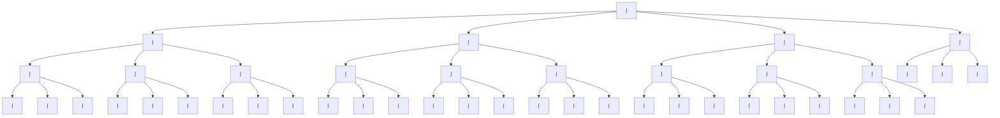
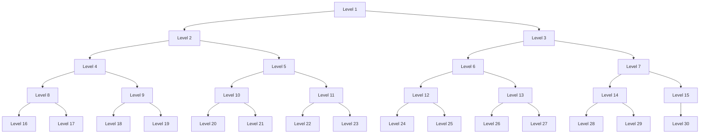
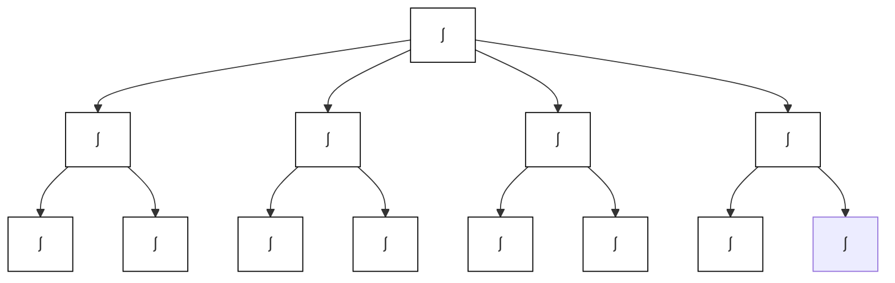

# AMA 564 Deep Learning

# 2026 Spring

# Lecture 2

# Feedforward Neural Networks (Multi-Layer Perceptrons)

• The architecture of a MLP is expressed as a composition of a series of functions

$$
f _ {\theta} (x) = \mathcal {A} _ {L} \circ \sigma \circ \mathcal {A} _ {L - 1} \circ \sigma \circ \dots \circ \sigma \circ \mathcal {A} _ {1} (x), x \in \mathbb {R} ^ {d _ {0}}
$$

where

$$
\mathcal {A} _ {i} (x) = W _ {i} x + b _ {i}, \qquad x \in \mathbb {R} ^ {d _ {i - 1}}
$$

is the i-th linear transformation with

weight matrix $W _ { i } \in \mathbb { R } ^ { d _ { i } \times d _ { i - 1 } }$ and bias vector $b _ { i } \in \mathbb { R } ^ { d _ { i } }$ ,

and $\sigma$ is the activation function,

$\begin{array}{c} \mathsf { e . g . } , \qquad & { } \end{array}$

Universality of Neural Networks   

line

| x      | actual | pred |
| ------ | ------ | ---- |
| -1.00  | -0.3   | 0.1  |
| -0.75  | -0.8   | 0.2  |
| -0.50  | -0.2   | 0.1  |
| -0.25  | 0.6    | 0.1  |
| 0.00   | 1.0    | 0.3  |
| 0.25   | 0.6    | 0.1  |
| 0.50   | -0.2   | 0.2  |
| 0.75   | -0.5   | 0.1  |
| 1.00   | -0.3   | 0.1  |

Neural networks can approximate regression functions very well.

# Universality of Neural Networks (Arbitrary-width case)

Universal approximation theorem: Let $C ( X , Y )$ denote the set of continuous functions from $X$ to Y. Let $\sigma \in C ( \mathbb { R } , \mathbb { R } )$ . Note that $( \sigma \circ x ) _ { i } = \sigma ( x _ { i } )$ ，so $\sigma \circ x$ denotes $\sigma$ applied to each component of x.

Then $\sigma$ is not polynomial if and only if for every $n \in \mathbb { N } , m \in \mathbb { N }$ , compact $K \subseteq \mathbb { R } ^ { n }$ $f \in C ( K , \mathbb { R } ^ { m } ) , \varepsilon > 0$ there exist $k \in \mathbb { N } , A \in \mathbb { R } ^ { k \times n } , b \in \mathbb { R } ^ { k } , C \in \mathbb { R } ^ { m \times k }$ such that

$$
\sup _ {x \in K} \| f (x) - g (x) \| <   \varepsilon
$$

where

$$
g (x) = C \cdot (\sigma \circ (A \cdot x + b))
$$

Any continuous functions defined on a compact set can be approximated arbitrarily well by a shallow neural network if the shallow neural network is arbitrarily wide.

# Universality of Neural Networks (Arbitrary-depth case)

Universal approximation theorem (L1 distance, ReLU activation, arbitrary depth, minimal width). For any Bochner-Lebesgue p-integrable function $f : \mathbb { R } ^ { n }  \mathbb { R } ^ { m }$ and any $\epsilon > 0$ there exists a fully-connected ReLU network F of width exactly $d _ { m } = \operatorname* { m a x } \{ n + 1 , m \}$ satisfying

$$
\int_ {\mathbb {R} ^ {n}} \| f (x) - F (x) \| ^ {p} \mathrm{d} x <   \epsilon .
$$

Moreover, there exists a function $f \in L ^ { p } ( \mathbb { R } ^ { n } , \mathbb { R } ^ { m } )$ and some $\epsilon > 0$ ,for which there is no fully-connected ReLU network of width less than $d _ { m } = \operatorname* { m a x } \{ n + 1 , m \}$ satisfying the above approximation bound.

Any continuous functions defined on a compact set can be approximated arbitrarily well by a fixed-width neural network if the neural network is arbitrarily deep.

# Universality of Neural Networks

scatter

| x    | y    | Class   |
| ---- | ---- | ------- |
| -10  | -10  | Class 1 |
| -5   | -5   | Class 1 |
| 0    | 0    | Class 1 |
| 5    | 5    | Class 1 |
| 10   | 10   | Class 1 |
| -10  | 5    | Class 2 |
| -5   | 10   | Class 2 |
| 0    | 5    | Class 2 |
| 5    | 10   | Class 2 |
| 10   | 5    | Class 2 |

area

| Region   | Value |
| -------- | ----- |
| Class 1  | -3.0  |
| Class 1  | -2.0  |
| Class 1  | -1.0  |
| Class 1  | 0.0   |
| Class 1  | 1.0   |
| Class 1  | 2.0   |
| Class 1  | 3.0   |
| Class 1  | 4.0   |
| Class 1  | 5.0   |
| Class 2  | -3.0  |
| Class 2  | -2.0  |
| Class 2  | -1.0  |
| Class 2  | 0.0   |
| Class 2  | 1.0   |
| Class 2  | 2.0   |
| Class 2  | 3.0   |
| Class 2  | 4.0   |
| Class 2  | 5.0   |

area

| x    | Class 1 | Class 2 |
| ---- | ------- | ------- |
| -10  | -5      | -5      |
| -8   | 7       | -5      |
| -6   | -5      | -5      |
| -4   | 0       | -5      |
| -2   | 2       | -5      |
| 0    | 0       | -5      |
| 2    | 2       | -5      |
| 4    | -5      | -5      |
| 6    | 0       | -5      |
| 8    | 7       | -5      |
| 10   | -5      | -5      |

flowchart

flowchart

flowchart

Neural networks can also approximate classification regions very well.

# How to use Deep Neural Networks

to do

regression?

# Deep Neural Regressions

# An Example

scatter

| x    | y    |
| ---- | ---- |
| 0.0  | -5.0 |
| 1.0  | -4.0 |
| 2.0  | -3.0 |
| 3.0  | -2.0 |
| 4.0  | -1.0 |
| 5.0  | 0.0  |
| 6.0  | 1.0  |
| 7.0  | 2.0  |
| 8.0  | 3.0  |
| 9.0  | 4.0  |
| 10.0 | 5.0  |
| 11.0 | 6.0  |
| 12.0 | 7.0  |
| 13.0 | 8.0  |
| 14.0 | 9.0  |
| 15.0 | 10.0 |

Least squares regression   
Data $( X _ { i } , Y _ { i } ) , i = 1 , \dots , n .$   
To find a

$$
\boldsymbol {f} (\boldsymbol {x}; \alpha , \beta) = \boldsymbol {\beta} ^ {\prime} \boldsymbol {x} + \alpha
$$

such that

$$
\Sigma \big (Y _ {i} - f (X _ {i}) \big) ^ {2}
$$

is minimized over

$$
\begin{array}{c} \mathcal {F} = \{\boldsymbol {f} \colon \boldsymbol {f} (\boldsymbol {x}; \alpha , \beta) = \boldsymbol {\beta} ^ {\prime} \boldsymbol {x} + \alpha , \\ \alpha , \beta \in \mathbb {R} \} \end{array}
$$

Write $Z _ { i } ' = ( 1 , X _ { i } ^ { \prime } )$ , $\pmb { Z } ^ { \prime } = ( \pmb { Z } _ { 1 } ^ { \prime } , \pmb { Z } _ { 2 } ^ { \prime } , \cdots , \pmb { Z } _ { n } ^ { \prime } ) , \pmb { Y } ^ { \prime } = ( \pmb { Y } _ { 1 } , \pmb { Y } _ { 2 } , \cdots , \pmb { Y } _ { n } )$ and $\mathbf { \Phi } ^ { \prime } = \left( \begin{array} { l l } { \mathbf { \Phi } , \mathbf { \Phi } ^ { \prime } } \end{array} \right)$ , then the closed-form solution is

$$
\pmb {\theta} ^ {*} = (\mathbf {Z} ^ {\prime} \mathbf {Z}) ^ {- 1} \mathbf {Z} ^ {\prime} \mathbf {Y} = a r g m i n _ {\pmb {\theta} \in \mathbb {R} ^ {2}} \sum \| \mathbf {Y} - \mathbf {Z} \pmb {\theta} \| ^ {2}
$$

An Example   

bar_line

| x      | y (red line) | y (blue dots) |
| ------ | ------------ | ------------- |
| -10.0  | 1.2          | 0.9           |
| -7.5   | 0.0          | -0.4          |
| -5.0   | -0.6         | -0.8          |
| -2.5   | 0.4          | 0.5           |
| 0.0    | 0.0          | -0.1          |
| 2.5    | -0.2         | -0.3          |
| 5.0    | 0.1          | 0.4           |
| 7.5    | 0.7          | 0.6           |
| 10.0   | -1.2         | -1.1          |

Data $( X _ { i } , Y _ { i } ) , i = 1 , \dots , n .$   
To find a network

$$
\boldsymbol {f} (\boldsymbol {x}; \boldsymbol {\theta})
$$

such that

$$
\Sigma \big (Y _ {i} - f (X _ {i}; \theta) \big) ^ {2}
$$

is minimized over

$$
\mathcal {F} = \{f: f (x; \theta) i s a
$$

???????????? ??????????????

$$
\text { parameterized   by } \theta \in \mathbb {R} ^ {s} \}
$$

How do we solve for ?? ? It seems hard to get no closed-form solution.   
Search for ?? using optimization algorithms. e.g., (stochastic) gradient decent and its variants.

# The optimization problem

Data $( X _ { i } , Y _ { i } ) , i = 1 , \dots , n$ .   
The empirical risk

$$
R _ {n} (\pmb {\theta}) = R _ {n} \big (f (\cdot , \pmb {\theta}) \big) = \frac {1}{n} \sum \big (Y _ {i} - f (X _ {i}; \pmb {\theta}) \big) ^ {2}.
$$

• The target is to minimize $\smash { R _ { n } ( \mathbf { \theta } ) }$ over $\mathbf { \xi } \in \mathbb { R } ^ { s }$ .

The loss, objective function $R _ { n } ( \theta )$ .

The parameter $\mathbf { \chi } \in \mathbb { R } ^ { s }$ .

natural_image

Scenic mountain landscape with a cartoon character walking through the valley, snow-capped peaks in the background under a blue sky with clouds.

Source: https://www.maxpixel.net/Mountains-Valleys-Landscape-Hills-Grass-Green-699369

Strategy #1: Grid search and Random search   

natural_image

Grid pattern with teal dots and a red shaded region above, no text or symbols present

Grid Search

scatter

| x | y |
|---|---|
| 0.1 | 0.9 |
| 0.2 | 0.85 |
| 0.3 | 0.8 |
| 0.4 | 0.75 |
| 0.5 | 0.7 |
| 0.6 | 0.65 |
| 0.7 | 0.6 |
| 0.8 | 0.55 |
| 0.9 | 0.5 |
| 1.0 | 0.45 |
| 1.1 | 0.4 |
| 1.2 | 0.35 |
| 1.3 | 0.3 |
| 1.4 | 0.25 |
| 1.5 | 0.2 |
| 1.6 | 0.15 |
| 1.7 | 0.1 |
| 1.8 | 0.05 |
| 1.9 | 0.0 |
| 2.0 | -0.05 |
| 2.1 | -0.1 |
| 2.2 | -0.15 |
| 2.3 | -0.2 |
| 2.4 | -0.25 |
| 2.5 | -0.3 |
| 2.6 | -0.35 |
| 2.7 | -0.4 |
| 2.8 | -0.45 |
| 2.9 | -0.5 |
| 3.0 | -0.55 |
| 3.1 | -0.6 |
| 3.2 | -0.65 |
| 3.3 | -0.7 |
| 3.4 | -0.75 |
| 3.5 | -0.8 |
| 3.6 | -0.85 |
| 3.7 | -0.9 |
| 3.8 | -0.95 |
| 3.9 | -1.0 |
| 4.0 | -1.05 |
| 4.1 | -1.1 |
| 4.2 | -1.15 |
| 4.3 | -1.2 |
| 4.4 | -1.25 |
| 4.5 | -1.3 |
| 4.6 | -1.35 |
| 4.7 | -1.4 |
| 4.8 | -1.45 |
| 4.9 | -1.5 |
| 5.0 | -1.55 |
| 5.1 | -1.6 |
| 5.2 | -1.65 |
| 5.3 | -1.7 |
| 5.4 | -1.75 |
| 5.5 | -1.8 |
| 5.6 | -1.85 |
| 5.7 | -1.9 |
| 5.8 | -1.95 |
| 5.9 | -2.0 |
| 6.0 | -2.05 |
| 6.1 | -2.1 |
| 6.2 | -2.15 |
| 6.3 | -2.2 |
| 6.4 | -2.25 |
| 6.5 | -2.3 |
| 6.6 | -2.35 |
| 6.7 | -2.4 |
| 6.8 | -2.45 |
| 6.9 | -2.5 |
| 7.0 | -2.55 |
| 7.1 | -2.6 |
| 7.2 | -2.65 |
| 7.3 | -2.7 |
| 7.4 | -2.75 |
| 7.5 | -2.8 |
| 7.6 | -2.85 |
| 7.7 | -2.9 |
| 7.8 | -2.95 |
| 7.9 | -3.0 |
| 8.0 | -3.05 |
| 8.1 | -3.1 |
| 8.2 | -3.15 |
| 8.3 | -3.2 |
| 8.4 | -3.25 |
| 8.5 | -3.3 |
| 8.6 | -3.35 |
| 8.7 | -3.4 |
| 8.8 | -3.45 |
| 8.9 | -3.5 |
| 9.0 | -3.55 |
| 9.1 | -3.6 |
| 9.2 | -3.65 |
| 9.3 | -3.7 |
| 9.4 | -3.75 |
| 9.5 | -3.8 |
| 9.6 | -3.85 |
| 9.7 | -3.9 |
| 9.8 | -3.95 |
| 9.9 | -4.0 |
| 10.0 | -4.05 |
| 10.1 | -4.1 |
| 10.2 | -4.15 |
| 10.3 | -4.2 |

Random Search   
Source:https://community.alteryx.com/t5/Data-Science/Hyperparameter-Tuning-Black-Magic/ba-p/449289

Low efficiency, especially in high-dimensional parameter space. (Curse of dimensionality)

# Strategy #1: Random search

\# assume X\_train is the data where each column is an example (e.g. 96 x 50,000)

\# assume Y\_train are the responses (e.g. 1D array of 50,000)

\# assume the function R evaluates the loss function

bestloss = float("inf") # Python assigns the highest possible float value

for num in range(1000):

theta = np.random.randn(9876) \* 0.0001 # generate random parameters

loss = R(X\_train, Y\_train, theta) # get the loss over the entire training set

if loss < bestloss: # keep track of the best solution

bestloss = loss

best\_theta = theta

print 'in attempt %d the loss was %f, best %f' % (num, loss, bestloss)

# A toy example: code for random search.

Loop: 1. Random guess 2. Check and compare 3. Update

# Strategy #2: Go along the gradient

Derivative of f is the rate of change of f

$$
f ^ {\prime} (x) = \frac {d f}{d x} = \lim _ {\Delta x \rightarrow 0} \frac {f (x + \Delta x) - f (x)}{\Delta x} = \lim _ {\Delta x \rightarrow 0} \frac {\Delta f}{\Delta x}
$$

text_image

f(x+Δx)
f(x)
x +Δx
f(x+Δx)
f(x)
Δf
Δx
x +Δx
Δx→0
Make this interval smaller and smaller
So that Δx→0

Source:https://machinelearningmastery.com/a-gentle-introduction-to-function-derivatives/

# Strategy #2: Go along the gradient

In multiple dimensions, the gradient is the vector of (partial derivatives) along each dimension.

The slope in any direction is the dot product of the direction with the gradient.

$$
\nabla f = \left[ \begin{array}{c} \frac {\partial f}{\partial x} \\ \frac {\partial f}{\partial y} \\ \vdots \end{array} \right]
$$

natural_image

3D surface plot with a black curved line overlay, showing a gradient from red to blue with contour lines at the base (no text or labels)

The direction of steepest descent is the negative gradient.

# Strategy #2: Go along the gradient. (Example)

Let W denotes the parameter to be optimized.

# current W:

[0.34,

-1.11,

0.78,

0.12,

0.55,

2.81,

-3.1,

-1.5,

0.33,...]

loss 1.25347

# gradient dW:

[?,

# Strategy #2: Go along the gradient. (Example)

See how does loss change along the first dimension.

current W: 

<table><tr><td>[0.34, -1.11, 0.78, 0.12, 0.55, 2.81, -3.1, -1.5, 0.33,...] loss 1.2</td></tr></table>

$\textsf { W } + \textsf { h } ( \mathsf { f i r s t } \dim ) \colon$ 

<table><tr><td>[0.34 + 0.0001, -1.11, 0.78, 0.12, 0.55, 2.81, -3.1, -1.5, 0.33,...] loss 1.25322</td></tr></table>

gradient dW: 

<table><tr><td>[?,</td></tr><tr><td>?,</td></tr><tr><td>?,</td></tr><tr><td>?,</td></tr><tr><td>?,</td></tr><tr><td>?,</td></tr><tr><td>?,</td></tr><tr><td>?,</td></tr><tr><td>?,...]</td></tr></table>

# Strategy #2: Go along the gradient. (Example)

Calculate the partial derivative along the first dimension.

current W: 

<table><tr><td>[0.34, -1.11, 0.78, 0.12, 0.55, 2.81, -3.1, -1.5, 0.33,...] loss 1.2</td></tr></table>

W + h (first dim): 

<table><tr><td>[0.34 + 0.0001, -1.11, 0.78, 0.12, 0.55, 2.81, -3.1, -1.5, 0.33,...] loss 1.25322</td></tr></table>

gradient dW: 

<table><tr><td>[-2.5,?,?,</td></tr><tr><td>(1.25322 - 1.25347)/0.0001= -2.5</td></tr><tr><td> $\frac{df(x)}{dx}=\lim_{h\to 0}\frac{f(x+h)-f(x)}{h}$ </td></tr><tr><td>?,?,...]</td></tr></table>

# Strategy #2: Go along the gradient. (Example)

See how does loss change along the second dimension.

current W:

[0.34,

-1.11,

0.78,

0.12,

0.55,

2.81,

-3.1,

-1.5,

0.33....

loss 1.25347

W + h (second dim): 

<table><tr><td>[0.34,</td></tr><tr><td>-1.11 + 0.0001,</td></tr><tr><td>0.78,</td></tr><tr><td>0.12,</td></tr><tr><td>0.55,</td></tr><tr><td>2.81,</td></tr><tr><td>-3.1,</td></tr><tr><td>-1.5,</td></tr><tr><td>0.33,...]</td></tr></table>

loss 1.25353

gradient dW: 

<table><tr><td>[-2.5,</td></tr><tr><td>?,</td></tr><tr><td>?,</td></tr><tr><td>?,</td></tr><tr><td>?,</td></tr><tr><td>?,</td></tr><tr><td>?,</td></tr><tr><td>?,</td></tr><tr><td>?,</td></tr><tr><td>?,...]</td></tr></table>

# Strategy #2: Go along the gradient. (Example)

Calculate the partial derivative along the second dimension.

current W: 

<table><tr><td>[0.34,</td></tr><tr><td>-1.11,</td></tr><tr><td>0.78,</td></tr><tr><td>0.12,</td></tr><tr><td>0.55,</td></tr><tr><td>2.81,</td></tr><tr><td>-3.1,</td></tr><tr><td>-1.5,</td></tr><tr><td>0.33,...]</td></tr><tr><td>loss 1.25347</td></tr></table>

W + h (second dim): 

<table><tr><td>[0.34,</td></tr><tr><td>-1.11 + 0.0001,</td></tr><tr><td>0.78,</td></tr><tr><td>0.12,</td></tr><tr><td>0.55,</td></tr><tr><td>2.81,</td></tr><tr><td>-3.1,</td></tr><tr><td>-1.5,</td></tr><tr><td>0.33,...]</td></tr><tr><td>loss 1.25353</td></tr></table>

gradient dW: 

<table><tr><td>[-2.5,0.6,?,?,</td></tr><tr><td>(1.25353 - 1.25347)/0.0001= 0.6</td></tr><tr><td> $\frac{df(x)}{dx}=\lim_{h\to 0}\frac{f(x+h)-f(x)}{h}$ </td></tr><tr><td>?,...]</td></tr></table>

# Strategy #2: Go along the gradient. (Example)

See how does loss change along the third dimension.

current W: 

<table><tr><td>[0.34,</td></tr><tr><td>-1.11,</td></tr><tr><td>0.78,</td></tr><tr><td>0.12,</td></tr><tr><td>0.55,</td></tr><tr><td>2.81,</td></tr><tr><td>-3.1,</td></tr><tr><td>-1.5,</td></tr><tr><td>0.33,...]</td></tr><tr><td>loss 1.25347</td></tr></table>

W + h (third dim): 

<table><tr><td>[0.34,</td></tr><tr><td>-1.11,</td></tr><tr><td>0.78 + 0.0001,</td></tr><tr><td>0.12,</td></tr><tr><td>0.55,</td></tr><tr><td>2.81,</td></tr><tr><td>-3.1,</td></tr><tr><td>-1.5,</td></tr><tr><td>0.33,...]</td></tr><tr><td>loss 1.25347</td></tr></table>

gradient dW: 

<table><tr><td>[-2.5,</td></tr><tr><td>0.6,</td></tr><tr><td>?,</td></tr><tr><td>?,</td></tr><tr><td>?,</td></tr><tr><td>?,</td></tr><tr><td>?,</td></tr><tr><td>?,</td></tr><tr><td>?,</td></tr><tr><td>?,...]</td></tr></table>

# Strategy #2: Go along the gradient. (Example)

Calculate the partial derivative along the third dimension.

current W: 

<table><tr><td>[0.34, -1.11, 0.78, 0.12, 0.55, 2.81, -3.1, -1.5, 0.33,...] loss 1.2</td></tr></table>

W + h (third dim): 

<table><tr><td>[0.34,</td></tr><tr><td>-1.11,</td></tr><tr><td>0.78 + 0.0001,</td></tr><tr><td>0.12,</td></tr><tr><td>0.55,</td></tr><tr><td>2.81,</td></tr><tr><td>-3.1,</td></tr><tr><td>-1.5,</td></tr><tr><td>0.33,...]</td></tr><tr><td>loss 1.25347</td></tr></table>

gradient dW: 

<table><tr><td>[-2.5,0.6,0,?,</td></tr><tr><td>(1.25347 - 1.25347)/0.0001= 0</td></tr><tr><td> $\frac{df(x)}{dx}=\lim_{h\to 0}\frac{f(x+h)-f(x)}{h}$ </td></tr><tr><td>?,...]</td></tr></table>

# Strategy #2: Go along the gradient. (Example)

Computing numerical gradient is slow! We need to do too much steps.

current W: 

<table><tr><td>[0.34, -1.11, 0.78, 0.12, 0.55, 2.81, -3.1, -1.5, 0.33,.</td></tr></table>

loss 1.25347

W + h (third dim): 

<table><tr><td>[0.34,</td></tr><tr><td>-1.11,</td></tr><tr><td>0.78 + 0.0001,</td></tr><tr><td>0.12,</td></tr><tr><td>0.55,</td></tr><tr><td>2.81,</td></tr><tr><td>-3.1,</td></tr><tr><td>-1.5,</td></tr><tr><td>0.33,...]</td></tr></table>

loss 1.25347

gradient dW: 

<table><tr><td>[-2.5,</td></tr><tr><td>0.6,</td></tr><tr><td>0,</td></tr><tr><td>?,</td></tr></table>

# Numeric Gradient

Slow! Need to loop over all dimensions   
Approximate

A fast way to find gradient: use Calculus to compute an analytic gradient.

# current W:

[0.34,

-1.11,

0.78,

0.12,

0.55,

2.81,

-3.1,

-1.5,

0.33,...]

loss 1.25347

dW =

(some function

data and W)

# gradient dW:

[-2.5,

0.6,

0,

0.2,

0.7,

-0.5,

1.1,

1.3,

-2.1.,..]

A fast way to find gradient: use Calculus to compute an analytic gradient.

natural_image

Portrait painting of two historical figures: one in 18th-century with long curly hair, the other in 18th-century with long curly hair and formal attire (no visible text or symbols)

Newton and Leibniz

Recall: least squares empirical risk $\begin{array} { r } { R _ { n } ( \theta ) = \frac { 1 } { n } { \sum \left( Y _ { i } - f ( X _ { i } ; \theta ) \right) } ^ { 2 } } \end{array}$

Gradient: $\begin{array} { r } { \frac { d } { d \theta } R _ { n } ( \theta ) = - \frac { 2 } { n } \sum ( Y _ { i } - f ( X _ { i } ; \theta ) ) \frac { d } { d \theta } f ( X _ { i } ; \theta ) } \end{array}$

To compute $\frac { d } { d } f ( X _ { i } ; \mathbf { \lambda } )$ , use Chain rule.

# Gradient Decent

• Numerical Gradient: approximate, slow, easy to write   
• Analytic Gradient: exact, fast, error-prone

In practice: use analytic gradient, but check implementation with numerical gradient (gradient check).

\# Vanilla Gradient Descent

while True:

parameters\_grad = evaluate\_gradient(loss\_fun, data, parameters) parameters += - step\_size \* parameters\_grad # perform parameter update

# The optimization problem

Data $( X _ { i } , Y _ { i } ) , i = 1 , \dots , n$ .   
The empirical risk

$$
R _ {n} (\theta) = R _ {n} \big (f (\cdot , \theta) \big) = \frac {1}{n} \sum \big (Y _ {i} - f (X _ {i}; \theta) \big) ^ {2}.
$$

To minimize $R _ { n } ( \mathbf { \theta } )$ over $\theta \in \mathbb { R } ^ { s }$ .

Initialize $\theta _ { 0 } \in \mathbb { R } ^ { s }$ by some randomization

For $\cdot$

Calculate $\cdot$ ȁ??=????−??

Set stepsize $\mathbf { \alpha } _ { \alpha _ { t } } > \mathbf { 0 }$

Update $\begin{array} { r } { \theta _ { t } = \theta _ { t - 1 } - \alpha _ { t } \cdot \lbrack \frac { d R _ { n } ( \theta ) } { d \theta } \vert _ { \theta = \theta _ { t - 1 } } \rbrack } \end{array}$ ???? ⋅[

After T times iterations, we got $\pmb { \theta } _ { T }$ such that $\cal R _ { n } ( \mathrm { ~  ~ \xi ~ } )$ is small.

text_image

Stop!

Stop somewhere after some iterations of optimization.

# An example of gradient decent

contour

| x    | y    | z   |
|------|------|-----|
| -2.5 | 2.5  | 24  |
| -2.0 | 2.0  | 22  |
| -1.5 | 1.5  | 20  |
| -1.0 | 1.0  | 18  |
| -0.5 | 0.5  | 16  |
| 0.0  | 0.0  | 14  |
| 0.5  | -0.5 | 12  |
| 1.0  | -1.0 | 10  |
| 1.5  | -1.5 | 8   |
| 2.0  | -2.0 | 6   |
| 2.5  | -2.5 | 4   |
| 3.0  | -3.0 | 2   |

Source: https://www.quora.com/Is-gradient-descent-always-3-dimensional

# The optimization problem

Data $( X _ { i } , Y _ { i } ) , i = 1 , \dots , n$ .   
The empirical risk

$$
R _ {n} (\theta) = R _ {n} \big (f (\cdot , \theta) \big) = \frac {1}{n} \sum \big (Y _ {i} - f (X _ {i}; \theta) \big) ^ {2}.
$$

To minimize $R _ { n } ( \mathbf { \theta } )$ over $\mathbf { \Lambda } \in \mathbb { R } ^ { s }$ .

Let’s see how the risk $R _ { n } ( \theta _ { t } )$

and the neural network prediction $f ( \cdot ; \quad )$

change along the iterations.

# An example of deep nonparametric regression

line

| x    | f(x) | Targets | Network Output | Hidden Unit Outputs |
| ---- | ---- | ------- | -------------- | ------------------- |
| -5   | ~3.5 | ~3.5    | ~2.0           | ~1.0                |
| 0    | ~1.0 | ~1.0    | ~2.0           | ~1.0                |
| 5    | ~1.0 | ~1.0    | ~1.0           | ~1.0                |

scatter

| Iteration | Mean Squared Error |
| --------- | ------------------ |
| 1.0       | 0.35               |

Source: https://i.gifer.com/JoRy.gif

# Questions

1. How to initialize $\theta _ { 0 } \in \mathbb { R } ^ { s } \ \cdot$ ?   
2. How to choose the stepsize $\cdot ?$   
3. How to calculate the gradient

$$
\frac {d}{d \theta} R _ {n} (\theta) = - \frac {2}{n} \sum (Y _ {i} - f (X _ {i}; \theta)) \frac {d}{d \theta} f (X _ {i}; \theta)
$$

especially how to compute $\frac { d } { d } f ( X _ { i } ; \mathbf { \lambda } )$ exactly?

4. What if the sample size ?? is very large?

Optimization techniques. Talk about it later.

Recall the regression problem   

bar_line

| x      | y (red line) | y (blue dots) |
| ------ | ------------ | ------------- |
| -10.0  | 1.2          | 0.9           |
| -7.5   | 0.0          | -0.4          |
| -5.0   | -0.6         | -0.8          |
| -2.5   | 0.4          | 0.5           |
| 0.0    | 0.0          | -0.1          |
| 2.5    | -0.2         | -0.3          |
| 5.0    | 0.1          | 0.4           |
| 7.5    | 0.7          | 0.6           |
| 10.0   | -1.2         | -1.1          |

How do we solve for ?? ?

1. Initialize $\theta _ { 0 } \in \mathbb { R } ^ { s }$   
2. Calculate the gradient at $\cdot$   
3. Move a step $\alpha _ { t }$   
4. Iterate until stop.

Data $( X _ { i } , Y _ { i } ) , i = 1 , \dots , n .$   
To find a network

$$
\boldsymbol {f} (\boldsymbol {x}; \boldsymbol {\theta})
$$

such that

$$
\Sigma \big (Y _ {i} - f (X _ {i}; \theta) \big) ^ {2}
$$

is minimized over

?? = {??: ?? ??; ?? ???? ?? ???????????? ?????????????? ?????????????????????????? ???? $\theta \in \mathbb { R } ^ { s } \}$

# Deep Neural Regressions with

# General loss

Problem: Regression with outliers   

scatter

| x       | y_data | y_fitted_curve |
| ------- | ------ | -------------- |
| -1.0    | 0.0    | 0.0            |
| -0.8    | 0.1    | 0.0            |
| -0.6    | 0.0    | 0.1            |
| -0.4    | 0.3    | 0.3            |
| -0.2    | 0.5    | 0.4            |
| 0.0     | 0.4    | 0.3            |
| 0.2     | 0.2    | 0.2            |
| 0.4     | -0.5   | -0.3           |
| 0.6     | -1.2   | -1.1           |
| 0.8     | -0.8   | -0.7           |
| 1.0     | 3.0    | 3.5            |

(a) $( \cdot ) ^ { 2 }$ without outlier

scatter

| x       | y     |
| ------- | ----- |
| -0.98   | -0.12 |
| -0.95   | 0.05  |
| -0.92   | 0.18  |
| -0.89   | -0.03 |
| -0.86   | 0.07  |
| -0.83   | -0.08 |
| -0.80   | 0.02  |
| -0.77   | 0.15  |
| -0.74   | -0.05 |
| -0.71   | 0.09  |
| -0.68   | 0.22  |
| -0.65   | 0.35  |
| -0.62   | 0.48  |
| -0.59   | 0.61  |
| -0.56   | 0.74  |
| -0.53   | 0.87  |
| -0.50   | 1.00  |
| -0.47   | 1.13  |
| -0.44   | 1.26  |
| -0.41   | 1.39  |
| -0.38   | 1.52  |
| -0.35   | 1.65  |
| -0.32   | 1.78  |
| -0.29   | 1.91  |
| -0.26   | 2.04  |
| -0.23   | 2.17  |
| -0.20   | 2.30  |
| -0.17   | 2.43  |
| -0.14   | 2.56  |
| -0.11   | 2.69  |
| -0.08   | 2.82  |
| -0.05   | 2.95  |
| -0.02   | 3.08  |
| 0.01    | 3.21  |
| 0.04    | 3.34  |
| 0.07    | 3.47  |
| 0.10    | 3.60  |
| 0.13    | 3.73  |
| 0.16    | 3.86  |
| 0.19    | 3.99  |
| 0.22    | 4.12  |
| 0.25    | 4.25  |
| 0.28    | 4.38  |
| 0.31    | 4.51  |
| 0.34    | 4.64  |
| 0.37    | 4.77  |
| 0.40    | 4.90  |
| 0.43    | 5.03  |
| 0.46    | 5.16  |
| 0.49    | 5.29  |
| 0.52    | 5.42  |
| 0.55    | 5.55  |
| 0.58    | 5.68  |
| 0.61    | 5.81  |
| 0.64    | 5.94  |
| 0.67    | 6.07  |
| 0.70    | 6.20  |
| 0.73    | 6.33  |
| 0.76    | 6.46  |
| 0.79    | 6.59  |
| 0.82    | 6.72  |
| 0.85    | 6.85  |
| 0.88    | 6.98  |
| 0.91    | 7.11  |
| 0.94    | 7.24  |
| 0.97    | 7.37  |
| 1.00    | 7.50  |

(b) $( \cdot ) ^ { 2 }$ with outlier   
Source: Figure 7.11 of the book "Intro to Probability for Data Science”

Contaminated data can deteriorate the least squares regression.

Problem: Regression with outliers   

scatter

| x       | y_data | y_fitted_curve |
| ------- | ------ | -------------- |
| -1.0    | 0.0    | 0.0            |
| -0.8    | 0.1    | 0.0            |
| -0.6    | 0.0    | 0.1            |
| -0.4    | 0.3    | 0.3            |
| -0.2    | 0.5    | 0.4            |
| 0.0     | 0.4    | 0.3            |
| 0.2     | 0.2    | 0.2            |
| 0.4     | -0.5   | -0.3           |
| 0.6     | -1.2   | -1.1           |
| 0.8     | -0.8   | -0.7           |
| 1.0     | 3.0    | 3.5            |

(a) $( \cdot ) ^ { 2 }$ without outlier

scatter

| x       | y     |
| ------- | ----- |
| -0.98   | -0.12 |
| -0.95   | 0.05  |
| -0.92   | 0.18  |
| -0.89   | -0.03 |
| -0.86   | 0.07  |
| -0.83   | -0.08 |
| -0.80   | 0.02  |
| -0.77   | 0.15  |
| -0.74   | -0.05 |
| -0.71   | 0.09  |
| -0.68   | 0.22  |
| -0.65   | 0.35  |
| -0.62   | 0.48  |
| -0.59   | 0.61  |
| -0.56   | 0.74  |
| -0.53   | 0.87  |
| -0.50   | 1.00  |
| -0.47   | 1.13  |
| -0.44   | 1.26  |
| -0.41   | 1.39  |
| -0.38   | 1.52  |
| -0.35   | 1.65  |
| -0.32   | 1.78  |
| -0.29   | 1.91  |
| -0.26   | 2.04  |
| -0.23   | 2.17  |
| -0.20   | 2.30  |
| -0.17   | 2.43  |
| -0.14   | 2.56  |
| -0.11   | 2.69  |
| -0.08   | 2.82  |
| -0.05   | 2.95  |
| -0.02   | 3.08  |
| 0.01    | 3.21  |
| 0.04    | 3.34  |
| 0.07    | 3.47  |
| 0.10    | 3.60  |
| 0.13    | 3.73  |
| 0.16    | 3.86  |
| 0.19    | 3.99  |
| 0.22    | 4.12  |
| 0.25    | 4.25  |
| 0.28    | 4.38  |
| 0.31    | 4.51  |
| 0.34    | 4.64  |
| 0.37    | 4.77  |
| 0.40    | 4.90  |
| 0.43    | 5.03  |
| 0.46    | 5.16  |
| 0.49    | 5.29  |
| 0.52    | 5.42  |
| 0.55    | 5.55  |
| 0.58    | 5.68  |
| 0.61    | 5.81  |
| 0.64    | 5.94  |
| 0.67    | 6.07  |
| 0.70    | 6.20  |
| 0.73    | 6.33  |
| 0.76    | 6.46  |
| 0.79    | 6.59  |
| 0.82    | 6.72  |
| 0.85    | 6.85  |
| 0.88    | 6.98  |
| 0.91    | 7.11  |
| 0.94    | 7.24  |
| 0.97    | 7.37  |
| 1.00    | 7.50  |

(b) $( \cdot ) ^ { 2 }$ with outlier   
Source: Figure 7.11 of the book "Intro to Probability for Data Science”

But Why do least square regression fail?

# Problem: Regression with outliers

• Data $( X _ { i } , Y _ { i } ) , i = 1 , \dots , n$ . Minimize empirical risk $\begin{array} { r } { R _ { n } ( \theta ) = R _ { n } \big ( f ( \cdot , \theta ) \big ) = \frac { 1 } { n } \sum \big ( Y _ { i } - \big . } \end{array}$ $f { ( X _ { i } ; \theta ) } \big ) ^ { 2 }$ over $\mathbf { \chi } \in \mathbb { R } ^ { s }$ . Or minimize $R _ { n } ( f )$ over ??.   
• Let $\begin{array} { r l } { R } & { { } = \ \mathbb { E } \left( Y _ { i } - \ \left( X _ { i } \right) \right) ^ { 2 } } \end{array}$ be the risk of a function ??, then for each ??

$$
f ^ {*} (x) = \mathbb {E} [ Y | X = x ] = \operatorname{argmin} _ {f} \mathbb {E} \left[ \left(Y _ {i} - f (X _ {i})\right) ^ {2} \mid X _ {i} = x \right]. (\text {Try proving it.})
$$

• Then the targets of the minimization of $R _ { n } ( f )$ is the conditional mean of ?? given ??. In other words, least squares regression targets for “conditional mean”.

scatter

| H   | W   |
| --- | --- |
| 160 | 61  |
| 162 | 62  |
| 164 | 65  |
| 166 | 66  |
| 168 | 67  |
| 170 | 69  |

line

| H   | W     |
| --- | ----- |
| 160 | 61.0  |
| 162 | 62.5  |
| 164 | 64.5  |
| 166 | 66.0  |
| 168 | 67.5  |
| 170 | 68.5  |

# Problem: Regression with outliers

Data $( X _ { i } , Y _ { i } ) , i = 1 , \dots , n$ . Minimize empirical risk $R _ { n } ( \mathbf { \lambda } ) = R _ { n } \bigl ( f ( \cdot , \mathbf { \lambda } ) \bigr ) =$ $\begin{array} { r } { { \frac { 1 } { n } } \sum \bigl ( Y _ { i } - f ( X _ { i } ; \theta ) \bigr ) ^ { 2 } } \end{array}$ over $\mathbf { \Lambda } \in \mathbb { R } ^ { s }$   
Let $Y _ { j }$ be the contaminated data, $| Y _ { j } - f ( X _ { j } ; \theta )$ ȁ can be large, and $\left( Y _ { j } - \right.$ ${ \hat { f } } { \left( { { X } _ { j } } ; \begin{array} { l } { } \end{array} \right) } ^ { 2 }$ is even larger such that it dominates the empirical risk $R _ { n } ( \mathbf { \theta \phi } ) $ $\begin{array} { r } { \frac { 1 } { n } { \sum \big ( } Y _ { i } - f ( X _ { i } ; ~ ) \big ) ^ { 2 } } \end{array}$ .   
• Then the minimizer $\hat { f } ( \cdot , \mathbf { \lambda } )$ of $R _ { n } ( \mathbf { \theta } )$ will be prone to fit $\left( { { X } _ { j } } , { { Y } _ { j } } \right)$ with priority.

scatter

| H   | W    |
| --- | ---- |
| 160 | 61   |
| 162 | 62   |
| 164 | 65   |
| 166 | 66   |
| 168 | 67   |
| 170 | 69   |

line

| H   | W     |
| --- | ----- |
| 160 | 61.0  |
| 162 | 62.5  |
| 164 | 64.5  |
| 166 | 66.0  |
| 168 | 67.5  |
| 170 | 68.5  |

Problem: Regression with outliers   

scatter

| x     | y     |
|-------|-------|
| -1.0  | 0.0   |
| -0.9  | 0.1   |
| -0.8  | 0.2   |
| -0.7  | 0.3   |
| -0.6  | 0.4   |
| -0.5  | 0.5   |
| -0.4  | 0.6   |
| -0.3  | 0.7   |
| -0.2  | 0.8   |
| -0.1  | 0.9   |
| 0.0   | 1.0   |
| 0.1   | 0.9   |
| 0.2   | 0.8   |
| 0.3   | 0.7   |
| 0.4   | 0.6   |
| 0.5   | 0.5   |
| 0.6   | 0.4   |
| 0.7   | 0.3   |
| 0.8   | 0.2   |
| 0.9   | 0.1   |
| 1.0   | 0.0   |

(a) Ordinary $( \cdot ) ^ { 2 }$ regression with outliers

scatter

| x       | y     |
| ------- | ----- |
| -1.00   | 0.00  |
| -0.95   | 0.10  |
| -0.90   | 0.05  |
| -0.85   | 0.00  |
| -0.80   | -0.10 |
| -0.75   | -0.20 |
| -0.70   | -0.30 |
| -0.65   | -0.40 |
| -0.60   | -0.50 |
| -0.55   | -0.60 |
| -0.50   | -0.70 |
| -0.45   | -0.80 |
| -0.40   | -0.90 |
| -0.35   | -1.00 |
| -0.30   | -1.10 |
| -0.25   | -1.20 |
| -0.20   | -1.30 |
| -0.15   | -1.40 |
| -0.10   | -1.50 |
| -0.05   | -1.60 |
| 0.00    | -1.70 |
| 0.05    | -1.80 |
| 0.10    | -1.90 |
| 0.15    | -2.00 |
| 0.20    | -2.10 |
| 0.25    | -2.20 |
| 0.30    | -2.30 |
| 0.35    | -2.40 |
| 0.40    | -2.50 |
| 0.45    | -2.60 |
| 0.50    | -2.70 |
| 0.55    | -2.80 |
| 0.60    | -2.90 |
| 0.65    | -3.00 |
| 0.70    | -3.10 |
| 0.75    | -3.20 |
| 0.80    | -3.30 |
| 0.85    | -3.40 |
| 0.90    | -3.50 |
| 0.95    | -3.60 |
| 1.00    | -3.70 |

(b)Robust |·|regression with outliers   
Source: Figure 7.12 of the book "Intro to Probability for Data Science”

Put less weight on each individual data point.

Use robust loss function.

# Loss functions and their derivatives

Least Square   

line

| x  | y  |
|----|----|
| -10 | 60 |
| -5  | 30 |
| 0   | 0  |
| 5   | 30 |
| 10  | 60 |

LAD   

line

| x  | y |
|----|---|
| -10 | 8 |
| -5  | 4 |
| 0   | 0 |
| 5   | 4 |
| 10  | 8 |

Huber   

line

| x  | y |
|----|---|
| -10 | 8 |
| -5  | 4 |
| 0   | 0 |
| 5   | 4 |
| 10  | 8 |

Cauchy   

line

| x  | y |
|----|---|
| -10 | 4 |
| -5  | 3 |
| 0   | 0 |
| 5   | 3 |
| 10  | 4 |

Tukey   

line

| x  | y  |
|----|----|
| -7 | -16 |
| -5 | -10 |
| 0  | 0   |
| 5  | 10  |
| 7  | 16 |

line

| x   | y   |
| --- | --- |
| -7.5 | -1.0 |
| -5  | -1.0 |
| -2.5 | -1.0 |
| 0   | 1.0 |
| 2.5 | 1.0 |
| 5   | 1.0 |
| 7.5 | 1.0 |

line

| x   | y    |
| --- | ---- |
| -7  | -1.0 |
| -5  | -1.0 |
| -3  | -1.0 |
| -1  | -1.0 |
| 0   | 1.0  |
| 3   | 1.0  |
| 5   | 1.0  |
| 7   | 1.0  |

line

| x    | y     |
| ---- | ----- |
| -7   | -0.25 |
| -5   | -0.4  |
| -3   | -0.6  |
| -1   | -1.0  |
| 0    | 1.0   |
| 2    | 0.8   |
| 4    | 0.6   |
| 6    | 0.4   |
| 8    | 0.3   |

line

| x    | y     |
| ---- | ----- |
| -6   | 0.0   |
| -4   | 0.0   |
| -2   | -1.0  |
| 0    | 0.0   |
| 2    | 1.0   |
| 4    | 0.0   |
| 6    | 0.0   |

Robust loss functions try to downplay the importance of the data point with large deviation.

# The regression problem

Data $( X _ { i } , Y _ { i } ) , i = 1 , \ldots , n .$   
• To find a network $\pmb { f } ( \pmb { x } ; \ \mathbf { \mu } )$ such that

$$
\frac {1}{n} \sum L (Y _ {i}, f (X _ {i}; \theta))
$$

is minimized over

$$
\mathcal {F} = \{f \colon f (x; \theta) \text {is a neural network parameterized by} \theta \in \mathbb {R} ^ {s} \}.
$$

• $\_$ is a loss function.   
• In particular, consider $\_$ for some (symmetric) ??. $\phi$

$$
\frac {1}{n} \sum \phi (Y _ {i} - f (X _ {i}; \theta))
$$

# Loss functions and their derivatives

Least Square   

line

| x  | y  |
|----|----|
| -10 | 60 |
| -5  | 30 |
| 0   | 0  |
| 5   | 30 |
| 10  | 60 |

LAD   

line

| x  | y |
|----|---|
| -10 | 8 |
| -5  | 4 |
| 0   | 0 |
| 5   | 4 |
| 10  | 8 |

Huber   

line

| x  | y |
|----|---|
| -10 | 8 |
| -5  | 4 |
| 0   | 0 |
| 5   | 4 |
| 10  | 8 |

Cauchy   

line

| x  | y |
|----|---|
| -10 | 4 |
| -5  | 3 |
| 0   | 0 |
| 5   | 3 |
| 10  | 4 |

Tukey   

line

| x  | y  |
|----|----|
| -7 | -15 |
| -5 | -10 |
| -3 | -5  |
| 0  | 0   |
| 3  | 5   |
| 5  | 10  |
| 7  | 15  |

line

| x   | y   |
| --- | --- |
| -7.5 | -1.0 |
| -5  | -1.0 |
| -2.5 | -1.0 |
| 0   | 1.0 |
| 2.5 | 1.0 |
| 5   | 1.0 |
| 7.5 | 1.0 |

line

| x   | y    |
| --- | ---- |
| -7  | -1.0 |
| -5  | -1.0 |
| -3  | -1.0 |
| -1  | -1.0 |
| 0   | 1.0  |
| 3   | 1.0  |
| 5   | 1.0  |
| 7   | 1.0  |

line

| x    | y     |
| ---- | ----- |
| -7   | -0.2  |
| -5   | -0.4  |
| -3   | -0.6  |
| -1   | -0.8  |
| 0    | -1.0  |
| 1    | 1.0   |
| 3    | 0.6   |
| 5    | 0.4   |
| 7    | 0.2   |

line

| x    | y     |
| ---- | ----- |
| -7   | 0.0   |
| -5   | 0.0   |
| -3   | -1.0  |
| -1   | -1.5  |
| 1    | 1.0   |
| 3    | 0.0   |
| 5    | 0.0   |

Least square (LS): $\phi ( a ) = a ^ { 2 }$

Least absolute deviation (LAD): $\phi ( a ) = | a |$

Huber loss: $\begin{array} { r } { \phi ( { \boldsymbol a } ) = \frac { a ^ { 2 } } { 2 } i f | { \boldsymbol a } | < \tau ; \phi ( { \boldsymbol a } ) = \tau | { \boldsymbol a } | - \frac { \tau ^ { 2 } } { 2 } i f | { \boldsymbol a } | \geq \tau } \end{array}$ for some $\cdot$

Cauchy loss: $-$ for some $\cdot$

Tukey loss: $\phi ( a ) = { \frac { t ^ { 2 } \biggl \{ 1 - \biggl [ 1 - \biggl ( { \frac { a } { t } } \biggr ) ^ { 2 } \biggr ] ^ { 3 } \biggr \} } { 6 } }$ ???? $| a | < t ; \phi ( a ) = t ^ { 2 } /$ /?? ??????????????????

# Loss functions and their derivatives

Least Square   

line

| x  | y  |
|----|----|
| -10 | 60 |
| -5  | 30 |
| 0   | 0  |
| 5   | 30 |
| 10  | 60 |

LAD   

line

| x  | y |
|----|---|
| -10 | 8 |
| -5  | 4 |
| 0   | 0 |
| 5   | 4 |
| 10  | 8 |

Huber   

line

| x  | y |
|----|---|
| -10 | 8 |
| -5  | 4 |
| 0   | 0 |
| 5   | 4 |
| 10  | 8 |

Cauchy   

line

| x  | y |
|----|---|
| -10 | 4 |
| -5  | 3 |
| 0   | 0 |
| 5   | 3 |
| 10  | 4 |

Tukey   

line

| x  | y  |
|----|----|
| -7 | -16 |
| -5 | -10 |
| -3 | -5  |
| -1 | 0   |
| 1  | 5   |
| 3  | 10  |
| 5  | 15  |

line

| x   | y   |
| --- | --- |
| -6  | -1.0 |
| -5  | -1.0 |
| -4  | -1.0 |
| -3  | -1.0 |
| -2  | -1.0 |
| -1  | -1.0 |
| 0   | 1.0 |
| 1   | 1.0 |
| 2   | 1.0 |
| 3   | 1.0 |
| 4   | 1.0 |
| 5   | 1.0 |
| 6   | 1.0 |

line

| x   | y    |
| --- | ---- |
| -7  | -1.0 |
| -5  | -1.0 |
| -3  | -1.0 |
| -1  | -1.0 |
| 0   | 1.0  |
| 3   | 1.0  |
| 5   | 1.0  |
| 7   | 1.0  |

line

| x    | y     |
| ---- | ----- |
| -7   | -0.2  |
| -5   | -0.4  |
| -3   | -0.6  |
| -1   | -0.8  |
| 0    | -1.0  |
| 1    | 1.0   |
| 3    | 0.6   |
| 5    | 0.4   |
| 7    | 0.2   |

line

| x    | y     |
| ---- | ----- |
| -6   | 0.0   |
| -5   | 0.0   |
| -4   | -1.0  |
| -3   | -1.5  |
| -2   | -1.0  |
| -1   | 0.0   |
| 0    | 1.0   |
| 1    | 0.5   |
| 2    | 0.0   |
| 3    | 0.0   |
| 4    | 0.0   |
| 5    | 0.0   |
| 6    | 0.0   |

Recall: the empirical risk $\begin{array} { r } { R _ { n } ( \theta ) = \frac { 1 } { n } \sum \phi ( Y _ { i } - f ( X _ { i } ; \theta ) ) } \end{array}$

Gradient: $\begin{array} { r } { \frac { d } { d } R _ { n } ( { \it \Delta \phi } ) = - \frac { 1 } { n } \sum \phi ^ { \prime } ( Y _ { i } - f ( X _ { i } ; { \it \Delta \phi } ~ ) ) \frac { d } { d } f ( X _ { i } ; { \it \Delta \phi } ~ ) } \end{array}$

To compute $\textstyle { \frac { d } { d \theta } } f ( X _ { i } ; \theta )$ , use Chain rule.

# Recall the regression problem

scatter

| x       | y     |
| ------- | ----- |
| -1.00   | 0.00  |
| -0.95   | 0.05  |
| -0.90   | 0.10  |
| -0.85   | 0.05  |
| -0.80   | 0.00  |
| -0.75   | -0.05 |
| -0.70   | -0.10 |
| -0.65   | -0.15 |
| -0.60   | -0.20 |
| -0.55   | -0.25 |
| -0.50   | -0.30 |
| -0.45   | -0.35 |
| -0.40   | -0.40 |
| -0.35   | -0.45 |
| -0.30   | -0.50 |
| -0.25   | -0.55 |
| -0.20   | -0.60 |
| -0.15   | -0.65 |
| -0.10   | -0.70 |
| -0.05   | -0.75 |
| 0.00    | -0.80 |
| 0.05    | -0.85 |
| 0.10    | -0.90 |
| 0.15    | -0.95 |
| 0.20    | -1.00 |
| 0.25    | -1.05 |
| 0.30    | -1.10 |
| 0.35    | -1.15 |
| 0.40    | -1.20 |
| 0.45    | -1.25 |
| 0.50    | -1.30 |
| 0.55    | -1.35 |
| 0.60    | -1.40 |
| 0.65    | -1.45 |
| 0.70    | -1.50 |
| 0.75    | -1.55 |
| 0.80    | -1.60 |
| 0.85    | -1.65 |
| 0.90    | -1.70 |
| 0.95    | -1.75 |
| 1.00    | -1.80 |

Data $( X _ { i } , Y _ { i } ) , i = 1 , \dots , n $   
To find a network

$$
\boldsymbol {f} (\boldsymbol {x}; \boldsymbol {\theta})
$$

such that

$$
\sum \phi (Y _ {i} - f (X _ {i}; \theta))
$$

is minimized over

$$
\mathcal {F} = \{f: f (x; \theta) i s a
$$

???????????? ??????????????

$$
\text { parameterized   by } \theta \in \mathbb {R} ^ {s} \}
$$

How do we solve for ?? ?

1. Initialize $\theta _ { 0 } \in \mathbb { R } ^ { s }$   
2. Calculate the gradient at $\theta _ { t }$ (with different $\phi )$   
3. Move a step $\cdot$   
4. Iterate until stop

# Numerical examples

Data generated from the model $\boldsymbol { Y } = f _ { 0 } ( \boldsymbol { X } ) + \eta$ with sample size $n = 1 2 8$

Four target functions $f _ { 0 } ( \boldsymbol { X } )$ are considered:

line

| x    | y   |
| ---- | --- |
| 0.0  | 0   |
| 0.1  | 4   |
| 0.2  | -1  |
| 0.3  | -4  |
| 0.4  | 0   |
| 0.5  | -2  |
| 0.6  | -1  |
| 0.7  | 4   |
| 0.8  | 3   |
| 0.9  | -4  |
| 1.0  | -4  |

line

| x    | y    |
| ---- | ---- |
| 0.00 | 0.00 |
| 0.05 | 3.90 |
| 0.10 | 4.70 |
| 0.15 | 2.40 |
| 0.20 | 3.80 |
| 0.25 | 2.40 |
| 0.30 | 3.10 |
| 0.35 | 2.10 |
| 0.40 | 3.00 |
| 0.45 | 2.10 |
| 0.50 | 1.90 |
| 0.55 | 1.80 |
| 0.60 | 4.00 |
| 0.65 | 2.10 |
| 0.70 | 1.10 |
| 0.75 | 2.10 |
| 0.80 | 4.00 |
| 0.85 | 2.10 |
| 0.90 | 1.10 |
| 0.95 | 1.10 |
| 1.00 | 0.00 |

line

| x    | y     |
| ---- | ----- |
| 0.0  | 0.0   |
| 0.1  | 4.0   |
| 0.2  | 3.0   |
| 0.3  | -2.0  |
| 0.4  | -6.0  |
| 0.5  | -3.0  |
| 0.6  | 2.0   |
| 0.7  | -1.0  |
| 0.8  | -4.0  |
| 0.9  | -3.0  |
| 1.0  | 0.0   |

line

| x    | y     |
| ---- | ----- |
| 0.00 | 0.00  |
| 0.05 | 1.23  |
| 0.10 | -1.87 |
| 0.15 | 2.56  |
| 0.20 | -3.14 |
| 0.25 | 3.89  |
| 0.30 | -4.56 |
| 0.35 | 4.78  |
| 0.40 | -5.23 |
| 0.45 | 4.98  |
| 0.50 | -4.89 |
| 0.55 | 4.21  |
| 0.60 | -3.56 |
| 0.65 | 3.14  |
| 0.70 | -2.27 |
| 0.75 | 2.89  |
| 0.80 | -1.56 |
| 0.85 | 1.98  |
| 0.90 | -0.76 |
| 0.95 | -0.23 |
| 1.00 | -0.56 |

Source: https://arxiv.org/abs/2107.10343

Two types of error ?? are considered:

1. Standard Cauchy distribution(with location parameter 0 and scale parameter 1), denoted by ?? ∼ Cauchy(0; 1);   
2. Normal mixture distribution, denoted by “Mixture”, where $\begin{array} { r }  \mathbf { \sigma } _ { \mathrm { ~ \ d ~ } } ^ { + } = \frac { \mathbf { \sigma } _ { \mathrm { ~ L ~ } } ^ { + } } { \mathbf { \sigma } _ { \mathrm { ~ L ~ } } ^ { + } } \mathbf { \sigma } _ { \mathrm { ~ \ L ~ } } ^ { + } \mathbf { \sigma } _ { \mathrm { ~ L ~ } } ^ { + } \mathbf { \sigma } _ { \mathrm { ~ L ~ } } ^ { + } \mathbf { \sigma } _ { \mathrm { ~ L ~ } } ^ { + } \mathbf { \sigma } _ { \mathrm { ~ L ~ } } ^ { + } \mathbf { \sigma } _ { \mathrm { ~ L ~ } } ^ { + } \mathbf { \sigma } _ { \mathrm { ~ L ~ } } ^ { + } \mathbf { \sigma } _ { \mathrm { ~ L ~ } } ^ { + } \mathbf { \sigma } _ { \mathrm { ~ L ~ } } ^ { + } \mathbf { \sigma } _ { \mathrm { ~ L ~ } } ^ { + } \mathbf { \sigma } _ { \mathrm { ~ L ~ } } ^ { + } \mathbf { \sigma } _ { \mathrm { ~ L ~ } } ^ { + } \mathbf { \sigma } _ { \mathrm { ~ L ~ } } ^ { + } \mathbf { \sigma } _ { \mathrm { ~ L ~ } } ^ { + } \mathbf { \sigma } _ { \mathrm { ~ L ~ } } ^ { + } \mathbf { \sigma } _ { \mathrm { ~ L ~ } } ^ { + } \mathbf { \sigma } _ { \mathrm { ~ L ~ } } ^ { + } \mathbf { \sigma } _ { \mathrm { ~ L ~ } } ^ { + } \mathbf { \sigma } _ { \mathrm { ~ L ~ } } ^ { + } \mathbf { \sigma } _ { \mathrm { ~ L ~ } } ^ { + } \mathbf { \sigma } _ { \mathrm { ~ L ~ } } ^ { + } \mathbf { \sigma } _ { \mathrm { ~ L ~ } } ^ { + } \mathbf { \sigma } _ { \mathrm { ~ L ~ } } ^ { + } \mathbf { \sigma } _ { \mathrm { ~ L ~ } } ^ { + } \mathbf { \sigma } _ { \mathrm { ~ L ~ } } ^ { + } \mathbf { \sigma } _ { \mathrm { ~ L ~ } } ^ { + } \mathbf { \sigma } _ { \mathrm { ~ L ~ } } \end{array}$ ;

# Setup for training

# Loss functions

Least square $( \mathsf { L S } ) \colon \phi ( a ) = a ^ { 2 }$

Least absolute deviation (LAD): $\phi ( a ) = | a |$

Huber loss: $i f \qquad i f \qquad I ^ { \prime } = 1 . 3 4 5$ ??2

Cauchy loss: $\phi ( a ) = l o g \left[ 1 + \kappa ^ { 2 } a ^ { 2 } \right]$ for $\kappa = 1$

$\phi ( a ) = { \frac { t ^ { 2 } \biggl \{ 1 - \biggl [ 1 - \biggl ( { \frac { a } { t } } \biggr ) ^ { 2 } \biggr ] ^ { 3 } \biggr \} } { 6 } }$ +2) Tukey loss: ???? $\cdot$ ??2 ????ℎ???????????? for $t = 4 . 6 8 5$

# Neural Network

ReLU activated multilayer perceptrons with 5 hidden layers and network width being (1; 256; 256; 256; 256; 256; 1).

# Numerical examples

Blocks, Error: Cauchy(0,1)   

line

| X    | Target | LS   | LAD  | Huber | Cauchy | Tukey |
|------|--------|------|------|-------|--------|-------|
| 0.0  | 0      | 0    | 0    | 0     | 0      | 0     |
| 0.2  | 25     | 25   | 20   | 20    | 0      | -5    |
| 0.4  | -15    | -15  | -10  | -10   | -10    | -5    |
| 0.6  | 20     | 20   | 15   | 15    | 15     | 0     |
| 0.8  | -20    | -20  | -15  | -15   | -15    | 5     |
| 1.0  | -20    | -20  | -20  | -20   | -20    | 10    |

Bumps, Error: Cauchy(0,1)   

line

| x    | Target | LS   | LAD  | Huber | Cauchy | Tukey | Data |
|------|--------|------|------|-------|--------|-------|------|
| 0.0  | 0.0    | -5.0 | 0.0  | 0.0   | 0.0    | 0.0   | 0.0  |
| 0.2  | 24.0   | -2.0 | 12.0 | 15.0  | 4.0    | 3.0   | 2.0  |
| 0.4  | 15.0   | 30.0 | 7.0  | 6.0   | 5.0    | 6.0   | 5.0  |
| 0.6  | 20.0   | 10.0 | 11.0 | 12.0  | 4.0    | 3.0   | 2.0  |
| 0.8  | 18.0   | 5.0  | 6.0  | 7.0   | 3.0    | 2.0   | 1.0  |
| 1.0  | 0.0    | 0.0  | 0.0  | 0.0   | 0.0    | 0.0   | 0.0  |

Heavisine, Error: Cauchy(0,1)   

line

| x    | Target | LS   | LAD  | Huber | Cauchy | Tukey | Data |
|------|--------|------|------|-------|--------|-------|------|
| 0.0  | 0      | 0    | 0    | 0     | 0      | 0     | 0    |
| 0.2  | 20     | 20   | 20   | 20    | 20     | 20    | 20   |
| 0.4  | -30    | -30  | -30  | -30   | -30    | -30   | -30  |
| 0.6  | 10     | 10   | 10   | 10    | 10     | 10    | 10   |
| 0.8  | -20    | -20  | -20  | -20   | -20    | -20   | -20  |
| 1.0  | 0      | 0    | 0    | 0     | 0      | 0     | 0    |

Dopller, Error: Cauchy(0,1)   

line

| x    | Target | LS   | LAD  | Huber | Cauchy | Tukey | Data |
|------|--------|------|------|-------|--------|-------|------|
| 0.0  | -5     | -2   | -1   | 0     | -1     | -2    | -1   |
| 0.1  | 10     | 5    | 3    | 8     | 2      | 1     | 2    |
| 0.2  | -15    | -5   | -3   | 15    | -2     | -1    | -1   |
| 0.3  | 25     | 20   | 15   | 20    | 5      | 3     | 4    |
| 0.4  | -25    | -25  | -20  | -20   | -5     | -5    | -5   |
| 0.5  | -20    | -20  | -15  | -15   | -8     | -8    | -8   |
| 0.6  | 15     | 10   | 8    | 10    | 5      | 5     | 5    |
| 0.7  | 20     | 25   | 20   | 20    | 10     | 10    | 10   |
| 0.8  | 10     | 15   | 10   | 10    | 5      | 5     | 5    |
| 0.9  | -5     | -5   | -5   | -5    | -5     | -5    | -5   |
| 1.0  | -10    | -10  | -10  | -10   | -10    | -10   | -10  |

Blocks, Error: Mixture   

line

| X    | Target | LS   | LAD  | Huber | Cauchy | Tukey | Data |
|------|--------|------|------|-------|--------|-------|------|
| 0.0  | 0      | 0    | 0    | 0     | 0      | 0     | 0    |
| 0.2  | 20     | 10   | 5    | 20    | 5      | 5     | 5    |
| 0.4  | -15    | -10  | -5   | -15   | -5     | -5    | -5   |
| 0.6  | 20     | 10   | 5    | 20    | 5      | 5     | 5    |
| 0.8  | -20    | -20  | -20  | -20   | -20    | -20   | -20  |
| 1.0  | -20    | -25  | -20  | -20   | -20    | -20   | -20  |

Bumps, Error: Mixture   

line

| x    | Target | LS   | LAD  | Huber | Cauchy | Tukey | Data |
|------|--------|------|------|-------|--------|-------|------|
| 0.0  | 0.0    | 0.0  | 0.0  | 0.0   | 0.0    | 0.0   | 0.0  |
| 0.1  | 20.0   | 13.0 | 10.0 | 8.0   | 6.0    | 4.0   | 25.0 |
| 0.2  | 12.0   | 8.0  | 6.0  | 4.0   | 2.0    | 1.0   | 24.0 |
| 0.3  | 19.0   | 15.0 | 12.0 | 10.0  | 8.0    | 6.0   | 18.0 |
| 0.4  | 15.0   | 32.0 | 15.0 | 12.0  | 10.0   | 8.0   | 15.0 |
| 0.5  | 10.0   | -2.0 | -1.0 | -2.0  | -3.0   | -4.0  | -15.0|
| 0.6  | 25.0   | -5.0 | -3.0 | -4.0  | -6.0   | -7.0  | -25.0|
| 0.7  | 20.0   | -3.0 | -2.0 | -3.0  | -4.0   | -5.0  | -24.0|
| 0.8  | 18.0   | -2.0 | -1.0 | -2.0  | -3.0   | -4.0  | -23.0|
| 0.9  | 15.0   | -1.0 | -1.0 | -1.0  | -2.0   | -3.0  | -22.0|
| 1.0  | 12.0   | 8.0  | 6.0  | 4.0   | 2.0    | 1.0   | -21.0|

Heavisine, Error: Mixture   

line

| x    | Target | LS   | LAD  | Huber | Cauchy | Tukey | Data |
|------|--------|------|------|-------|--------|-------|------|
| 0.0  | 0      | 0    | 0    | 0     | 0      | 0     | 0    |
| 0.2  | 20     | 20   | 20   | 20    | 20     | 20    | 20   |
| 0.4  | -30    | -30  | -30  | -30   | -30    | -10   | -30  |
| 0.6  | 10     | 10   | 10   | 10    | 10     | 20    | 10   |
| 0.8  | -20    | -20  | -20  | -20   | -20    | 25    | -20  |
| 1.0  | 0      | 0    | 0    | 0     | 0      | 30    | 0    |

Dopller, Error: Mixture   

line

| x    | Target | LS   | LAD  | Huber | Cauchy | Tukey | Data |
|------|--------|------|------|-------|--------|-------|------|
| 0.0  | 0      | -5   | -2   | -3    | -4     | -6    | 30   |
| 0.2  | 15     | 12   | -8   | 22    | -10    | -5    | 20   |
| 0.4  | 25     | 20   | -25  | 20    | -20    | 5     | 25   |
| 0.6  | 10     | 15   | 10   | 15    | 10     | 10    | 20   |
| 0.8  | 20     | 25   | 20   | 25    | 20     | 20    | 25   |
| 1.0  | 0      | -5   | -5   | -5    | -5     | -5    | 0    |

# Question: Then what is the target for robust regression?

Least Square   

line

| x  | y  |
|----|----|
| -10 | 60 |
| -5  | 30 |
| 0   | 0  |
| 5   | 30 |
| 10  | 60 |

LAD   

line

| x  | y |
|----|---|
| -10 | 8 |
| -5  | 4 |
| 0   | 0 |
| 5   | 4 |
| 10  | 8 |

Huber   

line

| x  | y |
|----|---|
| -10 | 8 |
| -5  | 4 |
| 0   | 0 |
| 5   | 4 |
| 10  | 8 |

Cauchy   

line

| x  | y |
|----|---|
| -10 | 4 |
| -5  | 3 |
| 0   | 0 |
| 5   | 3 |
| 10  | 4 |

Tukey   

line

| x  | y  |
|----|----|
| -7 | -16 |
| -5 | -10 |
| 0  | 0   |
| 5  | 10  |
| 7  | 16 |

line

| x   | y   |
| --- | --- |
| -7.5 | -1.0 |
| -5  | -1.0 |
| -2.5 | -1.0 |
| 0   | 1.0 |
| 2.5 | 1.0 |
| 5   | 1.0 |
| 7.5 | 1.0 |

line

| x   | y    |
| --- | ---- |
| -7  | -1.0 |
| -5  | -1.0 |
| -3  | -1.0 |
| -1  | -1.0 |
| 0   | 1.0  |
| 3   | 1.0  |
| 5   | 1.0  |
| 7   | 1.0  |

line

| x    | y     |
| ---- | ----- |
| -7   | -0.2  |
| -5   | -0.4  |
| -3   | -0.6  |
| -1   | -0.8  |
| 0    | -1.0  |
| 1    | 1.0   |
| 3    | 0.6   |
| 5    | 0.4   |
| 7    | 0.2   |

line

| x    | y     |
| ---- | ----- |
| -6   | 0.0   |
| -4   | 0.0   |
| -2   | -1.2  |
| 0    | 0.0   |
| 2    | 1.2   |
| 4    | 0.0   |
| 6    | 0.0   |

Least square (LS): $\phi ( a ) = a ^ { 2 }$

Least absolute deviation (LAD): $\phi ( a ) = | a |$

Huber loss: $\begin{array} { r } { \phi ( { \boldsymbol a } ) = \frac { a ^ { 2 } } { 2 } i f | { \boldsymbol a } | < \tau ; \phi ( { \boldsymbol a } ) = \tau | { \boldsymbol a } | - \frac { \tau ^ { 2 } } { 2 } i f | { \boldsymbol a } | \geq \tau } \end{array}$ for some $\cdot$

Cauchy loss: $-$ for some $\kappa > 0$

Tukey loss: $\cdot$ ???? $\_$ ?? ??????????????????

# Recall the empirical risk minimization problem of robust regression

Data $( X _ { i } , Y _ { i } ) , i = 1 , \ldots , n $   
• To find a network $f ( x ; \theta )$ such that

$$
\frac {1}{n} \sum \phi (Y _ {i} - f (X _ {i}; \theta))
$$

is minimized over

$$
\mathcal {F} = \{f \colon f (x; \theta) \text {is a neural network parameterized by} \theta \in \mathbb {R} ^ {s} \}.
$$

• $\cdot$ for some (symmetric) ??. $\cdot$

# Let’s consider the Least Absolute Deviation (LAD)

Data $( X _ { i } , Y _ { i } ) , i = 1 , \dots , n$ drawn from $( X , Y )$ .   
• To find a network $\pmb { f } ( \pmb { x } ; \pmb { \theta } )$ such that $\begin{array} { r } { R _ { n } ( { \it \Delta \phi } ) = R _ { n } ( f ( \cdot , { \it \Delta \phi } ) ) = \frac { 1 } { n } \sum | Y _ { i } - f ( X _ { i } ; { \it \Delta \phi } ) | } \end{array}$ is minimized over $\mathbf { \xi } \in \mathbb { R } ^ { s }$ or over $\epsilon$ .   
Let $R ( f ) = \mathbb { E } \Vert Y - f ( X ) \Vert _ { 1 }$ be the risk of a function ??. Then under mild condition, for each ??

$$
\boldsymbol {f} ^ {*} (\boldsymbol {x}) = \text {meadian} (Y | X = \boldsymbol {x}) = \operatorname{argmin} _ {\boldsymbol {f}} \mathbb {E} \{\| Y - \boldsymbol {f} (X) \| _ {1} | X = \boldsymbol {x} \}.
$$

Then the targets of the minimization of $\textstyle R _ { n } ( \mathbf { \alpha } )$ is the conditional median of ?? given ??. In other words, LAD regression targets for “conditional median”.

# Proof

• Let $\begin{array} { r } { \pmb { R } ( \mathbf { \theta } ) = \mathbb { E } \| \pmb { Y } - \mathbf { \theta } ( \pmb { X } ) \| _ { 1 } } \end{array}$ be the risk of a function ??. Then for each ??

$$
\boldsymbol {f} ^ {*} (\boldsymbol {x}) = \text { m   e   a   d   i   a   n } (\boldsymbol {Y} | \boldsymbol {X} = \boldsymbol {x}) = \operatorname{argmin} _ {\boldsymbol {f}} \mathbb {E} \left\{\| \boldsymbol {Y} - \boldsymbol {f} (\boldsymbol {X}) \| \mid \boldsymbol {X} = \boldsymbol {x} \right\}.
$$

Suppose for each ??, $\mathbb { E } [ \| Y \| _ { 1 } | X = x ] < + \infty$ . Let $F _ { Y | X = x } ( \cdot )$ denote the conditional C.D.F of $\begin{array} { r } { Y | X = x , } \end{array}$ then

$$
\mathbb {E} \{\| Y - \boldsymbol {f} (X) \| _ {\mathbf {1}} | X = x \} = \int_ {- \infty} ^ {\boldsymbol {f} (x)} (\boldsymbol {f} (x) - y) d F _ {Y | X = x} (y) + \int_ {\boldsymbol {f} (x)} ^ {+ \infty} (y - \boldsymbol {f} (x)) d F _ {Y | X = x} (y)
$$

Given ?? and ??, then $\pmb { f } ( \pmb { x } )$ is a scalar. We take derivative with respect to $\pmb { f } ( \pmb { x } )$ in above quantity,

$\begin{array} { r } { \frac { d } { d f ( x ) } { \mathbb E } \{ \| Y - f ( X ) \| _ { 1 } | X = x \} = \int _ { - \infty } ^ { f ( x ) } { \mathbf 1 } \ : d F _ { Y | X = x } ( y ) + \int _ { f ( x ) } ^ { + \infty } - { \mathbf 1 } \ : d F _ { Y | X = x } ( y ) } \end{array}$ ∞−׬ ??(??) (??)??׬ + ?? ??=??ȁ?? ?? ???? +∞

$$
= F _ {Y \mid X = x} (f (x)) - \left[ 1 - F _ {Y \mid X = x} (f (x)) \right]
$$

Solve $\begin{array} { r l } { d } \\ { d f ( x ) } \end{array} \mathbb { E } \{ \| Y -  &  { } X \parallel _ { 1 } | X = x \} = 0$ , we have ????(??)

• $\quad F _ { Y \mid X = x } ( \qquad ) = { \frac { 1 } { 2 } }$ , this is equivalent to $-$

Least Absolute Deviation, regression for median   

scatter

| distortion | confidence |
| ---------- | ---------- |
| 0.0        | 0.53       |
| 0.5        | 0.52       |
| 1.0        | 0.50       |
| 1.5        | 0.47       |
| 2.0        | 0.44       |
| 2.5        | 0.41       |
| 3.0        | 0.38       |
| 3.5        | 0.35       |
| 4.0        | 0.33       |

Source: https://doi.org/10.1117/12.2559457

# Extension

Note that in the last step, we have

$$
\boldsymbol {F} _ {Y | X = x} (\boldsymbol {f} ^ {*} (x)) = \frac {1}{2}
$$

Can we come up a loss function such that the minimizer $\cdot$ satisfies

$$
\boldsymbol {F} _ {\boldsymbol {Y} | \boldsymbol {X} = \boldsymbol {x}} (\boldsymbol {f} ^ {*} (\boldsymbol {x})) = \tau
$$

for some ${ \pmb { \tau } } \in ( { \bf 0 } , { \bf 1 } ) { \dag }$

• Then $f ^ { * } ( x ) = F _ { Y | X = x } ^ { - 1 } ( \tau )$ will be the conditional ?? –th quantile of $\cdot$   
• The answer is Yes.

# Deep Quantile Regression

Estimated Quantile Regression Process   

line

| Age | Observations | τ = 0.9 | τ = 0.8 | τ = 0.7 | τ = 0.6 | τ = 0.5 | τ = 0.4 | τ = 0.3 | τ = 0.2 | τ = 0.1 |
|-----|--------------|---------|---------|---------|---------|---------|---------|---------|---------|---------|
| 5   | -0.02        | -0.01   | -0.01   | -0.01   | -0.01   | -0.01   | -0.01   | -0.01   | -0.01   | -0.02   |
| 10  | 0.10         | 0.12    | 0.11    | 0.09    | 0.07    | 0.05    | 0.04    | 0.03    | 0.02    | 0.01    |
| 15  | 0.16         | 0.16    | 0.13    | 0.10    | 0.08    | 0.06    | 0.05    | 0.04    | 0.03    | 0.02    |
| 20  | 0.08         | 0.08    | 0.06    | 0.05    | 0.04    | 0.03    | 0.02    | 0.02    | 0.01    | 0.01    |
| 25  | 0.03         | 0.03    | 0.02    | 0.02    | 0.01    | 0.01    | 0.01    | 0.01    | 0.01    | 0.01    |
| 30  | 0.19         | 0.19    | 0.18    | 0.17    | 0.16    | 0.15    | 0.14    | 0.13    | 0.12    | 0.11    |

An example of deep quantile regression in BMD data set.

Source:https://arxiv.org/abs/2207.10442

# Check Loss function

$$
\rho_ {\tau} (\boldsymbol {a}) = \left(\boldsymbol {\tau} - I (\boldsymbol {a} <   \mathbf {0})\right) \cdot \boldsymbol {a}
$$

When ${ \mathbf { } } a > { \mathbf { 0 } } ,$

$$
\begin{array}{l} \boldsymbol {\rho} _ {\tau} (\boldsymbol {a}) = \left(\boldsymbol {\tau} - \boldsymbol {I} (\boldsymbol {a} <   \boldsymbol {0})\right) \cdot \boldsymbol {a} \\ = \boldsymbol {\tau} \cdot \boldsymbol {a} \\ \end{array}
$$

When ${ \pmb a } \le { \bf 0 } _ { \pmb { i } }$

$$
\begin{array}{l} \boldsymbol {\rho} _ {\tau} (\boldsymbol {a}) = (\boldsymbol {\tau} - \boldsymbol {I} (\boldsymbol {a} <   \boldsymbol {0})) \cdot \boldsymbol {a} \\ = (1 - \tau) \cdot (- a) \\ \boldsymbol {\rho} _ {\tau} (\boldsymbol {a}) = (\boldsymbol {\tau} - \boldsymbol {I} (\boldsymbol {a} <   \boldsymbol {0})) \cdot \boldsymbol {a} \\ = (1 - \tau) \cdot (- a) \\ \end{array}
$$

text_image

ρτ(u)
τ-1
τ
0
u

# Check Loss function

$$
\rho_ {\tau} (\boldsymbol {a}) = \left(\boldsymbol {\tau} - I (\boldsymbol {a} <   \mathbf {0})\right) \cdot \boldsymbol {a}
$$

Loss with Predicted values (Color: Quantiles)   

line

| Predictions | 0.25 | 0.5 | 0.75 |
| ----------- | ---- | --- | ---- |
| -10.0       | 2.5  | 5.0 | 7.5  |
| -7.5        | 2.0  | 4.0 | 6.0  |
| -5.0        | 1.5  | 3.0 | 4.5  |
| -2.5        | 1.0  | 2.0 | 3.0  |
| 0.0         | 0.0  | 0.0 | 0.0  |
| 2.5         | 1.0  | 2.0 | 3.0  |
| 5.0         | 2.0  | 3.0 | 4.5  |
| 7.5         | 3.0  | 4.0 | 6.0  |
| 10.0        | 4.0  | 5.0 | 7.5  |

$$
\tau = 0. 2 5, 0. 5, 0. 7 5
$$

# Deep Quantile Regression

Data $( X _ { i } , Y _ { i } ) , i = 1 , \dots , n$   
• Given $\pmb { \tau } \in ( \mathbf { 0 } , \pmb { 1 } )$ , to find a network $\pmb { f } ( \pmb { x } ; \pmb { \theta } )$ such that

$$
\frac {1}{n} \sum \rho_ {\tau} (Y _ {i} - f (X _ {i}; \theta))
$$

is minimized over

$$
\mathcal {F} = \{f \colon f (x; \theta) \text {is a neural network parameterized by} \theta \in \mathbb {R} ^ {s} \}.
$$

# Deep Quantile Regression

• Let $\begin{array} { r } { { \cal { R } } ( { \it \Delta \phi } ) = \mathbb { E } { \pmb \rho } _ { \tau } ( { \cal Y } - { \it \Delta \phi } ( { \cal X } ) ) } \end{array}$ be the risk of a function $f .$   
• Then for each ??

$$
\pmb {f} ^ {*} (\pmb {x}) = \mathit {a r g m i n} _ {f} \mathbb {E} \{\rho_ {\tau} (Y - \pmb {f} (X) | X = x \}
$$

is the conditional ?? –th quantile of ?? given $X = x .$ .

And $\cdot$ is the minimizer of $\pmb { R } ( \mathbf { \theta } )$ .

• Try to give the needed condition such that above claim holds. And prove it!

# Deep Quantile Regression

scatter

| X    | Y      |
|------|--------|
| 0.0  | 2.1    |
| 0.1  | 2.2    |
| 0.2  | 2.3    |
| 0.3  | 2.4    |
| 0.4  | 2.5    |
| 0.5  | 2.6    |
| 0.6  | 2.7    |
| 0.7  | 2.8    |
| 0.8  | 2.9    |
| 0.9  | 3.0    |
| 1.0  | 3.1    |

Source: https://arxiv.org/abs/2107.04907

# TensorFlow Playground : https://playground.tensorflow.org/

000,000

0.03

Tanh

None

0

Classification

# DATA

REGENERATE

# FEATURES

  
1HIDDEN LAYER

  
4neurons

# OUTPUT

Test loss 0.559

scatter

| x    | y    | group |
| ---- | ---- | ----- |
| -5.0 | 0.0  | A     |
| -4.0 | 1.0  | A     |
| -3.0 | 2.0  | A     |
| -2.0 | 3.0  | A     |
| -1.0 | 4.0  | A     |
| 0.0  | 5.0  | A     |
| 1.0  | 4.0  | A     |
| 2.0  | 3.0  | A     |
| 3.0  | 2.0  | A     |
| 4.0  | 1.0  | A     |
| 5.0  | 0.0  | A     |
| -5.0 | -1.0 | B     |
| -4.0 | -2.0 | B     |
| -3.0 | -3.0 | B     |
| -2.0 | -4.0 | B     |
| -1.0 | -5.0 | B     |
| 0.0  | -4.0 | B     |
| 1.0  | -3.0 | B     |
| 2.0  | -2.0 | B     |
| 3.0  | -1.0 | B     |
| 4.0  | 0.0  | B     |
| 5.0  | 1.0  | B     |

Linear models, generalized linear models, and nonlinear models are examples of parametric regression models where we assume a function form that describes the relationship between the response and explanatory variables.   
• In many situations, that relationship is not known. Nonparametric regression differs from parametric regression in that the shape of the functional relationships between the response (dependent) and the explanatory (independent) variables are not predetermined but can be adjusted to capture unusual or unexpected features of the data.   
• When the relationship between the response and explanatory variables is known, parametric regression models should be used. If the relationship is unknown and nonlinear, nonparametric regression models should be used.

# Nonparametric Regression vs Parametric Regression

• Parametric regression models: can be Linear and Nonlinear

  
Source: https://www.javatpoint.com/machine-learning-polynomial-regression

Assume the function form that describes the relationship between the response and explanatory variables. Just estimate the parameters.

• Parametric regression models : Prediction and Inference

scatter

| Weight kg | Height M |
| --------- | -------- |
| 30        | 1.3      |
| 35        | 1.35     |
| 40        | 1.4      |
| 45        | 1.45     |
| 50        | 1.5      |
| 55        | 1.55     |
| 60        | 1.6      |
| 65        | 1.65     |
| 70        | 1.7      |
| 75        | 1.75     |
| 80        | 1.8      |

Source:https://statisticsbyjim.com/regression/interpret-coefficients-p-values-regression/

• Parametric regression models : May perform badly if model is misspecified

scatter

| x    | y      |
|------|--------|
| 0.00 | -1.3   |
| 0.25 | -0.4   |
| 0.50 | -0.6   |
| 0.75 | -0.3   |
| 1.00 | 0.3    |

Source: http://econ21130.lamadon.com/np-regression.html

• Nonparametric regression models : Flexible, data-driven   
  
winner:regression   
·.·winner: cubic regression   
·-winner: lowess   
=-winner:quadratic regression   
winner: kriging (exp)   
winner: connected points   
.·winner: cubic regression   
-· winner: kriging (Gauss)   
winner:kriging (exp)   
Source:https://www.researchgat e.net/publication/251001544\_B ayesian\_Automating\_Fitting\_Fun ctions\_for\_Spatial\_Predictions