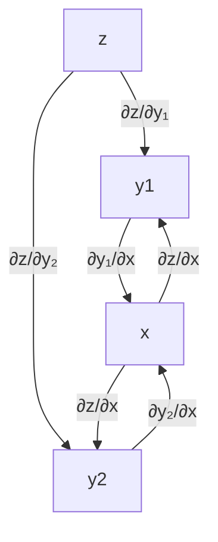
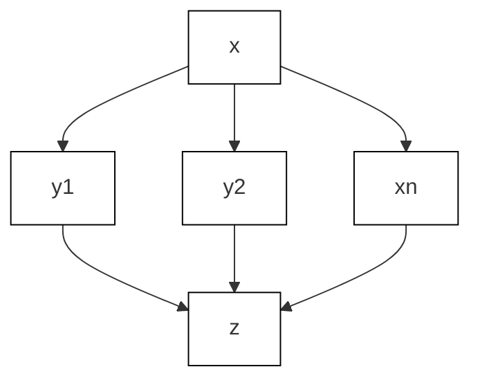
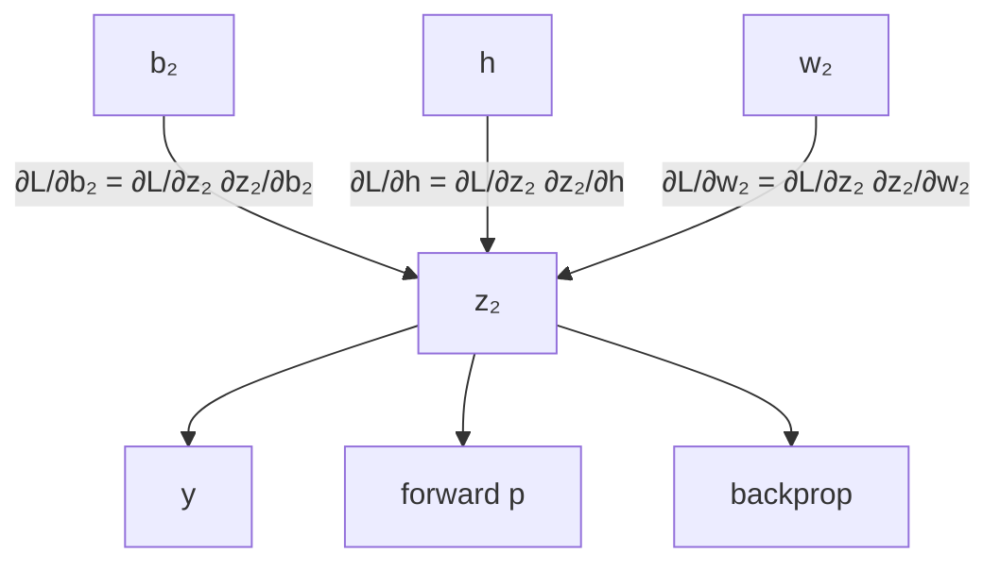
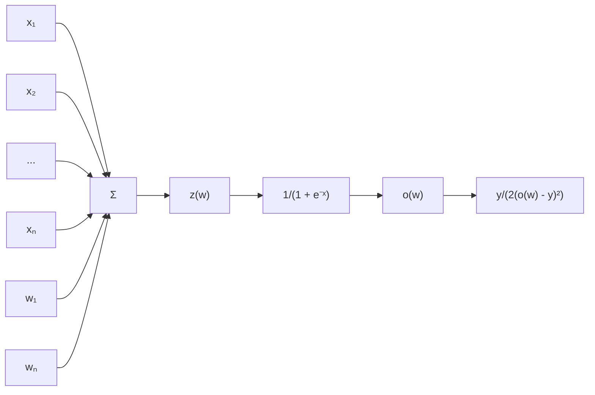
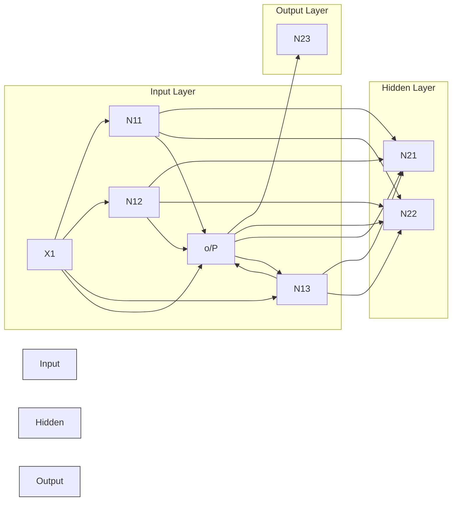
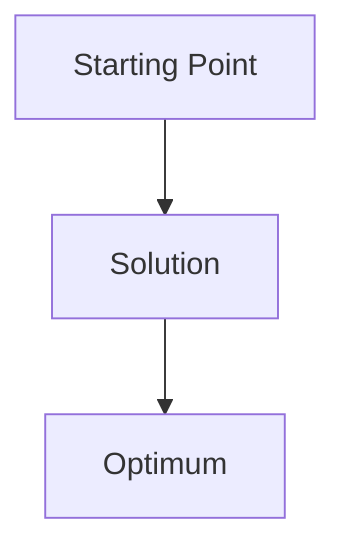
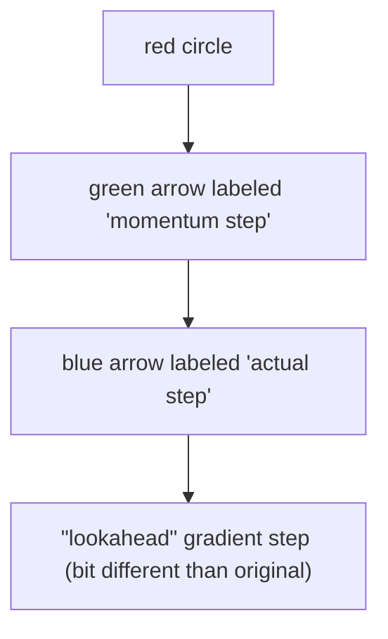

# AMA 564 Deep Learning

# 2026 Spring

# Lecture 3

# Recall the regression problem


<details>
<summary>scatter</summary>

| x       | y     |
| ------- | ----- |
| -1.00   | 0.00  |
| -0.95   | 0.10  |
| -0.90   | 0.05  |
| -0.85   | 0.00  |
| -0.80   | -0.10 |
| -0.75   | -0.20 |
| -0.70   | -0.30 |
| -0.65   | -0.40 |
| -0.60   | -0.50 |
| -0.55   | -0.60 |
| -0.50   | -0.70 |
| -0.45   | -0.80 |
| -0.40   | -0.90 |
| -0.35   | -1.00 |
| -0.30   | -1.10 |
| -0.25   | -1.20 |
| -0.20   | -1.30 |
| -0.15   | -1.40 |
| -0.10   | -1.50 |
| -0.05   | -1.60 |
| 0.00    | -1.70 |
| 0.05    | -1.80 |
| 0.10    | -1.90 |
| 0.15    | -2.00 |
| 0.20    | -2.10 |
| 0.25    | -2.20 |
| 0.30    | -2.30 |
| 0.35    | -2.40 |
| 0.40    | -2.50 |
| 0.45    | -2.60 |
| 0.50    | -2.70 |
| 0.55    | -2.80 |
| 0.60    | -2.90 |
| 0.65    | -3.00 |
| 0.70    | -3.10 |
| 0.75    | -3.20 |
| 0.80    | -3.30 |
| 0.85    | -3.40 |
| 0.90    | -3.50 |
| 0.95    | -3.60 |
| 1.00    | 3.50  |
</details>

Data $( X _ { i } , Y _ { i } ) , i = 1 , \dots , n$   
To find a network

$$
\boldsymbol {f} (\boldsymbol {x}; \boldsymbol {\theta})
$$

such that

$$
\sum \phi (Y _ {i} - f (X _ {i}; \theta))
$$

is minimized over

$$
\mathcal {F} = \{f: f (x; \theta) i s a
$$

???????????? ??????????????

?????????????????????????? ???? $\theta \in \mathbb { R } ^ { s } \}$

How do we solve for ?? ?

1. Initialize $\theta _ { 0 } \in \mathbb { R } ^ { s }$   
2. Calculate the gradient at $\theta _ { t }$ (with different ??) $\phi )$   
3. Move a step $\cdot$   
4. Iterate until stop

Recall the regression problem   


<details>
<summary>bar_line</summary>

| x      | y (red line) | y (blue dots) |
| ------ | ------------ | ------------- |
| -10.0  | 1.2          | 1.0           |
| -7.5   | 0.0          | -0.5          |
| -5.0   | -0.5         | -0.8          |
| -2.5   | 0.4          | 0.5           |
| 0.0    | 0.1          | -0.2          |
| 2.5    | -0.1         | -0.3          |
| 5.0    | 0.3          | 0.6           |
| 7.5    | 0.7          | 0.8           |
| 10.0   | -1.2         | -1.0          |
</details>

How do we solve for ?? ?

1. Initialize $\begin{array} { r l } { \mathbb { R } ^ { s } } & { { } \mathbb { R } ^ { s } } \end{array}$   
2. Calculate the gradient at $\cdot$   
3. Move a step $\alpha _ { t }$   
4. Iterate until stop.

Data $( X _ { i } , Y _ { i } ) , i = 1 , \ldots , n .$   
To find a network

$$
\boldsymbol {f} (\boldsymbol {x}; \boldsymbol {\theta})
$$

such that

$$
\Sigma \big (Y _ {i} - f (X _ {i}; \theta) \big) ^ {2}
$$

is minimized over

?? = {??: ?? ??; ?? ???? ?? ???????????? ?????????????? ?????????????????????????? ???? $\in \mathbb { R } ^ { s } \}$

# The optimization problem

Data $( X _ { i } , Y _ { i } ) , i = 1 , \dots , n$ .   
The empirical risk

$$
R _ {n} (\theta) = R _ {n} \big (f (\cdot , \theta) \big) = \frac {1}{n} \sum \big (Y _ {i} - f (X _ {i}; \theta) \big) ^ {2}.
$$

To minimize $R _ { n } ( \mathbf { \theta } )$ over $\theta \in \mathbb { R } ^ { s }$ .

Initialize $\in \mathbb { R } ^ { s }$ by some randomization

For $t = 1 , \cdots , T$

Calculate $\frac { d R _ { n } ( \pmb { \theta } ) } { d \pmb { \theta } } \vert _ { \pmb { \theta = \theta } _ { t - 1 } }$ ȁ??=????−??

Set stepsize $\mathbf { \Sigma } > \mathbf { 0 }$

Update $\begin{array} { r l r } { { \bf \Pi } } & { { } = } & { - \mathrm { ~  ~ \nabla ~ } \cdot \big [ \frac { d R _ { n } ( \theta ) } { d \theta } \big | _ { \theta = \theta _ { t - 1 } } \big ] } \end{array}$

After T times iterations, we got $\cdot$ such that $R _ { n } ( \theta _ { T } )$ is small.

# Question

How to calculate the gradient

$$
\frac {d}{d \theta} R _ {n} (\theta) = - \frac {2}{n} \sum (Y _ {i} - f (X _ {i}; \theta)) \frac {d}{d \theta} f (X _ {i}; \theta)
$$

especially how to compute $\textstyle { \frac { d } { d \theta } } f ( X _ { i } ; \theta )$ exactly?

# BackPropogation

$$
\frac {d}{d x} [ f (g (x)) ] = \frac {d f}{d g} \times \frac {d g}{d x}
$$

$$
\frac {d}{d x} [ f (g (x)) ] = \frac {d f}{d g} \times \frac {d g}{d x}
$$

The arrow shows functional dependence of $z$ on ??

• i.e. given ??, we can calculate ??.   
• e.g., for example: $z ( y ) = 2 y ^ { 2 }$

The derivative of $z ,$ with respect to $y$ .

. ${ \tt e . g . }$ , for example : ????(??) = 4??. $\frac { \partial z ( y ) } { \partial y } = 4 y$


<details>
<summary>chemical</summary>

Diagram showing two red circles labeled z and y with an upward arrow labeled ∂z/∂y between them
</details>

# Simple chain rule

• If $z$ is a function of $:$ , and ?? is a function of ??   
• Then ?? is a function of ??, as well.   
• Question: how to find $\frac { \partial z } { \partial x }$


<details>
<summary>text_image</summary>

z
y
x
∂z/∂y
∂y/∂x
</details>

$$
{\frac {\partial z}{\partial x}} = {\frac {\partial z}{\partial y}} {\frac {\partial y}{\partial x}}
$$

We will use these facts to derive the details of the Backpropagation algorithm.

Z will be the error (loss) function.

\- We need to know how to differentiate Z

Intermediate nodes use a logistics function (or another differentiable step function).

\- We need to know how to differentiate it.

$$
\mathbf {z} (\boldsymbol {x}) := \mathbf {z} (\mathbf {y} _ {1} (\boldsymbol {x}), \mathbf {y} _ {2} (\boldsymbol {x}))
$$


<details>
<summary>flowchart</summary>


</details>

$$
\frac {\partial z}{\partial x} = \frac {\partial z}{\partial y _ {1}} \frac {\partial y _ {1}}{\partial x} + \frac {\partial z}{\partial y _ {2}} \frac {\partial y _ {2}}{\partial x}
$$

$$
\mathbf {z} (\boldsymbol {x}) := \mathbf {z} (\mathbf {y} _ {1} (\boldsymbol {x}), \mathbf {y} _ {2} (\boldsymbol {x}), \dots , \mathbf {y} _ {n} (\boldsymbol {x}))
$$


<details>
<summary>flowchart</summary>


</details>

$$
{\frac {\partial z}{\partial x}} = \sum_ {i = 1} ^ {n} {\frac {\partial z}{\partial y _ {i}}} {\frac {\partial y _ {i}}{\partial x}}
$$

# Loop over instances:

# 1. The forward steps

• Given the input, make predictions layer-by-layer, starting from the first layer)

# 2. The backward steps

• Calculate the error in the output   
• Update the weights layer-by-layer, starting from the final layer


<details>
<summary>flowchart</summary>

```mermaid
graph TD
    A["Input Layer"] --> B["Hidden Layer 1"]
    A --> C["Hidden Layer 2"]
    A --> D["Hidden Layer 3"]
    B --> E["Output Layer"]
    C --> E
    D --> E
    style A fill:#000,stroke:#000,color:#fff
    style B fill:#000,stroke:#000,color:#fff
    style C fill:#000,stroke:#000,color:#fff
    style D fill:#000,stroke:#000,color:#fff
    note left of A: ∂f/∂θij
    note right of B: h1
    note right of C: h2
    note right of D: h3
    note bottom of A: input
```
</details>


<details>
<summary>flowchart</summary>


</details>

# Backpropogation: An example

Neuron is modeled by a unit connected by weighted links $w _ { i }$ to other units ??.


<details>
<summary>flowchart</summary>


</details>

$$
L (w) = \frac {1}{2} (o (w) - y) ^ {2},
$$

$$
o (w) = \operatorname{sigmoid} (z (w)),
$$

$$
z (w) = w _ {0} + \sum_ {i = 1} ^ {n} w _ {i} x _ {i}.
$$

$$
\frac {\partial L}{\partial w _ {i}} = \frac {d L}{d o (w)} \times \frac {d o (z (w))}{d z (w)} \times \frac {\partial z (w)}{\partial w _ {i}}
$$

$$
{\frac {d L}{d o (w)}} = {\frac {d}{d o (w)}} \left[ {\frac {1}{2}} (o (w) - y) ^ {2} \right] = o (w) - y
$$

$$
{\frac {d o (z (w))}{d z (w)}} = {\frac {d}{d z (w)}} \left[ {\frac {1}{1 + e ^ {- z (w)}}} \right] = {\frac {1}{1 + e ^ {- z (w)}}} \times (1 - {\frac {1}{1 + e ^ {- z (w)}}})
$$

$$
\frac {\partial z (w)}{\partial w _ {i}} = \frac {\partial}{\partial w _ {i}} \left[ w _ {0} + \sum_ {j = 1} ^ {n} w _ {j} x _ {j} \right] = x _ {i}
$$

Note: we denote $x _ { 0 } = 1$ .


<details>
<summary>tree</summary>

| Node | Weight    |
|------|-----------|
| W0   | 0.8622    |
| W1   | 0.5377    |
| x1   | -0.4336   |
| W2   | 0.3188    |
| x2   | 1.8339    |
| W3   | -1.3077   |
| x3   | -2.2588   |
| *    | 0.5846    |
| *    | 2.9539    |
| Σ    | 3.5684    |
| σ    | 0.9726    |
| L    | 0.4730    |
</details>


<details>
<summary>tree</summary>

| Node | Value   |
|------|---------|
| w0   | 0.8622  |
| w1   | 0.0139  |
| x1   | 0.5377  |
| w2   | 0.3188  |
| x2   | 1.8339  |
| w3   | -1.3077 |
| x3   | -2.2588 |
| *    | 0.0259  |
| *    | 0.5846  |
| σ    | 3.5684  |
| σ    | 0.0259  |
| σ    | 0.9726  |
| σ    | 0.9726  |
| σ    | 0.4730  |
</details>

$$
\frac {\partial z (w)}{\partial w _ {i}} = \frac {\partial}{\partial w _ {i}} \left[ w _ {0} + \sum_ {j = 1} ^ {n} w _ {j} x _ {j} \right] = x _ {i}
$$

Neural Network - Backpropagation   


MLK

MAKING AISIMPLE


<details>
<summary>flowchart</summary>


</details>

@ machinelearningknowledge.ai   
Source:https://medium.com/analytics-vidhya/backpropagation-for-dummies-e069410fa585

# Questions

1. How to initialize $\mathbf { \Psi } \in \mathbb { R } ^ { s } \mathbf { \Psi } ?$   
2. How to choose the stepsize $\cdot ?$   
3. What if the sample size ?? is very large?

1. Stochastic Gradient Descent   
2. Momentum Acceleration   
3. AdaGrad   
4 . ADAM

Given data $( X _ { i } , Y _ { i } ) , i = 1 , \dots , n$ . Minimize a loss function over $\theta \in \mathbb { R } ^ { s }$ :

$$
\min _ {\theta \in \mathbb {R} ^ {s}} f (\theta) := \frac {1}{n} \sum_ {i = 1} ^ {n} l (\theta ; X _ {i}, Y _ {i}).
$$


<details>
<summary>natural_image</summary>

3D surface plot with a curved path and contour lines, no text or symbols present
</details>

Start from some $\mathbf { \Xi } \in \mathbb { R } ^ { s }$ , gradient descent (GD) algorithm updates as:

$$
\theta^ {k + 1} = \theta^ {k} - \alpha_ {k} \nabla f (\theta^ {k}),
$$

until

$$
| | \nabla f (\theta^ {k + 1}) | | \leq \varepsilon ,
$$

for some tolerance $\varepsilon > 0 .$

Start from some $\theta ^ { 0 } \in \mathbb { R } ^ { s }$ , gradient descent (GD) algorithm updates as:

$$
\theta^ {k + 1} = \theta^ {k} - \alpha_ {k} \nabla f (\theta^ {k}),
$$

until

$$
| | \nabla f (\theta^ {k + 1}) | | \leq \varepsilon ,
$$

for some tolerance $\varepsilon > 0 .$

# Key points:

1. Compute $\nabla f { \big ( } \theta ^ { k } { \big ) }$ .   
2. Choose step size $\cdot$ satisfying

$$
\boldsymbol {f} \left(\boldsymbol {\theta} ^ {k + 1}\right) <   \boldsymbol {f} \left(\boldsymbol {\theta} ^ {k}\right).
$$

# Assumption 3.1

??(??) is continuously differentiable and ????(??) is Lipschitz continuous:

$$
\left| \left| \nabla \mathbf {f} (\mathbf {x}) - \nabla \mathbf {f} (\mathbf {y}) \right| \right| \leq L \left| \left| x - y \right| \right|
$$

for some L > 0. We call ?? satisfying this property is a L-smooth function.

Lemma 3.1 Given an L-smooth function ??, then for any ??, ?? ∈ ??????(??), we have

$$
f (y) \leq f (x) + \nabla f (x) ^ {T} (y - x) + \frac {L}{2} | | y - x | | ^ {2}.
$$

Consequence: If we choose $\alpha _ { k } = 1 / L$ , then

$$
\begin{array}{l} f (\theta^ {k + 1}) - f (\theta^ {k}) = f \left(\theta^ {k} - \frac {1}{L} \nabla f (\theta^ {k})\right) - f (\theta^ {k}) \\ \leq \nabla f (\theta^ {k}) ^ {T} (- \frac {1}{L} \nabla f (\theta^ {k})) + \frac {L}{2} \| \frac {1}{L} \nabla f (\theta^ {k}) \| ^ {2} \\ \leq - \frac {1}{2 L} \| \nabla f (\theta^ {k}) \| ^ {2}. \\ \end{array}
$$

Question: If we apply Lemma 3.1, what is the optimal fixed step size ?

Theorem 3.1 Let ?? be a L-smooth function and $f ( \theta ) \geq \bar { f } > - \infty$ for any ??. Let $\{ \theta ^ { k } \} _ { k = 0 } ^ { T }$ be the sequence generated by the gradient descent algorithm with step size 1/L, then

$$
\min _ {1 \leq k \leq T} \| \nabla f (\theta^ {k}) \| ^ {2} \leq \frac {2 L (f (\theta^ {0}) - \bar {f})}{T}.
$$

Theorem 3.1 Let ?? be a L-smooth function and $f ( \theta ) \geq \bar { f } > - \infty$ for any ??. Let $\{ \theta ^ { k } \} _ { k = 0 } ^ { T }$ be the sequence generated by the gradient descent algorithm with step size 1/L, then

$$
\min _ {1 \leq k \leq T} \| \nabla f (\theta^ {k}) \| ^ {2} \leq \frac {2 L (f (\theta^ {0}) - \bar {f})}{T}.
$$

We leave the proof as a question in Assignment 1.

# Hint:

Step 1: Apply Lemma 3.1 at step k.

Step 2: Sum them up for ${ \sf k } = 0 , 1 , . . . , { \sf T }$ .

Step 3: Realize that f is bounded from below.

In gradient descent, we need to compute

$$
\nabla f (\theta^ {k}) = \frac {1}{n} \sum_ {i = 1} ^ {n} \nabla_ {\theta} l (\theta^ {k}; X _ {i}, Y _ {i}).
$$

This computation is expensive if n is huge !!!

Question: How to overcome it?

Hint: How to estimate the expectation of a random variable?

Instead of computing the exact gradient, we consider

$$
g (\theta , \xi),
$$

which is a stochastic estimation satisfying

$$
\mathbb {E} _ {\xi} [ g (\theta , \xi) ] = \nabla f (\theta).
$$

Instead of computing the exact gradient, we consider

$$
g (\theta , \xi),
$$

which is a stochastic estimation satisfying

$$
\mathbb {E} _ {\xi} [ g (\theta , \xi) ] = \nabla f (\theta).
$$

Examples:

Noisy gradients: Assume is a random noise satisfying , we consider

$$
g (\theta , \xi) = \nabla f (\theta) + \xi .
$$

Stochastic gradients: Assume is an index uniformly sampling from {1, 2, …, n}, we consider

$$
g (\theta , \xi) = \nabla_ {\theta} l (\theta ; X _ {\xi}, Y _ {\xi}).
$$

Start from some $\mathbf { \Xi } \in \mathbb { R } ^ { s }$ , the SGD algorithm updates iteratively as:

$$
\theta^ {k + 1} = \theta^ {k} - \alpha_ {k} g (\theta^ {k}, \xi_ {k}),
$$

where $g ( \theta ^ { k } , \xi _ { k } )$ is the stochastic gradient computed at $\theta ^ { k }$ .

# Key points:

1. Sampling strategy to compute $g ( \theta ^ { k } , \xi _ { k } )$ .   
2. Choose step size $\alpha _ { k } > 0$ .

A natural question: How to check the quality of the solution?

We measure $\mathbb { E } _ { \xi } { \lVert { \boldsymbol { g } } ( \theta ^ { k } , \xi ) { \lvert { \lvert { \bf \xi } \rvert } \rvert } } =$

# Assumption 3.2 ?? is a convex function and

$$
\begin{array}{l} \mathbb {E} _ {\xi} [ g (\theta , \xi) ] = \nabla f (\theta), \\ \mathbb {E} _ {\xi} [ \| g (\theta , \xi) \| ^ {2} ] \leq B ^ {2}, \forall \theta . \\ \end{array}
$$

where ?? is a given parameters.

Theorem 3.2 Let $\{ \theta ^ { k } \}$ be the sequence generated by SGD with step size $\alpha _ { k } > 0$ , under Assumption 3.2, for any ${ \sf T } > 0$ ,

$$
\mathbb {E} [ f (\overline {{\theta}} ^ {T}) - f ^ {*} ] \leq \frac {| | \theta^ {0} - \theta^ {*} | | ^ {2} + B ^ {2} \sum_ {j = 0} ^ {T} \alpha_ {j} ^ {2}}{2 \sum_ {j = 0} ^ {T} \alpha_ {j}},
$$

where

$$
\lambda_ {k} = \sum_ {j = 0} ^ {k} \alpha_ {j}, \bar {\theta} ^ {k} = \lambda_ {k} ^ {- 1} \sum_ {j = 0} ^ {k} \alpha_ {j} \theta^ {j}.
$$

Proposition 3.1 If we take $\alpha _ { j } = \alpha > 0$ , then

$$
\mathbb {E} [ f (\bar {\theta} ^ {T}) - f ^ {*} ] \leq \frac {\| \theta^ {0} - \theta^ {*} \| ^ {2} + B ^ {2} (T + 1) \alpha^ {2}}{2 (T + 1)}.
$$


<details>
<summary>text_image</summary>

w⁰
fast convergence
to this region.
w*
(solution)
→ ball with radius
</details>

As $\cdot$ , the estimator

$$
\hat {\theta} ^ {T}
$$

will be in a ball with radius

$$
B ^ {2} \alpha^ {2} / 2
$$

Proposition 3.1 If we take $\alpha _ { j } = \alpha > 0$ , then

$$
\mathbb {E} [ f (\bar {\theta} ^ {T}) - f ^ {*} ] \leq \frac {\| \theta^ {0} - \theta^ {*} \| ^ {2} + B ^ {2} (T + 1) \alpha^ {2}}{2 (T + 1)}.
$$

Implication: We need to choose decreasing step size.

For example, choose $\cdot$ , then

$$
\sum_ {t = 0} ^ {\infty} \alpha_ {t} = \sum_ {t = 1} ^ {\infty} \frac {1}{t} = \infty
$$

and

$$
\sum_ {t = 0} ^ {\infty} \alpha_ {t} ^ {2} = \sum_ {t = 1} ^ {\infty} \frac {1}{t ^ {2}} = \frac {\pi^ {2}}{6} <   \infty
$$

# 1. Slow convergence.

SGD without momentum   


<details>
<summary>natural_image</summary>

Diagram of concentric ellipses with a central red dot, no text or symbols present
</details>

SGD with momentum   


<details>
<summary>natural_image</summary>

Diagram of concentric ellipses with a red dot and arrow, no text or symbols present
</details>

# 2. Converge to local optimal solution.


<details>
<summary>text_image</summary>

Local Minimum
Overview Step-by-Step
Gradient Arrows
Adjusted Gradient Arrows
Momentum Arrows
Sum of Gradient Squared
Path
Gradient Descent
Learning Rate: 1e -2
Momentum
Learning Rate: 1e -2
Decay rate: 0.900
Adagrad
Learning Rate: 1e -2
RU/Sprise
Learning Rate: 1e -2
Decay rate: 0.900
Learning Rate: 1e -2
</details>

# 3. Converge to saddle points.

$$
\begin{array}{l} f (x, y) = x ^ {2} - y ^ {2}. \\ \frac {\partial}{\partial x} f (0, 0) = 2 * 0 = 0, \\ \frac {\partial}{\partial y} f (0, 0) = - 2 * 0 = 0. \\ \end{array}
$$


<details>
<summary>surface_3d</summary>

| x    | y    | z    |
| ---- | ---- | ---- |
| -1.0 | 0.0  | 0.0  |
| -0.5 | 0.5  | 0.5  |
| 0.0  | 1.0  | 1.0  |
| 0.5  | 0.5  | 0.5  |
| 1.0  | 0.0  | 0.0  |
| -1.0 | -1.0 | -1.0 |
| -0.5 | -0.5 | -0.5 |
| 0.0  | -1.0 | -1.0 |
| 0.5  | -0.5 | -0.5 |
| 1.0  | 0.0  | 0.0  |
</details>

Start from some $\ u \in \mathbb { R } ^ { s } , v _ { 0 } = g ( \theta ^ { 0 } , \xi _ { 0 } )$ , for $k \geq 0$ :

$$
v ^ {k + 1} = \gamma v ^ {k} + (1 - \gamma) g (\theta^ {k}, \xi_ {k}),
$$

$$
\theta^ {k + 1} = \theta^ {k} - v ^ {k + 1}.
$$


<details>
<summary>text_image</summary>

Local Minimum
Overlaser
Step-by-Step
Gradient Arrows
Adjusted Gradient Arrows
Momentum Arrows
Sum of Gradient Squared
Path
Gradient Descent
Learning Rate: 1e -2
Momentum
Learning Rate: 1e -2
Decay rate: 0.900
Adagrad
Learning Rate: 1e -3
RUSpince
Learning Rate: 1e -3
Decay rate: 0.900
Learning Rate: 1e -3
</details>

?? is usually chosen to be 0.9 in practice.


<details>
<summary>flowchart</summary>


</details>

$\gamma = 0 , 9$


<details>
<summary>flowchart</summary>


</details>

$\cdot$

Reading Material: Why Momentum Real Works?

Momentumupdate   


<details>
<summary>text_image</summary>

momentum
step
actual step
gradient
step
</details>

Nesterovmomentumupdate   


<details>
<summary>flowchart</summary>


</details>

Start from some $\theta ^ { 0 } \in \mathbb { R } ^ { s } , v _ { 0 } = g ( \theta ^ { 0 } , \xi _ { 0 } )$ , for $k \geq 0$ :

$$
\begin{array}{l} \vartheta^ {k} \quad = \theta^ {k} - \beta_ {k} v ^ {k}, \\ v ^ {k + 1} = \beta_ {k} v ^ {k} + \alpha_ {k} g (\vartheta^ {k}, \xi_ {k}), \\ \theta^ {k + 1} = \theta^ {k} - v ^ {k + 1}. \\ \end{array}
$$

An advantage: prevent overshot!

Key idea: Rescale the learning rate of each coordinate by the historical progress.

Start from some $\theta ^ { 0 } \in \mathbb { R } ^ { s } , n _ { g } = 0 , \mathsf { f o r } k \geq 0 { : }$

$$
\begin{array}{l} n _ {g} = n _ {g} + g \left(\theta^ {k}, \xi_ {k}\right). * g \left(\theta^ {k}, \xi_ {k}\right), \\ \theta^ {k + 1} = \theta^ {k} - \alpha_ {k} g (\theta^ {k}, \xi_ {k}). / (n _ {g} + 1 0 ^ {- 8}). \\ \end{array}
$$

Issue: The learning rate (step size) goes to zero quickly.

Key idea: Discount the accumulated norm of the gradients.

Start from some $\theta ^ { 0 } \in \mathbb { R } ^ { s } , n _ { g } = 0 , \mathsf { f o r } k \geq 0 { : }$

$$
{n _ {g}} = {\gamma n _ {g} + (1 - \gamma) g (\theta^ {k}, \xi_ {k}). * g (\theta^ {k}, \xi_ {k}),}
$$

$$
\theta^ {k + 1} = \theta^ {k} - \alpha_ {k} g (\theta^ {k}, \xi_ {k}). / (n _ {g} + 1 0 ^ {- 8}).
$$

Key idea: Consider momentum and adaptive learning rate (secondorder momentum) together.

Require: α: Stepsize

Require: $\beta _ { 1 } , \beta _ { 2 } \in [ 0 , 1 )$ : Exponential decay rates for the moment estimates

Require: f(0): Stochastic objective function with parameters $\theta$

Require: $\theta _ { 0 } i$ : Initial parameter vector

$m _ { 0 } \gets 0$ (Initialize $1 ^ { \mathrm { s t } }$ moment vector)

Uo ← 0 (Initialize $2 ^ { \mathrm { n d } }$ moment vector)

t ← 0 (Initialize timestep)

while $\theta _ { t }$ not converged do

$t \gets t + 1$

$g _ { t } \gets \nabla _ { \theta } f _ { t } ( \theta _ { t - 1 } )$ (Get gradients w.r.t. stochastic objective at timestep t)

$m _ { t } \gets \beta _ { 1 } \cdot m _ { t - 1 } + ( 1 - \beta _ { 1 } ) \cdot g _ { t }$ (Update biased first moment estimate)

$v _ { t }  \beta _ { 2 } \cdot v _ { t - 1 } + ( 1 - \beta _ { 2 } ) \cdot g _ { t } ^ { 2 }$ (Update biased second raw moment estimate)

$\widehat { m } _ { t } \gets m _ { t } / ( 1 - \beta _ { 1 } ^ { t } )$ (Compute bias-corrected first moment estimate)

$\widehat { v } _ { t } \gets v _ { t } / ( 1 - \beta _ { 2 } ^ { t } )$ (Compute bias-corrected second raw moment estimate)

$\theta _ { t }  \theta _ { t - 1 } - \alpha \cdot \widehat { m } _ { t } / ( \sqrt { \widehat { v _ { t } } } + \epsilon )$ (Update parameters)

end while

return $\theta _ { t }$ (Resulting parameters)

Adam: A Method for Stochastic Optimization,

Diederik P. Kingma, Jimmy Ba,

International Conference for Learning Representations, 2015

Google Citation: 130,829

In the original paper of ADAM, the following hyper-parameter settings are recommended:

$$
\alpha = 0. 0 0 1, \quad \beta_ {1} = 0. 9, \qquad \beta_ {2} = 0. 9 9 9, \qquad \epsilon = 1 0 ^ {- 8}.
$$


<details>
<summary>surface_3d</summary>

| Method         | X Range     | Y Range     | Z Range     |
| -------------- | ----------- | ----------- | ----------- |
| Gradient Descent | ~0.0–1.0    | ~-4 to 4    | ~-4 to 4    |
| Momentum       | ~-1.5 to 0.0| ~-4 to 4    | ~-4 to 4    |
| Nesterov       | ~-1.5 to 0.0| ~-4 to 4    | ~-4 to 4    |
| AdaGrad        | ~-1.5 to 0.0| ~-4 to 4    | ~-4 to 4    |
| AdaDelta       | ~-1.5 to 0.0| ~-4 to 4    | ~-4 to 4    |
| RMS Prop       | ~-1.5 to 0.0| ~-4 to 4    | ~-4 to 4    |
| Adam           | ~-1.5 to 0.0| ~-4 to 4    | ~-4 to 4    |
</details>

ADAM is arguably the most popular optimization algorithm in training deep neural networks now. But the convergence analysis contains some mistakes in the original paper. ADAM can be non-convergent !

S. J. Reddi, S. Kale, and S. Kumar.

On the convergence of adam and beyond.

International Conference for Learning Representations, 2018

Best Paper Award !

RMSProp can be convergent for large parameters $( \beta _ { 2 } ) !$

N. Shi, D. Li, M. Hong, and R. Sun.

RMSprop converges with proper hyper-parameter.

International Conference on Learning Representations, 2020.

Not address the issue for ADAM since they set $\cdot$ .

Y. Zhang, C. Chen, N. Shi, R. Sun, Z.-Q. Luo

Adam Can Converge Without Any Modification on Update Rules.

NeurIPS 2022


<details>
<summary>area</summary>

| Region        | β₁ Range | β₂ Range |
| ------------- | -------- | -------- |
| Converge (ours)| 0–1      | 0–1      |
| Diverge (ours)| 0–1      | 0–1      |
</details>

Minibatch: Instead of sampling one random gradient $g ( \theta ^ { k } , \xi _ { k } )$ , we sample p random gradient $\overleftarrow { g ( \theta ^ { k } , \xi _ { k _ { 1 } } ) } , \ldots , g \left( \theta ^ { \bar { k } } , \xi _ { k _ { p } } \right)$ , Update

$$
\theta^ {k + 1} = \theta^ {k} - \alpha_ {k} \frac {1}{p} \sum_ {i = 1} ^ {p} g (\theta^ {k}, \xi_ {k _ {i}}).
$$

Minibatch: Instead of sampling one random gradient $g ( \theta ^ { k } , \xi _ { k } )$ , we sample p random gradient $\overleftarrow { g ( \theta ^ { k } , \xi _ { k _ { 1 } } ) } , \ldots , g \left( \bar { \theta ^ { k } } , \xi _ { k _ { p } } \right)$ , Update

$$
\theta^ {k + 1} = \theta^ {k} - \alpha_ {k} \frac {1}{p} \sum_ {i = 1} ^ {p} g (\theta^ {k}, \xi_ {k _ {i}}).
$$

Epoch: a central concept in training. In each epoch, $\cdot$ SGD updates will be executed. Usually, we select

$$
n _ {E} = \operatorname{ceil} (n / p).
$$

Minibatch: Instead of sampling one random gradient $g ( \theta ^ { k } , \xi _ { k } )$ , we sample p random gradient $\overbar { g ( \theta ^ { k } , \xi _ { k _ { 1 } } ) } , \ldots , g \left( \bar { \theta ^ { k } } , \xi _ { k _ { p } } \right)$ , Update

Epoch: a central concept in training. In each epoch, ${ \pmb n } _ { E }$ SGD updates will be executed. Usually, we select

$$
n _ {E} = c e i l (n / p).
$$

# Dynamic Step Size Adjusting:

(a) Decrease the step size by ratio $0 < \gamma < 1$ every K epochs.   
(b) Epoch Doubling Strategy: Run K epochs with step size ??, then, run 2K epochs with step size $\alpha / 2$ , ……