# AMA 564 Deep Learning

# 2026 Spring

# Lecture 4

# A Short Recap

# Feedforward Neural Networks (Multi-Layer Perceptrons)

• The architecture of a MLP is expressed as a composition of a series of functions

$$
f _ {\theta} (x) = \mathcal {A} _ {L} \circ \sigma \circ \mathcal {A} _ {L - 1} \circ \sigma \circ \dots \circ \sigma \circ \mathcal {A} _ {1} (x), x \in \mathbb {R} ^ {d _ {0}}
$$

where

$$
\mathcal {A} _ {i} (x) = W _ {i} x + b _ {i}, \qquad x \in \mathbb {R} ^ {d _ {i - 1}}
$$

is the i-th linear transformation with

weight matrix $W _ { i } \in \mathbb { R } ^ { d _ { i } \times d _ { i - 1 } }$ and bias vector $b _ { i } \in \mathbb { R } ^ { d _ { i } }$ ,

and $\cdot$ is the activation function,

$\begin{array}{c} \mathsf { e . g . } , \qquad & { } \end{array}$

# Biological Neurons

# Neurons in a neural network:


<details>
<summary>natural_image</summary>

Illustration of a neuron with branching dendrites against a blue background (no text or symbols)
</details>

Complex connectivity


<details>
<summary>flowchart</summary>

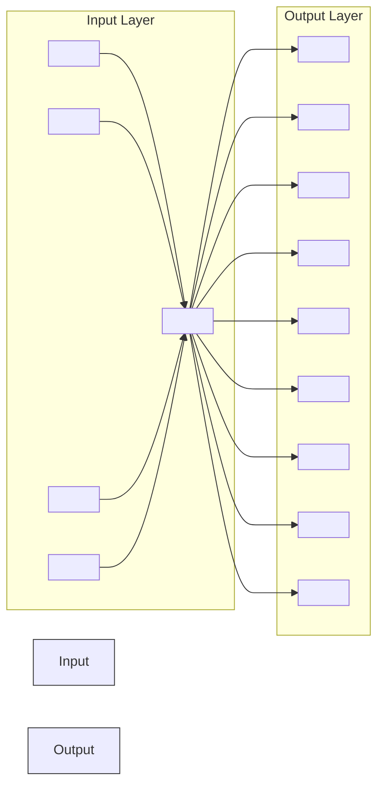
</details>

hidden layer 1 hidden layer 2

Layer structure

Fully connected

Computational efficient

Universality of Neural Networks   


<details>
<summary>line</summary>

| x      | actual | pred |
| ------ | ------ | ---- |
| -1.00  | -0.3   | 0.1  |
| -0.75  | -0.8   | 0.2  |
| -0.50  | -0.2   | 0.1  |
| -0.25  | 0.6    | 0.1  |
| 0.00   | 1.0    | 0.3  |
| 0.25   | 0.6    | 0.1  |
| 0.50   | -0.2   | 0.2  |
| 0.75   | -0.5   | 0.1  |
| 1.00   | -0.3   | 0.1  |
</details>

Neural networks can approximate regression functions very well.

# Universality of Neural Networks


<details>
<summary>scatter</summary>

| x    | y    | Class   |
| ---- | ---- | ------- |
| -10  | -10  | Class 1 |
| -5   | -5   | Class 1 |
| 0    | 0    | Class 1 |
| 5    | 5    | Class 1 |
| 10   | 10   | Class 1 |
| -10  | 5    | Class 2 |
| -5   | 10   | Class 2 |
| 0    | 5    | Class 2 |
| 5    | 10   | Class 2 |
| 10   | 5    | Class 2 |
</details>


<details>
<summary>area</summary>

| Region   | Value |
| -------- | ----- |
| Class 1  | -3.0  |
| Class 1  | -2.0  |
| Class 1  | -1.0  |
| Class 1  | 0.0   |
| Class 1  | 1.0   |
| Class 1  | 2.0   |
| Class 1  | 3.0   |
| Class 1  | 4.0   |
| Class 1  | 5.0   |
| Class 2  | -3.0  |
| Class 2  | -2.0  |
| Class 2  | -1.0  |
| Class 2  | 0.0   |
| Class 2  | 1.0   |
| Class 2  | 2.0   |
| Class 2  | 3.0   |
| Class 2  | 4.0   |
| Class 2  | 5.0   |
</details>


<details>
<summary>area</summary>

| x    | Class 1 | Class 2 |
| ---- | ------- | ------- |
| -10  | -5      | -5      |
| -8   | 7       | -5      |
| -6   | -5      | -5      |
| -4   | 2       | -5      |
| -2   | 0       | -5      |
| 0    | 0       | -5      |
| 2    | 2       | -5      |
| 4    | -5      | -5      |
| 6    | 7       | -5      |
| 8    | -5      | -5      |
</details>


<details>
<summary>flowchart</summary>

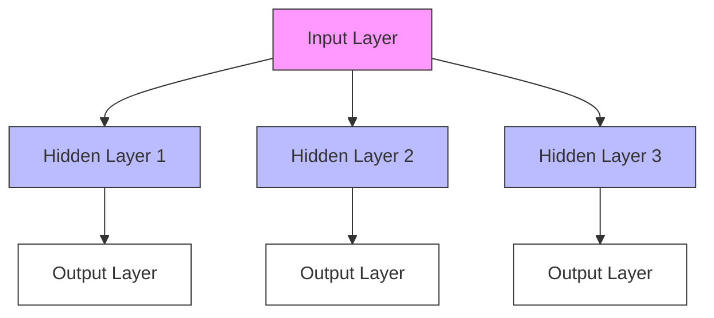
</details>


<details>
<summary>flowchart</summary>

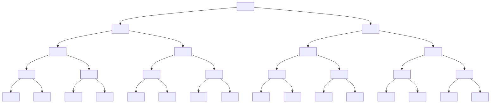
</details>


<details>
<summary>flowchart</summary>

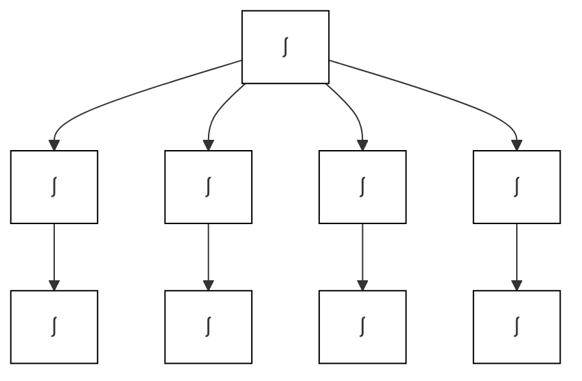
</details>

Neural networks can also approximate classification regions very well.

Recall the regression problem   


<details>
<summary>bar_line</summary>

| x      | y (red line) | y (blue dots) |
| ------ | ------------ | ------------- |
| -10.0  | 1.2          | 0.9           |
| -7.5   | 0.0          | -0.4          |
| -5.0   | -0.6         | -0.8          |
| -2.5   | 0.4          | 0.5           |
| 0.0    | 0.0          | -0.1          |
| 2.5    | -0.2         | -0.3          |
| 5.0    | 0.1          | 0.4           |
| 7.5    | 0.7          | 0.6           |
| 10.0   | -1.2         | -1.1          |
</details>

How do we solve for ?? ?

1. Initialize $\begin{array} { r l } { \mathbb { R } ^ { s } } & { { } \mathbb { R } ^ { s } } \end{array}$   
2. Calculate the gradient at $\theta _ { t }$   
3. Move a step $\alpha _ { t }$   
4. Iterate until stop.

Data $( X _ { i } , Y _ { i } ) , i = 1 , \ldots , n .$   
To find a network

$$
\boldsymbol {f} (\boldsymbol {x}; \boldsymbol {\theta})
$$

such that

$$
\Sigma \big (Y _ {i} - f (X _ {i}; \theta) \big) ^ {2}
$$

is minimized over

?? = {??: ?? ??; ?? ???? ?? ???????????? ?????????????? ?????????????????????????? ???? $\in \mathbb { R } ^ { s } \}$

# Recall the regression problem


<details>
<summary>scatter</summary>

| x       | y     |
| ------- | ----- |
| -1.00   | 0.00  |
| -0.95   | 0.10  |
| -0.90   | 0.05  |
| -0.85   | 0.00  |
| -0.80   | -0.10 |
| -0.75   | -0.20 |
| -0.70   | -0.30 |
| -0.65   | -0.40 |
| -0.60   | -0.50 |
| -0.55   | -0.60 |
| -0.50   | -0.70 |
| -0.45   | -0.80 |
| -0.40   | -0.90 |
| -0.35   | -1.00 |
| -0.30   | -1.10 |
| -0.25   | -1.20 |
| -0.20   | -1.30 |
| -0.15   | -1.40 |
| -0.10   | -1.50 |
| -0.05   | -1.60 |
| 0.00    | -1.70 |
| 0.05    | -1.80 |
| 0.10    | -1.90 |
| 0.15    | -2.00 |
| 0.20    | -2.10 |
| 0.25    | -2.20 |
| 0.30    | -2.30 |
| 0.35    | -2.40 |
| 0.40    | -2.50 |
| 0.45    | -2.60 |
| 0.50    | -2.70 |
| 0.55    | -2.80 |
| 0.60    | -2.90 |
| 0.65    | -3.00 |
| 0.70    | -3.10 |
| 0.75    | -3.20 |
| 0.80    | -3.30 |
| 0.85    | -3.40 |
| 0.90    | -3.50 |
| 0.95    | -3.60 |
| 1.00    | 3.50  |
</details>

Data $( X _ { i } , Y _ { i } ) , i = 1 , \dots , n$   
To find a network

$$
\boldsymbol {f} (\boldsymbol {x}; \boldsymbol {\theta})
$$

such that

$$
\sum \phi (Y _ {i} - f (X _ {i}; \theta))
$$

is minimized over

$$
\mathcal {F} = \{f: f (x; \theta) i s a
$$

???????????? ??????????????

$$
\text { parameterized   by } \theta \in \mathbb {R} ^ {s} \}
$$

How do we solve for ?? ?

1. Initialize $\begin{array} { r l } { \mathbb { R } ^ { s } } & { { } \mathbb { R } ^ { s } } \end{array}$   
2. Calculate the gradient at $\theta _ { t }$ (with different ??) $\phi )$   
3. Move a step $\cdot$   
4. Iterate until stop


<details>
<summary>tree</summary>

| Node | Weight    |
|------|-----------|
| w0   | 0.8622    |
| w1   | 0.5377    |
| x1   | -0.4336   |
| w2   | 0.3188    |
| x2   | 1.8339    |
| w3   | -1.3077   |
| x3   | -2.2588   |
| *    | 0.5846    |
| *    | 2.9539    |
| Σ    | 3.5684    |
| σ    | 0.9726    |
| L    | 0.4730    |
</details>


1. An Introduction to Computer Vision Problem   
2. DNN for Image Classification Problems   
3. Convolution   
4. Convolutional Neural Network   
5. Pooling

# Computer Vision Problems


# Object Detection = What,and Where


<details>
<summary>other</summary>

| Location | Value |
| --- | --- |
| car | 1.000 |
| dog | 0.997 |
| horse | 0.993 |
| person | 0.992 |
| person | 0.979 |
</details>

# Computer Vision Task: Object Segmentation


<details>
<summary>natural_image</summary>

Two people observing sheep in a grassy field with wooden fence and netting (no visible text or symbols)
</details>


<details>
<summary>text_image</summary>

dog
sheep
sheep
sheep
person
person
</details>


<details>
<summary>natural_image</summary>

Vintage steam locomotive with smoke plumes at a train station platform (no visible text or symbols)
</details>


<details>
<summary>text_image</summary>

person
train
person photo
</details>


<details>
<summary>text_image</summary>

WOW
HOSTED BY HEAD WIL
</details>


<details>
<summary>text_image</summary>

WOW
person
person
person
person
person
person
person
person
person
person
person
person
person
person
person
person
person
person
person
person
person
person
person
person
person
person
person
person
person
person
person
person
person
person
person
person
person
person
person
person
person
person
person
person
person
person
person
person
person
person
tennis racket
tennis racket
</details>


<details>
<summary>natural_image</summary>

Soccer match in progress on a grass field, players in orange and gray uniforms competing for the ball (no visible text or symbols)
</details>


<details>
<summary>text_image</summary>

person
person
person
sports ball
</details>


<details>
<summary>natural_image</summary>

Baseball player in action hitting a ball during a match, wearing jersey number 22 and helmet (no visible text or symbols)
</details>


<details>
<summary>text_image</summary>

sports ball
baseball bat
person
person
</details>


<details>
<summary>natural_image</summary>

Exterior view of a historic stone tower with clock face and arched windows under a blue sky (no signage or text visible)
</details>


<details>
<summary>text_image</summary>

clock
clock
</details>


<details>
<summary>natural_image</summary>

Assorted donuts including pastries, chocolate chips, and various dusted pastries arranged in a grid (no text or labels visible)
</details>


<details>
<summary>text_image</summary>

donut
donut
donut
donut
donut
donut
donut
donut
donut
donut
</details>

# Computer Vision Task: Art Style Transformation

A   


<details>
<summary>natural_image</summary>

Scenic view of a European riverside town with colorful buildings along a riverbank under a clear blue sky (no visible text or signage)
</details>

B   


<details>
<summary>natural_image</summary>

Painting of a European town at night with colorful buildings and trees (no text or symbols)
</details>


<details>
<summary>natural_image</summary>

Dramatic painting of a ship navigating rough seas with smoke and clouds (no text or symbols)
</details>


<details>
<summary>natural_image</summary>

Close-up of a textured, greenish surface with no visible text or symbols
</details>

C   


<details>
<summary>natural_image</summary>

Painting of a European night scene with a starry sky and colorful buildings (no text or symbols)
</details>

D   


<details>
<summary>natural_image</summary>

Painting of a European town at sunset with colorful buildings and a prominent church tower (no text or symbols)
</details>


<details>
<summary>natural_image</summary>

Painting of Van Gogh's Starry Night at dusk with a tall tree and distant hills (no text or symbols)
</details>


<details>
<summary>natural_image</summary>

Abstract painting of a dark tree with flowing blue and yellow brushstrokes, no text or symbols present
</details>


<details>
<summary>natural_image</summary>

Painting of a figure standing on a wooden bridge under a dramatic sky with orange and blue hues (no text or symbols)
</details>


<details>
<summary>natural_image</summary>

Abstract textured painting with layered brushstrokes in shades of brown and black (no text or symbols)
</details>

# Computer Vision Task: Image Captioning


<details>
<summary>natural_image</summary>

Man playing guitar outdoors, wearing a T-shirt with 'HAPPY LIME STONES' and 'FUS TOUR' text (no visible signage or symbols on instrument)
</details>

"man inblack shirtisplaying guitar.


<details>
<summary>natural_image</summary>

Worker in safety gear operating machinery near a green fence (no visible text or symbols)
</details>

"construction worker in orange safety vest isworking on road."


<details>
<summary>natural_image</summary>

A baby and adult sitting on a red carpet with colorful LEGO blocks, no visible text or symbols.
</details>

"two young girlsare playing with legotoy"


<details>
<summary>natural_image</summary>

Person performing a mid-air acrobatic kick over a lake, with trees and distant buildings in the background (no visible text or symbols)
</details>

"boyisdoing backflipon wakeboard."


<details>
<summary>natural_image</summary>

Child in pink dress jumping on grass with green trees and flowers in background (no text or symbols)
</details>

"girl inpink dress is jumping in


<details>
<summary>natural_image</summary>

Black and white dog jumping over a blue and white hurdle in an outdoor arena (no text or symbols visible)
</details>

"blackand white dog jumpsover


<details>
<summary>natural_image</summary>

A young girl climbing a blue playground tube outdoors, surrounded by trees (no visible text or symbols)
</details>

"young girlinpink shirtis swinging on swing."


<details>
<summary>natural_image</summary>

Swider in blue suit and red vest wading on water, no visible text or symbols
</details>

"man in blue wetsuit is surfing on wave.

# Computer Vision Task: Visual Question Answering


<details>
<summary>text_image</summary>

7'0
</details>

What colorare hereyes? What is themustachemade of?


<details>
<summary>natural_image</summary>

Close-up of a large pizza with visible toppings including cheese, tomatoes, and sauce on a wooden surface (no text or symbols)
</details>

Howmany slices of pizzaare there? lsthisavegetarianpizza？


<details>
<summary>natural_image</summary>

Illustration of a person sitting on a checkered picnic table outdoors under a sunny sky, with other activities including football, baseball, and tennis visible (no text or symbols)
</details>

Isthisperson expecting company? What is just under the tree?


<details>
<summary>natural_image</summary>

Man in white shirt and glasses holding a green fruit outdoors near a wooden path and trees (no visible text or symbols)
</details>

Doesitappeartoberainy? Doesthisperson have20/20vision?

# Computer Vision Task: Image Generation


# IMGENET Large Scale Visual Recognition Challenge

The Image Classification Challenge: 1,000 object classes 1,431,167 images


<details>
<summary>natural_image</summary>

Child playing a large gong with wooden sticks, surrounded by a drum and wooden barrel (no visible text or symbols)
</details>

# Output:

Scale

T-shirt

Steel drum

Drumstick

Mud turtle


# Output:

Scale

T-shirt

Giant panda

Drumstick

Mud turtle


Russakovsky et al. arXiv, 2014


<details>
<summary>natural_image</summary>

Portrait of a smiling woman with shoulder-length brown hair wearing a patterned scarf (no text visible)
</details>

Feifei Li

# DNN for Image Classification Problem


<details>
<summary>flowchart</summary>

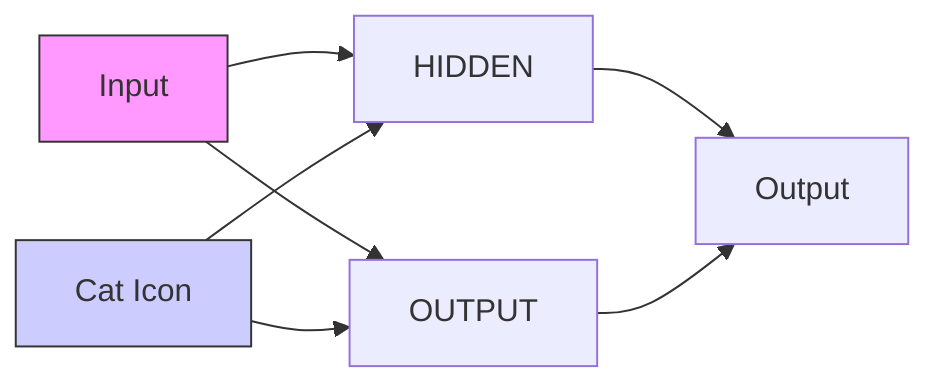
</details>

# Deep Neural Networks (Multi-Layer Perceptrons)

• The architecture of a MLP is expressed as a composition of a series of functions

$$
f _ {\theta} (x) = \mathcal {A} _ {L} \circ \sigma \circ \mathcal {A} _ {L - 1} \circ \sigma \circ \dots \circ \sigma \circ \mathcal {A} _ {1} (x), x \in \mathbb {R} ^ {d _ {0}}
$$

where

$$
\mathcal {A} _ {i} (x) = W _ {i} x + b _ {i}, \qquad x \in \mathbb {R} ^ {d _ {i - 1}}
$$

is the i-th linear transformation with

weight matrix $W _ { i } \in \mathbb { R } ^ { d _ { i } \times d _ { i - 1 } }$ and bias vector $b _ { i } \in \mathbb { R } ^ { d _ { i } }$ ,

and $\cdot$ is the activation function,

$\mathsf { e . g . } , \mathsf { R e L U } \sigma ( x ) = \operatorname* { m a x } \{ x , 0 \} . \mathsf { S i g m o i d } \sigma ( x ) = ( 1 + e ^ { - x } ) ^ { - 1 } .$


<details>
<summary>natural_image</summary>

A smiling corgi dog standing outdoors on a paved path, with green foliage in the background (no text or symbols visible)
</details>

columr   


<details>
<summary>heatmap</summary>

| row | 0 | 1 | 2 |
|---|---|---|---|
| 0 | .392 | .482 | .576 |
| 1 | .478 | .63 | |
| 2 | .580 | .79 | |
| 0 | .169 | .263 | .376 |
| 1 | .263 | .44 | |
| 2 | .373 | .60 | |
| 0 | .306 | .376 | .451 |
| 1 | .376 | .478 | .561 |
| 2 | .443 | .569 | .674 |
</details>


<details>
<summary>text_image</summary>

m
3
n
1
1
3*m*n
</details>


<details>
<summary>flowchart</summary>

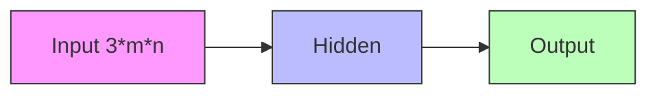
</details>

<table><tr><td>airplane</td><td></td><td></td><td></td><td></td><td></td><td></td><td></td><td></td><td></td></tr><tr><td>automobile</td><td></td><td></td><td></td><td></td><td></td><td></td><td></td><td></td><td></td></tr><tr><td>bird</td><td></td><td></td><td></td><td></td><td></td><td></td><td></td><td></td><td></td></tr><tr><td>cat</td><td></td><td></td><td></td><td></td><td></td><td></td><td></td><td></td><td></td></tr><tr><td>deer</td><td></td><td></td><td></td><td></td><td></td><td></td><td></td><td></td><td></td></tr><tr><td>dog</td><td></td><td></td><td></td><td></td><td></td><td></td><td></td><td></td><td></td></tr><tr><td>frog</td><td></td><td></td><td></td><td></td><td></td><td></td><td></td><td></td><td></td></tr><tr><td>horse</td><td></td><td></td><td></td><td></td><td></td><td></td><td></td><td></td><td></td></tr><tr><td>ship</td><td></td><td></td><td></td><td></td><td></td><td></td><td></td><td></td><td></td></tr><tr><td>truck</td><td></td><td></td><td></td><td></td><td></td><td></td><td></td><td></td><td></td></tr></table>

Training Profile (SGD with Momentum)   


<details>
<summary>line</summary>

| Epochs | training loss | test loss |
| ------ | ------------- | --------- |
| 0      | 1.8           | 1.6       |
| 20     | 0.9           | 1.35      |
| 40     | 0.4           | 1.7       |
| 60     | 0.2           | 2.0       |
| 80     | 0.1           | 2.3       |
| 100    | 0.05          | 2.45      |
</details>

Training Profile (SGD with Momentum)   


<details>
<summary>line</summary>

| Epochs | Test Accuracy |
| ------ | ------------- |
| 0      | 0.44          |
| 10     | 0.53          |
| 20     | 0.55          |
| 30     | 0.54          |
| 40     | 0.54          |
| 50     | 0.53          |
| 60     | 0.53          |
| 70     | 0.54          |
| 80     | 0.54          |
| 90     | 0.54          |
| 100    | 0.54          |
</details>

Overfitting!!!

Training Profile (SGD with Momentum)   


<details>
<summary>line</summary>

| Epochs | training loss | test loss |
| ------ | ------------- | --------- |
| 0      | 1.8           | 1.6       |
| 20     | 0.9           | 1.35      |
| 40     | 0.4           | 1.7       |
| 60     | 0.2           | 2.0       |
| 80     | 0.1           | 2.3       |
| 100    | 0.05          | 2.45      |
</details>

Training Profile (SGD with Momentum)   


<details>
<summary>line</summary>

| Epochs | Test Accuracy |
| ------ | ------------- |
| 0      | 0.44          |
| 10     | 0.53          |
| 20     | 0.55          |
| 30     | 0.54          |
| 40     | 0.54          |
| 50     | 0.53          |
| 60     | 0.53          |
| 70     | 0.54          |
| 80     | 0.54          |
| 90     | 0.54          |
| 100    | 0.54          |
</details>

# Convolution


<details>
<summary>text_image</summary>

Center element of the kernel is placed over the source pixel. The source pixel is then replaced with a weighted sum of itself and nearby pixels.
(4 x 0)
(0 x 0)
(0 x 0)
(0 x 0)
(0 x 1)
(0 x 1)
(0 x 0)
(0 x 1)
+ (-4 x 2)
-8
Source pixel
Convolution kernel
(emboss)
New pixel value (destination pixel)
</details>

Key Advantage: Contain Spatial Information.


<details>
<summary>natural_image</summary>

Close-up of mechanical components including a metallic valve and tubing assembly (no visible text or symbols)
</details>


<details>
<summary>natural_image</summary>

Black-and-white illustration of a spacecraft in flight, showing its cockpit, armaments, and surrounding terrain (no text or symbols)
</details>

Sobel operator:

$$
\mathbf {G} _ {x} = \left[ \begin{array}{l l l} + 1 & 0 & - 1 \\ + 2 & 0 & - 2 \\ + 1 & 0 & - 1 \end{array} \right] * \mathbf {A} \quad \text {and} \quad \mathbf {G} _ {y} = \left[ \begin{array}{l l l} + 1 & + 2 & + 1 \\ 0 & 0 & 0 \\ - 1 & - 2 & - 1 \end{array} \right] * \mathbf {A}
$$

32x32x3 image   


<details>
<summary>text_image</summary>

32 height
32 width
3 depth
</details>


<details>
<summary>text_image</summary>

32x32x3 image
32 height
32
width
3
depth
Filters always extend the full
depth of the input volume
5x5x3 filter
Convolve the filter with the in
i.e. "slide over the image spa
</details>

mage tially, computing dot products”


<details>
<summary>text_image</summary>

32x32x3 image
5x5x3 filter w
32
32
1 number:
the result of
filter and a
(i.e. 5*5*3 =
</details>

#

of taking a dot product between the small 5x5x3 chunk of the image = 75-dimensional dot product + bias)

$$
\boldsymbol {w} ^ {T} \boldsymbol {x} + \boldsymbol {b}
$$


<details>
<summary>flowchart</summary>

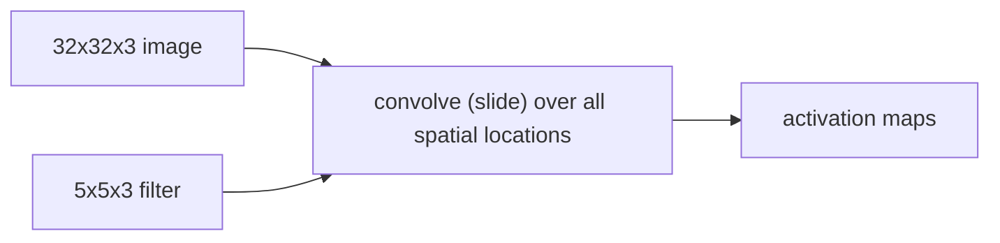
</details>


<details>
<summary>natural_image</summary>

3D geometric diagram showing two stacked blue squares with a top panel, connected by lines to form a grid structure (no text or symbols)
</details>

Output

Filter

Input

Padding


<details>
<summary>text_image</summary>

32x32x3 image
2 5x5x3 filters
convolve (slide) over all spatial
locations
32
32
3
</details>

activation maps


<details>
<summary>natural_image</summary>

3D diagram of two stacked panels with red numbers 2 and 28, no text or symbols present
</details>


<details>
<summary>text_image</summary>

3
32
32
</details>

1 number: Convolution Layers   
activation maps   


<details>
<summary>text_image</summary>

28
28
6
</details>

Stack these up to get a new “image” of size 28x28x6!

7


<details>
<summary>text_image</summary>

Grid pattern with alternating pink and white cells, likely representing a binary or data matrix
</details>

7

7x7 input (spatially) assume 3x3 filter


<details>
<summary>text_image</summary>

7
7
</details>

7x7 input (spatially) assume 3x3 filter


<details>
<summary>text_image</summary>

7
7
</details>

7x7 input (spatially) assume 3x3 filter


<details>
<summary>text_image</summary>

7
7
</details>

7x7 input (spatially) assume 3x3 filter

7

<table><tr><td></td><td></td><td></td><td></td><td></td><td></td><td></td></tr><tr><td></td><td></td><td></td><td></td><td></td><td></td><td></td></tr><tr><td></td><td></td><td></td><td></td><td></td><td></td><td></td></tr><tr><td></td><td></td><td></td><td></td><td></td><td></td><td></td></tr><tr><td></td><td></td><td></td><td></td><td></td><td></td><td></td></tr><tr><td></td><td></td><td></td><td></td><td></td><td></td><td></td></tr><tr><td></td><td></td><td></td><td></td><td></td><td></td><td></td></tr></table>

7

7x7 input (spatially) assume 3x3 filter

7


<details>
<summary>text_image</summary>

Grid pattern with alternating pink and white squares, likely a puzzle or grid layout
</details>

7

7x7 input (spatially)

assume 3x3 filter

=> 5 x 5 Output

7


<details>
<summary>text_image</summary>

Grid pattern with alternating pink and white cells, likely a puzzle or grid layout
</details>

7

7x7 input (spatially) assume 3x3 filter applied with stride 2

7


<details>
<summary>natural_image</summary>

Grid pattern with a central pink square filled with black lines, no text or symbols present
</details>

7

7x7 input (spatially) assume 3x3 filter applied with stride 2

7

<table><tr><td></td><td></td><td></td><td></td><td></td><td></td><td></td></tr><tr><td></td><td></td><td></td><td></td><td></td><td></td><td></td></tr><tr><td></td><td></td><td></td><td></td><td></td><td></td><td></td></tr><tr><td></td><td></td><td></td><td></td><td></td><td></td><td></td></tr><tr><td></td><td></td><td></td><td></td><td></td><td></td><td></td></tr><tr><td></td><td></td><td></td><td></td><td></td><td></td><td></td></tr><tr><td></td><td></td><td></td><td></td><td></td><td></td><td></td></tr></table>

7

7x7 input (spatially) assume 3x3 filter applied with stride 2

=> 3 x 3 Output

7


<details>
<summary>text_image</summary>

Grid pattern with alternating pink and white cells, likely a puzzle or grid layout
</details>

7

7x7 input (spatially)

assume 3x3 filter

applied with stride 3 ?


<details>
<summary>heatmap</summary>

| Row | Col 1 | Col 2 | Col 3 |
|-----|-------|-------|-------|
| 1   | 7     |       |       |
| 2   |       |       |       |
| 3   |       |       |       |
| 4   |       |       |       |
| 5   |       |       |       |
| 6   |       |       |       |
| 7   |       |       |       |
</details>

7x7 input (spatially) assume 3x3 filter applied with stride 3 ?

# doesn’t fit!

cannot apply 3x3 filter on 7x7 input with stride 3.

N


<details>
<summary>text_image</summary>

Grid with red letter 'F' in the first cell, likely indicating a mathematical or logical pattern.
</details>

Output size:

(N - F) / stride + 1

N

e.g. N = 7, F = 3:

stride 1 => (7 - 3)/1 + 1 = 5

stride 2 => (7 - 3)/2 + 1 = 3

stride 3 => (7 - 3)/3 + 1 = 2.33

Padding: Pad zeros on the boundary.

<table><tr><td>0</td><td>0</td><td>0</td><td>0</td><td>0</td><td>0</td><td>0</td><td>0</td><td>0</td></tr><tr><td>0</td><td></td><td></td><td></td><td></td><td></td><td></td><td></td><td>0</td></tr><tr><td>0</td><td></td><td></td><td></td><td></td><td></td><td></td><td></td><td>0</td></tr><tr><td>0</td><td></td><td></td><td></td><td></td><td></td><td></td><td></td><td>0</td></tr><tr><td>0</td><td></td><td></td><td></td><td></td><td></td><td></td><td></td><td>0</td></tr><tr><td>0</td><td></td><td></td><td></td><td></td><td></td><td></td><td></td><td>0</td></tr><tr><td>0</td><td></td><td></td><td></td><td></td><td></td><td></td><td></td><td>0</td></tr><tr><td>0</td><td></td><td></td><td></td><td></td><td></td><td></td><td></td><td>0</td></tr><tr><td>0</td><td></td><td></td><td></td><td></td><td></td><td></td><td></td><td>0</td></tr><tr><td>0</td><td>0</td><td>0</td><td>0</td><td>0</td><td>0</td><td>0</td><td>0</td><td>0</td></tr></table>

e.g. input 7x7

3x3 filter, applied with stride 1

pad with 1 pixel border => what is the output?

Padding: Pad zeros on the boundary.

<table><tr><td>0</td><td>0</td><td>0</td><td>0</td><td>0</td><td>0</td><td>0</td><td>0</td><td>0</td></tr><tr><td>0</td><td></td><td></td><td></td><td></td><td></td><td></td><td></td><td>0</td></tr><tr><td>0</td><td></td><td></td><td></td><td></td><td></td><td></td><td></td><td>0</td></tr><tr><td>0</td><td></td><td></td><td></td><td></td><td></td><td></td><td></td><td>0</td></tr><tr><td>0</td><td></td><td></td><td></td><td></td><td></td><td></td><td></td><td>0</td></tr><tr><td>0</td><td></td><td></td><td></td><td></td><td></td><td></td><td></td><td>0</td></tr><tr><td>0</td><td></td><td></td><td></td><td></td><td></td><td></td><td></td><td>0</td></tr><tr><td>0</td><td></td><td></td><td></td><td></td><td></td><td></td><td></td><td>0</td></tr><tr><td>0</td><td></td><td></td><td></td><td></td><td></td><td></td><td></td><td>0</td></tr><tr><td>0</td><td>0</td><td>0</td><td>0</td><td>0</td><td>0</td><td>0</td><td>0</td><td>0</td></tr></table>

e.g. input 7x7

3x3 filter, applied with stride 1

pad with 1 pixel border => what is the output?

7 x 7 Output !

Recall:

(N - F) / stride + 1

# Padding: Pad zeros on the boundary.

<table><tr><td>0</td><td>0</td><td>0</td><td>0</td><td>0</td><td>0</td><td>0</td><td>0</td><td>0</td></tr><tr><td>0</td><td></td><td></td><td></td><td></td><td></td><td></td><td></td><td>0</td></tr><tr><td>0</td><td></td><td></td><td></td><td></td><td></td><td></td><td></td><td>0</td></tr><tr><td>0</td><td></td><td></td><td></td><td></td><td></td><td></td><td></td><td>0</td></tr><tr><td>0</td><td></td><td></td><td></td><td></td><td></td><td></td><td></td><td>0</td></tr><tr><td>0</td><td></td><td></td><td></td><td></td><td></td><td></td><td></td><td>0</td></tr><tr><td>0</td><td></td><td></td><td></td><td></td><td></td><td></td><td></td><td>0</td></tr><tr><td>0</td><td></td><td></td><td></td><td></td><td></td><td></td><td></td><td>0</td></tr><tr><td>0</td><td></td><td></td><td></td><td></td><td></td><td></td><td></td><td>0</td></tr><tr><td>0</td><td>0</td><td>0</td><td>0</td><td>0</td><td>0</td><td>0</td><td>0</td><td>0</td></tr></table>

In general, common to see CONV layers with stride 1, filters of size FxF, and zero-padding with (F-1)/2. (will preserve size spatially)

e.g. F = 3 => zero pad with 1

$$
F = 5 \Rightarrow \text { zero   pad   with } 2
$$

$$
F = 7 \Rightarrow \text { zero   pad   with } 3
$$


<details>
<summary>text_image</summary>

Input size:
8
Kernel size:
2
Padding:
0
Dilation:
1
Stride:
1
</details>


<details>
<summary>text_image</summary>

Input (8 × 8):
</details>

https://ezyang.github.io/convolution-visualizer/

  
Source: https://towardsdatascience.com/visualizing-the-fundamentals-of-convolutional-neural-networks-6021e5b07f69

Convolution of an image 17x17 with an edge detector kernel 3x3.

Input   


<details>
<summary>natural_image</summary>

Yellow U.S. Navy biplane in flight against a clear blue sky (no visible text or symbols)
</details>

Result   
Kernel   


<details>
<summary>natural_image</summary>

Black-and-white photo of a vintage biplane in flight, showing fuselage and fuselage details (no visible text or symbols)
</details>

Source: https://towardsdatascience.com/visualizing-the-fundamentals-of-convolutional-neural-networks-6021e5b07f69

Input   


<details>
<summary>natural_image</summary>

Yellow U.S. Navy biplane in flight against a clear blue sky (no visible text or symbols)
</details>

Result   
Kernel   


<details>
<summary>natural_image</summary>

Blurred grayscale image of an indistinct object with spherical ends and a central body, no visible text or symbols.
</details>

Source: https://towardsdatascience.com/visualizing-the-fundamentals-of-convolutional-neural-networks-6021e5b07f69

Input   


<details>
<summary>natural_image</summary>

Yellow U.S. Navy biplane in flight against a clear blue sky (no visible text or symbols)
</details>

Result   
Kernel   


<details>
<summary>natural_image</summary>

Black-and-white photo of a vintage biplane in flight against a dark sky (no visible text or markings)
</details>

Source: https://towardsdatascience.com/visualizing-the-fundamentals-of-convolutional-neural-networks-6021e5b07f69

Stride: 2

Time: 7.54

Shape: (391,391)

Stride: 4

Time: 1.91

Shape: (195,195)


<details>
<summary>natural_image</summary>

Silhouette of a vintage airplane with two wheels and a body, no visible text or symbols
</details>

Stride: 8

Time: 0.49

Shape: (97,97)


<details>
<summary>text_image</summary>

TOMATO
4
</details>

Stride: 16

Time: 0.17

Shape: (48,48)


<details>
<summary>natural_image</summary>

Blurred grayscale image of a vehicle or toy with no visible text, numbers, or symbols.
</details>


<details>
<summary>natural_image</summary>

Pixelated grayscale image of an airplane in flight (no visible text or symbols)
</details>

# Convolutional Neural Network

CNN is a sequence of Convolution Layers , interspersed with activation functions.


<details>
<summary>text_image</summary>

32
CONV
ReLU
e.g. 6 5x5x3
filters
32
3
28
6
28
</details>

CNN is a sequence of Convolution Layers , interspersed with activation functions.32


CONV,

ReLU

e.g. 6 5x5x3

filters

CONV,

ReLU

e.g. 10 5x5x6

filters

CONV,

ReLU


<details>
<summary>text_image</summary>

56
56
64
</details>

1x1 CONV with 32 filters (each filter has size 1x1x64, and performs a 64-dimensional dot product)   


<details>
<summary>bar</summary>

| Dimension | Value |
|---|---|
| Height | 32 |
| Width | 56 |
| Top Margin | 56 |
</details>


<details>
<summary>bar</summary>

| Dimension | Value |
| --------- | ----- |
| Top Left  | 64    |
| Top Right | 56    |
| Bottom Left | 56   |
| Bottom Right | 56  |
</details>

1x1 CONV with 32 filters (each filter has size 1x1x64, and performs a 64-dimensional dot product)   


<details>
<summary>bar</summary>

| Dimension | Value |
|---|---|
| Height | 32 |
| Top Section | 56 |
| Bottom Section | 56 |
</details>

1x1 convolution kernel is meaningful! It computes the dot product over the channels.

# CONV2D

# Examples

```txt
>>> # With square kernels and equal stride
>>> m = nn.Conv2d(16, 33, 3, stride=2)
>>> # non-square kernels and unequal stride and with padding
>>> m = nn.Conv2d(16, 33, (3, 5), stride=(2, 1), padding=(4, 2))
>>> # non-square kernels and unequal stride and with padding and dilation
>>> m = nn.Conv2d(16, 33, (3, 5), stride=(2, 1), padding=(4, 2), dilation=(3, 1))
>>> input = torch.randn(20, 16, 50, 100)
>>> output = m(input) 
```

# The bias affects the activation.


<details>
<summary>line</summary>

| u     | ReLU(u) |
|-------|---------|
| bias  | 0       |
| > 0   | linear |
</details>


<details>
<summary>line</summary>

| u    | ReLU(u) |
| ---- | ------- |
| 0    | 0       |
| bias=0 | 0     |
| u    | >0      |
</details>


<details>
<summary>line</summary>

| u     | ReLU(u) |
|-------|---------|
| below bias | 0       |
| above bias | 0       |
</details>

Source: https://towardsdatascience.com/visualizing-the-fundamentals-of-convolutional-neural-networks-6021e5b07f69

Input Image 

<table><tr><td>252</td><td>251</td><td>246</td><td>207</td><td>90</td></tr><tr><td>250</td><td>242</td><td>236</td><td>144</td><td>41</td></tr><tr><td>252</td><td>244</td><td>228</td><td>102</td><td>43</td></tr><tr><td>250</td><td>243</td><td>214</td><td>59</td><td>52</td></tr><tr><td>248</td><td>243</td><td>201</td><td>44</td><td>54</td></tr></table>

Kernel 

<table><tr><td>1</td><td>0</td><td>-1</td></tr><tr><td>1</td><td>0</td><td>-1</td></tr><tr><td>1</td><td>0</td><td>-1</td></tr></table>

Convolution Output 

<table><tr><td>44</td><td>284</td><td>536</td></tr><tr><td>74</td><td>424</td><td>542</td></tr><tr><td>107</td><td>525</td><td>494</td></tr></table>

Convolution 

<table><tr><td rowspan="4">ReLU</td><td colspan="3">Output</td></tr><tr><td>44</td><td>284</td><td>536</td></tr><tr><td>74</td><td>424</td><td>542</td></tr><tr><td>107</td><td>525</td><td>494</td></tr></table>

# ReLU activation function makes the negative inputs to be zero.


<details>
<summary>heatmap</summary>

| Input | 1 | 2 | 3 | 4 | 5 |
|-------|---|---|---|---|---|
| 1     |   |   |   |   |   |
| 2     |   |   |   |   |   |
| 3     |   |   |   |   |   |
| 4     |   |   |   |   |   |
| 5     |   |   |   |   |   |
</details>


<details>
<summary>bar</summary>

Kernel
| Category | Value |
|---|---|
| 1 | 1 |
| 2 | 2 |
| 3 | 3 |
</details>


<details>
<summary>heatmap</summary>

Convolution Output
| | 1 | 2 | 3 |
|---|---|---|---|
| 1 | Dark Grey | Light Grey | White |
| 2 | Dark Grey | Light Grey | White |
| 3 | Dark Grey | White | Light Grey |
</details>


<details>
<summary>heatmap</summary>

ReLU Output
| | 1 | 2 | 3 |
|---|---|---|---|
| 1 | Black | White | Light Gray |
| 2 | Black | White | White |
| 3 | Black | Dark Gray | Dark Gray |
</details>

Bias:500   


<details>
<summary>natural_image</summary>

Black-and-white photo of a vintage airplane with visible wheels and body (no text or symbols)
</details>

Bias:0   


<details>
<summary>natural_image</summary>

Abstract grayscale image with no discernible text, symbols, or identifiable objects
</details>

Bias: -500   


<details>
<summary>natural_image</summary>

Completely black image with no visible content or text
</details>

Bias: -1000   


<details>
<summary>natural_image</summary>

Completely black image with no visible content or text
</details>

# Pooling

# Pooling Layer is a down sampling strategy.

1. Construct better translationally invariant features.   
2. Learn more compact features.


<details>
<summary>flowchart</summary>

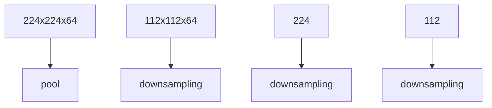
</details>

<table><tr><td>1</td><td>1</td><td>2</td><td>4</td></tr><tr><td>5</td><td>6</td><td>7</td><td>8</td></tr><tr><td>3</td><td>2</td><td>1</td><td>0</td></tr><tr><td>1</td><td>2</td><td>3</td><td>4</td></tr></table>

max pool with 2x2 filters and stride 2

<table><tr><td>6</td><td>8</td></tr><tr><td>3</td><td>4</td></tr></table>

Max Pooling Layer is robust to small perturbation.

<table><tr><td>1</td><td>1</td><td>2</td><td>4</td></tr><tr><td>5</td><td>6</td><td>7</td><td>8</td></tr><tr><td>3</td><td>2</td><td>1</td><td>0</td></tr><tr><td>1</td><td>2</td><td>3</td><td>4</td></tr></table>

average pool with 2x2 filters and stride 2

<table><tr><td>3.25</td><td>5.25</td></tr><tr><td>2</td><td>1.75</td></tr></table>

Given a D x M x N tensor, if we apply the pooling operator with size K x K and Stride P, what are the dimensions of the output?

$$
D \times ((M - K) / P + 1) \times ((N - K) / P + 1)
$$

# MAXPOOL2D


Examples:

```txt
>>> # pool of square window of size=3, stride=2
>>> m = nn.MaxPool2d(3, stride=2)
>>> # pool of non-square window
>>> m = nn.MaxPool2d((3, 2), stride=(2, 1))
>>> input = torch.randn(20, 16, 50, 32)
>>> output = m(input) 
```

# Receptive Fields

For convolution with kernel size K, each element in the output depends on a K x K receptive field in the input.


<details>
<summary>natural_image</summary>

Simple geometric diagram showing a square connected to a larger square via dashed lines (no text or symbols)
</details>

Input

Output

Each successive convolution contains multiple regions from the previous one.


<details>
<summary>flowchart</summary>

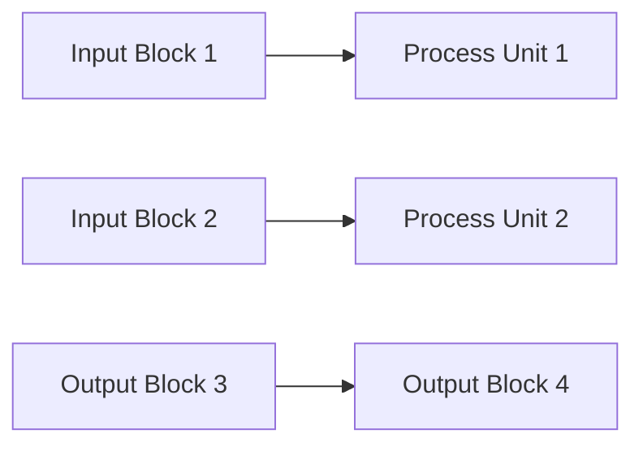
</details>

Suggested Reading: Computing receptive fields of convolutional neural network.


<details>
<summary>flowchart</summary>

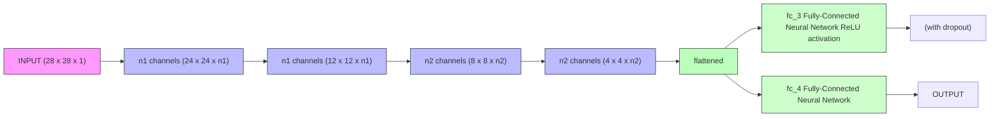
</details>

Source: https://www.analyticsvidhya.com/blog/2020/10/what-is-the-convolutional-neural-network-architecture/

Convolution Neural Network (CNN)   


<details>
<summary>flowchart</summary>

```mermaid
graph LR
    A["Input"] --> B["Kernel"]
    B --> C["Convolution + ReLU"]
    C --> D["Pooling"]
    D --> E["Convolution + ReLU"]
    E --> F["Pooling"]
    F --> G["Convolution + ReLU"]
    G --> H["Feature Maps"]
    H --> I["Flatten Layer"]
    I --> J["Fully Connected Layer"]
    J --> K["Classification"]
    K --> L["SoftMax Activation Function"]
    L --> M["Output: Horse 0.2, Zebra 0.7, Dog 0.1"]
    style A fill:#f9f,stroke:#333
    style L fill:#bbf,stroke:#333
```
</details>

Source: https://developersbreach.com/convolution-neural-network-deep-learning/


<details>
<summary>text_image</summary>

7
</details>

Input Layer (28 x 28 x 1)

<table><tr><td>0.003</td><td>-0.077</td><td>-0.037</td><td>0.039</td><td>-0.095</td></tr><tr><td>0.103</td><td>-0.345</td><td>0.22</td><td>0.01</td><td>0.137</td></tr><tr><td>0.028</td><td>-0.259</td><td>-0.108</td><td>-0.077</td><td>0.14</td></tr><tr><td>-0.078</td><td>-0.062</td><td>0.021</td><td>-0.015</td><td>-0.018</td></tr><tr><td>-0.042</td><td>0.067</td><td>0.088</td><td>0.051</td><td>0.2</td></tr></table>

<table><tr><td>0.028</td><td>0.06</td><td>0.046</td><td>0.069</td><td>0.214</td></tr><tr><td>-0.093</td><td>-0.019</td><td>0.036</td><td>0.23</td><td>-0.115</td></tr><tr><td>-0.265</td><td>-0.43</td><td>-0.266</td><td>-0.278</td><td>-0.328</td></tr><tr><td>-0.005</td><td>-0.029</td><td>-0.244</td><td>-0.132</td><td>-0.216</td></tr><tr><td>0.111</td><td>-0.035</td><td>0.197</td><td>0.183</td><td>0.136</td></tr></table>

Kernels= 2x(5x5x1) Stride=1,Activation=ReLU


<details>
<summary>text_image</summary>

7
</details>


<details>
<summary>text_image</summary>

Pixelated image showing a horizontal bar and a downward arrow on a dark grid background, possibly indicating a measurement or annotation.
</details>

Actiyation 2.Layer 1

Visualizing Convolutional Neural Networks Layer by Layer