# AMA 564 Deep Learning

# 2026 Spring

# Lecture 5

32x32x3 image   


<details>
<summary>text_image</summary>

32 height
32 width
3 depth
</details>


<details>
<summary>text_image</summary>

32x32x3 image
32 height
32
width
3
depth
Filters always extend the full
depth of the input volume
5x5x3 filter
Convolve the filter with the in
i.e. "slide over the image spa
computing dot products"
</details>

mage tially,


<details>
<summary>text_image</summary>

32x32x3 image
5x5x3 filter w
32
32
1 number:
the result of
filter and a s
(i.e. 5*5*3 =
</details>

#

f taking a dot product between the small 5x5x3 chunk of the image = 75-dimensional dot product + bias)

$$
\boldsymbol {w} ^ {T} \boldsymbol {x} + \boldsymbol {b}
$$


<details>
<summary>flowchart</summary>

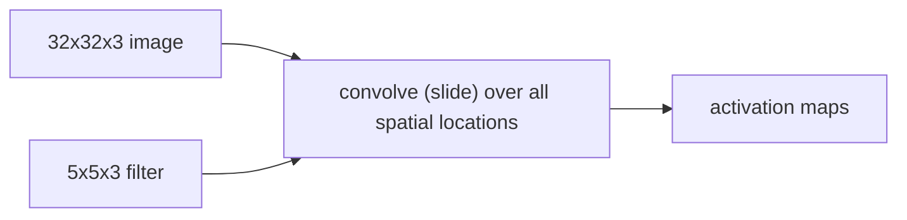
</details>


<details>
<summary>natural_image</summary>

3D geometric diagram showing two stacked blue and teal squares with dashed lines indicating projection or perspective (no text or symbols)
</details>

Output

Filter

Input

Padding


<details>
<summary>text_image</summary>

3
32
32
</details>

  
1 number: Convolution Layers

activation maps   


<details>
<summary>text_image</summary>

28
28
6
</details>

Stack these up to get a new “image” of size 28x28x6!

CNN is a sequence of Convolution Layers , interspersed with activation functions.


CONV,

ReLU

e.g. 6 5x5x3

filters

CONV,

ReLU

e.g. 10 5x5x6

filters

CONV,

ReLU

# Pooling Layer is a down sampling strategy.

1. Construct better translationally invariant features.   
2. Learn more compact features.


<details>
<summary>flowchart</summary>

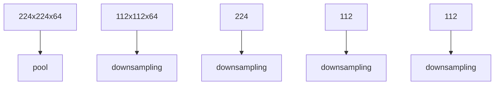
</details>

# Famous CNN Architectures

LeCun, Y., Bottou, L., Bengio, Y., & Haffner, P. (1998). Gradient-based learning applied to document recognition. Proceedings of the IEEE, 86(11), 2278-2324.


<details>
<summary>bar</summary>

| Layer | Feature Maps | Convolutional Segments | Subsampling Segments |
|-------|--------------|------------------------|----------------------|
| C1    | feature maps  | 6@28x28                | -                    |
| C3    | f. maps      | 16@10x10               | -                    |
| S2    | f. maps      | 6@14x14                | -                    |
| S4    | f. maps      | 16@5x5                 | -                    |
| C5    | layer        | 120                    | -                    |
| F6    | layer        | 84                     | -                    |
| OUTPUT | -            | -                      | 10                   |
</details>


<details>
<summary>other</summary>

| Layer | Layer Count |
|-------|-------------|
| C1: feature maps | 6@28x28 |
| C3: f. maps | 16@10x10 |
| S2: f. maps | 6@14x14 |
| S4: f. maps | 16@5x5 |
| C5: layer | 120 |
| F6: layer | 84 |
| OUTPUT | 10 |
The image displays a schematic representation of the neural network layers and connections. The input dimension is labeled as 32x32. The bottom section shows convolutional, subsampling, and full connection layers.
</details>

# Key Summary:

7 Layers (input layer not counted)   
3 Convolution Layers (C1; C3; C5)   
2 Pooling Layers (S2; S4)   
2 Fully Connected Layers (F6; Output)

Sigmoid Activation!


<details>
<summary>bar</summary>

| Layer | Layer Description         | Value |
|-------|---------------------------|-------|
| C1    | Feature Maps               | 6@28x28 |
| C3    | f. maps                   | 16@10x10 |
| S2    | f. maps                   | 6@14x14 |
| S4    | f. maps                   | 16@5x5 |
| C5    | Layer                     | 120   |
| F6    | Layer                     | 84    |
| OUTPUT | Output                    | 10    |
</details>

Details:

# C1: Convolution Layer

Input channel: 1 £ Output channel: 6

Input size: 1 x 32 x 32

Kernel size: 5 x 5

Output size: 6 x 28 x 28


<details>
<summary>bar</summary>

| Layer | Feature Maps | Layer Count |
|-------|--------------|-------------|
| C1    | feature maps  | 6@28x28     |
| C3    | f. maps      | 16@10x10    |
| S2    | f. maps      | 6@14x14     |
| S4    | f. maps      | 16@5x5      |
| C5    | layer        | 120         |
| F6    | layer        | 84          |
| OUTPUT|          | 10          |
</details>

# Details:

# S2: Max Pooling Layer

Input size: 6 x 28 x 28

Pooling size: 2 x 2

Output size: 6 x 14 x 14


<details>
<summary>bar</summary>

| Layer | Layer Description         | Count |
|-------|---------------------------|-------|
| C1    | Feature Maps              | 6@28x28 |
| C2    | Subsampling               | 6@14x14 |
| C3    | f. maps                   | 16@10x10 |
| C4    | f. maps                  | 16@5x5 |
| C5    | Layer                     | 120   |
| F6    | Layer                     | 84    |
| OUTPUT | Output                    | 10    |
</details>

# Details:

# C3: Convolution Layer

Input channel: 6

Output channel: 16

Input size: 6 x 14 x 14

Kernel size: 5 x 5

Output size: 16 x 10 x 10


<details>
<summary>other</summary>

| Layer | Layer Description         | Feature Maps | Convolution Type |
|-------|---------------------------|--------------|------------------|
| C1    | Feature Maps              | 6@28x28      | Convolutions      |
| C2    | Subsampling               | 6@14x14      | Subsampling      |
| C3    | f. maps                  | 16@10x10     | Convolutions      |
| C4    | f. maps                  | 16@5x5       | Subsampling      |
| C5    | Layer                     | 120          | Full connection   |
| F6    | Layer                     | 84           | Full connection   |
| OUTPUT | Output                    | -            | Gaussian connections |
</details>

# Details:

# S4: Max Pooling Layer

Input size: 16 x 10 x 10

Pooling size: 2 x 2

Output size: 16 x 5 x 5


<details>
<summary>bar</summary>

| Layer | Layer Description         | Dimension |
|-------|---------------------------|---------|
| C1    | Feature Maps               | 6@28x28 |
| C2    | Subsampling               | 6@14x14 |
| C3    | f. maps                   | 16@10x10 |
| C4    | f. maps                   | 16@5x5  |
| C5    | Layer                     | 120     |
| F6    | Layer                     | 84      |
| OUTPUT | Output                    | 10      |
</details>

# Details:

# C5: Convolution Layer

Input channel: 16

Output channel: 120

Input size: 16 x 5 x 5

Kernel size: 5 x 5

Output size: 1 x 120


<details>
<summary>bar</summary>

| Layer | Feature Maps | Convolutional Segments | Subsampling Segments |
|-------|--------------|------------------------|----------------------|
| C1    | feature maps  | 6@28x28                | -                    |
| C3    | f. maps      | 16@10x10               | -                    |
| S2    | f. maps      | 6@14x14                | -                    |
| S4    | f. maps      | 16@5x5                 | -                    |
| C5    | layer        | 120                    | -                    |
| F6    | layer        | 84                     | -                    |
| OUTPUT| -            | -                      | 10                   |
</details>

Details:

# F6: Fully Connected Layer

Input size: 1 x 120

Output size: 1 x 84


<details>
<summary>bar</summary>

| Layer | Layer Description         | Count |
|-------|---------------------------|-------|
| C1    | Feature Maps               | 6@28x28 |
| C2    | Subsampling               | 6@14x14 |
| C3    | f. maps                   | 16@10x10 |
| C4    | f. maps                   | 16@5x5 |
| C5    | Layer                     | 120   |
| F6    | Layer                     | 84    |
| OUTPUT | Output                    | 10    |
</details>

# Details:

# Output: Fully Connected Layer

Input size: 1 x 84

Output size: 1 x 10


<details>
<summary>bar</summary>

| Layer | Feature Maps | Convolutional Segments | Subsampling Segments |
|-------|--------------|------------------------|----------------------|
| C1    | feature maps  | 6@28x28                | -                    |
| C3    | f. maps      | 16@10x10               | -                    |
| S2    | f. maps      | 6@14x14                | -                    |
| S4    | f. maps      | 16@5x5                 | -                    |
| C5    | layer        | 120                    | -                    |
| F6    | layer        | 84                     | -                    |
| OUTPUT | -            | -                      | 10                   |
</details>

# Summary Remark:

A Simple CNN architecture.

Use Sigmoid as activation function.

Convolution layer can convert a tensor to a vector!


<details>
<summary>flowchart</summary>

```mermaid
graph TD
    INPUT["INPUT 32x32"] --> A["A"]
    A --> B["Convolutions"]
    A --> C["Subsampling"]
    A --> D["Convolutions"]
    A --> E["Full connection"]
    A --> F["Full connection"]
    A --> G["Gaussian connections"]
    
    subgraph Input Layer
        H["3"]
    end
    
    subgraph Convolutional Layers
        I["3:0"]
        J["3:3"]
        K["3:5"]
        L["3:7"]
        M["3:9"]
        N["4:11"]
        O["4:13"]
        P["4:15"]
        Q["4:17"]
        R["4:19"]
        S["4:21"]
        T["4:23"]
        U["4:25"]
        V["4:27"]
        W["4:29"]
        X["4:31"]
        Y["4:33"]
        Z["4:35"]
        AA["4:37"]
        AB["4:39"]
        AC["4:41"]
        AD["4:43"]
        AE["4:45"]
        AF["4:47"]
        AG["4:49"]
        AH["4:51"]
        AI["4:53"]
        AJ["4:55"]
        AK["4:57"]
        AL["4:59"]
        AM["4:61"]
        AN["4:63"]
        AO["4:65"]
        AP["4:67"]
        AQ["4:69"]
        AR["4:71"]
        AS["4:73"]
        AT["4:75"]
        AU["4:77"]
        AV["4:79"]
        AW["4:81"]
        AX["4:83"]
        AY["5"]
    end
    
    subgraph Subsampling
        AZ["3:0"]
        BA["3:3"]
        BB["3:5"]
        BC["3:7"]
        BD["3:9"]
        BE["4:11"]
        BF["4:13"]
        BG["4:15"]
        BH["4:17"]
        BI["4:19"]
        BJ["4:21"]
        BK["4:23"]
        BL["4:25"]
        BM["4:27"]
        BN["4:29"]
        BO["4:31"]
        BP["4:33"]
        BQ["4:35"]
        BR["4:37"]
        BS["4:39"]
        BT["4:41"]
        BU["4:43"]
        BV["4:45"]
        BW["4:47"]
        BX["4:49"]
        BY["4:51"]
        BZ["5"]
    end
    
    subgraph Full Connections
        CA["5:0"]
        CB["5:1"]
        CC["5:2"]
        DD["5:3"]
        EE["5:4"]
        FF["5:5"]
        DG["5:6"]
        DH["5:7"]
        DI["5:8"]
        DJ["5:9"]
    end
    
    subgraph Full Connection
        CE["5:0"]
        CF["5:1"]
        CG["5:2"]
        CH["5:3"]
    end
    
    subgraph Gaussian Connections
        CI["0, 1, 2, 3, 4, 5, 6, 7, 8, 9"]
```
</details>

Krizhevsky, A., Sutskever, I., & Hinton, G. E. (2012). Imagenet classification with deep convolutional neural networks. NIPS.


<details>
<summary>flowchart</summary>

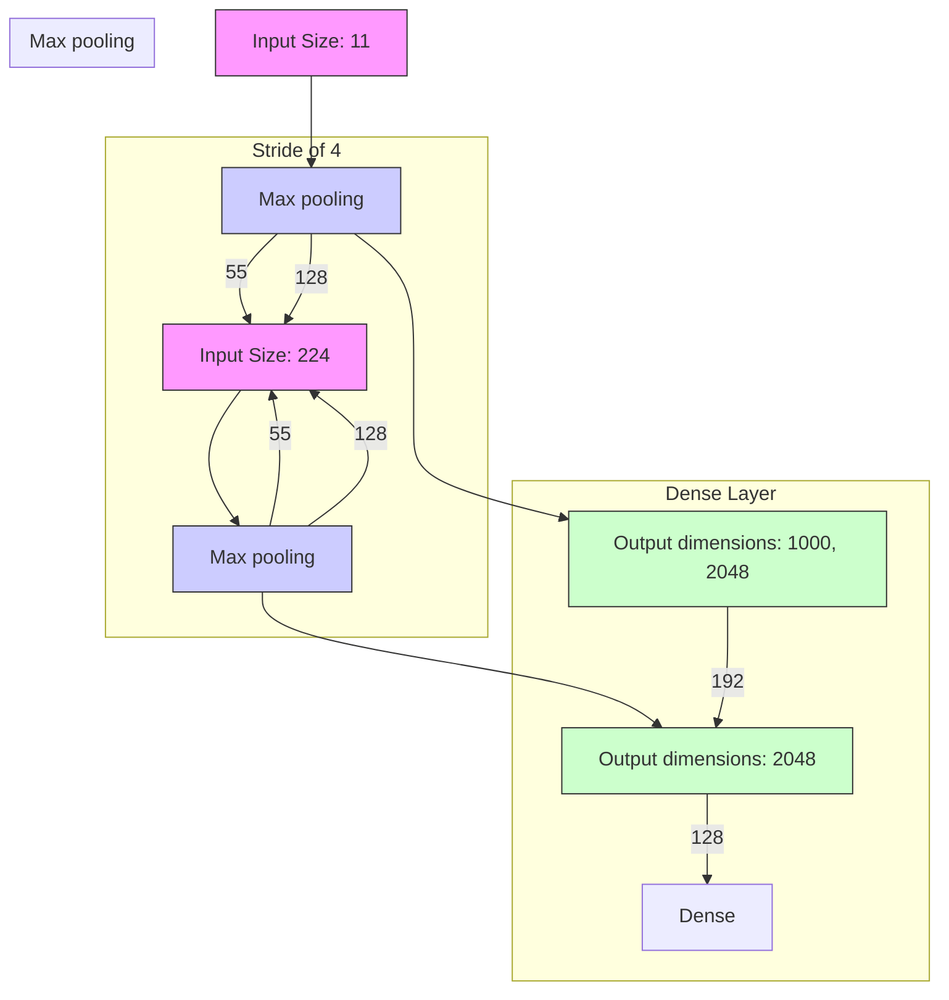
</details>


<details>
<summary>flowchart</summary>

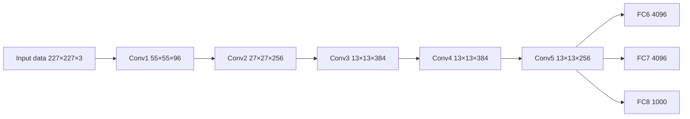
</details>


CNNs that use ReLU achieved a 25% error rate on CIFAR-10 is six times faster than those that used tanh.

AlexNet uses 3 x 3 max pooling with stride 2.

<table><tr><td></td><td></td><td></td><td></td><td></td></tr><tr><td></td><td></td><td></td><td></td><td></td></tr><tr><td></td><td></td><td></td><td></td><td></td></tr><tr><td></td><td></td><td></td><td></td><td></td></tr><tr><td></td><td></td><td></td><td></td><td></td></tr></table>

Stride 2


<details>
<summary>natural_image</summary>

Simple 2x2 grid with pink and white cells (no text or symbols)
</details>

Feature Map

  
Generalization and Overfitting


<details>
<summary>scatter</summary>

| Time | Values |
|------|--------|
| 1    | 0.8    |
| 2    | 0.75   |
| 3    | 0.7    |
| 4    | 0.65   |
| 5    | 0.6    |
| 6    | 0.55   |
| 7    | 0.5    |
| 8    | 0.45   |
| 9    | 0.4    |
| 10   | 0.35   |
| 11   | 0.3    |
| 12   | 0.25   |
| 13   | 0.2    |
| 14   | 0.15   |
| 15   | 0.1    |
| 16   | 0.05   |
| 17   | 0.0    |
| 18   | -0.05  |
| 19   | -0.1   |
| 20   | -0.15  |
| 21   | -0.2   |
| 22   | -0.25  |
| 23   | -0.3   |
| 24   | -0.35  |
| 25   | -0.4   |
| 26   | -0.45  |
| 27   | -0.5   |
| 28   | -0.55  |
| 29   | -0.6   |
| 30   | -0.65  |
| 31   | -0.7   |
| 32   | -0.75  |
| 33   | -0.8   |
| 34   | -0.85  |
| 35   | -0.9   |
| 36   | -0.95  |
| 37   | -1.0   |
| 38   | -1.05  |
| 39   | -1.1   |
| 40   | -1.15  |
| 41   | -1.2   |
| 42   | -1.25  |
| 43   | -1.3   |
| 44   | -1.35  |
| 45   | -1.4   |
| 46   | -1.45  |
| 47   | -1.5   |
| 48   | -1.55  |
| 49   | -1.6   |
| 50   | -1.65  |
| 51   | -1.7   |
| 52   | -1.75  |
| 53   | -1.8   |
| 54   | -1.85  |
| 55   | -1.9   |
| 56   | -1.95  |
| 57   | -2.0   |
| 58   | -2.05  |
| 59   | -2.1   |
| 60   | -2.15  |
| 61   | -2.2   |
| 62   | -2.25  |
| 63   | -2.3   |
| 64   | -2.35  |
| 65   | -2.4   |
| 66   | -2.45  |
| 67   | -2.5   |
| 68   | -2.55  |
| 69   | -2.6   |
| 70   | -2.65  |
| 71   | -2.7   |
| 72   | -2.75  |
| 73   | -2.8   |
| 74   | -2.85  |
| 75   | -2.9   |
| 76   | -2.95  |
| 77   | -3.0   |
| 78   | -3.05  |
| 79   | -3.1   |
| 80   | -3.15  |
| 81   | -3.2   |
| 82   | -3.25  |
| 83   | -3.3   |
| 84   | -3.35  |
| 85   | -3.4   |
| 86   | -3.45  |
| 87   | -3.5   |
| 88   | -3.55  |
| 89   | -3.6   |
| 90   | -3.65  |
| 91   | -3.7   |
| 92   | -3.75  |
| 93   | -3.8   |
| 94   | -3.85  |
| 95   | -3.9   |
| 96   | -3.95  |
| 97   | -4.0   |
| 98   | -4.05  |
| 99   | -4.1   |
| 100  | -4.15  |
</details>

(High bias error)


<details>
<summary>scatter</summary>

| Time | Values |
|------|--------|
| 0    | 1.0    |
| 1    | 0.8    |
| 2    | 0.6    |
| 3    | 0.4    |
| 4    | 0.2    |
| 5    | 0.1    |
| 6    | 0.3    |
| 7    | 0.5    |
| 8    | 0.7    |
| 9    | 0.9    |
| 10   | 1.1    |
| 11   | 1.3    |
| 12   | 1.5    |
| 13   | 1.7    |
| 14   | 1.9    |
| 15   | 2.1    |
| 16   | 2.3    |
| 17   | 2.5    |
| 18   | 2.7    |
| 19   | 2.9    |
| 20   | 3.1    |
| 21   | 3.3    |
| 22   | 3.5    |
| 23   | 3.7    |
| 24   | 3.9    |
| 25   | 4.1    |
| 26   | 4.3    |
| 27   | 4.5    |
| 28   | 4.7    |
| 29   | 4.9    |
| 30   | 5.1    |
| 31   | 5.3    |
| 32   | 5.5    |
| 33   | 5.7    |
| 34   | 5.9    |
| 35   | 6.1    |
| 36   | 6.3    |
| 37   | 6.5    |
| 38   | 6.7    |
| 39   | 6.9    |
| 40   | 7.1    |
| 41   | 7.3    |
| 42   | 7.5    |
| 43   | 7.7    |
| 44   | 7.9    |
| 45   | 8.1    |
| 46   | 8.3    |
| 47   | 8.5    |
| 48   | 8.7    |
| 49   | 8.9    |
| 50   | 9.1    |
| 51   | 9.3    |
| 52   | 9.5    |
| 53   | 9.7    |
| 54   | 9.9    |
| 55   | 10.1   |
| 56   | 10.3   |
| 57   | 10.5   |
| 58   | 10.7   |
| 59   | 10.9   |
| 60   | 11.1   |
| 61   | 11.3   |
| 62   | 11.5   |
| 63   | 11.7   |
| 64   | 11.9   |
| 65   | 12.1   |
| 66   | 12.3   |
| 67   | 12.5   |
| 68   | 12.7   |
| 69   | 12.9   |
| 70   | 13.1   |
| 71   | 13.3   |
| 72   | 13.5   |
| 73   | 13.7   |
| 74   | 13.9   |
| 75   | 14.1   |
| 76   | 14.3   |
| 77   | 14.5   |
| 78   | 14.7   |
| 79   | 14.9   |
| 80   | 15.1   |
| 81   | 15.3   |
| 82   | 15.5   |
| 83   | 15.7   |
| 84   | 15.9   |
| 85   | 16.1   |
| 86   | 16.3   |
| 87   | 16.5   |
| 88   | 16.7   |
| 89   | 16.9   |
| 90   | 17.1   |
| 91   | 17.3   |
| 92   | 17.5   |
| 93   | 17.7   |
| 94   | 17.9   |
| 95   | 18.1   |
| 96   | 18.3   |
| 97   | 18.5   |
| 98   | 18.7   |
| 99   | 18.9   |
| 100  | -      |
</details>

(Balance between biasand variance)


<details>
<summary>line</summary>

| Time | Values |
|------|--------|
| 0    | 10     |
| 1    | 8      |
| 2    | 6      |
| 3    | 4      |
| 4    | 2      |
| 5    | 0      |
| 6    | -2     |
| 7    | -4     |
| 8    | -6     |
| 9    | -8     |
| 10   | -10    |
| 11   | -8     |
| 12   | -6     |
| 13   | -4     |
| 14   | -2     |
| 15   | 0      |
| 16   | 2      |
| 17   | 4      |
| 18   | 6      |
| 19   | 8      |
| 20   | 10     |
| 21   | 8      |
| 22   | 6      |
| 23   | 4      |
| 24   | 2      |
| 25   | 0      |
| 26   | -2     |
| 27   | -4     |
| 28   | -6     |
| 29   | -8     |
| 30   | -10    |
| 31   | -8     |
| 32   | -6     |
| 33   | -4     |
| 34   | -2     |
| 35   | 0      |
| 36   | 2      |
| 37   | 4      |
| 38   | 6      |
| 39   | 8      |
| 40   | 10     |
| 41   | 8      |
| 42   | 6      |
| 43   | 4      |
| 44   | 2      |
| 45   | 0      |
| 46   | -2     |
| 47   | -4     |
| 48   | -6     |
| 49   | -8     |
| 50   | -10    |
| 51   | -8     |
| 52   | -6     |
| 53   | -4     |
| 54   | -2     |
| 55   | 0      |
| 56   | 2      |
| 57   | 4      |
| 58   | 6      |
| 59   | 8      |
| 60   | 10     |
| 61   | 8      |
| 62   | 6      |
| 63   | 4      |
| 64   | 2      |
| 65   | 0      |
| 66   | -2     |
| 67   | -4     |
| 68   | -6     |
| 69   | -8     |
| 70   | -10    |
| 71   | -8     |
| 72   | -6     |
| 73   | -4     |
| 74   | -2     |
| 75   | 0      |
| 76   | 2      |
| 77   | 4      |
| 78   | 6      |
| 79   | 8      |
| 80   | 10     |
| 81   | 8      |
| 82   | 6      |
| 83   | 4      |
| 84   | 2      |
| 85   | 0      |
| 86   | -2     |
| 87   | -4     |
| 88   | -6     |
| 89   | -8     |
| 90   | -10    |
| 91   | -8     |
| 92   | -6     |
| 93   | -4     |
| 94   | -2     |
| 95   | 0      |
| 96   | 2      |
| 97   | 4      |
| 98   | 6      |
| 99   | 8      |
| 100  | 10     |
</details>

(High variance error)

A highly complex model may not be overfitting if (1) A large and complex dataset is available; (2) a large number of model parameters are zero!!!


000

Resize&Crop

955

955

Random Crops

2


<details>
<summary>text_image</summary>

Mirror Image
</details>


<details>
<summary>natural_image</summary>

Close-up of a tabby cat with green eyes and white whiskers, looking upward (no text or symbols visible)
</details>

Rotation   


<details>
<summary>natural_image</summary>

Close-up of a tabby cat with green eyes and striped whiskers, looking upward (no text or symbols visible)
</details>


<details>
<summary>natural_image</summary>

Close-up of a tabby cat with green eyes looking upward (no text or symbols visible)
</details>


<details>
<summary>flowchart</summary>

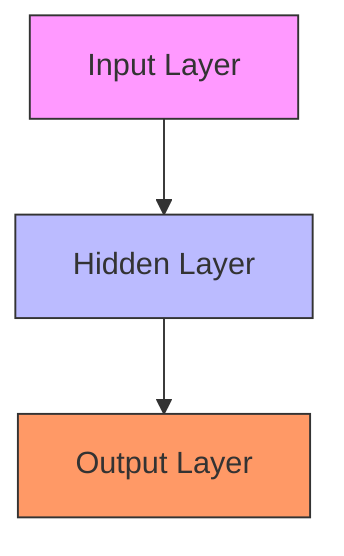
</details>


<details>
<summary>flowchart</summary>

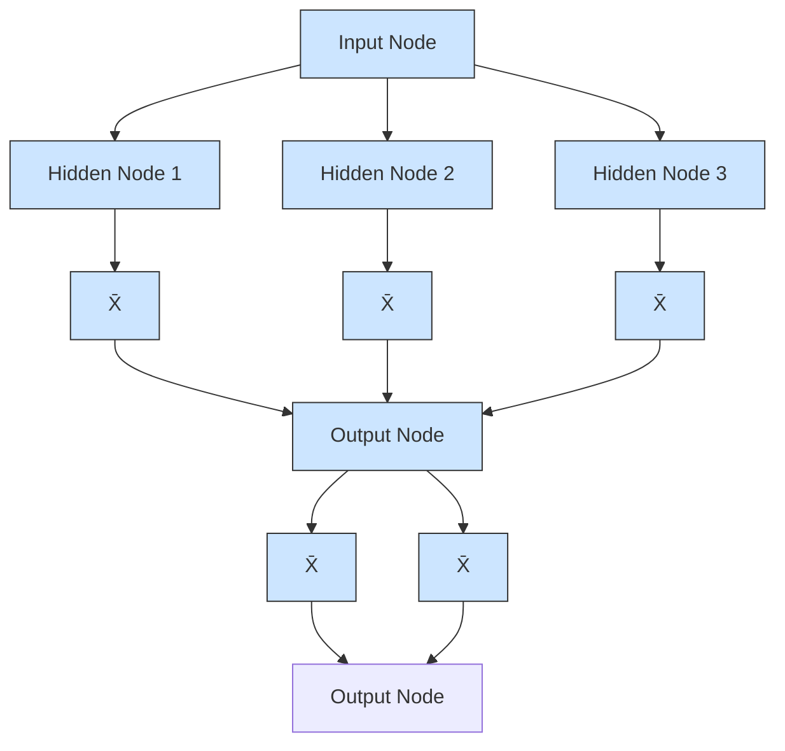
</details>

A dropout layer randomly sets input elements to zero with a given probability.

AlexNet uses dropout layers with a probability 0.5.


<details>
<summary>text_image</summary>

INTERNET
</details>

<table><tr><td></td><td>Top 1 Error</td><td>Top 5 Error</td></tr><tr><td>Before AlexNet</td><td>47.1%</td><td>28.2%</td></tr><tr><td>AlexNet</td><td>37.5%</td><td>17%</td></tr></table>

Simonyan, K., & Zisserman, A. (2014). Very deep convolutional networks for large-scale image recognition. ICLR 2015.

VGG-16   


<details>
<summary>flowchart</summary>


</details>

The Architecture

The architecture depicted belowis VGG16.   


<details>
<summary>bar</summary>

| Model                  | Operations       |
| ---------------------- | ---------------- |
| convolution+ReLU       | 224 × 224 × 3    |
| convolution+ReLU       | 224 × 224 × 64   |
| max pooling           | 112 × 112 × 128 |
| max pooling           | 56 × 56 × 256    |
| max pooling           | 28 × 28 × 512    |
| max pooling           | 14 × 14 × 512    |
| fully connected+ReLU   | 7 × 7 × 512      |
| fully connected+ReLU   | 1 × 1 × 4096     |
| fully connected+ReLU   | 1 × 1 × 1000     |
| softmax                | -                |
</details>

Key Idea of VGG: Replace the large convolution filter by stacking some smaller convolution filters.


<details>
<summary>flowchart</summary>


</details>

An example: Replace a 5 x 5 filter with two 3 x 3 filters.


<details>
<summary>natural_image</summary>

Diagram of two stacked solar panels with red connecting lines, no text or symbols present
</details>

two successive 3x3 convolutions


<details>
<summary>natural_image</summary>

Simple line drawing of a 3D geometric shape resembling a truncated cone or frustum (no text or symbols)
</details>

5x5 convolution

1. More concise and generalizable.   
2. Smaller filters can achieve better performance than a larger filter.   
3. Demonstrate that increase depth can boost performance.

Classification: ImageNet Challenge top-5 error   


<details>
<summary>bar</summary>

| Model | Layer Count |
| :--- | :--- |
| ILSVRC'15 ResNet | 3.57 |
| ILSVRC'14 GoogleNet | 6.7 |
| ILSVRC'14 VGG | 7.3 |
| ILSVRC'13 | 11.7 |
| ILSVRC'12 AlexNet | 16.4 |
| ILSVRC'11 | 25.8 |
| ILSVRC'10 | 28.2 |
152 layers (dashed orange line) are annotated.
</details>


<details>
<summary>bubble</summary>

| Model           | Top-1 accuracy [%] | Operations [G-Ops] | Bubble Size (M) |
|-----------------|--------------------|--------------------|-----------------|
| Inception-v4    | 80                 | 20                 | 155             |
| Xception        | 78                 | 18                 | 125             |
| ResNet-152      | 77                 | 16                 | 95              |
| VGG-16          | 70                 | 30                 | 95              |
| VGG-19          | 70                 | 40                 | 155             |
| Inception-v3    | 76                 | 8                  | 35              |
| DenseNet-201    | 75                 | 7                  | 35              |
| DenseNet-169    | 74                 | 6                  | 35              |
| ResNet-50       | 76                 | 16                 | 125             |
| DenseNet-121    | 75                 | 8                  | 35              |
| ResNet-34       | 73                 | 7                  | 35              |
| MobileNet-v2    | 72                 | 2                  | 5               |
| MobileNet-v1    | 71                 | 2                  | 5               |
| ResNet-18       | 69                 | 3                  | 5               |
| GoogLeNet       | 68                 | 3                  | 5               |
| ENet            | 68                 | 2                  | 5               |
| fd-MobileNet     | 65                 | 1                  | 5               |
| BN-NIN          | 62                 | 2                  | 5               |
| ShuffleNet      | 62                 | 2                  | 5               |
| SqueezeNet      | 58                 | 1                  | 5               |
| BN-AlexNet      | 57                 | 1                  | 5               |
| AlexNet         | 54                 | 1                  | 5               |
</details>


<details>
<summary>line</summary>

| iter. (1e4) | 20-layer | 56-layer |
| ----------- | -------- | -------- |
| 0           | 20.0     | 20.0     |
| 1           | 15.0     | 18.0     |
| 2           | 12.0     | 19.0     |
| 3           | 10.0     | 17.0     |
| 4           | 5.0      | 8.0      |
| 5           | 3.0      | 6.0      |
| 6           | 2.0      | 5.0      |
</details>


<details>
<summary>line</summary>

| iter. (1e4) | 20-layer | 56-layer |
| ----------- | -------- | -------- |
| 0           | ~20      | ~20      |
| 1           | ~15      | ~18      |
| 2           | ~13      | ~19      |
| 3           | ~10      | ~17      |
| 4           | ~10      | ~14      |
| 5           | ~10      | ~14      |
| 6           | ~10      | ~14      |
</details>

Deep model may be difficult to optimize.

Intuitive sense: Deep model should be at least as good as shallow ones?

Revolution of Depth   


<details>
<summary>bar</summary>

| Model           | Layer Count |
| --------------- | ----------- |
| ILSVRC'15 ResNet | 3.57        |
| ILSVRC'14 GoogleNet | 6.7         |
| ILSVRC'14 VGG    | 7.3         |
| ILSVRC'13        | 11.7        |
| ILSVRC'12 AlexNet | 16.4       |
| ILSVRC'11        | 25.8        |
| ILSVRC'10        | 28.2        |
</details>

ImageNet Classification top-5 error (%)

He, K., Zhang, X., Ren, S., & Sun, J. (2016). Deep residual learning for image recognition. CVPR.


<details>
<summary>flowchart</summary>


</details>

Key numbers: 152 layers for ImageNet.

3.57% Top 5 Error!!!

A Key Motivation: It is not easy to learn an identity mapping f(x) = x.   


<details>
<summary>flowchart</summary>

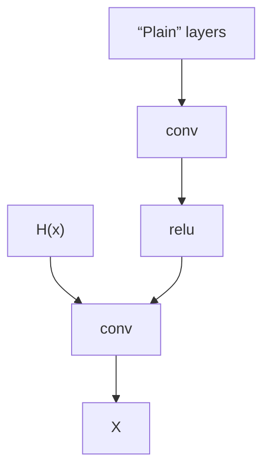
</details>


<details>
<summary>flowchart</summary>

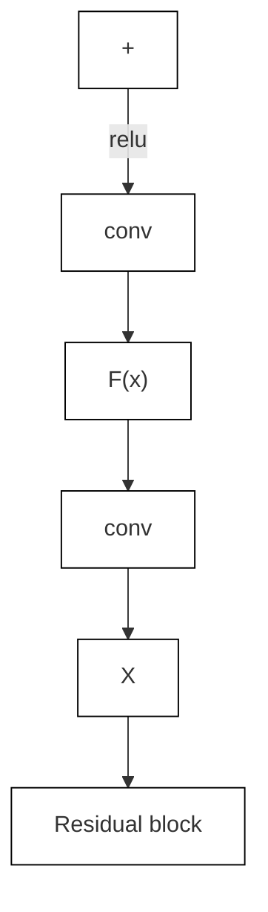
</details>

A Key Motivation: It is not easy to learn an identity mapping f(x) = x.


<details>
<summary>flowchart</summary>


</details>


<details>
<summary>flowchart</summary>


</details>

An identity mapping can now be obtained if F = 0.


<details>
<summary>flowchart</summary>

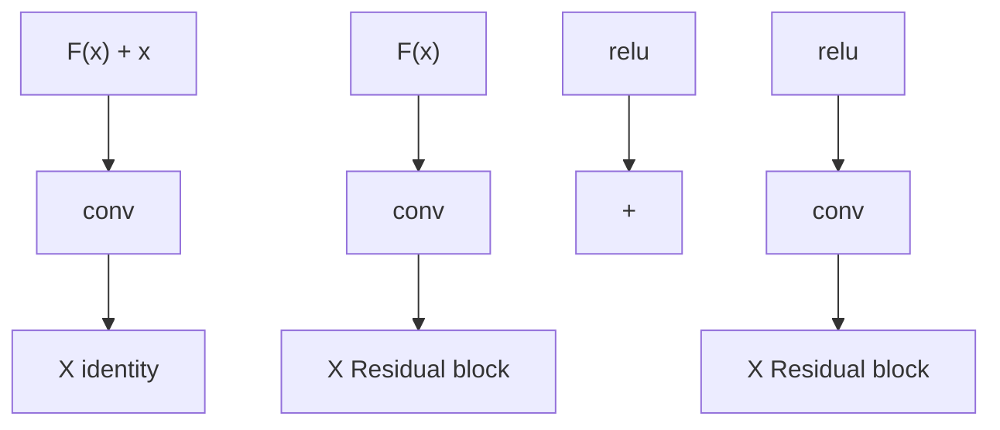
</details>

In a plain network, if we want to learn H(x), now, we only need to learn its residual:

$$
F (x) = H (x) - x
$$

# A stack of three types of residual blocks:

Stage 1: 3x3 convolution filters with 64 channels.

Stage 2: 3x3 convolution filters with 128 channels

Stage 3: 3x3 convolution filters with 512 channels


<details>
<summary>flowchart</summary>


</details>


<details>
<summary>flowchart</summary>


</details>

No fully connected layers before output.

For very deep neural networks (i.e., 50+ layers), we can use “bottleneck” building blocks to improve efficiency.


<details>
<summary>flowchart</summary>

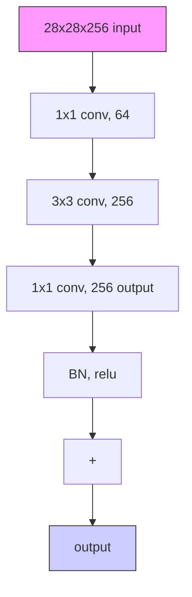
</details>

- Initialization using He’s Xaiver initialization.   
- Batch normalization after each convolution layer.   
- SGD + Momentum (0.9)   
- Dynamic learning rate scheduling.   
- No dropout used in He’s ResNet paper.

Consider a 10-layer DNN with tanh activation function. If we initialize all the weights with normal distribution N(0, 0.01).


The outputs of the last a few layers are almost zeros.

Consider a 10-layer DNN with tanh activation function. If we initialize all the weights with normal distribution N(0, 1).


The outputs are close to -1 or 1, the gradients will be very small for tanh activation function.

Key Motivation: Keep a same variance for the input and the output.

Consider a 10-layer DNN with tanh activation function. If we initialize all the weights with normal distribution N(0, 1)/sqrt(n\_in).


Consider $y = w _ { 1 } x _ { 1 } + w _ { 2 } x _ { 2 } + \cdots + w _ { n } x _ { n } , x _ { \mathrm { i } }$ are i.i.d. with zero mean, $w _ { i }$ are i.i.d with zero mean.

Target: Compute $\cdot$ .

$\mathbb { L } \mathrm { e m m a }$

Thus, $-$ and

$$
V a r [ y ] = V a r [ w _ {1} x _ {1} + w _ {2} x _ {2} + \dots + w _ {n} x _ {n} ] = \sum_ {i = 1} ^ {n} V a r [ w _ {i} x _ {i} ] = n V a r [ w _ {i} ] V a r [ x _ {i} ]
$$

Thus,

$$
V a r [ w _ {i} ] = 1 / n
$$

Consider a 10-layer DNN with ReLu activation function. If we initialize all the weights with normal distribution N(0, 1)/sqrt(n\_in).


Not that good for the last a few layers.

Key Motivation: Assume that only a half of the neurons are activated in each layer.

He’s Xavier initialization: N(0, 1)/sqrt(n\_in/2).


# Bach Normalization


<details>
<summary>line</summary>

| x | Activation Function | Derivative |
| --- | --- | --- |
| 0 | 0.0 | 0.0 |
| 1 | 0.1 | 0.05 |
| 2 | 0.3 | 0.15 |
| 3 | 0.6 | 0.3 |
| 4 | 0.9 | 0.5 |
| 5 | 1.0 | 0.7 |
| 6 | 1.0 | 0.8 |
| 7 | 1.0 | 0.9 |
| 8 | 1.0 | 0.95 |
| 9 | 1.0 | 0.98 |
| 10 | 1.0 | 0.99 |
| 11 | 1.0 | 0.995 |
| 12 | 1.0 | 0.998 |
| 13 | 1.0 | 0.999 |
| 14 | 1.0 | 0.9995 |
| 15 | 1.0 | 0.9998 |
| 16 | 1.0 | 0.9999 |
| 17 | 1.0 | 0.99995 |
| 18 | 1.0 | 0.99998 |
| 19 | 1.0 | 0.99999 |
| 20 | 1.0 | 0.999995 |
| 21 | 1.0 | 0.999998 |
| 22 | 1.0 | 0.999999 |
| 23 | 1.0 | 0.9999995 |
| 24 | 1.0 | 0.9999998 |
| 25 | 1.0 | 0.9999999 |
| 26 | 1.0 | 0.99999995 |
| 27 | 1.0 | 0.99999998 |
| 28 | 1.0 | 0.99999999 |
| 29 | 1.0 | 0.999999995 |
| 30 | 1.0 | 0.999999998 |
| 31 | 1.0 | 0.999999999 |
| 32 | 1.0 | 0.9999999995 |
| 33 | 1.0 | 0.9999999998 |
| 34 | 1.0 | 0.9999999999 |
| 35 | 1.0 | 0.99999999995 |
| 36 | 1.0 | 0.99999999998 |
| 37 | 1.0 | 0.99999999999 |
| 38 | 1.0 | 0.999999999995 |
| 39 | 1.0 | 0.999999999998 |
| 40 | 1.0 | 0.9999999999985 |
| 41 | 1.0 | 0.9999999999988 |
| 42 | 1.0 | 0.99999999999885 |
| 43 | 1.0 | 0.9988888888888 |
| 44 | 1.0 | 0.866666666668 |
| 45 | 1.0 | 0.646444444448 |
| 46 | 1.0 | 0.435222222222 |
| 47 | 1.0 | 0.234100000000 |
| 48 | 1.0 | -0.1338777777775 |
| 49 | 1.0 | -0.333755555558 |
| 50 | 1.0 | -0.533633333338 |
| 51 | 1.0 | -0.7335111111125 |
| 52 | 1.0 | -0.8333888888888 |
| 53 | 1.0 | -0.8666666666688 |
| 54 | 1.0 | -0.886444444448 |
| 55 | 1.0 | -0.8666666666688 |
| 56 | 1.0 | -0.736333333338 |
| 57 | 1.0 | -0.533633333338 |
| 58 | 1.0 | -0.333755555558 |
| 59 | 1.0 | -0.1338777777775 |
| 60 | 1.0 | -0.1338777777775 |
| 61 | 1.0 | -0.1338777777775 |
| 62 | 1.0 | -0.1338777777775 |
| 63 | 1.0 | -0.1338777777775 |
| 64 | 1.0 | -0.1338777777775 |
| 65 | 1.0 | -0.1338777777775 |
| 66 | 1.0 | -0.1338777777775 |
| 67 | 1.0 | -0.1338777777775 |
| 68 | 1.0 | -0.1338777777775 |
| 69 | 1.0 | -0.1338777777775 |
| 70 | 1.0 | -0.1338777777775 |
| 71 | 1.0 | -0.1338777777775 |
| 72 | 1.0 | -0.1338777777775 |
| 73 | 1.0 | -0.1338777777775 |
| 74 | 1.0 | -0.1338777777775 |
| 75 | 1.0 | -0.1338777777775 |
| 76 | 1.0 | -0.1338777777775 |
| 77 | 1.0 | -0.1338777777775 |
| 78 | 1.0 | -0.1338777777775 |
| 79 | 1.0 | -0.13387777777% |
| ... (additional values) are not provided in the image.) The data is presented in a table format with columns: "Activation Function" and "Derivative". The values for the Activation Function are calculated as: (x) * (ln(x) / (ln(x)) + (ln(x)) * (ln(x)) / (ln(x)) / (ln(x)) / (ln(x)) / (ln(x)) / (ln(x)) / (ln(x)) / (ln(x)) / (ln(x)) / (ln(x)) / (ln(x)) / (ln(x)) / (ln(x)) / (ln(x)) / (ln(x)) / (ln(x)) / (ln(x)) / (ln(x)) / (ln(x)) / (ln(x)) / (ln(x)) = (x) * (ln(x)) / (ln(x)) / (ln(x)) / (ln(x)) / (ln(x)) / (ln(x)) / (ln(x)) / (ln(x)) / (ln(x)) / (ln(x)) / (ln(x)) / (ln(x)) / (ln(x)) / (ln(x)) / (ln(x)) / (ln(x)) / (ln(x)) / (ln(x)) / (ln(x)) / (ln(x)).
</details>


<details>
<summary>flowchart</summary>

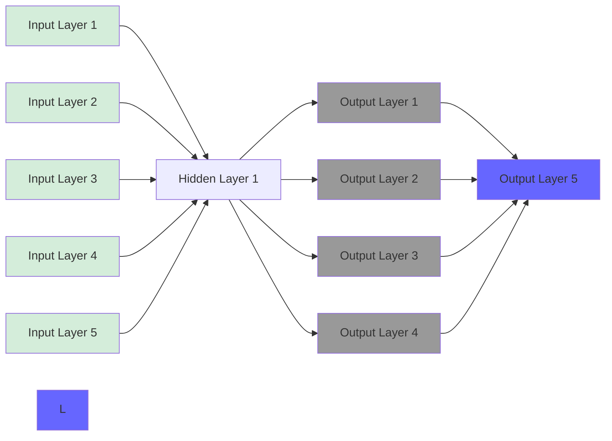
</details>

(gradually diminishes)

Activation Inputs   


<details>
<summary>line</summary>

| x    | y (Gray Line) | y (Red Dashed Line) |
|------|---------------|---------------------|
| 0.0  | 6.0           | 6.0                 |
| 0.1  | 2.0           | -2.0                |
| 0.2  | 0.0           | -4.0                |
| 0.3  | -2.0          | -6.0                |
| 0.4  | -4.0          | -8.0                |
| 0.5  | -6.0          | -10.0               |
| 0.6  | -8.0          | -12.0               |
| 0.7  | -10.0         | -14.0               |
| 0.8  | -12.0         | -16.0               |
| 0.9  | -14.0         | -18.0               |
</details>

Sigmoid Activation and Gradient

Consider an output of a linear layer:

$$
y = W x
$$

The following scenarios are challenging:

1. $E [ x ] \neq 0 .$   
2. $V a r [ x ]$ is large.

# We WANT

1. $E [ x ] = 0 ,$   
2. $V a r [ x ] = 1 . $

Batch Normalization is to normalize each dimension of the activations at some layer:

$$
\hat {x} ^ {(k)} = \frac {x ^ {(k)} - E [ x ^ {(k)} ]}{\sqrt {\operatorname{Var} [ x ^ {(k)} ]}}.
$$


<details>
<summary>flowchart</summary>

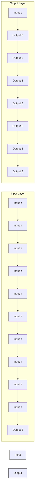
</details>

Input data batch : $x ^ { 1 } , \dots , x ^ { N } \in R ^ { d }$


<details>
<summary>text_image</summary>

x¹ x² ... xᴺ
</details>

$$
\pmb {\mu} _ {j} = \frac {1}{N} \sum_ {i = 1} ^ {N} x _ {j} ^ {i}
$$

$$
\pmb {\sigma} _ {j} ^ {2} = \frac {1}{N} \sum_ {i = 1} ^ {N} \left(x _ {j} ^ {i} - \mu_ {j}\right) ^ {2}
$$

$$
\widehat {x} _ {j} ^ {i} = \frac {x _ {j} ^ {i} - \mu_ {j}}{\sqrt {\sigma_ {j} ^ {2} + \varepsilon}}
$$

Input data batch : $x ^ { 1 } , \dots , x ^ { N } \in R ^ { d }$ , Learnable scale $\cdot$ and $\cdot$

$$
\pmb {\mu} _ {j} = \frac {1}{N} \sum_ {i = 1} ^ {N} x _ {j} ^ {i}
$$

$$
\pmb {\sigma} _ {j} ^ {2} = \frac {1}{N} \sum_ {i = 1} ^ {N} \left(x _ {j} ^ {i} - \mu_ {j}\right) ^ {2}
$$

$$
\widehat {x} _ {j} ^ {i} = \frac {x _ {j} ^ {i} - \mu_ {j}}{\sqrt {\sigma_ {j} ^ {2} + \varepsilon}}
$$

$$
y _ {j} ^ {i} = \gamma_ {j} \widehat {x} _ {j} ^ {i} + \beta_ {j}
$$

$$
\pmb {\mu} _ {j} = E \big [ \mu_ {j} ^ {t r a i n} \big ]
$$

$$
\pmb {\sigma} _ {j} ^ {2} = E \big [ (\sigma_ {j} ^ {2}) ^ {t r a i n} \big ]
$$

$$
\widehat {x} _ {j} ^ {i} = \frac {x _ {j} ^ {i} - \mu_ {j}}{\sqrt {\sigma_ {j} ^ {2} + \varepsilon}}
$$

$$
y _ {j} ^ {i} = \gamma_ {j} \widehat {x} _ {j} ^ {i} + \beta_ {j}
$$

It is a linear operator during testing.


<details>
<summary>flowchart</summary>

```mermaid
graph TD
    A["Sigmoid"] --> B["BN"]
    B --> C["Conv"]
```
</details>


<details>
<summary>flowchart</summary>

```mermaid
graph TD
    A["Sigmoid"] --> B["BN"]
    B --> C["FC"]
```
</details>

Suggested Reading: Batch normalization in 3 levels of understanding

Why does Batch Normalization work?

https://www.youtube.com/watch?v=nUUqwaxLnWs

https://www.youtube.com/watch?v=DtEq44FTPM4

# Other Famous CNN Architectures

Huang, G., Liu, Z., Van Der Maaten, L., & Weinberger, K. Q. (2017). Densely connected convolutional networks. CVPR


<details>
<summary>flowchart</summary>

```mermaid
graph TD
    A["Input"] --> B["x0"]
    B --> C["H1"]
    C --> D["x1"]
    D --> E["H2"]
    E --> F["x2"]
    F --> G["H3"]
    G --> H["x3"]
    H --> I["H4"]
    I --> J["Transition Layer"]
    style A fill:#f9f,stroke:#333
    style J fill:#bbf,stroke:#333
```
</details>

Szegedy, C., Liu, W., Jia, Y., Sermanet, P., Reed, S., Anguelov, D., ... & Rabinovich, A. (2015). Going deeper with convolutions. CVPR


<details>
<summary>flowchart</summary>

Process flowchart for a chemical or industrial process involving multiple stages with inputs, outputs, and conditional branches.
</details>


<details>
<summary>flowchart</summary>

```mermaid
graph TD
    A["Filter concatenation"] --> B["3×3 convolutions"]
    A --> C["5×5 convolutions"]
    A --> D["1×1 convolutions"]
    B --> E["1×1 convolutions"]
    C --> F["1×1 convolutions"]
    D --> G["3×3 max pooling"]
    E --> H["Pervious layer"]
    F --> H
    G --> H
```
</details>

Key component.