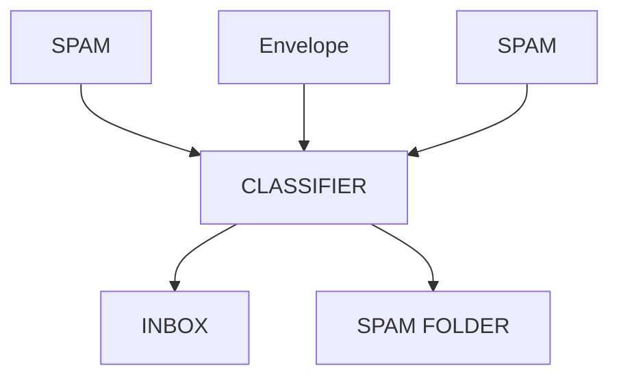
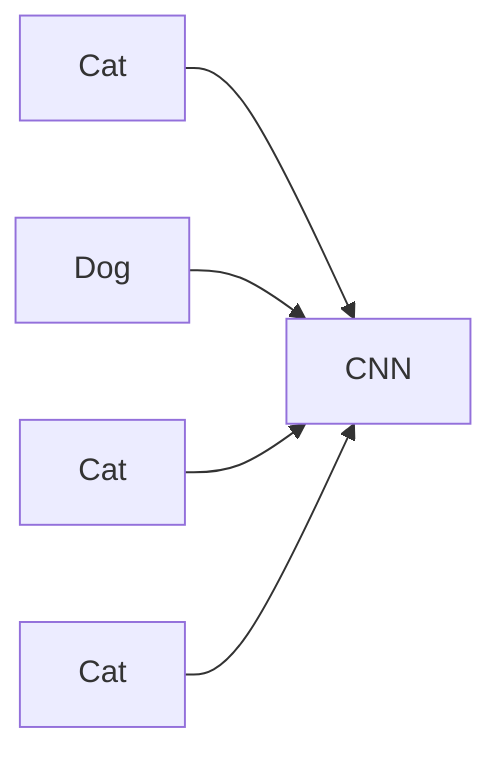
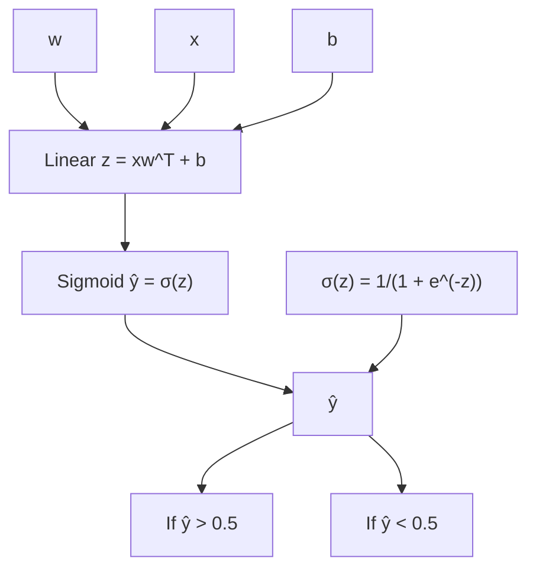
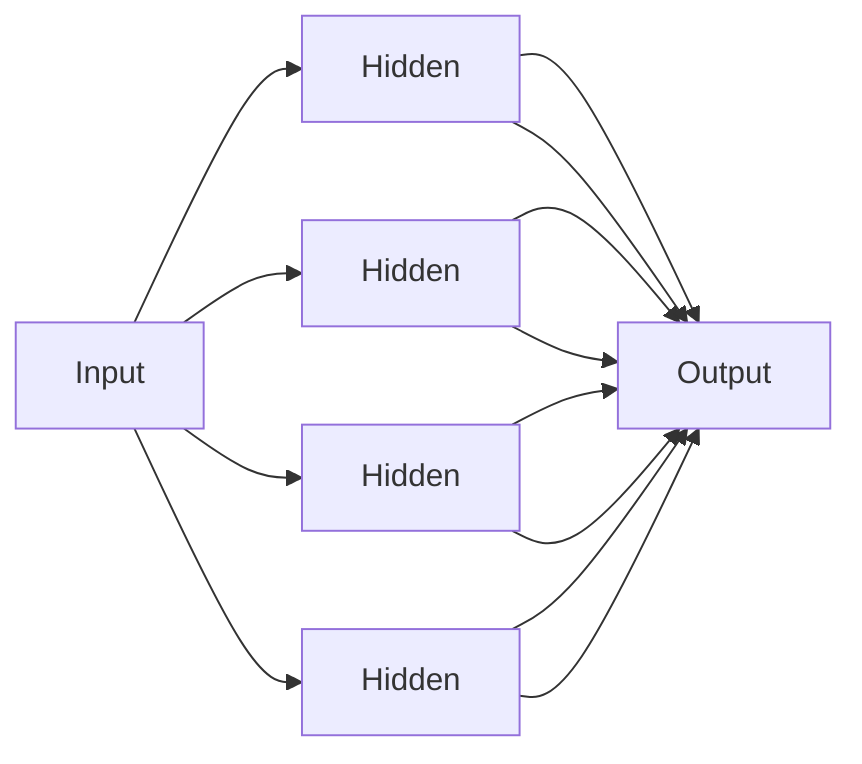
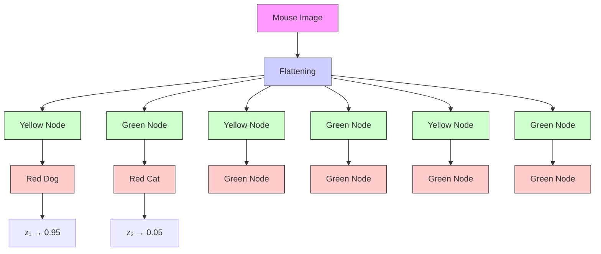
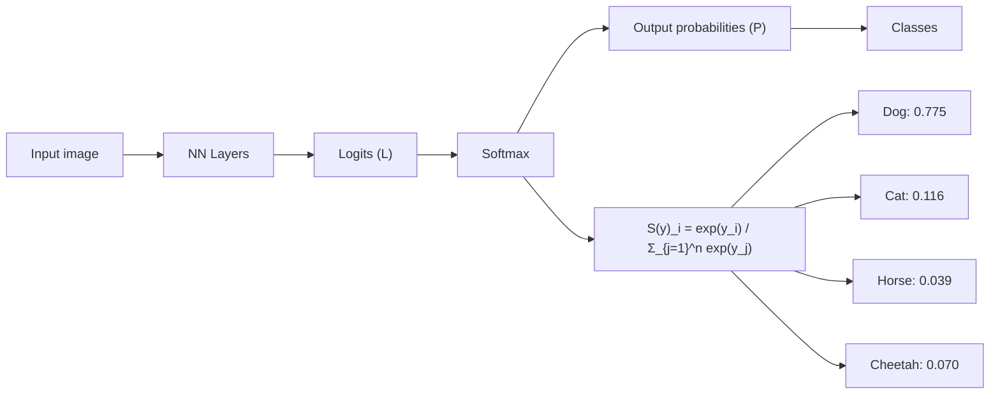
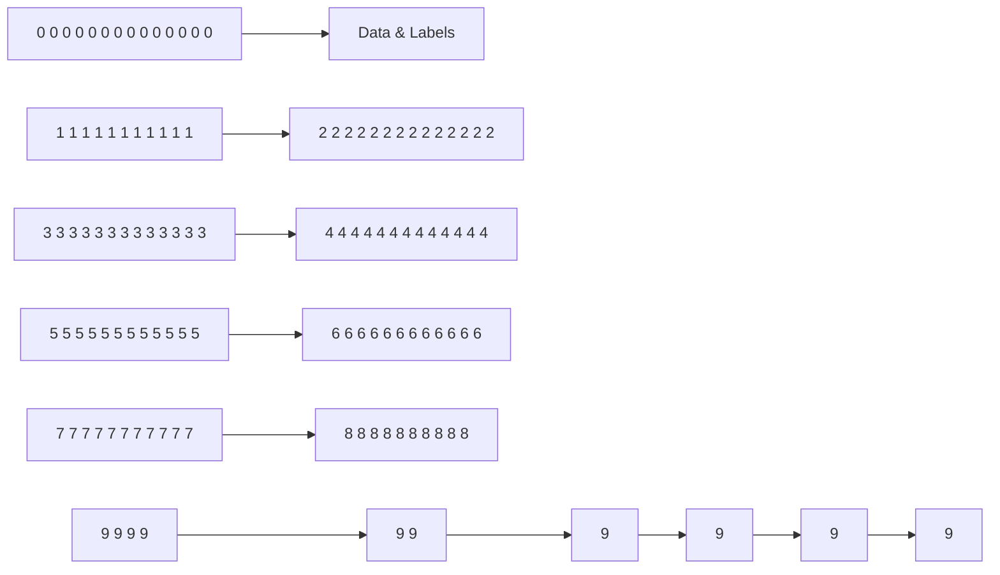

# AMA 564 Deep Learning

# 2026 Spring

# Lecture 6

1. Classification Revisit   
2. Binary Classification   
3. Multi-class Classifications


<details>
<summary>scatter</summary>

| x       | y       | group |
| ------- | ------- | ----- |
| -0.5    | 0.1     | A     |
| -0.4    | -0.3    | B     |
| -0.3    | 0.2     | A     |
| -0.2    | -0.1    | B     |
| -0.1    | 0.3     | A     |
| 0.0     | -0.2    | B     |
| 0.1     | 0.1     | A     |
| 0.2     | -0.4    | B     |
</details>

Classification


<details>
<summary>scatter</summary>

| x  | y  |
|----|----|
| 20 | 5  |
| 25 | 15 |
| 30 | 30 |
| 35 | 40 |
| 40 | 50 |
| 45 | 60 |
| 50 | 70 |
| 55 | 80 |
| 60 | 90 |
| 65 | 100|
| 70 | 95 |
| 75 | 90 |
| 80 | 85 |
| 85 | 80 |
| 90 | 75 |
| 95 | 70 |
| 100| 65 |
</details>

Regression   
Source: https://whataftercollege.com/machine-learning/classification-of-machine-learning/


<details>
<summary>flowchart</summary>


</details>

Spam Email Classification

Detection and Classification   


<details>
<summary>flowchart</summary>


</details>


<details>
<summary>scatter</summary>

| x1 | x2 | Class |
|----|----|-------|
| 0.1 | 0.3 | Red Circle |
| 0.2 | 0.4 | Red Circle |
| 0.3 | 0.5 | Red Circle |
| 0.4 | 0.6 | Red Circle |
| 0.5 | 0.7 | Red Circle |
| 0.6 | 0.8 | Red Circle |
| 0.7 | 0.9 | Red Circle |
| 0.8 | 1.0 | Red Circle |
| 0.9 | 1.1 | Red Circle |
| 1.0 | 1.2 | Red Circle |
| 0.1 | 0.2 | Green Plus |
| 0.2 | 0.3 | Green Plus |
| 0.3 | 0.4 | Green Plus |
| 0.4 | 0.5 | Green Plus |
| 0.5 | 0.6 | Green Plus |
| 0.6 | 0.7 | Green Plus |
| 0.7 | 0.8 | Green Plus |
| 0.8 | 0.9 | Green Plus |
| 0.9 | 1.0 | Green Plus |
| 1.0 | 1.1 | Green Plus |
| 1.1 | 1.2 | Green Plus |
| 1.2 | 1.3 | Green Plus |
| 1.3 | 1.4 | Green Plus |
| 1.4 | 1.5 | Green Plus |
| 1.5 | 1.6 | Green Plus |
| 1.6 | 1.7 | Green Plus |
| 1.7 | 1.8 | Green Plus |
| 1.8 | 1.9 | Green Plus |
| 1.9 | 2.0 | Green Plus |
| 2.0 | 2.1 | Green Plus |
| 2.1 | 2.2 | Green Plus |
| 2.2 | 2.3 | Green Plus |
| 2.3 | 2.4 | Green Plus |
| 2.4 | 2.5 | Green Plus |
| 2.5 | 2.6 | Green Plus |
| 2.6 | 2.7 | Green Plus |
| 2.7 | 2.8 | Green Plus |
| 2.8 | 2.9 | Green Plus |
| 2.9 | 3.0 | Green Plus |
| 3.0 | 3.1 | Green Plus |
| 3.1 | 3.2 | Green Plus |
| 3.2 | 3.3 | Green Plus |
| 3.3 | 3.4 | Green Plus |
| 3.4 | 3.5 | Green Plus |
| 3.5 | 3.6 | Green Plus |
| 3.6 | 3.7 | Green Plus |
| 3.7 | 3.8 | Green Plus |
| 3.8 | 3.9 | Green Plus |
| 3.9 | 4.0 | Green Plus |
| 4.0 | 4.1 | Green Plus |
| 4.1 | 4.2 | Green Plus |
| 4.2 | 4.3 | Green Plus |
| 4.3 | 4.4 | Green Plus |
| 4.4 | 4.5 | Green Plus |
| 4.5 | 4.6 | Green Plus |
| 4.6 | 4.7 | Green Plus |
| 4.7 | 4.8 | Green Plus |
| 4.8 | 4.9 | Green Plus |
| 4.9 | 5.0 | Green Plus |
| 5.0 | 5.1 | Green Plus |
| 5.1 | 5.2 | Green Plus |
| 5.2 | 5.3 | Green Plus |
| 5.3 | 5.4 | Green Plus |
| 5.4 | 5.5 | Green Plus |
| 5.5 | 5.6 | Green Plus |
| 5.6 | 5.7 | Green Plus |
| 5.7 | 5.8 | Green Plus |
| 5.8 | 5.9 | Green Plus |
| 5.9 | 6.0 | Green Plus |
| 6.0 | 6.1 | Green Plus |
| 6.1 | 6.2 | Green Plus |
| 6.2 | 6.3 | Green Plus |
| 6.3 | 6.4 | Green Plus |
| 6.4 | 6.5 | Green Plus |
| 6.5 | 6.6 | Green Plus |
| 6.6 | 6.7 | Green Plus |
| 6.7 | 6.8 | Green Plus |
| 6.8 | 6.9 | Green Plus |
| 6.9 | 7.0 | Green Plus |
| 7.0 | 7.1 | Green Plus |
| 7.1 | 7.2 | Green Plus |
| 7.2 | 7.3 | Green Plus |
| 7.3 | 7.4 | Green Plus |
| 7.4 | 7.5 | Green Plus |
| 7.5 | 7.6 | Green Plus |
| 7.6 | 7.7 | Green Plus |
| 7.7 | 7.8 | Green Plus |
| 7.8 | 7.9 | Green Plus |
| 7.9 | 8.0 | Green Plus |
| -    | -   | New Data Point (Blue Star) |
The chart includes a dashed reference line from the origin to the right.
</details>

Data $( X _ { i } , Y _ { i } ) , i = 1 , \dots , n$ i.i.d drawn from a distribution ???????? ????, ???? where

$$
Y _ {i} \in \{\mathbf {1}, \mathbf {0} \} (\mathbf {o r} Y _ {i} \in \{\mathbf {1}, - \mathbf {1} \}).
$$

To find a function ???? ⋅ to maximize

$$
\mathbb {P} (\boldsymbol {h} (X _ {0}) = Y _ {0})
$$

or equivalently to minimize

$$
\mathbb {P} (\boldsymbol {h} (X _ {0}) \neq Y _ {0})
$$

over

$$
\mathcal {H} = \{\boldsymbol {h}: \boldsymbol {h} (\cdot) \in \{\mathbf {1}, \mathbf {0} \} \}
$$

There are many ways to do classification:

Logistic Regression   
Support Vector Machine   
Deep Neural Networks

# Brief review

# on

# Classification methods

Note: you can still use Least square regression.


<details>
<summary>line</summary>

| Dependent Variable | Predicted Y |
| ------------------ | ----------- |
| y=0                | y=0         |
| y=1                | y=1         |
</details>


<details>
<summary>line</summary>

| Dependent Variable | Predicted Y Lies within 0 and 1 range |
| ------------------ | ------------------------------------ |
| y=0                | y=0                                  |
| y=1                | y=1                                  |
</details>

Recall that the target for least square is conditional mean:

$$
\mathbb {E} \{Y | X \} = 1 \times \mathbb {P} \{Y = 1 | X \} + 0 \times \mathbb {P} \{Y = 0 | X \} = \mathbb {P} \{Y = 1 | X \}
$$

It turns out to be the conditional probability of ???? = 1 given ????.

# Logistic Regression

Logistic Regression models the conditional probability $\_$


<details>
<summary>line</summary>

| x    | Linear Model | Logistic Model |
| ---- | ------------ | -------------- |
| 0    | -1           | 0              |
| 1    | 0            | 1              |
</details>

Logistic Regression targets at the estimation of $b _ { 0 }$ and $b _ { 1 }$ (univariate X)

# Logistic Regression


<details>
<summary>flowchart</summary>


</details>

Given a learned logistic model with parameters $\cdot$

We can calculate $-$ corresponding to a sample ????

Predict its label $\cdot$ , otherwise predict its label $Y = 0$ .

# Logistic Regression

• Logistic regression models the conditional probability

$$
\mathbb {P} \{Y = 1 | X \} = \frac {\exp (w ^ {\prime} X + b)}{1 + \exp (w ^ {\prime} X + b)}
$$

• Classify a sample ???? into category 1 if $\mathbb { P } \{ Y = 1 | X = x \} > 0 . 5$   
• Classify a sample ???? into category 0 if ${ \mathbb { P } } \{ Y = 1 | X = x \} < 0 . 5$   
• The decision boundary is linear $\{ x \colon w ^ { \prime } x + b = 0 \}$   
• Not suitable for data sets with non-linear boundary

In many cases, the data is not linearly separatable!


<details>
<summary>scatter</summary>

| x1 | x2 | Group |
|----|----|-------|
| 0.5 | 0.8 | Red |
| 0.6 | 0.7 | Red |
| 0.7 | 0.6 | Red |
| 0.8 | 0.5 | Red |
| 0.9 | 0.4 | Red |
| 0.3 | 0.9 | Blue |
| 0.4 | 0.85 | Blue |
| 0.55 | 0.75 | Blue |
| 0.65 | 0.65 | Blue |
| 0.75 | 0.55 | Blue |
| 0.85 | 0.45 | Blue |
| 0.95 | 0.35 | Blue |
| 0.25 | 0.95 | Blue |
| 0.35 | 0.85 | Blue |
| 0.45 | 0.75 | Blue |
| 0.55 | 0.65 | Blue |
| 0.65 | 0.55 | Blue |
| 0.75 | 0.45 | Blue |
| 0.85 | 0.35 | Blue |
| 0.95 | 0.25 | Blue |
</details>


<details>
<summary>scatter</summary>

| x1 | x2 | Type     |
|----|----|----------|
| 0.5  | 0.3| Blue     |
| 0.6  | 0.4| Red      |
| 0.7  | 0.5| Blue     |
| 0.8  | 0.6| Red      |
| 0.9  | 0.7| Blue     |
| 1.0  | 0.8| Red      |
| 1.1  | 0.9| Blue     |
| 1.2  | 1.0| Red      |
</details>

Source: https://vitalflux.com/classification-problems-real-world-examples/

  
Source:https://en.wikipedia.org/wiki/Support\_vector\_machine

Support vector machine aims to find a hyperplane with the largest margin to separate different class samples


<details>
<summary>scatter</summary>

| Group | X     | Y     |
|-------|-------|-------|
| Blue  | 1.2   | 3.5   |
| Blue  | 1.5   | 4.0   |
| Blue  | 1.8   | 3.8   |
| Blue  | 2.0   | 3.2   |
| Blue  | 2.2   | 2.8   |
| Blue  | 2.5   | 3.0   |
| Blue  | 2.8   | 3.6   |
| Green | 3.0   | 2.5   |
| Green | 3.2   | 3.0   |
| Green | 3.5   | 2.8   |
| Green | 3.8   | 3.5   |
| Green | 4.0   | 3.2   |
| Green | 4.2   | 2.9   |
| Green | 4.5   | 3.6   |
| Green | 4.8   | 3.3   |
</details>


<details>
<summary>scatter</summary>

| Group | X     | Y     |
|-------|-------|-------|
| Blue  | 1.2   | 3.5   |
| Blue  | 1.5   | 4.0   |
| Blue  | 1.8   | 3.8   |
| Blue  | 2.0   | 3.6   |
| Blue  | 2.2   | 3.4   |
| Blue  | 2.5   | 3.2   |
| Blue  | 2.8   | 3.0   |
| Blue  | 3.0   | 2.8   |
| Blue  | 3.2   | 2.6   |
| Blue  | 3.5   | 2.4   |
| Blue  | 3.8   | 2.2   |
| Green | 4.0   | 2.0   |
| Green | 4.2   | 2.2   |
| Green | 4.5   | 2.4   |
| Green | 4.8   | 2.6   |
| Green | 5.0   | 2.8   |
| Green | 5.2   | 3.0   |
| Green | 5.5   | 3.2   |
| Green | 5.8   | 3.4   |
| Green | 6.0   | 3.6   |
| Green | 6.2   | 3.8   |
| Green | 6.5   | 4.0   |
| Green | 6.8   | 4.2   |
| Green | 7.0   | 4.4   |
| Green | 7.2   | 4.6   |
| Green | 7.5   | 4.8   |
| Green | 7.8   | 5.0   |
| Green | 8.0   | 5.2   |
| Green | 8.2   | 5.4   |
| Green | 8.5   | 5.6   |
| Green | 8.8   | 5.8   |
| Green | 9.0   | 6.0   |
| Red   | -1.0  | -1.0  |
| Purple| -0.5  | -0.5  |
| Purple| 0.0   | 0.0   |
| Purple| 0.5   | 0.5   |
| Purple| 1.0   | 1.0   |
| Purple| 1.5   | 1.5   |
| Purple| 2.0   | 2.0   |
| Purple| 2.5   | 2.5   |
| Purple| 3.0   | 3.0   |
| Purple| 3.5   | 3.5   |
| Purple| 4.0   | 4.0   |
| Purple| 4.5   | 4.5   |
| Purple| 5.0   | 5.0   |
| Purple| 5.5   | 5.5   |
| Purple| 6.0   | 6.0   |
| Purple| 6.5   | 6.5   |
| Purple| 7.0   | 7.0   |
| Purple| 7.5   | 7.5   |
| Purple| 8.0   | 8.0   |
| Purple| 8.5   | 8.5   |
| Purple| 9.0   | 9.0   |
| Purple| 9.5   | 9.5   |
| Purple| -1.5  | -1.5  |
| Yellow| -1.0  | -1.0  |
| Yellow| -0.5  | -0.5  |
| Yellow| 0.0   | 0.0   |
| Yellow| 0.5   | 0.5   |
| Yellow| 1.0   | 1.0   |
| Yellow| 1.5   | 1.5   |
| Yellow| -1.0  | -1.0  |
| Yellow| -0.5  | -0.5  |
| Yellow| -1.0  | -1.0  |
| Yellow| -1.5  | -1.5  |
| Yellow| -2.0  | -2.0  |
| Yellow| -2.5  | -2.5  |
| Yellow| -3.0  | -3.0  |
| Yellow| -3.5  | -3.5  |
| Yellow| -4.0  | -4.0  |
| Yellow| -4.5  | -4.5  |
| Yellow| -5.0  | -5.0  |
| Yellow| -5.5  | -5.5  |
| Yellow| -6.0  | -6.0  |
| Yellow| -6.5  | -6.5  |
| Yellow| -7.0  | -7.0  |
| Yellow| -7.5  | -7.5  |
| Yellow| -8.0  | -8.0  |
| Yellow| -8.5  | -8.5  |
| Yellow| -9.0  | -9.0  |
| Yellow| -9.5  | -9.5  |
| Yellow| -10.0 | -10.0 |
The chart displays a scatter plot with two data series: blue diamonds (Y) and green circles (Y), plotted against a vertical axis labeled 'X' and horizontal axis labeled 'Y'. The red line represents the trend of the purple line, and the black line represents the vertical line of the yellow line at X=1.
</details>

Source:https://www.analyticsvidhya.com/blog/2021/10/support-vector-machinessvm-a-complete-guide-for-beginners/

There could be many hyperplanes that can separate different class samples.


<details>
<summary>scatter</summary>

| Type             | X Coordinate | Y Coordinate |
| ---------------- | ------------ | ------------ |
| Support vector   | 0.1          | 0.3          |
| Support vector   | 0.2          | 0.4          |
| Support vector   | 0.3          | 0.5          |
| Support vector   | 0.4          | 0.6          |
| Support vector   | 0.5          | 0.7          |
| Support vector   | 0.6          | 0.8          |
| Support vector   | 0.7          | 0.9          |
| Support vector   | 0.8          | 1.0          |
| Support vector   | 0.9          | 1.1          |
| Support vector   | 1.0          | 1.2          |
| Optimal Hyperplane| 0.1          | 0.2          |
| Optimal Hyperplane| 0.2          | 0.3          |
| Optimal Hyperplane| 0.3          | 0.4          |
| Optimal Hyperplane| 0.4          | 0.5          |
| Optimal Hyperplane| 0.5          | 0.6          |
| Optimal Hyperplane| 0.6          | 0.7          |
| Optimal Hyperplane| 0.7          | 0.8          |
| Optimal Hyperplane| 0.8          | 0.9          |
| Optimal Hyperplane| 0.9          | 1.0          |
| Optimal Hyperplane| 1.0          | 1.1          |
| Optimal Hyperplane| 1.1          | 1.2          |
| Optimal Hyperplane| 1.2          | 1.3          |
| Optimal Hyperplane| 1.3          | 1.4          |
| Optimal Hyperplane| 1.4          | 1.5          |
| Optimal Hyperplane| 1.5          | 1.6          |
| Optimal Hyperplane| 1.6          | 1.7          |
| Optimal Hyperplane| 1.7          | 1.8          |
| Optimal Hyperplane| 1.8          | 1.9          |
| Optimal Hyperplane| 1.9          | 2.0          |
| Optimal Hyperplane| 2.0          | 2.1          |
| Optimal Hyperplane| 2.1          | 2.2          |
| Optimal Hyperplane| 2.2          | 2.3          |
| Optimal Hyperplane| 2.3          | 2.4          |
| Optimal Hyperplane| 2.4          | 2.5          |
| Optimal Hyperplane| 2.5          | 2.6          |
| Optimal Hyperplane| 2.6          | 2.7          |
| Optimal Hyperplane| 2.7          | 2.8          |
| Optimal Hyperplane| 2.8          | 2.9          |
| Optimal Hyperplane| 2.9          | 3.0          |
| Optimal Hyperplane| 3.0          | 3.1          |
| Optimal Hyperplane| 3.1          | 3.2          |
| Optimal Hyperplane| 3.2          | 3.3          |
| Optimal Hyperplane| 3.3          | 3.4          |
| Optimal Hyperplane| 3.4          | 3.5          |
| Optimal Hyperplane| 3.5          | 3.6          |
| Optimal Hyperplane| 3.6          | 3.7          |
| Optimal Hyperplane| 3.7          | 3.8          |
| Optimal Hyperplane| 3.8          | 3.9          |
| Optimal Hyperplane| 3.9          | 4.0          |
| Optimal Hyperplane| 4.0          | 4.1          |
| Optimal Hyperplane| 4.1          | 4.2          |
| Optimal Hyperplane| 4.2          | 4.3          |
| Optimal Hyperplane| 4.3          | 4.4          |
| Optimal Hyperplane| 4.4          | 4.5          |
| Optimal Hyperplane| 4.5          | 4.6          |
| Optimal Hyperplane| 4.6          | 4.7          |
| Optimal Hyperplane| 4.7          | 4.8          |
| Optimal Hyperplane| 4.8          | 4.9          |
| Optimal Hyperplane| 4.9          | 5.0          |
| Optimal Hyperplane| 5.0          | 5.1          |
| Support vector    | -            | -            |
| Support vector    | -            | -            |
| Support vector    | -            | -            |
| Support vector    | -            | -            |
| Support vector    | -            | -            |
| Support vector    | -            | -            |
| Support vector    | -            | -            |
| Support vector    | -            | -            |
| Support vector    | -            | -            |
| Support vector    | -            | -            |
</details>

Source:https://www.analyticsvidhya.com/blog/2021/10/support-vector-machinessvm-a-complete-guide-for-beginners/

The best hyperplane is that plane that has the maximum distance from both the classes, and this is the main aim of SVM.


<details>
<summary>scatter</summary>

| Type             | X Coordinate | Y Coordinate |
| ---------------- | ------------ | ------------ |
| Support vector   | 0.1          | 0.8          |
| Support vector   | 0.2          | 0.7          |
| Support vector   | 0.3          | 0.6          |
| Support vector   | 0.4          | 0.5          |
| Support vector   | 0.5          | 0.4          |
| Support vector   | 0.6          | 0.3          |
| Support vector   | 0.7          | 0.2          |
| Support vector   | 0.8          | 0.1          |
| Support vector   | 0.9          | 0.0          |
| Optimal Hyperplane| 0.1          | 0.9          |
| Optimal Hyperplane| 0.2          | 0.8          |
| Optimal Hyperplane| 0.3          | 0.7          |
| Optimal Hyperplane| 0.4          | 0.6          |
| Optimal Hyperplane| 0.5          | 0.5          |
| Optimal Hyperplane| 0.6          | 0.4          |
| Optimal Hyperplane| 0.7          | 0.3          |
| Optimal Hyperplane| 0.8          | 0.2          |
| Optimal Hyperplane| 0.9          | 0.1          |
| Optimal Hyperplane| 1.0          | 0.0          |
| Maximised margin | -            | -            |
| Optimal Hyperplane| -            | -            |
| Support vector   | -            | -            |
| Support vector   | -            | -            |
| Support vector   | -            | -            |
| Support vector   | -            | -            |
| Support vector   | -            | -            |
| Support vector   | -            | -            |
| Support vector   | -            | -            |
| Support vector   | -            | -            |
| Support vector   | -            | -            |
| Support vector   | 0.1          | -            |
| Support vector   | 0.2          | -            |
| Support vector   | 0.3          | -            |
| Support vector   | 0.4          | -            |
| Support vector   | 0.5          | -            |
| Support vector   | 0.6          | -            |
| Support vector   | 0.7          | -            |
| Support vector   | 0.8          | -            |
| Support vector   | 0.9          | -            |
| Support vector   | 1.0          | -            |
| Support vector   | 1.1          | -            |
| Support vector   | 1.2          | -            |
| Support vector   | 1.3          | -            |
| Support vector   | 1.4          | -            |
| Support vector   | 1.5          | -            |
| Support vector   | 1.6          | -            |
| Support vector   | 1.7          | -            |
| Support vector   | 1.8          | -            |
| Support vector   | 1.9          | -            |
| Support vector   | 2.0          | -            |
| Support vector   | 2.1          | -            |
| Support vector   | 2.2          | -            |
| Support vector   | 2.3          | -            |
| Support vector   | 2.4          | -            |
| Support vector   | 2.5          | -            |
| Support vector   | 2.6          | -            |
| Support vector   | 2.7          | -            |
| Support vector   | 2.8          | -            |
| Support vector   | 2.9          | -            |
| Support vector   | 3.0          | -            |
| Support vector   | 3.1          | -            |
| Support vector   | 3.2          | -            |
| Support vector   | 3.3          | -            |
| Support vector   | 3.4          | -            |
| Support vector   | 3.5          | -            |
| Support vector   | 3.6          | -            |
| Support vector   | 3.7          | -            |
| Support vector   | 3.8          | -            |
| Support vector   | 3.9          | -            |
| Support vector   | 4.0          | -            |
| Support vector   | 4.1          | -            |
| Support vector   | 4.2          | -            |
| Support vector   | 4.3          | -            |
| Support vector   | 4.4          | -            |
| Support vector   | 4.5          | -            |
| Support vector   | 4.6          | -            |
| Support vector   | 4.7          | -            |
| Support vector   | 4.8          | -            |
| Support vector   | 4.9          | -            |
| Support vector   | 5.0          | -            |
| Support vector   | 5.1          | -            |
| Support vector   | 5.2          | -            |
| Support vector   | 5.3          | -            |
| Support vector   | 5.4          | -            |
| Support vector   | 5.5          | -            |
| Support vector   | 5.6          | -            |
| Support vector   | 5.7          | -            |
| Support vector   | 5.8          | -            |
| Support vector   | 5.9          | -            |
| Support vector   | 6.0          | -            |
| Support vector   | 6.1          | -            |
| Support vector   | 6.2          | -            |
| Support vector   | 6.3          | -            |
| Support vector   | 6.4          | -            |
| Support vector   | 6.5          | -            |
| Support vector   | 6.6          | -            |
| Support vector   | 6.7          | -            |
| Support vector   | 6.8          | -            |
| Support vector   | 6.9          | -            |
| Support vector   | 7.0          | -            |
| Support vector   | 7.1          | -            |
| Support vector   | 7.2          | -            |
| Support vector   | 7.3          | -            |
| Support vector   | 7.4          | -            |
| Support vector   | 7.5          | -            |
| Support vector   | 7.6          | -            |
| Support vector   | 7.7          | -            |
| Support vector   | 7.8          | -            |
| Support vector   | 7.9          | -            |
| Support vector   | 8.0          | -            |
| Support vector   | 8.1          | -            |
| Support vector   | 8.2          | -            |
| Support vector   | 8.3          | -            |
| Support vector   | 8.4          | -            |
| Support vector   | 8.5          | -            |
| Support vector   | 8.6          | -            |
| Support vector   | 8.7          | -            |
| Support vector   | 8.8          | -            |
| Support vector   | 8.9          | -            |
| Support vector   | 9.0          | -            |
| Support vector   | 9.1          | -            |
| Support vector   | 9.2          | -            |
| Support vector   | 9.3          | -            |
| Support vector   | 9.4          | -            |
| Support vector   | 9.5          | -            |
| Support vector   | 9.6          | -            |
| Support vector   | 9.7          | -            |
| Support vector   | 9.8          | -            |
| Support vector   | 9.9          | -            |
| Support vector   | 10.0         | -            |
| Optimal Hyperplane    A       B       A       C        D        E        F        G        H        I        J        K        L        M        N        O        P        Q        R        S        T        U        V        W        X        Y        Z        AA        AB        AC        AD        AE        AF        AG        AH        AI        AJ        AK        AL        AM        AN        AO        AP        AQ        AQ        AR        AS        AT        AU        AV        AW        AX         AX         AX         AX         AX         AX         AX         AX         AX         AX         AX         AX         AX         AX         AX         AX         AX         AX         AX         AX         AX         AX         AX         AX         AX         AX         AX         AX         AX         AX         AX         AX         AX         AX         AX         AX         AX         AX         AX         AX         AX         AX         AX         AX         AX         AX         AX         AX         AX         AX         AX
    style Blue Diamond (Support)      Blue Circle (Optimal Hyperplane)     Blue Square (Support)      Blue Circle (Optimal Hyperplane)     Blue Square (Optimal Hyperplane)     Blue Square (Optimal Hyperplane)     Blue Square (Optimal Hyperplane)     Blue Square (Optimal Hyperplane)     Blue Square (Optimal Hyperplane)     Blue Square (Optimal Hyperplane)     Blue Square (Optimal Hyperplane)     Blue Square (Optimal Hyperplane)     Blue Square (Optimal Hyperplane)     Blue Square (Optimal Hyperplane)     Blue Square (Optimal Hyperplane)     Blue Square(Optimal Hyperplane)     Blue Square(Optimal Hyperplane)     Blue Square(Optimal Hyperplane)     Blue Square(Optimal Hyperplane)     Blue Square(Optimal Hyperplane)     Blue Square(Optimal Hyperplane)     Blue Square(Optimal Hyperplane)     Blue Square(Optimal Hyperplane)     Blue Square(Optimal Hyperplane)     Blue Square(Optimal Hyperplane)     Blue Square(Optimal Hyperplane)     Blue Square(Outperform Hyperplane)    Blue Square(Outperform Hyperplane)    Blue Square(Outperform Hyperplane)    Blue Square(Outperform Hyperplane)    Blue Square(Outperform Hyperplane)    Blue Square(Outperform Hyperplane)    Blue Square(Outperform Hyperplane)    Blue Square(Outperform Hyperplane)    Blue Square(Outperform Hyperplane)    Blue Square(Outperform Hyperplane)    Blue Square(Outperform Hyperplane)    Blue Square(Outperform Hyperplane)    Orange Square(Outperform Hyperplane)    Red Square(Outperform Hyperplane)    Green Square(Outperform Hyperplane)    Red Square(Outperform Hyperplane)    Green Square(Outperform Hyperplane)    Red Square(Outperform Hyperplane)    Red Square(Outperform Hyperplane)    Red Square(Outperform Hyperplane)    Red Square(Outperform Hyperplane)    Red Square(Outperform Hyperplane)    Red Square(Outperform Hyperplane)    Red Square(Outperform Hyperplane)    Red Square(Outperform Hyperplane)    Red Square(Outperform Hyperplane)    Red Square(Outperform Hyperplane)    Red Square(Outperform Hyperplane)    Red Circle(Outperform Hyperplane)    Green Circle(Outperform Hyperplane)    Green Circle(Outperform Hyperplane)    Green Circle(Outperform Hyperplane)    Green Circle(Outperform Hyperplane)    Green Circle(Outperform Hyperplane)    Green Circle(Outperform Hyperplane)    Green Circle(Outperform Hyperplane)    Green Circle(Outperform Hyperplane)    Green Circle(Outperform Hyperplane)    Green Circle(Outperform Hyperplane)    Green Circle(Outperform Hyperplane)    Green Triangle(Outperform Hyperplane)    Red Triangle(Outperform Hyperplane)    Red Circle(Outperform Hyperplane)    Red Circle(Outperform Hyperplane)    Red Circle(Outperform Hyperplane)    Red Circle(Outperform Hyperplane)    Red Circle(Outperform Hyperplane)    Red Circle(Outperform Hyperplane)    Red Circle(Outperform Hyperplane)    Red Circle(Outperform Hyperplane)    Red Circle(Outperform Hyperplane)    Red Circle(Outperform Hyperplane)    Red Circle(Outperform Hyperplane)
    Note: The chart is a schematic representation of the structure used in the diagram to generate a table from the original table to the original table as shown in the code.
</details>

The best hyperplane only depends on a subset of the sample. These sample are called support vectors.

Recommend Reference Materials

# Support Vector Machine is also a linear classifier.


<details>
<summary>scatter</summary>

| x1 | x2 | Group |
|----|----|-------|
| 0.5 | 0.8 | Red |
| 0.6 | 0.7 | Red |
| 0.7 | 0.6 | Red |
| 0.8 | 0.9 | Red |
| 0.9 | 0.5 | Red |
| 1.0 | 0.4 | Red |
| 1.1 | 0.3 | Red |
| 1.2 | 0.2 | Red |
| 1.3 | 0.1 | Red |
| 1.4 | 0.05 | Blue |
| 1.5 | 0.15 | Blue |
| 1.6 | 0.25 | Blue |
| 1.7 | 0.35 | Blue |
| 1.8 | 0.45 | Blue |
| 1.9 | 0.55 | Blue |
| 2.0 | 0.65 | Blue |
| 2.1 | 0.75 | Blue |
| 2.2 | 0.85 | Blue |
| 2.3 | 0.95 | Blue |
| 2.4 | 1.05 | Blue |
| 2.5 | 1.15 | Blue |
| 2.6 | 1.25 | Blue |
| 2.7 | 1.35 | Blue |
| 2.8 | 1.45 | Blue |
| 2.9 | 1.55 | Blue |
| 3.0 | 1.65 | Blue |
| 3.1 | 1.75 | Blue |
| 3.2 | 1.85 | Blue |
| 3.3 | 1.95 | Blue |
| 3.4 | 2.05 | Blue |
| 3.5 | 2.15 | Blue |
| 3.6 | 2.25 | Blue |
| 3.7 | 2.35 | Blue |
| 3.8 | 2.45 | Blue |
| 3.9 | 2.55 | Blue |
| 4.0 | 2.65 | Blue |
| 4.1 | 2.75 | Blue |
| 4.2 | 2.85 | Blue |
| 4.3 | 2.95 | Blue |
| 4.4 | 3.05 | Blue |
| 4.5 | 3.15 | Blue |
| 4.6 | 3.25 | Blue |
| 4.7 | 3.35 | Blue |
| 4.8 | 3.45 | Blue |
| 4.9 | 3.55 | Blue |
| 5.0 | 3.65 | Blue |
| 5.1 | 3.75 | Blue |
| 5.2 | 3.85 | Blue |
| 5.3 | 3.95 | Blue |
| 5.4 | 4.05 | Blue |
| 5.5 | 4.15 | Blue |
| 5.6 | 4.25 | Blue |
| 5.7 | 4.35 | Blue |
| 5.8 | 4.45 | Blue |
| 5.9 | 4.55 | Blue |
| 6.0 | 4.65 | Blue |
| 6.1 | 4.75 | Blue |
| 6.2 | 4.85 | Blue |
| 6.3 | 4.95 | Blue |
| 6.4 | 5.05 | Blue |
| 6.5 | 5.15 | Blue |
| 6.6 | 5.25 | Blue |
| 6.7 | 5.35 | Blue |
| 6.8 | 5.45 | Blue |
| 6.9 | 5.55 | Blue |
| 7.0 | 5.65 | Blue |
| 7.1 | 5.75 | Blue |
| 7.2 | 5.85 | Blue |
| 7.3 | 5.95 | Blue |
| 7.4 | 6.05 | Blue |
| 7.5 | 6.15 | Blue |
| 7.6 | 6.25 | Blue |
| 7.7 | 6.35 | Blue |
| 7.8 | 6.45 | Blue |
| 7.9 | 6.55 | Blue |
| 8.0 | 6.65 | Blue |
| 8.1 | 6.75 | Blue |
| 8.2 | 6.85 | Blue |
| 8.3 | 6.95 | Blue |
| 8.4 | 7.05 | Blue |
| 8.5 | 7.15 | Blue |
| 8.6 | 7.25 | Blue |
| 8.7 | 7.35 | Blue |
| 8.8 | 7.45 | Blue |
| 8.9 | 7.55 | Blue |
| 9.0 | 7.65 | Blue |
| 9.1 | 7.75 | Blue |
| 9.2 | 7.85 | Blue |
| 9.3 | 7.95 | Blue |
| 9.4 | 8.05 | Blue |
| 9.5 | 8.15 | Blue |
| 9.6 | 8.25 | Blue |
| 9.7 | 8.35 | Blue |
| 9.8 | 8.45 | Blue |
| 9.9 | 8.55 | Blue |
| - - - - - - - - - - - - - - - - - - - - - - - - - - - - - - - - - - - - - - - - - - - - - - - - - - - - - - - - - - - - - - - - - - - - - - - - - - - - - - - - - - - - - - - - - - - - - - - - - - - - (X-axis) vs X₁ (Y-axis).
</details>


<details>
<summary>scatter</summary>

| x1 | x2 | Type  |
|----|----|-------|
| 0.5  | 0.8| Blue Square |
| 0.6  | 0.7| Red Circle |
| 0.7  | 0.9| Blue Square |
| 0.8  | 0.6| Red Circle |
| 0.9  | 0.7| Blue Square |
| 0.4  | 0.9| Red Circle |
| 0.3  | 0.5| Blue Square |
| 0.45 | 0.85| Blue Square |
| 0.55 | 0.65| Red Circle |
| 0.65 | 0.75| Blue Square |
| 0.75 | 0.85| Red Circle |
| 0.85 | 0.95| Blue Square |
| 0.95 | 0.75| Red Circle |
</details>

Source: https://vitalflux.com/classification-problems-real-world-examples/

# Support Vector Machine with Kernel Trick


<details>
<summary>text_image</summary>

Diagram illustrating a transformation or mapping process with labeled points and curves, showing a red solid line and dashed boundary lines.
</details>

Using nonlinear kernels allows the algorithm to fit the maximum-margin hyperplane in a transformed feature space.

Although the classifier is a hyperplane in the transformed feature space, it may be nonlinear in the original input space.

# Support Vector Machine with Kernel Trick


<details>
<summary>text_image</summary>

kernel
Decision surface
</details>

The transformed feature space can be a higher-dimensional space.

# How to use Deep Neural Networks

# to do

# Binary classification?


<details>
<summary>scatter</summary>

| Group | X1     | X2     |
|-------|--------|--------|
| Red   | 0.1    | 0.3    |
| Red   | 0.2    | 0.4    |
| Red   | 0.3    | 0.5    |
| Red   | 0.4    | 0.6    |
| Red   | 0.5    | 0.7    |
| Red   | 0.6    | 0.8    |
| Red   | 0.7    | 0.9    |
| Red   | 0.8    | 1.0    |
| Green | 0.9    | 0.1    |
| Green | 1.0    | 0.2    |
| Green | 1.1    | 0.3    |
| Green | 1.2    | 0.4    |
| Green | 1.3    | 0.5    |
| Green | 1.4    | 0.6    |
| Green | 1.5    | 0.7    |
| Green | 1.6    | 0.8    |
| Green | 1.7    | 0.9    |
| Green | 1.8    | 1.0    |
</details>

Data $( X _ { i } , Y _ { i } ) , i = 1 , \dots , n$ i.i.d drawn from a distribution ???????? $( X , Y )$ where ${ \cal Y } _ { i } \in \{ { \bf 1 } , - { \bf 1 } \}$ .   
To find a function $( \cdot )$ to maximize

$$
\mathbb {P} (\boldsymbol {h} (X _ {0}) = Y _ {0})
$$

or equivalently to minimize

$$
\mathbb {P} (\boldsymbol {h} (X _ {0}) \neq Y _ {0})
$$

over

$$
\mathcal {H} = \{\boldsymbol {h}: \boldsymbol {h} (\cdot) \in \{\mathbf {1}, - \mathbf {1} \} \}
$$

Empirical risk minimization:

to find a function $( \cdot )$ to minimize

$$
\frac {1}{n} \sum_ {i = 1} ^ {n} I (h (X _ {i}) \neq Y _ {i})
$$

over

$$
\mathcal {H} = \{\boldsymbol {h}: \boldsymbol {h} (\cdot) \in \{\mathbf {1}, - \mathbf {1} \} \}
$$

# Empirical risk minimization: to find a function ???? ⋅ to minimize

$$
\frac {1}{n} \sum_ {i = 1} ^ {n} I (\boldsymbol {h} (X _ {i}) \neq Y _ {i})
$$

over

$$
\mathcal {H} = \{\boldsymbol {h} \colon \boldsymbol {h} (\cdot) \in \{\mathbf {1}, - \mathbf {1} \} \}.
$$

• 0-1 Loss function ????(⋅): non-continuous, non-smooth   
Classifier ????(⋅): not regular smooth function   
The optimization problem is extremely hard !


<details>
<summary>natural_image</summary>

3D surface plot with color gradient showing elevation and terrain features (no text or labels)
</details>

Source: https://arxiv.org/pdf/1712.09913.pdf

The loss surface under 0-1 loss can be extremely complicated !

The optimization problem is extremely hard !

# Empirical risk minimization: to find a function ???? ⋅ to minimize

$$
\frac {1}{n} \sum_ {i = 1} ^ {n} L (f (X _ {i}, \theta), Y _ {i})
$$

over

$$
\mathcal {F} = \{f: f (x; \theta) \text {is a neural network}
$$

???? ???? ???? ???? ???????? $\pmb \theta \in \mathbb { R } ^ { s }$ ???? }.

# We expect

Surrogate Loss function $\pmb { L } ( \cdot , \cdot )$ : continuous, smooth   
• Neural network $f ( \cdot ; \theta )$ : output continuous value   
• The estimation easy to implement and explain

Empirical risk minimization: to find a function ???? ⋅ to minimize

$$
\frac {1}{n} \sum_ {i = 1} ^ {n} L (f (X _ {i}, \theta), Y _ {i})
$$

over

$$
\mathcal {F} = \{f: f (x; \theta) \text {   is   a   neural   network   }
$$

???? ???? ???? ???? ???????? $\mathbf { \xi } \in \mathbb { R } ^ { s }$ ???? }.

Idea: use threshold value to create a classifier

$$
\boldsymbol {h} (\boldsymbol {X} _ {i}, \theta) = \operatorname{sgn} \{\boldsymbol {f} (\boldsymbol {X} _ {i}, \theta) \}
$$

If $\mathbf { \Sigma } ( { \pmb x } _ { \mathbf { 0 } } ; \mathbf { \Sigma } ) > \mathbf { 0 }$ , then predict $\widehat { y } _ { 0 } = + 1$ ;

${ \sf I f } f ( x _ { 0 } ; \theta ) < { \bf 0 }$ , then predict $\widehat { y } _ { 0 } = - 1$ .


<details>
<summary>scatter</summary>

| x | y |
| --- | --- |
| 0.1 | 0.2 |
| 0.3 | 0.4 |
| 0.5 | 0.6 |
| 0.7 | 0.8 |
| 0.9 | 1.0 |
| 1.1 | 1.2 |
| 1.3 | 1.4 |
| 1.5 | 1.6 |
| 1.7 | 1.8 |
| 1.9 | 2.0 |
| 2.1 | 2.2 |
| 2.3 | 2.4 |
| 2.5 | 2.6 |
| 2.7 | 2.8 |
| 2.9 | 3.0 |
| 3.1 | 3.2 |
| 3.3 | 3.4 |
| 3.5 | 3.6 |
| 3.7 | 3.8 |
| 3.9 | 4.0 |
| 4.1 | 4.2 |
| 4.3 | 4.4 |
| 4.5 | 4.6 |
| 4.7 | 4.8 |
| 4.9 | 5.0 |
| 5.1 | 5.2 |
| 5.3 | 5.4 |
| 5.5 | 5.6 |
| 5.7 | 5.8 |
| 5.9 | 6.0 |
| 6.1 | 6.2 |
| 6.3 | 6.4 |
| 6.5 | 6.6 |
| 6.7 | 6.8 |
| 6.9 | 7.0 |
| 7.1 | 7.2 |
| 7.3 | 7.4 |
| 7.5 | 7.6 |
| 7.7 | 7.8 |
| 7.9 | 8.0 |
| 8.1 | 8.2 |
| 8.3 | 8.4 |
| 8.5 | 8.6 |
| 8.7 | 8.8 |
| 8.9 | 9.0 |
| 9.1 | 9.2 |
| 9.3 | 9.4 |
| 9.5 | 9.6 |
| 9.7 | 9.8 |
| 9.9 | 10.0 |
</details>

Source: https://www.flair-tech.com/en/why-anomaly-detection-is-not-binary-classification/

# Idea: use threshold value to create a classifier

$$
\boldsymbol {h} (\boldsymbol {X} _ {i}, \boldsymbol {\theta}) = s g \boldsymbol {n} \{\boldsymbol {f} (\boldsymbol {X} _ {i}, \boldsymbol {\theta}) \}
$$

If $f ( x _ { 0 } ; \theta ) > 0$ , then predict $\widehat { y } _ { 0 } = + 1$ ;

$\begin{array} { r l } { | \mathbf { f } } & { { } ( x _ { 0 } ; ~ ) < \mathbf { 0 } } \end{array}$ , then predict $\widehat { y } _ { 0 } = - 1$ .

Empirical risk minimization: to find a function ???? ⋅ to minimize

$$
\frac {1}{n} \sum_ {i = 1} ^ {n} \phi (\textbf {\textit {f}} (X _ {i}, \theta) \times Y _ {i})
$$

where $\phi ( \cdot )$ in general is continuous and decreasing.

????( $\phi ( \cdot )$ is the surrogate loss function.

Idea:

If label $Y _ { i } = + 1$ , then larger positive $\left( { { X } _ { i } } ; \begin{array} { l } { } \end{array} \right) > \mathbf { 0 }$ decreases the loss, and it predicts $\widehat { Y } _ { i } = + 1$ .

If label $Y _ { i } = - 1$ , then smaller negative $f ( X _ { i } ; \theta ) < \mathbf { 0 }$ decreases the loss. and it predicts $\widehat { Y } _ { i } = - 1$ .


<details>
<summary>line</summary>

| x    | Hinge | Logistic | Exponential | Zero-One |
| ---- | ----- | -------- | ----------- | -------- |
| -3   | 4.0   | 3.0      | 5.0         | 1.0      |
| 0    | 1.0   | 0.7      | 1.0         | 1.0      |
| 1    | 0.0   | 0.3      | 0.3         | 0.0      |
| 3    | 0.0   | 0.0      | 0.0         | 0.0      |
</details>

0-1 loss:

$$
\phi (\mathbf {y} \cdot \mathbf {f} (x, \theta)) = I (\mathbf {y} \cdot \mathbf {f} (x, \theta) <   \mathbf {0})
$$

Exponential loss (AdaBoost):

$$
\phi (\mathbf {y} \cdot \mathbf {f} (x, \theta)) = e x p (- \mathbf {y} \cdot \mathbf {f} (x, \theta))
$$

Logistic loss :

$$
\boldsymbol {\phi} (\mathbf {y} \cdot \boldsymbol {f} (x, \theta)) = \log \left\{\mathbf {1} + e x p [ - \mathbf {y} \cdot \boldsymbol {f} (x, \theta) ] \right\}
$$

Hinge loss (SVM):

$$
\boldsymbol {\phi} (\mathbf {y} \cdot \boldsymbol {f} (x, \theta)) = \max \{\mathbf {1} - \mathbf {y} \cdot \boldsymbol {f} (x, \theta), \mathbf {0} \}
$$

• Given a surrogate loss $\phi ,$ let $\begin{array} { r } { \hat { \boldsymbol { f } } _ { n } = \boldsymbol { a r g m i n } \frac { 1 } { n } \sum _ { i = 1 } ^ { n } \phi ( f ( \boldsymbol { X } _ { i } , \boldsymbol { \theta } ) \times \boldsymbol { Y } _ { i } ) } \end{array}$ ????   
• Let $\widehat { h } _ { n } = s g n ( \widehat { f } _ { n } )$ be a classifier based on $\hat { \ b { f } } _ { n }$   
• Then $\widehat { h } _ { n }$ is a good classifier in the sense that when sample size n is very large,

$$
\widehat {\boldsymbol {h}} _ {n} \approx a r g m i n \frac {1}{n} \sum_ {i = 1} ^ {n} I (\boldsymbol {h} (X _ {i}) \neq Y _ {i})
$$

Proper surrogate loss function will lead to a consistent classifier.

Suggested Reference:

Bartlett, P. L., Jordan, M. I., & McAuliffe, J. D. (2006). Convexity, classification, and risk bounds. Journal of the American Statistical Association, 101(473), 138-156.

# How to use Deep Neural Networks

# to do

# Multi-class classification?

For binary classification, label $Y = + 1 \thinspace \mathbf { o r } \thinspace Y = - 1$ stands for different classes.   
• What if there are more than 2 classes (categories) of the data?

$$
Y = + 1, Y = 0 \text { and } Y = - 1?
$$

$$
Y = 0, 1, 2, 3, 4, \dots ?
$$

The Order matters !

# Preprocess the data

Binary classification example:

$X _ { i }$ ???????? ???? ????

$$
Y _ {i} \in \{1, - 1 \}
$$

Cat: $Y _ { i } = - 1$

Dog: $Y _ { i } = + 1$


<details>
<summary>natural_image</summary>

Solid orange right-pointing arrow on white background (no text or symbols)
</details>

$X _ { i }$ ???????? ???? ????

$$
Y _ {i} \in \{\mathbf {0}, \mathbf {1} \} ^ {2} \subset \mathbb {R} ^ {2}
$$

Cat: $\boldsymbol { Y } _ { i } = ( 0 , 1 )$

Dog: $\boldsymbol { Y } _ { i } = ( 1 , 0 )$

# Preprocess the data

Multi-class classification example:

$$
X _ {i} \text { is   an   image }
$$

$$
Y _ {i} \in \{\mathbf {0}, \mathbf {1} \} ^ {K} \subset \mathbb {R} ^ {K}
$$

Dog: $\boldsymbol { Y } _ { i } = ( 1 , 0 , 0 , \cdots , 0 )$

Cat: $\boldsymbol { Y } _ { i } = ( 0 , 1 , 0 , \cdots , 0 )$

Frog: $\boldsymbol { Y } _ { i } = ( 0 , 0 , 1 , \cdots , 0 )$

Tiger: $\boldsymbol { Y } _ { i } = ( 0 , 0 , \cdots , 0 , 1 )$

# Adjust the output of neural network

Binary classification example:


<details>
<summary>flowchart</summary>


</details>

$$
\begin{array}{l} X _ {i} \text {is an image}, \\ Y _ {i} \in \{0, 1 \} ^ {2} \subset \mathbb {R} ^ {2} \end{array}
$$

Cat: $\boldsymbol { Y } _ { i } = ( 0 , 1 )$

Dog: $\boldsymbol { Y } _ { i } = ( 1 , 0 )$

We let ????: $\mathbb { R } ^ { d } \to \mathbb { R } ^ { 2 } , \mathsf { i . e }$

$$
\pmb {h} (\pmb {x}, \pmb {\theta}) = (\mathbf {z _ {1}}, \mathbf {z _ {2}}).
$$

# Adjust the output of neural network

Binary classification example:

$$
X _ {i} \text {is an image}, \quad Y _ {i} \in \{0, 1 \} ^ {2} \subset \mathbb {R} ^ {2}
$$

$$
\text { Cat: } Y _ {i} = (0, 1) \text { Dog: } Y _ {i} = (1, 0)
$$

• Let $h \colon \mathbb { R } ^ { d } \to \mathbb { R } ^ { 2 } , \mathrm { i . e . } h ( x , \theta ) = ( z _ { 1 } , z _ { 2 } )$ .   
• We hope $( X _ { i } , \mathbf { \lambda } ) = ( \mathbf { \lambda } _ { \mathbf { 1 } } , \mathbf { \lambda } _ { \mathbf { Z } _ { 2 } } ) = ( \mathbf { 1 } , \mathbf { 0 } ) \mathfrak { i f } \ : Y _ { i } = ( 1 , 0 )$ ,   
• We hope use $\mathbf { z } _ { 1 } , \mathbf { z } _ { 2 } \in [ \mathbf { 0 } , \mathbf { 1 } ]$ to model class probabilities.

$$
\text { and } \boldsymbol {h} (\boldsymbol {X} _ {i}, \boldsymbol {\theta}) = (\mathbf {z} _ {1}, \mathbf {z} _ {2}) = (\mathbf {0}, \mathbf {1}) \text { if } Y _ {i} = (0, 1).
$$

# Adjust the output of neural network

Binary classification example:

• Let $h \colon  { \mathbb { R } } ^ { d } \to  { \mathbb { R } } ^ { 2 }$ , i.e. $\boldsymbol { ( x , \enspace ) } = ( z _ { 1 } , z _ { 2 } )$ . Note $\mathbf { z } _ { 1 } , \mathbf { z } _ { 2 } \in \mathbb { R }$ .   
Use an additional SoftMax layer to ????:

$$
\operatorname{SoftMax} \left(h (x, \theta)\right)
$$

$$
= \operatorname{SoftMax} \left(\left(z _ {1}, z _ {2}\right)\right) = \left(\widehat {y _ {1}}, \widehat {y _ {2}}\right)
$$

$$
= \binom{\frac {e x p (\mathbf {z} _ {1})}{\sum_ {i = 1} ^ {2} e x p (\mathbf {z} _ {i})}}{\frac {e x p (\mathbf {z} _ {2})}{\sum_ {i = 1} ^ {2} e x p (\mathbf {z} _ {i})}}
$$

$\widehat { y _ { 1 } } , \widehat { y _ { 2 } } \in [ 0 , 1 ]$ can be the class probabilities.

# Adjust the output of neural network

Binary classification example:


<details>
<summary>flowchart</summary>


</details>

Source: https://www.andreaperlato.com/aipost/cnn-and-softmax/

$$
\operatorname{SoftMax} \left(h (x, \theta)\right) = \left(\widehat {y _ {1}}, \widehat {y _ {2}}\right). \text {Note} \widehat {y _ {1}}, \widehat {y _ {2}} \in [ 0, 1 ] \text {and} \widehat {y _ {1}} + \widehat {y _ {2}} = 1.
$$

$$
\text { Model } \mathbb {P} (Y _ {i} = (\mathbf {1}, \mathbf {0}) \mid X _ {i} = x) \text { by } \widehat {y _ {1}}. \text { Model } \mathbb {P} (Y _ {i} = (\mathbf {0}, \mathbf {1}) \mid X _ {i} = x) \text { by } \widehat {y _ {2}}.
$$

# What is the Objective?

Binary classification example:

# Model

$$
\operatorname{SoftMax} \bigl (h (x, \theta) \bigr) = (\widehat {y _ {1}}, \widehat {y _ {2}}). \text {Note} \widehat {y _ {1}}, \widehat {y _ {2}} \in [ 0, 1 ] \text {and} \widehat {y _ {1}} + \widehat {y _ {2}} = 1.
$$

$$
\operatorname{SoftMax} \left(h (x, \theta)\right) _ {1} = \widehat {y _ {1}} \text {is the predicted value for} \mathbb {P} \left(Y _ {i} = (1, 0) \mid X _ {i} = x\right).
$$

$$
\operatorname{SoftMax} \left(h (x, \theta)\right) _ {2} = \widehat {y _ {2}} \text {is the predicted value for} \mathbb {P} \left(Y _ {i} = (0, 1) \mid X _ {i} = x\right).
$$

# Data

$$
\begin{array}{l} Y _ {i} = (Y _ {i 1}, Y _ {i 2}) \\ Y _ {i 1} = 1 \text { implies } Y _ {i} = (1, 0) \text { and   the   picture   is   a   dog. } \\ Y _ {i 2} = 1 \quad \text { implies } Y _ {i} = (0, 1) \text { and   the   picture   is   a   cat. } \\ \end{array}
$$

# What is the Objective?

Binary classification example:

# The Likelihood function

$$
[ \mathbb {P} (\textbf {\textit {Y}} _ {i} = (\textbf {1}, \textbf {0}) \mid X _ {i} = x) ] ^ {I (Y _ {i} = (\textbf {1}, \textbf {0}))} \times [ \mathbb {P} (\textbf {\textit {Y}} _ {i} = (\textbf {0}, \textbf {1}) \mid X _ {i} = x) ] ^ {I (Y _ {i} = (\textbf {0}, \textbf {1}))}
$$

$$
\left[ \mathbf {S o f t M a x} \big (\boldsymbol {h} (\boldsymbol {x}, \boldsymbol {\theta}) \big) _ {1} \right] ^ {I (Y _ {i} = (\mathbf {1}, \mathbf {0}))} \times \left[ \mathbf {S o f t M a x} \big (\boldsymbol {h} (\boldsymbol {x}, \boldsymbol {\theta}) \big) _ {2} \right] ^ {I (Y _ {i} = (\mathbf {0}, \mathbf {1}))}
$$

$$
= [ \widehat {\mathbf {y}} _ {1} ] ^ {I (Y _ {i 1} = 1)} \times [ \widehat {\mathbf {y}} _ {2} ] ^ {I (Y _ {i 2} = 1)}
$$

$$
= [ \widehat {\mathbf {y}} _ {1} ] ^ {Y _ {i 1}} \times [ \widehat {\mathbf {y}} _ {2} ] ^ {Y _ {i 2}}
$$

The log Likelihood function

$$
Y _ {i 1} \times l o g [ \widehat {\mathbf {y}} _ {1} ] + Y _ {i 2} \times l o g [ \widehat {\mathbf {y}} _ {2} ]
$$

# What is the Objective?

Binary classification example:

Maximize the log Likelihood function

$$
m a x \quad Y _ {i 1} \times l o g [ \widehat {y} _ {1} ] + Y _ {i 2} \times l o g [ \widehat {y} _ {2} ]
$$

Minimize the negative log Likelihood function

$$
\min - Y _ {i 1} \times l o g [ \widehat {y} _ {1} ] - Y _ {i 2} \times l o g [ \widehat {y} _ {2} ]
$$

$$
\min - \sum_ {j = 1} ^ {m} Y _ {i j} \times l o g \widehat {y} _ {j}
$$

# Loss function for classification

Cross Entropy loss function :

$$
\mathrm{Loss} = - \sum_ {i = 1} ^ {\mathrm{outputsize}} y _ {i} \cdot \log \hat {y} _ {i}
$$

For binary classification, output size=2

• Label $y = ( y _ { 1 } , y _ { 2 } ) , y _ { 1 } , y _ { 2 } \in \{ 0 , 1 \}$   
• Prediction $S o f t M a x \big ( h ( x , \theta ) \big ) = \widehat { y } = ( \widehat { y } _ { 1 } , \widehat { y } _ { 2 } ) , \quad \widehat { y } _ { 1 } , \widehat { y } _ { 2 } \in [ \mathbf { 0 } , 1 ]$

# Empirical risk minimization: to find a function ???? ⋅ to minimize

$$
\frac {1}{n} \sum_ {i = 1} ^ {n} C E L o s s (h (X _ {i}, \theta), Y _ {i})
$$

over

$$
\begin{array}{r} \mathcal {H} = \{\boldsymbol {h} \colon \boldsymbol {h} (x; \theta) \text {is a neural network} \\ \text {parameterized by} \theta \in \mathbb {R} ^ {s} \}, \end{array}
$$

where

$$
C E L o s s (\boldsymbol {h} (X _ {i}, \boldsymbol {\theta}), Y _ {i}) = \frac {1}{n} \sum_ {i = 1} ^ {n} \left[ - \sum_ {j = 1} ^ {m} Y _ {i j} \cdot l o g \left\{\frac {e x p (\boldsymbol {h} (X _ {i} , \boldsymbol {\theta}) _ {j})}{\sum_ {j = 1} ^ {m} e x p (\boldsymbol {h} (X _ {i} , \boldsymbol {\theta}) _ {j})} \right\} \right]
$$

???? is the output size of ???? or the number of classes (categories).

# Apply to multi-class problem

SoftMax function:


<details>
<summary>flowchart</summary>

```mermaid
graph LR
    A["Input layer [1.3, 5.1, 2.2, 0.7, 1.1"]] --> B["Softmax activation function"]
    B --> C["Output layer: e^z_i / Σ_{j=1}^K e^z_j"]
    C --> D["Probabilities: [0.02, 0.90, 0.05, 0.01, 0.02"]]
```
</details>

# Apply to multi-class problem

Cross Entropy loss function :

$$
\mathrm{Loss} = - \sum_ {i = 1} ^ {\mathrm{outputsize}} y _ {i} \cdot \log \hat {y} _ {i}
$$

Output size is the number of classes (categories)

in this classification task.

# Apply to multi-class problem

Example:   


<details>
<summary>flowchart</summary>


</details>

Source: https://towardsdatascience.com/cross-entropy-loss-function-f38c4ec8643e


<details>
<summary>other</summary>

| S     | T |
|-------|---|
| 0.775 | 1 |
| 0.116 | 0 |
| 0.039 | 0 |
| 0.070 | 0 |
</details>

TensorFlow Playground : https://playground.tensorflow.org/

Data: 28\*28 black-white images with label   
  
Source: https://machinelearningmastery.com/how-to-develop-a-convolutional-neural-network-from-scratch-formnist-handwritten-digit-classification/#:\~:text=MNIST%20Handwritten%20Digit%20Classification%20Dataset,- The%20MNIST%20dataset&text=It%20is%20a%20dataset%20of,from%200%20to%209%2C%20inclusively.

Task: Train Classifier based on 60,000 training data Test the trained classifier on 10,000 testing data   


<details>
<summary>flowchart</summary>


</details>

Download the MNIST dataset and normalize it   
```python
import torch
import torchvision
import torchvision.transforms as transforms
import matplotlib.pyplot as plt
import numpy as np

# Download the MNIST dataset and normalize it
transform = transforms.Compose(
    [transforms.ToTensor(),
    transforms.Normalize((0.5,), (0.5,))])

trainset = torchvision.datasets.MNIST(root='/data', train=True,
    download=True, transform=transform)
trainloader = torch.utils.data.DataLoader(trainset, batch_size=32,
    shuffle=True, num_workers=2)

testset = torchvision.datasets.MNIST(root='/data', train=False,
    download=True, transform=transform)
testloader = torch.utils.data.DataLoader(testset, batch_size=32,
    shuffle=False, num_workers=2) 
```

# A closer look at the data

```txt
i, data = next(enumerate(trainloader))
images, labels=data
print(images)
print(labels) 
```

# A closer look at the data

```txt
tensor([ [[ [-1., -1., -1., ... , -1., -1., -1.], [-1., -1., -1., ... , -1., -1., -1.], [-1., -1., -1., ... , -1., -1., -1.], ... , [-1., -1., -1., ... , -1., -1., -1.], [-1., -1., -1., ... , -1., -1., -1.]], [-1., -1., -1., ... , -1., -1., -1.]]], 
```

$\left[\left[-1., -1., -1., \ldots, -1., -1., -1.\right], \right. \quad \left[-1., -1., -1., \ldots, -1., -1., -1.\right], \quad \left[-1., -1., -1., \ldots, -1., -1., -1.\right], \quad \ldots, \quad \left[-1., -1., -1., \ldots, -1., -1., -1.\right], \quad \left[-1., -1., -1., \ldots, -1., -1., -1.\right], \quad \left[-1., -1., -1., \ldots, -1., -1., -1.\right]\right],$

$\left[\left[-1., -1., -1., \ldots, -1., -1., -1.\right], \right. \quad \left[-1., -1., -1., \ldots, -1., -1., -1.\right], \quad \left[-1., -1., -1., \ldots, -1., -1., -1.\right], \quad \ldots, \quad \left[-1., -1., -1., \ldots, -1., -1., -1.\right], \quad \left[-1., -1., -1., \ldots, -1., -1., -1.\right], \quad \left[-1., -1., -1., \ldots, -1., -1., -1.\right]\right],$

```txt
tensor([0, 2, 9, 6, 7, 8, 8, 1, 7, 4, 7, 1, 7, 0, 3, 1, 8, 2, 9, 7, 9, 0, 8, 3, 1, 7, 7, 4, 0, 1, 0, 5])
```

A closer look at the data   
```python
def imshow(img):
    img = img / 2 + 0.5  # Unnormalize the image
    npimg = img.numpy()
    plt.imshow(np.transpose(npimg, (1, 2, 0)))
    plt.show()

# Get some random training images
dataiter = iter(trainloader)
images, labels = next(dataiter)

# Show the images
imshow(torchvision.utils.make_grid(images))
# Print the labels
print(''.join('%5s' % classes[labels[j]] for j in range(8))) 
```

A closer look at the data   


<details>
<summary>heatmap</summary>

| Row | Column | Value |
|-----|--------|-------|
| 0   | 6      | 6     |
| 0   | 4      | 4     |
| 0   | 1      | 4     |
| 0   | 4      | 4     |
| 0   | 5      | 5     |
| 0   | 4      | 4     |
| 0   | 6      | 6     |
| 0   | 9      | 9     |
| 20  | 6      | 7     |
| 20  | 4      | 7     |
| 20  | 1      | 8     |
| 20  | 4      | 8     |
| 20  | 5      | 7     |
| 20  | 4      | 4     |
| 20  | 6      | 3     |
| 20  | 9      | 9     |
| 20  | 1      | 8     |
| 20  | 4      | 9     |
| 20  | 1      | 9     |
| 20  | 3      | 9     |
| 20  | 1      | 9     |
| 20  | 6      | 9     |
| 40  | 6      | 9     |
| 40  | 4      | 9     |
| 40  | 1      | 9     |
| 40  | 4      | 9     |
| 40  | 5      | 9     |
| 40  | 4      | 9     |
| 40  | 6      | 9     |
| 40  | 9      | 9     |
| 40  | 1      | 9     |
| 40  | 3      | 9     |
| 40  | 8      | 9     |
| 40  | 9      | 9     |
| 40  | 1      | 9     |
| 60  | 6      | 9     |
| 60  | 4      | 9     |
| 60  | 1      | -       |
| 60  | -       | -       |
| 60  | -       | -       |
| -   | -       | -       |
| -   | -       | -       |
| -   | -       | -       |
| -   | -       | -       |
| -   | -       | -       |
| -   | -       | -       |
| -   | -       | -       |
| -   | -       | -       |
| -   | -       | -       |
| -   | -       | -       |
| -    | -       | -       |
| -    | -       | -       |
| -    | -       | -       |
| -    | -       | -       |
| -    | -       | -       |
| -    | -       | -       |
| -    | -       | -       |
| -    | -       | -       |
| -    | -       | -       |
| -    | -       | -       |
| -1   | -       | -       |
| -1   | -       | -       |
| -1   | -       | -       |
| -1   | -       | -       |
| -1   | -       | -       |
| -1   | -       | -       |
| -1   | -       | -       |
| -1   | -       | -       |
| -1   | -       | -       |
| -1   [High]                                     | High   | High |
|          [Low]                                      | Low    | Low   |
|          [Low]                                      | Low    | Low   |
|          [Low]                                      | Low    | Low   |
|          [Low]                                      | Low    | Low   |
|          [Low]                                      | Low    | Low   |
|          [Low]                                      [Low]                                  | Low    | Low   |
|          [Low]                                      [Low]                                  | Low    | Low   |
|          [Low]                                      [Low]                                  | Low    | Low   |
|          [Low]                                      [Low]                                  [Low]                            [Low]    [Low]    [Low]    [Low]    [Low]    [Low]    [Low]    [Low]    [Low]    [Low]    [Low]    [Low]    [Low]    [Low]    [Low]    [Low]    [Low]    [Low]    [Low]    [Low]    [Low]    [Low]    [Low]    [Low]    [Low]    [Low]        [Low]        [Low]        [Low]        [Low]        [Low]        [Low]        [Low]        [Low]        [Low]        [Low]        [Low]        [Low]        [Low]        [Low]        [Low]        [Low]        [Low]        [Low]        [Low]        [Low]        [Low]        [Low]        [Low]        [Low]        [Low]    [Low]        [Low]        [Low]        [Low]        [Low]        [Low]        [Low]        [Low]        [Low]        [Low]        [Low]        [Low]        [Low]        [Low]        [Low]        [Low]
</details>

# Build the Le-Net5


<details>
<summary>bar</summary>

| Layer | Count |
|-------|-------|
| C1: feature maps | 6@28x28 |
| C3: f. maps | 16@10x10 |
| S2: f. maps | 6@14x14 |
| S4: f. maps | 16@5x5 |
| C5: layer | 120 |
| F6: layer | 84 |
| OUTPUT | 10 |
The chart displays a single bar labeled '5' with an input value of 32x32. Below it, additional labels include 'Convolutions', 'Subsampling', 'Full connection', and 'Gaussian connections'. The bars are stacked to show the proportional contribution of each layer.
</details>

An early (Le-Net5) Convolutional Neural Network design,LeNet-5,used for recognition of digits

Build the Le-Net5   
```python
class Net(nn.Module):
    def __init__(self):
    super(Net, self).__init__()
    self.conv1 = nn.Conv2d(1, 6, 5)
    self.pool = nn.MaxPool2d(2, 2)
    self.conv2 = nn.Conv2d(6, 16, 5)
    self.fc1 = nn.Linear(16 * 4 * 4, 120)
    self.fc2 = nn.Linear(120, 84)
    self.fc3 = nn.Linear(84, 10)

    def forward(self, x):
    x = self.pool(F.relu(self.conv1(x)))
    x = self.pool(F.relu(self.conv2(x)))
    x = x.view(-1, 16 * 4 * 4)
    x = F.relu(self.fc1(x))
    x = F.relu(self.fc2(x))
    x = self.fc3(x)
    return x 
```

Cross entropy loss function   
```python
import torch.optim as optim
# Use the cross entropy loss function
criterion = nn.CrossEntropyLoss()
# Use the cross SGD algorithm
optimizer = optim.SGD(net.parameters(), lr=0.001, momentum=0.9) 
```

# CROSSENTROPYLOSS

CLASS torch.nn.CrossEntropyloss(weight=None, size\_average=None,ignore\_index=- 100,

# Train and test the LeNet-5 on MNIST dataset

Epoch 1: train loss = 1.088, test loss = 0.216, test accuracy = 93.53%   
Epoch 2: train loss = 0.165， test loss = 0.102, test accuracy = 96.76%   
Epoch 3: train loss = 0.102, test loss = 0.08l, test accuracy = 97.41%   
Epoch 4: train loss = 0.082, test loss = 0.070, test accuracy = 97.83%   
Epoch 5: train loss = 0.068, test loss = 0.058， test accuracy = 98.15%   
Epoch 6: train loss = 0.059, test loss = 0.057, test accuracy = 98.14%   
Epoch 7: train loss = 0.053， test loss = 0.051, test accuracy = 98.26%   
Epoch 8: train loss = 0.048， test loss = 0.047, test accuracy = 98.43%   
Epoch 9: train loss = 0.043， test loss = 0.058, test accuracy = 98.10%   
Epoch 10: train loss = 0.039， test loss = 0.043， test accuracy = 98.60%


<details>
<summary>line</summary>

| Epoch | Training loss | Testing loss |
|-------|---------------|--------------|
| 0     | 1.1           | 0.2          |
| 1     | 0.15          | 0.1          |
| 2     | 0.1           | 0.08         |
| 4     | 0.07          | 0.06         |
| 6     | 0.05          | 0.05         |
| 8     | 0.04          | 0.04         |
| 9     | 0.03          | 0.03         |
</details>