# AMA 564 Deep Learning

# 2026 Spring

# Lecture 7

# Generative Models

A generative model is a type of machine learning model that learns the probability distribution of a dataset and generates new samples that are similar to the original data.   
2. It learns how to generate samples by modelling the underlying structure and patterns of the training data, and can be used for tasks such as image generation, text generation, and speech synthesis.


<details>
<summary>flowchart</summary>

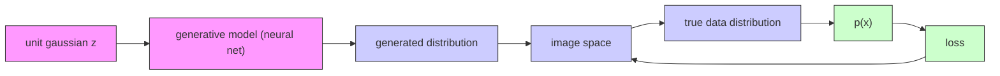
</details>

Source:https://openai.com/research/generative-models

Discriminant Model   


<details>
<summary>natural_image</summary>

Illustration of a dog with two inset photos: one showing a curved orange line and green dots, the other showing a blue dot cluster (no text or symbols)
</details>

Generative Model   


<details>
<summary>flowchart</summary>

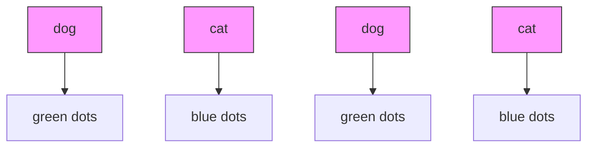
</details>

Source:https://medium.com/@jordi299/about-generative-and-discriminative-models-d8958b67ad32

# Discriminative models

learning the decision boundary between different classes.

# Generative models

model the probability distribution of the entire dataset.

GAN: minimax the classification error loss.


VAE: maximize ELBO.

Flow-based generative models: minimize the negative log-likelihood

Source:https://lilianweng.github.io/posts/2018-10-13-flow-models/


<details>
<summary>natural_image</summary>

Grid of dark rectangular panels with green and red vertical lines, no visible text or symbols
</details>

GAN learning to generate images (linear time)


<details>
<summary>natural_image</summary>

Grid of 25 identical square tiles displaying abstract, smudged textures with no discernible objects or text.
</details>

VAE learning to generate images (log time)


<details>
<summary>natural_image</summary>

Five abstract color swatches with gradient textures, no text or symbols visible
</details>

Denoising Diffusion Models learning to generate images

# Variational Auto-Encoder

"Autoencoding" is a data compression algorithm.

The compression and decompression functions are

1) data-specific, 2) lossy, and 3) learned automatically from examples rather than engineered by a human.


<details>
<summary>flowchart</summary>

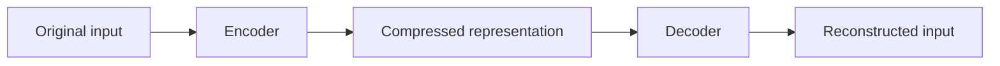
</details>

Source: https://blog.keras.io/building-autoencoders-in-keras.html

Source: https://towardsdatascience.com/understanding-variational-autoencoders-vaes-f70510919f73


<details>
<summary>flowchart</summary>

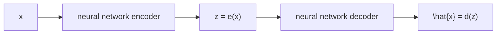
</details>

$$
\text { loss } = \left| \left| \mathbf {x} - \hat {\mathbf {x}} \right| \right| ^ {2} = \left| \left| \mathbf {x} - \mathbf {d} (\mathbf {z}) \right| \right| ^ {2} = \left| \left| \mathbf {x} - \mathbf {d} (\mathbf {e} (\mathbf {x})) \right| \right| ^ {2}
$$

Illustration of an autoencoder with its loss function.

1. The more complex the architecture is, the more the autoencoder can proceed to a high dimensionality reduction while keeping reconstruction loss low.

2. An encoder with “infinite power” could theoretically takes our N initial data points and encodes them as 1, 2, 3, … up to N (or more generally, as N integer on the real axis) and the associated decoder could make the reverse transformation, with no loss during the process.

3. The lack of interpretable and exploitable structures in the latent space (lack of regularity)


<details>
<summary>flowchart</summary>

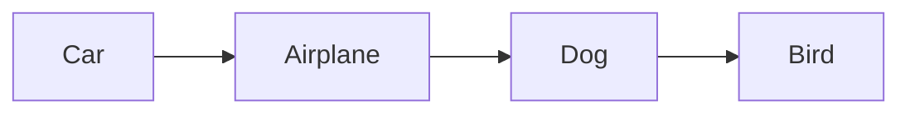
</details>

near optimal encoding in one dimension (too much information lost)


<details>
<summary>text_image</summary>

dog
bird
car
plane
</details>

initial data with many features


<details>
<summary>text_image</summary>

living
flying
</details>

near optimal encoding in two dimensions (less information lost)

When reducing dimensionality, we want to keep the main structure there exists among the data.

training process


<details>
<summary>flowchart</summary>

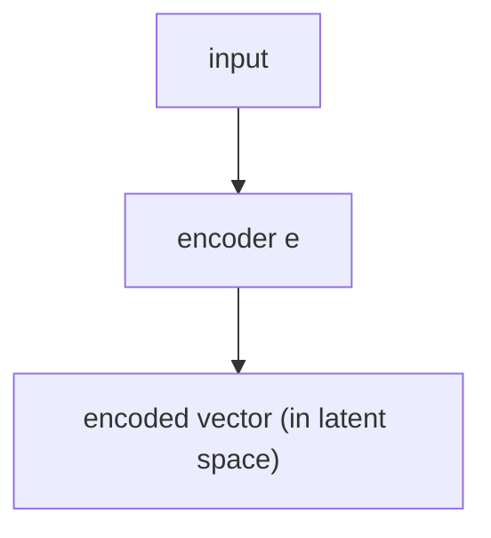
</details>


<details>
<summary>natural_image</summary>

Two gray curved arrows pointing in opposite directions (no text or symbols)
</details>


<details>
<summary>text_image</summary>

decoder
d
</details>

generation process


<details>
<summary>text_image</summary>

sampler
</details>

sampled vector (from latent space)

decoded content (reconstructed input / generated content)

Can we generate new data by decoding points that are randomly sampled from the latent space?


<details>
<summary>natural_image</summary>

Simple geometric shapes: circle, square, and triangle (no text or symbols)
</details>

"training"data for the autoencoder


<details>
<summary>text_image</summary>

encoder
</details>


<details>
<summary>flowchart</summary>

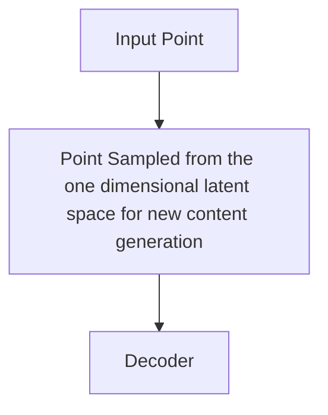
</details>


  
encoded data can be decoded without loss if the autoencoder has enough degrees of freedom

  
without explicit regularisation, some points of the latent space are"meaningless"once decoded

• Irregular latent space prevent us from using autoencoder for new content generation.   
• The quality and relevance of generated data depend on the regularity of the latent space.


<details>
<summary>text_image</summary>

close points in the latent space that are not similar once decoded
point from the latent space meaningless once decoded
point from the latent space meaningless once decoded
</details>

irregular latent space


<details>
<summary>text_image</summary>

points that are close
in the latent space are
similar once decoded
</details>

regular latent space

A “regular” and an “irregular” latent space.

# Intuitions about the regularisation

continuity (two close points in the latent space should not give two completely different contents once decoded)   
completeness (for a chosen distribution, a point sampled from the latent space should give “meaningful” content once decoded)

• In order to be able to use the decoder of our autoencoder for generative purpose, one should make sure that the latent space is regular enough. One solution is to introduce explicit regularisation during the training process.   
• A variational autoencoder can be defined as being an autoencoder whose training is regularised to avoid overfitting and ensure that the latent space has good properties that enable generative process.

# Reference:

Kingma, D. P., & Welling, M. Auto-encoding variational bayes. ICLR (2014). Citation: 49,000

# Instead of encoding an input as a single point, VAE encode it as a distribution over the latent space.


<details>
<summary>flowchart</summary>

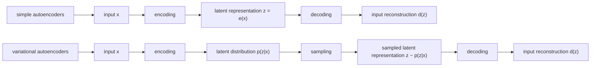
</details>

Latent distribution p(z|x): normal distribution


<details>
<summary>flowchart</summary>

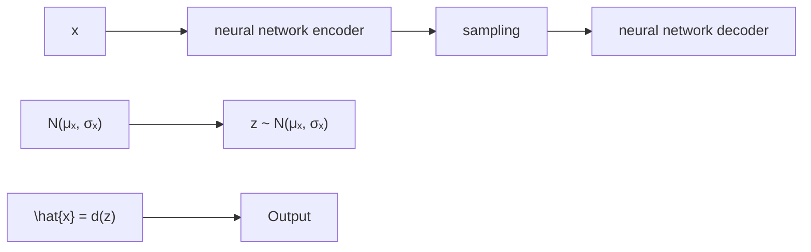
</details>

$$
\text { loss } = \left| \left| x - \hat {x} \right| \right| ^ {2} + \text { KL } [ N (\mu_ {x}, \sigma_ {x}), N (0, 1) ] = \left| \left| x - d (z) \right| \right| ^ {2} + \text { KL } [ N (\mu_ {x}, \sigma_ {x}), N (0, 1) ]
$$

The loss function is composed of a reconstruction term and a regularisation term.

To measure the distance between two distribution p and q, we use Kullback–Leibler divergence

$$
D _ {K L} (p | | q) = \int_ {x} p (x) \log \frac {p (x)}{q (x)} d x
$$

1. KL divergence is non-negative   
2. KL divergence is zero if and only if $\cdot$

# Multivariate normal distributions [edit]

Suppose that we have two multivariate normal distributions, with means $\mu _ { 0 } , \mu _ { 1 }$ and with (non-singular) covariance matrices $\Sigma _ { 0 } , \Sigma _ { 1 }$ . If the two distributions have the same dimension, $k ,$ then the relative entropy between the distributions is as follows:[26]

$$
D _ {\mathrm{KL}} \left(\mathcal {N} _ {0} \parallel \mathcal {N} _ {1}\right) = \frac {1}{2} \left(\mathrm{tr} \left(\Sigma_ {1} ^ {- 1} \Sigma_ {0}\right) - k + \left(\mu_ {1} - \mu_ {0}\right) ^ {\mathsf {T}} \Sigma_ {1} ^ {- 1} \left(\mu_ {1} - \mu_ {0}\right) + \ln \left(\frac {\det \Sigma_ {1}}{\det \Sigma_ {0}}\right)\right).
$$


<details>
<summary>line</summary>

| x    | p(x)  | q(x)  |
| ---- | ----- | ----- |
| -4   | 0.000 | 0.000 |
| -2   | 0.100 | 0.050 |
| 0    | 0.400 | 0.250 |
| 2    | 0.100 | 0.400 |
| 4    | 0.000 | 0.050 |
</details>

Original Gaussian PDF's

  
KLArea to be Integrated


<details>
<summary>flowchart</summary>


</details>

$$
\text { loss } = \left| \left| x - \hat {x} \right| \right| ^ {2} + \text { KL } [ N (\mu_ {x}, \sigma_ {x}), N (0, 1) ] = \left| \left| x - d (z) \right| \right| ^ {2} + \text { KL } [ N (\mu_ {x}, \sigma_ {x}), N (0, 1) ]
$$

The loss function is composed of a reconstruction term and a regularisation term.


<details>
<summary>natural_image</summary>

Abstract diagram with colored circles and geometric shapes (triangle, square, circle) connected by dashed lines, no text or symbols present.
</details>

what can happen without regularisation   


<details>
<summary>natural_image</summary>

Abstract diagram with overlapping colored circles and geometric shapes (triangle, circle, square) without any text or symbols
</details>

  
what we want to obtain with regularisation

The returned distributions of VAEs is regularised to obtain a latent space with good properties.


<details>
<summary>natural_image</summary>

Abstract diagram with colored shapes (triangles, circles, squares) and dashed lines, no text or symbols present
</details>

Regularisation tends to create a “gradient” over the information encoded in the latent space.

Neural Network Implementation   


<details>
<summary>flowchart</summary>

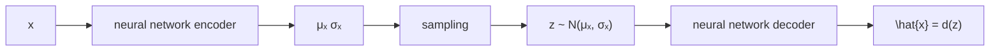
</details>

$$
\text { loss } = \left| \left| x - \hat {x} \right| \right| ^ {2} + \text { KL } [ N (\mu_ {x}, \sigma_ {x}), N (0, 1) ] = \left| \left| x - d (z) \right| \right| ^ {2} + \text { KL } [ N (\mu_ {x}, \sigma_ {x}), N (0, 1) ]
$$

Neural Network Implementation


<details>
<summary>text_image</summary>

h₁ = g₁
h₂
g₂
</details>

$$
\mu_ {x} = \mathsf {g} (\mathsf {x}) = \mathsf {g} _ {2} (\mathsf {g} _ {1} (\mathsf {x}))
$$

$$
\sigma_ {x} = h (x) = h _ {2} \left(h _ {1} (x)\right)
$$

Encoder neural network outputs Mean and Covairance

# Neural Network Implementation


<details>
<summary>flowchart</summary>

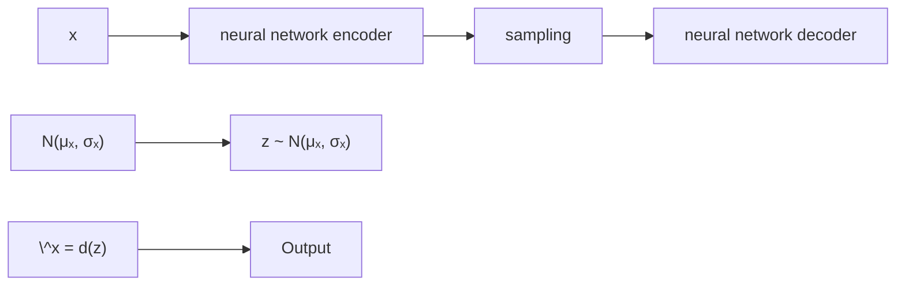
</details>

Sampling latent variable z based on

Mean and Covariance from encoder

Neural Network Implementation


<details>
<summary>text_image</summary>

f
z
x̂ = f(z)
</details>

Decoder neural network outputs reconstruction

# Sampling prevents backpropagation and the training

no problem for backpropagation


<details>
<summary>flowchart</summary>

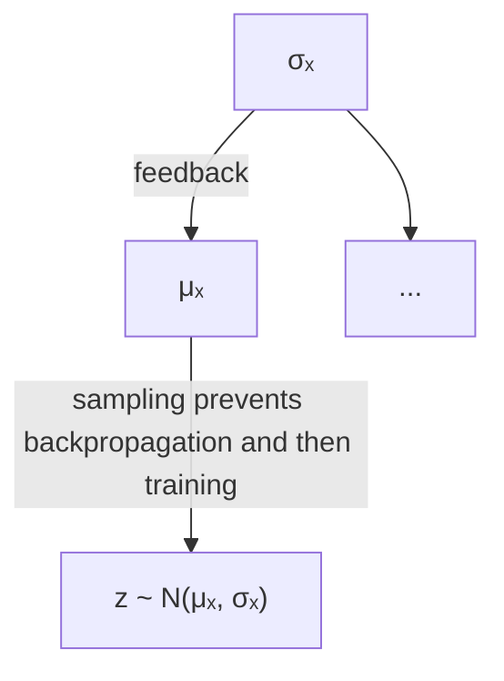
</details>

# Reparameterization trick

$$
z = \sigma_ {x} \zeta + \mu_ {x} \qquad \zeta \sim N (0, I)
$$

backpropagation is not possible due to sampling


<details>
<summary>flowchart</summary>

```mermaid
graph TD
    A["ζ ~ N(0, 1)"] --> B["μₓ"]
    B --> C["z = σₓζ + μₓ"]
    D["σₓ"] --> C
    style A fill:#f9f,stroke:#333
    style B fill:#ccf,stroke:#333
    style C fill:#cfc,stroke:#333
    note right of A: "no backpropagation is required"
    note right of C: "no backpropagation is required"
```
</details>


<details>
<summary>flowchart</summary>

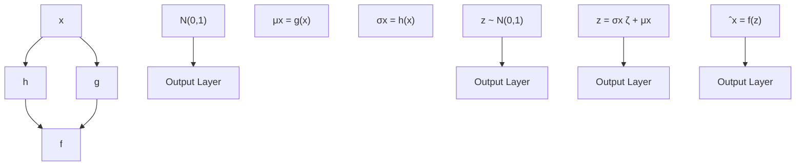
</details>

$$
\text { loss } = C \left| \left| x - \hat {x} \right| \right| ^ {2} + K L [ N (\mu_ {x}, \sigma_ {x}), N (0, I) ] = C \left| \left| x - f (z) \right| \right| ^ {2} + K L [ N (g (x), h (x)), N (0, I) ]
$$

• Variational autoencoders (VAEs) are autoencoders that tackle the problem of the latent space irregularity.   
• VAE makes the encoder return a distribution over the latent space instead of a single point.   
• VAE loss function includes a regularisation term over the returned distribution in order to ensure a better organisation of the latent space.

Data: 28\*28 black-white images with label   
  
Source: https://machinelearningmastery.com/how-to-develop-a-convolutional-neural-network-from-scratch-formnist-handwritten-digit-classification/#:\~:text=MNIST%20Handwritten%20Digit%20Classification%20Dataset,- The%20MNIST%20dataset&text=It%20is%20a%20dataset%20of,from%200%20to%209%2C%20inclusively.

# #1 Train an Autoencoder on MNIST


<details>
<summary>flowchart</summary>

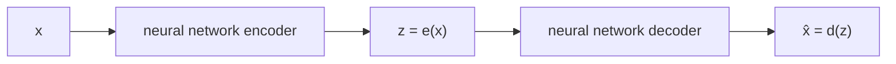
</details>

$$
\text {loss} = \left| \left| \mathbf {x} - \hat {\mathbf {x}} \right| \right| ^ {2} = \left| \left| \mathbf {x} - \mathsf {d} (\mathbf {z}) \right| \right| ^ {2} = \left| \left| \mathbf {x} - \mathsf {d} (\mathsf {e} (\mathbf {x})) \right| \right| ^ {2}
$$

Define the encoder   
```python
class Encoder(nn.Module):
    def __init__(self, latent_dims):
    super(Encoder, self).__init__()
    self.linear1 = nn.Linear(784, 512)
    self.linear2 = nn.Linear(512, latent_dims)

    def forward(self, x):
    x = torch.flatten(x, start_dim=1)
    x = F.relu(self.linear1(x))
    return self.linear2(x) 
```

# Define the decoder

```python
class Decoder(nn.Module):
    def __init__(self, latent_dims):
    super(Decoder, self).__init__()
    self.linear1 = nn.Linear(latent_dims, 512)
    self.linear2 = nn.Linear(512, 784)

    def forward(self, z):
    z = F.relu(self.linear1(z))
    z = torch.sigmoid(self.linear2(z))
    return z.reshape((-1, 1, 28, 28)) 
```

Define the auto-encoder   
```python
class Autoencoder(nn.Module):
    def __init__(self, latent_dims):
    super(Autoencoder, self).__init__()
    self.encoder = Encoder(latent_dims)
    self.decoder = Decoder(latent_dims)

    def forward(self, x):
    z = self.encoder(x)
    return self.decoder(z) 
```

Train the auto-encoder   
```python
def train(autoencoder, data, epochs=20):
    opt = torch.optim.Adam(autoencoder.parameters())
    for epoch in range(epochs):
    for x, y in data:
    opt.zero_grad()
    x_hat = autoencoder(x)
    loss = ((x - x_hat)**2).sum()
    loss.backward()
    opt.step()
    print('Epoch: %d' %epoch, "\ is finised.")
return autoencoder 
```

Visualization of 2D Latent space   


<details>
<summary>scatter</summary>

| x       | y       | cluster |
| ------- | ------- | ------- |
| -10.2   | -7.8    | 0       |
| -8.5    | -6.3    | 0       |
| -6.7    | -4.1    | 0       |
| -4.2    | -2.8    | 0       |
| -2.1    | -1.5    | 0       |
| 0.3     | 0.2     | 0       |
| 2.5     | 1.8     | 0       |
| 4.7     | 3.1     | 0       |
| 6.9     | 4.5     | 0       |
| 8.3     | 5.2     | 0       |
| 9.6     | 4.8     | 0       |
| 7.4     | 3.9     | 0       |
| 5.1     | 2.7     | 0       |
| 3.2     | 1.5     | 0       |
| 1.8     | 0.3     | 0       |
| -0.5    | -1.2    | 0       |
| -2.3    | -2.9    | 0       |
| -4.1    | -4.5    | 0       |
| -6.3    | -6.1    | 0       |
| -8.7    | -7.6    | 0       |
| -10.1   | -8.2    | 0       |
| -9.5    | -7.9    | 1       |
| -8.2    | -7.1    | 1       |
| -6.9    | -6.3    | 1       |
| -5.6    | -5.5    | 1       |
| -4.3    | -4.7    | 1       |
| -3.0    | -3.9    | 1       |
| -1.7    | -3.1    | 1       |
| -0.4    | -2.3    | 1       |
| 1.1     | -1.5    | 1       |
| 2.9     | -0.7    | 1       |
| 4.6     | 0.1     | 1       |
| 6.3     | 1.3     | 1       |
| 8.0     | 2.5     | 1       |
| 9.7     | 3.7     | 1       |
| 11.4    | 4.9     | 1       |
| -9.8    | -7.5    | 2       |
| -8.4    | -6.8    | 2       |
| -7.1    | -5.9    | 2       |
| -5.8    | -4.9    | 2       |
| -4.5    | -3.9    | 2       |
| -3.2    | -2.9    | 2       |
| -1.9    | -1.9    | 2       |
| -0.6    | -0.9    | 2       |
| 0.8     | 0.4     | 2       |
| 2.6     | 1.6     | 2       |
| 4.4     | 2.8     | 2       |
| 6.1     | 4.0     | 2       |
| 7.8     | 5.2     | 2       |
| 9.5     | 4.6     | 2       |
| -9.2    | -7.2    | 3       |
| -7.8    | -6.5    | 3       |
| -6.5    | -5.6    | 3       |
| -5.2    | -4.6    | 3       |
| -3.9    | -3.6    | 3       |
| -2.6    | -2.6    | 3       |
| -1.3    | -1.6    | 3       |
| -0.0    | -0.6    | 3       |
| 1.4     | 0.6     | 3       |
| 3.1     | 1.7     | 3       |
| 4.8     | 2.9     | 3       |
| 6.5     | 4.1     | 3       |
| 8.2     | 5.3     | 3       |
| 9.9     | 4.7     | 3       |
| -8.9    | -7.9    | 4       |
| -7.5    | -7.2    | 4       |
| -6.2    | -6.3    | 4       |
| -4.9    | -5.4    | 4       |
| -3.6    | -4.4    | 4       |
| -2.3    | -3.4    | 4       |
| -1.0    | -2.4    | 4       |
| -0.7    | -1.4    | 4       |
| -0.4    | -0.4    | 4       |
| -0.1    | 0.4     | 4       |
| 0.6     | 1.5     | 4       |
| 2.3     | 2.6     | 4       |
| 4.0     | 3.7     | 4       |
| 5.7     | 4.8     | 4       |
| 7.4     | 5.9     | 4       |
| 9.1     | 5.3     | 4       |
| -8.6    | -8.3    | 5       |
| -7.2    | -7.5    | 5       |
| -5.9    | -6.6    | 5       |
| -4.6    | -5.6    | 5       |
| -3.3    | -4.5    | 5       |
| -2.0    | -3.4    | 5       |
| -0.7    | -2.3    | 5       |
| 0.4     | -1.2    | 5       |
| 1.9                     | -0.1    | 5       |
| 3.6     | 0.9     | 5       |
| 5.3     | 2.0     | 5       |
| 7.0     | 3.1     | 5       |
| 8.7     | 4.2     | 5       |
| 10.4    | 5.3     | 5       |
| -8.3    | -8.6    | 6       |
| -7.0    | -7.8    | 6       |
| -5.7    | -6.9    | 6       |
| -4.4    | -5.9    | 6       |
| -3.1    | -4.9    | 6       |
| -1.8    | -3.9    | 6       |
| -0.5    | -2.9    | 6       |
| 0.2     | -1.9    | 6       |
| 1.9     | -0.9    | 6       |
| 3.6     | 0.4     | 6       |
| 5.3     | 1.5     | 6       |
| 7.0     | 2.6     | 6       |
| 8.7     | 3.7     | 6       |
|<fcel>9      = (x,y)   \n        (x,y)   \n        (x,y)   \n        (x,y)   \n        (x,y)   \n        (x,y)   \n        (x,y)   \n        (x,y)   \n        (x,y)   \n        (x,y)   \n        (x,y)   \n        (x,y)   \n        (x,y)   \n        (x,y)|
</details>

Visualization of decoded 2D Latent space   


<details>
<summary>heatmap</summary>

| X\Y | -15.0 | -12.5 | -10.0 | -7.5 | -5.0 | -2.5 | 0.0 | 2.5 | 5.0 |
|-----|-------|-------|-------|------|------|------|-----|-----|-----|
| -15 | 1     | 1     | 1     | 1    | 1    | 1    | 1   | 1   | 1   |
| -10 | 1     | 1     | 1     | 1    | 1    | 1    | 1   | 1   | 1   |
| -5  | 1     | 1     | 1     | 1    | 1    | 1    | 1   | 1   | 1   |
| 0   | 1     | 1     | 1     | 1    | 1    | 1    | 1   | 1   | 1   |
| 5   | 1     | 1     | 1     | 1    | 1    | 1    | 1   | 1   | 1   |
| 10  | 1     | 1     | 1     | 1    | 1    | 1    | 1   | 1   | 1   |
</details>

#2 Train an VAE on MNIST   


<details>
<summary>flowchart</summary>


</details>

$$
\text { loss } = \left| \left| \mathbf {x} - \hat {\mathbf {x}} \right| \right| ^ {2} + \text { KL } [ \mathsf {N} (\mu_ {x}, \sigma_ {x}), \mathsf {N} (0, 1) ] = \left| \left| \mathbf {x} - \mathsf {d} (z) \right| \right| ^ {2} + \text { KL } [ \mathsf {N} (\mu_ {x}, \sigma_ {x}), \mathsf {N} (0, 1) ]
$$

Define the Variational encoder   
```python
class VariationalEncoder(nn.Module):
    def __init__(self, latent_dims):
    super(VariationalEncoder, self).__init__()
    self.linear1 = nn.Linear(784, 512)
    self.linear2 = nn.Linear(512, latent_dims)
    self.linear3 = nn.Linear(512, latent_dims)

    def forward(self, x):
    x = torch.flatten(x, start_dim=1)
    x = F.relu(self.linear1(x))
    mu = self.linear2(x)
    sigma = torch.exp(self.linear3(x))
    return mu, sigma 
```

Define the Variational auto-encoder   
```python
class VariationalAutoencoder(nn.Module):
    def __init__(self, latent_dims):
    super(VariationalAutoencoder, self).__init__()
    self.encoder = VariationalEncoder(latent_dims)
    self.decoder = Decoder(latent_dims)
    self.N = torch.distributions.Normal(0, 1)

    def forward(self, x):
    mu, sigma = self.encoder(x)
    z = mu + sigma * self.N.sample(mu.shape)
    self.kl = (sigma ** 2 + mu ** 2 - torch.log(sigma) - 1/2).sum()
    return self.decoder(z) 
```

# Train the VAE

```python
def train(autoencoder, data, epochs=20):
    opt = torch.optim.Adam(autoencoder.parameters())
    for epoch in range(epochs):
    for x, y in data:
    #x = x.to(device)
    opt.zero_grad()
    x_hat = autoencoder(x)
    loss = ((x - x_hat)**2).sum() + autoencoder.kl
    loss.backward()
    opt.step()
    print("Epoch %d" %epoch, "\ is finished.")
return autoencoder 
```

Visualization of 2D Latent space   


<details>
<summary>scatter</summary>

| x       | y       | cluster |
| ------- | ------- | ------- |
| -2.8    | -1.9    | gray    |
| -2.5    | -1.7    | gray    |
| -2.2    | -1.5    | gray    |
| -1.9    | -1.3    | gray    |
| -1.6    | -1.1    | gray    |
| -1.3    | -0.9    | gray    |
| -1.0    | -0.7    | gray    |
| -0.7    | -0.5    | gray    |
| -0.4    | -0.3    | gray    |
| -0.1    | -0.1    | gray    |
| 0.2     | 0.1     | gray    |
| 0.5     | 0.3     | gray    |
| 0.8     | 0.5     | gray    |
| 1.1     | 0.7     | gray    |
| 1.4     | 0.9     | gray    |
| 1.7     | 1.1     | gray    |
| 2.0     | 1.3     | gray    |
| 2.3     | 1.5     | gray    |
| 2.6     | 1.7     | gray    |
| 2.9     | 1.9     | gray    |
| -2.7    | -1.6    | cyan    |
| -2.4    | -1.4    | cyan    |
| -2.1    | -1.2    | cyan    |
| -1.8    | -1.0    | cyan    |
| -1.5    | -0.8    | cyan    |
| -1.2    | -0.6    | cyan    |
| -0.9    | -0.4    | cyan    |
| -0.6    | -0.2    | cyan    |
| -0.3    | 0.0     | cyan    |
| 0.0     | 0.2     | cyan    |
| 0.3     | 0.4     | cyan    |
| 0.6     | 0.6     | cyan    |
| 0.9     | 0.8     | cyan    |
| 1.2     | 1.0     | cyan    |
| 1.5     | 1.2     | cyan    |
| 1.8     | 1.4     | cyan    |
| 2.1     | 1.6     | cyan    |
| 2.4     | 1.8     | cyan    |
| 2.7     | 2.0     | cyan    |
| 3.0     | 2.2     | cyan    |
| -2.6    | -1.3    | purple  |
| -2.3    | -1.1    | purple  |
| -2.0    | -0.9    | purple  |
| -1.7    | -0.7    | purple  |
| -1.4    | -0.5    | purple  |
| -1.1    | -0.3    | purple  |
| -0.8    | -0.1    | purple  |
| -0.5    | 0.1     | purple  |
| -0.2    | 0.3     | purple  |
| 0.1     | 0.5     | purple  |
| 0.4     | 0.7     | purple  |
| 0.7     | 0.9     | purple  |
| 1.0     | 1.1     | purple  |
| 1.3     | 1.3     | purple  |
| 1.6     | 1.5     | purple  |
| 1.9     | 1.7     | purple  |
| 2.2     | 1.9     | purple  |
| 2.5     | 2.1     | purple  |
| 2.8     | 2.3     | purple  |
| -2.5    | -1.4    | red     |
| -2.2    | -1.2    | red     |
| -1.9    | -1.0    | red     |
| -1.6    | -0.8    | red     |
| -1.3    | -0.6    | red     |
| -1.0    | -0.4    | red     |
| -0.7    | -0.2    | red     |
| -0.4    | 0.0     | red     |
| -0.1    | 0.2     | red     |
| 0.2     | 0.4     | red     |
| 0.5     | 0.6     | red     |
| 0.8     | 0.8     | red     |
| 1.1     | 1.0     | red     |
| 1.4     | 1.2     | red     |
| 1.7     | 1.4     | red     |
| 2.0     | 1.6     | red     |
| 2.3     | 1.8     | red     |
| -2.4    | -1.5    | yellow  |
| -2.1    | -1.3    | yellow  |
| -1.8    | -1.1    | yellow  |
| -1.5    | -0.9    | yellow  |
| -1.2    | -0.7    | yellow  |
| -0.9    | -0.5    | yellow  |
| -0.6    | -0.3    | yellow  |
| -0.3    | -0.1    | yellow  |
| 0.0     | 0.1     | yellow  |
| 0.3     | 0.3     | yellow  |
| 0.6     | 0.5     | yellow  |
| 0.9     | 0.7     | yellow  |
| 1.2     | 0.9     | yellow  |
| 1.5     | 1.1     | yellow  |
| 1.8     | 1.3     | yellow  |
| 2.1     | 1.5     | yellow  |
| 2.4     | 1.7     | yellow  |
| -2.3    | -1.6    | green   |
| -2.0    | -1.4    | green   |
| -1.7    | -1.2    | green   |
| -1.4    | -1.0    | green   |
| -1.1    | -0.8    | green   |
| -0.8    | -0.6    | green   |
| -0.5    | -0.4    | green   |
| -0.2    | -0.2    | green   |
| 0.1     | 0.0     | green   |
| 0.4     | 0.2     | green   |
| 0.7     | 0.4     | green   |
| 1.0     | 0.6     | green   |
| 1.3     | 0.8     | green   |
| 1.6     | 1.0     | green   |
| 1.9     | 1.2     | green   |
| 2.2     | 1.4     | green   |
| -2.2    | -1.7    | orange  |
| -1.9    | -1.5    | orange  |
| -1.6    | -1.3    | orange  |
| -1.3    | -1.1    | orange  |
| -1.0    | -0.9    | orange  |
| -0.7    | -0.7    | orange  |
| -0.4    | -0.5    | orange  |
| -0.1    | -0.3    | orange  |
| 0.2     | -0.1    | orange  |
| 0.5     | 0.1     | orange  |
| 0.8     | 0.3     | orange  |
| 1.1     | 0.5     | orange  |
| 1.4     | 0.7     | orange  |
| 1.7     | 0.9     | orange  |
| 2.0     | 1.1     | orange  |
| -2.1    | -1.8    | blue    |
| -1.8    | -1.6    | blue    |
| -1.5    | -1.4    | blue    |
| -1.2    | -1.2    | blue    |
| -0.9    | -1.0    | blue    |
| -0.6    | -0.8    | blue    |
| -0.3    | -0.6    | blue    |
| +0.1    | -0.4    | blue    |
| +0.4    | -0.2    | blue    |
| +0.7    | +0.0   | blue    |
| +1.0    | +0.2   | blue    |
| +1.3    | +0.4   | blue    |
| +1.6    | +0.6   | blue    |
| +1.9    | +0.8   | blue    |
| +2.2   | +1.0   | blue    |
| +2.5   | +1.2   | blue    |
| +2.8   | +1.4   | blue    |
| +3.1   | +1.6   | blue    |
| +3.4   | +1.8   | blue    |
| +3.7   | +2.0   | blue    |
| +4.0   | +2.2   | blue    |
| +4.3   | +2.4   | blue    |
| +4.6   | +2.6   | blue    |
| +4.9   | +2.8   | blue    |
| +5.2   | +3.0   | blue    |
| +5.5   | +3.2   | blue    |
| +5.8   | +3.4   | blue    |
| +6.1   | +3.6   | blue    |
| +6.4   | +3.8   | blue    |
| +6.7   | +4.0   | blue    |
| +7.0   | +4.2   | blue    |
| +7.3   | +4.4   | blue    |
| +7.6   | +4.6   | blue    |
| +7.9   | +4.8   | blue    |
| +8.2   | +5.0   | blue    |
| +8 .5   (Orange)<lcel><lcel>
</details>


<details>
<summary>bar_stacked</summary>

| Value |
|---|
| 9 |
| 8 |
| 7 |
| 6 |
| 5 |
| 4 |
| 3 |
| 2 |
| 1 |
| 0 |
</details>

Visualization of decoded 2D Latent space   


<details>
<summary>heatmap</summary>

| X\Y | -3 | -2 | -1 | 0 | 1 | 2 | 3 |
|----|----|----|----|----|----|----|----|
| 0  | 0  | 0  | 0  | 0  | 0  | 0  | 0  |
| 1  | 0  | 0  | 0  | 0  | 0  | 0  | 0  |
| 2  | 0  | 0  | 0  | 0  | 0  | 0  | 0  |
| 3  | 0  | 0  | 0  | 0  | 0  | 0  | 0  |
| -1 | -1 | -1 | -1 | -1 | -1 | -1 | -1 |
| -2 | -2 | -2 | -2 | -2 | -2 | -2 | -2 |
| -3 | -3 | -3 | -3 | -3 | -3 | -3 | -3 |
| -1 | 1  | 1  | 1  | 1  | 1  | 1  | 1  |
| -2 | 2  | 2  | 2  | 2  | 2  | 2  | 2  |
| -3 | 3  | 3  | 3  | 3  | 3  | 3  | 3  |
| -1 | -1 | -1 | -1 | -1 | -1 | -1 | -1 |
| -2 | -2 | -2 | -2 | -2 | -2 | -2 | -2 |
| -3 | -3 | -3 | -3 | -3 | -3 | -3 | -3 |
The image contains a heatmap with rows and columns labeled 'X' and 'Y', where each cell contains a unique integer value (e.g., 'x') and is colored according to its color. The heatmap is used to visualize the distribution of these values across the grid. There is no explicit title or legend provided in the image.
</details>


<details>
<summary>natural_image</summary>

Abstract grayscale spiral shape on black background (no text or symbols)
</details>


<details>
<summary>scatter</summary>

| Cluster | Count |
|---------|-------|
| Green   | 1200  |
| Yellow  | 850   |
| Blue    | 600   |
| Purple  | 450   |
| Orange  | 300   |
| Pink    | 250   |
| Red     | 180   |
</details>

VAE Latent Space Explorer

The decoder of VAE cannot produce an image of a particular number on demand.   


<details>
<summary>flowchart</summary>

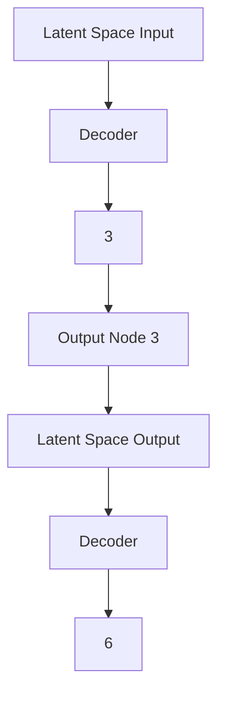
</details>

Source: https://ijdykeman.github.io/ml/2016/12/21/cvae.html

# The decoder of VAE cannot produce an image of a particular number on demand.


# Conditional variational autoencoder (CVAE)

has an extra input to both the encoder and the decoder.


<details>
<summary>flowchart</summary>

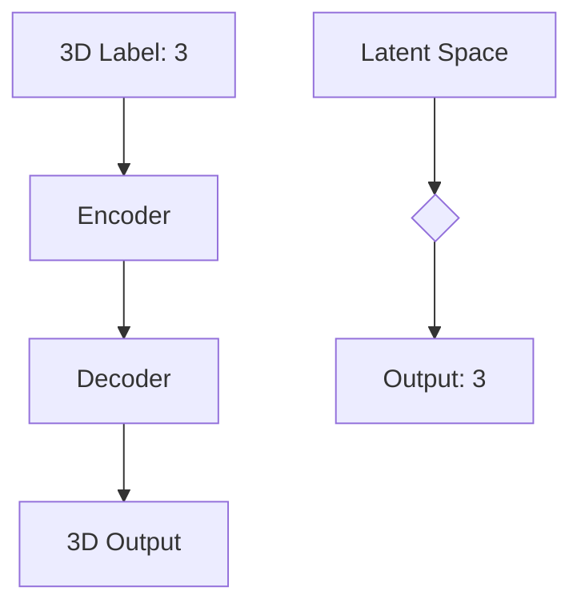
</details>

# Conditional variational autoencoder (CVAE)

has an extra input to both the encoder and the decoder.


<details>
<summary>flowchart</summary>

```mermaid
graph TD
    A["Encoder (Q)"] --> B["μ(Y, X)"]
    A --> C["Σ(Y, X)"]
    B --> D["Σ(Y, X)"]
    C --> E["+"]
    C --> F["*"]
    D --> G["Decoder (P)"]
    E --> G
    F --> G
    G --> H["f(z, Y)"]
    H --> I["||X - f(z, Y)||²"]
    I --> J["KL[N(μ(Y, X), Σ(Y, X)) ||N(0, I)"]]
    J --> K["X"]
    G --> L["Sample ε from N(0, I)"]
    L --> M["Y"]
    M --> N["Output"]
```
</details>

At training time, the label of the image is provided to the encoder and decoder. Label is represented as a one-hot vector.


<details>
<summary>flowchart</summary>

```mermaid
graph TD
    A["8"] --> B["0"]
    A --> C["0"]
    A --> D["0"]
    A --> E["0"]
    A --> F["0"]
    A --> G["0"]
    A --> H["0"]
    A --> I["1"]
    A --> J["0"]
    A --> K["0"]
```
</details>

Source: https://ataylor.io/blog/go-mlp/

A Conditional VAE generating images according to given labels.   


<details>
<summary>flowchart</summary>

```mermaid
graph TD
    A["Decoder 1"] --> B["Decoder"]
    B --> C["Input Image 1"]
    D["Decoder 3"] --> E["Decoder"]
    E --> F["Output Image 3"]
```
</details>

Visualization of 2D Latent space of Conditional VAE   


<details>
<summary>scatter</summary>

| x    | y    | value |
| ---- | ---- | ----- |
| -3.2 | 1.5  | 0.8   |
| -2.1 | 3.7  | 1.2   |
| 0.5  | -1.2 | 0.5   |
| 1.8  | 2.9  | 1.8   |
| 3.5  | -0.8 | 0.3   |
| -1.9 | 4.1  | 2.1   |
| 2.7  | 5.6  | 3.4   |
| -0.3 | -2.5 | 1.0   |
| 0.9  | 1.1  | 0.7   |
| 4.2  | -3.1 | 0.4   |
| -2.8 | -0.9 | 0.6   |
| 1.3  | 3.3  | 2.5   |
| -0.7 | 2.4  | 1.5   |
| 3.1  | -1.7 | 0.9   |
| -1.5 | 0.6  | 0.2   |
| 2.3  | 4.8  | 3.0   |
| -0.9 | -3.8 | 1.3   |
| 4.5  | -2.2 | 0.8   |
| -2.4 | -1.6 | 0.5   |
| 0.2  | 1.9  | 1.7   |
| -1.1 | -2.9 | 0.4   |
| 3.8  | -1.4 | 0.6   |
| -0.5 | 2.7  | 2.8   |
| 2.9  | -3.5 | 1.1   |
| -1.7 | -0.7 | 0.3   |
| 4.1  | -2.6 | 0.7   |
| -0.2 | 3.6  | 3.2   |
| 1.6  | -1.9 | 1.4   |
| -2.6 | -2.3 | 0.6   |
| 3.4  | -0.5 | 0.8   |
| -1.3 | 4.4  | 4.0   |
| 2.5  | -3.2 | 1.6   |
| -0.8 | -1.3 | 0.9   |
| 4.7  | -2.8 | 2.9   |
| -1.9 | -3.6 | 1.5   |
| 3.6  | -1.8 | 0.7   |
| -0.4 | 2.5  | 3.5   |
| 2.1  | -2.1 | 1.2   |
| -1.6 | -0.9 | 0.4   |
| 4.3  | -3.4 | 2.7   |
| -0.6 | -2.7 | 1.8   |
| 3.2  | -1.5 | 0.9   |
| -2.2 | -3.0 | 3.8   |
| 4.8  | -2.4 | 2.4   |
| -1.4 | -2.5 | 1.6   |
| 3.9  | -3.9 | 4.1   |
| -0.7 | -1.7 | 1.3   |
| 4.6  | -2.9 | 3.6   |
| -1.8 | -3.7 | 2.0   |
| 3.5  | -1.9 | 0.8   |
| -0.9 | -2.8 | 0.5   |
| 4.1  | -4.0 | 3.9   |
| -1.2 | -3.3 | 2.2   |
| 3.7  | -2.6 | 4.3   |
| -0.5 | -3.4 | 1.7   |
| 4.4  | -4.1 | 3.7   |
| -1.6 | -2.6 | 1.4   |
| 3.6  | -3.8 | 4.5   |
| -0.8 | -4.2 | 2.5   |
| 4.2  | -3.1 | 3.8   |
| -1.9 | -3.9 | 2    |
| 3.8  | -4    | nan    |
</details>

Source: https://agustinus.kristia.de/techblog/2016/12/17/conditional-vae/

Generated images of Conditional VAE by different classes

$$
\begin{array}{l l l l l l l l l} 0 & 0 & 0 & 0 & 0 & 0 & 0 & 0 & 0 \\ 1 & \backslash & 1 & / & 1 & 1 & 1 & 1 & / \\ 2 & 2 & 2 & 2 & 2 & 2 & 2 & 2 & 2 \\ 3 & 3 & 3 & 3 & 3 & 3 & 3 & 3 & 3 \\ 4 & 4 & 4 & 4 & 4 & 4 & 4 & 4 & 4 \\ 5 & 5 & 5 & 5 & 5 & 5 & 5 & 5 & 5 \\ 6 & 6 & 6 & 6 & 6 & 6 & 6 & 6 & 6 \\ 7 & 7 & 7 & 7 & 7 & 7 & 7 & 7 & 7 \\ 8 & 8 & 8 & 8 & 8 & 8 & 8 & 8 & 8 \\ 9 & 9 & 9 & 9 & 9 & 9 & 9 & 9 & 9 \end{array}
$$

Source: https://ijdykeman.github.io/ml/2016/12/21/cvae.html