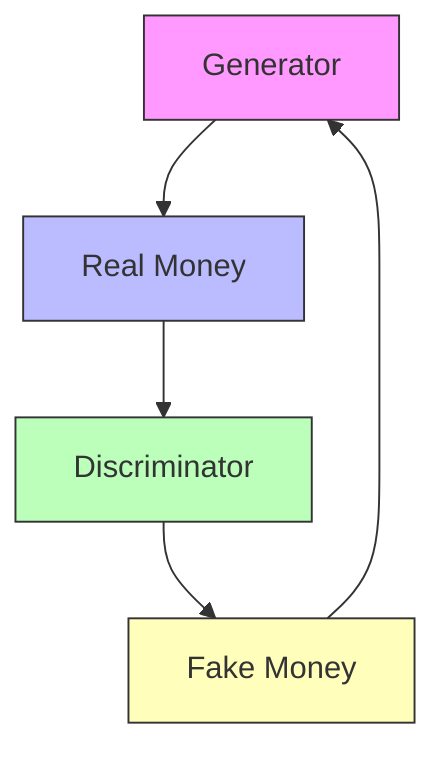
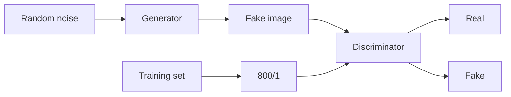
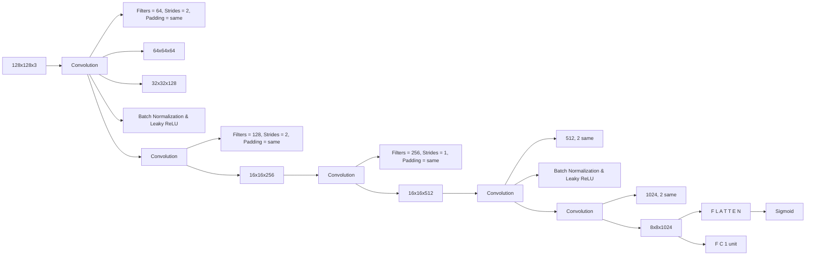
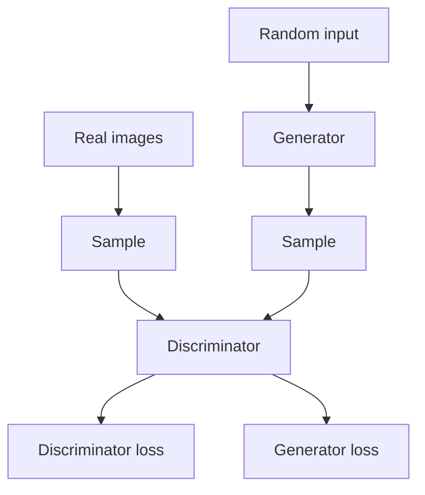
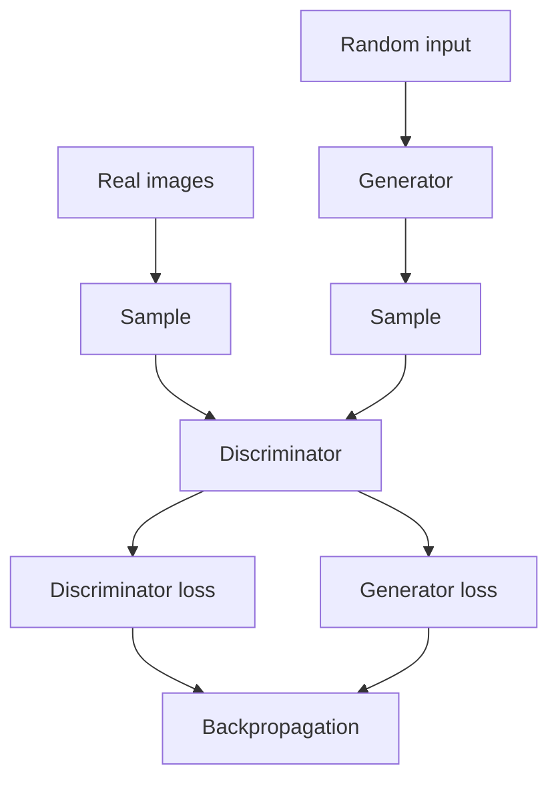
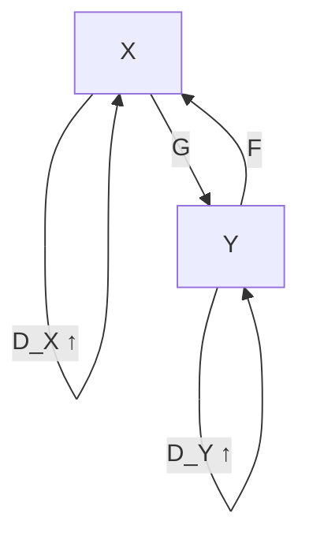
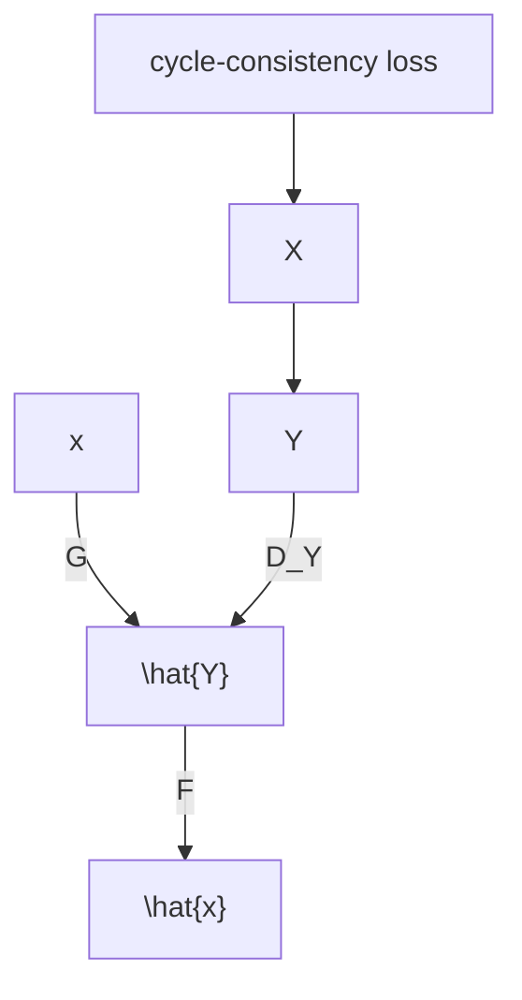
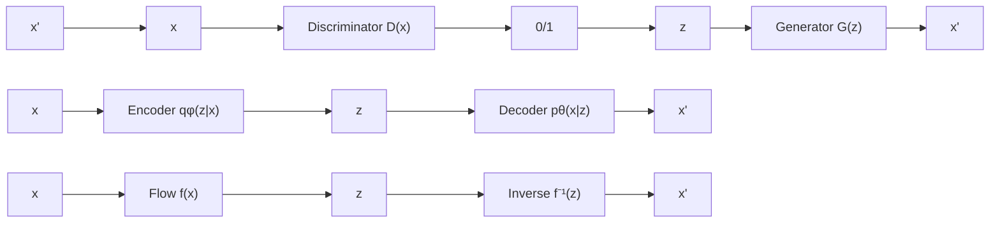
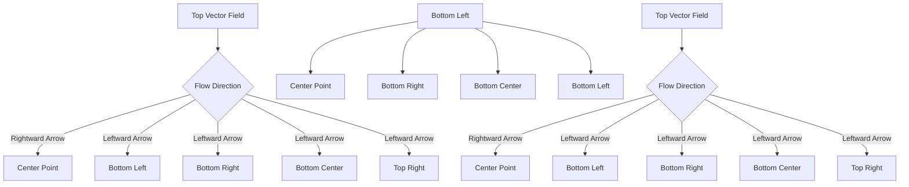

# AMA 564 Deep Learning

# 2026 Spring

# Lecture 8

# Generative Adversarial Networks (GAN)


<details>
<summary>natural_image</summary>

Collage of diverse portrait photos including adults, children, and seniors (no text or symbols visible)
</details>

Example of Photorealistic Human Faces Generated by a GAN.   
Source: https://arxiv.org/abs/1812.04948


In the proposed adversarial nets framework, the generative model is pitted against an adversary: a discriminative model that learns to determine whether a sample is from the model distribution or the data distribution. The generative model can be thought of as analogous to a team of counterfeiters, trying to produce fake currency and use it without detection, while the discriminative model is analogous to the police, trying to detect the counterfeit currency. Competition in this game drives both teams to improve their methods until the counterfeits are indistinguishable from the genuine articles.

# Reference:

Goodfellow, I., Pouget-Abadie, J., Mirza, M., Xu, B., Warde-Farley, D., Ozair, S., ... & Bengio, Y. (2020). Generative adversarial networks. Communications of the ACM, 63(11), 139-144. Citation: 56,388


<details>
<summary>flowchart</summary>


</details>

Thepolicearetrainedtodistinguish between. Sometimes,thepolicegivefeedbacktothe counterfeiteraboutwhythemoneyisfake.

Competition in this game drives both teams to improve their methods until the counterfeits are indistinguishable from the genuine articles.

Generated Data   


<details>
<summary>text_image</summary>

10
</details>

Discriminator   


<details>
<summary>text_image</summary>

FAKE REAL
</details>

Real Data   


<details>
<summary>text_image</summary>

10 FEDERAL RESERVE NOTE
DB 88881380 A
B2
THE UNITED STATES OF AMERICA
DB 88881380 A
10 TEN DELENS DOLLARS
</details>

10   
  
FAKE

REAL   


<details>
<summary>text_image</summary>

100
FEDERAL RESERVE NOTE
JB 00000000 T
B2
ONE E INDED DOLLARS
ALTE
UNITED STATES OF AMERICA
100
JP 00000000 T
100
</details>


<details>
<summary>text_image</summary>

20
FEDERAL RESERVE NOTE 20
ID 228 60B
D4
THE
UNITED STATES
U.S. FINANCIALS
ID 228 60B
C
20
TUESDAY DOLLARS
</details>

REAL

REAL   


<details>
<summary>text_image</summary>

20
FEDERAL RESERVE NOTE 20
ID228 60B
D4
THE UNITED STATES OF AMERICA
10228 60B
CINN
20
TUESDAY DOLLARS
</details>


<details>
<summary>flowchart</summary>


</details>

Discriminator   


<details>
<summary>flowchart</summary>


</details>

D: Discriminator, a neural network, $\pmb { { \cal D } } ( \pmb { x } ) \in [ \mathbf { 0 } , \mathbf { 1 } ]$

Goal: $\pmb { D } ( \pmb { x } ) = \pmb { 1 }$ if ?? comes from the real data

$\pmb { D } ( \pmb { x } ) = \pmb { 0 }$ if ?? comes from the generated data

Generator   


<details>
<summary>other</summary>

| Stage | Value |
|-------|-------|
| Reshape | 8x8x1024 |
| Trans Convolution | Filters = 512 Strides = 2 Padding = same |
| Trans Convolution | Filters = 256 Strides = 2 Padding = same |
| Trans Convolution | Filters = 128 Strides = 2 Padding = same |
| Trans Convolution | Filters = 64 Strides = 2 Padding = same |
| Trans Convolution | Filters = 3 Strides = 1 Padding = same |
| Batch Normalization & Leaky ReLU | Leaky ReLU |
| Batch Normalization & Leaky ReLU | Leaky ReLU |
| Batch Normalization & Leaky ReLU | Leaky ReLU |
| Batch Normalization & Leaky ReLU | Leaky ReLU |
| Batch Normalization & Leaky ReLU | Leaky ReLU |
| Batch Normalization & Leaky ReLU | Leaky ReLU |
| Tanh | 128x128x3 |
</details>

G: Generator, a neural network, $G ( \pmb { z } ) = \pmb { x } _ { \pmb { z } }$

Goal: ?? comes from a noise distribution, $\pmb { G } ( \pmb { z } ) = \pmb { x } _ { \pmb { z } }$

?? comes from the real data distribution

Hope $\pmb { G } ( \pmb { z } ) = \pmb { x } _ { \pmb { z } }$ have the same distribution as ?? such that discriminator can not tell the difference between them


<details>
<summary>flowchart</summary>


</details>

# The value function of GAN

$$
V (D, G) = \mathbb {E} _ {\pmb {x} \sim p _ {\mathrm{data}} (\pmb {x})} [ \log D (\pmb {x}) ] + \mathbb {E} _ {\pmb {z} \sim p _ {\pmb {z}} (\pmb {z})} [ \log (1 - D (G (\pmb {z}))) ]
$$

$p _ { d a t a }$ the density of data distribution

$p _ { z }$ the density of noise distribution

?? Discriminator, a neural network Maximize ??(??, ??)

?? Generator, a neural network minimize ??(??, ??)

# Target of discriminator

$$
V (D, G) = \mathbb {E} _ {\pmb {x} \sim p _ {\mathrm{data}} (\pmb {x})} [ \log D (\pmb {x}) ] + \mathbb {E} _ {\pmb {z} \sim p _ {\pmb {z}} (\pmb {z})} [ \log (1 - D (G (\pmb {z}))) ]
$$

$D ( x )  1$ for ?? comes from the real data

?? ??(??) → ?? for ??(??) comes from the generated data


<details>
<summary>natural_image</summary>

Solid red downward-pointing arrow shape (no text or symbols)
</details>

Given generator ?? the value ?? ??, ?? increases

# Target of generator

$$
V (D, G) = \mathbb {E} _ {\pmb {x} \sim p _ {\mathrm{data}} (\pmb {x})} [ \log D (\pmb {x}) ] + \mathbb {E} _ {\pmb {z} \sim p _ {\pmb {z}} (\pmb {z})} [ \log (1 - D (G (\pmb {z}))) ]
$$

# Generate $G ( z )$ where ?? comes from the noise distribution such that $D ( G ( z ) ) \to 1$


<details>
<summary>natural_image</summary>

Solid red downward-pointing arrow shape (no text or symbols)
</details>

Given discriminator ?? the value ?? ??, ?? decreases

# The objective of GAN: Two-player minimax game

$$
\min _ {G} \max _ {D} V (D, G) = \mathbb {E} _ {\pmb {x} \sim p _ {\mathrm{data}} (\pmb {x})} [ \log D (\pmb {x}) ] + \mathbb {E} _ {\pmb {z} \sim p _ {\pmb {z}} (\pmb {z})} [ \log (1 - D (G (\pmb {z}))) ]
$$

D: Discriminator, a neural network maximize V(D,G)

G: Generator, a neural network minimize V(D,G)


<details>
<summary>flowchart</summary>


</details>


<details>
<summary>flowchart</summary>


</details>

  
Backpropagation

Algorithm 1 Minibatch stochastic gradient descent training of generative adversarial nets. The number of steps to apply to the discriminator, k,is a hyperparameter. We used $k = 1$ , the least expensive option, in our experiments.

for number of training iterations do

for k steps do

· Sample minibatch of m noise samples $\{ z ^ { ( 1 ) } , \dots , z ^ { ( m ) } \}$ from noise prior $p _ { g } ( z )$   
· Sample minibatch of m examples $\{ \pmb { x } ^ { ( 1 ) } , \ldots , \pmb { x } ^ { ( m ) } \}$ from data generating distribution $p _ { \mathrm { d a t a } } ( \pmb { x } )$   
· Update the discriminator by ascending its stochastic gradient:

$$
\nabla_ {\theta_ {d}} \frac {1}{m} \sum_ {i = 1} ^ {m} \left[ \log D (\boldsymbol {x} ^ {(i)}) + \log (1 - D (G (\boldsymbol {z} ^ {(i)}))) \right].
$$

# end for

Sample minibatch of m noisesamples $\{ z ^ { ( 1 ) } , \dots , z ^ { ( m ) } \}$ from noise prior $p _ { g } ( z )$   
· Update the generator by descending its stochastic gradient:

$$
\nabla_ {\theta_ {g}} \frac {1}{m} \sum_ {i = 1} ^ {m} \log \left(1 - D \left(G \left(\boldsymbol {z} ^ {(i)}\right)\right)\right).
$$

# end for

The gradient-based updates can use any standard gradient-based learning rule.We used momen-tum in our experiments.

Proposition 1. For G fixed, the optimal discriminator D is

$$
D _ {G} ^ {*} (\boldsymbol {x}) = \frac {p _ {d a t a} (\boldsymbol {x})}{p _ {d a t a} (\boldsymbol {x}) + p _ {g} (\boldsymbol {x})}
$$

Proposition 2. IfG and D have enough capacity, and at each step of Algorithm 1, the discriminator is allowed to reach its optimum given G, and $p _ { g }$ is updated so as to improve the criterion

$$
\mathbb {E} _ {\boldsymbol {x} \sim p _ {d a t a}} [ \log D _ {G} ^ {*} (\boldsymbol {x}) ] + \mathbb {E} _ {\boldsymbol {x} \sim p _ {g}} [ \log (1 - D _ {G} ^ {*} (\boldsymbol {x})) ]
$$

then $p _ { g }$ converges to Pdata

. $\cdot$ has the same distribution as ??   
$D ^ { * } ( x ) = 1 / 2$ for all ??

# Train the discriminator and generator alternatively.


<details>
<summary>line</summary>

| x    | Green Line | Blue Dashed Line |
| ---- | ---------- | ---------------- |
| 0    | 0          | 0                |
| 1    | 0          | 0.5              |
| 2    | 0          | 0.7              |
| 3    | 0          | 0.6              |
| 4    | 0          | 0.8              |
| 5    | 0          | 0.9              |
| 6    | 0          | 0.7              |
| 7    | 0          | 0.5              |
| 8    | 0          | 0.3              |
| 9    | 0          | 0.1              |
| 10   | 0          | -0.1             |
| 11   | 0          | -0.3             |
| 12   | 0          | -0.5             |
| 13   | 0          | -0.7             |
| 14   | 0          | -0.9             |
| 15   | 0          | -1.1             |
| 16   | 0          | -1.3             |
| 17   | 0          | -1.5             |
| 18   | 0          | -1.7             |
| 19   | 0          | -1.9             |
| 20   | 0          | -2.1             |
| 21   | 0          | -2.3             |
| 22   | 0          | -2.5             |
| 23   | 0          | -2.7             |
| 24   | 0          | -2.9             |
| 25   | 0          | -3.1             |
| 26   | 0          | -3.3             |
| 27   | 0          | -3.5             |
| 28   | 0          | -3.7             |
| 29   | 0          | -3.9             |
| 30   | 0          | -4.1             |
| 31   | 0          | -4.3             |
| 32   | 0          | -4.5             |
| 33   | 0          | -4.7             |
| 34   | 0          | -4.9             |
| 35   | 0          | -5.1             |
| 36   | 0          | -5.3             |
| 37   | 0          | -5.5             |
| 38   | 0          | -5.7             |
| 39   | 0          | -5.9             |
| 40   | 0          | -6.1             |
| 41   | 0          | -6.3             |
| 42   | 0          | -6.5             |
| 43   | 0          | -6.7             |
| 44   | 0          | -6.9             |
| 45   | 0          | -7.1             |
| 46   | 0          | -7.3             |
| 47   | 0          | -7.5             |
| 48   | 0          | -7.7             |
| 49   | 0          | -7.9             |
| 50   | 0          | -8.1             |
| z    |            |                  |
| x    |            |                  |
| z    |            |                  |
| x    |            |                  |
| z    |            |                  |
| x    |            |                  |
| z    |            |                  |
| x    |            |                  |
| z    |            |                  |
| x    |            |                  |
| z    |            |                  |
| x    |            |                  |
| z    |            |                  |
| x    |            |                  |
| z```
</details>

(a)


<details>
<summary>text_image</summary>

Diagram showing a green curve with dotted points and a blue dashed curve, alongside a patterned line graph below.
</details>

(b)


<details>
<summary>line</summary>

| x    | y (green solid) | y (blue dashed) |
| ---- | --------------- | --------------- |
| 0    | 0               | 0               |
| 0.5  | ~0.2            | ~0.3            |
| 1.0  | ~0.8            | ~0.6            |
| 1.5  | ~1.0            | ~0.7            |
| 2.0  | ~0.8            | ~0.6            |
| 2.5  | ~0.4            | ~0.4            |
| 3.0  | ~0.1            | ~0.2            |
| 3.5  | ~0              | ~0              |
| 4.0  | ~0              | ~0              |
| 4.5  | ~0              | ~0              |
| 5.0  | ~0              | ~0              |
| 5.5  | ~0              | ~0              |
| 6.0  | ~0              | ~0              |
| 6.5  | ~0              | ~0              |
| 7.0  | ~0              | ~0              |
| 7.5  | ~0              | ~0              |
| 8.0  | ~0              | ~0              |
| 8.5  | ~0              | ~0              |
| 9.0  | ~0              | ~0              |
| 9.5  | ~0              | ~0              |
| 10.0 | ~0              | ~0              |
| 10.5 | ~0              | ~0              |
| 11.0 | ~0              | ~0              |
| 11.5 | ~0              | ~0              |
| 12.0 | ~0              | ~0              |
| 12.5 | ~0              | ~0              |
| 13.0 | ~0              | ~0              |
| 13.5 | ~0              | ~0              |
| 14.0 | ~0              | ~0              |
| 14.5 | ~0              | ~0              |
| 15.0 | ~0              | ~0              |
| 15.5 | ~0              | ~0              |
| 16.0 | ~0              | ~0              |
| 16.5 | ~0              | ~0              |
| 17.0 | ~0              | ~0              |
| 17.5 | ~0              | ~0              |
| 18.0 | ~0              | ~0              |
| 18.5 | ~0              | ~0              |
| 19.0 | ~0              | ~0              |
| 19.5 | ~0              | ~0              |
| 20.0 | ~0              | ~0              |
| 20.5 | ~0              | ~0              |
| 21.0 | ~0              | ~0              |
| 21.5 | ~0              | ~0              |
| 22.0 | ~0              | ~0              |
| 22.5 | ~0              | ~0              |
| 23.0 | ~0              | ~0              |
| 23.5 | ~0              | ~0              |
| 24.0 | ~0              | ~0              |
| 24.5 | ~0              | ~0              |
| 25.0 | ~0              | ~0              |
| 25.5 | ~0              | ~0              |
| 26.0 | ~0              | ~0              |
| 26.5 | ~0              | ~0              |
| 27.0 | ~0              | ~0              |
| 27.5 | ~0              | ~0              |
| 28.0 | ~0              | ~0              |
| 28.5 | ~0              | ~0              |
| 29.0 | ~0              | ~0              |
| 29.5 | ~0              | ~0              |
| 30.0 | ~0              | ~0              |
| 30.5 | ~0              | ~0              |
| 31.0 | ~0              | ~0              |
| 31.5 | ~0              | ~0              |
| 32.0 | ~0              | ~0              |
| 32.5 | ~0              | ~0              |
| 33.0 | ~0              | ~0              |
| 33.5 | ~0              | ~0              |
| 34.0 | ~0              | ~0              |
| 34.5 | ~0              | ~0              |
| 35.0 | ~0              | ~0              |
| 35.5 | ~0              | ~0              |
| 36.0 | ~0              | ~0              |
| 36.5 | ~0              | ~0              |
| 37.0 | ~0              | ~0              |
| 37.5 | ~0              | ~0              |
| 38.0 | ~0              | ~0              |
| 38.5 | ~0              | ~0              |
| 39.0 | ~0              | ~0              |
| 39.5 | ~0              | ~0              |
| 40.0 | ~0              | ~0              |
| 40.5 | ~0              | ~0              |
| 41.0 | ~0              | ~0              |
| 41.5 | ~0              | ~0              |
| 42.0 | ~0              | ~0              |
| 42.5 | ~0              | ~0              |
| 43.0 | ~0              | ~0              |
| 43.5 | ~0              | ~0              |
| 44.0 | ~0              | ~0              |
| 44.5 | ~0              | ~0              |
| 45.0 | ~0              | ~0              |
| 45.5 | ~0              | ~0              |
| 46.0 | ~0              | ~0              |
| 46.5 | ~0              | ~0              |
| 47.0 | ~0              | ~0              |
| 47.5 | ~0              | ~0              |
| 48.0 | ~0              | ~0              |
| 48.5 | ~0              | ~0              |
| 49.0 | ~0              | ~0              |
| 49.5 | ~0              | ~0              |
| 50.0 | ~-1             | -               |
| 51.5 | -               | -               |
| 53.5 | -               | -               |
| 55.5 | -               | -               |
| 57.5 | -               | -               |
| 59.5 | -               | -               |
| 61   | -               | -               |
| 63   | -               | -               |
| 65   | -               | -               |
| 67   | -               | -               |
| 69   | -               | -               |
| 71   | -               | -               |
| 73   | -               | -               |
| 75   | -               | -               |
| 77   | -               | -               |
| 79   | -               | -               |
| 81   | -               | -               |
| 83   | -               | -               |
| 85   | -               | -               |
| 87   | -               | -               |
| 89   | -               | -               |
| 91   | -               | -               |
| 93   | -               | -               |
| 95   | -               | -               |
| 97   | -               | -               |
| 99   | -               | -               |
| Note: The actual values in the 'data' column are not provided in the code, so they are represented as placeholders (e.g., 'data' is not explicitly labeled).
</details>

(c）

  
(d)

Discriminative distribution:

Generative distribution:

Data distribution:

blue, dashed line

green, solid line

black, dotted line

# Difficulties in training GAN

• Model doesn’t converge

G,D parameters may oscillate

Uneven progress between G,D

• Mode collapse (the Helvetica scenario)

G will only generate samples from a single mode

• Samples lack global structure

E.g., Some generated faces will have 3 eyes

# Mode collapse

  
（a）


<details>
<summary>natural_image</summary>

Grid of 25 grayscale portrait photos of a person, showing facial features and expressions (no text or symbols)
</details>

（b）  
Source: https://www.researchgate.net/publication/354203725\_Modified\_generative\_adversarial\_networks\_for\_image\_classification

Data sets: MNIST; the Toronto Face Database (TFD); CIFAR-10   


<details>
<summary>text_image</summary>

7 3 9 3 9 9
1 1 0 6 0 0
0 1 9 1 2 2
6 5 2 0 8 8
</details>

a)


<details>
<summary>natural_image</summary>

Grid of grayscale facial expressions showing various emotions and expressions (no text or symbols)
</details>


<details>
<summary>natural_image</summary>

Grid of 20 grayscale images showing various outdoor scenes with no visible text or symbols
</details>

c)


<details>
<summary>natural_image</summary>

Grid of 20 nature photos showing animals in various habitat and vegetation, with some highlighted in yellow (no text or symbols)
</details>


<details>
<summary>natural_image</summary>

Close-up grayscale portrait of a person's face (no text or symbols visible)
</details>


<details>
<summary>natural_image</summary>

Close-up portrait of a person with blue eyes (no text or symbols visible)
</details>


<details>
<summary>natural_image</summary>

Close-up portrait of a man with short hair and beard (no text or symbols visible)
</details>


<details>
<summary>natural_image</summary>

Close-up portrait of a man with short hair and beard (no text or symbols visible)
</details>


<details>
<summary>natural_image</summary>

Close-up grayscale portrait of a person's face (no text or symbols visible)
</details>


<details>
<summary>natural_image</summary>

Close-up portrait of a smiling woman with green eyes (no text or symbols visible)
</details>


<details>
<summary>natural_image</summary>

Close-up portrait of a woman with shoulder-length hair (no visible text or symbols)
</details>


<details>
<summary>natural_image</summary>

Close-up portrait of a man with short hair and beard, wearing a collared shirt (no text or symbols visible)
</details>


<details>
<summary>natural_image</summary>

Close-up portrait of a man with short dark hair and mustache, outdoors with blurred green background (no text or symbols)
</details>

2014

GANs

2015

DCGAN

2016

CoGAN

2017

Progressive

Growing ofGANs

2018

StyleGAN

# Popular GAN models and applications

# Reference:

Mirza, M., & Osindero, S. (2014). Conditional generative adversarial nets. arXiv preprint arXiv:1411.1784


<details>
<summary>flowchart</summary>

```mermaid
graph TD
    A["Input vector randomly drawn from the latent space"] --> B["Generator Model"]
    C["Label"] --> B
    B --> D["Fake (generated) example"]
    D --> E["Discriminator Model"]
    E --> F["Real example taken from a problem domain"]
    F --> E
    E --> G["Classification output from the discriminator model real / fake"]
    G --> H["Update the Discriminator model"]
    H --> E
    style B fill:#99ccff,stroke:#333
    style E fill:#ffcccc,stroke:#333
    linkStyle 0 stroke:#000,stroke-width:2px
    linkStyle 1 stroke:#000,stroke-width:2px
    linkStyle 2 stroke:#000,stroke-width:2px
    linkStyle 3 stroke:#000,stroke-width:2px
    linkStyle 4 stroke:#000,stroke-width:2px
    linkStyle 5 stroke:#000,stroke-width:2px
    linkStyle 6 stroke:#000,stroke-width:2px
    linkStyle 7 stroke:#000,stroke-width:2px
    linkStyle 8 stroke:#000,stroke-width:2px
    linkStyle 9 stroke:#000,stroke-width:2px
    linkStyle 10 stroke:#000,stroke-width:2px
    linkStyle 11 stroke:#000,stroke-width:2px
    linkStyle 12 stroke:#000,stroke-width:2px
    linkStyle 13 stroke:#000,stroke-width:2px
    linkStyle 14 stroke:#000,stroke-width:2px
    linkStyle 15 stroke:#000,stroke-width:2px
    linkStyle 16 stroke:#000,stroke-width:2px
    linkStyle 17 stroke:#000,stroke-width:2px
    linkStyle 18 stroke:#000,stroke-width:2px
    linkStyle 19 stroke:#000,stroke-width:2px
    linkStyle 20 stroke:#000,stroke-width:2px
    linkStyle 21 stroke:#000,stroke-width:2px
    linkStyle 22 stroke:#000,stroke-width:2px
    linkStyle 23 stroke:#000,stroke-width:2px
    linkStyle 24 stroke:#000,stroke-width:2px
    linkStyle 25 stroke:#000,stroke-width:2px
    linkStyle 26 stroke:#000,stroke-width:2px
    linkStyle 27 stroke:#000,stroke-width:2px
    linkStyle 28 stroke:#000,stroke-width:2px
    linkStyle 29 stroke:#000,stroke-width:2px
    linkStyle 30 stroke:#000,stroke-width:2px
    linkStyle 31 stroke:#000,stroke-width:2px
    linkStyle 32 stroke:#000,stroke-width:2px
    linkStyle 33 stroke:#000,stroke-width:2px
    linkStyle 34 stroke:#000,stroke-width:2px
    linkStyle 35 stroke:#000,stroke-width:2px
    linkStyle 36 stroke:#000,stroke-width:2px
    linkStyle 37 stroke:#000,stroke-width:2px
    linkStyle 38 stroke:#000,stroke-width:2px
    linkStyle 39 stroke:#000,stroke-width:2px
    linkStyle 40 stroke:#000,stroke-width:2px
    linkStyle 41 stroke:#000,stroke-width:2px
    linkStyle 42 stroke:#000,stroke-width:2px
    linkStyle 43 stroke:#000,stroke-width:2px
    linkStyle 44 stroke:#000,stroke-width:2px
    linkStyle 45 stroke:#000,stroke-width:2px
    linkStyle 46 stroke:#000,stroke-width:2px
    linkStyle 47 stroke:#000,stroke-width:2px
    linkStyle 48 stroke:#000,stroke-width:2px
    linkStyle 49 stroke:#000,stroke-width:2px
    linkStyle 50 stroke:#000,stroke-width:2px
```
</details>

Source: https://solclover.com/


<details>
<summary>text_image</summary>

0 0 0 0 0 0 0 0 0 0 0 0 0 0 0 0 0 0
1 1 1 1 1 1 1 1 1 1 1 1 1 1 1
2 2 2 2 2 2 2 2 2 2 2 2 2 2 2
3 3 3 3 3 3 3 3 3 3 3 3 3 3 3
4 4 4 4 4 4 4 4 4 4 4 4 4
5 5 5 5 5 5 5 5 5 5 5 5 5
6 6 6 6 6 6 6 6 6 6 6 6 6
7 7 7 7 7 7 7 7 7 7 7 7
8 8 8 8 8 8 8 8 8 8 8
9 9 9 9 9 9 9 9 9 9
9
</details>

Figure 2: Generated MNIST digits,each row conditioned on one label

# Reference:

Antipov, G., Baccouche, M., & Dugelay, J. L. (2017, September). Face aging with conditional generative adversarial networks. In 2017 IEEE international conference on image processing (ICIP) (pp. 2089-2093).


<details>
<summary>text_image</summary>

0-18
19-29
30-39
40-49
50-59
60+
</details>

Fig.2.Examples of synthetic images generated by our AgecGANusing two random latent vectors z (rows) and conditioned on the respective age categories y (columns).

# Reference:

Zhu, J. Y., Park, T., Isola, P., & Efros, A. A. (2017). Unpaired image-to-image translation using cycle-consistent adversarial networks. In Proceedings of the IEEE international conference on computer vision (pp. 2223-2232).


<details>
<summary>flowchart</summary>


</details>

（@）


<details>
<summary>flowchart</summary>


</details>

(6)


<details>
<summary>flowchart</summary>

```mermaid
graph TD
    A["y"] -->|F| B["ˆX"]
    B -->|G| C["ŷ"]
    D["X"] --> E["Y"]
    E -->|cycle-consistency loss| F["Red dots"]
    style E stroke-dasharray: 5 5
    note right of B
        D_X
    end
```
</details>

(c)   
Figure 3: (a) Our model contains two mapping functions $G : X  Y$ and $F : Y  X$ ， and associated adversarial discriminators $D _ { Y }$ and $D _ { X } . ~ D _ { Y }$ encourages G to translate X into outputs indistinguishable from domain Y,and vice versa for $D _ { X }$ and F.To furtherregularize the mappings,we introduce two cycle consistency losses that capture the intuition that if we translate fromone domain to the other and back again we should arrive at where we started: (b)forwardcycle-consistency loss: $x  G ( x )  F ( G ( x ) ) \approx x ,$ , and (c) backward cycle-consistency loss: $y  F ( y )  G ( F ( y ) ) \approx y$

Input   


<details>
<summary>natural_image</summary>

Painting of a green boat floating on calm water with autumn trees and distant village (no text or symbols)
</details>

Output   


<details>
<summary>natural_image</summary>

Painting of a green boat floating on calm water with trees and reflections in the background (no text or symbols)
</details>

Input   


<details>
<summary>natural_image</summary>

Painting of a railway bridge over a river with trees and sky in the background (no text or symbols)
</details>

Output   


<details>
<summary>natural_image</summary>

Scenic view of a concrete bridge spanning a river under a cloudy sky, surrounded by greenery and a wooden fence (no visible text or symbols)
</details>


<details>
<summary>natural_image</summary>

Painting of a coastal landscape with rocky cliffs and green vegetation under a cloudy sky (no text or symbols)
</details>


<details>
<summary>natural_image</summary>

Coastal landscape with rocky cliffs and ocean waves under a cloudy sky (no text or symbols)
</details>


<details>
<summary>natural_image</summary>

Painting of a coastal scene with sailboats on the shore under a cloudy sky, no text or symbols visible
</details>


<details>
<summary>natural_image</summary>

Coastal beach scene with sailboats on calm water under cloudy sky (no text or symbols visible)
</details>


<details>
<summary>natural_image</summary>

Painting of a river scene with sailboats, a stone bridge, and trees under a blue sky (no text or symbols)
</details>


<details>
<summary>natural_image</summary>

Scenic view of a river with a fountain and stone bridge under a blue sky (no text or symbols visible)
</details>


<details>
<summary>natural_image</summary>

Landscape painting of a riverbank with trees, buildings, and a cloudy sky (no text or symbols)
</details>


<details>
<summary>natural_image</summary>

Landscape painting of a riverbank with trees, buildings, and people under a cloudy sky (no text or symbols)
</details>

Monet Paintings → Photos

Input   


<details>
<summary>natural_image</summary>

A brown horse standing in a grassy field, no visible text or symbols.
</details>

Output   


<details>
<summary>natural_image</summary>

A zebra standing in a dry savanna environment (no text or symbols visible)
</details>

Input   


<details>
<summary>natural_image</summary>

Two brown horses standing on a sandy beach with ocean waves in the background (no text or symbols visible)
</details>

Output   


<details>
<summary>natural_image</summary>

Two zebras standing on a sandy slope with water in the background (no text or symbols visible)
</details>

Input   


<details>
<summary>natural_image</summary>

A brown horse lying on grass, resting its head on its back (no text or symbols visible)
</details>

Output   


<details>
<summary>natural_image</summary>

A zebra lying on grass, no visible text or symbols
</details>

horse → zebra


<details>
<summary>natural_image</summary>

A zebra standing in a dry savanna with green trees in the background (no text or symbols visible)
</details>


<details>
<summary>natural_image</summary>

A brown horse standing in a grassy field with trees in the background (no visible text or symbols)
</details>


<details>
<summary>natural_image</summary>

Group of zebras standing in a savanna landscape with greenery and distant mountains (no text or symbols visible)
</details>


<details>
<summary>natural_image</summary>

Group of horses standing in a grassy savanna with rolling hills in the background (no text or symbols visible)
</details>


<details>
<summary>natural_image</summary>

Two zebras in a grassy field, one adult and one juvenile, with trees in the background (no text or symbols visible)
</details>


<details>
<summary>natural_image</summary>

Two horses in a dry grassland, one reaching toward the other's back (no text or symbols visible)
</details>

zebra →horse


<details>
<summary>natural_image</summary>

Close-up of assorted fruits including red apples, green apples, yellow fruit, and bananas (no text or symbols visible)
</details>


<details>
<summary>natural_image</summary>

Close-up photo of assorted oranges and a whole fruit (no text or symbols visible)
</details>


<details>
<summary>natural_image</summary>

Basket filled with fresh red apples and yellow fruits, no visible text or symbols
</details>


<details>
<summary>natural_image</summary>

Close-up of fresh oranges in a green crate (no visible text or symbols)
</details>


<details>
<summary>natural_image</summary>

A pomegranate tree with ripe red fruits growing on a sunny day, surrounded by green leaves and shrubs (no text or symbols visible).
</details>


<details>
<summary>natural_image</summary>

Tree with ripe oranges and green leaves, no visible text or symbols
</details>

apple → orange


<details>
<summary>natural_image</summary>

Pile of fresh oranges with visible labels (no text or symbols on the fruits themselves)
</details>


<details>
<summary>natural_image</summary>

Close-up of a pile of red apples with small green leaves (no text or symbols visible)
</details>


<details>
<summary>natural_image</summary>

Close-up photo of fresh oranges (no text or symbols visible)
</details>


<details>
<summary>natural_image</summary>

Close-up of ripe peaches with yellow and red skin, showing a small circular lesion (no text or symbols visible)
</details>


<details>
<summary>natural_image</summary>

Close-up of an orange fruit hanging from a tree with green leaves and white flowers (no text or symbols visible)
</details>


<details>
<summary>natural_image</summary>

Close-up of a red tomato on a leafy green background with water droplets (no text or symbols visible)
</details>

orange →apple

# Object Transfiguration


<details>
<summary>natural_image</summary>

Scenic mountain lake at dusk with reflection of snow, surrounded by forested slopes and clear blue sky (no text or symbols)
</details>


<details>
<summary>natural_image</summary>

Scenic mountain lake reflecting in calm water with forested slopes and clear sky (no text or symbols)
</details>


<details>
<summary>natural_image</summary>

Snow-covered mountain landscape with a large waterfall cascading through the peaks and evergreen trees in the foreground (no text or symbols visible)
</details>


<details>
<summary>natural_image</summary>

Mountain landscape with a large waterfall surrounded by dense green forest (no text or symbols visible)
</details>

winter Yosemite → summer Yosemite


<details>
<summary>natural_image</summary>

Scenic mountain landscape with reflections in calm water, surrounded by lush green trees and rocky peaks under a clear blue sky.
</details>


<details>
<summary>natural_image</summary>

Snow-covered mountain landscape with clear reflection in calm water, framed by evergreen trees (no text or symbols)
</details>


<details>
<summary>natural_image</summary>

Scenic mountain landscape with a calm river, lush green trees, and rocky cliffs under a partly cloudy sky (no text or symbols visible)
</details>


<details>
<summary>natural_image</summary>

Snow-covered mountain landscape with a calm river and forested slopes under a partly cloudy sky (no text or symbols visible)
</details>

summer Yosemite →winter Yosemite

# Other Generative models

A flow-based generative model is constructed by a sequence of invertible transformations. Unlike GAN and VAE, the model explicitly learns the data distribution p(x) and therefore the loss function is simply the negative log-likelihood.

GAN: minimax the classification error loss.

VAE: maximize ELBO.

Flow-based generative models: minimize the negative log-likelihood


<details>
<summary>flowchart</summary>


</details>

Why invertible transformations ?

$$
\mathbf {z} \sim \pi (\mathbf {z}), \mathbf {x} = f (\mathbf {z}), \mathbf {z} = f ^ {- 1} (\mathbf {x})
$$

$$
p (\mathbf {x}) = \pi (\mathbf {z}) \left| \det \frac {d \mathbf {z}}{d \mathbf {x}} \right| = \pi (f ^ {- 1} (\mathbf {x})) \left| \det \frac {d f ^ {- 1}}{d \mathbf {x}} \right|
$$

where det $\frac { \partial f } { \partial \mathbf { z } }$ is the Jacobian determinant of the function f.

Given ??(??), invertible ??, we can explicitly estimate $\cdot$ by maximizing the log-likelihood

# Requirement of transformation function f

1. It is easily invertible.   
2. Its Jacobian determinant is easy to compute.

A normalizing flow transforms a simple distribution into a complex one by applying a sequence of invertible transformation functions.


<details>
<summary>flowchart</summary>

```mermaid
graph LR
    A["z0"] -->|f1(z0)| B["z1"]
    B -->|f_i(z_{i-1})| C["z_i"]
    C -->|f_{i+1}(z_i)| D["z_K = x"]
    style A fill:#d4edda,stroke:#333
    style B fill:#d4edda,stroke:#333
    style C fill:#d4edda,stroke:#333
    style D fill:#d4edda,stroke:#333
```
</details>

Source: https://lilianweng.github.io/posts/2018-10-13-flow-models/

Illustration of a normalizing flow model, transforming a simple distribution $p _ { 0 } ( z _ { 0 } )$ to a complex one $p _ { K } ( z _ { K } )$ step by step.


$$
\mathbf {x} = \mathbf {z} _ {K} = f _ {K} \circ f _ {K - 1} \circ \dots \circ f _ {1} (\mathbf {z} _ {0})
$$

$$
\log p (\mathbf {x}) = \log \pi_ {K} (\mathbf {z} _ {K}) = \log \pi_ {K - 1} (\mathbf {z} _ {K - 1}) - \log \left| \det \frac {d f _ {K}}{d \mathbf {z} _ {K - 1}} \right|
$$

$$
= \log \pi_ {K - 2} (\mathbf {z} _ {K - 2}) - \log \left| \det \frac {d f _ {K - 1}}{d \mathbf {z} _ {K - 2}} \right| - \log \left| \det \frac {d f _ {K}}{d \mathbf {z} _ {K - 1}} \right|
$$

$$
= \dots
$$

$$
= \log \pi_ {0} (\mathbf {z} _ {0}) - \sum_ {i = 1} ^ {K} \log \left| \det \frac {d f _ {i}}{d \mathbf {z} _ {i - 1}} \right|
$$


<details>
<summary>flowchart</summary>

```mermaid
graph LR
    A["z0"] -->|f1(z0)| B["z1"]
    B -->|f1(zi-1)| C["zi"]
    C -->|f1(zi)| D["zK = x"]
    style A fill:#d4edda,stroke:#333
    style B fill:#d4edda,stroke:#333
    style C fill:#d4edda,stroke:#333
    style D fill:#d4edda,stroke:#333
```
</details>

As a result, the training criterion of flow-based generative model is simply the negative log-likelihood (NLL) over the training dataset ?? :

$$
\mathcal {L} (\mathcal {D}) = - \frac {1}{| \mathcal {D} |} \sum_ {\mathbf {x} \in \mathcal {D}} \log p (\mathbf {x})
$$

# Methods to implement Normalizing Flow

• NICE (Non-linear Independent Component Estimation; Dinh, et al. 2015)   
• RealNVP (Real-valued Non-Volume Preserving; Dinh et al., 2017)   
• Glow (Kingma and Dhariwal, 2018)

Likelihood-based models directly model the probability density function

$$
p _ {\theta} (\mathbf {x}) = \frac {e ^ {- f _ {\theta} (\mathbf {x})}}{Z _ {\theta}}.
$$

where $f _ { \theta } ( x ) \in \mathbb { R }$ is a real-valued function parameterized by a learnable parameter ??, $\scriptstyle > 0$ is a normalizing constant dependent on ??, such that $\begin{array} { r } { \int p _ { \theta } ( x ) = 1 } \end{array}$ .

But $\cdot$ is typically an intractable quantity which can not be evaluated.

• The score function of a distribution ??(??) is defined as

$$
\nabla_ {\mathbf {x}} \log p (\mathbf {x})
$$

and a model for the score function is called a score-based model, which we denote as $S _ { \theta } ( x )$ .

• The score-based model is learned such that $S _ { \theta } ( x ) \approx \nabla _ { x } \log p ( x )$ .   
• By modeling the score function instead of the density function, we can sidestep the difficulty of intractable normalizing constants.

$$
\mathbf {s} _ {\theta} (\mathbf {x}) = \nabla_ {\mathbf {x}} \log p _ {\theta} (\mathbf {x}) = - \nabla_ {\mathbf {x}} f _ {\theta} (\mathbf {x}) - \underbrace {\nabla_ {\mathbf {x}} \log Z _ {\theta}} _ {= 0} = - \nabla_ {\mathbf {x}} f _ {\theta} (\mathbf {x})
$$

$$
p _ {\theta} (\mathbf {x}) = \frac {e ^ {- f _ {\theta} (\mathbf {x})}}{Z _ {\theta}}
$$


<details>
<summary>area</summary>

| x    | p.d.f. |
| ---- | ------ |
| -10  | 0.0000 |
| -5   | 0.0500 |
| 0    | 0.0000 |
| 5    | 0.3500 |
| 10   | 0.0000 |
</details>

Parameterizing probability density functions. No matter how you change the model family and parameters, it has to be normalized (area under the curve must integrate to one).


<details>
<summary>line</summary>

| x  | score |
|----|-------|
| -10| 2.5   |
| -5 | -5.0  |
| 0  | 8.0   |
| 5  | 4.0   |
| 10 | -10.0 |
</details>

Parameterizing score functions. No need to worry about normalization.

• Train score-based models by minimizing the Fisher divergence

$$
\mathbb {E} _ {p (\mathbf {x})} [ \| \nabla_ {\mathbf {x}} \log p (\mathbf {x}) - \mathbf {s} _ {\theta} (\mathbf {x}) \| _ {2} ^ {2} ]
$$

Once trained a model $s _ { \theta } ( x ) \approx \nabla _ { \mathbf { x } } \mathrm { l o g } p ( x )$ , we can use an iterative procedure called Langevin dynamics to draw samples from it.   
• It initializes the chain from an arbitrary prior distribution $x _ { 0 } \sim \pi ( x )$ , and then iterates the following

$$
\mathbf {x} _ {i + 1} \leftarrow \mathbf {x} _ {i} + \epsilon \nabla_ {\mathbf {x}} \log p (\mathbf {x}) + \sqrt {2 \epsilon} \mathbf {z} _ {i}, i = 0, 1, \dots , K,
$$

where $z _ { i }$ follow standard Gaussian distribution.

• When $\epsilon \to 0$ and $K \to \infty , x _ { K }$ obtained from the procedure converges to a sample from $p ( x )$ under some regularity conditions


<details>
<summary>flowchart</summary>


</details>

Source: https://yang-song.net/blog/2021/score/

Using Langevin dynamics to sample from a mixture of two Gaussians.


<details>
<summary>scatter</summary>

| x | y |
|---|---|
| 0.1 | 0.9 |
| 0.2 | 0.85 |
| 0.3 | 0.8 |
| 0.4 | 0.75 |
| 0.5 | 0.7 |
| 0.6 | 0.65 |
| 0.7 | 0.6 |
| 0.8 | 0.55 |
| 0.9 | 0.5 |
| 1.0 | 0.45 |
| 1.1 | 0.4 |
| 1.2 | 0.35 |
| 1.3 | 0.3 |
| 1.4 | 0.25 |
| 1.5 | 0.2 |
| 1.6 | 0.15 |
| 1.7 | 0.1 |
| 1.8 | 0.05 |
| 1.9 | 0.0 |
| 2.0 | -0.05 |
| 2.1 | -0.1 |
| 2.2 | -0.15 |
| 2.3 | -0.2 |
| 2.4 | -0.25 |
| 2.5 | -0.3 |
| 2.6 | -0.35 |
| 2.7 | -0.4 |
| 2.8 | -0.45 |
| 2.9 | -0.5 |
| 3.0 | -0.55 |
| 3.1 | -0.6 |
| 3.2 | -0.65 |
| 3.3 | -0.7 |
| 3.4 | -0.75 |
| 3.5 | -0.8 |
| 3.6 | -0.85 |
| 3.7 | -0.9 |
| 3.8 | -0.95 |
| 3.9 | -1.0 |
| 4.0 | -1.05 |
| 4.1 | -1.1 |
| 4.2 | -1.15 |
| 4.3 | -1.2 |
| 4.4 | -1.25 |
| 4.5 | -1.3 |
| 4.6 | -1.35 |
| 4.7 | -1.4 |
| 4.8 | -1.45 |
| 4.9 | -1.5 |
| 5.0 | -1.55 |
| 5.1 | -1.6 |
| 5.2 | -1.65 |
| 5.3 | -1.7 |
| 5.4 | -1.75 |
| 5.5 | -1.8 |
| 5.6 | -1.85 |
| 5.7 | -1.9 |
| 5.8 | -1.95 |
| 5.9 | -2.0 |
| 6.0 | -2.05 |
| 6.1 | -2.1 |
| 6.2 | -2.15 |
| 6.3 | -2.2 |
| 6.4 | -2.25 |
| 6.5 | -2.3 |
| 6.6 | -2.35 |
| 6.7 | -2.4 |
| 6.8 | -2.45 |
| 6.9 | -2.5 |
| 7.0 | -2.55 |
| 7.1 | -2.6 |
| 7.2 | -2.65 |
| 7.3 | -2.7 |
| 7.4 | -2.75 |
| 7.5 | -2.8 |
| 7.6 | -2.85 |
| 7.7 | -2.9 |
| 7.8 | -2.95 |
| 7.9 | -3.0 |
| 8.0 | -3.05 |
| 8.1 | -3.1 |
| 8.2 | -3.15 |
| 8.3 | -3.2 |
| 8.4 | -3.25 |
| 8.5 | -3.3 |
| 8.6 | -3.35 |
| 8.7 | -3.4 |
| 8.8 | -3.45 |
| 8.9 | -3.5 |
| 9.0 | -3.55 |
| 9.1 | -3.6 |
| 9.2 | -3.65 |
| 9.3 | -3.7 |
| 9.4 | -3.75 |
| 9.5 | -3.8 |
| 9.6 | -3.85 |
| 9.7 | -3.9 |
| 9.8 | -3.95 |
| 9.9 | -4.0 |
| 10.0 | -4.05 |
| 10.1 | -4.1 |
| 10.2 | -4.15 |
| 10.3 | -4.2 |
</details>

Data samples

$$
\left\{\mathbf {x} _ {1}, \mathbf {x} _ {2}, \dots , \mathbf {x} _ {N} \right\} \stackrel {\text {i.i.d.}} {\sim} p (\mathbf {x})
$$


<details>
<summary>text_image</summary>

score
matching
</details>


<details>
<summary>natural_image</summary>

Vector field pattern with black arrows indicating direction, no text or symbols present
</details>

Scores

$$
\mathbf {s} _ {\theta} (\mathbf {x}) \approx \nabla_ {\mathbf {x}} \log p (\mathbf {x})
$$


<details>
<summary>text_image</summary>

Langevin
dynamics
</details>


<details>
<summary>natural_image</summary>

Grid of 16 portrait photos of people, no text or symbols visible
</details>

New samples   
Source: https://yang-song.net/blog/2021/score/

Score-based generative modeling with score matching + Langevin dynamics.

Data density   


<details>
<summary>natural_image</summary>

Two blurred orange circular spots on a white background, no text or symbols present.
</details>

Data scores   


<details>
<summary>text_image</summary>

Accurate
Inaccurate
Accurate
</details>

Source: https://yang-song.net/blog/2021/score/

Estimated scores   


<details>
<summary>text_image</summary>

Accurate
Inaccurate
Accurate
</details>

Problems: Estimated scores are only accurate in high density regions.

Perturbed density   


<details>
<summary>natural_image</summary>

Gradient background with warm orange-to-white transition, no text or symbols present
</details>

01


<details>
<summary>natural_image</summary>

Vector field diagram with arrows indicating direction and a central orange-red gradient spot (no text or symbols)
</details>

Perturbed scores   


<details>
<summary>text_image</summary>

Accurate
</details>

2   


<details>
<summary>natural_image</summary>

Vector field visualization with arrows indicating direction and a gradient orange-red core (no text or symbols)
</details>

Estimated scores   


<details>
<summary>text_image</summary>

Accurate
</details>

03   


<details>
<summary>natural_image</summary>

Diagram showing magnetic field lines around a dot grid with arrows indicating direction (no text or symbols)
</details>

Solution: perturb data points with noise and train score-based models on the noisy data points instead


<details>
<summary>natural_image</summary>

Grid of 25 identical square tiles with no text, numbers, or symbols
</details>


<details>
<summary>natural_image</summary>

Grid of 25 identical square tiles with no text, numbers, or symbols
</details>

Annealed Langevin dynamics for the Noise Conditional Score Network (NCSN) model trained on CelebA (left) and CIFAR-10 (right).


<details>
<summary>natural_image</summary>

Two portrait photos of women with long hair, smiling and interacting (no text or symbols visible)
</details>

1024 x 1024 samples from a score-based model trained on the FFHQ dataset.


256 x 256 samples on LSUN bedroom.


256 x 256 samples on CelebA-HQ.

# Suggested reading:

Generative Modeling by Estimating Gradients of the Data Distribution   
What are Diffusion Models?