# AMA 564 Deep Learning

# 2026 Spring

# Lecture 9

Recurrent Neural Networks   
Long Short-Term Memory   
Word Embedding

# Recurrent Neural Networks

# Translation


<details>
<summary>natural_image</summary>

Abstract graphic with blue and gray shapes, no text or symbols present
</details>

English


Chinese (Traditional)


he is eating a hot dog


他在吃熱狗


# Translation

He is eating a hot dog   


<details>
<summary>flowchart</summary>

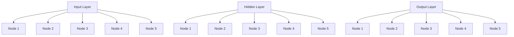
</details>

他 在 吃 热 狗

# Translation

He is a lucky dog   


<details>
<summary>flowchart</summary>


</details>

他 是 个 幸运 儿

He is eating a hot dog 6 words

He is a lucky dog 5 words

Two sentences have different length

Motivation:

the neural network should work on data with different length

He is eating a hot dog

He is a lucky dog

The word ‘dog’ has different meanings.

The translation depends on the words before ‘dog’

hot dog

lucky dog

Motivation:

the neural network should work with sequential-dependent data

# Speech to Text


<details>
<summary>flowchart</summary>


</details>

# Sentiment classification

"I love this movie. I've seen it many times and it's still awesome."

"This movie is bad. I don't like it it all. It's terrible."


<details>
<summary>natural_image</summary>

Simple black right-pointing arrow on white background (no text or symbols)
</details>


<details>
<summary>natural_image</summary>

Green circular icon with a white thumbs-up symbol (no text or numbers)
</details>


<details>
<summary>natural_image</summary>

Simple black right-pointing arrow on white background (no text or symbols)
</details>


<details>
<summary>natural_image</summary>

Red circular icon with a white thumbs-down symbol (no text or numbers)
</details>

# Video activity classification


<details>
<summary>natural_image</summary>

Black-and-white photo of a person standing on grass, no visible text or symbols
</details>

Boxing


<details>
<summary>natural_image</summary>

Black-and-white photo of a person standing on a paved surface, no visible text or symbols
</details>

Clapping


<details>
<summary>natural_image</summary>

Black-and-white photo of a person standing with arms raised, wearing a T-shirt and pants (no visible text or symbols)
</details>

Waving


<details>
<summary>natural_image</summary>

Black-and-white photo of a person walking on a paved path, no visible text or symbols
</details>

Walking


<details>
<summary>natural_image</summary>

Black-and-white photo of a person playing soccer on the ground, framed by blue rectangular frames (no text or symbols visible)
</details>

Jogging


<details>
<summary>natural_image</summary>

Black-and-white photo of a person in motion, possibly running or walking, with no visible text or symbols.
</details>

Running

Recurrent Neural Networks (RNNs) are the modern standard to deal with time-dependent and/or sequencedependent problems.   
This type of network is “recurrent” in the sense that they can revisit or reuse past states as inputs to predict the next or future states.   
• They have memory. Memory is what allows us to incorporate our past thoughts and behaviors into our future thoughts and behaviors.

• The structure of traditional neural networks is relatively simple: input layer-hidden layer-output layer.   
The biggest difference between RNN and traditional neural networks is that each time the previous output is brought to the next hidden layer and trained together.


<details>
<summary>flowchart</summary>

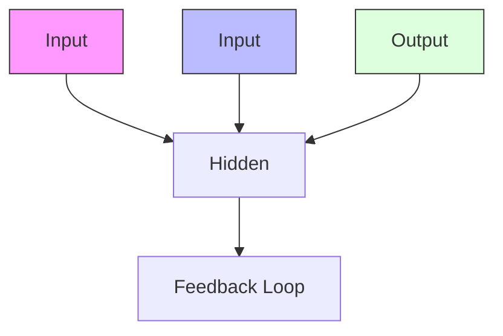
</details>

If we need to judge the user's intention from his/her speak (asking the weather, asking the time, setting an alarm...),

The user says, “What time is it?"

What time is it?

We segment this sentence firstly.

Input the words into the RNN in order.

First use "what" as the input of the RNN and get the output $" { \pmb \sigma } _ { 1 } "$

What time

Then input "time" to the RNN network in order, and get output $" { \pmb { o } } _ { 2 } "$


<details>
<summary>text_image</summary>

01
↑
●
↑
What time is it ?
</details>

Then input "time" to the RNN network in order, and get output "???????? “

When "time" enters, the previous hidden layer of "what" also has an effect (part of the hidden layer "time" of was black).


<details>
<summary>text_image</summary>

01
What time is it ?
</details>

By analogy, all the previous inputs have an impact on the future output.

We can see that the circular hidden layer contains all the previous colors. As shown below:


<details>
<summary>flowchart</summary>

```mermaid
graph TD
    O1["O1"] -->|↑| A["●"]
    O2["O2"] -->|↑| B["●"]
    A --> C["→"]
    B --> D["↑"]
    style A fill:#000,stroke:#000,color:#fff
    style B fill:#000,stroke:#000,color:#fff
    note right of A: 'What' is it ?
```
</details>

Lastly, to judge the user’s intention, we only need the output " ???????? " in the last layer:


<details>
<summary>flowchart</summary>

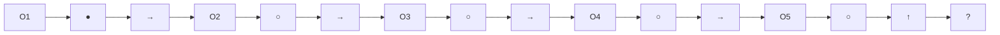
</details>

# Many-to-one RNN

Classification : Positive or negative?   


<details>
<summary>flowchart</summary>

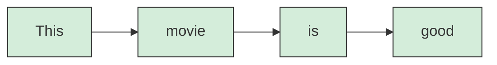
</details>

Source: https://goodboychan.github.io/python/deep\_learning/tensorflowkeras/2020/12/06/01-RNN-Many-to-one.html

# One-to-Many RNN


<details>
<summary>natural_image</summary>

Black and white dog jumping over a blue and white hurdle in an outdoor field (no text or symbols visible)
</details>

One toMany   


<details>
<summary>flowchart</summary>

```mermaid
graph TD
    A[" "] --> B[" "]
    C[" "] --> D[" "]
    E[" "] --> F[" "]
    G[" "] --> H[" "]
    I[" "] --> J[" "]
    K[" "] --> L[" "]
    M[" "] --> N[" "]
    O[" "] --> P[" "]
    Q[" "] --> R[" "]
    S[" "] --> T[" "]
    U[" "] --> V[" "]
    W[" "] --> X[" "]
    Y[" "] --> Z[" "]
    AA[" "] --> AB[" "]
    AC[" "] --> AD[" "]
    AE[" "] --> AF[" "]
    AG[" "] --> AH[" "]
    AI[" "] --> AJ[" "]
    AK[" "] --> AL[" "]
    AM[" "] --> AN[" "]
    AO[" "] --> AP[" "]
    AQ[" "] --> AR[" "]
    AS[" "] --> AT[" "]
    AU[" "] --> AV[" "]
    AW[" "] --> AX[" "]
    AY[" "] --> AZ[" "]
    BA[" "] --> BB[" "]
    BC[" "] --> BD[" "]
    BE[" "] --> BF[" "]
    BG[" "] --> BH[" "]
    BI[" "] --> BJ[" "]
    BK[" "] --> BL[" "]
    BM[" "] --> BN[" "]
    BO[" "] --> BP[" "]
    BQ[" "] --> BR[" "]
    BS[" "] --> BT[" "]
    BU[" "] --> BV[" "]
    BW[" "] --> BX[" "]
    BY[" "] --> BZ[" "]
    CA[" "] --> CB[" "]
    CC[" "] --> CD[" "]
    CE[" "] --> CF[" "]
    CG[" "] --> DH[" "]
    DI[" "] --> DJ[" "]
    DK[" "] --> DL[" "]
    DM[" "] --> DJ
    DB[" "] --> DC[" "]
    DD[" "] --> DV[" "]
    DW[" "] --> DX[" "]
    DX --> DW
    DX --> DX
    DX --> DX
    DX --> DX
    DX --> DX
    DX --> DX
    DX --> DX
    DX --> DX
    DX --> DX
    DX --> DX
    DX --> DX
    DX --> DX
    DX --> DX
    DX --> DX
    DX --> DX
    DX --> DX
    DX --> DX
    DX --> DX
    DX --> DX
    DX --> DX
    DX --> DX
    DX --> DW
    DX --> BX
    DX --> BY
    DX --> DA
    DX --> PX
    DX --> DZ
    DX --> DR
    DX --> CX
    DX --> CY
    DX --> CZ
    DX --> DA
    DX --> PX
    DX --> DZ
    DX --> CX
    DX --> CY
    DX --> CZ
    DX --> CX
    DX --> CY
    DX --> CX
    DX --> CX
    DX --> CX
    DX --> CX
```
</details>

# Different Types of RNN

one to one


<details>
<summary>flowchart</summary>

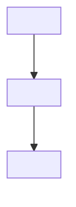
</details>

one to many


<details>
<summary>flowchart</summary>

```mermaid
graph TD
    A[" "] --> B[" "]
    C[" "] --> D[" "]
    E[" "] --> F[" "]
    G[" "] --> H[" "]
    I[" "] --> J[" "]
    K[" "] --> L[" "]
    M[" "] --> N[" "]
    O[" "] --> P[" "]
    Q[" "] --> R[" "]
    S[" "] --> T[" "]
    U[" "] --> V[" "]
    W[" "] --> X[" "]
    Y[" "] --> Z[" "]
    AA[" "] --> AB[" "]
    AC[" "] --> AD[" "]
    AE[" "] --> AF[" "]
    AG[" "] --> AH[" "]
    AI[" "] --> AJ[" "]
    AK[" "] --> AL[" "]
    AM[" "] --> AN[" "]
    AO[" "] --> AP[" "]
    AQ[" "] --> AR[" "]
    AS[" "] --> AT[" "]
    AU[" "] --> AV[" "]
    AW[" "] --> AX[" "]
    AY[" "] --> Z
    AZ[" "] --> AA
    BA[" "] --> AB
    BB[" "] --> AC
    BC[" "] --> AD
    BD[" "] --> AE
    BF[" "] --> AG
    BG[" "] --> AH
    BH[" "] --> AI
    BI[" "] --> AJ
    BJ[" "] --> AK
    BK[" "] --> AL
    BL[" "] --> AM
    BM[" "] --> AN
    BN[" "] --> AO
    BO[" "] --> AP
    BP[" "] --> AQ
    BQ[" "] --> AA
    BR[" "] --> AB
    BS[" "] --> AC
    BT[" "] --> AD
    BU[" "] --> AE
    BV[" "] --> AG
    BW[" "] --> AX
    BX[" "] --> AY
    BY[" "] --> AZ
    BZ[" "] --> BA
    BWB[" "] --> BA
```
</details>

many to one


<details>
<summary>flowchart</summary>

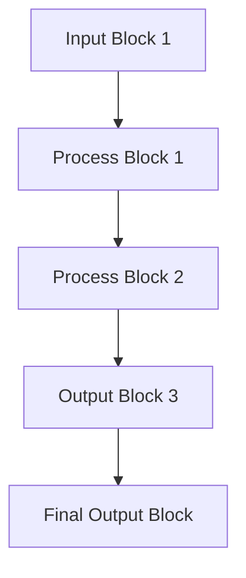
</details>

many to many


<details>
<summary>flowchart</summary>

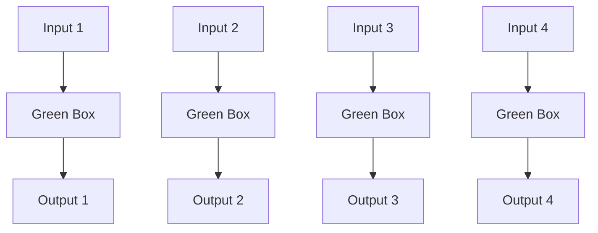
</details>

many to many


<details>
<summary>flowchart</summary>

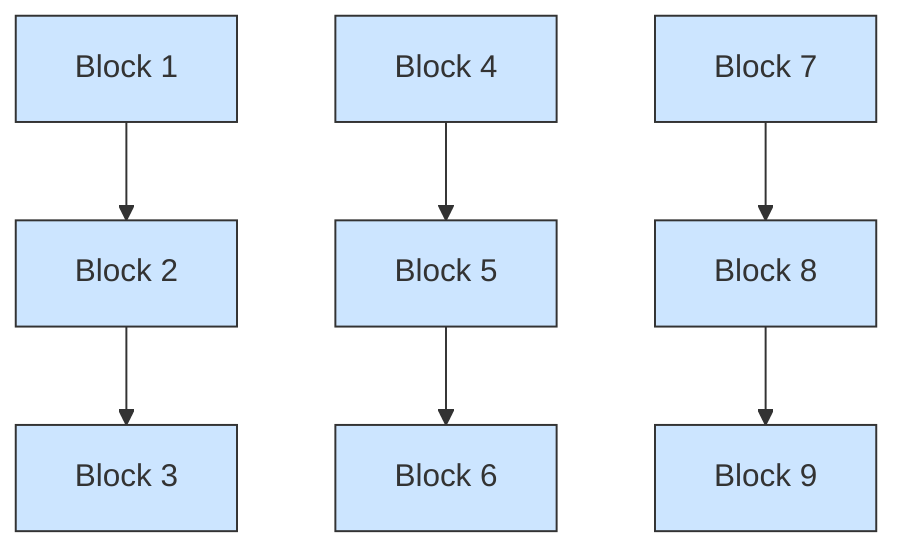
</details>

Source: http://karpathy.github.io/2015/05/21/rnn-effectiveness/

# Many-to-Many RNN

many to many   


<details>
<summary>flowchart</summary>

```mermaid
graph TD
    A["Step 1"] --> B["Step 2"]
    B --> C["Step 3"]
    C --> D["Step 4"]
    D --> E["Step 5"]
    E --> F["Step 6"]
    F --> G["Step 7"]
    G --> H["Step 8"]
    H --> I["Step 9"]
    I --> J["Step 10"]
    J --> K["Step 11"]
    K --> L["Step 12"]
    L --> M["Step 13"]
    M --> N["Step 14"]
    N --> O["Step 15"]
    O --> P["Step 16"]
    P --> Q["Step 17"]
    Q --> R["Step 18"]
    R --> S["Step 19"]
    S --> T["Step 20"]
    T --> U["Step 21"]
    U --> V["Step 22"]
    V --> W["Step 23"]
    W --> X["Step 24"]
    X --> Y["Step 25"]
    Y --> Z["Step 26"]
    Z --> AA["Step 27"]
    AA --> AB["Step 28"]
    AB --> AC["Step 29"]
    AC --> AD["Step 30"]
```
</details>

many to many   


<details>
<summary>flowchart</summary>

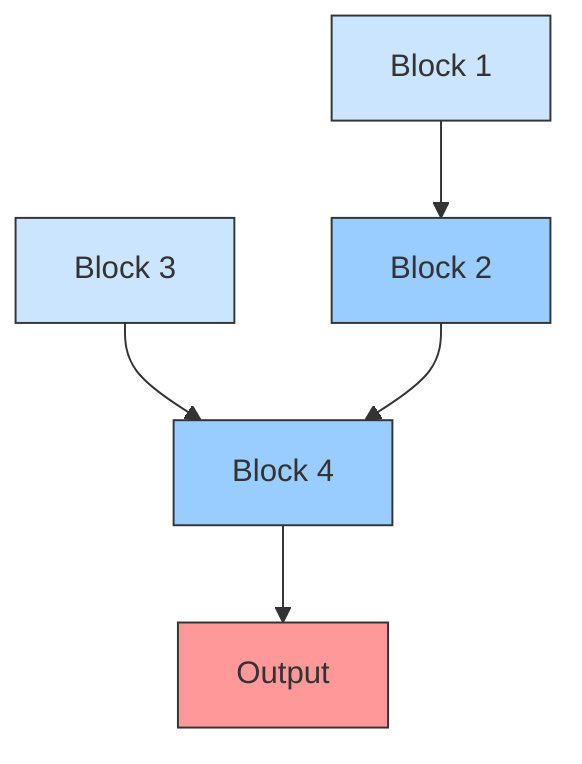
</details>

# Elman Network


<details>
<summary>flowchart</summary>

```mermaid
graph TD
    x["Input Layer x"] -->|w¹| h["Hidden Layer h"]
    h -->|w| c["Clonal Node c"]
    c -->|w| h
    h -->|w²| y["Output Layer ŷ"]
    style h fill:#f9f,stroke:#333
    style c fill:#ccf,stroke:#333
    style x fill:#cfc,stroke:#333
    style y fill:#fcc,stroke:#333
    note right of h: "hidden layer"
    note right of c: "cloned state (memory)"
```
</details>


<details>
<summary>flowchart</summary>

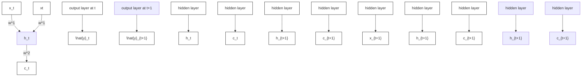
</details>

# Elman Network

$$
\begin{array}{l} X _ {1} \colon \mathsf {H e} \qquad \longrightarrow \quad h _ {1} = \sigma_ {h} (\mathsf {W} _ {h} X _ {1} + U _ {h} h _ {0} + b _ {h}) \quad \longrightarrow \quad Y _ {1} = \sigma_ {y} (\mathsf {W} _ {y} h _ {1} + b _ {y}) \\ X _ {2}: \text {is} \quad \longrightarrow \quad h _ {2} = \sigma_ {h} \left(\mathrm{W} _ {h} X _ {2} + U _ {h} h _ {1} + b _ {h}\right) \quad \longrightarrow \quad Y _ {2} = \sigma_ {y} \left(\mathrm{W} _ {y} h _ {2} + b _ {y}\right) \\ X _ {3} \colon \mathbf {a} \qquad \longrightarrow \quad h _ {3} = \sigma_ {h} (\mathsf {W} _ {h} X _ {3} + U _ {h} h _ {2} + b _ {h}) \quad \longrightarrow \quad Y _ {3} = \sigma_ {y} (\mathsf {W} _ {y} h _ {3} + b _ {y}) \\ X _ {4}: \text {   lucky   } \longrightarrow h _ {4} = \sigma_ {h} (W _ {h} X _ {4} + U _ {h} h _ {3} + b _ {h}) \longrightarrow Y _ {4} = \sigma_ {y} (W _ {y} h _ {4} + b _ {y}) \\ X _ {5} \colon \mathsf {d o g} \quad \longrightarrow \quad h _ {5} = \sigma_ {h} (\mathsf {W} _ {h} X _ {5} + U _ {h} h _ {4} + b _ {h}) \quad \longrightarrow \quad Y _ {5} = \sigma_ {y} (\mathsf {W} _ {y} h _ {5} + b _ {y}) \\ \end{array}
$$


# Jordan Network


<details>
<summary>flowchart</summary>

```mermaid
graph TD
    x["Input x"] --> h["Hidden Layer h"]
    h --> y["Output y"]
    y --> h
    h --> μ[Hidden Layer μ]
    μ --> y
    style h fill:#f9f,stroke:#333
    style μ fill:#ccf,stroke:#333
    style x fill:#cfc,stroke:#333
    note right of h: "hidden layer"
    note right of μ: "running average (memory)"
    note left of y: "output layer"
    note right of μ: "1"
    note right of x: "input layer"
    note left of h: "w²"
    note right of μ: "1"
```
</details>


<details>
<summary>flowchart</summary>

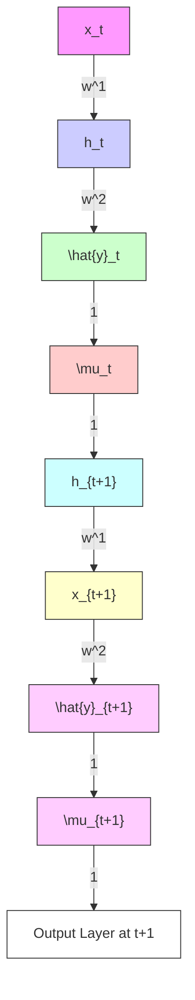
</details>

# Jordan Network

$$
\begin{array}{l} X _ {1}: \mathsf {H e} \quad \longrightarrow \quad h _ {1} = \sigma_ {h} (\mathsf {W} _ {h} X _ {1} + U _ {h} Y _ {0} + b _ {h}) \quad \longrightarrow \quad Y _ {1} = \sigma_ {y} (\mathsf {W} _ {y} h _ {1} + b _ {y}) \\ X _ {2}: \text {is} \quad \longrightarrow \quad h _ {2} = \sigma_ {h} \left(W _ {h} X _ {2} + U _ {h} Y _ {1} + b _ {h}\right) \longrightarrow Y _ {2} = \sigma_ {y} \left(W _ {y} h _ {2} + b _ {y}\right) \\ X _ {3}: \mathbf {a} \quad \longrightarrow \quad h _ {3} = \sigma_ {h} \left(\mathrm{W} _ {h} X _ {3} + U _ {h} Y _ {2} + b _ {h}\right) \longrightarrow Y _ {3} = \sigma_ {y} \left(\mathrm{W} _ {y} h _ {3} + b _ {y}\right) \\ X _ {4}: \text {   lucky   } \longrightarrow h _ {4} = \sigma_ {h} (W _ {h} X _ {4} + U _ {h} Y _ {3} + b _ {h}) \longrightarrow Y _ {4} = \sigma_ {y} (W _ {y} h _ {4} + b _ {y}) \\ X _ {5}: \mathsf {d o g} \quad \longrightarrow \quad h _ {5} = \sigma_ {h} (\mathrm{W} _ {h} X _ {5} + U _ {h} Y _ {4} + b _ {h}) \quad \longrightarrow \quad Y _ {5} = \sigma_ {y} (\mathrm{W} _ {y} h _ {5} + b _ {y}) \\ \end{array}
$$

RNN Unfolded over time   


<details>
<summary>flowchart</summary>

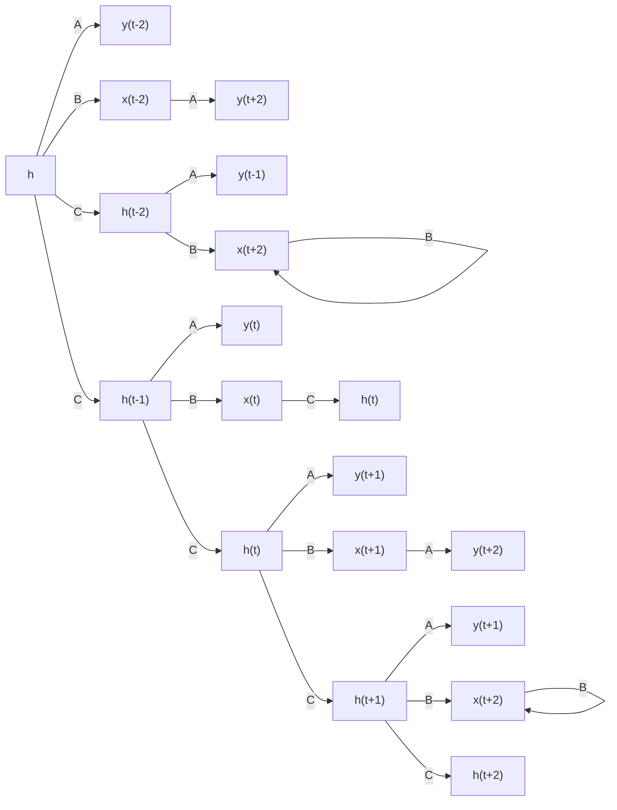
</details>

A dynamical system   
Source: Simplilearn.com

RNN Unfolded over time   


<details>
<summary>flowchart</summary>

```mermaid
graph TD
    O1["O1"] --> A["●"]
    O2["O2"] --> B["●"]
    A --> C["→"]
    B --> D["↑"]
    style A fill:#000,stroke:#000,color:#fff
    style B fill:#000,stroke:#000,color:#fff
    note right of A: 'What is it ?'
```
</details>


<details>
<summary>flowchart</summary>

```mermaid
graph TD
    subgraph Input_States
        y["y"] --> L["L"]
        L --> ŷ[ŷ]
        ŷ --> o["o"]
        o --> h["h"]
        h --> x["x"]
        x --> y
        y --> L
        L --> ŷ
        ŷ --> o
    end

    subgraph Output_States
        y_t_minus_1["y_{t-1}"] --> L_t_minus_1["L_{t-1}"]
        L_t_minus_1 --> ŷ_t_minus_1["ŷ_{t-1}"]
        L_t --> o_t_minus_1["o_{t-1}"]
        o_t_minus_1 --> h_t_minus_1["h_{t-1}"]
        o_t_minus_1 --> X_t_minus_1["X_{t-1}"]
        o_t_minus_1 --> X_t["X_t"]
        o_t_minus_1 --> X_t_plus_1["O_{t+1}"]
    end

    h -->|softmax Wyh| o
    o -->|softmax Wyh| h
    x -->|softmax Wxh| h
    h -->|softmax Wyh| o_t_minus_1
    o_t_minus_1 --> h_t_minus_1
    o_t_minus_1 --> h_t
    h_t_minus_1 --> X_t_minus_1
    h_t --> X_t
    h_t --> X_t_plus_1
    h_t --> X_t_plus_1
    h_t --> X_t_plus_1
    h_t --> O_t_minus_1
    h_t --> O_t
    h_t --> O_t
    h_t --> O_t_plus_1
    h_t --> O_t_plus_1

    y_t_minus_1 --> L_t_minus_1
    L_t --> ŷ_t_minus_1
    ŷ_t_minus_1 --> o_t_minus_1
    o_t --> h_t_minus_1
    o_t --> h_t
    y_t --> L_t
    L_t --> ŷ_t
    ŷ_t --> o_t
    o_t --> H_t_plus_1
    o_t --> H_t

    y_t_plus_1 --> L_t_plus_1
    L_t_plus_1 --> ŷ_t_plus_1
    ŷ_t_plus_1 --> O_t_plus_1

    y_t --> L_t
    L_t --> ŷ_t

    y_t_plus_1 --> L_t_plus_1
    L_t_plus_1 --> ŷ_t_plus_1

    y_t_plus_1 --> L_t_plus_1

    y_t --> L_t

    y_t_plus_1 --> L_t_plus_1

    b_y["b_y"] --> h
    b_h["b_h"] --> x

    style Input_States fill:#f9f,stroke:#333
    style Output_States fill:#bbf,stroke:#333
```
</details>

Source: https://mmuratarat.github.io/2019-02-07/bptt-of-rnn

The RNN is defined by

$$
h _ {t} = f _ {h} \left(X _ {t}, h _ {t - 1}\right) = \phi_ {h} \left(W _ {x h} ^ {T} \cdot X _ {t} + W _ {h h} ^ {T} \cdot h _ {t - 1} + b _ {h}\right)
$$

$$
\hat {y} _ {t} = f _ {o} (h _ {t}) = \phi_ {o} (W _ {y h} ^ {T} \cdot h _ {t} + b _ {y})
$$

where $W _ { x h } , W _ { h h }$ and $W _ { y h }$ are weight matrices for the input, recurrent connections, and the output, respectively and $\phi _ { h }$ and $\phi _ { o }$ are elementwise nonlinear functions.

The Loss function is defined by

$$
\begin{array}{l} L (\hat {y}, y) = \sum_ {t = 1} ^ {T} L _ {t} (\hat {y} _ {t}, y _ {t}) \\ = - \sum_ {t} ^ {T} y _ {t} \log \hat {y} _ {t} \\ = - \sum_ {t = 1} ^ {T} y _ {t} \log [ \text { softmax } (o _ {t}) ] \\ \end{array}
$$

Note that the weight $W _ { y h }$ is shared across all the time sequence. Therefore, we can differentiate to it at the each time step and sum all together:

$$
\begin{array}{l} \frac {\partial L}{\partial W _ {y h}} = \sum_ {t} ^ {T} \frac {\partial L _ {t}}{\partial W _ {y h}} \\ = \sum_ {t} ^ {T} \frac {\partial L _ {t}}{\partial \hat {y} _ {t}} \frac {\partial \hat {y} _ {t}}{\partial o _ {t}} \frac {\partial o _ {t}}{\partial W _ {y h}} \\ \end{array}
$$

Similarly, we can get the gradient with respect to bias $b _ { y }$ :

$$
\begin{array}{l} \frac {\partial L}{\partial b _ {y}} = \sum_ {t} ^ {T} \frac {\partial L _ {t}}{\partial \hat {y} _ {t}} \frac {\partial \hat {y} _ {t}}{\partial o _ {t}} \frac {\partial o _ {t}}{\partial b _ {y}} \\ = \sum_ {t} ^ {T} (\hat {y} _ {t} - y _ {t}) \\ \end{array}
$$

Now, let’s go through the details to derive the gradient with respect to $W _ { h h }$ , considering at the time step $t + 1$

$$
\frac {\partial L _ {t + 1}}{\partial W _ {h h}} = \frac {\partial L _ {t + 1}}{\partial \hat {y} _ {t + 1}} \frac {\partial \hat {y} _ {t + 1}}{\partial h _ {t + 1}} \frac {\partial h _ {t + 1}}{\partial W _ {h h}}
$$

But, the hidden state $h _ { t + 1 }$ partially depends also on $h _ { t } , h _ { t - 1 } , \ldots , h _ { 1 }$

$$
\frac {\partial L _ {t + 1}}{\partial W _ {h h}} = \sum_ {k = 1} ^ {t + 1} \frac {\partial L _ {t + 1}}{\partial \hat {y} _ {t + 1}} \frac {\partial \hat {y} _ {t + 1}}{\partial h _ {t + 1}} \frac {\partial h _ {t + 1}}{\partial h _ {k}} \frac {\partial h _ {k}}{\partial W _ {h h}}
$$

Aggregate the gradients with respect to $W _ { h h }$ over the whole timesteps with backpropagation,

$$
\frac {\partial L}{\partial W _ {h h}} = \sum_ {t} ^ {T} \sum_ {k = 1} ^ {t + 1} \frac {\partial L _ {t + 1}}{\partial \hat {y} _ {t + 1}} \frac {\partial \hat {y} _ {t + 1}}{\partial h _ {t + 1}} \frac {\partial h _ {t + 1}}{\partial h _ {k}} \frac {\partial h _ {k}}{\partial W _ {h h}}
$$

Further, we can take the derivative with respect to $W _ { x h }$ over the whole sequence as

$$
\frac {\partial L}{\partial W _ {x h}} = \sum_ {t} ^ {T} \sum_ {k = 1} ^ {t + 1} \frac {\partial L _ {t + 1}}{\partial \hat {y} _ {t + 1}} \frac {\partial \hat {y} _ {t + 1}}{\partial h _ {t + 1}} \frac {\partial h _ {t + 1}}{\partial h _ {k}} \frac {\partial h _ {k}}{\partial W _ {x h}}
$$

Note: Because of recursive derivative, we need to compute

$$
\prod_ {j = k} ^ {t} \frac {\partial h _ {j + 1}}{\partial h _ {j}} = \frac {\partial h _ {t + 1}}{\partial h _ {k}} = \frac {\partial h _ {t + 1}}{\partial h _ {t}} \frac {\partial h _ {t}}{\partial h _ {t - 1}} \dots \frac {\partial h _ {k + 1}}{\partial h _ {k}}
$$

This can lead to vanishing gradient or exploding gradient.

Decay of information through time   


<details>
<summary>flowchart</summary>

```mermaid
graph LR
    A["Time t = 0"] --> B["Time t = 1"]
    B --> C["Time t = 2"]
    C --> D["Time t = 3"]
    D --> E["Time t = 4"]
    E --> F["Time t = 5"]
    F --> G["Time t = 6..."]
    G --> H["..."]
    H --> I["Time t = 100"]
```
</details>

Source: O'Reilly Media

Decay of information through time   


<details>
<summary>flowchart</summary>

```mermaid
graph TD
    O1["O1"] -->|↑| A["●"]
    O2["O2"] -->|↑| B["●"]
    A --> C["→"]
    B --> D["↑"]
    style A fill:#000,stroke:#000,color:#fff
    style B fill:#000,stroke:#000,color:#fff
    note right of A: What is it ?
```
</details>


<details>
<summary>natural_image</summary>

Circular color gradient design with no text or symbols
</details>

# Long Short-Term Memory

The intuition behind the LSTM architecture is to create an additional module in a neural network that learns when to remember and when to forget pertinent information.   
• In other words, the network, effectively learns which information might be needed later on in a sequence and when that information is no longer needed.


<details>
<summary>flowchart</summary>

```mermaid
graph TD
    A["Input"] --> B["RNN"]
    B --> C["Working Memory"]
    C --> D["Long-term Memory"]
    D --> E["LSTM"]
    E --> F["Working Memory"]
    F --> G["Output"]
    H["Input"] --> I["Output"]
    J["Output"] --> K["Output"]
    style B fill:#cce5ff,stroke:#333
    style E fill:#cce5ff,stroke:#333
```
</details>

Source: Research Gate

In addition to the hidden state $\pmb { h } _ { t }$ , LSTM also keeps a memory cell $c _ { t }$   


<details>
<summary>flowchart</summary>

```mermaid
graph TD
    A["Ct-1"] --> B["Forget gate"]
    B --> C["σ"]
    B --> D["σ"]
    B --> E["tanh"]
    E --> F["×"]
    G["ht-1"] --> H["Xt"]
    H --> I["Output gate"]
    I --> J["tanh"]
    J --> K["×"]
    L["ht"] --> M["Output gate"]
    M --> N["Output gate"]
    style A fill:#99ccff,stroke:#333
    style G fill:#99ccff,stroke:#333
    style L fill:#99ccff,stroke:#333
    style M fill:#99ccff,stroke:#333
    subgraph LSTM_Memory_Cell
        B -->|↑| I
        C -->|↑| I
        D -->|↑| I
        E -->|↑| I
        F -->|↑| I
        G -->|↑| I
        H -->|↓| I
        I --> J
        I --> K
        I --> L
        I --> M
    end
    subgraph LSTM_Memory_Cell
        J -->|↓| K
        K --> L
        L --> M
        M --> N
    end
```
</details>

The forward pass of an LSTM cell with a forget gate are

$$
f _ {t} = \sigma_ {g} (W _ {f} x _ {t} + U _ {f} h _ {t - 1} + b _ {f})
$$

$$
i _ {t} = \sigma_ {g} (W _ {i} x _ {t} + U _ {i} h _ {t - 1} + b _ {i})
$$

$$
o _ {t} = \sigma_ {g} (W _ {o} x _ {t} + U _ {o} h _ {t - 1} + b _ {o})
$$

$$
\tilde {c} _ {t} = \sigma_ {c} (W _ {c} x _ {t} + U _ {c} h _ {t - 1} + b _ {c})
$$

$$
c _ {t} = f _ {t} \odot c _ {t - 1} + i _ {t} \odot \tilde {c} _ {t}
$$

$$
h _ {t} = o _ {t} \odot \sigma_ {h} (c _ {t})
$$

where the initial values are $\pmb { c _ { 0 } = 0 }$ and $\pmb { h _ { 0 } } = \mathbf { 0 }$ , and the operator ⊙ denotes the Hadamard product (element-wise product).

中 $\mathbf { I } _ { t } ^ { n _ { t } } \in \mathbb { R } ^ { d }$ : input vector to the LSTM unit   
$f _ { i } \in ( 0 , 1 ) ^ { h }$ : forget gate's activation vector   
$i _ { t } \in ( 0 , 1 ) ^ { h }$ : input/update gate's activation vector   
$\sigma _ { \ell } \in ( 0 , 1 ) ^ { h }$ : output gate's activation vector

$h _ { t } \in ( - 1 , 1 ) ^ { h }$ : hidden state vector   
$\tilde { \bar { c } } _ { t } \in ( - 1 , 1 ) ^ { h }$ : cell input activation vector   
$c _ { t } \in \mathbb { R } ^ { h }$ Ct R： : cell state vector


<details>
<summary>flowchart</summary>

```mermaid
graph TD
    A["ct-1"] --> B["X"]
    B --> C["f_t"]
    C --> D["σ"]
    D --> E["i_t"]
    E --> F["σ"]
    F --> G["tanh"]
    G --> H["σ"]
    H --> I["ot"]
    I --> J["x"]
    J --> K["tanh"]
    K --> L["xt"]
    L --> M["h_t-1"]
    M --> N["xt"]
    N --> O["+"]
    O --> P["x"]
    P --> Q["tanh"]
    Q --> R["xt"]
    R --> S["ht"]
    S --> T["yt"]
    T --> U["Ct"]
    U --> V["ct"]
```
</details>

# Wikipedia: Gated Recurrent Unit


<details>
<summary>flowchart</summary>

```mermaid
graph TD
    A["x_t"] --> B["σ"]
    B --> C["r_t"]
    C --> D["x"]
    D --> E["z_t"]
    E --> F["σ"]
    F --> G["1-"]
    G --> H["x"]
    H --> I["tanh"]
    I --> J["+"]
    J --> K["h_t"]
    K --> L["h_{t-1}"]
    style A fill:#f9f,stroke:#333
    style L fill:#ccf,stroke:#333
```
</details>

$$
z _ {t} = \sigma \left(W _ {z} \cdot [ h _ {t - 1}, x _ {t} ]\right)
$$

$$
r _ {t} = \sigma \left(W _ {r} \cdot [ h _ {t - 1}, x _ {t} ]\right)
$$

$$
\tilde {h} _ {t} = \tanh \left(W \cdot [ r _ {t} * h _ {t - 1}, x _ {t} ]\right)
$$

$$
h _ {t} = (1 - z _ {t}) * h _ {t - 1} + z _ {t} * \tilde {h} _ {t}
$$

# Word Embedding

In natural language processing (NLP), a word embedding is a representation of a word.   
The embedding is used in text analysis.   
Typically, the representation is a real-valued vector that encodes the meaning of the word in such a way that words that are closer in the vector space are expected to be similar in meaning.

# One-hot word embedding

• In a one-hot encoding, or “1-of-N” encoding, the embedding space has the same number of dimensions as the number of words in the vocabulary   
• Each word embedding is predominantly made up of zeros, with a “1” in the corresponding dimension for the word.

# One-hot word embedding

Example of a one-hot embedding scheme for a nine-word vocabulary. Word embeddings are read as rows of this table.

Vocabulary: Man,woman, boy, girl, prince, princess, queen, king, monarch


<details>
<summary>natural_image</summary>

Solid red right-pointing arrow shape (no text or symbols)
</details>

<table><tr><td></td><td>1</td><td>2</td><td>3</td><td>4</td><td>5</td><td>6</td><td>7</td><td>8</td><td>9</td></tr><tr><td>man</td><td>1</td><td>0</td><td>0</td><td>0</td><td>0</td><td>0</td><td>0</td><td>0</td><td>0</td></tr><tr><td>woman</td><td>0</td><td>1</td><td>0</td><td>0</td><td>0</td><td>0</td><td>0</td><td>0</td><td>0</td></tr><tr><td>boy</td><td>0</td><td>0</td><td>1</td><td>0</td><td>0</td><td>0</td><td>0</td><td>0</td><td>0</td></tr><tr><td>girl</td><td>0</td><td>0</td><td>0</td><td>1</td><td>0</td><td>0</td><td>0</td><td>0</td><td>0</td></tr><tr><td>prince</td><td>0</td><td>0</td><td>0</td><td>0</td><td>1</td><td>0</td><td>0</td><td>0</td><td>0</td></tr><tr><td>princess</td><td>0</td><td>0</td><td>0</td><td>0</td><td>0</td><td>1</td><td>0</td><td>0</td><td>0</td></tr><tr><td>queen</td><td>0</td><td>0</td><td>0</td><td>0</td><td>0</td><td>0</td><td>1</td><td>0</td><td>0</td></tr><tr><td>king</td><td>0</td><td>0</td><td>0</td><td>0</td><td>0</td><td>0</td><td>0</td><td>1</td><td>0</td></tr><tr><td>monarch</td><td>0</td><td>0</td><td>0</td><td>0</td><td>0</td><td>0</td><td>0</td><td>0</td><td>1</td></tr></table>

Each word gets a 1x9 vector representation

# One-hot word embedding

The number of dimensions, increases linearly as we add words to the vocabulary. For a vocabulary of 50,000 words, each word is represented with 49,999 zeros, and a single “one” value in the correct location. The memory use is prohibitively large.   
• The embedding matrix is very sparse, mainly made up of zeros.   
. There is no shared information between words and no commonalities between similar words. All words are the same “distance” apart in the embedding space.

# Custom embedding

Manually choosing dimensions that make sense for the vocabulary.

Vocabulary: Man,woman, boy, girl,prince, princess,queen, king,monarch


<details>
<summary>natural_image</summary>

Solid red right-pointing arrow shape (no text or symbols)
</details>

<table><tr><td></td><td>Femininity</td><td>Youth</td><td>Royalty</td></tr><tr><td>Man</td><td>0</td><td>0</td><td>0</td></tr><tr><td>Woman</td><td>1</td><td>0</td><td>0</td></tr><tr><td>Boy</td><td>0</td><td>1</td><td>0</td></tr><tr><td>Girl</td><td>1</td><td>1</td><td>0</td></tr><tr><td>Prince</td><td>0</td><td>1</td><td>1</td></tr><tr><td>Princess</td><td>1</td><td>1</td><td>1</td></tr><tr><td>Queen</td><td>1</td><td>0</td><td>1</td></tr><tr><td>King</td><td>0</td><td>0</td><td>1</td></tr><tr><td>Monarch</td><td>0.5</td><td>0.5</td><td>1</td></tr></table>

Each word getsa 1x3vector

Similarwords... similarvectors

# Custom embedding

1. The set of embeddings is more efficient, each word is represented with a 3-dimensional vector.   
2. Similar words have similar vectors here. i.e. there’s a smaller distance between the embeddings for “girl” and “princess”, than from “girl” to “prince”. In this case, distance is defined by Euclidean distance.   
3. The embedding matrix is much less sparse, and we could potentially add further words to the vocabulary without increasing the dimensionality. For instance, the word “child” might be represented with [0.5, 1, 0].   
4. Relationships between words are captured and maintained, e.g. the movement from king to queen, is the same as the movement from boy to girl, and could be represented by [+1, 0, 0].

# Extending to larger vocabularies

# Word Embeddings Properties

• Word Similarities / Synonyms   
Linguistic Relationships

Example 2D word embedding space, where similar words are found in similar locations.   
  
Source: http://suriyadeepan.github.io

Country and Capital Vectors Projected by PCA   
  
2D PCA projection of word embeddings showing the linear “capital city of” relationship captured by the word-embedding training process.


<details>
<summary>text_image</summary>

king
man
woman
queen
</details>

Male-Female


<details>
<summary>text_image</summary>

walked
swam
walking
swimming
</details>

Verb tense


<details>
<summary>flowchart</summary>

```mermaid
graph TD
    A["Spain"] --> B["Madrid"]
    C["Italy"] --> D["Rome"]
    E["Germany"] --> F["Berlin"]
    G["Turkey"] --> H["Ankara"]
    I["Russia"] --> J["Moscow"]
    K["Canada"] --> L["Ottawa"]
    M["Japan"] --> N["Tokyo"]
    O["Vietnam"] --> P["Hanoi"]
    Q["China"] --> R["Beijing"]
```
</details>

Country-Capital

Three examples of relationships that are automatically uncovered during wordembedding training – male-female, verb tense, and country-capital.

# Extending to larger vocabularies

# The most popular algorithms include

1. Word2Vec algorithm from Google   
2. GloVe algorithm from Stanford   
3. fasttext algorithm from Facebook

# Example

# Data set: surnames from 18 countries

  
Arabic.txt

  
Chinese.txt

  
Czech.txt

  
Dutch.txt

  
English.txt

  
French.txt

  
German.txt

  
Greek.txt

  
Irish.txt

  
Italian.txt

  
Japanese.txt

  
Korean.txt

  
Polish.txt

  
Portuguese.txt

  
Russian.txt

  
Scottish.txt

  
Spanish.txt

  
Vietnamese.txt

<table><tr><td colspan="6">Chinese.txt</td></tr><tr><td>Ang</td><td>Abbas</td><td>Ababko</td><td>Abel</td><td></td><td></td></tr><tr><td>Au-Yong</td><td>Abbey</td><td>Abaev</td><td>Abraham</td><td></td><td></td></tr><tr><td>Bai</td><td>Abbott</td><td>Abagyan</td><td>Adam</td><td></td><td></td></tr><tr><td>Ban</td><td>Abdi</td><td>Abaidulin</td><td>Albert</td><td></td><td></td></tr><tr><td>Bao</td><td>Abel</td><td>Abaidullin</td><td>Allard</td><td></td><td></td></tr><tr><td>Bei</td><td>Abraham</td><td>Abaimoff</td><td>Archambault</td><td></td><td></td></tr><tr><td>Bian</td><td>Abrahams</td><td>Abaimov</td><td>Armistead</td><td></td><td></td></tr><tr><td>Bui</td><td>Abrams</td><td>Abakeliya</td><td>Arthur</td><td></td><td></td></tr><tr><td>Cai</td><td>Ackary</td><td>Abakovsky</td><td>Augustin</td><td></td><td></td></tr><tr><td>Cao</td><td>Ackroyd</td><td>Abakshin</td><td>Babineaux</td><td></td><td></td></tr><tr><td>Cen</td><td>Acton</td><td>Abakumoff</td><td>Baudin</td><td></td><td></td></tr><tr><td>Chai</td><td>Adair</td><td>Abakumov</td><td>Beauchene</td><td></td><td></td></tr><tr><td>Chaim</td><td>Adam</td><td>Abakumtsey</td><td>Beaulieu</td><td></td><td></td></tr><tr><td>Chan</td><td>Adams</td><td>Abakushin</td><td>Beaumont</td><td></td><td></td></tr><tr><td>Chang</td><td>Adamson</td><td>Abalakin</td><td>Bélanger</td><td></td><td></td></tr><tr><td>Chao</td><td>Adanet</td><td>Abalakoff</td><td>Bellamy</td><td></td><td></td></tr><tr><td>Che</td><td>Addams</td><td>Abalakov</td><td>Bellerose</td><td></td><td></td></tr><tr><td>Chen</td><td>Adderley</td><td>Abaleshev</td><td>Belrose</td><td></td><td></td></tr><tr><td>Cheng</td><td>Addinall</td><td>Abalihin</td><td>Berger</td><td></td><td></td></tr><tr><td>Cheung</td><td>Addis</td><td>Abalikhin</td><td>Béringer</td><td></td><td></td></tr><tr><td>Chew</td><td>Addison</td><td>Abalkin</td><td>Bernard</td><td></td><td></td></tr><tr><td>Chieu</td><td>Addley</td><td>Abalmasoff</td><td>Bertrand</td><td></td><td></td></tr><tr><td>Chong</td><td>Aderson</td><td>Abalmasov</td><td>Bisset</td><td></td><td></td></tr><tr><td>Chou</td><td>Adey</td><td>Abaloff</td><td>Bissette</td><td></td><td></td></tr><tr><td>Chu</td><td>Adkins</td><td>Abalov</td><td>Blaise</td><td></td><td></td></tr><tr><td>Cui</td><td>Adlam</td><td>Abamelek</td><td>Blanc</td><td></td><td></td></tr><tr><td>Dai</td><td>Adler</td><td>Abanin</td><td>Blanchet</td><td></td><td></td></tr><tr><td>Deng</td><td>Adrol</td><td>Abankin</td><td>Blanchett</td><td></td><td></td></tr><tr><td>Ding</td><td>Adsett</td><td>Abarinoff</td><td>Bonfils</td><td></td><td></td></tr><tr><td>Dong</td><td>Agar</td><td>Abarinov</td><td>Bonheur</td><td></td><td></td></tr><tr><td>Dou</td><td>Ahern</td><td>Abasheev</td><td>Bonhomme</td><td></td><td></td></tr><tr><td>Duan</td><td>Aherne</td><td>Abashev|</td><td>Bonnaire</td><td></td><td></td></tr><tr><td>Eng</td><td>Ahmad</td><td>Abashidze</td><td>Bonnay</td><td></td><td></td></tr><tr><td>Fan</td><td>Ahmed</td><td>Abashin</td><td>Bonner</td><td></td><td></td></tr><tr><td>Fei</td><td>Aikman</td><td>Abashkin</td><td>Bonnet</td><td></td><td></td></tr><tr><td>Feng</td><td>Ainley</td><td>Abasov</td><td>Borde</td><td></td><td></td></tr><tr><td>Foong</td><td>Ainsworth</td><td>Abatsiev</td><td>Bordelon</td><td></td><td></td></tr></table>

# Target:

Train a classifier using RNN to classify surname into 18 country categories

Embedding: One-hot embedding   
```python
import unicodedata
import string

all_letters = string.ascii_letters + " .;;"
n_letters = len(all_letters)

print(all_letters)
print(n_letters) 
```

abcdefghijklmnopqrstuvWxyzABCDEFGHIJKLMNOPQRSTUVWXYZ ., ; ' 57

Embedding: One-hot embedding   
```python
# Find letter index from all_letters, e.g. "a" = 0
def letterToIndex(letter):
    return all_letters.find(letter)
print(all_letters.find('a'))
print(all_letters.find('A'))
print(all_letters.find('J')) 
```

```txt
0
26
35 
```

Embedding: One-hot embedding   
```python
import torch
# Just for demonstration, turn a letter into a <1 x n_letters> Tensor
def letterToTensor(letter):
    tensor = torch.zeros(1, n_letters)
    tensor[0][letterToIndex(letter)] = 1
    return tensor

print(letterToTensor('a'))
print(letterToTensor('B'))
print(letterToTensor('J')) 
```

```lua
tensor([[1., 0., 0., 0., 0., 0., 0., 0., 0., 0., 0., 0., 0., 0., 0., 0., 0., 0., 0., 0.,
    0., 0., 0., 0., 0., 0., 0., 0., 0., 0., 0., 0., 0., 0., 0., 0., 0., 0., 0.,
    0., 0., 0., 0., 0., 0., 0., 0., 0., 0., 0., 0., 0., 1., 0., 0., 0., 0., 0., 0., 0., 0.
    0., 0., 0., 0., 0., 0., 0., 0., 0., 0., 0., 0., 0., 0., 0.],)

tensor([[0., 0., 0., 0., 0., 0., 0., 0., 0., 0., 1.]
tensor([[0.., 0.., 0.., 0.., 0.., 0.., 0.., 0.., 1.], 
```

Build RNN   
```python
class RNN(nn.Module):
    def __init__(self, input_size, hidden_size, output_size):
    super(RNN, self).__init__()
    self.hidden_size = hidden_size
    self.i2h = nn.Linear(input_size + hidden_size, hidden_size)
    self.i2o = nn.Linear(input_size + hidden_size, output_size)
    self.softmax = nn.LogSoftmax(dim=1)

    def forward(self, input, hidden):
    combined = torch.cat((input, hidden), 1)
    hidden = self.i2h(combined)
    output = self.i2o(combined)
    output = self.softmax(output)
    return output, hidden

    def initHidden(self):
    return torch.zeros(1, self.hidden_size)

n_hidden = 128
rnn = RNN(n_letters, n_hidden, n_categories) 
```

# Forward pass in RNN

```python
input = letterToTensor('A')
hidden = torch.zeros(1, n_hidden)
output, next_hidden = rnn(input, hidden)
print(output) 
```

```txt
tensor([[-3.1146, -3.9119, -2.8865, -2.4666, -2.9795, -3.5882, -3.4682, -3.0312, -3.1896, -2.5168, -3.0321, -3.2578, -2.9676, -2.1635, -2.5508, -2.7902, -2.6268, -2.9879]], grad_fn=<LogSoftmaxBackward0>) 
```

# Train the model

criterion = nn.NLLLoss(). # Negative log likelihood loss   
```python
learning_rate = 0.005 # If you set this too high, it might explode.
# If too low, it might not learn 
```

```python
def train(category_tensor, line_tensor):
    hidden = rnn.initHidden()
    rnn.zero_grad()

    for i in range(line_tensor.size()[0]):
    output, hidden = rnn(line_tensor[i], hidden)

    loss = criterion(output, category_tensor)
    loss.backward()

    # Add parameters' gradients to their values, mul
    for p in rnn.parameters():
    p.data.add_(p.grad.data, alpha=-learning_rat

    return output, loss.item() 
```

# Training Process

```csv
5000 2% (0m 6s) 0.0121 Brisimitzakis / Greek √
10000 5% (0m 12s) 2.3322 Wizner / German × (Czech)
15000 7% (0m 19s) 1.5737 Alesio / Spanish × (Italian)
20000 10% (0m 25s) 2.5522 Horner / German × (English)
25000 12% (0m 32s) 0.2332 Giang / Vietnamese √
30000 15% (0m 38s) 2.0818 Jorda / Polish × (Spanish)
35000 17% (0m 45s) 0.3461 Ly / Vietnamese √
40000 20% (0m 51s) 1.4224 Lindsay / English × (Scottish)
45000 22% (0m 59s) 0.7342 Daher / Arabic √
50000 25% (1m 5s) 1.5104 Bauer / Arabic × (German)
55000 27% (1m 12s) 0.4402 Paquet / French √
60000 30% (1m 18s) 1.0985 Kuang / Chinese √
65000 32% (1m 25s) 1.9924 Caiazzo / Portuguese × (Italian)
70000 35% (1m 31s) 0.0066 Maolmhuaidh / Irish √
75000 37% (1m 38s) 0.5535 Dao / Vietnamese √
80000 40% (1m 44s) 0.0000 Cuidightheach / Irish √
85000 42% (1m 51s) 0.4375 Park / Korean √
90000 45% (1m 57s) 0.2562 Thai / Vietnamese √
95000 47% (2m 3s) 0.0537 Zielinski / Polish √
100000 50% (2m 10s) 0.0243 Hlutkov / Russian √ 
```

# Training Process

105000 52% (2m 16s) 1.2543 Shu / Korean X (Chinese)   
110000 55% (2m 23s）0.3678 Thean / Chinese √   
115000 57% (2m 28s）0.8697 Medeiros / Portuguese √   
120000 60% (2m 35s) 2.3523 Miazga / Japanese X (Polish)   
125000 62% (2m 41s)0.1248 Malinowski / Polish √   
130000 65% (2m 48s）0.3051 Santana / Portuguese √   
135000 67% (2m 54s)4.7025 Samuel / Arabic X (Irish)   
140000 70% (3m 1s）0.1119 Morrison / Scottish √  
145000 72% (3m 7s）0.7417 Cremonesi / Italian √   
150000 75% (3m 14s) 1.6909 Moreno / Spanish X (Portuguese)   
155000 77% (3m 20s)1.5550 Jez / Chinese X (Polish)   
160000 80% (3m 27s) 4.0158 Chromy / Irish X (Czech)   
165000 82% (3m 33s)0.2522 O'Donnell / Irish √   
170000 85% (3m 40s)0.3419 Airaldi / Italian √   
175000 87% (3m 46s) 1.5858 Robles / Spanish √   
180000 90% (3m 53s)0.0202 Arnoni / Italian √   
185000 92% (3m 59s) 2.8040 Legg / Vietnamese X (English)   
190000 95% (4m 6s) 1.7104 Oliver / French X (Spanish)   
195000 97% (4m 12s)0.4689 Luc / Vietnamese √   
200000 100% (4m 18s） 5.7895 Tsoumada / Japanese X (Greek)

Training Loss   


<details>
<summary>line</summary>

| x    | y      |
| ---- | ------ |
| 0    | 1.27   |
| 25   | 1.23   |
| 50   | 1.18   |
| 75   | 1.19   |
| 100  | 1.16   |
| 125  | 1.17   |
| 150  | 1.14   |
| 175  | 1.15   |
| 200  | 1.16   |
</details>

Result   


# Result

> Dovesky   
(-0.87) Russian   
(-0.96)Czech   
(-1.84）English   
> Wang   
(-0.58)Chinese   
(-1.42） Korean  
(-2.42）Scottish

> Jackson

(-1.35）English

(-1.59)Scottish

(-1.73）Czech

> Peterson

(-0.63)Scottish

(-1.75）Dutch

(-1.85）German

> Satoshi

(-0.83)Arabic

(-1.31)Italian

(-1.74） Japanese

> Abraham

(-1.47) Russian

(-1.64）English

(-2.00） Vietnamese