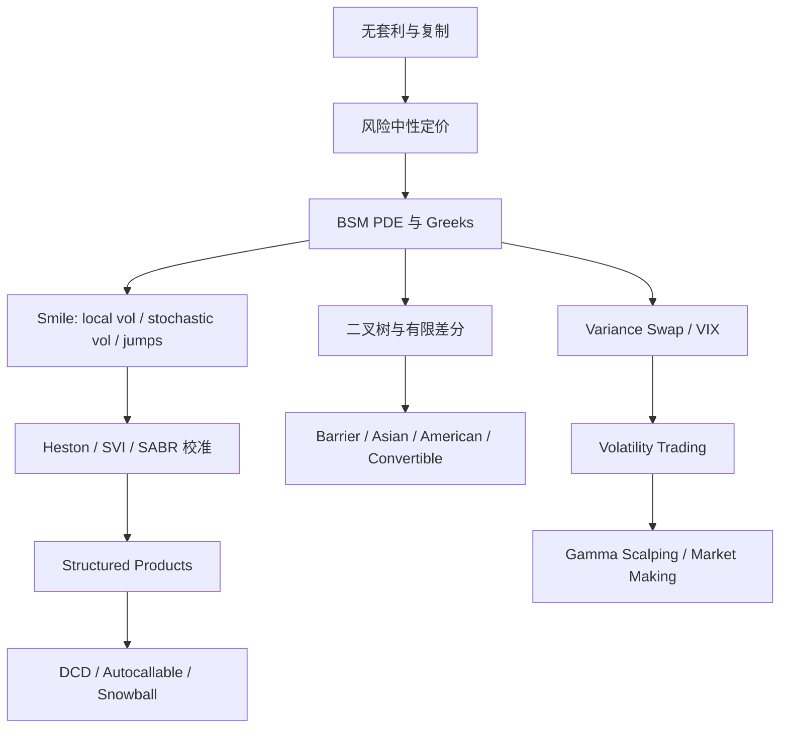

# AMA568 Quantitative Finance 总整理

> [!info] 来源文件
> 本整理覆盖 `/Users/xuji/Documents/obsidian/AMA568 Quantitative Finance` 下的 14 份笔记：  
> `lecture notes 1 - Preliminaries.md`、`lecture notes 2 - beyond BS.md`、`lecture notes 3 - Vix and Variance Swap.md`、`lecture notes 4 - BTM.md`、`lecture_7_DCD.md`、`lecture_8_convertible_bond-lecture-notes.md`、`lecture_9_autocallable.md`、`lecture-10-heston.md`、`lecture-10-svi.md`、`lecture-10-sabr.md`、`lecture-note-11-Volatility Trading.md`、`Reading Materials - Gamma Scalping Empirical Test.md`、`lecture 12 - notes_market_making.md`、`lecture 12 - review_2026.md`。

---

## 1. 课程主线

AMA568 的核心不是单独学习某一个模型，而是围绕“如何给复杂衍生品定价、校准、交易和做市”形成一条完整链路：

1. **从无套利定价开始**：用二叉树、复制组合、风险中性概率理解期权价格为什么是折现期望。
2. **进入 Black-Scholes-Merton 框架**：用连续时间、自融资组合、Itô 引理和 PDE 得到标准欧式期权定价公式。
3. **解释 Black-Scholes 的不足**：真实市场有 volatility smile/skew、波动率随机、跳跃、厚尾、交易成本和流动性风险。
4. **用更复杂模型修正现实偏差**：local volatility、stochastic volatility、jump diffusion、Heston、SVI、SABR。
5. **把模型用于产品**：variance swap、VIX、DCD、convertible bond、autocallable/snowball。
6. **把定价连接交易**：Greeks、delta hedging、gamma scalping、volatility trading、market making。

---

## 2. 文件地图

| 文件                                                     | 主题                      | 最重要的知识点                                                                      |
| ------------------------------------------------------ | ----------------------- | ---------------------------------------------------------------------------- |
| [[lecture notes 1 - Preliminaries\|lecture notes 1 - Preliminaries.md]]                                     | 预备知识、二叉树、BSM            | CRR 模型、风险中性概率、Itô 引理、自融资组合、BSM PDE、Monte Carlo                               |
| [[lecture notes 2 - beyond BS\|lecture notes 2 - beyond BS.md]]                                             | Black-Scholes 之后        | implied volatility、smile/skew、local vol、Dupire、stochastic vol、jump diffusion |
| [[lecture notes 3 - Vix and Variance Swap\|lecture notes 3 - Vix and Variance Swap.md]]                     | 方差互换与 VIX               | realized variance、variance swap fair strike、log contract、VIX 离散公式            |
| [[lecture notes 4 - BTM\|lecture notes 4 - BTM.md]]                                                         | 二叉树方法                   | European/American BTM、barrier、Asian、FSGM、BTM 与显式有限差分                         |
| [[lecture_7_DCD\|lecture_7_DCD.md]]                                                                         | Dual Currency Deposit   | DCD payoff 拆解、BS 定价、Heston/Fourier/COS 扩展                                    |
| [[lecture_8_convertible_bond-lecture-notes\|lecture_8_convertible_bond-lecture-notes.md]]                  | 可转债                     | 转股权、赎回/回售、最优边界、稀释、随机利率、信用风险                                                  |
| [[lecture_9_autocallable\|lecture_9_autocallable.md]]                                                      | Autocallable / Snowball | 敲出、敲入、观察日、票息、四类情景 payoff                                                     |
| [[lecture-10-heston\|lecture-10-heston.md]]                                                                 | Heston                  | 随机方差、特征函数、Fourier inversion、COS method、校准                                    |
| [[lecture-10-svi\|lecture-10-svi.md]]                                                                       | SVI                     | total implied variance、raw SVI、JW 参数、切片校准、无套利约束                              |
| [[lecture-10-sabr\|lecture-10-sabr.md]]                                                                     | SABR                    | forward volatility、Hagan 近似公式、参数含义、校准                                        |
| [[lecture-note-11-Volatility Trading\|lecture-note-11-Volatility Trading.md]]                              | 波动率交易                   | Greeks、delta hedging PnL、GARCH/EWMA、Whalley-Wilmott、gamma scalping           |
| [[Reading Materials - Gamma Scalping Empirical Test\|Reading Materials - Gamma Scalping Empirical Test.md]] | Gamma scalping 实证       | 买入跨式、动态调仓、Vega 对冲、Gamma benefit 与 Theta decay                                |
| [[lecture 12 - notes_market_making\|lecture 12 - notes_market_making.md]]                                  | 期权做市                    | vol quote、spread decomposition、Greeks inventory、日内 PnL、风险控制                  |
| [[lecture 12 - review_2026\|lecture 12 - review_2026.md]]                                                  | 复习材料                    | 全课程公式与考试主线汇总                                                                 |

---

## 3. 无套利、二叉树与风险中性定价

### 3.1 单期二叉树

股票初始价格为 $S_0$，到期后可能变为 $S_0u$ 或 $S_0d$。衍生品在两个状态的价值分别为 $V_u,V_d$。复制组合持有 $\Delta$ 股股票和现金账户 $B$：

$$
\Delta S_0 u + B e^{rT} = V_u
$$

$$
\Delta S_0 d + B e^{rT} = V_d
$$

因此：

$$
\Delta = \frac{V_u - V_d}{S_0(u-d)}
$$

风险中性概率为：

$$
p = \frac{e^{rT}-d}{u-d}
$$

衍生品初始价格：

$$
V_0 = e^{-rT}\left(pV_u+(1-p)V_d\right)
$$

> [!tip] 直觉
> 二叉树定价不是在预测真实上涨概率，而是在找一个“使贴现股票价格成为 martingale”的概率测度。这个概率是定价工具，不是市场观点。

### 3.2 多期 CRR 模型

CRR 常用参数：

$$
u = e^{\sigma\sqrt{\Delta t}}, \qquad d = e^{-\sigma\sqrt{\Delta t}}
$$

风险中性概率：

$$
p = \frac{e^{r\Delta t}-d}{u-d}
$$

终端节点 payoff 已知后，从最后一期向前递推：

$$
V_j^n = e^{-r\Delta t}\left(pV_{j+1}^{n+1}+(1-p)V_j^{n+1}\right)
$$

二叉树的核心优点是结构清楚、适合处理提前行权和路径/障碍类特征；缺点是高维状态变量会导致节点数迅速膨胀。

---

## 4. Black-Scholes-Merton 框架

### 4.1 几何布朗运动

Black-Scholes 假设标的价格服从：

$$
dS_t = \mu S_t\,dt + \sigma S_t\,dW_t
$$

在风险中性测度 $\mathbb{Q}$ 下：

$$
dS_t = rS_t\,dt + \sigma S_t\,dW_t^{\mathbb{Q}}
$$

若标的有连续股息率 $q$，则：

$$
dS_t = (r-q)S_t\,dt + \sigma S_t\,dW_t^{\mathbb{Q}}
$$

### 4.2 Itô 引理

若 $V=V(S,t)$，且 $S_t$ 服从几何布朗运动，则：

$$
dV = \left(V_t+\mu S V_S+\frac{1}{2}\sigma^2S^2V_{SS}\right)dt+\sigma S V_S\,dW_t
$$

其中二阶项 $\frac{1}{2}\sigma^2S^2V_{SS}$ 来自布朗运动的二次变差，是连续时间金融的关键。

### 4.3 自融资复制与 BSM PDE

构造组合：

$$
\Pi = V-\Delta S
$$

取 $\Delta=V_S$ 消除随机项后，无风险组合必须赚取无风险利率：

$$
d\Pi = r\Pi\,dt
$$

得到 BSM PDE：

$$
V_t+\frac{1}{2}\sigma^2S^2V_{SS}+rSV_S-rV=0
$$

带连续股息率 $q$ 时：

$$
V_t+\frac{1}{2}\sigma^2S^2V_{SS}+(r-q)SV_S-rV=0
$$

### 4.4 风险中性定价

欧式衍生品价格可写为：

$$
V(S_t,t)=e^{-r(T-t)}\mathbb{E}^{\mathbb{Q}}\left[\Phi(S_T)\mid S_t\right]
$$

若有连续股息率，风险中性漂移为 $r-q$，但折现仍使用无风险利率 $r$。

### 4.5 Black-Scholes 欧式期权公式

欧式看涨：

$$
C = S_0\Phi(d_1)-Ke^{-rT}\Phi(d_2)
$$

欧式看跌：

$$
P = Ke^{-rT}\Phi(-d_2)-S_0\Phi(-d_1)
$$

其中：

$$
d_1=\frac{\ln(S_0/K)+\left(r+\frac{1}{2}\sigma^2\right)T}{\sigma\sqrt{T}},
\qquad
d_2=d_1-\sigma\sqrt{T}
$$

带连续股息率 $q$ 时：

$$
C = S_0e^{-qT}\Phi(d_1)-Ke^{-rT}\Phi(d_2)
$$

$$
P = Ke^{-rT}\Phi(-d_2)-S_0e^{-qT}\Phi(-d_1)
$$

其中：

$$
d_1=\frac{\ln(S_0/K)+\left(r-q+\frac{1}{2}\sigma^2\right)T}{\sigma\sqrt{T}},
\qquad
d_2=d_1-\sigma\sqrt{T}
$$

---

## 5. Greeks 与对冲

Greeks 衡量期权价格对不同风险因子的敏感度，是 volatility trading 和 market making 的共同语言。

| Greek | 定义 | 含义 |
|---|---|---|
| Delta | $\Delta=\frac{\partial V}{\partial S}$ | 标的价格小幅变化对期权价格的影响 |
| Gamma | $\Gamma=\frac{\partial^2 V}{\partial S^2}$ | Delta 对标的价格的敏感度 |
| Vega | $\nu=\frac{\partial V}{\partial \sigma}$ | 隐含波动率变化对期权价格的影响 |
| Theta | $\Theta=\frac{\partial V}{\partial t}$ | 时间流逝对期权价格的影响 |
| Rho | $\rho=\frac{\partial V}{\partial r}$ | 利率变化对期权价格的影响 |

BSM PDE 也可以写成 Greeks 形式：

$$
\Theta+\frac{1}{2}\sigma^2S^2\Gamma+rS\Delta-rV=0
$$

这说明在 Black-Scholes 世界里，Theta、Gamma、Delta 与融资成本之间存在精确平衡。

### 5.1 Delta hedging 的 PnL

对一个 delta-hedged option book，短时间内的主要 PnL 近似为：

$$
d\Pi \approx \frac{1}{2}\Gamma S^2\left(\sigma_{\mathrm{real}}^2-\sigma_{\mathrm{imp}}^2\right)dt
$$

如果买入期权并持续 delta hedge：

- 当 realized volatility 高于买入时的 implied volatility，Gamma scalping 倾向盈利。
- 当 realized volatility 低于 implied volatility，Theta decay 可能吞掉调仓收益。

离散时间下常用近似：

$$
\mathrm{PnL}\approx \sum_i \frac{1}{2}\Gamma_i S_i^2\left(\frac{\Delta S_i}{S_i}\right)^2-\sum_i \Theta_i\Delta t_i-\mathrm{TC}
$$

其中交易成本可写为：

$$
\mathrm{TC}_i=cS_i\left\lvert\Delta_i^{\mathrm{new}}-\Delta_i^{\mathrm{old}}\right\rvert
$$

---

## 6. Beyond Black-Scholes

### 6.1 隐含波动率与 smile/skew

隐含波动率 $\sigma_{\mathrm{imp}}$ 是使 Black-Scholes 价格等于市场价格的波动率：

$$
C_{\mathrm{BS}}\left(S,K,T,r,\sigma_{\mathrm{imp}}\right)=C_{\mathrm{mkt}}
$$

Black-Scholes 假设同一到期下所有 strike 共享同一个 $\sigma$，但市场中通常观察到：

- Equity index options：低 strike put 的 implied volatility 较高，形成 skew。
- FX/options：可能有 smile，深度 ITM/OTM 的 implied volatility 较高。
- Crypto options：skew 和 term structure 可能快速改变，流动性冲击更强。

### 6.2 Local volatility

Local volatility 假设波动率是标的价格和时间的确定性函数：

$$
dS_t=(r-q)S_t\,dt+\sigma_{\mathrm{loc}}(S_t,t)S_t\,dW_t
$$

Dupire 公式把市场期权价格曲面转换成 local volatility surface：

$$
\sigma_{\mathrm{loc}}^2(K,T)
=
\frac{2\left(C_T+(r-q)KC_K+qC\right)}{K^2C_{KK}}
$$

无股息时常见简化：

$$
\sigma_{\mathrm{loc}}^2(K,T)
=
\frac{2\left(C_T+rKC_K\right)}{K^2C_{KK}}
$$

> [!warning] Local vol 的限制
> Local vol 可以精确拟合当前 vanilla option surface，但它的 forward smile 动态通常不够真实，交易 Exotic 产品时可能低估未来 smile 形态变化风险。

### 6.3 Stochastic volatility

随机波动率模型让波动率本身成为随机过程：

$$
dS_t = \mu S_t\,dt+\sqrt{v_t}S_t\,dW_t^S
$$

$$
dv_t = a(v_t,t)\,dt+b(v_t,t)\,dW_t^v
$$

$$
dW_t^S dW_t^v = \rho\,dt
$$

随机波动率可以解释 smile/skew 的动态变化，也能表达 volatility clustering，但定价与校准复杂度更高。

### 6.4 Jump diffusion

Merton jump diffusion 在几何布朗运动中加入跳跃项：

$$
\frac{dS_t}{S_{t^-}}=(\mu-\lambda k)\,dt+\sigma\,dW_t+(J-1)\,dN_t
$$

其中 $N_t$ 是强度为 $\lambda$ 的 Poisson 过程，$J$ 是跳跃倍率，$k=\mathbb{E}[J-1]$。跳跃模型能更好描述短期限 smile、厚尾和市场跳空，但需要额外估计跳跃强度与跳跃分布。

---

## 7. 方差互换与 VIX

### 7.1 Realized variance

离散收益率 $r_i=\ln(S_{t_i}/S_{t_{i-1}})$，realized variance 常写为：

$$
\mathrm{RV}=\frac{A}{n}\sum_{i=1}^n r_i^2
$$

其中 $A$ 是年化因子，例如日频数据常用 $A=252$。

连续极限下：

$$
\frac{1}{T}\int_0^T \sigma_t^2\,dt
$$

### 7.2 Variance swap

Variance swap payoff：

$$
\mathrm{Payoff}=N_{\mathrm{var}}\left(\mathrm{RV}-K_{\mathrm{var}}\right)
$$

公平 variance strike：

$$
K_{\mathrm{var}}=\mathbb{E}^{\mathbb{Q}}\left[\frac{1}{T}\int_0^T\sigma_t^2\,dt\right]
$$

通过一篮子 OTM options 可以复制 log contract，从而得到 model-free variance swap strike：

$$
K_{\mathrm{var}}
=
\frac{2e^{rT}}{T}
\left(
\int_0^F \frac{P(K,T)}{K^2}\,dK
+
\int_F^\infty \frac{C(K,T)}{K^2}\,dK
\right)
$$

其中 $F$ 是远期价格。

### 7.3 VIX 公式

VIX 本质上是 30 天 model-free implied variance 的平方根。离散 strike 下，方差近似为：

$$
\sigma_{\mathrm{VIX}}^2
=
\frac{2}{T}\sum_i\frac{\Delta K_i}{K_i^2}e^{rT}Q(K_i)
-
\frac{1}{T}\left(\frac{F}{K_0}-1\right)^2
$$

其中 $Q(K_i)$ 是对应 strike 的 OTM option 价格，$K_0$ 是不超过 forward $F$ 的最大 strike。

VIX 点数：

$$
\mathrm{VIX}=100\sqrt{\sigma_{\mathrm{VIX}}^2}
$$

---

## 8. 数值方法：BTM、有限差分与 COS

### 8.1 American option BTM

American option 每个节点都要比较 continuation value 与 exercise value：

$$
V_j^n=\max\left(
\Phi(S_j^n),
e^{-r\Delta t}\left(pV_{j+1}^{n+1}+(1-p)V_j^{n+1}\right)
\right)
$$

对应的变分不等式可写为：

$$
\max\left(\mathcal{L}_{\mathrm{BS}}V,\Phi(S)-V\right)=0
$$

其中：

$$
\mathcal{L}_{\mathrm{BS}}V
=
V_t+\frac{1}{2}\sigma^2S^2V_{SS}+rSV_S-rV
$$

### 8.2 Barrier option

Barrier option 的节点递推需要加入障碍判断。例如 down-and-out option：

$$
V(S,t)=0 \quad \text{if } S\leq B
$$

否则按普通二叉树向后递推。障碍期权的价格对时间步长、障碍位置和监测频率非常敏感。

### 8.3 Asian option

Asian option 的 payoff 依赖路径平均价格，因此状态变量至少包括当前价格 $S$ 与平均值 $A$。若已有平均 $A_n$，下一步向上后的新平均为：

$$
A_{n+1}^{u}
=
\frac{(n+1)A_n+S_{n+1}^{u}}{n+2}
$$

向下后的新平均为：

$$
A_{n+1}^{d}
=
\frac{(n+1)A_n+S_{n+1}^{d}}{n+2}
$$

由于平均值不是 recombining state，Asian option 的树会膨胀，需要插值、FSGM 或其他降维方法。

### 8.4 BTM 与显式有限差分

二叉树和显式有限差分本质上都在用局部递推逼近 PDE。有限差分把 PDE 离散为网格：

$$
V_t+\frac{1}{2}\sigma^2S^2V_{SS}+rSV_S-rV=0
$$

用时间、价格方向的差分近似导数后，也会得到类似“当前节点等于未来相邻节点加权平均”的结构。

### 8.5 Fourier 与 COS method

对于 Heston 等有 closed-form characteristic function 的模型，期权价格可由 Fourier inversion 得到。COS method 用余弦级数展开 payoff 和 density，典型形式是：

$$
V(x,t)
=
e^{-r\tau}
\sum_{k=0}^{N-1}
{}'
\mathrm{Re}
\left[
\phi\left(\frac{k\pi}{b-a}\right)
e^{-ik\pi a/(b-a)}
\right]
V_k
$$

其中撇号表示 $k=0$ 项权重为 $\frac{1}{2}$，$\phi$ 是 log-price 的特征函数。

---

## 9. Structured Products

### 9.1 Dual Currency Deposit

DCD 可以理解为：

> 存款人拿到较高 coupon，但卖出一个外汇期权，因此到期可能以另一种货币收回本金。

对一种常见结构，payoff 可拆成 risk-free bond 加 short put/short option exposure。讲义中的定价形式可写为：

$$
PV_{\mathrm{DCD}}
=
N(1+C)
\left[
e^{-rT}\Phi(d_2)
+
\frac{X_0}{K}e^{-qT}\Phi(-d_1)
\right]
$$

其中 $N$ 是本金，$C$ 是 coupon，$X_0$ 是即期汇率，$K$ 是转换汇率。DCD 的关键风险不是“存款是否安全”，而是客户实际上承担了汇率尾部风险。

### 9.2 Convertible bond

可转债 = 普通债券 + 转股权 + 赎回/回售/信用/稀释等条款。最基础的 convertible bond PDE 可写为：

$$
V_t+\frac{1}{2}\sigma^2S^2V_{SS}+(r-q)SV_S-rV=0
$$

转股约束：

$$
V(S,t)\geq nS
$$

其中 $n$ 是转换比例。对应变分不等式：

$$
\min\left(-\mathcal{L}V,V-nS\right)=0
$$

如果有 call feature，发行人可在价格高于赎回价 $M_C$ 时赎回，约束加入：

$$
V(S,t)\leq M_C
$$

稀释效应下，若原有股份数为 $N$，可转债转换后新增股份为 $nm$，转换价值要乘以：

$$
\frac{N}{N+nm}
$$

带信用风险时，若违约强度为 $p$，违约时股票跳跌比例为 $\eta$，回收金额为 $RK$，PDE 可写成：

$$
V_t+\frac{1}{2}\sigma^2S^2V_{SS}
+(r+p\eta-q)SV_S
-(r+p)V
+p\max\left(nS(1-\eta),RK\right)
=0
$$

### 9.3 Autocallable / Snowball

Autocallable 的核心结构：

- **Knock-out barrier**：若观察日标的高于敲出价，产品提前结束并支付本金加票息。
- **Knock-in barrier**：若存续期内跌破敲入价，到期亏损可能与标的跌幅挂钩。
- **Observation dates**：敲出通常只在离散观察日判断。
- **Coupon**：票息通常按持有时间年化计算。

年化票息换算：

$$
\mathrm{Coupon}
=
\mathrm{Annualized\ Coupon}
\times
\frac{\mathrm{Holding\ Months}}{12}
$$

典型四种情景：

| 情景 | 结果 |
|---|---|
| 触发敲出 | 提前结束，拿本金和按持有期计算的 coupon |
| 未敲出、未敲入 | 到期拿本金和约定 coupon |
| 未敲出、已敲入、到期价格高于初始价格 | 通常拿回本金，可能有或没有 coupon |
| 未敲出、已敲入、到期价格低于初始价格 | 承担标的下跌损失 |

Autocallable 的本质是投资者卖出一组路径相关期权，换取较高票息；风险集中在波动率上升、标的大跌、流动性恶化和离散观察日附近的 jump risk。

---

## 10. Heston、SVI 与 SABR

### 10.1 Heston 模型

Heston 在风险中性测度下：

$$
dS_t=rS_t\,dt+\sqrt{v_t}S_t\,dW_t^S
$$

$$
dv_t=\kappa(\theta-v_t)\,dt+\eta\sqrt{v_t}\,dW_t^v
$$

$$
dW_t^S dW_t^v=\rho\,dt
$$

参数含义：

| 参数 | 含义 |
|---|---|
| $\kappa$ | 方差均值回复速度 |
| $\theta$ | 长期方差水平 |
| $\eta$ | vol-of-vol |
| $\rho$ | 股票收益与方差冲击的相关性 |
| $v_0$ | 初始方差 |

Heston PDE：

$$
V_t+rSV_S+\kappa(\theta-v)V_v
+\frac{1}{2}vS^2V_{SS}
+\rho\eta vSV_{Sv}
+\frac{1}{2}\eta^2vV_{vv}
-rV=0
$$

Heston 的优势是能用特征函数和 Fourier/COS method 快速定价 vanilla options，同时通过 $\rho$ 和 $\eta$ 产生 skew 与 smile。限制是参数可能不稳定，极短期限和极端 strike 的拟合仍可能不足。

### 10.2 SVI

SVI 直接拟合 implied total variance：

$$
w(k,T)=\sigma_{\mathrm{imp}}^2(k,T)T
$$

log-moneyness：

$$
k=\ln\left(\frac{K}{F_T}\right)
$$

Raw SVI 参数化：

$$
w(k)
=
a+b\left[
\rho(k-m)+\sqrt{(k-m)^2+\sigma_{\mathrm{SVI}}^2}
\right]
$$

参数含义：

| 参数 | 含义 |
|---|---|
| $a$ | variance level |
| $b$ | smile slope scale |
| $\rho$ | skew direction and strength |
| $m$ | smile horizontal shift |
| $\sigma_{\mathrm{SVI}}$ | smile curvature |

SVI 的主要用途是生成平滑、可插值的 implied volatility surface。校准流程通常是先用 SSVI 或全局参数给初值，再按 maturity slice refinement，并检查 butterfly/calendar arbitrage。

### 10.3 SABR

SABR 常用于利率、FX、crypto forward smile。模型为：

$$
dF_t=\alpha_tF_t^\beta\,dW_t
$$

$$
d\alpha_t=\nu\alpha_t\,dZ_t
$$

$$
dW_t dZ_t=\rho\,dt
$$

参数含义：

| 参数 | 含义 |
|---|---|
| $\alpha$ | 初始波动率水平 |
| $\beta$ | backbone 形状，控制 forward 与 vol 的关系 |
| $\nu$ | vol-of-vol |
| $\rho$ | forward 与 volatility 冲击相关性 |

Hagan lognormal implied volatility 近似中，设：

$$
z=\frac{\nu}{\alpha}(FK)^{(1-\beta)/2}\ln\left(\frac{F}{K}\right)
$$

$$
x(z)=
\ln
\left(
\frac{\sqrt{1-2\rho z+z^2}+z-\rho}{1-\rho}
\right)
$$

ATM 附近之外的 implied volatility 近似为：

$$
\sigma_{\mathrm{SABR}}(F,K)
\approx
\frac{\alpha}{(FK)^{(1-\beta)/2}}
\frac{z}{x(z)}
\left[
1+
\left(
\frac{(1-\beta)^2}{24}\frac{\alpha^2}{(FK)^{1-\beta}}
+
\frac{\rho\beta\nu\alpha}{4(FK)^{(1-\beta)/2}}
+
\frac{2-3\rho^2}{24}\nu^2
\right)T
\right]
$$

---

## 11. 波动率交易与 Gamma Scalping

### 11.1 Volatility trading 的基本判断

波动率交易的核心不是预测方向，而是比较：

$$
\sigma_{\mathrm{realized}}
\quad \text{vs.} \quad
\sigma_{\mathrm{implied}}
$$

买入期权相当于买入 gamma 与 vega、支付 theta；卖出期权相当于收 theta、承担 gamma 和 tail risk。

### 11.2 Gamma scalping

买入 straddle 后 delta hedge：

- 标的上涨时，组合 delta 变正，需要卖出标的。
- 标的下跌时，组合 delta 变负，需要买入标的。
- 若价格来回波动足够大，可以形成“低买高卖”的 gamma benefit。

核心 PnL 近似：

$$
\mathrm{Gamma\ PnL}
\approx
\frac{1}{2}\Gamma(\Delta S)^2
$$

总 PnL 可理解为：

$$
\mathrm{PnL}
\approx
\mathrm{Gamma\ Benefit}
-
\mathrm{Theta\ Decay}
+
\mathrm{Vega\ PnL}
-
\mathrm{Transaction\ Cost}
$$

其中：

$$
\mathrm{Vega\ PnL}
\approx
\nu\Delta\sigma_{\mathrm{imp}}
$$

实证材料中的重要结论：

| 策略 | 优点 | 风险 |
|---|---|---|
| 静态买入跨式 | 简单，能受益于大方向突破 | 若波动不足，theta decay 明显 |
| 动态 delta hedge | 捕捉 realized volatility | 交易成本与调仓频率影响很大 |
| Vega 对冲动态策略 | 降低 implied vol 变化冲击 | 对冲工具选择和基差风险更复杂 |

### 11.3 波动率预测

EWMA：

$$
\sigma_t^2
=
\lambda\sigma_{t-1}^2+(1-\lambda)r_{t-1}^2
$$

GARCH(1,1)：

$$
\sigma_t^2
=
\omega+\alpha r_{t-1}^2+\beta\sigma_{t-1}^2
$$

两者都用于估计未来 realized volatility，但交易时还要比较当前 implied volatility、交易成本、流动性和仓位风险。

### 11.4 Whalley-Wilmott no-trade band

存在交易成本时，不应无限频繁调仓，而应设置 no-trade band。直觉上，交易成本越高、Gamma 越大、标的越波动，最优调仓区间越宽。

可记作：

$$
\Delta_{\mathrm{target}}-\epsilon
\leq
\Delta_{\mathrm{actual}}
\leq
\Delta_{\mathrm{target}}+\epsilon
$$

只有当实际 delta 超出区间时才调仓。

---

## 12. Options Market Making

### 12.1 做市商报价逻辑

期权做市通常不是直接在价格空间报价，而是在 volatility space 报价：

1. 根据市场数据构建 implied volatility surface。
2. 对某个 option 计算 mid volatility。
3. 加入 spread、inventory adjustment、competition adjustment。
4. 转换为 bid/ask option prices。
5. 成交后更新 Greeks inventory 并重新报价。

Spread 可拆成：

$$
\mathrm{Spread}
=
s_{\mathrm{base}}
+s_{\mathrm{vol}}
+s_{\mathrm{inventory}}
+s_{\mathrm{competition}}
+s_{\mathrm{tail}}
$$

### 12.2 做市商的 Greeks inventory

做市商关注的是整个 book 的净风险：

$$
\Delta_{\mathrm{book}}=\sum_i q_i\Delta_i
$$

$$
\Gamma_{\mathrm{book}}=\sum_i q_i\Gamma_i
$$

$$
\nu_{\mathrm{book}}=\sum_i q_i\nu_i
$$

其中 $q_i$ 是第 $i$ 个头寸数量。

日内 PnL 可以粗略拆为：

$$
\mathrm{PnL}
\approx
\mathrm{Spread\ Revenue}
+\Theta\Delta t
+\frac{1}{2}\Gamma(\Delta S)^2
+\nu\Delta\sigma_{\mathrm{imp}}
-\mathrm{Hedging\ Cost}
-\mathrm{Inventory\ Penalty}
$$

注意 $\Gamma$ 与 $\Theta$ 的符号取决于做市商净持仓。很多做市商长期收 spread 和 theta，但会承担短 gamma、短 vega 和 tail risk。

### 12.3 传统市场与 crypto options

| 维度 | 传统期权市场 | Crypto options |
|---|---|---|
| 交易时间 | 交易所时段为主 | 24/7 |
| 标的行为 | 跳跃相对较少 | gap、liquidation cascade 更常见 |
| 波动率 | 相对稳定 | regime shift 快 |
| 利率/融资 | 曲线较成熟 | funding、basis、stablecoin 利率复杂 |
| 风控重点 | Greeks、事件风险、库存 | Greeks、流动性、交易所风险、链上/托管风险 |

---

## 13. 关键公式速查

> [!important] 这一节专门做成可渲染 LaTeX，不使用代码块存公式。

| 主题 | 公式 | 用法 |
|---|---|---|
| CRR 上下因子 | $u=e^{\sigma\sqrt{\Delta t}},\ d=e^{-\sigma\sqrt{\Delta t}}$ | 构造二叉树 |
| 风险中性概率 | $p=\frac{e^{r\Delta t}-d}{u-d}$ | 向后递推定价 |
| 二叉树递推 | $V=e^{-r\Delta t}\left(pV_u+(1-p)V_d\right)$ | 欧式期权节点价格 |
| American 递推 | $V=\max\left(\Phi(S),e^{-r\Delta t}(pV_u+(1-p)V_d)\right)$ | 加入提前行权 |
| BSM PDE | $V_t+\frac{1}{2}\sigma^2S^2V_{SS}+rSV_S-rV=0$ | 连续时间定价核心 |
| 带股息 BSM PDE | $V_t+\frac{1}{2}\sigma^2S^2V_{SS}+(r-q)SV_S-rV=0$ | 指数、外汇、分红资产 |
| 风险中性定价 | $V=e^{-r(T-t)}\mathbb{E}^{\mathbb{Q}}\left[\Phi(S_T)\mid S_t\right]$ | Monte Carlo 与理论定价 |
| 欧式 Call | $C=S_0\Phi(d_1)-Ke^{-rT}\Phi(d_2)$ | Black-Scholes closed form |
| 欧式 Put | $P=Ke^{-rT}\Phi(-d_2)-S_0\Phi(-d_1)$ | Black-Scholes closed form |
| $d_1,d_2$ | $d_1=\frac{\ln(S_0/K)+(r+\frac{1}{2}\sigma^2)T}{\sigma\sqrt{T}},\ d_2=d_1-\sigma\sqrt{T}$ | BS 公式参数 |
| Delta | $\Delta=\frac{\partial V}{\partial S}$ | 方向风险 |
| Gamma | $\Gamma=\frac{\partial^2 V}{\partial S^2}$ | convexity / 调仓风险 |
| Vega | $\nu=\frac{\partial V}{\partial \sigma}$ | implied volatility 风险 |
| Theta | $\Theta=\frac{\partial V}{\partial t}$ | 时间价值损耗 |
| Dupire local vol | $\sigma_{\mathrm{loc}}^2(K,T)=\frac{2(C_T+(r-q)KC_K+qC)}{K^2C_{KK}}$ | 从 vanilla surface 反推 local vol |
| Variance swap strike | $K_{\mathrm{var}}=\mathbb{E}^{\mathbb{Q}}\left[\frac{1}{T}\int_0^T\sigma_t^2\,dt\right]$ | 方差互换公平 strike |
| Option replication variance | $K_{\mathrm{var}}=\frac{2e^{rT}}{T}\left(\int_0^F\frac{P(K,T)}{K^2}dK+\int_F^\infty\frac{C(K,T)}{K^2}dK\right)$ | 用 OTM options 复制方差 |
| VIX variance | $\sigma_{\mathrm{VIX}}^2=\frac{2}{T}\sum_i\frac{\Delta K_i}{K_i^2}e^{rT}Q(K_i)-\frac{1}{T}\left(\frac{F}{K_0}-1\right)^2$ | CBOE VIX 核心离散公式 |
| Heston $S$ | $dS_t=rS_tdt+\sqrt{v_t}S_tdW_t^S$ | 随机方差下的标的过程 |
| Heston $v$ | $dv_t=\kappa(\theta-v_t)dt+\eta\sqrt{v_t}dW_t^v$ | 方差均值回复 |
| Heston 相关性 | $dW_t^S dW_t^v=\rho dt$ | 控制 skew |
| Raw SVI | $w(k)=a+b\left[\rho(k-m)+\sqrt{(k-m)^2+\sigma_{\mathrm{SVI}}^2}\right]$ | 拟合 implied variance smile |
| SABR dynamics | $dF_t=\alpha_tF_t^\beta dW_t,\ d\alpha_t=\nu\alpha_t dZ_t,\ dW_tdZ_t=\rho dt$ | 拟合 forward smile |
| Gamma scalping PnL | $d\Pi\approx\frac{1}{2}\Gamma S^2(\sigma_{\mathrm{real}}^2-\sigma_{\mathrm{imp}}^2)dt$ | 判断买 gamma 是否赚钱 |
| Vega PnL | $\mathrm{Vega\ PnL}\approx\nu\Delta\sigma_{\mathrm{imp}}$ | implied vol 变化影响 |
| GARCH(1,1) | $\sigma_t^2=\omega+\alpha r_{t-1}^2+\beta\sigma_{t-1}^2$ | 预测 realized volatility |
| 做市商 spread | $\mathrm{Spread}=s_{\mathrm{base}}+s_{\mathrm{vol}}+s_{\mathrm{inventory}}+s_{\mathrm{competition}}+s_{\mathrm{tail}}$ | 报价宽度拆解 |
| Book Delta | $\Delta_{\mathrm{book}}=\sum_i q_i\Delta_i$ | 组合方向风险 |
| Book Vega | $\nu_{\mathrm{book}}=\sum_i q_i\nu_i$ | 组合波动率风险 |

---

## 14. 模型速查

| 模型 | 解决什么问题 | 优点 | 局限 |
|---|---|---|---|
| CRR Binomial Tree | 离散无套利定价、提前行权 | 直观，可处理 American | 高维路径依赖时效率低 |
| Black-Scholes | 欧式 vanilla 定价基准 | closed form，Greeks 简洁 | 常数波动率，不解释 smile |
| Local Vol | 拟合当前 volatility surface | 可精确匹配 vanilla surface | forward smile 动态不真实 |
| Jump Diffusion | 厚尾、跳空、短期 smile | 能描述突发跳跃 | 参数多，校准不稳定 |
| Heston | 随机波动率、skew | 有特征函数，定价较快 | 极短期限和尾部拟合有限 |
| SVI | implied vol surface 参数化 | 市场拟合好，交易实用 | 是静态拟合，不是动态过程 |
| SABR | forward smile | 利率/FX 常用，参数解释清楚 | 近似公式有适用范围 |
| GARCH/EWMA | realized vol forecast | 易实现，适合风险监控 | 不能直接解释 option surface |

---

## 15. 产品速查

| 产品 | 核心拆解 | 主要风险 |
|---|---|---|
| Variance Swap | 交换 realized variance 与 fixed variance strike | volatility jump、corridor/采样差异、复制误差 |
| VIX | 30 天 model-free implied variance | option liquidity、strike truncation、期限插值 |
| DCD | 存款 + short FX option | 汇率尾部风险、客户被转换到弱势货币 |
| Convertible Bond | 债券 + equity call + callable/putable/credit features | 信用、利率、股票波动、最优行权边界 |
| Autocallable | 高票息 + short down-and-in put-like exposure | 大跌敲入、波动率上升、敲出路径风险 |
| Long Straddle | long gamma + long vega + short theta | realized vol 不足、theta decay、vega 下跌 |
| Market Making Book | 多期权库存 + 动态 hedge | short gamma/tail、流动性、模型和报价风险 |

---

## 16. 复习路线

### 第一遍：建立定价骨架

1. 先掌握二叉树复制：$\Delta$、$p$、贴现期望。
2. 再掌握 BSM PDE：Itô 引理、自融资、消除随机项。
3. 最后把 PDE 和风险中性期望统一起来。

### 第二遍：理解为什么要超越 Black-Scholes

1. 从 implied volatility smile 出发。
2. 对比 local vol、stochastic vol、jump diffusion 的建模思想。
3. 记住模型不是越复杂越好，而是要匹配产品风险。

### 第三遍：把模型放进产品

1. Variance swap 和 VIX：重点看 option replication。
2. DCD：重点看 payoff 拆解和客户承担的 short option。
3. Convertible：重点看变分不等式和边界。
4. Autocallable：重点看敲入敲出路径依赖。

### 第四遍：交易视角

1. Greeks 是风险语言。
2. Gamma scalping 的胜负来自 realized vol 与 implied vol 的差。
3. 做市商的核心不是预测方向，而是在报价、库存和风险限额之间平衡。

---

## 17. 一句话总览

> [!summary] 总结
> AMA568 的核心可以浓缩为：先用无套利和风险中性定价建立期权价格的理论地基，再用 Heston、SVI、SABR 等工具拟合真实市场的 volatility surface，最后把这些模型用于结构化产品、波动率交易和期权做市中的风险管理。
