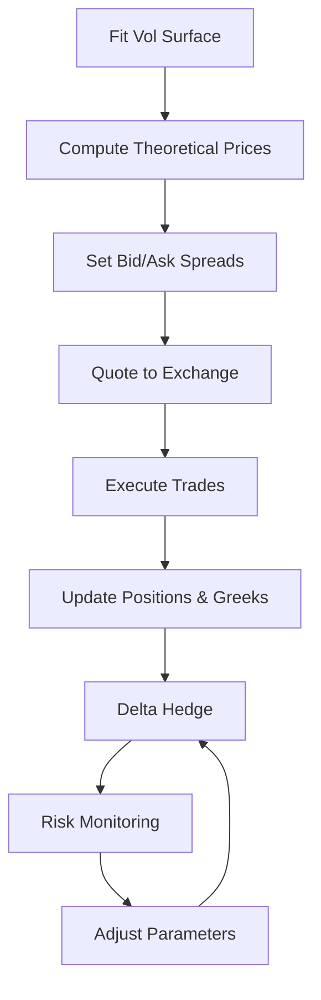

# Introduction to Options Market Making

AMA568 — Advanced Topics in Quantitative Finance

Semester 2, 2025/26

# Contents

# 1 What is Market Making? 2

1.1 Definition and Role . . 2   
1.2 Market Making vs Proprietary Trading . . 2

# 2 Options Market Making: The Unique Challenges 3

2.1 Why Options are Different . . . 3   
2.2 The Volatility Surface . . 3   
2.3 Quoting in Volatility Space . . . 4

# 3 The Market Making Cycle 4

# 4 Spread Determination 6

4.1 Factors Affecting the Spread 6

# 5 Greeks Management 6

5.1 The Greeks Dashboard 6   
5.2 Delta: The First Priority 7   
5.3 Gamma: The Cost of Being Short 8   
5.4 Vega: Volatility Exposure 8   
5.5 The Fundamental P&L Equation 9

# 6 P&L and Risk 9

6.1 P&L Components . . 9   
6.2 Inventory Risk 9   
6.3 Tail Risk and Stress Scenarios 10

# 7 Market Structure and Statistics 10

7.1 Traditional vs Crypto Options 10   
7.2 Key Market Statistics . . . 11

# 8 The Technology of Market Making 11

8.1 Latency Considerations 12

9 From Course Theory to Practice 12

10 Summary 13

# 1 What is Market Making?

# 1.1 Definition and Role

A market maker (MM) is a financial intermediary that continuously quotes both bid (buy) and ask (sell) prices for a financial instrument. By standing ready to trade at any time, the market maker serves a critical function: providing liquidity to the market.

The market maker profits from the bid-ask spread — the difference between the price at which it buys and the price at which it sells. In exchange for this spread revenue, the market maker bears inventory risk: the risk that the assets it holds will move in value before they can be offloaded.

bar

Options Order Book: Bid-Ask Structure
| Option | Bids (Buy Orders) ($) | Asks (Sell Orders) ($) |
| :--- | :--- | :--- |
| $100.50 (70) | 80 |  |
| $100.40 (50) | 60 |  |
| $100.30 (40) | 45 |  |
| $100.20 (55) | 50 |  |
| $100.10 (35) | 30 |  |
| $100.00 (20) | 15 |  |
Spread = $0.50

Figure 1: A stylized options order book showing bid and ask orders. The spread (\$0.50) is the market maker’s gross revenue per round-trip trade.

# 1.2 Market Making vs Proprietary Trading

<table><tr><td></td><td>Market Making</td><td>Proprietary Trading</td></tr><tr><td>Objective</td><td>Earn spread, provide liquidity</td><td>Speculate on price direction</td></tr><tr><td>Position</td><td>Small, hedged, transient</td><td>Large, directional, may be concentrated</td></tr><tr><td>Time horizon</td><td>Seconds to hours</td><td>Days to months</td></tr><tr><td>Revenue source</td><td>Bid-ask spread, theta</td><td>Capital appreciation</td></tr><tr><td>Risk profile</td><td>Low per-trade, high frequency</td><td>High per-trade, lower frequency</td></tr></table>

# 2 Options Market Making: The Unique Challenges

# 2.1 Why Options are Different

Options market making is substantially more complex than equity or futures market making because:

1. High dimensionality: a single underlying (e.g., BTC) may have hundreds of listed options across different strikes and maturities.   
2. Multi-factor risk: the option price depends on spot, volatility, time, and interest rates — the market maker must manage all of these simultaneously.   
3. Non-linear payoffs: options have gamma (convexity), meaning the risk profile changes as the underlying moves.   
4. Volatility is a traded quantity: the market maker is effectively quoting and trading implied volatility, not just price.

# 2.2 The Volatility Surface

The implied volatility is not a single number — it varies across strikes and maturities, forming a surface. The market maker’s first task is to fit this surface accurately.

line

| Strike / Forward (K/F) | T = 3M | T = 6M | T = 1Y |
| ---------------------- | ------ | ------ | ------ |
| 0.7                    | 65.0   | 48.0   | 37.0   |
| 0.8                    | 55.0   | 42.0   | 32.0   |
| 0.9                    | 45.0   | 35.0   | 28.0   |
| 1.0                    | 35.0   | 28.0   | 24.0   |
| 1.1                    | 36.0   | 29.0   | 25.0   |
| 1.2                    | 40.0   | 32.0   | 27.0   |
| 1.3                    | 45.0   | 35.0   | 29.0   |

contour

| Strike / Forward (K/F) | Time to Expiry (years) | IV (%) |
| ---------------------- | ---------------------- | ------ |
| 0.7                    | 2.00                   | 21     |
| 0.8                    | 1.75                   | 39     |
| 0.9                    | 1.50                   | 57     |
| 1.0                    | 1.25                   | 75     |
| 1.1                    | 1.00                   | 93     |
| 1.2                    | 0.75                   | 102    |
| 1.3                    | 0.50                   | 93     |

Figure 2: Left: the implied volatility smile for three maturities. Right: the full implied volatility surface as a function of strike and time to expiry.

Common parametric models for the volatility smile include:

• SVI (Stochastic Volatility Inspired): $w ( k ) = a + b [ \rho ( k - m ) + \sqrt { ( k - m ) ^ { 2 } + \sigma ^ { 2 } } ] .$ .   
• SABR (Stochastic Alpha Beta Rho): provides an analytic approximation for the smile.   
• Spline interpolation: non-parametric, fits market data exactly but may overfit.

# 2.3 Quoting in Volatility Space

Rather than quoting dollar prices directly, options market makers typically think in terms of implied volatility. The workflow is:

1. Fit the mid implied volatility surface.   
2. Set bid/ask volatilities around the mid: $\sigma _ { \mathsf { b i d } } = \sigma _ { \mathsf { m i d } } - s / 2 , \sigma _ { \mathsf { a s k } } = \sigma _ { \mathsf { m i d } } + s / 2 .$   
3. Convert these volatilities to dollar prices using Black–Scholes.   
4. Submit the resulting bid/ask prices to the exchange.

line

| Strike / Forward (K/F) | Mid IV (model) | Bid IV | Ask IV | Spread |
| ---------------------- | -------------- | ------ | ------ | ------ |
| 0.8                    | 34.0           | 32.5   | 35.5   | 33.0   |
| 0.9                    | 27.0           | 26.0   | 28.0   | 25.0   |
| 1.0                    | 24.5           | 23.5   | 25.0   | 23.0   |
| 1.1                    | 25.0           | 24.0   | 25.5   | 23.5   |
| 1.2                    | 27.5           | 26.0   | 28.5   | 25.0   |

Figure 3: The market maker quotes bid and ask implied volatilities around the fitted mid-vol curve. Spreads are wider in the wings (deep OTM options) where liquidity is lower and model uncertainty is higher.

# 3 The Market Making Cycle

The options market making process is a continuous loop that runs in real time:

Options Market Making: The Continuous Cycle   

flowchart

Figure 4: The continuous market making cycle. Each step feeds into the next, and the loop runs indefinitely during trading hours.

# The Eight Steps

1. Fit the vol surface: process market data, compute mid implied vols, fit a smooth surface.   
2. Compute theoretical prices: use Black–Scholes (or another model) with the fitted surface.   
3. Set bid/ask spreads: determine the half-spread for each option based on risk and liquidity.   
4. Quote to the exchange: submit limit orders at the computed bid and ask prices.   
5. Execute trades: when a customer hits the bid or lifts the offer, a trade fills.   
6. Update positions and Greeks: recalculate the entire portfolio’s risk profile.   
7. Delta hedge: trade the underlying to neutralize the portfolio delta.   
8. Risk monitoring: check that all Greeks are within prescribed limits; adjust parameters if needed.

# 4 Spread Determination

The bid-ask spread is the market maker’s compensation for bearing risk. It must be set wide enough to cover costs but tight enough to attract order flow.

# 4.1 Factors Affecting the Spread

line

| Implied Volatility (%) | Bid-Ask Spread ($) |
| ---------------------- | ------------------ |
| 10                     | 0.8                |
| 20                     | 1.5                |
| 30                     | 2.2                |
| 40                     | 3.0                |
| 50                     | 3.8                |
| 60                     | 4.5                |
| 70                     | 5.2                |
| 80                     | 6.0                |
| 90                     | 7.0                |
| 100                    | 8.5                |

line

| Daily Volume (contracts, normalized) | Bid-Ask Spread ($) |
| ------------------------------------ | ------------------ |
| 0                                    | 6.0                |
| 20                                   | 1.5                |
| 40                                   | 1.2                |
| 60                                   | 1.0                |
| 80                                   | 0.9                |
| 100                                  | 0.8                |

Figure 5: Left: spread widens with implied volatility (higher vol = more risk per contract). Right: spread narrows with liquidity (more competition, lower inventory risk).

# Spread Components

A common decomposition:

$$
\text { Spread } = \underbrace {s _ {\text { base }}} _ {\text { minimum }} + \underbrace {s _ {\text { vol }} (\sigma)} _ {\text { volatility   risk }} + \underbrace {s _ {\text { inv }} (\text { Greeks })} _ {\text { inventory   penalty }} + \underbrace {s _ {\text { comp }} (\text { competition })} _ {\text { competitive   adjustment }}.
$$

• sbase: minimum spread to cover fixed costs (exchange fees, technology).   
• $s _ { \mathsf { v o l } } \colon$ increases with implied volatility and gamma risk.   
• $s _ { \mathrm { i n v } } .$ widens when the current inventory is skewed (e.g., already long too much gamma).   
• $s _ { \mathsf { c o m p } }$ : tightens when competitors are quoting aggressively.

# 5 Greeks Management

# 5.1 The Greeks Dashboard

A market maker monitors a real-time dashboard of aggregate portfolio Greeks across all positions:

Market Maker's Greeks Dashboard   

line

| Time | Delta ($) |
|------|-----------|
| 0    | 0         |
| 5    | 5         |
| 10   | -10       |
| 15   | -15       |
| 20   | 25        |
| 25   | 20        |
| 30   | 10        |
| 35   | -15       |
| 40   | -25       |
| 45   | -20       |
| 50   | 5         |
| 55   | 10        |
| 60   | 30        |

bar

| Index | Gamma ($) |
|-------|-----------|
| 0     | 42        |
| 1     | 58        |
| 2     | 54        |
| 3     | 64        |
| 4     | 58        |
| 5     | 50        |
| 6     | 48        |
| 7     | 52        |
| 8     | 54        |
| 9     | 56        |
| 10    | 62        |
| 11    | 60        |
| 12    | 58        |
| 13    | 56        |
| 14    | 54        |
| 15    | 52        |
| 16    | 50        |
| 17    | 48        |
| 18    | 46        |
| 19    | 44        |
| 20    | 42        |
| 21    | 40        |
| 22    | 38        |
| 23    | 36        |
| 24    | 34        |
| 25    | 32        |
| 26    | 30        |
| 27    | 32        |
| 28    | 34        |
| 29    | 36        |
| 30    | 38        |
| 31    | 40        |
| 32    | 42        |
| 33    | 44        |
| 34    | 46        |
| 35    | 48        |
| 36    | 50        |
| 37    | 52        |
| 38    | 54        |
| 39    | 56        |
| 40    | 58        |
| 41    | 60        |
| 42    | 62        |
| 43    | 64        |
| 44    | 66        |
| 45    | 68        |
| 46    | 70        |
| 47    | 72        |
| 48    | 74        |
| 49    | 76        |
| 50    | 78        |
| 51    | 80        |
| 52    | 82        |
| 53    | 84        |
| 54    | 86        |
| 55    | 88        |
| 56    | 90        |
| 57    | 92        |
| 58    | 94        |
| 59    | 96        |
| 60    | 98        |

bar

| Trading Day | Theta ($) |
| ----------- | --------- |
| 0           | 0         |
| 1           | -15       |
| 2           | -20       |
| 3           | -25       |
| 4           | -30       |
| 5           | -25       |
| 6           | -20       |
| 7           | -15       |
| 8           | -10       |
| 9           | -15       |
| 10          | -20       |
| 11          | -15       |
| 12          | -10       |
| 13          | -15       |
| 14          | -20       |
| 15          | -25       |
| 16          | -30       |
| 17          | -25       |
| 18          | -20       |
| 19          | -15       |
| 20          | -10       |
| 21          | -15       |
| 22          | -20       |
| 23          | -25       |
| 24          | -30       |
| 25          | -25       |
| 26          | -20       |
| 27          | -15       |
| 28          | -10       |
| 29          | -15       |
| 30          | -20       |
| 31          | -25       |
| 32          | -30       |
| 33          | -25       |
| 34          | -20       |
| 35          | -15       |
| 36          | -10       |
| 37          | -15       |
| 38          | -20       |
| 39          | -25       |
| 40          | -30       |
| 41          | -25       |
| 42          | -20       |
| 43          | -15       |
| 44          | -10       |
| 45          | -15       |
| 46          | -20       |
| 47          | -25       |
| 48          | -30       |
| 49          | -25       |
| 50          | -20       |
| 51          | -15       |
| 52          | -10       |
| 53          | -15       |
| 54          | -20       |
| 55          | -25       |
| 56          | -30       |
| 57          | -25       |
| 58          | -20       |
| 59          | -15       |
| 60          | -10       |

line

| Trading Day | Vega ($) |
| ----------- | -------- |
| 0           | 0        |
| 5           | 10       |
| 10          | -5       |
| 15          | -15      |
| 20          | -18      |
| 25          | -10      |
| 30          | -8       |
| 35          | -15      |
| 40          | -10      |
| 45          | -20      |
| 50          | -30      |
| 55          | -25      |
| 60          | -28      |

Figure 6: A simulated Greeks dashboard for a market maker. Delta fluctuates around zero (actively hedged), gamma is typically positive (short options), theta offsets gamma, and vega varies with flow.

# 5.2 Delta: The First Priority

Delta is the most immediate and largest risk. A \$1 move in the underlying causes a P&L change of approximately $\Delta \times \ S 1$ on the entire portfolio. Market makers hedge delta after every significant trade by trading the underlying (spot or futures).

line

| Trading Day | Stock Price S_t ($) | Delta Δ_t (shares to hedge) |
| ----------- | ------------------- | ---------------------------- |
| 0           | 105                 | 0.6                          |
| 50          | 90                  | 0.4                          |
| 100         | 100                 | 0.5                          |
| 150         | 85                  | 0.3                          |
| 200         | 75                  | 0.1                          |
| 250         | 70                  | 0.0                          |
| 300         | 65                  | 0.0                          |
| 350         | 60                  | 0.0                          |
| 400         | 50                  | 0.0                          |
| 450         | 35                  | 0.0                          |
| 500         | 25                  | 0.0                          |

Figure 7: The hedge ratio (delta) tracks the stock price. As the stock rises, delta increases (for a call), requiring the market maker to buy more shares to maintain the hedge.

# 5.3 Gamma: The Cost of Being Short

Most market making activity results in a net short gamma position (the MM has sold options to customers). Short gamma means:

• The MM must buy high and sell low when re-hedging delta.   
• Large moves cause disproportionate losses.   
• The gamma P&L per rehedge is approximately ${ \scriptstyle { \frac { 1 } { 2 } } } \Gamma ( \Delta S ) ^ { 2 }$

This cost is offset by theta income: the daily time decay of the sold options.

# 5.4 Vega: Volatility Exposure

Vega measures sensitivity to changes in implied volatility. If the MM is net short options, a sudden increase in implied volatility causes mark-to-market losses. Vega is managed by:

• Offsetting across maturities (buy shorter-dated, sell longer-dated, or vice versa).   
• Trading variance swaps or volatility products.   
• Setting position limits.

# 5.5 The Fundamental P&L Equation

# Market Maker’s Daily P&L

$$
\mathsf{P}\& \mathsf{L} \approx \underbrace{\text{Spread revenue}}_{\text{always positive (when trades fill)}} + \underbrace{\Theta \cdot \Delta t}_{\text{positive if short options}} + \underbrace{\frac{1}{2} \Gamma(\Delta S)^2}_{\text{negative if short gamma}} + \underbrace{\mathcal{V} \cdot \Delta \sigma_{iv}}_{\text{depends on IV changes}}.
$$

# 6 P&L and Risk

# 6.1 P&L Components

line

| Trading Day | Total P&L | Spread Revenue | Theta Income | Gamma P&L | Vega P&L |
| ----------- | --------- | -------------- | ------------ | --------- | -------- |
| 0           | 0         | 0              | 0            | 0         | 0        |
| 50          | 100       | 50             | 30           | -10       | -20      |
| 100         | 200       | 100            | 60           | -15       | -30      |
| 150         | 300       | 150            | 90           | -20       | -40      |
| 200         | 400       | 200            | 120          | -25       | -50      |
| 250         | 500       | 250            | 150          | -30       | -60      |

histogram

| Daily P&L ($) | Density |
| ------------- | ------- |
| -7.5          | 0.01    |
| -5.0          | 0.06    |
| -2.5          | 0.08    |
| 0.0           | 0.09    |
| 2.5           | 0.14    |
| 5.0           | 0.13    |
| 7.5           | 0.07    |
| 10.0          | 0.06    |
| 12.5          | 0.01    |

Figure 8: Left: cumulative P&L decomposition. Spread and theta are steady income; gamma and vega are noisy. Right: daily P&L distribution — typically positive-mean, moderate Sharpe, with fat tails.

# 6.2 Inventory Risk

line

| Trading Day | Net Gamma ($) |
| ----------- | ------------- |
| 0           | 0             |
| 10          | 50            |
| 20          | 60            |
| 30          | 70            |
| 40          | 100           |
| 50          | 110           |
| 60          | 150           |

line

| Trading Day | Net Vega ($) |
| ----------- | ------------ |
| 0           | 0            |
| 10          | -20          |
| 20          | -40          |
| 30          | -80          |
| 40          | -40          |
| 50          | 40           |
| 60          | 50           |

Figure 9: Gamma and vega inventory over time. Red dashed lines show risk limits. When inventory approaches limits, the MM widens spreads or actively trades to reduce exposure.

# 6.3 Tail Risk and Stress Scenarios

Market makers are particularly vulnerable to:

• Gap risk: the underlying moves faster than the MM can re-hedge (e.g., flash crash).   
• Volatility spikes: implied vol jumps suddenly, causing large vega losses.   
• Liquidity evaporation: in a crisis, the MM cannot offload inventory.   
• Correlation breakdown: cross-asset hedges fail when correlations change.

In crypto markets, additional risks include exchange counterparty risk, network congestion, and 24/7 operational requirements.

# 7 Market Structure and Statistics

# 7.1 Traditional vs Crypto Options

bar

Traditional vs Crypto Options Markets
| Category | Traditional (SPX/SPY) | Crypto (BTC/ETH) |
| :--- | :--- | :--- |
| Daily Volume ($ Billion) | 40 | 5 |
| Avg Spread (bps of IV) | 50 | 148 |
| Avg IV (%) | 20 | 65 |
| Maturities Available | 12 | 8 |
| Strikes Available | 25 | 15 |

Crypto Options Market Share (2024-25)   

pie

| Category | Percentage (%) |
| :--- | :--- |
| Deribit | 75 |
| OKX | 10 |
| Bybit | 7 |
| Binance | 5 |
| CME | 3 |

Figure 10: Left: comparison of key metrics between traditional (SPX/SPY) and crypto (BTC/ETH) options markets. Right: crypto options market share by exchange (Deribit dominates with ∼75%).

# 7.2 Key Market Statistics

<table><tr><td>Metric</td><td>SPX/SPY Options</td><td>BTC/ETH Options</td></tr><tr><td>Daily notional volume</td><td>$40–60B</td><td>$3–8B</td></tr><tr><td>Number of active contracts</td><td>~5,000+</td><td>~500–1,000</td></tr><tr><td>Typical ATM bid-ask spread (IV)</td><td>0.3–0.5%</td><td>1–3%</td></tr><tr><td>ATM implied volatility</td><td>15–25%</td><td>50–80%</td></tr><tr><td>Trading hours</td><td>Mon–Fri, 6.5 hrs</td><td>24/7/365</td></tr><tr><td>Primary exchanges</td><td>CBOE, ISE, NYSE Arca</td><td>Deribit, OKX, Bybit</td></tr></table>

# Implication for Market Makers

The wider spreads and higher volatility in crypto create larger gross revenue per trade but also much larger risk per unit of time. The 24/7 nature requires fully automated systems with robust failover. The less mature infrastructure means that technology is a significant competitive advantage.

# 8 The Technology of Market Making

A modern options market making system consists of several layers:

# Technology Stack

1. Market Data Feed: ingest real-time quotes, trades, and order book snapshots from all exchanges. Latency-sensitive; often uses direct connections or co-location.   
2. Pricing Engine: fits the volatility surface, computes theoretical prices and Greeks for all options. Must be fast (<1ms per full surface update) and accurate.   
3. Strategy Layer: determines bid/ask spreads, manages inventory, generates quote orders. Contains the core market making logic.   
4. Execution Engine: sends orders to exchanges, manages order lifecycle (new, cancel, amend), handles partial fills.   
5. Risk Management: monitors all positions and Greeks in real time. Enforces hard limits and can pull all quotes instantly (“kill switch”).

# 8.1 Latency Considerations

<table><tr><td>Component</td><td>Traditional</td><td>Crypto</td></tr><tr><td>Market data latency</td><td>&lt;1 μs (co-located)</td><td>1–50 ms (API)</td></tr><tr><td>Pricing computation</td><td>&lt;10 μs</td><td>&lt;1 ms</td></tr><tr><td>Order round-trip</td><td>&lt;100 μs</td><td>10–200 ms</td></tr><tr><td>Technology</td><td>FPGA, kernel bypass</td><td>Java/C++, WebSocket</td></tr></table>

# 9 From Course Theory to Practice

The following table connects the theoretical topics covered in AMA568 to their direct applications in options market making:

<table><tr><td>Course Topic</td><td>Market Making Application</td></tr><tr><td>Black–Scholes model</td><td>Core pricing engine: converts implied vol ↔ price</td></tr><tr><td>Greeks (Δ, Γ, Θ, Vega)</td><td>Real-time risk dashboard; hedging decisions</td></tr><tr><td>BS PDE &amp; Theta–Gamma trade-off</td><td>Understanding the cost of carrying a short gamma book</td></tr><tr><td>Delta hedging &amp; Gamma P&amp;L</td><td>Primary hedging strategy; P&amp;L attribution</td></tr><tr><td>Characteristic functions &amp; Heston</td><td>Advanced pricing and calibration for exotic products</td></tr><tr><td>SABR model</td><td>Smile dynamics and delta/vega hedging corrections</td></tr><tr><td>SVI parameterization</td><td>Fitting the implied volatility smile for quoting</td></tr><tr><td>Monte Carlo simulation</td><td>Pricing path-dependent products; stress testing</td></tr><tr><td>Structured products (PPN, autocallable)</td><td>Inventory from institutional client trades</td></tr><tr><td>Volatility forecasting (EWMA, GARCH)</td><td>Realized vol estimation for hedging decisions</td></tr></table>

# 10 Summary

# Key Takeaways

1. Options market making is the business of providing liquidity by continuously quoting bid/ask prices across an entire option chain.   
2. The core challenge is managing multi-dimensional risk (delta, gamma, theta, vega) simultaneously.   
3. Revenue comes from spread capture and theta decay; costs come from gamma hedging losses and vega exposure.   
4. The market maker’s first tool is the volatility surface: everything flows

from an accurate model of implied volatility.

5. Delta hedging is performed after every significant trade; higher-order Greeks are managed via position limits and portfolio adjustments.   
6. Modern market making requires a sophisticated technology stack: pricing engines, execution systems, and real-time risk management.   
7. Crypto options markets offer wider spreads and higher volatility (opportunity) but also extreme tail risk and 24/7 operational demands.