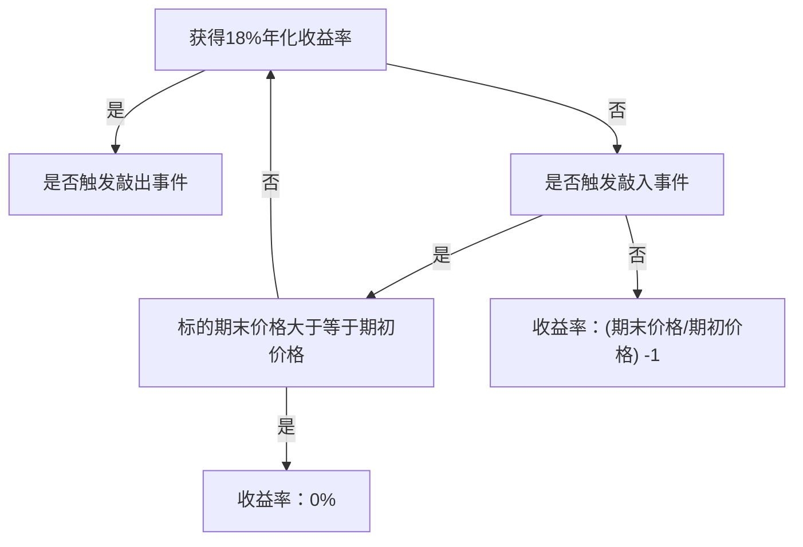

# Lecture Note - Autocallable

Andy Lian

# 1 Section 1: What is a autocallable Product?

# 1.1 What is a autocallable Product?

• A autocallable product is essentially a type of exotic option with barrier features, incorporating knock-in and knock-out prices.   
• Investors who purchase autocallable products are effectively selling exotic put options and receiving option premiums. The underlying assets can be indices, individual stocks, commodities, etc., making it a high-risk investment.   
• Investors agree with securities firms on high-frequency coupon payments, but these coupons are only paid if specific conditions are met. Investors also bear the risk of losses proportional to the decline in the underlying asset.

# 1.2 Key Concepts

To understand autocallable products, start with these fundamentals:

• Underlying Asset: Typically linked to the CSI 500 Index. The investor’s profit or loss depends entirely on the index’s performance during the product’s term.   
• Knock-Out Price and Knock-In Price: Predefined price levels agreed between the investor and the securities firm. These directly affect the probability of achieving the promised returns.   
• Observation Dates: Days when the underlying asset’s price is compared to the knock-in/knock-out prices. For example:

– If a autocallable product is linked to the CSI 500 Index with a knock-out price of 6,000 points, and the index reaches 6,020 on a knock-out observation date, a knock-out event is triggered.

– If the index falls below the knock-in price on a knock-in observation date, a knock-in event is triggered.

• Knock-out observation dates are usually monthly, while knock-in observation dates are monitored daily.

# 1.3 Example autocallable Product

<table><tr><td>Parameter</td><td>Details</td></tr><tr><td>Underlying Asset</td><td>CSI 500 Index</td></tr><tr><td>Term</td><td>12 Months</td></tr><tr><td>Annualized Return Rate</td><td>20%</td></tr><tr><td>Knock-Out Price</td><td>6,000 points</td></tr><tr><td>Knock-In Price</td><td>5,000 points</td></tr><tr><td>Knock-Out Observation</td><td>Monthly</td></tr><tr><td>Knock-In Observation</td><td>Daily</td></tr></table>

# 1.4 Four Profit and Loss Scenarios

# 1. Knock-Out Triggered Early:

• Example: CSI 500 Index rises to 6,020 at Month 3.   
• Outcome: Product terminates early. Investor earns 5% absolute return (3/12 \* 20%).

# 2. Knock-In Followed by Knock-Out:

• Example: Index drops to 4,950 (below knock-in) at Month 3, then recovers to 6,010 by Month 6.   
• Outcome: Product terminates at Month 6. Investor earns 10% absolute return (6/12 \* 20%).

# 3. No Triggers:

• Example: Index fluctuates between 5,000–6,000 for 12 months.   
• Outcome: Investor earns 20% absolute return at maturity.

# 4. Knock-In Without Knock-Out:

• Example: Index drops to 4,980 (knock-in) at Month 3 but never recovers above 6,000.   
• Outcome: Investor bears losses equal to the index’s decline. If the index falls 10% (to 5,400), investor loses 10% principal; if it drops 30% (to 4,200), investor loses 30%.

# 1.5 Risk Warnings

• Not Fixed-Income: autocallable products are not equivalent to fixed-income products and are not guaranteed. Significant principal losses are possible.   
• Understand the Product: Avoid relying on marketing claims. Study the payoff structure, knock-in/knock-out triggers, and assess personal risk tolerance.   
• Market Exposure: Investors must understand the underlying asset’s behavior. A rising market may lead to missed gains, while a falling market risks capital loss.

# 2 Section 2: Key Trading Elements

# 2.1 Overview

• autocallable products are exotic structured derivatives with knock-in/knock-out barriers, linked to indices, stocks, or commodities.   
• Investors effectively sell exotic put options for coupons, contingent on specific trigger conditions.   
• Critical elements determine payoff probabilities and risks.

# 2.2 Example of Key Trading Elements

<table><tr><td>Parameter</td><td>Details</td></tr><tr><td>Product Type</td><td>Non-Principal-Protected autocallable</td></tr><tr><td>Underlying Asset</td><td>CSI 500 Index</td></tr><tr><td>Term</td><td>12 Months</td></tr><tr><td>Initial Observation Date</td><td>Trade Start Date</td></tr><tr><td>Knock-In Observation</td><td>Daily during term</td></tr><tr><td>Knock-Out Observation</td><td>Monthly (first 2 months excluded)</td></tr><tr><td>Initial Price</td><td>Closing price on initial observation date</td></tr><tr><td>Knock-Out Price</td><td>100% of initial price</td></tr><tr><td>Knock-In Price</td><td>80% of initial price</td></tr><tr><td>Annualized Coupon</td><td>17%</td></tr></table>

# 2.3 Detailed Trading Elements

# 1. Product Type:

• Classified by:

– Principal protection: Protected, Non-protected, Limited-loss.

– Lock-up periods: With/without lock-up.

– Knock-out adjustments: Standard vs. Step-down.

• Investors must align product type with risk tolerance and market outlook.

# 2. Underlying Asset:

• Determines payoff based on performance relative to barriers.

• Common underlyings: CSI 500 Index (top 500 A-shares excluding CSI300 compositions).

# 3. Term:

• Defines investment horizon; early knock-out shortens term.

# 4. Initial Observation Date & Price:

• Initial price (e.g., CSI 500 at 7,000) sets reference for barriers.

# 5. Knock-Out Mechanism:

• Observation: Monthly (starting from Month 3 in some cases).   
• Price: Typically 100%–103% of initial price. Step-down products reduce knock-out price monthly (e.g., -0.2% per month).   
• Example: Knock-out triggers if CSI 500 reaches 6,020 (initial price = 6,000).

# 6. Knock-In Mechanism:

• Observation: Daily.   
• Price: 70%–80% of initial price.

# 7. Annualized Coupon:

• Ranges: 15%–20%, inversely related to safety features.   
• Absolute Return Formula:

$$
\text { Return } = \text { Annualized   Coupon } \times \frac {\text { Holding   Period   (months) }}{1 2}
$$

Example: 20% annualized coupon with 3-month holding = 5% absolute return.

# 2.4 Critical Considerations

• Higher coupons often imply higher risks (e.g., non-protected products).   
• Early knock-out reduces absolute returns despite high annualized rates.   
• Step-down structures increase knock-out likelihood over time.

# 3 Section 3: Profit and Loss Scenarios

# 3.1 Overview

• autocallable products’ payoffs depend on trigger events (knock-in/knock-out) linked to underlying assets like the CSI 500 Index.   
• Four key scenarios determine investor returns: early knock-out, knock-in followed by knock-out, no triggers, and knock-in without recovery.   
• Example product: Non-principal-protected autocallable with 18% annualized coupon.

# 3.2 Example Product Parameters

<table><tr><td>Parameter</td><td>Details</td></tr><tr><td>Underlying Asset</td><td>CSI 500 Index</td></tr><tr><td>Term</td><td>12 Months</td></tr><tr><td>Initial Price</td><td>7,000 points</td></tr><tr><td>Knock-Out Price</td><td>105% of initial (7,350 points)</td></tr><tr><td>Knock-In Price</td><td>70% of initial (4,900 points)</td></tr><tr><td>Knock-Out Observation</td><td>Monthly (starting Month 3)</td></tr><tr><td>Knock-In Observation</td><td>Daily</td></tr><tr><td>Investment Amount</td><td>CNY 1,000,000</td></tr><tr><td>Annualized Coupon</td><td>18%</td></tr></table>

# 3.3 Scenario 1: Early Knock-Out

• Trigger: CSI 500 reaches 7,370 at Month 4.   
• Outcome: Product terminates early.   
• Return Calculation:

$$
\text {Return} = 1,000,000 \times 18 \% \times \frac{4}{12} = \text {CNY} 60,000
$$

• Diagram:

[Knock-out trigger at 105% in Month 4]   

line

| 月份 | 敲出价格 | 敲入价格 |
| ---- | -------- | -------- |
| 4月  | 105%     | -        |
| 6月  | -        | -        |
| 8月  | -        | -        |
| 10月 | -        | -        |
| 12月 | -        | -        |

# 3.4 Scenario 2: Knock-In Followed by Knock-Out

• Trigger:

– Knock-in at 4,870 (Month 1).   
– Knock-out at 7,360 (Month 6).

• Return Calculation:

$$
\text {Return} = 1,000,000 \times 18 \% \times \frac{6}{12} = \text {CNY} 90,000
$$

• Diagram:

[Price rebounds from knock-in to knock-out by Month 6]

line

| 时间 | 敲入价格 (敲出) | 敲入价格 (敲入) |
| :--- | :--- | :--- |
| 2月 | 70% | - |
| 6月 | 105% | - |

# 3.5 Scenario 3: No Triggers

• CSI 500 fluctuates between 5,200–7,200 for 12 months.   
• Full-term return:

$$
\mathrm{Return} = 1,000,000 \times 18 \% = \mathrm{CNY} 180,000
$$

• Diagram:

[Price remains between barriers]   

line

| 月份 | 敲出价格 | 敲入价格 |
| ---- | -------- | -------- |
| 2月  | ~90%     | ~80%     |
| 4月  | ~60%     | ~50%     |
| 6月  | ~70%     | ~60%     |
| 8月  | ~80%     | ~70%     |
| 10月 | ~105%    | ~90%     |
| 12月 | ~90%     | ~70%     |

# 3.6 Scenario 4: Knock-In Without Knock-out

CSI 500 knocked-in in the first month (below 4880), and never knocked-out (never touched the knock-out price). Then:

• Sub-scenario 1: CSI 500 recovers to larger than 7,000 at maturity.   
– Return: 0% (no gain/loss).

• Diagram:

[Price stays below knock-out after knock-in]   

line

| 月份 | 敲出价格 | 敲入价格 |
| ---- | -------- | -------- |
| 1    | 105%     | -        |
| 8    | -        | 70%      |

• Sub-scenario 2: CSI 500 closes at 6650 (-5% loss) at maturity.

– Loss: 1, 000, 000 × 5% = CNY 50,000

line

| 月份 | 敲出价格 | 敲入价格 |
| ---- | -------- | -------- |
| 1    | 105%     | -        |
| 2    | -        | 70%      |

3.7 Summary of Scenarios 

<table><tr><td>Scenario</td><td>Holding Period</td><td>Return/Loss</td></tr><tr><td>Early Knock-Out</td><td>4 Months</td><td>+6%</td></tr><tr><td>Knock-In + Knock-Out</td><td>6 Months</td><td>+9%</td></tr><tr><td>No Triggers</td><td>12 Months</td><td>+18%</td></tr><tr><td>Knock-In Only</td><td>12 Months (below than S0)</td><td>-5%</td></tr><tr><td>Knock-In Only</td><td>12 Months</td><td>0%</td></tr></table>

雪球产品损益情形结构  

flowchart

