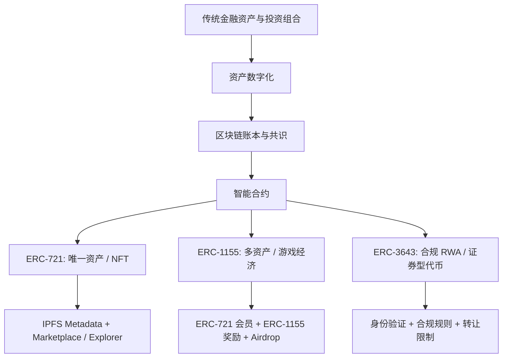
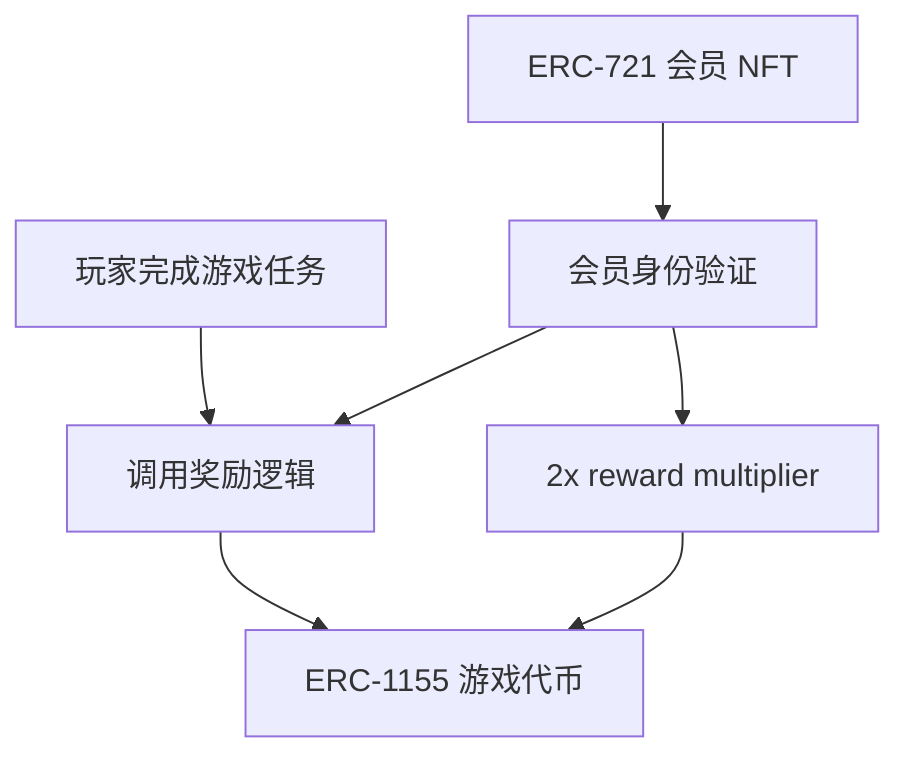
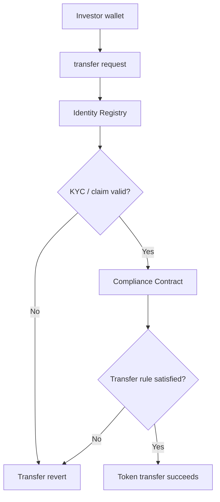
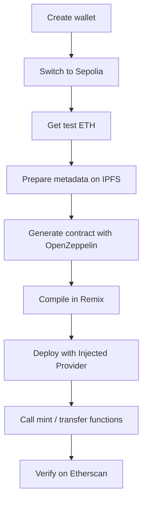

> [!info] 这份总整理覆盖的原始笔记
> - `Lecture 8 - Blockchain_Overview.md`：区块链、Ethereum、DeFi、NFT、治理、安全、监管与未来趋势。
> - `ERC721.md`：从钱包和 Sepolia 到 ERC-721、IPFS metadata、交易、角色、空投、升级、ERC-1155 入门。
> - `Solidity_2.md` 与 `erc1155.md`：ERC-1155 游戏代币、ERC-721 会员 NFT、空投奖励、前端 Web3 集成。
> - `ERC3643.md` 与 `ERC-3643_Workshop_Presentation_84eaa68a.md`：RWA tokenization、ERC-3643、T-REX、合规、身份、metadata、债券代币化。
> - `Prerequisite knowledg of portfolio management.md`：portfolio、expected return、variance、efficient frontier、CAL。
>
> `ERC3643.md` 和 `ERC-3643_Workshop_Presentation_84eaa68a.md` 基本是同一份 workshop 材料，只有少量图片和拼写差异；本整理按一份内容处理，避免重复。

## 1. 课程主线

AMA571 的核心可以用一句话概括：

> **用区块链和智能合约把金融资产、数字资产和用户权限规则写成可验证、可执行、可组合的系统。**

这门课分成四条线：

1. **投资与资产的金融底层**：portfolio 为什么能分散风险，expected return、variance、efficient frontier 和 CAL 是理解资产配置的起点。
2. **区块链基础设施**：DLT、transaction lifecycle、consensus、Bitcoin vs Ethereum、EVM、Layer 2。
3. **智能合约与代币标准**：ERC-721 表示唯一资产，ERC-1155 表示多资产系统，ERC-3643 表示合规证券型/RWA 代币。
4. **真实应用与风控**：DeFi、NFT、RWA、DAO、bridge、security、regulation、metadata、identity、KYC/AML。

可以把整门课看成从“资产”到“链上表示”的映射：



## 2. Portfolio Management 预备知识

### 2.1 为什么需要 portfolio

Portfolio 的直觉是：不要把所有风险暴露在单一资产上。

原始例子里有两个资产：

| 情景 | Asset A | Asset B |
|---|---:|---:|
| Scenario 1 | 10% | -5% |
| Scenario 2 | -6% | 8% |

如果只买 A，结果可能是赚 10% 或亏 6%；只买 B，结果可能是亏 5% 或赚 8%。如果各投一半，则两个情景下组合收益更平滑。这就是 diversification 的起点。

### 2.2 Portfolio expected return

组合收益是资产收益的加权平均：

$$
E(r_P)=\sum_{i=1}^n\omega_iE(r_i)
$$

两资产时：

$$
E(r_P)=\omega_AE(r_A)+\omega_BE(r_B)
$$

权重 `\omega` 表示资金分配比例，不同权重对应不同 portfolio。

### 2.3 Portfolio variance

风险不只取决于单个资产波动，还取决于资产之间的 correlation。

两资产组合方差：

$$
\sigma_P^2
=\omega_A^2\sigma_A^2
+\omega_B^2\sigma_B^2
+2\omega_A\omega_B\rho_{AB}\sigma_A\sigma_B
$$

其中：

- `\sigma_A,\sigma_B` 是各资产波动率；
- `\rho_{AB}` 是相关系数；
- 相关性越低，组合分散化效果越强；
- 负相关资产可以显著降低组合风险。

### 2.4 Matrix notation

多资产组合可以写成矩阵形式：

$$
E(r_P)=\omega^\top\mu
$$

$$
\sigma_P^2=\omega^\top\Sigma\omega
$$

其中：

- `\omega` 是权重向量；
- `\mu` 是资产期望收益向量；
- `\Sigma` 是 covariance matrix；
- 对角线元素是资产 variance；
- 非对角线元素是 covariance：

$$
\sigma_{ij}=\rho_{ij}\sigma_i\sigma_j
$$

### 2.5 Efficient frontier

Efficient frontier 描述在不同风险水平下可以达到的最高收益，或者在不同目标收益下可以实现的最低风险。

直觉：

- 同样风险下，收益更高的组合更优；
- 同样收益下，风险更低的组合更优；
- frontier 以下的组合不是 efficient；
- GMVP 是 global minimum variance portfolio，即风险最低的组合。

### 2.6 Capital Allocation Line

当存在 risk-free asset 时，投资者可以把资金分配到：

- risk-free asset；
- risky portfolio。

Capital Allocation Line (CAL) 描述 risk-free asset 与某个 risky portfolio 的线性组合：

$$
E(r_C)=r_f+\frac{E(r_P)-r_f}{\sigma_P}\sigma_C
$$

斜率：

$$
\frac{E(r_P)-r_f}{\sigma_P}
$$

就是 risky portfolio 的 Sharpe ratio。最优 CAL 是与 efficient frontier 相切的那条线，切点就是 optimal risky portfolio。

## 3. 区块链基础

### 3.1 Distributed Ledger

Distributed Ledger 是一个由网络中多个节点共同维护和同步的数据库，没有单一中心管理员。

核心特征：

| 特征 | 含义 |
|---|---|
| Replicated | 每个节点保留账本副本 |
| Synchronized | 更新会传播到全网 |
| Decentralized | 没有单点故障 |
| Transparent | 参与者可以查看账本 |
| Immutable | 记录一旦确认就很难篡改 |

区块链是 distributed ledger 的一种实现形式，它把交易打包成 block，并用 cryptographic hash 把区块串起来。

### 3.2 Transaction lifecycle

一笔链上交易通常经历：

1. **Initiation & Signing**：用户创建交易，并用 private key 签名。
2. **Broadcasting**：交易被广播到网络，进入 mempool。
3. **Validation**：节点验证签名、余额、nonce、gas 等。
4. **Block Inclusion**：miner/validator 把交易放入新区块。
5. **Confirmation**：新区块被其他节点验证并接受。
6. **Settlement**：状态更新成为链上事实，余额和合约状态被记录。

关键参与者：

| 层级 | 参与者 | 作用 |
|---|---|---|
| User Layer | sender、receiver、wallet、custodian | 发起与接收交易 |
| Infrastructure Layer | nodes、validators、RPC、indexers、oracles、bridges | 维护网络、提供访问和数据 |
| Governance & Compliance | regulators、auditors、analytics、DAO participants | 监督、审计、治理、合规 |

### 3.3 PoW vs PoS

| 机制 | 核心逻辑 | 优点 | 缺点 |
|---|---|---|---|
| Proof of Work | miner 通过算力竞争出块 | 安全性经过长期验证，去中心化潜力高 | 能耗高，速度慢，矿池集中 |
| Proof of Stake | validator 质押资产，被选择出块 | 能耗低，扩展性更好，参与门槛较灵活 | 可能出现 stake 集中、治理复杂 |

Bitcoin 是典型 PoW；Ethereum Merge 后转为 PoS，validator 需要质押 32 ETH。

### 3.4 Bitcoin vs Ethereum

| 维度 | Bitcoin | Ethereum |
|---|---|---|
| 目标 | Store of value / digital gold | Smart contract platform |
| 核心资产 | BTC | ETH |
| 编程能力 | 脚本能力有限 | EVM 支持通用智能合约 |
| 典型用途 | 支付、价值储存 | DeFi、NFT、DAO、RWA、DApp |
| 启动时间 | 2009 | 2015 |

Bitcoin 更像“去中心化货币网络”；Ethereum 更像“可编程金融与应用平台”。

## 4. Ethereum、Smart Contract 与 EVM

### 4.1 Smart contract

Smart contract 是部署在区块链上的程序。它按照代码规则自动执行，无需中心化中介。

例子：

> Escrow contract 可以在买家确认收货后自动释放资金，减少中介信任成本。

核心特点：

- 代码公开；
- 执行可验证；
- 状态存储在链上；
- 交易触发状态变化；
- 部署后默认不可随意修改。

### 4.2 EVM

EVM 是 Ethereum 的执行环境，负责在每个节点上运行智能合约 bytecode。

EVM 的关键概念：

| 概念 | 含义 |
|---|---|
| Account | 包括 EOA 和 contract account |
| Gas | 执行计算和存储的费用 |
| State | 账户余额、合约变量、存储内容 |
| Bytecode | Solidity 编译后的 EVM 指令 |
| ABI | 前端或其他合约调用合约函数的接口描述 |

### 4.3 Layer 2 scaling

Layer 2 的目标是在不牺牲 L1 安全性的前提下降低成本、提高吞吐。

| 方案 | 机制 | 优点 | 代价 |
|---|---|---|---|
| Optimistic Rollup | 默认交易有效，争议期内可 fraud proof | EVM 兼容好，生态成熟 | 提现等待时间长 |
| ZK Rollup | 用 validity proof 证明批量交易正确 | 安全性强、确认快 | 技术复杂，开发成本高 |
| State Channel | 交易双方链下交互，最终上链结算 | 快、便宜 | 适合固定参与者，不适合开放复杂应用 |

## 5. DeFi、NFT 与企业应用

### 5.1 DeFi

DeFi 是用智能合约重建金融服务。它的核心是：

- self-custody；
- permissionless access；
- composability；
- on-chain transparency。

典型协议：

| 类型 | 机制 | 例子 |
|---|---|---|
| DEX | 用户直接通过合约交换资产 | Uniswap |
| AMM | 用 liquidity pool 和定价公式撮合交易 | Uniswap |
| Lending | 存款人提供流动性，借款人超额抵押借款 | Aave、Compound |
| Flash loan | 单个交易内借入并归还，无需传统抵押 | Aave |

AMM 的基础直觉是 pool 不依赖订单簿，而依赖储备资产和定价函数。最经典的 constant product 形式是：

$$
x\cdot y=k
$$

### 5.2 NFT beyond digital art

NFT 不只是头像或艺术品，也可以表达：

- 游戏道具；
- membership pass；
- event ticket；
- identity credential；
- real estate ownership proof；
- supply chain authenticity；
- certificate / diploma。

关键在于：NFT 把“唯一性、所有权、metadata、可转让性”组合在一起。

### 5.3 Enterprise blockchain

企业场景更关注 permission、audit、privacy、workflow integration。

| 场景 | 问题 | 区块链解决思路 |
|---|---|---|
| Supply Chain | 信息分散、追踪慢、造假难查 | shared ledger + traceability |
| Food Traceability | 传统追踪耗时很久 | Hyperledger Fabric / IBM Food Trust |
| Trade Finance | 纸质单据、流程慢、跨机构协调难 | digitized letters of credit / R3 Corda |

企业链通常不是追求完全 permissionless，而是追求多方之间的可信协作。

## 6. ERC-721：唯一资产与 NFT

### 6.1 ERC-721 是什么

ERC-721 是 Non-Fungible Token 标准，每个 token 都唯一且不可分割。

核心属性：

- 每个 token 有唯一 `tokenId`；
- 每个 token 有一个 owner；
- token 可以转移；
- token 可以关联 metadata；
- 适合艺术品、收藏品、证书、会员资格、域名、RWA 单件权益。

常用函数：

| 函数 | 作用 |
|---|---|
| `ownerOf(tokenId)` | 查询 token 所有者 |
| `balanceOf(owner)` | 查询某地址拥有多少 NFT |
| `safeTransferFrom(from,to,tokenId)` | 安全转移 NFT |
| `approve(to,tokenId)` | 授权某地址操作某个 token |
| `setApprovalForAll(operator,approved)` | 授权/取消授权第三方管理全部 token |
| `tokenURI(tokenId)` | 查询 metadata URI |

### 6.2 Metadata 与 IPFS

ERC-721 的图像和属性通常不直接存在链上，而是放在 IPFS 等外部存储中。链上只保存 URI。

典型 metadata JSON：

```json
{
  "name": "Class NFT #1",
  "description": "A student-created NFT on Sepolia",
  "image": "ipfs://<image-cid>",
  "attributes": [
    { "trait_type": "Course", "value": "AMA571" }
  ]
}
```

重要点：

- image 先上传 IPFS；
- metadata JSON 再引用 image URI；
- metadata JSON 也上传 IPFS；
- 合约里的 `tokenURI` 指向 metadata JSON；
- Etherscan 或 marketplace 通过 URI 读取 metadata。

### 6.3 ERC-721 lab workflow

从零部署 ERC-721 的流程：

1. 安装 MetaMask，创建钱包。
2. 切换到 Sepolia testnet。
3. 从 faucet 获取 test ETH。
4. 在 Pinata 上传 NFT image，拿到 `ipfs://...`。
5. 创建并上传 metadata JSON。
6. 用 OpenZeppelin Wizard 生成 ERC-721 合约。
7. 在 Remix 编译并部署。
8. 调用 mint 函数，把 NFT 铸造到目标地址。
9. 在 Sepolia Etherscan 检查 contract、tokenURI、owner。

### 6.4 Transfer 与 marketplace

NFT 转移方式：

| 方式 | 说明 |
|---|---|
| Direct transfer | owner 直接调用 `safeTransferFrom` |
| Approved transfer | owner 授权第三方，再由第三方转移 |
| Marketplace approval | 用 `setApprovalForAll` 授权市场合约 |

笔记中特别强调：

> 优先使用 `safeTransferFrom`，因为它会检查接收方是否能安全接收 NFT。

### 6.5 Access control 与 airdrop

OpenZeppelin `AccessControl` 可以把权限拆开：

| Role | 含义 |
|---|---|
| `DEFAULT_ADMIN_ROLE` | 管理角色的管理员 |
| `MINTER_ROLE` | 可以 mint 新 token |
| custom roles | 根据业务定义 |

为什么需要 roles：

- 不希望所有函数都只有 owner 一个超级权限；
- 可以把 mint、pause、upgrade 等权限交给不同账户；
- 更适合团队或生产系统。

Airdrop 的常见方式：

- batch mint 给地址列表；
- 遍历旧合约 token holder，给他们 mint 新 token；
- 触发 event 方便后续 index 和审计；
- 控制 batch size，避免 gas limit。

### 6.6 Upgradeable contracts

智能合约默认不可变。如果想升级，需要 proxy pattern。

核心概念：

| 概念 | 含义 |
|---|---|
| Proxy | 用户交互的合约地址，保存 storage |
| Implementation | 逻辑合约 |
| `delegatecall` | 在 proxy 的 storage 上执行 implementation 逻辑 |
| Initializer | 替代 constructor |
| Storage collision | 升级时 storage layout 不兼容导致状态损坏 |

Proxy 类型：

| 类型 | 特点 | 适合 |
|---|---|---|
| Transparent Proxy | admin 和 user 调用路径区分，模式成熟 | 初学者、保守项目 |
| UUPS Proxy | 升级逻辑放在 implementation 中，gas 更低 | 高级用户 |

注意：

- 不要在 upgradeable contract 中使用普通 constructor；
- storage layout 必须保持兼容；
- implementation 初始化要禁用；
- 升级路径必须测试。

## 7. ERC-1155：多代币与游戏经济

### 7.1 ERC-1155 是什么

ERC-1155 是 multi-token standard，一个合约可以管理多种 token。

它可以同时表示：

- fungible token，例如游戏金币；
- non-fungible token，例如唯一装备；
- semi-fungible token，例如限量版票券或 edition。

### 7.2 ERC-721 vs ERC-1155

| 维度 | ERC-721 | ERC-1155 |
|---|---|---|
| Token 类型 | 只适合非同质化 token | 同质化、非同质化、半同质化都可以 |
| 合约结构 | 通常一个 collection 一个合约 | 一个合约可管理多种资产 |
| Batch 操作 | 原生不支持 | 原生支持 batch transfer/mint |
| Gas 效率 | 多次转移成本较高 | 批量操作更省 gas |
| Metadata | 每个 token 单独 URI | URI template，可用 `{id}` |
| 典型场景 | 艺术品、会员证、证书 | 游戏资产、多资产系统、门票、多 edition |

### 7.3 游戏代币经济

笔记里的游戏经济结构：



设计逻辑：

- ERC-1155 表示游戏内可赚取 token；
- ERC-721 表示会员身份；
- 拥有 ERC-721 的玩家获得更高奖励；
- 前端负责游戏逻辑，智能合约负责资产铸造和状态更新；
- 所有流程部署在 Sepolia 测试网。

### 7.4 GameToken 合约结构

原始 workshop 的 ERC-1155 合约核心结构：

```solidity
contract GameToken is ERC1155, Ownable {
    uint256 public constant GAME_TOKEN = 0;
    uint256 public rewardAmount = 10;

    function mintReward(address player) public {
        _mint(player, GAME_TOKEN, rewardAmount, "");
    }

    function setRewardAmount(uint256 amount) public onlyOwner {
        rewardAmount = amount;
    }
}
```

理解重点：

- `GAME_TOKEN = 0` 表示当前只定义一种游戏 token；
- `rewardAmount` 是每次奖励数量；
- `mintReward` 给玩家 mint ERC-1155 token；
- `setRewardAmount` 只有 owner 能改，属于 admin 参数。

实务上要注意：如果 `mintReward` 任何人都能调用，会被刷奖励。生产系统需要权限、签名验证、冷却时间、任务证明或后端验证。

### 7.5 Web3 前端连接

前端连接合约需要三件东西：

| 组件 | 作用 |
|---|---|
| Wallet provider | MetaMask 提供 `window.ethereum` |
| Contract address | 已部署合约地址 |
| ABI | 函数和事件接口 |

连接流程：

```javascript
const accounts = await ethereum.request({ method: "eth_requestAccounts" });
```

创建合约实例：

```javascript
const contract = new ethers.Contract(contractAddress, abi, signer);
```

调用写入函数：

```javascript
const tx = await contract.mintReward(player);
await tx.wait();
```

读写区别：

- read call 不改变链上状态，通常不消耗 gas；
- write transaction 改变状态，需要用户签名并支付 gas。

### 7.6 Membership NFT

ERC-721 会员合约用于判断某个地址是否拥有会员身份。

核心函数：

```solidity
function hasMembership(address user) public view returns (bool) {
    return balanceOf(user) > 0;
}
```

这个函数会被空投合约或游戏合约调用，用来决定玩家是否有奖励加成。

### 7.7 Airdrop with double rewards

Airdrop 合约把 ERC-721 会员身份和 ERC-1155 奖励连接起来：

```solidity
interface IGameToken {
    function mint(address to, uint256 id, uint256 amount) external;
}

interface IMembershipNFT {
    function hasMembership(address user) external view returns (bool);
}
```

奖励逻辑：

```solidity
bool isMember = membershipNFT.hasMembership(player);
uint256 reward = isMember ? baseRewardAmount * 2 : baseRewardAmount;
gameToken.mint(player, 0, reward);
```

测试结果应当是：

| 玩家类型 | 基础奖励 | 实际奖励 |
|---|---:|---:|
| Standard Player | 10 tokens | 10 tokens |
| Premium Member | 10 tokens | 20 tokens |

常见问题：

- airdrop 合约没有 mint 权限；
- gameToken 地址或 membershipNFT 地址填错；
- ABI 和部署合约不匹配；
- `hasMembership()` 逻辑写错；
- 前端没有等待交易确认。

## 8. ERC-3643 与 Real World Assets

### 8.1 什么是 RWA

Real World Assets (RWA) 是现实世界中有经济价值的资产，例如：

- bonds；
- stocks / equity；
- real estate；
- commodities；
- invoices；
- private credit；
- funds；
- carbon credits。

Tokenization 是把这些资产的所有权、收益权或交易权表示为链上 token。

### 8.2 为什么要 tokenization

RWA tokenization 的价值：

| 价值 | 含义 |
|---|---|
| Unlock liquidity | 原本不容易交易的资产可以更灵活转让 |
| Fractional ownership | 高门槛资产可以拆分成小份额 |
| Cost efficiency | 减少中介、手工流程和结算成本 |
| Global access | 投资者跨地域参与 |
| Transparency | 所有权、转让和规则可审计 |
| Programmability | 收益分配、限制、合规规则可写入合约 |

### 8.3 ERC-3643 是什么

ERC-3643 是面向 permissioned token / security token / RWA 的标准。它不同于普通 ERC-20、ERC-721 或 ERC-1155，因为它把合规控制嵌入转让流程。

核心特征：

- identity-aware；
- permissioned transfers；
- compliance rules；
- claim-based verification；
- issuer / agent control；
- audit trail；
- 适合 regulated assets。

简化理解：

> ERC-721/1155 关心“谁拥有 token”；ERC-3643 还关心“这个人是否有资格拥有和接收这个 token”。

### 8.4 T-REX protocol architecture

ERC-3643 workshop 使用 T-REX 架构。核心组件：

| 组件 | 作用 |
|---|---|
| Token Contract | 表示证券型/RWA token 本身 |
| Identity Registry | 记录哪些 wallet 绑定了合格身份 |
| Compliance Contract | 执行转让限制和规则 |
| Trusted Issuers Registry | 记录可信 claim issuer |
| Claim Topics Registry | 定义需要哪些 claim，例如 KYC、AML、accredited investor |

转让前的逻辑大致是：



### 8.5 Compliance 三大支柱

| 支柱 | 含义 | 链上实现 |
|---|---|---|
| KYC/AML | 确认投资者身份和反洗钱状态 | identity registry + claim issuer |
| Identity Verification | wallet 与 verified identity 绑定 | ONCHAINID / identity contract |
| Transfer Restrictions | 限制谁能持有、何时转让、最多持有多少 | compliance contract |

例子：

- 只有 KYC 通过的钱包能接收 token；
- 只有特定 jurisdiction 的投资者能参与；
- 每个投资者有持仓上限；
- token 有 lock-up period；
- issuer 可以 freeze 或 recover。

### 8.6 Claims

Claim 是由可信发行者签发的身份或资格证明。

常见 claim：

| Claim | 含义 |
|---|---|
| KYC approved | 已完成身份验证 |
| AML clear | 未触发反洗钱风险 |
| Accredited investor | 合格投资者 |
| Residency / jurisdiction | 所属国家或地区 |
| Investor category | retail / professional / institutional |

Claim-based verification 的好处是：合约不需要存储大量敏感数据，只需要验证“某个可信 issuer 是否给这个 identity 签发过所需 claim”。

### 8.7 Metadata for RWA

RWA metadata 不只是图片和名字，还要包含资产、法律、合规和金融字段。

常见 metadata：

| 类型 | 字段 |
|---|---|
| Token metadata | name、symbol、totalSupply、decimals |
| Bond metadata | faceValue、couponRate、maturityDate、issuer、seniority、creditRating |
| Stock metadata | shareClass、votingRights、dividendPolicy、issuer |
| Compliance metadata | jurisdiction、transferRestrictions、investorEligibility、lockupPeriod |

存储方式：

| 方式 | 优点 | 缺点 |
|---|---|---|
| IPFS | 去中心化、内容寻址、适合 metadata | 需要 pinning |
| On-chain | 最透明、不可变 | 成本高，不适合大文件 |
| Centralized API | 易更新、速度快 | 信任依赖强 |
| Hybrid | 链上保存关键 hash / URI，链下保存详细文档 | 实务最常见 |

### 8.8 ERC-3643 bond tokenization

债券代币化特别适合 ERC-3643，因为债券天然有：

- issuer；
- face value；
- coupon；
- maturity date；
- investor eligibility；
- transfer restrictions；
- payment schedule。

传统债券 vs tokenized bond：

| 维度 | Traditional | Tokenized |
|---|---|---|
| 结算 | 多中介、周期长 | 链上可快速结算 |
| 投资门槛 | 较高 | 可 fractional ownership |
| 转让 | 依赖券商/托管/登记 | 合规检查后链上转让 |
| 信息披露 | 分散 | metadata + audit trail |
| 合规 | 人工和系统流程 | 合约规则强制执行 |

ERC-3643 bond workflow：

1. 准备 metadata。
2. 在 Sepolia 配好 MetaMask。
3. 获取 test ETH。
4. 获取或编写 T-REX template。
5. 部署 token、identity registry、compliance 等合约。
6. 注册投资者 identity。
7. 添加 KYC claim。
8. 配置 compliance rules。
9. 测试合法转账和非法转账。
10. 用 `canTransfer()` 预检查失败原因。

### 8.9 ERC-3643 vs ERC-721 vs ERC-1155

| 标准 | 资产类型 | 是否强调合规 | 典型用途 |
|---|---|---|---|
| ERC-721 | 唯一 token | 否，默认 permissionless | NFT、会员、证书、唯一资产 |
| ERC-1155 | 多资产 token | 否，默认 permissionless | 游戏资产、多 edition、门票、混合资产 |
| ERC-3643 | permissioned security token | 是 | RWA、证券型 token、债券、基金、合规资产 |

最重要的差异：

- ERC-721/1155 的核心是 token representation；
- ERC-3643 的核心是 token representation + identity + compliance。

## 9. Security、Governance 与 Interoperability

### 9.1 Security threats

| 风险 | 说明 | 缓解 |
|---|---|---|
| 51% attack | 攻击者控制多数算力/权益，重组链或双花 | 更强经济安全、去中心化 validator/miner |
| Smart contract exploit | 代码漏洞导致资金损失或状态被操纵 | audit、testing、formal verification、OpenZeppelin |
| Phishing / social engineering | 用户被骗签名、泄露私钥 | 验证 URL、硬件钱包、交易模拟、用户教育 |
| Bridge hack | bridge 锁定大量资产，成为攻击目标 | 多重验证、限额、审计、监控 |
| Access control failure | 管理函数未保护或角色配置错误 | `onlyOwner`、roles、least privilege |
| Gas / loop issue | 无界循环导致交易失败 | batch limit、pagination |

Solidity 开发安全原则：

- 使用 OpenZeppelin；
- 保持合约简单；
- 写测试；
- 做权限控制；
- 验证输入；
- 避免 unbounded loop；
- mainnet 前做专业审计。

### 9.2 DAO 与 governance

Blockchain governance 分成：

| 类型 | 含义 |
|---|---|
| On-chain governance | 提案、投票、执行都在链上 |
| Off-chain governance | 社区讨论、论坛、治理会议，最终由开发者或多签执行 |

DAO 的基本流程：

1. 持有治理 token；
2. 发起 proposal；
3. 社区讨论；
4. token holder 投票；
5. 达到 quorum 和 threshold 后执行；
6. treasury 或 protocol 参数更新。

MakerDAO 是典型例子，MKR holder 对 DAI 相关参数和风险框架进行治理。

### 9.3 Cross-chain bridge

Bridge 解决链之间资产和消息不互通的问题。典型 lock-and-mint 模式：

1. 在 source chain 锁定资产；
2. bridge validator / relayer 观察事件；
3. 在 destination chain mint wrapped asset；
4. 反向操作时 burn wrapped asset，再 unlock 原资产。

Bridge 的风险很高，因为它们往往集中锁定大量资产。攻击面包括：

- validator compromise；
- smart contract bug；
- message verification failure；
- private key compromise；
- liquidity / accounting mismatch。

## 10. Regulation 与未来趋势

### 10.1 Regulatory landscape

笔记强调 2025 年左右的监管趋势：

- EU MiCA 形成较完整的 crypto-asset regulatory framework；
- US 仍存在 SEC/CFTC 管辖边界、token classification、stablecoin 监管等问题；
- 全球监管更关注 AML、custody、disclosure、investor protection；
- RWA tokenization 必须把 legal enforceability 和 on-chain transfer 结合起来。

### 10.2 Future trends

| 趋势 | 含义 |
|---|---|
| RWA tokenization | 债券、基金、房地产、商品等上链 |
| AI + Blockchain | AI agent、自动审计、智能合约生成、链上数据分析 |
| Green blockchain | PoS、低能耗共识、碳市场 |
| Modular architecture | execution、settlement、data availability 分层 |
| Interoperability | 多链资产和消息互通 |
| CBDC | 中央银行数字货币与商业支付系统结合 |

## 11. 开发工具与实验流程

### 11.1 工具栈

| 工具 | 用途 |
|---|---|
| MetaMask | 钱包、签名、切换网络 |
| Sepolia | Ethereum 测试网 |
| Sepolia Faucet | 获取 test ETH |
| Remix IDE | 编写、编译、部署合约 |
| OpenZeppelin Wizard | 生成安全合约模板 |
| Pinata / IPFS | 上传图片和 metadata |
| Sepolia Etherscan | 查看交易、合约、NFT |
| ethers.js | 前端与合约交互 |
| Hardhat / Foundry | 更专业的本地开发和测试 |

### 11.2 标准部署流程



### 11.3 Troubleshooting checklist

| 问题 | 检查 |
|---|---|
| MetaMask 连接失败 | 钱包是否解锁，网页是否刷新，是否授权当前站点 |
| 交易失败 | Sepolia ETH 是否足够，network 是否正确 |
| 编译失败 | Solidity version、import path、OpenZeppelin version |
| 部署失败 | constructor 参数是否正确，gas 是否足够 |
| 函数找不到 | ABI 是否来自当前部署合约 |
| metadata 不显示 | IPFS URI 是否可访问，JSON 是否有 `name` 和 `image` |
| token 不显示 | 钱包中手动 import token address |
| transfer revert | owner、approval、recipient、compliance rules 是否满足 |

## 12. 关键公式速查

| 模块 | 公式 | 含义 |
|---|---|---|
| Portfolio return | $E(r_P)=\sum_i\omega_iE(r_i)$ | 组合期望收益 |
| Two-asset variance | $\sigma_P^2=\omega_A^2\sigma_A^2+\omega_B^2\sigma_B^2+2\omega_A\omega_B\rho_{AB}\sigma_A\sigma_B$ | 两资产组合风险 |
| Covariance | $\sigma_{ij}=\rho_{ij}\sigma_i\sigma_j$ | 相关系数转协方差 |
| Matrix return | $E(r_P)=\omega^\top\mu$ | 多资产组合收益 |
| Matrix variance | $\sigma_P^2=\omega^\top\Sigma\omega$ | 多资产组合风险 |
| CAL | $E(r_C)=r_f+\frac{E(r_P)-r_f}{\sigma_P}\sigma_C$ | 风险资产与无风险资产组合 |
| Sharpe slope | $\frac{E(r_P)-r_f}{\sigma_P}$ | CAL 斜率 |
| AMM | $x\cdot y=k$ | constant product AMM |
| ERC-1155 reward | $\mathrm{reward}=m\cdot R_0$ | 会员乘数奖励，会员时 $m=2$ |
| Gas intuition | $\mathrm{total\ cost}=\mathrm{gas\ used}\times\mathrm{gas\ price}$ | 链上交易成本 |

## 13. 标准与概念速查

| 概念 | 一句话解释 |
|---|---|
| Address | 链上账户标识 |
| Private key | 控制账户的密钥，不能泄露 |
| Seed phrase | 钱包恢复助记词，等同于资产控制权 |
| Gas | 交易执行成本 |
| RPC | 钱包或应用连接区块链节点的接口 |
| ABI | 前端调用合约所需的函数接口说明 |
| IPFS | 内容寻址的去中心化文件存储 |
| NFT | 唯一 token，常用 ERC-721 |
| ERC-1155 | 一个合约管理多种 token |
| ERC-3643 | 合规证券型/RWA token 标准 |
| Claim | 可信 issuer 对身份或资格的证明 |
| `canTransfer()` | ERC-3643 转账前的合规预检查 |
| DApp | 使用智能合约作为后端逻辑的应用 |
| TVL | DeFi 协议中锁定的资产价值 |

## 14. 复习路线

### 第一轮：抓大框架

按这个顺序读：

1. `Prerequisite knowledg of portfolio management.md`
2. `Lecture 8 - Blockchain_Overview.md`
3. `ERC721.md`
4. `Solidity_2.md` 或 `erc1155.md`
5. `ERC3643.md`

第一轮只要抓住主线：

- Portfolio 解释“资产组合与风险”；
- Blockchain 解释“账本如何可信运行”；
- Smart contract 解释“规则如何自动执行”；
- ERC-721/1155/3643 解释“不同资产如何被 token 化”。

### 第二轮：比较 token standards

重点背这张对比：

| 问题 | 优先考虑 |
|---|---|
| 每个资产都唯一？ | ERC-721 |
| 一个合约里有金币、装备、门票等多类型资产？ | ERC-1155 |
| 资产涉及 KYC、合格投资者、转让限制？ | ERC-3643 |
| 只是普通同质化代币？ | ERC-20 |

### 第三轮：按 lab 流程复盘

复盘每个 workshop 的操作路径：

1. 钱包与 Sepolia。
2. IPFS metadata。
3. OpenZeppelin Wizard。
4. Remix compile/deploy。
5. Etherscan verify。
6. 前端连接。
7. 权限和安全检查。
8. 合规规则测试。

### 第四轮：从风险角度理解技术

这门课真正重要的不是“会 mint NFT”，而是理解每一层风险：

| 层级 | 风险 |
|---|---|
| Wallet | seed phrase 泄露、钓鱼签名 |
| Smart contract | 漏洞、权限错误、不可升级 |
| Metadata | IPFS 未 pin、URI 错误、数据不一致 |
| Frontend | ABI 错、网络错、交易状态处理差 |
| Bridge | 跨链验证失败、资产被盗 |
| RWA | 法律权属、KYC、转让限制、监管披露 |

## 15. 一句话总结

> [!summary] 总结
> AMA571 把金融科技的主线串成了一个完整系统：先理解资产组合和风险，再理解区块链如何提供共享账本，接着用智能合约定义资产规则，最后用 ERC-721、ERC-1155 和 ERC-3643 分别处理唯一数字资产、多资产游戏经济和合规 RWA。真正要掌握的是“资产、身份、规则、合规、风险”如何一起被写进链上系统。
