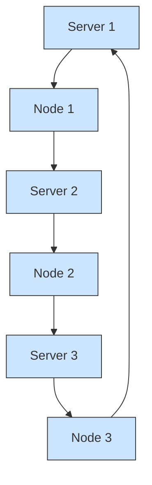
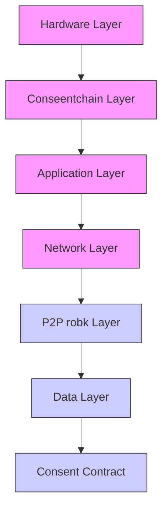
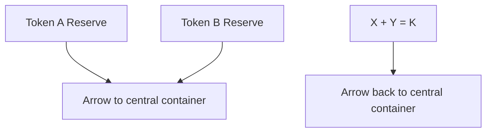

# Comprehensive Blockchain Training

From Fundamentals to Future Applications

180 Minutes

Professional Development Workshop

# Learning Objectives

Master DLT architecture & consensus mechanisms   
Understand smart contracts & the Ethereum ecosystem   
Explore DeFi, NFTs, & enterprise blockchain solutions   
Learn security best practices & governance models   
Discover emerging trends & the regulatory landscape

# Session Overview & Structure

Five comprehensive modules with practical exercises

# Blockchain Fundamentals

Distributed Ledger Architecture • Transaction Lifecycle • Consensus Mechanisms (PoW vs PoS)

40 minutes

# Core Technologies & Platforms

Bitcoin vs Ethereum Comparison • Smart Contracts & EVM • Layer 2 Scaling Solutions

35 minutes

10-min break

# Decentralized Ecosystem

DeFi Protocols (DEXs & Lending) • NFT Applications • Enterprise Blockchain Use Cases

35 minutes

# Security, Governance & Interoperability

Security Threats & Mitigation • DAOs & Governance Models • Cross-Chain Bridges

30 minutes

10-min break

# Future of Blockchain

Regulatory Landscape 2025 • Emerging Trends & Innovations • Practical Exercises & Q&A

30 minutes

# What is a Distributed Ledger?

40 minutes total

# Core Definition

A Distributed Ledger is a database shared and synchronized across a network, with no central administrator.

# Key Characteristics

√ Replicated: Every node keeps a full copy.   
Synchronized: Updates propagate to all nodes.   
Decentralized: No single point of failure.   
Transparent: All participants can view the ledger.   
Immutable: Records cannot be altered.

# How It Works

Transactions are broadcast, validated, and added in blocks via network consensus.

flowchart

# Initiation & Signing

Alice creates and signs a transaction to send 1 ETH to Bob using her private key.

# Broadcasting

The signed transaction is broadcast to the network and enters the 'mempool' (a waiting area).

# Validation

Nodes validate the transaction, checking Alice's signature and ensuring she has sufficient funds for the transfer and gas fees.

# Block Inclusion

A validator selects Alice's transaction from the mempool and includes it in a new block to be added to the chain.

# Confirmation

The new block is broadcast and verified by other nodes. Once added to their chain, the transaction is confirmed.

# Settlement

The transaction is permanent. Alice's balance is debited, Bob's is credited, and the new state is recorded across the network.

# Who's involved in the lifecycle?

# User Layer

Transaction Initiator (Sender)   
Transaction Recipient (Receiver)   
Wallet Providers / Custodians   
End Users / Account Holders

The individuals and services that interact directly with the blockchain through transactions and account management.

# Infrastructure Layer

Network Nodes (Relayers)   
Block Proposers (Miners/Validators)   
Indexers &amp; Block Explorers   
Bridges &amp; Oracles   
RPC Providers / Infrastructure Services

The technical infrastructure that maintains, validates, and provides access to the blockchain network.

# Governance & Compliance

Regulators &amp; Compliance Bodies   
Analytics &amp; Monitoring Services   
Auditors &amp; Security Firms   
Governance Participants

Entities responsible for oversight, compliance, and governance of blockchain systems.

# Proof of Work (PoW)

# Mechanism

Miners solve complex puzzles to validate transactions and create new blocks, earning rewards.

# Real-World Example: Bitcoin

Uses specialized ASIC hardware. A 51% attack requires immense computational power.

# Pros

Proven security &amp; robustness   
High decentralization potential   
Battle-tested since 2009

# Cons

High energy consumption   
Slower transaction speeds (\~7 TPS)   
Mining centralization in pools

# Proof of Stake (PoS)

# Mechanism

Validators are chosen to create blocks based on the amount of crypto they stake as collateral.

# Real-World Example: Ethereum

Cut energy use by 99.95% post-merge. Validators stake 32 ETH to secure the network.

# Pros

Energy-efficient (99%+ reduction)   
More scalable & faster   
Lower barrier to participation

# Cons

Potential wealth concentration   
Newer, less battle-tested   
Nothing-at-stake problem

# Understanding the building blocks

# Key Components

# Nodes

Network participants maintaining complete ledger copies

# Blocks

Data structures containing transaction batches, timestamps, and cryptographic hashes

# Transactions

Digitally signed actions recorded on the blockchain

# Consensus Layer

Protocols ensuring network agreement without central authority

# Cryptography

Security layer using hash functions and digital signatures

flowchart

# Bitcoin vs Ethereum: Purpose & Architecture

35 minutes total

# Bitcoin (BTC)

# Purpose

Peer-to-peer electronic cash system & store of value ('digital gold').

# Key Technology

Simple, secure blockchain with limited scripting (Proof of Work).

# Launch: 2009

Digital currency & payments   
Inflation hedge / store of value

Performance: \~7 TPS

Scaling: Lightning Network (L2)

Supply: 21 million BTC cap (deflationary)

# Ethereum (ETH)

# Purpose

Decentralized platform for smart contracts & dApps.

# Key Technology

Programmable blockchain with Turing-complete language (Proof of Stake).

# Launch: 2015

Decentralized Finance (DeFi)   
Non-Fungible Tokens (NFTs)

Performance: \~30 TPS

Scaling: Rollups (Optimistic & ZK)

Supply: No fixed cap; can be deflationary

Understanding the key differences 

<table><tr><td>Feature</td><td>Bitcoin (BTC)</td><td>Ethereum (ETH)</td></tr><tr><td>Primary Purpose</td><td>Digital currency &amp; store of value</td><td>Smart contracts &amp; dApp ecosystem</td></tr><tr><td>Consensus</td><td>Proof of Work (PoW)</td><td>Proof of Stake (PoS)</td></tr><tr><td>Smart Contracts</td><td>Limited scripting capability</td><td>Turing-complete (Solidity)</td></tr><tr><td>Throughput</td><td>~7 TPS</td><td>~30 TPS (mainnet)</td></tr><tr><td>Block Time</td><td>~10 minutes</td><td>~12-15 seconds</td></tr><tr><td>Supply Cap</td><td>21 million (fixed)</td><td>No cap (with burn mechanism)</td></tr><tr><td>Energy Use</td><td>High (~150 TWh/year)</td><td>Low (99.95% reduction post-Merge)</td></tr><tr><td>Layer 2 Solutions</td><td>Lightning Network</td><td>Rollups (Optimistic &amp; ZK)</td></tr><tr><td>Primary Narrative</td><td>Digital gold / SoV</td><td>World computer / Web3 infrastructure</td></tr><tr><td>Investment Profile</td><td>Store of value, lower risk</td><td>Technology bet, higher growth potential</td></tr></table>

# Smart Contracts & the EVM

Self-Executing Code on the Blockchain

# What are Smart Contracts?

Self-executing contracts with terms written directly into code. They run automatically when predetermined conditions are met.

# Core Architecture

Written in languages like Solidity or Vyper   
Compiled into EVM bytecode for execution   
Deployed to a unique blockchain address   
Contains state, functions, and events

# Key Feature: Trustless Execution

Example: An escrow contract automatically releases funds when a buyer confirms receipt, removing the need for intermediaries.

# EVM: The World Computer

A sandboxed runtime that executes smart contract bytecode across all Ethereum nodes.

# Core Components

Stack

Temporary data for operations

Memory

Volatile storage during execution

Storage

Permanent state variables (most expensive)

Gas

Meters computational cost; prevents spam

Every operation has a gas cost. Transactions fail if gas runs out, but fees are still consumed.

# Optimistic Rollups

# Mechanism

Bundles transactions into one L1 transaction, assuming validity. A challenge period allows for fraud proofs.

Challenge Period: \~7 days

Proof Type: Fraud proofs

# Examples

• Arbitrum

• Optimism

# Benefits

Lower fees (10-100x)   
EVM compatibility

# Trade-off

Longer withdrawal times

# ZK Rollups

# Mechanism

Uses zero-knowledge proofs to cryptographically prove transaction validity without revealing data.

Challenge Period: None (validity proofs)

Proof Type: ZK-SNARKs / STARKs

# Examples

• zkSync   
• StarkNet

# Benefits

Faster finality & higher security   
Lower fees & privacy potential

# Trade-off

Higher computational cost

# State Channels

# Mechanism

Participants transact off-chain, locking funds and submitting only the final state to L1.

On-Chain Txs: Only 2 (open & close)

# Examples

• Lightning Network (BTC)   
• Raiden Network (ETH)

# Benefits

Instant transactions   
Near-zero fees   
Ideal for micropayments

# Trade-off

Requires locked liquidity & online participants

# Decentralized Finance: DEXs & AMMs

35 minutes total

# What is DeFi?

DeFi uses smart contracts for financial services like trading & lending, removing intermediaries.

# Decentralized Exchanges (DEXs)

Peer-to-peer platforms where users trade directly and maintain control of their assets.

# Automated Market Makers (AMM)

Instead of order books, AMMs use liquidity pools and a formula, x \* y = k, to determine asset prices.

# Example: Uniswap

Anyone can provide liquidity to earn fees   
Permissionless and no KYC required

flowchart

# How Lending Works

# Lenders

Deposit crypto into liquidity pools to earn interest.

# Borrowers

Provide crypto collateral of greater value to take loans.

# Overcollateralization

E.g., Deposit \$150 of ETH to borrow \$100 of stablecoin.

# Liquidation & Rates

Collateral is sold if its value drops. Rates are set by asset utilization.

# Flash Loans

Borrow and repay uncollateralized loans in one transaction.

# Aave Leading DeFi lending protocol

# \~\$10B Total Value Locked

# Key Features

Supports 20+ assets across multiple chains   
Flash loans with a 0.09% fee   
Credit delegation to lend your credit line

# Compound Pioneer in DeFi lending

# \~\$3B Total Value Locked

# Key Features

cToken system for interest-bearing tokens   
Governance controlled by COMP token holders   
Pioneered the 'DeFi Summer' movement

# NFTs: Beyond Digital Art

# Real-world applications and utility

# Digital Art & Collectibles

Verifiable ownership, provenance, and automatic artist royalties on secondary sales.

Example: Beeple's \$69M sale, CryptoPunks, BAYC

# Gaming & Metaverse

True ownership of in-game assets, tradable across marketplaces and compatible games.

Example: Axie Infinity, The Sandbox, Decentraland

# Real Estate Tokenization

Enables fractional property ownership and streamlines title transfers.

Example: Propy platform, luxury property fractionalization

# Event Ticketing

Prevents fraud and scalping, with artist resale earnings and token-gated perks.

Example: GET Protocol, NBA Top Shot, concert NFTs

# Identity & Credentials

Verifiable digital identity, academic degrees, and professional licenses on-chain.

Example: MIT digital diplomas, on-chain certifications

# Supply Chain & Authenticity

Tracks product journey to verify authenticity and combat counterfeiting.

Example: LVMH Aura for luxury goods, pharma tracking

# Supply Chain Management

# Challenge

Fragmented, opaque supply chains make it difficult to trace product origins, verify authenticity, and conduct rapid recalls.

# Blockchain Solution

A shared, immutable ledger provides real-time transparency and traceability for all participants from manufacturer to consumer.

# Platform: IBM Food Trust (Hyperledger Fabric)

# Walmart Example: Food Traceability

Traced mangoes from farm to store in 2.2 seconds (vs. 7 days)   
Rapidly identified contaminated products, improving food safety

# Trade Finance

# Challenge

International trade relies on slow, paper-based letters of credit, leading to high friction, fraud risk, and settlement delays.

# Blockchain Solution

Digitizes trade documents and automates workflows with smart contracts on a single, real-time source of truth for all parties.

# Platform: Contour (R3 Corda)

# Major Banks & Corps: Digitized Letters of Credit

Reduced settlement time from 5-10 days to just 24 hours   
Cut processing time by 80% and reduced fraud risk

# Blockchain Security: Threats & Mitigation

30 minutes total

# Network-Level Attacks

# 51% Attack

A majority controller can reverse transactions, halt confirmations, and double-spend assets.

# Real-World Example

Bitcoin Gold & Ethereum Classic suffered attacks; smaller networks are more vulnerable.

# Medium Risk

Low on major chains (high cost), high on smaller ones.

# Mitigation

Decentralized validator/miner sets   
High economic cost to attack   
Slashing penalties in PoS systems   
Higher confirmation thresholds

# Smart Contract Exploits

# Code Vulnerabilities

Bugs in immutable code can be exploited to drain funds or manipulate contract state.

# The DAO Hack (2016)

\$60M stolen via re-entrancy attack, leading to an Ethereum hard fork.

# High Risk

\$3B+ lost to DeFi exploits (2021-2023).

# Mitigation

Rigorous code audits by security firms   
Formal verification of critical contracts   
Bug bounty programs   
Use of battle-tested libraries (OpenZeppelin)

# User-Level Attacks

# Phishing & Social Engineering

Tricking users into revealing private keys or signing malicious transactions.

# Real-World Examples

Fake wallet apps, social media scams, and malicious websites draining wallets.

# Very High Risk

Responsible for the majority of individual losses.

# Mitigation

User education and awareness   
Hardware wallets for key storage   
Verify URLs and contract addresses   
Never share seed phrases

# Community-Driven Decision Making

# What is Blockchain Governance?

Managing protocol changes and resources without a central authority.

# Types

# On-Chain

Rules in smart contracts for automatic execution.

Example: Tezos, Polkadot

# Off-Chain

Community consensus leads to changes via forks.

Example: Bitcoin, Ethereum

# DAO Definition

A member-controlled organization run by code on a blockchain.

# How DAOs Work

1 Smart contracts manage the treasury   
2 Token holders submit and vote on proposals

# MakerDAO

# The DAO behind DAI stablecoin

# Governance Token

# MKR

# Treasury Size

# \~\$5B in reserves

# Key Decisions

Adjusting stability fees   
Adding new collateral types (WBTC, etc.)   
Protocol upgrades and improvements

# Voting Process

Proposal submitted on community forum   
On-chain governance poll   
Automatic execution after time-lock

A mature DAO managing billions in assets with no central control.

# Connecting the blockchain ecosystem

# Problem

Blockchains are isolated networks. Users can't easily move assets or data between them.

# Solution

Interoperability allows blockchains to communicate and exchange value, creating an 'internet of blockchains.'

Cross-chain bridges enable the transfer of assets and data from one blockchain to another.

# How Bridges Work: Lock-and-Mint

  
1. Lock

User locks asset on the source chain.

Asset Locked

  
2. Verify

Bridge validators confirm the lock.

Lock Confirmed

  
3. Mint

Wrapped token is minted on destination.

Wrapped Token Minted

  
4. Use

User uses the wrapped asset.

Trade, Lend, etc.

  
5. Reverse

Wrapped token is burned to unlock.

Original Asset Returned

# Security Challenges: Bridges are High-Value Targets

# Major Incidents

• Ronin Bridge: \$625M   
• Poly Network: \$611M   
• Wormhole: \$325M

# Vulnerabilities

• Smart contract bugs   
• Compromised validators   
• Centralization risks

# Best Practices

Use audited bridges, diversify assets, and understand the trust assumptions of the bridge.

# Regulatory Landscape 2025

30 minutes total

# Global Regulatory Trends

Regulators are creating frameworks to manage risk and foster innovation.

Comprehensive Frameworks

Unified rulebooks for all crypto assets.

AML/KYC Focus

Stricter compliance for AML/KYC.

Consumer Protection

Protecting investors from fraud and risk.

Stablecoin Regulation

Dedicated rules for stablecoins.

Innovation Hubs

Sandboxes for tokenization & CBDCs.

# European Union

Markets in Crypto-Assets (MiCA)

Landmark regulation providing unified rules for crypto assets across all 27 EU member states.

# Key Provisions

Licensing for crypto service providers   
Strict reserve requirements for stablecoins   
Market abuse prevention & transparency

Creates clarity, attracts investment, and sets a global standard.

# United States

Fragmented Multi-Agency Approach

SEC, CFTC, and other agencies assert jurisdiction over different aspects of crypto.

# Key Issues

Debate over tokens as securities (SEC)   
Commodity jurisdiction for BTC/ETH (CFTC)   
Stablecoin legislation is pending in Congress

Uncertainty slows innovation; industry advocates for clear legislation.

# Tokenization of RWAs

Converting real-world assets into blockchain tokens for fractional ownership and liquidity. Impact: Unlocks value in illiquid assets.

Real estate, art tokenization, treasury bills

# AI & Blockchain Integration

Combining blockchain's transparency with AI for secure data, verifiable decisions, and decentralized compute.

Use Cases: AI data marketplaces, verified AI outputs

Synergy: Blockchain audits AI, AI optimizes blockchain.

# Green Blockchain

Shift toward energy-efficient consensus (like Proof-of-Stake) and carbon-neutral operations.

. Ethereum saw a 99.95% energy reduction with PoS   
Emergence of carbon-negative blockchains

Enables ESG-compliant adoption.

# Modular Architecture

Separating blockchain functions into specialized layers for greater scalability and flexibility.

. Benefits: Improved scalability & easier upgrades   
Example: Celestia (data) & Rollups (execution)

# Interoperability

Native cross-chain protocols creating a seamless 'internet of blockchains' for asset and data transfer.

. Key Solutions: Chainlink CCIP, LayerZero, IBC

Vision: Secure messaging between chains.

# CBDCs

Government-issued digital currencies on blockchain, bridging traditional and decentralized finance.

Status: Over 100 countries are exploring CBDCs.

Leaders: China (Digital Yuan) & EU (Digital Euro)

# Network Interaction & Transaction Tracking

After Module 1 (Minute 40) • Duration: 10-15 mins

# Objective & Steps

Understand transaction lifecycle by setting up MetaMask, getting test ETH, sending a transaction, and tracking it on Etherscan.

# Learning Outcomes

Experience transaction creation & signing   
Navigate and use a block explorer   
Tools: MetaMask, Sepolia Faucet, Etherscan

# Deploy Your First Smart Contract

After Module 2 (Minute 83) • Duration: 15-20 mins

# Objective & Steps

Learn deployment basics by compiling and deploying a contract to Sepolia using Remix IDE, then interacting with its functions.

# Learning Outcomes

Understand the deployment flow   
Interact directly with on-chain code   
Tools: Remix IDE, Solidity, MetaMask

# Interact with a DeFi Protocol (DEX)

After Module 3 (Minute 120) • Duration: 10-15 mins

# Objective & Steps

Experience a DeFi user flow by connecting to Uniswap, performing a token swap, and observing key mechanics like slippage and gas fees.

# Learning Outcomes

Understand the core DeFi user experience   
Grasp AMM concepts like slippage & pricing   
Tools: Uniswap, MetaMask

# Your quick reference guide

# Address

A unique ID to send/receive crypto, derived from a public key.

# Block

A batch of transactions with a timestamp and the previous block's hash.

# Blockchain

A distributed, immutable ledger for recording transactions across a network.

# Consensus Mechanism

A protocol for network nodes to agree on the blockchain's state (e.g., PoW, PoS).

# DApp (Decentralized App)

An application that runs on a blockchain or P2P network, not a central server.

# Gas

A unit measuring computational effort for transactions on the Ethereum network.

# Hash Function

A function that converts input data into a fixed-size string of characters (a hash).

# Layer 1 (L1)

The base blockchain protocol, like Bitcoin or Ethereum, providing core security.

# Layer 2 (L2)

Scaling solutions built on a Layer 1 to improve transaction speed and costs.

# Mining

The process of validating transactions and creating new blocks in a PoW system.

# Your quick reference guide (continued)

# NFT

A unique digital asset representing ownership of a specific item like art or a collectible.

# Node

A computer on the blockchain network that validates transactions and holds a copy of the ledger.

# Oracle

A service providing external, real-world data (e.g., price feeds) to smart contracts.

# Private Key

A secret key that proves ownership and signs transactions. Must be kept private.

# Proof of Stake (PoS)

Consensus mechanism where validators are chosen based on the amount of crypto they have staked.

# Smart Contract

Self-executing code on a blockchain that enforces an agreement when conditions are met.

# Solidity

The primary programming language for writing smart contracts on Ethereum and EVM chains.

# Staking

Locking cryptocurrency to support a network's operations in exchange for rewards.

# Token

A digital asset on an existing blockchain, representing a utility or an asset (e.g., ERC-20).

# TVL (Total Value Locked)

The total value of assets deposited in a DeFi protocol, indicating its liquidity and trust.

# Online Courses

# Cyfrin Updraft

Comprehensive blockchain fundamentals

# Ethereum.org

Official Ethereum educational resources

# Developer Resources

# Solidity Docs

Official language docs for smart contracts

# OpenZeppelin

Secure smart contract templates

# Explorers & Analytics

# Etherscan

Leading Ethereum block explorer & analytics

# DeFi Llama

DeFi analytics and TVL tracking

# News & Research

# The Block

Institutional-grade crypto research & news

# Week in Ethereum

Curated weekly Ethereum ecosystem updates

# Communities

# r/ethdev (Reddit)

Community for Ethereum development help

# Crypto Twitter/X

Follow developers & researchers for updates

# Tools & Infrastructure

# MetaMask

Popular Ethereum wallet for browser & mobile

# Hardhat / Foundry

Professional smart contract dev frameworks

# What You've Learned Today

# Module 1: Fundamentals

Distributed ledgers provide resilience through decentralization.   
Consensus mechanisms (PoW/PoS) enable trustless agreement.

# Module 2: Core Tech

Q Bitcoin as a store of value; Ethereum as a smart contract platform.   
Layer 2 solutions like rollups dramatically improve scalability.

# Module 3: Ecosystem

DeFi rebuilds financial services without intermediaries.   
NFTs enable verifiable digital ownership for various assets.

# Module 4: Security & Gov

Security is critical at network, code, and user levels.   
DAOs allow for decentralized, community-led governance.

# Module 5: The Future

Global regulation is maturing, providing clearer frameworks.   
Future trends include RWA tokenization and AI integration.

# Your Blockchain Journey Begins

You now have a solid foundation in blockchain technology. The ecosystem is evolving rapidly, and continuous learning is key.

# Next Steps

Complete hands-on exercises to solidify your understanding.   
Explore curated resources for deeper learning.   
Join blockchain communities to stay updated on developments.

"The future of decentralized systems is being built today. You're now equipped to be part of that transformation."

Questions? Continue the conversation with your instructor and peers.