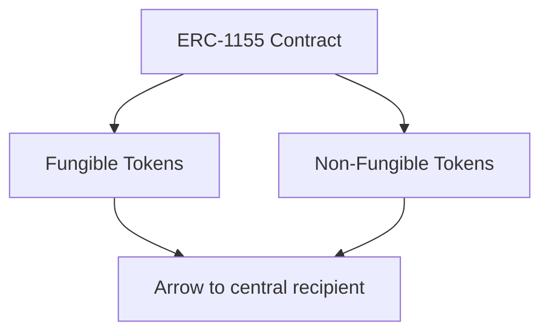
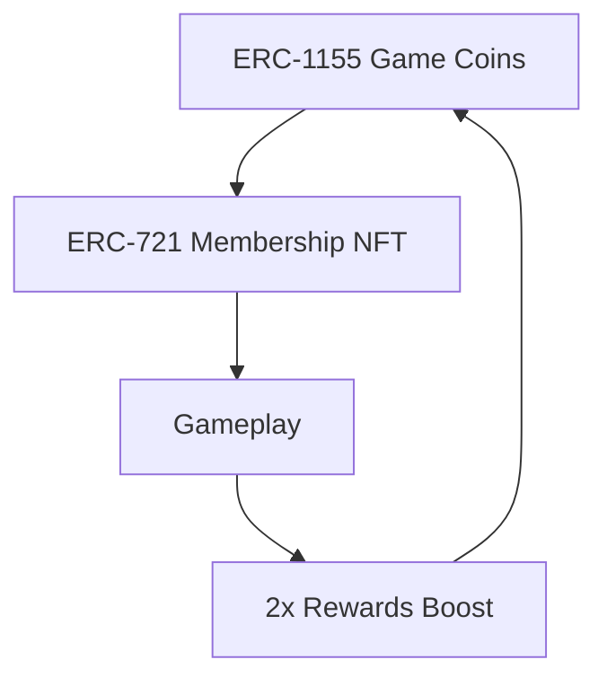

# Solidity Game Workshop

# ERC-1155 & Token Economics

180 Minutes | Hands-On Development

Build Games. Mint Tokens. Create Economies.

# Learning Objectives

Master ERC-1155 multi-token standard   
Build token-based game mechanics   
Implement ERC-721 membership systems   
Create airdrop contracts with conditional logic   
Connect smart contracts to web interfaces

# What You'll Build Today

# A Working Token Game

ERC-1155 game token contract   
Interactive game website   
ERC-721 membership NFTs   
Smart airdrop system   
Fully deployed on Sepolia testnet


Play other teams' games at the end!

# Quick Recap: ERC-721 Basics

# What You Already Know

# ERC-721 Key Characteristics

# Uniqueness

Every token has a unique tokenId

# Ownership

One owner per token

# Metadata

Each token can have unique properties

# Use Cases

Art NFTs, collectibles, membership passes


# ERC-721

Non-Fungible Token

Standard

Each token is unique

# Familiar Functions

ownerOf(uint256 tokenId)

balanceOf(address owner)

transferFrom(address from, address to, uint256 tokenId)

approve(address to, uint256 tokenId)

# Introduction to ERC-1155

# Multi-Token Standard

# ERC-1155

A multi-token standard that can manage multiple token types in a single smart contract


One contract can hold both fungible and non-fungible tokens

# Why ERC-1155?

Gas efficiency: Batch transfers save costs   
Flexibility: Mix fungible & non-fungible tokens   
Simplicity: Single contract for all game assets   
Perfect for gaming: Items, currencies, characters

Perfect For

# Game Development

Manage coins (fungible) and unique items (non-fungible) in one place


<details>
<summary>flowchart</summary>


</details>

# Understanding the differences helps you choose the right standard for your project

# Comparison Criteria

Token Types

Contract Structure

Batch Operations

Gas Efficiency

Use Cases

Complexity

# ERC-721

Only non-fungible (unique tokens)

One contract per collection

Not supported natively

Higher gas for multiple transfers

Art, collectibles, certificates

Simpler, focused

# ERC-1155

Both fungible & non-fungible

One contract for all types

Native batch transfers

Lower gas with batching

Gaming, multi-asset systems

More flexible, complex


# Game Concept Overview

# Token Relationship Diagram

# Simple Game Mechanics

Game Example:

Click screen 100 times

Reward:


Earn ERC-1155 tokens

Membership Benefit:

ERC-721 holders get 2× rewards

Initial Gift:

New members: 10 tokens to start

Core Loop:

Play

Complete

Mint

Repeat


<details>
<summary>flowchart</summary>


</details>


# Token Economics: How 1155 & 721 Work Together


# Game Tokens

ERC-1155

Fungible

Earnable

Transferable

In-game currency for earning rewards

Minted on task completion


# Membership NFTs

ERC-721

Unique

Permanent

Beneficial

Unlocks special benefits and bonuses

Limited distribution


# Synergy

# 2× Airdrop Rewards

Holding 721 = Double 1155 tokens

# Economic Flow & Incentive Structure

Step 1

Player joins & receives 10 welcome tokens.

Step 2

Complete tasks to mint new ERC-1155 tokens.

Step 3

ERC-721 holders get 2x airdrop rewards.

Step 4

Use accumulated tokens in-game or trade them.

Key Mechanic: Membership NFTs create a premium tier with tangible benefits

Design Goal: Encourage participation while rewarding committed members

Break into groups of 3-4 students and brainstorm your unique game concept


Design a simple, achievable game that uses token mechanics

# Group Activity Tasks

5 min


# Form Teams

Self-organize into groups of 3-4

10 min


# Brainstorm Game Idea

What's your game? Keep it simple (click-based, quiz, puzzle)

10 min


# Define Token Mechanics

How do players earn 1155 tokens? What triggers minting?

5 min


# Plan Membership Benefits

What extra benefits do 721 holders get?


Use the next slide's guiding questions to structure your brainstorming → Be ready to share your concept!

# Game Planning: Guiding Questions & Brainstorming


# Game Mechanics

❓ Core gameplay? (clicker, quiz, puzzle)   
❓ How long should a game session take?   
❓ What makes the game fun and engaging?   
❓ Single-player or multiplayer?


# Membership Benefits

What bonus do ERC-721 holders receive?   
❓ Is it 2x tokens or something else?   
❓ How to verify membership ownership?   
❓ Should members get exclusive access?


# Technical Implementation

What will your website look like?   
What data needs to be on-chain?   
❓ How will users interact with the contract?   
Which wallet connection method?


# Token Economics

How many ERC-1155 tokens per completion?   
❓ What actions trigger token minting?   
❓ Should there be different token tiers?   
❓ How to prevent gaming the system?


# Pro Tips

Keep it simple - you have limited time   
Test the concept manually first   
Think about what makes it FUN

Use OpenZeppelin and Remix to create, customize, and deploy your ERC-1155 token contract.

# What You'll Do

1 Generate contract with OpenZeppelin 5 min   
2 Customize contract for your game 10 min   
3 Import into Remix IDE 5 min   
4 Compile and deploy to Sepolia 10 min   
5 Test basic functions 10 min

⚠️ Remember

Make sure MetaMask is connected to the Sepolia testnet!


# Tools You'll Use

OpenZeppelin Wizard Generate base contract   
Remix IDE Write & deploy code   
MetaMask Sign transactions   
Sepolia Testnet Deploy network

# Code Demo: ERC-1155 Contract

GameToken.sol   
```solidity
// SPDX-License-Identifier: MIT
pragma solidity ^0.8.20;

import "@openzeppelin/contracts/token/ERC1155/ERC1155.sol";
import "@openzeppelin/contracts/access/Ownable.sol";

contract GameToken is ERC1155, Ownable {
    uint256 public constant GAME_TOKEN = 0;
    uint256 public tokensMintedPerGame = 10;

    constructor()
    ERC1155("")
    Ownable(msg.sender)
    {
    _mint(msg.sender, GAME_TOKEN, 100, "");
    }

    function mintReward(address player) public {
    // In a real app, this would be called by a
    // trusted server after verifying game completion.
    _mint(player, GAME_TOKEN, tokensMintedPerGame, "");
    }

    function setRewardAmount(uint256 amount) public onlyOwner {
    tokensMintedPerGame = amount;
    }
} 
```

# Key Components

✓ Inherits from OpenZeppelin's ERC1155 & Ownable   
✓ Defines a single token type: GAME\_TOKEN   
Mints initial supply to the contract creator

# Core Functions

mintReward()

Mints new tokens to a player's address.

setRewardAmount()

Owner can adjust reward quantity.

Create an interactive website to connect with your smart contract and let players earn tokens.


We'll use bolt.new - an AI-powered website builder

# Website Build Steps

1 Design your game interface on bolt.new   
2 Add interactive elements (buttons, counters)   
3 Integrate Web3 wallet connection   
Connect to your deployed contract   
1 Implement local game logic   
Add mint reward function call   
Test the complete end-to-end flow

# Your Website Must Have

Wallet Connect Button

Players need to connect MetaMask

Game Interface

The actual game players interact with

Progress Tracking

Show players their score

Mint Button

Trigger token minting on completion

Token Balance Display

Show player's token balance

Bonus Feature

Add a leaderboard or visual effects!


Remember

Game logic runs on your website. The smart contract only handles token minting.


# Connecting Website to Smart Contract

# Web3 Basics


# Web3 Provider

MetaMask acts as the bridge between your website and blockchain

window.ethereum object


# Contract Instance

JavaScript object representing your deployed contract

Requires: address + ABI


# Function Calls

Invoke contract functions from your website code

Read (free) vs Write (gas)

# How It Works: Step-by-Step Connection


# 1. User Clicks Connect

Website requests MetaMask connection

await ethereum.request({ metho d: 'eth\_requestAccounts })


# 2. Get Contract Instance

Create JavaScript object for your contract

new ethers.Contract( address, ABI, signer


# 3. User Completes Game

Website detects win condition

if (clicks >= 100) { triggerRe ward() }


# 4. Call Mint Function

Invoke contract's mintRewardfunction

await contract.mintReward(play er)


# 5. User Confirms

MetaMask popup for transaction approval

// User pays gas & signs


# 6. Tokens Minted

Smart contract executes, tokens transferred

// Tokens appear in wallet

# Code Demo: Website Integration

# 1. Connect to MetaMask

```javascript
async function connectWallet() {
    if (!window.ethereum) {
    return alert('Please install MetaMask!');
    }

    await window.ethereum.request({
    method: 'eth_requestAccounts'
    });

    const provider = new ethers.providers.Web3Provider(
    window.ethereum
    );

    return provider.getSigner();
} 
```

# 2. Call Mint Function

```javascript
const contractAddress = "0x...";
const contractABI = [...]; // From Remix

async function mintGameReward() {
    const signer = await connectWallet();

    const gameContract = new ethers.Contract(
    contractAddress, contractABI, signer
    );

    const userAddress = await signer.getAddress();
    const tx = await gameContract.mintReward(userAddress);

    await tx.wait();
    alert('Reward minted!');
} 
```

Get contract ABI from Remix after compilation.

Create a membership NFT system that grants special benefits to holders


Build an ERC-721 contract and implement airdrop logic with bonus rewards for members

# What You'll Build

Create ERC-721 Membership Contract

15 min

NFT that represents premium membership status

Deploy Membership Contract

10 min

Deploy to Sepolia and mint test NFTs

Build Airdrop Contract

10 min

Contract that checks membership and distributes rewards

Test Double Rewards

5 min

Verify members get 2× tokens


# Membership Benefits


Standard Player

Basic

10 tokens per game


Premium Member

2× Multiplier Active

20 tokens per game


Advantage

Double the rewards for holding membership NFT!

# Code Demo: ERC-721 Membership Contract

MembershipNFT.sol   
```solidity
// SPDX-License-Identifier: MIT
pragma solidity ^0.8.20;

import "@openzeppelin/contracts/token/ERC721/ERC721.sol";
import "@openzeppelin/contracts/access/Ownable.sol";

contract MembershipNFT is ERC721, Ownable {
    uint256 private _tokenIdCounter;
    uint256 public maxSupply = 100;

    constructor() ERC721("Game Membership", "GMEMBER")
    Ownable(msg.sender) {}

    // Mint a new membership NFT (only owner)
    function mintMembership(address to) public onlyOwner {
    require(_tokenIdCounter < maxSupply, "Max supply");
    _tokenIdCounter++;
    _safeMint(to, _tokenIdCounter);
    }

    // Check if an address holds a membership
    function hasMembership(address user) public view returns (bool) {
    return balanceOf(user) > 0;
    }
} 
```

# Key Features

✓ Inherits ERC721 & Ownable   
✓ Limited supply (100 NFTs)   
✓ Owner-controlled minting   
Membership verification function

# Critical Function

hasMembership()

This is called by other contracts (like an airdrop) to verify a user's membership status.

# Pro Tip

Adjust \`maxSupply\` based on your community size.

# Implementing Airdrop Mechanics

The airdrop contract links ERC-721 membership with ERC-1155 game tokens for reward distribution.

It automatically applies a 2x multiplier for members.

# How Airdrop Works

1. Player Completes Task

Website calls airdrop contract

2. Check Membership

Contract queries ERC-721: hasMembership(player)

3 3. Calculate Reward

If member: amount × 2, else: amount × 1

4 4. Mint Tokens

Call ERC-1155 contract to mint calculated amount

# Reward Examples

Base Reward:

10 tokens

Standard Player

Has Membership: false

Calculation: 10 × 1 = 10

Result: 10 tokens

Premium Member

Has Membership: true

Calculation: 10 × 2 = 20

Result: 20 tokens

# Code Demo: Airdrop with Double Rewards

GameAirdrop.sol   
```solidity
// SPDX-License-Identifier: MIT
pragma solidity ^0.8.20;

interface IGameToken {
    function mint(address to, uint256 id, uint256 amount) external;
}

interface IMembershipNFT {
    function hasMembership(address user) external view returns (bool);
}

contract GameAirdrop {
    IGameToken public gameToken;
    IMembershipNFT public membershipNFT;
    uint256 public baseRewardAmount = 10;

    constructor(address _gameToken, address _membershipNFT) {
    gameToken = IGameToken(_gameToken);
    membershipNFT = IMembershipNFT(_membershipNFT);
    } 
```

function airdropReward(address player) public {   
```javascript
bool isMember = membershipNFT.hasMembership(player);
uint256 reward = isMember ? baseRewardAmount * 2 : baseRewardAmount;
gameToken.mint(player, 0, reward); 
```

# Testing Your Airdrop Functionality

Verify members get double rewards and standard players get base rewards.


Tools: Remix IDE, MetaMask with multiple test accounts

# Testing Steps


# 1. Deploy Contracts

Deploy GameToken, MembershipNFT, then GameAirdrop, passing contract addresses.


# 2. Mint Membership NFT

Use mintMembership() to grant an NFT to a designated test account.


# 3. Test Standard Player

Call airdropReward() for an account without a membership NFT. Verify base reward.


# 4. Test Premium Member

Call airdropReward() for the account holding the membership NFT. Verify 2x reward.


# 5. Check Balances

Query balanceOf() on the token contract for both accounts to confirm amounts.


# 6. Review Events

Inspect transaction logs for the emitted AirdropExecuted event.

Expected Results 

<table><tr><td>Account Type</td><td>Base Reward</td><td>Actual Reward</td></tr><tr><td>Standard Player</td><td>10 tokens</td><td>✓ 10 tokens</td></tr><tr><td>Premium Member</td><td>10 tokens</td><td>✓ 20 tokens (2×)</td></tr></table>


# Common Issues

Contract not authorized to mint? → Grant minting permission.   
Transaction fails? → Check contract addresses are correct.   
→ Wrong amounts? → Verify hasMembership() logic.


✓ Members get 2× tokens

✓ Standard players get 1× tokens


Airdrop system works!


Visit other teams' websites, play their games, and earn tokens!


Test real-world functionality and see creative implementations


# Play Multiple Games

Try at least 3 different teams' games.


# Earn Tokens

Complete tasks and verify token minting.


# Test Membership

Verify double rewards with a membership NFT.


# Give Feedback

Share what worked well and what could improve.


# Safety Reminder

✓ Only use Sepolia testnet (no real money)

✓ Test ETH has no value

✓ Don't share private keys or seed phrases


# MetaMask

1 Install MetaMask extension   
2 Create or import a wallet   
3 Switch to Sepolia testnet   
4 Get test ETH from a faucet (e.g., sepoliafaucet.com)

✓ Check: Sepolia ETH balance > 0


# Dev Tools

OpenZeppelin Wizard

wizard.openzeppelin.com

Remix IDE

remix.ethereum.org

Pinata

pinata.cloud (for IPFS)

Poe

poe.com (for AI images)


# Remix IDE

1 Create new file: GameToken.sol   
2 Set compiler to 0.8.20+   
Set environment to 'Injected Provider - MetaMask'   
Ensure MetaMask is on Sepolia   
Keep Remix tab open

?? Tip: Pin the Remix tab so you don't lose it!

# Troubleshooting Common Issues

# MetaMask Issues

⚠️ MetaMask not connecting   
→ Refresh page, check unlock status, or reconnect.

⚠️ Insufficient funds error   
→ Use a Sepolia faucet for more test ETH.

# Smart Contract Errors

⚠️ Contract compilation fails   
→ Check pragma version (0.8.20+) and imports.

⚠️ Function call reverts

→ Check require() statements and calling account.

# Website Integration

window.ethereum is undefined   
MetaMask not installed or page needs refresh.

Transaction fails silently Open browser console (F12) for error messages.

⚠️ Wrong network selected   
→ In MetaMask, switch network to Sepolia.

Transaction stuck pending Wait a few minutes, or retry with higher gas.

Deployment fails Ensure MetaMask is on Sepolia with enough ETH.

Cannot find contract address Copy address from Remix console after deployment.

Contract function not found Verify ABI matches contract and check spelling.

Tokens not showing in wallet Manually import token address in MetaMask.

# Best Practices & Security

# Development Best Practices

✓ Use OpenZeppelin Libraries

Battle-tested, audited code for security.

✓ Test Rigorously

Deploy on testnets before mainnet to catch bugs.

✓ Keep It Simple

Complex code increases the attack surface.

✓ Use Access Control

Protect critical functions with Ownable or roles.

✓ Validate All Inputs

Check requirements before executing state changes.

# Security Considerations

Reentrancy Attacks

Update state before external calls.

Mitigation: Use Checks-Effects-Interactions pattern.

High

Integer Overflow/Underflow

Solidity 0.8+ has built-in checks.

Mitigation: Use SafeMath for older versions.

Medium

Access Control

Unprotected functions can be exploited.

Mitigation: Use \`onlyOwner\` or role-based access.

High

Gas Limit & Loops

Unbounded loops can lead to failures.

Mitigation: Paginate or limit array/loop sizes.

Medium

Production Reminder

Always get a professional audit before mainnet deployment.

# What You Accomplished

Mastered ERC-1155 standard   
Built smart airdrop logic

Deployed game contracts   
Connected contracts to UI

Created ERC-721 NFTs   
Tested a live blockchain game

# Your Complete Token Game System

✓ ERC-1155 Contract

✓ ERC-721 NFT Contract

✓ Airdrop Contract

✓ Game Website

Web3 Integration


All deployed on Sepolia testnet!

# Continue Your Blockchain Journey


# Short Term

• Enhance your game with new features.   
• Experiment with token economics.


# Learning Path

• Study DeFi protocols like Uniswap.   
• Explore Layer 2 solutions (e.g., Polygon).


# Helpful Resources

• OpenZeppelin documentation   
• Ethernaut security challenges