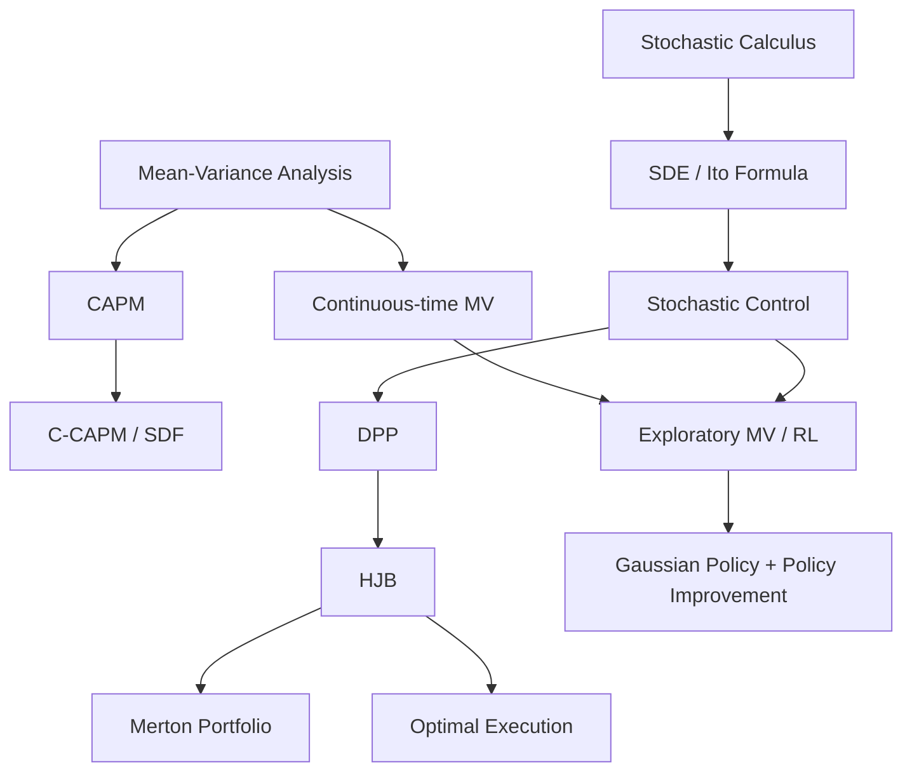

# AMA575 Investment Science 总整理

> [!info] 整理说明
> 这份总整理基于 `AMA575 Investment Science` 文件夹内 7 篇 Markdown 笔记重构。原笔记包含课程讲义、公式推导和一篇论文阅读笔记；这里按知识主线整理，保留核心公式、定理含义、金融直觉和复习重点。

## 1. 课程总主线

AMA575 的主线可以概括为：

> **从单期均值-方差投资组合开始，推到 CAPM 和 C-CAPM，再用随机分析建立连续时间模型，最后用 HJB/随机控制处理动态投资与交易执行，并进一步连接到强化学习版的连续时间均值-方差问题。**

具体链条：

1. **Mean-Variance Analysis**：投资者在目标收益下最小化方差，得到有效前沿、Sharpe ratio 上界和最优权重。
2. **CAPM**：如果所有投资者都持有均值-方差有效组合，市场组合也必须有效，由此得到 beta 定价关系。
3. **C-CAPM**：资产风险不再只看市场协方差，而看与消费增长/边际效用的协方差。
4. **Stochastic Calculus**：条件期望、鞅、Brownian motion、Ito integral、Ito formula、SDE，是连续时间金融的数学语言。
5. **Continuous-Time Stochastic Control**：用 DPP 和 HJB 解 Merton problem，得到最优动态投资策略。
6. **Financial Applications**：用同一控制框架处理最优清算、最优买入、临时/永久价格冲击。
7. **RL for Continuous-Time MV**：把连续时间 MV 写成 entropy-regularized exploratory stochastic control，用 Gaussian exploration 和 policy improvement 设计可解释 RL 算法。

## 2. 原始笔记索引

| 原笔记 | 主题定位 | 建议阅读顺序 |
|---|---|---|
| [[MV analysis]] | 单期均值-方差分析、有效前沿、Sharpe ratio、MV 局限 | 1 |
| [[Capital Asset Pricing Model]] | CAPM、市场组合、beta、EMH | 2 |
| [[Consumption-based CAPM]] | C-CAPM、随机折现因子、消费风险溢价 | 3 |
| [[Stochastic Calculus]] | 条件期望、鞅、Brownian motion、Ito 积分与 SDE | 4 |
| [[Continuous-time Stochastic Control]] | DPP、HJB、Verification、Merton problem | 5 |
| [[More Financial Applications]] | 最优清算、最优收购、永久价格冲击 | 6 |
| [[4.Mathematical Finance - 2020 - Wang - Continuous‐time mean variance portfolio selection  A reinforcement learning framework]] | 连续时间 MV 的强化学习框架论文 | 7 |

## 3. Mean-Variance Analysis

### 3.1 单期经济与投资组合收益

课程从一周期经济开始：

- 时间：`t = 0, 1`
- 一只无风险债券，收益率为 `r`
- `N` 只风险资产
- 第 `n` 只资产收益：

$$
R_n = (S_n(1) - S_n(0)) / S_n(0)
$$

投资组合用持仓数量表示：

$$
\phi = (\phi_0, \phi_1, ..., \phi_N)
$$

其中：

- `φ_0` 是无风险债券持仓；
- `φ_n` 是第 `n` 只风险资产持仓；
- `w_n = φ_n S_n(0) / V(0)` 是财富中投入第 `n` 只风险资产的比例。

组合收益为：

$$
R = (1 - \sum w_n) r + \sum w_n R_n
$$

这个公式很关键：无风险资产权重是 `1 - Σw_n`，风险资产只通过权重向量 `w` 进入收益。

### 3.2 均值-方差问题

投资者设定目标期望收益 `ρ >= r`，在达到该收益的组合中选择方差最小者：

$$
\begin{aligned}
\min_{w} \operatorname{Var}[R] \\
\text{subject to } \mathbb{E}[R] = \rho
\end{aligned}
$$

金融直觉：

- `ρ` 表示投资者的目标收益/风险偏好；
- 在同样目标收益下，方差越低越好；
- MV 只看均值和方差，因此忽略 skewness、kurtosis 和极端尾部风险。

### 3.3 MV 的局限：卖深度虚值 Put 的例子

笔记用两个例子说明 MV 的缺陷。

第一个是构造两个组合 `R_1` 和 `R_2`，它们可以有相同均值和方差，但 `R_2` 在 99% 正常时期表现稳定，1% 危机时期发生巨大亏损。

第二个是 repeatedly selling deep OTM put：

$$
\text{Short put profit} = 100c - 100 \max(K - S_T, 0)
$$

如果 SPY 不跌破行权价，大多数时候只赚期权费；但一旦暴跌，亏损可能远超多次小盈利。

核心提醒：

> **均值和方差一样，不代表真实风险一样。高 kurtosis / fat tail 策略会被 MV 框架低估风险。**

### 3.4 MV 的矩阵形式

设：

$$
\begin{aligned}
w = (w_1, ..., w_N)^T \\
C_{ij} = \operatorname{Cov}(R_i, R_j) \\
\bar{R} = (\mathbb{E}[R_1], ..., \mathbb{E}[R_N])^T \\
1 = (1, ..., 1)^T
\end{aligned}
$$

组合方差：

$$
\operatorname{Var}[R] = w^T C w
$$

约束：

$$
\mathbb{E}[R] = r + w^T (\bar{R} - r1) = \rho
$$

因此优化问题写成：

$$
\begin{aligned}
\min_{w} 1/2 \cdot w^T C w \\
\text{subject to } w^T (\bar{R} - r1) = \rho - r
\end{aligned}
$$

### 3.5 拉格朗日解

Lagrangian：

$$
L(w, \lambda) = 1/2 w^T C w + \lambda { \rho - r - w^T(\bar{R} - r1) }
$$

一阶条件：

$$
Cw - \lambda(\bar{R} - r1) = 0
$$

所以：

$$
w^*= \lambda C^{-1}(\bar{R} - r1)
$$

令：

$$
H = (\bar{R} - r1)^T C^{-1}(\bar{R} - r1)
$$

由收益约束可得：

$$
\lambda = (\rho - r) / H
$$

最终最优权重：

$$
w^*= C^{-1}(\bar{R} - r1) \cdot (\rho - r) / H
$$

最优方差：

$$
\sigma_*^2 = (\rho - r)^2 / H
$$

有效前沿关系：

$$
\rho = r + \sigma_*\sqrt{H}
$$

这说明在有无风险资产时，有效前沿在 `(σ, ρ)` 平面上是一条从 `r` 出发的直线。

### 3.6 Sharpe Ratio 的含义

Sharpe ratio：

$$
SR = (\mu - r) / \sigma
$$

MV 有效组合的 Sharpe ratio：

$$
SR_*= (\rho - r) / \sigma_*= \sqrt{H}
$$

因此：

- 所有 MV 有效组合具有相同 Sharpe ratio；
- 任意组合的 Sharpe ratio 都不应超过 `sqrt(H)`；
- 更高目标收益 `ρ` 本质上是沿着同一条资本市场线加杠杆。

### 3.7 没有无风险资产时

如果没有无风险资产，问题变成：

$$
\begin{aligned}
\min_{w} 1/2 w^T C w \\
\text{subject to } w^T \bar{R} = \rho \\
w^T 1 = 1
\end{aligned}
$$

多了一个满仓约束 `w^T 1 = 1`，有效前沿不再是从无风险利率出发的直线，而是经典的均值-方差双曲线结构。

## 4. CAPM

### 4.1 从 MV 有效组合到定价关系

设 `R*` 是任意 MV 有效组合收益。对任意组合收益 `R`：

$$
\mathbb{E}[R] - r = \operatorname{Cov}(R, R^*) / \operatorname{Var}(R^*) \cdot (\mathbb{E}[R^*] - r)
$$

也可写为 Sharpe 形式：

$$
\begin{aligned}
(\mathbb{E}[R] - r) / \sigma(R) \\
= \operatorname{Corr}(R, R^*) \cdot (\mathbb{E}[R^*] - r) / \sigma(R^*)
\end{aligned}
$$

这说明资产期望超额收益不是由总波动决定，而由它与有效组合的协方差决定。

### 4.2 有效组合的线性组合仍然有效

如果 `w*(ρ1)` 和 `w*(ρ2)` 是两个目标收益对应的 MV 有效组合，则任意线性组合：

$$
\begin{aligned}
w^*(\rho) = \alpha w^*(\rho1) + (1 - \alpha) w^*(\rho2) \\
\rho = \alpha \rho1 + (1 - \alpha) \rho2
\end{aligned}
$$

仍然是 MV 有效组合。

这是 CAPM 的关键桥梁：如果每个投资者都选择 MV 有效组合，那么市场上所有投资者组合的加权平均也会是 MV 有效组合。

### 4.3 市场组合

总市场组合权重：

$$
w_n^(M) = W_n / (\sum_{j=1}^N W_j + W_0)
$$

其中 `W_n` 是第 `n` 个风险资产的市场总价值，`W_0` 是无风险资产总价值。

市场组合通常指风险资产部分：

$$
\begin{aligned}
w_n^(market risky part) \\
= w_n^(M) / \sum_{j=1}^N w_j^(M)
\end{aligned}
$$

如果供给等于需求，市场组合是所有投资者组合的财富加权平均：

$$
\begin{aligned}
w_n^(M) = \sum _i \alpha_i w_n^(i) \\
\alpha_i = V_i(0) / total market wealth
\end{aligned}
$$

### 4.4 CAPM 市场组合定理

如果每个投资者都持有 MV 有效组合，那么市场组合也必须是 MV 有效组合。

因此对任意组合 `R`：

$$
\mathbb{E}[R] - r = \operatorname{Cov}(R, R_M) / \operatorname{Var}(R_M) \cdot (\mathbb{E}[R_M] - r)
$$

定义：

$$
\beta = \operatorname{Cov}(R, R_M) / \operatorname{Var}(R_M)
$$

则：

$$
\mathbb{E}[R] - r = \beta (\mathbb{E}[R_M] - r)
$$

这就是 CAPM 的核心：

> **投资者只应因承担系统性风险 beta 而获得补偿，非系统性风险可通过分散化消除，不应获得风险溢价。**

### 4.5 CAPM 的经验检验

经验上常写成：

$$
\begin{aligned}
R - r = \alpha + \beta (R_M - r) + \varepsilon \\
\mathbb{E}[\varepsilon] = 0
\end{aligned}
$$

CAPM 成立意味着：

$$
\alpha = 0
$$

如果某策略长期有正 `α`，则说明：

- CAPM 被经验拒绝；
- 或市场组合代理不正确；
- 或存在风险因子遗漏；
- 或策略抓到了异常收益。

### 4.6 Treynor Ratio

Treynor ratio：

$$
(\mu - r) / \beta
$$

它衡量每单位系统性风险获得多少超额收益，与 Sharpe ratio 的区别是：

- Sharpe 用总波动 `σ`；
- Treynor 用系统性风险 `β`。

### 4.7 EMH

有效市场假说 EMH：

> 市场价格反映可得信息，因此基于已知信息的交易策略不应在期望上产生异常收益。

三种形式：

| 形式 | 价格反映的信息 | 被什么策略挑战 |
|---|---|---|
| Weak form | 历史价格和成交量 | 技术分析 |
| Semi-strong form | 所有公开信息 | 基本面分析 |
| Strong form | 公开与非公开信息 | 内幕交易 |

## 5. Consumption-Based CAPM

### 5.1 为什么从 CAPM 到 C-CAPM

CAPM 用市场组合解释资产收益，但它没有解释：

- 为什么市场组合是最终风险来源；
- 为什么风险厌恶投资者要求补偿；
- 无风险利率从哪里来。

C-CAPM 的思路：

> 投资的最终目的不是财富本身，而是跨时间、跨状态平滑消费。资产价格必须由资产对消费平滑的贡献决定。

### 5.2 两期消费-投资问题

投资者选择持有资产数量 `Y`：

$$
\max_{Y} U(C_t) + E_t[\theta U(C_{t+1})]
$$

约束：

$$
\begin{aligned}
C_t = e_t - P_t Y \\
C_{t+1} = e_{t+1} + (P_{t+1} + D_{t+1})Y
\end{aligned}
$$

一阶条件/Euler equation：

$$
\begin{aligned}
U'(C_t) P_{i,t} \\
= E_t[\theta U'(C_{t+1})(P_{i,t+1}+D_{i,t+1})]
\end{aligned}
$$

用收益率表示：

$$
1 = E_t[m_{t+1}(1 + R_{i,t+1})]
$$

其中随机折现因子：

$$
m_{t+1} = \theta \cdot U'(C_{t+1}) / U'(C_t)
$$

### 5.3 SDF 的金融含义

`m_{t+1}` 是 intertemporal marginal rate of substitution。

直觉：

- 如果未来消费低，边际效用高，`m` 高；
- 能在坏时候支付高收益的资产很有价值，因此要求收益率低；
- 在坏时候表现差、好时候表现好的资产不能帮助平滑消费，因此要求更高预期收益。

资产定价理论通常都可以写成：

$$
1 = \mathbb{E}[m R_{\mathrm{gross}}]
$$

区别在于不同理论给出不同的 `m`。

### 5.4 CRRA Utility

CRRA/power utility：

$$
U(C_t) = (C_t^{1-\gamma} - 1) / (1 - \gamma)
$$

其中 `γ` 是相对风险厌恶系数。

对应 SDF：

$$
m_{t+1} = \theta (C_{t+1}/C_t)^{-\gamma}
$$

若 `γ = 0`，投资者风险中性：

$$
m_{t+1} = \theta
$$

### 5.5 风险溢价：协方差是关键

C-CAPM 的核心：

$$
\text{Risk premium} = \mathrm{price of risk} \cdot \mathrm{amount of risk}
$$

其中：

$$
\begin{aligned}
\text{price of risk} = \gamma \\
\text{amount of risk} = \operatorname{Cov}_t(\Delta c_{t+1}, r_{i,t+1})
\end{aligned}
$$

这句话是整篇 C-CAPM 的核心：

> **在 SDF 模型里，重要的不是资产自己的波动有多大，而是它是否在消费低、边际效用高的坏时候表现差。**

### 5.6 无风险利率内生化

无风险资产满足：

$$
1 + R_f = 1 / E_t[m_{t+1}]
$$

CRRA 下：

$$
\begin{aligned}
1 + R_f \\
= 1 / E_t[\theta (C_{t+1}/C_t)^(-\gamma)]
\end{aligned}
$$

如果 log consumption growth 正态，记：

$$
\Delta c_{t+1} = \ln(C_{t+1}/C_t)
$$

则：

$$
r_f = -\ln \theta + \gamma E_t[\Delta c_{t+1}] - 1/2 \gamma^2 \sigma_c^2
$$

解释：

- 人越不耐心，`θ` 越低，利率越高；
- 预期消费增长越高，今天更想借贷消费，利率越高；
- 未来消费风险越大，预防性储蓄越强，利率越低。

### 5.7 Log-normal 下的 C-CAPM

若 `r_i` 与 `Δc` 联合正态：

$$
\begin{aligned}
E_t[r_{i,t+1}] - r_f + 1/2 \sigma_i^2 \\
= \gamma \operatorname{Cov}_t(\Delta c_{t+1}, r_{i,t+1})
\end{aligned}
$$

等价地：

$$
E_t[r_i] = r_f - 1/2 \sigma_i^2 + \gamma \operatorname{Cov}_t(\Delta c, r_i)
$$

这里 `1/2 σ_i^2` 是 Jensen effect，来自：

$$
\mathbb{E}[e^z] = \exp(\mathbb{E}[z] + 1/2 \operatorname{Var}[z])
$$

### 5.8 CAPM 与 C-CAPM 的关系

共同点：

- 都写成 “risk-free rate + risk premium”；
- 都用协方差衡量风险暴露。

区别：

| 维度 | CAPM | C-CAPM |
|---|---|---|
| 风险来源 | 市场组合 `R_M` | 消费增长/边际效用 |
| 无风险利率 | 外生给定 | 内生由消费增长和风险决定 |
| SDF | 可写成 `a + b R_M` | `θ(C_{t+1}/C_t)^(-γ)` |
| 坏时候定义 | 市场跌的时候 | 消费低、边际效用高的时候 |

如果 `U'(C_{t+1})` 与市场收益完全相关，C-CAPM 可退化成 CAPM。

## 6. Stochastic Calculus

### 6.1 条件期望

离散情形：

$$
\begin{aligned}
P(X=x | Y=y) = P(X=x, Y=y) / P(Y=y) \\
\mathbb{E}[X | Y=y] = \sum _x x P(X=x | Y=y)
\end{aligned}
$$

连续情形：

$$
\begin{aligned}
f_{X|Y}(x|y) = f(x,y) / f_Y(y) \\
\mathbb{E}[X | Y=y] = \int x f_{X|Y}(x|y) dx
\end{aligned}
$$

给定随机变量 `Y` 的条件期望是另一个随机变量：

$$
\mathbb{E}[X | Y] = H(Y)
$$

### 6.2 条件期望性质

核心性质：

$$
\mathbb{E}[X] = \mathbb{E}[\mathbb{E}[X | Y]]
$$

一般信息集 `F` 下：

$$
\mathbb{E}[X | F]
$$

是 `F`-measurable 随机变量，满足对任意 `A ∈ F`：

$$
\int_A \mathbb{E}[X | F] dP = \int_A X dP
$$

常用规则：

- 线性；
- 独立时 `E[X | F] = E[X]`；
- 已知量可提出：

$$
\mathbb{E}[XY | F] = Y \mathbb{E}[X | F]
$$

其中 `Y` 必须是 `F`-measurable。

Tower property：

$$
\begin{aligned}
\text{if } \mathcal{G}\subset\mathcal{F},\quad
\mathbb{E}\!\left[\mathbb{E}[X\mid\mathcal{F}]\mid\mathcal{G}\right]
=\mathbb{E}[X\mid\mathcal{G}]
\end{aligned}
$$

### 6.3 Filtration

filtration 是随时间增长的信息集：

$$
F_0 ⊂ F_1 ⊂ ... ⊂ F_n
$$

连续时间：

$$
F_s ⊂ F_t,  s < t
$$

如果 `X_t` 只依赖 `t` 时刻及以前的信息，则称 `X_t` 是 `F_t`-measurable。若每个 `X_t` 都如此，则过程是 adapted。

金融直觉：

> 策略必须 adapted，不能依赖未来信息。这是随机控制和回测无前视原则的数学版本。

### 6.4 Martingale

离散时间鞅：

$$
\mathbb{E}[M_i | F_{i-1}] = M_{i-1}
$$

含义：

- 公平游戏；
- 在现有信息下，未来期望等于现在；
- 无法通过可预测下注规则稳定获利。

Martingale transform：

$$
W_i = \sum_{k=1}^i A_k (M_k - M_{k-1})
$$

其中 `A_k` 必须是 `F_{k-1}`-measurable，即下注额在结果发生前决定。

定理：

> 若 `M` 是鞅，`A` 是 predictable，则 martingale transform 仍是鞅。

这对应金融里的无套利直觉：不能用过去信息从公平游戏中制造正期望。

### 6.5 Brownian Motion

一维 Brownian motion `B_t`：

1. `B_0 = x`
2. 独立增量；
3. `B_t - B_s ~ N(0, t-s)`；
4. 路径连续。

标准 Brownian motion 从 0 开始。

协方差刻画：

$$
\operatorname{Cov}(B_s, B_t) = s ∧ t
$$

矩：

$$
\begin{aligned}
\mathbb{E}[(B_t - B_s)^3] = 0 \\
\mathbb{E}[(B_t - B_s)^4] = 3(t-s)^2
\end{aligned}
$$

### 6.6 Ito Integral

Ito 积分可以理解为连续时间的 martingale transform。

对 elementary process：

$$
\phi(t,ω) = \sum _j e_j(ω) 1_[t_j,t_{j+1})(t)
$$

其中 `e_j` 是 `F_{t_j}`-measurable，定义：

$$
\begin{aligned}
\int_S^T \phi(t,ω)dB_t \\
= \sum _j e_j(ω)(B_{t_{j+1}} - B_{t_j})
\end{aligned}
$$

关键性质：

$$
\begin{aligned}
\mathbb{E}[\int f dB] = 0 \\
\mathbb{E}[(\int_0^T f dB)^2] = \mathbb{E}[\int_0^T f^2 dt]
\end{aligned}
$$

第二个是 Ito isometry。

### 6.7 连续时间鞅

`M_t` 是关于 `F_t` 的鞅，如果：

$$
\begin{aligned}
M_t is F_t-measurable \\
\mathbb{E}[|M_t|] < \infty \\
\mathbb{E}[M_s | F_t] = M_t, s > t
\end{aligned}
$$

Brownian motion 本身是鞅。

若：

$$
M_t = \int_0^t f(s,ω)dB_s
$$

则 `M_t` 也是鞅。

### 6.8 Ito Formula

若 `f(t,x)` 二阶可微：

$$
\begin{aligned}
df(t, B_t) \\
= f_t dt + f_x dB_t + 1/2 f_xx dt
\end{aligned}
$$

与普通链式法则不同，多出：

$$
1/2 f_xx dt
$$

原因是 Brownian motion 的二次变差：

$$
\begin{aligned}
(dB_t)^2 = dt \\
dt^2 = 0 \\
dt dB_t = 0
\end{aligned}
$$

### 6.9 Ito Process 与一般 Ito Formula

Ito process：

$$
dX_t = u_t dt + v_t dB_t
$$

一般 Ito formula：

$$
\begin{aligned}
df(t, X_t) \\
= f_t dt + f_x dX_t + 1/2 f_xx (dX_t)^2
\end{aligned}
$$

若：

$$
dX_t = \mu dt + \sigma dB_t
$$

则：

$$
df = (f_t + \mu f_x + 1/2 \sigma^2 f_xx)dt + \sigma f_x dB_t
$$

这就是 HJB 中 infinitesimal generator 的来源。

### 6.10 Integration by Parts

对 Ito processes：

$$
d(X_t Y_t) = X_t dY_t + Y_t dX_t + dX_t dY_t
$$

与普通微积分不同，多了 `dX_t dY_t`。

### 6.11 Martingale Representation

若 `B_t` 生成 filtration，且 `M_t` 是平方可积鞅，则存在唯一过程 `v`：

$$
M_t = \mathbb{E}[M_0] + \int_0^t v_s dB_s
$$

这是连续时间金融里复制、对冲和风险中性定价的重要数学基础。

### 6.12 SDE 与 GBM

一般 SDE：

$$
dX_t = b(t, X_t)dt + \sigma(t, X_t)dB_t
$$

股票价格常用 geometric Brownian motion：

$$
dS_t = \mu S_t dt + \sigma S_t dB_t
$$

解为：

$$
S_t = S_0 \exp((\mu - 1/2 \sigma^2)t + \sigmaB_t)
$$

并且：

$$
\mathbb{E}[S_t] = S_0 \exp(\mut)
$$

## 7. Continuous-Time Stochastic Control

### 7.1 控制问题的一般结构

随机控制问题由三部分组成：

1. state process；
2. control process；
3. objective/value function。

一般形式：

$$
H(t,x) = \sup_{u} \mathbb{E}_{t,x}[G(X_T^u) + \int_t^T F(s, X_s^u, u_s)ds]
$$

subject to：

$$
\begin{aligned}
dX_s^u = \mu(s, X_s^u, u_s)ds + \sigma(s, X_s^u, u_s)dW_s \\
X_t^u = x
\end{aligned}
$$

### 7.2 Merton Problem

一只风险资产：

$$
dS_t = \mu S_t dt + \sigma S_t dW_t
$$

无风险资产：

$$
db_t = r b_t dt
$$

投资者在风险资产中放入财富比例 `π_t`，财富过程：

$$
\begin{aligned}
dw_t^\pi \\
= [r + \pi_t(\mu-r)] w_t^\pi dt \\
+ \sigma \pi_t w_t^\pi dW_t
\end{aligned}
$$

目标：

$$
H(w) = \max_{\pi} \mathbb{E}[U(w_T^\pi)]
$$

### 7.3 DPP

Dynamic Programming Principle：

$$
\begin{aligned}
H(t,x) \\
= \sup_{u} \mathbb{E}_{t,x}[H(\tau, X_\tau^u) + \int_t^\tau F(s, X_s^u, u_s)ds]
\end{aligned}
$$

其中 `τ` 是 stopping time。

直觉：

> 从现在到终点的最优，可以拆成“现在到中间时刻的最优 + 中间时刻以后继续最优”。

### 7.4 HJB Equation

DPP 的 infinitesimal form 是 HJB：

$$
\begin{aligned}
\partial_t H(t,x) \\
+ \sup_{u} [L_t^u H(t,x) + F(t,x,u)] = 0 \\
H(T,x) = G(x)
\end{aligned}
$$

一维 generator：

$$
L_t^u = \mu(t,x,u) \partial_x + 1/2 \sigma^2(t,x,u) \partial_xx
$$

HJB 的推导依赖 Ito formula：随机积分项是鞅，期望为 0。

### 7.5 Verification Theorem

Verification theorem 告诉我们：

如果某个光滑函数 `ψ` 解 HJB，并且对应 feedback control admissible、SDE 有唯一解，那么：

$$
H(t,x) = ψ(t,x)
$$

且该 feedback control 是最优控制。

这在解题中非常重要：通常先猜解/解 PDE，再用 verification 证明它确实是 value function。

### 7.6 Merton HJB

Merton value function：

$$
H(t,w) = \max_{\pi} \mathbb{E}[U(w_T^\pi) | w_t = w]
$$

HJB：

$$
\begin{aligned}
H_t+rwH_w
+\sup_{\pi}\left[(\mu-r)\pi wH_w+\frac{1}{2}\sigma^2\pi^2w^2H_{ww}\right]&=0,\\
H(T,w)&=U(w)
\end{aligned}
$$

一阶条件给出：

$$
\pi^*=-\frac{(\mu-r)H_w}{\sigma^2wH_{ww}}
$$

或用 Sharpe ratio `λ = (μ-r)/σ`：

$$
\pi^*=-\frac{\lambda H_w}{\sigma wH_{ww}}
$$

### 7.7 Log Utility

若：

$$
U(w) = \ln w
$$

猜：

$$
H(t,w) = \ln w + h(t)
$$

得到：

$$
H(t,w) = \ln w + (r + 1/2 \lambda^2)(T-t)
$$

最优风险资产比例：

$$
\pi^*=\frac{\mu-r}{\sigma^2}
$$

结论：

> 对数效用下，最优策略是把固定比例财富投到风险资产中。

### 7.8 Power Utility

若：

$$
U(w) = w^p / p,  p < 1, p ≠ 0
$$

猜：

$$
H(t,w) = (w^p / p) A(t)
$$

最优比例：

$$
\pi^*=-\frac{\mu-r}{\sigma^2(p-1)}
$$

因为 `p-1 < 0`，若 `μ > r`，则 `π* > 0`。

### 7.9 Exponential Utility

若：

$$
U(w) = -e^{-w}
$$

猜：

$$
H(t,w) = -\exp(A(t)w + B(t))
$$

最优策略：

$$
\pi^*(t,w)=e^{r(t-T)}\frac{\mu-r}{\sigma^2w}
$$

与 log/power utility 不同，指数效用下最优财富比例依赖 `1/w`，即财富越高，风险资产比例越低。

### 7.10 Mean-Reverting Drift Model

若股票 drift 本身随机且均值回复：

$$
\begin{aligned}
dS_t = \mu_t S_t dt + \sigma S_t dW_t \\
d\mu_t = -(\mu_t - \lambda)dt + \sigma_\mu dW_t
\end{aligned}
$$

财富：

$$
\begin{aligned}
dw_t^\pi \\
= [r + (\mu_t-r)\pi_t]w_t^\pi dt \\
+ \sigma\pi_t w_t^\pi dW_t
\end{aligned}
$$

状态变量变成 `(w, μ)`，value function：

$$
\begin{aligned}
u(t,w,\mu) \\
= \sup_{\pi} \mathbb{E}[U(w_T^\pi) | w_t=w, \mu_t=\mu]
\end{aligned}
$$

HJB 中多出：

- `u_μ(-μ+λ)`；
- `1/2 u_μμ σ_μ^2`；
- cross term `u_{μw} σ σ_μ π w`。

最优反馈控制：

$$
\begin{aligned}
\pi^*
&=\frac{-(\mu-r)u_w-u_{w\mu}\sigma_\mu\sigma}{\sigma^2w u_{ww}}
\end{aligned}
$$

若设：

$$
\begin{aligned}
u(t,w,\mu) = (w^p/p) f(t,\mu) \\
f(t,\mu) = \exp(A(t)\mu^2 + B(t)\mu + C(t))
\end{aligned}
$$

则 HJB 可化为关于 `A(t), B(t), C(t)` 的 ODE 系统。

## 8. More Financial Applications：最优执行

### 8.1 状态变量与控制变量

最优执行问题通常包含：

| 符号 | 含义 |
|---|---|
| `ν_t` | trading rate，交易速度 |
| `Q_t^ν` | inventory，剩余/已持有股数 |
| `S_t^ν` | mid-price |
| `\widehat{S}_t^\nu` | execution price |
| `X_t^ν` | cash process |

库存动态：

$$
dQ_t^\nu=\pm\nu_t\,dt
$$

mid-price：

$$
dS_t^\nu=\pm g(\nu_t)\,dt+\sigma\,dW_t
$$

execution price：

$$
\widehat{S}_t^\nu
=S_t^\nu\pm\left(\frac{1}{2}\Delta+f(\nu_t)\right)
$$

其中：

- `g(ν)` 是 permanent price impact；
- `f(ν)` 是 temporary price impact；
- `Δ` 是 bid-ask spread。

卖出清算用负号，买入收购用正号。

### 8.2 简单最优清算：只有临时冲击

假设：

- 无 permanent impact：`g(ν)=0`
- temporary impact 线性：`f(ν)=kν`
- spread `Δ=0`
- 必须在 `T` 前卖完 `N` 股。

目标是最大化卖出收入，等价于最小化 execution cost：

$$
\mathrm{EC}^\nu
=NS_0-\mathbb{E}\left[\int_0^T \widehat{S}_t^\nu\nu_t\,dt\right]
$$

value function：

$$
\begin{aligned}
H(t,S,q)
&= \sup_{\nu}\mathbb{E}_{t,S,q}
\left[\int_t^T (S_u-k\nu_u)\nu_u\,du\right]
\end{aligned}
$$

HJB：

$$
\begin{aligned}
H_t+\frac{1}{2}\sigma^2H_{SS}
+\sup_{\nu}\{(S-k\nu)\nu-\nu H_q\}=0
\end{aligned}
$$

一阶条件：

$$
\nu^*=\frac{S-H_q}{2k}
$$

用 ansatz：

$$
\begin{aligned}
H(t,S,q)&=qS+h(t,q),\\
h(t,q)&=q^2h_2(t)
\end{aligned}
$$

得到：

$$
h_2(t)=-\frac{k}{T-t}
$$

最终：

$$
\begin{aligned}
Q_t^*&=\left(1-\frac{t}{T}\right)N,\\
\nu_t^*&=\frac{N}{T}
\end{aligned}
$$

结论：

> 在只有线性临时冲击、无风险惩罚、必须卖完的简单模型中，最优策略就是 TWAP。

### 8.3 最优买入 Acquisition

目标：从 0 开始，在 `T` 前买入 `N` 股，但允许最后未买完，未完成部分在终点一次性买入并支付惩罚。

剩余待买：

$$
\begin{aligned}
Y_t^\nu &= N-Q_t^\nu,\\
dY_t^\nu &= -\nu_t\,dt
\end{aligned}
$$

成本：

$$
\begin{aligned}
\mathrm{EC}^\nu
&= \mathbb{E}\left[
\int_t^T \widehat{S}_u^\nu\nu_u\,du
+Y_T^\nu S_T
+\alpha(Y_T^\nu)^2
\right]
\end{aligned}
$$

HJB：

$$
\begin{aligned}
0=H_t+\frac{1}{2}\sigma^2H_{SS}
+\inf_{\nu}\{(S+k\nu)\nu-\nu H_y\}
\end{aligned}
$$

一阶条件：

$$
\nu^*=\frac{H_y-S}{2k}
$$

ansatz：

$$
\begin{aligned}
H(t,S,y)&=yS+h_2(t)y^2,\\
h_2(T)&=\alpha
\end{aligned}
$$

解得：

$$
h_2(t)=\left(\frac{T-t}{k}+\frac{1}{\alpha}\right)^{-1}
$$

最优交易速度：

$$
\nu_t^*=\frac{Y_t^*}{(T-t)+k/\alpha}
$$

最优已买库存：

$$
Q_t^*=\frac{tN}{T+k/\alpha}
$$

最优买入速度：

$$
\nu_t^*=\frac{N}{T+k/\alpha}
$$

解释：

- `α → ∞`：终点未完成惩罚极大，收敛到 TWAP；
- `α → 0`：终点买入没有惩罚，最优做法趋向于最后再买；
- `k/α` 越小，越接近必须按时完成。

### 8.4 有永久冲击的清算

现在：

$$
\begin{aligned}
f(\nu)&=k\nu,\\
g(\nu)&=b\nu
\end{aligned}
$$

即同时有 temporary impact 和 permanent impact。

再加入 running inventory penalty：

$$
\phi \int_t^T (Q_u^\nu)^2 du
$$

`φ` 不是实际交易成本，而是 urgency/risk aversion：越大越鼓励更早清算。

目标：

$$
\begin{aligned}
H^\nu(t,x,S,q)
&= \mathbb{E}\left[
X_T^\nu
+Q_T^\nu(S_T^\nu-\alpha Q_T^\nu)
-\phi\int_t^T (Q_u^\nu)^2\,du
\right]
\end{aligned}
$$

HJB：

$$
\begin{aligned}
0&=\left(\partial_t+\frac{1}{2}\sigma^2\partial_{SS}\right)H-\phi q^2\\
&\quad+\sup_{\nu}
\left\{\left[\nu(S-f(\nu))\partial_x-g(\nu)\partial_S-\nu\partial_q\right]H\right\}
\end{aligned}
$$

一阶条件给：

$$
\nu^*=\frac{(S\partial_x-b\partial_S-\partial_q)H}{2k\,\partial_x H}
$$

用 ansatz：

$$
\begin{aligned}
H(t,x,S,q)&=x+Sq+h(t,q),\\
h(t,q)&=h_2(t)q^2
\end{aligned}
$$

得到 Riccati ODE：

$$
\begin{aligned}
0&=h_2'(t)-\phi+\frac{1}{k}\left(h_2(t)+\frac{b}{2}\right)^2,\\
h_2(T)&=-\alpha
\end{aligned}
$$

令：

$$
\begin{aligned}
h_2(t)&=-\frac{b}{2}+\chi(t),\\
\gamma&=\sqrt{\frac{\phi}{k}},\\
\zeta&=\frac{\alpha-\frac{b}{2}+\sqrt{k\phi}}
{\alpha-\frac{b}{2}-\sqrt{k\phi}}
\end{aligned}
$$

最优交易速度：

$$
\begin{aligned}
\nu_t^*
&=\gamma
\frac{\zeta e^{\gamma(T-t)}+e^{-\gamma(T-t)}}
{\zeta e^{\gamma(T-t)}-e^{-\gamma(T-t)}}Q_t^*
\end{aligned}
$$

库存路径：

$$
\begin{aligned}
Q_t^*
&=\frac{\zeta e^{\gamma(T-t)}-e^{-\gamma(T-t)}}
{\zeta e^{\gamma T}-e^{-\gamma T}}N
\end{aligned}
$$

当 `α → ∞`：

$$
\begin{aligned}
Q_t^*&\to \frac{\sinh(\gamma(T-t))}{\sinh(\gamma T)}N,\\
\nu_t^*&\to \gamma\frac{\cosh(\gamma(T-t))}{\sinh(\gamma T)}N
\end{aligned}
$$

直觉：

- `φ` 越大，越前置清算；
- `k` 越大，临时冲击越大，越不想交易太快；
- `b` 影响永久冲击下的价值调整；
- 简单模型给 TWAP，加入库存风险后会偏离 TWAP，通常更 front-loaded。

## 9. 连续时间 MV 的强化学习框架

对应论文：[[4.Mathematical Finance - 2020 - Wang - Continuous‐time mean variance portfolio selection  A reinforcement learning framework]]

### 9.1 论文要解决什么问题

经典连续时间 MV 问题：

- 理论上有解析解；
- 但需要知道/估计市场参数，如 `μ, σ`；
- 均值估计很难，存在 mean-blur problem；
- 最优权重对参数极敏感；
- 协方差矩阵求逆在高维时不稳定。

论文目标：

> 用强化学习方式直接从数据中学习连续时间 MV 的最优策略，避免先估计 `μ` 和 `Σ` 再优化。

### 9.2 经典连续时间 MV

风险资产：

$$
dS_t = S_t(\mudt + \sigma \, dW_t)
$$

无风险资产利率 `r`，Sharpe ratio：

$$
\rho = (\mu-r)/\sigma
$$

discounted wealth：

$$
dx_t^u=\sigma u_t(\rho\,dt+dW_t)
$$

目标：

$$
\begin{aligned}
\min_{u} \operatorname{Var}[x_T^u] \\
\text{subject to } \mathbb{E}[x_T^u] = z
\end{aligned}
$$

用 Lagrange multiplier `w` 转成：

$$
\min_{u} \mathbb{E}[(x_T^u - w)^2] - (w-z)^2
$$

经典最优反馈控制：

$$
u^*(t,x;w) = - (\rho/\sigma)(x-w)
$$

经典最优 value function：

$$
\begin{aligned}
V^{\mathrm{cl}}(t,x;w) \\
= (x-w)^2 e^{-\rho^2(T-t)} - (w-z)^2
\end{aligned}
$$

### 9.3 Exploratory MV

RL 中需要 exploration。论文把控制 `u_t` 从确定值变成一个分布：

$$
\pi_t(u)
$$

均值和方差：

$$
\begin{aligned}
\mu_t&=\int u\,\pi_t(u)\,du,\\
\sigma_t^2&=\int u^2\pi_t(u)\,du-\mu_t^2
\end{aligned}
$$

exploratory wealth dynamics：

$$
\begin{aligned}
dX_t^\pi \\
= \rho\sigma \mu_t dt \\
+ \sigma \sqrt{\mu_t^2 + \sigma_t^2}dW_t
\end{aligned}
$$

加入 entropy regularization：

$$
H(\pi)=-\int_0^T\int \pi_t(u)\ln \pi_t(u)\,du\,dt
$$

EMV 目标：

$$
\begin{aligned}
\min_{\pi}\;&
\mathbb{E}\left[
(X_T^\pi-w)^2
+\lambda\int_0^T\int\pi_t(u)\ln\pi_t(u)\,du\,dt
\right]\\
&-(w-z)^2
\end{aligned}
$$

其中 `λ > 0` 是 exploration weight / temperature。

注意目标里是 `+ λ∫πlnπ`。因为 entropy 是 `-∫πlnπ`，所以这个项鼓励足够探索。

### 9.4 EMV 的 HJB 与最优 Gaussian Policy

HJB 中对分布 `π` 做最小化：

$$
v_t+\min_{\pi}\int
\left[
\frac{1}{2}\sigma^2u^2v_{xx}
+\rho\sigma u\,v_x
+\lambda\ln\pi(u)
\right]\pi(u)\,du=0
$$

最优分布是 Gaussian：

$$
\begin{aligned}
\pi^*(u;t,x,w)
&=\mathcal{N}\left(
u\mid
-\frac{\rho}{\sigma}\frac{v_x}{v_{xx}},
\frac{\lambda}{\sigma^2v_{xx}}
\right)
\end{aligned}
$$

解出 value function 后：

$$
\begin{aligned}
\pi^*(u;t,x,w)
&=\mathcal{N}\left(
u\mid
-\frac{\rho}{\sigma}(x-w),
\frac{\lambda}{2\sigma^2}e^{\rho^2(T-t)}
\right)
\end{aligned}
$$

这是论文最重要的结果之一。

解释：

- Gaussian mean：

$$
-\frac{\rho}{\sigma}(x-w)
$$

与经典最优控制完全一致，代表 exploitation。

- Gaussian variance：

$$
\frac{\lambda}{2\sigma^2}e^{\rho^2(T-t)}
$$

代表 exploration。

随着 `t → T`，`T-t` 变小，variance 下降，因此探索随时间衰减。

### 9.5 探索与利用的分离

论文强调一个漂亮结构：

| 部分 | 数学对象 | 含义 |
|---|---|---|
| Exploitation | Gaussian mean | 与经典 MV 最优控制一致 |
| Exploration | Gaussian variance | 由 `λ`、`σ`、剩余时间决定 |

其中：

- mean 不依赖 `λ`；
- variance 不依赖状态 `x`；
- 资产波动 `σ` 越大，所需主动探索越小；
- 越接近终点，越少探索。

### 9.6 EMV 与经典 MV 的等价关系

EMV value function：

$$
\begin{aligned}
V(t,x;w)
&=(x-w)^2e^{-\rho^2(T-t)}
+\frac{\lambda\rho^2}{4}(T^2-t^2)\\
&\quad-\frac{\lambda}{2}
\left(\rho^2T-\ln\frac{\sigma^2}{\pi\lambda}\right)(T-t)
-(w-z)^2
\end{aligned}
$$

与经典 MV 相比，额外项全部来自 entropy/exploration。

当：

$$
\lambda \to 0
$$

有：

$$
\begin{aligned}
\pi^*&\to \delta_{u^*},\\
V&\to V^{\mathrm{cl}}
\end{aligned}
$$

也就是说 exploration weight 消失时，EMV 回到经典 MV。

两者有相同 Lagrange multiplier：

$$
w=\frac{ze^{\rho^2T}-x_0}{e^{\rho^2T}-1}
$$

原因是 EMV 与经典 MV 的最优财富过程具有相同 drift，因此终端财富均值相同。

### 9.7 Exploration Cost

论文定义 exploration cost，并得到：

$$
\text{Exploration cost} = \lambdaT/2
$$

含义：

- 与 exploration weight `λ` 线性相关；
- 与投资期限 `T` 线性相关；
- 不依赖风险偏好目标 `z` 或 Lagrange multiplier `w`。

直觉：

> 探索越强、探索时间越长，付出的探索成本越高。

### 9.8 Policy Improvement Theorem

给定任意 admissible policy `π` 及其 value function `V^π`，若 `V_xx^π > 0`，可构造改进 policy：

$$
\begin{aligned}
\pi~(u;t,x,w) \\
= \mathcal{N}(u | -(\rho/\sigma) V_x^\pi/V_xx^\pi, \\
\lambda/(\sigma^2 V_xx^\pi))
\end{aligned}
$$

则：

$$
V^{\pi~}(t,x;w) \le V^\pi(t,x;w)
$$

因为这是 minimization problem，所以 value function 更低代表更好。

意义：

- policy improvement 有理论保证；
- 任意 policy 都可被 Gaussian family 中某个 policy 改进；
- 算法可以专注 Gaussian policy，而非任意复杂非参数策略。

### 9.9 EMV Algorithm

算法包含三件事：

1. **Policy Evaluation**：估计当前 policy 的 value function。
2. **Policy Improvement**：用 PIT 更新 Gaussian policy。
3. **Self-correcting Lagrange Multiplier**：用 terminal wealth 与目标 `z` 的偏差更新 `w`。

连续时间 Bellman error：

$$
\delta_t = \dot V_t^\pi + \lambda\int\pi_t(u)\ln\pi_t(u)du
$$

用样本离散近似后最小化：

$$
\begin{aligned}
C(\theta,\phi) = 1/2 \sum [ \dot V^\theta(t_i,x_i) \\
- \lambda(\phi_1 + \phi_2(T-t_i)) ]^2 \Delta t
\end{aligned}
$$

value function 参数化：

$$
\begin{aligned}
V^\theta(t,x) \\
= (x-w)^2 e^{-\theta_3(T-t)} \\
+ \theta_2t^2 + \theta_1t + \theta_0
\end{aligned}
$$

policy 参数化为 Gaussian：

$$
\begin{aligned}
\pi(u;t,x,w) \\
= \mathcal{N}(u | mean_\phi(t,x,w), variance_\phi(t))
\end{aligned}
$$

Lagrange multiplier 自修正：

$$
w_{n+1} = w_n - \alpha_n (X_T - z)
$$

若终端财富高于目标，更新会降低 `w`，进而减少下一轮风险暴露；反之亦然。

### 9.10 模拟与实证结果

论文比较：

- EMV；
- MLE adaptive control；
- DDPG；
- 实证中还包括 Markowitz rolling horizon 和 equal weight。

主要发现：

- 在 stationary simulation 中，EMV 在 28 个情景中 Sharpe ratio 全部超过 MLE，在 23 个情景中超过 DDPG；
- EMV 训练时间通常小于 10 秒，DDPG 约 3 小时；
- MLE 受 mean-blur problem 影响，`μ` 很难估准；
- DDPG 对超参数敏感、样本效率低、不稳定；
- EMV 不用深度神经网络，利用理论结构，解释性更强。

实证：

- 用 S&P 500 随机股票集合；
- 10 年月度再平衡；
- EMV 与 leverage-constrained EMV 通常优于 DDPG、等权和 rolling Markowitz；
- 无约束 EMV 可能使用极高杠杆，不够实务；
- `L = 200%` 杠杆约束版本更稳定、更现实。

论文开放问题：

> 如何设计随学习进程内生最优衰减的 temperature parameter `λ`。

## 10. 关键公式速查

| 模块 | 公式 | 含义 |
|---|---|---|
| 组合收益 | $R=\left(1-\sum_{n=1}^Nw_n\right)r+\sum_{n=1}^Nw_nR_n$ | 有无风险资产时的组合收益 |
| 组合方差 | $\operatorname{Var}(R)=w^\top Cw$ | 风险资产部分方差 |
| MV 最优权重 | $w^*=C^{-1}(\bar R-r\mathbf{1})\frac{\rho-r}{H}$ | 目标收益下最小方差组合 |
| $H$ | $H=(\bar R-r\mathbf{1})^\top C^{-1}(\bar R-r\mathbf{1})$ | Sharpe 上界平方 |
| 有效前沿 | $\rho=r+\sigma_*\sqrt{H}$ | 有无风险资产时的资本市场线 |
| Sharpe | $\mathrm{SR}=\frac{\mu-r}{\sigma}$ | 单位总风险补偿 |
| CAPM | $\mathbb{E}[R]-r=\beta\bigl(\mathbb{E}[R_M]-r\bigr)$ | beta 定价 |
| Beta | $\beta=\frac{\operatorname{Cov}(R,R_M)}{\operatorname{Var}(R_M)}$ | 系统性风险暴露 |
| SDF 定价 | $1=\mathbb{E}[m(1+R_i)]$ | 一般资产定价核心 |
| C-CAPM SDF | $m_{t+1}=\theta\left(\frac{C_{t+1}}{C_t}\right)^{-\gamma}$ | 消费边际替代率 |
| C-CAPM risk premium | $\gamma\operatorname{Cov}_t(\Delta c_{t+1},r_{i,t+1})$ | 消费风险溢价 |
| Risk-free rate | $r_f=-\ln\theta+\gamma\mathbb{E}_t[\Delta c_{t+1}]-\frac{1}{2}\gamma^2\sigma_c^2$ | C-CAPM 内生无风险利率 |
| Brownian covariance | $\operatorname{Cov}(B_s,B_t)=s\wedge t$ | Brownian motion 协方差 |
| Ito formula | $df=f_t\,dt+f_x\,dB_t+\frac{1}{2}f_{xx}\,dt$ | 随机链式法则 |
| GBM | $S_t=S_0e^{(\mu-\frac{1}{2}\sigma^2)t+\sigma B_t}$ | 股票价格标准模型 |
| HJB | $H_t+\sup_u\{\mathcal{L}^uH+F\}=0$ | 随机控制核心 PDE |
| Merton log utility | $\pi^*=\frac{\mu-r}{\sigma^2}$ | 固定比例投资 |
| Simple liquidation | $\nu^*=\frac{N}{T}$ | 简单线性临时冲击下 TWAP |
| Acquisition | $\nu^*=\frac{N}{T+k/\alpha}$ | 允许终端惩罚的买入速度 |
| EMV Gaussian mean | $-\frac{\rho}{\sigma}(x-w)$ | exploitation |
| EMV Gaussian variance | $\frac{\lambda}{2\sigma^2}e^{\rho^2(T-t)}$ | time-decaying exploration |
| Exploration cost | $\frac{\lambda T}{2}$ | 探索成本 |

## 11. 知识结构图

## 12. 复习路线

### 第一轮：抓投资学直觉

1. 先读 `MV analysis`，掌握“目标收益下最小方差”。
2. 再读 `Capital Asset Pricing Model`，理解市场组合为什么变成定价基准。
3. 再读 `Consumption-based CAPM`，把“市场坏时候”升级为“消费坏时候”。

第一轮只需要记住：

- **MV**：risk = variance
- **CAPM**：compensated risk = covariance with market
- **C-CAPM**：compensated risk = covariance with consumption growth / SDF

### 第二轮：补数学语言

重点读 `Stochastic Calculus`：

1. conditional expectation；
2. filtration/adapted；
3. martingale；
4. Brownian motion；
5. Ito integral；
6. Ito formula；
7. GBM。

这部分不要只背公式，关键是理解：

> **连续时间模型中，策略只能用当前 filtration 的信息；Ito formula 是把随机过程变成 PDE/HJB 的桥。**

### 第三轮：做动态优化

读 `Continuous-time Stochastic Control`：

1. 写 state dynamics；
2. 写 value function；
3. 用 DPP；
4. 写 HJB；
5. 对 control 做一阶条件；
6. 猜 ansatz；
7. 解 ODE；
8. 回代得到 feedback control。

Merton problem 是标准模板。

### 第四轮：看金融应用

读 `More Financial Applications` 时，不要被公式吓到，先看结构：

- inventory `Q`
- trading rate `\nu`
- mid-price `S`
- execution price `\widehat{S}`
- cash `X`
- objective `H`
- HJB
- FOC for `\nu^*`
- ansatz
- inventory path

### 第五轮：读 RL 论文

最后读 Wang & Zhou 论文，重点抓：

1. 为什么经典 MV 参数估计困难；
2. 为什么把 control 改成 distribution；
3. 为什么 entropy regularization 表示 exploration；
4. 为什么最优 policy 是 Gaussian；
5. mean 和 variance 如何分别对应 exploitation/exploration；
6. policy improvement theorem 如何保证迭代改进；
7. EMV 为什么比 MLE/DDPG 更稳定。

## 13. 最容易混淆的点

- **Variance 不是完整风险**：MV 会忽略 skewness、kurtosis 和 crash tail。
- **高收益不等于好策略**：要看 Sharpe，也要看尾部风险。
- **CAPM 的 beta 不是相关系数**：`β = Cov/Var`，是相对市场的系统性风险暴露。
- **C-CAPM 看的是消费协方差**：不是资产自身波动大就一定需要高收益。
- **Ito 积分不是普通积分**：被积过程必须 adapted，且 `(dB)^2=dt`。
- **HJB 不是凭空来的**：它是 DPP + Ito formula + 鞅项期望为 0。
- **Merton 的 π 是财富比例**，论文 EMV 里的 `u` 是 discounted dollar amount，符号含义不同。
- **TWAP 不是永远最优**：只在简单临时冲击模型中出现；加入库存风险/永久冲击后会变。
- **RL 论文不是黑箱深度学习**：它用的是可解释的 Gaussian policy 与结构化 value function。
- **探索方差随时间衰减** 与 **学习轮次中的 temperature 衰减** 不是同一个概念。

## 14. 一页总复盘

> [!summary] 总结
> - **静态投资组合**：MV 用均值和方差描述收益-风险取舍，最优组合由 `C^{-1}(Rbar-r1)` 决定。
> - **资产定价**：CAPM 说明资产只因系统性风险 beta 获得补偿；C-CAPM 进一步说明真正的坏时候来自消费低、边际效用高的状态。
> - **数学底座**：filtration 限制可用信息，martingale 表示公平游戏，Ito formula 把随机过程转成可优化的微分方程。
> - **动态控制**：DPP 把全局最优分解为递归最优，HJB 给出 value function 和 feedback control。
> - **金融应用**：Merton 解动态投资，最优执行解交易速度；临时冲击、永久冲击和库存惩罚决定 TWAP 是否最优。
> - **RL 扩展**：连续时间 MV 可写成 exploratory stochastic control，最优 policy 是 Gaussian，均值负责利用，方差负责探索，且探索随时间衰减。
