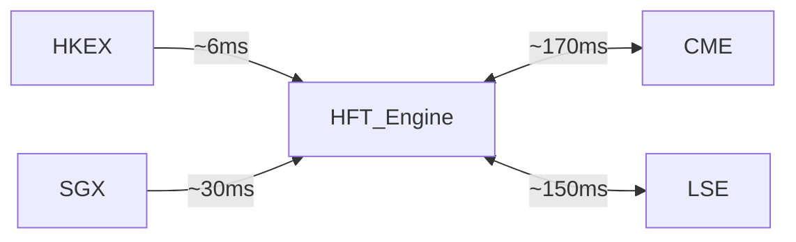

The Hong Kong Polytechnic University Dept. of Applied Mathematics

HFT Training Series

PART 2 OF 2

HFT Strategies — Legal vs. Illegal Analysis

# Cross-Venue Arbitrage & Order Flow Prediction

Advanced Quantitative Methods for High-Frequency Trading

Gary | Visiting Lecturer, PolyU Applied Mathematics

Master-Level Graduate Training

Part 2: Strategies 4 & 5

Strategy 4

Cross-Venue Arbitrage

Win Rate 70–85%

Strategy 5

Order Flow Prediction

Win Rate 52–58%

# PART 1

Already Covered

Now entering Part 2 →

# 01

Statistical Arbitrage (Pairs Trading)

Cointegration + mean-reversion

Win Rate: 55–65% | 5–50 bps

# 02

Volatility Arbitrage (Gamma Scalping)

Long options + delta-hedge

Win Rate: 50–60% | 10–100 bps

# 03

Liquidity Provision (Market Making)

Bid-ask spread capture

Win Rate: 60–75% | 0.5–5 bps

# Strategy 4: Cross-Venue Arbitrage (Latency Arbitrage)

Exploit price discrepancies across exchanges using a latency advantage — buy cheap on one venue, sell expensive on another before the spread closes.

Legal HFT Strategy

1–10 bps

Profit per Trade

70–85%

Win Rate

<1 μs

Latency Edge

# How It Works

Monitor multiple venues simultaneously (HK, US, Singapore)   
Detect price divergence in microseconds   
Execute buy/sell atomically before price corrects   
● Co-location at exchange data centers is essential

# Multi-Venue Architecture

flowchart

Key Firms: Virtu Financial Citadel Jump Trading

Latency Sensitivity: Critical (microsecond advantage)

Key Risk: Execution risk · Regulatory arbitrage closure

# Price Discrepancy

$$
\delta (t) = P _ {A} (t) - P _ {B} (t + \tau)
$$

: Price discrepancy at time t

: Asset price on Venue A at time t

$\textcircled { 2 } \textcircled { 2 } \textcircled { 6 } \textcircled { 7 }$ : Asset price on Venue B after latency τ

# Gross Arbitrage Profit

$$
\pi_ {g r o s s} = Q \cdot | \delta (t) | = Q \cdot | P _ {A} - P _ {B} |
$$

: Trade quantity (shares/contracts)

# Net Arbitrage Profit

$$
\pi_ {n e t} = Q \cdot (| \delta (t) | - c _ {A} - c _ {B} - s _ {A} - s _ {B})
$$

Execute only if $\bf { u } \equiv \bf { \frac { 1 } { 2 } } \bf { u } \bf { \Sigma }$

$\textcircled { 9 4 } \textcircled { 9 6 }$ Commission costs |   : Half-spread

# Model Derivation

1. Assume two venues trade identical asset X simultaneously   
2. In a frictionless market, Law of One Price: $\boxed { \frac { \mathbf { D } } { \mathbf { D } } } _ { \Delta } = \boxed { \frac { \mathbf { D } } { \mathbf { D } } } _ { \mathbf { D } }$   
3. With latency τ, information arrives at different times   
4. Discrepancy $\langle \mathbf { \vec { o } } ( \mathbf { \vec { \mu } } ) | \mathbf { \vec { \mu } } | \mathbf { \vec { \mu } } | \mathbf { \vec { \mu } } | \mathbf { \vec { \mu } } | \mathbf { \vec { \mu } }$ creates riskless profit window   
5. Window closes as arbitrageurs trade: δ(t) → 0

# No-Arbitrage Condition

$$
| P _ {A} (t) - P _ {B} (t) | \leq c _ {A} + c _ {B} + s _ {A} + s _ {B}
$$

If LHS > RHS → Profitable trade exists

<table><tr><td>Parameter</td><td>Typical Value</td><td>Description</td></tr><tr><td>τ (latency)</td><td>1–500 μs</td><td>Round-trip network delay</td></tr><tr><td>δ(t)</td><td>0.01–0.10%</td><td>Price discrepancy</td></tr><tr><td> $c_A + c_B$ </td><td>0.001–0.005%</td><td>Commission cost</td></tr><tr><td> $s_A + s_B$ </td><td>0.002–0.010%</td><td>Spread cost</td></tr><tr><td>Q</td><td>100–10,000</td><td>Optimal trade size</td></tr></table>

# Latency Model and Signal Decay Functions

# Total Latency Model

$$
\tau_ {t o t a l} = \tau_ {n e t w o r k} + \tau_ {p r o c e s s i n g} + \tau_ {e x e c u t i o n}
$$

: Physical signal propagation (speed of light limit)

: Order management system compute time

: Exchange matching engine delay

Typical: τ ≈ 1–500 μs for co-located systems total

# Signal Decay Function

$$
\delta (t) = \delta_ {0} \cdot e ^ {- \lambda t}
$$

₀ : Initial price discrepancy at t=0

: Decay rate (market correction speed)

λis empirically estimated fromL2 orderbook data

# Profitable Window Duration

$$
t ^ {*} = (1 / \lambda) \cdot l n (\delta_ {0} / C _ {t o t a l})
$$

Set δ(t\*) = C (total cost threshold)total

If τ < t\* , trade is profitable total

Typical: t\* ≈ 50–500 μs in liquid markets

Signal Decay: δ(t) = δo·e^(-λt)   

line

| Time (μs) | Price Discrepancy (bps) |
| --------- | ------------------------ |
| 0         | 10.0                     |
| 50        | 6.0                      |
| 100       | 3.7                      |
| 150       | 2.2                      |
| 200       | 1.4                      |
| 250       | 0.8                      |
| 300       | 0.5                      |
| 350       | 0.3                      |
| 400       | 0.2                      |
| 500       | 0.1                      |

# A 10μs latency advantage can mean the difference between profit and loss in liquid FX markets

Empirical: Virtu Financial co-location data

# Profit Calculation and Transaction Cost Analysis

# Complete Profit Model

$$
\pi = Q \cdot [ \delta (t) - (c _ {A} + c _ {B}) - (s _ {A} / 2 + s _ {B} / 2) - I _ {A} - I _ {B} ]
$$

: Market impact cost on each venue

: Commission (bps) |  : Half-spread

# Market Impact (Kyle 1985)

$$
I = \lambda_ {k y l e} \cdot Q / V
$$

: Price impact coefficient (Kyle's lambda)

: Order size |  : Average daily volume

Typical: λ ≈ 0.1–0.5 bps per 1% of ADV kyle

# Strategy Sharpe Ratio

$$
S R = (E [ \pi ] / \sigma_ {\pi}) \cdot \sqrt {N}
$$

: Expected profit per trade

$\textcircled { \bullet } \frac { \cdot } { \cdot }$ Std dev of profits |  : Trades/year

SR > 5 is achievable for top HFT firms

<table><tr><td>Cost Component</td><td>Range (bps)</td><td>Impact</td></tr><tr><td>Exchange commission</td><td>0.10 – 0.50</td><td>Fixed</td></tr><tr><td>Bid-ask spread (half)</td><td>0.20 – 1.00</td><td>Variable</td></tr><tr><td>Market impact</td><td>0.05 – 0.30</td><td>Size-dependent</td></tr><tr><td>Co-location fee</td><td>0.001 – 0.010</td><td>Fixed/amortized</td></tr><tr><td>Technology infra</td><td>0.001 – 0.005</td><td>Fixed/amortized</td></tr><tr><td>Total cost</td><td>0.35 – 1.85</td><td>Must be &lt; δ(t)</td></tr></table>

# Trade Viability Rule

Execute if: δ(t) > 1.85 bps AND τ < t\* total

HKEX-SGX BTC: δ = 4.2 bps, cost = 1.6 bps → Net profit = 2.6 bps ?

# Chart: Latency Distribution and Arbitrage Windows

Latency Distribution: Co-located vs Remote   

bar

| Round-trip Latency (μs) | Co-located HFT | Remote trader |
| ----------------------- | -------------- | ------------- |
| <1                      | 35             | 1             |
| 1–5                     | 30             | 3             |
| 5–10                    | 15             | 6             |
| 10–50                   | 12             | 15            |
| 50–100                  | 5              | 25            |
| 100–500                 | 2              | 35            |
| >500                    | 1              | 15            |

Profit Probability vs Window Duration   

line

| Arbitrage Window Duration (μs) | % Windows Still Profitable |
| ------------------------------ | ------------------------- |
| 0                              | 100                       |
| 20                             | 95                        |
| 40                             | 87                        |
| 60                             | 76                        |
| 80                             | 62                        |
| 100                            | 48                        |
| 120                            | 35                        |
| 140                            | 24                        |
| 160                            | 15                        |
| 180                            | 8                         |
| 200                            | 3                         |

Co-located HFT

35%

of HFT trades execute in <1μs (co-located)

> Profit Window

48%

profit probability at 100μs window

Cross-Venue

6ms

HKEX–SGX fiber latency (fastest route)

# Virtu Financial

Founded 2008, New York Legal – Market Leader

# Cross-Venue Liquidity Arbitrage

● Operates across 235+ markets in 35 countries   
● Only 1 losing trading day in 6 years (2008–2014)   
● Co-located at every major exchange data center   
● Fiber + microwave network for ultra-low latency

# Mechanics:

● Monitor identical ETFs/equities on NYSE, NASDAQ, BATS   
● Detect discrepancy ≥ 0.5 bps within 10μs   
Execute both legs within 50μs using FPGAs

\$1.2B

\$13T

\~99%

Revenue (2022) Annual volume  Days profitable

Speed +co-location + venue breadth =consistent profitability

# Jump Trading

Founded 1999, Chicago

Legal – Technology Pioneer

# Microwave Network Latency Arbitrage

● Built proprietary microwave towers: Chicago → New York   
● Reduced latency from 13ms (fiber) to 8.5ms (microwave)   
First microwave license for financial use (2012)   
● Extended network to transatlantic routes

# Mechanics:

● Receive CME price update 4.5ms before NYSE via microwave   
● Send order to NYSE before regular fiber traders   
● Capture riskless spread on S&P 500 futures vs ETF

4.5ms

CME-NYSE

\~\$500M+

Microwave advantage

Coverage corridor

Annual revenue (est.)

Infrastructure investment is thecompetitivemoat in latencyarb

# Step-by-Step Implementation: Cross-Venue Arbitrage

# Phase 1

# Infrastructure Setup

1.1 Secure co-location at target exchanges HKEX, SGX, CME, NYSE data centers   
1.2 Deploy FPGA-based order management Sub-μs order routing; VHDL-coded   
1.3 Establish direct market access (DMA) Bypass broker; exchange membership   
1.4 Configure low-latency data feeds ITCH/OUCH; HKEX OMD-C   
1.5 Benchmark round-trip latency Target: <50μs co-located

Setup cost: \$5M–\$50M

# Phase 2

# Signal Detection

2.1 Subscribe to L1/L2 order book Full depth for arb instruments   
2.2 Compute price discrepancy real-time δ(t) = P\_A(t) − P\_B(t) every 1μs   
2.3 Apply threshold filter Only if δ(t) > C\_total + buffer   
2.4 Estimate signal decay rate λ Rolling 30-day regression   
2.5 Validate: τ\_total < t\* Abort if latency exceeds window

\~500–5,000 signals/day

# Phase 3

# Execution & Risk Mgmt

3.1 Fire simultaneous orders Atomic: buy A, sell B at same instant   
3.2 Monitor partial fill risk If A fills but B does not → hedge   
3.3 Calculate realized profit π\_net = Q·(δ−c\_A−c\_B−I\_A−I\_B)   
3.4 Rolling P&L + drawdown limits Stop if daily loss > 0.5% NAV   
3.5 Log for regulatory compliance MiFID II / HKEX recordkeeping

200–2,000 arb trades/day

# Numerical Example: HKEX–SGX Equity Arbitrage

# Trade Scenario

Asset: Tencent (0700.HK) vs SGX ADR | Time: 09:31:42.000123 HKT

P\_HKEX: HKD 320.00

P\_SGX: HKD 320.42 equiv

δ = 10.0 bps

τ = 6.2ms | t\* ≈ 18ms

τ (6.2ms) < t\* (18ms) → PROCEED

Step 1 – Gross Profit: π = 10,000 × 0.32 = HKD 3,200 (10.0 bps)

Step 2 – Commission: c = 10,000 × 320 × 0.0005 = HKD 1,600

Step 3 – Half-spread: s = (0.10+0.08) × 10,000 = HKD 1,800

Step 4 – Market Impact: I = 0.0002 × 3,200,000 = HKD 640

Step 5 – Net: 3,200 − 1,600 − 1,800 − 640 = HKD −840 ✘

Signal too small at Q=10,000 after costs!

Revised: Q = 50,000 shares

16,000 − 4,000 − 9,000 − 1,600 = HKD 1,400 (+0.88 bps) ✓

P&L Breakdown by Trade Size   

bar

| Category       | Q=10,000 | Q=50,000 |
| -------------- | -------- | -------- |
| Gross Profit   | 3,000    | 16,000   |
| Commission     | -2,000   | -4,000   |
| Spread Cost    | -2,500   | -9,000   |
| Market Impact  | -1,500   | -2,000   |
| Net Profit     | -1,000   | 1,500    |

Trade size must exceed break-even threshold. For this scenario: Q ≥ 38,000 shares

Optimal Q balances profitability vs. market impact

# Key Risks

# Execution Risk

One leg fills, other does not → directional exposure. Mitigate with atomic execution or immediate hedge.

# Latency Creep

Network congestion extends τ beyond t\*. Monitor real-time latency with threshold alerts.

# Regulatory Arbitrage Closure

Exchanges can implement speed bumps (IEX) or rule changes that eliminate the window.

# Adverse Selection

Trading against informed flow — price moves against you postexecution. Model using VPIN.

# Regulatory Framework

# HKEX / SFC

AMS/3 Fair Access Rules

Co-location must be available to all members equally

# SEC (US)

Reg NMS (2005)

Best execution requirement limits some venue arbitrage

# MiFID II (EU)

Algo Trading RTS 6

Algo systems must have kill switches + latency logs

# Global – IOSCO Principles

Cross-border coordination — regulators share order data

# Compliance Checklist

Log all order timestamps (μs precision)

? Maintain cancellation rate < 95%

Document strategy rationale and risk controls

# Chart: Profit Decay vs Latency Advantage

Net Profit Decay as a Function of Latency   

line

| Total Latency τ (μs) | δ₀=10bps (large signal) | δ₀=5bps (small signal) |
| --------------------- | ------------------------ | ----------------------- |
| 0                     | 8.1                      | 3.2                     |
| 10                    | 7.3                      | 2.4                     |
| 20                    | 6.5                      | 1.6                     |
| 30                    | 5.9                      | 0.9                     |
| 40                    | 5.3                      | 0.3                     |
| 50                    | 4.7                      | -0.2                    |
| 60                    | 4.2                      | -0.8                    |
| 70                    | 3.8                      | -1.3                    |
| 80                    | 3.4                      | -1.7                    |
| 90                    | 3.1                      | -2.0                    |
| 100                   | 2.8                      | -2.3                    |
| 120                   | 2.2                      | -2.8                    |
| 150                   | 1.6                      | -3.5                    |
| 200                   | 1.0                      | -4.2                    |
| 300                   | 0.2                      | -5.0                    |
| 500                   | -0.8                     | -6.0                    |

At τ=50μs: δ=10bps yields

+4.72 bps net profit — Still highly profitable

At τ=200μs: δ=10bps drops to

.91 bps — Latency kills returns

Small signals (δ=5bps)

Only profitable below τ=40μs — Co-location is mandatory

Recall:

$$
\pi_ {n e t} (\tau) = Q \cdot [ \delta_ {0} \cdot e ^ {- \lambda \tau} - C _ {t o t a l} ]
$$

# Strategy 4 Summary: Formulas and Key Takeaways

# Key Formulas

Price Discrepancy

$$
\delta (t) = P _ {A} (t) - P _ {B} (t + \tau)
$$

Signal Decay

$$
\delta (t) = \delta_ {0} \cdot e ^ {- \lambda t}
$$

Profit Window

$$
t ^ {*} = (1 / \lambda) \cdot l n (\delta_ {0} / C _ {t o t a l})
$$

Net Profit

$$
\pi_ {n e t} = Q \cdot [ \delta - c _ {A} - c _ {B} - s _ {A} / 2 - s _ {B} / 2 - I ]
$$

Market Impact

$$
I = \lambda_ {k y l e} \cdot Q / V
$$

Sharpe Ratio

$$
S R = (E [ \pi ] / \sigma_ {\pi}) \cdot \sqrt {N}
$$

No-Arb Condition

$$
\left| P _ {A} - P _ {B} \right| \leq c _ {A} + c _ {B} + s _ {A} + s _ {B}
$$

# Key Takeaways

Latency is everything — microseconds determine viability   
Co-location + FPGA are non-negotiable infrastructure   
Net profit only after all 4 cost components   
Win rate 70–85% — highest of all legal HFT strategies   
Regulatory transparency required across all venues

<table><tr><td>Metric</td><td>Value</td></tr><tr><td>Profitability</td><td>1–10 bps/trade</td></tr><tr><td>Win Rate</td><td>70–85%</td></tr><tr><td>Latency Requirement</td><td>&lt;1 μs (co-located)</td></tr><tr><td>Key Firms</td><td>Virtu, Citadel, Jump</td></tr><tr><td>Key Risk</td><td>Execution risk</td></tr></table>

# Strategy 5: Order Flow Prediction (Machine Learning)

Use ML models to predict the direction of the next market order from Level 2 order book features, trade intensity, and VPIN — then position ahead of expected flow.

Legal HFT Strategy

2–20 bps Profit per Trade

52–58% Win Rate

100–500ms Latency Window

# How It Works

Collect L2 order book data and tick-by-tick trade records   
● Engineer features: book imbalance, VPIN, trade intensity, momentum   
Train ML model (RF / LSTM / XGBoost) on historical data   
● Deploy real-time: predict order direction every 100–500ms   
Position ahead of predicted flow, exit after confirmation

# ML Pipeline Inputs

L2 Order Book

Trade Flow

VPIN

Price Momentum

Volume Profile

ML Model

Buy / Sell / Hold

Key Firms:

Citadel

Millennium

Optiver

Latency: High (100–500ms)

Key Risk: Model overfitting · Regime change · Data quality

# Feature Engineering and Data Pipeline

# 3-Stage Data Pipeline

# Raw Data Collection

● L2 order book snapshots (every 10ms)   
● Full tick-by-tick trade records   
● Time-and-sales data   
● Reference data (sector, index weights)

# Feature Engineering

● Book imbalance (OBI)   
● VPIN — Volume-synchronized PIN   
● Trade intensity (λ) & Price momentum   
● Queue depletion rate

# Label Generation

● Label = sign(mid-price change at horizon h)   
● Binary: +1 (up), −1 (down)   
Horizon h = 10ms, 100ms, 500ms   
● Train/test split: 70/15/15

# Order Book Imbalance (OBI)

$$
\begin{array}{l} O B I = (V _ {b i d} - V _ {a s k}) / (V _ {b i d} + V _ {a s k}) \\ \in [ - 1, + 1 ]; \text { positive } = \text { buy   pressure } \\ \end{array}
$$

# VPIN (Volume PIN)

$$
V P I N = \left| V _ {b u y} - V _ {s e l l} \right| / V _ {t o t a l}
$$

Easley et al. (2012); proxy for informed trading

# Trade Intensity (Hawkes Process)

$$
\lambda (t) = \mu + \Sigma \alpha \cdot e ^ {- \beta (t - t _ {i})}
$$

μ: baseline rate; α,β: excitement/decay params

# Price Momentum Feature

$$
M o m (k) = (P _ {t} - P _ {t - k}) / P _ {t - k}
$$

Multi-scale: k = 5, 10, 30, 100 ticks

# Binary Cross-Entropy Loss

$$
L (\theta) = - (1 / N) \cdot \Sigma_ {i} [ y _ {i} \log (\hat {y _ {i}}) + (1 - y _ {i}) \log (1 - \hat {y _ {i}}) ]
$$

ᵢ: True label (+1/0) | ᵢ: Predicted probability

# Gradient Descent Update

$$
\theta_ {t + 1} = \theta_ {t} - \eta \cdot \nabla_ {\theta} L (\theta_ {t})
$$

: Learning rate (0.001–0.01) |  : Gradient of loss

# Regularized Loss (L2 / Ridge)

$$
L _ {r e g} (\theta) = L (\theta) + (\lambda_ {r e g} / 2) \cdot | | \theta | | ^ {2}
$$

Preventsoverfitting on non-stationary financial time series

# Prediction Objective

$$
\hat {y} = P (\Delta P _ {t + h} > 0 \mid X _ {t}) = \sigma (f _ {\theta} (X _ {t}))
$$

: Horizon (10–500ms) | : Sigmoid activation

# Preventing Overfitting in HFT

● Walk-forward cross-validation (not random split)   
● Purging and embargoing training samples (López de Prado)   
● Dropout layers in LSTM (p = 0.2–0.3)   
● Feature selection via MDI (Mean Decrease Impurity)

# Model Selection: AIC / BIC

$$
A I C = 2 k - 2 \ln (\hat {L})
$$

$$
B I C = k \cdot \ln (N) - 2 \ln (\hat {L})
$$

k = number of parameters; lower is better

# Financial Sharpe of ML Strategy

$$
S R _ {M L} = (\mu_ {\text {return}} / \sigma_ {\text {return}}) \cdot \sqrt {2 5 2}
$$

Target SR > 2 for deployment; Elite firms achieve SR > 5

# ML Models: Random Forest, LSTM, Gradient Boosting

# Random Forest

Ensemble / Non-parametric

$$
\hat {y} = (1 / T) \cdot \Sigma_ {t} f _ {t} (X)
$$

✓ Handles non-linear interactions   
✓ Built-in feature importance   
✓ Fast inference (<1ms)

✗ Memory intensive

✗ No temporal dependencies

54–57% accuracy

Use: Feature selection + baseline

# LSTM

Deep Learning / Recurrent

$$
h _ {t} = L S T M (x _ {t}, h _ {t - 1}, c _ {t - 1})
$$

✓ Captures temporal patterns   
✓ Models regime changes   
✓ End-to-end learning

✗ Slow training

✗ Hyperparameter sensitive

55–58% accuracy

Use: Sequential order book data

# XGBoost

Gradient Boosted Trees

$$
F _ {m} (x) = F _ {m - 1} (x) + \eta \cdot h _ {m} (x)
$$

✓ SOTA on tabular data   
✓ Built-in regularization   
✓ Handles missing data

✗ Less suited to time-series

✗ Needs feature engineering

55–58% accuracy

Use: Production at Citadel, Millennium

Model Comparison Across Key Dimensions   

bar

| Metric | Random Forest | LSTM | XGBoost |
| :--- | :--- | :--- | :--- |
| Directional Accuracy (%) | 56 | 57 | 57 |
| Training Speed | 70 | 30 | 66 |
| Inference Speed | 95 | 61 | 90 |
| Interpretability | 80 | 20 | 60 |

# Feature Importance Analysis: What Drives Prediction?

Feature Importance - Random Forest MDl   

bar

| Category               | Mean Decrease Impurity (MDI) Score |
| ---------------------- | ---------------------------------- |
| Order Book Imbalance   | 0.28                               |
| VPIN                   | 0.21                               |
| Price Momentum (10T)   | 0.15                               |
| Trade Intensity (λ)    | 0.12                               |
| Queue Depletion        | 0.08                               |
| Momentum (30T)         | 0.06                               |
| Bid-Ask Spread         | 0.04                               |
| Volume Profile         | 0.03                               |
| Time of Day            | 0.02                               |
| Overnight Gap          | 0.01                               |

#1 Order Book Imbalance 28.0% Immediate buy/sell pressure from L2 book

#2 VPIN 21.0% Informed trading intensity proxy

#3 Price Momentum (10T) 15.0% Short-term directional signal

#4 Trade Intensity λ 12.0% Order arrival rate acceleration

Top 4 features explain 76% of model importance

# Citadel Securities

Founded 2002, Chicago

Legal – Market Leader

# ML-Driven Order Flow Intelligence

● Handles \~25% of all US equity volume   
● 400+ PhD-level quantitative researchers   
Multi-asset: equities, options, FX, fixed income

# ML Approach:

● Ensemble of 50+ models voted for final signal   
● Online learning: retrain every 4 hours   
● 300+ L2 and trade flow features   
● LSTM layers for intraday patterns

\$7.5B

SR > 5

\~57%

Revenue (2022)

Sharpe (est.)

Accuracy

Ensemble +online learning = robustness to regime change

# Millennium Mgmt

Founded 1989, New York

Legal – Multi-Strategy

# Alpha Signal Mining from Order Flow

● \$60B+ AUM across 265+ trading teams   
● Order flow prediction is one of 10+ alpha sources   
● Statistical significance: p < 0.001 required

# ML Approach:

● XGBoost as primary model   
● Walk-forward validation, 3-month embargo   
● Factor decay monitoring: t½ < 5 days → discard   
● Bayesian optimization for hyperparameters

\$60B+

15–20%

54–56%

AUM

Annual return

Win rate

Statistical rigor prevents over-reliance onany single model

# Step-by-Step Implementation: Order Flow Prediction

# Phase 1

# Data & Feature Engineering

1.1 Acquire tick-level L2 data Bloomberg B-PIPE; ≥2 years history   
1.2 Compute OBI every 10ms OBI = (V\_bid−V\_ask)/(V\_bid+V\_ask)   
1.3 Compute VPIN (50-bucket) Easley et al. (2012) methodology   
1.4 Engineer 20+ momentum features Multi-scale: 5, 10, 30, 100, 500 ticks   
1.5 Generate labels & split Purged walk-forward; no lookahead

Output: Feature matrix X (N×300+)

# Phase 2

# Model Training & Validation

2.1 Baseline with logistic regression Establish minimum benchmark (≥50%)   
2.2 Train RF + XGBoost Bayesian hyperparameter search; 5-fold CV   
2.3 Train LSTM on book snapshots Sequence=50 steps; dropout=0.2   
2.4 Ensemble: stack predictions Meta-learner: LR on model outputs   
2.5 Validate on 6-month OOS Target: accuracy >53%, SR>2

Output: Validated ensemble model

# Phase 3

# Live Deployment & Monitoring

3.1 Deploy to inference engine ONNX runtime; inference <5ms   
3.2 Connect to OMS Signal → order in <10ms pipeline   
3.3 Paper trade for 2 weeks Verify P&L matches backtest   
3.4 Monitor model drift daily PSI > 0.25 → retrain trigger   
3.5 Retrain on rolling 6-month Weekly scheduled retraining

Output: Live trading system

# Numerical Example: HKEX Tencent Order Flow Prediction

# Input Snapshot — t = 10:15:32.412 HKT

Asset: Tencent Holdings 0700.HK

OBI: +0.35

VPIN: 0.72

Momentum: +0.18%

λ: 142 trades/sec

Queue depletion: Ask depleting 1.8x faster

# Model Computation

Step 1: Normalize → Z-score each feature

OBI $\angle A = ( 1 8 0 ^ { \circ } ) = ( 0 . 0 0 2 ) / ( 0 . 1 0 1 ) = ( 1 4 0 ^ { \circ } )$

$\because \angle B = \angle C D C = ( \angle B + \angle C + \angle 2 \sqrt { 3 } ) \angle B D P = \angle B D C$

Step 2: XGBoost output: P(up) = σ(1.42) = 0.805

Step 3: LSTM output: P(up) = 0.783

Step 4: Ensemble: 0.5×0.805 + 0.5×0.783 = 0.794

Decision: 0.794 > 0.65 → BUY SIGNAL

# Trade Execution & Result

Entry: HKD 320.10

Size: 5,000 shares

Time: 10:15:32.415

Horizon: 500ms

Exit: HKD 320.74

Time: 10:15:32.897

# P&L Calculation

Gross: 5,000 × (320.74 − 320.10) = HKD 3,200

Commission: 1,600,500 × 0.0005 × 2 = HKD 1,601

Half-spread: 5,000 × 0.10 = HKD 500

# Net Profit: HKD 1,099

+0.069% = +6.9 bps

Predicted: +7.2 bps | Realized: +6.9 bps (96% accuracy)

Daily Extrapolation: 200 trades × HKD 1,099 = HKD 219,800/day

# Model Performance and Prediction Accuracy

Monthly Directional Accuracy   

line

| Month | XGBoost | LSTM  | Ensemble |
|-------|---------|-------|----------|
| Jan   | 55.2    | 54.1  | 55.8     |
| Feb   | 56.1    | 55.4  | 56.9     |
| Mar   | 54.8    | 53.9  | 55.4     |
| Apr   | 57.3    | 56.2  | 57.8     |
| May   | 56.8    | 55.7  | 57.2     |
| Jun   | 55.5    | 54.8  | 56.1     |
| Jul   | 58.1    | 57.3  | 58.5     |
| Aug   | 57.4    | 56.8  | 57.9     |
| Sep   | 55.9    | 55.1  | 56.4     |
| Oct   | 56.7    | 56.0  | 57.1     |
| Nov   | 57.2    | 56.4  | 57.7     |
| Dec   | 56.9    | 56.2  | 57.4     |

60-Day Rolling Sharpe Ratio   

line

| Month | Ensemble SR |
|-------|-------------|
| 1     | 2.1         |
| 2     | 2.8         |
| 3     | 1.9         |
| 4     | 3.4         |
| 5     | 3.1         |
| 6     | 2.5         |
| 7     | 4.2         |
| 8     | 3.8         |
| 9     | 2.7         |
| 10    | 3.3         |
| 11    | 3.6         |
| 12    | 3.5         |

Gary | Dept. of Applied Mathematics, PolyU

ROC Curve Comparison   

line

| False Positive Rate | XGBoost (AUC=0.61) | LSTM (AUC=0.59) |
| ------------------- | ------------------ | --------------- |
| 0.0                 | 0.0                | 0.0             |
| 0.05                | 0.08               | 0.07            |
| 0.1                 | 0.18               | 0.16            |
| 0.2                 | 0.38               | 0.35            |
| 0.3                 | 0.52               | 0.49            |
| 0.4                 | 0.63               | 0.61            |
| 0.5                 | 0.72               | 0.70            |
| 0.6                 | 0.80               | 0.78            |
| 0.7                 | 0.87               | 0.85            |
| 0.8                 | 0.92               | 0.91            |
| 0.9                 | 0.97               | 0.96            |
| 1.0                 | 1.00               | 1.00            |

<table><tr><td>Model</td><td>Accuracy</td><td>AUC</td><td>Annual SR</td><td>Avg Profit</td></tr><tr><td>XGBoost</td><td>56.8%</td><td>0.61</td><td>3.4</td><td>5.2 bps</td></tr><tr><td>LSTM</td><td>55.9%</td><td>0.59</td><td>2.9</td><td>4.8 bps</td></tr><tr><td>Ensemble</td><td>57.4%</td><td>0.63</td><td>3.7</td><td>5.6 bps</td></tr><tr><td>Baseline (LP)</td><td>51.2%</td><td>0.52</td><td>0.8</td><td>1.1 bps</td></tr></table>

Strategy 5: Model Performance

Shannon Entropy of Order Flow

$$
H (X) = - \Sigma p (x _ {i}) \cdot l o g _ {2} p (x _ {i})
$$

Measures randomness/unpredictability of order arrivals

Low H → predictable order flow → ML alpha exists

Mutual Information: Features vs Price

$$
I (X; Y) = H (Y) - H (Y | X)
$$

: Features (OBI, VPIN…) | : Future ΔP (+1/−1)

I(X;Y) > 0 → features carry signal about Y

Typical: I(OBI; ΔP) ≈ 0.08–0.15 bits

Adverse Selection (Glosten-Milgrom 1985)

P(buy |informed) > P(buy|uninformed)

$$
\Delta P = \lambda_ {k y l e} \cdot (Q _ {b u y} - Q _ {s e l l})
$$

Informed traders reveal private info through order flow

ML models approximate $2 \times 3 = 2 0$ from L2 data

# VPIN Derivation (Easley et al. 2012)

1. Divide trading day into N equal-volume buckets (V each)   
2. Classify each trade: buy $( 1 4 , 2 7 )$ or sell $( 1 1 ) \div 2 = 1 1 0$ via tick rule   
3. For each bucket i: $y _ { 1 } = \frac { 1 } { 2 } x _ { 2 } = 1 \sqrt { 2 } \times 2 \sqrt { 2 } = 1 \sqrt { 2 }$

$$
V P I N = (1 / N) \cdot \Sigma_ {i} \left| V _ {b u y, i} - V _ {s e l l, i} \right| / V
$$

VPIN ∈ [0,1]; >0.7 signals high informed trading

VPIN spiked to 0.9+ before 2010 Flash Crash

# ML Microstructure Connection

● OBI proxies Kyle's λ — informed order pressure   
● VPIN proxies PIN — probability of informed trading   
● ML learns non-linear combinations beyond linear models   
● Information asymmetry creates exploitable alpha

# Key Academic References

Easley et al. (2012)- VPIN as Flash Crash predictor. JOIM.

Glosten& Milgrom (1985)-Bid-ask spread theory. JFE.

Kyle (1985)-Continuous auctions and insider trading.Econometrica.

Brogaard et al. (2014) - HFT and price discovery. RFS.

# Strategy 5 Summary: Formulas and Key Takeaways

# Key Formulas

Order Book Imbalance

$$
O B I = (V _ {b i d} - V _ {a s k}) / (V _ {b i d} + V _ {a s k})
$$

VPIN

$$
V P I N = (1 / N) \cdot \Sigma \left| V _ {b u y} - V _ {s e l l} \right| / V
$$

Trade Intensity (Hawkes)

$$
\lambda (t) = \mu + \Sigma \alpha \cdot e ^ {- \beta (t - t _ {i})}
$$

Binary Cross-Entropy

$$
L (\theta) = - \Sigma [ y \log (\hat {y}) + (1 - y) \log (1 - \hat {y}) ]
$$

Prediction Output

$$
\hat {y} = P (\Delta P > 0 \mid X _ {t}) = \sigma (f _ {\theta} (X _ {t}))
$$

Shannon Entropy

$$
H (X) = - \Sigma p (x _ {i}) \cdot l o g _ {2} p (x _ {i})
$$

Mutual Information

$$
I (X; Y) = H (Y) - H (Y | X)
$$

Ensemble Prediction

$$
\hat {y} _ {e n s} = \Sigma w _ {k} \cdot \hat {y} _ {k}, \Sigma w _ {k} = 1
$$

# Key Takeaways

ML models extract signal from inherently noisy order flow   
OBI + VPIN explain 49% of feature importance   
Overfitting is the #1 risk — use walk-forward validation   
？ Models must retrain frequently — financial regimes shift   
Ensemble outperforms any single model consistently

<table><tr><td>Metric</td><td>Value</td></tr><tr><td>Profitability</td><td>2–20 bps/trade</td></tr><tr><td>Win Rate</td><td>52–58%</td></tr><tr><td>Latency</td><td>100–500ms</td></tr><tr><td>Key Firms</td><td>Citadel, Millennium, Optiver</td></tr><tr><td>Key Risk</td><td>Overfitting, regime change</td></tr></table>

Part 2 Final Summary: HFT Strategies — Complete Overview

<table><tr><td>Strategy</td><td>Profit/Trade</td><td>Win Rate</td><td>Latency Need</td><td>Key Firms</td><td>Key Risk</td></tr><tr><td>1. Statistical Arb</td><td>5–50 bps</td><td>55–65%</td><td>Medium</td><td>Renaissance, Citadel</td><td>Correlation breakdown</td></tr><tr><td>2. Volatility Arb</td><td>10–100 bps</td><td>50–60%</td><td>Very High</td><td>Jane Street, Optiver</td><td>Theta decay</td></tr><tr><td>3. Liquidity Provision</td><td>0.5–5 bps</td><td>60–75%</td><td>Critical</td><td>Virtu, Citadel Sec</td><td>Adverse selection</td></tr><tr><td>4. Cross-Venue Arb</td><td>1–10 bps</td><td>70–85%</td><td>Critical (&lt;1μs)</td><td>Virtu, Jump</td><td>Execution risk</td></tr><tr><td>5. Order Flow ML</td><td>2–20 bps</td><td>52–58%</td><td>High (100–500ms)</td><td>Citadel, Millennium</td><td>Overfitting</td></tr></table>

# Academic Insight

Legal HFT profits from genuine market inefficiencies. Illegal strategies create detectable patterns that regulators exploit.

# Technical Edge

Math + ML + Infrastructure. All three must be world-class. A weakness in any one component erodes the edge.

# Regulatory Reality

Compliance is not optional. Every order is logged. Every pattern is monitored. Trade transparently or not at all.

“The best HFTstrategy isone youcan defendto yourregulator,explain toyourrisk manager and prove toyourquan team"

— Gary, PolyU Department of Applied Mathematics

Thank you. Questions welcome.