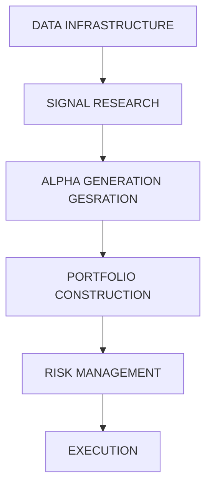

bar_line

| Date       | Open  | High  | Low   | Close | Volume |
| ---------- | ----- | ----- | ----- | ----- | ------ |
| 06/01/2023 | 10.00 | 12.38 | 9.00  | 11.57 | 14     |
| 06/02/2023 | 10.50 | 14.26 | 9.50  | 12.38 | 14     |
| 06/03/2023 | 11.00 | 16.17 | 10.00 | 13.57 | 14     |
| 06/04/2023 | 11.50 | 18.57 | 10.50 | 14.26 | 14     |
| 06/05/2023 | 12.00 | 20.57 | 11.00 | 15.77 | 14     |
| 06/06/2023 | 12.50 | 22.57 | 11.50 | 16.57 | 14     |
| 06/07/2023 | 13.00 | 24.57 | 12.00 | 17.37 | 14     |
| 06/08/2023 | 13.50 | 26.57 | 12.50 | 18.26 | 14     |
| 06/09/2023 | 14.00 | 28.57 | 13.00 | 19.15 | 14     |
| 06/10/2023 | 14.50 | 30.57 | 13.50 | 20.04 | 14     |
| 06/11/2023 | 15.00 | 32.57 | 14.00 | 20.93 | 14     |
| 06/12/2023 | 15.50 | 34.57 | 14.50 | 21.82 | 14     |
| 06/13/2023 | 16.00 | 36.57 | 15.00 | 22.71 | 14     |
| 06/14/2023 | 16.50 | 38.57 | 15.50 | 23.60 | 14     |
| 06/15/2023 | 17.00 | 40.57 | 16.00 | 24.49 | 14     |
| 06/16/2023 | 17.50 | 42.57 | 16.50 | 25.38 | 14     |
| 06/17/2023 | 18.00 | 44.57 | 17.00 | 26.27 | 14     |
| 06/18/2023 | 18.50 | 46.57 | 17.50 | 27.16 | 14     |
| 06/19/2023 | 19.00 | 48.57 | 18.00 | 28.05 | 14     |
| 06/20/2023 | 19.50 | 50.57 | 18.50 | 28.94 | 14     |
| 06/21/2023 | 20.00 | 52.57 | 19.00 | 29.83 | 14     |
| 06/22/2023 | 20.50 | 54.57 | 19.50 | 30.72 | 14     |
| 06/23/2023 | 21.00 | 56.57 | 20.00 | 31.61 | 14     |
| 06/24/2023 | 21.50 | 58.57 | 20.50 | 32.49 | 14     |
| 06/25/2023 | 22.00 | 60.57 | 21.00 | 33.38 | 14     |
| ...        | ...   | ...   | ...   | ...   | ...    |
| ...        | ...   | ...   | ...   | ...   | ...    |
| ...        | ...   | ...   | ...   | ...   | ...    |
| ...        | ...   | ...   | ...   | ...   | ...    |
| ...        | ...   | ...   | ...   | ...   | ...    |
| ...        | ...   | ...   | ...   | ...   | ...    |
| ...        (Bar Chart) - Series: 'Open', 'High', 'Low', 'Close' series; 'Volume' series; 'Current Price' series; 'Current Volume' series; 'Balance' series; 'Balance Indicator' series; 'Balance Indicator' series; 'Balance Indicator' series; 'Balance Indicator' series; 'Balance Indicator' series; 'Balance Indicator' series; 'Balance Indicator' series; 'Balance Indicator' series; 'Balance Indicator' series; 'Balance Indicator' series; 'Balance Indicator' series; 'Balance Indicator' series; 'Balance Indicator' series; 'Balance Indicator' series; 'Balance Indicator' series; 'Balance Indicator' series; 'Balance Indicator' series; and the chart contains multiple data points for each of the time series (e.g., 'Open', 'High', 'Low', 'Close' values, etc.). The values in the table are explicitly labeled on the chart.

# Quantitative Trading in Crypto Markets

A rigorous, math-first deep dive into market microstructure, alpha generation, risk management, and execution — from limit order books to Kelly sizing and beyond.

CALVIN TSAI

2026-03-31

# Course Roadmap

# Three Blocks. One Mission: Edge.

# Block 1: The Arena

Market microstructure, CLOBs, perpetual futures, and the structural mechanics of crypto markets

+=x

# Block 2: Alpha Generation

StatArb, pairs trading, cross-exchange arbitrage, ML on alternative data, and the math of extracting signal

# Block 3: Risk & Execution

Kelly criterion, fat tails, optimal execution, backtesting pitfalls, and real-world career pathways

text_image

Control room display with financial charts and stock tickers, including volume and technical indicators such as BTC/USD, ETH/USD, and C44H Change.

BLOCK 1 · THE ARENA

# Crypto Market Microstructure

Understanding the structural mechanics of crypto markets — the infrastructure, the incentives, and the inefficiencies that make this environment uniquely fertile for quantitative strategies.

# Block 1 · Part 1

# What Is a Quant?

# 1

# Data

Ingesting, cleaning, and structuring raw market data — tick data, order book snapshots, funding rates, on-chain flows — into usable signals.

#

# Portfolio Optimization

Combining signals across assets to maximize risk-adjusted returns, accounting for correlation structures and capacity constraints.

#

# Alpha Generation

Identifying statistically robust, forward-looking signals with a positive expected value after costs. The hardest part of the job.

# 4

# Execution

Translating portfolio decisions into trades while minimizing market impact, slippage, and adverse selection costs.

# Why Crypto Is a Unique Playground for Quants

# 24/7 Trading

No market close. No overnight gap risk in the traditional sense. Strategies must account for continuous, uninterrupted price discovery — and the human cost of monitoring it.

# Retail-Heavy Order Flow

A significant fraction of volume is uninformed retail flow, creating exploitable mispricings that would be competed away instantly in equities markets.

# Fragmented Liquidity

Liquidity is siloed across Binance, Bybit, OKX, Coinbase, Kraken, and hundreds of DEXs. This fragmentation creates persistent arbitrage opportunities unavailable in traditional markets.

# Non-Stationary, Fat-Tailed Data

High volatility, regime shifts, and leptokurtic return distributions render classical Gaussian models unreliable. This demands more sophisticated statistical tooling.

# CeFi vs. DeFi: Two Distinct Arenas

# CeFi — Centralized Finance

Custodial exchanges (Binance, OKX, Bybit) with traditional CLOB mechanics. Fast matching engines, known counterparties, regulatory exposure. Quants plug in via REST/WebSocket APIs and compete on latency and signal quality.

Centralized matching engine   
Taker/maker fee schedules   
Counterparty and custodial risk   
Low latency, high throughput

# DeFi — Decentralized Finance

On-chain protocols (Uniswap, dYdX, GMX) governed by smart contracts. No custodian risk, but execution is slow, MEV (Maximal Extractable Value) is pervasive, and gas costs are a real friction factor in strategy design.

AMM or on-chain CLOB mechanics   
MEV bots, frontrunning, sandwich attacks   
No custodial risk; smart contract risk instead   
Transparent, auditable order flow

# Block 1 · Part 2

# Centralized Limit Order Books (CLOBs)

The CLOB is the core primitive of organized markets. Every price discovery mechanism in CeFi ultimately reduces to agents submitting, canceling, and matching limit orders. Understanding its anatomy is prerequisite to everything else.

bar

BID
| BID | MID |
| :--- | :--- |
| 101.25 | 2.5K |
| 101.25 | 2.8K |
| 101.15 | 2.5K |
| 101.20 | 4.8K |
| 101.15 | 4.1K |
| 101.25 | 4.8K |
| 101.25 | 3K |
| 101.25 | 5I |
| 101.15 | 1.4K |
| 101.25 | 2.5K |
| 101.35 | 4.8K |
| 101.30 | 0K |
| 101.15 | 0K |
ASK
01.SO
3.1K
5.0M
2.9K
2.1K
2.1K
3.6K
3.3K
4.8K
7.3K
6.0K
3.1K
5.1K
5.0K
5.0K

# Anatomy of an Order Book

# Key Structural Elements

# Best Bid / Best Ask

The highest price a buyer will pay and the lowest price a seller will accept. The spread = Ask − Bid. This is the market maker's compensation for providing immediacy.

# Market Depth

The cumulative volume available at each price level. Shallow books are vulnerable to large market orders; deep books absorb flow without significant price impact.

# Tick Size

The minimum price increment. A finer tick size increases competition between limit orders; a coarser tick size increases the spread and market maker profitability.

# The Math Connection: LOB Modeling

Stochastic LOB models (e.g., Cont, Stoikov & Talreja, 2010) treat order arrivals as Poisson processes. Let λ+(p) and λ−(p) be arrival rates of buy and sell limit orders at price level . The mid-price drift emerges from the imbalance of these flows:

Order Flow Imbalance (OFI): / . Empirically, OFI is one of the strongest short-horizon price predictors available at tick-level resolution.

# Taker vs. Maker Fees: Impact on Expected Value

# Maker (Limit Order)

Adds liquidity to the book. Exchanges rebate makers — typically −0.01% to −0.02% on major venues. The maker earns the spread receives a fee rebate, but faces adverse selection risk: informed flow picks off stale quotes.

# Taker (Market Order)

Removes liquidity. Pays a fee — typically 0.04% to 0.06%. The taker gets immediacy and certainty of fill but crosses the spread and pays fees, creating a negative EV baseline that must be overcome by signal strength.

□ Key Insight: For a taker strategy, your gross alpha must exceed the round-trip cost:      . At a 0.1% round-trip cost on a 30-minute signal, you need >0.1% expected return per trade just to break even. This is why execution efficiency is not optional.

text_image

Monochrome collage featuring a chain link, financial charts, and a document with text, alongside a large metallic chain symbol.

# Block 1 · Part 3

# Perpetual Futures ("Perps")

Perpetual futures are the dominant derivative instrument in crypto — accounting for the majority of total volume on major exchanges. Unlike traditional futures, they have no expiration date. This single design choice gives rise to an elegant and mathematically rich anchoring mechanism: the funding rate.

# How the Funding Rate Works

The funding rate is paid periodically (typically every 8 hours) between long and short position holders. When the perpetual trades at a premium to spot, longs pay shorts, incentivizing arbitrageurs to sell the perp and buy spot — compressing the basis back toward zero. When the perp trades at a discount, shorts pay longs, reversing the dynamic.

# The Math: Cash-and-Carry Arbitrage & Funding Rate Mean-Reversion

# Cash-and-Carry Arbitrage

The classic no-arbitrage condition for the perp basis:

Basis = Perp Price − Spot Price

At any point , if Basis > 0, the arbitrage is: Short Perp + Long Spot. Lock in the basis and collect positive funding. P&L = Funding collected − Borrowing/inventory costs.

In practice, this trade is capacity-constrained by exchange margin requirements, capital costs, and execution latency. The "free lunch" is far smaller than it appears.

# Funding Rate as OU Process

Quants model the funding rate as an Ornstein-Uhlenbeck meanreverting process:

dr(t) = κ(μ − r(t))dt + σ dW(t)

where κ = mean-reversion speed, μ = long-run mean funding rate, σ = volatility of the funding rate, W(t) = standard Brownian motion.

A high κ implies fast reversion — short-duration trades. Fitting κ from historical 8-hour funding windows across BTC-PERP gives empirical half-lives often in the range of 1–3 days.

text_image

Black-and-white photo of a computer lab with multiple monitors displaying mathematical formulas and graphs, including equations and time-series plots.

BLOCK 2 · ALPHA GENERATION

# The Math of Making Money

Alpha is a statistical anomaly with positive expected value after costs. Finding it requires rigor, creativity, and a deep skepticism of results that look too good. This block builds the analytical toolkit from the ground up.

# Block 2 · Part 1

# Statistical Arbitrage & Pairs Trading

# The Intuition

Two assets with shared fundamental drivers (e.g., BTC and ETH, or BTC Spot and BTC Perp) should not diverge arbitrarily. When their relative price deviates from equilibrium, a mean-reversion trade bets on convergence.

# Correlation vs. Co-integration

Correlation measures but is non-stationary. Co-integration (Engle-Granger, 1987) tests whether a linear combination of two I(1) price series is stationary — a far stronger and more tradeable condition.

# Spread = OU Process

If co-integration holds, the spread follows a mean-reverting process suitable for systematic entry/exit rule design.

# The Ornstein-Uhlenbeck Model for the Spread

# The SDE

dS(t) = κ(μ − S(t))dt + σ dW(t)

κ — speed of mean reversion

μ — long-run equilibrium spread

σ — spread volatility

W(t) — Wiener process

Estimate parameters via maximum likelihood estimation (MLE) on discretized residuals from the co-integrating regression. The ADF test confirms stationarity of .

# Half-Life of Mean Reversion

The half-life — the expected time for the spread to revert halfway to its mean — is a critical strategy design parameter:

□ $\scriptstyle { \mathfrak { W } } = { \mathfrak { W } } \left( { \mathfrak { P } } \right) =$

Short half-life (hours): High-frequency stat-arb; execution costs dominate   
Medium half-life (1–5 days): The sweet spot for most crypto statarb strategies   
Long half-life (weeks): Fundamental carry / basis trades

Typical entry/exit rules: Enter when $\vert E ( 0 ) - ( m ) \vert = \vert m ( 0 ) \vert$ exit at mean.

Common:   .

# Block 2 · Part 2

# Cross-Exchange Arbitrage & Network Graph Theory

Crypto liquidity is fragmented across dozens of venues. The same asset — BTC/USDT — can trade at materially different prices on Binance, Bybit, and OKX simultaneously. Speed, capital efficiency, and graph-theoretic modeling determine who captures this alpha.

natural_image

Abstract network diagram with interconnected nodes and lines on a dark background (no text or symbols)

# Triangular Arbitrage as a Graph Problem

# The Graph Formulation

Represent each currency (BTC, ETH, USDT, SOL…) as a node and each exchange rate as a directed weighted edge. The weight of edge is . A negative-weight cycle in this graph represents a riskless arbitrage opportunity.

Bellman-Ford Algorithm detects negative cycles in time — essential for scanning all cross-rate paths simultaneously in real time.

# Practical Constraints That Erode Profit

# Execution Latency

Arb windows close in milliseconds. Co-location at exchange data centers is standard practice for professional desks.

# Capital Requirements

Simultaneous positions across multiple exchanges require pre-funded accounts capital sitting idle most of the time.

# Withdrawal Latency

On-chain settlement (minutes to hours) makes rebalancing across venues a serious operational constraint.

# Machine Learning & Alternative Data

# Order Book Imbalance (ML)

Random Forests and gradient boosting models trained on multi-level LOB imbalance features have demonstrated short-horizon predictive power. Feature engineering — not model complexity — is the primary source of lift.

# Sequential Modeling (LSTMs)

LSTMs and Transformer architectures can capture temporal dependencies in tick data. But overfitting is endemic. Walkforward validation with realistic transaction costs is non-negotiable.

# NLP on Social Data

Twitter/X, Telegram, Reddit sentiment can generate short-term price signals — particularly for small/mid-cap tokens. But signal decay is measured in minutes, and data quality is extremely noisy.

⚠️ The Low Signal-to-Noise Warning: In financial ML, the Sharpe ratio of raw features is typically near zero. A model that appears to have a 0.6 IC (Information Coefficient) in-sample will almost certainly revert to near-zero out-of-sample. Treat every backtest result with extreme skepticism until proven live.

natural_image

Black chess pieces on a checkered board, including a knight and knight horse, with no visible text or symbols.

BLOCK 3 · RISK & EXECUTION

# Risk, Execution, and the Real World

A profitable signal is necessary but not sufficient. How you size it, hedge it, and execute it determines whether theoretical alpha survives contact with real markets. This block covers the hard-won lessons that separate professionals from practitioners.

# Portfolio Sizing & The Kelly Criterion

# The Core Insight

Kelly's (1956) result: to maximize the long-run geometric growth rate of wealth, size each bet as a fraction of capital equal to the expected edge divided by the odds. Having a positive-EV signal is only 20% of the job. Sizing the bet correctly is the other 80%.

Kelly Fraction: f\* = μ / σ²

In the continuous case:       , where μ is expected return, r is risk-free rate, and σ² is variance of returns.

# Why Quants Use Fractional Kelly

Full Kelly is theoretically optimal under  parameters. In practice, μ and σ² are estimated with noise — and the Kelly fraction is highly sensitive to these inputs.

Overestimate μ by 10%

Full Kelly can result in catastrophic drawdowns and even ruin.

Half-Kelly (f\*/2)

Achieves \~75% of the geometric growth rate of Full Kelly at roughly 25% of the variance. The asymmetry strongly favors Half-Kelly in practice.

Fractional Kelly

Generalization: use where reflects confidence in parameter estimates.

# Kelly Criterion: The Geometric Growth Trade-Off

# Full Kelly

Maximizes log-wealth growth. Theoretically optimal but requires perfect parameter estimation. Rarely used in full by professionals.

# Half-Kelly

\~75% of Full Kelly growth rate. \~25% of variance. The practitioner's default for strategies with uncertain parameter estimates.

# Overbetting Risk

Betting above Full Kelly expected geometric growth and asymptotically leads to ruin. The Kelly boundary is a cliff, not a gradient.

text_image

MARKET CRASHI
BROQUAN
BROQUAN
BROQUAN
BROQUAN
BROQUAN
BROQUAN
BROQUAN
BROQUAN
BROQUAN
BROQUAN
BROQUAN
BROQUAN
BROQUAN
BROQUAN
BROQUAN
BROQUAN
BROQUAN
BROQUAN
BROQUAN
BROQUAN
BROQUEN
BROQUEN
BROQUEN
BROQUEN
BROQUEN
BROQUEN
BROQUEN
BROQUEN
BROQUEN
BROQUEN
BROQUEN
BROQUEN
BROQUEN
BROQUEN
BROQUEN
BROQUEN
BROQUEN
BROQUEN
BROQUEN
BROQUEN
BROQUIN
BROQUIN
BROQUIN
BROQUIN
BROQUIN
BROQUIN
BROQUIN
BROQUIN
BROQUIN
BROQUIN
BROQUIN
BROQUIN
BROQUIN
BROQUIN
BROQUIN
BROQUIN
BROQUIN
BROQUIN
BROQUIN
BROQUIN
BROQUUN

# Block 3 · Part 2

# Risk Management & Fat Tails

Standard portfolio theory assumes normally distributed returns. Crypto returns are emphatically  normal — they exhibit heavy tails, volatility clustering, and sudden regime breaks that make Gaussian risk models not just imprecise, but actively dangerous.

# Beyond Gaussian: Heavy Tails in Crypto

# The Problem with Normal VaR

Standard VaR models assume returns follow  . For crypto, daily returns exhibit:

Excess kurtosis (often 5–20+), vs. 0 for normal   
Negative skew from crash asymmetry   
Volatility clustering (GARCH effects)   
Correlation breakdown during market stress

A 99% Normal VaR computed on calm-period data will massively underestimate the true 1-day loss in a stress event.

# Better Tools

# Conditional VaR (CVaR / Expected Shortfall)

. The average loss that the loss exceeds VaR. Coherent risk measure; preferred by regulators and practitioners alike.

# Extreme Value Theory (EVT)

Generalized Pareto Distribution (GPD) fitted to the tail exceedances provides far more accurate extreme quantile estimates than parametric Gaussian models.

# Power Laws

Crypto return tails often follow power laws . For BTC, tail index   , implying finite variance but infinite higher moments in some regimes.

# Normal VaR vs. CVaR: What You're Not Measuring

# Comparison of three risk measures for crypto: Standard VaR

· Assumes normality misses tail risk   
· Regulatory minimum   
· Underestimates black swan events

natural_image

Simple line drawing of a rocket on a launch pad (no text or symbols)

# Conditional VaR / Expected Shortfall

Average loss beyond VaR threshold   
. Coherent risk measure, better stress test behavior

natural_image

Line drawing of a hot air balloon with vertical ribs and a small bottle at the bottom (no text or symbols)

# Extreme Value Th

Fitted to empirical most accurate for 99.9%+ quantiles

Requires large historical dataset

text_image

theory
tail,

# Block 3 · Part 3

# Execution & Market Impact

Large orders move the market against the trader — a phenomenon called market impact. For a signal that decays over time, there is a fundamental tension between executing slowly (to minimize impact) and executing quickly (to capture the signal before it decays). This is the Almgren-Chriss trade-off.

text_image

Black-and-white conceptual image of an iceberg with financial charts and stock tickers, overlaid on a digital interface showing candlestick patterns and data tables.

# The Almgren-Chriss Model for Optimal Execution

# The Framework

Almgren and Chriss (2001) formalize the optimal liquidation of a large position  over a time horizon . The trader chooses a trading trajectory  to minimize a cost function that balances two opposing forces:

Cost = Market Impact Cost + Market Risk Cost

$$
J = E [ \text { Impact } ] + \lambda \cdot \text { Var } [ \text { Cost } ]
$$

where λ is the trader's risk aversion parameter.

The optimal solution yields a TWAP-like schedule under riskneutrality, and front-loads execution as risk aversion increases.

# Key Intuitions

# Linear Temporary Impact

Temporary price impact is roughly linear in trade rate: . Doubling your trading rate doubles your instantaneous cost.

# 2 Permanent Impact Accumulates

Each trade permanently shifts the price. The order of execution matters — front-loading harms you on subsequent child orders.

# 3 The Efficient Frontier of Execution

There exists a Pareto frontier of execution strategies — faster execution has lower variance but higher cost. The optimal point is determined by λ.

text_image

Black-and-white photo of two men in suits observing a financial candlestick chart and bar charts on a glass wall, with visible price levels and volume data.

# Block 3 · Part 4

# The Pitfalls of Backtesting

Backtesting is the primary tool for strategy validation — and the primary mechanism by which intelligent mathematicians fool themselves. A strategy that looks brilliant in-sample and fails spectacularly out-of-sample is not a rare edge case. It is the default outcome.

# How Smart People Fool Themselves

# Look-Ahead Bias

Using data in the model that would not have been at the time of the trade. The most common source: using daily closing prices to generate signals that would require knowing the close in advance. Subtle forms: using index membership as of today, or filling at the mid rather than the spread.

# Survivorship Bias

Backtesting on the universe of assets excludes all the coins, tokens, and exchanges that have died. This biases returns dramatically upward. The graveyard of failed crypto projects dwarfs the survivors.

# Overfitting & Multiple Testing

If you test 100 parameter combinations, at least 5 will show p<0.05 by pure chance. The Bonferroni correction and False Discovery Rate (FDR) methods attempt to address this, but no statistical correction substitutes for out-of-sample testing on held-out data.

The Deflated Sharpe Ratio (López de Prado, 2014) corrects the observed in-sample Sharpe Ratio for the number of strategy variants tested, the length of the backtest, and the non-normality of returns — giving a probability that the observed Sharpe is genuine alpha rather than selection bias.

# Backtesting Red Flags: A Practical Checklist

# Sharpe Ratio > 3.0 In-Sample

Almost certainly overfitted unless the strategy is genuinely HFT with thousands of trades per day. Legitimate systematic strategies rarely show IS Sharpe above 2.5.

# No Walk-Forward Validation

The strategy has never been tested on truly unseen data. Rolling-window or anchored walk-forward testing is the minimum standard.

# No Transaction Cost Modeling

Any backtest without realistic taker fees, slippage, and market impact estimates is meaningless for strategies with high turnover.

# Unlimited Parameter Search

Strategy performance is highly sensitive to parameter choice, and the parameters were selected from a wide grid. This is numerical overfitting by another name.

# Block 3 · Part 5

# Career Advice: Breaking Into Crypto Quant

The top crypto quant firms — Wintermute, Jump Crypto, Jane Street, Radix, DRW Cumberland — hire a small number of exceptionally strong math, CS, and physics graduates each year. Here is what they are actually looking for.

text_image

Black-and-white photo of a man working at a desk with multiple computer monitors displaying financial charts and data tables, likely in an office or trading environment.

# What Crypto Quant Firms Look For

# Python & C++ Proficiency

Python for research, backtesting, and data pipelines. C++ for production execution systems where microseconds matter. The ability to go from model to deployed code without a handoff is highly valued at smaller shops.

# Independent Research

A documented research project — even unpublished — demonstrating original analysis of market data is a powerful differentiator. Show your hypothesis, your methodology, your results, and crucially, your out-ofsample validation.

# Probability Puzzles & Mental Math

Interviews at top quant firms are dominated by probability, combinatorics, and Bayesian reasoning questions. Expected value calculations, random walk problems, and conditional probability under time pressure are standard screening tools.

# Crypto-Native Intuition

Deep understanding of funding rate mechanics, DeFi protocol economics, MEV, and on-chain data sources distinguishes crypto-native candidates from TradFi transplants. This is learnable — but must be demonstrated.

# The Crypto Quant Landscape: Key Firms

# Wintermute

One of the largest crypto market makers globally. Operates across CeFi and DeFi. Known for algorithmic MM and proprietary trading. Strong emphasis on lowlatency systems engineering.

# Jump Crypto

Arm of Jump Trading. Deep HFT DNA, highly technical. Known for aggressive competition in both CeFi and on-chain MEV extraction. Research-oriented culture.

# Jane Street

Elite quantitative trading firm. Strong presence in crypto ETF arbitrage post-2024 ETF approvals. Renowned for rigorous interview process and exceptional compensation.

# DRW Cumberland

Institutional crypto desk of DRW. One of the earliest institutional market makers in crypto. Bridges TradFi rigor with crypto-native product expertise.

# The Full Quantitative Stack

flowchart

Each layer depends critically on the one below it. A world-class signal sitting on a broken data pipeline is worthless. Perfect execution of a negative-EV signal is still a loss. The stack must be strong end-to-end.

# Core Mathematical Toolkit: Quick Reference

<table><tr><td>Topic</td><td>Key Formula / Concept</td><td>Application in Crypto</td></tr><tr><td>Perpetual Funding</td><td>dr = κ(μ - r)dt + σdW</td><td>Cash-and-carry arb, basis mean-reversion</td></tr><tr><td>Co-integration</td><td>ADF test on S(t) = P1 - β·P2</td><td>Pairs trading BTC/ETH, Spot/Perp</td></tr><tr><td>OU Half-Life</td><td>t1⁄2 = ln(2) / κ</td><td>Trade duration and signal horizon selection</td></tr><tr><td>Bellman-Ford</td><td>Negative cycle in -log(rate) graph</td><td>Triangular / cross-exchange arbitrage</td></tr><tr><td>Kelly Criterion</td><td>f* = μ/σ2; use f*/2 in practice</td><td>Position sizing for all systematic strategies</td></tr><tr><td>Expected Shortfall</td><td>ES = E[L | L &gt; VaR_α]</td><td>Tail risk quantification, fund-level risk limits</td></tr><tr><td>Almgren-Chriss</td><td>J = E[Impact] + λ·Var[Cost]</td><td>Optimal execution scheduling for large orders</td></tr></table>

# Key Takeaways

# Microstructure Is the Foundation

Understanding CLOBs, taker/maker dynamics, and the funding rate mechanism is non-negotiable. You cannot build robust strategies on top of market mechanics you don't fully understand.

# 3 Sizing and Risk Are 80% of the Job

A positive-EV signal sized incorrectly will ruin you. Gaussian risk models in crypto are dangerous. CVaR, EVT, and fractional Kelly are not optional enhancements — they are table stakes for survival.

# 2 Alpha Is Rare and Decays

Co-integration-based StatArb and cross-exchange arb are real, but highly competed. The edge comes from faster execution, better data, or more sophisticated modeling — rarely from a novel idea alone.

# 4 Backtests Lie by Default

Look-ahead bias, survivorship bias, and the multiple testing problem make in-sample results nearly worthless. The only honest test is real capital at risk on truly unseen data.

# Q&A & Open Discussion

Thank you for your attention throughout all three blocks. We welcome questions on any topic covered today — from the mathematics of the OU process to the practicalities of on-boarding to a crypto quant desk. The most important skill in this field is intellectual honesty: knowing what you don't know.

# contact me:

email: calgotrading@gmail.com

Instagram: instagram.com/calvin\_tsai\_trading

X: x.com/calvintsaikm

Patreon: patreon.com/programtrading

FB: facebook.com/programtrading.hk

text_image

Key Ideas
Next Steps
Open Questioning
Next Steps

