# Trade with Price Action and AI Pattern Recognition

Bridging Classical Market Theory with Modern AI Tools

CHEUNG Yee Chung, PhD, DFinTech

6rd March 2026

POLYTECHNICUNIVERSITY

香港理工大學

This presentation is for educational purposes only and reflects my personal views. It does not constitute investment advice or a recommendation/solicitation to trade any financial instrument. AI/patternrecognition examples are illustrative; past performance does not guarantee future results. Trading involves significant risk, including loss of principal. You are solely responsible for your own investment decisions.

# Agenda

Fundamental vs. Technical Analysis   
Price Action Basics   
AI Pattern Recognition   
Summary & Q&A

Fundamental vs. Technical Analysis

# What is Trading?

# Definition

Trading is the act of buying and selling financial assets (stocks, futures, forex, crypto, etc.) with the goal of profiting from price movements.

# Core idea

Trading is essentially a decision about future price action.

# Trading vs. investing

• Trading focuses on short- to medium-term moves and execution (entry, stop-loss, take-profit, position sizing).   
• Investing focuses on long-term value and fundamentals

# Trading Workflow

Step 1: Define Objective - Clarify your goal and timeframe.

Step 2: Know the Instrument - Understand what drives its price and liquidity.

Step 3: Form Hypothesis - Identify why this specific trade has an edge.

Step 4: Set Rules - Predefine your entry, target, and invalidation points.

Step 5: Size Risk - Determine the maximum acceptable loss for the trade.

Step 6: Execute - Place the order cleanly without emotional hesitation.

Step 7: Manage Position - Monitor and adjust only according to your predefined rules.

Step 8: Exit and Evaluate - Close the trade and review your process to improve.

# What is Fundamental Analysis?

# Definition

A method to estimate an asset’s intrinsic value using real-world fundamentals.

# Focus

The “why” behind price—business/economic drivers rather than charts.

# Core idea

Market price can deviate from value in the short term but tends to converge toward fundamentals over time (timing uncertain).

# Goal

Decide if an asset is undervalued, fairly valued, or overvalued, and identify the key risks.

# Principles of Fundamental Analysis

# Intrinsic value matters

Fundamental analysis is about estimating an asset’s intrinsic value and comparing it to the current market price.

# Fundamentals drive long-term returns

Over longer horizons, returns are anchored by cash flows/earnings growth, risk, and valuation—even if prices are noisy in the short run.

# Margin of safety

Because intrinsic value is an estimate (with uncertainty), you want a buffer between price and value to reduce downside from errors and surprises.

# Assumptions in Fundamental Analysis

# Intrinsic value exists and can be estimated

An asset has an underlying economic value driven by fundamentals (cash flows, assets/liabilities, competitive position). Analysts can approximate this value with models and informed assumptions.

# Price converges toward value over time

Market prices may deviate from intrinsic value in the short run due to sentiment, liquidity, constraints, or noise, but over longer horizons prices tend to move toward fundamentals as information is realized.

# Fundamentals drive long-term outcomes in repeatable ways

Economic and business drivers (growth, margins, reinvestment, leverage, rates, cycles) influence value through relatively stable causal mechanisms that can be tracked, updated, and tested over time.

# What Do You Look At in Fundamental Analysis?

# Macro

Growth, inflation, interest rates, policy, currency, economic cycles.

# Industry

Supply/demand, competitive structure, regulation, disruption.

# Company/Asset

Business model, moat, management quality, financial health (revenue, margins, cash flow, leverage), growth durability.

# Valuation & scenarios

Build a range of outcomes and ask, “What must be true for today’s price to make sense?”

# What Do You Look At in Technical Analysis?

# Trend & structure

Higher highs/lows, lower highs/lows, support/resistance, breakouts.

# Momentum & mean reversion

Strength/weakness and potential turning points.

# Volume & liquidity

Confirmation, participation, and risk of slippage.

# Volatility & risk

Ranges, stop placement logic, position sizing implications.

Timeframes: Align signals across multiple horizons (e.g., daily for trend, intraday for execution).

# Principles of Technical Analysis

# Market discounts everything

The current price of a security already reflects all available information—such as economic factors, company fundamentals, and investor sentiment.

# Trends and countertrends

Asset prices typically move in sustained directions (trends), such as upward or downward, but also periodically experience shorter movements in the opposite direction (countertrends).

# Repetitive price movements

The market prices often form patterns that recur over time. This repetition is driven by consistent investor behavior and psychology

# Assumptions in Technical Analysis

# Prices reflect all known information

The current market price of an asset already incorporates all publicly available information, including economic data, company fundamentals, and investor expectations.

# Trends tend to persist

Once the price of an asset begins moving in a certain direction (upward or downward), it is more likely to continue moving in that same direction rather than reverse.

# Human behavior repeats

The investors tend to respond similarly under similar circumstances, driven by emotions such as fear and greed. This recurring behavior creates recognizable and repeating price patterns.

Price Action Basics

# Traders Need to Know the Recent Prices

Latest market consensus - The most recent price is where buyers and sellers just agreed—capturing the newest supply/demand, sentiment, and news.

Fair value check - Traders compare the recent price to their target/valuation to decide if a trade is attractive now.

Trend & momentum signal - Recent moves (higher highs/lower lows, pullbacks) help confirm whether to trade with or against the trend.

Risk management anchor - Stop-loss, take-profit, position size, and risk–reward are calculated from the current/recent price.

Execution & cost impact - Recent price relates to bid–ask spread, slippage, and fill probability—affecting real trading outcomes.

Avoid stale decisions - Without the latest price, traders may enter at the wrong level, increasing risk or missing opportunities.

# Candle Chart is the Most Common

Dot on close chart: only one trade every 5 minutes Ignoresall others   

scatter

| x | y |
|---|---|
| 0.0 | 0.0 |
| 0.1 | 0.1 |
| 0.2 | 0.2 |
| 0.3 | 0.3 |
| 0.4 | 0.4 |
| 0.5 | 0.5 |
| 0.6 | 0.6 |
| 0.7 | 0.7 |
| 0.8 | 0.8 |
| 0.9 | 0.9 |
| 1.0 | 1.0 |

Price at 12:55 pm

Barchart:Everybaris5minutes,and showsall trades 5 minute blocks (bars)   

line

| Time | Value |
|------|-------|
| 0    | 1     |
| 1    | 2     |
| 2    | 3     |
| 3    | 4     |
| 4    | 5     |
| 5    | 6     |
| 6    | 7     |
| 7    | 8     |
| 8    | 9     |
| 9    | 10    |
| 10   | 11    |
| 11   | 12    |
| 12   | 13    |
| 13   | 14    |
| 14   | 15    |
| 15   | 16    |
| 16   | 17    |
| 17   | 18    |
| 18   | 19    |
| 19   | 20    |
| 20   | 21    |
| 21   | 22    |
| 22   | 23    |
| 23   | 24    |
| 24   | 25    |
| 25   | 26    |
| 26   | 27    |
| 27   | 28    |
| 28   | 29    |
| 29   | 30    |
| 30   | 31    |
| 31   | 32    |
| 32   | 33    |
| 33   | 34    |
| 34   | 35    |
| 35   | 36    |
| 36   | 37    |
| 37   | 38    |
| 38   | 39    |
| 39   | 40    |
| 40   | 41    |
| 41   | 42    |
| 42   | 43    |
| 43   | 44    |
| 44   | 45    |
| 45   | 46    |
| 46   | 47    |
| 47   | 48    |
| 48   | 49    |
| 49   | 50    |
| 50   | 51    |
| 51   | 52    |
| 52   | 53    |
| 53   | 54    |
| 54   | 55    |
| 55   | 56    |
| 56   | 57    |
| 57   | 58    |
| 58   | 59    |
| 59   | 60    |
| 60   | 61    |
| 61   | 62    |
| 62   | 63    |
| 63   | 64    |
| 64   | 65    |
| 65   | 66    |
| 66   | 67    |
| 67   | 68    |
| 68   | 69    |
| 69   | 70    |
| 70   | 71    |
| 71   | 72    |
| 72   | 73    |
| 73   | 74    |
| 74   | 75    |
| 75   | 76    |
| 76   | 77    |
| 77   | 78    |
| 78   | 79    |
| 79   | 80    |
| 80   | 81    |
| 81   | 82    |
| 82   | 83    |
| 83   | 84    |
| 84   | 85    |
| 85   | 86    |
| 86   | 87    |
| 87   | 88    |
| 88   | 89    |
| 89   | 90    |
| 90   | 91    |
| 91   | 92    |
| 92   | 93    |
| 93   | 94    |
| 94   | 95    |
| 95   | 96    |
| 96   | 97    |
| 97   | 98    |
| 98   | 99    |
| 99   | -     |
| +      | -     |
| -      | -     |

Shows open, high,low,and close of 5 min

Line chart:dot chart with dots connected   

line

| Point | Value |
|-------|-------|
| 1     | 0.5   |
| 2     | 0.3   |
| 3     | 0.7   |
| 4     | 0.4   |
| 5     | 0.6   |
| 6     | 0.8   |
| 7     | 0.5   |
| 8     | 0.9   |
| 9     | 0.6   |
| 10    | 0.7   |
| 11    | 0.8   |
| 12    | 0.9   |
| 13    | 0.7   |
| 14    | 0.6   |
| 15    | 0.8   |
| 16    | 0.9   |
| 17    | 0.7   |
| 18    | 0.6   |
| 19    | 0.8   |
| 20    | 0.9   |
| 21    | 0.7   |
| 22    | 0.6   |
| 23    | 0.8   |
| 24    | 0.9   |
| 25    | 0.7   |
| 26    | 0.6   |
| 27    | 0.8   |
| 28    | 0.9   |
| 29    | 0.7   |
| 30    | 0.6   |
| 31    | 0.8   |
| 32    | 0.9   |
| 33    | 0.7   |
| 34    | 0.6   |
| 35    | 0.8   |
| 36    | 0.9   |
| 37    | 0.7   |
| 38    | 0.6   |
| 39    | 0.8   |
| 40    | 0.9   |
| 41    | 0.7   |
| 42    | 0.6   |
| 43    | 0.8   |
| 44    | 0.9   |
| 45    | 0.7   |
| 46    | 0.6   |
| 47    | 0.8   |
| 48    | 0.9   |
| 49    | 0.7   |
| 50    | 0.6   |
| 51    | 0.8   |
| 52    | 0.9   |
| 53    | 0.7   |
| 54    | 0.6   |
| 55    | 0.8   |
| 56    | 0.9   |
| 57    | 0.7   |
| 58    | 0.6   |
| 59    | 0.8   |
| 60    | 0.9   |
| 61    | 0.7   |
| 62    | 0.6   |
| 63    | 0.8   |
| 64    | 0.9   |
| 65    | 0.7   |
| 66    | 0.6   |
| 67    | 0.8   |
| 68    | 0.9   |
| 69    | 0.7   |
| 70    | 0.6   |
| 71    | 0.8   |
| 72    | 0.9   |
| 73    | 0.7   |
| 74    | 0.6   |
| 75    | 0.8   |
| 76    | 0.9   |
| 77    | 0.7   |
| 78    | 0.6   |
| 79    | 0.8   |
| 80    | 0.9   |
| 81    | 0.7   |
| 82    | 0.6   |
| 83    | 0.8   |
| 84    | 0.9   |
| 85    | 0.7   |
| 86    | 0.6   |
| 87    | 0.8   |
| 88    | 0.9   |
| 89    | 0.7   |
| 90    | 0.6   |
| 91    | 0.8   |
| 92    | 0.9   |
| 93    | 0.7   |
| 94    | 0.6   |
| 95    | 0.8   |
| 96    | 0.9   |
| 97    | 0.7   |
| 98    | 0.6   |
| 99    | 0.8   |
| Note: The data is extracted from the code and presented in CSV format as requested by the code.

Price at 12:55 pm

Candle chart:Every barshowsall tradeswithin5min   

candlestick

| Date       | Open   | High   | Low    | Close  |
| ---------- | ------ | ------ | ------ | ------ |
| 2023-01-01 | 45     | 50     | 40     | 48     |
| 2023-01-02 | 48     | 52     | 42     | 50     |
| 2023-01-03 | 50     | 55     | 45     | 52     |
| 2023-01-04 | 52     | 58     | 48     | 55     |
| 2023-01-05 | 55     | 60     | 50     | 58     |
| 2023-01-06 | 58     | 62     | 52     | 60     |
| 2023-01-07 | 60     | 65     | 55     | 62     |
| 2023-01-08 | 62     | 68     | 58     | 65     |
| 2023-01-09 | 65     | 70     | 60     | 68     |
| 2023-01-10 | 68     | 72     | 62     | 70     |
| 2023-01-11 | 70     | 75     | 65     | 72     |
| 2023-01-12 | 72     | 78     | 68     | 75     |
| 2023-01-13 | 75     | 80     | 70     | 78     |
| 2023-01-14 | 78     | 82     | 72     | 80     |
| 2023-01-15 | 80     | 85     | 75     | 82     |
| 2023-01-16 | 82     | 88     | 78     | 85     |
| 2023-01-17 | 85     | 90     | 80     | 88     |
| 2023-01-18 | 88     | 92     | 82     | 90     |
| 2023-01-19 | 90     | 95     | 85     | 92     |
| 2023-01-20 | 92     | 98     | 88     | 95     |
| 2023-01-21 | 95     | 100    | 90     | 98     |
| 2023-01-22 | 98     | 102    | 92     | 100    |
| 2023-01-23 | 100    | 105    | 95     | 102    |
| 2023-01-24 | 102    | 108    | 98     | 105    |
| 2023-01-25 | 105    | 110    | 100    | 108    |
| 2023-01-26 | 108    | 112    | 102    | 110    |
| 2023-01-27 | 110    | 115    | 105    | 112    |
| 2023-01-28 | 112    | 118    | 108    | 115    |
| 2023-01-29 | 115    | 120    | 110    | 118    |
| 2023-01-30 | 118    | 122    | 112    | 120    |
| 2023-01-31 | 120    | 125    | 115    | 122    |
| -            | -      | -      | -      | -      |
| -            | -      | -      | -      | -      |
| -            | -      | -      | -      | -      |
| -            | -      | -      | -      | -      |
| -            | -      | -      | -      | -      |
| -            | -      | -      | -      | -      |
| -            | -      | -      | -      | -      |
| -4/4/4/4/4/4/4/4/4/4/4/4/4/4/4/4/4/4/4/4/4/4/4/4/4/4/4/4/4/4/4/4/4/4/4/4/4/4/4/4/4/4/4/4/4/4/4/4/4/4/4 / (Note: this value is not explicitly labeled in the image). The chart displays candlestick patterns for each date from January to April. The legend indicates three candlestick types: “Pull trend bear”, “Don’t trend bear”, and “Not pulling down”.

Bull trend bar: close above open   
Bear trend bar: close below open

# The Most Common Chart: Candlesticks

# High information density

One candle shows Open, High, Low, Close (OHLC) for a time period

# Instant readability

Body color/direction makes trend and momentum easy to scan

# Shows volatility & rejection

Wicks reveal intraperiod extremes and pullbacks

# Pattern language is standardized

Doji, engulfing, hammer, etc. are widely taught and shared

# Works across timeframes

From 1-minute to weekly charts with the same visual logic

Open, High,Low,Close (OHC)   

text_image

Bullish Example (Bullish Candle)
HIGH
CLOSE
OPEN
LOW
Example A
Close > Open

Bearish Example (Bearish Candle)   

text_image

HIGH
OPEN
CLOSE
LOW
Close < Open
Example B

# What is Price Action?

• Any Representation of Price Movement   
• Every price move is ''Action‘’   
• Very often something that initially appears minor, leads to great trade   
''Noise'' implies random moves   
• Noise only exists in minds of ignorant traders, who simply do not understand what market is doing

Bulls who bought highest close are now disappointed by bear bar Got out breakeven   

candlestick

| Date       | Price Level |
| ---------- | ----------- |
| Early     | High        |
| Mid      | Medium      |
| Late     | Low         |
| Early     | Strong rally|
| Mid      | Strong rally|
| Late     | Strong rally|
| Early     | Bulls buying closes |
| Mid      | Bulls buying closes |
| Late     | Bulls buying closes |
| Early     | Bulls going up|
| Mid      | Bulls going up|
| Late     | Bulls going up|
| Early     | Sell for 2 legs down |

# Price Action Is Human Nature

• Price Action reflects human behavior under pressure   
• Our behavior is due to our genes   
• Human biases & incentives don’t change much   
• So similar situations create similar patterns   
• It has been same since markets began   
• Will remain same until we evolve into new species

natural_image

3D illustration of a DNA double helix structure with red and blue ribbons (no text or labels)

# Same Price Action, Every Market, Every Timeframe.

Which is the daily chart, the 5 min chart, and the 1 min chart?

Which is GE, the Emini, and the EURUSD Forex chart?

candlestick

| Time Point | Open | High | Low | Close |
| ---------- | ---- | ---- | --- | ----- |
| 1          | 10   | 12   | 8   | 9     |
| 2          | 9    | 11   | 7   | 8     |
| 3          | 8    | 10   | 6   | 7     |
| 4          | 7    | 9    | 5   | 6     |
| 5          | 6    | 8    | 4   | 5     |
| 6          | 5    | 7    | 3   | 4     |
| 7          | 4    | 6    | 2   | 3     |
| 8          | 3    | 5    | 1   | 2     |
| 9          | 2    | 4    | 0   | 1     |
| 10         | 1    | 3    | -1  | 0     |
| 11         | 0    | 2    | -2  | -1    |
| 12         | -1   | 1    | -3  | -2    |
| 13         | -2   | 0    | -4  | -3    |
| 14         | -3   | -1   | -5  | -4    |
| 15         | -4   | -2   | -6  | -5    |
| 16         | -5   | -3   | -7  | -6    |
| 17         | -6   | -4   | -8  | -7    |
| 18         | -7   | -5   | -9  | -8    |
| 19         | -8   | -6   | -10 | -9    |
| 20         | -9   | -7   | -11 | -10   |
| 21         | -10  | -8   | -12 | -11   |
| 22         | -11  | -9   | -13 | -12   |
| 23         | -12  | -10  | -14 | -13   |
| 24         | -13  | -11  | -15 | -14   |
| 25         | -14  | -12  | -16 | -15   |
| 26         | -15  | -13  | -17 | -16   |
| 27         | -16  | -14  | -18 | -17   |
| 28         | -17  | -15  | -19 | -18   |
| 29         | -18  | -16  | -20 | -19   |
| 30         | -19  | -17  | -21 | -20   |
| 31         | -20  | -18  | -22 | -21   |
| 32         | -21  | -19  | -23 | -22   |
| 33         | -22  | -20  | -24 | -23   |
| 34         | -23  | -21  | -25 | -24   |
| 35         | -24  | -22  | -26 | -25   |
| 36         | -25  | -23  | -27 | -26   |
| 37         | -26  | -24  | -28 | -27   |
| 38         | -27  | -25  | -29 | -28   |
| 39         | -28  | -26  | -30 | -29   |
| 40         | -29  | -27  | -31 | -30   |
| 41         | -30  | -28  | -32 | -31   |
| 42         | -31  | -29  | -33 | -32   |
| 43         | -32  | -30  | -34 | -33   |
| 44         | -33  | -31  | -35 | -34   |
| 45         | -34  | -32  | -36 | -35   |
| 46         | -35  | -33  | -37 | -36   |
| 47         | -36  | -34  | -38 | -37   |
| 48         | -37  | -35  | -39 | -38   |
| 49         | -38  | -36  | -40 | -39   |
| 50         | -39  | -37  | -41 | -40   |
| 51         | -40  | -38  | -42 | -41   |
| 52         | -41  | -39  | -43 | -42   |
| 53         | -42  | -40  | -44 | -43   |
| 54         | -43  | -41  | -45 | -44   |
| 55         | -44  | -42  | -46 | -45   |
| 56         | -45  | -43  | -47 | -46   |
| 57         | -46  | -44  | -48 | -47   |
| 58         | -47  | -45  | -49 | -48   |
| 59         | -48  | -46  | -50 | -49   |
| 60         | -49  | -47  | -51 | -50   |
| 61         | -50  | -48  | -52 | -51   |
| 62         | -51  | -49  | -53 | -52   |
| 63         | -52  | -50  | -54 | -53   |
| 64         | -53  | -51  | -55 | -54   |
| 65         | -54  | -52  | -56 | -55   |
| 66         | -55  | -53  | -57 | -56   |
| 67         | -56  | -54  | -58 | -57   |
| 68         | -57  | -55  | -59 | -58   |
| 69         | -58  | -56  | -60 | -59   |
| 70         | -59  | -57  | -61 | -60   |
| 71         | -60  | -58  | -62 | -61   |
| 72         | -61  | -59  | -63 | -62   |
| 73         | -62  | -60  | -64 | -63   |
| 74         | -63  | -61  | -65 | -64   |
| 75         | -64  | -62  | -66 | -65   |
| 76         | -65  | -63  | -67 | -66   |
| 77         | -66  | -64  | -68 | -67   |
| 78         | -67  | -65  | -69 | -68   |
| 79         | -68  | -66  | -70 | -69   |
| 80         | -69  | -67  | -71 | -70   |
| Note: The data is extracted from the code and displayed in the following example: 'High' and 'Low' values are all 'High' and 'Low' respectively. The box plot visualizes the distribution of these values across the timeline. The 'High' value is not explicitly labeled but corresponds to the position of the candlestick. The 'Low' value is not explicitly labeled or shown in the image. There is only one data series represented as candlesticks. The box plot does not have explicit x-axis labels but uses the box plot to display the distribution of these values. The y-axis is unlabeled but represents the same label for each candlestick. There is no label for the candlestick series. The box plot does not have explicit y-axis labels but uses the box plot to display the distribution of the candlestick series. The box plot does not have explicit x-axis labels but uses the box plot to display the distribution of the candlestick series. The box plot does not have explicit y-axis labels and uses the box plot to display the distribution of the candlestick series. The box plot does not have explicit z-axis labels and uses the box plot to display the distribution of the candlestick series. The box plot does not have explicit x-axis labels and uses the box plot to display the distribution of the candlestick series. The box plot does not have explicit y-axis labels and uses the box plot to display the distribution of the candlestick series. The box plot does not have explicit z-axis labels and uses the box plot to display the distribution of the candlestick series. The box plot does not have explicit x-axis labels and uses the box plot to display the distribution of the candlestick series. The box plot does not have explicit y-axis labels (x) and uses the box plot to display the distribution of the candlestick series. The box plot does not have explicit z-axis labels and uses the box plot to display the distribution of the candlestick series. The box plot does not have explicit x-axis labels and uses the box plot to display the distribution of the candlestick series. The box plot does not have explicit y-axis labels and uses the box plot to display the distribution of the candlestick series. The box plot does not have explicit z-axis labeling and uses the box plot to display the distribution of the candlestick series. The box plot does not have explicit x-axis labeling and uses the box plot to display the distribution of the candlestick series. The box plot does not have explicit y-axis labeling and uses the box plot to display the distribution of the candlestick series. The box plot does not have explicit z-axis labeling and uses the box plot to display the distribution of the candlestick series. The box plot does not have explicit x-axis labeling and uses the box plot to display the distribution of the candlestick series. The box plot does not have explicit y-axis labeling and uses the box plot to display the distribution of the candlestick series. The box plot does not have explicit z-axis labels and uses the box plot to display the distribution of the candlestick series. The box plot does not have explicit x-axis labeling and uses the box plot to display the distribution of the candlestick series. The box plot does not have explicit y-axis labeling and uses the box plot to display the distribution of the candlestick series. The box plot does not have explicit z-axis labeling and uses the box plot to display the distribution of the candlestick series. The box plot does not have explicit x-axis labels and uses the box plot to display the distribution of the candlestick series. The box plot does not have explicit y-axis labeling and uses the box plot to display the distribution of the candlestick series. The box plot does not have explicit z-axis labeling and uses the box plot to display the distribution of the candlestick series. The box plot does not have explicit x-axis labeling and uses the box plot to display the distribution of the candlestick series. The box plot does not have explicit y-axis labels and uses the box plot to display the distribution of the candlestick series. The box plot does not have explicit z-axis labels and uses the box plot to display the distribution of the candlestick series. The box plot does not have explicit x-axis labeling and uses the box plot to display the distribution of the candlestick series. The box plot does not have explicit y-axis labels and uses the box plot to display the distribution of the candlestick series. The box plot does not have explicit z-axis labels and uses the box plot to display the distribution of the candlestick series. The box plot does not have explicit x-axis labels and uses the box plot to display the distribution of the candlestick series. The box plot does not have explicit y-axis labeling and uses the box plot to display the distribution of the candlestick series. The box plot does not have explicit z-axis labeling and uses the box plot to display the distribution of the candlestick series. The box plot does not have explicit x-axis labels and uses the box plot to display the distribution of the candlestick series. The box plot does not have explicit y-axis labels and uses the box plot to display the distribution of the candlestick series. The box plot does not have explicit z-axis labels and uses the box plot to display the distribution of the candlestick series. The box plot does not have explicit x-axis labeling and uses the box plot to display the distribution of the candlestick series. The box plot does not have explicit y-axis labeling and uses the box plot to display the distribution of the candlestick series. The box plot does not have explicit z-axis labels and uses the box plot to display the distribution of the candlestick series. The box plot does not have explicit x-axis labels and uses the box plot to display the distribution of the candlestick series. The box plot does not have explicit y-axis labels and uses the box plot to display the distribution of the candlestick series. The box plot does not have explicit z-axis label and uses the box plot to display the distribution of the candlestick series. The box plot does not have explicit x-axis labels and uses the box plot to display the distribution of the candlestick series. The box plot does not have explicit y-axis labels and uses the box plot to display the distribution of the candlestick series. The box plot does not have explicit z-axis labels and uses the box plot to display the distribution of the candlestick series. The box plot does not have explicit x-axis label and uses the box plot to display the distribution of the candlestick series. The box plot does not have explicit y-axis label and uses the box plot to display the distribution of the candlestick series. The box plot does not have explicit z-axis label and uses the box plot to display the distribution of the candlestick series. The box plot does not have explicit x-axis label and uses the box plot to display the distribution of the candlestick series. The box plot does not have explicit y-axis label and uses the box plot to display the distribution of the candlestick series. The box plot does not have explicit z-axis label and uses the box plot to display the distribution of the candlestick series. The box plot does not have explicit x-axis labels and uses the box plot to display the distribution of the candlestick series. The box plot does not have explicit y-axis labels and uses the box plot to display the distribution of the candlestick series. The box plot does not have explicit z-axis label and uses the box plot to display the distribution of the candlestick series. The box plot does not have explicit x-axis label and uses the box plot to display the distribution of the candlestick series. The box plot does not have explicit y-axis label and uses the box plot to display the distribution of the candlestick series. The box plot does not have explicit z-axis labels and uses the box plot to display the distribution of the candlestick series. The box plot does not have explicit x-axis label and uses the box plot to display the distribution of the candlestick series. The box plot does not have explicit y-axis label and uses the box plot to display the distribution of the candlestick series. The box plot does not have explicit z-axis labels and uses the box plot to display the distribution of the candlestick series. The box plot does not have explicit x-axis labels and uses the box plot to display the distribution of the candlestick series. The box plot does not have explicit y-axis labels and uses the box plot to display the distribution of the candlestick series. The box plot does not have explicit z-axis annotations with markers at key points (e.g., 'High' at ~9, 'Low' at ~0) but marked with dots at key points (e.g., 'High' at ~9, 'Low' at ~0).

GE daily, 1987

candlestick

| Time Point | Open | High | Low | Close |
| ---------- | ---- | ---- | --- | ----- |
| 1          | 100  | 120  | 80  | 95    |
| 2          | 95   | 115  | 75  | 90    |
| 3          | 90   | 110  | 70  | 85    |
| 4          | 85   | 105  | 65  | 80    |
| 5          | 80   | 100  | 60  | 75    |
| 6          | 75   | 95   | 55  | 70    |
| 7          | 70   | 90   | 50  | 65    |
| 8          | 65   | 85   | 45  | 60    |
| 9          | 60   | 80   | 40  | 55    |
| 10         | 55   | 75   | 35  | 50    |
| 11         | 50   | 70   | 30  | 45    |
| 12         | 45   | 65   | 25  | 40    |
| 13         | 40   | 60   | 20  | 35    |
| 14         | 35   | 55   | 15  | 30    |
| 15         | 30   | 50   | 10  | 25    |
| 16         | 25   | 45   | 5   | 20    |
| 17         | 20   | 40   | -5  | 15    |
| 18         | 15   | 35   | -10 | 10    |
| 19         | 10   | 30   | -15 | -5    |
| 20         | -5   | 25   | -20 | -10   |
| 21         | -10  | 20   | -25 | -15   |
| 22         | -15  | 15   | -30 | -20   |
| 23         | -20  | 10   | -35 | -25   |
| 24         | -25  | -5   | -40 | -30   |
| 25         | -30  | -10  | -45 | -35   |
| 26         | -35  | -15  | -50 | -40   |
| 27         | -40  | -20  | -55 | -45   |
| 28         | -45  | -25  | -60 | -50   |
| 29         | -50  | -30  | -65 | -55   |
| 30         | -55  | -35  | -70 | -60   |
| ...        | ...  | ...  | ... | ...   |
| ...        | ...  | ...  | ... | ...   |
| ...        | ...  | ...  | ... | ...   |
| ...        | ...  | ...  | ... | ...   |
| ...        | ...  | ...  | ... | ...   |
| ...        | ...  | ...  | ... | ...   |
| ...        | ...  | ...  | ... | ...   |
| ...        | ...  |...  | ... | ...   |
| ...        | ...  | ...  | ... | ...   |
| ...        | ...  | ...  | ... | ...   |
| ...        | ...  | ...  | ... | ...   |
| ...        | ...  | ...  | ... | ...   |
| ...        | ...  | ...  | ... | ...   |
| ...        | ...  | ...  | ... | ...   |
| ... (Note: The values in the 'Open' column are not explicitly provided in the code.)

5 min Emini

  
1 min EURUSD

Impossible to know, because price action is same for all markets, and all timeframes

# Candlestick Patterns: Get Rich?

• Trading world is filled with websites, videos and books   
• Most teach candlestick patterns   
Message is clear: memorized 10 patterns and get rich!

text_image

Dark Cloud Cover
(乌云盖顶)
ShootingStar
(流星线)
Hammer
(锤子线)
Doji
(十字星)
Engulfing
(吞没形态)
MorningStar
(晨星)
Harami
(孕线)

# Candlestick patterns are no better than a coin flip — roughly 50% accurate.

Mobasheer, S. "Statistical Validity of the Bullish-Engulfing Candlestick in Large-Cap Indian Equities: Evidence from Five Nifty-50 Stocks." International Journal of Innovative Science and Research Technology 10, no. 6 (June 2025).

# Institutions Make a Lot of Money

• JP Morgans, Goldman Saches, HFT firms, and hedge funds make fortunes   
• Not using candlestick patterns to do so

natural_image

Interior of a busy stock exchange trading floor with traders at computer workstations and large display screens showing financial charts (no readable text or symbols)

JPMorgan

# Why Traders on CNBC not Talk About Candlestick Patterns?

• Top traders frequently share insights on their winning strategies   
• They focus on market trends, price channels, and key support/resistance   
• Do they ever mention selling because of a Dark Cloud Cover, Shooting Star, or Harami?   
Candlestick patterns are false Gods

text_image

Nasdaq
FAST MONEY
CNBC
TRADING CRACKS IN THE CONSUMER
STREAM CNBC+

# Price Action Traders do not relied on Indicators

A trading indicator is a mathematical calculation based on price and/or volume data (e.g., RSI, MACD) used to help identify trend, momentum, and potential buy/sell signals.

bar_line

| Time Point | Price Level | Moving Average (Blue) | Moving Average (Red) | Moving Average (Green) | Moving Average (Red) | Moving Average (Green) |
|------------|-------------|------------------------|-----------------------|-------------------------|-----------------------|-------------------------|
| 1          | 100         | 100                    | 100                   | 100                     | 100                   | 100                     |
| 2          | 95          | 98                     | 97                    | 96                      | 95                    | 94                      |
| 3          | 90          | 95                     | 94                    | 93                      | 92                    | 91                      |
| 4          | 85          | 92                     | 91                    | 90                      | 89                    | 88                      |
| 5          | 80          | 89                     | 88                    | 87                      | 86                    | 85                      |
| 6          | 75          | 86                     | 85                    | 84                      | 83                    | 82                      |
| 7          | 70          | 83                     | 82                    | 81                      | 80                    | 79                      |
| 8          | 65          | 80                     | 79                    | 78                      | 77                    | 76                      |
| 9          | 60          | 77                     | 76                    | 75                      | 74                    | 73                      |
| 10         | 55          | 74                     | 73                    | 72                      | 71                    | 70                      |
| 11         | 50          | 71                     | 70                    | 69                      | 68                    | 67                      |
| 12         | 45          | 68                     | 67                    | 66                      | 65                    | 64                      |
| 13         | 40          | 65                     | 64                    | 63                      | 62                    | 61                      |
| 14         | 35          | 62                     | 61                    | 60                      | 59                    | 58                      |
| 15         | 30          | 59                     | 58                    | 57                      | 56                    | 55                      |
| 16         | 25          | 56                     | 55                    | 54                      | 53                    | 52                      |
| 17         | 20          | 53                     | 52                    | 51                      | 50                    | 49                      |
| 18         | 15          | 50                     | 49                    | 48                      | 47                    | 46                      |
| 19         | 10          | 47                     | 46                    | 45                      | 44                    | 43                      |
| 20         | 5           | 44                     | 43                    | 42                      | 41                    | 39                      |
| ...        | ...         | ...                    | ...                   | ...                     | ...                   | ...                     |
| ...        | ...         | ...                    | ...                   | ...                     | ...                   | ...                     |
| ...        | ...         | ...                    | ...                   | ...                     | ...                   | ...                     |
| ...        | ...         | ...                    | ...                   | ...                     | ...                   | ...                     |
| ...        | ...         | ...                    | ...                   | ...                     | ...                   | ...                     |
| ...        | ...         | ...                    |...                   | ...                     | ...                   | ...                     |
| ...        | ...         | ...                    | ...                   | ...                     | ...                   | ...                     |
| ...        | ...         | ...                    | ...                   | ...                     | ...                   | ...                     |
| ...        | ...         | ...                    | ...                   | ...                     | ...                   | ...                     |
| ...        | ...         | ...                    | ...                   | ...                     | ...                   | ...                     |

# Indicators Are Based on Bars – Just Watch the Bars!

candlestick

| Point | Action | Price Level |
|-------|--------|-------------|
| 1     | Sell   | High        |
| 2     | Buy    | Low         |
| 3     | Sell   | Medium      |
| 4     | Buy    | Low         |
| 5     | Sell   | Medium      |
| 6     | Buy    | Low         |
| 7     | Sell   | High        |
| 8     | Buy    | Low         |
| 9     | Sell   | Medium      |
| 10    | Buy    | Low         |
| 11    | Sell   | High        |
| 12    | Buy    | Low         |
| 13    | Sell   | Medium      |
| 14    | Buy    | Low         |
| 15    | Sell   | High        |
| 16    | Buy    | Low         |
| 17    | Sell   | Medium      |
| 18    | Buy    | Low         |
| 19    | Sell   | High        |
| 20    | Buy    | Low         |
| 21    | Sell   | Medium      |
| 22    | Buy    | Low         |
| 23    | Sell   | High        |
| 24    | Buy    | Low         |
| 25    | Sell   | Medium      |
| 26    | Buy    | Low         |
| 27    | Sell   | High        |
| 28    | Buy    | Low         |
| 29    | Sell   | Medium      |
| 30    | Buy    | Low         |
| 31    | Sell   | High        |
| 32    | Buy    | Low         |
| 33    | Sell   | Medium      |
| 34    | Buy    | Low         |
| 35    | Sell   | High        |
| 36    | Buy    | Low         |
| 37    | Sell   | Medium      |
| 38    | Buy    | Low         |
| 39    | Sell   | High        |
| 40    | Buy    | Low         |
| 41    | Sell   | Medium      |
| 42    | Buy    | Low         |
| 43    | Sell   | High        |
| 44    | Buy    | Low         |
| 45    | Sell   | Medium      |
| 46    | Buy    | Low         |
| 47    | Sell   | High        |
| 48    | Buy    | Low         |
| 49    | Sell   | Medium      |
| 50    | Buy    | Low         |
| 51    | Sell   | High        |
| 52    | Buy    | Low         |
| 53    | Sell   | Medium      |
| 54    | Buy    | Low         |
| 55    | Sell   | High        |
| 56    | Buy    | Low         |
| 57    | Sell   | Medium      |
| 58    | Buy    | Low         |
| 59    | Sell   | High        |
| 60    | Buy    | Low         |
| 61    | Sell   | Medium      |
| 62    | Buy    | Low         |
| 63    | Sell   | High        |
| 64    | Buy    | Low         |
| 65    | Sell   | Medium      |
| 66    | Buy    | Low         |
| 67    | Sell   | High        |
| 68    | Buy    | Low         |
| 69    | Sell   | Medium      |
| 70    | Buy    | Low         |
| 71    | Sell   | High        |
| 72    | Buy    | Low         |
| 73    | Sell   | Medium      |
| 74    | Buy    | Low         |
| 75    | Sell   | High        |
| 76    | Buy    | Low         |
| 77    | Sell   | Medium      |
| 78    | Buy    | Low         |
| 79    | Sell   | High        |
| 80    | Buy    | Low         |
| 81    | Sell   | Medium      |
| 82    | Buy    | Low         |
| 83    | Sell   | High        |
| 84    | Buy    | Low         |
| 85    | Sell   | Medium      |
| 86    | Buy    | Low         |
| 87    | Sell   | High        |
| 88    | Buy    | Low         |
| 89    | Sell   | Medium      |
| 90    | Buy    | Low         |
| 91    | Sell   | High        |
| 92    | Buy    | Low         |
| 93    | Sell   | Medium      |
| 94    | Buy    | Low         |
| 95    | Sell   | High        |
| 96    | Buy    | Low         |
| 97    | Sell   | Medium      |
| 98    | Buy    | Low         |
| 99    | Sell   | High        |
| 100   | Buy    | Low         |
| 101   | Sell   | Medium      |
| 102   | Buy    | Low         |
| 103   | Sell   | High        |
| 104   | Buy    | Low         |
| 105   | Sell   | Medium      |
| 106   | Buy    | Low         |
| 107   | Sell   | High        |
| 108   | Buy    | Low         |
| 109   | Sell   | Medium      |
| 110   | Buy    | Low         |
| 111   | Sell   | High        |
| 112   | Buy    | Low         |
| 113   | Sell   | Medium      |
| 114   | Buy    | Low         |
| 115   | Sell   | High        |
| 116   | Buy    | Low         |
| 117   | Sell   | Medium      |
| 118   | Buy    | Low         |
| 119   | Sell   | High        |
| 120   | Buy    | Low         |
| 121   | Sell   | Medium      |
| 122   | Buy    | Low         |
| 123   | Sell   | High        |
| 124   | Buy    | Low         |
| 125   | Sell   | Medium      |
| 126   | Buy    | Low         |
| 127   | Sell   | High        |
| 128   | Buy    | Low         |
| 129   | Sell   | Medium      |
| 130   | Buy    | Low         |
| 131   | Sell   | High        |
| 132   | Buy    | Low         |
| 133   | Sell   | Medium      |
| 134   | Buy    | Low         |
| 135   | Sell   | High        |
| 136   | Buy    | Low         |
| 137   | Sell   | Medium      |
| 138   | Buy    | Low         |
| 139   | Sell   | High        |
| 140   | Buy    | Low         |
| 141   | Sell   | Medium      |
| 142   | Buy    | Low         |
| 143   | Sell   | High        |
| 144   | Buy    | Low         |
| 145   | Sell   | Medium      |
| 146   | Buy    | Low         |
| 147   | Sell   | High        |
| 148   | Buy    | Low         |
| 149   | Sell   | Medium      |
| 150   | Buy    | Low         |
| 151   | Sell   | High        |
| 152   | Buy    | Low         |
| 153   | Sell   | Medium      |
| 154   | Buy    | Low         |
| 155   | Sell   | High        |
| 156   | Buy    | Low         |
| 157   | Sell   | Medium      |
| 158   | Buy    | Low         |
| 159   | Sell   | High        |
| 160   | Buy    | Low         |
| 161   | Sell   | Medium      |
| 162   | Buy    | Low         |
| 163   | Sell   | High        |
| 164   | Buy    | Low         |
| 165   | Sell   | Medium      |
| 166   | Buy    | Low         |
| 167   | Sell   | High        |
| 168   | Buy    | Low         |
| 169   | Sell   | Medium      |
| 170   | Buy    | Low         |
| 171   | Sell   | High        |
| 172   | Buy    | Low         |
| 173   | Sell   | Medium      |
| 174   | Buy    | Low         |
| 175   | Sell   | High        |
| 176   | Buy    | Low         |
| 177   | Sell   | Medium      |
| 178   | Buy    | Low         |
| 179   | Sell   | High        |
| 180   | Buy    | Low         |
| 181   | Sell   | Medium      |
| 182   | Buy    | Low         |
| 183   | Sell   | High        |
| 184   | Buy    | Low         |
| 185   | Sell   | Medium      |
| 186   | Buy    | Low         |
| 187   | Sell   | High        |
| 188   | Buy    | Low         |
| 189   | Sell   | Medium      |
| 190   | Buy    | Low         |
| 191   | Sell   | High        |
| 192   | Buy    | Low         |
| 193   | Sell   | Medium      |
| 194   | Buy    | Low         |
| 195   | Sell   | High        |
| 196   | Buy    | Low         |
| 197   | Sell   | Medium      |
| 198   | Buy    | Low         |
| 199   | Sell   | High        |
| 200+ (end)                                     |

Note: The chart displays candlestick data points for each candlestick, with the horizontal lines indicating the level of the candlestick. The vertical line is labeled '50% PB' to indicate a threshold or target range. There are no additional data series in this view.

# Market Cycle

Market is always seeking fair price   
• Fair price results in maximum trading   
• Fundamental change constantly (news etc.)   
• Fair price changes constantly

candlestick

| Time Point | Price Level |
| ---------- | ----------- |
| Early Peak | High        |
| Mid Point  | Low         |
| Late Peak  | Very Low    |

# Trading Range

• Market constantly needs reassurance that price range is still correct   
• Constantly tried to break out but 80% fail   
• Buy low, sell high, scalp   
• Breakout failed implies price range is still fair

  
Buyers and sellers both agree that price is fair

# Always In

Market is in trend, tight channel, no pullback

Must enter, even if very small position

Easier to make money trading in Alway In direction

candlestick

| Date       | Open | High | Low  | Close |
| ---------- | ---- | ---- | ---- | ----- |
| 2023-01-01 | 15   | 20   | 10   | 18    |
| 2023-01-02 | 16   | 21   | 11   | 19    |
| 2023-01-03 | 17   | 22   | 12   | 20    |
| 2023-01-04 | 18   | 23   | 13   | 21    |
| 2023-01-05 | 19   | 24   | 14   | 22    |
| 2023-01-06 | 20   | 25   | 15   | 23    |
| 2023-01-07 | 21   | 26   | 16   | 24    |
| 2023-01-08 | 22   | 27   | 17   | 25    |
| 2023-01-09 | 23   | 28   | 18   | 26    |
| 2023-01-10 | 24   | 29   | 19   | 27    |
| 2023-01-11 | 25   | 30   | 20   | 28    |
| 2023-01-12 | 26   | 31   | 21   | 29    |
| 2023-01-13 | 27   | 32   | 22   | 30    |
| 2023-01-14 | 28   | 33   | 23   | 31    |
| 2023-01-15 | 29   | 34   | 24   | 32    |
| 2023-01-16 | 30   | 35   | 25   | 33    |
| 2023-01-17 | 31   | 36   | 26   | 34    |
| 2023-01-18 | 32   | 37   | 27   | 35    |
| 2023-01-19 | 33   | 38   | 28   | 36    |
| 2023-01-20 | 34   | 39   | 29   | 37    |
| 2023-01-21 | 35   | 40   | 30   | 38    |
| 2023-01-22 | 36   | 41   | 31   | 39    |
| 2023-01-23 | 37   | 42   | 32   | 40    |
| 2023-01-24 | 38   | 43   | 33   | 41    |
| 2023-01-25 | 39   | 44   | 34   | 42    |
| 2023-01-26 | 40   | 45   | 35   | 43    |
| 2023-01-27 | 41   | 46   | 36   | 44    |
| 2023-01-28 | 42   | 47   | 37   | 45    |
| 2023-01-29 | 43   | 48   | 38   | 46    |
| 2023-01-30 | 44   | 49   | 39   | 47    |
| 2023-01-31 | 45   | 50   | 40   | 48    |
| ...        | ...  ...| ...| ...| ...

Buy at market price Buy any bar closed

# Trend – Prices Move Mostly in One Direction

Move mostly in one direction

Bull trend - Higher Highs and Higher Lows

Buy pullback (HL)

80% of channel breakouts will fail

Trends will finally change

candlestick

| Level | Price |
|-------|-------|
| HH    | High  |
| HL    | Low   |

# Breakouts

One or more trend bars

Move beyond any support or resistance

80% of breakouts will fail, bet on breakout failure

Follow the breakout direction once confirmed

candlestick

| Level | Price |
|-------|-------|
| Low   | 100   |
| High  | 100   |

# Channels – All Markets Always in Channels

A channel has 2 lines, create a channel with a parallel

Draw lines to highlight, and understand what market is doing

Overshoot and undershoot are common

Usually do not see them until pattern is complete

70% Rule

candlestick

| Price Level | Label               |
| ----------- | ------------------- |
| Low         | Tight Bull Channel  |
| High        | Broad Bear Channel  |
| Price Test   | Prices test back to the upper channel in 70% of cases |

Prices test back to the upper channel in 70% of cases.

# Tight Channels and Micro Channels

Tight Channel has minimal space between the upper and lower lines

Micro Channel means no pullbacks

Trade only in the direction of the trend.

Short selling cannot make money

candlestick

| Time Point | Price Level |
| ---------- | ----------- |
| 1          | Low         |
| 2          | Medium      |
| 3          | High        |
| 4          | Medium-High|
| 5          | High        |
| 6          | High        |
| 7          | High        |
| 8          | High        |
| 9          | High        |
| 10         | High        |
| 11         | High (BO)   |

Every low at or above low of prior bar   

text_image

Start of MC
Low fell below prior low
End of
Low fe
prior l
(hard)

# Support and Resistance

Support is price below market where buyers might be stronger than sellers Resistance is price above market where sellers might be stronger than buyers

80% breakout will fail

Buy support, sell resistance

Bears keep selling around this price   
  
Buyers bought here   
Bulls bought again

# Measured Moves are Leg1 = Leg2

Small patterns “nested” within larger patterns

Take profits around MM targets

Can also scalp in opposite direction

candlestick

| Time Point | Open | High | Low | Close | Volume |
| ---------- | ---- | ---- | --- | ----- | ------ |
| 1          | 100  | 120  | 80  | 110   | 50     |
| 2          | 95   | 115  | 75  | 105   | 45     |
| 3          | 90   | 110  | 70  | 100   | 40     |
| 4          | 85   | 105  | 65  | 95    | 35     |
| 5          | 80   | 100  | 60  | 90    | 30     |
| 6          | 75   | 95   | 55  | 85    | 25     |
| 7          | 70   | 90   | 50  | 80    | 20     |
| 8          | 65   | 85   | 45  | 75    | 15     |
| 9          | 60   | 80   | 40  | 70    | 10     |
| 10         | 55   | 75   | 35  | 65    | 5      |
| 11         | 50   | 70   | 30  | 60    | 0      |
| 12         | 45   | 65   | 25  | 55    | -5     |
| 13         | 40   | 60   | 20  | 50    | -10    |
| 14         | 35   | 55   | 15  | 45    | -15    |
| 15         | 30   | 50   | 10  | 40    | -20    |
| 16         | 25   | 45   | -5  | 35    | -25    |
| 17         | 20   | 40   | -10 | 30    | -30    |
| 18         | 15   | 35   | -15 | 25    | -35    |
| 19         | 10   | 30   | -20 | 20    | -40    |
| 20         | -5   | 25   | -25 | -10   | -45    |
| 21         | -10  | 20   | -30 | -15   | -50    |
| 22         | -15  | -5   | -35 | -20   | -55    |
| 23         | -20  | -10  | -40 | -25   | -60    |
| 24         | -25  | -15  | -45 | -30   | -65    |
| 25         | -30  | -20  | -50 | -35   | -70    |
| 26         | -35  | -25  | -55 | -40   | -75    |
| 27         | -40  | -30  | -60 | -45   | -80    |
| 28         | -45  | -35  | -65 | -50   | -85    |
| 29         | -50  | -40  | -70 | -55   | -90    |
| 30         | -55  | -45  | -75 | -60   | -95    |
| ...        | ...    | ...    | ... | ...   | ...    |
| ...        | ...    | ...    | ... | ...   | ...    |
| ...        | ...    | ...    | ... | ...   | ...    |
| ...        | ...    | ...    | ... | ...   | ...    |
| ...        | ...    | ...    | ... | ...   | ...    |
| ...        | ...    | ...    | ... | ...   | ...    |
| ...        | ...    |...    | ... | ...   | ...    |
| ...        | ...    | ...    | ... | ...   | ...    |
| ...        | ...    | ...    | ... | ...   | ...    |
| ...        | ...    | ...    | ... | ...   | ...    |
| ...        | ...    | ...    | ... | ...   | ...    |
| ...        | ...    | ...    | ... | ...   | ...    |

| Note: The data is labeled as 'n also scalp in opposite direction' but not explicitly provided in the image. The box plot is created using candlesticks with color palette and labels. The legend is not present in the image. The box plot is used to create a candlestick chart with color-coded lines (red, orange, blue, green, purple) and labels for the x-axis positions. The y-axis values are estimated based on the current date and position.

text_image

Leg 1
Leg 2

Reversals are a Transition to opposite Price Action

Certain patterns help identify potential reversals.

Trade in the opposite direction.

80% Rule

candlestick

| Price Level | Annotation |
| ----------- | ---------- |
| Low Point   | Strong bull reversal from Wedge Bottom |
| High Point  | Traders expect higher prices Always In Long |

Strong bull reversal

from Wedge Bottom

Traders expect higher prices

Always In Long

Trends have many flags

Flags lead traders to suspect that is might be last flag in trend

May confirm with other patterns such as MM

After trend reverses, can look back to find Final Flag in trend

Trade in the opposite direction

candlestick

| Point | Value |
|-------|-------|
| 1     | Low   |
| 2     | Medium|
| 3     | High  |
| 4     | Mid   |
| 5     | Low   |
| 6     | High  |
| 7     | Low   |
| 8     | High  |
| 9     | Low   |
| 10    | High  |
| 11    | Low   |
| 12    | High  |
| 13    | Low   |
| 14    | High  |
| 15    | Low   |
| 16    | High  |
| 17    | Low   |
| 18    | High  |
| 19    | Low   |
| 20    | High  |
| 21    | Low   |
| 22    | High  |
| 23    | Low   |
| 24    | High  |
| 25    | Low   |
| 26    | High  |
| 27    | Low   |
| 28    | High  |
| 29    | Low   |
| 30    | High  |
| 31    | Low   |
| 32    | High  |
| 33    | Low   |
| 34    | High  |
| 35    | Low   |
| 36    | High  |
| 37    | Low   |
| 38    | High  |
| 39    | Low   |
| 40    | High  |
| 41    | Low   |
| 42    | High  |
| 43    | Low   |
| 44    | High  |
| 45    | Low   |
| 46    | High  |
| 47    | Low   |
| 48    | High  |
| 49    | Low   |
| 50    | High  |
| 51    | Low   |
| 52    | High  |
| 53    | Low   |
| 54    | High  |
| 55    | Low   |
| 56    | High  |
| 57    | Low   |
| 58    | High  |
| 59    | Low   |
| 60    | High  |
| 61    | Low   |
| 62    | High  |
| 63    | Low   |
| 64    | High  |
| 65    | Low   |
| 66    | High  |
| 67    | Low   |
| 68    | High  |
| 69    | Low   |
| 70    | High  |
| 71    | Low   |
| 72    | High  |
| 73    | Low   |
| 74    | High  |
| 75    | Low   |
| 76    | High  |
| 77    | Low   |
| 78    | High  |
| 79    | Low   |
| 80    | High  |
| 81    | Low   |
| 82    | High  |
| 83    | Low   |
| 84    | High  |
| 85    | Low   |
| 86    | High  |
| 87    | Low   |
| 88    | High  |
| 89    | Low   |
| 90    | High  |
| 91    | Low   |
| 92    | High  |
| 93    | Low   |
| 94    | High  |
| 95    | Low   |
| 96    | High  |
| 97    | Low   |
| 98    | High  |
| 99    | Low   |
| Note: The chart displays candlestick data points across the timeline, but the annotation 'Example: Final Bull Flag in before market reverses int' appears at the bottom left of the chart. There is no explicit numerical data provided in the code. The chart is labeled 'rection'.

Example: Final Bull Flag in bull trend before market reverses into bear trend

Wedge Top is Triangle that is sloped up or down

Shaped channel with convergent lines, usually 3 pushes

Can Be Flag or Major Trend Reversal

Trade in the opposite direction

candlestick

| Point | Value |
|-------|-------|
| 1     | ~1.0  |
| 2     | ~1.5  |
| 3     | ~2.0  |

Example: nested Wedges   
Small one inside bigger one

# Double Top and Double Bottom

DT and DB are two of most common patterns

Test of prior high or low, rarely perfect

Trade in opposite direction

bar

| Level | Price |
|-------|-------|
| DT    | 1.0   |
| DB    | 0.5   |
| DB    | 0.2   |
| DB    | 0.3   |
| DB    | 0.4   |
| DB    | 0.6   |
| DB    | 0.8   |
| DB    | 1.0   |

# Triangles

Any sideways move with 3 pushes up or down

Equal change of breakout up or down, therefore Breakout Mode

Trade in the breakout direction

bar

| Point | Value |
|-------|-------|
| 1     | Low   |
| 2     | High  |
| 3     | Mid   |
| 4     | Peak  |
| 5     | Final |

Reversal patterns

Trade in opposite direction

candlestick

| Point | Label             |
|-------|-------------------|
| 1     | Left Shoulder     |
| 2     | Head              |
| 3     | Right Shoulder    |

# Rounded Tops and Bottoms

Not important name

Always something else, like HSB, Wedge, PB etc.

Reversal pattern therefore trade in opposite direction

bar_line

| Point | Value |
|-------|-------|
| 1     | 100   |
| 2     | 85    |
| 3     | 70    |
| 4     | 60    |
| 5     | 50    |
| 6     | 40    |
| 7     | 30    |
| 8     | 20    |
| 9     | 10    |
| 10    | 5     |
| 11    | 15    |
| 12    | 25    |
| 13    | 35    |
| 14    | 45    |
| 15    | 55    |
| 16    | 65    |
| 17    | 75    |
| 18    | 85    |
| 19    | 95    |
| 20    | 105   |
| 21    | 115   |
| 22    | 125   |
| 23    | 135   |
| 24    | 145   |
| 25    | 155   |
| 26    | 165   |
| 27    | 175   |
| 28    | 185   |
| 29    | 195   |
| 30    | 205   |
| 31    | 215   |
| 32    | 225   |
| 33    | 235   |
| 34    | 245   |
| 35    | 255   |
| 36    | 265   |
| 37    | 275   |
| 38    | 285   |
| 39    | 295   |
| 40    | 305   |
| 41    | 315   |
| 42    | 325   |
| 43    | 335   |
| 44    | 345   |
| 45    | 355   |
| 46    | 365   |
| 47    | 375   |
| 48    | 385   |
| 49    | 395   |
| 50    | 405   |
| 51    | 415   |
| 52    | 425   |
| 53    | 435   |
| 54    | 445   |
| 55    | 455   |
| 56    | 465   |
| 57    | 475   |
| 58    | 485   |
| 59    | 495   |
| 60    | 505   |
| 61    | 515   |
| 62    | 525   |
| 63    | 535   |
| 64    | 545   |
| 65    | 555   |
| 66    | 565   |
| 67    | 575   |
| 68    | 585   |
| 69    | 595   |
| 70    | 605   |
| 71    | 615   |
| 72    | 625   |
| 73    | 635   |
| 74    | 645   |
| 75    | 655   |
| 76    | 665   |
| 77    | 675   |
| 78    | 685   |
| 79    | 695   |
| 80    | 705   |
| 81    | 715   |
| 82    | 725   |
| 83    | 735   |
| 84    | 745   |
| 85    | 755   |
| 86    | 765   |
| 87    | 775   |
| 88    | 785   |
| 89    | 795   |
| 90    | 805   |
| 91    | 815   |
| 92    | 825   |
| 93    | 835   |
| 94    | 845   |
| 95    | 855   |
| 96    | 865   |
| 97    | 875   |
| 98    | 885   |
| 99    | 895   |
| ...   | ...   |
| ...   | ...   |
| ...   | ...   |

Also call Climactic Reversal

Acceleration of a Move up or Move down

An early climax in a trend often reflects strong momentum and may lead to trend continuation.

A late climax in a trend is often a sign of reversal.

bar

| Time Point | Price Level |
| ---------- | ----------- |
| 1          | Low         |
| 2          | Medium      |
| 3          | High        |
| 4          | Low         |
| 5          | Medium      |
| 6          | High        |
| 7          | Low         |
| 8          | Medium      |
| 9          | High        |
| 10         | Low         |
| 11         | Medium      |
| 12         | High        |
| 13         | Low         |
| 14         | Medium      |
| 15         | High        |
| 16         | Low         |
| 17         | Medium      |
| 18         | High        |
| 19         | Low         |
| 20         | Medium      |
| 21         | High        |
| 22         | Low         |
| 23         | Medium      |
| 24         | High        |
| 25         | Low         |
| 26         | Medium      |
| 27         | High        |
| 28         | Low         |
| 29         | Medium      |
| 30         | High        |
| 31         | Low         |
| 32         | Medium      |
| 33         | High        |
| 34         | Low         |
| 35         | Medium      |
| 36         | High        |
| 37         | Low         |
| 38         | Medium      |
| 39         | High        |
| 40         | Low         |
| 41         | Medium      |
| 42         | High        |
| 43         | Low         |
| 44         | Medium      |
| 45         | High        |
| 46         | Low         |
| 47         | Medium      |
| 48         | High        |
| 49         | Low         |
| 50         | Medium      |
| 51         | High        |
| 52         | Low         |
| 53         | Medium      |
| 54         | High        |
| 55         | Low         |
| 56         | Medium      |
| 57         | High        |
| 58         | Low         |
| 59         | Medium      |
| 60         | High        |
| 61         | Low         |
| 62         | Medium      |
| 63         | High        |
| 64         | Low         |
| 65         | Medium      |
| 66         | High        |
| 67         | Low         |
| 68         | Medium      |
| 69         | High        |
| 70         | Low         |
| 71         | Medium      |
| 72         | High        |
| 73         | Low         |
| 74         | Medium      |
| 75         | High        |
| 76         | Low         |
| 77         | Medium      |
| 78         | High        |
| 79         | Low         |
| 80         | Medium      |
| 81         | High        |
| 82         | Low         |
| 83         | Medium      |
| 84         | High        |
| 85         | Low         |
| 86         | Medium      |
| 87         | High        |
| 88         | Low         |
| 89         | Medium      |
| 90         | High        |
| 91         | Low         |
| 92         | Medium      |
| 93         | High        |
| 94         | Low         |
| 95         | Medium      |
| 96         | High        |
| 97         | Low         |
| 98         | Medium      |
| 99         | High        |
| 100        | Low         |

# Trader’s Equation and Probability

Any pattern can fail, perfect trades cannot exist

Traders need an edge, which is mathematical advantage

3 variables: Probability, Reward, Risk

Only take a trade if

(Probability of win) x (Reward) > (Probability of loss) x (Risk)

Reward = your expected profit (from entry price to profit target)

Risk = your expected loss if your protective stop is hit (from entry price to your stop)

# Trader’s Equation and Probability

Early entries usually have smaller risk and greater reward (good RR), but lower probability of profit

Later entries often have more certainty (higher probability), but pay for it with a worse RR

candlestick

| Point | Open | High | Low | Close |
|-------|------|------|-----|-------|
| 1     | 0.8  | 0.9  | 0.7 | 0.8   |
| 2     | 0.7  | 0.8  | 0.6 | 0.7   |
| 3     | 0.6  | 0.7  | 0.5 | 0.6   |
| 4     | 0.5  | 0.6  | 0.4 | 0.5   |
| 5     | 0.4  | 0.5  | 0.3 | 0.4   |
| 6     | 0.3  | 0.4  | 0.2 | 0.3   |
| 7     | 0.2  | 0.3  | 0.1 | 0.2   |
| 8     | 0.1  | 0.2  | 0.0 | 0.1   |
| 9     | 0.0  | 0.1  | -0.1| 0.0   |
| 10    | -0.1 | 0.0  | -0.2| -0.1  |
| 11    | -0.2 | -0.1 | -0.3| -0.2  |
| 12    | -0.3 | -0.2 | -0.4| -0.3  |
| 13    | -0.4 | -0.3 | -0.5| -0.4  |
| 14    | -0.5 | -0.4 | -0.6| -0.5  |
| 15    | -0.6 | -0.5 | -0.7| -0.6  |
| 16    | -0.7 | -0.6 | -0.8| -0.7  |
| 17    | -0.8 | -0.7 | -0.9| -0.8  |
| 18    | -0.9 | -0.8 | -1.0| -0.9  |
| 19    | -1.0 | -0.9 | -1.1| -1.0  |
| 20    | -1.1 | -1.0 | -1.2| -1.1  |
| 21    | -1.2 | -1.1 | -1.3| -1.2  |
| 22    | -1.3 | -1.2 | -1.4| -1.3  |
| 23    | -1.4 | -1.3 | -1.5| -1.4  |
| 24    | -1.5 | -1.4 | -1.6| -1.5  |
| 25    | -1.6 | -1.5 | -1.7| -1.6  |
| 26    | -1.7 | -1.6 | -1.8| -1.7  |
| 27    | -1.8 | -1.7 | -1.9| -1.8  |
| 28    | -1.9 | -1.8 | -2.0| -1.9  |
| 29    | -2.0 | -1.9 | -2.1| -2.0  |
| 30    | -2.1 | -2.0 | -2.2| -2.1  |
| 31    | -2.2 | -2.1 | -2.3| -2.2  |
| 32    | -2.3 | -2.2 | -2.4| -2.3  |
| 33    | -2.4 | -2.3 | -2.5| -2.4  |
| 34    | -2.5 | -2.4 | -2.6| -2.5  |
| 35    | -2.6 | -2.5 | -2.7| -2.6  |
| 36    | -2.7 | -2.6 | -2.8| -2.7  |
| 37    | -2.8 | -2.7 | -2.9| -2.8  |
| 38    | -2.9 | -2.8 | -3.0| -2.9  |
| 39    | -3.0 | -2.9 | -3.1| -3.0  |
| 40    | -3.1 | -3.0 | -3.2| -3.1  |
| 41    | -3.2 | -3.1 | -3.3| -3.2  |
| 42    | -3.3 | -3.2 | -3.4| -3.3  |
| 43    | -3.4 | -3.3 | -3.5| -3.4  |
| 44    | -3.5 | -3.4 | -3.6| -3.5  |
| 45    | -3.6 | -3.5 | -3.7| -3.6  |
| 46    | -3.7 | -3.6 | -3.8| -3.7  |
| 47    | -3.8 | -3.7 | -3.9| -3.8  |
| 48    | -3.9 | -3.8 | -4.0| -3.9  |
| 49    | -4.0 | -3.9 | -4.1| -4.0  |
| 50    | -4.1 | -4.0 | -4.2| -4.1  |
| 51    | -4.2 | -4.1 | -4.3| -4.2  |
| 52    | -4.3 | -4.2 | -4.4| -4.3  |
| 53    | -4.4 | -4.3 | -4.5| -4.4  |
| 54    | -4.5 | -4.4 | -4.6| -4.5  |
| 55    | -4.6 | -4.5 | -4.7| -4.6  |
| 56    | -4.7 | -4.6 | -4.8| -4.7  |
| 57    | -4.8 | -4.7 | -4.9| -4.8  |
| 58    | -4.9 | -4.8 | -5.0| -4.9  |
| 59    | -5.0 | -4.9 | -5.1| -5.0  |
| 60    | -5.1 | -5.0 | -5.2| -5.1  |
| 61    | -5.2 | -5.1 | -5.3| -5.2  |
| 62    | -5.3 | -5.2 | -5.4| -5.3  |
| 63    | -5.4 | -5.3 | -5.5| -5.4  |
| 64    | -5.5 | -5.4 | -5.6| -5.5  |
| 65    | -5.6 | -5.5 | -5.7| -5.6  |
| 66    | -5.7 | -5.6 | -5.8| -5.7  |
| 67    | -5.8 | -5.7 | -5.9| -5.8  |
| 68    | -5.9 | -5.8 | -6.0| -5.9  |
| 69    | -6.0 | -5.9 | -6.1| -6.0  |
| 70    | -6.1 | -6.0 | -6.2| -6.1  |
| 71    | -6.2 | -6.1 | -6.3| -6.2  |
| 72    | -6.3 | -6.2 | -6.4| -6.3  |
| 73    | -6.4 | -6.3 | -6.5| -6.4  |
| 74    | -6.5 | -6.4 | -6.6| -6.5  |
| 75    | -6.6 | -6.5 | -6.7| -6.6  |
| 76    | -6.7 | -6.6 | -6.8| -6.7  |
| 77    | -6.8 | -6.7 | -6.9| -6.8  |
| 78    | -6.9 | -6.8 | -7.0| -6.9  |
| 79    | -7.0 | -6.9 | -7.1| -7.0  |
| 80    | -7.1 | -7.0 | -7.2| -7.1  |
| 81    | -7.2 | -7.1 | -7.3| -7.2  |
| 82    | -7.3 | -7.2 | -7.4| -7.3  |
| 83    | -7.4 | -7.3 | -7.5| -7.4  |
| 84    | -7.5 | -7.4 | -7.6| -7.5  |
| 85    | -7.6 | -7.5 | -7.7| -7.6  |
| 86    | -7.7 | -7.6 | -7.8| -7.7  |
| 87    | -7.8 | -7.7 | -7.9| -7.8  |
| 88    | -7.9 | -7.8 | -8 .0|-8 .0 |
| Note: Stop is indicated at the top of the chart (labeled 'Stop'). The chart displays candlestick data points for each candlestick position on the date axis.

# Stop protects you from yourself

Emotion affect decision-making

Without a stop placed in the market - not just in your head -

you will allow losses grow and grow, and grow

# Protective Stops

An example of a big loss caused by not using a protective stop.

bar

| Point | Value |
|-------|-------|
| 1     | High  |
| 2     | Low   |
| 3     | Medium|
| 4     | High  |
| 5     | Low   |
| 6     | Medium|
| 7     | High  |
| 8     | Low   |
| 9     | Medium|
| 10    | High  |
| 11    | Low   |
| 12    | Medium|
| 13    | High  |
| 14    | Low   |
| 15    | Medium|
| 16    | High  |
| 17    | Low   |
| 18    | Medium|
| 19    | High  |
| 20    | Low   |
| 21    | Medium|
| 22    | High  |
| 23    | Low   |
| 24    | Medium|
| 25    | High  |
| 26    | Low   |
| 27    | Medium|
| 28    | High  |
| 29    | Low   |
| 30    | Medium|
| 31    | High  |
| 32    | Low   |
| 33    | Medium|
| 34    | High  |
| 35    | Low   |
| 36    | Medium|
| 37    | High  |
| 38    | Low   |
| 39    | Medium|
| 40    | High  |
| 41    | Low   |
| 42    | Medium|
| 43    | High  |
| 44    | Low   |
| 45    | Medium|
| 46    | High  |
| 47    | Low   |
| 48    | Medium|
| 49    | High  |
| 50    | Low   |
| 51    | Medium|
| 52    | High  |
| 53    | Low   |
| 54    | Medium|
| 55    | High  |
| 56    | Low   |
| 57    | Medium|
| 58    | High  |
| 59    | Low   |
| 60    | Medium|
| 61    | High  |
| 62    | Low   |
| 63    | Medium|
| 64    | High  |
| 65    | Low   |
| 66    | Medium|
| 67    | High  |
| 68    | Low   |
| 69    | Medium|
| 70    | High  |
| 71    | Low   |
| 72    | Medium|
| 73    | High  |
| 74    | Low   |
| 75    | Medium|
| 76    | High  |
| 77    | Low   |
| 78    | Medium|
| 79    | High  |
| 80    | Low   |
| 81    | Medium|
| 82    | High  |
| 83    | Low   |
| 84    | Medium|
| 85    | High  |
| 86    | Low   |
| 87    | Medium|
| 88    | High  |
| 89    | Low   |
| 90    | Medium|
| 91    | High  |
| 92    | Low   |
| 93    | Medium|
| 94    | High  |
| 95    | Low   |
| 96    | Medium|
| 97    | High  |
| 98    | Low   |
| 99    | Medium|
| 100   | High  |

# Trade Management

Traders always take trades for a reason, with positive trader's equation

They have a goal (profit target)

They protect themselves, if the goal is not achieved (stop)

bar

| Point | Value |
|-------|-------|
| Start | Low   |
| Mid   | Rising |
| Peak  | High  |
| Close | Close |
| Strong reversal down, so change of plan |
| Exit with small loss, on close of consecutive big bear bars |
| Buy PB from BO of TR |
| Plan to take profits at Measured Move up | High  |

# Trade Management – Other People’s Money

OPM is one of the worst ideas in trading

Once in your account, it is your money

Always manage trades based on current price action

candlestick

| Point Type | Description                                      |
|------------|--------------------------------------------------|
| Start      | Initial stop (black candlesticks)                 |
| Mid        | Sell strong BO (red candlesticks)                  |
| End        | A strong buy signal, so must exist shorts          |

AI Pattern Recognition

# A Trader’s Desktop Setup

Wait for familiar patterns show up?

natural_image

Control room with multiple computer monitors displaying financial charts and data visualizations, no visible text or symbols on screens or surroundings.

# If AI can recognize patterns, 3 applications

# Three Key Applications of Pattern Recognition

1. Real-time monitoring of price charts with alerts when expected patterns appear   
2. Analysis of price history to classify patterns as continuations or reversals, and to forecast subsequent price movements   
3. Stock filtering to identify the most promising securities based on recognizable patterns, such as Measured Move

# Classic Patterns

Well-known patterns such as Wedge, Double Tops, and the Measured Move (MM), among others

# User-Specific Patterns

Trader-specific patterns that arise from individual experiments and the nuances of various financial products

Traditional programming struggles to model and capture these patterns, especially user-specific patterns.

# Computer Vision and Convolutional Neural Network

Convolution Neural Network (CNN)   

```mermaid
graph LR
    A["Input"] --> B["Kernel"]
    B --> C["Feature Maps"]
    C --> D["Convolution + ReLU"]
    D --> E["Pooling"]
    E --> F["Convolution + ReLU"]
    F --> G["Pooling"]
    G --> H["Convolution + ReLU"]
    H --> I["Flatten Layer"]
    I --> J["Fully Connected Layer"]
    J --> K["SoftMax Activation Function"]
    K --> L["Output"]
    style A fill:#f9f,stroke:#333
    style L fill:#bbf,stroke:#333
```

flowchart

Convolutional Neural Network Architecture

# Local feature learning

Convolutional kernels detect small, repeatable k-line motifs (e.g., single bars, short bar sequences) within candlestick images

# Hierarchical representation

From simple bar shapes to complex, multi-bar pattern aggregates that span several candles

# Flexible inputs

Grayscale candle images or multi-channel inputs (e.g., combining different time scales or volume proxies) can be stacked as channels

# Training Strategy & Practical Considerations

# Data preparation

Slice candlestick sequences into fixed-size images; label with pattern categories

Manually capture 2000 sample patterns per class

Here are MM down samples

# Training Strategy & Practical Considerations

# Normalization

Achieve consistent scale across samples to enable reliable comparison, clustering, and modeling. Candle shape patterns are normalized using I100 as the normalization algorithm.

# Training Strategy & Practical Considerations

# Data augmentation

We apply appearance-based augmentations (e.g., color jitter and brightness adjustment) and avoid geometric transforms that distort k-line semantics.

This constraint is naturally satisfied by most models, such as Cascade R-CNN.

line

| Date       | Price Level | Label |
| ---------- | ----------- | ----- |
| 28/29/26   | 536         | e9c51o41c2e_NQF_2Min |
| 28/29/26   | 536         | 536E751F4A6O_ESF_5Min |
| 28/29/26   | 536         | 2838o4eS126D_QF214Min |
| 28/29/26   | 536         | d1234D6E52DQFS201Min |
| 28/29/26   | 536         | 2838o4eS126D_QF214Min |
| 28/29/26   | 536         | d1234D6E52DQFS201Min |
| 28/29/26   | 536         | 2838e4eS126D_QF214Min |
| 28/29/26   | 536         | d1234D6E52DQFS201Min |
| 28/29/26   | 536         | 2838e4eS126D_QF214Min |
| 28/29/26   & 28/29/27 | 536         | d1234D6E52DQFS201Min |
| 28/29/27   | 536         | d1234D6E52DQFS214Min |
| 28/29/27   | 536         | d1234D6E52DQFS214Min |
| 28/29/27   | 536         | d1234D6E52DQFS214Min |
| 28/29/27   | 536         | d1234D6eS126D_QF214Min |
| 28/29/27   | 536         | d1234D6E52DQFS214Min |
| 28/29/27   | 536         | d1234D6E52DQFS214Min |
| 28/29/27   | 536         | d123d4eS126D_QF214Min |
| 28/29/27   | 536         | d1234d6E52DQFS214Min |
| 28/29/27   | 536         | d1234d6E52DQFS214Min |
| 28/29/27   | 536         | d1234d6E52DQFS214Min |
| 28/29/27   | 536         | d123d4eS1        |
| 28/29/27   | 536         | d123d4eS1        |
| 28/29/27   | 536         | d123d4eS1        |
| 28/29/27   | 536         | d123d4eS1        |
| 28/29/27   & 28/29/27| 536         | d1        |
| 28/29/27   & 28/29/27| 536         | d1        |
| 28/29/27   & 28/29/27| 536         | d1        |
| 28/29/27   & 28/29/27| 536         | d1        |
|
| 28/31/3    | 536         | d1        |
| 31/3       | 536         | d1        |
| 31/3       | 536         | d1        |
| 31/3       | 536         | d1        |
| 31/3       | 536         | d1        |
| 31/3       | 536         | d1        |
| 31/3       | 536         | d1       |
| 31/3       | 536         | d1       |
| 31/3       | 536         | d1       |
| 31/3       | 536         | d1       |
| 31/3       | 536         | d1       |
| 31/3       | 536         | d1       |
| 31/3       |

# Training Strategy & Practical Considerations

# Evaluation and Metrics

Data split:

70% training - Learn robust feature representations and baseline predictors

20% validation - Hyperparameter tuning and early stopping to prevent overfitting

10% test - Final, independent performance assessment

line

| Date       | RT_DN | L2_UP | BO_DN |
|------------|-------|-------|-------|
| 290146d63a81_NQF_3Min | -     | -     | -     |
| 290248d63a80_NQF_3Min | -     | -     | -     |
| 28622d26363x45s7202Min | -     | -     | -     |
| 202073d83854801N202_1Min | -     | -     | -     |
| 2949333fb3a1_NQF_1Min | -     | -     | -     |
| 202694B8C0490_202F_5Min | -     | -     | -     |
| 270846165723588F241Min | -     | -     | -     |
| 207X0483106800N202_5Min | -     | -     | -     |

# Supervised Learning

Learn a mapping from input → classic patterns with predefined label

Requires labeled training data

Model predicts specific classes

Typical tasks: classification

Example:

Identify chart patterns such as Head & Shoulders, Double Top, Double Bottom

# Metric Learning

Learn a similarity function between samples

Model learns an embedding space

Similar patterns are closer, different patterns are farther apart

Useful when patterns are user-defined or evolving

Example:

Find chart patterns similar to a user-selected reference pattern

# Realtime User-Defined Pattern History Match

3-Mar-2026

12：55AM

bar_line

| Time   | Price    | Volume |
|--------|----------|--------|
| 23:45  | ~24,600  | ~40,000|
| 05:45  | ~24,700  | ~6,000 |
| 11:45  | ~25,100  | ~16,000|
| 18:45  | ~24,900  | ~40,000|

# Search criteria

CME·NQ2603·15Min23bars扫描数量19109匹配数量19087去重之前数量11扫描耗时18秒推 2026-03-0315:53

Bars

PV bars

20

Precision threshold

√ EMA

□ Volume

□

Price axis

Indexed to 100

P1 

<table><tr><td>HH2</td><td>HL1</td><td>LH1</td><td>LL3</td><td>HH1</td><td>HL2</td><td>LH2</td><td>LL2</td></tr><tr><td></td><td>3</td><td></td><td>4</td><td></td><td>3</td><td></td><td>4</td></tr></table>

8-Dec-2025

bar_line

| Time | Price | Volume |
|------|-------|--------|
| 45   | ~25,770 | ~12K   |
| 15:45 | ~25,710 | ~40K   |
| 22:45 | ~25,680 | ~12K   |
| 04:45 | ~25,660 | ~40K   |

H:102.4253 L:102.0959 Trend:-1

bar_line

| Time   | Price    |
|--------|----------|
| 09:30  | 25,620.00 |
| 15:30  | 25,920.00 |
| 22:30  | 25,680.00 |
| 04:30  | 25,740.00 |

H:100.3697 L:99.6468 Trend:-1

12-Jan-2026

# Realtime User-Defined Pattern History Match

3-Mar-2026

12：55AM

bar_line

| Time   | Price    | Volume  |
|--------|----------|---------|
| 23:45  | ~24,600  | ~40,000 |
| 05:45  | ~24,700  | ~40,000 |
| 11:45  | ~25,100  | ~40,000 |
| 18:45  | ~24,900  | ~40,000 |

3-Mar-2026

4：15PM

bar_line

| Time   | Price    | Volume  |
|--------|----------|---------|
| 05:45  | ~24,600  | ~40,000 |
| 11:45  | ~25,100  | ~16,000 |
| 18:45  | ~24,900  | ~40,000 |
| 00:45  | ~24,700  | ~40,000 |

# Summary and Q&A

Two approaches to market analysis:

• Fundamental Analysis – Helps determine what to trade   
• Technical Analysis – Helps determine when to trade (buy or sell)

Price Action is one of the key skills in technical analysis.

Price patterns form a geometric language that describes market behavior and helps predict possible movements.

Nothing is 100% certain in the market.

Risk management is the key to surviving in the trading world.

AI is powerful in pattern recognition and supports decision making. Three application scenarios.

Convolutional Neural Networks (CNNs) are a core technology behind AI-based pattern recognition.

Supervised learning for classical pattern recognition.

Metric learning / self-supervised learning for user-defined pattern recognition.

# References

Brooks, A. (2000). Reading Price Charts Bar by Bar. Al Brooks Trading.   
Brooks, A. (2012). Trading Price Action Trading Ranging Markets. Wiley.   
Brooks, A. (2019). Price Action Trading: Essential Concepts for Traders. Al Brooks Publishing.

Thank you for your time.

text_image

QR code with WeChat logo embedded in the center, likely for scanning to access a service or app.

