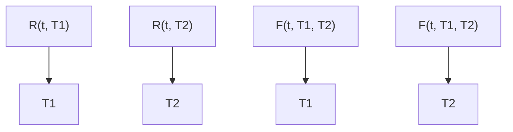
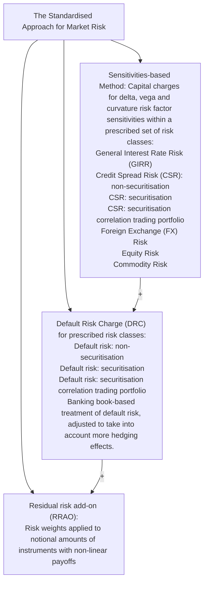

# Learning Quantitative Finance: Industry Practices in Pricing & Risk Analytics

Dr. Eugene Wang

2026/3/17、20

THE HONG KONG

POLYTECHNICUNIVERSITY

香港理工大學

This lecture and all associated materials are provided for educational purposes only and are intended to help participants gain a better understanding of asset pricing and risk management in global capital markets

All materials, including slides, examples, and any supplementary resources provided during this lecture, are the intellectual property of the presenter, Eugene Yuqing Wang. These materials are shared exclusively for non-commercial, personal use by participants. Any unauthorized reproduction, distribution, modification, or use of these materials for commercial purposes is strictly prohibited and may result in legal action. By attending this lecture, participants agree to respect the intellectual property rights of the presenter and to use the materials solely for their own educational benefit.

natural_image

Aerial view of a modern city skyline with skyscrapers and waterfront, featuring the Hong Kong-Zhuhai-Macao Bridge in the foreground (no visible text or signage)

1. Introduction Pricing & Risk Analysis in Global Capital Markets   
2. About Term Structure of Interest Rate   
3. Bond Valuation & Risk Analytics   
4. Industry Use Case in Global Capital Markets

Market Risk Report of FIC trading

• Leveraged loan

• FRTB SA

5. How to start with Quantitative Analytics & Risk Management   
6. Q&A (15 mins)

• Craig Zufeng Chen, CEO, Finstars Intelligence   
Master of Shanghai JiaoTong University, Craig is an industryleading expert in financial digitization, the technology expert for the People's Bank of China and the China Securities Regulatory Commission, a member of the China Computer Federation (CCF), the expert of the Shanghai Artificial Intelligence Association.   
Experienced entrepreneur with more than two decades of developing enterpirse solutions at FIS, Alibaba & Alipay and PBoC. Professional at AI/ML, Data Intelligence in Banking & Capital Markets, FinTechs and RegTech.   
In previous experiences, Craig was general manager of Financial Intelligence, responsible for data intelligence, AI solutions for banking, regtech and risk analytics.

• Eugene Yuqing Wang, CTO, Finstars Intelligence   
Well-known quantitative finance expert with deep expertise in Financial Engineering and Mathematical Finance. He holds a MSc in Financial Mathematics from the University of Toronto, PhD in Physics from the University of Hong Kong. He has published over 20 research papers in peer reviewed journals in the fields of mathematical finance, natural neural network dynamics, and condensed matter physics.   
Experience in Royal Bank of Canada, Eugene was a senior director at Global Risk Analytics, Group Risk Management, responsible for methodology and model development related to Stress Testing, Market Risk, and Counterparty Credit Risk   
• Experience in Jefferies and Equitable Bank   
Taught Credit Risk Course for Master of Financial Risk Management (MFRM) program in Rotman School of Management, University of Toronto (2022 and 2023)

By the end of the course, participants will:

• Understand the basics of Pricing & Risk analytics in Global Capital Markets   
• Learn term structure of Interest Rate   
• Learn how to do Bond Valuation as an example   
• Gain industry insights in Market Risk, Leveraged Loan & FRTB   
• Explore how to start with pricing and risk analytics

# n

# Asset Pricing & Risk Analysis in Global Capital Markets

```mermaid
graph TD
    A["Quantitative Finance"] --> B["Algorithmic Trading"]
    A --> C["Risk Management"]
    A --> D["Asset Pricing"]
    A --> E["Portfolio Management"]
    A --> F["Compliance Management"]
    A --> G["Model Validation"]
    A --> H["Model Analytics"]
    A --> I["Compliance"]
    A --> J["Low-latency System"]
    A --> K["Liquidity rebate arbitrage"]
    A --> L["Flash trading"]
    A --> M["..."]
    A --> N["Markowitz, CAPM..."]
    A --> O["Modern Approaches"]
    A --> P["..."]
    A --> Q["Market Risk"]
    A --> R["VaR, CVaR, MVaR"]
    A --> S["Counterparty Credit Risk"]
    A --> T["Credit Risk"]
    A --> U["Interest Rate Risk"]
    A --> V["Liquidity Risk"]
    A --> W["Model Risk"]
    A --> X["..."]
    A --> Y["Cross Asset Pricing"]
    A --> Z["Derivatives Pricing"]
    A --> AA["Risk-Neutral Pricing"]
```

flowchart

# Cross Assert Pricing in Global Capital Markets

<table><tr><td>Interest Rates</td><td>Foreign Exchange</td><td>Equity</td><td>Credit</td><td>Commodities</td></tr><tr><td>Cash DepositFRAIR FuturesIR SwapIR Basis SwapOIS FuturesOIS SwapOIS Basis SwapOIS Basis Spread FRAxCCY SwapIR SwaptionIR Bermudan SwaptionVanilla BondFloating Rate NoteCallable/Putable BondSingle barrier swap/note on IR index at hit/maturity...</td><td>FX ForwardEuropean Call/PutDigital Call/PutCall Put SpreadRange Accrual Swap/Note Sharkfin Swap/NoteDouble Sharkfin Swap/NoteSingle Barrier Call/PutSwap/Note At MaturitySingle Barrier Call/PutSwap/Note At HitSingle Barrier Call/PutSwap/Note No TouchDouble Barrier Swap/NoteAt MaturityDouble Barrier Swap/NoteAt HitDouble Barrier Swap/NoteNo Touch...</td><td>European Call/PutAmerican Call/PutAsian OptionRange Accrual Swap/NoteSingle Barrier Call/PutSwap/Note At MaturitySingle Barrier Call/PutSwap/Note At HitSingle Barrier Call/PutSwap/Note No TouchDouble Barrier Swap/NoteAt MaturityDouble Barrier Swap/NoteAt HitDouble Barrier Swap/NoteNo Touch...</td><td>Credit DefaultSwap/SwaptionCredit Linked NoteCDS IndiceCDS Indice OptionAsset SwapTotal Return SwapCLO...</td><td>Commodity FuturesCommodity ForwardCommodity SwapsCommodityBarrierOptionCommodityDigitalOptionEuropean Option onCommodity FuturesForwardPmOptionPmDigitalOptionPmTouchOptionPmBarrierOptionPm...</td></tr></table>

# Market Risk

• Risk reporting   
• Limit management   
• Stress Testing   
• FRTB SA   
• FRTB IMA

# Value at Risk

• VaR   
• CVaR   
• HVaR   
• TVaR   
• Stress VaR   
• Component VaR

# Trading Credit Risk

• Counterparty Credit Risk   
• Potential Future Exposure   
• Limit Management   
• Collateral management   
• CVA/DVA/FVA valuation & management

# Profit & Loss

• Real-time P&L Analysis   
• C a p i t a l A t t r i b u t i o n Analysis

# Liquidity Risk

• Cash Flow Analysis   
• LCR/NSFR   
• Liquidity Risk Management

# Credit Risk

• PD/LGD Analysis   
• EAD Analysis   
• Stress-testing methodologies & framework

# IRRBB

• Interest Rate Risk Analysis   
• Scenario & Stress-testing   
• Economic value measures   
• Regulatory Compliance

# xVA

• CVA   
• DVA   
• FVA

#

# Term Structure of Interest Rate

# 1. Zero coupon bond

One dollar paid a future time T is valued at time t:

text_image

t
T

B(t, $\mathsf { T } ) { = } { \mathsf { e x p } } ( - \mathsf { r } ( \mathsf { t } , \mathsf { T } ) \times ( \mathsf { T } - \mathsf { t } ) )$ for continuous compounding

B(t, $\sf { T } ) { = } 1 / ( 1 { + } \sf { R } ( t , \sf { T } ) \times ( \sf { T } { - } t ) )$ for simple compounding

2. Forward rate from T1 to T2   

flowchart

(1+R(t, T2))=(1+R(t, T1) x(1+F(t, T1, T2)) for simple compounding   
Exp(-r(t, T2) x(T2-t)) =Exp( -r(t, T1)x (T1-t)) x exp (-f(t, T1, T2) x (T2-T1)) for continuous compounding

3. Value of two one-dollar cash flows at T1 and T2, respectively

One dollar paid a future time T is valued at time t:

text_image

t
T1
T2

$$
V (t) = \exp (- r (t, T 1) \times (T 1 - t)) + \exp (- r (t, T 2) \times (T 2 - t))
$$

In order to value a serious cash flows, we need to know the function r(t, T) at any T.

r(0, Ti) for (Ti=0, 1, 2, N) is defined as the term structure of the curve B(0, Ti) is defined as the discount factors, which is another definition of curve

4. Term structure of interest rate

r(0, Ti) for (Ti=0, 1, 2, N), with given compounding convention, is defined as a zero curve.

The curve can be used to:

1. value a future fixed cash flow   
2. value a future floating cash flow, such as a cash flow with 3M Libor or daily SOFR rate at a future time, as reference rate

# 5. Computing a zero curve

Calibration instruments

For interest rate curve, we use money market, Eurodollar Futures, swaps, for Libor curve; we use RFR futures, RFR swaps for RFR curve   
For bond zero curve, we use Par Bond with different maturities

Bootstrapping with a given interpolation method

Linear and time weight linear interpolation are standard   
Other methods like cubic Spline or constrained cubic spline   
More complicated like tension spline, mean variance, etc.

Other methodologies like global fitting, instead of bootstrapping, may also be used.

#

# Bond Valuation & Risk Analytics

# 1. Bond Valuation and risk

» Bond with given market price (cash product bond, CLO, etc.)

» Using a risk free curve to compute credit spread (Z-spread) or optional adjusted spread (OAS)   
» Using other curves such as sector/rating curves to compute PandL in certain cases   
» Basis trading using asset swap and CDS

» Bond without quoted market prices such as off-the-run treasuries

<table><tr><td>Bond</td><td>Currency</td><td>Maturity</td><td>Coupon</td><td>Dirty Price</td><td>Accural</td><td>Yield</td><td>Duration</td><td>Modified D</td><td>Convexity</td></tr><tr><td>1</td><td>USD</td><td>1/9/2047</td><td>5.10%</td><td>140.98</td><td>1.78</td><td>2.88%</td><td>15.95</td><td>15.72</td><td>331.65</td></tr><tr><td>2</td><td>GBP</td><td>12/12/2028</td><td>5.45%</td><td>123.8</td><td>3.6</td><td>1.58%</td><td>3.93</td><td>3.86</td><td>20.02</td></tr><tr><td>3</td><td>CAD</td><td>1/6/2026</td><td>4.25%</td><td>109.65</td><td>0.41</td><td>0.98%</td><td>2.76</td><td>2.75</td><td>9.16</td></tr></table>

<table><tr><td>Bond</td><td>Z-Spread</td><td>Asset Swap Spread</td><td>Bond/CDS Repo Spread</td><td>PV01</td></tr><tr><td>1</td><td>0.36%</td><td>0.43%</td><td>0.02%</td><td>-2213</td></tr><tr><td>2</td><td>0.05%</td><td>0.06%</td><td>-0.01%</td><td>-480</td></tr><tr><td>3</td><td>-0.13%</td><td>-0.14%</td><td>0%</td><td>-301</td></tr></table>

# Risk Sensitivities and the usage

A financial product is valued via a model, which links the value to market variables, some (slow changing or constant) variable (such as correlation), and time

For example, for a bond above, it is V( IR, CS, t) Then we have

$$
\Delta V (\mathrm{IR}, \mathrm{CS}, t) = \frac {d V (t)}{d t} \Delta t + \frac {d V (I R , C S , t)}{d I R} \Delta I R + \frac {d V (I R , C S , t)}{d I R} \Delta I R
$$

$$
+ 0. 5 \times (\frac {d ^ {2} V (I R , C S , t)}{d I R ^ {2}} (\Delta I R) ^ {2} + \frac {d ^ {2} V (I R , C S , t)}{d C S ^ {2}} (\Delta C S) ^ {2} + \frac {d ^ {2} V (I R , C S , t)}{d I R d C S} (\Delta C S \Delta I R)) + \dots
$$

Theta risk   
– Delta risk (PDH risk and parallel shift risk) （DV01, CS01)   
Gamma risk and cross-gamma risk

# A typical risk report for a bond portfolio

» Valuation and market risk sensitivities   
» VaR and stressed VaR   
» Stress Testing

<table><tr><td>Portfolio Holdings (USD)</td><td>300,000,000</td></tr><tr><td>Average Price</td><td>88.89</td></tr><tr><td>Average Yield</td><td>7.20%</td></tr><tr><td>Market Value</td><td>226,670,000</td></tr><tr><td>CS01 (Credit Spread Risk)</td><td>(602,034)</td></tr><tr><td>DV01 (Interest Rate Risk)</td><td>(32,921)</td></tr><tr><td>one-day 99 VaR</td><td>(2,824,536)</td></tr><tr><td>10-day Stress 99 VaR</td><td>(40,701,821)</td></tr></table>

<table><tr><td>Stress Testing</td><td></td></tr><tr><td>US Fiscal Cliff</td><td>(13,471,084)</td></tr><tr><td>China Recession</td><td>(33,290,840)</td></tr><tr><td>Financial Crisis 2008</td><td>(100,687,400)</td></tr><tr><td>Russian Default 1998</td><td>(7,333,480)</td></tr><tr><td>Liquidity Stress</td><td>(39,799,980)</td></tr></table>

# 04. Industry Use Case

# What is a leveraged loan

– A commercial loan provided by a group of lenders   
– “leveraged” means below investment grade issuer (leveraged issuers)   
– Features   
» Senior secured (secured by the company’s physical assets)   
» Floating rate in nature (Libor+ 500bps)   
» Covenants – maintain credit quality, restriction on issue more debt, etc.   
» Callable (usually soft call)

My experience with leveraged loan trading and risk management

– Managing the bank’s leverage loan exposure as market maker   
Counterparty risk in the trading   
– Assets in CLO

An leveraged loan example for leveraged buyout (LBO), rated as B 

<table><tr><td colspan="2">Pages</td><td colspan="5">Tranche Description</td><td colspan="3">Identifiers</td></tr><tr><td>11)</td><td>General Info</td><td>Name</td><td colspan="4">Air Methods</td><td colspan="3">ID Number BL2407452</td></tr><tr><td>12)</td><td>Additional Info</td><td>Borrower</td><td colspan="4">Air Methods Corp</td><td colspan="3">FIGI BBG00GD319M8</td></tr><tr><td>13)</td><td>Involved Parties</td><td>Sponsors</td><td colspan="4">American Securities LLC</td><td colspan="3">CUSIP 00912YAL6</td></tr><tr><td>14)</td><td>Covenants</td><td rowspan="2">Purpose</td><td rowspan="2" colspan="4">LBO Financing, Acquisition Financing</td><td colspan="3">Summary Criteria</td></tr><tr><td>15)</td><td>Ratings</td><td colspan="3">Covenant Lite N.A.</td></tr><tr><td>16)</td><td>Amortization</td><td>Status</td><td colspan="4">Signed</td><td colspan="3">Leveraged Yes</td></tr><tr><td>17)</td><td>Amendments</td><td>Type</td><td colspan="4">Term</td><td colspan="3">Borrowing Base No</td></tr><tr><td>18)</td><td>Pricing &amp; Fees</td><td>Rank</td><td colspan="4">1L Sr. Secd Ticker AIRM</td><td colspan="3">Call Protection No</td></tr><tr><td>19)</td><td>Electronic Filing</td><td></td><td></td><td></td><td></td><td></td><td></td><td></td><td></td></tr><tr><td>20)</td><td>Contracts</td><td>Agent</td><td colspan="4">Royal Bank of Canada (US)</td><td colspan="3">Ratings Tranc... Issuer</td></tr><tr><td>21)</td><td>Permissioning</td><td colspan="5">Min Transfer -- Transfer Fee --</td><td colspan="3">Moody&#x27;s B2 B3</td></tr><tr><td>22)</td><td>Change History</td><td colspan="5">Idx + Margin US0003M + 350 bps PIK --</td><td colspan="3">S&amp;P B B-</td></tr><tr><td>23)</td><td>Coupons</td><td colspan="5">Issue Price 99.500 Commit Fee --</td><td></td><td></td><td></td></tr><tr><td></td><td></td><td colspan="5">Index Floor 100 bps Facility Fee --</td><td></td><td></td><td></td></tr><tr><td>Quick Links</td><td></td><td colspan="5">Currency USD</td><td>Dates</td><td></td><td></td></tr><tr><td>32)</td><td>CN News</td><td colspan="5">Tranche Size 1,250,000,000 as of 04/07/2021</td><td rowspan="7" colspan="3">Announced 03/14/2017 Priced 04/13/2017 Signed 04/21/2017 Effective 04/21/2017 Funded 04/24/2017 Maturity 04/21/2024</td></tr><tr><td>33)</td><td>QMGR Quotes</td><td colspan="5">Borrowing Base --</td></tr><tr><td>34)</td><td>COMB Compare</td><td rowspan="5" colspan="5">Outstanding 1,250,000,000 as of 04/24/2017 LCs -- Total Util 1,250,000,000</td></tr><tr><td>35)</td><td>MA M&amp;A</td></tr><tr><td>36)</td><td>HDS Holdings</td></tr><tr><td></td><td></td></tr><tr><td>66)</td><td>Send Tranche</td></tr></table>

Leveraged loan market value

– Trading by price and IPV (Independent Price Verification)   
Quantitative measures

» Rating   
» Yield to maturity   
» Weighted average life

– Average data provided by data provider such as S&P/LSTA

» www.lcdcomps.com   
» Leveraged Loan 100 Index (LL100)

<table><tr><td colspan="6">Yield to Maturity</td></tr><tr><td>Date</td><td>ALL</td><td>LL100</td><td>BB</td><td>B</td><td>CCC</td></tr><tr><td>28-Sep-20</td><td>5.71%</td><td>4.85%</td><td>4.05%</td><td>5.73%</td><td>11.81%</td></tr><tr><td>29-Sep-20</td><td>5.72%</td><td>4.86%</td><td>4.04%</td><td>5.73%</td><td>11.89%</td></tr><tr><td>30-Sep-20</td><td>5.74%</td><td>4.90%</td><td>4.07%</td><td>5.74%</td><td>11.92%</td></tr><tr><td>01-Oct-20</td><td>5.72%</td><td>4.88%</td><td>4.05%</td><td>5.72%</td><td>12.28%</td></tr><tr><td>02-Oct-20</td><td>5.73%</td><td>4.92%</td><td>4.09%</td><td>5.66%</td><td>12.44%</td></tr></table>

# Historical prices

line

| Date       | ALL  | LL 100 | BB   | B    | CCC  |
| ---------- | ---- | ------ | ---- | ---- | ---- |
| 11-Nov-2017 | 98.5 | 98.3   | 99.8 | 98.7 | 84.2 |
| 30-May-2018 | 98.7 | 98.5   | 99.9 | 98.9 | 88.5 |
| 16-Dec-2018 | 97.2 | 96.8   | 99.5 | 97.5 | 85.3 |
| 4-Jul-2019  | 96.5 | 96.2   | 99.2 | 96.8 | 83.1 |
| 20-Jan-2020 | 97.8 | 97.5   | 99.6 | 97.2 | 84.0 |
| 7-Aug-2020  | 96.0 | 95.8   | 98.5 | 96.5 | 78.0 |
| Final      | 97.0 | 96.5   | 98.8 | 97.5 | 86.0 |

# Risk measures

– Bond measures and credit measures   
Historical VaR

» 1-day and 10-day VaR using historical price shocks

– Potential future exposure (PFE) for counterparty risk

» Leveraged loan needs long time to settle, raising counterparty risk issue   
» Definition of PFE, 95% percentile exposure given a time horizon   
» PFE= B x D x Φ-1(0.95) x � x σ

» B is bound price   
» D is duration (approximated by trade maturity   
» T is the time horizon   
» σ is the volatility compute via historical prices   
» $\Phi ^ { - 1 } 0$ is the inverse function of standard cumulative normal distribution

# Leveraged loan in CLO

– Major collateral assets of CLOs   
– A very different modelling approach as it needs to generate asset cash flows   
» Default risk is captured by CDR   
» Call option is captured by CPR   
Generated cash flows are then used to compute CLO tranche value and risk

<table><tr><td>LoanX ID</td><td>LX131555</td></tr><tr><td>Issuer</td><td>AUGUST CAYMAN INTERMEDIATE HOLDCO, INC.</td></tr><tr><td>Asset Name</td><td>August U.S. Holding Company, Inc. Term Loan- 10.5% - Jan 31 2018</td></tr><tr><td>Asset Type</td><td>Bank Loan</td></tr><tr><td>Notional</td><td>1,160,812.50</td></tr><tr><td>Price</td><td>101.50</td></tr><tr><td>Market Value</td><td>1,178,224.69</td></tr><tr><td>Maturity</td><td>2018-01-31</td></tr><tr><td>Avg Life</td><td>2.11</td></tr><tr><td>Coupon</td><td>10.50</td></tr><tr><td>Coupon Type</td><td>Floating</td></tr><tr><td>Index</td><td>LIBOR 3MO</td></tr><tr><td>Payment Frequency</td><td>QUARTERLY</td></tr><tr><td>Moody&#x27;s Current Rating</td><td>N/R</td></tr><tr><td>S&amp;P Current Rating</td><td>B</td></tr><tr><td>Cov-lite Flag</td><td>YES</td></tr></table>

Cash Flow when CPR and CDR are zero 

<table><tr><td></td><td></td><td>Remaining</td><td></td><td></td><td>Perform</td><td></td><td>Total</td><td>Total</td><td>Loss</td><td>Swap Index</td><td>Par</td><td>Perf Par</td></tr><tr><td>Period</td><td>Date</td><td>Balance</td><td>Amortization</td><td>Interest</td><td>Balance</td><td>Coupon</td><td>Principal</td><td>Cashflow</td><td>Percent</td><td>Rate</td><td>Balance</td><td>Balance</td></tr><tr><td>Total:</td><td></td><td>1,160,812.50</td><td>1,160,812.50</td><td>456,738.81</td><td>1,160,812.50</td><td></td><td>1,160,812.50</td><td>1,617,551.31</td><td></td><td></td><td>1,160,812.50</td><td>1,160,812.50</td></tr><tr><td>0</td><td>6/30/2014</td><td>1,160,812.50</td><td>0</td><td>0</td><td>1,160,812.50</td><td>10.5</td><td>0</td><td>0</td><td>1</td><td>0.2321</td><td>1,160,812.50</td><td>1,160,812.50</td></tr><tr><td>1</td><td>9/30/2014</td><td>1,160,812.50</td><td>0</td><td>31,148.47</td><td>1,160,812.50</td><td>10.5</td><td>0</td><td>31,148.47</td><td>1</td><td>0.2321</td><td>1,160,812.50</td><td>1,160,812.50</td></tr><tr><td>2</td><td>12/31/2014</td><td>1,160,812.50</td><td>0</td><td>31,148.47</td><td>1,160,812.50</td><td>10.5</td><td>0</td><td>31,148.47</td><td>1</td><td>0.2125</td><td>1,160,812.50</td><td>1,160,812.50</td></tr><tr><td>3</td><td>3/31/2015</td><td>1,160,812.50</td><td>0</td><td>30,471.33</td><td>1,160,812.50</td><td>10.5</td><td>0</td><td>30,471.33</td><td>1</td><td>0.234</td><td>1,160,812.50</td><td>1,160,812.50</td></tr><tr><td>4</td><td>6/30/2015</td><td>1,160,812.50</td><td>0</td><td>30,809.90</td><td>1,160,812.50</td><td>10.5</td><td>0</td><td>30,809.90</td><td>1</td><td>0.322</td><td>1,160,812.50</td><td>1,160,812.50</td></tr><tr><td>5</td><td>9/30/2015</td><td>1,160,812.50</td><td>0</td><td>31,148.47</td><td>1,160,812.50</td><td>10.5</td><td>0</td><td>31,148.47</td><td>1</td><td>0.48539</td><td>1,160,812.50</td><td>1,160,812.50</td></tr><tr><td>6</td><td>12/31/2015</td><td>1,160,812.50</td><td>0</td><td>31,148.47</td><td>1,160,812.50</td><td>10.5</td><td>0</td><td>31,148.47</td><td>1</td><td>0.68721</td><td>1,160,812.50</td><td>1,160,812.50</td></tr><tr><td>7</td><td>3/31/2016</td><td>1,160,812.50</td><td>0</td><td>30,809.90</td><td>1,160,812.50</td><td>10.5</td><td>0</td><td>30,809.90</td><td>1</td><td>0.90161</td><td>1,160,812.50</td><td>1,160,812.50</td></tr><tr><td>8</td><td>6/30/2016</td><td>1,160,812.50</td><td>0</td><td>30,809.90</td><td>1,160,812.50</td><td>10.5</td><td>0</td><td>30,809.90</td><td>1</td><td>1.12791</td><td>1,160,812.50</td><td>1,160,812.50</td></tr><tr><td>9</td><td>9/30/2016</td><td>1,160,812.50</td><td>0</td><td>31,481.97</td><td>1,160,812.50</td><td>10.61242</td><td>0</td><td>31,481.97</td><td>1</td><td>1.36242</td><td>1,160,812.50</td><td>1,160,812.50</td></tr><tr><td>10</td><td>12/30/2016</td><td>1,160,812.50</td><td>0</td><td>31,825.92</td><td>1,160,812.50</td><td>10.84626</td><td>0</td><td>31,825.92</td><td>1</td><td>1.59626</td><td>1,160,812.50</td><td>1,160,812.50</td></tr><tr><td>11</td><td>3/31/2017</td><td>1,160,812.50</td><td>0</td><td>32,484.14</td><td>1,160,812.50</td><td>11.07058</td><td>0</td><td>32,484.14</td><td>1</td><td>1.82058</td><td>1,160,812.50</td><td>1,160,812.50</td></tr><tr><td>12</td><td>6/30/2017</td><td>1,160,812.50</td><td>0</td><td>33,097.05</td><td>1,160,812.50</td><td>11.27946</td><td>0</td><td>33,097.05</td><td>1</td><td>2.02946</td><td>1,160,812.50</td><td>1,160,812.50</td></tr><tr><td>13</td><td>9/29/2017</td><td>1,160,812.50</td><td>0</td><td>33,665.98</td><td>1,160,812.50</td><td>11.47335</td><td>0</td><td>33,665.98</td><td>1</td><td>2.22335</td><td>1,160,812.50</td><td>1,160,812.50</td></tr><tr><td>14</td><td>12/29/2017</td><td>1,160,812.50</td><td>0</td><td>34,157.85</td><td>1,160,812.50</td><td>11.64098</td><td>0</td><td>34,157.85</td><td>1</td><td>2.39098</td><td>1,160,812.50</td><td>1,160,812.50</td></tr><tr><td>15</td><td>1/31/2018</td><td>0</td><td>1,160,812.50</td><td>12,531.01</td><td>0</td><td>11.7764</td><td>1,160,812.50</td><td>1,173,343.51</td><td>1</td><td>2.5264</td><td>0</td><td>0</td></tr></table>

# ndustry Use Case – Leveraged LoanIndustry Use Case - Leveraged Loan

CDR=0.02, CPR=0.2

<table><tr><td></td><td></td><td>Remaining</td><td></td><td></td><td></td><td></td><td></td><td>Perform</td><td></td><td>Total</td><td>Total</td><td>Loss</td><td>Balance</td><td>Swap Index</td><td>Prin</td><td>Par</td><td>Perf Par</td></tr><tr><td>Period</td><td>Date</td><td>Balance</td><td>Amortization</td><td>Interest</td><td>Defaulted</td><td>Losses</td><td>Prepayment</td><td>Balance</td><td>Coupon</td><td>Principal</td><td>Cashflow</td><td>Percent</td><td>In Default</td><td>Rate</td><td>Loss</td><td>Balance</td><td>Balance</td></tr><tr><td>Total:</td><td></td><td>1,160,812.50</td><td>581,550.59</td><td>274,505.30</td><td>46,760.55</td><td>46,760.55</td><td>532,501.36</td><td>1,160,812.50</td><td></td><td>1,114,051.95</td><td>1,388,557.25</td><td></td><td>0</td><td></td><td>46,760.55</td><td>1,160,812.50</td><td>1,160,812.50</td></tr><tr><td>0</td><td>6/30/2014</td><td>1,160,812.50</td><td>0</td><td>0</td><td>0</td><td>0</td><td>0</td><td>1,160,812.50</td><td>10.5</td><td>0</td><td>0</td><td>1</td><td>0</td><td>0.2321</td><td>0</td><td>1,160,812.50</td><td>1,160,812.50</td></tr><tr><td>1</td><td>9/30/2014</td><td>1,076,017.52</td><td>23,062.50</td><td>31,003.01</td><td>5,420.92</td><td>0</td><td>61,732.48</td><td>1,070,596.60</td><td>10.5</td><td>84,794.98</td><td>115,797.99</td><td>1</td><td>5,420.92</td><td>0.2321</td><td>5,420.92</td><td>1,076,017.52</td><td>1,070,596.60</td></tr><tr><td>2</td><td>12/31/2014</td><td>997,404.86</td><td>21,701.28</td><td>28,593.57</td><td>4,997.56</td><td>0</td><td>56,911.37</td><td>986,986.39</td><td>10.5</td><td>78,612.65</td><td>107,206.23</td><td>1</td><td>10,418.47</td><td>0.2125</td><td>4,997.56</td><td>997,404.86</td><td>986,986.39</td></tr><tr><td>3</td><td>3/31/2015</td><td>924,540.14</td><td>20,420.41</td><td>25,787.50</td><td>4,605.29</td><td>0</td><td>52,444.31</td><td>909,516.37</td><td>10.5</td><td>72,864.72</td><td>98,652.23</td><td>1</td><td>15,023.77</td><td>0.234</td><td>4,605.29</td><td>924,540.14</td><td>909,516.37</td></tr><tr><td>4</td><td>6/30/2015</td><td>857,018.69</td><td>19,215.13</td><td>24,027.49</td><td>4,241.92</td><td>0</td><td>48,306.31</td><td>837,753.00</td><td>10.5</td><td>67,521.45</td><td>91,548.94</td><td>1</td><td>19,265.69</td><td>0.322</td><td>4,241.92</td><td>857,018.69</td><td>837,753.00</td></tr><tr><td>5</td><td>9/30/2015</td><td>789,042.69</td><td>18,081.00</td><td>22,374.91</td><td>3,905.40</td><td>5,420.92</td><td>44,474.08</td><td>771,292.51</td><td>10.5</td><td>62,555.08</td><td>84,929.99</td><td>1</td><td>17,750.18</td><td>0.48539</td><td>3,905.40</td><td>789,042.69</td><td>771,292.51</td></tr><tr><td>6</td><td>12/31/2015</td><td>726,105.38</td><td>17,013.81</td><td>20,599.91</td><td>3,593.83</td><td>4,997.56</td><td>40,925.95</td><td>709,758.93</td><td>10.5</td><td>57,939.75</td><td>78,539.67</td><td>1</td><td>16,346.45</td><td>0.68721</td><td>3,593.83</td><td>726,105.38</td><td>709,758.93</td></tr><tr><td>7</td><td>3/31/2016</td><td>667,848.76</td><td>16,009.60</td><td>18,750.45</td><td>3,305.43</td><td>4,605.29</td><td>37,641.72</td><td>652,802.17</td><td>10.5</td><td>53,651.32</td><td>72,401.78</td><td>1</td><td>15,046.59</td><td>0.90161</td><td>3,305.43</td><td>667,848.76</td><td>652,802.17</td></tr><tr><td>8</td><td>6/30/2016</td><td>613,939.56</td><td>15,064.67</td><td>17,245.81</td><td>3,038.56</td><td>4,241.92</td><td>34,602.61</td><td>600,096.34</td><td>10.5</td><td>49,667.28</td><td>66,913.09</td><td>1</td><td>13,843.23</td><td>1.12791</td><td>3,038.56</td><td>613,939.56</td><td>600,096.34</td></tr><tr><td>9</td><td>9/30/2016</td><td>564,067.53</td><td>14,175.50</td><td>16,199.28</td><td>2,791.67</td><td>3,905.40</td><td>31,791.12</td><td>551,338.04</td><td>10.61242</td><td>45,966.63</td><td>62,165.90</td><td>1</td><td>12,729.50</td><td>1.36242</td><td>2,791.67</td><td>564,067.53</td><td>551,338.04</td></tr><tr><td>10</td><td>12/30/2016</td><td>517,943.91</td><td>13,338.82</td><td>15,045.72</td><td>2,563.35</td><td>3,593.83</td><td>29,190.97</td><td>506,244.89</td><td>10.84626</td><td>42,529.80</td><td>57,575.52</td><td>1</td><td>11,699.01</td><td>1.59626</td><td>2,563.35</td><td>517,943.91</td><td>506,244.89</td></tr><tr><td>11</td><td>3/31/2017</td><td>475,299.94</td><td>12,551.53</td><td>14,100.91</td><td>2,352.25</td><td>3,305.43</td><td>26,787.01</td><td>464,554.11</td><td>11.07058</td><td>39,338.53</td><td>53,439.45</td><td>1</td><td>10,745.83</td><td>1.82058</td><td>2,352.25</td><td>475,299.94</td><td>464,554.11</td></tr><tr><td>12</td><td>6/30/2017</td><td>435,885.55</td><td>11,810.70</td><td>13,183.85</td><td>2,157.14</td><td>3,038.56</td><td>24,565.13</td><td>426,021.15</td><td>11.27946</td><td>36,375.83</td><td>49,559.67</td><td>1</td><td>9,864.41</td><td>2.02946</td><td>2,157.14</td><td>435,885.55</td><td>426,021.15</td></tr><tr><td>13</td><td>9/29/2017</td><td>399,468.07</td><td>11,113.60</td><td>12,298.17</td><td>1,976.87</td><td>2,791.67</td><td>22,512.22</td><td>390,418.47</td><td>11.47335</td><td>33,625.81</td><td>45,923.98</td><td>1</td><td>9,049.60</td><td>2.22335</td><td>1,976.87</td><td>399,468.07</td><td>390,418.47</td></tr><tr><td>14</td><td>12/29/2017</td><td>365,831.02</td><td>10,457.64</td><td>11,435.11</td><td>1,810.36</td><td>2,563.35</td><td>20,616.06</td><td>357,534.41</td><td>11.64098</td><td>31,073.70</td><td>42,508.81</td><td>1</td><td>8,296.61</td><td>2.39098</td><td>1,810.36</td><td>365,831.02</td><td>357,534.41</td></tr><tr><td>15</td><td>1/31/2018</td><td>0</td><td>357,534.41</td><td>3,859.60</td><td>0</td><td>8,296.61</td><td>0</td><td>0</td><td>11.7764</td><td>357,534.41</td><td>361,394.01</td><td>1</td><td>0</td><td>2.5264</td><td>0</td><td>0</td><td>0</td></tr></table>

1. FRTB and FRTB SBA approach   
2. Application of SBA   
3. FRTB SBA capital calculation for a sample portfolio

Basel Standard

https://www.bis.org/bcbs/publ/d457.htm

Basel Frequently Asked Questions (FAQ)

https://www.bis.org/bcbs/publ/d437.htm

Capital Adequacy Requirements (CAR): Chapter 9 – Market Risk

https://www.osfi-bsif.gc.ca/Eng/fi-if/rg-ro/gdn-ort/gl-ld/Pages/CAR19\_chpt9.aspx

# Fundamental Review of the Trading Book (FRTB)

1. Latest standard for regulatory capital calculation.   
2. Designed to address the short comings in the current Basel III framework   
3. Key improvements   
» More robust boundary between Banking and Trading books   
» Enhanced treatment of credit, in responding to lessons from the financial crisis   
» Different approach for securitization and non-securitization exposures » Credit Valuation Adjustment (CVA) charges   
» Updated Internal Models Approach (IMA) capital calculation   
» Updated Standardized Approach (SA) capital calculation

# Treatment of Credit

Non-securitization exposures

» 1) An integrated credit spread risk capital charge, which will also cover migration risk, and 2) Incremental Default Risk (IDR)   
» Credit spread risk capital charge captures the risk of an MtM loss from changes in credit spreads

– Securitization exposure

» A credit spread risk component and a default risk component   
» Only SA approach applies

# Standardized Approach (SA)

– Three components (SBA, DRC and RRAO)   
– SA calculation is required for all desks, regardless of IMA approval   
» Serves as a credible fallback to IMA   
» IMA may be floored based on SA

flowchart

# We only focus on non-securitization

60. CreditSpread Risk(CSR) non-securitisationrisk factors

（a） DeltaCSRnon-securitisation:TheCSRnon-securitisationdeltariskfactorsare defined along two dimensions:therelevant issuer credit spread curves (bond and CDS)and the following vertices: 0.5years,1year,3years,5years,10yearstowhichdeltariskfactorsareassigned.   
（b） VegaCSRnon-securitisation:Thevegarisk factorsare theimpliedvolatitiesof optionsthat referencetherelevantcreditisuernamesasunderlyings(bondandCDS);furtherdefinedalong onedimension:

Maturity oftheoption:The impliedvolatilityof theoptionasmappedtooneor several ofthefollowingmaturityvertices:0.5years,1year，3years,5years,10years.

（c） Curvature CSR non-securitisation:The CSR non-securitisation curvaturerisk factorsaredefined alongone dimension:therelevant issuer credit spread curves (bond and CDS).For instance,the bond-inferred spreadcurveof Electricitede Franceand the CDS-inferred spread curveof ElectricitedeFrance shouldbeconsideredasingle spread curve.All vertices (asdefined for CSR)aretobeshiftedinparalel.

67(b) DeltaCSR non-securitisation:Sensitivityis defined as CSo1.The CSol(sensitivity)of an instrumentiisdetermined bycalculating the changeinthemarket value of theinstrument (Vi (.))asaresult ofa1basispoint changetocredit spread csatvertext(cst),dividedby0.0001(ie 0.01%）.In notation form:

$$
s _ {k, c s _ {t}} = \frac {V _ {i} (r _ {t} , c s _ {t} + 0 . 0 0 0 1) - V _ {i} (r _ {t} , c s _ {t})}{0 . 0 0 0 1}
$$

67(c) Delta CSR securitisation and nth-to-default:Sensitivity is defined as the CSOl,with no changetothe sensitivity specification in theprevious paragraph.

# Industry Use Case - Credit Spread Risk in FRTB SBA

# Buckets

82. Sensitivitiesorriskexposuresshouldfirstbeasigned toabucketaccordingtothefollowing table: 

<table><tr><td>Bucket number</td><td>Credit quality</td><td>Sector</td></tr><tr><td>1</td><td rowspan="8">Investment grade (IG)</td><td>Sovereigns including central banks, multilateral development banks</td></tr><tr><td>2</td><td>Local government, government-backed non-financials, education, public administration</td></tr><tr><td>3</td><td>Financials including government-backed financials</td></tr><tr><td>4</td><td>Basic materials, energy, industrials, agriculture, manufacturing, mining and quarrying</td></tr><tr><td>5</td><td>Consumer goods and services, transportation and storage, administrative and support service activities</td></tr><tr><td>6</td><td>Technology, telecommunications</td></tr><tr><td>7</td><td>Health care, utilities, professional and technical activities</td></tr><tr><td>8</td><td>Covered bonds $^{27}$ </td></tr><tr><td>9</td><td rowspan="7">High yield (HY) &amp; non-rated (NR)</td><td>Sovereigns including central banks, multilateral development banks</td></tr><tr><td>10</td><td>Local government, government-backed non-financials, education, public administration</td></tr><tr><td>11</td><td>Financials including government-backed financials</td></tr><tr><td>12</td><td>Basic materials, energy, industrials, agriculture, manufacturing, mining and quarrying</td></tr><tr><td>13</td><td>Consumer goods and services, transportation and storage, administrative and support service activities</td></tr><tr><td>14</td><td>Technology, telecommunications</td></tr><tr><td>15</td><td>Health care, utilities, professional and technical activities</td></tr><tr><td>16</td><td colspan="2">Other sector $^{28}$ </td></tr></table>

# 05. How to start with Quantitative Analytics & Risk Management

– Changing landscape of capital markets

» Before 2008 financial crisis   
» Trading after the financial crisis   
» Regulatory reforms and Basel III   
» New era is coming

– Be well prepared

» Math finance and financial engineering preparation   
» Risk oriented   
» All about numbers

# Thanks Q&A

#

Mobile：4000160298 +852 68745677

Website: https://www.finstarsin.com

Address: 10F, Lippo Centre, 89 Queensway, Admiralty, HK