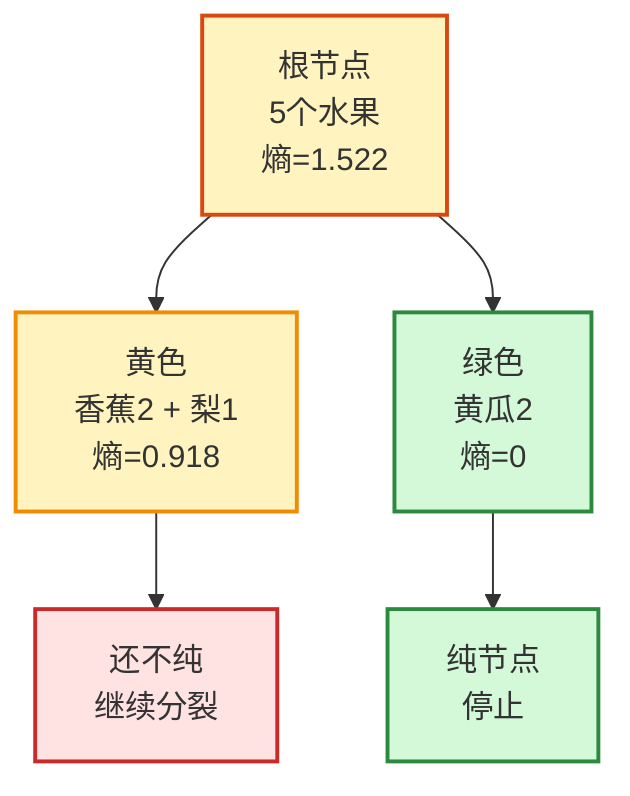

> [!info] 课程
> 2.1 决策树原理与经济学应用


> [!info] 整理原则
> 这份笔记根据老师课堂内容整理，将决策树的定义、分裂准则、剪枝策略、调参方法、回归树评价和经济学应用整理为学习笔记。

## 一、决策树的基本概念

### 1. 决策树的定义

决策树是一类非参数、有监督学习方法。所谓非参数，不是指模型没有参数，而是指模型不预先假定一个固定的函数形式；所谓有监督，是指训练样本中同时包含特征 `X` 和标签 `Y`，模型通过学习二者之间的映射关系完成分类或回归。

决策树的基本思想是通过一系列特征判断将样本逐步划分到不同节点中，使得同一叶子节点中的样本尽可能相似。对于分类任务，叶子节点一般输出多数类；对于回归任务，叶子节点一般输出该节点内样本标签的均值。

### 2. 决策树结构

一棵决策树由根节点、中间节点、分支和叶子节点构成。根节点代表第一次特征提问；中间节点代表进一步判断；分支代表判断结果；叶子节点代表最终预测结论。

例如，在判断西瓜好坏时，可以依次询问“色泽是否乌黑”“根蒂是否蜷缩”“纹理是否清晰”等问题。每一次提问都是对一个特征的测试，测试结果决定样本进入哪一个子节点。

### 3. 决策树的两个核心问题

决策树训练需要解决两个问题。

第一，如何选择用于分裂的特征。一个好的分裂应当最大程度降低子节点的不纯度，使得划分后的样本更加同质。

第二，何时停止分裂。如果树持续生长，模型可能把训练集中的噪声也纳入规则，从而产生过拟合。所以，必须使用剪枝策略限制树的复杂度。

## 二、节点不纯度与特征选择

### 1. 信息熵

信息熵用于衡量样本集合的不纯度。如果某节点中样本类别高度混杂，信息熵较大；如果节点中样本几乎属于同一类别，信息熵较小。

$$
Entropy(t)=-\sum_i p(i|t)\log_2 p(i|t)
$$

其中，$p(i|t)$ 表示节点 $t$ 中第 $i$ 类样本所占比例。当所有样本属于同一类别时，熵为 0；当类别比例接近均衡时，熵达到较大值。

### 2. 信息增益

信息增益衡量一次分裂带来的不纯度下降。如果使用特征 $a$ 分裂数据集 $D$，信息增益可以表示为：

$$
Gain(D,a)=Ent(D)-\sum_{v=1}^{V}\frac{|D^v|}{|D|}Ent(D^v)
$$

其中，$D^v$ 是特征 $a$ 的第 $v$ 个取值对应的子集。信息增益越大，说明该特征越能提高节点纯度。ID3 算法以信息增益为主要划分准则。

### 3. 增益率

信息增益可能偏好取值数量较多的特征。增益率通过将信息增益除以特征自身的分裂信息，缓解这一偏好。

$$
Gain\_ratio(D,a)=\frac{Gain(D,a)}{IV(a)}
$$

C4.5 算法使用增益率作为划分依据。课堂中强调，信息增益与增益率的差异不只是公式差异，更反映了对“好特征”的不同衡量方式。

### 4. 基尼系数

基尼系数同样用于衡量节点不纯度。分类问题中，基尼系数可写作：

$$
Gini(t)=1-\sum_i p(i|t)^2
$$

当节点中所有样本属于同一类别时，基尼系数为 0；当类别越混杂，基尼系数越大。CART 决策树常使用基尼系数选择分裂特征。

### 5. 信息熵与基尼系数的比较

信息熵对不纯度变化更敏感，基尼系数相对更温和。实际建模中，二者都可以用于构建分类树。老师强调，理解这些指标的关键不是机械背公式，而是理解它们都服务于同一目标：选择能最大程度降低节点混乱程度的分裂规则。

## 三、sklearn 决策树建模流程

### 1. 基本模块

`sklearn.tree` 提供了决策树分类器、决策树回归器以及树结构导出工具。常用对象包括：

```python
from sklearn import tree
from sklearn.datasets import load_wine
from sklearn.model_selection import train_test_split
```

其中，`DecisionTreeClassifier` 用于分类任务，`DecisionTreeRegressor` 用于回归任务，`export_graphviz` 或相关可视化工具可以展示树结构。

### 2. 建模三步

决策树建模遵循机器学习中的基本流程：

```python
clf = tree.DecisionTreeClassifier(random_state=888)
clf = clf.fit(X_train, y_train)
score = clf.score(X_test, y_test)
```

第一步是实例化模型，第二步是使用训练集拟合模型，第三步是在测试集上评估模型表现。

### 3. 特征矩阵与标签向量

课堂特别强调，`X` 一般是二维特征矩阵，每一行代表一个样本，每一列代表一个特征；`y` 一般是一维标签向量，表示每个样本的类别或连续结果。理解这一点是阅读 sklearn 代码的基础。

## 四、决策树的随机性来源

### 1. random_state

`random_state` 用于控制随机过程，使结果可复现。如果不固定随机种子，多次运行模型可能得到不同树结构或不同评估结果。

### 2. splitter

`splitter` 决定节点分裂策略。`best` 表示选择最优分裂，`random` 表示在候选分裂中引入随机性。随机性可以降低模型对训练数据的依赖，但也可能影响单次模型表现。

## 五、剪枝策略与模型复杂度控制

### 1. 决策树的过拟合倾向

决策树如果不加限制，可能不断分裂直到训练集节点高度纯净。这会使训练集表现很好，但测试集表现下降。所以，决策树的学习重点不仅是建模，更是剪枝与调参。

### 2. 重要剪枝参数

| 参数 | 含义 | 对模型复杂度的影响 |
|---|---|---|
| `max_depth` | 树的最大深度 | 越大模型越复杂，越小模型越保守 |
| `min_samples_leaf` | 叶子节点最少样本数 | 越大越不容易形成细碎叶子 |
| `min_samples_split` | 节点继续分裂所需最少样本数 | 越大越不容易继续分裂 |
| `max_features` | 每次分裂考虑的最大特征数 | 越小随机性越强 |
| `min_impurity_decrease` | 分裂所需最小不纯度下降 | 越大分裂越谨慎 |

这些参数都服务于一个目标：降低模型复杂度，控制过拟合风险。

### 3. 学习曲线

学习曲线用于观察单个超参数变化对模型表现的影响。例如，可以令 `max_depth` 从 1 到 10 变化，分别记录训练集分数和测试集分数。如果训练集分数持续上升而测试集分数先升后降，说明模型复杂度过高后出现过拟合。

### 4. 网格搜索

网格搜索用于同时比较多个超参数组合。带交叉验证的网格搜索可以写作：

```python
from sklearn.model_selection import GridSearchCV

param_grid = {
    "criterion": ["gini", "entropy"],
    "max_depth": range(1, 11),
    "min_samples_leaf": range(1, 50, 5),
    "splitter": ["best", "random"],
}

gs = GridSearchCV(tree.DecisionTreeClassifier(random_state=888), param_grid, cv=10)
gs.fit(X_train, y_train)
```

网格搜索的意义在于系统比较参数组合，但它的计算成本较高，所以参数范围不能无限扩大。

## 六、非平衡样本与 class_weight

### 1. 非平衡样本问题

当某一类别样本数量远多于另一类别时，模型可能倾向于预测多数类，从而获得表面上较高的准确率。例如，在违约预测、疾病识别或欺诈识别中，少数类往往更重要。

### 2. class_weight 的作用

`class_weight` 可以提高少数类样本在损失函数中的权重，使模型在训练时更加重视少数类。该参数不改变样本本身，而是改变错误分类不同类别时的惩罚程度。

## 七、回归树与评价指标

### 1. 回归树的基本思想

回归树用于连续型标签预测。分类树在叶子节点输出类别，回归树在叶子节点输出连续数值，一般是该叶子节点中训练样本标签的平均值。

### 2. R²、MSE 与 MAE

回归树常见评价指标包括：

$$
MSE=\frac{1}{n}\sum_{i=1}^{n}(y_i-\hat{y}_i)^2
$$

$$
MAE=\frac{1}{n}\sum_{i=1}^{n}|y_i-\hat{y}_i|
$$

$$
R^2=1-\frac{\sum_i(y_i-\hat{y}_i)^2}{\sum_i(y_i-\bar{y})^2}
$$

MSE 对大误差更敏感，MAE 更直观，R² 衡量模型相对于均值预测的改进程度。R² 可以为负，这句话就是说模型预测效果还不如直接使用均值。

## 八、决策树的优缺点与适用场景

### 1. 优点

决策树结构直观，结果易解释，能够处理非线性关系和特征交互，对变量尺度不如线性模型敏感。它适合用于教学、业务规则提取、初步建模和树模型集成方法的基础学习。

### 2. 缺点

单棵决策树方差较大，容易过拟合，对训练数据扰动较敏感。树结构的微小变化可能导致最终规则发生较大变化。所以，在实际应用中，决策树常作为随机森林、GBDT、XGBoost 等集成算法的基学习器。
---

## 九、信息熵与信息增益：从直觉到计算

### 1. 直觉先行

**信息熵（Entropy）就是用一个数字衡量“这一堆样本有多乱”。**  
如果一个节点里全是同一类样本，它就很纯，熵接近$0$；如果一半正类、一半负类，它最乱，熵更高。

### 2. 符号定义

| 符号 | 含义 | 水果例子里的值 |
|---|---|---|
| $D$ | 当前样本集合 | 5个水果 |
| $p_i$ | 第$i$类样本比例 | 香蕉$2/5$，梨$1/5$，黄瓜$2/5$ |
| $Ent(D)$ | 当前节点的信息熵 | 根节点混乱程度 |
| $D^v$ | 按某个特征划分后的子集 | 黄色水果、绿色水果 |
| $Gain(D,a)$ | 用特征$a$划分带来的信息增益 | 按颜色划分后熵下降多少 |

### 3. 公式

先看熵的公式：

$$
\begin{aligned}
Ent(D)
&= -\sum_{i=1}^{n} p_i\log_2 p_i
\end{aligned}
$$

再看信息增益：

$$
\begin{aligned}
Gain(D,a)
&= Ent(D)-\sum_{v=1}^{V}\frac{|D^v|}{|D|}Ent(D^v)
\end{aligned}
$$

### 4. 走一遍水果例子

假设根节点有5个样本：香蕉2个、梨1个、黄瓜2个。

$$
\begin{aligned}
p_{\text{香蕉}}&=\frac{2}{5}=0.4\\[4pt]
p_{\text{梨}}&=\frac{1}{5}=0.2\\[4pt]
p_{\text{黄瓜}}&=\frac{2}{5}=0.4\\[8pt]
Ent(D)
&=-(0.4\log_2 0.4+0.2\log_2 0.2+0.4\log_2 0.4)\\
&\approx 1.522
\end{aligned}
$$

如果按颜色划分：

- 黄色分支：香蕉2个、梨1个，熵约为$0.918$
- 绿色分支：黄瓜2个，熵为$0$

$$
\begin{aligned}
Ent_{\text{划分后}}
&=\frac{3}{5}\times0.918+\frac{2}{5}\times0\\
&\approx0.551\\[8pt]
Gain(D,\text{颜色})
&=1.522-0.551\\
&\approx0.971
\end{aligned}
$$

这句话就是说：**按颜色提问以后，样本明显变得更纯，所以“颜色”是一个不错的分裂特征。**

### 5. Mermaid 决策树图



### 6. 对比总结

| 指标 | 在干什么 | 越大说明什么 | 常见算法 |
|---|---|---|---|
| 信息熵（Entropy） | 衡量节点有多乱 | 节点越不纯 | ID3相关 |
| 信息增益（Information Gain） | 衡量分裂后变纯了多少 | 这个特征越值得拿来分裂 | ID3 |
| 增益率（Gain Ratio） | 用比例修正信息增益偏好 | 更公平地比较多取值特征 | C4.5 |
| 基尼系数（Gini Index） | 另一种不纯度指标 | 节点越不纯 | CART |
