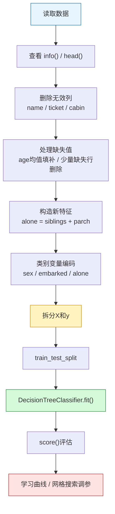

> [!info] 课程
> 2.2 决策树代码实战


> [!info] 整理原则
> 本笔记根据课堂字幕整理，将回归树拟合、泰坦尼克号案例、探索性数据分析、数据预处理、特征编码、学习曲线和网格搜索整理为可复习的代码实战笔记。

## 一、回归树拟合非线性曲线

### 1. 回归树与非线性关系

回归树可以通过不断划分特征空间来拟合非线性关系。与线性回归不同，回归树不要求真实关系是一条直线，而是将特征空间切分为多个区域，并在每个区域中给出一个局部预测值。

### 2. 树深度与过拟合

树深度决定模型复杂度。深度较小的树可能无法捕捉真实曲线，表现为欠拟合；深度过大的树可能对训练点和噪声高度敏感，表现为过拟合。课堂通过非线性曲线拟合说明，树模型虽然灵活，但必须通过 `max_depth` 等参数限制复杂度。

## 二、泰坦尼克号数据集的建模目标

### 1. 问题定义

泰坦尼克号案例的目标是根据乘客信息预测其是否生还。这是一个二分类问题。标签变量是 `survived`，特征变量包括舱位、性别、年龄、同行亲属数量、票价、登船港口等。

### 2. 案例价值

该案例的重点不只是训练一棵决策树，而是完整展示从原始数据到可建模特征矩阵的流程。机器学习实战中，模型训练一般只占一部分工作，更多时间用于理解数据、清洗数据、构造特征和处理变量类型。

## 三、探索性数据分析

### 1. 数据基本信息

建模前需要查看数据的行列数量、字段类型、缺失情况和前几行样本。`info()` 可以显示每列的非空数量和数据类型，`head()` 可以帮助观察变量取值形式。

```python
data.info()
data.head()
```

如果某一列的数据类型是 `object`，说明它一般是字符串或类别变量，不能直接作为大多数 sklearn 模型的输入。

### 2. 性别、舱位与生还率

课堂使用 `seaborn` 的可视化工具观察性别、舱位和生还率之间的关系。性别变量显示，女性乘客生还概率显著高于男性。舱位变量显示，头等舱乘客往往具有更高生还率。这些发现具有明确的业务含义，也提示模型可能会利用这些变量进行分类。

### 3. 年龄分布与核密度图

年龄变量可以通过直方图和核密度图观察分布。课堂比较了男性与女性乘客的年龄分布，并进一步讨论年龄与生还概率之间的关系。年龄不是简单的类别变量，既可能存在缺失，也可能与性别、舱位等变量存在交互关系。

### 4. 登船港口与其他变量

登船港口 `embarked` 是三分类变量。课堂中观察到不同登船港口可能对应不同舱位结构和乘客组成，从而影响生还概率。所以，登船港口虽然本身只是类别标签，但可能间接反映乘客社会经济特征。

## 四、数据清洗与变量处理

### 1. 删除无效或缺失严重的列

姓名、船票号和船舱号等字段在该案例中不直接进入模型。姓名和船票号如果未经额外特征工程，作为字符串直接建模意义有限；船舱号缺失严重，保留成本较高。所以课堂选择删除这些列。

```python
data.drop(["name", "ticket", "cabin"], axis=1, inplace=True)
```

### 2. 缺失值填补

年龄 `age` 存在缺失。课堂采用均值填补作为基础处理方法：

```python
data["age"] = data["age"].fillna(data["age"].mean())
```

均值填补的优点是简单、可操作；缺点是会压缩变量方差，无法反映缺失值背后的结构性差异。在后续随机森林课程中，老师进一步讲解了模型填补法。

### 3. 删除少量缺失行

对于缺失比例较低的变量，可以直接删除缺失样本：

```python
data.dropna(inplace=True)
```

是否删除取决于缺失比例、样本量和变量重要性。如果缺失值过多，删除会造成信息损失；如果缺失很少，删除可能是更简洁的方案。

## 五、特征构造

### 1. 是否独自登船

课堂将 `siblings` 和 `parch` 相加，构造 `alone` 变量，用来表示乘客是否与亲属同行。

```python
data["alone"] = data["siblings"] + data["parch"]
data["alone"] = data["alone"].apply(lambda x: "with family" if x > 0 else "without family")
```

这一处理说明，特征工程不仅是删除和转换变量，也包括基于业务含义构造新变量。是否与家人同行可能影响逃生机会，也可能反映乘客年龄、性别和舱位结构。

### 2. 特征构造的原则

构造变量时应当关注变量是否能够表达原始字段背后的有效信息。`siblings + parch` 之所以有意义，是因为它把两个亲属数量变量合成为“是否有家庭支持”这一更接近研究问题的特征。

## 六、类别变量编码

### 1. 二分类变量编码

性别 `sex` 可以转化为 0/1 变量。二分类变量编码后即可进入模型。

```python
data["sex"] = data["sex"].apply(lambda x: 1 if x == "male" else 0)
```

### 2. 多分类变量编码

登船港口 `embarked` 包含 `S`、`C`、`Q` 三类。课堂使用 `unique()` 得到类别列表，再通过 `apply()` 和 `index()` 将类别转为数字。

```python
labels = data["embarked"].unique().tolist()
data["embarked"] = data["embarked"].apply(lambda x: labels.index(x))
```

需要注意，如果类别变量本身没有大小顺序，简单编码为 0、1、2 可能让部分模型误以为类别之间存在数值距离。对于线性模型，一般更适合独热编码；对于树模型，简单整数编码在某些场景下也能使用，但仍需理解其含义。

## 七、特征矩阵与标签拆分

### 1. 使用 iloc 选择变量

课堂使用 `iloc` 将数据拆分为特征矩阵 `X` 和标签向量 `y`。`iloc` 按行列位置选择数据，冒号表示选取全部行或全部列。

```python
X = data.iloc[:, 1:]
y = data.iloc[:, 0]
```

拆分后应检查 `X` 是否为二维矩阵，`y` 是否为一维标签。

### 2. 训练集与测试集划分

```python
from sklearn.model_selection import train_test_split

X_train, X_test, y_train, y_test = train_test_split(
    X, y, test_size=0.3, random_state=888
)
```

`test_size=0.3` 表示 30% 样本用于测试，`random_state` 用于保证划分可复现。

## 八、决策树建模与调参

### 1. 基础建模流程

```python
from sklearn.tree import DecisionTreeClassifier

clf = DecisionTreeClassifier(random_state=888)
clf.fit(X_train, y_train)
score = clf.score(X_test, y_test)
```

该流程体现 sklearn 统一接口：实例化、拟合、评估。

### 2. max_depth 学习曲线

为了观察树深对模型表现的影响，可以循环不同 `max_depth`，分别记录训练集和测试集分数。如果训练集分数持续提高但测试集分数下降，说明树深过大导致过拟合。

### 3. 网格搜索

网格搜索通过组合多个参数候选值寻找较优模型。课堂使用 `GridSearchCV` 说明带交叉验证的参数搜索方法。需要注意，网格搜索不保证找到理论最优模型，它只在给定候选范围内搜索最优组合。

## 九、本节代码实战的学习重点

### 1. 模型之前的数据处理更重要

泰坦尼克号案例说明，模型训练之前必须完成数据理解、缺失值处理、类别变量编码、特征构造和矩阵拆分。如果数据处理错误，模型即使成功运行，结果也可能没有解释价值。

### 2. 树模型实战的基本流程

完整流程可以归纳为：

```text
读取数据
↓
查看字段与缺失情况
↓
探索变量与标签关系
↓
删除无效列、填补缺失值
↓
构造新特征、编码类别变量
↓
拆分 X 与 y
↓
划分训练集与测试集
↓
训练决策树
↓
用学习曲线和网格搜索调参
```
---

## 十、泰坦尼克号案例：完整建模流程图

这节代码实战你要抓住一条线：**不是先上模型，而是先把原始表格整理成模型能读懂的特征矩阵。**



### 1. 代码中的三个核心动作

```python
clf = DecisionTreeClassifier(random_state=888)
clf.fit(X_train, y_train)
score = clf.score(X_test, y_test)
```

- `DecisionTreeClassifier(...)`：创建一个决策树分类器。
- `fit(X_train, y_train)`：让模型在训练集上学习规则。
- `score(X_test, y_test)`：看模型在测试集上的预测表现。

这句话就是说：**sklearn API的核心不是复杂，而是统一。分类、回归、随机森林、线性回归，基本都遵循“实例化→训练→预测/评分”这条线。**
