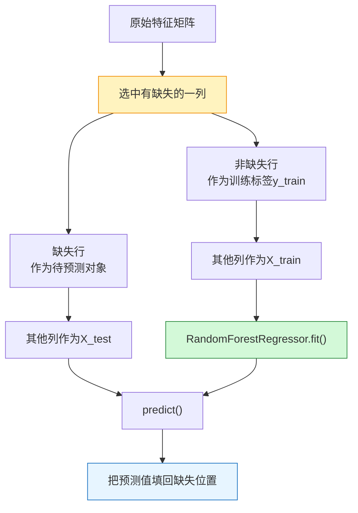

> [!info] 课程
> 3.2 随机森林实战案例：填补缺失数据、调参的艺术


> [!info] 整理原则
> 这份笔记根据老师课堂内容整理，将随机森林用于缺失值填补的流程、偏差—方差调参逻辑、交叉验证和网格搜索整理为学习笔记。

## 一、缺失值处理的基本问题

### 1. 缺失值为何重要

机器学习模型一般要求输入特征矩阵完整。如果特征中存在缺失值，许多 sklearn 模型无法直接训练。所以，缺失值处理是建模前的重要环节。

缺失值处理不能只看技术是否方便，还要考虑缺失比例、缺失机制和变量重要性。缺失很少时可以删除样本；缺失严重时可以删除变量；如果变量重要且其他特征能够提供信息，则可以考虑填补。

### 2. 常见填补方法

| 方法 | 思路 | 优点 | 局限 |
|---|---|---|---|
| 均值填补 | 用变量均值替换缺失值 | 简单快速 | 压缩变量方差 |
| 0 填补 | 用固定值 0 替换缺失值 | 操作简单 | 可能引入不真实含义 |
| 中位数/众数填补 | 用稳健统计量填补 | 对异常值更稳健 | 忽略样本差异 |
| 模型填补 | 用其他变量预测缺失值 | 能利用变量间关系 | 计算复杂，可能引入模型误差 |

## 二、随机森林填补缺失值

### 1. 基本思想

随机森林填补缺失值的核心思想是将“需要填补的特征列”临时作为预测目标。对于该列非缺失的样本，使用其他特征作为输入训练随机森林模型；对于该列缺失的样本，使用训练好的模型预测其缺失值。

换言之，缺失值填补被转化为一个监督学习问题。

### 2. 操作流程

随机森林填补可以分为以下步骤：

```text
确定待填补变量
↓
将该变量非缺失部分作为 y_train
↓
将其他特征中对应行作为 X_train
↓
将该变量缺失部分对应的其他特征作为 X_test
↓
训练随机森林回归器或分类器
↓
预测缺失位置并回填原特征矩阵
```

如果待填补变量是连续变量，使用 `RandomForestRegressor`；如果待填补变量是类别变量，使用 `RandomForestClassifier`。

### 3. 按缺失数量排序填补

当多个特征都存在缺失时，课堂采用按缺失数量从少到多的顺序逐列填补。这样做的原因是，先填补缺失较少的变量，可以在后续填补缺失较多变量时提供更完整的特征矩阵。

### 4. 代码结构

模型填补的核心代码逻辑可以概括为：

```python
known = data[data[target_col].notna()]
unknown = data[data[target_col].isna()]

X_train = known.drop(columns=[target_col])
y_train = known[target_col]
X_test = unknown.drop(columns=[target_col])

model.fit(X_train, y_train)
data.loc[data[target_col].isna(), target_col] = model.predict(X_test)
```

课堂中的代码更复杂，是因为它要处理多个缺失列，并在每次循环中重新组织 `X_train`、`y_train`、`X_test` 和待回填位置。

## 三、不同填补方法的比较

### 1. 使用交叉验证比较填补效果

老师将完整数据、0 填补、均值填补和随机森林填补得到的特征矩阵分别送入模型，并使用交叉验证下的负均方误差比较不同方案。由于 sklearn 中 `neg_mean_squared_error` 是负的 MSE，一般需要取相反数还原为正的均方误差。

### 2. 结果解释

课堂结果显示，随机森林模型填补在该案例中得到较小的 MSE。这说明其他特征中包含能够预测缺失列的信息，模型填补比简单均值填补更有效。

但需要注意，如果使用全部数据参与填补和评估，可能存在信息泄露风险。严格建模时，应当在训练集内部拟合填补器，再将同一填补规则应用于验证集或测试集。

## 四、调参的基本目标

### 1. 泛化误差

机器学习调参的目标不是使训练集分数最高，而是使泛化误差最低。泛化误差可以从偏差、方差和不可约误差三个部分理解：

$$
Generalization\ Error = Bias^2 + Variance + Irreducible\ Error
$$

偏差过高一般这句话就是说模型过于简单，方差过高一般这句话就是说模型过于复杂。

### 2. 偏差—方差平衡

调参本质上是在偏差和方差之间寻找平衡。如果模型欠拟合，应提高模型复杂度；如果模型过拟合，应降低模型复杂度。随机森林中，不同参数对复杂度的影响方向不同，所以调参必须理解参数含义。

## 五、随机森林重要参数

### 1. n_estimators

`n_estimators` 表示森林中树的数量。树越多，模型一般越稳定，但计算成本越高。该参数对复杂度的影响不完全等同于树深；更多树主要降低方差，而不是简单提高单棵树复杂度。

### 2. max_depth

`max_depth` 限制每棵树的最大深度。深度越大，单棵树越复杂，越可能过拟合；深度越小，模型更保守，可能欠拟合。

### 3. min_samples_leaf 与 min_samples_split

`min_samples_leaf` 控制叶子节点最少样本数，`min_samples_split` 控制节点继续分裂所需的最少样本数。二者越大，树越不容易长得过深，模型越保守。

### 4. max_features

`max_features` 控制每次分裂时参与候选的特征数量。较小的 `max_features` 会增加树之间差异，降低相关性；但如果过小，单棵树预测能力也可能下降。

## 六、调参方法

### 1. 单参数学习曲线

学习曲线适合研究单个参数如何影响模型表现。例如固定其他参数，改变 `max_depth`，记录交叉验证分数。如果分数先上升后下降，可以在峰值附近进一步搜索。

### 2. 网格搜索

网格搜索适合在确定较小候选范围后组合搜索多个参数。课堂强调，网格搜索范围不宜过大，因为多个参数组合会迅速增加计算量。

```python
from sklearn.model_selection import GridSearchCV
from sklearn.ensemble import RandomForestRegressor

param_grid = {
    "n_estimators": [50, 100, 200],
    "max_depth": [None, 5, 10, 20],
    "min_samples_leaf": [1, 2, 5],
}

search = GridSearchCV(RandomForestRegressor(random_state=0), param_grid, cv=5)
search.fit(X_train, y_train)
```

### 3. 调参顺序

调参应优先处理影响较大、方向较明确的参数，例如 `max_depth`、`min_samples_leaf`。对于影响不单调或与其他参数交互明显的参数，应结合学习曲线和交叉验证结果判断。

## 七、本节学习重点

### 1. 缺失值填补不是简单替换

随机森林填补说明，缺失值处理可以被建模化。只要其他特征与缺失列存在稳定关系，模型就可以学习这种关系并完成填补。

### 2. 调参不是追求复杂模型

调参的最终标准是验证集或交叉验证表现，而不是训练集表现。复杂度不足会欠拟合，复杂度过高会过拟合；有效调参必须以偏差—方差平衡为中心。
---

## 八、随机森林填补缺失值：流程图

这部分的核心直觉是：**某一列缺失了，就临时把这一列当作$y$，用其他列当作$X$去预测它。**



### 1. 泛化误差公式

先说人话：模型预测不好，通常有两种原因。要么模型太简单，学不到规律；要么模型太复杂，把噪声也学进去了。

$$
\begin{aligned}
\text{泛化误差}
&= \text{偏差}^2+\text{方差}+\text{不可约误差}\\[4pt]
&= Bias^2+Variance+Irreducible\ Error
\end{aligned}
$$

| 情况 | 训练集表现 | 测试集表现 | 问题 |
|---|---|---|---|
| 欠拟合 | ❌ 差 | ❌ 差 | 偏差太高 |
| 正常拟合 | ✅ 好 | ✅ 好 | 偏差和方差平衡 |
| 过拟合 | ✅ 很好 | ❌ 差 | 方差太高 |
