# 机器学习部分

## 一、特征工程

### 1. 特征归一化

#### 1）什么是特征归一化

对数值类型的特征做归一化可以将所有的特征都统一到一个大致相同的数值区间内。

#### 2）为什么要特征归一化

为了消除数据特征之间的量纲影响，我们需要对特征进行归一化处理，使得不同指标之间具有可比性。例如，分析一个人的身高和体重对健康的影响，如果使用米（m）和千克（kg）作为单位，那么身高特征会在1.6～1.8m的数值范围内，体重特征会在50～100kg的范围内，分析出来的结果显然会倾向于数值差别比较大的体重特征。想要得到更为准确的结果，就需要进行特征归一化（Normalization）处理，使各指标处于同一数值量级，以便进行分析。

#### 3）特征归一化常用的方法

- 线性函数归一化（Min-Max Scaling）。它对原始数据进行线性变换，使结果映射到[0，1]的范围，实现对原始数据的等比缩放。
- 零均值归一化（Z-Score Normalization）。它会将原始数据映射到均值为0、标准差为1的分布上。

#### 4）归一化处理适用模型

- 应用归一化的模型。在实际应用中，通过梯度下降法求解的模型通常是需要归一化的，包括线性回归、逻辑回归、支持向量机、神经网络等模型。
- 不使用归一化的模型。如决策树。

### 2. 图像样本增强

1）在图像分类任务中，训练数据不足会带来什么问题？

当训练数据不足时，说明模型从原始数据中获取的信息比较少，这种情况下要想保证模型的效果，就需要更多先验信息。具体到图像分类任务上，训练数据不足带来的问题主要表现在过拟合方面，即模型在训练样本上的效果可能不错，但在测试集上的泛化效果不佳。

2）如何缓解数据量不足带来的问题？

- 一定程度内的随机旋转、平移、缩放、裁剪、填充、左右翻转等，这些变换对应着同一个目标在不同角度的观察结果。
- 对图像中的像素添加噪声扰动，比如椒盐噪声、高斯白噪声等。
- 颜色变换。
- 改变图像的亮度、清晰度、对比度、锐度等。

### 3. 什么是监督学习、非监督学习

1）监督学习。监督学习是使用已知正确答案的示例来训练网络。已知数据和其一一对应的标签，训练一个预测模型，将输入数据映射到标签的过程。

2）非监督学习。在非监督式学习中，数据并不被特别标识，适用于你具有数据集但无标签的情况。学习模型是为了推断出数据的一些内在结构。

### 4. 监督学习、非监督学习主要应用场景

1）监督学习：回归、分类

2）非监督学习：聚类、PCA、GAN、GMM


## 二、模型评估（重点）

### 1. 回归问题模型评估指标？

- 平均绝对误差（Mean Absolute Deviation）：单个观测值与算术平均值的偏差的绝对值的平均。
- 均方误差：单个样本到平均值差值的平方平均值。
- MAD(中位数绝对偏差)：与数据中值绝对偏差的中值。
- R2决定系数：趋向于1，模型越好；趋向于0，模型越差。

### 2. 分类问题模型评估指标？

查准率（Precision）：分类正确数量 / (分类正确数量 + 多分类的数量)，范围[0,1]。简单说来就是“分类对不对”。

召回率（Precision）：分类正确数量 / (分类正确数量 + 少分类的数量)，范围[0,1]。简单说来就是“分类全不全”。

F1得分：2 * 查询率 * 召回率  / (查准率 + 召回率), 范围[0, 1] ，综合考虑了查准率、召回率。

### 3. A/B测试

#### 1）什么是A/B测试？

A/B测试就是两种模型同时运行，并在实际环境中验证其效果的方式。在互联网公司中，A/B 测试是验证新模块、新功能、新产品是否有效，新算法、新模型的效果是否有提升，新设计是否受到用户欢迎，新更改是否影响用户体验的主要测试方法。在机器学习领域中，A/B 测试是验证模型最终效果的主要手段。

#### 2）为什么需要A/B测试？

- 离线评估无法完全消除模型过拟合的影响，因此，得出的离线评估结果无法完全替代线上评估结果。
- 离线评估无法完全还原线上的工程环境。一般来讲，离线评估往往不会考虑线上环境的延迟、数据丢失、标签数据缺失等情况。因此，离线评估的结果是理想工程环境下的结果。
- 线上系统的某些商业指标在离线评估中无法计算。

#### 3）如何进行线上A/B测试？

进行A/B测试的主要手段是进行用户分桶，即将用户分成实验组和对照组，对实验组的用户施以新模型，对对照组的用户施以旧模型。在分桶的过程中，要注意样本的独立性和采样方式的无偏性，确保同一个用户每次只能分到同一个桶中，在分桶过程中所选取的user_id需要是一个随机数，这样才能保证桶中的样本是无偏的。

### 4. 超参数（重点）

#### 1）什么是超参数？

超参数是在开始学习过程之前设置值的参数，而不是通过训练得到的参数数据。

#### 2）超参数有哪些调优手段？

##### ① 网格搜索

网格搜索指查找搜索范围内的所有的点来确定最优值。如果采用较大的搜索范围以及较小的步长，网格搜索有很大概率找到全局最优值。然而，这种搜索方案十分消耗计算资源和时间，特别是需要调优的超参数比较多的时候。因此，在实际应用中，网格搜索法一般会先使用较广的搜索范围和较大的步长，来寻找全局最优值可能的位置；然后会逐渐缩小搜索范围和步长，来寻找更精确的最优值。这种操作方案可以降低所需的时间和计算量，但由于目标函数一般是非凸的，所以很可能会错过全局最优值。

##### ② 随机搜索

随机搜索的思想与网格搜索比较相似，只是不再测试上界和下界之间的所有值，而是在搜索范围中随机选取样本点。它的理论依据是，如果样本点集足够大，那么通过随机采样也能大概率地找到全局最优值，或其近似值。随机搜索一般会比网格搜索要快一些，但是和网格搜索的快速版一样，它的结果也是没法保证的。

##### ③ 验证曲线和学习曲线

- 验证曲线：根据不同评估系数来确定超参数优劣。
- 学习曲线：根据训练数据规模确定算法优劣。

#### 3）常用超参数对模型的性能影响

##### ① 学习率

学习率太大导致无法收敛，太小导致收敛慢

##### ② 损失函数部分超参数

对于部分损失函数超参数其变化会对结果十分敏感，而有些则并不会太影响。在调整时，建议参考论文的推荐值，并在该推荐值数量级上进行最大最小值调试该参数对结果的影响。

##### ③ 批样本数量

过大导致训练速度慢，过小导致收敛不稳定

##### ④ 丢弃率

较小的丢弃率可提升准确度，但可能导致过拟合

##### ⑤ 卷积核大小

增加卷积核尺寸意味着参数量的增加，同条件下，模型参数也相应的增加。尽量选取小的卷积核。卷积核越大，感受野越大

##### ⑥ 模型深度

同条件，下增加深度意味着模型具有更多的参数，更强的拟合能力，深度越深意味着参数越多，需要的时间和硬件资源也越高。

##### ⑦ 神经网络中神经元的数量、神经网络层数

神经元数量越多，模型越复杂，拟合能力越强，参数规模越大；神经元越少，模型越简单，拟合能力越弱。

神经网络层数越少，模型越简单，拟合能力弱；层数越深，模型越复杂，拟合能力越强，过拟合风险越高。

##### ⑧ 正则强度

调整正则项权重，使用合适的正则强度

##### ⑨ 随机森林中树的数量、深度

树的数量越多，计算量越大，过拟合风险越低；树的数量越少，计算量越小，过拟合风险越高；

### 5. 欠拟合与过拟合（重点）

#### 1）什么是欠拟合、过拟合？

欠拟合指的是模型在训练和预测时表现都不好的情况；过拟合是指模型对于训练数据拟合呈过当的情况，反映到评估指标上，就是模型在训练集上的表现很好，但在测试集和新数据上的表现较差。

#### 2）如何避免过拟合？

- 扩大样本数据。使用更多的训练数据是解决过拟合问题最有效的手段，因为更多的样本能够让模型学习到更多更有效的特征，减小噪声的影响。
- 降低模型复杂度。在数据较少时，模型过于复杂是产生过拟合的主要因素，适当降低模型复杂度可以避免模型拟合过多的采样噪声。例如，在神经网络模型中减少网络层数、神经元个数等；在决策树模型中降低树的深度、进行剪枝等。
- 正则化方法。给模型的参数加上一定的正则约束，比如将权值的大小加入到损失函数中。
- 集成学习方法。集成学习是把多个模型集成在一起，来降低单一模型的过拟合风险。
- 减少训练迭代次数、提前停止训练。
- 神经网络中，加入dropout操作层，或者采用BN。
- 主动加入噪声数据样本。

#### 3）如何避免欠拟合？

- 添加新特征。当特征不足或者现有特征与样本标签的相关性不强时，模型容易出现欠拟合。
- 增加模型复杂度。简单模型的学习能力较差，通过增加模型的复杂度可以使模型拥有更强的拟合能力。例如，在线性模型中添加高次项，在神经网络模型中增加网络层数或神经元个数等。
- 减小正则化系数。正则化是用来防止过拟合的，但当模型出现欠拟合现象时，则需要有针对性地减小正则化系数。

### 6. 什么是置信概率？

置信概率（Confidence Probability）是用来衡量推断靠程度的概率，该值越大说明推断结果确定性越大，该值越小说明推断结果不确定性越大。

### 7. 什么是交叉验证

交叉验证指将含有N个样本的数据集，分成K份，每份含有N/K个样本。选择其中1份作为测试集，另外K-1份作为训练集，测试集就有K种情况。将K种情况下，模型的泛化误差取均值，得到模型最终的泛化误差。

交叉验证的作用是为了得到更为稳健可靠的模型，对模型的泛化误差进行评估。

### 8. 列举解决类别不均衡问题的方法（重点）

1）扩大数据集。增加包含小类样本数据的数据，更多的数据能得到更多的分布信息。

2）对大类数据欠采样，减少大类数据样本个数，使与小样本个数接近；对少量样本类别进行随机过采样，即对样本较少的类别进行复制，使得样本数量均衡。

3）使用新评价指标。如果当前评价指标不适用，则应寻找其他具有说服力的评价指标。

4）选择新算法。不同的算法适用于不同的任务与数据，应该使用不同的算法进行比较。

5）数据代价加权。例如当分类任务是识别小类，那么可以对分类器的小类样本数据增加权值，降低大类样本的权值，从而使得分类器将重点集中在小类样本身上。

6）随机过采样：随机对数量较少的类别样本进行复制

### 9. 什么是L1，L2正则化

机器学习中几乎都可以看到损失函数后面会添加一个额外项，常用的额外项一般有两种，一般英文称作 L1-norm 和L2-norm，中文称作 L1正则化 和 L2正则化，或者 L1范数 和 L2范数。L1正则化和L2正则化可以看做是损失函数的惩罚项，所谓"惩罚"是指对损失函数中的某些参数做一些限制。范数的表达式为：
$$
||x||_p=(\sum|x_i|^p)^{\frac{1}{p}}
$$
当p=1时，是L1范数，其表示某个向量中所有元素绝对值的和

当p=2时，是L2范数， 表示某个向量中所有元素平方和再开根， 也就是欧几里得距离公式

正则化通过降低模型的复杂性， 达到避免过拟合的问题，原因是：（1）而加入正则能抑制系数过大的问题；（2）从贝叶斯的角度来分析， 正则化是为模型参数估计增加一个先验知识，先验知识会引导损失函数最小值过程朝着约束方向迭代。

### 10. 神经网络权重初始值如何设置？

在神经网络的学习中，权重的初始值特别重要。实际上，设定什么样的权重初始值，经常关系到神经网络的学习能否成功。

#### 1）权重初始值不能设置为0

如果把权重初始值全部设为0，在误差反向传播法中，所有的权重值都会进行相同的更新，神经网络将无法正常学习。比如，在2层神经网络中，假设第1层和第2层的权重为0。这样一来，正向传播时，因为输入层的权重为0，所以第2层的神经元全部会被传递相同的值。第2层的神经元中全部输入相同的值，这意味着反向传播时第2层的权重全部都会进行相同的更新。因此，权重被更新为相同的值，并拥有了对称的值（重复的值）。这使得神经网络拥有许多不同的权重的意义丧失了。为了防止“权重均一化”（严格地讲，是为了瓦解权重的对称结构），必须随机生成初始值。

#### 2）隐藏层激活值的分布

使用一个包含5层的神经网络，每层有100个神经元。然后，用高斯分布随机生成1000个数据作为输入数据，并把它们传给5层神经网络，观察激活值的分布并绘制直方图，从而反映激活值的分布情况。

**① Sigmoid激活函数的参数分布**

- **高斯权重初始值**

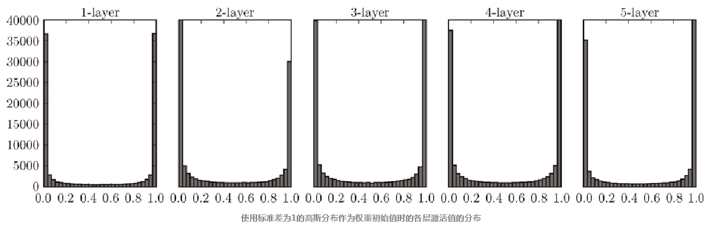

上图显示的是标准差为1的随机权重激活值分布。由图可见，各层激活值呈偏向0和1的分布，偏向0和1的数据分布会造成反向传播中梯度的值不断变小，最后消失。这个问题称为梯度消失（gradient vanishing）。将参数初始值的标准差设置为0.01，各层激活值分布如下图所示：

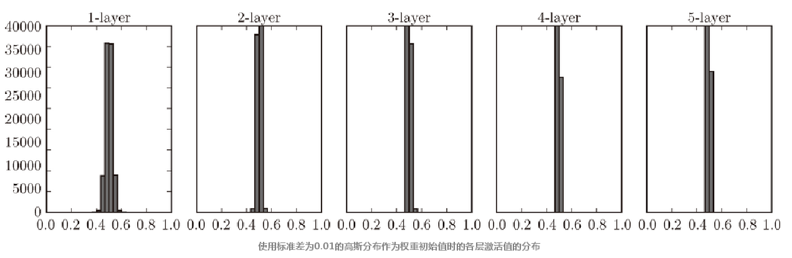

由图可见，当初始化权重参数时，标准差为0.01，激活值集中在0.5附近分布。虽然没有出现梯度消失情况，但激活值的分布有所偏向，说明在表现力上会有很大问题。因为如果有多个神经元都输出几乎相同的值，那它们就没有存在的意义了。

- **Xavier初始值**

Xavier Glorot和Yushua Bengio等人的论文《Understanding the difficulty of training deep feedforward neural networks》（2010年）中推荐的权重初始值（俗称“Xavier初始值”）。现在，在一般的深度学习框架中，Xavier初始值已被作为标准使用。为了使各层的激活值呈现出具有相同广度的分布，论文建议，如果前一层的节点数为n，则初始值使用$\frac{1}{\sqrt n}$标准差为的分布。使用Xavier初始值后，前一层的节点数越多，要设定为目标节点的初始值的权重尺度就越小。

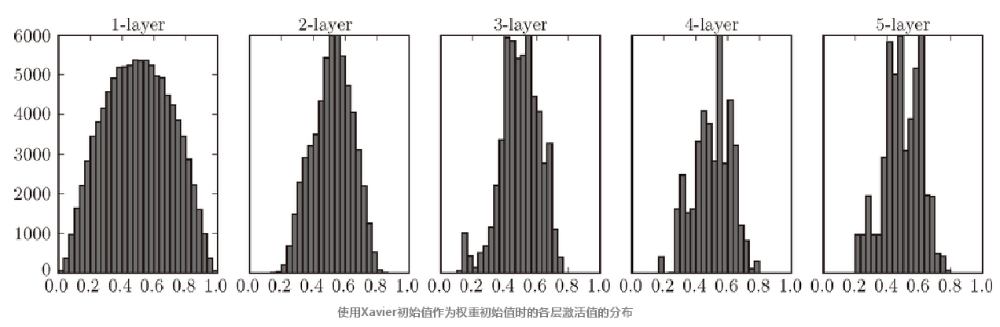

由图可见，Xavier初始值，后面的隐藏层的分布呈稍微歪斜的形状。如果用tanh函数（双曲线函数）代替sigmoid函数，这个稍微歪斜的问题就能得到改善，呈漂亮的吊钟型分布。

**② Relu激活函数参数分布**

Xavier初始值同样适合Relu激活函数，但当激活函数使用ReLU时，一般推荐使用ReLU专用的初始值，也就是Kaiming He等人推荐的初始值，也称为“He初始值”。当前一层的节点数为n时，He初始值使用标准差为$\sqrt{\frac{2}{n}}$的高斯分布。可以直观理解为，ReLU的负值区域的值为0，为了使它更有广度，所以需要2倍的系数。

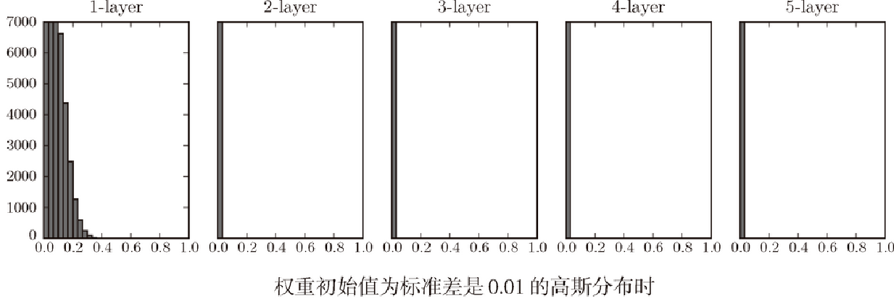

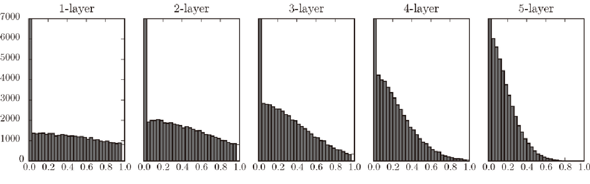

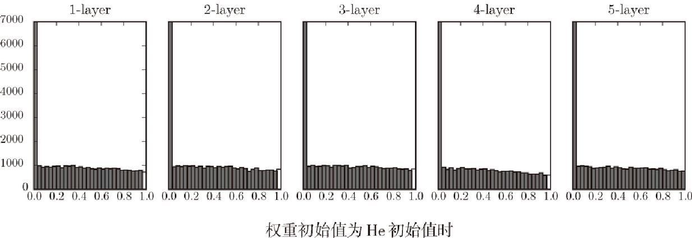

由上图可知，当“std = 0.01”时，各层的激活值非常小。神经网络上传递的是非常小的值，说明逆向传播时权重的梯度也同样很小。使用Xavier初始值，随着层的加深，偏向一点点变大，层次较深时会出现梯度消失问题。而当初始值为He初始值时，各层中分布的广度相同。由于即便层加深，数据的广度也能保持不变，因此逆向传播时，也会传递合适的值。

## 三、回归问题

### 1. 线性回归

#### 1）什么是线性回归

线性回归是指：通过数据样本，找到一个最佳拟合数据样本的线性模型，并用于预测。线性方程的一般表达形式为：
$$
y = w_0 + w_1x
$$
其中，$x$和$y$为已知，$w_0, w_1$是要经过学习获得的参数。

#### 2）什么情况下使用线性回归

- 数据样本呈线性分布。在二维平面中，线性分布的特征是，数据呈一个狭长的条状分布，并且没有明显弯曲。
- 已知模型为线性模型。

#### 3）线性回归的特点

① 优点

- 思想简单，实现容易。建模迅速，对于小数据量、简单的关系很有效。
- 是许多强大的非线性模型的基础。
- 线性回归模型十分容易理解，结果具有很好的可解释性，有利于决策分析。
- 蕴含机器学习中的很多重要思想。

② 缺点

- 对于非线性数据或者数据特征间具有相关性多项式回归难以建模。
- 难以很好地表达高度复杂的数据。

#### 4）多元回归

多元回归是线性回归的推广，含有一个变量称为线性回归，含有多个变量称为多元回归。多元回归的表达式为：
$$
y = w_0 + w_1x_1 + w_2x_2 + ... + w_nx_n
$$
只有一个变量的时候，模型是平面中的一条直线；有两个变量的时候，模型是空间中的一个平面；有更多变量时，模型将是更高维的。

### 2. 多项式回归

#### 1）什么是多项式回归？

多项式回归是指使：根据样本数据，用高次多项式模型来最佳程度拟合样本的回归方法。多项式回归中，加入了特征的更高次方（例如平方项或立方项），也相当于增加了模型的自由度，用来捕获数据中非线性的变化。多项式回归模型一般表达式为：
$$
y = w_0 + w_1x + w_2x^2 + w_3x ^ 3 + ... + w_nx^n
$$

#### 2）什么情况下使用多项式回归？

在回归分析中有时会遇到线性回归的直线拟合效果不佳，如果发现散点图中数据点呈多项式曲线时，可以考虑使用多项式回归来分析。

#### 3）多项式回归的特点

① 优点 

- 添加高阶项的时候，也增加了模型的复杂度。随着模型复杂度的升高，模型的容量以及拟合数据的能力增加

② 缺点

- 需要一些数据的先验知识才能选择最佳指数
- 如果指数选择不当容易出现过拟合

### 3. 决策树回归

#### 1）什么是决策树

决策树(Decision Tree）的核心思想是：相似的输入必然产生相似的数据（同因同果）。决策树通过把数据样本分配到树状结构的某个叶子节点来确定数据集中样本所属的分类。决策树可用于回归和分类。当用于回归时，预测结果为叶子节点所有样本的均值。

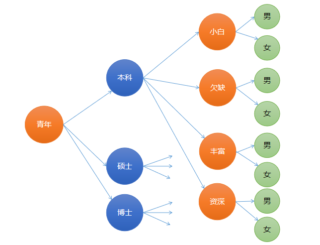

我们使用“熵”来度量系统的混乱或有序程度。随着子表的划分，信息熵越来越小，信息越来越纯，数据越来越有序（同一个子节点下的数据越来越相同或相似）。信息熵表达式为：
$$
H = -\sum_{i=1}^{n}{P(x_i)log_2P(x_i)}
$$
其中，$P(x_i)$是某个分类的概率。当n的分类越大，H的值越大；当n=1时，信息熵为0.在构建决策树时，首先选择信息增益率大的属性作为分支判断的依据。

#### 2）决策树的特点

##### ① 优点

- 简单易懂，容易解释，可视化，适用性广；
- 可用于分类、回归问题。

##### ② 缺点

- 容易过拟合；

- 数据中的小变化会影响结果，不稳定；

- 每一个节点的选择都是贪婪算法，不能保证全局最优解。

#### 3）什么情况下使用决策树

- 适合与标称型（在有限目标集中取值）属性较多的样本数据
- 具有较广的适用性，当对模型不确定时可以使用决策树进行验证

#### 4）随机森林

随机抽取部分样本和随机抽取部分特征相结合构建多棵决策树，这样不仅削弱了强势样本对预测结果的印象，同时削弱了强势特征的影响，提高了模型的泛化能力。


## 四、分类问题

### 1. 二元分类

#### 1）什么是二元分类

二元分类又称逻辑回归，是将一组样本划分到两个不同类别的分类方式。

#### 2）如何实现二元分类

逻辑回归属于广义线性回归模型（generalized linear model），使用线性模型计算函数值，再通过逻辑函数将连续值进行离散化处理。逻辑函数（又称sigmoid函数）表达式为：
$$
y= \frac{1}{1+e^{-t}}
$$
该函数能将$（-\infty, +\infty）$的值压缩到(0, 1)区间，通过选取合适的阈值转换为两个离散值（大于0.5为1，小于0.5为0）。

### 3. 朴素贝叶斯分类

#### 1）贝叶斯定理

贝叶斯定理描述为：
$$
P(A|B) = \frac{P(A)P(B|A)}{P(B)}
$$
其中，$P(A)$和$P(B)$是A事件和B事件发生的概率，这两个事件是独立的，不相互影响的（朴素的含义）；$P(A|B)$称为条件概率，表示B事件发生条件下，A事件发生的概率。$P(A)$也称为先验概率，$P(A|B)$也称为后验概率。先验概率主要根据统计获得，后验概率利用贝叶斯定理计算后并根据实际情况进行修正。其公式推导过程：
$$
P(A,B) =P(B)P(A|B)\\
P(B,A) =P(A)P(B|A)
$$
其中$P(A,B)$称为联合概率，指事件B发生的概率，乘以事件A在事件B发生的条件下发生的概率。因为$P(A,B)=P(B,A)$, 所以有：
$$
P(B)P(A|B)=P(A)P(B|A)
$$
两边同时除以P(B)，则得到贝叶斯定理的表达式。

#### 2）什么是朴素贝叶斯分类

朴素贝叶斯法是基于贝叶斯定理与特征条件独立假设的分类方法。“朴素”的含义为：假设问题的特征变量都是相互独立地作用于决策变量的，即问题的特征之间都是互不相关的。

#### 3）朴素贝叶斯分类的特点

##### ① 优点

- 逻辑性简单
- 算法较为稳定。当数据呈现不同的特点时，朴素贝叶斯的分类性能不会有太大的差异。
- 当样本特征之间的关系相对比较独立时，朴素贝叶斯分类算法会有较好的效果。

##### ② 缺点

- 特征的独立性在很多情况下是很难满足的，因为样本特征之间往往都存在着相互关联，如果在分类过程中出现这种问题，会导致分类的效果大大降低。

#### 4）什么时候使用朴素贝叶斯

- 根据先验概率计算后验概率的情况，且样本特征之间独立性较强。

### 4. 决策树分类

决策树分类和决策树回归思想基本相同，不同的是，决策树分类器输出为离散值。通过决策树进行分支处理，最后落到叶子节点上，使用投票的方式来决定预测结果属于哪个类别。

### 5. 支持向量机

#### 1）什么是支持向量机

支持向量机（Support Vector Machines）是一种二分类模型，它的目的是寻找一个超平面来对样本进行分割，分割的原则是间隔最大化。所谓“支持向量”，就是下图中虚线穿过的边缘点。支持向量机就对应着能将数据正确划分并且间隔最大的直线（下图中红色直线）。

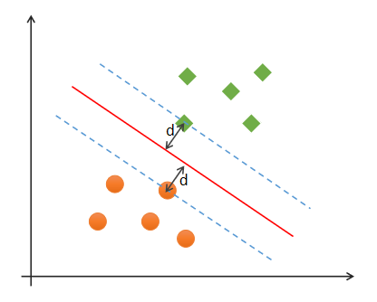

#### 2）SVM寻找最优边界要求有哪些？

SVM寻找最优边界时，需满足以下几个要求：

（1）正确性：对大部分样本都可以正确划分类别；

（2）安全性：支持向量，即离分类边界最近的样本之间的距离最远；

（3）公平性：支持向量与分类边界的距离相等；

（4）简单性：采用线性方程（直线、平面）表示分类边界，也称分割超平面。如果在原始维度中无法做线性划分，那么就通过升维变换，在更高维度空间寻求线性分割超平面. 从低纬度空间到高纬度空间的变换通过核函数进行。

#### 3）什么是线性可分与线性不可分？

##### ① 线性可分

如果一组样本能使用一个线性函数分开，称这些数据样本是线性可分的。那么什么是线性函数呢？在二维空间中就是一条直线，在三维空间中就是一个平面，以此类推，如果不考虑空间维数，这样的线性函数统称为超平面。

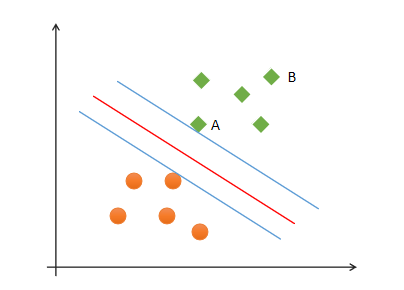

如图中的A，B两个样本点，B点被预测为正类的确信度要大于A点，所以SVM的目标是寻找一个超平面，使得离超平面较近的异类点之间能有更大的间隔，即不必考虑所有样本点，只需让求得的超平面使得离它近的点间隔最大。

##### ② 线性不可分

线性不可分是指无法在样本空间下找到一个线性模型来进行划分类别。以下是一个一维线性不可分的示例，无法找到一条直线，分开两类点：

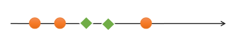

<center><font size=2>一维线性不可分</font></center>
以下是一个二维不可分的示例：

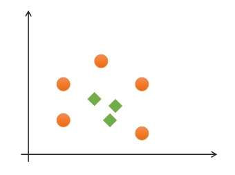

<center><font size=2>二维线性不可分</font></center>
对于该类线性不可分问题，可以通过升维，将低纬度特征空间转换为高纬度特征空间，实现线性可分，如下图所示：

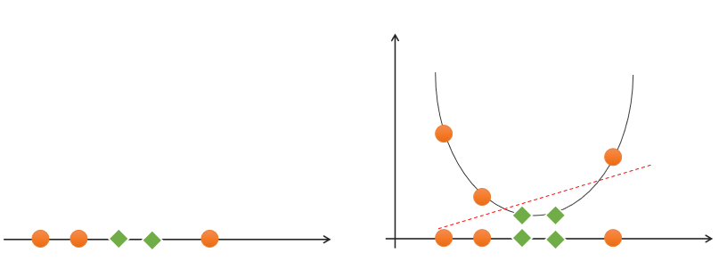

<center><font size=2>一维空间升至二维空间实现线性可分</font></center>
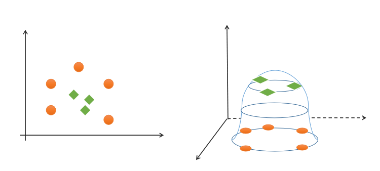

<center><font size=2>二维空间升至三维空间实现线性可分</font></center>
那么如何实现升维？这就需要用到核函数。

#### 4）什么是核函数？

核函数用来对原还是进行升维和特征变换处理，使得低纬度线性不可分问题变维高纬度线性可分问题。常用的核函数有：

- 线性核函数。表达式：$k(x，y)=x^T·y+c$. 线性核函数是原始输入空间的内积，即特征空间和输入空间的维度是一样的，参数较少，运算速度较快。一般情况下，在特征数量相对于样本数量非常多时，适合采用线性核函数。

- 多项式核函数。多项式核函数（Polynomial Kernel）用增加高次项特征的方法做升维变换，当多项式阶数高时复杂度会很高，其表达式为：
  $$
  K(x，y)=(αx^T·y+c)d
  $$
  其中，α表示调节参数，d表示最高次项次数，c为可选常数。

- 径向基核函数。径向基核函数（Radial Basis Function Kernel）具有很强的灵活性，应用很广泛。与多项式核函数相比，它的参数少，因此大多数情况下，都有比较好的性能。在不确定用哪种核函数时，可优先验证高斯核函数。

#### 5）SVM的特点？

##### ① 优点

- 应用广泛，可以解决高维、复杂特征下的分类问题；

- 具有较好的泛化能力；

##### ② 缺点

- 当样本很多时，效率并不是很高；
- 对缺失数据敏感。


## 五、聚类问题

### 1. 基本概念

#### 1）什么是聚类问题

聚类是指根据数据本身的特征，将样本按照相似度（距离相近）划分为不同的类簇，从而揭示样本之间内在的性质以及相互之间的联系规律。聚类属于无监督学习。

#### 2）好的聚类算法有哪些特征？

- 良好的可伸缩性。不仅能在小数据集上拥有良好性能，得到较好聚类结果，而且在处理大数据集时同样有较好的表现。
- 处理不同类型数据的能力。不仅能够对数值型的数据进行聚类，也能够对诸如图像、文档、序列等复杂数据进行聚类，甚至在多种类型的混合数据集中有良好的表现。
- 处理噪声数据的能力。实际应用中，数据集的质量往往不理想，包含很多噪声数据。一个良好的聚类算法降低噪声数据对聚类结果的影响，在低质量数据集中同样能够得到不错的聚类结果。
- 对样本顺序的不敏感性。良好的聚类算法应当不受输入数据顺序的影响，任意顺序数据输入都能够得到相同的聚类结果。
- 约束条件下的表现。实际应用场景中，聚类算法需要受到应用背景的约束。良好的聚类算法在约束条件下同样能够对数据集进行良好的聚类，并且得到高质量聚类结果。
- 易解释性和易用性。不是所有的聚类分析使用者都是数据分析专家，对于用户来说，聚类分析算法应该方便使用，且聚类得到的结果容易解释。

#### 3）聚类模型如何评价？

理想的聚类可以用四个字概况：内密外疏，即同一聚类内部足够紧密，聚类之间足够疏远. 学科中使用“轮廓系数”来进行度量，见下图：

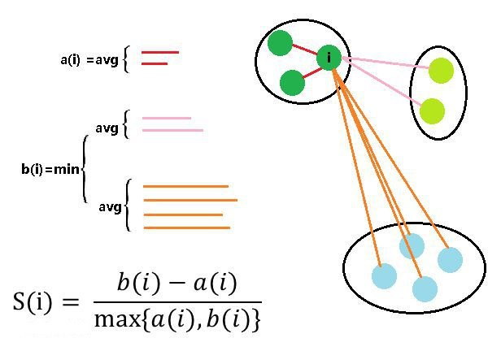

假设我们已经通过一定算法，将待分类数据进行了聚类。常用的比如使用K-means将待分类数据分为了 k 个簇 。对于簇中的每个向量。分别计算它们的轮廓系数。对于其中的一个点 i 来说：
    a(i) = average(i向量到所有它属于的簇中其它点的距离)
    b(i) = min (i向量到各个非本身所在簇的所有点的平均距离)
那么 i 向量轮廓系数就为：
$$
S(i)=\frac{b(i)-a(i)}{max(b(i), a(i))}
$$
由公式可以得出:

（1）当$b(i)>>a(i)$时，$S(i)$越接近于1，这种情况聚类效果最好；

（2）当$b(i)<<a(i)$时，$S(i)$越接近于-1，这种情况聚类效果最差；

（3）当$b(i)=a(i)$时，$S(i)$的值为0，这种情况聚类出现了重叠. 

### 2. K-Means聚类

#### 1）什么是K-Means聚类

K均值聚类算法（k-means clustering algorithm）是一种常用的聚类算法，简单高效。其步骤为：

第一步：根据事先已知的聚类数，随机选择若干样本作为聚类中心，计算每个样本与每个聚类中心的欧式距离，离哪个聚类中心近，就算哪个聚类中心的聚类，完成一次聚类划分.

第二步：计算每个聚类的集合中心（平均值），如果几何中心与聚类中心不重合，再以几何中心作为新的聚类中心，重新划分聚类. 重复以上过程，直到某一次聚类划分后，所得到的各个几何中心与其所依据的聚类中心重合或足够接近为止. 

#### 2）K-Means的特点

##### ① 优点

- 原理简单，实现方便，收敛速度快；
- 聚类效果较优；
- 模型的可解释性较强；

##### ② 缺点

- 需要事先知道聚类数量；
- 聚类初始中心的选择对聚类结果有影响；
- 采用的是迭代的方法，只能得到局部最优解；
- 对于噪音和异常点比较敏感。

### 3. 均值漂移

#### 1）什么是均值漂移

均值漂移是一种基于聚类中心的聚类算法。其核心思想是：在数据集中选定一个点，然后以这个点为圆心，r为半径，画一个圆(二维下是圆，这里可以推广为高维圆)，求出这个点到所有点的向量的平均值，而圆心与向量均值的和为新的圆心，然后迭代此过程，直到满足一点的条件结束。

在实际计算时，首先随便选择一个中心点，然后计算该中心点一定范围之内所有点到中心点的距离向量的平均值，计算该平均值得到一个偏移均值，然后将中心点移动到偏移均值位置，通过这种不断重复的移动，可以使中心点逐步逼近到最佳位置。这种思想类似于梯度下降方法，通过不断的往梯度下降的方向移动，可以到达梯度上的局部最优解或全局最优解。

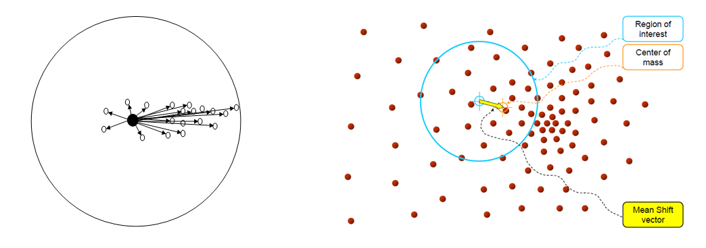

<center><font size=2>均值向量（左）与均值移动（右）示意图</font></center>
#### 2）均值漂移算法特点

##### ① 优点

- 聚类数量不必已知；
- 聚类中心不依赖于初始值选取，聚类划分结果较为稳定。

##### ② 缺点

- 样本空间服从某种概率分布规则，否则算法准确性会大打折扣。

### 4. 噪声密度

#### 1）什么是噪声密度

噪声密度（Density-Based Spatial Clustering of Applications with Noise， 简写DBSCAN）随机选择一个样本做圆心，以事先给定的半径做圆，凡被该圆圈中的样本都被划为与圆心样本同处一个聚类，再以这些被圈中的样本做圆心，以事先给定的半径继续做圆，不断加入新的样本，扩大聚类的规模，知道再无新的样本加入为止，即完成一个聚类的划分. 以同样的方法，在其余样本中继续划分新的聚类，直到样本空间被耗尽为止，即完成整个聚类划分过程. 

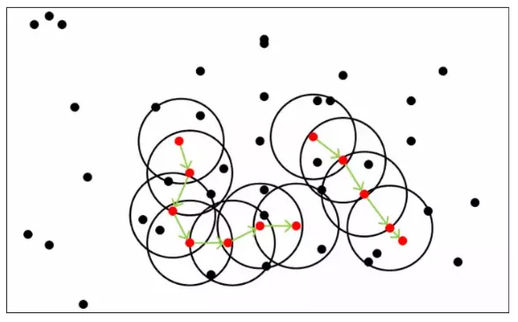

- 边界点（Border point）：所处聚类中样本数少于某个阈值，该聚类就不被视为一个聚类，其中的样本则称为边界点；
- 噪声点（Noise）：无法划分到某个聚类中的点；
- 核心点（Core point）：除了孤立样本和外周样本以外的样本都是核心点.。

#### 2）DBSCAN的特点

##### ① 算法优点

- 不用人为提前确定聚类类别数K；
- 聚类速度快；
- 能够有效处理噪声点（因为异常点不会被包含于任意一个簇，则认为是噪声）；
- 能够应对任意形状的空间聚类。

##### ② 算法缺点

- 当数据量过大时，要求较大的内存支持I/O消耗很大；
- 当空间聚类的密度不均匀、聚类间距差别很大时、聚类效果有偏差；
- 调参相对复杂，主要调整距离阈值和MinPts（最少个数阈值）。

### 5. 凝聚层次

#### 1）什么是凝聚层次

凝聚层次（Agglomerative）算法，首先将每个样本看做独立的聚类，如果聚类数大于预期，则从每个样本出发凝聚离它最近的样本，将样本凝聚所形成的团块作为新的聚类，再不断扩大聚类规模的同时，减少聚类的总数，直到聚类数减少到预期值为止.  这里的关键问题是如何计算聚类之间的距离.

依据对距离的不同定义，将Agglomerative Clustering的聚类方法分为三种：

- ward：默认选项，挑选两个簇来合并，是的所有簇中的方差增加最小。这通常会得到大小差不多相等的簇。
- average链接：将簇中所有点之间平均距离最小的两个簇合并。
- complete链接：也称为最大链接，将簇中点之间最大距离最小的两个簇合并。

ward适用于大多数数据集。如果簇中的成员个数非常不同（比如其中一个比其他所有都大得多），那么average或complete可能效果更好。

#### 2）凝聚层次特点

##### ① 优点

- 没有聚类中心，不依赖于中心点的选择；
- 对于中心不明显的样本聚类性能更稳定。

##### ② 缺点

- 事先给定期望划分的聚类数（k），来自业务或指标优化。


# 深度学习部分

## 一、基本理论

### 1. 什么是前馈神经网络

前馈神经网络（feedforward neural network）又称多层感知机（multilayer perceptron,  MLP），是典型的深度学习模型。它是一种单向多层结构，其中每一层包含若干个神经元。在此种神经网络中，各神经元可以接收前一层神经元的信号，并产生输出到下一层。第0层叫**输入层**，最后一层叫**输出层**，其他中间层叫做隐含层（或隐藏层、隐层），隐含层可以是一层，也可以是多层。整个网络中无反馈，信号从输入层向输出层**单向传播**，可用一个有向无环图表示。

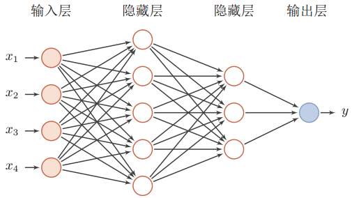

前馈神经网络使用数学公式可以表示为：
$$
f(x) = f^{(3)}(f^{(2)}(f^{(1)}(x)))
$$
其中，$f^{(1)}$ 被称为网络的 第一层（first layer）， $f^{(2)} $被称为 第二层（second layer），以此类推。链的全长称为模型的深度（depth）。 

### 2. 深度学习有什么优缺点

1）优点

- 性能更优异
- 不需要特征工程
- 在大数据样本下有更好的性能
- 能解决某些传统机器学习无法解决的问题

2）缺点

- 小数据样本下性能不如机器学习
- 模型复杂
- 过程不可解释

### 3. 什么是激活函数，为什么要使用激活函数

激活函数（activation function），指神经网络中将输入信号的总和转换为输出信号的函数，激活函数将多层感知机输出转换为非线性，使得神经网络可以任意逼近任何非线性函数，这样神经网络就可以应用到众多的非线性模型中。

### 4. 神经网络中常用的激活函数有哪些，各自有什么特点

1）sigmoid

① 定义：sigmoid函数也叫Logistic函数，用于隐层神经元输出，能将$(-\infty,+\infty)$的数值映射到(0,1)的区间，可以用来做二分类。表达式为：
$$
f(x) = \frac{1}{1+e^{-x}}
$$


② 特点

- 优点：平滑、易于求导
- 缺点：激活函数计算量大，反向传播求误差梯度时，求导涉及除法；反向传播时，很容易就会出现梯度消失

2）tanh

① 定义：双曲正切函数，表达式为：
$$
f(x) = \frac{1-e^{-2x}}{1+e^{-2x}}
$$
② 特点

- 优点：平滑、易于求导；输出均值为0，收敛速度要比sigmoid快，从而可以减少迭代次数
- 缺点：很容易就会出现梯度消失

3）relu

① 定义：修正线性单元，其表达式为：
$$
f(x) =\begin{cases}
x & (x>0) \\
0 & (x<=0) 
\end{cases}
$$
② 特点：

- 优点：计算过程简单；避免了梯度爆炸和梯度消失问题
- 缺点：小于等于0时无输出

### 5. 什么是softmax函数，其主要作用是什么

1）定义：Softmax函数就可以将多分类的输出数值转化为相对概率，而这些值的累和为1。表达式为：
$$
S_i = \frac{e^{V_i}}{\sum_i^Ce^{V_i}}
$$
其中$V_i$ 是分类器前级输出单元的输出。i 表示类别索引，总的类别个数为 C。$S_i$表示的是当前元素的指数与所有元素指数和的比值。

2）作用：softmax一般用于分类输出层，计算属于每个类别的概率。

### 6. 什么是损失函数，损失函数的作用是什么

损失函数（Loss Function），也有称之为代价函数（Cost Function），用来度量预测值和实际值之间的差异，从而作为模型性能参考依据。损失函数值越小，说明预测输出和实际结果（也称期望输出）之间的差值就越小，也就说明我们构建的模型越好，反之说明模型越差。

### 7. 什么是交叉熵，其作用是什么

交叉熵（Cross Entropy）主要用于度量两个概率分布间的差异性信息，在机器学习中用来作为分类问题的损失函数。当预测概率越接近真实概率，该函数值越小，反之越大。

### 8. 解释什么是梯度

梯度（gradient）是一个向量，表示某一函数在该点处的方向导数沿着该方向取得最大值，即函数在该点处沿着该方向（此梯度的方向）变化最快，变化率最大。

### 9. 什么是梯度下降

梯度下降是一个最优化算法，常用于机器学习和人工智能当中用来递归性地逼近最小偏差模型，核心思想是按照梯度相反的方向，不停地调整函数权值。其步骤为：

1）求损失函数值

2）损失是否足够小？如果不是，计算损失函数的梯度

3）按梯度的反方向走一小步（调整权重，$w_i = w_i + \delta w_i$）

4）循环到第2步，迭代执行

### 10. 激活函数出现梯度消失会有什么后果

机器学习中，如果模型的优化依赖于梯度下降，梯度消失会导致模型无法进一步进行优化。

### 11. 如何解决梯度消失问题（重点）

1）更换激活函数：如更滑为relu, leakrelu

2）批量规范化处理：通过规范化操作将输出信号x规范化到均值为0，方差为1保证网络的稳定性

3）使用残差结构：通过引入残差结构，能有效避免梯度消失问题

### 12. 什么是梯度爆炸，如何解决梯度爆炸问题

1）梯度爆炸。梯度消失是在计算中出现了梯度过小的值，梯度爆炸则相反，梯度计算出现了过大的值。梯度过大，可能使参数更新幅度过大，超出了合理范围。

2）解决梯度爆炸的方法

- 梯度裁剪：把沿梯度下降方向的步长限制在一个范围之内，计算出来的梯度的步长的范数大于这个阈值的话，就以这个范数为基准做归一化，使这个新的的梯度的范数等于这个阈值
- 权重正则化：通过正则化，可以部分限制梯度爆炸的发生

### 13. 什么是批量梯度下降、随机梯度下降，分别有何特点

#### 1）批量梯度下降

① 定义：批量梯度下降（Batch Gradient Descent，BGD）是指在每一次迭代时使用所有样本来进行梯度的更新
② 特点

- 优点：收敛比较稳定
- 缺点：当样本数目很大时，每迭代一步都需要对所有样本计算，训练过程会很慢

#### 2）随机梯度下降

① 定义：随机梯度下降法（Stochastic Gradient Descent，SGD）每次迭代使用一个样本来对参数进行更新，使得训练速度加快
② 特点

- 优点：计算量小，每一轮训练更新速度快
- 缺点：收敛不稳定

### 14. 什么是学习率，作用是什么

在梯度下降法中，都是给定的统一的学习率，整个优化过程中都以确定的步长进行更新， 在迭代优化的前期中，学习率较大，则前进的步长就会较长，这时便能以较快的速度进行梯度下降，而在迭代优化的后期，逐步减小学习率的值，减小步长，这样将有助于算法的收敛，更容易接近最优解。

### 15. 学习率过大或过小会导致什么问题

学习率过大可能导致模型无法收敛，过小导致收敛速度过慢

### 16. 什么是反向传播算法，为什么要使用反向传播算法

1）定义

反向传播（Backpropagation algorithm）全称“误差反向传播”，是在深度神经网络中，根据输出层输出值，来反向调整隐藏层权重的一种方法

2）对于多个隐藏层的神经网络，输出层可以直接求出误差来更新参数，但隐藏层的误差是不存在的，因此不能对它直接应用梯度下降，而是先将误差反向传播至隐藏层，然后再应用梯度下降

### 17. 请说明Momentum、AdaGrad、Adam梯度下降法的特点

Momentum、AdaGrad、Adam是针对SGD梯度下降算法的缺点的改进算法。在SGD算法中，如果函数的形状非均向（参数大小差异较大），SGD的搜索路径会呈“之字形”移动，搜索效率较低。如下图所示：

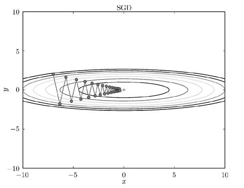

#### 1）Momentum

Momentum是“动量”的意思，和物理有关。用数学式表示Momentum方法，如下所示：
$$
v ← \alpha v - \eta \frac{\partial L}{\partial W} \\ 
W ← W + v
$$
其中，W表示要更新的权重参数，$\frac{\partial L}{\partial W}$表示W的梯度，$\eta$表示学习率，v对应物理上的速度。在物体不受任何力时，该项承担使物体逐渐减速的任务（α设定为0.9之类的值），对应物理上的地面摩擦或空气阻力。和SGD相比，我们发现“之”字形的“程度”减轻了。这是因为，虽然x轴方向上受到的力非常小，但是一直在同一方向上受力，所以朝同一个方向会有一定的加速。反过来，虽然y轴方向上受到的力很大，但是因为交互地受到正方向和反方向的力，它们会互相抵消，所以y轴方向上的速度不稳定。因此，和SGD时的情形相比，可以更快地朝x轴方向靠近，减弱“之”字形的变动程度。如下图所示：

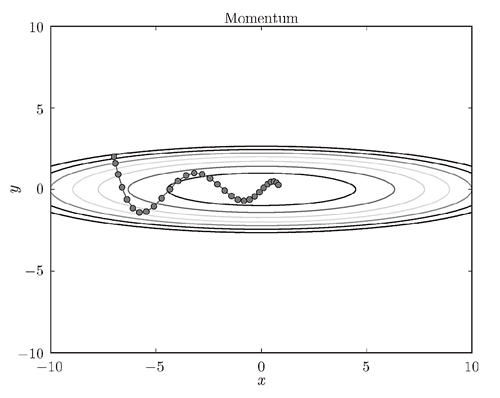

#### 2）AdaGrad

AdaGrad会为参数的每个元素适当地调整学习率，与此同时进行学习（AdaGrad的Ada来自英文单词Adaptive，即“适当的”的意思），其表达式为：
$$
h ← h + \frac{\partial L} {\partial W} \bigodot \frac{\partial L} {\partial W} \\
W ← W - \eta \frac{1}{\sqrt h} \frac{\partial L}{\partial W}
$$
其中，W表示要更新的权重参数，$\frac{\partial L}{\partial W}$表示W的梯度，$\eta$表示学习率，$\frac{\partial L} {\partial W} \bigodot \frac{\partial L} {\partial W}$表示所有梯度值的平方和。在参数更新时，通过乘以$\frac{1}{\sqrt h}$就可以调整学习的尺度。这意味着，参数的元素中变动较大（被大幅更新）的元素的学习率将变小。也就是说，可以按参数的元素进行学习率衰减，使变动大的参数的学习率逐渐减小。其收敛路径如下图所示：

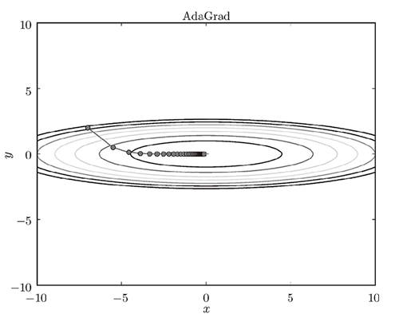

#### 3）Adam

Adam是2015年提出的新方法。它的理论有些复杂，直观地讲，就是融合了Momentum和AdaGrad的方法。通过组合前面两个方法的优点，有望实现参数空间的高效搜索。其收敛路径如下图所示：

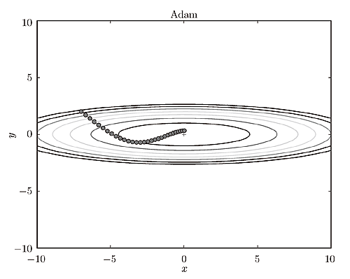

以下是几种梯度下降算法的收敛情况对比：

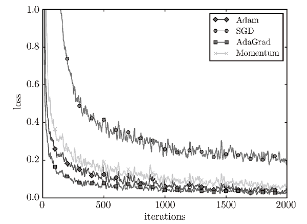

### 18. 什么是卷积函数

卷积函数指一个函数和另一个函数在某个维度上的加权“叠加”作用，其表达式为：
$$
s(t) = \int ^{+\infty}_{-\infty}f(a)*g(t-a)da
$$
离散化卷积函数表示为：
$$
s(t) =f(t)*g(t)= \sum_{n=-\infty}^{\infty}f(a)g(t-a)
$$

### 19. 二维卷积运算中，输出矩阵大小与输入矩阵、卷积核大小、步幅、填充的关系？

$$
OH = \frac{H+2P-FH}{S} + 1 \\
OW = \frac{W+2P-FW}{S} + 1
$$

### 20. 什么是池化，池化层的作用是什么

也称子采样层或下采样层（Subsampling Layer），目的是缩小高、长方向上的空间的运算，以降低计算量，提高泛化能力。

### 21. 什么是最大池化、平均池化

最大池化：取池化区域内的最大值作为池化输出

平均池化：取池化区域内的平均值作为池化输出

### 22. 池化层有什么特征

1）没有要学习的参数

2）通道数不发生变化

3）对微小的变化具有鲁棒性

### 23. 什么是归一化， 为什么要进行归一化

1）归一化的含义。归一化是指归纳统一样本的统计分布性。归一化在 $ 0-1$ 之间是统计的概率分布，归一化在$ -1--+1$ 之间是统计的坐标分布。

2）归一化处理的目的

- 为了后面数据处理的方便，归一化的确可以避免一些不必要的数值问题。
- 为了程序运行时收敛加快。 
- 同一量纲。样本数据的评价标准不一样，需要对其量纲化，统一评价标准。
- 避免神经元饱和。当神经元的激活在接近 0 或者 1 时会饱和，在这些区域，梯度几乎为 0，这样，在反向传播过程中，局部梯度就会接近 0，这会有效地“杀死”梯度。

### 24. 什么是批量归一化，其优点是什么

1）批量归一化（Batch Normalization，简写BN）指在神经网络中间层也进行归一化处理，使训练效果更好的方法，就是批归一化。

2）优点

- 减少了人为选择参数。在某些情况下可以取消 dropout 和 L2 正则项参数,或者采取更小的 L2 正则项约束参数； 

- 减少了对学习率的要求。现在我们可以使用初始很大的学习率或者选择了较小的学习率，算法也能够快速训练收敛； 

- 可以不再使用局部响应归一化（BN 本身就是归一化网络) ；
- 破坏原来的数据分布，一定程度上缓解过拟合；
- 减少梯度消失，加快收敛速度，提高训练精度。

### 25. 请列举AlexNet的特点

- 使用ReLU作为激活函数，并验证其效果在较深的网络超过了Sigmoid，成功解决了Sigmoid在网络较深时的梯度消失问题
- 使用Dropout（丢弃学习）随机忽略一部分神经元防止过拟合
- 在CNN中使用重叠的最大池化。此前CNN中普遍使用平均池化，AlexNet全部使用最大池化，避免平均池化的模糊化效果
- 提出了LRN（Local Response Normalization，局部正规化）层，对局部神经元的活动创建竞争机制，使得其中响应比较大的值变得相对更大，并抑制其他反馈较小的神经元，增强了模型的泛化能力
- 使用CUDA加速深度卷积网络的训练，利用GPU强大的并行计算能力，处理神经网络训练时大量的矩阵运算

### 26. 什么是dropout操作，dropout的工作原理？

#### 1）定义

Dropout是用于深度神经网络防止过拟合的一种方式，在神经网络训练过程中，通过忽略一定比例的特征检测器（让一半的隐层节点值为0），可以明显地减少过拟合现象。这种方式可以减少特征检测器（隐层节点）间的相互作用，检测器相互作用是指某些检测器依赖其他检测器才能发挥作用。简单来说，在前向传播的时候，让某个神经元的激活值以一定的概率p停止工作，这样可以使模型泛化性更强，因为它不会太依赖某些局部的特征。

#### 2）dropout工作原理

假设我们要训练这样一个网络，结构如下图所示：

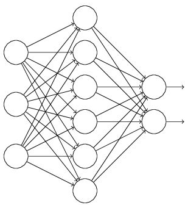

输入是x输出是y，正常的流程是：我们首先把x通过网络前向传播，然后把误差反向传播以决定如何更新参数让网络进行学习。使用Dropout之后，过程变成如下：

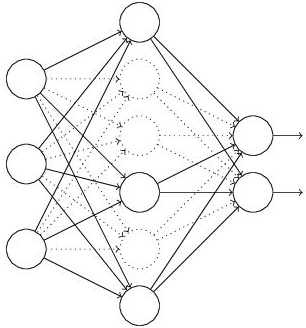

（1）首先随机（临时）删掉网络中一半的隐藏神经元，输入输出神经元保持不变（上图中虚线表示临时被删除的神经元）

（2） 然后把输入x通过修改后的网络前向传播，然后把得到的损失结果通过修改的网络反向传播。一小批训练样本执行完这个过程后，在没有被删除的神经元上按照随机梯度下降法更新对应的参数（w，b）

（3）然后继续重复以下过程：

- 恢复被删掉的神经元（此时被删除的神经元保持原样，而没有被删除的神经元已经有所更新）
- 从隐藏层神经元中随机选择一定比率子集临时删除掉（备份被删除神经元的参数）
- 对一小批训练样本，先前向传播然后反向传播损失并根据随机梯度下降法更新参数（w，b） （没有被删除的那一部分参数得到更新，删除的神经元参数保持被删除前的结果）

#### 3）为什么dropout能避免过拟合

（1）取平均作用。不同的网络可能产生不同的过拟合，取平均则有可能让一些“相反的”拟合互相抵消。

（2）减少神经元之间复杂的共适应关系。因为dropout程序导致两个神经元不一定每次都在一个dropout网络中出现。这样权值的更新不再依赖于有固定关系的隐含节点的共同作用，阻止了某些特征仅仅在其它特定特征下才有效果的情况 。迫使网络去学习更加鲁棒的特征 ，这些特征在其它的神经元的随机子集中也存在。

### 27. 卷积层和池化层有什么区别

卷积层核池化层在结构上具有一定的相似性，都是对感受域内的特征进行提取，并且根据步长设置获取到不同维度的输出，但是其内在操作是有本质区别的，如下表所示：

|            |                 卷积层                 |              池化层              |
| :--------: | :------------------------------------: | :------------------------------: |
|  **结构**  |               通道数改变               |  通常特征维度会降低，通道数不变  |
| **稳定性** | 输入特征发生细微改变时，输出结果会改变 | 感受域内的细微变化不影响输出结果 |
|  **作用**  |        感受域内提取局部关联特征        |  感受域内提取泛化特征，降低维度  |
| **参数量** |      与卷积核尺寸、卷积核个数相关      |          不引入额外参数          |

### 28. 如何选择卷积核大小

在早期的卷积神经网络中（如LeNet-5、AlexNet），用到了一些较大的卷积核（$11\times11$），受限于当时的计算能力和模型结构的设计，无法将网络叠加得很深，因此卷积网络中的卷积层需要设置较大的卷积核以获取更大的感受域。但是这种大卷积核反而会导致计算量大幅增加，不利于训练更深层的模型，相应的计算性能也会降低。后来的卷积神经网络（VGG、GoogLeNet等），发现通过堆叠2个$3\times 3$卷积核可以获得与$5\times 5$卷积核相同的感受视野，同时参数量会更少（$3×3×2+1$ < $ 5×5×1+1$），$3\times 3$卷积核被广泛应用在许多卷积神经网络中。因此可以认为，在大多数情况下通过堆叠较小的卷积核比直接采用单个更大的卷积核会更加有效。

### 29. 如何提高图像分类的准确率

1）样本优化

- 增大样本数量
- 数据增强：形态、色彩、噪声扰动

2）参数优化

- 批量正则化
- 变化学习率
- 权重衰减

3）模型优化

- 增加网络模型深度
- 更换更复杂的模型


# 自然语言处理

## 一、基本理论

### 1. 什么是分词，分词的作用是什么

该任务将文本语料库分隔成原子单元（例如，单词或词组），分词是自然语言处理的一项重要任务，直接关系到对语义的正确理解。

### 2. 中文分词有哪些方法

#### 1）正向最大匹配法（FMM）

FMM的步骤是：

- 从左向右取待分汉语句的m个字作为匹配字段，m为词典中最长词的长度；
- 查找词典进行匹配；
- 若匹配成功，则将该字段作为一个词切分出去；
- 若匹配不成功，则将该字段最后一个字去掉，剩下的字作为新匹配字段，进行再次匹配；
- 重复上述过程，直到切分所有词为止。

#### 2）逆向最大匹配法（RMM） 

RMM的基本原理与FMM基本相同，不同的是分词的方向与FMM相反。RMM是从待分词句子的末端开始，也就是从右向左开始匹配扫描，每次取末端m个字作为匹配字段，匹配失败，则去掉匹配字段前面的一个字，继续匹配。

#### 3）双向最大匹配法（Bi-MM）

Bi-MM是将正向最大匹配法得到的分词结果和逆向最大匹配法得到的结果进行比较，然后按照最大匹配原则，选取词数切分最少的作为结果。

据SunM.S.和Benjamin K.T.（1995）的研究表明，中文中90.0%左右的句子，正向最大匹配法和逆向最大匹配法完全重合且正确，只有大概9.0%的句子两种切分方法得到的结果不一样，但其中必有一个是正确的（歧义检测成功），只有不到1.0%的句子，使用正向最大匹配法和逆向最大匹配法的切分虽然重合但是错的，或者两种方法切分不同但结果都不对（歧义检测失败）。双向最大匹配的规则是：

（1）如果正反向分词结果词数不同，则取分词数量少的那个；

（2）如果分词结果词数相同：

- 分词结果相同，没有歧义，返回任意一个；
- 分词结果不同，返回其中单字数量较少的那个。

### 3. 什么是词性标记

词性标记（Part-Of-Speech tagging, POS tagging）是将单词分配到各自对应词性的任务。它既可以是名词、动词、形容词、副词、介词等基本词、也可以是专有名词、普通名词、短语动词、动词等。

### 4. 什么是词干提取

词干提取（stemming）是抽取词的词干或词根形式（不一定能够表达完整语义），文本样本中的单词的词性与时态对于语义分析并无太大影响，所以需要对单词进行词干提取。

### 5. 词干提取主要有哪些方法

（1）查找算法。一个简单的词干提取器从查找表中查找词尾变化。这种方法的优势是简单、速度快并容易控制异常情况。但它的缺点是所有的词尾变化的形式必须明确地包含在查询表中：一个新的或者是陌生的词是没办法控制的，即使是具有完整的规则（如iPads ~ iPad），并且表会变得非常大。对于具有简单形态的语言，像英文，表的大小比较适中，但对于变化较大语言，如土耳其语，对于每个词根都可能有几百个潜在的变化形式。 一个查找算法初步词性标注来避免过度词干化。

（2）后缀去除法。后缀去除算法不依赖于包含词形变换和词根的查询表，而是使用一个普遍性规则小列表提取词根形式。如，其中的一些规则包括：去掉结尾是"ed","ing","ly"等后缀。

（3）lemmatization算法。一种更加复杂的确定一个词汇停顿词的方法是lemmatisation。这种处理方式包括首先确定词汇的发音部分，接着，根据发音的部分确定词汇的根。停顿词规则随着单词的发声部分的改变而改变。

（4）混合法。混合方法同时使用上述的方法中的两种或更多种。

### 6. 什么是词形还原

词形还原就是去掉单词的词缀，提取单词的主干部分，通常提取后的单词会是字典中的单词，不同于词干提取（stemming），提取后的单词不一定会出现在单词中。词形还原是基于词典，将单词的复杂形态转变成最基础的形态。词形还原不是简单地将前后缀去掉，而是会根据词典将单词进行转换。比如drove会转换为drive。词形还原可以将复数还原为单数，也可将带时态的分词还原为原型。

### 7. 什么是词袋模型？词袋模型的缺点是什么

词袋模型（Bag-of-words model，简称 BoW ）假设我们不考虑文本中词与词之间的上下文关系，一句话的语义很大程度取决于某个单词出现的次数，所以可以把句子中所有可能出现的单词作为特征名，每一个句子为一个样本，单词在句子中出现的次数为特征值构建数学模型，称为词袋模型。可以理解为用词频作为每个样本的特征。

词袋模型仅仅考虑了词频，没有考虑上下文的关系（即词语间的顺序），因此会丢失一部分文本的语义。

### 8. 什么是词频、文档频率、逆文档频率

#### 1）词频

词频（Term Frequency）是指单词在句子中出现的次数除以句子的总词数，即一个单词在一个句子中出现的频率。词频相比单词的出现次数可以更加客观的评估单词对一句话的语义的贡献度。词频越高，对语义的贡献度越大。

#### 2）文档频率

$$
DF = \frac{含有某个单词的文档样本数}{总文档样本数}
$$


#### 3）逆文档频率

逆文档频率是一个词语普遍重要性的度量。某一特定词语的IDF，可以由总文件数目除以包含该词语之文件的数目，再将得到的商取对数得到。即文档总数n与词w所出现文件数docs(w, D)比值的对数。
$$
IDF = \log(\frac{n}{docs(w, D) + 1})
$$

### 9. 什么是词频-逆文档频率(TF-IDF)

词频-逆文档频率(Term Frequency - Inverse Document Frequency)指词频矩阵中的每一个元素乘以相应单词的逆文档频率：
$$
TF-IDF = TF * IDF
$$
其值越大说明该词对样本语义的贡献越大，根据每个词的贡献力度，构建学习模型。如果某个词或短语在一篇文章中出现的频率TF高，并且在其他文章中很少出现，则认为此词或者短语具有很好的类别区分能力，适合用来分类。

### 10. 文本表示如何采用独热编码，其缺点是什么

1）独热编码把每个词表示为一个长向量。这个向量的维度是词表大小，向量中只有一个维度的值为1，其余维度为0，这个维度就代表了当前的词。例如：

```python
减肥 [1，0，0，0，0，0，0，0，0，0]
瘦身 [0，1，0，0，0，0，0，0，0，0]
减脂 [0，0，1，0，0，0，0，0，0，0]
降脂 [0，0，0，1，0，0，0，0，0，0]
增肥 [0，0，0，0，1，0，0，0，0，0]
```

2）独热编码的缺点：

- 丢弃了词与词之间的联系，无法反映出词的距离关系

- 独热编码产生一个高纬度稀疏矩阵，会导致特征空间非常大


### 11. 什么是N-gram模型

1）定义：N-Gram模型是一种基于统计语言模型，语言模型是一个基于概率的判别模型，它的输入是个句子（由词构成的顺序序列），输出是这句话的概率，即这些单词的联合概率。

N-Gram本身也指一个由N个单词组成的集合，各单词具有先后顺序，且不要求单词之间互不相同。常用的有Bi-gram(N=2)和Tri-gram(N=3)。例如：

句子：L love deep learning

Bi-gram: {I, love}, {love, deep}, {deep, learning}

Tri-gram: {I, love, deep}, {love deep learning}

2）基本思想：N-Gram基本思想是将文本里面的内容按照字节进行大小为n的滑动窗口操作，形成了长度是n的字节片段序列。每一个字节片段称为一个gram，对所有gram的出现频度进行统计，并按照事先设置好的频度阈值进行过滤，形成关键gram列表，也就是这个文本向量的特征空间，列表中的每一种gram就是一个特征向量维度。

### 12. 语料库

#### 1）什么是语料库

语料库（corpus）是指存放语言材料的仓库。现代的语料库是指存放在计算机里的原始语料文本或经过加工后带有语言学信息标注的语料文本。以语言的真实材料为基础来呈现语言知识，反映语言单位的用法和意义，基本以知识的原型形态表现——语言的原貌。

#### 2）语料库的特征

- 语料库中存放的是实际中真实出现过的语言材料

- 语料库是以计算机为载体承载语言知识的基础资源，但不等于语言知识

- 真实语料需要经过分析、处理和加工，才能成为有用的资源

#### 3）语料库的作用

- 支持语言学研究和语言教学研究

- 支持NLP系统的开发

#### 4）语料库的类型

##### ① 按照内容分类

- 异质的：最简单的语料收集方法，没有事先规定和选材原则
- 同质的：与异质的正好相反，比如美国的TIPSTER项目只收集军事方面的文本
- 系统的：充分考虑语料动态和静态问题、代表性和平衡问题以及语料库规模等问题
- 专用的：如北美人文科学语料库

##### ② 按照语言分类

- 单语
- 双语或多语的。平行语料库： 篇章对齐/句子对齐/结构对齐

##### ③ 按是否加工

- 生语料库：未经过加工的，没有任何切分、标注标记的原始语料库
- 熟语料库：经过加工的，带有切分、标注标记的语料库，包括词性标注、句法结构信息标注、语义信息标注

##### ④ 共时语料库与历时语料库

- 共时语料库：为了对语言进行同一时段研究而建立的语料库
- 历时语料库：为了对语言进行历时研究建立的语料库

### 13. 什么是共现矩阵，特点是什么

1）共现（co-occurrence）矩阵指通过统计一个事先指定大小的窗口内的word共现次数，以word周边的共现词的次数做为当前word的vector。具体来说，我们通过从大量的语料文本中构建一个共现矩阵来定义word representation。例如，有语料如下：

```
I like deep learning.
I like NLP.
I enjoy flying.
```

则其共现矩阵如下：


2）特点

- 优点：矩阵定义的词向量在一定程度上缓解了one-hot向量相似度为0的问题；
- 缺点：但没有解决数据稀疏性和维度灾难的问题。

### 14. Word2vec

#### 1）什么是Word2vec

Word2vec是最近推出的分布式单词表示学习技术，目前被用作许多NLP任务的特征工程技术（例如，机器翻译、聊天机器人和图像标题生成）。从本质上讲，Word2vec通过查看所使用的单词的周围单词（即上下文）来学习单词表示。更具体地说，我们试图通过神经网络根据给定的一些单词来预测上下文单词（反之亦然），这使得神经网络被迫学习良好的词嵌入。

Word2vec通过查看单词上下文并以数字方式表示它，来学习给定单词的含义。所谓“上下文”，指的是在感兴趣的单词的前面和后面的固定数量的单词。假设我们有一个包含N个单词的语料库，在数学上，这可以由以$w_0，w_1, ..., w_i$和$w_N$表示的一系列单词表示，其中$w_i$是语料库中的第i个单词。

如果我们想找到一个能够学习单词含义的好算法，那么，在给定一个单词之后，我们的算法应该能够正确地预测上下文单词。这意味着对于任何给定的单词wi，以下概率应该较高：

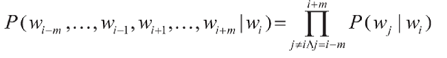

为了得到等式右边，我们需要假设给定目标单词（wi）的上下文单词彼此独立（例如，wi-2和wi-1是独立的）。虽然不完全正确，但这种近似使得学习问题切合实际，并且在实际中效果良好。

#### 2）Word2vec的优点

- Word2vec方法并不像基于WordNet的方法那样对于人类语言知识具有主观性。
- 与独热编码表示或单词共现矩阵不同，Word2vec表示向量大小与词汇量大小无关。
- Word2vec是一种分布式表示。与表示向量取决于单个元素的激活状态的（例如，独热编码）局部表示不同，分布式表示取决于向量中所有元素的激活状态。这为Word2vec提供了比独热编码表示更强的表达能力。

#### 3）示例

考虑以下非常小的文本：

```python
There was a very rich king. He had a beautiful queen. She was very kind.
```

做一些预处理并删除标点符号和无信息的单词：

```python
was rich king he had beautiful queen she was kind
```

现在，让我们用其上下文单词为每个单词形成一组元组，其格式为：目标单词→上下文单词1，上下文单词2（目标是给出左侧的单词能够预测右侧的单词）。我们假设两边的上下文窗口大小为1：

```
was --> rich
rich --> was, king
king --> rick, he
he --> king, had
had --> he, beautiful
beautiful --> had, queen
she --> queen, was
was --> she, kind
kind --> was
```

表示成词向量如下所示：

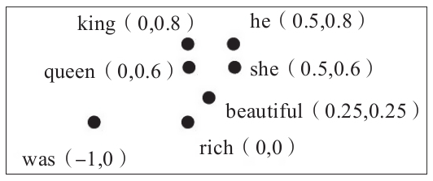

可以得到如下推导：

```python
queen = king - he + she
      = [0, 0.8] - [0.5, 0.8] + [0.5, 0.6]
      = [0, 0.6]
```

对于现实世界的语料库来说，这是一个不切实际的缩小规模之后的练习。因此，仅仅通过处理十几个数字是无法手工计算出这些词向量的值的。这是复杂的函数逼近方法，如神经网络为我们做的那样。实际任务中，词汇量也很容易超过10000个单词。因此，我们不能手动为大型文本语料库开发词向量，而需要设计一种方法来使用一些机器学习算法（例如，神经网络）自动找到好的词嵌入，以便有效地执行这项繁重的任务。


# 计算机视觉

## 一、基本理论

### 1. 什么是图像采样

采样是按照某种时间间隔或空间间隔，将空间上连续的图像变换成离散点的操作称为图像采样。

### 2. 什么是分图像辨率

采样后得到离散图像的尺寸称为图像分辨率。分辨率是数字图像可辨别的最小细节。分辨率由宽（width）和高（height）两个参数构成。宽表示水平方向的细节数，高表示垂直方向的细节数。例如：一副640\*480分辨率的图像，表示这幅图像是由 640\*480=307200个点组成；一副1920\*1080分辨率的图像，表示这幅图像是由1920\*1080= 2073600个点组成。

### 3. 什么是RGB颜色空间

RGB颜色空间中每个像素点有三个维度，分别记录在红（Red）、绿（Green）、蓝（Blue）三原色的分量上的亮度。

### 4. 什么是HSV颜色空间

HSV颜色空间是另一种常用的计算机中表示颜色的方法。HSV表示色相(hue)、饱和度(saturation)和亮度(value)。H表示颜色的相位角(hue) ，取值范围是0---360；S表示颜色的饱和度(saturation) ，范围从0到1，它表示成所选颜色的纯度和该颜色最大的纯度之间的比率；V表示色彩的明亮程度(value) ，范围从0到1。

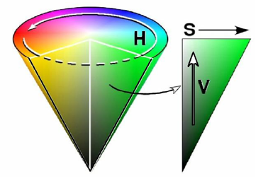

### 5. 什么是图像灰度化处理

在RGB模型中，如果R=G=B时，则彩色表示一种灰度颜色，其中R=G=B的值叫灰度值，因此，灰度图像每个像素只需一个字节存放灰度值（又称强度值、亮度值），灰度范围为0-255。将RGB图像转换为灰度图像的过程称为图像灰度化处理。

### 6. 图像灰度化处理有哪些方法

1）分量法。将彩色图像中的三分量的亮度作为三个灰度图像的灰度值，可根据应用需要选取一种灰度图像。

2）最大值法。将彩色图像中的三分量亮度的最大值作为灰度图的灰度值。

3）将彩色图像中的三分量亮度求平均得到一个灰度值。

4）根据重要性及其它指标，将三个分量以不同的权值进行加权平均。例如，由于人眼对绿色的敏感最高，对蓝色敏感最低，因此，按下式对RGB三分量进行加权平均能得到较合理的灰度图像。
$$
f(i,j)=0.30R(i,j)+0.59G(i,j)+0.11B(i,j)
$$

### 7. 图像加法运算有什么应用

1）图像加法可以用于多幅图像平均去除噪声。如下图：


2）图像加法实现水印的叠加效果。

### 8. 图像减法运算有什么应用

主要意义是增强图像间的差别，图像减法在连续图像中可以实现消除背景和运动检测。如下图：

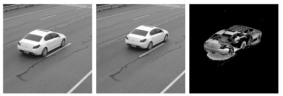

### 9. 图像放大时，可以采用哪些插值法

1）最邻近插值法。最邻近插值法使用点$(x', y')$最近的整数坐标处的灰度值作为$(x',y')$的值。这种插值方法计算量小，但精度不高，并且可能破坏图像中的线性关系。

2）双线性插值法。双线性插值法使用点$(x', y')$最邻近的4个像素值进行插值计算，在两个方向上执行两次线性插值操作。

### 10. 什么是直方图均衡化

直方图均衡化将原始图像的直方图，即灰度概率分布图，进行调整，使之变化为均衡分布的样式，达到灰度级均衡的效果，可以有效增强图像的整体对比度。
直方图均衡化能够自动的计算变化函数，通过该方法自适应得产生有均衡直方图的输出图像。能够对图像过暗、过亮和细节不清晰的图像得到有效的增强。


### 11. 什么是均值滤波

均值滤波指模板权重都为1的滤波器。它将像素的邻域平均值作为输出结果，均值滤波可以起到图像平滑的效果，可以去除噪声，但随着模板尺寸的增加图像会变得更为模糊。经常被作为模糊化使用。


### 12. 什么是高斯滤波

为了减少模板尺寸增加对图像的模糊化，可以使用高斯滤波器，高斯滤波的模板根据高斯分布来确定模板系数，接近中心的权重比边缘的大。大小为5的高斯滤波器及滤波效果如下所示：

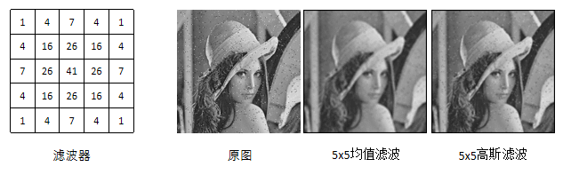

### 13. 什么是图像二值化处理，有什么优点

1）图像二值化（Image Binarization）就是将图像上的像素点的灰度值全部设置为黑色(0)或白色(255)，也就是将整个图像分割成明显的黑白效果的过程。二值化的方法是通过设定一个阈值，大于阈值部分全部置成255，小于阈值部分全部置成0。

2）优点

- 二值图像在数字图像处理中占有非常重要的地位，可以方便得进行连通域提取、形态学变化、感兴趣区域分割等操作。
- 图像的二值化使图像中数据量大为减少，并且能突显出目标的轮廓。二值化后的图像的集合性质只与像素值为0或255的点的位置有关，不再涉及像素的多级值，使处理变得简单，而且计算过程中数据的处理量减小。

### 14. 什么是图像膨胀

图像膨胀(dilate)是指根据原图像的形状，向外进行扩充。


### 15. 什么是图像腐蚀

图像腐蚀(erode)是指根据原图像的形状，向内进行收缩。


### 16. 什么是图像开运算

开运算就是先腐蚀再膨胀。开运算能够把比结构元素小的噪声和突刺过滤掉，并切断细长的连接起到分离的作用。例如将因噪声影响粘连在一起的区域分割开来。


### 17. 什么是图像闭运算

闭运算就是先膨胀再腐蚀。闭运算可以把比结构元素小的缺憾或者空洞补上，将细小断裂的区域进行连通。例如将因图像质量而断裂的目标区域进行合并连通。


### 18. 什么是仿射变换

仿射变换是指图像可以通过一系列的几何变换来实现平移、旋转等多种操作。该变换能够保持图像的平直性和平行性。平直性是指图像经过仿射变换后，直线仍然是直线；平行性是指图像在完成仿射变换后，平行线仍然是平行线。

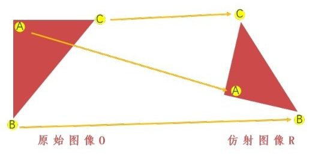


### 19. 什么是礼帽运算

礼帽运算是用原始图像减去其开运算图像的操作。礼帽运算能够获取图像的噪声信息，或者得到比原始图像的边缘更亮的边缘信息。


### 20. 什么是图像黑帽运算

黑帽运算是用闭运算图像减去原始图像的操作。黑帽运算能够获取图像内部的小孔，或前景色中的小黑点，或者得到比原始图像的边缘更暗的边缘部分。


### 21. 什么是图像金字塔

图像金字塔是由一幅图像的多个不同分辨率的子图所构成的图像集合。该组图像是由单个图像通过不断地降采样所产生的，最小的图像可能仅仅有一个像素点。通常情况下，图像金字塔的底部是待处理的高分辨率图像（原始图像），而顶部则为其低分辨率的近似图像。向金字塔的顶部移动时，图像的尺寸和分辨率都不断地降低。通常情况下，每向上移动一级，图像的宽和高都降低为原来的二分之一。

图像金子塔可以得到大小不同的图像，从而更方便进行图像处理、计算、识别以及特征提取。

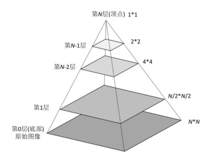


### 22. 什么是霍夫变换

霍夫变换是一种在图像中寻找直线、圆形以及其他简单形状的方法。霍夫变换采用类似于投票的方式来获取当前图像内的形状集合，该变换由Paul Hough（霍夫）于1962年首次提出。最初的霍夫变换只能用于检测直线，经过发展后，霍夫变换不仅能够识别直线，还能识别其他简单的图形结构，常见的有圆、椭圆等。


# 企业真题

1）填空题：在SVM、逻辑回归等二分类模型中，在模型训练完成后，如果调高分类阈值，会导致模型的精准率（precision）【提高】，模型的召回率（recall）【降低】，模型的auc（Area Under Curve）【增大】。

2）填空题：在模型训练过程中，一般情况下，增加batch size会导致模型的收敛速度【变慢】，减少学习率/步长会导致模型的收敛速度【变慢】。

3）填空题：LSTM对比原始RNN的最大改进是【解决了梯度消失，能处理更长的序列】；bi-LSTM对比LSTM最大的改进是【能够提取反向序列特征】

4）问答题：用户的年龄是离散特征还是连续特征？在输入模型之前如何进行处理？

答：年龄是连续特征。对连续特征处理有如下方式：

- 模型接收的特征为离散：需要将年龄进行离散化处理，按不同数值进行分段
- 模型可以接收连续特征，但要是用梯度下降法优化：该种情况下，需要对年龄进行归一化处理，归一化到0~1之间（例如神经网络模型）
- 模型可以接收连续特征，但不需要梯度下降法优化：该种情况下，直接将年龄输入模型即可

5）问答题：假如训练集正负样本比例为1:9，准确率（accuracy）为90%，验证集（测试集）正负样本比例为1:1，准确率为50%，能否肯定发生了过拟合现象？如何解决上述问题？

答：该现象 为样本不均衡导致的欠拟合，由于样本不均衡，导致模型并没有学习到数据的真实分布规律。解决方法是对多数样本进行降采样，对少数样本进行升采样。

6）问答题：经过下列卷积操作后，3\*3 conv -> 3\*3 conv -> 2\*2  max pool -> 3\*3 conv，卷积步长为1，没有填充，输出神经元感受野是多大？

答：感受野大小计算公式为：
$$
RF_n = RF_{n-1} + (f_n - 1) \times \prod_{i=1}^{n-1} s_i
$$
其中，$RF_n$表示第n层感受野大小，$RF_{n-1}$表示已经计算出的n-1层感受野大小，$f_n$表示第n层卷积核或池化区域大小，$s_i$表示1到n-1层卷积/池化步长的连乘。现将每层参数列入下表：

| 层数  | 卷积核 / 池化区域 | 步长 |
| ----- | ----------------- | ---- |
| Conv1 | 3*3               | 1    |
| Conv2 | 3*3               | 1    |
| Pool3 | 2*2               | 2    |
| Conv4 | 3*3               | 1    |

根据公式，上面卷积池化感受野大小为：
$$
RF_1 = 3 \\ 
RF_2 = RF_1 + (3-1) * 1 = 3 + 2 = 5 \\
RF_3 = RF_2 + (2-1) * 1 * 1 = 6 \\
RF_4 = RF_3 + (3-1) * 1 * 2 * 1 = 10
$$

7）神经网络加速训练方法有哪些？

答：可以从多个层级对模型进行优化和加速：

- 硬件层：使用GPU代替CPU训练，使用多GPU代替单GPU训练
- 模型层：采用轻量级模型，对模型进行裁剪、知识蒸馏
- 参数层：采用归一化、batch normal等方法
- 代码层：采用变化学习率，开始时学习率调大，训练一些轮次逐渐调小；采用合适优化器，例如自动应梯度下降优化器

8）解释一下BN层的作用，并简述其公式含义

- BN的作用：缓解梯度消失，缓解过拟合，加快模型收敛速度，增加模型稳定性

- BN的计算公式

  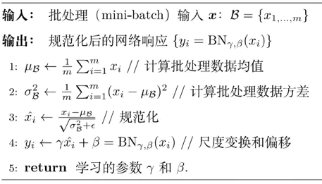

  

9）写出SVM中的硬间隔分类的loss

答：硬间隔指分类误差为0（即所有的样本都分类正确），软间隔指允许有一定程度的较小分类误差。SVM损失函数的推导过程如下：

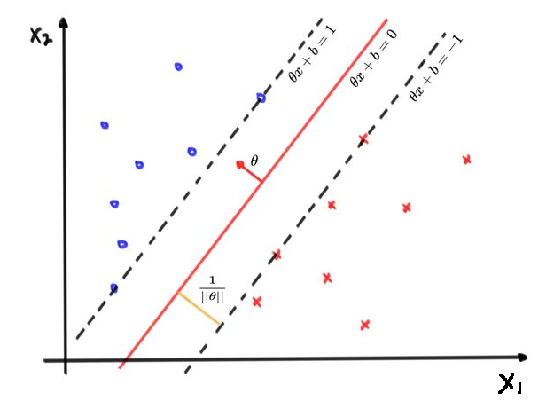

根据SVM正负例都在间隔上或间隔外，样本需满足以下条件：
$$
\frac{\theta ^ T x^{(i)} + b}{||\theta||} \ge d,\ \ y^{(i)} = 1 \\
\frac{\theta ^ T x^{(i)} + b}{||\theta||} \le d,\ \ y^{(i)} = -1
$$
不等式左右同时除以d得：
$$
\frac{\theta ^ T x^{(i)} + b}{||\theta||d} \ge 1,\ \ y^{(i)} = 1 \\
\frac{\theta ^ T x^{(i)} + b}{||\theta||d} \le -1,\ \ y^{(i)} = -1
$$
上式中主要关注$\frac{\theta ^T}{||\theta||d}$和$\frac{b}{||\theta||d}$，可以发现，本质没有什么变化，只是在原基础上进行了一定程度的缩放，所以等式可简化为：
$$
\theta ^ T x^{(i)} + b \ge 1,\ \ y^{(i)} = 1 \\
\theta ^ T x^{(i)} + b \le 1,\ \ y^{(i)} = -1
$$
综合上面两种情况，将$y^{(i)}$乘进去，可以写成一个不等式：
$$
y^{(i)}\theta ^ T x^{(i)} + b \ge 1
$$
同时，可以通过计算，求得支持向量到分类边界的间隔为：
$$
d = \frac{\theta^Tx +b}{||\theta||} = \frac{1}{||\theta||}
$$
所以，要想获得最大间隔的SVM，即要满足约束条件同时最大化几何间隔：
$$
max(\frac{1}{||\theta||}) \\ 
s.t. \ \ y^{(i)}(\theta ^T x^{(i)} + b) \ge 1
$$

10）问答题：TF-IDF与DF相比优势是什么？

答：单词权重最为有效的实现方法就是TF-IDF, 其指导思想建立在这样一条基本假设之上: 在一个文本中出现很多次的单词, 在另一个同类文本中出现次数也会很多, 反之亦然。所以如果特征空间坐标系取TF 词频作为测度, 就可以体现同类文本的特点。另外还要考虑单词区别不同类别的能力, TF*IDF 法认为一个单词出现的文本频率越小, 它区别不同类别的能力就越大, 所以引入了逆文本频度IDF 的概念, 以TF 和IDF 的乘积作为特征空间坐标系的取值测度。

文档频数(Document Frequency, DF)是最为简单的一种特征选择算法,它指的是在整个数据集中有多少个文本包含这个单词。在训练文本集中对每个特征计一算它的文档频次，并且根据预先设定的阑值去除那些文档频次特别低和特别高的特征。


11）问答题：对于中文LDA、NER和文本分类任务，是字向量好一些还是词向量好一些？为什么？

答：当使用机器学习的算法构建文本向量时，如词袋模型、TF-IDF和N-gram模型时，词向量算法会优于字向量，因为这些算法本身不能表示单词的语言信息，而机器学习算法通过分词后更能表达语句的含义，所以词向量优于字向量。
而采用深度学习算法构建文本向量时，字向量优于词向量，本质是指字向量在保持本身运算性能优越的同时，语义上可以表达词向量等级的更细腻语义。


12）简述离散化的好处，并写出离散化的常用方法有哪些？

- 离散化的好处：降维；非线性化；容易增加和减少特征；降低噪声值的影响

- 离散化的方法：

  - 区间划分法。如1-100岁可以划分为：（0-18）未成年、（18-50）中青年、（50-100）中老年。区间划分包括等距划分、按阶段划分、特殊点划分等

  - 卡方检验。分裂方法，就是找到一个分裂点看，左右2个区间，在**目标值上分布**是否有显著差异，有显著差异就分裂，否则就忽略。这个点可以每次找差异最大的点。合并类似，先划分如果很小单元区间，按顺序合并在目标值上分布不显著的相邻区间，直到收敛。卡方值通常由χ2分布近似求得。 χ2表示观察值与理论值之问的偏离程度。

  - 信息增益法。这个和决策树的学习很类似。分裂方法，就是找到一个分裂点看，左右2个区间，看分裂前后**信息增益变化**阈值，如果差值超过阈值（正值，分列前-分裂后信息熵），则分裂。每次找差值最大的点做分裂点，直到收敛。合并类似，先划分如果很小单元区间，按顺序合并信息增益小于阈值的相邻区间，直到收敛。

    

13）利用梯度下降法优化目标函数ln(wx)，给定第一轮参数w=2, x=10，请写出第三轮优化后的参数值（学习率$\lambda$ = 0.1）

第一步：根据初始值计算梯度 
$$
\frac{\partial y}{\partial w} = (ln(w) + ln(x))' = (ln(w))'= \frac{1}{w}
$$
所以w的初始梯度为 1 / 2 = 0.5.

第二步：根据梯度更新公式计算更新w
$$
w = w + \Delta w = 2 - (0.1 * 0.5) = 1.95
$$
第三步：继续计算第二轮梯度，并更新
$$
w = w + \Delta w = 1.95 - (0.1 * \frac{1}{1.95}) \approx 1.8987 \\
$$
第四步：计算第三轮梯度，并更新
$$
w = w + \Delta w = 1.8987 - (0.1 * \frac{1}{1.8987}) \approx 1.846 \\
$$
14）已知卷积层中输入尺寸32 \* 32 \*3，有10个大小为5\*5的卷积核，stride=1,pad=2，输出大小为多少？

输出特征图大小：OH = OW = (32 + 2 * 2 - 5 / 1 ) + 1 = 32

10个卷积核输出10个通道，总特征数量：10 * 32 * 32 = 10240


15）在把神经网络用于N个类别的分类任务时，输出层一般采用N路softmax神经元和Cross Entropy误差函数。但是在只有两个类别时，一般直接用一个sigmoid神经元，请证明2路softmax神经元和1个sigmoid神经元是等价的

答：对于两路softmax神经元，可以将其看作是两个sigmoid神经元的组合。假设两路softmax神经元的输出为 $y_1$ 和 $y_2$，则有：
$$
y_1 = \frac{e^{z_1}}{e^{z_1}+e^{z_2}} \\
y_2 = \frac{e^{z_2}}{e^{z_1}+e^{z_2}}
$$
其中，$z_1$ 和 $z_2$ 分别表示输入层到两个softmax神经元的连接权重与输入的线性组合。

我们可以将两个式子相减得到：
$$
y_1 - y_2 = \frac{e^{z_1}}{e^{z_1}+e^{z_2}} - \frac{e^{z_2}}{e^{z_1}+e^{z_2}} = \frac{e^{z_1}-e^{z_2}}{e^{z_1}+e^{z_2}}
$$
由于二分类任务中只有两个类别，因此 $y_2 = 1 - y_1$。代入上式得到：
$$
y_1 - (1 - y_1) = 2y_1 - 1 = \frac{e^{z_1}-e^{z_2}}{e^{z_1}+e^{z_2}}
$$
两边同时乘以 $\frac{1}{2}$，得到：
$$
y_1 = \frac{e^{z_1}}{e^{z_1}+e^{z_2}} = \frac{1}{1+e^{-(z_1-z_2)}}
$$
可以发现，这个式子和sigmoid神经元的输出函数形式是一样的，只是输入变成了 $z_1 - z_2$。因此，二分类问题中两路softmax神经元和一个sigmoid神经元是等价的。


16）Faster RCNN中，ROI pooling具体如何工作（怎么把不同大小的框，pooling到同样大小）？

答：ROI pooling的主要作用，是将候选区域的特征图处理成同样大小输出。例如，输入8x8的特征图，输出2x2的特征图，其工作原理入下：

输入：

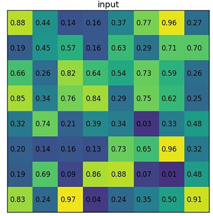

第一步：根据ROI projection算法计算候选区对应的特征图区域

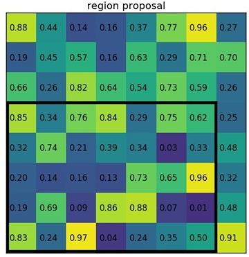

第二步：将其划分为2x2个区域，针对每个区域做max pooling

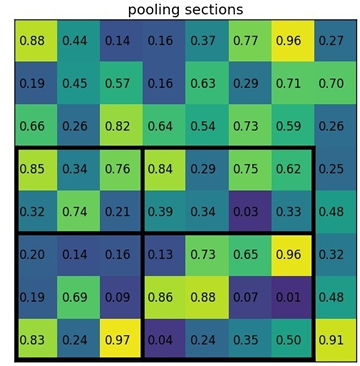

第三步：产生输出

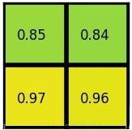

17）tensorflow[while_loop]和python[for]循环的区别，什么情况下for更优？

答：tensorflow[while_loop]和python[for]循环的区别在于它们的执行方式。

在tensorflow中，[while_loop]是一个动态图操作，它允许使用Python编写灵活的循环控制流，并且能够在同一张计算图上多次重用相同的结构。因此，在需要在大量数据上进行迭代更新的情况下，使用[while_loop]可以显著提高计算效率。

而在Python中，[for]循环是一个静态的迭代器，需要将所有的元素都加载到内存中，然后逐个遍历处理。因此，在处理小规模数据集或者只需要处理一次的任务时，使用[for]循环通常更为简单和高效。

总之，选择使用[while_loop]还是[for]循环取决于具体的场景和任务需求。如果需要在大量数据上进行迭代计算，以及希望能够在同一张计算图上多次重复使用相同的结构，则应该选择[while_loop]。而如果只需要对少量数据进行处理或者只需要迭代一次，则可以使用Python的[for]循环。


18）Sigmoid函数的求导过程

答：根据分数求导公式
$$
（\frac {U}{V}）' = \frac {U'V - UV'} {V^2}
$$
Sigmoid函数表达式：$y = \frac{1}{1+e^{-x}} $，先对分母部分求导：
$$
(1 + e^{-x})' = e^{-x} ln(e) = e^{-x}
$$
再根据分数求导公式有：
$$
(\frac{1}{1+e^{-x}})' = \frac{0 * (1+e^{-x}) - 1 * e^{-x}}{(1+e^{-x})^2} \\ 
= \frac{1 + e^{-x} -1}{(1+e^{-x})^2} \\ 
= \frac{1 + e^{-x}}{(1+e^{-x})^2} - \frac{1}{(1+e^{-x})^2} \\ 
= \frac{1}{1+e^{-x}} (1- \frac{1}{1+e^{-x}}) \\ 
= f(x)(1 - f(x))
$$
推导完毕.


19）Sigmoid函数为什么会出现梯度消失？Sigmoid函数导数最大值出现在哪个值？Relu为什么能解决梯度消失问题？

答：Sigmoid函数当自变量大于某个值或小于某个值时，函数梯度接近于0，出现梯度消失。当自变量的值为0时，函数导数最大。Relu大于0的部分梯度均为1，所以避免了梯度消失情况。


20）SSD和YOLO的区别？YOLOv2和YOLOv3的区别？

答：（1）抛开具体实现上的差异， SSD检测精度优于YOLO3，YOLO3检测时间快于SSD

（2）YOLOv2与YOLOv3的区别

- 骨干网：YOLOv3采用更深的Darknet53，YOLOv2采用Darknet19
- 分类器：YOLOv3采用逻辑分离器，YOLOv2采用softmax
- 锚点：YOLOv3采用9个锚点，YOLOv2采用5个锚点
- 多尺度融合：YOLOv3采用13x13, 26x26, 52x52三种特征图进行特征融合，YOLOv2采用13x13, 26x26进行特征融合


21）测试集中有1000个样本，600个是A类，400个B类，模型预测结果700个判断为A类，其中正确有500个，300个判断为B类，其中正确有200个。请计算B类的查准率（Precision）和召回率（Recall）

答：可以建立以下混淆矩阵

|      | A    | B    |
| ---- | ---- | ---- |
| A    | 500  | 100  |
| B    | 200  | 200  |

类别B查准率：200 / (200 + 100) = 2/3

类别B召回率：200 / (200 + 200) = 1/2 = 0.5


22）训练模型时，如果样本类别不均衡，有什么办法解决？如何判断模型是否过拟合？对于神经网络中有哪些方法解决过拟合问题？

答：（1）对于类别不均衡问题，可以对样本多的类别采用降采样，对少的类别采用过采样

（2）通过对比训练集和测试集准确率判断模型是否过拟合，如果训练集准确率较高、测试集准确率较低则判断为过拟合

（3）见前面章节


23）神经网络节点激活函数的作用是什么？Sigmoid，Relu和softmax函数的表达式是什么？各自作用的优缺点是什么？

答案见前面章节


24）下采样和上采样的理解

答：对矩阵缩小称为下采样，对矩阵放大称为上采样


25）深度可分离卷积是什么？

答：深度可分离卷积由depthwise卷积和pointwise卷积两部分结合起来，在提取特征同时对数据进行降维

普通卷积：输入5x5三通道图像，4个3x3三通道卷积核，总参数量为4 × 3 × 3 × 3 = 108，如下图所示：

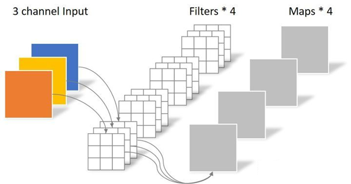

采用深度可分离卷积时，先做逐通道卷积：

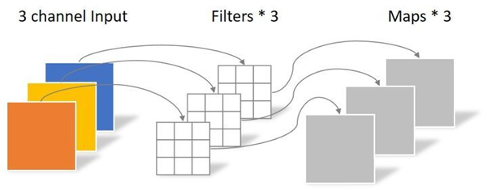

再做逐点卷积：

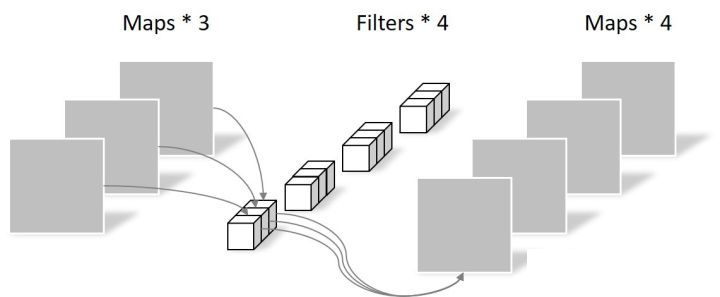

最终得到四个通道的特征图，但参数总量减少为：

逐通道卷积：3 × 3 × 3 = 27
逐点卷积：1 × 1 × 3 × 4 = 12

共39个参数。


26）目标检测常用算法有哪些，简述对算法的理解

答：目标检测可分为两阶段检测和一阶段检测，两阶段检测先产生候选区，再做分类和回归，分类问题确定目标物体的类别，回归问题确定目标物体的位置。一阶段检测没有产生候选区的过程。

（1）两阶段检测技术

- 步骤：先产生候选区，再做分类和回归

- 特点：检测速度慢，检测精度高

- 代表性模型：R-CNN/Fast R-CNN/Faster R-CNN系列；SPP-Net

（2）一阶段检测技术

- 步骤：直接在特征图上做分类和回归

- 特点：检测速度快，检测精度较低

- 代表性模型：YOLO1/2/3/4/5系列，SSD，RetinaNet


27）LSTM跟GRU的区别

答：GRU是LSTM的简化版，GRU参数更少因此更容易收敛，但是数据集很大的情况下，LSTM表达性能更好。从结构上来说，GRU只有两个门（update和reset），LSTM有三个门（forget，input，output）


28）用伪代码形式写出双线性插值的核心公式

答：双线性插值，又称为双线性内插。在数学上，双线性插值是有两个变量的插值函数的线性插值扩展，其核心思想是在两个方向分别进行一次线性插值。其原理为：

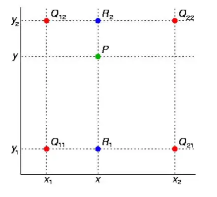

假如我们想得到未知函数*f*在点*P*= (*x*,*y*) 的值，假设我们已知函数*f*在*Q*11 = (*x*1,*y*1)、*Q*12 = (*x*1,*y*2),*Q*21 = (*x*2,*y*1) 以及*Q*22 = (*x*2,*y*2) 四个点的值。首先在*x*方向进行线性插值，得到R1和R2，然后在*y*方向进行线性插值，得到P.

- 第一步：X方向的线性插值，在Q12,Q22中插入蓝色点R2，Q11，Q21中插入蓝色点R1；
- 第二步 ：Y方向的线性插值 ,通过第一步计算出的R1与R2在y方向上插值计算出P点。

表示成公式：
$$
f(R_1) \approx \frac{x_2 - x}{x_2 - x_1} f(Q_{11}) + \frac{x - x_1}{x_2 - x_1} f({Q21}) \ \ where R_1 =(x, y_1) \\ 
f(R_2) \approx \frac{x_2 - x}{x_2 - x_1} f(Q_{12}) + \frac{x - x_1}{x_2 - x_1} f({Q22}) \ \ where R_1 =(x, y_2)
$$

29）介绍一种图像特征提取方法（如Sift特征、Hog特征、LBP特征等），从方法实现的过程原理、方法的用途、特征的特点，或其它你了解的方面任选一种介绍即可

（1）Sift特征

- SIFT（全称是Scale Invariant Feature Transform，尺度不变特征变换）对旋转、尺度缩放、亮度变化等保持不变性，是一种非常稳定的局部特征
- 算法特点
  - 图像的局部特征，对旋转、尺度缩放、亮度变化保持不变，对视角变化、仿射变换、噪声也保持一定程度的稳定性
  - 独特性好，信息量丰富，适用于海量特征库进行快速、准确的匹配
  - 多量性，即使是很少几个物体也可以产生大量的SIFT特征
  - 高速性，经优化的SIFT匹配算法甚至可以达到实时性
  - 扩展性，可以很方便的与其他的特征向量进行联合
- 步骤
  - **尺度空间的极值检测**：搜索所有尺度空间上的图像，通过高斯微分函数来识别潜在的对尺度和选择不变的兴趣点
  - **特征点定位**：在每个候选的位置上，通过一个拟合精细模型来确定位置尺度，关键点的选取依据他们的稳定程度
  - **特征方向赋值**：基于图像局部的梯度方向，分配给每个关键点位置一个或多个方向，后续的所有操作都是对于关键点的方向、尺度和位置进行变换，从而提供这些特征的不变性
  - **特征点描述**：在每个特征点周围的邻域内，在选定的尺度上测量图像的局部梯度，这些梯度被变换成一种表示，这种表示允许比较大的局部形状的变形和光照变换
  - 将图像image内的所有block的HOG特征descriptor串联起来就可以得到该image（你要检测的目标）的HOG特征descriptor了。这个就是最终的可供分类使用的特征向量了

（2）Hog特征

- 方向梯度直方图（Histogram of Oriented Gradient, HOG）特征是一种在计算机视觉和图像处理中用来进行物体检测的特征描述子。它通过计算和统计图像局部区域的梯度方向直方图来构成特征。
- 算法过程
  - 灰度化
  - 采用Gamma校正法对输入图像进行颜色空间的标准化（归一化）；目的是调节图像的对比度，降低图像局部的阴影和光照变化所造成的影响，同时可以抑制噪音的干扰
  - 计算图像每个像素的梯度（包括大小和方向）；主要是为了捕获轮廓信息，同时进一步弱化光照的干扰
  - 将图像划分成小cells，统计每个cell的梯度直方图（不同梯度的个数）
  - 将每几个cell组成一个block（例如3*3个cell/block），一个block内所有cell的特征descriptor串联起来便得到该block的HOG特征

（3）LBP特征

- LBP是Local Binary Pattern（局部二值模式）的缩写，具有灰度不变性和旋转不变性等显著优点
- 原始的LBP算子定义为在3 ∗ 3的窗口内，以窗口中心像素为阈值，将相邻的8个像素的灰度值与其进行比较，若周围像素值大于等于中心像素值，则该像素点的位置被标记为1，否则为0。这样，3 ∗ 3 邻域内的8个点经比较可产生8位二进制数（通常转换为十进制数即LBP码，共256种），即得到该窗口中心像素点的LBP值，并用这个值来反映该区域的纹理信息。需要注意的是，LBP值是按照顺时针方向组成的二进制数


30）求矩阵特征值、特征向量，或谈谈特征值分解（或奇异值分解）在图像中的应用
$$
A = \left(
\begin{matrix}
1 & 2 & 3\\
4 & 5 & 6 \\
7 & 8 & 9
\end{matrix}
\right)
\tag{2}
$$

答：

特征值分解在图像中的应用有：

- 图像压缩：奇异值分解可以将一个大型图像矩阵分解为三个小型矩阵的乘积，其中一个小矩阵包含了该图像的主要特征信息，另外两个小矩阵则用于描述该图像在行和列方向上的变化。通过选择只保留最重要的主成分，即主要的奇异值，可以实现对图像的压缩，从而减少存储空间和传输带宽。

- 图像去噪：特征值分解可以用于图像的去噪。将一个含有噪声的图像矩阵进行特征值分解，然后去掉一些较小的特征值，再将矩阵合并起来，可以得到一个近似于原始图像的新矩阵，从而实现对图像的去噪。

- 图像增强：特征值分解还可以用于图像的增强。将一个需要增强的图像矩阵进行特征值分解，然后调整一些较小的特征值的大小，再将矩阵合并起来，可以得到一个增强后的图像。

- 特征提取：特征值分解和奇异值分解也可以用于图像的特征提取。将一个图像矩阵进行特征值分解或奇异值分解，然后提取其中的一些主要的特征向量，就可以得到一个较低维度的特征空间，从而实现对图像的有效描述和分类。

  

31）写出一维傅里叶正、逆变换公式，或谈谈傅里叶变换在图像分析中有哪些作用？

答：一维傅里叶变换：
$$
F(u) = \sum_{M=0}^{M-1} f(x)(e^{-jux \frac{2 \pi}{M}}), u = 0,1,2,...,M-1 \\ 
\Rightarrow F(u) = \sum_{M=0}^{M-1} f(x)(cos(ux \frac{2 \pi}{M}) - jsin(ux \frac{2 \pi}{M})), u = 0,1,2,...,M-1
$$
一维傅里叶逆变换：
$$
F(u) = \frac{1}{M}\sum_{u=0}^{M-1} F(u)e^{jux \frac{2 \pi}{M}}, x = 0,1,2,...,M-1 \\ 
\Rightarrow F(u) = \frac{1}{M} \sum_{u=0}^{M-1} F(u)(cos(ux \frac{2 \pi}{M}) - jsin(ux \frac{2 \pi}{M})), x = 0,1,2,...,M-1
$$
傅里叶变换用于在时域信号和频域信号之间进行转换，在图像处理中，能分离出图像高频部分和低频部分。


32）常用图像分割算法有哪些？各有什么优缺点？

答：（1）传统图像算法：分水岭算法

（2）深度学习算法

- FCN模型，又称全卷积网络，去掉了CNN中的全连接层。对输入图像进行层层卷积、上采样，预测出每个像素所属的类别
- U-Net，该模型对输入图像进行层层卷积、上采样，预测出每个像素所属的类别。该模型简单、高效、容易理解、容易定制，针对样本较少的情况也能有较好分割效果
- Mask RCNN，将Faster RCNN 上增加了FCN来产生定位和分割信息
- DeepLab系列，引入了空洞卷积，条件随机场，多尺度空洞卷积等策略，使得分割效果更好


33）简单介绍几种典型的传统人脸检测算法和基于深度学习的人脸检测算法

答：（1）基于传统人脸检测算法：Haar级联人脸检测算法

（2）深度学习人脸检测算法：MTCNN模型，Cascade CNN模型


34）简单介绍几种具有代表性的人脸识别模型结构及算法，以及常用的损失函数

答：（1）基于传统人脸识别算法：LBPH人脸识别算法，EigenFaces人脸识别算法

（2）深度学习人脸检测算法：DeepFace模型，FaceNet模型，DeepID系列模型


35）简单介绍常用人脸活体检测算法，可以从动作配合式和静默检测两个方面进行阐述

答：所谓“活体检测”是指判断捕捉到的人脸是真实人脸，还是伪造的人脸攻击（如：彩色纸张打印人脸图，电子设备屏幕中的人脸数字图像 以及 面具 等）


36）简单介绍几种常用的人脸属性及识别算法

答：性别识别、年龄估计、种族识别、表情识别


37）简单介绍几种典型传统文字行检测算法和基于深度学习的文字行检测算法

答：文字检测是文字识别过程中的一个非常重要的环节，文字检测的主要目标是将图片中的文字区域位置检测出来，以便于进行后面的文字识别，只有找到了文本所在区域，才能对其内容进行识别。

文字检测的场景主要分为两种，一种是简单场景，另一种是复杂场景。其中，简单场景的文字检测较为简单，例如像书本扫描、屏幕截图、或者清晰度高、规整的照片等；而复杂场景，主要是指自然场景，情况比较复杂，例如像街边的广告牌、产品包装盒、设备上的说明、商标等等，存在着背景复杂、光线忽明忽暗、角度倾斜、扭曲变形、清晰度不足等各种情况，文字检测的难度更大。

传统检测方法 包括形态学操作、MSER+NMS等方法；深度学习文字检测主要包括CTPN、SegLink、EAST等方法。


38）简单介绍CRNN+CTC和CRNN+Attention文字行识别方法

答：（1）CRNN+CTC模型。该模型主要实现了端对端的文字识别，其主要流程为：输入 --> 卷积（提取特征） --> 特征图转序列 --> 双向循环神经网络 --> CTC。

（2）CRNN+Attension模型。该模型在CRNN网络的输出层后面加上一层Attention（注意力）机制。Attention 机制在序列学习任务上具有巨大的提升作用，在编解码器框架内，通过在编码段加入Attention模型，对源数据序列进行数据加权变换，或者在解码端引入Attention 模型，对目标数据进行加权变化，可以有效提高序列对序列的自然方式下的系统表现。


39）简述AdaBoost，BP神经网络基本原理

答：（1）Boosting，也称为增强学习或提升法，是一种重要的集成学习技术，能够将预测精度仅比随机猜度略高的弱学习器增强为预测精度高的强学习器，这在直接构造强学习器非常困难的情况下，为学习算法的设计提供了一种有效的新思路和新方法。作为一种元算法框架，Boosting几乎可以应用于所有目前流行的机器学习算法以进一步加强原算法的预测精度，应用十分广泛，产生了极大的影响。AdaBoost正是其中最成功的代表，被评为数据挖掘十大算法之一，其主要思想为：

- 先通过对N个训练样本的学习得到第一个弱分类器；
- 将分错的样本和其他的新数据一起构成一个新的N个的训练样本，通过对这个样本的学习得到第二个弱分类器 ；
- 将1和2都分错了的样本加上其他的新样本构成另一个新的N个的训练样本，通过对这个样本的学习得到第三个弱分类器；
- 最终经过提升的强分类器。即某个数据被分为哪一类要由各分类器权值决定。

Aadboost 算法系统具有较高的检测速率，且不易出现过适应现象。但是该算法在实现过程中为取得更高的检测精度则需要较大的训练样本集，在每次迭代过程中，训练一个弱分类器则对应该样本集中的每一个样本，每个样本具有很多特征，因此从庞大的特征中训练得到最优弱分类器的计算量增大。

（2）BP神经网络。BP(back propagation)神经网络按照误差反向传播算法训练的多层前馈神经网络，是应用最广泛的神经网络。在神经网络训练过程中，使用梯度下降法对模型参数进行优化。因为深度神经网络存在隐藏层，隐藏层的误差或偏导数不容易求解，所以采用反向传播算法，根据输出层的误差（或参数偏导数）一次倒退每个隐藏层的每个参数的误差（或偏导数）的方式进行训练。


40）贝叶斯公式（N++个公司都考到了）

答：贝叶斯定义是通过先验概率计算后验的公式，公式定义为：
$$
P(A|B) = \frac{P(A)P(B|A)}{P(B)}
$$
推导过程：$P(A)$和$P(B)$是A事件和B事件发生的概率. $P(A|B)$称为条件概率，表示B事件发生条件下，A事件发生的概率；$P(A,B)$为联合概率，即时间A和B同时发生的概率。则有：
$$
P(A,B) =P(B)P(A|B)\\
P(B,A) =P(A)P(B|A)
$$
因为$P(A,B)=P(B,A)$, 所以有：
$$
P(B)P(A|B)=P(A)P(B|A)
$$
两边同时除以P(B)，则得到贝叶斯定理的表达式。


41）使用过哪些图像算法库

答：opencv，PIL


42）在你以前有关图像信号的处理工作中，请列举你单独负责的项目，并简述你在项目中的职责；项目困难点在哪里，是如何解决的？

答：参照关于项目问题的总结


43）简述常用边沿检测算子，各有什么特性？

答：（1）Sobel算子。Sobel算子是典型的基于一阶导数的边缘检测算子，由于该算子中引入了类似局部平均的运算，因此对噪声具有平滑作用，能很好的消除噪声的影响。Sobel算子对于象素的位置的影响做了加权，与Prewitt算子、Roberts算子相比因此效果更好。Sobel算子包含两组3x3的矩阵，分别为横向及纵向模板，将之与图像作平面卷积，即可分别得出横向及纵向的亮度差分近似值。实际使用中，常用如下两个模板来检测图像边缘：
$$
G_x = \left[
\begin{matrix}
-1 \ \ 0 \ \  1 \\ 
-2 \ \ 0 \ \  2 \\ 
-1 \ \ 0 \ \  1 \\ 
\end{matrix}
\right]  , \ \ \ \ G_y = \left[
\begin{matrix}
1 \ \ 2 \ \  1 \\ 
0 \ \ 0 \ \  0 \\ 
-1 \ \ -2 \ \  1 \\ 
\end{matrix}
\right]
$$
其中，第一个为水平边沿检测模板，第二个为垂直边沿检测模板。图像的每一个像素的横向及纵向梯度近似值可用以下的公式结合，来计算梯度的大小：
$$
G = \sqrt{G_x^2 + G_y^2}
$$
（2）Prewitt算子。Prewitt算子是一种一阶微分算子的边缘检测，利用像素点上下、左右邻点的灰度差，在边缘处达到极值检测边缘，去掉部分伪边缘，对噪声具有平滑作用 。其原理是在图像空间利用两个方向模板与图像进行邻域卷积来完成的，这两个方向模板一个检测水平边缘，一个检测垂直边缘。对数字图像f(x，y)，Prewitt算子的定义如下：

G(i)=|[f(i-1,j-1)+f(i-1,j)+f(i-1，j+1)]-[f(i+1,j-1)+f(i+1，j)+f(i+1，j+1)]|

G(j)=|[f(i-1,j+1)+f(i,j+1)+f(i+1，j+1)]-[f(i-1,j-1)+f(i,j-1)+f(i+1，j-1)]|

则 P(i,j)=max[G(i),G(j)]或 P(i,j)=G(i)+G(j)

Prewitt梯度算子法就是先求平均，再求差分来求梯度。水平和垂直梯度模板分别为：
$$
G_x = \left[
\begin{matrix}
-1 \ \ 0 \ \  1 \\ 
-1 \ \ 0 \ \  1 \\ 
-1 \ \ 0 \ \  1 \\ 
\end{matrix}
\right]  , \ \ \ \ G_y = \left[
\begin{matrix}
1 \ \ 1 \ \  1 \\ 
0 \ \ 0 \ \  0 \\ 
-1 \ \ -1 \ \  1 \\ 
\end{matrix}
\right]
$$
该算子与Sobel算子类似，只是权值有所变化。

（3）Laplace算子。 Laplace算子是一种各向同性算子，二阶微分算子，在只关心边缘的位置而不考虑其周围的象素灰度差值时比较合适。Laplace算子对孤立象素的响应要比对边缘或线的响应要更强烈，因此只适用于无噪声图象。存在噪声情况下，使用Laplacian算子检测边缘之前需要先进行低通滤波。所以，通常的分割算法都是把Laplacian算子和平滑算子结合起来生成一个新的模板。了更适合于数字图像处理，将拉式算子表示为离散形式：
$$
\bigtriangledown ^2f = \frac{\partial ^2 f}{\partial x^2} + \frac{\partial ^2 f}{\partial  y^2}
$$
离散拉普拉斯算子的模板：
$$
G_x = \left[
\begin{matrix}
0 \ \ 1 \ \  0 \\ 
1 \ \ -4 \ \  1 \\ 
0 \ \ 1 \ \  0 \\ 
\end{matrix}
\right]  , \ \ \ \ G_y = \left[
\begin{matrix}
1 \ \ 1 \ \  1 \\ 
1 \ \ -8 \ \  1 \\ 
1 \ \ 1 \ \  1 \\ 
\end{matrix}
\right]
$$
（4）Canny算子。该算子功能比前面几种都要好，但是它实现起来较为麻烦，Canny算子是一个具有滤波，增强，检测的多阶段的优化算子，在进行处理前，Canny算子先利用高斯平滑滤波器来平滑图像以除去噪声，Canny分割算法采用一阶偏导的有限差分来计算梯度幅值和方向，在处理过程中，Canny算子还将经过一个非极大值抑制的过程，最后Canny算子还采用两个阈值来连接边缘。其步骤为：

step1: 用高斯滤波器平滑图象；
step2: 用一阶偏导的有限差分来计算梯度的幅值和方向；
step3: 对梯度幅值进行非极大值抑制；
step4: 用双阈值算法检测和连接边缘。


44）简述常用图像去噪方法，各有什么特性？（N个公司都考到了）

答：（1）均值滤波。在N领域内求均值；

（2）中值滤波。在N邻域内求终止，对椒盐噪声抑制效果较好，图像细节损失较大；

（3）高斯滤波。采用满足高斯分布的滤波器进行滤波，大小、标准差可根据参数设置；

（4）双边滤波。在保留轮廓清晰的情况下进行降噪处理。


45）请列举几种常用的图像空间

答：图像空间指图像的色彩表示方式，常用的有RBG，HSV，YUV等色彩空间


47）常用插值算法有哪些？

答：最邻近插值法、双线性插值法


48）什么叫算子？请列举常用的边沿检测算子

答：算子（Operator）是一个数学概念，它将一个元素在向量空间（或模）中转换为另一个元素的映射，简单来说就是独立的计算单元或规则。常用边沿检测算子有Sobel算子、Prewitt算子、Laplacian算子、Canny算子。


49）【选择题】下列算法中属于图像锐化处理的是（C）

A、低通滤波

B、加权平均法

C、高通滤波

D、中值滤波

解析：低通滤波指低频信号能正常通过，而高于设定临界值的高频信号则被阻隔、减弱；高通滤波高频信号能正常通过，而低于设定临界值的低频信号则被阻隔、减弱。在图像中，梯度较大的部分为图像高频部分，梯度较小的为图像低频部分。高通滤波是提取出边沿和轮廓，低通滤波是取出边沿轮廓以外的部分。中值滤波主要用于图像模糊及降噪。


50）【选择题】图像与灰度直方图间的对应关系是（B）

A、一一对应

B、多对一

C、一对多

D、以上都不是

答：图像灰度直方图反映的是图像像素值分布情况，一个图像只有一个直方图；但直方图相同的图像，可能有不同的像素排列，而呈现出不同的图像内容。


51）【判断题】以下说法是否正确

- 拉普拉斯算子可用于图像平滑处理（错误）
- 高频加强滤波器可以有效增强图像边沿和灰度平滑区的对比度（正确）
- 彩色图像增强时采用RGB模型进行直方图均衡化可以在不改变图像颜色的基础上对图像的亮度进行对比度增强（错误）


52）将高频加强和直方图均衡相结合是得到边沿锐化和对比度增强的有效方法。上述两个操作先后顺序对结果有影响吗？为什么？


54）HOUGH变换的原理是什么？HOUGH变换用在检测圆上应该怎么做？

答：HOUGH（霍夫）变换主要用于检测图像中的简单几何形状，如直线/线段、圆形、椭圆等。在使用HOUGH变换检测圆形时，实际是找边沿是否满足(x, y)为中心，R为半径的圆的方程式。在实际使用中，可以先对图像进行灰度化处理、二值化处理或求图像轮廓、梯度信息，再使用HOUGH变换，以获得更好的效果。


55）简述傅里叶变换在图像处理中的应用

答：傅里叶变换是将时域信号转换为频域信号的一种方式。简单来说，该变换能将一组周期信号转变为多个正弦信号的叠加。在图像处理中，利用傅里叶变换，可以分离出图像的高频部分、低频部分，从而提取出图像的轮廓边沿，或轮廓边沿以外的部分。


56）什么是神经网络，有什么主要特点？选择神经网络应该考虑什么因素？

答：见讲义部分


57）解释线性判别

答：LDA是一种监督学习的降维技术，也就是说它的数据集的每个样本是有类别输出的，其思想可以用一句话概括，就是“投影后类内方差最小，类间方差最大”，即将数据在低维度上进行投影，投影后希望每一种类别数据的投影点尽可能的接近，而不同类别的数据的类别中心之间的距离尽可能的大。如下图所示：

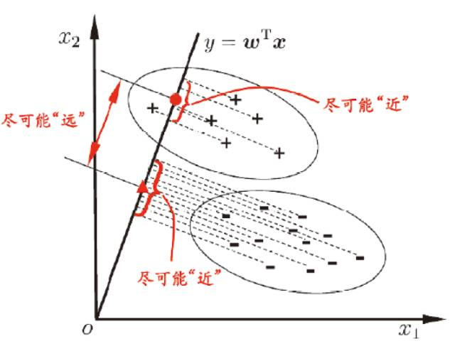

例如，有以下两种投影方式，第二种投影方式更好，因为红色数据和蓝色数据各个较为集中，且类别之间的距离明显。

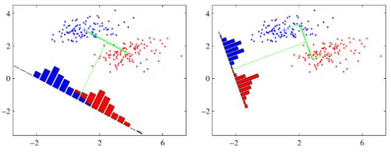

在实际应用中，数据是多个类别的，我们的原始数据一般也是超过二维的，投影后的也一般不是直线，而是一个低维的超平面。


58）深度学习中，常见的layer的类别有哪些？其作用分别是什么？

答：常见的层有：

- 卷积层：卷积运算，提取特征
- 池化层：降维，提升模型泛化能力
- 激活层：执行激活运算
- 全连接层：充当分类器
- BN：Batch Normal层，缓解梯度消失，缓解过拟合，加快模型收敛速度和稳定性
- Dropout：丢弃学习层，缓解梯度消失。在有些模型中，使用BN则不使用dropout


59）常用的图像二值化方法及使用示例

答：（1）阈值分割法。设定一个阈值，用每个图像的像素值跟阈值进行比较，大于阈值设为最大值，小于阈值设为最小值，实现图像二值化。

（2）自适应阈值分割法：程序自动寻找分割阈值，分割结果前景、背景类间方差最大。


60）写出Sobel算子，拉普拉斯算子，以及它们梯度方向上的区别，并编程实现

答：见前面


61）列出机器学习中常见的分类算法，并比较各自的特点

答：机器学习中常见的分类算法有：

（1）线性分类器。使用线性模型计算连续值，然后进行离散化处理。特点是计算相对简单

（2）支持向量机。二分类模型，寻找最优线性分类边界，所谓最优分类边界指支持向量间隔最大化。强分类器。

（3）决策树。决策树根据样本属性，构建一个树状结构，将具有相同属性的样本划分到一个子节点下，通过投票法产生分类结果。弱分类器。

（4）朴素贝叶斯。利用贝叶斯定理，计算样本属于某个类别的概率，分类到概率最高的类别中。所谓“朴素”，指假设特征之间是独立的。

（5）KNN。找与这个待分类样本在特征空间中距离最近的K个已标注样本作为参考，做出分类决策。


62）二值图、灰度图及RGB彩色图像的概念、表示及存储

答：（1）二值图：图像灰度值只有两种颜色

（2）灰度图：只有亮度信号，没有色彩信号，灰度图像表示一个单通道矩阵

（3）彩色图像：包含彩色信号的图像，彩色图像表示一个三通道数组。RGB色彩空间三个通道分别存储红色、绿色、蓝色三原色信息，HSV色彩空间分别存储图像的色相、饱和度和亮度。


63）实现对一彩色图像的灰度化算法，可以写多个

答：（1）平均值法

（2）最大值法

（3）取单通道值

（4）加权平均法


64）数码相机大多使用jpg格式存储数字相片，如果一般情况下jpg格式的压缩比为5-10，请估计使用500万像素数码相机所拍摄到的彩色数字相片的高、宽，以及文件大小


65）你是否学习或接触过数字图像技术？如果学习或接触过，试写一算法，实现将彩色图像旋转180度


66）给定一个n\*n的二维矩阵表示一个图像，将图像顺时针旋转90度，并在下方写出代码。（说明：必须在原地旋转，这意味着需要直接修改输入二维矩阵，不要使用另一个矩阵来旋转图像）

原矩阵：

```
[[1, 2, 3],
 [4, 5, 6],
 [7, 8, 9]]
```

旋转后：

```
[[7, 4, 1],
 [8, 5, 2],
 [9, 6, 3]]
```


67）朴素贝叶斯分析的关键假设是什么？基于几点需要做这样的假设？

答：假设样本特征是独立的、不相互影响。在计算中，如果不引入该假设，可能某些先验概率无法计算出来。


68）简述k-means算法的输入、输出及聚类过程

答：见前面章节


69）基于用户协同过滤的算法思想是什么？

答：基于用户协同过滤的算法是一种推荐系统算法，它基于用户之间的相似性来提供个性化推荐。

该算法的基本思想是：根据用户历史行为数据（例如购买、评分、点赞等），计算不同用户之间的相似度，然后将这些相似用户的兴趣偏好进行合并，形成推荐列表并向用户推荐。

具体而言，该算法分为两个阶段：

- 计算用户之间的相似度：首先需要选择一个相似度度量方法（如余弦相似度、欧几里得距离、皮尔逊相关系数等），然后根据用户历史行为数据计算不同用户之间的相似度得分。
- 基于相似用户的历史行为，生成推荐列表：对于目标用户，选取与其相似度较高的一些用户，然后将这些用户在某一领域内的历史行为进行汇总，生成推荐列表并向目标用户进行推荐。

基于用户协同过滤的算法可以处理大规模数据和复杂数据类型，容易实现和解释，并且能够提供高质量的个性化推荐。缺点是需要依赖用户历史行为数据，如果用户数据量较少或者用户行为存在一定的随机性，可能会导致推荐结果不准确。


70）我们想要减少数据集中的特征，即降维，选择以下合适的方案（ABCD）

A、使用前向特征选择方法

B、使用后向特征选择方法

C、先把所有特征都使用，去训练一个模型，得到测试集上的表现，然后去掉一个特征，再去训练，用交叉验证看看测试集上的表现。如果表现比原来好，可以去除这个特性

D、查看相关性表，去除相关性高的一些特征

解析：特征选择 ( Feature Selection )也称特征子集选择( Feature Subset Selection , FSS ) ，或属性选择( Attribute Selection ) ，是指从全部特征中选取一个特征子集，使构造出来的模型更好。特征越多，维度越高，模型分析、训练越复杂，且容易引起过拟合。选择特征方法有：

- 序列前向选择( SFS , Sequential Forward Selection )：特征子集X从空集开始，每次选择一个特征x加入特征子集X，使得特征函数J( X)最优。简单说就是，每次都选择一个使得评价函数的取值达到最优的特征加入，其实就是一种简单的贪心算法。
- 序列后向选择( SBS , Sequential Backward Selection )：从特征全集O开始，每次从特征集O中剔除一个特征x，使得剔除特征x后评价函数值达到最优。
- 双向搜索( BDS , Bidirectional Search )：使用序列前向选择(SFS)从空集开始，同时使用序列后向选择(SBS)从全集开始搜索，当两者搜索到一个相同的特征子集C时停止搜索。
- 增L去R选择算法 ( LRS , Plus-L Minus-R Selection )：算法从空集开始，每轮先加入L个特征，然后从中去除R个特征，使得评价函数值最优( L > R )； 算法从全集开始，每轮先去除R个特征，然后加入L个特征，使得评价函数值最优( L < R )。
- 决策树。利用决策树进行特征筛选。


71）ResNet网络最后两层是什么？

答：ResNet最后三层为平均池化层、全连接层、softmax，产生1000路输出。


72）【选择题】以下说法正确的是（ABC）

A、语义分割需要区分到图中每一点像素点，而不仅仅是矩形框中的部分。但是同一个物体不同实例不需要单独分割出来

B、实例分割只对图像中object进行检测，并对检测到的object进行分割

C、全景分割是对图中所有物体包括背景都要进行检测和分割

D、Unet是可以不反向传播的，它的网络结构是基于多尺度的


73）【选择题】以下说法中正确的是（A）

A、SVM对噪声（如来自其他分部的噪声样本）鲁棒

B、在AdaBoost中，所有被分错的样本的权重更新比例相同

C、Boosting和Bagging都是组合多个分类器投票的方法，二者都是根据单个分类器正确率决定其权重

D、给定N个数据点，如果其中一半用于训练，一半用于测试，则训练误差和测试误差之间的差别会随着N的增加而减少


75）【选择题】机器学习中L1正则化和L2正则化的区别是（AD）

A、使用L1可以得到稀疏的权值

B、使用L1可以得到平滑的权值

C、使用L2可以得到稀疏的权值

D、使用L2可以得到平滑的权值


76）【选择题】关于线性回归的描述，以下正确的有（BC）

A、基本假设包括随机干扰项是均值为0，方差为1的标准正态分布

B、基本假设包括随机干扰项是均值为0的同方差正态分布

C、在违背基本假设时，普通最小二乘估计量不再是最佳线性无偏估计量

D、在违背基本假设时，模型不再可以估计

E、可以用DW检验残差是否存在序列相关性

F、多重共线会使得参数估计方差减小

解析：线性回归有五个基本假设：

- 线性性&可加性。线性性指X1每变动一个单位，Y相应变动a1个单位，与X1的绝对数值大小无关。可加性指X1对Y的影响是独立于其他自变量（如X2）的。
- 误差项之间的相互独立，不满足该项假设，我们称模型具有自相关性（Autocorrelation）
- 自变量之间的相互独立，若不满足这一特性，我们称模型具有多重共线性性（Multicollinearity）
- 误差项方差为常数（误差项具有恒定的方差），若不满足，则为**异方差性**（Heteroskedasticity）
- 误差项呈正态分布

假设失效带来的影响：

- 线性性&可加性失效：模型将无法很好的描述变量之间的关系，极有可能导致很大的泛化误差
- 自相关性：自相关性经常发生于时间序列数据集上，后项会受到前项的影响。当自相关性发生的时候，我们测得的标准差往往会偏小，进而会导致置信区间变窄
- 多重共线性性：如果我们发现本应相互独立的自变量们出现了一定程度（甚至高度）的相关性，那我们就很难得知自变量与因变量之间真正的关系了。当多重共线性性出现的时候，变量之间的联动关系会导致我们测得的标准差**偏大**
- 异方差性的出现意味着误差项的方差不恒定，这常常出现在有异常值（Outlier）的数据集上，如果使用标准的回归模型，这些异常值的重要性往往被高估。在这种情况下，标准差和置信区间不一定会变大还是变小
- 如果误差项不呈正态分布，意味着置信区间会变得很不稳定，我们往往需要重点关注一些异常的点（误差较大但出现频率较高），来得到更好的模型。


77）【选择题】在分类问题中，我们经常会遇到正负样本数量不等的情况，比如正样本为10W条数据，负样本只有1W条数据，以下最合适的处理方法是（ ）

A、将负样本重复10次，生成10W样本量，打乱顺序参与分类

B、直接进行分类，可以最大限度利用数据

C、从10W正样本中随机抽取1W参与分类

D、将负样本每个权重设置为10，正样本权重为1，参与训练过程

备注：单选选A，多选可选ACD


78）假定目标变量的类别非常不平衡，即主要类别占据了训练数据的99%。现在你的模型在测试集上表现为99%的准确率，那么下面哪一项表述是正确的（AD）

A、准确率并不适合与衡量不平衡类别问题

B、准确率适合与衡量不平衡类别问题

C、精确率和召回率适合于衡量不平衡类别问题

D、精确率和召回率不适合于衡量不平衡类别问题


79）其它条件不变的情况下，哪种做法容易引起过拟合（D）

A、增加训练集量

B、减少神经网络隐藏层节点数

C、删除系数特征

D、SVM算法中使用高斯核/RBF核替代线性核


80）以下选项属于梯度下降学习率设定的策略有（ABCD）

A、固定学习率

B、循环学习率

C、余弦退火

D、热重启随机梯度下降

E、不同的网络层使用不同学习率


81）以下选项中，叙述正确的是（DE）

A、利用函数最优化算法，可以得到全局最优解

B、卷积核可以设定为长方形

C、池化核中的数值是自定义的

D、卷积核的数据决定输出特征图的维度

E、逻辑回归是线性分类器


82）在深度学习中，涉及到大量的矩阵相乘，现在需要计算三个稠密矩阵A，B，C的乘积，假设三个矩阵尺寸分别为m\*n, n\*p, p\*q，且m<n<p<q，以下计算顺序效率最高的是（A）

A、(AB)C

B、AC（B）

C、A（BC）

D、效率都相同

解析 ：AC不能相乘，所以B答案错误；

A选项计算次数A选项的乘法计算次数，m\*n\*p+m\*p\*q，C选项计算次数n\*p\*q+m\*n\*q，因为m<n<p<q，所以m\*n\*p<m\*n\*q，m\*p\*q<n\*p\*q


83）L1与L2范数在Logistic Regression中，如果同时加入L1和L2范数，会产生什么效果（A）

A、可以做特征选择，并一定程度防止过拟合

B、能解决维度灾难问题

C、能加快计算速度

D、可以获得更准确的结果

解析：在Logistic Regression中，L1和L2范数通常用于对模型进行正则化来防止过拟合。L1范数可以使得一些特征的权重变为0，从而实现特征选择；L2范数可以限制所有参数的大小，防止过度依赖单个特征。

如果同时加入L1和L2范数，也就是使用Elastic Net正则化，会产生以下效果：

- 可以同时实现特征选择和参数约束：与L1和L2范数单独使用相比，Elastic Net可以同时实现L1和L2的特性，即通过L1范数将一些不重要的特征权重置为0，并通过L2范数限制所有参数的大小。这样做既能减少特征数量，又能避免某个特定特征对决策的过分倾斜。
- 降低模型复杂度：Elastic Net能够对模型进行更加强力的正则化，从而在训练集上产生更简洁的模型，降低过拟合的风险并提高泛化性能。
- 参数调优：Elastic Net需要调节两个超参数，即L1和L2的权重，从而能够根据不同的数据集和应用场景进行参数优化，获得更好的效果。

需要注意的是，Elastic Net的计算成本较高，因为需要同时进行L1和L2正则化。此外，当特征维度较大时，由于存在相互依赖的特征，可能需要更多的数据才能获得较好的效果。


84）简述CNN、LSTM原理和两者适合应用的场合，叙述CNN如何进行特征提取、分类预测

答：原理见讲义

适用场景：CNN主要用于图像问题；LSTM主要用于序列问题，如NLP，语音识别


85）图像处理中，高通滤波、低通滤波的作用是什么？

答：低通滤波起平滑作用，高通滤波起锐化作用


86）现在假设负样本量:正样本量=20:1，下列哪些方法可以处理这种不平衡的情况？（ACD）

A. 直接训练模型，预测的时候调节阈值

B. 下采样对少样本进行扩充，以增加正样本数量

C. 随机降采样负样本

D. 训练过程中，增加负样本的权重


87）以下关于正则化的描述正确的是（ABCD）

A. 正则化可以防止过拟合

B. L1正则化能得到稀疏解

C. L2正则化约束了解空间

D. Dropout也是一种正则化方法


88）下列方法中，可以用于特征降维的方法包括（ABCD）

A. 主成分分析PCA

B. 线性判别分析LDA

C. 深度学习SparseAutoEncoder

D. 矩阵奇异值分解SVD

E. 最小二乘法LeastSquares

解析：SparseAutoEncoder（稀疏自动编码器）限制隐藏单元的个数来学到有用的特征, 或者可以对网络施加其他的限制条件, 而不限制隐藏单元的个数.  例如，一个神经元是激活的当且仅当其输出值比较接近1, 一个神经元是不激活的当且仅当其输出值比较接近0. 我们可以限制神经元在大多数时间下都是不激活的


89）在机器学习中需要划分数据集，常用的划分测试集和训练集的划分方法有哪些（ABC）

A. 留出法

B. 交叉验证法

C. 自助法

D. 评分法

解析：

- 留出法：把数据集分成互不相交的两部分，⼀部分是训练集，⼀部分是测试集，保持数据分布⼤致⼀致，类似分层抽样

- 自助法：每次随机从数据集（有m个样本）抽取⼀个样本，然后再放回（也就是说可能被重复抽出），m次后得到有m个样本的数据集，将其作为训练集，适⽤于样本量较⼩，因其⽆法满⾜数据分布⼀致性，难以划分数据集的情况

  

90）以下(   )属于线性分类器最佳准则?

A. 感知准则函数

B. 贝叶斯分类

C. 支持向量机

D. Fisher准则

答案：ACD

解析：线性分类器有三大类：感知器准则函数、SVM、Fisher准则，而贝叶斯分类器不是线性分类器。

感知器准则函数：代价函数J=-(WX+w0)，分类的准则是最小化代价函数. 感知器是神经网络（NN）的基础，网上有很多介绍.

SVM：支持向量机也是很经典的算法，优化目标是最大化间隔（margin），又称最大间隔分类器，是一种典型的线性分类器（使用核函数可解决非线性问题）

Fisher准则：更广泛的称呼是线性判别分析（LDA），将所有样本投影到一条远点出发的直线，使得同类样本距离尽可能小，不同类样本距离尽可能大

贝叶斯分类器：一种基于统计方法的分类器，要求先了解样本的分布特点（高斯、指数等），所以使用起来限制很多. 在满足一些特定条件下，其优化目标与线性分类器有相同结构（同方差高斯分布等），其余条件下不是线性分类


91）N-gram是一种简单有效的统计语言模型，通常n采用1-3之间的值，它们分别称为unigram、bigram和trigram。现有给定训练语料合计三个文档如下：
D1： John read Moby Dick
D2： Mary read a different book
D3： She read a book by Cher
利用bigram求出句子“John read a book”的概率大约是（      ）

A. 1

B. 0.06

C. 0.09

D. 0.0008

答案：B

解析：

John作为开头单词的概率（<bos>表示起始符号，<eos>表示结束符号）：
$$
P(John | <bos>) =  \frac{c(<bos>)c(John)}{c(<bos>)} = \frac{1}{3}
$$
其它概率：
$$
P(book | a) =\frac{c(a)c(book)}{c(a)}= \frac{1}{2} \\
P(a | read) = \frac{c(read)c(a)}{c(read)}= \frac{2}{3} \\ 
P(read | John) = \frac{c(John)c(read)}{c(John)} = 1 \\
P(<eos>|book) = \frac{c(<eos>)c(book)}{c(book)} = \frac{1}{2}
$$
句子“John read a book”的概率：1/3 * 1 * 2/3 * 1/2 * 1/2 = 0.05555


92）简述densnet结构及特点

答：DenseNet是一种密集连接卷积神经网络，它的主要结构特点是在网络中的每一层都将前面所有层的输出作为输入。DenseNet通过这种方式促进了信息和梯度的流动，增加了网络的稠密性，也降低了模型参数量。此外，DenseNet还采用了批次归一化和ReLU非线性激活函数等常见的技术，以提高模型的性能和训练速度。相对于其他卷积神经网络，DenseNet在对小数据集进行训练时表现更好，并且具有更好的特征重用能力。

93）YOLO5做了哪些改进，YOLO3和YOLO5主要区别有哪些？

答：相比YOLOv3，YOLOv5在以下几方面进行了改进：

- 轻量化：YOLOv5网络结构更加轻量级，可在保持较高精度的情况下实现更快的推理速度。
- SPP模块：引入了空间金字塔池化（SPP）模块，在不同尺度上提取特征，从而增强感受野。
- PANet结构：引入了特征金字塔网络（PANet）结构，可以更好地处理不同大小的目标。
- 数据增强策略：使用更多的数据增强策略，例如自适应缩放、随机翻转、色彩变换等，以提高模型的鲁棒性和泛化能力。
- 模型训练：采用更高效的模型训练方法，例如基于MixUp的数据增强和类别平衡损失函数等。

相对于YOLOv3，YOLOv5主要的区别在于网络结构和性能表现。YOLOv5具有更轻量级的网络结构和更快的推理速度，同时也取得了更好的物体检测精度。


94）cpu和gpu有什么区别？

答：CPU（中央处理器）和GPU（图形处理器）都是计算机的核心部件，它们的主要区别在于其设计目标和工作方式。

CPU是一种通用处理器，其设计目标是针对各种不同类型的任务进行优化，例如操作系统、办公软件或浏览器等。CPU通常包含少量的核心（通常是2-16个），并且每个核心可以执行多个任务。CPU的设计目标是实现快速响应和高度灵活性，而不是处理大量数据的复杂计算问题。

GPU则是一种专门用于图形处理和并行计算的处理器，其设计目标是加速图形和计算密集型任务，例如视频游戏、科学计算和深度学习等。GPU通常包含数百个甚至数千个小型处理单元，可以同时处理大量数据并执行并行计算。这使得GPU在处理大规模数据和密集计算时比CPU更有效率。

总体来说，CPU适用于广泛的通用计算任务，而GPU则适用于需要高性能数值计算和图像处理的任务。


95）yolov5后处理的代码怎么写？

答：YOLOv5的后处理代码包括两个主要步骤：解码预测和筛选边界框。

- 解码预测。在YOLOv5中，每个预测都包含一个类别得分张量和一个边界框偏移张量。为了将这些预测转换为实际边界框，我们需要对它们进行解码。以下是解码预测的Python代码示例：

  ```python
  def decode_predictions(predictions, anchors, num_classes, input_shape):
      # 获取特征图大小
      grid_size = predictions.shape[1:3]
      # 获取锚框数量
      num_anchors = len(anchors)
      # 将预测结果重塑为二维数组
      predictions = np.reshape(predictions, (-1, num_anchors * (5 + num_classes)))
      # 转换锚框形状
      anchors = np.tile(anchors, (grid_size[0] * grid_size[1], 1))
      # 计算边界框坐标
      box_xy = sigmoid(predictions[:, :2])
      box_wh = np.exp(predictions[:, 2:4]) * anchors
      box_confidence = sigmoid(predictions[:, 4])
      box_class_probs = softmax(predictions[:, 5:])
      # 调整边界框坐标到原始输入尺寸
      xy_offset = (np.arange(grid_size[1]) + 0.5) / grid_size[1]
      xy_offset = np.stack([xy_offset] * grid_size[0])
      xy_offset = np.expand_dims(np.stack([xy_offset] * num_anchors, axis=-1), axis=2)
      box_xy += xy_offset
      box_xy /= grid_size[::-1]
      box_wh /= input_shape[::-1]
      # 计算边界框左上角和右下角坐标
      box_mins = box_xy - (box_wh / 2.)
      box_maxes = box_xy + (box_wh / 2.)
      boxes = np.concatenate([box_mins, box_maxes], axis=-1)
      return boxes, box_confidence, box_class_probs
  ```

  

- 筛选边界框。解码预测后，我们需要对边界框进行筛选，以滤除低置信度的边界框，并将重叠的边界框合并成单个边界框。以下是筛选边界框的Python代码示例：

  ```python
  def filter_boxes(boxes, scores, classes, score_threshold, iou_threshold):
      # 在每个类别上应用置信度阈值
      indices = np.where(scores >= score_threshold)[0]
      boxes = boxes[indices]
      classes = classes[indices]
      scores = scores[indices]
      # 非最大抑制
      selected_indices = non_max_suppression(boxes, classes, scores, iou_threshold)
      return boxes[selected_indices], scores[selected_indices], classes[selected_indices]
  ```

  

96）mmdetection模型是什么，用法，配置，能处理的方向是什么？

答：mmdetection是一个基于PyTorch的目标检测开源框架，提供了丰富的预训练模型和检测器实现。它支持各种目标检测任务，如物体检测、实例分割、人脸检测等，并提供了多种优秀的检测算法，包括Faster R-CNN, Mask R-CNN, RetinaNet, FCOS等。

用法： mmdetection提供了简单易用的命令行工具，可以轻松地训练、测试和评估模型。可以通过以下步骤使用mmdetection：

- 安装mmdetection：可通过pip安装或者从GitHub克隆源代码并安装相关依赖。
- 准备数据集：将数据集按照指定格式准备好，包括图片和标注文件。
- 配置训练参数：mmdetection提供了各种不同的配置文件，可以选取适合自己的配置文件，并根据需要进行修改。
- 开始训练：运行训练命令即可开始训练模型。
- 测试和评估：训练完成后，可以使用测试命令对模型进行测试，并使用评估命令评估模型性能。

配置： mmdetection的配置文件采用Python语言编写，并采用了易于理解的字典结构。配置文件的主要内容包括数据集路径、模型结构、训练参数等。可以根据需要选择不同的配置文件，并进行修改以满足自己的需求。

能处理的方向： mmdetection支持各种目标检测任务，包括物体检测、实例分割、人脸检测等。它提供了多种优秀的检测算法，可以根据自己的需求选择不同的算法进行检测。同时，mmdetection还支持多种数据增强策略和训练技巧，可以帮助用户快速搭建高效且准确的检测模型。


97）决策树算法怎么搭建的？

98）网络一般是重新训练还是迁移权重？

99）训练模型时候有什么问题？训练模型有没有遇到什么怪问题？


100）梯度下降局部最优怎么解决

梯度下降方法在优化神经网络等高维非凸函数时，可能会陷入局部最优解。为了避免陷入局部最优，以下是一些解决方法：

- 随机初始化：通过多次随机初始化权重和偏置，可以增加找到全局最优解的机会。

- 梯度裁剪：通过裁剪梯度的大小，可以防止梯度出现异常值并使其保持在一个合理的范围内，从而更快地收敛。

- 学习率调整：学习率是控制模型参数更新步长的超参数，它的大小对模型的性能和收敛速度有很大影响。可以通过动态调整学习率的大小来平衡模型的收敛速度和稳定性。

- 正则化：通过添加正则化项（如L1或L2正则化）来限制模型参数的大小，从而防止过拟合，并使得模型更容易跳出局部最优。

- 神经架构搜索：通过搜索不同的神经网络结构，可以找到更好的初始点，从而更有效地避免陷入局部最优。神经架构搜索需要大量计算资源和时间，但可以获得显著的性能提升。

- 随机梯度下降：传统的梯度下降在每次迭代中使用所有数据进行更新，而随机梯度下降（SGD）则是每次迭代中只使用部分数据。这样可以使模型更容易跳出局部最优，并且加速训练过程。

- 梯度下降变种：像Momentum、Adagrad、RMSProp、Adam等梯度下降的变种方法也可以有效地避免陷入局部最优。这些方法通过考虑过去梯度信息或者改变梯度下降的方向和步长来达到这个目的。

  

101）opencv 的底层原理是什么？

答：OpenCV是一种开源的计算机视觉库，为计算机视觉和机器学习提供了大量的函数和工具。其底层原理涵盖以下几个方面：

- 数据结构：OpenCV中使用了包括Mat等多种数据结构，用于表示图像、矩阵等数据。
- 图像处理：OpenCV支持基本的图像处理操作，如裁剪、缩放、旋转、滤波等。这些操作通常通过卷积运算实现。
- 特征检测：OpenCV提供了多种特征检测算法，如SIFT、SURF、Harris角点检测等。
- 目标检测和跟踪：OpenCV提供了多种目标检测和跟踪算法，如Haar级联检测器、人脸识别、KCF跟踪器等。
- 机器学习：OpenCV提供了多种机器学习算法，如支持向量机（SVM）、人工神经网络、随机森林等。
- 硬件加速：OpenCV可以利用CPU、GPU、FPGA等硬件进行加速，提高计算速度。

总体来说，OpenCV的底层原理主要是基于数学计算的图像处理与分析技术，通过对图像进行数字化处理，提取图像的特征信息，进而实现图像识别、目标检测和跟踪等计算机视觉应用。


102）ai芯片的基本结构与原理？

答：AI芯片（AI chip）是专门为人工智能（AI）应用而设计的芯片，其基本结构和原理可以分为以下几个方面：

- 硬件架构：AI芯片通常采用并行计算架构，比如深度神经网络（DNN）中的卷积神经网络（CNN）使用的是卷积层、池化层、全连接层等计算单元。此外，还包括特定的加速器、存储单元和输入/输出接口等。
- 计算单元：AI芯片中最重要的计算单元就是矩阵乘法单元，该单元通常由一组多元并行运算单元和一组数据寄存器组成。这些单元能够对大量的数据进行高效的并行计算，从而提高了计算效率。
- 存储单元：AI芯片中的存储单元主要包括内存和缓存。在深度学习中，由于数据量很大，因此需要大容量的内存来存储数据和模型参数；同时，为了提高计算效率，还需要快速的缓存可以预先存储部分数据，以便计算单元快速访问。
- 算法优化：AI芯片还需要针对不同的任务进行算法优化，比如使用定点算法来代替浮点算法，以取得更高的运算速度和计算精度。

总之，AI芯片的基本结构和原理主要是针对深度学习等人工智能应用进行设计的，并与传统的通用计算机硬件有所不同。它包括了矩阵乘法单元、存储单元、各种加速器、输入/输出接口等部分，以便实现高效的数据处理和计算。同时，也需要进行算法优化，以最大程度地提高计算效率和精度。

103）训练好的数据保存为什么文件？

104）给2个多边形，他们有相切，相交，相邻，使用什么方法可以给他们合并？

答：如果两个多边形相切、相交或相邻，可以使用布尔运算中的合并操作（Union），将它们合并成一个新的多边形。具体来说，可以使用裁剪算法（Clipping Algorithm）实现布尔运算，常用的裁剪算法包括 Sutherland-Hodgman 算法、Weiler-Atherton 算法等。


105）k-means++无监督学习和yolov3有监督学习是怎么搭配使用？

答：可以使用k-means++来对数据进行聚类，然后将每个簇中心点作为yolov3的初始 anchor box，这样可以有助于提高yolov3的检测精度。具体步骤如下：

- 使用k-means++算法将训练集中的bounding box聚成K个簇。
- 对于每个簇，计算它们的中心点，作为yolov3的一个anchor box。
- 将这些anchor box加入yolov3的训练集中，重新训练yolov3模型。


106）mAP值是如何计算的？

答：mAP（mean Average Precision）指的是平均精度均值，是用来评估目标检测算法性能的指标。它的计算方法如下：

- 对于每个类别，将检测结果按照置信度从大到小排序。
- 依次计算每个预测框的精度和召回率，并绘制出精度-召回率曲线。
- 计算该类别下面积最大的精度-召回率曲线下的面积作为该类别的AP（Average Precision）。
- 对所有类别的AP求平均得到mAP。

其中，精度指的是检测出来的正样本中真实正样本的比例，即 TP / (TP + FP)；召回率指的是真实正样本中检测出来的正样本的比例，即 TP / (TP + FN)。


107）用opencv检测到单独每个点的坐标吗，比如可以取到树叶每个点的坐标  或者边缘或者树叶的尖的点的坐标?

答：可以使用边缘检测算法，如Canny边缘检测，再结合轮廓发现函数 findContours() 来提取出树叶和尖端的轮廓信息。通过遍历轮廓上的每个点，就可以得到每个点的坐标。


108）焦点损失函数，平衡因子，和±比例失调是什么？

答：焦点损失函数（Focal Loss Function）是一种在处理类别不平衡问题时常用的损失函数，它可以让模型更加关注难以分类的样本。平衡因子（Balance Factor）是指在计算损失时为了平衡不同类别的权重而引入的一个系数。而±比例失调（±Ratio Imbalance）则是指正负样本之间的数量差异。

具体来说，焦点损失函数通过降低容易分类的样本的权重，将更多的“注意力”放在难以分类的样本上，从而提高模型对于难以分类样本的预测能力。如果将焦点损失函数表示为 $FL(p_t)=-\alpha_t(1-p_t)^\gamma \log(p_t)$，其中 $p_t$ 表示模型预测的概率，$\alpha_t$ 是平衡因子，$\gamma$ 是调节焦点损失的超参数。当 $\gamma=0$ 时，焦点损失函数等价于交叉熵损失函数。

另外，由于在某些任务中，正负样本的数量可能会存在较大的差异，这就导致了类别不平衡问题的出现。此时，除了使用焦点损失函数外，还可以通过设置平衡因子来平衡不同类别的权重。平衡因子通常定义为反类别频率的倒数，即 $\alpha_t=\frac{1}{\sum_t n_t}$，其中 $n_t$ 表示第 $t$ 个类别的数量。

最后，±比例失调是指正负样本之间的数量分布不均衡，这可能会导致模型在训练过程中对于某些类别的预测能力出现偏差。为了解决这个问题，可以采用上述提到的方法来处理类别不平衡问题。


109）项目上线都是怎么维护的，上线后客户有问题怎么解决怎么跟进？

答：

110）文字识别、处理，检测等有哪些来源的写好的库可以调用？

答：

111）图像膨胀、腐蚀的原理是什么？

答：图像膨胀（Dilation）和腐蚀（Erosion）是形态学图像处理中常用的基本操作。它们可以通过对二值化图像中的像素进行操作，来改变图像中目标区域的形态和大小。

膨胀操作的原理是将目标区域向外扩张，使得其周围的背景区域被逐渐填充。具体来说，膨胀操作会遍历所有像素，并将每个目标像素与其周围的若干个像素进行比较。如果周围至少有一个像素是目标像素，则当前像素也被视为目标像素。这样就可以将目标像素向周围扩张，从而增加目标区域的大小和粗细。

腐蚀操作的原理则是将目标区域向内缩小，使得其周围的背景区域被逐渐削弱。具体来说，腐蚀操作也会遍历所有像素，并将每个目标像素与其周围的若干个像素进行比较。如果周围所有的像素都是目标像素，则当前像素也被视为目标像素。这样就可以将目标像素向周围收缩，从而减少目标区域的大小和粗细。


sigmid与softmax的区别
网络模型都调什么参数
介绍一下项目模型的结构
梯度爆炸梯度消失
vgg16的特点 以及模型的结构
resnet模型结构与特点
残差网络的内容与特点
yolo3的输出是什么样的
交叉验证怎么工作的，以及如何提高模型精度
输入图片的大小？
照片上的图形是什么是怎么出来的？

1.所做的东西是用在硬件上的么
2.怎么进行部署的
3.yolov3放在硬件上是不是有些大，一般工业上用的是比较轻量化的
4.训练的时候分为6种类别数据集是咱们分的？
5.模型调优调的是哪些内容
6.模型在什么情况下训练的比较好，最优的参数是多少
7.遇到过拟合和欠拟合怎么处理
8.做AI这方面有几个人，整个公司有多少人
9.tensorflow有的框架层都是C＋＋，调参的时候要看代码，就有c＋＋，有注意到么
10.那些c＋＋写的什么功能
11.网络算法自己会搭么，怎么搭
12.冒泡排序和快速排序的区别，以及链式求导简述一下
13.视频数据流怎么处理的
14.视频流里高亮问题比较常见，这种情况一般怎么处理的
15.在这些项目中遇到过哪些困难的问题
16.遇到梯度消失问题是依靠哪些理论基础去修改的
17.之前训练的数据都是512×512的，如果数据是几公里乘几公里的，可以进行处理么

你用Python语言，你现在的代码量有多少了？ 
如果给你一千万条的记录，你会怎么来检索关键词？
你知道Python和C++的区别吗？ 
你在这个项目里具体是做什么的？ 
你知道为什么用TensorFlow框架，不用其他的吗？ 
你们这个项目里，样本的分辨率是多少？ 答：256*256
256的数据怎么来的？ 
最开始的照片是高清的，你是怎么处理成256的？
你们用过目标检测算法吗？ 答：YOLO3
为什么用YOLO3不用其他的？ 你知道YOLO系列的原理吗？ 
有什么常用的图像分割算法吗？ 
如果样本里有污点，你们是怎么处理的？ 
有误检的情况吗？怎么处理的？
召回率和查准率的定义？
数据结构有学习过吗？ 举例说一下


5.12日航星永志面试

项目一：

1、为什么选择VGG作为主干网络，用的是多少层？进行了哪些修改？

2、输入图片的尺寸是多少？输入图片的通道数是多少？传入网络中的图片尺寸是多少？传入网络中的图片通道数是多少？

3、训练集和测试集的比例是多少？

4、分成几个类别？

5、关于第5条，因为VGG是分类模型，预测分数属于回归问题，是用的哪个模型进行的预测分数？这个预测模型的输入是什么？输出是什么？

6、是怎样进行训练的？使用的是GPU还是什么其他的？

7、知不知道一些GPU的型号，包括GPU的显存这一方面？

8、用GPU训练的时候有没有注意GPU的占用情况等信息？

9、有没有出现过训练过程中出现报错，原因是GPU空间占满了的情况？

10、在训练VGG是的batch-size是多少？训练了多少轮？

11、有没有对学习率做过调整？

12、使用的是什么优化器？优化器的参数设置是怎样的？SGD有哪些参数？SGD(随机梯度下降)和GD(梯度下降)有什么区别？

13、对于Momentum的参数有什么看法？因为SGD一般需要调节它的动量，动量值设置成多大效果会比较好？

14、为什么在训练VGG时没有优先选择Adam优化器？

 

 

关于VGG：

1、VGG的网络结构是怎样的？为什么要连续两次卷积之后在进行池化？为什么不是一次卷积连着一次池化？

2、为什么要用3×3的卷积核？因为AlexNet是7×7的卷积核，VGG用3×3的卷积核的意义是什么？

答：卷积核越小，感受野越小，卷积核越大，感受野越大

3、为什么卷积核的个数要依次成倍递增？

4、为什么VGG最多能到19层，为什么会梯度消失？

 

关于项目二：

1、识别的公式的难度是怎样的？

2、识别的字符除了数字以外还有哪些？

3、怎样做的数据标注？平方、分数、下角标、上角标是怎样实现的识别？

4、对于字符大小不一样的公式(比如说平方公式)是怎样实现的？比如说(2+3)²是怎样进行标注的？

5、对于分数是怎样进行标注的？是以什么形式输出的？(比如说输入的是，标注的内容是怎样的？输出的是还是1/3还是怎样的形式？)

6、正常的标注会有文字信息和坐标信息，坐标是怎样的一个结构呢？是如何定位到文字的呢？标注的内容是什么形式的呢？

7、识别出来的结果怎么去使用呢？对于公式进行修改的意义在于哪里呢？


1、Tensorflow中Session是一个怎样的概念？为什么要在Session中来执行图？在Session中运行的过程中能不能修改shape这个参数？ 

2、openCV中的开运算和闭运算两者的效果之间的区别？一阶段梯度算子和二阶段梯度算子的区别？

3、CTC Loss是怎样实现的？ 

4、YOLOv3后处理的流程是怎样的？ 

3、项目流程是怎样的？怎么选择的模型？ 

4、项目是怎样进行保存的？ 

5、Canny和边沿检测的区别？ 

6、项目是怎样进行部署的？ 

7、怎样挂载硬盘？怎样隔离多套环境？比如说在系统上有多个Python版本，是怎样将它们隔离开的？

 

关于其他：

1、有没有看过一些关于深度学习的书籍？

2、证书的考试是中文还是英文的？主要是什么题型？

3、有没有看过一些论文？看论文的时候会看哪些部分？

4、平时训练模型训练的多不多？都训练过哪些模型？平时有没有了解过kaggle(类似于算法竞技的一个平台)

5、对于Linux操作系统了解多少？能不能进行部署？

6、利用Linux的哪些脚本进行修改文档？关于Vim的快捷键都有哪些？


# 附录一：常用求导公式

| 原函数             | 导函数                      |
| ------------------ | --------------------------- |
| $y=c$              | $y'=0$                      |
| $y=n^x$            | $y'=n^x ln(n)$              |
| $y=log_a x$        | $y'= \frac{1}{x ln(a)}$     |
| $y= ln (x)$        | $y' = \frac {1} {x}$        |
| $y=x^n$            | $y' = n x^{n-1}$            |
| $y= \frac{1}{x^n}$ | $y'= - \frac {n} {x^{n+1}}$ |
| $y=sin (x)$        | $y'=cos (x)$                |
| $y=cos (x)$        | $y'=-sin (x)$               |
| $y=tan (x)$        | $y'= \frac{1}{cos^2x}$      |
| $\frac{U}{V}$      | $ \frac {U'V - UV'} {V^2}$  |


# 参考文献

[1] 赵卫东、董亮. 《机器学习》[M]. 北京：中国工信出版社, 人民邮电出版社，2018

[2] 葫芦娃. 《百面机器学习》[M]. 北京：中国工信出版社, 人民邮电出版社，2018

[3] Prateek Joshi. 《Python机器学习经典实例》[M]. 北京：中国工信出版社, 人民邮电出版社

[4] Ian Goodfellow，Yoshua Bengio，Aaron Courville. 《深度学习》[M]. 北京：中国工信出版社, 人民邮电出版社，2017

[5] 张玉宏. 《深度学习之美》[M]. 北京：中国工信出版社, 电子工业出版社，2018

[6] Thushan Ganegedara. 《Tensorflow自然语言处理》[M]. 北京：机械工业出版社，2019

[7] 李立宗. 《OpenCV轻松入门——面向Python》[M]. 北京：中国工信出版社, 电子工业出版社，2019

[8] 斋藤康毅. 《深度学习入门——基于Python理论与实现》[M]. 北京：中国工信出版社, 人民邮电出版社，2018

[9]《深度学习500问》