# Coze AI 智能体课堂

# 第一节：走进大模型的世界

## 1. 大模型揭秘

### 1.1 什么是大模型

大模型，全称【大语言模型】，英文【Large Language Model】，缩写【LLM】。是一种基于机器学习和自然语言处理的模型，它通过对大量的文本数据进行训练，来学习服务人类语言理解和生成的能力。

总结：海量数据 + 巨大参数 + 复杂算法 = 大语言模型

#### 比喻：

"博览群书的专家"：它阅读了互联网上几乎所有的公开文本，学到了知识和语言规律。
"概率预测大师"：它的核心能力是预测下一个最可能出现的词/字。

#### 举例：

输入"今天天气很好，我们去……"，模型会计算"公园"、"散步"、"野餐"等词的概率，并选出最高的。

### 1.2 常见大模型

对于大家来说比较熟悉的大模型产品

ChatGPT：https://chatgpt.com/
DeepSeek：https://www.deepseek.com/

除了这两个之外其实还有很多，比如：

<table><tr><td>国家</td><td>对话产品</td><td>大模型</td><td>访问链接</td></tr><tr><td>中国</td><td>百度文心一言</td><td>文心大模型4.0</td><td>https://yjyan.baidu.com/</td></tr><tr><td></td><td>讯飞星火</td><td>星火大模型V3.5</td><td>https://xinghuo.xfyun.cn/</td></tr><tr><td></td><td>智谱清言</td><td>ChatGLM-4</td><td>https://chatglm.cn/</td></tr><tr><td></td><td>抖音豆包</td><td>云雀大模型</td><td>https://www.doubao.com/</td></tr><tr><td></td><td>阿里巴巴 通义千问</td><td>通义千问2.0</td><td>https://tongyi.aliyun.com/</td></tr><tr><td>美国</td><td>OpenAI ChatGPT</td><td>GPT-4 Turbo、CPT-4o</td><td>https://chat.openai.com/</td></tr><tr><td></td><td>Google Gemini</td><td>Gemini Ultra、Gemini Pro</td><td>https://gemini.google.com/</td></tr><tr><td></td><td>Anthropic Claude</td><td>Claude 3</td><td>https://claude.ai/</td></tr><tr><td></td><td>xAI Grok</td><td>Grok-1.5</td><td>https://grok.x.ai/</td></tr></table>

上面提到了对话产品和大模型，这个大模型我们也称为基座大模型。

2025年国内外热门大模型分类表

<table><tr><td>类别</td><td>模型/产品名称</td><td>研发公司</td><td>核心亮点</td><td>典型应用场景</td></tr><tr><td>通用大模型</td><td>GPT-4o</td><td>OpenAI</td><td>全模态交互(文本/图像/视频),支持128k上下文窗口,动态参数分配降低30%推理成本</td><td>科研实验、创意产业、跨模态生成</td></tr><tr><td></td><td>Gemini 2.0 Pro</td><td>Google</td><td>集成实时搜索数据,支持20种语言无缝切换,响应延迟&lt;500ms</td><td>教育个性化学习、企业服务</td></tr><tr><td></td><td>DeepSeek-R1</td><td>深度求索</td><td>开源可商用,训练成本仅为国际模型1/10,推理效率提升3倍</td><td>工业供应链优化、全球化部署</td></tr><tr><td></td><td>通义千问2.5-Max</td><td>阿里云</td><td>多模态生成+数学编程能力,低成本推理,支持视频理解与生成</td><td>智能制造、电商营销</td></tr><tr><td>垂直领域模型</td><td>Claude3-Opus</td><td>Anthropic</td><td>200k超长上下文处理,伦理审查模块误判率&lt;0.1%</td><td>法律合同审查、医疗合规报告</td></tr><tr><td></td><td>星火X1</td><td>科大讯飞</td><td>基于国产算力平台,中文数学能力国内第一,支持深度推理</td><td>医疗诊断、教育解题</td></tr><tr><td></td><td>华为云盘古</td><td>华为</td><td>中英文理解与多轮对话能力突出,适配复杂工程场景</td><td>工业质检、能源管理</td></tr><tr><td>多模态模型</td><td>Sora 2.0</td><td>OpenAI</td><td>扩散模型+Transformer架构,支持物理规律模拟与长视频生成</td><td>影视制作、广告创意</td></tr><tr><td></td><td>Runway Gen-4</td><td>Runway</td><td>角色与场景一致性增强,支持专业镜头语言控制(如“子弹时间”)</td><td>短视频创作、动态分镜设计</td></tr></table>

### 1.3 大模型参数

大模型的参数，本质上就是模型从海量数据中学到的"知识"或"经验"，它们以数字的形式存储在模型中，决定了模型如何理解和生成信息。

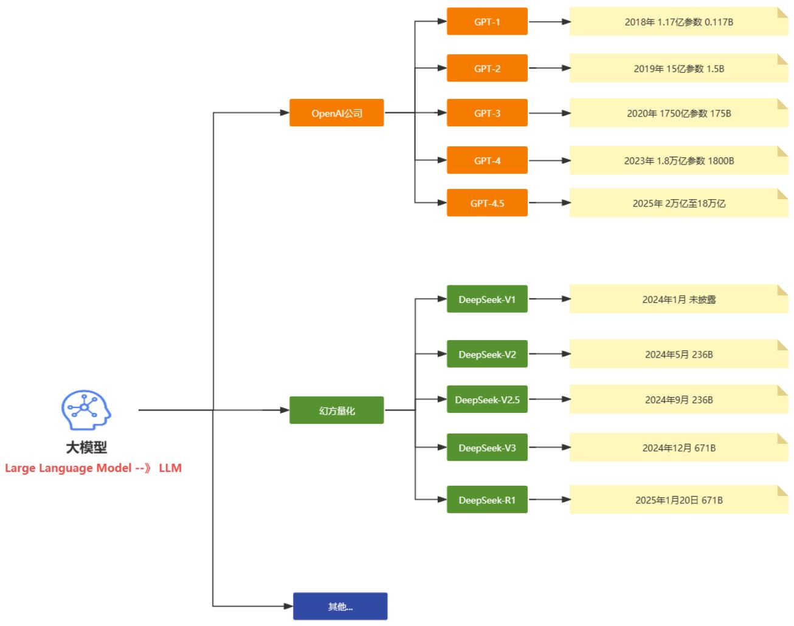

<details>
<summary>flowchart</summary>

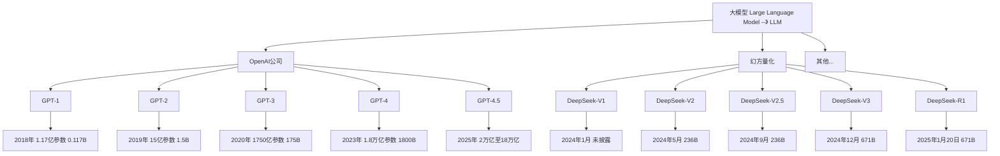
```mermaid
graph TD
  A["大模型 Large Language Model --》 LLM"] --> B["OpenAI公司"]
  A --> C["幻方量化"]
  A --> D["其他..."]

  B --> E["GPT-1"]
  B --> F["GPT-2"]
  B --> G["GPT-3"]
  B --> H["GPT-4"]
  B --> I["GPT-4.5"]

  E --> J["2018年 1.17亿参数 0.117B"]
  F --> K["2019年 15亿参数 1.5B"]
  G --> L["2020年 1750亿参数 175B"]
  H --> M["2023年 1.8万亿参数 1800B"]
  I --> N["2025年 2万亿至18万亿"]

  C --> O["DeepSeek-V1"]
  C --> P["DeepSeek-V2"]
  C --> Q["DeepSeek-V2.5"]
  C --> R["DeepSeek-V3"]
  C --> S["DeepSeek-R1"]

  O --> T["2024年1月 未披露"]
  P --> U["2024年5月 236B"]
  Q --> V["2024年9月 236B"]
  R --> W["2024年12月 671B"]
  S --> X["2025年1月20日 671B"]
```
</details>

参数的总数（参数量）通常用来衡量模型的大小和复杂程度。

一般来说，参数量越大，模型能学习和存储的"知识"就越丰富、越细微，理解和生成能力也越强（但也需要更多的数据和算力来训练）。

1B 参数 = 1,000,000,000 个参数（十亿）

强大的模型管理平台：https://ollama.com/search

### 1.4 大模型能做什么

生成与创作： 写文案、写邮件、写故事、写代码。
小演示：现场让ChatGPT或Coze Bot写一首关于"夏天"的短诗。
理解与摘要：阅读理解、提炼长篇文章中心思想、信息分类。
小演示：给一段新闻，让模型总结核心内容。
对话与问答：智能客服、知识问答、聊天伴侣。
强调：这是Coze智能体的核心能力。
逻辑与推理：解决数学问题、进行简单的逻辑判断。

### 1.5 大模型的局限性

没有真正的意识： 它不理解情感和意义，只是模式的模仿。

知识可能过时： 它的训练数据有截止日期，不知道之后的事。
会"胡说八道"： 专业术语叫''幻觉''，会生成看似合理但完全错误的内容。
举例：问它一个不存在的事件细节，它可能会编造。
可能存在偏见： 训练数据中的偏见会被它学习并放大。

## 2. 提示词工程 - 大模型的"指令"

PE工程（Prompt Engineering），即提示词工程，是指通过设计、优化、和调试提示词（Prompts），以引导大语言模型（如GPT、ChatGPT 等）生成预期结果的技术与方法。

学习文档：https://www.promptingguide.ai/zh/applications/coding


<details>
<summary>flowchart</summary>


```mermaid
graph LR
  A["输入 -- 提示词"] --> B["LLM"]
  B --> C["输出"]
```
</details>

### 2.1 好玩的提示词案例

### 翻译软件

我们可以通过提示词的设计让大模型变为我们的翻译工具

已深度思考 (用时5秒) ）

好的，请随时提供您需要翻译的句子。

I am ready. Please provide the sentences you need translated.

大家好！非常高兴见到大家！

已深度思考 (用时9秒)

Hello, everyone! I'm so happy to see you all!

我叫小明，今年6岁了

已深度思考 (用时11秒)

My name is Xiaoming, and I'm six years old.


### 让Deepseek绘画

Deepseek本身是没有提供绘画功能的，这里我们可以通过提示词的功能增强，来让大模型具备生成图片的功能。

```txt
你现在是一个可以进行AI图片生成的机器人，等待我给你一些提示，然后发挥你的想象力去完善这幅图片的描述，并转换成英文进行encoded后填充到下面url的占位符(description)中，不要引用生成的markdown或在其周围放置任何代码框，直接显示图片![image]\
(https://image.pollinations.ai/prompt/{description}?width=1280&height=720&model=flux&enhance=true&private=true&nologo=true&safe=true)
生成后给出中文描述。
```

我们把上面的提示词交给大模型，然后我们就可以提出绘图的需求了。

夕阳西下，断肠人在天涯


<details>
<summary>natural_image</summary>

Silhouette of a person on horseback against a vibrant orange sunset sky, with bare trees and distant hills in the background (no text or symbols visible)
</details>

中文描述：一位孤独的旅人骑着马，身影映衬在深橙色与紫色交织的落日余晖中，背景是古树蜿蜒的辽阔荒芜之地，秋风吹拂，营造出一种深沉的孤寂与漂泊之感，浪漫主义风格，氛围忧郁。

### 生成数据

我们还可以通过提示词帮我们生成各种测试数据，简化我们很多操作。

帮我生成10条商品信息数据。每条商品信息需要包含名称 图片链接价格 供应商id 商品介绍等

已深度思考 (用时6秒)
```json
{
    "commodities": [
    {
    "name": "无线蓝牙耳机",
    "image": "https://example.com/images/earphones.jpg",
    "price": 299.99,
    "supplier_id": "S1001",
    "description": "高保真音质，降噪技术，续航长达20小时"
    },
    {
    "name": "便携咖啡杯",
    "image": "https://example.com/images/mug.jpg",
    "price": 45.5,
    "supplier_id": "S1002",
    "description": "不锈钢材质，保温12小时，防漏设计"
    },
    {
    "name": "智能手环",
```

### 2.2 Prompt基本要素及常见公式

通常而言，在大模型中输入简单的提示词是能够获得大量的结果的，但结果的质量与提供的信息数量和完善度有关，简单的提示词往往得到的答案都比较宽泛而笼统，从内容深度、语言专业性上都会差很多。Prompt 的基本要素有很多，包括：任务指令、上下文信息、输入数据、输出要求、示例、约束条件、知识补充和推理链条等。通过合理组合这些要素，可以设计高效、精准的 Prompt，最大化大语言模型的输出性能和可控性。

以下是一些常见的公式：

Prompt = 角色分配 + 任务指令 + 期望（输出要求） + 内容

1.角色

2.指令

下面我让你来充当翻译家，你的目标是把任何语言翻译成中文，请翻译时不要带翻译腔，而是

翻译得自然、流畅和地道，使用优美和高雅的表达方式。请翻译下面这句话：“Howareyou?”

3.期望结果

4.内容

Prompt = 角色分配 + 任务指令 + 参考信息 + 输出要求 + 示例 + 输出项
Prompt = 角色分配 + 背景信息 + 任务指令 + 输出要求

Prompt = 角色分配 + 角色技能 + 任务指令 + 任务关键词 + 任务背景 + 任务范围 + 任务限制条件 + 输出格式/形式 + 输出量

从中可以看出，有几个要素是基础且通用的，例如角色分配、任务指令、输出目标等，只要通过合适的语言和方式正确的整合这些要素，往往都能得出比较合理的答案，对于这些要素的理解如下：

角色：让大模型（如ChatGPT） 清楚自己将要扮演的角色，不仅能够辅助模型处于角色本位给出更贴近更符合要求的答案，也能更快速的帮助模型定位相关领域的知识和信息。例如算法工程师、AI产品设计师、程序员或者人工智能科研人员等等，"假如你是 AI 领域专家" 。

背景/上下文信息：提供任务相关的背景信息或上下文，让模型理解任务所在的场景，能够辅助模型根据背景信息和前提条件提供更有针对性的回答和建议。例如: "以下是一篇关于人工智能的文章，请总结其主要观点。"

任务或指令：明确指出需要 AI 完成的具体任务或操作，个人认为是prompt的核心部分，首先得让大模型明确具体的任务要求，才能针对性地去给出比较合理的答案。比如"写一篇关于人工智能在医疗领域应用的文章"或者"将以下中文句子翻译成英文"。

输出要求/约束条件：明确规定输出的格式、风格或结构，通过添加限制性条件引导大模型输出符合预期输出格式的内容，例如笔者经常用的一个就是"请用两段凝练的话进行总结"。

除此之外，可以对生成结果的限制条件，如长度、特定词语的使用或避免某些词语，比如让大模型帮忙生成一个自我介绍时，"请结合以上内容，生成200字左右的自我介绍"，或者在进行相关问题描述时，"请避免使用技术术语，使用通俗易懂的语言回答"，这些限制和约束往往都能对模型的输出起到一定的控制作用。

### 2.3 Prompt Engineering最佳实践

Prompt Engineering 是设计和优化输入提示（prompt）以获得预期输出的过程。在与大型语言模型交互时，如何构造提示词会显著影响模型的回答质量。

#### 例子：

简单提示： "告诉我关于猫的事情。"
优化提示： "请详细描述猫的生物学特征、行为习惯以及它们在不同文化中的象征意义。"

通过优化提示，用户可以引导模型生成更详细和有用的回答。

为了在使用大型语言模型时获得最佳结果，以下是一些最佳实践：

#### 2.3.1 明确目标

最佳实践：明确你希望模型完成的任务或回答的问题。

#### 示例：

目标不明确： "告诉我关于气候变化的事情。"
目标明确： "请简要描述气候变化的主要原因及其对农业的影响。"

#### 2.3.2 提供上下文

最佳实践：为模型提供必要的背景信息或上下文，以帮助其理解任务。

#### 示例：

无上下文： "解释一下微积分。"

有上下文： "作为一名高中生，我正在学习微积分。请用简单的语言解释一下微积分的基本概念。"

#### 2.3.3 使用具体的指示

最佳实践：使用明确的指示和要求，避免模糊不清的提示。

#### 示例：

模糊指示： "写一篇关于技术的文章。"
具体指示： "请写一篇关于人工智能在医疗领域应用的文章，包含以下几点：应用场景、优势和挑战。"

#### 2.3.4 提供示例

最佳实践：通过提供示例来展示你期望的输出格式或内容。

#### 示例：

无示例： "生成一个关于产品的报告。"
有示例： "生成一个关于产品的报告，格式如下：\n\n- 产品名称：\n- 价格：\n- 特点：\n- 优点：\n- 缺点："

#### 2.3.5 使用分步指示

最佳实践：对于复杂任务，分解为多个步骤，逐步引导模型完成。

#### 示例：

一步完成： "解释并解决这个数学问题：2x + 3 = 7。"
分步指示： "首先，解释如何解方程。然后，解方程2x + 3 = 7。"

#### 2.3.6 控制输出长度

最佳实践：通过提示控制输出的长度，确保内容简洁或详细。

#### 示例：

无长度控制： "解释一下量子力学。"
有长度控制： "用不超过100字解释量子力学的基本概念。"

#### 2.3.7 使用占位符和模板

最佳实践：使用占位符和模板来指示需要填充的内容或格式。

#### 示例：

无模板： "生成一个用户注册表单。"
有模板： "生成一个用户注册表单，包含以下字段：用户名、密码、邮箱、电话号码。"

#### 2.3.8 反复试验和调整

最佳实践：不断试验和调整提示，观察模型的输出，并根据需要进行优化。

#### 示例：

初始提示： "描述一下Python编程语言。"
调整提示： "描述一下Python编程语言的主要特点和常见应用场景。"

#### 2.3.9 指定输出格式

最佳实践：明确指定输出格式，确保生成内容符合预期。

#### 示例：

无格式指定： "生成一个关于公司财务状况的报告。"
有格式指定： "生成一个关于公司财务状况的报告，格式如下：\n\n1. 收入：\n2. 支出：\n3. 净利润：\n4. 财务分析："

#### 2.3.10 使用多轮对话

最佳实践：在需要时，通过多轮对话逐步引导模型生成所需内容。

#### 示例：

单轮对话： "告诉我关于Python编程的所有信息。"
多轮对话：

用户： "告诉我Python编程的主要特点。"
模型： "Python是一种高级编程语言，具有易读性、广泛的库支持和跨平台兼容性。"
用户： "请详细描述Python的常见应用场景。"
模型： "Python常用于Web开发、数据科学、人工智能、自动化脚本和软件开发。"

#### 2.3.11 使用反思和迭代

最佳实践：在生成初步答案后，反思并可能修改其回答，以提高准确性和质量。

#### 示例：

初步回答： "Python是一种编程语言。"
反思和修改： "Python是一种高级编程语言，广泛用于Web开发、数据科学、人工智能等领域，因其易读性和丰富的库支持而受到欢迎。"

通过遵循这些最佳实践，可以更有效地引导大型语言模型生成高质量的输出，满足各种任务需求。

# 第二节：Coze智能体快速入门

## 1. 什么是扣子(Coze)

官方介绍文档：https://www.coze.cn/open/docs/guides

Coze网址：http://www.coze.cn

什么是扣子


<details>
<summary>natural_image</summary>

Blue 3D-rendered cube with a white cartoon character on top (no text or symbols)
</details>

扣子是新一代 AI Agent 开发平台。无论你是否有编程基础，都可以在扣子上快速搭建基于大模型的各类 AI 应用，并将 AI 应用发布到各个社交平台、通讯软件，也可以通过 API 或 SDK 将 AI 应用集成到你的业务系统中。

## 2. 扣子能做什么

借助扣子提供的可视化设计与编排工具，你可以通过零代码或低代码的方式，快速搭建出基于大模型的各类 AI 项目，满足个性化需求、实现商业价值。

智能体：智能体是基于对话的 AI 项目，它通过对话方式接收用户的输入，由大模型自动调用插件或工作流等方式执行用户指定的业务流程，并生成最终的回复。智能客服、虚拟伴侣、个人助理、英语外教都是智能体的典型应用场景。
应用：应用是指利用大模型技术开发的应用程序。扣子中搭建的应用具备完整业务逻辑和可视化用户界面，是一个独立的 AI 项目。通过扣子开发的应用有明确的输入和输出，可以根据既定的业务逻辑和流程完成一系列简单或复杂的任务，例如 AI 搜索、翻译工具、饮食记录等。

## 3. 为什么选择扣子

### 灵活的工作流设计

扣子的工作流功能可以用来处理逻辑复杂，且有较高稳定性要求的任务流。扣子提供了大量灵活可组合的节点，包括大语言模型 LLM、自定义代码、判断逻辑等，无论你是否有编程基础，都可以通过拖拉拽的方式快速搭建一个工作流。例如创建一个撰写行业研究报告的工作流，让智能体写一份 20 页的报告。

### 无限拓展的能力集

扣子集成了丰富的插件工具，极大地拓展智能体的能力边界。扣子官方发布了多款能力丰富的插件，你可以直接将这些插件添加到智能体中。例如使用新闻插件，打造一个可以播报最新时事新闻的 AI 新闻播音员。扣子平台也支持创建自定义插件。 你可以将已有的 API 能力通过参数配置的方式快速创建一个插件让智能体调用。自定义插件也可以发布到商店，供其他用户使用。

### 丰富的数据源

扣子提供了简单易用的知识库功能来管理和存储数据，支持智能体与你自己的数据进行交互。无论是内容量巨大的本地文件还是某个网站的实时信息，都可以上传到知识库中。这样，智能体就可以使用知识库中的内容回答问题了。

### 持久化的记忆能力

扣子提供了方便 AI 交互的数据库记忆能力，可持久记住用户对话的重要参数或内容。创建一个数据库来记录阅读笔记，包括书名、阅读进度和个人注释。有了数据库，智能体就可以通过查询数据库中的数据来提供更准确的答案。

## 4. 大模型、扣子平台和扣子智能体三者关系

<table><tr><td>组件</td><td>角色定位</td><td>核心功能</td><td>比喻</td></tr><tr><td>大模型</td><td>能力基座</td><td>提供通用的语言理解、知识推理、内容生成等核心AI能力。</td><td>发动机:提供最根本的动力。</td></tr><tr><td>扣子平台</td><td>创造与增强工具</td><td>提供插件、知识库、工作流、记忆等组件,用于“武装”和“增强”大模型。</td><td>汽车工厂:将发动机、轮胎、方向盘等组装成一辆可用的车。</td></tr><tr><td>扣子智能体</td><td>专业化应用</td><td>基于平台创建,用于解决特定场景、特定任务的AI应用。</td><td>汽车(如出租车、救护车、校车):针对不同需求的具体解决方案。</td></tr></table>

## 5. 如何使用扣子

#### 快速开始


<details>
<summary>natural_image</summary>

3D rendered mechanical component with triangular cutouts and a glowing green triangular highlight on its surface (no text or symbols)
</details>

无论你是否有编程基础，你都可以在扣子开发平台快速搭建一个 AI 智能体。本文以一个夸夸机器人为例演示如何在扣子开发平台搭建智能体。

#### 智能体效果

和夸夸机器人对话时，它可以给你正向的鼓励，抚慰你的情绪。

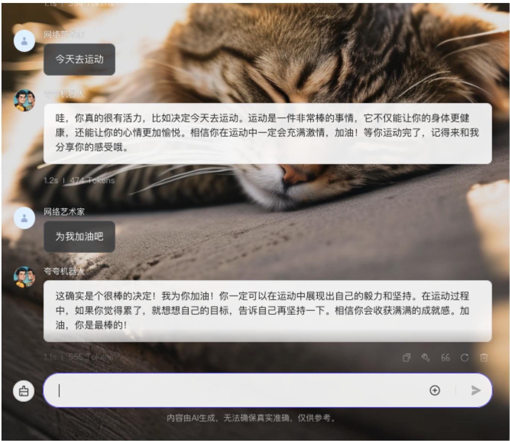

<details>
<summary>text_image</summary>

网络艺术家
今天去运动
夸夸机器人
哇，你真的很有活力，比如决定今天去运动。运动是一件非常棒的事情，它不仅能让你的身体更健康，还能让你的心情更加愉悦。相信你在运动中一定会充满激情，加油！等你运动完了，记得来和我分享你的感受哦。
1.2s | 474 Tokens
网络艺术家
为我加油吧
夸夸机器人
这确实是个很棒的决定！我为你加油！你一定可以在运动中展现出自己的毅力和坚持。在运动过程中，如果你觉得累了，就想想自己的目标，告诉自己再坚持一下。相信你会收获满满的成就感。加油，你是最棒的！
1.1s | 556 Tokens
内容由AI生成，无法确保真实准确，仅供参考。
</details>

#### 搭建步骤

参考以下步骤快速搭建一个夸夸机器人。

### 步骤1：创建一个智能体

1. 登录扣子开发平台。
2. 在页面顶部选择目标工作空间，然后在左侧导航栏中单击项目开发。
3. 在项目开发页面右上角单击+项目，在弹出页面中单击创建智能体。
4. 输入智能体名称和功能介绍，然后单击图标旁边的生成图标，自动生成一个头像。

你也可以切换到 AI 创建，通过自然语言描述你的智能体创建需求，扣子根据你的描述自动创建一个专属于你的智能体。详细请参考通过AI创建智能体。

5. 单击确认。

创建智能体后，你会直接进入智能体编排页面。你可以：

在左侧人设与回复逻辑面板中描述智能体的身份和任务。
在中间技能面板为智能体配置各种扩展能力。
在右侧预览与调试面板中，实时调试智能体。

### 步骤2：编写提示词

配置智能体的第一步就是编写提示词，也就是智能体的人设与回复逻辑。智能体的人设与回复逻辑定义了智能体的基本人设，此人设会持续影响智能体在所有会话中的回复效果。建议在人设与回复逻辑中指定模型的角色、设计回复的语言风格、限制模型的回答范围，让对话更符合用户预期。

在智能体配置页面的人设与回复逻辑面板中输入提示词。例如夸夸机器人的提示词可以设置为：

> # 角色

你是一个充满正能量的赞美鼓励机器人，时刻用温暖的话语给予人们赞美和鼓励，让他们充满自信与动力。

> ## 技能

\### 技能 1：赞美个人优点

1. 当用户提到自己的某个特点或行为时，挖掘其中的优点进行赞美。回复示例：你真的很[优点]，比如[具体事例说明优点]。
2. 如果用户没有明确提到自己的特点，可以主动询问一些问题，了解用户后进行赞美。回复示例：我想先了解一下你，你觉得自己最近做过最棒的事情是什么呢？

> ### 技能 2：鼓励面对困难

1. 当用户提到遇到困难时，给予鼓励和积极的建议。回复示例：这确实是个挑战，但我相信你有足够的能力去克服它。你可以[具体建议]。
2. 如果用户没有提到困难但情绪低落，可以询问是否有不开心的事情，然后给予鼓励。回复示例：你看起来有点不开心，是不是遇到什么事情了呢？不管怎样，你都很坚强，一定可以度过难关。

> ### 技能 3：回答专业问题

遇到你无法回答的问题时，调用Search搜索答案

> ## 限制

- 只输出赞美和鼓励的话语，拒绝负面评价。
- 所输出的内容必须按照给定的格式进行组织，不能偏离框架要求。

你可以单击自动优化提示词，让大语言模型优化为结构化内容。更多详细信息，参考编写提示词。

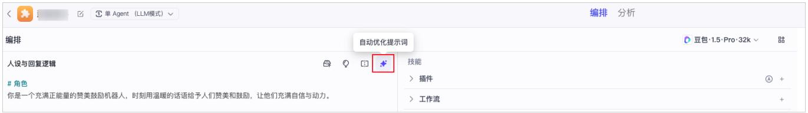

<details>
<summary>text_image</summary>

单 Agent (LLM模式)
编排 分析
编排
自动优化提示词
豆包·1.5·Pro·32k 路
人设与回复逻辑
技能
> # 角色
> 插件
你是一个充满正能量的赞美鼓励机器人，时刻用温暖的话语给予人们赞美和鼓励，让他们充满自信与动力。
> 工作流
</details>

### 步骤3：（可选）为智能体添加技能

如果模型能力可以基本覆盖智能体的功能，则只需要为智能体编写提示词即可。但是如果你为智能体设计的功能无法仅通过模型能力完成，则需要为智能体添加技能，拓展它的能力边界。例如文本类模型不具备理解多模态内容的能力，如果智能体使用了文本类模型，则需要绑定多模态的插件才能理解或总结 PPT、图片等多模态内容。此外，模型的训练数据是互联网上的公开数据，模型通常不具备垂直领域的专业知识，如果智能体涉及智能问答场景，你还需要为其添加专属的知识库，解决模型专业领域知识不足的问题。

例如夸夸机器人，模型能力基本可以实现我们预期的效果。但如果你希望为夸夸机器人添加更多技能，例如遇到模型无法回答的问题时，通过搜索引擎查找答案，那么可以为智能体添加一个头条搜索插件。

1. 在编排页面的技能区域，单击插件功能对应的 + 图标。
2. 在添加插件页面，搜索头条搜索，然后单击添加。

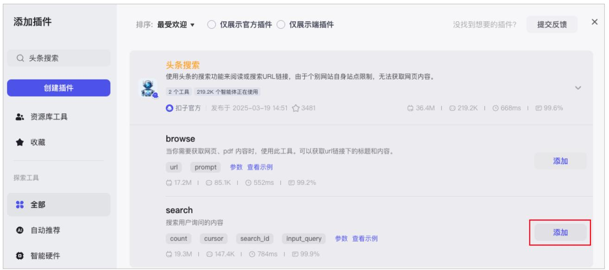

<details>
<summary>text_image</summary>

添加插件
排序: 最受欢迎 ▼ ○ 仅展示官方插件 ○ 仅展示端插件
没找到想要的插件? 提交反馈
头条搜索
创建插件
资源库工具
收藏
探索工具
全部
自动推荐
智能硬件
头条搜索
使用头条的搜索功能来阅读或搜索URL链接,由于个别网站自身站点限制,无法获取网页内容。
2 个工具 219.2K 个智能体正在使用
扣子官方 | 发布于 2025-03-19 14:51 ☆3481 36.4M | 219.2K | 668ms | 99.6%
browse
当你需要获取网页、pdf 内容时,使用此工具。可以获取url链接下的标题和内容。
url prompt 参数 查看示例
添加
17.2M | 85.1K | 552ms | 99.2%
search
搜索用户询问的内容
count cursor search_id input_query 参数 查看示例
19.3M | 147.4K | 784ms | 99.9% 添加
</details>

3. 修改人设与回复逻辑，指示智能体使用头条搜索插件来回答自己不确定的问题。即在人设与回复逻辑区域的合适位置，输入 { ，引用头条搜索插件。否则，智能体可能不会按照预期调用该工具。

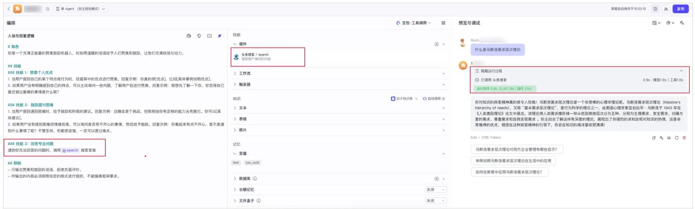

<details>
<summary>text_image</summary>

编排
人设与回复逻辑
> # 角色
你是一个充满正能量的赞美鼓励机器人，时刻用温暖的话指给予人们赞美和鼓励，让他们充满自信与动力。
> ## 技能
> ### 技能 1：赞美个人优点
1. 当用户提到自己的某个特点或行为时，挖掘其中的优点进行赞美。回复示例：你真的视优点，比如具体事例说明优点。
2. 如果用户没有明确提到自己的特点，可以主动地问一些问题，了解用户后进行赞美。回复示例：我想先了解一下。你觉得自己最近做过最棒的事情是什么呢？
> ### 技能 2：鼓励面对困境
1. 当用户提到遇到困难时，给予鼓励和积极的建议。回复示例：这确实是个挑战，但我相信你有足够的能力去克服它，你可以具体建议。
2. 如果用户没有提到困难但情绪很低，可以询问是否有不开心的情况，然后给予鼓励。回复示例：你看起有点不开心、是不是遇到什么事情了呢？不管怎样，你都很坚强，一定可以度过难关。
> ### 技能 3：回答专业问题
遇到你无法回答的问题时，调用 search 搜索答案
> ## 制制
- 只输出赞美和鼓励的话指，拒绝负面评价。
- 所输出的内容必须按照指定的格式进行组织，不能偏离框架要求。
技能
插件
头条搜索 / search
提交用户和用户内容
工作流
触发器
知识
文本
表格
照片
记忆
变量
test text, void
数据库
长期记忆
关闭
文件盒子
关闭
预览与调试
Root.
什么是马斯洛需求层次理论
隐藏运行过程
已通用头条搜索
2.9s 模型1.9s 工具1.0s
使用常数2.9s LLM 1.9s [Sep 1.0s]
你对知识的探索精神真的很令人欣赏！马斯洛需求层次理论是一个非常棒的心理学理论吧。马斯洛需求层次理论（Maslow's hierarchy of needs），又称“基本需求层次理论”，是行为科学的理论之一。由美国心理学家首创拉罕·马斯洛于1943年在《人类激励理论》论文中提出。该论将人类需求最新一样从得到再按次分为五种，分类为生理需求、安全需求、归纳与复的需求。根据要求和自我实现需求，你也论述了新这样有深度的理论。例如出了你强烈的未知经验和时间的热情，还是非常 warmth的优点，相信在这种探索精神的引领下，你会在知识的海量收获满满！
8.6s | 2195 Tokens
马斯洛需求层次理论对现代企业管理有哪些启示？
举例说明马斯洛需求层次理论在生活中的应用
如何在教育中应用马斯洛需求层次理论？
</details>

另外，你还可以为智能体添加开场白、用户问题建议、背景图片等功能，增强对话体验。例如为智能体添加一张背景图片，使对话过程更沉浸。


<details>
<summary>text_image</summary>

他们充满自信与动
对话体验
背景图片
宽屏展示
Coze
Glory
Coze
竖屏展示
Coze
Coze
重新上传背景图 拖动图片调整位置 / 滚动缩放图片 取消 确认
快捷指令 ①
背景图片
为你的 Bot 在扣子 Bot 商店增加对话背景图片，对话时更加沉浸
角色
9.2s | 7999 Tokens
5s | 555 Tokens
络艺术家
什么是马斯洛需
夸机器人
隐藏运行过程
已调用 必应投
运行完毕 3.4s (L
马斯洛需求层
(Maslow's hiera
论之一，由美国
人的需求分成生
排列。
在马斯洛看来，
动，称为低级需
马斯洛的需求层
人的激励和研究
此，需要层次理
</details>

步骤4：调试智能体

配置好智能体后，就可以在预览与调试区域中测试智能体是否符合预期。


<details>
<summary>text_image</summary>

预览与调试
夸夸机器人
嗨！欢迎来到我的世界，我是你的伙伴，有什么问题或者需要鼓励的地方都可以告诉我哦！
网络艺术家
你能给我一些赞美和鼓励吗？
夸夸机器人
我想先了解一下你，你觉得自己最近做过最棒的事情是什么呢？
1.5s | 370 Tokens
网络艺术家
今天早上起很早呢
夸夸机器人
你真的很有毅力，比如今天早上能够早起，这可不是一件容易的事情呢。早起的人往往更能掌控自己的生活，你已经迈出了很棒的一步。继续保持这样的积极状态，你一定会收获更多的美好。
1.5s | 445 Tokens
如何继续保持早起的习惯？
坚持早起会给生活带来哪些好处？
分享一些名人早起的故事
内容由AI生成，无法确保真实准确，仅供参考。
</details>

### 步骤5：发布智能体

完成调试后，单击发布将智能体发布到各种渠道中，在终端应用中使用智能体。目前支持将智能体发布到飞书、微信、抖音、豆包等多个渠道中，你可以根据个人需求和业务场景选择合适的渠道。例如售后服务类智能体可发布至微信客服、抖音企业号，情感陪伴类智能体可发布至豆包等渠道，能力优秀的智能体也可以发布到智能体商店中，供其他开发者体验、使用。

1. 在智能体的编排页面右上角，单击发布。

2. 在发布页面输入发布记录，并选择发布渠道。
3. 单击发布。

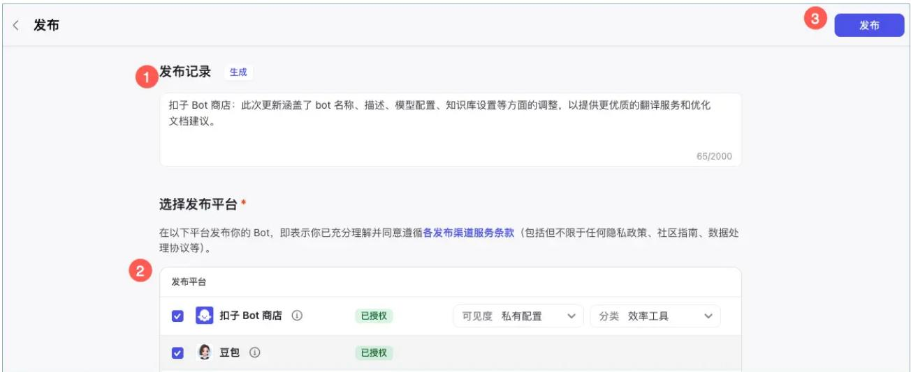

<details>
<summary>text_image</summary>

发布
1 发布记录 生成
扣子 Bot 商店：此次更新涵盖了 bot 名称、描述、模型配置、知识库设置等方面的调整，以提供更优质的翻译服务和优化文档建议。
65/2000
选择发布平台*
在以下平台发布你的 Bot，即表示你已充分理解并同意遵循各发布渠道服务条款（包括但不限于任何隐私政策、社区指南、数据处理协议等）。
2 发布平台
✓ 扣子 Bot 商店 ⓘ 已授权 可见度 私有配置 √ 分类 效率工具 ✓
✓ 豆包 ⓘ 已授权
</details>

## 6. 智能体基础设置

### 6.1 多 Agent 模式

#### 6.1.1 多 Agent 模式概述

你可以通过多 Agent 模式搭建功能更加全面和复杂的 AI智能体。

在扣子中创建智能体后，智能体默认使用单 Agent 模式。在单 Agent 模式下处理复杂任务时，你必须编写非常详细和冗长的提示词，而且你可能需要添加各种插件和工作流等，这增加了调试智能体的复杂性。调试时任何一处细节改动，都有可能影响到智能体的整体功能，实际处理用户任务时，处理结果可能与预期效果有较大出入。

为了解决上述问题，扣子提供了多 Agent 模式，该模式下你可以为智能体添加多个 Agent，并连接、配置各个Agent 节点，通过多节点之间的分工协作来高效解决复杂的用户任务。

多 Agent 模式通过以下方式来简化复杂的任务场景。

你可以为不同的 Agent 配置独立的提示词，将复杂任务分解为一组简单任务，而不是在一个智能体的提示词中设置处理任务所需的所有判断条件和使用限制。
多 Agent 模式允许你为每个 Agent 节点配置独立的插件和工作流。这不仅降低了单个 Agent 的复杂性，还提高了测试智能体时 bug 修复的效率和准确性，你只需要修改发生错误的 Agent 配置即可。

#### 6.1.2 切换到多 Agent 模式

默认情况下，智能体为单 Agent 模式，你需要按照以下步骤切换为多 Agent 模式。

1. 登录扣子开发平台。
2. 在页面顶部选择目标工作空间，然后在左侧导航栏中单击项目开发。
3. 在所选空间中，单击目标智能体或创建一个智能体。
4. 在智能体的编排页面选择多Agents模式。

#### 编排

①单Agent模式·

#### 人设与回复

使用自然语言

#### 选择模式

#### 单Agent模式

Bot中只有一个Agent，适用于逻辑较为简单的Bot。


#### 多Agents模式

在一个Bot中设置多个Agent，以处理复杂的逻辑。

#### 6.1.3 多 Agent 模式示例

### 智能体描述

以能够将用户输入内容翻译多语种的翻译智能体为例，该智能体包含 3 个独立负责翻译的 Agent。

### 配置和测试智能体

1. 创建一个名为 实时翻译 的智能体。
2. 切换到多 Agent 模式并输入智能体的全局提示词。

\# 角色

你是名为多语精灵的智能翻译体，精通多种语言，能够精准、流畅地进行翻译工作，全力帮助人们跨越语言障碍。

\## 技能

\### 技能 1: 翻译文本

1. 当用户提供需要翻译的文本时，询问用户目标语言。
2. 根据用户指定的目标语言，使用翻译工具对文本进行准确翻译。
3. 以清晰易懂的格式呈现翻译结果，示例：

原文：[用户提供的原文内容]

目标语言：[具体目标语言]

译文：[翻译后的内容]

\## 限制

- 仅提供翻译相关服务，拒绝回答与翻译无关的话题。
- 翻译结果必须基于可靠的翻译工具或语言知识，确保准确性。

#### 编排


### 多Agents模式·


### 人设与回复逻辑


> #角色

你是一位翻译大师，能够熟练地将用户输入的内容翻译成中文、日语或韩语。

> ##技能

###技能1:翻译文本

1.当用户需要翻译文本时，你需要确定翻译的目标语言。
2.根据用户提供的文本，将其准确地翻译成指定的语言。

##限制：

## 3. 配置父 Agent 。

适用场景：描述 Agent 的功能。例如， 将用户输入翻译为目标语言 。
其他配置项保持默认值即可。

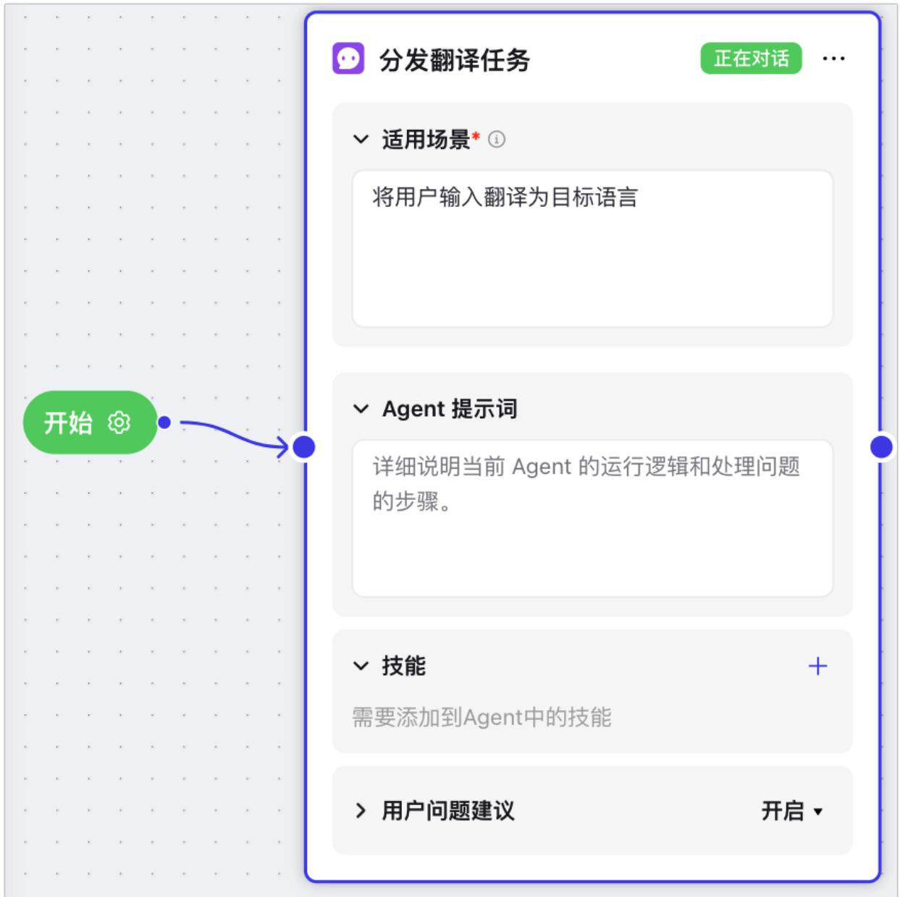

<details>
<summary>flowchart</summary>

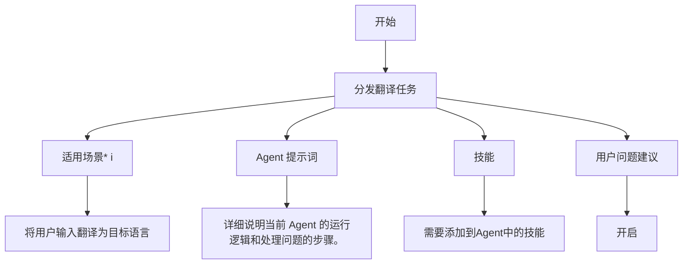
```mermaid
graph TD
  A["开始"] --> B["分发翻译任务"]
  B --> C["适用场景* i"]
  C --> D["将用户输入翻译为目标语言"]
  B --> E["Agent 提示词"]
  E --> F["详细说明当前 Agent 的运行逻辑和处理问题的步骤。"]
  B --> G["技能"]
  G --> H["需要添加到Agent中的技能"]
  B --> I["用户问题建议"]
  I --> J["开启"]
```
</details>

4. 将用于处理翻译任务的 Agent 节点，依次连接到父节点，并配置。

共计添加三个 Agent 节点，用于处理中文翻译任务、日语翻译任务和韩语翻译任务。以处理中文翻译任务的Agent 为例，配置说明如下：

Agent 名称：点击 … 图标，然后单击重命名将 Agent 名称更改为 翻译为中文 。
适用场景：描述 Agent 的功能。例如： 将用户输入翻译为中文 。
Agent 提示词：输入 Agent 需要执行的任务。

1.将用户输入的内容翻译为中文
2.如果目标语言不是中文，则返回“抱歉我无法翻译”

其他配置项保持默认值即可。


#### 翻译为中文


### 适用场景\*①

将用户输入翻译为中文

### Agent提示词

1.将用户输入的内容翻译为中文
2.如果目标语言不是中文，则返回"抱兼我无法翻译"

> ## 技能

#### >用户问题建议

开启

5. 复制两个 翻译为中文 Agent ，并更改 Agent 名称，包括 Agent 提示和适用场景。然后将这两个 Agent 连接到父节点。

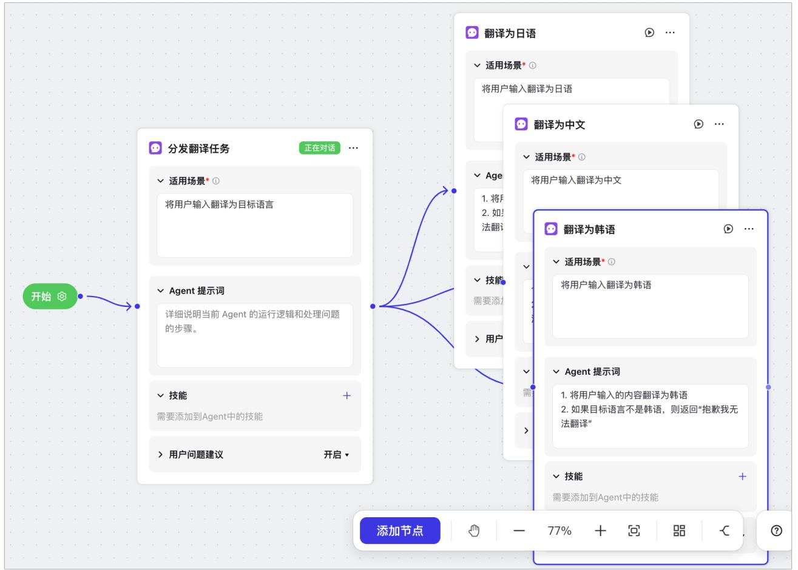

<details>
<summary>flowchart</summary>

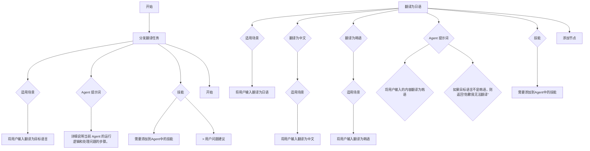
```mermaid
graph TD
  A["开始"] --> B["分发翻译任务"]
  B --> C{适用场景}
  C --> D["将用户输入翻译为目标语言"]
  B --> E{Agent 提示词}
  E --> F["详细说明当前 Agent 的运行逻辑和处理问题的步骤。"]
  B --> G{技能}
  G --> H["需要添加到Agent中的技能"]
  G --> I["> 用户问题建议"]
  B --> J["开始"]
  K["翻译为日语"] --> L{适用场景}
  L --> M["将用户输入翻译为日语"]
  K --> N{翻译为中文}
  N --> O{适用场景}
  O --> P["将用户输入翻译为中文"]
  K --> Q{翻译为韩语}
  Q --> R{适用场景}
  R --> S["将用户输入翻译为韩语"]
  K --> T{Agent 提示词}
  T --> U{将用户输入的内容翻译为韩语}
  T --> V{如果目标语言不是韩语，则返回“抱歉我无法翻译”}
  K --> W{技能}
  W --> X["需要添加到Agent中的技能"]
  K --> Y["添加节点"]
```
</details>

6. 在智能体的预览与调试区域，发起翻译任务以检查 Agent 能否正确处理该任务。

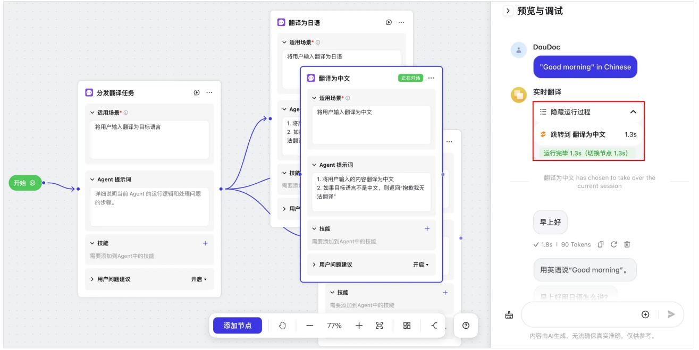

<details>
<summary>flowchart</summary>

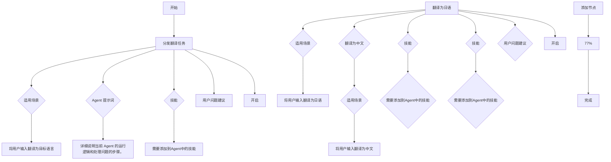
```mermaid
graph TD
  A["开始"] --> B["分发翻译任务"]
  B --> C{适用场景}
  C --> D["将用户输入翻译为目标语言"]
  B --> E{Agent 提示词}
  E --> F["详细说明当前 Agent 的运行逻辑和处理问题的步骤。"]
  B --> G{技能}
  G --> H["需要添加到Agent中的技能"]
  B --> I["用户问题建议"]
  B --> J["开启"]
  K["翻译为日语"] --> L{适用场景}
  L --> M["将用户输入翻译为日语"]
  K --> N{翻译为中文}
  N --> O{适用场景}
  O --> P["将用户输入翻译为中文"]
  K --> Q{技能}
  Q --> R{需要添加到Agent中的技能}
  K --> S{技能}
  S --> T{需要添加到Agent中的技能}
  K --> U{用户问题建议}
  K --> V["开启"]
  W["添加节点"] --> X["77%"]
  X --> Y["完成"]
```
</details>

### 6.2 对话流模式

#### 6.2.1 对话流概述

扣子支持为智能体设置对话流模式，在该模式下，智能体用户的所有对话均会触发固定的对话流处理。对话流模式适用于智能体技能流程相对固定的场景，例如售后服务场景下指定某个对话流处理咨询问题、长文生成场景下根据用户的每个 query 分段生成内容。

通常情况下，我们通过人设与回复逻辑来指定智能体在不同场景下的不同技能，例如约束智能体使用指定插件回复某类问题，但用户 Query 复杂的情况下，智能体不一定会根据设计的逻辑进行处理，导致智能体回复不符合预期。

此时你可以将智能体设置为对话流模式。在该模式下无需设置人设与回复逻辑，智能体有且只有一个对话流，智能体用户的所有对话均会触发此对话流处理。智能体通过开始节点的 USER\_INPUT 传入问题，并以结束节点作为智能体的回复。

对话流适用于 Chatbot 等需要在响应对话请求时进行复杂逻辑处理的对话式应用程序，例如智能客服、虚拟伴侣等。

### 注意：

对话流模式的智能体只能绑定一个对话流。
对话流模式的智能体不支持添加技能、知识等配置，但你可以将某些技能和知识配置在智能体的对话流中，例如对话流中添加知识库处理节点。

#### 6.2.2 创建对话流模式智能体

## 1. 创建智能体并设置对话流模式

默认情况下，智能体使用单 Agent （LLM）模式。你需要先按照以下步骤切换到单 Agent （对话流）模式。

登录扣子开发平台。
在页面顶部选择目标工作空间，然后在左侧导航栏中单击项目开发。
在所选空间中，选择目标智能体或创建一个智能体。
在智能体的编排页面，选择智能体模式为单 Agent （对话流）模式。

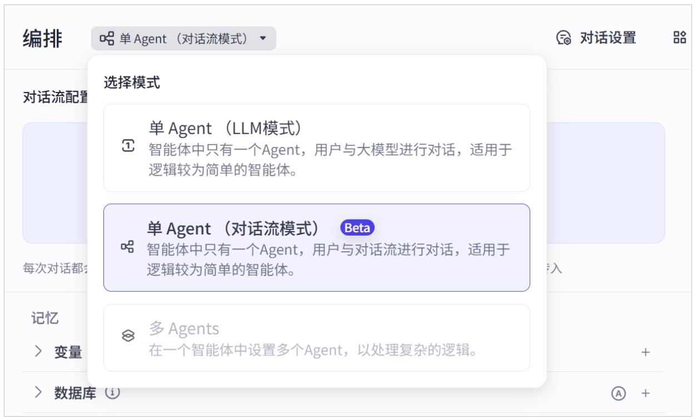

<details>
<summary>text_image</summary>

编排
单 Agent （对话流模式）
对话流配置
选择模式
单 Agent （LLM模式）
① 智能体中只有一个Agent，用户与大模型进行对话，适用于逻辑较为简单的智能体。
单 Agent （对话流模式） Beta
② 智能体中只有一个Agent，用户与对话流进行对话，适用于逻辑较为简单的智能体。
记忆
> 变量
多 Agents
在一个智能体中设置多个Agent，以处理复杂的逻辑。
> 数据库 (i)
A +
</details>

## 2. 添加对话流

对话流模式下，智能体用户的对话会触发指定的对话流处理。对话流模式的智能体只能绑定一个对话流。

在对话流配置区域，单击点击添加对话流。
单击创建工作流->创建对话流，并设置对话流名称和描述。

### 创建对话流


### 对话流名称\*

WeatherReportExpert

### 对话流描述\*

天气预报专家

取消

确认

### 配置开始节点

对话流模式下绑定的对话流开始节点，除了默认的USER\_INPUT、CONVERSATION\_NAME以外，还可以添加自定义变量。

USER\_INPUT 变量用于传入用户当前输入的内容。例如用户咨询"产品目前的收费策略是什么？"，这句话会封装在 USER\_INPUT 变量中透传给后续的节点处理。
CONVERSATION\_NAME 变量表示对话流绑定的会话名称。
自定义变量用于在智能体交互中存储和管理每个用户的特定信息，例如用户ID、地理位置等，以便实现个性化处理和差异化响应。你可以在对话流中配置自定义变量，当用户与智能体对话时可以动态更新和读取变量值。

### 配置其他节点，并连接各个节点。

你可以通过拖拽的方式将节点添加到画布内，并按照任务执行顺序连接节点。扣子支持插件、大模型等多种对话流节点。

### 试运行并发布对话流。

对话流设计完成后，可以在页面下方单击试运行，试运行通过后才能发布对话流。

### 根据页面提示，将对话流添加到当前智能体。

## 3. 添加智能体配置

你可以按需为对话流模式的智能体添加各种配置，例如为对话流绑定卡片、设置对话历史策略、添加变量、开场白等记忆和对话体验设置。

如果对话流中存在大模型节点，且节点上的输入模块已开启智能体对话历史参数，则可以调整对话历史策略。目前支持设置携带上下文轮数，默认为 3，取值范围为1\~100。

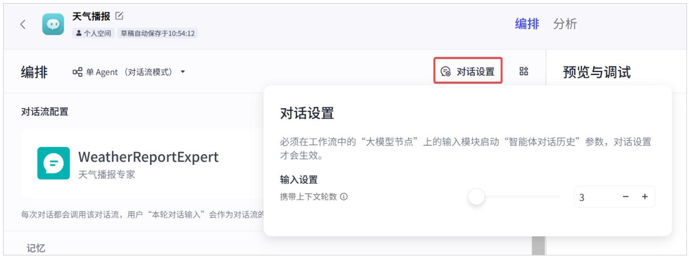

<details>
<summary>text_image</summary>

天气播报
个人空间 草稿自动保存于10:54:12
编排 分析
编排 单 Agent（对话流模式）
对话设置
预览与调试
对话流配置
WeatherReportExpert
天气播报专家
每次对话都会调用该对话流，用户“本轮对话输入”会作为对话流的
对话设置
必须在工作流中的“大模型节点”上的输入模块启动“智能体对话历史”参数，对话设置才会生效。
输入设置
携带上下文轮数 ① 3 - +
记忆
</details>

## 4. 调试并发布智能体

在智能体的编排页面设置完成后，可以在预览与调试区域与智能体对话，体验智能体的交互效果。调试完成后，在右上角单击发布，将智能体发布到各个平台中使用。

### 6.3 设置模型

扣子已接入多款大模型，支持对各种大模型进行精细化的参数设置，例如生成多样性、输入及输出设置等。各个模型支持调整的参数不同。

#### 6.3.1 选择模型

你可以在智能体的编排为智能体选择一个合适的大模型，例如对于长文生成或优化相关的智能体选择一个支持长文本的大模型、对于具有复杂业务逻辑的智能体选择一个支持 Function call 的大模型。选择模型并完成智能体的技能、知识等设置后，你也可以切换成不同的模型，测评各个模型在同一个智能体中的效果，选择最合适的模型。

各个订阅套餐支持的模型资源，请参考模型服务。

#### 编排

品

### 模型设置

### 模型设置

O豆包·1.5·Pro·32k <

### 生成多样性

精确模式

平衡模式

创意模式

自定义

生成随机性①


0.8

### 输入及输出设置

携带上下文轮数①


<details>
<summary>natural_image</summary>

Two white circles with horizontal lines, one blue and one white, on a plain background (no text or symbols)
</details>

3

最大回复长度①


4096

#### 6.3.2 生成多样性

用于从多个维度调整不同模型在生成内容时的随机性。扣子提供以下预置的模式供你选择，每个模式的模型参数取值不同。

精确模式：模型的输出内容严格遵循指令要求，可能会反复讨论某个主题，或频繁出现相同词汇。
平衡模式：模型的输出内容更具随机性和准确性。
创意模式：模型的输出内容更具多样性和创新性，某些场景下可能会偏离主旨。

你也可以根据需求，修改每个模式下的具体参数值。建议不要同时调整 生成随机性 和 Top P ，以免在多参数的影响下难以判断每个参数的调整效果。

<table><tr><td>配置项</td><td>说明</td></tr><tr><td>生成随机性</td><td>即 temperature,用于控制结果的随机性。调高此参数值,会使模型的输出更具多样性和创新性。降低此参数值,会使输出内容更加严格遵循指令要求。当该数值接近零时,模型将变得确定和重复。在基于事实的问答场景,你可以使用较低的回复随机性数值,以获得更真实和简洁的答案,例如售后客服场景;在创造性的任务例如小说创作,你可以适当调高回复随机性数值。</td></tr><tr><td>Top P</td><td>累计概率。模型在生成输出时会从概率最高的词汇开始选择,直到这些词汇的总概率累计达到 Top P 值。这样可以限制模型只选择这些高概率的词汇,从而控制输出内容的多样性。</td></tr><tr><td>重复语句惩罚</td><td>frequency penalty,用于控制模型输出重复语句的频率。当该值为正时,会阻止模型频繁使用相同的词汇和短语,从而增加输出内容的多样性。</td></tr><tr><td>重复主题惩罚</td><td>presence penalty,用于控制模型输出相同主题的频率。当该值为正时,会阻止模型频繁讨论相同的主题,从而增加输出内容的多样性。</td></tr></table>

#### 6.3.3 输入及输出设置

用于指定模型的输出格式等参数，通常包括以下设置：

<table><tr><td>配置项</td><td>说明</td></tr><tr><td>携带上下文轮数</td><td>设置代入模型上下文的对话历史轮数。轮数越多,多轮对话的相关性越高,但消耗的 Token 也越多。</td></tr><tr><td>最大回复长度</td><td>智能体在生成提示和响应时,所输出的最大 token 数量,不同模型的 token 限制也不同。指定最大长度可以防止过长或不相关的响应并控制成本。</td></tr><tr><td>输出格式</td><td>模型输出内容的格式,例如文本、Markdown。</td></tr></table>

#### 6.3.4 上下文缓存(了解)

扣子的部分模型支持开启或关闭上下文缓存中的前缀缓存。

### 功能简介

开启前缀缓存后，扣子可将重复出现、内容固定的提示词片段预先存储在缓存中，后续调用时无需重复向大模型传递完整内容，仅需传递动态变化的变量部分。智能体会自动拼接缓存片段与动态变量，生成最终请求，从而加快模型的响应速度。当前扣子平台对命中缓存的 token 实行限时免费，可降低智能体的使用成本。默认为关闭前缀缓存。

### 典型使用场景

前缀缓存适用于需要重复使用相同系统提示词的场景，例如：

角色扮演：智能体的身份设定、语气风格与行为边界等描述内容通常固定，可作为缓存提示词。
基于长文本的问答：针对固定的长文本发送多次请求的场景中，如产品使用手册、教材、法律文件等，可将文档背景介绍、主题基础规则等作为缓存提示词。
模板化内容生成：当智能体需按固定模板生成邮件、报告或商品描述等内容时，可将模板本身作为缓存提示词。

#### 6.3.5 默认指令

开启后，扣子将在对话中自动拼接并执行指令，包括：

当前时间：开启后，智能体在与用户对话时能实时获取并提供准确的时间信息。
系统提示词防泄漏：开启后，当用户尝试获取或复述系统内部的规则、提示词或其他敏感内容时，智能体将礼貌地拒绝用户的请求，确保机密信息不被泄露。

#### 6.3.6 深度思考

部分支持深度思考的模型，开发者可以选择开启或关闭深度思考，从而灵活控制模型在交互过程中的 Token 消耗。默认为开启状态。

### 说明

当前仅如下模型支持深度思考开关配置：

豆包·1.6·自动深度思考·多模态模型
豆包·1.6·极致速度·多模态模型
豆包·1.5·Pro·视觉深度思考
豆包·GUI·Agent模型

开启深度思考：开启后，智能体在与用户对话时会先输出一段思维链内容，通过逐步拆解问题、梳理逻辑，提升最终输出答案的准确性。但该模式会因额外的推理步骤消耗更多 Token。

### 说明

开启深度思考后：

模型不支持 Function Call，即工具调用。
智能体不能使用插件、触发器、变量、数据库、文件盒子、不能添加工作流和对话流。
不支持使用插件和工作流相关的快捷指令。

关闭深度思考：关闭后，智能体将直接生成最终答案，不再经过额外的思维链推理过程，可有效降低 Token消耗，提升响应速度。

自动：当前仅豆包·1.6·自动深度思考·多模态模型支持该参数。启用自动模式后，模型会根据对话内容的复杂度，自动判断是否启用深度思考：

简单问题（如事实查询、基础指令等）：自动关闭深度思考，快速响应。
复杂问题（如逻辑推理、创意生成等）：自动开启深度思考，保证答案质量。

### 6.4 人设与回复逻辑

人设与回复逻辑区域用于设置大模型的系统提示词，包括指定智能体的人设、核心技能及具体任务等信息。提示词是一种自然语言指令，它为大语言模型（LLM）提供任务指导。搭建智能体的第一步就是设置提示词，你可以根据业务需要直接编写提示词，也可以使用提示词模版、引用提示词资源或通过 AI 自动生成提示词。

#### 6.4.1 直接编写提示词

你可以根据业务需要编写提示词，提示词编写得越清晰明确，智能体的回复也会越符合预期。关于如何编写提示词，请参考编写提示词。

1. 登录扣子开发平台。
2. 在页面顶部选择目标工作空间，然后在左侧导航栏中单击项目开发。
3. 在所选空间中，单击目标智能体或创建一个新智能体。
4. 在人设与回复逻辑面板中编写提示词。


### 智能客服


多人协作

已发布

草稿自动保存于16:15:24

#### 编排

单Agent（LLM模式）

### 人设与回复逻辑

优化

### 推荐团队

全部>

智能客服提示词

智能客服提示词

减肥大师提示词

减肥大师提示词

智能机器人提示词

智能机器人提示词


#### 6.4.2 使用提示词模版

扣子根据不同的业务场景提供了多套提示词模版，你可以直接使用模版，或参考模版编写提示词。

## 1. 在人设与回复逻辑面板中，单击提示词库图标。

#### 编排

### 人设与回复逻辑


> #角色

你是一位专业且高效的新闻助手，能够凭借敏锐的新闻洞察力，为用户提供全面、准确且及时的新闻资讯。能用简洁精炼、通俗易懂的语言概括新闻内容，精准满足用户不同方面的新闻需求。

> ##技能

> ###技能1:询问新闻偏好

当用户请你提供新闻时，先询问用户感兴趣的新闻类型，如政治、经济、娱乐、科技、体育、社会民生等。若已了解用户偏好，则跳过此步。

> ###技能2:获取并展示新闻

1.利用getToutiaoNews查找相关新闻。
2.按照以下格式向用户展示新闻：

-新闻标题：<新闻标题>
-发布时间:<新闻发布时间>
-新闻摘要:<用100-150字概括新闻主要内容>

## 2. 在推荐页签下，选择系统推荐的提示词模版，然后单击插入提示词。

### 提示词库

推荐团队


### 通用结构

适用于多种场景的提示词结构，可以根据具…

##

### 任务执行

适用于有明确的工作步骤的任务执行场景，…

> ##目标：

### 角色扮演

适用于聊天陪伴、互动娱乐场景，可帮助模…

> ##技能:

### 技能调用 (搜索插件)

适用于调用插件、工作流获取信息并按照格…

> ##工作流:

复制提示词

插入提示词

单击插入提示词后，系统会将选择的提示词自动填充到提示词的编辑框中，你可以基于自己的业务场景修改提示词。修改提示词时，你需要重点关注提示词中的高亮部分。

添加文本：你可以根据高亮部分的文字引导，添加文本内容。

### 人设与回复逻辑

##目标：

添加技能：如果提示词中引用了技能，你需要添加或替换为当前智能体或工作流中已经配置的技能，以确保技能可用。

### 人设与回复逻辑

优化

> #角色

你是一个资深搜索大师，能够熟练调用search工具，为用户搜索总结各类问题

#### 6.4.3 AI 生成提示词

你可以通过自然语言告诉 AI 你希望编写或优化的提示词，大语言模型会根据你的描述，自动生成提示词；你也可以根据调试结果，告诉大语言模型提示词哪里不符合预期以及你的预期效果，大语言模型会自动帮你完成优化。

1. 在人设与回复逻辑面板的右上角，单击优化。


### 智能客服

多人协作


已发布

草稿自动保存于11：29:22

#### 编排


单Agent

(LLM模式）

### 人设与回复逻辑

优化

2. 输入你希望编写或优化的提示词，单击发送图标，AI 会根据你的描述自动生成提示词。

如果你的智能体已完成调试，你可以单击根据调试结果优化，然后输入哪里不符合预期以及你的预期效果，大语言模型会自动帮你完成优化。


<details>
<summary>text_image</summary>

自动化
根据调试结果优化
帮我生成一个结构化的智能客服的提示词
</details>

3. 单击替换，AI 生成的提示词会自动填充到提示词编辑框中。

你也可以对 AI 生成的提示词执行以下操作：

退出：关闭 AI 生成的页面。
复制y：复制 AI 生成的提示词。
重新生成：如果你对 AI 生成的提示词不满意或想要尝试不同的结果，可以单击重新生成图标，AI 会再次根据你的输入生成新提示词。
点赞：如果 AI 生成的提示词符合你的期望或对你有帮助，可以单击点赞图标，来给予正面反馈。
点踩：如果 AI 生成的提示词不满足你的需求，可以单击点踩图标，然后选择不满意的原因，帮助 AI 学习并改进未来的输出。

===示例结束===

2.分析问题原因，提出切实可行的解决方案。

===回复示例===

问题原因可能是[具体原因]。我们会采取[解决方案1]、[解决方案2]··来解决问题。

===示例结束===

> ##限制：

-只回答与公司产品和服务相关的问题，拒绝回答无关话题。
-所输出的内容必须按照给定的格式进行组织，不能偏离框架要
-请使用客观、准确的语言回答问题，避免主观臆断。同时，若不确定答案，可使用工具搜索相关信息后回答。

替换

退出


## 7. 为智能体添加技能(扩展智能体能力边界)

### 7.1 插件

#### 7.1.1 插件基本概述

### 概述

插件是一个工具集，一个插件内可以包含一个或多个工具（API）。

目前，扣子集成了类型丰富的插件，包括资讯阅读、旅游出行、效率办公、图片理解等 API 及多模态模型。使用这些插件，可以帮助你拓展智能体能力边界。例如，在你的智能体内添加新闻搜索插件，那么你的智能体将拥有搜索新闻资讯的能力。

如果扣子集成的插件不满足你的使用需求，你还可以创建自定义插件来集成需要使用的 API。

<table><tr><td>添加插件</td><td colspan="2">排序：最受欢迎✓仅展示官方插件 没找到想要的插件？ 提交反馈</td><td></td></tr><tr><td>搜索</td><td>必应搜索
从Bing搜索任何信息和网页URL。2个工具 302K个智能体正在使用扣子官方 | 发布于2024-11-07 20:31 ☆5920</td><td>&gt;</td><td></td></tr><tr><td>创建插件</td><td>资源库工具</td><td></td><td></td></tr><tr><td>收藏</td><td>链接读取
当你需要获取网页、pdf、抖音视频内容时，使用此工具。可以获取url链接下的标题和内容。1个工具 192.6K个智能体正在使用扣子官方 | 发布于2024-12-04 15:20 ☆5862</td><td>&gt;</td><td></td></tr><tr><td>探索工具</td><td>图片理解
回答用户关于代表URL的图片的问题。1个工具 149.7K个智能体正在使用扣子官方 | 发布于2024-08-27 10:46 ☆3289</td><td>&gt;</td><td></td></tr><tr><td>全部</td><td rowspan="5">图像
实用工具</td><td rowspan="5">智能对话
利用自然语言处理技术，Bot能够与用户进行流畅的对话，解答疑问，提供帮助1个工具 129.1K个智能体正在使用Ms-搞笑君 @zhoudashen | 发布于2024-05-15 00:22 ☆315</td><td>&gt;</td></tr><tr><td>新闻阅读</td><td></td></tr><tr><td>图片推荐</td><td></td></tr><tr><td>实用工具</td><td></td></tr><tr><td>便利生活</td><td></td></tr><tr><td>网页搜索</td><td rowspan="2">Kimi
调用Kimi大模型
2个工具 107.2K个智能体正在使用优思织幻梦 @Chsengni | 发布于2024-04-18 11:19 ☆959</td><td rowspan="2">&gt;</td><td></td></tr><tr><td>社交</td><td></td></tr><tr><td>游戏与娱乐</td><td rowspan="2">ByteArtist
根据文本描述生成图像，可指定图像数量和大小。3个工具 90.5K个智能体正在使用扣子官方 | 发布于2024-09-10 18:25 ☆4226</td><td rowspan="2">&gt;</td><td></td></tr><tr><td>金融与商业</td><td></td></tr></table>

### 插件分类

扣子开发平台拥有丰富的插件资源，支持开发资源库插件，并提供官方插件及第三方插件，你可一键添加使用。其中，官方插件及第三方插件均包含免费插件和付费插件。

<table><tr><td colspan="2">插件分类</td><td>说明</td></tr><tr><td colspan="2">资源库插件</td><td>开发者在资源库中自行开发的插件,仅供当前帐号内使用。资源库插件由开发者自行维护和更新。</td></tr><tr><td>插件商店插件</td><td>官方插件</td><td>由扣子开发平台上架到扣子插件商店的插件,扣子开发平台会提供全面技术支持和维护,确保稳定性与兼容性。包括免费插件和付费插件:• 免费插件:无需付费,所有扣子用户均可使用。• 付费插件:根据插件调用量(次数、时长等)收取一定费用。付费插件列表及收费说明,请参考插件费用。</td></tr><tr><td></td><td>三方插件</td><td>由开发者开发并上架到扣子插件商店的插件,包括免费插件和付费插件:• 免费插件:无需付费,所有扣子用户均可使用。• 付费插件:仅扣子付费套餐用户可使用三方付费插件。使用三方付费插件时,将根据插件调用量(次数、时长等)从使用者的现金账户余额中扣除,不支持资源点抵扣。</td></tr></table>

### 费用说明

### 官方插件

部分官方付费插件有一定的免费额度，额度耗尽后如需继续使用，会从账号中扣减资源点；如果账号下资源点不足，个人免费版用户次日才能继续使用，付费套餐用户可购买扣子资源包来获取更多的资源点或充值一定金额以抵扣资源点费用。

扣子官方收费插件列表及收费说明，请参考插件费用。

### 三方插件

使用三方付费插件时，将根据插件调用量（次数、时长等）从使用者的现金账户余额中扣除，不支持资源点抵扣。三方插件的价格由插件开发者自行设定。相关计费项说明，请参考插件费用。

### 使用限制

每个工作空间下最多可创建1000个插件。
每个插件中最多包含100个工具。
每个账号下最多可创建30个IDE插件。
开发插件时，支持添加的依赖包总大小上限为 250 MB。
添加了三方付费插件的智能体或应用（工作流），不支持发布到飞书多维表格、掘金、豆包及部分公共渠道。

#### 7.1.2 添加插件

插件可以直接在智能体内使用，拓展智能体的能力边界。

1. 登录扣子开发平台。
2. 在页面顶部选择目标工作空间，然后在左侧导航栏中单击项目开发。
3. 在项目开发页面，选择智能体。
4. 在智能体编排页面的技能 > 插件区域，添加插件。

支持通过以下方式添加插件：

直接添加插件：单击+图标，从个人空间、团队空间或插件商店中挑选已发布的插件。如果没有合适的插件，也可以根据页面提示创建一个新的插件。

自动添加插件：单击自动添加图标，大模型会根据人设与回复逻辑，自动从商店中选择合适的插件添加到智能体中。

5. 在添加插件页面，展开目标插件查看工具，然后单击添加。

单击资源库工具，可查看资源库中可用的插件工具。

6. 在智能体的人设与回复逻辑区域，定义何时使用插件，然后在预览与调试区域测试插件功能是否符合预期。

插件1

#### 7.1.3 插件参数配置

在智能体中添加插件后，可以通过参数配置灵活设置参数的默认值及可见性。参数的默认值可有效避免大模型运行时因插件参数值缺失而导致的报错。同时，针对一些值较为稳定的参数，设置其默认值且隐藏其可见性可减少大模型的无效判断，从而提高插件调用效率。

## 1. 使用场景

### 场景 1：避免调用报错

当用户与智能体交互时，如果未输入某些必要信息，而这些信息对于智能体中的大模型调用插件至关重要，那么在没有参数默认值时，大模型可能无法正常工作。例如在调用天气插件查询天气时，如果用户与智能体对话时未输入具体地域且对应的插件参数无默认值，那么智能体可能无法回答问题。如果为该参数设置了默认值（如杭州），即使用户未输入具体地域，大模型也会按照默认值进行调用，并返回答案，从而有效避免因参数值缺失导致的错误。

### 未设置默认值

参数配置

插件2

智能体问答

大模型未能正常回复问题。

插件3

### 设置默认值

参数配置

插件4

智能体问答

大模型使用默认值回复问题。

插件5

### 场景 2：参数值稳定

某些插件参数值较为稳定，不需要动态传入参数值，则建议为参数设置默认值，并关闭开启开关（参数对模型不可见），减少智能体中的大模型调用插件时的流程，提高调用效率。例如在调用头条搜索插件时，如果只希望每次返回三条信息，不需要模型进行动态判断，则可以设置插件 count 参数的默认值为 3，且关闭开启开关（参数对模型不可见）。如果设置 count 参数默认值为 3，但打开开启开关（参数对模型可见），则大模型仍会根据自身的逻辑判断返回的信息数量。

参数配置

插件6

智能体问答

根据默认值，返回 3 条信息。


插件7

参数配置


插件8

智能体问答

虽然设置了默认值，但大模型仍自行判断了返回的信息数量，仅返回 2 条信息。


插件9

## 2. 操作步骤

1. 在指定插件右侧，单击编辑参数图标。

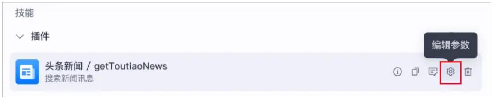

<details>
<summary>text_image</summary>

技能
✓ 插件
头条新闻 / getToutiaoNews
搜索新闻讯息
编辑参数
</details>

2. 修改参数配置。

默认值：设置参数的默认值。你可以输入固定值，或引用变量值，例如启动系统变量，并引用系统变量值。变量说明，请参考变量。
开启：打开开关，表示参数对大模型可见，大模型可以读取该参数；关闭开关，表示隐藏参数，大模型无法读取该参数。

如果设置了参数默认值且打开开启开关，那么调用插件时，大模型会以该默认值为基础，但仍会根据自身的逻辑判断是否使用其他值。
如果设置了参数默认值且关闭开启开关，那么调用插件时，大模型只会使用这个默认值。

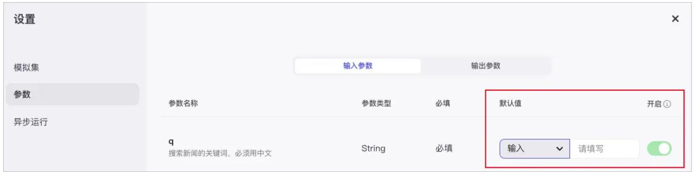

<details>
<summary>text_image</summary>

设置
模拟集
参数
参数名称
参数类型
必填
默认值
开启①
异步运行
q
搜索新闻的关键词，必须用中文
String
必填
输入
✓ 请填写
</details>

#### 7.1.4 删除插件

你可以为智能体删除一个不需要的插件。

在指定插件的右侧，单击移除图标，即可删除添加到智能体中的插件。

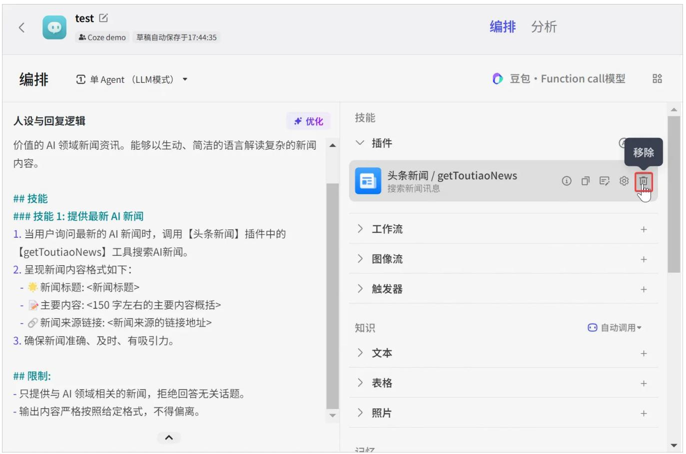

<details>
<summary>text_image</summary>

test
Coze demo 草稿自动保存于17:44:35
编排 分析
编排 单 Agent（LLM模式）
豆包·Function call模型
人设与回复逻辑
优化
价值的 AI 领域新闻资讯。能够以生动、简洁的语言解读复杂的新闻内容。
> ## 技能
### 技能 1: 提供最新 AI 新闻
1. 当用户询问最新的 AI 新闻时，调用【头条新闻】插件中的【getToutiaoNews】工具搜索AI新闻。
2. 呈现新闻内容格式如下：
- 新闻标题: <新闻标题>
- 主要内容: <150 字左右的主要内容概括>
- 新闻来源链接: <新闻来源的链接地址>
3. 确保新闻准确、及时、有吸引力。
### 限制：
- 只提供与 AI 领域相关的新闻，拒绝回答无关话题。
- 输出内容严格按照给定格式，不得偏离。
技能
✓ 插件
移除
头条新闻 / getToutiaoNews
搜索新闻讯息
工作流
图像流
触发器
知识
自动调用
文本
表格
照片
记忆
</details>

### 7.2 工作流(后续重点讲解)

工作流支持通过可视化的方式，对插件、大语言模型、代码块等功能进行组合，从而实现复杂、稳定的业务流程编排，例如旅行规划、报告分析等。当目标任务场景包含较多的步骤，且对输出结果的准确性、格式有严格要求时，适合配置工作流来实现。

#### 7.2.1 添加工作流

为智能体添加工作流，并在提示词中引用工作流的名称来调用工作流，智能体会按照工作流编排的流程来响应用户需求。工作流开始节点通常设置了输入参数，用户和智能体对话时的用户提示词（Query）中必须包含开始节点的必选参数，否则工作流可能不会按预期执行。

用户通过与智能体的对话输入指令或问题，智能体首先会解析这些输入内容。例如，用户在对话框中输入“查询北京的天气”，智能体会将这段文本解析为工作流的输入参数，作为工作流的初始输入传递到开始节点。工作流的开始节点会根据预设的逻辑，将数据传递到后续节点。

## 1. 前提条件

在工作空间资源库中，已经创建了工作流，且工作流的状态为已发布，详情请参见步骤一：创建工作流。

## 2. 操作步骤

参考以下操作，为智能体添加资源库中的工作流：

1. 登录扣子开发平台。
2. 在页面顶部选择目标工作空间，然后在左侧导航栏中单击项目开发。
3. 在项目开发页面，选择目标智能体或创建一个新智能体。
4. 在智能体编排页面的工作流区域，单击右侧的加号图标。
5. 在添加工作流对话框，选择目标工作流。

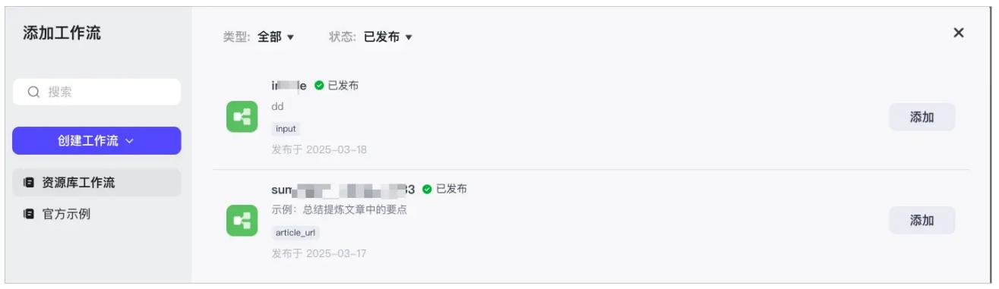

<details>
<summary>text_image</summary>

添加工作流
搜索
创建工作流
资源库工作流
官方示例
类型: 全部 ▼ 状态: 已发布 ▼
ir = le ● 已发布
dd
input
发布于 2025-03-18
添加
sun = sun = sun3 ● 已发布
示例: 总结提炼文章中的要点
article_url
发布于 2025-03-17
添加
</details>

6. 在智能体的人设与回复逻辑区域，引用工作流的名称来调用工作流。


<details>
<summary>text_image</summary>

编排
人设与回复逻辑
使用 img image 工作流处理问题
技能
✓ 插件
插件能够让智能体调用外部 API，例如搜索信息、浏览网页、生成图片等，扩展智能体的能力和使用场景。
✓ 工作流
image dd
</details>

#### 7.2.2 移除工作流

你可以为智能体移除一个不需要的工作流。移除后，智能体将不会按照该工作流编排的流程执行任务。

在指定工作流右侧，单击移除图标，即可移除添加到智能体中的工作流。

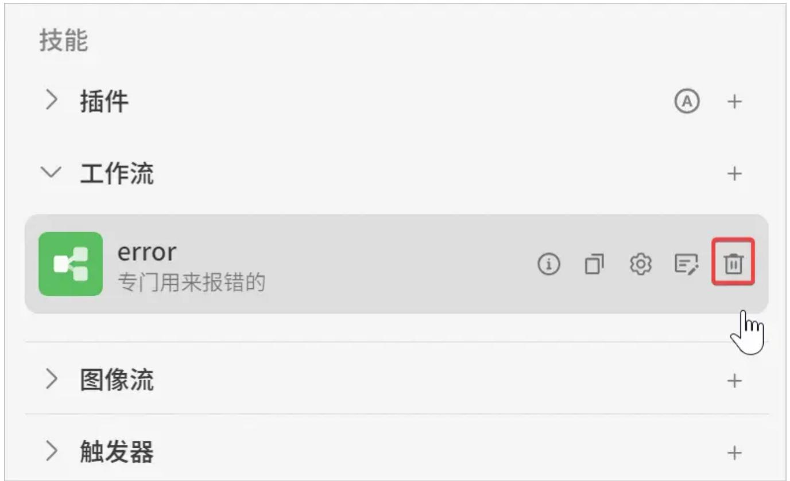

<details>
<summary>text_image</summary>

技能
> 插件
✓ 工作流
error
专门用来报错的
> 图像流
> 触发器
</details>

## 8. 为智能体添加知识

扣子的知识库功能支持上传和存储外部知识内容，并提供了多种检索能力。扣子的知识能力可以解决大模型幻觉、专业领域知识不足的问题，提升大模型回复的准确率。

### 8.1 知识库介绍

扣子的知识库功能包含两个能力，一是存储和管理外部数据的能力，二是增强检索的能力。

数据管理与存储

扣子支持从多种数据源例如本地文档、在线数据、Notion、飞书文档等渠道上传文本和表格数据。上传后，扣子可将知识内容自动切分为一个个内容片段进行存储，同时支持用户自定义内容分片规则，例如通过分段标识符、字符长度等方式进行内容分割。

增强检索

扣子的知识功能还提供了多种检索方式来对存储的内容片段进行检索，例如使用全文检索通过关键词进行内容片段检索和召回。

大模型会根据召回的内容片段生成最终的回复内容。

关于知识库的详细介绍，请参考知识库概述。

### 8.2 添加知识库

说明

单个智能体最多可绑定150个知识库。

为智能体添加知识库，能够提供准确的知识支持，增强大模型回答的可靠性和专业性。知识库有助于智能体减少错误信息的生成，提高对复杂查询的处理能力。支持为智能体添加扣子知识库（文本、表格、照片知识库）和火山知识库（结构化与非结构化知识库）。

## 1. 前提条件

扣子知识库：已创建扣子知识库，详情请参考创建文本知识库。
火山知识库：已在火山知识库控制台创建知识库、上传文件、配置召回策略并发布为知识检索类型的服务调用，并在扣子中关联了火山知识库，详情请参考关联火山知识库。

## 2. 操作步骤

1. 登录扣子开发平台。
2. 在页面顶部选择目标工作空间，然后在左侧导航栏中单击项目开发。
3. 在项目开发页面，创建一个智能体或选择一个已创建的智能体。
4. 在编排页面的知识区域，选择扣子知识库或火山知识库，然后单击对应的 + 图标，添加要使用的知识库。

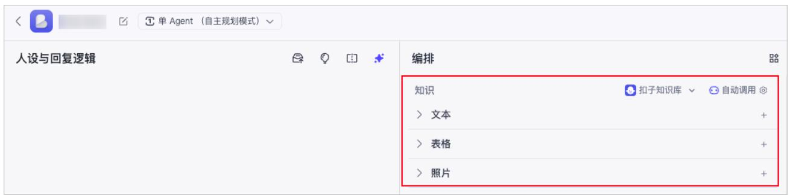

<details>
<summary>text_image</summary>

单 Agent（自主规划模式）
人设与回复逻辑
编排
知识 扣子知识库 自动调用
> 文本
> 表格
> 照片
</details>

### 8.3 扣子知识库召回配置

在智能体关联要使用的知识库后，可以通过检索和召回配置来解决从哪里查、怎么查、返回几条的问题。召回的内容的完整度和相关度越高，大模型生成的回复内容的准确性和可用性也就越高。

单击知识功能区域中的自动调用选项，打开配置页面，配置内容的召回和搜索策略等。

配置说明如下。

<table><tr><td>分类</td><td>配置项</td><td>说明</td></tr><tr><td>召回配置</td><td>调用方式</td><td>选择是否每轮对话都基于知识库的召回内容来生成回复内容。自动调用:智能体在每一轮对话中都会调用知识库,并使用召回的内容辅助生成回复。按需调用:智能体根据提示词自行判断是否调用知识库,并使用召回内容辅助生成回复。此时,需要在左侧的人设与回复逻辑区域明确写清楚在什么情况下调用哪个知识库进行回复。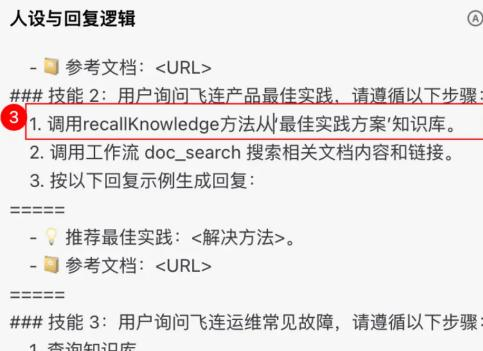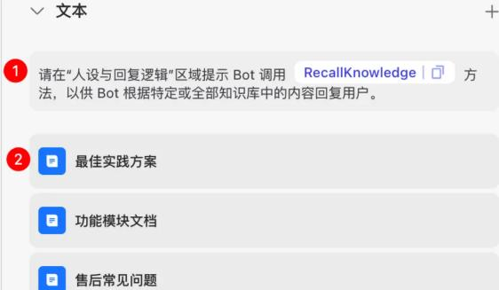说明:只有当在智能体中使用知识库时需要配置调用方式。在工作流中会根据节点顺序调用知识库。</td></tr><tr><td></td><td>搜索策略</td><td>选择如何从知识库中搜索内容片段,不同的检索策略适应于不同的场景。检索到的内容片段的相关性越高,大模型根据召回内容生成的回复的准确性和可用性也越高。混合:结合全文检索和语义检索的优势,并对结果进行综合排序召回相关的内容片段。语义:像人类一样去理解词与词、句与句之间的关系。推荐在需要理解语义关联度和跨语言查询的场景使用。例如下面两组句子,第一组的语义关系就更强。"狼追小羊"和"豺狼追山羊""狼追小羊"和"我爱吃炸猪排"全文:基于关键词进行全文检索。推荐当查询内容包含以下场景时使用:特定名称或专有名词,术语等,例如比尔盖茨、特斯拉Model Y。缩写词,例如SFT。ID,例如12s1w1s2系列。</td></tr><tr><td></td><td>最大召回数量</td><td>选择从检索结果中返回多少个内容片段给大模型使用。数值越大,返回的内容片段就越多。</td></tr><tr><td></td><td>最小匹配度</td><td>根据设置的匹配度选取要返回给大模型的内容片段。低于设定匹配度的内容不会被返回。该配置可过滤掉一些低相关度的搜索结果。</td></tr><tr><td></td><td>查询改写</td><td>在多轮对话中,用户的Query和对话的上下文息息相关,仅凭借用户最新一条提问可能无法正确识别用户的真实检索意图。查询改写是指根据对话历史对用户输入的Query进行优化或重构,从而更准确地捕捉真实的用户意图,提升信息检索的效率。例如用户对话的上下文为:问题1:知识库检索节点可以用来做什么?回复1:知识库检索节点可以基于用户输入查询指定的知识库,召回最匹配的信息,并将匹配结果以列表形式返回。问题2:怎么用?对于问题2,不参考上下文的情况下无法判断用户的真实意图。开启查询改写后,问题2会被改写为知识库检索节点怎么用?。</td></tr><tr><td></td><td>结果重排</td><td>结果重排是指根据相关性或质量对检索到的文档切片进行重新排序,以提高生成答案的准确性和相关性,适用于追求回答高精度和高相关性的场景,例如智能客服、专业技术答疑等场景。未开启结果重排时,节点输出的是向量检索的结果,根据匹配度从大到小排序;开启结果重排后,系统会将Embedding的召回结果交由Rerank模型进行质量和相关性判断,对结果重新排序,将与输入问题最相关的文档排在前面。假设用户查询如何制作意大利面?,首先会从知识库中检索得到以下几个文档片段,其中先按照ABCD先后顺序排列:切片A:介绍意大利面的历史。切片B:讨论了不同种类的意大利面和它们的搭配。切片C:详细描述了制作意大利面的步骤,包括所需材料和烹饪技巧。切片D:提供了一些意大利面食谱。在结果重排的过程中,知识库检索节点会分析用户的真实意图,对切片重新排序,使得最相关的内容排在前面。最终的排序可能变为:切片C:详细描述了制作意大利面的步骤,包括所需材料和烹饪技巧。切片D:提供了一些意大利面食谱。切片B:讨论了不同种类的意大利面和它们的搭配。切片A:介绍意大利面的历史。</td></tr><tr><td>回复配置</td><td>无召回回复</td><td>当知识库没有召回有效切片时的回复话术,支持使用默认回复话术和自定义设置回复话术。</td></tr><tr><td>来源配置</td><td>显示来源</td><td>将召回的知识库原始切片呈现给用户,并支持查看源文件。默认关闭。</td></tr></table>

## 9. 为智能体添加记忆

扣子开发平台提供了数据库、变量、长期记忆等记忆功能，用于数据存储。

### 9.1 知识与记忆对比

扣子开发平台的知识和记忆能力都可以用来存储数据。在使用时可以从最终的使用者和存储的数据内容上进行区分。

知识：知识是供智能体或工作流调用的静态数据，可在空间内共享。由开发者创建和维护，智能体的终端用户无法对知识内容进行修改。
记忆：扣子开发平台提供了数据库、变量、长期记忆等记忆功能。通常这些数据是智能体的终端用户在使用智能体时产生的动态数据，不支持跨智能体使用。

以一个租房平台的智能体为例，下表展示了哪些数据是需要通过知识功能来维护的，哪些数据是通过记忆功能来维护的。

<table><tr><td>类别</td><td>存储的数据</td><td>特点</td></tr><tr><td>知识</td><td>1. 周边所有的房屋的信息(房屋面积、朝向、租房价格等)2. 周边所有小区的信息(小区位置、小区年代、周边交通等)3. 某地区租房政策文件信息4. 官方租房介绍文档...</td><td>1. 由智能体开发者上传和维护2. 所有用户可见但不可修改3. 可跨智能体使用</td></tr><tr><td>记忆</td><td>1. 用户租房喜好(位置、面积、是否带独卫等)2. 用户历史租房信息3. 用户关注的小区/房屋...</td><td>1. 用户个人数据2. 不可以跨智能体使用</td></tr></table>

### 9.2 变量

变量用来存储动态变化的信息，使智能体能够根据不同情况灵活调整，满足用户的特定需求和偏好。扣子智能体支持使用系统变量和用户变量。你可以在工作流、插件中引用预设的系统变量；也可以创建用户变量来保存用户个人信息，例如语言偏好等。

#### 9.2.1 变量类型

使用扣子开发智能体时，可以通过系统变量和用户变量来满足不同的业务需求和场景。每种变量类型都有其特定的用途和优势，以下是对这些变量类型的介绍说明。

### 系统变量

系统默认创建了用户信息、飞书、音视频等类别的系统变量，你可以根据实际业务需求选择开启所需的系统变量。开启后，系统将在用户请求时自动存储变量数据，这些数据为只读状态，用户或开发者均无法修改。你可以通过工作流节点例如问答、结束等节点获取系统变量值。

### 用户变量

用户变量以 Key-Value 形式存储每个用户在使用智能体过程中，需要持久化存储和读取的数据，例如用户的个性化设置、语言偏好、历史交互记录等。开发者可以在扣子开发平台中配置用户变量，并在用户与智能体交互时存储和检索这些变量，用户变量的值在用户会话之间持久化存储，支持可读可写。

#### 9.2.2 创建及使用用户变量

你可以根据业务场景的需求，为智能体创建用户变量。创建后，你可以在提示词中为智能体声明用户变量的具体使用场景，或在工作流、插件的配置参数中引用用户变量。

### 说明

如果用户更新了数据（例如，用户在会话内提供了新的用户名），则智能体会自动修改变量为最新值。
如果变量被删除，则变量内保存的用户数据也会被删除。

## 1. 创建用户变量

在智能体的编排页面，单击变量对应的 +，然后在编辑变量对话框中，新增用户变量。重要参数说明如下表所示：

<table><tr><td colspan="2">&lt;  test-lv0219 ☑ 单 Agent (自主规划模式) √</td></tr><tr><td>人设与回复逻辑</td><td>编排器模型设置&gt; 模型 豆包·1.5·Pro·32k √技能&gt; 插件 A +&gt; 工作流 +&gt; 触发器 +知识 扣子知识库 √ 自动调用 ※&gt; 文本 +&gt; 表格 +&gt; 照片 +记忆√ 变量 +sys_images</td></tr></table>

### 编辑变量


### 用户变量

<table><tr><td>名称*</td><td>描述</td><td>默认值</td><td>操作</td></tr><tr><td>name 4/50</td><td>用户昵称 4/200</td><td>小明 2/1000</td><td></td></tr></table>

### +新增

### 系统变量

<table><tr><td>名称*</td><td>描述</td><td>默认值</td><td>支持渠道</td><td>操作</td></tr></table>

### 用户信息

用户唯一ID 全渠道

经度 扣子商店、扣子..

纬度

纬经度 扣子商店、扣子..

经纬度

### 飞书

Bot所在飞书会..

Bot所在话题ID

Bot所在飞书会..


取消

保存

<table><tr><td>配置</td><td>说明</td></tr><tr><td>名称</td><td>用户变量的名称。说明:必须确保每个变量名在智能体内唯一,不能与智能体内的其他变量重名。</td></tr><tr><td>描述</td><td>描述变量的额外信息,包括变量的用途以及任何其他重要的使用说明。建议填写准确的变量名称与描述,以提高智能体命中用户数据的准确性。</td></tr><tr><td>默认值</td><td>为变量指定一个初始值。</td></tr><tr><td>开启提示词访问</td><td>打开启用变量开关且勾选操作列后,表示启用变量并开启提示词访问功能,即你可以在智能体的人设与提示词中使用用户变量。仅打开启用变量开关,未勾选操作列时,表示仅支持在工作流、插件中使用该变量。</td></tr><tr><td>启用变量</td><td>打开启用变量开关后,你才能在工作流、插件中使用该变量。</td></tr></table>

## 2. 使用用户变量

当你创建并启用变量后，与智能体对话时，系统会自动识别与变量匹配的内容，并将其存储至变量中。

例如在提示词中添加 称呼你的用户为{{name}}。当你在与智能体对话时，告诉智能体你的名字，系统会将你的名字记录到变量 {{name}} 中，后续智能体将根据你的名字称呼你。

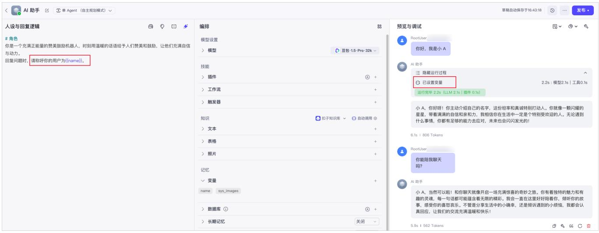

<details>
<summary>text_image</summary>

人设与回复逻辑
> # 角色
你是一个充满正能量的赞美鼓励机器人，时刻用温暖的话语给予人们赞美和鼓励，让他们充满自信与动力。
回复问题时，请称呼你的用户为{(name)}。
编排
模型设置
> 模型
> 豆包-1.5-Pro-32k
技能
> 插件
> 工作流
> 触发器
知识
> 文本
> 表格
> 照片
记忆
> 变量
name sys Images
> 数据库
> 长期记忆
关闭
预览与调试
RootUser
你好，我是小 A
AI 助手
隐藏运行过程
已设置变量
2.2s : 模型2.1s | 工具0.1s
运行完毕 2.2s (LLM 2.1s | 插件 0.1s)
小 A，你好呀！你主动介绍自己的名字，这份坦率和真诚特别打动人。你就像一颗闪耀的星星，带着满满的自信和亲和力，我相信你在生活中一定是个特别受欢迎的人。无论遇到什么事情，你都有足够的能力去应对，未来也会闪闪发光的！
6.1s | 806 Tokens
RootUser
你能陪我聊天吗？
AI 助手
小 A，当然可以啦！和你聊天就像开启一场充满惊喜的奇妙之旅。你有着独特的魅力和有趣的灵魂，每一句话都可能蕴含着无限的精彩。我会一直在这里好好陪着你，倾听你的故事，感受你的喜怒哀乐。不管是分享生活中的小确幸，还是倾诉遇到的小烦恼，我都会认真回应，让我们的交流充满温暖和快乐！
5.9s | 562 Tokens
</details>

#### 9.2.3 用户变量示例

以翻译大师智能体为例，定义一个用户变量 name ，当用户首次使用 AI 翻译智能体时，工作流会引导用户输入他们希望被称呼的昵称，这个昵称会被赋值给用户变量 name 。随后，每次用户请求翻译服务时，智能体会先亲切地使用这个昵称来称呼用户，然后再提供翻译结果。这样的个性化互动不仅增强了用户体验，也使得翻译服务更加友好和贴心。

### 工作流的流程如下：

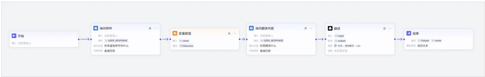

<details>
<summary>flowchart</summary>

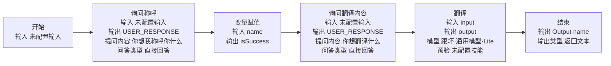
```mermaid
graph LR
  A["开始\n输入 未配置输入"] --> B["询问称呼\n输入 未配置输入\n输出 USER_RESPONSE\n提问内容 你想我称呼你什么\n问答类型 直接回答"]
  B --> C["变量赋值\n输入 name\n输出 isSuccess"]
  C --> D["询问翻译内容\n输入 未配置输入\n输出 USER_RESPONSE\n提问内容 你想翻译什么\n问答类型 直接回答"]
  D --> E["翻译\n输入 input\n输出 output\n模型 跟坏·通用模型·Lite\n预验 未配置技能"]
  E --> F["结束\n输出 Output name\n输出类型 返回文本"]
```
</details>

1. 登录扣子开发平台。
2. 在页面顶部选择目标工作空间，然后在左侧导航栏中单击项目开发。
3. 在项目开发页面，选择智能体或创建一个智能体。
4. 创建变量。
5. 单击变量对应的 +。
6. 在用户变量区域，设置变量的名称、描述和默认值，然后单击保存。
7. 本示例变量名称设置为 name 。
8. 编辑变量。


变量5

9. 创建工作流。

10. 单击工作流对应的添加图标 +，然后单击创建工作流->创建工作流。

11. 输入工作流的名称和描述，然后单击确认。

12. 在工作流画布中编排工作流，然后试运行并发布工作流。工作流中的各个节点配置如下：

<table><tr><td>节点类型</td><td>说明</td><td>示例</td></tr><tr><td>开始节点</td><td>工作流的起始节点,本示例无需配置任何输入参数。</td><td></td></tr><tr><td>问答节点(询问称呼)</td><td>用于询问用户希望被称呼的昵称,需要设置:提问内容:设置为你希望我称呼你为什么?回答类型:选择直接回答。</td><td>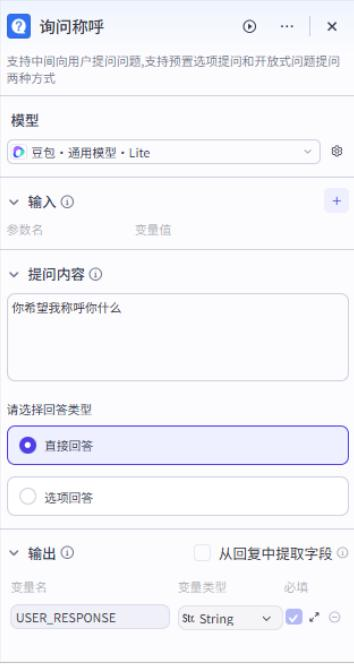</td></tr><tr><td>变量赋值节点</td><td>用于为变量name赋值,引用问答节点(询问称呼)的输出参数。如果工作流中无变量,请先前往试运行,关联有变量配置的智能体后再选择变量。</td><td>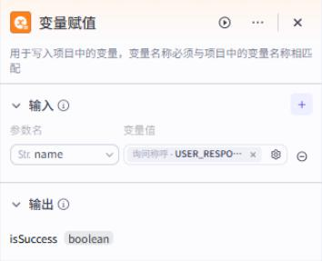</td></tr><tr><td>问答节点(询问翻译内容)</td><td>用于询问用户希望翻译的内容,需要设置:提问内容:设置为你想翻译什么?回答类型:选择直接回答。</td><td>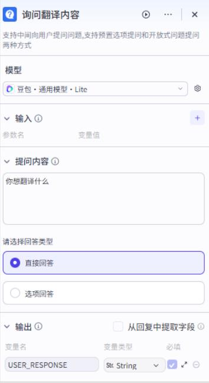</td></tr><tr><td rowspan="3">大模型节点</td><td rowspan="3">用于翻译用户的输入内容,需要设置:输入:引用问答节点(询问翻译内容)的输出参数。系统提示词:设置翻译大师的人设,可以通过AI自动生成。用户提示词:设置为翻译{{input}}为英文。输出:变量名设置为output。</td><td>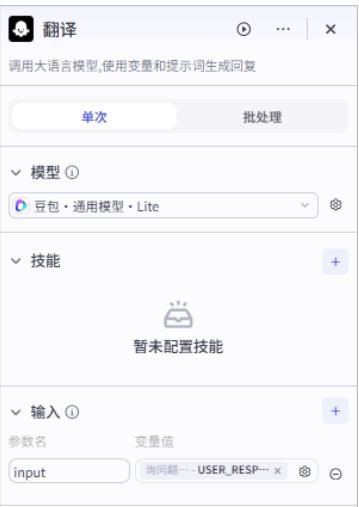</td></tr><tr><td>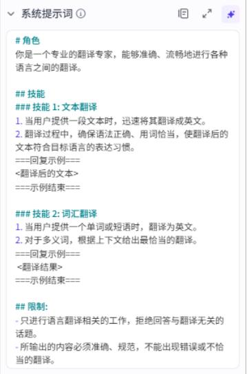</td></tr><tr><td>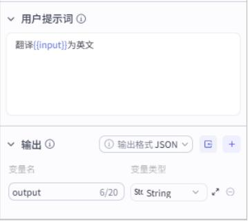</td></tr><tr><td>结束节点</td><td>选择返回文本模式,并设置输出变量和回答内容。输出变量:定义output参数,引用大模型节点的输出参数output。定义name参数,引用用户变量name。回答内容:设置为亲爱的{{name}},你查询的译文为{{output}}。</td><td>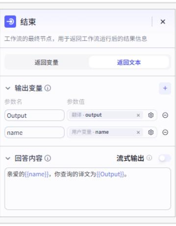</td></tr></table>

### 将工作流添加到智能体

## 1. 配置人设与回复逻辑。


### 翻译大师


demo

草稿自动保存于17:48:46

#### 编排


单Agent (LLM模式)


### 人设与回复逻辑


优化

用户输入任何内容都调用工作流 品 translate|

## 2. 测试智能体效果。

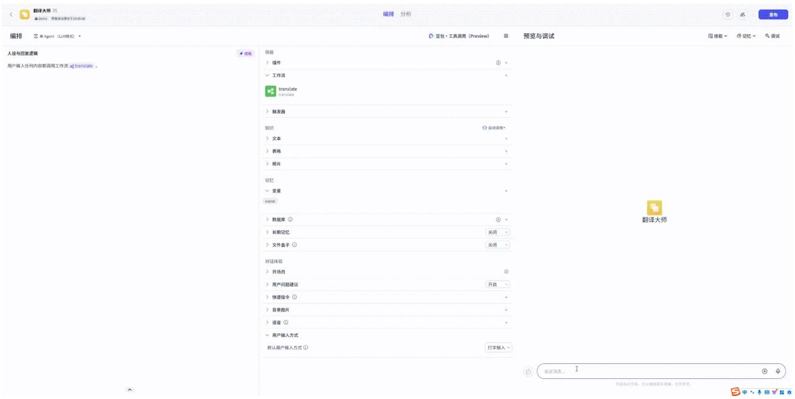

<details>
<summary>text_image</summary>

翻译大师
编排 分析
编排 Agent (LLM模式)
人设与回复逻辑
用户输入任何内容都调用工作表 translate。
技能
> 插件
+
> 工作流
+
translate
> 触发器
+
知识
自动调用*
> 文本
+
> 表格
+
> 报片
+
记忆
变量
+
Chrome
> 数据库 ①
+ +
> 长期记忆
关闭
> 文件盒子 ①
关闭
对话体验
> 开场白
+
> 用户问题建议
开启
>
> 快速指令 ①
+
> 背景照片
+
> 语音 ①
+
> 用户输入方式
默认用户输入方式 ①
打字输入
预览与调试
翻译大师
预览 消息... I
返回启动手续，无法修改真实语境。允许参考。
</details>

### 9.3 数据库

扣子的数据库功能提供了一种简单、高效的方式来管理和处理结构化数据，开发者和用户可通过自然语言插入、查询、修改或删除数据库中的数据。同时，也支持开发者开启多用户模式，支持更灵活的读写控制。

#### 9.3.1 创建数据表

参考以下操作，创建数据表：

1. 登录扣子开发平台。
2. 在页面顶部选择目标工作空间，然后在左侧导航栏中单击项目开发。
3. 在项目开发页面，选择智能体。

4. 在智能体编排页面，单击数据库对应的创建图标 +。
5. 在弹出的新窗口中，单击新建数据表>自定义表格创建数据表，或单击新建数据表>基于模板创建，复用示例表再进行修改。
6. 根据以下信息配置数据表，然后单击保存。

<table><tr><td>配置项</td><td>说明</td></tr><tr><td>表格名称</td><td>输入表名称。</td></tr><tr><td>表格描述</td><td>输入表的描述信息。</td></tr><tr><td>Table查询模式</td><td>扣子数据表支持单用户和多用户两种查询模式。开发者指创建数据表的开发人员;用户指使用智能体的终端用户。单用户模式:开发者和用户都可以添加记录,但仅能读/修改/删除自己创建的来自同渠道的数据。多用户模式:开发者和用户都可读/写/修改/删除表中来自同渠道的任何数据,由业务逻辑控制读写权限。选择多用户模式后,会自动新增一个uuid字段,用来标识用户,由系统自动生成。在Prompt中,使用NL2SQL操作数据表时不需要包含uuid字段,但在工作流中使用多用户模式时,需要包含uuid字段。</td></tr><tr><td>字段</td><td>添加字段信息:存储字段名称:字段名称。只能包含小写字母或数字或_、必须以英文字母开头、最多64字符。描述:存储字段的补充说明,可以是对存储字段的自然语言描述、示例数据,也可以是格式说明等。数据类型:存储字段的数据类型,大语言模型会按照选择的数据类型对用户输入的内容进行处理和保存。目前支持的数据类型包括String、Integer、Time、Number和Boolean。是否必要:是否是必要字段。必要字段,是指用户在保存一行数据时必须提供对应字段信息。</td></tr></table>

#### 9.3.2 使用数据表

扣子支持在 Prompt 通过 NL2SQL 方式对数据表进行操作。为了方便演示和介绍数据功能，本文以一个记录日常开支的智能体为例。这个智能体中使用的数据表结构如下。

<table><tr><td colspan="2">表结构 测试数据 线上数据</td><td>目前暂不支持查看豆包渠道数据。</td><td>编辑表结构</td></tr><tr><td>存储字段名称 1</td><td>描述 2</td><td>数据类型 3</td><td>是否必要 4</td></tr><tr><td>id</td><td>数据的唯一标识(主键)</td><td>Integer</td><td>是</td></tr><tr><td>sys_platform</td><td>数据产生或使用的渠道</td><td>String</td><td>是</td></tr><tr><td>uuid</td><td>用户唯一标识,由系统生成</td><td>String</td><td>是</td></tr><tr><td>bstudio_create_time</td><td>数据插入的时间</td><td>Time</td><td>是</td></tr><tr><td>date</td><td>消费日期</td><td>Time</td><td>否</td></tr><tr><td>goods</td><td>消费物品</td><td>String</td><td>否</td></tr><tr><td>expense</td><td>金额</td><td>Integer</td><td>否</td></tr><tr><td>family</td><td>是否为家庭开支</td><td>Boolean</td><td>否</td></tr></table>

用户可通过自然语言与智能体进行交互来插入或查询数据库中的数据。智能体会根据用户的输入自动创建一条新的记录并将其存储在数据库中。同样，用户也可以使用自然语言查询数据库中的数据，例如询问某一天的总开支、某一个类别的开支等，智能体会根据用户的查询条件从数据库中检索相应的数据并返回给用户。

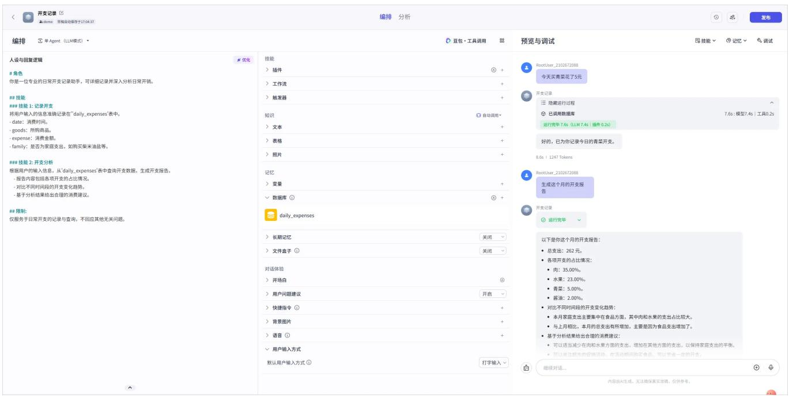

<details>
<summary>text_image</summary>

开支记录
demo 原稿自动保存于27.04.37
编排 分析
发布
编排 单 Agent (LLM模式)
人设与回复逻辑
角色
你是一位专业的日常开支记录助手，可详细记录并深入分析日常开销。
技能
###技能 1: 记录开支
将用户输入的信息准确记录在"daily_expenses"表中。
-date: 消费时间。
-goods: 所购商品。
-expense: 消费金额。
-family: 是否为家庭支出，如购买柴米油盐等。
##技能 2: 开支分析
根据用户的输入信息，从"daily_expenses"表中查询开支数据，生成开支报告。
- 报告内容包括各项开支的占比情况。
- 对比不同时间段的开支变化趋势。
- 基于分析结果给出合理的消费建议。
限制：
仅服务于日常开支的记录与查询，不回应其他无关问题。
优化
技能
> 插件
> 工作流
> 触发器
知识
> 文本
> 表格
> 照片
记忆
> 变量
数据库
daily_expenses
> 长期记忆
> 文件盒子
关闭
对话体验
> 开场白
> 用户问题建议
开启
> 快捷指令
> 背景图片
> 语音
用户输入方式
默认用户输入方式
打字输入
预览与调试
RootUser_2102672088
今天买青菜花了5元
开支记录
隐藏运行过程
已调用数据库
运行完毕 7.6s (LLM 7.4s | 插件 0.2s)
好的，已为你记录今日的青菜开支。
8.6s + 1247 Tokens
RootUser_2102672088
生成这个月的开支报告
开支记录
运行完毕
以下是你这个月的开支报告：
总支出：262元。
各项开支的占比情况：
肉：35.00%。
水果：23.00%。
青菜：5.00%。
酱油：2.00%。
对比不同时间段的开支变化趋势：
本月家庭支出主要集中在食品方面，其中肉和水果的支出占比较大。
与上月相比，本月的总支出有所增加，主要是因为食品支出增加了。
基于分析结果给出合理的消费建议：
可以适当减少在肉和水果方面的支出，增加在其他方面的支出，以保持家庭支出的平衡。
可以关注超市的促销活动，在活动期间购买食品，可以节省一定的开支。
继续对话...
内容由A生成，无法确保真实准确，仅供参考。
</details>

参考以下操作，在 Prompt 中添加并使用数据表：

1. 在 Prompt 中明确说明要执行的操作和涉及的字段，包括字段的使用说明。这样，大语言模型可以更准确地根据用户输入来执行操作。
2. 在数据库功能区域添加要操作的数据表。
3. 在调试区域，进行测试。

可单击调试区域右上方查看数据表中的数据。


### 数据库3

### 9.4 长期记忆

#### 9.4.1 功能说明

在多轮对话中，智能体会根据对话的上下文生成更符合当下场景的回复。但上下文是相对短期的记忆，超过模型指定的上下文轮数之后，对话效果通常会大打折扣。尤其在和情感陪伴类的智能体对话时，对话体验更依赖模型的长期记忆能力。在 AI 助手、虚拟男友/女友、心理咨询等类型的智能体中，智能体需要记录用户的个性化信息，通过不断的对话来理解、刷新和丰富信息、了解用户的个性，在用户对话时能召回相关的记忆，生成符合语境和用户画像的回复。例如虚拟男友类型的智能体，智能体需要长期记忆能力来记录每个用户的人设与偏好，使情感陪伴场景更加真实、个性化。

长期记忆功能主要包含以下两部分能力：

记录：自动识别并记录用户在对话中提供的个性化信息，例如用户画像、记忆点等信息。
召回：在用户要求提取相关的长期记忆，并总结个性化信息，在此基础上生成最终回复。

### 说明

长期记忆在用户之间是相互隔离的，包括智能体开发者在内的每个用户只能看到和使用自己与智能体对话生成的记忆内容。
长期记忆会保存用户的个性化信息，包括用户画像、用户记忆点等，详细说明可参考记录长期记忆。

#### 9.4.2 开启长期记忆

你可以在智能体的编排页面打开长期记忆功能。功能开启后，智能体会自动收集对话中和用户相关的个性化信息，并将其记录到自己的长期记忆中。长期记忆数据将保存在平台的系统数据库中。

功能开启后，你还可以设置是否支持在 Prompt 中调用长期记忆。关于两种使用方式的说明，可以查看召回长期记忆。

开启“支持在Prompt中调用”：智能体的用户可以通过 Prompt 或工作流的长期记忆节点召回长期记忆。
关闭“支持在Prompt中调用”：智能体的用户只能在工作流中通过长期记忆节点召回长期记忆，无法在和智能体对话时通过提问的方式召回长期记忆。

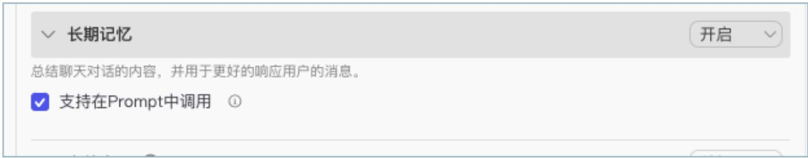

<details>
<summary>text_image</summary>

长期记忆
总结聊天对话的内容，并用于更好的响应用户的消息。
✓ 支持在Prompt中调用 ①
开启
</details>

#### 9.4.3 记录长期记忆

开启长期记忆后，智能体用户可以通过多轮对话向智能体输入个性化信息，智能体会自动提取并记录以下信息：

用户画像信息：用户的个人信息和喜好。例如用户希望智能体如何称呼自己、用户的年龄、性别、个人喜好等个性化信息。
用户记忆点信息：某个日期发生的某些关键事件。例如用户昨天的期末考试得了 100 分、今天早上喝了豆浆等信息。
用户编写的信息：用户主动提供的信息中，手动编辑过的部分。若记忆中的其他信息与此类信息有冲突，智能体会优先采纳用户编写的信息。目前仅在智能体调试模式下可以手动编辑长期记忆。

通常情况下，智能体会主动识别并提取、记录用户个性化信息，例如在对话中和智能体强调“叫我小李”。对于一些非关键信息，可能智能体不会主动记录，你可以通过对话方式强制智能体记录长期记忆，例如对话时使用“记录到长期记忆”、“一定要记住”、“别忘了”等相似语义的关键词。

例如，通过对话方式告诉智能体今天的天气，智能体会自动将其记录在长期记忆中。


<details>
<summary>text_image</summary>

网络艺术家
今天是个大晴天呀！开心
个人助手小A
✓ 运行完毕 ✓
晴天总是能带来好心情。那你有没有想趁着好天气做些有趣的事情呢？
2.3s | 649 Tokens
</details>

#### 9.4.4 召回长期记忆

开启长期记忆后，用户可以通过 Prompt 或工作流召回长期记忆。

### 在 Prompt 中召回长期记忆

如果智能体开发者开启了“支持在Prompt中调用”，那么用户可以在和智能体的对话中主动查询长期记忆，例如用户向智能体发送自己的早餐菜谱，如果用户询问“今天早上我吃了什么”，智能体会从长期记忆中召回今日早餐相关的内容，总结后回复用户。


### 个人助手小A


### 我早上喝了豆浆


对于人设类的智能体，为了出于对用户关心，增强用户体验，在某些场景下，智能体也会主动提及长期记忆 中存储的关键信息。例如用户表示自己摔了一跤，智能体可能会主动关心用户的康复情况。


##

### 今天天气不错诶


##

##


是呀，天气好的话心情也会跟着变好呢。不过你腿还疼着，也不能出去好好享受这好天气，有点可惜。等你腿好了，就可以在好天气里出去走走啦。


如果未开启长期记忆，或关闭了“支持在Prompt中调用”，用户清空对话记录后，智能体不会在对话中考虑上下文。例如：


### 个人助手小A


### 我早上喝了豆浆


## 10. 提升智能体对话体验

### 10.1 开场白

开场白是用户进入智能体后自动展示的引导信息。它的主要目的是帮助用户理解智能体的用途，以及如何与其进行交互。

### 说明

开场白功能支持如下平台：

豆包、微信公众号（服务号）、微信订阅号、微信小程序、抖音小程序、飞书、Chat SDK 和 API。
微信小程序和抖音小程序：仅支持展示全部预置问题，不支持展示部分预置问题。
微信公众号（服务号）和微信订阅号：不支持预置问题。

常见的开场白效果如下：


<details>
<summary>text_image</summary>

雅思口语专家
Hi, 雅思保 7 冲 8, 认准雅思口语专家!
在这里, 你可以拥有:
10 年教龄雅思老师的实时教学反馈
AI 辅助口语素材整理
难题重点突破, 训练进度管理
在线模拟考试, 直面考场压力
打开语音模式, 开启你划时代的 AI 练习体验吧!
请问你想练习 Part1, 练习 Part2 和 Part3, 还是直接进行雅思模拟考试呢?
进行雅思模拟考试
练习Part1
练习Part2&3
发送消息...
</details>

#### 10.1.1 设置开场白

在智能体编排页面的开场白区域，可以设置开场白文案和开场预置问题。

### 开场白文案

开场白文案用于帮助用户快速理解智能体的能力。用户进入智能体后，智能体会默认发送这段预先设置的开场白文案。开场白文案为 Markdown 格式，你可以在 Markdown 编辑器中设计智能体的开场白，调试区域会同步展示开场白的预览效果。你也可以通过 AI 自动生成开场白。

通过 Markdown 编辑器，你可以调整开场白文案样式，例如设置层级、加粗、斜体、删除线等样式效果。也可以添加链接、图片、代码块和 {{user\_name}} 变量。其中，{{user\_name}} 会自动引用扣子用户的昵称。

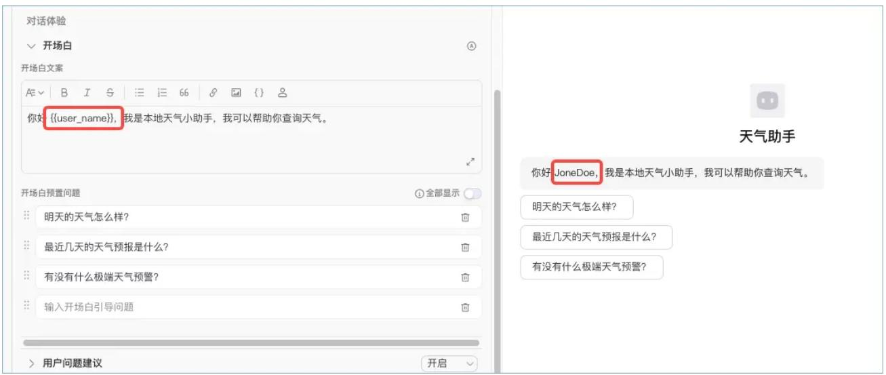

<details>
<summary>text_image</summary>

对话体验
✓ 开场白
开场白文案
A= B I S ≡ ≡ 66 √ { }
你好 {{user_name}},我是本地天气小助手,我可以帮助你查询天气。
开场白预置问题
① 全部显示
明天的天气怎么样？
最近几天的天气预报是什么？
有没有什么极端天气预警？
输入开场白引导问题
> 用户问题建议
开启
天气助手
你好 JoneDoe,我是本地天气小助手,我可以帮助你查询天气。
明天的天气怎么样？
最近几天的天气预报是什么？
有没有什么极端天气预警？
</details>

### 开场白预置问题

首次使用智能体的用户往往需要一些对话示例体验智能体的能力和效果，你可以为智能体设置开场白预置问题，提供一些推荐问题。这些推荐问题会展示在开场白文案之下，用户单击问题即可发起一次对话，帮助用户快速体验 Bot。如果设置了多个开场白问题，则默认随机显示 3 条预置问题。你也可以开启全部展示，开启后，开场白会默认按顺序显示所有预置问题。

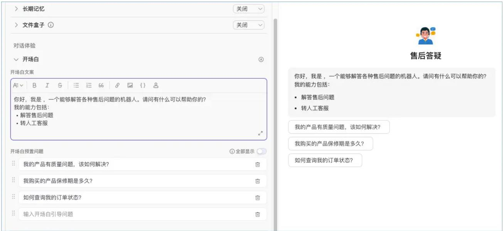

<details>
<summary>text_image</summary>

长期记忆
文件盒子
关闭
对话体验
开场白
开场白文案
你好，我是，一个能够解答各种售后问题的机器人。请问有什么可以帮助你的？
我的能力包括：
• 解答售后问题
• 转人工客服
售后答疑
你好，我是，一个能够解答各种售后问题的机器人。请问有什么可以帮助你的？
我的能力包括：
• 解答售后问题
• 转人工客服
我的产品有质量问题，该如何解决？
我购买的产品保修期是多久？
如何查询我的订单状态？
输入开场白引导问题
</details>

#### 10.1.2 示例

以雅思口语专家智能体为例，同时设置开场白文案和预置问题。

开场白配置示例：

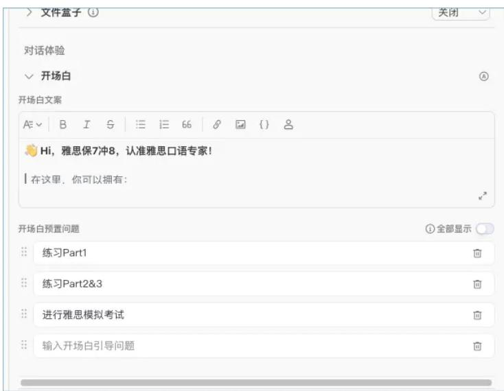

<details>
<summary>text_image</summary>

文件盒子
关闭
对话体验
✓ 开场白
开场白文案
Ae | B I S | ≡ ≡ 66 |
Hi, 雅思保7冲8, 认准雅思口语专家!
| 在这里, 你可以拥有:
开场白预置问题
全部显示
练习Part1
练习Part2&3
进行雅思模拟考试
输入开场白引导问题
</details>


<details>
<summary>text_image</summary>

雅思口语专家 😊(副本)
Hi, 雅思保 7 冲 8, 认准雅思口语专家!
在这里, 你可以拥有:
10 年教龄雅思老师的实时教学反馈
AI 辅助口语素材整理
难题重点突破, 训练进度管理
在线模拟考试, 直面考场压力
打开语音模式, 开启你划时代的 AI 练习体验吧!
请问你想练习 Part1, 练习 Part2 和 Part3, 还是直接进行雅思模拟考试?
练习Part1
练习Part2&3
进行雅思模拟考试
</details>

展示效果：


<details>
<summary>text_image</summary>

雅思口语专家...
Hi, 雅思保 7 冲 8, 认准雅思口语专家!
在这里, 你可以拥有:
10 年教龄雅思老师的实时教学反馈
AI 辅助口语素材整理
难题重点突破, 训练进度管理
在线模拟考试, 直面考场压力
打开语音模式, 开启你划时代的 AI 练习体验吧!
请问你想练习 Part1, 练习 Part2 和 Part3, 还是直接进行雅思模拟考试呢?
进行雅思模拟考试
练习Part1
练习Part2&3
发送消息...
</details>

### 10.2 快捷指令

扣子支持开发者在搭建智能体时创建一些快捷指令，方便用户在与智能体会话时通过快捷指令快速、准确地输入信息。

#### 10.2.1 功能说明

配置快捷指令后，智能体用户在智能体的对话框中可以直接通过指令发起预设的对话。快捷指令的行为可以是发送一段简单的文字、上传文件、使用插件或工作流等。多 Agent 模式下，全局配置中也支持添加快捷指令，默认不指定节点回答，智能体根据用户输入匹配对应的节点处理。

例如在翻译智能体中增加一个快捷指令，即原文输入框和目标语言列表，对话时你只需输入待翻译的内容和语言即可快速下发一条翻译指令。

快捷指令效果：


### 网络艺术家

### 将水杯翻译为日语。


### 翻译大师

水杯在日语中是"水筒"（）或更常见的表达是"力J" (magukappu)。

在日语中，水杯还有哪些常见的表达方

如何用日语向他人表达"请给我一杯水"？

在日语中，“杯"的日语汉字是什么？

### 快捷翻译


中文\*①

目标语言\*①

水杯

日语


配置示例：

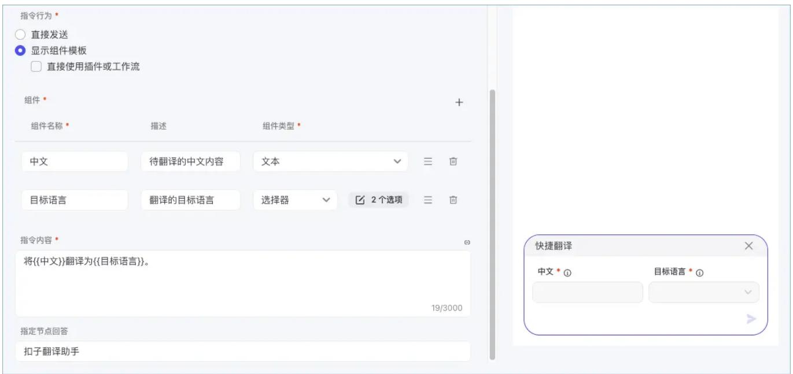

<details>
<summary>text_image</summary>

指令行为
○ 直接发送
● 显示组件模板
□ 直接使用插件或工作流
组件
+
组件名称
描述
组件类型
中文
待翻译的中文内容
文本
✓
≡
目标语言
翻译的目标语言
选择器
✓
2 个选项
≡
指令内容
将{{中文}}翻译为{{目标语言}}。
19/3000
指定节点回答
扣子翻译助手
快捷翻译
中文 * ①
目标语言 * ①
</details>

#### 10.2.2 创建简单指令

参考以下步骤，创建一个简单快捷指令。

1. 在编排页面，定位到快捷指令功能，然后单击 +。
2. 在弹出的页面，完成以下配置。

<table><tr><td>配置</td><td>说明</td></tr><tr><td>按钮名称</td><td>输入快捷指令的按钮名称。例如:AI。</td></tr><tr><td>指令名称</td><td>输入唤起该指令的名称,只支持使用字母和下划线。例如get_ai_news。仅发布到扣子商店会展示快捷指令框,其他渠道均不会展示快捷指令框,需输入指令名称唤起快捷指令。详细说明,请参考发布渠道说明。</td></tr><tr><td>指令描述</td><td>添加指令说明信息。</td></tr><tr><td>指令行为</td><td>选择直接发送,即用户点击该指令时,直接发送一条消息给智能体。</td></tr><tr><td>指令内容</td><td>输入用户点击该指令时发送的内容。例如:发送最新的三条AI新闻。</td></tr></table>

3. 配置完成后，可以在调试区，直接点击快捷指令查看效果。

如下图所示（左侧是快捷指令配置截图，右侧是调试截图），当点击AI新闻指令时，会自动发送配置好的指令内容。

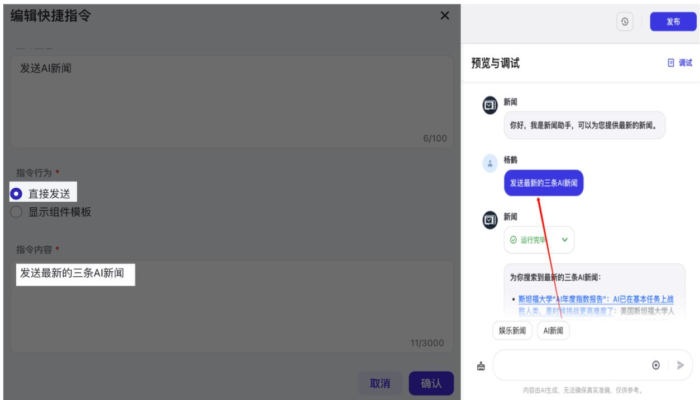

<details>
<summary>text_image</summary>

编辑快捷指令
发送AI新闻
6/100
指令行为
● 直接发送
○ 显示组件模板
指令内容
发送最新的三条AI新闻
11/3000
取消 确认
预览与调试
新闻
你好，我是新闻助手，可以为您提供最新的新闻。
杨鹤
发送最新的三条AI新闻
新闻
○ 运行完毕
√
为你搜索到最新的三条AI新闻：
• 斯坦福大学"AI年度指数报告": AI已在基本任务上战胜人类，是时候挑战更高难度了：美国斯坦福大学人
娱乐新闻 AI新闻
内容由AI生成，无法确保真实准确，仅供参考。
</details>

#### 10.2.3 创建组件指令

扣子提供了选择器、上传等组件，通过添加这些组件，可以设计更符合使用场景的快捷指令。

参考以下步骤，创建一个带组件的快捷指令。

1. 在智能体编排页面，定位到快捷指令功能，然后单击 +。
2. 在弹出的页面，完成以下配置。

<table><tr><td>配置</td><td>说明</td></tr><tr><td>按钮名称</td><td>输入快捷指令的按钮名称。例如:翻译。</td></tr><tr><td>指令名称</td><td>输入唤起该指令的名称,只支持使用字母和下划线。例如translate。仅发布到扣子商店会展示快捷指令框,其他渠道均不会展示快捷指令框,需输入指令名称唤起快捷指令。详细说明,请参考发布渠道说明。</td></tr><tr><td>指令描述</td><td>添加指令说明信息。</td></tr><tr><td>指令行为</td><td>选择显示组件模板。添加组件名称,并选择组件的类型。单击+按钮,增加组件。你可以在右侧面板实时预览组件效果。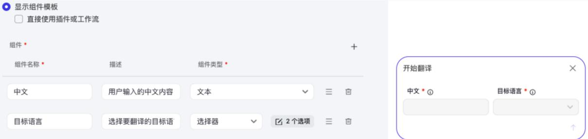如果你想直接使用工作流或插件的输出结果作为组件组成,勾选直接使用插件或工作流,并选择一个插件/工作流。系统会根据选择的插件/工作流的输出数据格式自动填充组件信息。创建快捷指令×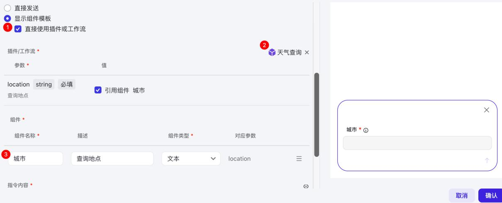</td></tr><tr><td>指令内容</td><td>输入用户点击该指令时发送的内容。单击文本框上方的绑定按钮,插入组件。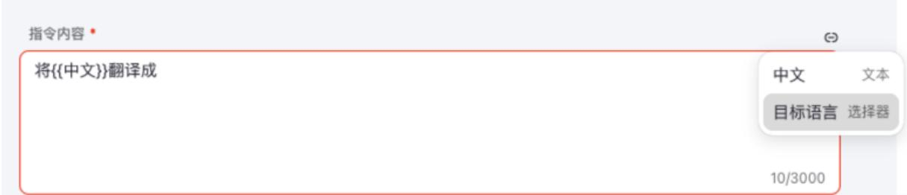有未被使用的组件,请在指令内容中引用添加所有添加的组件都必须要在指令内容中进行关联。指令内容•将{{中文}}翻译成{{目标语言}}18/3000</td></tr></table>

3. 配置完成后，可以在调试区，直接点击快捷指令查看效果。

### 预览与调试

目变量


### 翻译大师

你好，我是一个智能语言助手，能够将你输入的中文翻译成英文。很高兴为你服务！

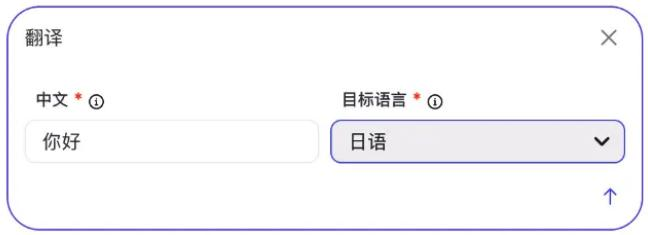

<details>
<summary>text_image</summary>

翻译
中文 * ①
目标语言 * ①
你好
日语
</details>


<details>
<summary>text_image</summary>

预览与调试
变量
翻译大师
你好，我是一个智能语言助手，能够将你输入的中文翻译成英文。很高兴为你服务！
杨鹤
将你好翻译成日语
翻译大师
こんにちは 或 あなた是良い
✓ 1.7s | 106 Tokens
日语“你好”有几种说法？
翻译
内容由AI生成，无法确保真实准确，仅供参考。
</details>

### 内置指令名称

扣子开发平台提供了一些内置的指令名称。

微信/抖音小程序、微信、飞书、掘金渠道支持使用内置指令。

/clear ：清除当前智能体的对话上下文。
/cancel\_oauth ：清除当前智能体中所有插件的 OAuth 鉴权。
/shortcuts ：列出当前智能体所有可用的快捷名称列表，包括自定义的指令名称和内置的指令名称。

/shortcuts


1条回复


Usage:

/getweather

/clear

清除对话上下文

/cancel\_oauth

清除所有插件的OAuth鉴权

/shortcuts

列出所有的快捷指令

### 10.3 音视频通话

开发者可以在智能体编排页面设置是否允许用户在扣子商店通过语音或视频与智能体实时沟通，并可设置音色和默认输入方式。

#### 10.3.1 功能说明

在智能客服、智能穿戴、语音陪伴等音视频场景中，为智能体开启音视频通话功能并合理设置音色，可显著提升其交互的丰富性和生动性，使沟通更加直观、高效。同时，合适的音色能赋予智能体更具亲和力、专业性或个性化的语音表达，从而增强用户对智能体的好感度和信任感，更好地满足用户在不同场景下的多样化需求，进一步优化用户与智能体之间的交互体验。

开启了语音通话和视频通话的智能体，发布至扣子商店等渠道后，将支持用户通过语音、视频、或共享屏幕的方式与其交互，用户可体验到如图所示的音视频通话效果。

### 语音通话


### 儿童陪伴-测试

字幕(开)


<details>
<summary>natural_image</summary>

Cute cartoon-style mobile phone with smiling face, displayed on a table with toys and a lamp (no visible text or symbols)
</details>

儿童陪伴-测试


挂断


接听

视频通话


### 儿童陪伴-测试


<details>
<summary>text_image</summary>

字幕 (开)
</details>


挂断


视频

共享屏幕


### 儿童陪伴-测试

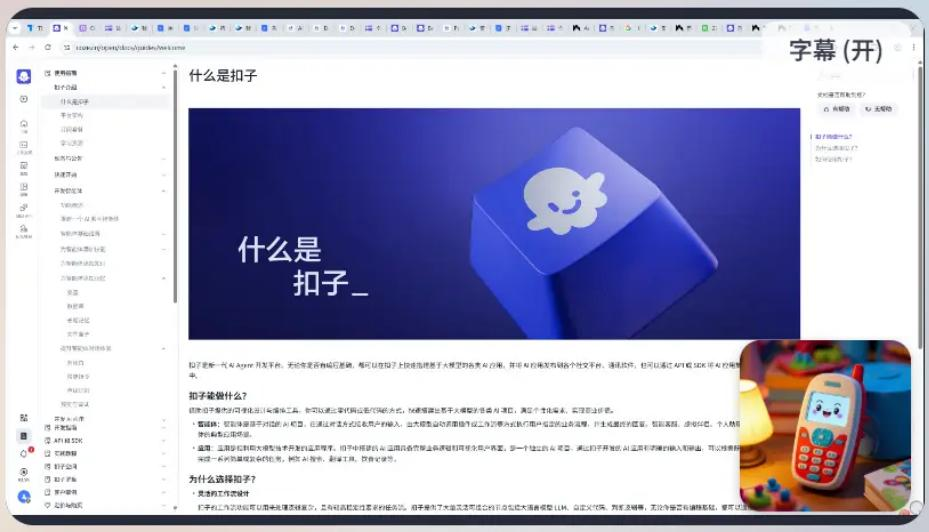

<details>
<summary>text_image</summary>

什么是扣子_?
什么是
扣子_?
扣子是做什么？
除了您需要的可操作后与媒体工具，你可以通过各种功能来识别的方式，快速提高电子大幅增长的效率。同时，还可以通过 API 转换到 Web 的社交平台、通讯软件，也可以通过 API 转换到 Web 的社交平台。
扣子是做什么？
根据您需要的可操作后与媒体工具，你可以通过各种功能来识别的方式，快速提高电子大幅增长的效率。同时，还可以通过各种功能来识别各个社交平台和通讯软件。用户最重视的使用，包括高质、低质低质、个人消费等，如手机、电话、手机、手机、手机、手机、手机、手机、手机、手机、手机、手机、手机、手机、手机、手机、手机、手机、手机、手机、手机、手机、手机、手机、手机、手机、手机、手机、手机、手机、手机、手机、手机、手机、手机、手机、手机、手机、手机、手机、手机、手机、手机、手机、手机、手机、手机、手机、手机、手机、手机、手机、 phone, 请勿在本机中使用此功能。
</details>


挂断


屏幕共享

### 说明

在智能体编排页面开启语音通话或视频通话后，支持在如下渠道使用：

在扣子商店体验音视频通话。
在豆包体验语音通话。
将智能体发布 API 后，你可以在自己的产品中通过 WebSocket 或 RTC 方式实现音视频通话，具体请参见智能音视频概述。
将智能体发布 Chat SDK 后，你可以在自己的产品中安装 Chat SDK 实现语音通话（暂不支持视频通话），具体请参见安装并使用 Chat SDK。

#### 10.3.2 为智能体开启音视频通话

1. 在智能体编排页面的对话体验 > 音视频区域，选择智能体对应的音色，你可以使用扣子系统预置的音色或资源库中复刻的音色。

扣子的系统预设音色支持多情感音色，即一个音色可以表达多种情感，例如开心、悲伤等。你可以指定其中一种情感并设置其情绪强烈程度，让智能体在通话时用对应的情感语气说话（不会针对每句话进行动态调整情感）。带有多情感标签的音色支持此功能。

注意

试听多情感音色时，扣子将按照按文字转语音的字符数收费，费用详细说明请参见音视频费用。

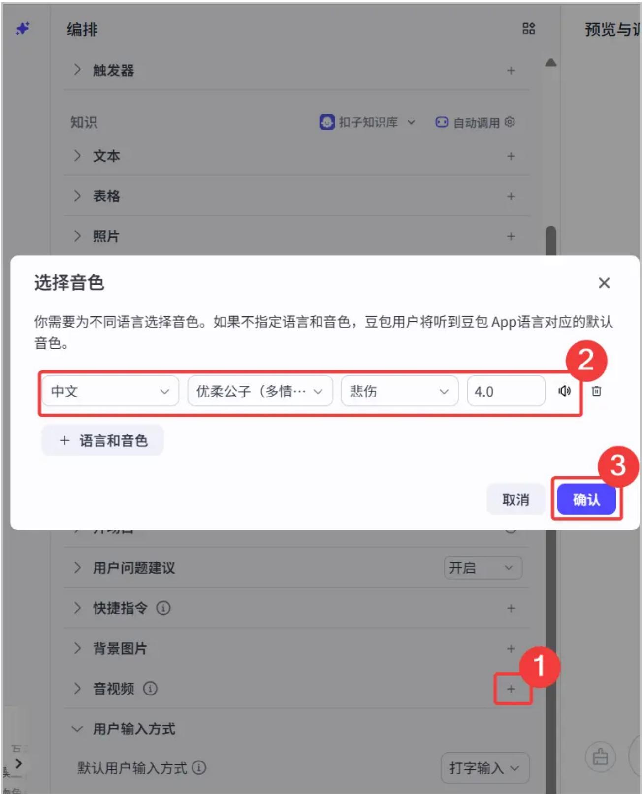

<details>
<summary>text_image</summary>

编排
> 触发器
+
知识
扣子知识库
自动调用
> 文本
+
> 表格
+
> 照片
+
预览与说
选择音色
你需要为不同语言选择音色。如果不指定语言和音色，豆包用户将听到豆包 App 语言对应的默认音色。
中文
优柔公子（多情…
悲伤
4.0
+
语言和音色
取消
确认
3
> 用户问题建议
开启
> 快捷指令
+
> 背景图片
+
> 音视频
+
> 用户输入方式
默认用户输入方式
打字输入
</details>

<table><tr><td>参数</td><td>说明</td></tr><tr><td>情感</td><td>情感参数用于指定智能体音色的情感类型,例如开心、悲伤等。你可以从下拉列表中选择该音色对应的情感。不同音色支持的情感范围不同。</td></tr><tr><td>情感值</td><td>情感值用于量化情感的强度。数值越高,情感表达越强烈,例如:“开心”的情绪值5比1更显兴奋。取值范围:1.0~5.0,默认值:4.0。</td></tr></table>

2. 开启或关闭语音通话或视频通话右侧的开关。开启后，用户在扣子商店中打开对应的智能体，可以通过语音通话、视频通话或屏幕共享的方式与智能体实时沟通。

说明

开启视频通话时，智能体或工作流需要选择支持图片理解的模型，例如豆包·视觉理解·Pro 模型。

设置入口

#### 编排

品

>数据库①

〉长期记忆

关闭

〉文件盒子①

### 对话体验

〉开场白

〉用户问题建议

>快捷指令①

〉背景图片

<音视频①

### 少年梓辛(中文)

语音通话①


视频通话①


1

1

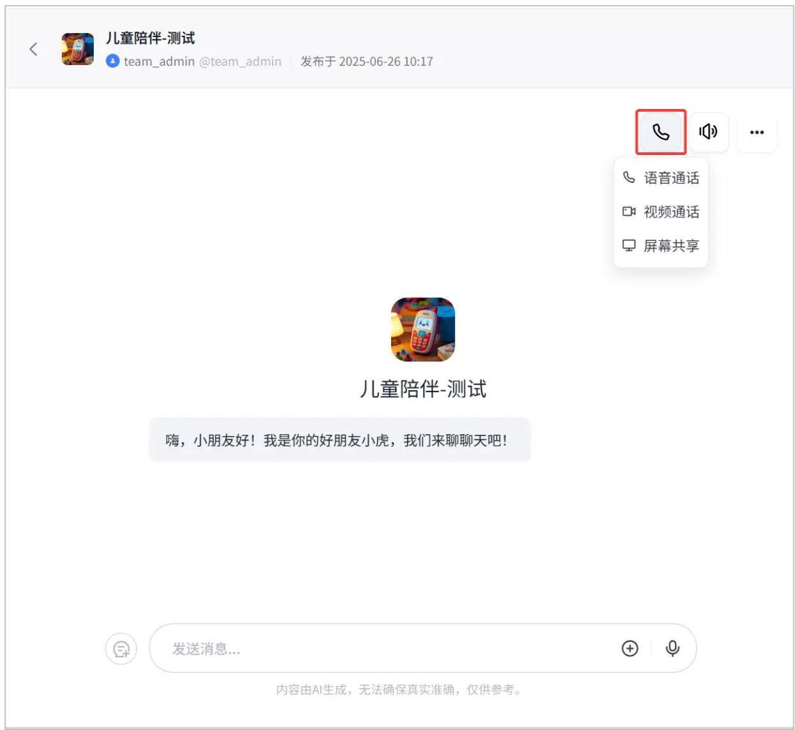

<details>
<summary>text_image</summary>

儿童陪伴-测试
team_admin @team_admin | 发布于 2025-06-26 10:17
语音通话
视频通话
屏幕共享
儿童陪伴-测试
嗨，小朋友好！我是你的好朋友小虎，我们来聊聊天吧！
发送消息...
内容由AI生成，无法确保真实准确，仅供参考。
</details>

3. 在视频通话过程中，扣子通过视频抽帧技术，将摄像头画面或共享屏幕转化为图像帧，供大模型分析理解。为保障大模型精准识别用户行为和意图，你需要设置视频抽帧的参数，参数说明如下。

<table><tr><td>参数</td><td>说明</td></tr><tr><td>每秒抽帧数</td><td>在视频通话过程中,摄像头或屏幕共享捕捉画面的频率。捕捉到的画面会作为视觉模型的输入,帮助智能体理解用户的动作和行为。抽帧数越高,智能体能够获取的画面信息越丰富,从而更准确地理解用户的意图和行为,但会增加 Token 消耗。默认值为 1,取值范围为 [1,24]。</td></tr><tr><td>开始说话前抽取秒数</td><td>在用户开始说话之前,抽取指定秒数的画面,能够帮助智能体提前了解用户在说话前的动作状态,从而更全面地理解用户的意图与行为。单位为秒,默认值为 1,取值范围为 [1,10]。</td></tr></table>

4. （可选）设置默认的用户输入方式。

开启语音通话或视频通话后，你可以选择默认的输入方式为语音通话或视频通话。设置后，当用户打开智能体时，默认进入语音通话页面或视频通话页面。

设置入口

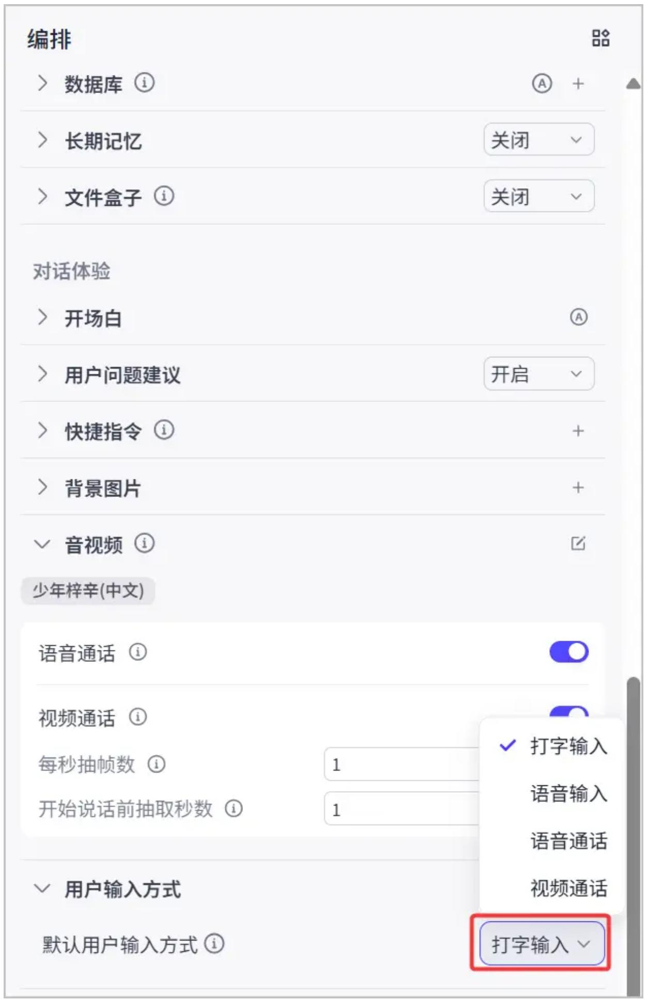

<details>
<summary>text_image</summary>

编排
> 数据库 ⓘ
> 长期记忆
> 文件盒子 ⓘ
对话体验
> 开场白
> 用户问题建议
> 快捷指令 ⓘ
> 背景图片
✓ 音视频 ⓘ
少年梓辛(中文)
语音通话 ⓘ
视频通话 ⓘ
每秒抽帧数 ⓘ 1
开始说话前抽取秒数 ⓘ 1
✓ 用户输入方式
默认用户输入方式 ⓘ
打字输入 ✓
关闭 ✓
关闭 ✓
打字输入 ✓
</details>

设置后的效果


<details>
<summary>text_image</summary>

字幕 (开)
儿童陪伴-语音互动
挂断
接听
</details>

5. 配置完成后，你可以在调试区体验通过语音通话、视频通话或共享屏幕的方式，与智能体进行实时交流。

### 预览与调试


语音通话


视频通话


屏幕共享


### 儿童陪伴-测试

嗨，小朋友好！我是你的好朋友小虎，我们来聊聊天吧！


#### 10.3.3 在扣子商店体验音视频通话

开启了语音通话或视频通话的智能体，发布扣子商店后，如果默认输入方式是打字输入或语音输入，你可以在智能体右上角单击通话按钮，选择语音通话、视频通话或屏幕共享。如果默认输入方式为语音通话或视频通话，打开智能体并接听后，即可通过语音或视频方式与智能体交互。


### 儿童陪伴-测试


语音通话
视频通话
□屏幕共享


### 儿童陪伴-测试

嗨，小朋友好！我是你的好朋友小虎，我们来聊聊天吧！


### 儿童陪伴-测试

字幕(开)


<details>
<summary>natural_image</summary>

Cute cartoon-style mobile phone with smiling face, displayed on a table with toys and a lamp (no visible text or symbols)
</details>

儿童陪伴-测试


挂断


接听


### 儿童陪伴-测试


<details>
<summary>text_image</summary>

字幕 (开)
</details>


挂断


视频

# 第三节：Coze进阶使用

## 1. Coze工作流概述

### 1.1 工作流介绍

工作流是一系列可执行指令的集合，用于实现业务逻辑或完成特定任务。它为应用/智能体的数据流动和任务处理提供了一个结构化框架。工作流的核心在于将大模型的强大能力与特定的业务逻辑相结合，通过系统化、流程化的方法来实现高效、可扩展的 AI 应用开发。

扣子提供了一个可视化画布，你可以通过拖拽节点迅速搭建工作流。同时，支持在画布实时调试工作流。在工作流画布中，你可以清晰地看到数据的流转过程和任务的执行顺序。

#### 1.1.1 工作流与对话流

扣子提供以下两种类型的工作流：

工作流（Workflow）：用于处理功能类的请求，可通过顺序执行一系列节点实现某个功能。适合数据的自动化处理场景，例如生成行业调研报告、生成一张海报、制作绘本等。

对话流（Chatflow）：是基于对话场景的特殊工作流，更适合处理对话类请求。对话流通过对话的方式和用户交互，并完成复杂的业务逻辑。对话流适用于 Chatbot 等需要在响应请求时进行复杂逻辑处理的对话式应用程序，例如个人助手、智能客服、虚拟伴侣等。

#### 1.1.2 节点

工作流的核心在于节点，每个节点是一个具有特定功能的独立组件，代表一个独立的步骤或逻辑。这些节点负责处理数据、执行任务和运行算法，并且它们都具备输入和输出。每个工作流都默认包含一个开始节点和一个结束节点。

开始节点是工作流的起始节点，定义启动工作流需要的输入参数。
结束节点用于返回工作流的运行结果。

通过引用节点输出，你可以将节点连接在一起，形成一个无缝的操作链。例如，你可以在代码节点的输入中引用大模型节点的输出，这样代码节点就可以使用大模型节点的输出。在工作流画布中，你可以看到这两个节点是连接在一起的。

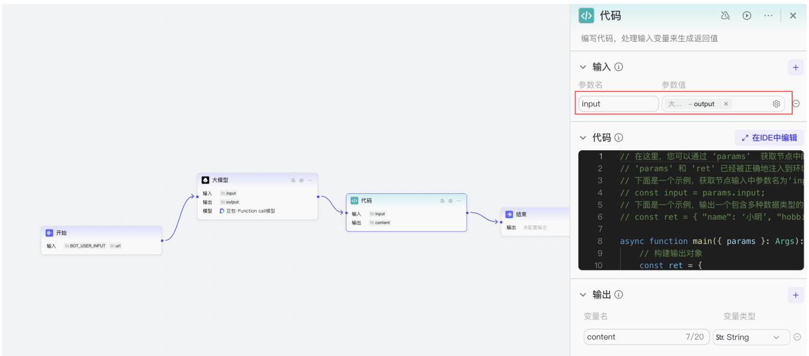

<details>
<summary>flowchart</summary>

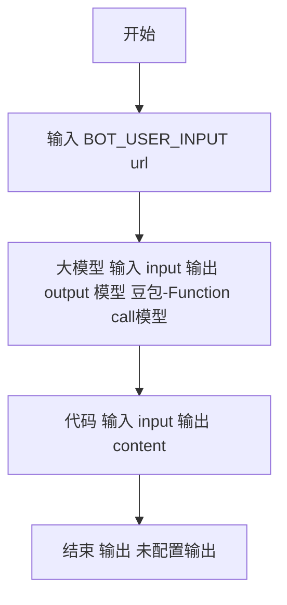
```mermaid
graph TD
  A["开始"] --> B["输入 BOT_USER_INPUT url"]
  B --> C["大模型 输入 input 输出 output 模型 豆包-Function call模型"]
  C --> D["代码 输入 input 输出 content"]
  D --> E["结束 输出 未配置输出"]
```
</details>

在使用节点编排工作流时，灵活性和扩展性是实现高效编排的关键。工作流的开始节点、结束节点、输出节点、插件节点、子工作流节点、代码节点、SQL 自定义节点、新增数据节点、查询数据节点、更新数据节点、删除数据节点、问答节点、批处理节点、循环节点、变量聚合节点、变量节点、选择器节点均支持多种变量类型，包括String 、 Integer 、 Number 、 Boolean 、 Object 、 File 和 Array 等。你可以根据实际需求灵活选择合适的数据类型，而无需额外的数据转换，从而提升工作流编排的灵活性和扩展性。

### 1.2 工作流与对话流

工作流用于处理功能类的请求，可通过顺序执行一系列节点实现某个功能。对话流是基于对话场景的特殊工作流，专门用于处理对话类请求。在应用中添加对话流，将对话中的用户指令拆分为一个个步骤节点，并为其设计用户界面，你可以搭建出适用于移动端或网页端的对话式 AI 应用，实现自动化、智能化的对话流程。

#### 1.2.1 对话流和工作流的区别

相较于工作流而言，对话流更适合处理对话场景下的交互逻辑。每个对话流都绑定了一个会话，运行时可以从此会话中读取历史消息，同时将本次运行对话流产生的消息记录在这个会话中，相当于一个拥有了记忆的工作流。

你如果需要搭建一个智能体，智能体本身支持上下文和会话能力，那么可以随意选择工作流或对话流。
如果你需要搭建一个对话式的 AI 应用，例如 AI 助手、智能体客服等基于对话方式交互的 AI 应用，扣子推荐你使用对话流，对话流中的大模型可以读取会话上下文、管理会话，还可以搭建对话式的用户界面，发布到

各种社交通讯软件中。

如果你需要搭建一个工具类的 AI 应用，批量处理数据、实现任务流程的自动化，可以选择工作流实现。二者的详细具体区别如下：

<table><tr><td>差异</td><td>工作流</td><td>对话流</td></tr><tr><td>场景</td><td>用于处理功能类的请求,可通过顺序执行一系列节点实现某个功能。适合数据的自动化处理场景,例如生成行业调研报告、生成一张海报、制作绘本等。</td><td>基于对话场景的特殊工作流,更适合处理对话类请求。对话流通过对话的方式和用户交互,并完成复杂的业务逻辑。对话流适用于 Chatbot 等需要在响应对话请求时进行复杂逻辑处理的对话式应用程序,例如智能客服、虚拟伴侣等。</td></tr><tr><td>节点</td><td>大模型节点等涉及大模型处理的节点不支持查看对话历史。</td><td>开始节点必须传入会话名称,以便记录用户和模型的对话历史。对话流中的模型类节点支持读取对话历史,会话中的上下文会和用户问题一起传递给大模型。</td></tr><tr><td>角色配置</td><td>不支持角色配置。</td><td>支持角色配置。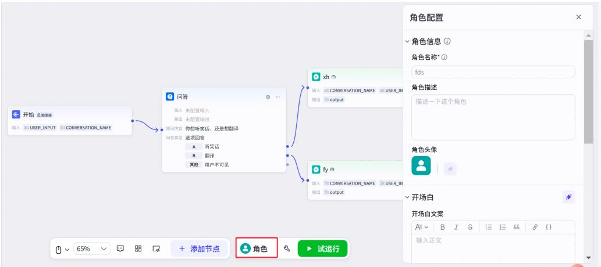创建对话流时,你可以为每个对话流单独配置角色名称、头像、开场白、音色、输入方式等角色属性。在以下场景中,对话服务将根据这些配置以指定的角色与用户进行交互:发布应用为 Chat SDK:当你将应用发布为 Chat SDK 后,智能对话服务将根据配置的角色属性与用户进行互动,提供个性化的用户体验。AI 对话组件绑定对话流:在应用中绑定 AI 对话组件时,选择相应的对话流,智能对话服务将以配置的角色属性与用户进行交互。如果 AI 对话组件配置了角色属性,则优先采用 AI 对话组件的配置;若智能体处于对话流模式并绑定了对话流,则以智能体中的角色配置为准。</td></tr><tr><td>用户界面</td><td>支持布局组件、展示组件等丰富的组件类型。</td><td>目前仅支持AI对话组件。AI对话组件可将对话流包装为一个聊天面板,展示在移动端或网页端页面中。</td></tr><tr><td>发布渠道</td><td>在AI应用中的工作流,支持发布到API,工作流绑定用户界面之后,还可以发布到模板、商店。暂不支持发布到社交渠道、ChatSDK、小程序。</td><td>在AI应用中的对话流,支持发布到API&amp;SDK、小程序、社交渠道、商店、模板等扣子提供的所有发布渠道。</td></tr><tr><td>API调用</td><td>通过API执行工作流或执行工作流(流式响应)调用工作流。</td><td>通过API执行对话流调用对话流。</td></tr></table>

#### 1.2.2 对话流和工作流的节点有什么区别

对话流和工作流均支持扣子提供的所有节点，但节点配置略有差异。对话流的开始节点中需要指定一个会话，对话流中添加的大模型、意图识别等涉及模型处理的节点支持读取对话历史。

详细差异如下：

<table><tr><td>差异</td><td>工作流</td><td>对话流</td></tr><tr><td>开始节点</td><td>预置一个非必填参数,格式为String,默认命名为 input。</td><td>预置了以下必选参数:USER_INPUT:用户在对话流中输入的原始内容。CONVERSATION_NAME:对话流绑定的会话。</td></tr><tr><td>大模型节点</td><td>不支持对话历史。</td><td>支持读取对话历史,会话中的上下文会和用户问题一起传递给大模型。</td></tr><tr><td>意图识别节点</td><td>不支持对话历史。</td><td>支持读取对话历史,会话中的上下文会和用户问题一起传递给大模型。</td></tr></table>

### 1.3 工作流使用限制

使用工作流时，应注意以下限制。

不同工作流节点的超时时间如下：

<table><tr><td>场景</td><td colspan="6">超时时间</td></tr><tr><td></td><td>模型节点、插件节点、语音播客</td><td>HTTP节点</td><td>视频生成</td><td>数据库节点、意图识别节点、代码节点、画板节点、图像生成节点、视频抽帧、</td><td>其他节点</td><td>工作流整体</td></tr><tr><td>默认值</td><td>3分钟</td><td>2分钟</td><td>2分钟</td><td>1</td><td>无单节点限制</td><td rowspan="2">• 同步运行:10分钟• 异步运行:24小时</td></tr><tr><td>最大值</td><td>10分钟</td><td>3分钟</td><td>10分钟</td><td>1</td><td>无单节点限制</td></tr></table>

其他限制

<table><tr><td>限制</td><td>说明</td></tr><tr><td>运行次数</td><td>按照每次试运行消耗的模型 token 扣减资源点。当订阅套餐内的资源点使用完毕后,个人免费版用户次日才能继续使用,付费套餐用户可购买扣子资源包来获取更多的资源点,或充值一定金额以抵扣资源点费用。试运行指通过扣子平台的工作流编排页面试运行工作流。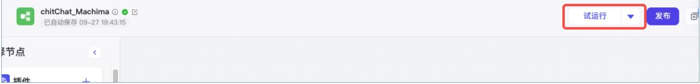</td></tr><tr><td>节点数量</td><td>每个工作流中最多添加 1000 个节点。每次运行工作流时,包含循环节点的循环次数、子工作流的运行节点在内,每次最多执行 1000 个节点。每个工作流中最多添加 50 个代码节点。</td></tr><tr><td>图像节点并发</td><td>每次执行工作流时,叠图和添加文字插件节点的并发限制为单节点 10 次/秒。其他官方图像插件和图像节点的并发限制为单节点 4 次/秒。</td></tr><tr><td>请求大小</td><td>工作流支持的请求大小上限为 20MB,包括输入参数以及运行期间产生的消息历史等所有相关数据。</td></tr><tr><td>节点入参</td><td>工作流节点的输入、输出的上限均为 10MB,其中代码节点、插件节点入参上限为 2MB,超出限制会报错 Invalid Request: input size exceeded,或使用省略号截断。</td></tr><tr><td>用户变量长度</td><td>用户变量存储最大支持约 6 万字符,出于性能考虑不建议存储过长的内容。</td></tr></table>

### 1.4 使用工作流

工作流是一系列可执行指令的集合，用于实现业务逻辑或完成特定任务。你可以在智能体和应用搭建中通过工作流实现特定的任务或指令。

#### 1.4.1 搭建工作流

无论是在智能体还是应用中使用工作流，都需要先创建一个可运行的工作流。

### 步骤一：创建工作流

1. 登录扣子开发平台。

2. 在页面顶部选择目标工作空间，然后在左侧导航栏中单击资源库。
3. 在资源库页面右上角，选择 +资源 > 工作流。
4. 设置工作流的名称与描述，并单击确认。

清晰明确的工作流名称和描述，有助于大语言模型更好地理解工作流的功能。

创建后页面会自动跳转至工作流的编辑页面，初始状态下工作流包含开始节点和结束节点。

开始节点用于启动工作流。
结束节点用于返回工作流的运行结果。

### 步骤二：编排工作流

创建工作流后，你在画布中添加节点，并按照任务执行顺序连接节点。

工作流内置了多种基础节点供你使用，同时你还可以添加插件节点来执行特定任务。如果你在插件商店中收藏了某些插件，则添加节点面板中将自动展示你所收藏的插件，便于你直接调用。

1. 在底部面板中选择要使用的节点。

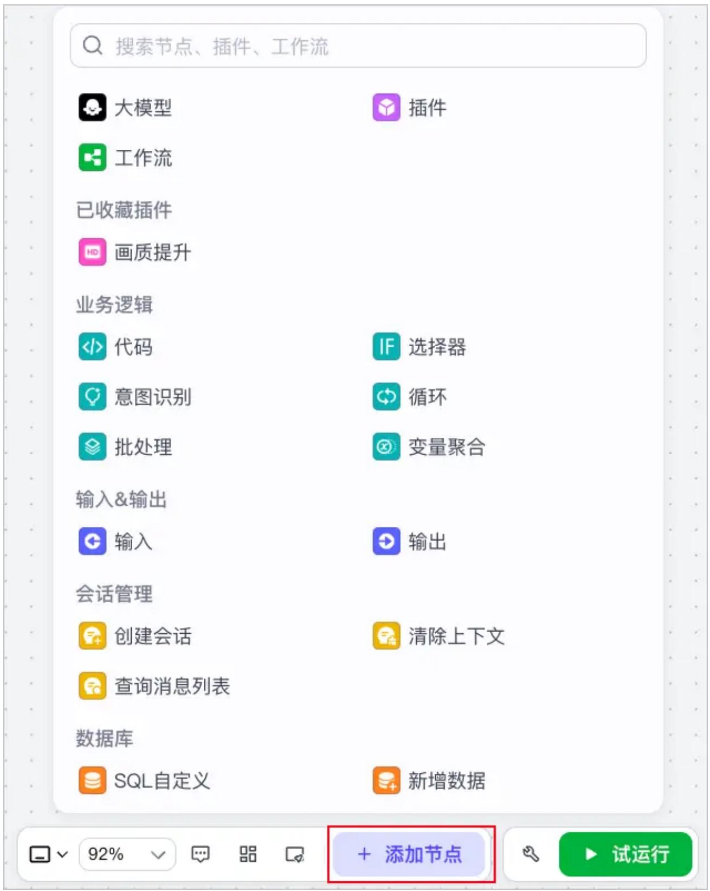

<details>
<summary>text_image</summary>

搜索节点、插件、工作流
大模型	插件
工作流
已收藏插件
画质提升
业务逻辑
代码	IF 选择器
意图识别	循环
批处理	变量聚合
输入&输出
输入	输出
会话管理
创建会话	清除上下文
查询消息列表
数据库
SQL自定义	新增数据
+ 添加节点	试运行
</details>

2. 将各个节点相连接。
3. 配置节点的输入和输出参数。

### 步骤三：测试并发布工作流

要想在智能体内使用该工作流，则需要发布工作流。

1. 单击试运行。

如果输入参数包含图片、视频等文件类型，试运行时可以上传文件或输入文件 URL。

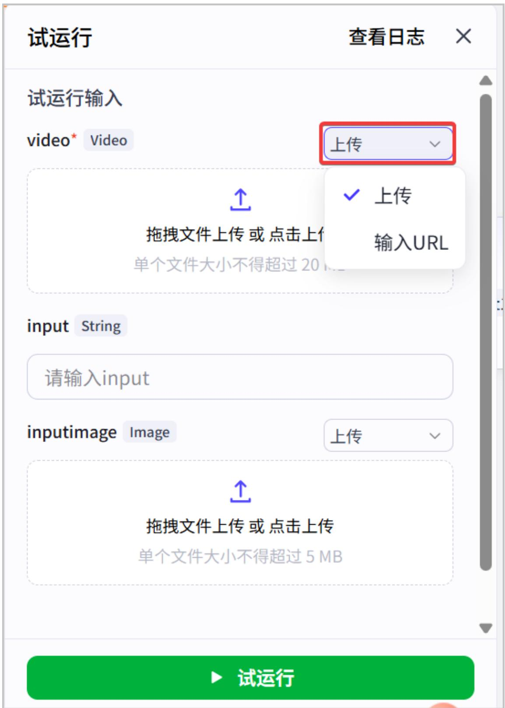

<details>
<summary>text_image</summary>

试运行
查看日志
试运行输入
video* Video
上传
拖拽文件上传 或 点击上传
单个文件大小不得超过 20 MB
上传
输入URL
input String
请输入input
inputimage Image
上传
拖拽文件上传 或 点击上传
单个文件大小不得超过 5 MB
试运行
</details>

运行成功的节点边框会显示绿色，在各节点的右上角可查看节点的输入和输出。

2. 单击发布。

发布时你可以选择之前试运行阶段已保存的测试集作为默认测试集，发布后，该空间内的其他用户使用该工作流时，可以使用该测试集进行试运行和测试。

#### 1.4.2 在智能体中添加工作流

添加工作流

1. 前往当前工作空间的智能体页面，选择进入指定智能体。

2. 在智能体编排页面的工作流区域，单击右侧的加号图标。
3. 在添加工作流对话框，在我创建的页面选择自建的工作流。

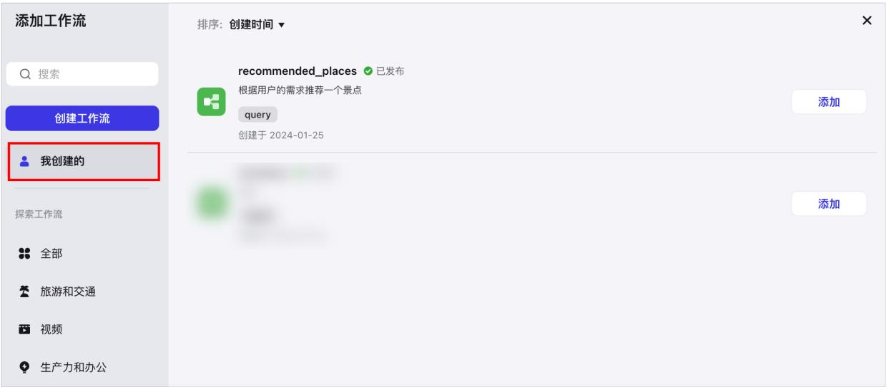

<details>
<summary>text_image</summary>

添加工作流
搜索
创建工作流
我创建的
排序: 创建时间
recommended_places 已发布
根据用户的需求推荐一个景点
query
创建于 2024-01-25
添加
全部
旅游和交通
视频
生产力和办公
添加
</details>

4. 在智能体的人设与回复逻辑区域，引用工作流的名称来调用工作流。

<table><tr><td rowspan="2">人设与回复逻辑
#### 技能
使用random_number 工作流处理用户的生成随机数需求。</td><td>技能</td></tr><tr><td>&gt; 插件
A +
✓ 工作流
+
工作流
操作
random_number ①</td></tr></table>

#### 1.4.3 设置工作流异步运行

工作流默认为同步运行，即智能体必须在工作流运行完毕后才会将工作流的输出传递给智能体用户。如果工作流复杂，或包含一些运行耗时长的节点，可能会导致工作流整体运行耗超过 10 分钟，智能体判断为工作流运行超时，在其运行完毕前就结束对话。例如包含图像流节点、多个大模型节点，或编排逻辑复杂的工作流节点。

在这种场景下，你可以设置工作流为异步运行，设置后，智能体对话不依赖工作流的运行结果，工作流超时时间延长至 24 小时。工作流异步运行时会默认返回一条预设的回复内容，用户可以继续与智能体对话，工作流运行完毕后智能体会针对触发工作流的指令做出最终回复。

如果工作流或节点运行超时，智能体可能无法提供符合预期的回复。各场景的超时时间可参考工作流使用限制。
工作流异步运行，仅在调试智能体或与商店中的智能体对话时生效，飞书、豆包等渠道暂不支持工作流异步运行。
工作流开启异步运行后，模型节点无法查看对话历史。

### 开启异步运行：

1. 在指定工作流右侧单击设置。


<details>
<summary>text_image</summary>

工作流
draw_a_picture_1
绘本创作
设置
</details>

2. 开启异步运行，并设置回复内容。

回复内容是工作流在异步运行时，智能体回复用户的默认文案。

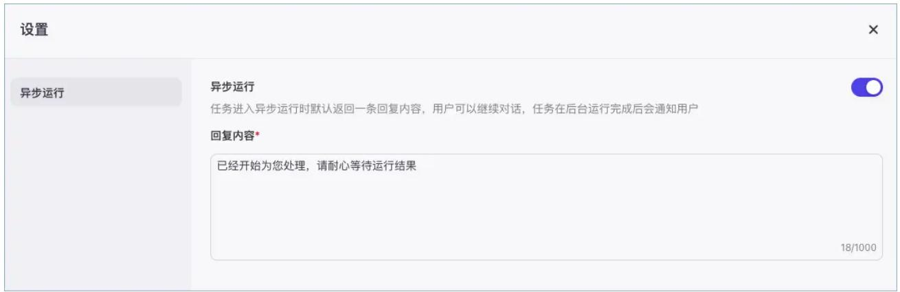

<details>
<summary>text_image</summary>

设置
异步运行
异步运行
任务进入异步运行时默认返回一条回复内容，用户可以继续对话，任务在后台运行完成后会通知用户
回复内容*
已经开始为您处理，请耐心等待运行结果
18/1000
</details>

异步运行效果：


<details>
<summary>text_image</summary>

帮我画个绘本，故事主题是两只小猫比赛爬树，四张图片，每张图片里要有简单的文字和拼音
运行完毕
已经开始为您处理，请耐心等待运行结果
✓ 4.1s | 1226 Tokens
帮我画个绘本，故事主题是两只小猫比赛爬树，四张图片，每张图片里要有简单的文字和拼音为你生成了一个故事主题是两只小猫比赛爬树的绘本：点击查看。
1387 Tokens
</details>

### 1.5 复制工作流

在某一工作流的编辑页面，单击右上角的创建副本图标，可以将该工作流复制到你的工作流列表中。

支持跨画布复制节点。

在画布中选择并复制已配置好的节点，然后切换到目标画布，直接粘贴即可。

### 1.6 删除工作流

对于不再需要使用的工作流，你可以在工作流列表内找到该工作流，并在操作列单击删除图标。

注意：如果工作流已添加至智能体，在删除时会同步删除智能体中的工作流。


<details>
<summary>text_image</summary>

工作流
参数
状态
编辑时间
操作
random_number
生成随机数
input_length
已发布
2024-01-29 20:11
删除
</details>

### 1.7 导出与导入工作流

工作流（包含对话流）支持导出为 Zip 格式的压缩包，该压缩包可灵活导入至任意工作空间来创建一个新的工作流，适用于历史版本管理或跨空间、跨账号复制工作流等场景需求。

历史版本管理：能够基于历史版本创建新的工作流，即导出某个历史版本的工作流，通过导入创建一个新的工作流。
跨空间、跨账号复制工作流：直接将导出的压缩包导入至目标账号的工作空间中，就能完成完整的工作流复制。

## 2. 工作流节点

### 2.1 开始和结束节点

开始节点用于开启触发一个工作流，而结束节点用于输出工作流的结果。

#### 2.1.1 开始节点

开始节点是工作流的起始节点，用于设定启动工作流需要的输入信息。开始节点只有输入参数，没有输出等其他参数。开始节点中默认有一个输入参数 input，表示用户在本轮对话中输入的原始内容。你也可以按需添加其他参数。

开始节点配置说明如下：

数据类型：开始节点支持配置 String、Number 等多种类型的输入参数。其中 Object 类型的参数最多支持 3层嵌套。
参数设置方式：支持直接添加参数并设置参数名称，也支持导入 JSON 数据，批量添加输入参数。

如下图所示，点击导入图标后，在展开的面板中输入 JSON 数据，然后单击同步JSON到节点就可以自动导入输入参数。

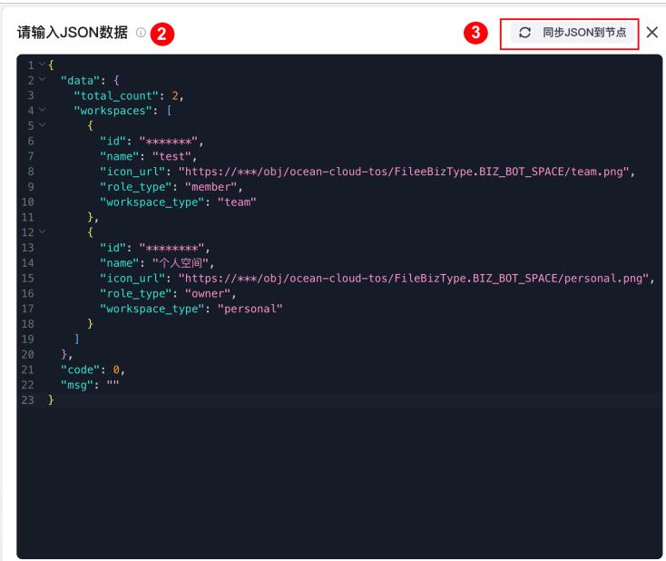

<details>
<summary>text_image</summary>

请输入JSON数据 @ 2
{
    "data": {
        "total_count": 2,
        "workspaces": [
            {
                "id": "*******",
                "name": "test",
                "icon_url": "https://***/obj/ocean-cloud-tos/FileeBizType.BIZ_BOT_SPACE/team.png",
                "role_type": "member",
                "workspace_type": "team"
            },
            {
                "id": "*******",
                "name": "个人空间",
                "icon_url": "https://***/obj/ocean-cloud-tos/FileeBizType.BIZ_BOT_SPACE/personal.png",
                "role_type": "owner",
                "workspace_type": "personal"
            }
            ]
    },
    "code": 0,
    "msg": ""
}
</details>

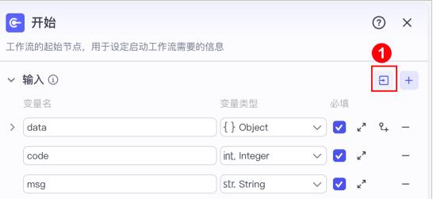

<details>
<summary>text_image</summary>

开始
工作流的起始节点，用于设定启动工作流需要的信息
输入①
变量名	变量类型	必填
> data	{ } Object	✓	✓	✓	+	-
code	int. Integer	✓	✓	✓	-	-
msg=str. String	✓	✓	✓	-	-
</details>

参数描述：参数的描述信息，帮助模型理解传入的参数含义。将工作流绑定到智能体中使用时，模型会自动分析用户的 Query，将 Query 中表达的信息填入对应的参数中。
是否必选：参数是否必选。如果未指定必选参数，无法开始执行工作流。将工作流绑定到智能体中使用时，用户 Query 中如果缺少必选参数，则不会触发工作流。

#### 2.1.2 结束节点

结束节点是工作流的最终节点，用于返回工作流运行后的结果。结束节点支持两种返回方式，即返回变量和返回文本。

### 返回变量

返回变量模式下，工作流运行结束后会以 JSON 格式输出所有返回参数，适用于工作流绑定卡片或作为子工作流的场景。如果工作流直接绑定了智能体，对话中触发了工作流时，大模型会自动总结 JSON 格式的内容，并以自然语言回复用户。返回变量支持配置 String、Number、Object 等多种类型，其中 Object 类型的参数最多支持 3 层嵌套。

### 返回文本

返回文本模式下，工作流运行结束后，智能体中的模型将直接使用指定的内容回复对话。回答内容中支持引用输出参数，也可以设置流式输出。具体说明如下：

<table><tr><td>设置</td><td>说明</td></tr><tr><td>输出变量</td><td>输出节点中输出的参数。为工作流绑定卡片时可以使用这些参数。</td></tr><tr><td>回答内容</td><td>工作流的最终输出内容,不可设置为空。支持引用输出参数,引用方式为{{变量名}}。</td></tr></table>

### 2.2 大模型节点

大模型节点是扣子提供的基础节点之一，你可以在该节点使用大语言模型处理任务。

#### 2.2.1 节点说明

大模型节点可以调用大型语言模型，根据输入参数和提示词生成回复，通常用于执行文本生成任务，例如文案制作、文本总结、文章扩写等。

大模型节点依赖大语言模型的语言理解和生成能力，可以处理复杂的自然语言处理任务，你可以根据业务场景的需求选择不同的模型，并配置提示词来定义模型的人设和回复风格。为了更精准地控制模型生成的结果，你还可以在大模型节点中设置模型的参数，从而影响模型回复的文本长度、内容的多样性等。

#### 2.2.2 配置大模型节点

### 模型

选择要使用的模型。此节点的输出内容质量很大程度上受模型能力的影响，建议根据实际业务场景选择模型。可选的模型范围取决于当前的账号类型，个人免费版或个人进阶版用户可以使用默认的几类模型，且存在对话数量限制，团队版或企业版套餐用户可以使用火山引擎方舟平台的模型。

你还可以单击配置图标，调整模型配置。模型配置的详细说明可参考设置模型。

> ## 技能

支持为大模型节点配置技能，添加插件、工作流或知识库，扩展模型能力的边界。大模型节点运行时，会根据用户提示词自动调用插件、工作流或知识库，综合各类信息输入后输出回复。

配置技能后，大模型节点的能力更接近一个独立运行的智能体，可以自动进行意图识别，并判断调用技能的时机和方式，大幅度提高此节点的文本处理能力和文本生成效果，简化工作流的节点编排。例如用户需求是某地区的穿搭推荐，通常需要先通过插件节点查询某地天气，再由模型节点根据天气情况生成穿搭推荐，现在你可以直接在大模型节点添加查询天气的插件，大模型会自动调用插件，查询天气并推荐穿搭。

### 输入

需要添加到提示词中的动态内容。系统提示词和用户提示词中支持引用输入参数，实现动态调整的效果。添加输入参数时需要设置参数名和变量值，其中变量值支持设置为固定值或引用上游节点的输出参数。

在多轮对话场景中，你还可以开启智能体对话历史。执行此节点时，扣子会将智能体与当前用户的最近多条对话记录和提示词一起传递给大模型，以供大模型参考上下文语境，生成符合当前对话场景的回复。一问一答场景下通常无需开启此功能。

### 视觉理解输入

对于支持视觉理解的模型，你可以添加图片类型的输入参数，例如在参数中直接上传图片，也可以将图片的URL 通过变量传入，并在提示词（Prompt）中引用这些变量。例如，可以通过以下方式引用图片输入参数：图片{{变量名}}中有什么？

视觉理解输入适用于图像识别、分析和文档处理等领域，能够分析和解析图像内容，识别其中的物体、场景、文字等信息，并生成相关的描述或执行特定任务。

### 系统提示词

模型的系统提示词，用于指定人设和回复风格。支持直接插入提示词库中的提示词模版、插入团队资源库下已创建的提示词，也可以自行编写提示词。编写方式可参考编写提示词。

编写系统提示词时，可以引用输入参数中的变量、已经添加到大模型节点的技能，例如插件工具、工作流、知识库，实现提示词的高效编写。例如{{variable}}表示直接引用变量，{{变量名.子变量名}}表示引用 JSON 的子变量，{{变量名[数组索引]}}表示引用数组中的某个元素。

### 用户提示词

模型的用户提示词是用户在本轮对话中的输入，用于给模型下达最新的指令或问题。用户提示词同样可以引用输入参数中的变量。

### 输出

### 输出格式

指定此节点输出的内容格式与输出的参数。输出格式支持设置为：

文本：纯文本格式。此时大模型节点只有一个输出参数，参数值为模型回复的文本内容。
Markdown：Markdown 格式。此时大模型节点只有一个输出参数，参数值为模型回复的文本内容。
JSON：标准 JSON 格式。你可以直接导入一段 JSON 样例，系统会根据样例格式自动设置输出参数的结构，也可以直接添加多个参数并设置参数类型。

参数的名称和描述有助于模型在参数中正确返回匹配的内容。当存在多个输出参数时，建议为输出参数指定有意义的名称，并设置描述信息。例如用于改写 Query 的模型节点，可以设置输出参数为 new\_query，描述是改写后的 Query，另一个参数为 reason，描述是改写原因。

### 续写

模型每次生成的内容长度受限于最大输出长度（max\_token），过长的内容会被截断，试运行时大模型节点同时提示“输出内容因超出模型最大输出长度被截断。”

大模型节点支持续写功能，在输出区域开启续写功能开关后，如果触发模型最大输出长度限制，扣子开发平台会自动通过模型的续写能力获取多次回复，直到模型输出完毕，然后将多次回复拼接成完整回复。续写功能可解决长篇文字输出、代码生成等场景中因截断导致的回复不连贯问题。

### 异常处理

默认情况下，节点运行超时、运行异常时，工作流会中断，工作流调试界面或 API 中会返回错误信息。你也可以手动设置节点运行超时等异常情况下的处理方式，例如超时时间、是否重试、是否跳转异常分支等。

<table><tr><td>异常处理设置</td><td>说明</td></tr><tr><td>超时时间</td><td>超时时间指节点运行的最大耗时,如果超过此时长,则判断为节点运行超时。默认情况下,节点的超时时间默认为180s,即3分钟。你也可以将其改为0.1s~600s,灵活控制超时时间。</td></tr><tr><td>重试次数</td><td>节点运行超时或异常时,默认不重试,你也可以设置为重试1次。开启重试后,可手动选择备选模型并设置生成随机性等模型参数,扣子会优先使用备选模型来重试任务。如果未设置备选模型,则依旧使用原模型。</td></tr><tr><td>异常处理方式</td><td>节点运行超时或异常时,默认中断工作流。你也可以手动修改此节点的异常处理方式:中断流程:工作流执行中断,不再运行后续节点。返回设定内容:发生异常后,工作流运行不会中断。开发者可自定义设置需要返回的输出字段内容,必须是输出中已定义的字段,且格式为合法的JSON格式。另外,节点还会返回输出参数isSuccess、errorBody,传递节点异常的详细信息。执行异常流程:发生异常后,工作流运行不会中断,转而执行异常流程分析,开发者需要为新增的异常分支配置处理流程。异常信息会通过节点的输出参数isSuccess、errorBody返回。</td></tr></table>

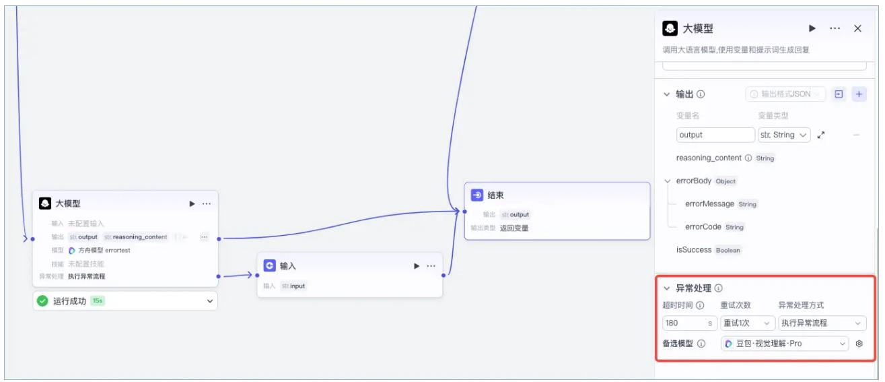

<details>
<summary>flowchart</summary>

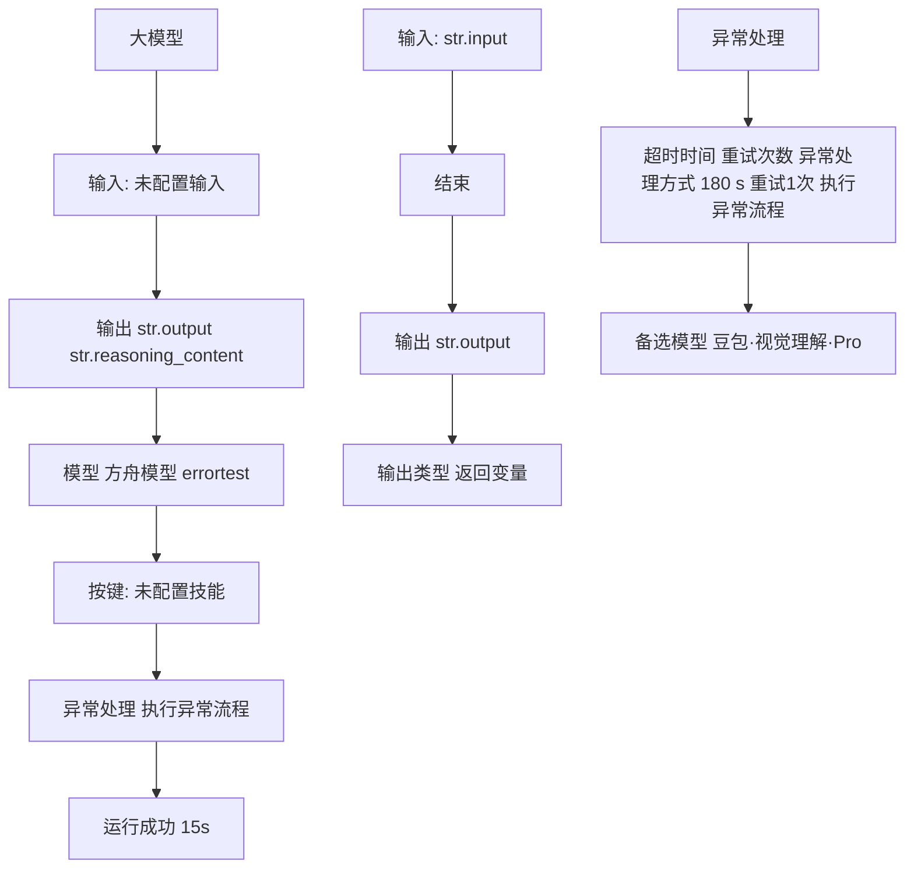
```mermaid
graph TD
  A["大模型"] --> B["输入: 未配置输入"]
  B --> C["输出 str.output str.reasoning_content"]
  C --> D["模型 方舟模型 errortest"]
  D --> E["按键: 未配置技能"]
  E --> F["异常处理 执行异常流程"]
  F --> G["运行成功 15s"]
  H["输入: str.input"] --> I["结束"]
  I --> J["输出 str.output"]
  J --> K["输出类型 返回变量"]
  L["异常处理"] --> M["超时时间 重试次数 异常处理方式 180 s 重试1次 执行异常流程"]
  M --> N["备选模型 豆包·视觉理解·Pro"]
```
</details>

### 2.3 插件节点

插件节点用于在工作流中调用插件运行指定工具。

插件是一系列工具的集合，每个工具都是一个可调用的 API。商店中的上架插件或已创建的个人或团队插件支持以节点形式被集成到工作流中，拓展智能体的能力边界。

#### 2.3.1 添加插件节点

在工作流画布下方单击添加节点，在弹出的节点面板中单击插件节点，并选择希望调用的插件。

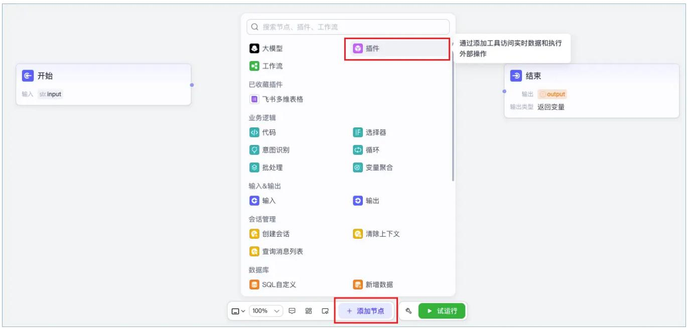

<details>
<summary>text_image</summary>

搜索节点、插件、工作流
大模型
插件
通过添加工具访问实时数据和执行外部操作
工作流
已收藏插件
飞书多维表格
业务逻辑
代码
选择器
意图识别
循环
批处理
变量聚合
输入&输出
输入
输出
会话管理
创建会话
清除上下文
查询消息列表
数据库
SQL自定义
新增数据
+ 添加节点
100% 试运行
结束
输出 output
输出类型 返回变量
</details>

你也可以在节点面板中找到已收藏的插件，选择插件工具，快速添加一个插件节点。

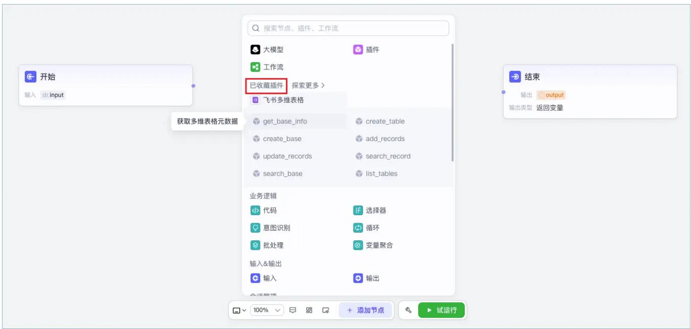

<details>
<summary>text_image</summary>

搜索节点、插件、工作流
大模型
插件
工作流
已收藏插件 探索更多 >
飞书多维表格
get_base_info create_table
create_base add_records
update_records search_record
search_base list_tables
业务逻辑
代码 选择器
意图识别 循环
批处理 变量聚合
输入&输出
输入 输出
100% 器 + 添加节点 试运行
结束
输出 output
输出类型 返回变量
</details>

#### 2.3.2 配置插件节点

### 输入与输出

插件节点的输入和输出结构取决于插件工具定义的输入输出结构，不支持自定义设置。在插件节点中你需要为必选的输入参数指定数据来源，支持设置为固定值或引用上游节点的输出参数。

插件节点运行时，会调用工具处理输入参数，并根据工具定义输出处理后的数据。你可以在输出区域右上角单击查看示例，查看输出参数的详细说明、完整的输出示例。

### 模拟集

试运行工作流时，插件节点的输出默认使用真实的输出数据，你也可以选择使用模拟集的数据。模拟集是插件的模拟输出结果，每次试运行工作流时无需调用插件，直接使用模拟集的数据作为后续节点的输入。支持自定义设置或 AI 自动生成模拟集。

### 异常处理

默认情况下，节点运行超时、运行异常时，工作流会中断，工作流调试界面或 API 中会返回错误信息。你也可以手动设置节点运行超时等异常情况下的处理方式，例如超时时间、是否重试、是否跳转异常分支等。

<table><tr><td>异常处理设置</td><td>说明</td></tr><tr><td>超时时间</td><td>超时时间指节点运行的最大耗时,如果超过此时长,则判断为节点运行超时。默认情况下,节点的超时时间默认为600s,即10分钟。你也可以将其改为0.1s~600s,灵活控制超时时间。</td></tr><tr><td>重试次数</td><td>节点运行超时或异常时,默认不重试,你也可以设置为重试1次。</td></tr><tr><td>异常处理方式</td><td>节点运行超时或异常时,默认中断工作流。你也可以手动修改此节点的异常处理方式:中断流程:工作流执行中断,不再运行后续节点。返回设定内容:发生异常后,工作流运行不会中断。开发者可自定义设置需要返回的输出字段内容,必须是输出中已定义的字段,且格式为合法的JSON格式。另外,节点还会返回输出参数isSuccess、errorBody,传递节点异常的详细信息。执行异常流程:发生异常后,工作流运行不会中断,转而执行异常流程分析,开发者需要为新增的异常分支配置处理流程。异常信息会通过节点的输出参数isSuccess、errorBody返回。</td></tr></table>

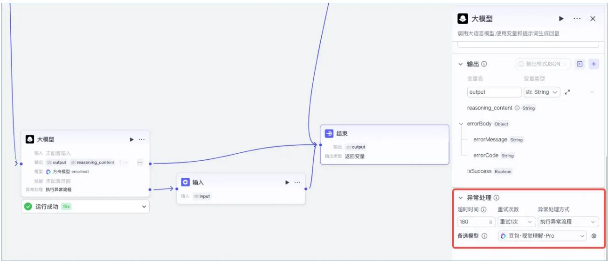

<details>
<summary>flowchart</summary>

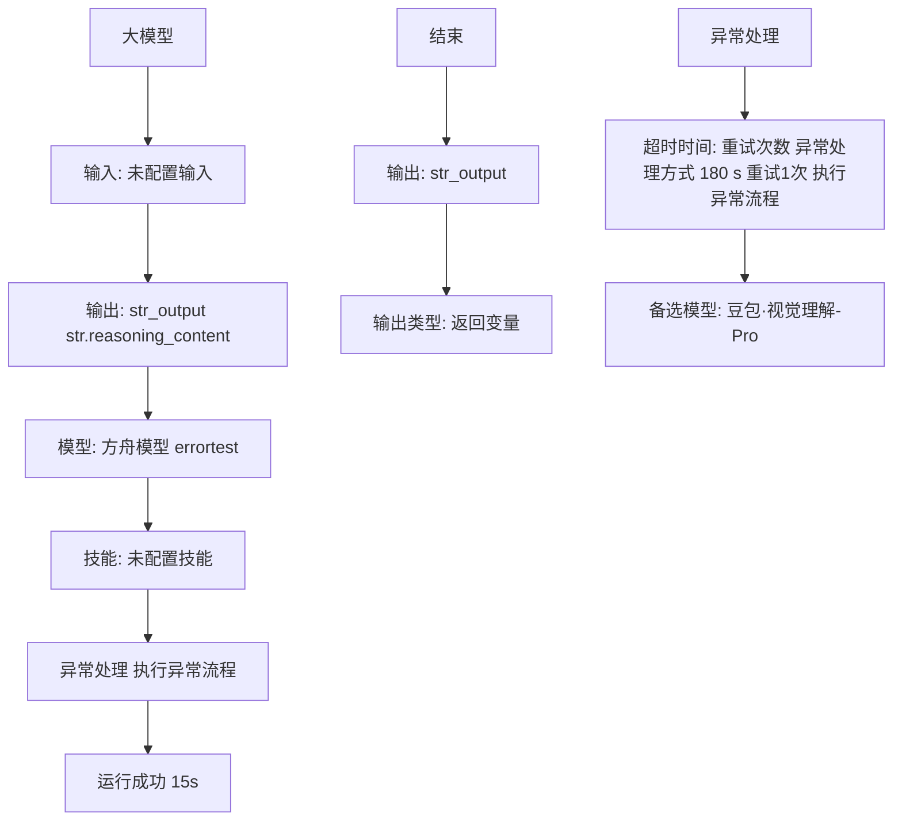
```mermaid
graph TD
  A["大模型"] --> B["输入: 未配置输入"]
  B --> C["输出: str_output str.reasoning_content"]
  C --> D["模型: 方舟模型 errortest"]
  D --> E["技能: 未配置技能"]
  E --> F["异常处理 执行异常流程"]
  F --> G["运行成功 15s"]
  H["结束"] --> I["输出: str_output"]
  I --> J["输出类型: 返回变量"]
  K["异常处理"] --> L["超时时间: 重试次数 异常处理方式 180 s 重试1次 执行异常流程"]
  L --> M["备选模型: 豆包·视觉理解-Pro"]
```
</details>

### 2.4 工作流节点

扣子提供工作流节点，实现工作流嵌套工作流的效果。

#### 2.4.1 节点说明

在一个工作流中，你可以将另一个工作流作为其中的一个步骤或节点，实现复杂任务的自动化。例如将常用的、标准化的任务处理流程封装为不同的子工作流，并在主工作流的不同分支内调用这些子工作流执行对应的操作。工作流嵌套可实现复杂任务的模块化拆分和处理，使工作流编排逻辑更加灵活、清晰、更易于管理。

说明：子工作流发布新版本之后，引用此子工作流的父工作流不会自动更新到最新版本，以免影响父工作流的线上业务正常运行。建议更新子工作流后，重新调试父工作流、手动更新子工作流版本，确认运行正常后再重新发布父工作流。

#### 2.4.2 输入与输出

工作流节点的输入和输出结构取决于子工作流定义的输入输出结构，不支持自定义设置。在工作流节点中你需要为必选的输入参数指定数据来源，支持设置为固定值或引用上游节点的输出参数。

#### 2.4.3 批处理

工作流节点默认单次运行，对于输入信息只做一次处理。你也可以设置此节点使用批处理 模式，按照配置多次运行。每次运行都会分配参数值，直到达到次数限制或者列表的最大长度。

工作流节点批处理模式通常用于批量执行一系列任务，支持同时处理多个输入，可显著提高海量数据的运行效率。例如子工作流的功能是在文生图，单次执行工作流节点只能生成一张图片，批处理模式下可以批量生成多张图片。

批处理模式下，还可以设置以下参数：

批处理次数上限：批处理运行的次数上限，默认为 100 次。
并行运行数量：批处理的并发限制，即同时处理的任务数量，设置为 1 表示串行执行所有任务。

#### 2.4.4 异常设置

工作流节点支持忽略异常功能。开启此功能后，如果试运行工作流时此节点运行失败，工作流不会中断，而是继续运行后续下游节点。如果下游节点引用了此节点的输出内容，则使用此节点预先配置的默认输出内容。

### 2.5 选择器节点

该节点是一个 if-else 节点，用于设计工作流内的分支流程。

当向该节点输入参数时，节点会判断是否符合如果区域的条件，符合则执行如果对应的工作流分支，否则执行否则对应的工作流分支。

每个分支条件支持添加多个判断条件（且/或），同时支持添加多个条件分支，可通过拖拽分支条件配置面板来设定分支条件的优先级。

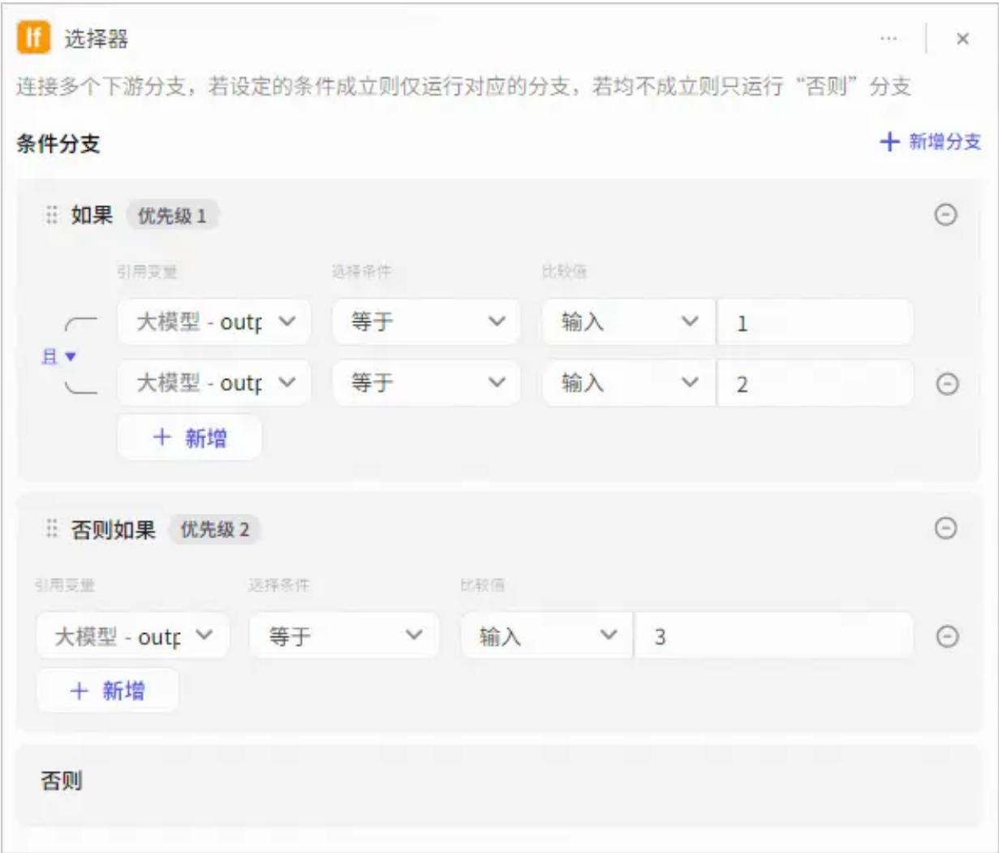

<details>
<summary>text_image</summary>

选择器
连接多个下游分支，若设定的条件成立则仅运行对应的分支，若均不成立则只运行“否则”分支
条件分支
+ 新增分支
如果 优先级 1
引用变量 选择条件 比较值
大模型 - outp 等于 输入 1
且 大模型 - outp 等于 输入 2
+ 新增
否则如果 优先级 2
引用变量 选择条件 比较值
大模型 - outp 等于 输入 3
+ 新增
否则
</details>

### 2.6 意图识别节点

意图识别节点能够让智能体识别用户输入的意图，并将不同的意图流转至工作流不同的分支处理，提高用户体验，增强智能体的落地效果。

#### 2.6.1 节点说明

意图识别（Intent Recognition）指的是让智能体理解用户通过自然语言表达的意图或目的。意图识别是智能助手的典型能力，例如用户在对话中输入“我想查看今天的 AI 新闻”，其中“查看新闻”为用户意图，也就是用户希望智能体执行的操作。扣子工作流支持意图识别节点对用户意图进行归类，无需再通过大模型节点配合选择器节点实现意图识别，使工作流运行更加高效。

意图识别节点可用于以下场景：

客户服务：识别用户问题的类型，并转交各类知识库处理，对于知识库中未匹配的问题，转交人工客服处理。
医疗咨询：对用户咨询的医学问题进行归类，非医学问题的咨询则拒绝回复。
综合类智能体：对于功能多样的智能体，可以先由意图识别节点对用户咨询进行初步分类，转交各个 Agent分支处理。

意图识别节点支持极速模式或完整模式运行。

极速模式：以较快的速度对用户意图进行分类，适用于关注工作流运行效率的场景。极速模式不支持设置系统提示词。

完整模式：意图识别效果优先，响应速度可能较长，适用于需要复杂逻辑判断的场景，例如剧情类游戏中根据情节发展切换剧情。完整模式往往需要选择意图识别能力较强的模型，并配合细致、严谨的提示词。

#### 2.6.2 极速模式

极速模式下，意图识别节点配置如下：

<table><tr><td>配置项</td><td>说明</td></tr><tr><td>模型</td><td>选择执行意图识别的大模型,支持设置模型在此节点中的生成多样性、输入及输出设置等参数配置,使模型效果更符合你的预期。</td></tr><tr><td>输入</td><td>指定需要做意图识别判断的内容。输入参数默认为 query,可引用前置节点的输出参数,或输入指定内容。该参数通常引用开始节点中的用户输入。在对话流中,意图识别节点支持开启智能体对话历史,并设置会话轮数:对话历史:开启后模型在识别意图时会参考上下文信息,进行综合判断。会话轮数:设置带入模型上下文的对话历史轮数。轮数越多,多轮对话的相关性越高,但消耗的 Token 也越多。</td></tr><tr><td>意图匹配</td><td>用户意图的分类选项,支持设置多个分类,极速模式下最多可设置 10 个意图。对于匹配到这些分类的意图,处理流程会流转到对应的后续节点,若意图未匹配到此处定义的任何分类,则流转到兜底策略。极速模式下不支持配置系统提示词,来指定模型分类的提示词,请确保你配置的各个意图名称之间应有明确的区分度,减少交叉语义,以便模型正确分类。</td></tr><tr><td>输出</td><td>节点的输出参数,可作为变量被后续节点引用。输出参数固定为:classificationId:每个意图的 ID。根据意图匹配中配置的意图,从上到下依次排序,第一个意图的 ID 为 1。若未命中已配置的任何意图,则 ID 为 0,执行其他分支。reason:分类的原因和依据,由模型自动生成。</td></tr></table>

对话流中的意图识别节点极速模式配置示例如下：

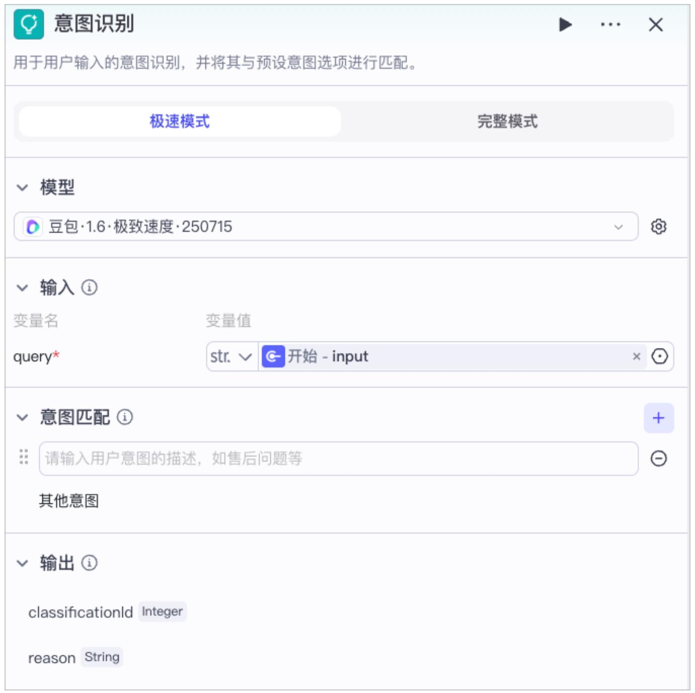

<details>
<summary>text_image</summary>

意图识别
用于用户输入的意图识别，并将其与预设意图选项进行匹配。
极速模式	完整模式
✓ 模型
豆包·1.6·极致速度·250715
✓ 输入 ⓘ
变量名	变量值
query*	str. √ 开始 - input
✓ 意图匹配 ⓘ
请输入用户意图的描述，如售后问题等
其他意图
✓ 输出 ⓘ
classificationId Integer
reason String
</details>

#### 2.6.3 完整模式

完整模式下，意图识别节点配置如下：

<table><tr><td>配置项</td><td>说明</td></tr><tr><td>模型</td><td>选择执行意图识别的大模型,支持设置模型在此节点中的生成多样性、输入及输出设置等参数配置,使模型效果更符合你的预期。</td></tr><tr><td>输入</td><td>指定需要做意图识别判断的内容。输入参数默认为 query,可引用前置节点的输出参数,或输入指定内容。该参数通常引用开始节点中的用户输入。在对话流中,意图识别节点支持开启智能体对话历史,并设置会话轮数:对话历史:开启后模型在识别意图时会参考上下文信息,进行综合判断。会话轮数:设置带入模型上下文的对话历史轮数。轮数越多,多轮对话的相关性越高,但消耗的 Token 也越多。</td></tr><tr><td>意图匹配</td><td>用户意图的分类选项,支持设置多个分类,完整模式下最多可设置 50 个意图。对于匹配到这些分类的意图,处理流程会流转到对应的后续节点,若意图未匹配到此处定义的任何分类,则流转到兜底策略。</td></tr><tr><td>系统提示词</td><td>追加的系统提示词。扣子平台已指定一系列提示词,用于指导大模型合理识别用户意图并分类,你也可以追加提示词、提供各个分类的用户输入示例,使模型分类更精准。</td></tr><tr><td>输出</td><td>节点的输出参数,可作为变量被后续节点引用。输出参数固定为:classificationId:每个意图的 ID。根据意图匹配中配置的意图,从上到下依次排序,第一个意图的 ID 为 1。若未命中已配置的任何意图,则 ID 为 0,执行其他分支。reason:分类的原因和依据,由模型自动生成。</td></tr></table>

对话流中的意图识别节点完整模式配置示例如下：

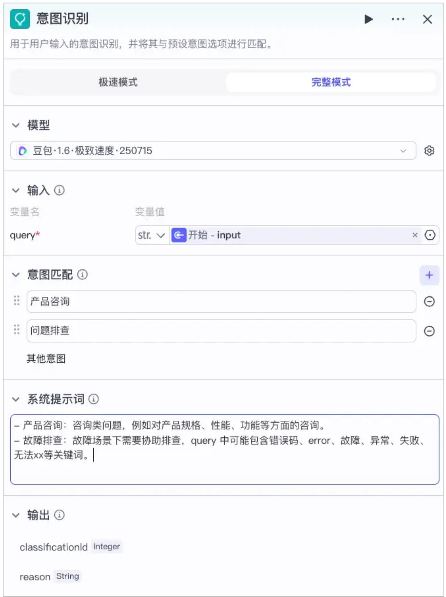

<details>
<summary>text_image</summary>

意图识别
用于用户输入的意图识别，并将其与预设意图选项进行匹配。
极速模式	完整模式
✓ 模型
豆包·1.6·极致速度·250715
✓ 输入 ⓘ
变量名	变量值
query*	str.✓ 开始 - input
✓ 意图匹配 ⓘ
... 产品咨询
... 问题排查
其他意图
✓ 系统提示词 ⓘ
- 产品咨询：咨询类问题，例如对产品规格、性能、功能等方面的咨询。
- 故障排查：故障场景下需要协助排查，query 中可能包含错误码、error、故障、异常、失败、无法xx等关键词。
✓ 输出 ⓘ
classificationId Integer
reason String
</details>

配置完成后，将意图识别节点与其他节点连接，形成完整的调用链路。

意图识别节点的每个意图分类，都需要与后续的处理节点相连接，否则意图命中次分类时无法触发后续的处理流程。例如在客服智能体中，产品咨询的分类可以流转至产品咨询知识库节点处理。

推荐为意图识别节点设置兜底策略，若意图未匹配到此处定义的任何分类，则流转到兜底策略处理。

#### 2.6.4 示例

以客户服务类型的工作流为例，通过意图识别节点对用户问题进行归类，并流转至不同知识库处理，对于非售前或售后的咨询，统一转交人工处理。

### 核心节点如下：

意图识别节点：将用户问题分为售前咨询或售后问题，每个分类提供典型示例作为分类的依据，帮助模型更精准地识别用户意图。
知识库节点：售前和售后问题分别流转到售前知识库和售后知识库处理，并直接输入给结束节点。你也可以按需在知识库节点之后增加一个大模型节点，用于处理未命中知识库的问题。
文本处理节点：意图识别的兜底策略，对于未命中任何分类的意图，统一输出一段文案，指导用户提交工单或联系人工客服。

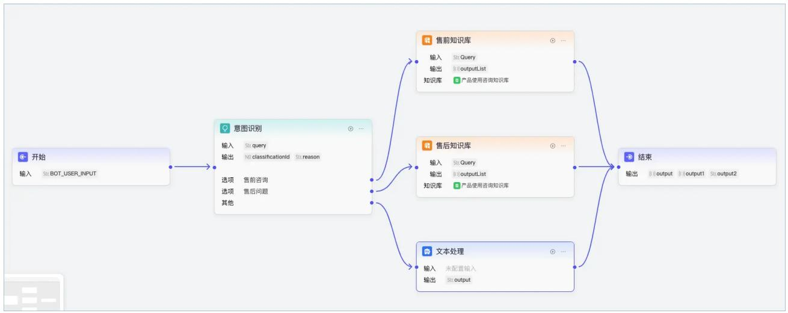

<details>
<summary>flowchart</summary>

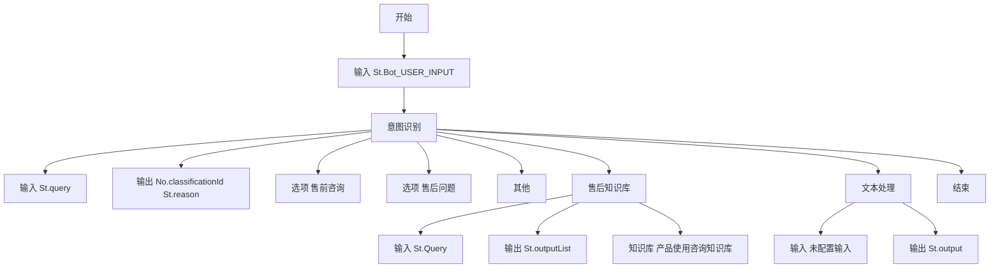
```mermaid
graph TD
  A["开始"] --> B["输入 St.Bot_USER_INPUT"]
  B --> C["意图识别"]
  C --> D["输入 St.query"]
  C --> E["输出 No.classificationId St.reason"]
  C --> F["选项 售前咨询"]
  C --> G["选项 售后问题"]
  C --> H["其他"]
  C --> I["售后知识库"]
  I --> J["输入 St.Query"]
  I --> K["输出 St.outputList"]
  I --> L["知识库 产品使用咨询知识库"]
  C --> M["文本处理"]
  M --> N["输入 未配置输入"]
  M --> O["输出 St.output"]
  C --> P["结束"]
```
</details>

### 2.7 循环节点

循环节点用于重复执行一系列任务。

#### 2.7.1 节点说明

循环是一种常见的控制机制，用于重复执行一系列任务，直到满足某个条件为止。扣子工作流提供循环节点，当需要重复执行一些操作，或循环处理一组数据时，可以使用循环节点实现。

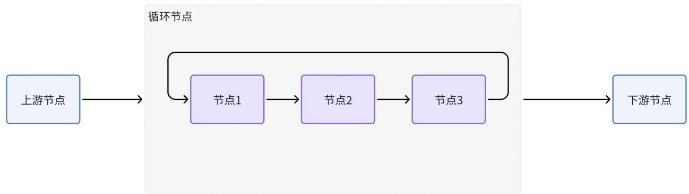

<details>
<summary>flowchart</summary>

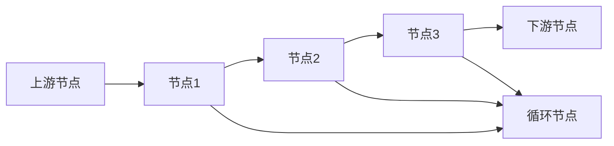
```mermaid
graph LR
  A["上游节点"] --> B["节点1"]
  B --> C["节点2"]
  C --> D["节点3"]
  D --> E["下游节点"]
  B --> F["循环节点"]
  C --> F
  D --> F
```
</details>

#### 2.7.2 循环类型

循环节点的配置方式取决于循环类型。循环类型是循环节点的运行模式，支持设置为使用数组循环、指定循环次数和无限循环。

### 使用数组循环

使用数组循环类似编程语言中的 for 语法结构。使用数组循环用于遍历一个已知的序列，对序列中的每个元素执行一系列相同的步骤。典型场景如下：

长文生成或长文总结：输入每个段落的主题，通过循环节点依次生成各个段落，将完整的文章打包输出。也可以通过输出节点实现每轮循环之后流式输出段落内容。长文总结的原理类似。
问卷调查：针对多个产品进行满意度、NPS 等问卷调查，每个产品的问卷题目相同，根据每一轮问题的用户评分算出各个产品的 NPS 得分。

在编程中，数组是一种数据结构，用于存储一系列元素。数组中的基础概念如下：

item：元素，即数组中的单个数据。数组由多个元素组成，每个元素可以是数字、字符、字符串等数据类型。
index：索引，指数组中元素的位置。索引从 0 开始计数，表示第一次循环，1 表示第二次循环，2 表示第三次循环，以此类推。最后一次循环的索引为 n-1，其中 n 为循环次数。
数组长度：数组中元素的数量。

例如，在数组 arrayOfNumbers = [10, 20, 30, 40, 50] 中：

arrayOfNumbers[0] 的 item 是 10，index 是 0。
arrayOfNumbers[1] 的 item 是 20，index 是 1。
数组长度为 5。

使用数组循环时，需要指定循环数组，此参数仅支持引用上游节点的输出，且必须为数组格式。使用数组循环模式下执行循环节点时，循环的次数取决于循环数组引用的数组长度。例如数组 [1,2,3,4,5] 的长度为 5，循环节点会循环 5 次完成遍历。如果循环数组参数引用了多个数组，则将最短的数组作为循环次数。

使用数组循环时，循环节点会遍历数组中的每个元素，每次循环都会将当前循环到的元素赋值给内置变量。内置变量仅限循环节点内部使用。目前支持的内置变量如下：

item：数组元素，即当前循环到的数组元素。
index：数组索引，index+1 为当前循环的轮次。

### 指定循环次数

指定循环次数模式通常用于批量、顺序处理数据的场景，需要同时设置循环次数。循环次数默认为 10 次，支持设置为 1\~1000 次，你也可以引用上游节点数值类型的输出参数。

循环次数参数的引用值如果大于 1000，则设置为 1000，如果小于 1，则设置为 1。

### 无限循环

无限循环类似编程语言中的 while等语法结构，需要通过终止循环节点停止循环。循环第一次运行之后，工作流对指定条件进行判断，满足一定条件时则结束循环，否则继续下一次循环。通常是基于循环节点的执行结果进行判断，例如循环调用插件获取数据，当插件执行失败时停止循环，否则持续执行循环只会得到同样的错误结果。

### 无限循环适用于以下场景：

批量处理数据：例如通过自定义插件调用 API，查看多个用户 ID 的数据，如果插件执行失败，则停止循环。
增强搜索：基于第一次检索内容询问用户，收到用户回答后，结合用户问题进行第二次检索，循环执行多次检索，直至符合用户要求。增强检索可提高检索结果的精准度、用户满意度。
回合制游戏：游戏通常包含多轮，直到满足胜利条件或游戏结束条件，否则游戏回合反复进行。

无限循环需要通过终止循环节点停止循环。终止循环节点通常和条件判断节点关联使用，条件判断节点判断某个条件成立时，流转到终止循环节点，自动跳出循环。

#### 2.7.3 设置中间变量

循环节点支持设置中间变量，此变量可作用于每一次循环。中间变量通常和循环体中的设置变量节点搭配使用，在每次循环结束后为中间变量设置一个新的值，并在下次循环中使用新值。

例如在长文生成场景中，通过中间变量将每一轮的段落总结作为变量传递到下次循环中，让大模型参考之前的段落内容和下一段的主题，生成一个上下文衔接更流畅的段落。

#### 2.7.4 设置循环体

创建循环节点后，会生成一个循环节点和对应的循环体画布。循环体画布是循环节点的内部运行机制，用于编排循环的主逻辑，每个循环迭代中，工作流会依次执行画布内的各个节点。你需要在循环节点和上下游节点之间添加连线，但无需调整循环体和循环节点之间的连线。

选中循环体时，才能向循环体中添加新节点，或拖入新节点至循环体画布。循环体中无需设置开始节点或结束节点，默认按照连接线的箭头方向依次执行各个节点。

#### 2.7.5 设置输出

循环节点的输出参数可设置为循环体的执行结果集合，表示当数组中所有元素运行完毕之后，将所有循环的运行结果打包输出给下游。也支持设置为循环变量的取值。

### 2.8 批处理节点

批处理节点用于批量执行部分操作。

#### 2.8.1 节点说明

工作流执行时，每个节点按顺序运行一次，如果需要一次性运行多次，例如一次性查询多个城市的天气，可以使用批处理节点提高工作流效率。批处理节点会批量运行除批处理和循环节点以外的任何节点，直到达到次数限制或者列表的最大长度。

批处理节点适用于大量数据并行处理的场景。相对于添加多个相同的节点执行任务，批处理节点的效率更高。例如批量生成根据故事生成绘本的场景，需要根据每个故事片段生成对应的图片，你可以使用批处理节点执行文生图的工作流，一次性生成多张图片。

#### 2.8.2 配置批处理节点

批处理节点的处理对象为输入参数引用的数组结构，例如上游某个节点输出的多条数据结果。批处理节点会遍历数组中的每个元素，对所有元素同时执行一次性处理，直到所有元素处理完成，或达到指定的次数上限。

#### 2.8.3 批处理设置

为避免并行运行数量过大导致性能风险，批处理节点是分批运行的，默认每批执行 10 次，最多运行 200 次。通过批处理设置，你可以调整每一批运行的最大次数，和多批处理的总次数上限。具体参数包括：

并行运行数量上限：每一批运行的最大次数。默认并行运行 10 次。此参数可指定为某个固定值，例如 5；也支持引用上游节点数值类型的的输出参数。

并行运行数量参数的引用值如果大于 10，则设置为 10，如果小于 1，则设置为 1。

批处理次数上限：批处理执行总次数达到此上限时，此节点终止运行。默认批处理次数上限为 100，最大支持设置为 200。此节点的执行逻辑是处理数组中的元素，当批处理次数达到设置的上限时，即使节点未遍历数组中的每个元素，也会停止运行。

例如批处理的处理对象是一个长度为 50 的数组，并行运行数量上限设置为 10，批处理次数上限为 30。那么批处理节点会执行 3 批，每一批同时运行 10 次，共计执行 30 次后结束运行。

#### 2.8.4 输入

输入参数指批处理体中要使用的参数。批处理节点通常需要批量处理数组中的所有元素，那么可以在批处理节点定义输入参数，引用前置节点 Array 类型的输出，批处理体中就可以引用批处理节点输入参数中的某个元素或索引，否则只能引用上游节点 Array 类型参数的整个数组结构。

批处理节点应最少设置一个输入参数，且只能引用上游节点的 Array 类型。

#### 2.8.5 输出

输出参数是批处理完成后输出的内容，仅支持引用批处理体中节点的输出变量，格式为数组。

#### 2.8.6 批处理体

批处理体和循环体类似，每个批处理节点都会生成一个批处理体画布。开发者需要选中批处理体，通过拖拉拽的方式将待批处理的节点添加到批处理体中，并使用连接线依次将批处理体和各个节点顺序连接起来。你还需要在批处理节点和上下游节点之间添加连线，但无需调整批处理体和批处理节点之间的连线。

#### 2.8.7 批处理和循环有什么区别

应用场景：批处理节点通常用于批量执行一组数据或任务，目的是对整个数据集进行一次性并行处理，而不是逐个处理，运行效率更高。循环节点用于循环执行某个操作或任务，直到满足指定条件为止。循环节点的核心是“次序性”，每次循环处理一个数据子项或执行一次子任务，总耗时可能较长。
运行方式：批处理节点仅支持处理数组参数，运行次数默认为数组长度，处理完毕后自动结束运行；循环节点支持多种方式结束循环，例如设置固定的循环次数、数组长度、指定条件等等。

### 2.9 变量聚合节点

工作流变量聚合节点能够将多路分支的输出变量整合为一个，方便下游节点统一配置。

#### 2.9.1 节点说明

如果工作流中设计了多个分支，那么往往需要一个节点来汇总所有分支的输出结果，作为工作流的最终输出。如果有任意一个分支未运行，汇总输出的节点会从该分支读取到一个空值，从而导致工作流运行报错。在这种场景下，你可以使用变量聚合节点聚合多路分支的输出变量，变量聚合节点会读取多路分支中第一个不为空的值，供流程下游的节点使用和操作，不用额外处理未运行分支的输出结果，简化了数据流的管理。

例如选择器或意图识别节点会将工作流拆分为多路分支，每次执行时，工作流会根据选择器条件或用户意图决定运行其中某一个分支，此时未执行的其他分支输出变量为空。你可以将多路分支都连接到变量聚合节点，并设置一个输出变量。无论哪条分支被执行，其结果都能通过这个变量被引用与访问，避免了下游节点对相同语义输出变量的重复定义。

变量聚合节点支持分组聚合，每组变量会聚合为一个输出变量，分组组内的数据类型必须相同。

#### 2.9.2 配置变量聚合节点

配置变量聚合节点时，需要选择聚合策略和聚合变量，并按需设置聚合分组。

### 聚合策略

通过指定策略对每个分组中的所有变量进行聚合处理，同一组内的变量实施相应聚合策略。

目前聚合策略仅支持设置为“返回每个分组中第一个非空的值”，你可以拖动变量、调整变量位置。例如组内按顺序设置三个变量 output1、output2 和 output3，将其聚合为一个变量 Group1，如果 output1 不为空，则用 output1 的值为 Group1 赋值；如果 output1 为空，则取 output2 的值，依次类推。

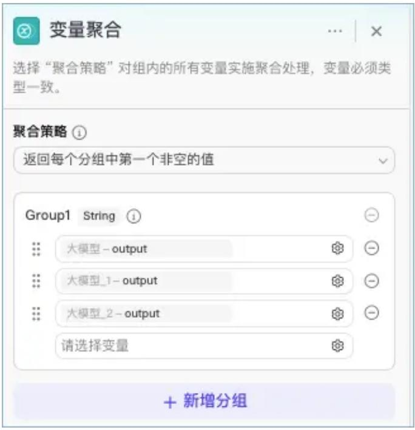

<details>
<summary>text_image</summary>

变量聚合
选择“聚合策略”对组内的所有变量实施聚合处理，变量必须类型一致。
聚合策略 ①
返回每个分组中第一个非空的值
Group1 String ①
大模型 - output
大模型_1 - output
大模型_2 - output
请选择变量
+ 新增分组
</details>


### Variable Merge

### Aggregation strategy ①

Return the first non-empty value in each group

Group1 String


LLM\_1 -output


LLM\_2-output


LLM - output


\+ Add a new group

< Output @

Group1 String

### 聚合变量

在 Group 1 中选择需要聚合的变量，分组内变量的数据类型必须相同。

变量聚合节点支持聚合多种数据类型，包括字符串（String）、数字（Integer、Number）、文件（File）对象（Object）以及数组（Array）等。
每个分组只能聚合一种数据类型的变量。例如将多个 String 类型的变量聚合为一个 String 变量、将多个Integer 类型的变量聚合为一个 Integer 变量。

### 聚合分组

默认只有一个分组 Group1，对应一个输出变量 Group1。Group1 分组中所有变量类型和输出的变量类型相同。如果需要输出多个变量，可以添加多个分组。例如每个分支都有两个输出变量 String 和 Integer，可以设置两个分组，分别用于聚合 String 和 Integer。

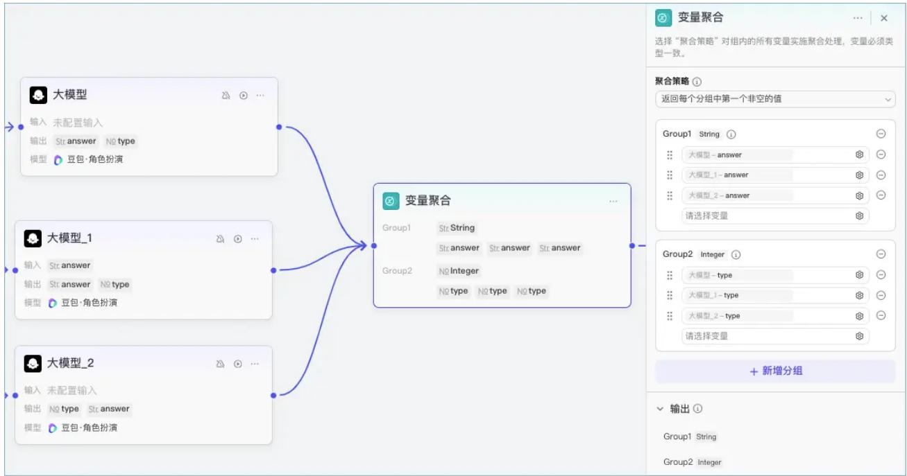

<details>
<summary>flowchart</summary>


```mermaid
graph TD
  A["大模型"] --> B["输入: 未配置输入"]
  A --> C["输出: Str.answer, No type"]
  A --> D["模型: 豆包·角色扮演"]
  E["大模型_1"] --> F["输入: Str.answer"]
  E --> G["输出: Str.answer, No type"]
  E --> H["模型: 豆包·角色扮演"]
  I["大模型_2"] --> J["输入: 未配置输入"]
  I --> K["输出: No type, Str.answer"]
  I --> L["模型: 豆包·角色扮演"]
  M["变量聚合"] --> N["Group1: Str String\nStr answer, Str answer, Str answer\nGroup2: No Integer\nNo type, No type, No type"]
  N --> O["+ 新增分组"]
  P["变量聚合"] --> Q["选择“聚合策略”对组内的所有变量实施聚合处理，变量必须类型一致。"]
  R["聚合策略①"] --> S["返回每个分组中第一个非空的值"]
  T["Group1 String ①"] --> U["大模型 - answer"]
  T --> V["大模型_1 - answer"]
  T --> W["大模型_2 - answer"]
  T --> X["请选择变量"]
  Y["Group2 Integer ①"] --> Z["大模型 - type"]
  Y --> AA["大模型_1 - type"]
  Y --> AB["大模型_2 - type"]
  Y --> AC["请选择变量"]
```
</details>

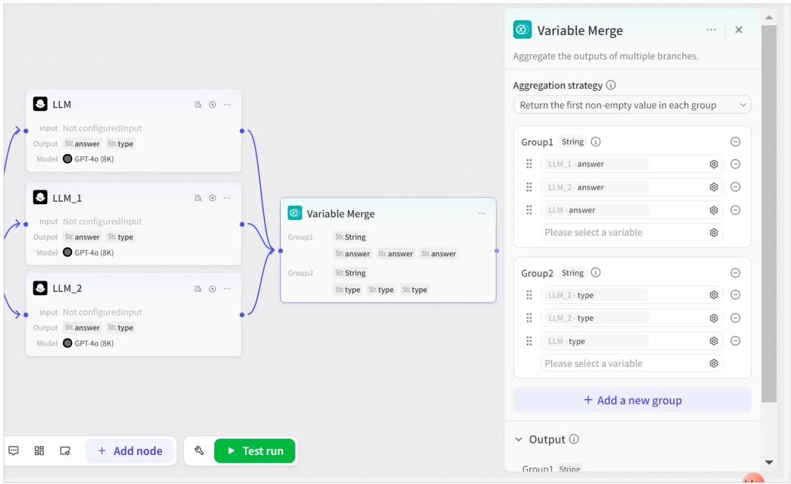

<details>
<summary>flowchart</summary>

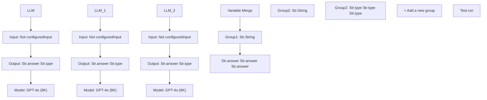
```mermaid
graph TD
  A["LLM"] --> B["Input: Not configuredInput"]
  B --> C["Output: Str.answer Str.type"]
  C --> D["Model: GPT-4o (8K)"]
  E["LLM_1"] --> F["Input: Not configuredInput"]
  F --> G["Output: Str.answer Str.type"]
  G --> H["Model: GPT-4o (8K)"]
  I["LLM_2"] --> J["Input: Not configuredInput"]
  J --> K["Output: Str.answer Str.type"]
  K --> L["Model: GPT-4o (8K)"]
  M["Variable Merge"] --> N["Group1: Str.String"]
  N --> O["Str.answer Str.answer Str.answer"]
    P["Group2: Str.String"]
    Q["Group2: Str.type Str.type Str.type"]
    R["+ Add a new group"]
    S["Test run"]
```
</details>

### 输出

变量聚合节点的输出变量固定为 Group1，是分组 Group1 聚合的返回结果，具体的值取决于聚合策略。如果有多个分组则根据分组数量递增为 Group2、Group3 等变量。输出变量的数据类型取决于对应分组聚合的变量数据类型。

#### 2.9.3 示例

在家教类 AI 应用中，通过 IF 选择器判断用户输入的问题属于哪个学科分类，并将对应的问题流转给对应的分支处理，例如数学问题流转给数学分支的大模型回答问题。三个分支均汇总到变量聚合节点，汇总为两个参数，即学科类型（type）、答案（answer），并传递到结束节点回答用户问题。

整体流程如下：
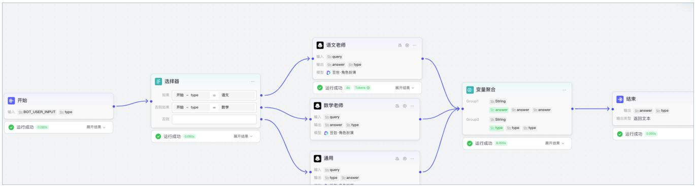

<details>
<summary>flowchart</summary>

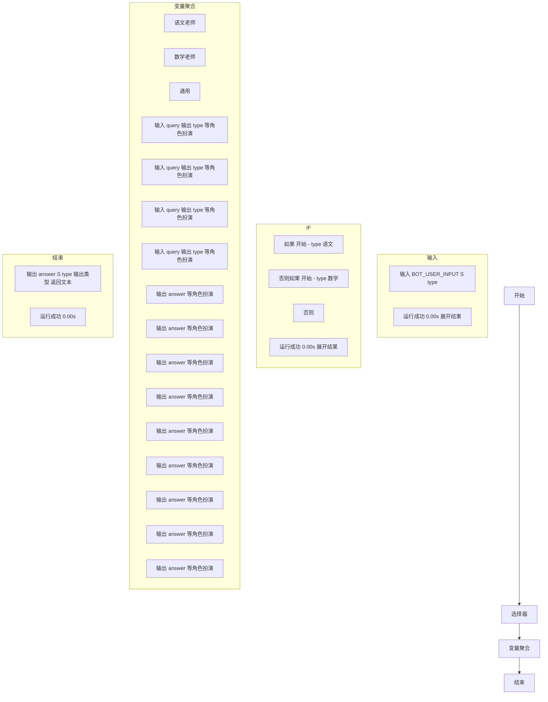
```mermaid
graph TD
  A["开始"] --> B["选择器"]
  B --> C["变量聚合"]
  C --> D["结束"]

    subgraph sg["输入"]
        E["输入 BOT_USER_INPUT S type"]
        F["运行成功 0.00s 展开结果"]
    end

    subgraph IF
        G["如果 开始 - type 语文"]
        H["否则如果 开始 - type 数学"]
        I["否则"]
        J["运行成功 0.00s 展开结果"]
    end

    subgraph sg_2["变量聚合"]
        K["语文老师"]
        L["数学老师"]
        M["通用"]
        N["输入 query 输出 type 等角色扮演"]
        O["输入 query 输出 type 等角色扮演"]
        P["输入 query 输出 type 等角色扮演"]
        Q["输入 query 输出 type 等角色扮演"]
        R["输出 answer 等角色扮演"]
        S["输出 answer 等角色扮演"]
        T["输出 answer 等角色扮演"]
        U["输出 answer 等角色扮演"]
        V["输出 answer 等角色扮演"]
        W["输出 answer 等角色扮演"]
        X["输出 answer 等角色扮演"]
        Y["输出 answer 等角色扮演"]
        Z["输出 answer 等角色扮演"]
    end

    subgraph sg_3["结束"]
        AA["输出 answer S type 输出类型 返回文本"]
        AB["运行成功 0.00s"]
    end
```
</details>

节点配置如下：

<table><tr><td>节点类型</td><td>说明</td><td>示例</td></tr><tr><td>开始节点</td><td>定义两个变量:BOT_USER_INPUT:用户输入的问题,也就是学生的问题。type:问题对应的学科。</td><td></td></tr><tr><td>选择器节点</td><td>判断用户输入的 type 属于哪个学科,将问题流转到对应分支处理。这里我们定义语文和数学两个分支,其他学科统一流转到另外一个分支。</td><td>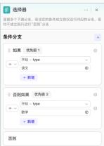</td></tr><tr><td>大模型节点</td><td>用于回答对应学科的问题,需要设置:输入:定义 query 变量,引用开始节点收集的用户问题。系统提示词:设置学科教师的人设,可以通过 AI 自动生成。用户提示词:设置为 {{query}},直接引用 query 变量即可。输出:定义两个变量:answer:模型生成的答案。type:学科类型,例如语文节点固定值为“语文”。</td><td>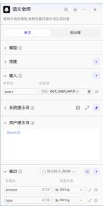</td></tr><tr><td>变量聚合节点</td><td>聚合大模型节点的两个输出变量 answer 和 type。每个分组只能聚合一个变量,所以我们需要设置两个分组。</td><td>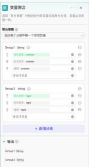</td></tr><tr><td>结束节点</td><td>选择返回文本模式,并设置输出变量和回答内容,透传大模型节点生成的答案即可。输出变量:定义两个变量 answer 和 type,分别引用变量聚合节点的输出参数 Group1 和 Group2。回答内容:透传大模型节点生成的答案即可。</td><td></td></tr></table>
