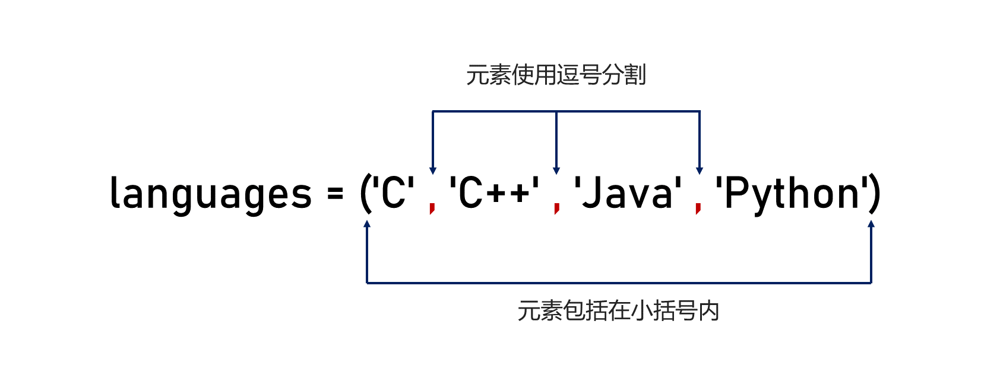
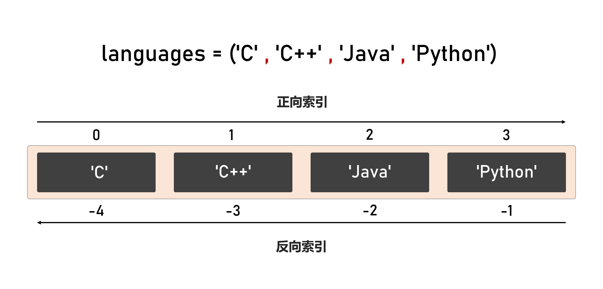
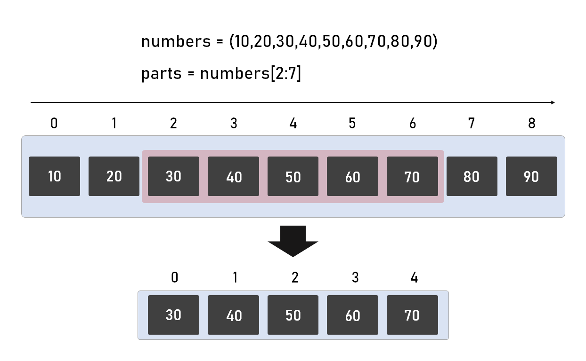
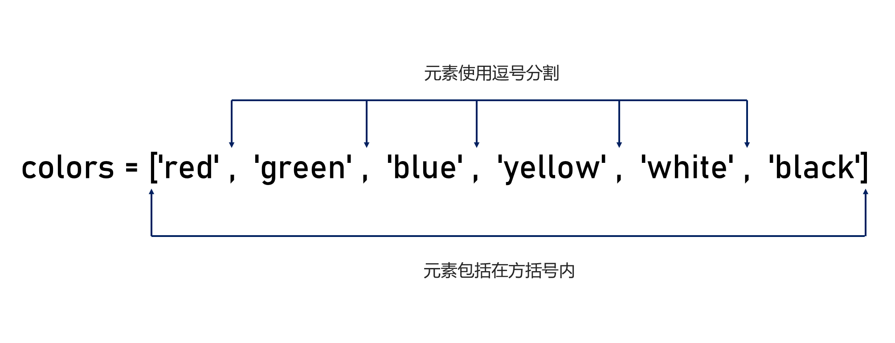
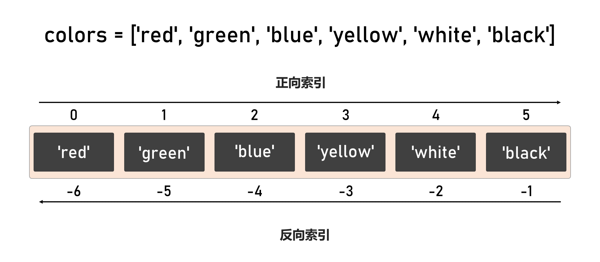
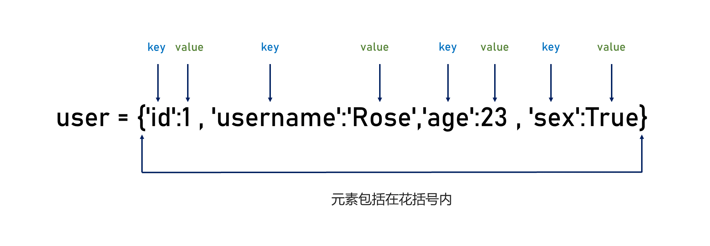

# 一、容器类型

容器类型通常指能够**包含其他对象**的数据类型（支持成员关系测试 `in`，并用于组织/访问数据）。容器中的元素可以同一类型也可以不同类型。

`Python` 常见的内置容器类型可以按抽象结构大致分为：

● 序列（`Sequence`）：`list`、`tuple`、`str`、`range`（以及 `bytes`、`bytearray` 等）

● 映射（`Mapping`）：`dict`

● 集合（`Set`）：`set`、`frozenset`

# 二、 元组

## 2.1 什么是元组？

元组（`tuple`）是 `Python` 的一种**有序、不可变**的序列类型，用于存放一组对象引用。

**● 有序**：元组中的元素按插入顺序排列，创建后顺序固定，支持通过索引（包括正索引和负索引）访问特定元素，并支持切片操作获取子序列。

**● 不可变**：元组一旦创建，其长度和各位置上的引用都不能被修改（即不可重新赋值）。需要注意的是，拼接、重复等操作会返回**新的**元组对象。

**● 元素类型不受限**：元组中的元素可以是任意 `Python` 对象，不要求类型一致。元组支持嵌套，可以包含其他元组、列表、字典等容器类型。

**● 引用语义**：元组中的每个元素实际上是一个对象的引用。因此，元组本身的不可变性是指元组中每个位置的引用（指针）是固定的，无法被替换。



## 2.2 如何创建元组？

### 2.2.1 使用圆括号创建元组

**示例代码**

```python

# 空元组
empty_tuple = ()
print(empty_tuple)  # 输出：()

# 单元素元组（注意逗号）
single_element_tuple = (42,)
print(single_element_tuple)  # 输出：(42,)

# 多元素元组（混合类型）
multi_element_tuple = (1, "hello", 3.14, True)
print(multi_element_tuple)  # 输出：(1, 'hello', 3.14, True)

```

<font color="#2DC26B">创建单个元素的元组时，必须在元素后加上一个逗号，否则 `Python` 会将其解释为普通的括号表达式，而不是元组。</font>

### 2.2.2 使用逗号创建元组

在 `Python` 中，**逗号（`,`）是创建元组的关键**，即使没有使用圆括号，多个值用逗号分隔时，`Python` 也会自动将它们识别为一个元组。

**示例代码**

```python

# 不使用括号：由“逗号”创建元组（括号只是用于分组/可读性）
tuple_without_parentheses = 1, 2, 3
print(tuple_without_parentheses)           # 输出：(1, 2, 3)
print(type(tuple_without_parentheses))     # 输出：<class 'tuple'>

```

如果是单元素元组，仍需添加逗号，否则不会被识别为元组。

**示例代码**

````python

single = 42  # 这是一个整数
print(type(single))  # 输出：<class 'int'>

single_tuple = 42,  # 这是一个元组
print(type(single_tuple))  # 输出：<class 'tuple'>

single_tuple = (42,)  # 这是一个元组（推荐写法，更清晰）
print(type(single_tuple))  # 输出：<class 'tuple'>

````

### 2.2.3 使用 `tuple()` 函数创建元组

`tuple()` 是 `Python` 提供的内置函数，它可以创建空元组或者将其他可迭代对象转换为元组。

**示例代码**

```python

# 空元组
empty_tuple = tuple() 

```

**考一考**

在 `Python` 中，以下哪种写法可以创建**空元组**？

A、`t = ()`  

B、 `t = ( )`  

C、 `t = tuple()`  

D、 `t = (1)`  

**参考答案：** A、B、C

**解析：**

● A `()`：空元组字面量。  

● B `( )`：空元组字面量（括号内空白不影响）。  

● C `tuple()`：调用构造函数创建空元组。  

● D `(1)`：只是括号改变优先级，结果是整数 `1`，不是元组；单元素元组应写为 `(1,)`。

## 2.3 访问元组元素

### 2.3.1 索引访问

索引访问也称为下标访问。



```python

partner_site_urls = (
    "http://www.jd.com",
    "http://www.taobao.com",
    "http://www.tmall.com",
)

friendly_links = (
    ("新浪", "http://www.sina.com.cn"),
    ("网易", "http://www.163.com"),
)

print(partner_site_urls[1])        # http://www.taobao.com
print(friendly_links[1][0])        # 网易


```

### 2.3.2 解包访问

元组解包（`Tuple Unpacking`）就是把一个元组（或任何可迭代对象）里的多个值，**一次性**赋给多个变量。

**1、普通解包（数量必须一致）**

普通解包要求元素个数必须和变量个数一致：

```python

user_profile = ("alice", 28, "admin")
username, age, role = user_profile
print(username, age, role)

```

如果左右数量不一致会报错：

```python

t = (1, 2, 3)
a, b = t  # ValueError: too many values to unpack

```

**2、占位符解包**

占位符解包指在序列解包时，把不需要使用的元素用一个**占位变量**接住，从而只保留关心的值。

`Python` 里最常用的占位变量名是下划线（ `_`）（约定俗成表示**这个值我不用**）。

> 严格来说 `_` 就是一个完全合法、普通的变量名，并不是“语法层面的丢弃符号”。因此它照样会被赋值、也能被读取。

**示例代码**

```python

t = (10, 20, 30)
a, _, c = t
print(a, c)  # 10 30

```

**3、扩展解包**

用 **`*变量`** 会把多出来的元素收集到一个**列表**里（注意是 `list`）。

```python

record = (10, 20, 30, 40, 50)
first_value, *middle_values, last_value = record

print(first_value)     # 10
print(middle_values)   # [20, 30, 40]
print(last_value)      # 50


```

常见写法：

**只取第一个，剩下全部**

```python

values = (1, 2, 3, 4)
first_value, *remaining_values = values

print(first_value)        # 1
print(remaining_values)   # [2, 3, 4]

```

**只取最后一个，其它都要**

```python

values = (1, 2, 3, 4)
*prefix_values, last_value = values

print(prefix_values)  # [1, 2, 3]
print(last_value)     # 4

```

**4、占位符解包**

```python

t = (10, 20, 30, 40, 50)
first, *_, last = t
print(first, last)  # 10 50

```

**规则：带 `*` 的变量最多只能出现一次，否则语法错误。**

**5、嵌套解包（元组里还有元组）**

```python

t = (1, (2, 3))
a, (b, c) = t
print(a, b, c)  # 1 2 3

```

### 2.3.3 切片访问

切片（`slicing`）用于对序列（如 `list`、`tuple` 等）按 `[start, stop)` 区间并结合 `step` 提取元素，并且返回新的序列对象。

**语法结构**

```python

sequence[start:stop:step]

```

其中：

● `start`：起始索引（**包含**）。省略时：若 `step > 0`，默认从序列开头开始；若 `step < 0`，默认从序列末尾开始。

● `stop`：结束边界（**不包含**）。省略时：若 `step > 0`，默认到序列末尾结束；若 `step < 0`，默认到序列开头之前结束。

● `step`：步长，默认为 `1`；**不能为 `0`**。



**示例代码**

```python

t = (0, 1, 2, 3, 4, 5, 6, 7, 8, 9)

# 1) 省略 start（从头开始，step 默认为 1）
print(t[:4])          # (0, 1, 2, 3)

# 2) 省略 stop（到末尾结束，也就是默认到len()结束，step 默认为 1）
print(t[6:])          # (6, 7, 8, 9)

# 3) 省略 step（默认 step=1）
print(t[2:7])         # (2, 3, 4, 5, 6)

# 4) 省略 start 和 stop 以及 step（相当于复制整个元组；返回新元组对象）
print(t[:])           # (0, 1, 2, 3, 4, 5, 6, 7, 8, 9)

# 5) 使用正向索引 + 显式步长
print(t[1:9:2])       # (1, 3, 5, 7)

# 6) 使用负索引（反向/负索引定位）+ step 省略
print(t[-5:-2])       # (5, 6, 7)   # -5 指向元素 5，-2 指向元素 8（不包含 8）

# 7) 负步长 + 负索引（从倒数第 2 个到倒数第 6 个，反向取）
print(t[-2:-7:-1])    # (8, 7, 6, 5, 4)

```

**考一考：**

在`Python`中如何将下列元组中的所有元素进行反转？

```python

users = ('Tom','Rose','Frank','Ben','Daivd')

```

参考答案

```python

users = ('Tom', 'Rose', 'Frank', 'Ben', 'Daivd')

reversed_users = users[::-1]
print(reversed_users)  # ('Daivd', 'Ben', 'Frank', 'Rose', 'Tom')

```

### 2.3.4 循环访问

**示例代码**

```python

t = (10, 20, 30, 40)

for x in t:
    print(x)

```

```python

users = ('Tom','Rose','Frank','David','Ben','Tedu')
i = 0
for item in users:
    print(f'索引值:{i},值:{item}')
    i += 1

```

```python

users = ('Tom','Rose','Frank','David','Ben','Tedu')

for key,item in enumerate(users):
    print(key,item)
    
```

`enumerate(iterable, start=0)` 用于在遍历可迭代对象时，生成**索引元素值**对。

它返回一个枚举对象（迭代器），迭代时每次产出一个二元组 `(index, value)`，从而在循环中可同时获取索引和值，避免手动维护计数器。

## 2.4 元组函数

### 2.4.1 `len()`

**`len()`** 用于返回元组中元素的个数（长度）。  

**语法结构**

```python

len(object,/)

```

**示例代码**

```python

t = (10, 20, 30, 40)
print(len(t))  # 4

empty = ()
print(len(empty))  # 0

```

### 2.4.2 `max`

`max()` 用于返回列表中的最大元素（按元素的比较规则决定）。

**语法结构**

```python

max(iterable, /, *, key=None)
max(iterable, /, *, default, key=None)
max(arg1, arg2, /, *args, key=None)

```

**示例代码**

```python

t = (3, 9, 2, 8)
print(max(t))  # 9

```

> 注意：元组为空时会报错

```python

# print(max(()))  # ValueError: max() arg is an empty sequence

```

### 2.4.3 `min`

`min()` 用于返回列表中的最小元素（按元素的比较规则决定）。

**语法结构**

```python

min(iterable, /, *, key=None)
min(iterable, /, *, default, key=None)
min(arg1, arg2, /, *args, key=None)

```

**示例代码**

```python

t = (3, 9, 2, 8)
print(min(t))  # 2

```


## 2.6 元组的不可变性

元组的不可变性：元组创建后，**不能修改元组自身的元素序列**（不能对某个下标或切片重新赋值，也不能就地增删元素）。

**示例代码**

````python

#尝试通过下标赋值
t = (10, 20, 30)
t[0] = 99  # TypeError

````

```python

#尝试增删元素
t = (1, 2, 3)

t.append(4)     # AttributeError：tuple 没有 append 方法
del t[0]        # TypeError：不支持删除元素
t[0:1] = (9,)   # TypeError：不支持切片赋值


````

# 三、列表

## 3.1 什么是列表？

列表（`list`）是 `Python` 内置的一种**有序、可变**序列，用于存放一组元素。

**● 有序**：元素按插入顺序排列（指位置有顺序，并非自动排序），可通过索引访问，并可用切片获取子序列（切片通常返回新列表，为浅拷贝）。

**● 可变**：创建后可以原地修改元素，也可以插入/删除元素，长度可变（受内存等因素限制）。

**● 元素类型不受限**：列表可包含任意 `Python` 对象，允许混合类型，也可嵌套其他列表等结构。

**● 引用语义**：列表存放的是对象引用；当元素是可变对象时，修改该对象会反映到列表中（浅拷贝场景尤其需要注意）。



## 3.2 如何创建列表？

### 3.2.1 使用方法号创建列表

**示例代码**

```python

scores = []
print(scores)  # []

todo = ["写作业", "背单词", "运动"]
print(todo)    # ['写作业', '背单词', '运动']

```

### 3.2.2 使用 `list()`函数创建列表

`list()` 是 `Python` 提供的内置函数，它可以创建空列表或者将其他可迭代对象转换为列表。

**示例代码**

```python

items = list()
print(items)  # []

```

## 3.3 访问列表元素

### 3.3.1 索引访问



**示例代码**

```python

lst = [0, 1, 2, 3, 4, 5, 6, 7, 8, 9]

# 1) 省略 start（从头开始，step 默认为 1）
print(lst[:4])          # [0, 1, 2, 3]

# 2) 省略 stop（到末尾结束，step 默认为 1）
print(lst[6:])          # [6, 7, 8, 9]

# 3) 省略 step（默认 step=1）
print(lst[2:7])         # [2, 3, 4, 5, 6]

# 4) 省略 start 和 stop（相当于复制整个列表；返回新列表对象）
print(lst[:])           # [0, 1, 2, 3, 4, 5, 6, 7, 8, 9]

# 5) 使用正向索引 + 显式步长
print(lst[1:9:2])       # [1, 3, 5, 7]

# 6) 使用负索引（反向/负索引定位）+ step 省略
print(lst[-5:-2])       # [5, 6, 7]   # -5 指向 5，-2 指向 8（不包含 8）

# 7) 负步长（反向切片）：省略 start 和 stop
print(lst[::-1])        # [9, 8, 7, 6, 5, 4, 3, 2, 1, 0]

# 8) 负步长 + 负索引（从倒数第 2 个到倒数第 6 个，反向取）
print(lst[-2:-7:-1])    # [8, 7, 6, 5, 4]

```

### 3.3.2 解包访问

**1、普通解包（数量必须一致）**

普通解包要求元素个数必须和变量个数一致。

**示例代码**

```python

point = [3, 5]
x, y = point
print(x, y)  # 3 5

```

**2、占位符解包**

占位符解包指在序列解包时，把不需要使用的元素用一个**占位变量**接住，从而只保留关心的值。

`Python` 里最常用的占位变量名是下划线（ `_`）（约定俗成表示**这个值我不用**）。

**示例代码**

```python

t = [10, 20, 30]
a, _, c = t
print(a, c)  # 10 30

```

**3、扩展解包**

用 **`*变量`** 会把多出来的元素收集到一个**列表**里（注意是 `list`）。

**示例代码**

```python

record = [10, 20, 30, 40, 50]
first_value, *middle_values, last_value = record

print(first_value)     # 10
print(middle_values)   # [20, 30, 40]
print(last_value)      # 50

```

常见写法：

**只取第一个，剩下全部：**

```python

values = [1, 2, 3, 4]
first_value, *remaining_values = values

print(first_value)        # 1
print(remaining_values)   # [2, 3, 4]

```

**只取最后一个，其它都要：**

```python

values = [1, 2, 3, 4]
*prefix_values, last_value = values

print(prefix_values)  # [1, 2, 3]
print(last_value)     # 4


```

**4、占位符解包**

```python

t = [10, 20, 30, 40, 50]
first, *_, last = t
print(first, last)  # 10 50

```

**规则：带 `*` 的变量最多只能出现一次，否则语法错误。**

**5、嵌套解包（列表里还有列表）**

```python

t = [1, [2, 3]]
a, [b, c] = t
print(a, b, c)  # 1 2 3

```

### 3.3.3 切片访问


### 3.3.4 循环访问

**示例代码**

```python

users = ['Tom','John','Rose','Frank']

for item in users:
    print(item)

```

```python

users = ['Tom','Rose','Frank','David','Ben','Tedu']
for index,item in enumerate(users):
    print(index,item)
    
```

```python

# 列表里放多个“用户信息元组”(ID, 用户名, 年龄)
users = [
    (1001, "alice", 23),
    (1002, "bob", 19),
    (1003, "cindy", 28),
    (1004, "david", 17),
    (1005, "eric", 35),
    (1006, "fiona", 22),
    (1007, "george", 30),
]

# 遍历：解包元组，同时用 enumerate 得到序号
for idx, (user_id, username, age) in enumerate(users, start=1):
    print(f"{idx}. ID={user_id}, 用户名={username}, 年龄={age}")

```

## 3.4 函数

### 3.4.1 `len()`

`len()` 用于返回列表中元素的个数（长度）。

**语法结构**

```python

len(object,/)

```

**说明**

仅统计顶层元素个数，不会“展开”嵌套列表 。

### 3.4.2 `max()`

`max()` 用于返回列表中的最大元素（按元素的比较规则决定）。

**语法结构**

```python

max(iterable, /, *, key=None)
max(iterable, /, *, default, key=None)
max(arg1, arg2, /, *args, key=None)

```

### 3.4.3 `min()`

`min()` 用于返回列表中的最小元素（按元素的比较规则决定）。

**语法结构**

```python

min(iterable, /, *, key=None)
min(iterable, /, *, default, key=None)
min(arg1, arg2, /, *args, key=None)

```

**示例代码**

```python

# 学生成绩列表
scores = [88, 92, 76, 60, 100, 85]

# 1) len(): 元素个数
print("成绩条数：", len(scores))

# 2) max(): 最大值
print("最高分：", max(scores))

# 3) min(): 最小值
print("最低分：", min(scores))

empty = []
print("空列表长度：", len(empty))

# 下两行如果取消注释会报错：ValueError
#print(max(empty))
#print(min(empty))

# 额外：元素不可比较会报错（例如 int 和 str 混在一起）
mix = [90, "A", 80]
# 下行如果取消注释会报错：TypeError
# print(max(mix))

```

## 3.5 列表方法

### 3.5.1 `count()`

**`count`()** 方法用于统计某个元素在列表中出现的次数。 

**语法结构**

```python

list.count(value, /)

```

**示例代码**

````python

nums = [1, 2, 2, 3, 2, 4]
print(nums.count(2))  # 3
print(nums.count(9))  # 0

````

### 3.5.2 `index()`

**`index`()** 方法用于查找某个元素在列表中**第一次出现**的索引位置。

 **语法结构**

```python

list.index(value[, start[, stop]])

```

**示例代码**

```python

todo = ["写作业", "背单词", "运动", "背单词"]

print(todo.index("背单词"))        # 1
print(todo.index("背单词", 2))     # 3  （从索引2开始找）

# 若元素不存在会抛出 ValueError
# print(todo.index("吃饭"))        # ValueError

```

### 3.5.3 `append()`

**`append()`** 方法用于在列表**末尾追加一个元素**（作为一个整体追加）。

 **语法结构**：

```python

list.append(value,/)

```

**示例代码**

```python

scores = [90, 95]
scores.append(100)
print(scores)  # [90, 95, 100]

```

### 3.5.4 `extend()`

**`extend()`** 方法用于把一个可迭代对象中的元素**逐个追加**到列表末尾。

**语法结构**

```python

list.extend(iterable,/)

```

**示例代码**

```python

a = [1, 2]
a.extend([3, 4])
print(a)  # [1, 2, 3, 4]

# 对比 append：append 会把整个列表当作一个元素追加
b = [1, 2]
b.append([3, 4])
print(b)  # [1, 2, [3, 4]]
```

### 3.5.5 `insert()`

**`insert()`** 方法用于在指定索引位置插入一个元素。

 **语法结构**

```python

list.insert(index, value,/)

```

**示例代码**

```python

names = ["张三", "王五"]
names.insert(1, "李四")
print(names)  # ['张三', '李四', '王五']

```

### 3.5.6 `pop()`

**`pop()`** 方法用于删除并返回指定位置的元素；省略索引则默认删除并返回最后一个元素。

 **语法结构**

```python

list.pop(index=-1,/)

```

**示例代码**

```python

nums = [10, 20, 30, 40]

x = nums.pop()      # 弹出最后一个
print(x)            # 40
print(nums)         # [10, 20, 30]

y = nums.pop(1)     # 弹出索引1处元素
print(y)            # 20
print(nums)         # [10, 30]

```

### 3.5.7 `remove()`

**`remove()`** 方法用于删除列表中**第一个**匹配到的指定元素。

 **语法结构**

```python

list.remove(value,/)

```

**示例代码**

```python

nums = [1, 2, 2, 3]
nums.remove(2)      # 只删第一个 2
print(nums)         # [1, 2, 3]

# 若元素不存在会抛出 ValueError
# nums.remove(9)    # ValueError

```

### 3.5.8 `reverse()`

**`reverse()`** 方法用于将列表元素**原地反转**（直接修改原列表）。

**语法结构**

```python

list.reverse()

```

**示例代码：**

```python

chars = ["a", "b", "c"]
chars.reverse()
print(chars)  # ['c', 'b', 'a']

```

### 3.5.9 `clear()`

**`clear()`** 方法用于清空列表中的所有元素。

**语法结构**

```python

list.clear()

```

**示例代码**

```python

items = [1, 2, 3]
items.clear()
print(items)  # []

```

### 3.5.10 `copy()`

**`copy()`** 方法用于创建列表的**浅拷贝**（只复制外层列表）。

 **语法结构**

```python

list.copy()

```

**示例代码**

```python

a = [1, 2, 3]
b = a.copy()

b.append(99)
print(a)  # [1, 2, 3]
print(b)  # [1, 2, 3, 99]

# 浅拷贝说明：内部可变对象仍共享引用
x = [[1, 2], [3, 4]]
y = x.copy()
y[0].append(99)
print(x)  # [[1, 2, 99], [3, 4]]
print(y)  # [[1, 2, 99], [3, 4]]

```

## 3.6 列表实现堆栈

## 3.7 列表实现队列

# 四、字典

## 4.1 什么是字典？

字典（`dict`）是 `Python` 的内置**可变的、映射类型**（`mutable mapping`），用于存储键值对（`key-value pairs`），并通过键来访问对应的值。

**键**：必须是可哈希（`hashable`）的对象（通常为不可变类型，如 `int`、`str`、`tuple` 等），且在字典中应当是唯一的；对同一键重复赋值会覆盖旧值。

**值**：可以是任意类型对象。




## 4.2 如何创建字典？

### 4.2.1 通过花括号创建字典

```python

d1 = {}
d2 = {"name": "Alice", "age": 18}

```

### 4.2.2 通过`dict()`函数创建字典

`dict()` 是 `Python` 提供的内置函数，它可以创建空字典或者将其他可迭代对象转换为字典。

```python

d1 = dict()
print(d1)

```

## 4.3 访问字典成员

### 4.3.1 通过键实现

```python

d = {"name": "Alice", "age": 18}

print(d["name"])   # Alice

# print(d["gender"])  # KeyError

```

### 4.3.2 通过`get()`方法实现

```python

d = {"name": "Alice", "age": 18}
print(d.get("age"))              # 18
print(d.get("gender"))           # None
print(d.get("gender", "未知"))   # 未知

```

## 4.4 字典方法

### 4.4.1 `get()`

`get()`方法用于按键获取值；若键不存在则返回默认值（不抛异常）。

**语法结构**

```python

dict.get(key,default=None,/)

```

**示例代码**

```python

d = {"name": "Alice", "age": 18}

print(d.get("name"))                 # Alice
print(d.get("gender"))               # None（键不存在）
print(d.get("gender", "unknown"))    # unknown（自定义默认值）

```

### 4.4.2 `items()`

`items()` 方法返回字典键值对的视图对象（`dict_items`），它是一个可迭代的动态视图：其内容会随原字典的更改而变化。

迭代该视图时产生形如 `(key, value)` 的二元组，常用于遍历。

**语法结构**

```python

dict.items()

```

**示例代码**

```python

d = {"name": "Alice", "age": 18}

print(d.items(), type(d.items()))
# dict_items([('name', 'Alice'), ('age', 18)]) <class 'dict_items'>

# 遍历 items：每次迭代得到 (key, value) 元组，可直接解包
for k, v in d.items():
    print(f"{k} -> {v}")

```

### 4.4.3 `keys()`

`keys()` 方法返回字典键的视图对象（`dict_keys`），它是一个动态视图：其内容会随原字典键的增删而变化，可用于遍历。

**语法结构**

```python

dict.keys()

```

**示例代码**

```python

d = {"name": "Alice", "age": 18}
keys_view = d.keys()  # dict_keys（动态视图）

print("初始 keys_view:", list(keys_view))  # ['name', 'age']

# 修改“值”不会影响 keys（键没变）
d["age"] = 19
print("改值后 keys_view:", list(keys_view))  # ['name', 'age']

# 新增键会立刻反映到视图里
d["city"] = "Shanghai"
print("新增键后 keys_view:", list(keys_view))  # ['name', 'age', 'city']

# 删除键也会立刻反映到视图里
del d["name"]
print("删除键后 keys_view:", list(keys_view))  # ['age', 'city']

print("keys_view 类型:", type(keys_view))  # <class 'dict_keys'>

```

### 4.4.4 `values()`

`values()` 方法返回字典值的**视图对象**（`dict_values`），它是一个动态视图：会随原字典的键值对增删或值的修改而变化，可用于遍历。

**语法结构**

```python

dict.values()

```

**示例代码**

```python

d = {"name": "Alice", "age": 18}
values_view = d.values()  # dict_values（动态视图）

print("初始:", list(values_view))  # ['Alice', 18]

# 修改值：会反映到视图
d["age"] = 19
print("改值后:", list(values_view))  # ['Alice', 19]

# 新增键值对：会反映到视图
d["city"] = "Shanghai"
print("新增后:", list(values_view))  # ['Alice', 19, 'Shanghai']

# 删除键值对：会反映到视图
del d["name"]
print("删除后:", list(values_view))  # [19, 'Shanghai']

print("values_view 类型:", type(values_view))  # <class 'dict_values'>

    
```

### 4.4.5 `pop()`

`pop()`方法用于删除指定键并返回其值；若键不存在：提供了 `default`：返回 `default`；未提供 `default`：抛 `KeyError`。

**语法结构**

```python

dict.pop(key,/)

dict.pop(key,default,/)

```

**示例代码**

```python

d = {"a": 1, "b": 2}

# 1) 键存在：删除并返回对应值
x = d.pop("a")
print(x)  # 1
print(d)  # {'b': 2}

# 2) 键不存在 + 提供 default：返回 default，字典不变
y = d.pop("not_exists", 0)
print(y)  # 0
print(d)  # {'b': 2}

# 3) 键不存在 + 未提供 default：抛 KeyError
try:
    d.pop("not_exists")
except KeyError as e:
    print("KeyError:", e)


```

### 4.4.6 `popitem()`

`popitem()` 方法用于从字典中移除并返回一个 `(key, value)` 键值对。   若字典为空，调用会抛出 `KeyError`。 

**语法结构**

```python

dict.popitem()

```

**示例代码**

```python

d = {"a": 1, "b": 2, "c": 3}

k, v = d.popitem()
print(k, v)  # c 3
print(d)     # {'a': 1, 'b': 2}

# empty = {}
# empty.popitem()  # KeyError

```

### 4.4.7 `clear()`

`clear()`方法用于清空字典（就地删除所有键值对）。

**语法结构**

```python

dict.clear()

```

**示例代码**

```python

d = {"a": 1, "b": 2}
d.clear()
print(d)  # {}

```

### 4.4.8 `setdefault()`

`setdefault()` 用于取值时顺便保证这个键存在：  

`-` 若 `key` 存在：返回对应值  。

`-` `key` 不存在：插入 `key: default`（未提供则为 `None`），并返回该值。

**语法结构**

```python

dict.setdefault(key,default=None,/)

```

**示例代码**

```python

d = {"name": "Alice"}

# 1) key 已存在：直接返回原值，不会覆盖
v1 = d.setdefault("name", "Bob")
print(v1)  # Alice
print(d)   # {'name': 'Alice'}

# 2) key 不存在：插入 key: default，并返回 default
v2 = d.setdefault("age", 18)
print(v2)  # 18
print(d)   # {'name': 'Alice', 'age': 18}

# 3) key 不存在且不提供 default：插入 key: None，并返回 None
v3 = d.setdefault("city")
print(v3)  # None
print(d)   # {'name': 'Alice', 'age': 18, 'city': None}

```

### 4.4.9 `update()`

`update()` 用给定的映射对象或键值对序列（以及可选的关键字参数）将数据**并入**字典：对每个键执行赋值 `d[k] = v`，因此**键已存在会被覆盖**，不存在则新增。

**语法结构**

```python

dict.update(**kwargs)

dict.update(mapping,/)

dict.update(iterable,/)

```

```python

d = {"a": 1, "b": 2}

# 1) dict.update(mapping)：用另一个映射更新（同键会覆盖）
d.update({"b": 20, "c": 3})
print(d)  # {'a': 1, 'b': 20, 'c': 3}

# 2) dict.update(iterable)：用(key, value)序列更新
d.update([("c", 30), ("d", 4)])
print(d)  # {'a': 1, 'b': 20, 'c': 30, 'd': 4}

# 3) dict.update(**kwargs)：用关键字参数更新（键必须是合法标识符）
d.update(e=5, f=6)
print(d)  # {'a': 1, 'b': 20, 'c': 30, 'd': 4, 'e': 5, 'f': 6}

```

# 五、集合

## 5.1 什么是集合？

集合（`set`）是由**不重复**（按相等性去重）且**可哈希**的元素组成的**无序**容器类型；不支持下标索引访问，迭代顺序属于实现细节，**不应依赖**。

常见可哈希（`hashable`）类型（可作为 `set` 元素 / `dict` 键）包括：

**● 数值类型**：`int`、`float`、`bool`  

**● 字符串**：`str`

**● 字节串**：`bytes`

**● 空值**：`None`（类型为 `NoneType`）

**● 元组**：`tuple`  （前提：元组内部元素也都必须可哈希（如 `(1, "a")` 可以，`([1,2], 3)` 不可以））

**● 不可变集合**：`frozenset`  （前提：内部元素也都必须可哈希）

## 5.2 如何创建集合？

### 5.2.1 通过花括号创建集合

**示例代码**

```python

s1 = {1, 2, 3}
s2 = {"a", "b", "c"}
s3 = {} #注意，这是字典

print(type(s1),type(s2),type(s3))

```

注意：`{}` 表示**空字典**，不是空集合。

### 5.2.2 通过`set()` 函数创建集合

`set()`函数用于创建空集合或者将其它可迭代对象转换为集合。

**语法结构**

```python

set()

```

**示例代码**

```python

s1 = set()

```

集合（`set` / `frozenset`）**不支持下标访问**（没有“第几个元素”），访问成员通常指两件事：**判断是否存在**、以及**遍历取出元素**。

**1、判断成员是否在集合中（最常用）**

使用 `in` / `not in`：

```python

s = {1, 2, 3}

print(2 in s)      # True
print(9 not in s)  # True

```

**2、遍历访问集合里的每个元素**

```python

s = {"a", "b", "c"}

for x in s:
    print(x)  # 顺序不保证

```

## 5.3 集合方法

### 5.3.1 `add()`

`add()` 方法用于向集合中**添加一个元素**（就地修改集合）。如果元素已存在，则集合不变。

**语法结构**

```python

set.add(elem,/)

```

**示例代码**

```python

s = {1, 2, 3}
s.add(4)
s.add(2)          # 2 已存在，不会重复添加
print(s)          # {1, 2, 3, 4}（顺序不保证）

```

### 5.3.2 `clear()`

`clear()` 方法用于**清空集合**（就地删除所有元素）。

**语法结构**

```python

set.clear()

```

**示例代码**

```python

s = {1, 2, 3}
s.clear()
print(s)  # set()

```

### 5.3.3 `copy()`

`copy()` 方法用于**复制一个集合**（浅拷贝，返回新集合）。

**语法结构**

```python

set.copy()

```

**示例代码**

```python

s1 = {1, 2}
s2 = s1.copy()
s2.add(3)

print(s1)  # {1, 2}
print(s2)  # {1, 2, 3}

```

### 5.3.4 `difference()`

`difference()` 方法用于返回**差集**：在当前集合中，但不在参数集合中的元素（返回新集合，不修改原集合）。

**语法结构**

```python

set.difference(*others)

```

**示例代码**

```python

a = {1, 2, 3}
b = {3, 4, 5}

print(a.difference(b))  # {1, 2}
print(b.difference(a))  # {4, 5}

```

### 5.3.5 `discard()`

`discard()` 方法用于删除集合中的**指定元素**（就地修改）。若元素不存在，**不会报错**。

**语法结构**

```python

set.discard(elem,/)

```

**示例代码**

```python

s = {1, 2, 3}
s.discard(2)
s.discard(99)     # 不存在也不报错
print(s)          # {1, 3}

```

### 5.3.6 `intersection()`

`intersection()` 方法用于返回多个集合的**交集**（共同拥有的元素；返回新集合，不修改原集合）。

**语法结构**

```python

set.intersection(*others)

```

**示例代码**

```python

a = {1, 2, 3}
b = {3, 4, 5}
c = {0, 3, 9}

print(a.intersection(b))      # {3}
print(a.intersection(b, c))   # {3}

```

### 5.3.7 `isdisjoint()`

`isdisjoint()` 方法用于判断两个集合是否**没有交集**（交集为空则返回 `True`）。

**语法结构**

```python

set.isdisjoint(other,/)

```

**示例代码**

```python

print({1, 2}.isdisjoint({3, 4}))  # True
print({1, 2}.isdisjoint({2, 3}))  # False

```

### 5.3.8 `issubset()`

`issubset()` 方法用于判断当前集合是否为参数集合的**子集**（全部元素都包含在对方集合中）。

**语法结构**

```python

set.issubset(other,/)

```

**示例代码**

```python

print({1, 2}.issubset({1, 2, 3}))  # True
print({1, 4}.issubset({1, 2, 3}))  # False

```

### 5.3.9 `union()`

`union()` 方法用于返回多个集合的**并集**（合并所有元素并去重；返回新集合，不修改原集合）。

**语法结构**

```python

set.union(*others)

```

**示例代码**

```python

a = {1, 2, 3}
b = {3, 4, 5}

print(a.union(b))       # {1, 2, 3, 4, 5}
print(a.union(b, {6}))  # {1, 2, 3, 4, 5, 6}

```

# 六、冻结集合

## 6.1 什么是冻结集合？

冻结集合（`frozenset`）是 `Python` 提供的一种集合类型，用于存储**不重复**的元素。

它与普通集合 `set` 的主要区别在于：`frozenset` 是不可变对象，创建后集合中的元素不能被添加或删除（即集合的成员关系不可改变）。

由于不可变，`frozenset` 在其所有元素都可哈希（`hashable`）的前提下，自身也具有**`可哈希性`**，因此既可以作为 `dict` 的键，也可以作为 `set` 的元素。

## 6.2 如何创建冻结集合？

通过内置函数 `frozenset()` 可以创建空的冻结集合或者将其他可迭代对象转换为冻结集合。

**语法结构**

```python

frozenset()

```

## 6.3 方法

### 6.3.1 `copy()`

`copy()` 方法用于复制一个冻结集合。由于 `frozenset` 本身不可变，复制更多是语义上的复制：返回一个与原集合内容相同的冻结集合（不修改原对象）。

**语法结构**

```python

frozenset.copy()

```

**示例代码**

```python

fs1 = frozenset({1, 2, 3})
fs2 = fs1.copy()

print(fs1)  # frozenset({1, 2, 3})
print(fs2)  # frozenset({1, 2, 3})

```

### 6.3.2 `isdisjoint()`

`isdisjoint()` 方法用于判断两个集合是否**不相交**：如果没有任何共同元素则返回 `True`，否则返回 `False`。

**语法结构**

```python

frozenset.isdisjoint(other,/)

```

**示例代码**

```python

fs = frozenset({1, 2, 3})

print(fs.isdisjoint({4, 5}))  # True
print(fs.isdisjoint({3, 9}))  # False

```

### 6.3.3 `issubset()`

`issubset()` 方法用于判断 `fs` 是否为 `other` 的**子集**：若 `fs` 中所有元素都在 `other` 中，则返回 `True`。

**语法结构**

```python

frozenset.issubset(other,/)

```

**示例代码**

```python

fs = frozenset({1, 2})

print(fs.issubset({1, 2, 3}))  # True
print(fs.issubset({2, 3}))     # False

```

### 6.3.4 `issuperset()`

`issuperset()` 方法用于判断 `fs` 是否为 `other` 的**超集**：若 `other` 的所有元素都在 `fs` 中，则返回 `True`。

**语法结构**

```python

frozenset.issuperset(other,/)

```

**示例代码**

```python

fs = frozenset({1, 2, 3})

print(fs.issuperset({1, 2}))   # True
print(fs.issuperset({1, 9}))   # False

```

### 6.3.5 `union()`

`union()` 方法用于求并集：把多个集合的元素**合并并去重**，返回一个新的冻结集合（不修改原集合）。

**语法结构**

```python

frozenset.union(*others)

```

**示例代码**

```python

fs = frozenset({1, 2, 3})

new_fs = fs.union({3, 4}, {4, 5})
print(new_fs)  # frozenset({1, 2, 3, 4, 5})

print(fs)      # frozenset({1, 2, 3})  原集合不变

```

### 6.3.6 `intersection()`

`intersection()` 方法用于求交集：返回多个集合中**共同拥有**的元素组成的新冻结集合。

**语法结构**

```python

frozenset.intersection(*others)

```

**示例代码**

```python

fs = frozenset({1, 2, 3})

new_fs = fs.intersection({2, 3, 9}, {0, 3, 2})
print(new_fs)  # frozenset({2, 3})

```

### 6.3.7 `difference()`

`difference()` 方法用于求差集：返回**只在 `fs` 中出现、而不在其他集合中出现**的元素组成的新冻结集合。

**语法结构**

```python

frozenset.difference(*others)

```

**示例代码**

```python

fs = frozenset({1, 2, 3, 4})

new_fs = fs.difference({2, 3})
print(new_fs)  # frozenset({1, 4})

```

### 6.3.8 `symmetric_difference()`

`symmetric_difference()` 方法用于求对称差：返回两个集合中**不相同的元素**（只出现在其中一个集合中的元素）组成的新冻结集合。

**语法结构**

```python

frozenset.symmetric_difference(other,/)

```

**示例代码**

```python

fs = frozenset({1, 2, 3})

new_fs = fs.symmetric_difference({3, 4})
print(new_fs)  # frozenset({1, 2, 4})

```

# 七、容器类型汇总

## 7.1 容器类型对比

| 特性/类型                  | 列表 | 元组 |  字符串   |     集合      |   冻结集合    |             字典             |
| -------------------------- | :--: | :--: | :-------: | :-----------: | :-----------: | :--------------------------: |
| 容纳多个元`素`             | `Y`  | `Y`  |    `Y`    |      `Y`      |      `Y`      |             `Y`              |
| 元素是否可重复             | `Y`  | `Y`  |    `Y`    |      `N`      |      `N`      |      `key：N;value：Y`       |
| 是否支持位置索引           | `Y`  | `Y`  |    `Y`    |      `N`      |      `N`      |             `N`              |
| 访问方式                   | 下标 | 下标 |   下标    | 成员测试/遍历 | 成员测试/遍历 |        按 `key` 访问         |
| 可修改性                   | `Y`  | `N`  |    `N`    |      `Y`      |      `N`      |             `Y`              |
| 是否有序（按插入顺序迭代） | `Y`  | `Y`  |    `Y`    |      `N`      |      `N`      |  `Y`（`Python 3.7+` 保证）   |
| 元素/键类型要求            | 任意 | 任意 | 字符/码点 | 元素需可哈希  | 元素需可哈希  | `key` 需可哈希；`value` 任意 |

## 7.2 容器类型转换函数

### 7.2.1 `tuple()`

`tuple()` 函数用于将其他**可迭代对象（`iterable`）**转换为元组。

**语法结构**

```python

tuple(iterable=(),/)

```

**示例代码**

```python

# tuple()：将可迭代对象转换为元组

print(tuple([1, 2, 3]))                 # 列表 -> 元组：(1, 2, 3)
print(tuple("abc"))                     # 字符串 -> 元组：('a', 'b', 'c')

user = {
    "id": 1,
    "username": "Tom",
    "sex": True
}
print(tuple(user))                      # 字典 -> 元组：('id', 'username', 'sex')（字典迭代默认取 key）

print(tuple({1, 2, 3, 3, "Python", True}))  # 集合 -> 元组：（顺序不保证；且 True 会与 1 视为同一个元素）
# 可能输出：(1, 2, 3, 'Python') 等

fs = frozenset()
print(tuple(fs))                        # 冻结集合 -> 元组：()

```

### 7.2.2 `list()`

`list()` 函数用于将其他**可迭代对象（`iterable`）**转换为列表。

**语法结构**

```python

list(iterable=(),/)

```

**示例代码**

```python

print(list((1, 2, 3)))          # 元组 -> 列表：[1, 2, 3]
print(list("abc"))              # 字符串 -> 列表：['a', 'b', 'c']

d = {"a": 1, "b": 2}
print(list(d))                  # 字典 -> 列表：['a', 'b']（字典迭代默认得到 key）

print(list({1, 2, 3}))           # 集合 -> 列表：（顺序不保证）
print(list(frozenset({4, 5})))   # 冻结集合 -> 列表：（顺序不保证）

```

### 7.2.3 `dict()`

`dict()` 函数用于将数据转换为字典。常见用法是：

- 把“键值对”可迭代对象转换为字典
- 使用关键字参数构造/补充键值对

**语法结构**

```python

dict(**kwargs)
dict(mapping,/, **kwargs)
dict(iterable,/, **kwargs)

```

**示例代码**

```python

# 列表/元组（内部元素为二元键值对） -> 字典
pairs_list = [("a", 1), ("b", 2)]
print(dict(pairs_list))         # {'a': 1, 'b': 2}

pairs_tuple = (("x", 10), ("y", 20))
print(dict(pairs_tuple))        # {'x': 10, 'y': 20}

# 字符串（每个元素必须是长度为2的可迭代对象） -> 字典
print(dict(["ab", "cd"]))       # {'a': 'b', 'c': 'd'}

# 集合/冻结集合（内部元素为二元键值对） -> 字典（顺序不保证）
print(dict({("m", 7), ("n", 8)}))             # {'m': 7, 'n': 8}（顺序不保证）
print(dict(frozenset({("p", 9), ("q", 10)}))) # {'p': 9, 'q': 10}（顺序不保证）

# 关键字参数构造/补充
print(dict(a=1, b=2))           # {'a': 1, 'b': 2}
print(dict([("a", 1)], b=2))    # {'a': 1, 'b': 2}

```

### 7.2.4 `set()`

`set()` 函数用于将其他**可迭代对象（`iterable`）**转换为集合，具有**去重**效果。

> 注意：`set` 的元素必须可哈希（例如 `list`、`dict` 不能作为集合元素）。

**语法结构**

```python

set(iterable=(),/)

```

**示例代码**

```python

print(set([1, 2, 2, 3]))        # 列表 -> 集合：{1, 2, 3}
print(set((1, 2, 2, 3)))        # 元组 -> 集合：{1, 2, 3}
print(set("abca"))              # 字符串 -> 集合：{'a', 'b', 'c'}

d = {"a": 1, "b": 2}
print(set(d))                   # 字典 -> 集合：{'a', 'b'}（字典迭代默认得到 key）

print(set(frozenset([1, 1, 2]))) # 冻结集合 -> 集合：{1, 2}

```

### 7.2.5 `frozenset()`

`frozenset()` 函数用于将其他**可迭代对象（`iterable`）**转换为冻结集合。冻结集合与 `set` 类似，也会**去重**，但它是**不可变**的。

> 注意：`frozenset` 的元素同样必须可哈希。

**语法结构**

```python

frozenset(iterable=(),/)

```

**示例代码**

```python

print(frozenset([1, 2, 2, 3]))   # 列表 -> 冻结集合：frozenset({1, 2, 3})
print(frozenset((1, 2, 2, 3)))   # 元组 -> 冻结集合：frozenset({1, 2, 3})
print(frozenset("abca"))         # 字符串 -> 冻结集合：frozenset({'a', 'b', 'c'})

d = {"a": 1, "b": 2}
print(frozenset(d))              # 字典 -> 冻结集合：frozenset({'a', 'b'})（字典迭代默认得到 key）

print(frozenset({1, 2, 2, 3}))   # 集合 -> 冻结集合：frozenset({1, 2, 3})

```

## 7.3 可变类型与不变类型

在 `Python` 中，数据类型按对象是否支持**原地修改（`in-place`）**，可分为可变（`mutable`）和不可变（`immutable`）两类。

● 不可变类型（`Immutable`）：对象创建后，其**内容不能被原地修改**；对其进行修改操作时，通常表现为**创建新对象**并让变量**重新绑定**到新对象上。

● 可变类型（`Mutable`）：对象创建后，其**内容可以被原地修改**；当操作是原地修改时，对象的 `id()` **通常不变**（若重新赋值/拼接生成新对象时可能变化）。

**常见不可变类型**

● 数字类型：`int`、`float`、`bool`、`complex` 等  

● 字符串：`str`  

● 元组：`tuple`  

● 冻结集合：`frozenset`  

● 字节串：`bytes`  

**常见可变类型**

● 列表：`list`  

● 字典：`dict`  

● 集合：`set`  

# 八、字典视图对象

由 `dict.keys()`, `dict.values()` 和 `dict.items()` 所返回的对象是视图对象。

该对象提供字典条目的一个动态视图，这意味着当字典改变时，视图也会相应改变。

字典视图可以被迭代以产生与其对应的数据，并支持成员检测。

# 九、关于列表的扩容

在 `Python` 中，列表、字典和集合都是常用的内置容器类型，它们的底层实现都涉及到动态扩容机制，以提高性能并减少频繁的内存分配。

## **9.1 列表（`list`）的扩容机制**

**底层实现**

● `Python` 的列表本质上是一个动态数组，其底层由连续的内存块构成。

● 列表会自动扩容以适应新增的元素，而无需手动设置大小。

**扩容规则**

● 当列表的容量不足以容纳新元素时，`Python` 会自动分配更大的内存空间，并将旧元素复制到新的空间。

● 扩容并不是逐个增加，而是按照一定的倍数增长，以减少频繁的内存分配操作。

● 扩容的增长因子在 `Python` 的 C 源码中定义，通常是 **1.125 倍**（即增加 12.5% 的容量）。

**扩容过程**

1.检查当前列表容量是否足够容纳新元素。

2.如果容量不足，分配一个更大的内存空间。

3.将原列表中的元素复制到新的内存空间。

4.更新列表的容量信息。

## **9.2 字典的扩容机制**

**底层实现**

● `Python` 的字典是基于哈希表实现的。

● 字典的底层存储结构是一个数组，数组中的每个元素称为桶（`bucket`），用于存储键值对。

**扩容规则**

● 当字典的负载因子（`load factor`，表示桶的使用率）超过一定阈值时，字典会进行扩容。

● 通常，字典的负载因子阈值是 **2/3**，即当字典的使用率达到 66% 时会触发扩容。

● 扩容时，字典的容量会按照一定倍数增长（通常是**2倍**）。

**扩容过程**

1.分配一个更大的数组（容量通常是当前大小的 2 倍）。

2.将原哈希表中的键值对重新哈希到新的数组中。

3.更新字典的容量信息。

## **9.3 集合的扩容机制**

**底层实现**

● 集合的底层实现与字典非常相似，也是基于哈希表。

● 集合中的元素存储在一个哈希表中，确保元素的唯一性和无序性。

**扩容规则**

● 集合的扩容机制与字典几乎一致，都是基于负载因子。

● 当集合的负载因子超过一定阈值（通常为 2/3）时，会触发扩容。

● 扩容时，集合的容量通常会翻倍。

**扩容过程**

1.分配一个更大的哈希表。

2.将原集合中的元素重新哈希到新的哈希表中。

3.更新集合的容量信息。
