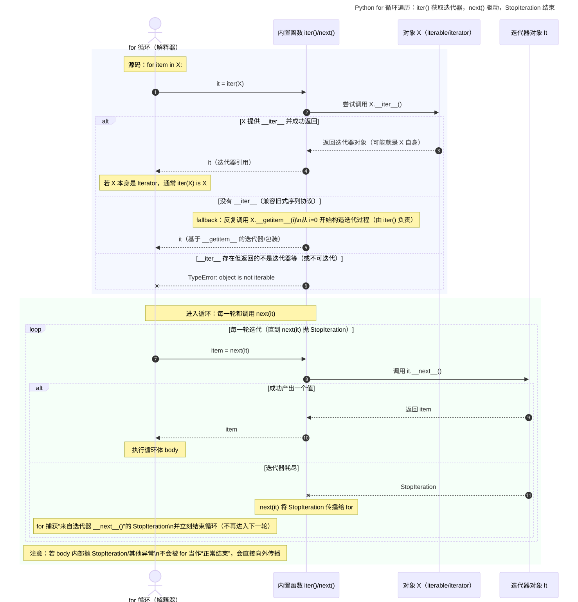
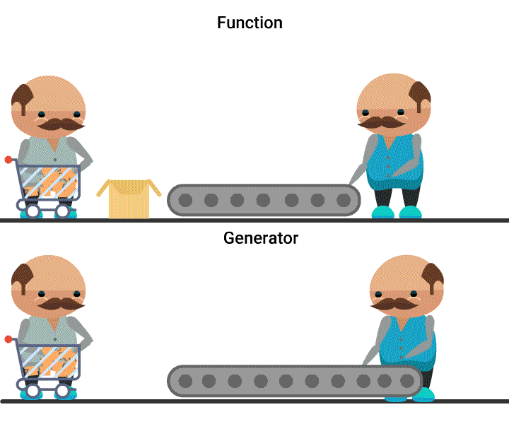
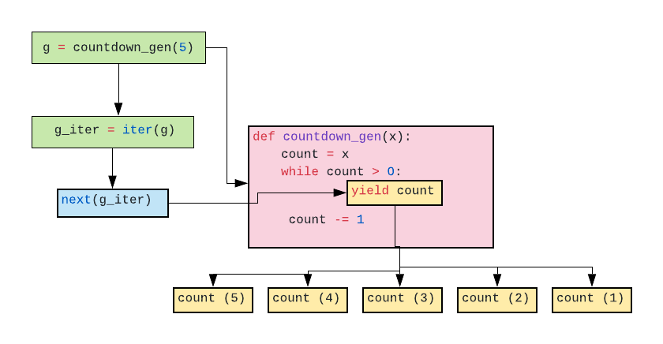
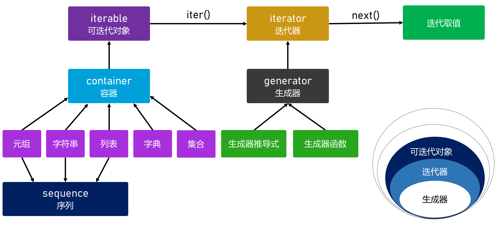
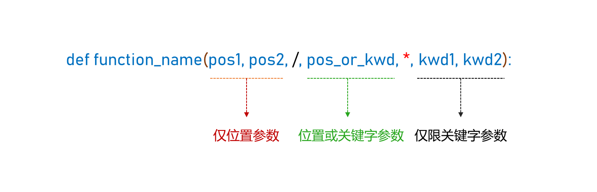
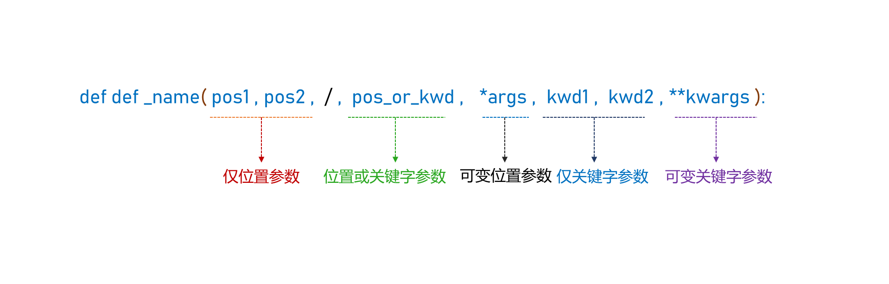

# 一、可迭代对象、迭代器、生成器

## 1.1 可迭代对象

### 1.1.1 什么是可迭代对象?

可迭代对象（`Iterable`）就是能被 `for` 遍历的对象。

`Python`中的可迭代对象有：

● 序列类型：`list`、`tuple`、`str`、`bytes`、`range`。

● 集合/映射类型：`set`、`frozenset`、`dict`（遍历默认是 `key`；也可 `dict.keys()` / `dict.values()` / `dict.items()`）。

● 文件对象：`open()`函数返回的文件对象（按行迭代）。

● 其他常见可迭代对象：`enumerate(...)`、`zip(...)`、`map(...)`、`filter(...)`、各类库对象：如 `pathlib.Path().iterdir()` 返回的结果等。

可迭代对象之所以能被 `for` 遍历，是因为对它调用内置函数 `iter(obj)` 时能够得到迭代器（此时在`Python`解释器的内部可迭代对象已经转换了迭代器对象），

`for` 循环随后会不断对迭代器调用 `next()` 取值，直到迭代结束。

### 1.1.2 `for` 遍历的执行顺序

**第一步：获取迭代器**

对目标对象 `X` 调用内置函数 `iter(X)`，得到迭代器对象-- `it`。

● 通常是调用 `X.__iter__()` 得到迭代器 -- `it`。

● 若没有 `__iter__()`，可能回退用 `X.__getitem__(0), X.__getitem__(1)...` 形成迭代器（直到 `IndexError`）。

● 若仍无法迭代，抛出 `TypeError`。

**第二步：循环取值并执行循环体**

进入循环后，每一轮都调用 `next(it)`（即 `it.__next__()`）取下一个元素：

● 如果成功返回一个值：赋给循环变量（如 `item`），然后执行循环体

● 如果抛出 `StopIteration`：`for` 捕获该异常并立即结束循环

**第三步：异常处理补充（可选但常用）**

`for` 只会把**取值阶段**抛出的 `StopIteration` 视为正常结束；循环体内部抛出的异常（包括 `StopIteration`）会直接向外传播。



## 1.2 迭代器

### 1.2.1 什么是迭代器?

迭代器（`Iterator`）是 `Python` 中用于**按其定义的遍历次序**逐个产生元素的对象。它遵循迭代器协议：

● 对迭代器调用 `iter(it)` 会返回迭代器自身（即 `it.__iter__()` 返回 `it`）。

● 对迭代器调用 `next(it)` 会返回下一个元素；当元素耗尽时抛出 `StopIteration`（即由 `it.__next__()` 抛出）。

迭代器一定是可迭代对象，但可迭代对象不一定是迭代器。

迭代器通常是一次性的：遍历一遍后就耗尽，不能从头再来。

### 1.2.2 如何产生迭代器?

**1、对可迭代对象调用 `iter()`**

凡是可迭代对象（如 `list/tuple/str/dict/set/range/文件对象` 等），都可以用 `iter(x)` 产生迭代器。

**示例代码**

```python

lst = [10, 20, 30]
it = iter(lst)

print(next(it))  # 10
print(next(it))  # 20
print(next(it))  # 30

```

**2、用返回迭代器的内置/标准库函数**

**示例代码**

```python

names = ["张三", "李四", "王五", "赵六"]
score_mid = [78, 90, 66, 88]   # 期中
score_final = [82, 86, 72, 91] # 期末

# 1) zip：把姓名、期中、期末“对齐”成一条条记录
rows = zip(names, score_mid, score_final)
# rows 现在是一个迭代器，元素形如：("张三", 78, 82)

```

`itertools`模块里的对象通常是迭代器（`iterator`）。

**3、自定义一个迭代器类**

**示例代码**

```python

class CountTo:
    def __init__(self, n):
        self.n = n
        self.cur = 1

    def __iter__(self):
        return self  # 迭代器协议：返回自身

    def __next__(self):
        if self.cur > self.n:
            raise StopIteration
        x = self.cur
        self.cur += 1
        return x


print(list(CountTo(5)))  # [1, 2, 3, 4, 5]

```

### 1.2.3 迭代器的应用场景

**1、按需消费：不想一次性算完/拿完**

只取前几个、或边取边判断，适合用 `next()` **手动推进（不适合大数据量）**。

```python

it = iter([10, 20, 30])
print(next(it))  # 10
# 用这个10进行XXX操作
print(next(it))  # 20
# 用这个20进行XXX操作
print(next(it))  # 20
# 用这个20进行XXX操作

```

**2、处理大数据/流式数据：省内存、边读边处理**

典型：逐行读文件、处理日志、网络流、数据库游标等（核心是“惰性”）。

```python

#以下演示为读取文件操作，在本案例中想提醒大家的是：文件对象在读取是也是返回的迭代器，每次只读一行

with open("big.log", "r", encoding="utf-8") as f:
    for line in f:   # 背后就是迭代器
        ...
        
```

**3、算法需要“逐个取元素”：例如成对读取、分块读取**

比如每次取两个元素做一组、或者按固定大小分块处理。

```python

it = iter([1, 2, 3, 4, 5, 6])
while True:
    try:
        a = next(it); b = next(it)
        print(a, b)
    except StopIteration:
        break
        
```

## 1.3 生成器

### 1.3.1 什么是生成器?

生成器（`Generator`）是一个特殊的迭代器：它不会一次性生成并保存全部结果，而是在迭代过程中按需（惰性）产生一个个值。

生成器在每次产出一个值（`yield`）后会**暂停**，并保存当前执行状态；当再次通过 `next()`（或 `for` 循环）请求下一个值时，会从上次暂停处**继续执行**，直到结束并抛出 `StopIteration`。

生成器通常由两种方式创建：

● 生成器函数：函数体中包含 `yield`，调用该函数会返回一个生成器对象。

● 生成器表达式：如 `(expr for x in iterable)`。

生成器的优点：

● 按需产出，常可节省内存：适合流式处理、大数据集或潜在的无限序列（前提是不把结果整体收集成列表等）。

● 惰性计算：只在需要时计算后续结果，可能减少不必要的计算。

● 便于编写迭代逻辑：可用于快速实现迭代器；也可在自定义类的 `__iter__` 中使用 `yield` 来实现自定义迭代行为。



### 1.3.2 `yield` 关键字

`yield` 是 `Python` 里用来创建和驱动生成器的关键字。它的核心作用是：

产出一个值，并**暂停**函数执行；下次再继续从暂停处运行。

只要函数体里出现了 `yield`，这个函数就不再是普通函数，而是**生成器函数**。

```python

def f():
    yield 1

g = f()
print(g)  # <generator object ...>

```

当生成器运行到：

```python

yield value

```

会同时发生三件事：

1、把 `value` 返回给外部调用方（作为本次迭代结果）

2、暂停当前函数（停在 `yield` 的位置附近）

3、保存执行现场（局部变量、执行到哪一行等）

下次再调用 `next()` 时，会**从上次暂停的位置继续往下执行**，直到遇到下一个 `yield` 或结束。



### 1.3.3 生成器推导式

生成器推导式的语法结构为：

```python

(expression for item in iterable)

```

或者

```python

(expression for item in iterable if condition)

```

**示例代码**

要求：生成`1~100`之间的偶数

```python

numbers = (n for n in range(1,101) if n % 2 == 0)

```

**如何证明生成器是惰性生成数据项的？**

```python

numbers = (n for n in range(1,101) if n % 2 == 0)
print(len(numbers))

```

此时将产生：`TypeError: object of type 'generator' has no len()`

<span style="color:red;">生成器对象不支持 `len()`，因为它没有实现 `__len__`。这通常与生成器的惰性特性相关：生成器按需产出元素，并不预先物化全部结果，因此一般不会（也不一定能在不消耗迭代的情况下）提供长度信息。若要统计元素个数，需要遍历计数，但这会消耗生成器。</span>

**惰性示例**

```python

def make_numbers():
    print("生成器开始执行")
    for n in range(1, 6):
        print("准备产出:", n)
        yield n

numbers = make_numbers()
print("生成器已创建")      # 此时不会打印“准备产出...”

print(next(numbers))       # 现在才开始运行并产出第一个值
print(next(numbers))       # 继续从上次暂停处运行

```

## 1.4 总结

### 1.4.1 序列 (`Sequence`)

序列是一种**有序**的集合类型，其元素按**特定顺序排列**，可通过**整数索引**访问。

**特点：**

● 实现了 `__getitem__()` 和 `__len__()` 方法

● 支持索引访问（如 `obj[i]`）和切片操作（如 `obj[x:y]`）

● 可以使用 `in` 运算符检查成员

● 可以使用 `+` 和 `*` 进行拼接和重复

**主要内置序列：**

● 不可变序列：`str`, `tuple`, `bytes`

● 可变序列：`list`, `bytearray`

### 1.4.2 容器 (`Container`)

容器是可包含其他对象的数据类型，主要特点是支持成员检测。容器强调**包含关系**。

**特点：**

● 实现了 `__contains__()` 方法

● 支持 `in` 和 `not in` 运算符

● 不一定支持索引或迭代

**主要内置容器：**

`list`, `tuple`, `str`, `dict`, `set`, `frozenset`

### 1.4.3 可迭代对象 (`Iterable`)

可迭代对象是能够一次返回其中一个成员的对象，可用于 `for` 循环。

**特点：**

● 实现了 `__iter__()` 方法返回迭代器

● 或者实现了基于整数索引的 `__getitem__()` 方法（序列协议的回退机制）

● 可以传递给 `iter()` 函数获取迭代器

**主要内置可迭代对象：**

`list`, `tuple`, `str`, `dict`, `set`, `frozenset`, `range`

### 1.4.4 迭代器 (`Iterator`)

迭代器是表示数据流的对象，支持 `next()` 操作获取流中的下一项。

**特点：**

● 实现了 `__iter__()` 方法（返回自身）和 `__next__()` 方法

● `__next__()` 方法要么返回下一个值，要么抛出 `StopIteration` 异常

● 迭代器是有状态的，会记住当前迭代位置

● 迭代器是一次性的，遍历完后需要重新创建

### 1.4.5 生成器 (`Generator`)

生成器是一种特殊的迭代器，使用函数和 `yield` 语句创建。

**特点：**

● 是迭代器的一种，自动实现迭代器协议

● 使用 `yield` 语句暂停函数执行并返回中间结果

● 函数状态会被保存，下次调用时从暂停处继续执行

● 惰性计算，按需生成值，节省内存




# 二、函数

## 2.1 什么是函数?

函数（`Function`）是可复用的代码单元，用于执行特定任务。函数可以接收输入（实参传给形参），并可以返回一个结果；也可能不返回结果而仅产生副作用（如打印、写文件、更新状态）。

函数体是函数的执行逻辑与操作的集合，通常在调用时按形参约定处理输入并产生输出或副作用。

视具体语言，函数往往是“一等公民”，可以被赋值、作为参数传递、作为返回值，且可以形成闭包以捕获其定义环境中的变量。


## 2.2 函数类型

**按来源划分的话：**

内置函数：由解释器/标准库提供，如 `len`、`print`。

自定义函数：用户用 `def` 或 `lambda` 定义。

**按行为/语法特征划分的话：**

普通函数：调用后立即计算并返回结果。

生成器函数：函数体含 `yield`，调用返回生成器对象，惰性产出值。

**按类型性质（与用法）划分的话：**

高阶函数：以函数为参数或返回函数的函数（`map`、`filter`、`functools.partial`、`sorted` 的 `key` 用法等）。

闭包：函数捕获其定义环境中的自由变量形成的可调用对象。

**相关语法与模式**

装饰器：以 `@decorator` 语法应用在函数或类上的模式，本质是接受可调用并返回可调用的高阶函数或可调用对象。

## 2.3 内置函数

### 2.3.1 `int()`

`int()` 函数用于将值转换为整数或按进制解析字符串。

**语法结构**

```python

int(number=0,/)
int(string,/,base=10)

```

**示例代码**

```python

print(int("10", 2))  # 2

```

### 2.3.2 `float()`

`float()` 函数用于将值转换为浮点数或创建浮点数。

**语法结构**

```python

float(number=0.0,/)
float(string, /)

```

**示例代码**

```python

print(float("3.14"))  # 3.14

```

### 2.3.3 `complex()`

`complex()` 函数用于创建复数或将字符串/数值转换为复数。

**语法结构**

```python

complex(number=0, /)
complex(string, /)
complex(real=0, imag=0)

```

**示例代码**

```python

print(complex(2, 3))   # (2+3j)

```

### 2.3.4 `bool()`

`bool()` 函数用于将值转换为布尔类型。

**语法结构**

```python

bool(object=False, /)

```

**示例代码**

```python

print(bool([]))    # False
print(bool(3))     # True

```

### 2.3.5 `str()`

`str()` 函数用于转换为字符串或创建字符串对象。

**语法结构**

```python

str(object='')
str(object=b'', encoding='utf-8', errors='strict')

```

**示例代码**

```python

print(str(123))  # '123'

```

### 2.3.6 `tuple()`

`tuple()` 函数用于创建元组或将可迭代对象转换为元组。

**语法结构**

```python

tuple()
tuple(iterable)

```

**示例代码**

```python

print(tuple({1, 2}))  # (1, 2) 顺序不保证

```

### 2.3.7 `list()`

`list()` 函数用于创建列表或将可迭代对象转换为列表。

**语法结构**

```python

list()
list(iterable)

```

**示例代码**

```python

print(list({1, 2, 3}))  # [1, 2, 3]（顺序不固定）

```

### 2.3.8 `dict()`

`dict()` 函数用于创建字典或将映射/键值序列转换为字典。

**语法结构**

```python

dict(**kwargs)
dict(mapping)
dict(iterable)

```

**示例代码**

```python

print(dict([("a", 1), ("b", 2)]))  # {'a': 1, 'b': 2}

```

### 2.3.9 `set()`

`set()` 函数用于创建集合或将可迭代对象转换为集合。

**语法结构**

```python

set()
set(iterable)

```

**示例代码**

```python

print(set([1, 1, 2]))  # {1, 2}

```

### 2.3.10 `frozenset()`

`frozenset()` 函数用于创建不可变集合。

**语法结构**

```python

frozenset(iterable=set())

```

**示例代码**

```python

fs = frozenset({1, 2, 3})
print(fs)

```

### 2.3.11 `bytes()`

`bytes()` 函数用于创建不可变的字节序列。

**语法结构**

```python

bytes([source[, encoding[, errors]]])

```

**示例代码**

```python

b = bytes("hi", "utf-8")
print(b)  # b'hi'

```

### 2.3.12 `range()`

`range()` 函数用于创建不可变的整数序列。

**语法结构**

```python

range(stop,/)
range(start, stop, step=1,/)

```

**示例代码**

```python


for i in range(2, 7, 2):
    print(i)  # 2 4 6
    
```

### 2.3.13 `bin()`

`bin()` 函数用于将整数转换为以 `0b` 开头的二进制字符串。

**语法结构**

```python

bin(integer,/)

```

**示例代码**

```python

print(bin(10))  # '0b1010'

```

### 2.3.14 `oct()`

`oct()` 函数用于将整数转换为以 `0o` 开头的八进制字符串。

**语法结构**

```python

oct(integer,/)

```

**示例代码**

```python

print(oct(8))  # '0o10'

```

### 2.3.15 `hex()`

`hex()` 函数用于将整数转换为以 `0x` 开头的十六进制字符串。

**语法结构**

```python

hex(integer,/)

```

**示例代码**

```python

print(hex(255))  # '0xff'

```

### 2.3.16 `abs()`

`abs()` 函数用于返回一个数的绝对值（对复数返回其模）。

**语法结构**

```python

abs(number,/)

```

**示例代码**

```python

print(abs(-3))      # 3
print(abs(-3.5))    # 3.5

```

### 2.3.17 `sum()`

`sum()` 函数用于对可迭代对象的元素求和，可指定初始值。

**语法结构**

```python

sum(iterable,/0,start=0)

```

**示例代码**

```python

print(sum([1, 2, 3], 10))  # 16

```

### 2.3.18 `pow()`

`pow()` 函数用于进行幂运算；三参形式执行模幂。

**语法结构**

```python

pow(base, exp, mod=None)

```

**示例代码**

```python

print(pow(2, 3))       # 8
print(pow(2, 3, 5))    # 3

```

### 2.3.19 `round()`

`round()` 函数用于将数字按指定小数位进行四舍五入。

**语法结构**

```python

round(number, ndigits=None)

```

**示例代码**

```python

print(round(3.14159, 2))  # 3.14

```

### 2.3.20 `divmod()`

`divmod()` 函数用于同时返回商与余数，形成元组 (`quotient`, `remainder`)。

**语法结构**

```python

divmod(a, b,/)

```

**示例代码**

```python

print(divmod(7, 3))   # (2, 1)

```

### 2.3.21 `max()`

`max()` 函数用于返回最大值，支持 `key` 与 `default`。

**语法结构**

```python

max(iterable, /,*, key=None)
max(iterable, /,*, default,key=None)
max(arg1, arg2,/,*args,key=None)

```

**示例代码**

```python

print(max([3, 1, 4]))                  # 4
print(max([], default=None))           # None
print(max(["a","bb","c"], key=len))    # 'bb'

```

### 2.3.22 `min()`

`min()` 函数用于返回最小值，支持 `key` 与 `default`。

**语法结构**

```python

min(iterable, /, *, key=None)
min(iterable, /, *, default, key=None)
min(arg1, arg2, /, *args, key=None)

```

**示例代码**

```python

print(min([3, 1, 4]))                  # 1
print(min([], default=None))           # None
print(min(["a","bb","c"], key=len))    # 'a'

```

### 2.3.23 `ord()`

`ord()` 函数用于返回字符的 `Unicode` 码点整数值。

**语法结构**

```python

ord(character, /)

```

**示例代码**

```python

print(ord('A'))  # 65

```

### 2.3.24 `chr()`

`chr()` 函数用于根据 `Unicode` 码点返回对应字符。

**语法结构**

```python

chr(codepoint, /)

```

**示例代码**

```python

print(chr(97))  # 'a'

```

### 2.3.25 `iter()`

`iter()` 函数用于获取对象的迭代器或创建哨兵迭代器。

**语法结构**

```python

iter(iterable, /)
iter(callable, sentinel, /)

```

**示例代码**

```python

it = iter([1, 2, 3])
print(next(it))  # 1

```

### 2.3.26 `next()`

`next()` 函数用于从迭代器获取下一个元素，可设默认值。

**语法结构**

```python

next(iterator, /)
next(iterator, default, /)

```

**示例代码**

```python

it = iter([1])
print(next(it, None))  # 1
print(next(it, None))  # None

```

### 2.3.27 `enumerate()`

`enumerate()` 函数用于为可迭代对象提供索引和元素对的迭代器。

**语法结构**

```python

enumerate(iterable, start=0)

```

**示例代码**

```python

for i, x in enumerate(["a","b"], start=1):
    print(i, x)
    
```

### 2.3.28 `zip()`

`zip()` 函数用于并行打包多个可迭代对象为元组迭代器，长度取最短。

**语法结构**

```python

zip(*iterables, strict=False)

```

**示例代码**

```python

print(list(zip([1, 2], [3, 4])))  # [(1, 3), (2, 4)]

```

**解压缩**

```python
list1 = [
    ['张三','李四','王五'],
    [26,27,28],
    ['男','女','男']
]

for item in zip(list1):
    print(item)             # (['张三', '李四', '王五'],)
                            # ([26, 27, 28],)
                            # (['男', '女', '男'],)
    
zip(*list1)   -----〉   zip(list1[0], list1[1], list1[2])
# zip(['张三','李四','王五'], [26,27,28], ['男','女','男'])
```

### 2.3.29 `len()`

`len()` 函数用于返回对象的长度（序列、集合、映射等）。

**语法结构**

```python

len(object,/)

```

**示例代码**

```python

print(len([1, 2, 3]))  # 3

```

### 2.3.30 `all()`

`all()` 函数用于判断可迭代对象的所有元素是否为真（或可迭代为空时返回 `True`）。

**语法结构**

```python

all(iterable,/)

```

**示例代码**

```python

print(all([1, True, "x"]))   # True
print(all([1, 0]))           # False

```

### 2.3.31 `any()`

`any()` 函数用于判断可迭代对象中是否存在任一真值元素。

**语法构**

```python

any(iterable,/)

```

**示例代码**

```python

print(any([0, "", None]))    # False
print(any([0, "", 5]))       # True

```

# 三、自定义函数

## 3.1 什么是自定义函数?

自定义函数是程序员为完成特定任务而编写的、可复用的代码块，通常接收参数（输入），执行逻辑，并可返回结果（输出）。

创建自定义函数的步骤分为：

**步骤一：定义函数**

● 使用 `def` 关键字声明函数。

● 指定参数列表及默认值（如需）。

● 在函数体内编写实现逻辑。

● 使用 `return` 返回结果（如需；也可不返回）。

**步骤二：调用函数**

● 按函数签名传入位置参数或关键字参数。

● 接收返回值并进行后续处理。

● 注意作用域与可见性（函数需在调用点前已定义或可导入）。

## 3.2 创建自定义函数

创建自定义函数的语法结构如下：

```python

def function_name(parameter1, parameter2=None, *args, **kwargs):
    """
    可选的文档字符串：说明函数用途、参数与返回值。
    """
    # 函数体（代码块）
    return expression  # 可选；不写则返回 None

```

其中：

● `function_name`：指自定义函数的名称，命名规则与标识符相同（字母、数字、下划线，且不能以数字开头），避免与关键字同名。

● 自定义函数名称建议具备可读性与语义性。

● 命名风格：强烈建议使用小写加下划线的蛇形命名法 `lowercase_with_underscores`，例如 `get_user_info`。

● `parameters`：指函数的形式参数（形参），为可选项。

● `return expression`：指函数的返回值，是可选项。不写 `return` 或只写 `return` 而不带表达式时，函数返回 `None`；函数可以返回任意对象。

## 3.3 调用自定义函数

**基本形式**

```python

function_name(arguments)

```

**可接收返回值**

```python

variable = function_name(arguments)

```

其中：

● `function_name`指要调用的函数的名称。

● `arguments`指在调用函数时要实际转入的值（也称为实际参数，简称为实参）。

## 3.4 形参详解

形参（`parameters`）：在函数定义时声明的参数名及其约束，用于接收调用方传入的实参。函数调用发生时，==解释器将实参按绑定规则赋给对应的形参==。

实参（`arguments`）指调用函数时传入的值，分为==位置实参与关键字实参==。

### 3.4.1 位置形参

位置形参（`positional parameters`）是在函数定义中不带特殊标记的普通参数。它们可以通过位置传入，也可以通过关键字传入。

```python

def subtraction(a,b):
    result = a - b
    return result

```

在上述函数中的`x`和`y`则属于位置参数。在调用函数时，必须按照位置参数的位置依次进行赋值操作。

```python


result1 = subtraction(6,2)
result2 = subtraction(2,6)

```

位置参数也可以通过关键字参数的形式进行赋值操作。

```python

# 位置参数也可用关键字调用

result3 = subtraction(a=9, b=2)   # 关键字调用 → 7

result4 = subtraction(b=2, a=9)   # 关键字调用（顺序可变） → 7

result5 = subtraction(9, b=2)     # 混合调用：a 用位置，b 用关键字 → 7

# 错误示例：重复赋值同一形参（既位置又关键字）
# subtraction(9, a=2)  # TypeError

# 错误示例：位置参数不能位于关键字参数之后
#subtraction(a=3, 4)  # SyntaxError

```

### 3.4.2 关键字参数

关键字参数是在调用时以 `name=value` 形式按名称绑定的实参；适用于除仅限位置形参外的形参。

```python

# 位置参数也可用关键字调用

result3 = subtraction(a=9, b=2)   # 关键字调用 → 7

result4 = subtraction(b=2, a=9)   # 关键字调用（顺序可变） → 7

```

### 3.4.3 默认参数

默认参数指在函数定义时为形参指定默认值的参数，语法为 `name=default`。调用时若未提供对应实参，则使用该默认值。

默认参数必须位于无默认值的普通参数之后：在定义顺序上，默认参数不能出现在必需参数之前。

```python


def connect(host, port=3306, timeout=3.0):
    return f"{host}:{port} timeout={timeout}"

print(connect("localhost"))                       # "localhost:3306 timeout=3.0"
print(connect("localhost", 3307))                 # "localhost:3307 timeout=3.0"
print(connect("localhost", 3307, 1.0))            # "localhost:3307 timeout=1.0"
print(connect("localhost", timeout=2.0))          # "localhost:3306 timeout=2.0"
print(connect(host="localhost", port=5432))       # 关键字调用
print(connect("localhost", port=5432, timeout=1)) # 混合：host 用位置，其他用关键字

# 常见错误示例（演示，不要执行）
# print(connect())                 # TypeError：缺少必需参数 host
# print(connect(timeout=2.0))      # TypeError：缺少必需参数 host
# print(connect("localhost", port=3307, 1.0))  # SyntaxError：关键字参数后不能跟无名位置参数
# print(connect("localhost", 3307, timeout=1.0, 2.0))  # SyntaxError：关键字参数后不能跟位置参数

```

### 3.4.4 仅位置参数

仅位置参数是在函数定义中位于斜杠标记 `/` 左侧的参数。调用时只能按位置传入，不能用关键字形式传入。

`/` 只能出现一次，通常位于参数列表的前段。

仅位置参数可以有默认值；默认值不改变它们**仅位置**的约束。

使用关键字为 `/` 左侧参数赋值会触发 `TypeError`。

**示例代码**

```python

def scale(x=1.0, y=1.0, /):
    return x - y

print(scale())        # 0.0   （1.0 - 1.0）
print(scale(2))       # 1.0   （2 - 1.0）
print(scale(2, 3))    # -1.0  （2 - 3）
# print(scale(x=2))   # TypeError：x、y 为仅位置参数，不能用关键字

```

### 3.4.5 仅关键字参数

仅关键字参数是在函数定义中位于一个单独星号标记 `*` 之后的参数。调用时必须以关键字形式传入，不能通过位置传入。

`*`之后的参数必须用 `name=value` 传入。

仅关键字参数可以有默认值；若无默认值则为必需的关键字。

试图通过位置传入 `*` 之后的参数会触发 `TypeError`。

**示例代码**

```python

def paginate(page=1, *, page_size=20, order="desc"):
    return page, page_size, order

paginate()                         # (1, 20, 'desc')
paginate(2, page_size=50)          # 合法
# paginate(2, 50)                  # TypeError：page_size 必须关键字传入

```



### 3.4.6 可变位置参数

可变位置形参是指由任意数量的位置参数构成的序列，它需要通过在形参名称前加缀 `*` 来定义。

可变位置形参强烈建议使用 `*args` 命名。

在函数体内部，`*args` 代表了由传递给函数的所有可变位置参数所组成的元组。

若存在 `*args`，则其后的命名参数自动成为仅关键字参数。

```python

def func(*args):
	pass

```

在上述函数中的`*args`则属于可变位置形参

```python

def avg(*args):
    result = sum(args) / len(args)
    return result

result1 = avg(1,2,3,4)
result2 = avg(1,2,3,4,5,6)
print(result1)
print(result2)

```

<span style="color:#c00">可变位置参数必须位于关键字形参之前</span>

```python

def avg(*args,digits=2):
    result = round(sum(args) / len(args),digits)
    return result

result1 = avg(1,2,3,4,5,5)
result2 = avg(1,2,3,4,5,5,digits=3)
print(result1)
print(result2)

```

```python

def avg(a,b,*args,digits=2):
	count = 2
	result = a + b
	if args:
		result += sum(args)
		count += len(args)
	value = round(result / count,digits)
	return value
    
```

**面试题**

在`Python`中定义了以下函数，那下面哪些的调用方式是正确的？

```python

def func(a,b,*args,c,d):
    pass

func(a=1,b=2,c=3,d=4)
func(1,2,3,4,5,c=6)
func(b=2,a=3,c=1)
func(2,3,(4,5,6),c=1)
func(2,3,4,5,6,d=2,c=1)

```

### 3.4.7 可变关键字参数

可变关键字形参是指由任意数量的关键字参数，它需要通过在形参名称前加缀 `**` 来定义

可变关键字形参强烈建议使用 `**kwargs` 命名

在函数体内部，`**kwargs` 代表了由传递给函数的所有可变关键字参数所组成的字典

```python

def func(**kwargs):
	pass

```

在上述函数中的`**kwargs`则属于可变关键字形参。

```python

def build_userinfo(**kwargs):
    info = {key.lower():value for key,value in kwargs.items() }
	return info

```

关键字形参必须位于可变关键字形参之前。

```python

def build_userinfo(id=1,**kwargs):
	info = {'id':id}
	info += {key.lower():value for key,value in kwargs.items() }
	return info

```



## 3.5 参数解包

参数解包是在函数调用时将可迭代对象展开为单独参数的机制。这与函数定义中的 `*args` 和 `**kwargs` 参数收集相反，是一种**展开**操作。

### 3.5.1 序列解包 (`*`)

使用 `*` 可以将可迭代对象（如列表、元组）解包为位置参数。

**示例代码**

```python

def add(a, b, c):
    return a + b + c

# 使用 * 解包列表
values = [1, 2, 3]
result = add(*values)  # 等价于 add(1, 2, 3)
print(result)  # 6

list1 = [1, 2, 3]
list2 = [4, 5, 6]
merged = [*list1, *list2]  # [1, 2, 3, 4, 5, 6]

```

### 3.5.2 字典解包 (`**`)

使用 `**` 可以将字典解包为关键字参数。

```python

def display_info(name, age, city):
    return f"{name} is {age} years old and lives in {city}"

# 使用 ** 解包字典
person = {"name": "Alice", "age": 30, "city": "New York"}
result = display_info(**person)  # 等价于 display_info(name="Alice", age=30, city="New York")
print(result)  # Alice is 30 years old and lives in New York

dict1 = {"a": 1, "b": 2}
dict2 = {"b": 3, "c": 4}  # 注意 "b" 键重复
merged = {**dict1, **dict2}  # {'a': 1, 'b': 3, 'c': 4} (后面的覆盖前面的)

```

### 3.5.3 混合使用解包

可以同时使用 `*` 和 `**` 进行解包，但要遵循位置参数在前、关键字参数在后的规则。

```python

def process_data(a, b, c, d=4, e=5):
    return a + b + c + d + e

values = [1, 2, 3]
options = {"d": 40, "e": 50}

# 混合使用 * 和 **
result = process_data(*values, **options)
print(result)  # 1 + 2 + 3 + 40 + 50 = 96

```

**函数定义中**：`*args` 收集多余的位置参数，`**kwargs` 收集多余的关键字参数

**函数调用中**：`*iterable` 将可迭代对象解包为位置参数，`**dict` 将字典解包为关键字参数

## 3.6 返回值

自定义函数的返回值需要说明以下几点：

**1、返回语句**

通过关键字 `return` 在函数中指定要返回的值。

`return`语句会立即终止函数执行并将控制权返回到调用点。

函数可以包含多个`return`语句（通常在不同的条件分支中），但只有一个会被执行。

**示例代码**

```python

def calculate_area(radius):
    """计算圆的面积"""
    pi = 3.14159
    area = pi * radius * radius
    return area  # 返回计算结果

# 调用函数并使用返回值
circle_area = calculate_area(5)
print(f"圆的面积是: {circle_area}")  # 输出: 圆的面积是: 78.53975

```

```python

def get_grade(score):
    """根据分数返回等级"""
    if score >= 90:
        return "A"  # 如果分数≥90，返回A并终止函数
    elif score >= 80:
        return "B"  # 如果分数≥80但<90，返回B并终止函数
    elif score >= 70:
        return "C"  # 如果分数≥70但<80，返回C并终止函数
    elif score >= 60:
        return "D"  # 如果分数≥60但<70，返回D并终止函数
    else:
        return "F"  # 如果分数<60，返回F并终止函数

# 测试不同分数
print(f"95分对应的等级: {get_grade(95)}")  # 输出: 95分对应的等级: A
print(f"82分对应的等级: {get_grade(82)}")  # 输出: 82分对应的等级: B
print(f"45分对应的等级: {get_grade(45)}")  # 输出: 45分对应的等级: F

```

```python

def divide_numbers(a, b):
    """除法运算，展示提前返回模式"""
    # 检查除数是否为零
    if b == 0:
        print("错误: 除数不能为零")
        return None  # 提前返回，避免除零错误
    
    # 只有当b不为零时，才会执行到这里
    result = a / b
    return result  # 返回除法结果

# 测试函数
print(divide_numbers(10, 2))  # 输出: 5.0
print(divide_numbers(10, 0))  # 输出: 错误: 除数不能为零 然后是 None

```

**2、返回值类型**

函数可以返回任何类型的对象，包括数字、字符串、布尔值、列表、元组、字典、函数对象、类实例等。

如果函数没有显式`return`语句，或者`return`语句没有指定值（即单独使用`return`），则函数默认返回`None`。

```python

def get_passing_students(students, passing_score=60):
    """返回成绩合格的学生列表"""
    passing_students = []
    for student in students:
        if student["score"] >= passing_score:
            passing_students.append(student["name"])
    return passing_students

# 使用函数
class_results = [
    {"name": "张三", "score": 85},
    {"name": "李四", "score": 55},
    {"name": "王五", "score": 72},
    {"name": "赵六", "score": 45}
]

passed = get_passing_students(class_results)
print(f"通过考试的学生: {passed}")
# 输出: 通过考试的学生: ['张三', '王五']

```

```python

def create_multiplier(factor):
    """返回一个乘法函数"""

    def multiply(number):
        return number * factor

    return multiply


# 使用函数
double = create_multiplier(2)
triple = create_multiplier(3)

print(f"10的两倍是: {double(10)}")  # 输出: 10的两倍是: 20
print(f"10的三倍是: {triple(10)}")  # 输出: 10的三倍是: 30

```

**3、返回值数量**

`Python`函数在技术上只能返回一个对象。当看似返回多个值时（如`return x, y, z`），`Python`实际上是将这些值自动打包成一个元组后返回。

这种语法被称为元组打包，是`Python`的一种语法糖。

**示例代码**

```python

def calculate_rectangle_properties(length, width):
    """计算矩形的面积和周长"""
    area = length * width
    perimeter = 2 * (length + width)
    
    # 返回面积和周长，看似返回两个值
    # 实际上Python将它们打包成元组(area, perimeter)
    return area, perimeter

# 使用元组解包接收两个返回值
area, perimeter = calculate_rectangle_properties(5, 3)

```

> **语法糖**（`Syntactic Sugar`）是指编程语言中那些不影响功能但使代码更易读、更易写的语法特性。
>
> 这个术语的含义是：这些特性就像在基本语法上"撒了糖"，让编程体验更加"甜美"，但并不增加语言的基本功能或表达能力。

