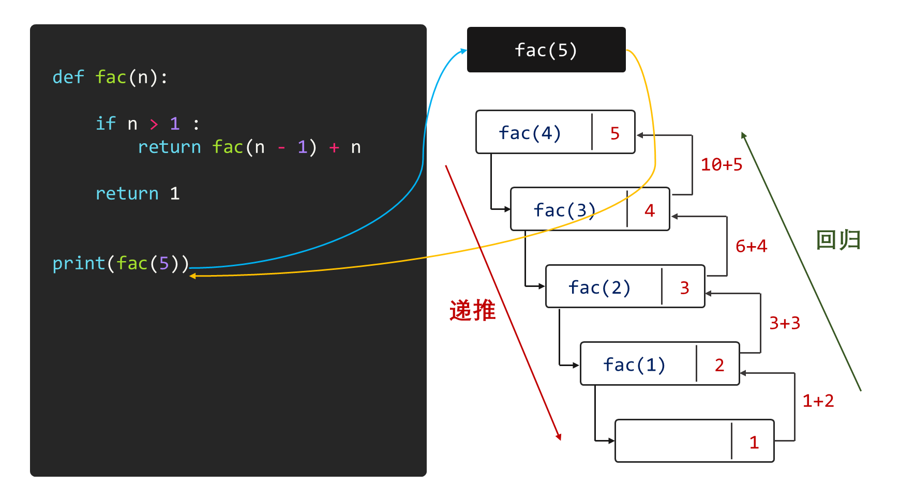
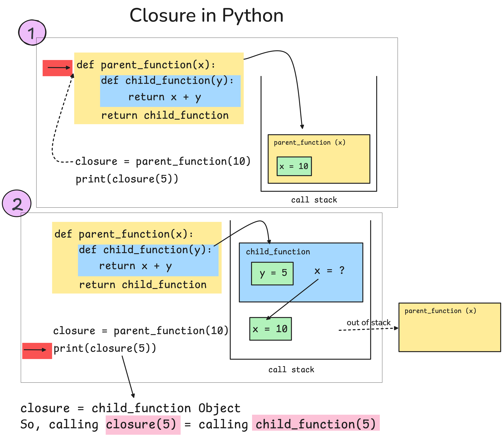
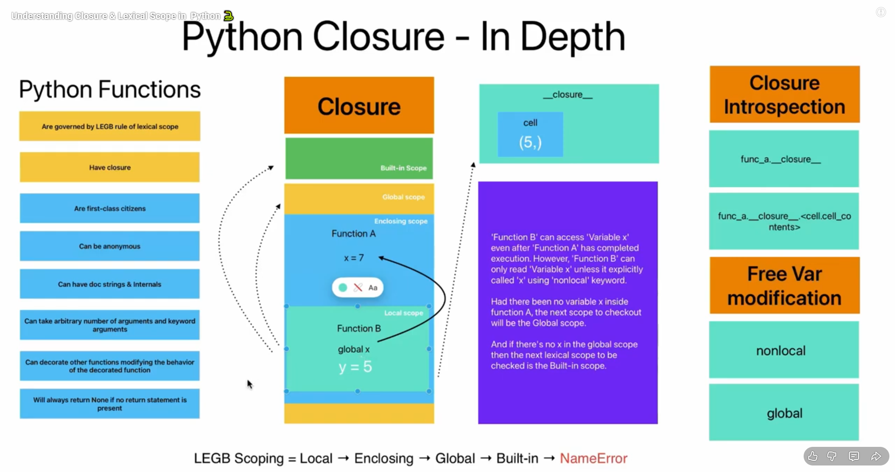
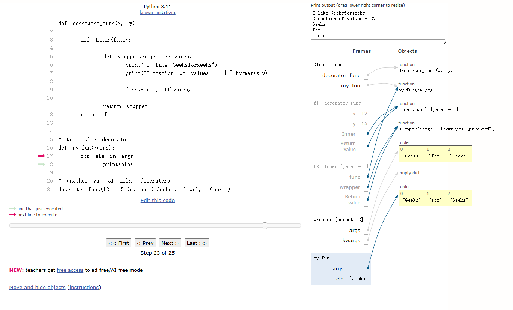
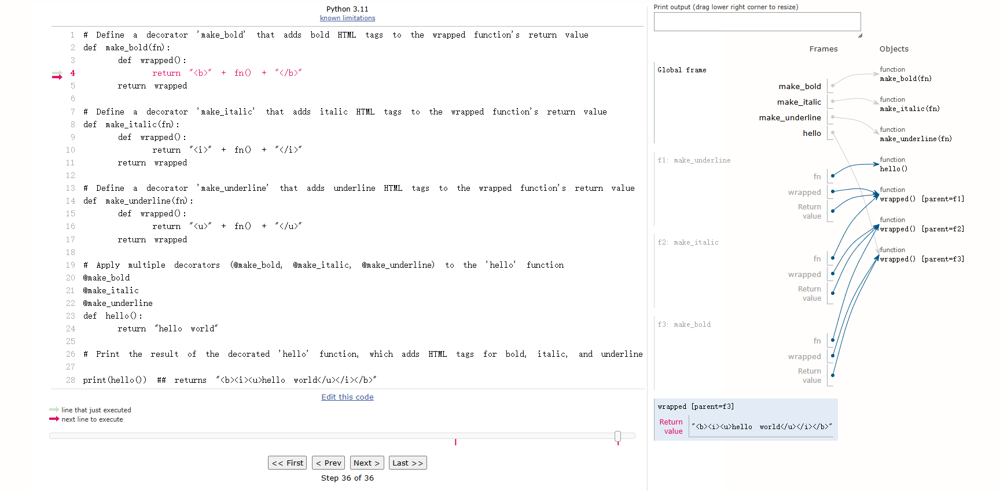

# 一、变量作用域

请写出以下`Python`代码的运行结果：

```python

age = 20
def fun1():
	age = 30
	age += 1
	print(age)
fun1()
print(age)

```

## 1.1 什么是变量作用域？

变量作用域（`Scope`）指的是变量可见性的范围，它决定了在程序的不同部分中变量是否可被访问。

变量作用域可以分为：

● 局部作用域(`Local Scope`)

● 嵌套作用域(`Enclosing Scope`)

● 全局作用域(`Global Scope`)

● 内置作用域(`Built-in Scope`)

`Python` 使用 `LEGB` 规则来解析变量名，按照从内到外的顺序查找变量。


## 1.2 局部作用域

局部作用域（`Local Scope`）指在函数或方法内部定义的变量，仅在函数执行期间存在，函数执行完毕后被销毁。

```python

def fun2():
    username = 'Rose'
    print(username)
fun2()

#NameError: name 'username' is not defined
print(username)

```

## 1.3 嵌套作用域

嵌套作用域（`Enclosing Scope`）指外部函数中定义的变量对内部函数可见。

当存在嵌套函数时，==内部函数可以访问外部函数的变量，但默认不能修改==（除非使用 `nonlocal` 关键字）。

```python

def outer_func(who):
    def inner_func():
        username = 'Frank'
        print(f"Hello, {who}")
    inner_func()

outer_func('Tom')

```

### 1.3.1 `nonlocal`语句

`nonlocal` 语句会使得所列出的名称指向之前在最近的包含作用域中绑定的除全局变量以外的变量

`nonlocal`语句的语法结构为：

```python

nonlocal identifier [,...]

```

其中 `identifier [,...]` 表示可以一次声明一个或多个变量：

```python

nonlocal x
nonlocal x, y, z

```

也就是说，如果内部函数需要同时修改外层函数中的多个变量，可以用逗号隔开：

```python

def outer():
    x = 10
    y = 20

    def inner():
        nonlocal x, y
        x = 100
        y = 200

    inner()
    print(x, y)

outer()

```

输出结果为：

```python

100 200

```

需要注意的是，`nonlocal` 声明的变量必须已经存在于外层函数作用域中，不能是全局变量，也不能凭空创建。

```python

username = 'Rose'
def outer():
    username = 'David'
    print(username)
    def inner():
        nonlocal username
        username = 'Frank'
        print(username)
    inner()
    print(username)

outer()
print(username)

```

### 1.3.2 内部函数的使用情况

**1、封装与信息隐藏**

● 将只在特定函数内有意义的逻辑封装为内层函数。

● 当某个小函数只服务于一个外层函数时，可以把它定义成内部函数，这样既能让代码结构更清晰，也能避免外部误用。

● 防止辅助函数污染全局命名空间。

**示例代码**

```python

def process_data(data):
    def validate(item):
        # 这个验证逻辑只在 process_data 中有意义
        return item > 0 and item < 100
    
    return [item for item in data if validate(item)]

# validate 函数对外不可见，只在 process_data 内部使用

```

**2、创建闭包**

● 内层函数可以"记住"并访问外层函数的变量。

● 即使外层函数执行完毕，内层函数仍能访问这些变量。

**3、实现装饰器**

● 装饰器模式的核心就是利用内层函数包装原始函数。

● 在不修改原函数的情况下增强其功能。

## 1.4 全局作用域

全局作用域（`Global Scope`）指模块级别定义的变量，对整个模块内的所有函数可见。函数内部可以使用 `global` 关键字来修改全局变量。

```python
username = 'Rose'
def outer():
    print(username)
    def inner():
        print(username)
    inner()

outer()
print(username)

```

### 1.4.1 `global`语句

`global`语句用于将所列出的标识符将被解读为全局变量，其语法结构为：

```python

global identifier [,...]

```

在使用`global`语句时需要注意的事项有：

● 声明位置：`global` 语句应当在函数内部的最外层使用，在对全局变量进行赋值或修改之前进行声明。

● 在 `global` 语句中列出的名称不能作为：形式参数、 `with` 语句或 `except` 子句的目标、 `for` 循环的目标等。

```python

global_var = 10  # 全局变量

def modify_global_var():
    global global_var
    global_var = 20
    print("Inside the function:", global_var)

modify_global_var()
print("Outside the function:", global_var)

```

## 1.5 内置作用域

内置作用域（`Built-in Scope`）指`Python` 解释器预定义的名称空间，包含==内置函数和异常==等，这些名称在所有 `Python` 程序中均可使用，无需导入。

```python

import builtins
print(dir(builtins))

```

# 二、递归函数

## 2.1 什么是递归函数?

递归函数(`Recursive`)是指在函数定义中直接或间接调用自身的函数。

## 2.2 递归函数的使用条件

1、要解决的问题转化为一个新问题，而这个新的问题的解决方法仍与原来的解决方法相同，只是所处理的对象有规律地递增或递减，如，计算阶乘、斐波那契数列等问题都可以使用递归函数来实现。

2、必须要有明确的结束递归的条件。



## 2.3 递归经典案例

### 2.3.1 阶乘计算

阶乘是递归的经典入门案例，计算 \[n! = n × (n-1) × ... × 2 × 1\]。

```python

def factorial(n):
    # 基本情况
    if n == 0 or n == 1:
        return 1
    # 递归情况
    return n * factorial(n - 1)

# 使用示例
print(factorial(5))  # 输出: 120 (5×4×3×2×1)

```

### 2.3.2 斐波那契数列

斐波那契数列中每个数是前两个数的和：0, 1, 1, 2, 3, 5, 8, 13...

```python

def fibonacci(n):
    # 基本情况
    if n <= 0:
        return 0
    elif n == 1:
        return 1
    # 递归情况
    return fibonacci(n - 1) + fibonacci(n - 2)

# 使用示例
print(fibonacci(6))  # 输出: 8

```

注意：这种实现效率较低，实际应用中通常使用动态规划或记忆化递归。

### 2.3.3 快速排序

快速排序是一种高效的排序算法，使用分治法（递归思想的一种应用）。

```python

def quicksort(arr):
    # 基本情况
    if len(arr) <= 1:
        return arr
    
    # 选择基准值
    pivot = arr[len(arr) // 2]
    
    # 分区
    left = [x for x in arr if x < pivot]
    middle = [x for x in arr if x == pivot]
    right = [x for x in arr if x > pivot]
    
    # 递归情况：对左右两部分递归排序并合并结果
    return quicksort(left) + middle + quicksort(right)

# 使用示例
print(quicksort([3, 6, 8, 10, 1, 2, 1]))  # 输出: [1, 1, 2, 3, 6, 8, 10]

```

# 三、闭包

## 3.1 函数是一等公民

在 `Python` 中，函数可以像变量一样赋值、传递和返回。这是理解闭包的重要前提。

**函数像变量一样赋值**

在 `Python` 中，函数可以赋值给变量，变量可以像函数一样调用。

```python

# 定义一个简单的函数
def greet(name):
    return f"Hello, {name}!"

# 将函数赋值给变量
greeting = greet

# 使用变量调用函数
print(greeting("Alice"))  # 输出: Hello, Alice!
print(greeting("Bob"))    # 输出: Hello, Bob!

```

**函数可以作为参数传递**

函数可以作为参数传递给其他函数，这在高阶函数（如 `map`、`filter`）中非常常见。

```python

# 定义一个函数，用于计算平方
def square(x):
    return x * x

# 定义一个高阶函数，接受另一个函数作为参数
def apply_function(func, value):
    return func(value)

# 将函数 square 作为参数传递
result = apply_function(square, 5)
print(result)  # 输出: 25

```

**函数可以作为返回值**

==函数可以返回另一个函数，这种特性是闭包的基础。==

```python

# 定义一个外部函数
def multiplier(factor):
    # 定义一个内部函数
    def multiply_by(value):
        return value * factor
    return multiply_by  # 返回内部函数

# 调用外部函数，返回一个新的函数
double = multiplier(2)  # 返回一个函数，factor = 2
triple = multiplier(3)  # 返回一个函数，factor = 3

# 调用返回的函数
print(double(5))  # 输出: 10 (5 * 2)
print(triple(5))  # 输出: 15 (5 * 3)

```

## 3.2 什么是闭包?

闭包(`Closure`)指的是一个函数及其相关的引用环境组合而成的实体。简单来说，闭包是一个函数，它记住了创建它时的环境。

闭包的核心特征

==1、函数嵌套 - 在一个函数内部定义另一个函数==

```python
def outer():
    def inner():
        pass
```

==2、环境捕获 - 内部函数引用外部函数的变量==

```python
def outer(x):
    def inner(y):
        return x + y
```

==3、函数作为返回值 - 外部函数返回内部函数==

```python
def outer(x):
    def inner(y):
        return x + y
    return inner
```

==4、状态保持 - 即使外部函数执行完毕，内部函数仍能访问外部函数的变量==

```python

def outer_function(x):
    """外部函数，定义了变量x"""
    
    def inner_function(y):
        """内部函数，使用了外部函数的变量x"""
        return x + y
    
    # 返回内部函数，形成闭包
    return inner_function

# 创建闭包
add_5 = outer_function(5)  # add_5是一个闭包，"记住"了x=5
add_10 = outer_function(10)  # add_10是另一个闭包，"记住"了x=10

# 使用闭包
print(add_5(3))  # 输出: 8 (5+3)
print(add_10(3))  # 输出: 13 (10+3)

```



## 3.3 闭包的工作原理

**1、触发条件：内层函数引用外层变量**

● 外层函数里定义了内层函数。

● 内层函数用到了外层函数的局部变量。

● 外层函数把内层函数返回（或以其他方式让它在外层函数结束后仍可用）。

**2、创建时：捕获自由变量并保存到闭包里**

当执行外层函数（例如 `outer(5)`）时：

● 外层函数创建自己的局部作用域，产生局部变量（如 `x = 5`）。

● `Python` 发现内层函数 `inner` 用到了 `x`。

● 于是把 `x` 放进一个专门的**闭包单元（`cell`）**里。

并把这个 `cell` 挂到内层函数对象的 `__closure__` 上。

> 关键点：闭包保存的是**变量的引用（`cell`）**，`cell` 里有当前值。不是简单复制一份值。

**3、外层函数结束：作用域销毁，但被捕获的变量不销毁**

● 外层函数执行完毕后，它的普通局部变量会被释放。

● 但被内层函数捕获的那些变量，因为仍被闭包引用，所以不会释放。

● 它们继续存在于 `inner.__closure__` 指向的 `cell` 中。

**4、调用闭包：内层函数从闭包单元中取值执行**

之后调用内层函数时（如 `inner(10)`）：

● 创建 `inner` 自己的局部作用域（比如 `y=10`）。

● 当执行到需要 `x` 时，`Python` 不去找外层函数（外层早结束了）。

● 而是从 `__closure__` 里的 `cell` 取出 `x` 的值。

● 完成计算并返回结果。

**5、释放时机：没人引用闭包函数时，闭包变量才会被回收**

● 只要闭包函数对象还被引用（例如赋给变量、存在列表里等），闭包环境就会一直存在。

● 当闭包函数对象没有任何引用时，闭包和其中捕获的变量才会被垃圾回收。



## 3.4 闭包有什么用？

闭包常用于以下几种场景：

**1、记住状态**

闭包可以让内部函数记住外部函数中的变量，即使外部函数已经执行完毕，这些变量仍然可以继续被内部函数使用。

例如创建一个计数器：

```python

def make_counter():
    count = 0

    def counter():
        nonlocal count
        count += 1
        return count

    return counter

c = make_counter()

print(c())  # 1
print(c())  # 2
print(c())  # 3

```

在这个例子中，`make_counter()` 执行完之后，局部变量 `count` 按理说应该被释放。

但是由于内部函数 `counter()` 引用了 `count`，并且 `counter()` 被返回到了外部，所以 `count` 会被闭包保存下来。

因此，每次调用 `c()` 时，`counter()` 都能记住上一次的 `count` 值。

**2、根据参数生成不同功能的函数**

闭包可以根据外部函数传入的参数，生成带有不同“记忆”的函数。

例如：

```python

def multiplier(factor):
    def multiply_by(value):
        return value * factor
    return multiply_by

double = multiplier(2)
triple = multiplier(3)

print(double(10))  # 20
print(triple(10))  # 30

```

这里 `double` 和 `triple` 都是由 `multiplier()` 创建出来的函数。

但是：

```text
double 记住了 factor = 2
triple 记住了 factor = 3
```

所以同样传入 `10`，它们会得到不同的结果。

这种写法可以用来批量生成不同功能的函数。

**3、作为装饰器的基础**

装饰器本质上也依赖闭包。

例如：

```python
# func在这里是一个函数
def decorator(func):
    def wrapper():
        print("函数执行前")
        func()
        print("函数执行后")
    return wrapper

```

在这个例子中，内部函数 `wrapper()` 引用了外部函数 `decorator()` 中的参数 `func`。

当 `decorator()` 执行完后，`wrapper()` 仍然可以记住并调用 `func`，这就是闭包的作用。

因此，装饰器可以在不修改原函数代码的情况下，为原函数增加额外功能。

# 四、装饰器

## 4.1 什么是装饰器？

装饰器（`Decorator`）是 `Python` 的一种语法特性和设计模式，它允许通过 `@` 语法将一个可调用对象（函数或类）包装在另一个可调用对象中，以便==在不修改原始代码的情况下扩展或修改其行为。==

装饰器本身可以是函数或类，只要它能接受一个可调用对象作为输入并返回一个新的可调用对象。

**装饰器模式的实现原理**

```python

def basic_func():
    print("我是普通的函数")
    print('我执行了基本的功能')


def decorator_func(func):
    def wrapper():
        print('我现在要修饰其它函数了')
        print('我扩展了一些功能')
        func()
    return wrapper


decorator_func(basic_func)()

```

在`Python`中，`@`符号用作装饰器的语法糖，通过在函数定义之前使用`@`符号和装饰器函数的名称，可以方便地将装饰器应用于函数，而无需显式调用装饰器函数并将函数作为参数传递。

```python

def decorator_func(func):
    def wrapper():
        print('我现在要修饰其它函数了')
        print('我扩展了一些功能')
        func()
    return wrapper

@decorator_func
def basic_func():
    print("我是普通的函数")
    print('我执行了基本的功能')
    
basic_func() # basic_func = decorator_func(basic_func)

```

## 4.2 装饰器的作用

装饰器在`Python`中提供了一种优雅的方式来增强或修改函数和类的行为，无需修改其源代码。

**1、代码复用与关注点分离**

● 将通用逻辑(日志、权限检查)从业务代码中抽离。

● 减少重复代码，提高可维护性。

**示例代码**

```python

def log_execution(func):
    def wrapper(*args, **kwargs):
        print(f"执行: {func.__name__}")
        return func(*args, **kwargs)
    return wrapper

@log_execution
def calculate_total(items):
    return sum(items)

```

**2、功能增强**

● 添加额外功能：计时、重试、缓存、权限控制等。

● 保持原函数的单一职责。

**示例代码**

```python

def require_auth(func):
    def wrapper(user, *args, **kwargs):
        if not user.is_authenticated:
            raise PermissionError("需要登录")
        return func(user, *args, **kwargs)
    return wrapper

@require_auth
def view_profile(user, profile_id):
    # 查看用户资料
    pass

```

**3、输入验证与前置处理**

● 验证参数类型和值。

● 转换或标准化输入。

**示例代码**

```python

def validate_types(func):
    def wrapper(x, y):
        if not isinstance(x, (int, float)) or not isinstance(y, (int, float)):
            raise TypeError("参数必须是数字")
        return func(x, y)
    return wrapper

@validate_types
def divide(x, y):
    return x / y

```

## 4.3 带参数的装饰器

带参数的装饰器是装饰器的高级形式，它允许在装饰函数时传入额外的配置参数，使装饰器行为更加灵活。

带参数的装饰器实际上是一个返回装饰器的函数，它有三层嵌套。

```python

def decorator_func(x, y):

    def Inner(func):

        def wrapper(*args, **kwargs):
            print("I like Geeksforgeeks")
            print("Summation of values - {}".format(x+y) )

            func(*args, **kwargs)
            
        return wrapper
    return Inner


# Not using decorator 
def my_fun(*args):
    for ele in args:
        print(ele)

# another way of using decorators
decorator_func(12, 15)(my_fun)('Geeks', 'for', 'Geeks')

```



**示例代码**

```python

def logging(filename):
    def decorator(func):
        def wrapper(*args, **kwargs):
            # 要追加方式打开logging.txt -- a(append,追加)
            with open(filename, 'a') as file:
                # 写入相关的内容
                file.write(f"函数被调用,位置参数为: {args},关键字参数为: {kwargs}\n")
            result = func(*args, **kwargs)
            return result

        return wrapper

    return decorator

```

```python

@logging("abc.txt")
def add(a,b):
    result = a + b 
    return result

```

像`logging('arithmetic.txt')(add)(4,5)`称为显式装饰

显式装饰指的是手动将装饰器应用于函数的过程，而不是使用语法糖（@）来自动应用装饰器。这意味着可以手动调用装饰器函数，并将待装饰的函数作为参数传递给装饰器函数，然后再手动调用返回的结果。这种方式相对于使用语法糖来说更加显式和手动化。

对于带参数的装饰器，通常存在三层函数：装饰器工厂函数、装饰器函数和包装函数（`wrapper`）

装饰器工厂函数（`Decorator Factor`y）是一个返回装饰器的函数。在`Python`中，当想要创建一个带参数的装饰器时，实际上会创建一个装饰器工厂函数。这个工厂函数接收装饰器的参数，并返回一个装饰器。返回的装饰器本身是一个函数，它接收一个函数作为参数，并返回一个包装器函数（`wrapper function`）。

## 4.4 装饰器链

装饰器链指在同一个函数（或方法）定义上叠加多个装饰器。


在装饰阶段（定义时），装饰器按**从下到上**的顺序依次作用于函数，等价于  \[f=A(B(C(f)))\]。

在调用阶段（运行时），调用被装饰后的函数时，会按**从上到下**进入各层包装逻辑，并在返回时按相反顺序退出。

示例代码

```python
# Define a decorator 'make_bold' that adds bold HTML tags to the wrapped function's return value
def make_bold(fn):
    def wrapped():
        return "<b>" + fn() + "</b>"
    return wrapped

# Define a decorator 'make_italic' that adds italic HTML tags to the wrapped function's return value
def make_italic(fn):
    def wrapped():
        return "<i>" + fn() + "</i>"
    return wrapped

# Define a decorator 'make_underline' that adds underline HTML tags to the wrapped function's return value
def make_underline(fn):
    def wrapped():
        return "<u>" + fn() + "</u>"
    return wrapped

# Apply multiple decorators (@make_bold, @make_italic, @make_underline) to the 'hello' function
@make_bold
@make_italic
@make_underline
def hello():
    return "hello world"

# Print the result of the decorated 'hello' function, which adds HTML tags for bold, italic, and underline

print(hello()) ## returns "<b><i><u>hello world</u></i></b>"
```



## 4.5 类装饰器

类装饰器是一种使用类来实现装饰器的方式。与函数装饰器类似，类装饰器的作用也是用来修饰函数或方法，从而扩展或修改它们的功能。

不同的是，类装饰器通过定义一个类，并实现其 `__call__` 方法，使得类的实例可以像函数一样被调用。

**类装饰器的基本原理**

1.被装饰的函数会作为参数传递给类装饰器的 `__init__` 方法。

2.类装饰器的核心是实现 `__call__` 方法，使得类的实例可以像函数一样调用。

3.在 `__call__` 方法中，可以定义装饰器的逻辑，增强被装饰函数的功能。

示例代码

```python

class MyDecorator:
    def __init__(self, func):
        self.func = func  # 保存被装饰的函数

    def __call__(self, *args, **kwargs):
        print("这是类装饰器，正在扩展功能...")
        result = self.func(*args, **kwargs)  # 调用被装饰的函数
        print("类装饰器扩展功能结束")
        return result

# 使用类装饰器
@MyDecorator
def say_hello(name):
    print(f"Hello, {name}!")

# 调用被装饰的函数
say_hello("Alice")

```

# 五、高阶函数

## 5.1 什么是高阶函数?

高阶函数是指以可调用对象（函数等）作为参数，并且/或者返回可调用对象的函数。

## 5.2 高阶函数

### 5.2.1 `map()`函数

`map()`函数返回一个将 `function` 应用于 `iterable` 中每一项并输出其结果的迭代器。

**语法结构**

```python

map(function, iterable, ...)

```

> 当有多个可迭代对象时，最短的可迭代对象耗尽则整个迭代就将结束

**示例代码**

```python

users = ['TOM', 'ROSE', 'FRANK', 'DAVID', 'BEN']
list1 = list(map(len,users))
list2 = list(map(str.lower, users))

```

```python

def f(x):
    return x * x

data = [1, 2, 3, 4, 5, 6]
result = list(map(f, data))
print(result)

```

当 `map()` 中使用的函数还需要额外的固定参数时，可以用 `lambda` 包一层。

例如，将列表中的每个数字都四舍五入到小数点后两位：

```python

nums = [3.14159, 2.71828, 1.23456, 9.87654]

result = list(map(lambda x: round(x, 2), nums))

print(result)

```

输出结果为：

```python

[3.14, 2.72, 1.23, 9.88]

```

这里不能直接写成 `map(round(x, 2), nums)`，因为 `map()` 的第一个参数需要的是函数对象，而不是函数执行后的结果。

`lambda x: round(x, 2)` 相当于临时创建了一个只需要接收一个参数 `x` 的函数，然后在函数内部把 `round()` 的第二个参数固定为 `2`。

### 5.2.2 `filter()`函数

`filter()`函数使用 `iterable` 中 `function` 返回真值的元素构造一个迭代器。

**语法结构**

```python

filter(function, iterable)

```

**示例代码**

```python

users = ['Tom', 'john', 'Rose', 'fRank', 'ben']
result = list(filter(str.islower, users))
print(result)


###################################
def is_odd(n):
    return n % 2 == 1


data = [1, 2, 3, 4, 5, 6, 7, 8, 9]
result = list(filter(is_odd, data))
print(result)

```

### 5.2.3 `sorted()`函数

`sorted()`函数用于根据 `iterable` 中的项返回一个新的已排序列表。

**语法结构**

```python

sorted(iterable, /, *, key=None, reverse=False)

```

**参数说明**

● `key=None`：默认不使用特殊排序规则，直接按照元素本身排序。

如果指定 `key`，就是告诉 `Python`：排序时不要直接比较元素本身，而是先对每个元素执行 `key` 函数，再根据函数的返回结果排序。

例如：

```python

words = ["apple", "banana", "cat"]

print(sorted(words, key=len))

```

输出结果为：

```python

['cat', 'apple', 'banana']

```

因为 `key=len` 表示按照字符串长度排序。

● `reverse=False`：默认升序排列。

```python

nums = [3, 1, 4, 2]

print(sorted(nums, reverse=False))
print(sorted(nums, reverse=True))

```

输出结果为：

```python

[1, 2, 3, 4]
[4, 3, 2, 1]

```

其中 `reverse=True` 表示降序排列。

**示例代码**

```python

students  = [('Bob', 75), ('Adam', 92), ('Bart', 66), ('Lisa', 88)]
#对上述列表分别按名字排序
from operator import itemgetter
print(sorted(students,key=itemgetter(0)))
#按成绩从高到低排序：
print(sorted(students,key=itemgetter(1),reverse=True))

```

### 5.2.4 `min()`函数

`min()`函数用于从 `iterable` 中返回最小元素，或在多个参数中返回最小者。它支持通过 `key` 参数指定比较规则（`key` 为可调用对象）。

**语法结构**

```python

min(iterable, /, *, key=None, default=_sentinel)

min(arg1, arg2, *args, /, *, key=None)

```

参数说明：  

● `iterable`：可迭代对象  

● `key`：可调用对象，用于从每个元素中提取比较键  

● `default`：当 `iterable` 为空时返回的默认值（仅传入 `iterable` 的形式可用）  

● `arg1, arg2, *args`：多个参数形式（该形式不支持 `default`）

示例代码：

```python
nums = [36, 5, -12, 9, -21]

# 1) 基本用法：取最小值
print(min(nums))

###############################
# 2) 使用 key：按绝对值比较，取“绝对值最小”的那个元素
print(min(nums, key=abs))

###############################
# 3) 空序列 + default：避免 ValueError
empty = []
print(min(empty, default=0))

###############################
# 4) 多个参数形式
print(min(3, 10, -5))
```

示例代码：

```python

students = [('Bob', 75), ('Adam', 92), ('Bart', 66), ('Lisa', 88)]

# 按成绩取最低分对应的元素（注意：返回的是“原元素”，不是 key 的结果）
from operator import itemgetter
print(min(students, key=itemgetter(1)))

```

### 5.2.5 `max()`函数

`max()`函数用于从 `iterable` 中返回最大元素，或在多个参数中返回最大者。它支持通过 `key` 参数指定比较规则（`key` 为可调用对象）。

**语法结构**

```python

max(iterable, /, *, key=None, default=_sentinel)

max(arg1, arg2, *args, /, *, key=None)

```

参数说明：  

● `iterable`：可迭代对象  

● `key`：可调用对象，用于从每个元素中提取比较键  

● `default`：当 `iterable` 为空时返回的默认值（仅传入 `iterable` 的形式可用）  

● `arg1, arg2, *args`：多个参数形式（该形式不支持 `default`）

**示例代码**

```python

nums = [36, 5, -12, 9, -21]

# 1) 基本用法：取最大值
print(max(nums))

###############################
# 2) 使用 key：按绝对值比较，取“绝对值最大”的那个元素
print(max(nums, key=abs))

###############################
# 3) 空序列 + default：避免 ValueError
empty = []
print(max(empty, default=0))

###############################
# 4) 多个参数形式
print(max(3, 10, -5))

```

**示例代码**

```python

students = [('Bob', 75), ('Adam', 92), ('Bart', 66), ('Lisa', 88)]

# 按成绩取最高分对应的元素（注意：返回的是“原元素”，不是 key 的结果）
from operator import itemgetter
print(max(students, key=itemgetter(1)))

```

## 5.3 `lambda`表达式

`lambda` 表达式用来创建简短的匿名函数（不需要 `def` 起名字），常用于把一次性的小函数”直接作为参数传给高阶函数。

`lambda` 的基本形式是：

\[lambda\ \ 参数1,参数2,... : 表达式\]

● 冒号后面只能写**一个表达式**（不能写多条语句，比如 `print`、`for`、`if` 语句块、`try` 等）

● 表达式的结果就是返回值（等价于隐含的 `return`）

**示例代码**

```python

students = [('Bob', 75), ('Adam', 92), ('Bart', 66), ('Lisa', 88)]

# 按名字排序
print(sorted(students, key=lambda s: s[0]))

# 按成绩从高到低排序
print(sorted(students, key=lambda s: s[1], reverse=True))

```

# 六、`operator`模块

`operator` 模块提供了一组函数，用于以**函数调用**的形式实现与 `Python` 内置运算符相同（或对应）的运算语义。

例如，`operator.add(x, y)` 的运算语义等同于表达式 `x + y`。

该模块包含的函数主要涵盖：比较运算、算术与按位运算、序列/映射相关操作（如取下标、拼接等）以及常用的取值与取属性工具（如 `itemgetter`）。

`Operator`模块常用于需要将操作作为参数传入高阶函数（如 `sorted(key=...)`）的场景。

```python

import operator

```

| 运算/用途                   | 语法（运算符/表达式）             | `operator` 对应函数                     |
| :---------------------- | :---------------------- | :---------------------------------- |
| 正号（一元）                  | `+a`                    | `pos(a)`                            |
| 负号（一元）                  | `-a`                    | `neg(a)`                            |
| 按位取反（一元）                | `~a`                    | `invert(a)`                         |
| 逻辑非（一元）                 | `not a`                 | `not_(a)`                           |
| 加法                      | `a + b`                 | `add(a, b)`                         |
| 减法                      | `a - b`                 | `sub(a, b)`                         |
| 乘法                      | `a * b`                 | `mul(a, b)`                         |
| 真除法                     | `a / b`                 | `truediv(a, b)`                     |
| 地板除                     | `a // b`                | `floordiv(a, b)`                    |
| 取模 / `%` 运算             | `a % b`                 | `mod(a, b)`                         |
| 幂运算                     | `a ** b`                | `pow(a, b)`                         |
| 按位与                     | `a & b`                 | `and_(a, b)`                        |
| 按位或                     | `a \| b`                | `or_(a, b)`                         |
| 按位异或                    | `a ^ b`                 | `xor(a, b)`                         |
| 左移                      | `a << b`                | `lshift(a, b)`                      |
| 右移                      | `a >> b`                | `rshift(a, b)`                      |
| 小于                      | `a < b`                 | `lt(a, b)`                          |
| 小于等于                    | `a <= b`                | `le(a, b)`                          |
| 等于                      | `a == b`                | `eq(a, b)`                          |
| 不等于                     | `a != b`                | `ne(a, b)`                          |
| 大于                      | `a > b`                 | `gt(a, b)`                          |
| 大于等于                    | `a >= b`                | `ge(a, b)`                          |
| 标识（同一对象）                | `a is b`                | `is_(a, b)`                         |
| 标识（非同一对象）               | `a is not b`            | `is_not(a, b)`                      |
| 包含测试                    | `x in y`                | `contains(y, x)`                    |
| 真值测试（布尔语义）              | `bool(obj)` / `if obj:` | `truth(obj)`                        |
| 索引取值                    | `obj[k]`                | `getitem(obj, k)`                   |
| 索引赋值                    | `obj[k] = v`            | `setitem(obj, k, v)`                |
| 索引删除                    | `del obj[k]`            | `delitem(obj, k)`                   |
| 切片取值                    | `seq[i:j]`              | `getitem(seq, slice(i, j))`         |
| 切片赋值                    | `seq[i:j] = values`     | `setitem(seq, slice(i, j), values)` |
| 切片删除                    | `del seq[i:j]`          | `delitem(seq, slice(i, j))`         |
| 序列拼接                    | `seq1 + seq2`           | `concat(seq1, seq2)`                |
| 原地加法                    | `a += b`                | `iadd(a, b)`                        |
| 原地减法                    | `a -= b`                | `isub(a, b)`                        |
| 原地乘法                    | `a *= b`                | `imul(a, b)`                        |
| 原地真除                    | `a /= b`                | `itruediv(a, b)`                    |
| 原地地板除                   | `a //= b`               | `ifloordiv(a, b)`                   |
| 原地取模                    | `a %= b`                | `imod(a, b)`                        |
| 原地幂                     | `a **= b`               | `ipow(a, b)`                        |
| 原地按位与                   | `a &= b`                | `iand(a, b)`                        |
| 原地按位或                   | `a = b`                 | `ior(a, b)`                         |
| 原地按位异或                  | `a ^= b`                | `ixor(a, b)`                        |
| 原地左移                    | `a <<= b`               | `ilshift(a, b)`                     |
| 原地右移                    | `a >>= b`               | `irshift(a, b)`                     |
| 原地序列拼接                  | `seq += other`          | `iconcat(seq, other)`               |
| 字符串 `%` 格式化（同一个 `%` 运算） | `s % obj`               | `mod(s, obj)`                       |
| 计数（方法调用语义）              | `a.count(b)`            | `countOf(a, b)`                     |
| 查找下标（方法调用语义）            | `a.index(b)`            | `indexOf(a, b)`                     |
| 长度提示（尽力返回长度）            | `len(obj)`（若可用）         | `length_hint(obj, default=0)`       |
| 取下标/键（构造 `key` 函数）      | `x[i]`（用于 `key`）        | `itemgetter(i)`                     |
| 取多个下标/键                 | `x[i], x[j], ...`       | `itemgetter(i, j, ...)`             |
| 取属性（构造 `key` 函数）        | `x.attr`（用于 `key`）      | `attrgetter('attr')`                |
| 取嵌套属性                   | `x.a.b`                 | `attrgetter('a.b')`                 |
| 调用方法（构造函数）              | `x.m(*args, **kw)`      | `methodcaller('m', *args, **kw)`    |
