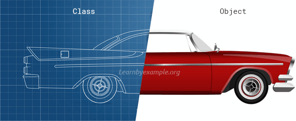
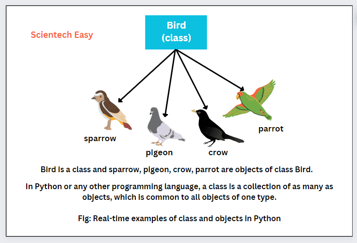
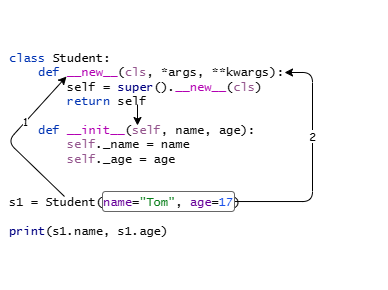
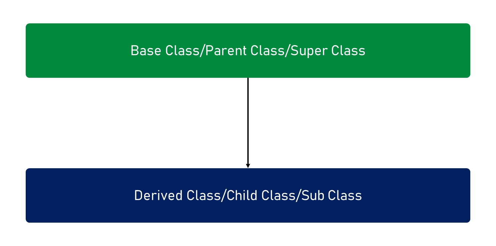
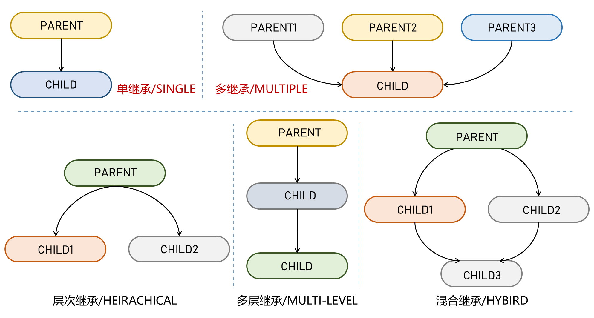
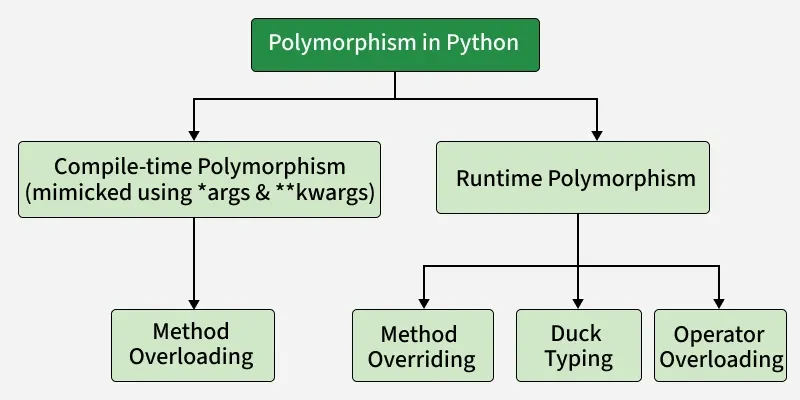

# 一、面向对象编程基础

## 1.1 什么是面向对象编程？

面向对象编程（`Object-Oriented Programming`，`OOP`）是一种编程范式，它通过将程序组织为对象的集合来解决问题。

每个对象包含数据（称为属性）和操作这些数据的函数（称为方法），从而实现对现实世界的模拟。

面向对象编程的核心概念包括**类**和**对象**，并围绕以下三个重要特性展开：**封装**、**继承**和**多态**。

● 类（`Class`）：类是对象的抽象模板，定义了一类对象的属性（数据）和方法（行为）。

● 对象（`Object`）：对象是类的实例，具体化了类的定义。每个对象都有独立的属性值和方法。





**面向对象编程的核心特性**

● 封装（`Encapsulation`）：通过将数据和操作数据的方法绑定在一起，隐藏内部实现细节，提供接口与外界交互，从而提高数据安全性和代码的可维护性。

● 继承（`Inheritance`）：子类可以继承父类的属性和方法，实现代码复用，并支持扩展和定制化。

● 多态（`Polymorphism`）：允许不同的对象以统一的接口调用不同的行为，从而提高代码的灵活性和扩展性。

**面向对象编程的优势**

1、模块化：程序可以被分解为多个独立的对象，便于管理和维护。

2、代码复用：通过继承和类的复用，减少代码的重复，提高开发效率。

3、灵活性和可扩展性：通过多态和接口，程序可以更容易地适应变化。

4、代码可读性：对象和类的设计使代码更贴近现实世界的场景，易于理解和维护。

## 1.2 如何定义类?

在 `Python` 中，类的基本结构包括以下几个核心部分：**类定义、初始化方法（构造函数）、属性、方法**。

```python

class ClassName:
    #类属性    
    #初始化方法
    #实例方法
    
```

其中：

● 类定义：使用 `class` 关键字定义类，`ClassName` 是类名，并且使用==大驼峰命名法==（`PascalCase`）。

● 初始化方法(`__init__`)，在实例创建完成后自动调用，用于初始化实例属性（对象状态）。

● 属性（`attribute`）：对象/类中用于保存数据的成员，用来描述状态或特征。属性分为实例属性(独有)和类属性（共享）。

● 方法（`method`）是在类中定义的函数，用于描述对象或类的行为。按绑定对象/调用约定不同，可分为实例方法、类方法和静态方法。

**示例代码**

```python

class Person:
    # 类属性：所有 Person 实例共享
    species = "Human"

    def __init__(self, name, age):
        # 实例属性：每个对象独有
        self.name = name
        self.age = age

    # 实例方法：操作实例属性
    def introduce(self):
        return f"我叫 {self.name}，今年 {self.age} 岁。"

```

## 1.3 如何实例化对象?

在 `Python` 中，实例化对象就是用 **类名 + 圆括号** 调用类，从而创建一个该类的实例（对象）。

**语法结构**

```python

obj = ClassName()

```

**实例化对象时提供参数**

如果类定义了 `__init__`，实例化对象时需要传入对应参数：

```python

p1 = Person("小明", 20)   # 实例化对象
p2 = Person("小红", 16)

```

**实例化时发生了什么?**

**1.调用 `__new__` 方法创建实例对象**

● `Python` 会首先调用类的 `__new__` 方法，这是实例化的第一步。

● `__new__` 方法负责创建对象并分配内存空间。它返回一个类的实例。

● 如果 `__new__` 方法没有显式定义，默认会调用父类（通常是 `object` 类）的 `__new__` 方法。

**2.调用 `__init__` 方法初始化对象**：

● 创建对象后，`Python` 会自动调用 `__init__` 方法对实例进行初始化。

● 在 `__init__` 方法中，可以设置实例属性、执行初始化逻辑等。

**注意：`__new__` 与 `__init__` 的区别**

● `__new__` 是类的实例化方法，负责创建对象，并返回该对象。

● `__init__` 是初始化方法，负责对创建好的对象进行初始化，设置属性等。

**示例代码**

```python

class MyClass:
    def __new__(cls, *args, **kwargs):
        print("调用 __new__ 方法")
        instance = super().__new__(cls)  # 创建实例
        return instance

    def __init__(self, name):
        print("调用 __init__ 方法")
        self.name = name  # 初始化实例属性

obj = MyClass("Test")

```

------

# 二、初始化方法

初始化方法（`__init__`） 在实例创建完成后会自动调用，用于设置实例的初始状态（例如初始化属性值）。

它是 `Python` 中的特殊方法，但并不是构造对象的函数，而是**初始化实例的函数**。

在 `Python` 中，构造函数标准语法结构如下：

```python

class ClassName:
    def __init__(self, param1, param2=default_value, *args, **kwargs):
        # 初始化实例属性
        self.attribute1 = param1
        self.attribute2 = param2
        ...

```

**重要说明**

**1、`__init__` 不是构造函数，而是初始化方法**

● 真正负责创建实例对象的是 `__new__` 方法。`__init__` 是在对象创建完成后，用于对实例的属性进行初始化。

● `__init__` 方法的作用是将传入的参数赋值给实例属性，设置实例的初始状态。

**2、`self` 是对当前实例对象的引用**

● `self` 是类中方法的第一个参数，表示类的当前实例。

● 通过 `self` 可以访问实例的属性和方法。

● 当通过实例调用实例方法时，`Python` 会自动将该实例作为第一个参数传入。

● `self` 不是关键字，可以使用其他名称代替，但约定俗成使用 `self`，以提高代码的可读性和一致性。

**3、`__init__` 方法必须返回 `None`**

● `__init__` 方法的返回值必须是 `None`，这是 `Python` 的强制性要求。

● 如果显式返回非 `None` 的值，将会抛出 `TypeError`。

**4、`__init__` 的调用顺序**

● 当子类没有定义 `__init__` 时，会自动调用父类的 `__init__`。

● 当子类定义了 `__init__` 时，父类的 `__init__` 不会被自动调用，需要显式调用。



# 三、属性

## 3.1 概述

在 `Python` 中，**属性（`attribute`）** 是类或对象中用于存储数据的变量，通常用来描述类或对象的状态或特征。

属性分为实例属性(`Instance Attribute`)和类属性（`Class Attribute`）。

## 3.2 实例属性

### 3.2.1 概述

实例属性是绑定到具体实例对象的属性，用于存储与该实例相关的数据。实例属性是类的实例独有的，每个实例的属性是独立的，互不干扰。

实例属性通常在类的 `__init__` 方法中定义，但也可以动态地添加到实例中。

**示例代码**

```python

class Person:
    def __init__(self, name, age):
        # 定义实例属性
        self.name = name
        self.age = age

# 创建实例
p1 = Person("Alice", 25)
p2 = Person("Bob", 30)

# 每个实例的属性是独立的
print(p1.name, p1.age)  # 输出：Alice 25
print(p2.name, p2.age)  # 输出：Bob 30

```

### 3.2.2 实例属性的特点

● 定义在类的 `__init__` 方法中，属于具体的实例对象。

● 每个实例都有自己独立的属性，互不影响。

● 通常用于存储与具体实例相关的信息。

● 实例属性存储在实例的**实例字典**中（`__dict__`）。

● 访问实例属性时，`Python` 会优先在**实例命名空间**中查找该属性。如果实例中没有该属性，才会去类的命名空间中查找类属性。

● 如果实例中定义了与类属性同名的属性，实例属性会**屏蔽**类属性（但不会修改类属性的值）。

● 在 `Python` 中，可以动态地为实例或类添加属性。动态添加的属性只会存在于具体的实例或类中，不会影响其他实例。

**示例代码**

```python

class Person:
    def __init__(self, name, age):
        self.name = name  # 实例属性
        self.age = age    # 实例属性

p1 = Person("Alice", 25)
p2 = Person("Bob", 30)

print(p1.name, p1.age)  # 输出：Alice 25
print(p2.name, p2.age)  # 输出：Bob 30

# 修改实例属性
p1.age = 26
print(p1.age)  # 输出：26
print(p2.age)  # 输出：30（未受影响）

```

### 3.2.3 实例属性的访问和操作

**1. 定义和访问实例属性**

● 定义实例属性：实例属性通常在 `__init__` 方法中通过 `self.attribute_name = value` 的方式定义。

● 访问实例属性：实例属性可以通过 `self.attribute_name` 的方式在类的内部访问。

**2. 在类的内部操作实例属性**

● 在类的内部，所有实例方法都可以通过 `self` 访问、修改或删除实例属性。

● 通过 `self.attribute_name = value` 可以修改实例属性的值。

● 可以使用 `del self.attribute_name` 删除实例属性。

**示例代码**

```python

class Person:
    def __init__(self, name, age):
        self.name = name
        self.age = age

    def update_name(self, new_name):
        # 修改实例属性
        self.name = new_name

    def delete_age(self):
        # 删除实例属性
        del self.age

# 创建实例
p = Person("Alice", 25)
print(p.name)  # 输出：Alice

p.update_name("Bob")  # 修改实例属性
print(p.name)  # 输出：Bob

p.delete_age()  # 删除实例属性
# print(p.age)  # 报错：AttributeError: 'Person' object has no attribute 'age'

```

### 3.2.4 属性装饰器

在 `Python` 中，**属性装饰器**是用于修饰类中属性的方法或函数的装饰器，主要用于控制属性的访问和修改行为。

**`@property`装饰器**

`@property`装饰器用于将一个方法转换为==只读属性==。可以让方法像属性一样被访问，而==不需要显式调用（即不需要加括号）==。

**示例代码**

```python

class Circle:
    def __init__(self, radius):
        self._radius = radius  # 私有属性

    @property
    def radius(self):
        """获取半径"""
        return self._radius

# 创建对象
c = Circle(5)
print(c.radius)  # 通过 @property，可以像访问属性一样调用方法
# 输出：5

```

**`@<property_name>.setter`装饰器**

`@<property_name>.setter`装饰器用于为通过 `@property` 定义的属性添加**设置值的功能**。

**示例代码**

```python

class Circle:
    def __init__(self, radius):
        self._radius = radius  # 私有属性

    @property
    def radius(self):
        """获取半径"""
        return self._radius

    @radius.setter
    def radius(self, value):
        """设置半径"""
        if value <= 0:
            raise ValueError("半径必须是正数")
        self._radius = value

# 创建对象
c = Circle(5)
print(c.radius)  # 输出：5

# 修改半径
c.radius = 10
print(c.radius)  # 输出：10

# 设置非法值会抛出异常
# c.radius = -5  # ValueError: 半径必须是正数

```

**注意**：`@<property_name>.setter` 必须与 `@property` 配合使用。

**`@<property_name>.deleter`装饰器**

`@<property_name>.deleter`装饰器用于为通过 `@property` 定义的属性添加**删除功能**。

```python

class Circle:
    def __init__(self, radius):
        self._radius = radius  # 私有属性

    @property
    def radius(self):
        """获取半径"""
        return self._radius

    @radius.setter
    def radius(self, value):
        """设置半径"""
        if value <= 0:
            raise ValueError("半径必须是正数")
        self._radius = value

    @radius.deleter
    def radius(self):
        """删除半径"""
        print("删除半径属性")
        del self._radius

# 使用示例
c = Circle(5)
print(c.radius)  # 输出：5

# 删除半径
del c.radius  # 输出：删除半径属性

```

**注意**：`@<property_name>.deleter` 必须与 `@property` 配合使用。

### 3.2.5 访问控制约定

● **公有属性/方法（`public`）**

默认所有属性和方法都是公有的，可以被类的内部和外部自由访问。

● **受保护属性/方法（`protected`）**

以单下划线 `_` 开头，表示该属性或方法是受保护的，约定为“仅供类及其子类内部使用”。

● **私有属性/方法（`private`）**

以双下划线 `__` 开头，触发名称改写机制（`name mangling`）。在类外部无法直接访问，但可以通过 `_ClassName__attribute` 访问。

**示例代码**

```python

class Person:
    def __init__(self, name, age):
        self.name = name         # 公有属性
        self._protected = "Protected"  # 受保护属性
        self.__private = "Private"     # 私有属性

    def get_private(self):
        return self.__private

p = Person("Alice", 25)
print(p.name)            # 直接访问公有属性，输出：Alice
print(p._protected)      # 直接访问受保护属性，输出：Protected
# print(p.__private)     # 报错：AttributeError
print(p._Person__private)  # 通过名称改写访问私有属性，输出：Private

```

## 3.3 类属性

### 3.3.1 概述

**类属性**是定义在类中的变量，它属于类本身，而不是某个具体的实例。类属性在所有实例之间共享，所有实例都可以访问和修改它。类属性通常用于存储与整个类相关的公共数据，而不是与某个具体实例相关的数据。

类属性在类定义时就已经存在，并且存储在类的命名空间中。相对地，实例属性是属于每个实例独有的，存储在实例的命名空间中。

### 3.3.2 类属性的特点

● 类属性是直接定义在类中的变量，而不是定义在 `__init__` 方法中的。

● 它们在类加载时就会被初始化，而不是在实例化时创建。

● 所有实例共享同一个类属性。

● 修改类属性会影响所有实例，因为它们引用的是同一个值。

● 类属性可以通过类名直接访问，也可以通过实例访问。

● 如果通过实例访问类属性，实际上访问的仍然是类属性（除非实例中有同名属性，实例属性会覆盖类属性）。

● 类属性可以通过类名动态添加或修改，所有实例都会共享这个新属性。

# 四、方法

## 4.1 概述

在 `Python` 中，**方法（`method`）** 是定义在类中的函数，用来描述类或对象的行为。方法的主要作用是操作类或实例的属性，或者实现特定的功能。

按绑定对象/调用约定不同，可分为实例方法（`Instance Method`）、类方法（`Class Method`）和静态方法（`Static Method`）。

## 4.2 实例方法

● 实例方法是类中定义的函数，默认情况下，第一个参数是 `self`，表示调用该方法的当前实例。

● 实例方法的主要作用是操作实例属性、调用其他实例方法，或者通过 `self.__class__` 访问类属性和调用类方法。通常用于实现与实例状态相关的业务逻辑。

```python

class ClassName:
    def method_name(self, param1, param2, ...):
        """
        方法的简要说明（可选）。
        
        参数:
        param1: 类型
            参数1的描述。
        param2: 类型
            参数2的描述。
        ...
        
        返回:
        返回值的描述（如果有）。
        """
        # 方法体：实现具体功能
        # 通过 self 访问实例属性或调用其他实例方法
        pass

```

## 4.3 类方法

### 4.3.1 概述

类方法（`Class Method`）是类中的一种特殊方法，它的第一个参数是表示当前类的 `cls`，而不是实例的 `self`。

类方法属于类本身，可以通过类名直接调用，也可以通过实例调用，但它不能直接访问实例属性（因为它不绑定具体的实例）。

类方法是用来操作类属性或执行与整个类相关的操作。

在 `Python` 中，类方法使用装饰器 **`@classmethod`** 来定义。

```python

class ClassName:
    @classmethod
    def method_name(cls, *args, **kwargs):
        # 方法体
        pass

```

### 4.3.2 类方法的特点

**1、类方法绑定类而非实例**

● `cls` 参数：类方法的第一个参数是 `cls`，表示类本身，而不是实例。

● 无法直接访问实例属性或实例方法：由于类方法是绑定到类本身的，而不是某个具体的实例，因此无法直接访问实例属性或调用实例方法。

**2、访问和操作类属性**

● 类方法可以通过 `cls` 参数访问和修改类属性（即定义在类中的属性）。

● 类方法也可以调用其他的类方法，或者通过 `cls` 创建类的实例。

**3、调用方式**

● 类方法可以通过**类名**调用，也可以通过**实例**调用。

● 不论通过类还是实例调用，类方法的第一个参数始终是类本身（`cls`），而非实例。

**4. 主要用途**

● 操作类属性：类方法适合用于操作类属性或实现与类本身相关的逻辑。

● 工厂方法（`Factory Method`）：类方法常用于实现工厂方法，提供一种创建类实例的便捷方式。

## 4.4 静态方法

```python

from decimal import Decimal


class Arithmetic:

    def addition(self, a, b):
        return Decimal(a + b).quantize(Decimal("0.00"))

    def subtraction(self, a, b):
        return Decimal(a - b).quantize(Decimal("0.00"))

    def multiplication(self, a, b):
        return Decimal(a * b).quantize(Decimal("0.00"))

    def division(self, a, b):
        return Decimal(a / b).quantize(Decimal("0.00"))


a1 = Arithmetic()
result1 = a1.addition(2, 3)
result2 = a1.subtraction(2, 3)
result3 = a1.multiplication(2, 3)
result4 = a1.division(2, 3)
print(result1, result2, result3, result4)

```

### 4.4.1 概述

**静态方法（`Static Method`）**是类中的一种特殊方法，它既不依赖于类（没有 `cls` 参数），也不依赖于实例（没有 `self` 参数）。

静态方法属于类的命名空间，但它无法访问类属性或实例属性。静态方法通常用于实现与类相关但独立于类和实例的逻辑。

在 `Python` 中，静态方法通过 **`@staticmethod`** 装饰器定义。

```python

class ClassName:
    @staticmethod
    def method_name(*args, **kwargs):
        # 方法体
        pass

```

```python

from decimal import Decimal


class Arithmetic:
    @staticmethod
    def format(value):
        return Decimal(value).quantize(Decimal("0.00"))

    def addition(self, a, b):
        value = a + b
        return self.format(value)

    def subtraction(self, a, b):
        value = a - b
        return self.format(value)

    def multiplication(self, a, b):
        value = a * b
        return self.format(value)

    def division(self, a, b):
        value = a / b
        return self.format(value)


a1 = Arithmetic()
result1 = a1.addition(2, 3)
result2 = a1.subtraction(2, 3)
result3 = a1.multiplication(2, 3)
result4 = a1.division(2, 3)
print(result1, result2, result3, result4)

```

### 4.4.2 静态方法的特点

**1、无绑定**

● 静态方法**不绑定到类或实例**，与类和实例没有直接的关联。

● 它本质上是一个普通的函数，但被定义在类的作用域内，因此可以通过类名或实例来调用。

● 静态方法的定义使用 `@staticmethod` 装饰器。

**2、不依赖类或实例**

● 静态方法**无法访问类属性**（通过 `cls`）或**实例属性**（通过 `self`）。

● 它不依赖于类或实例上下文，不能直接访问类或实例的状态。

● 通常用于实现与类相关的逻辑，但不需要访问类或实例的属性或方法。

**3、调用方式**

● 静态方法可以通过**类名**调用，也可以通过**实例**调用。

● 不论通过类还是实例调用，静态方法的行为完全一致，不依赖于调用者。

**4、主要用途**

● 静态方法通常用于实现一些与类相关的逻辑，但不需要访问类属性或实例属性的功能。

● 例如，一些通用的工具方法、数据处理逻辑等，可以放在静态方法中。

### 4.4.3 类方法与静态方法的区别

| 特性         | 类方法                                 | 静态方法                             |
| ------------ | -------------------------------------- | ------------------------------------ |
| 装饰器       | `@classmethod`                         | `@staticmethod`                      |
| 第一个参数   | `cls` (指向类本身的引用)               | 无隐式第一个参数                     |
| 访问类状态   | 可以（可以修改类状态）                 | 不可以（不能访问或修改类状态）       |
| 访问实例状态 | 不可以（没有`self`参数）               | 不可以（不能访问或修改实例状态）     |
| 使用场景     | 常用于工厂方法和影响类状态的方法       | 用于不需要访问类或实例状态的实用函数 |
| 继承性       | 绑定到类，而不是实例。子类继承并可重写 | 不与类继承交互。可重写，但保持静态   |
| 调用方式     | 可以在**类**或实例上调用               | 可以在**类**或实例上调用             |

## 4.5 析构器

析构器（`Destructor`） 是类中的一种特殊方法，用于在对象的生命周期结束时执行清理工作。它的主要作用是释放对象占用的资源，例如关闭文件、释放内存、断开网络连接或清理临时数据等。

在 `Python` 中，析构器是通过特殊方法 `__del__(self)` 实现的。当对象被销毁时，`Python` 会自动调用这个方法。

```python

class ClassName:
    
    def __del__(self):
    ...
    ...

```

需要注意的是，由于 Python 使用自动垃圾回收机制，**对象被销毁的时间是不确定的**。`Python` 的垃圾回收机制主要基于引用计数，当对象的引用计数降为 0 时，垃圾回收器会将其标记为可销毁对象。然而，垃圾回收器的运行时机由 `Python` 解释器决定，因此对象的销毁时间无法完全预测。

虽然可以在析构器（`__del__` 方法）中执行一些清理工作，但由于对象销毁的时间不确定，**不应该依赖析构器来管理重要的资源**，例如文件句柄、网络连接或数据库连接等。更好的做法是使用 **上下文管理器**（通过 `with` 语句）或显式地调用专门的资源释放方法来进行资源管理。

**上下文管理器**通过实现 `__enter__` 和 `__exit__` 方法，能够确保资源在使用完成后立即被释放，即使在代码块中发生异常时也能正常清理资源，从而避免资源泄漏问题。

# 五、继承

## 5.1 什么是继承？

继承（`Inheritance`）允许一个类（子类）继承另一个类（父类）的属性和方法

当一个子类继承一个父类时，子类将自动获得父类的属性和方法，并且可以根据需要在子类中添加新的属性和方法。这样的设计使得代码的重用变得更加简单，并且可以建立类之间的层次关系



在`Python`中，继承通过在子类的定义中指定一个或多个父类来实现 -- 多继承。



## 5.2 实现继承

```python

class ClassName(ParentClassName[,...]):
    ...

```

## 5.3 重写

重写（`Override`）是指子类重新定义从父类继承的方法，以改变或扩展继承的方法的行为。

**重写的规则**

1.重写方法时，子类中的方法应该与父类中被重写的方法具有相同的名称和方法签名（即相同的参数列表）。

2.如果在重写的方法中仍然需要调用父类中的原始方法，可以使用`super()`函数来实现。

## 5.4 方法解析顺序

方法解析顺序（`Method Resolution Order,MRO`）就是在查找成员时搜索全部基类所用的先后顺序。

`Python`中的多重继承的规则是由`C3`算法确定的，规定如下：

● **子类优先**

在方法解析顺序中，子类总是优先于父类。如果子类重写了某个方法，将调用子类中的方法。

● **从左到右**

如果一个类继承了多个类，那么在搜索方法或属性时，`Python`会从左到右依次搜索基类。

**可以通过静态方法`ClassName.mro()`获取方法解析顺序。**

```python

ClassName.mro()

```

`object`是所有类的基类，包括基本的方法，如`__init__`等。

**示例代码**

```python

class A:
    def process(self):
        print("A process")

class B(A):
    def process(self):
        print("B process")
        super().process()

class C(A):
    def process(self):
        print("C process")
        super().process()

class D(B, C):
    def process(self):
        print("D process")
        super().process()

obj = D()
obj.process()

# 输出：
# D process
# B process
# C process
# A process

# 查看MRO
print(D.mro())
# 输出：[<class '__main__.D'>, <class '__main__.B'>, <class '__main__.C'>, <class '__main__.A'>, <class 'object'>]

```

# 六、多态

## 6.1 什么是多态?

多态是面向对象编程的一个重要概念，它允许不同的对象对相同的方法做出不同的响应。

多态分为运行时多态和编译时多态。多态性是通过继承和重写方法来实现的。



**继承和方法重写**：子类可以继承父类的方法，并对其进行重写。当调用这些方法时，不同的子类对象会根据其自身的实现方式做出不同的响应。

**鸭子类型（Duck Typing）**：`Python`是一种动态类型语言，它强调对象的行为而不是类型。因此，只要对象具有特定的方法或属性，就可以在不考虑对象类型的情况下使用这些方法或属性。

## 6.2 鸭子类型

鸭子类型是 `Python`（以及很多动态语言）里常见的编程思想：**不看对象的“类型/继承关系”，只看它是否具备所需的“行为”（方法/属性）**

`Python` 标准用法里处处是鸭子类型。

很多内置操作依赖“协议”而非具体类型：

● `len(x)`：只要实现 `__len__()`

● `for ... in x`：只要可迭代（实现迭代协议）

● 类文件对象：只要有 `.read()` / `.write()` 就能被很多 `API` 使用

**示例代码**

```python

class MySQL:
    def insert(self):
        return '数据已插入到MySQL数据库'

    def update(self):
        return '数据已更新到MySQL数据库'

    def delete(self):
        return '数据已从MySQL数据库中删除'


class Oracle:
    def insert(self):
        return 'Data already add to oracle db'

    def update(self):
        return 'Data already updated'

    def delete(self):
        return 'Data already deleted'


def db_factory(db):
    return db

print(db_factory(MySQL()).insert())
print(db_factory(Oracle()).insert())

```

## 6.3 魔术方法

`Python OOP`中的魔术方法也是多态的一种表现形式。

魔术方法（`Magic Methods`）是指在`Python`中具有特殊命名约定的一类特殊方法。

这些方法以双下划线开头和结尾，例如`__init__`、`__str__`、`__repr__`等。

魔术方法也被称为双下划线方法或者特殊方法。

| 特殊方法                         | 作用                                                   |
| -------------------------------- | ------------------------------------------------------ |
| `__init__(self, [...])`          | 构造器方法，在创建新实例时初始化对象                   |
| `__del__(self)`                  | 析构器方法，在对象被销毁前调用                         |
| `__str__(self)`                  | 定义对象的“非正式”或可打印的字符串表示                 |
| `__repr__(self)`                 | 定义对象的“正式”字符串表示，通常可以用来重新创建该对象 |
| `__len__(self)`                  | 在对象上调用 `len()` 时返回集合的长度                  |
| `__getitem__(self, key)`         | 使对象可以使用索引操作符（如字典或列表）               |
| `__setitem__(self, key, value)`  | 使对象可以使用索引赋值操作符                           |
| `__delitem__(self, key)`         | 使对象可以响应使用索引删除操作符                       |
| `__iter__(self)`                 | 返回对象的迭代器，使其可迭代                           |
| `__next__(self)`                 | 定义迭代器的下一个元素是什么，使其可迭代               |
| `__contains__(self, item)`       | 定义对于 `in` 和 `not in` 操作符的行为                 |
| `__eq__(self, other)`            | 定义等于符号的行为                                     |
| `__ne__(self, other)`            | 定义不等于符号的行为                                   |
| `__lt__(self, other)`            | 定义小于符号的行为                                     |
| `__le__(self, other)`            | 定义小于等于符号的行为                                 |
| `__gt__(self, other)`            | 定义大于符号的行为                                     |
| `__ge__(self, other)`            | 定义大于等于符号的行为                                 |
| `__add__(self, other)`           | 定义加法操作的行为                                     |
| `__sub__(self, other)`           | 定义减法操作的行为                                     |
| `__mul__(self, other)`           | 定义乘法操作的行为                                     |
| `__truediv__(self, other)`       | 定义真除法操作的行为                                   |
| `__floordiv__(self, other)`      | 定义取整除法操作的行为                                 |
| `__mod__(self, other)`           | 定义求模操作的行为                                     |
| `__pow__(self, other[, modulo])` | 定义幂运算操作的行为                                   |
| `__and__(self, other)`           | 定义按位与操作的行为                                   |
| `__or__(self, other)`            | 定义按位或操作的行为                                   |
| `__xor__(self, other)`           | 定义按位异或操作的行为                                 |
| `__lshift__(self, other)`        | 定义左移位操作的行为                                   |
| `__rshift__(self, other)`        | 定义右移位操作的行为                                   |
| `__invert__(self)`               | 定义按位取反操作的行为                                 |
