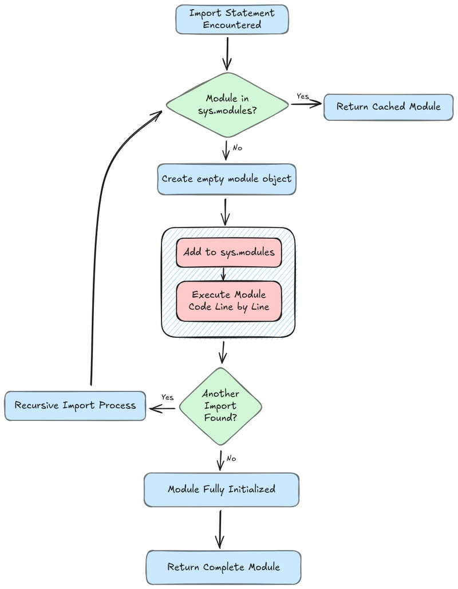

# 一、模块与包

## 1.1 引言

假设现在某个`Python`文件中已经封装好了函数，而另外的一个`Python`文件中要使用其他文件中已经封装的函数，那么怎么办？

`arithmeric.py`的代码如下：

```python

# 封装两个函数，分别完成数字的加法和减法操作
def add(a, b):
    result = a + b
    return result


def subtraction(a, b):
    result = a - b
    return result

```

## 1.2 模块

### 1.2.1 什么是模块

模块（`Module`） 是一个包含 `Python` 代码 的文件，通常以 `.py` 为扩展名。

模块可以包含 **变量、函数、类** 和 **可执行语句**，用于组织和复用代码。

通过模块，开发者可以将代码分成多个文件，从而提高代码的可读性和可维护性。

**模块的本质**：

● 模块本质上是一个 `Python` 文件。

● 文件名（去掉 `.py` 后缀）就是模块的名称。

● 当模块被导入时，`Python` 会执行文件中的代码，并将其中的定义加载到内存中。

**模块的分类**：

● 内置模块：`Python` 自带的模块，如 `os`、`sys`、`math` 等。

● 第三方模块：通过 `pip` 安装的模块，如 `numpy`、`pandas` 等。

● 自定义模块：用户自己编写的 `.py` 文件。

### 1.2.2 导入模块

导入模块 是指将一个模块加载到当前的 `Python` 脚本或交互式环境中，从而可以在当前作用域中访问该模块中定义的 **函数、类、变量** 等内容。

导入模块的目的是实现代码的复用，避免重复编写相同的代码。

**导入模块的语法结构**

**1.基本导入**

```python

import module_name

```

直接导入整个模块，使用模块名作为前缀访问其中的内容。

示例代码

```python

import math

print(math.sqrt(16))  # 输出：4.0

```

**2.导入特定内容**

```python

from module_name import item1, item2, ...

```

从模块中导入特定的函数、类或变量，直接在当前作用域中使用。

示例代码

```python

from math import sqrt, pi

print(sqrt(16))  # 输出：4.0
print(pi)        # 输出：3.141592653589793

```

**3.为模块或内容指定别名**

```python

import module_name as alias

from module_name import item as alias

```

给模块或导入的内容指定一个别名，便于简化代码书写或避免命名冲突。

示例代码

```python

import math as m
print(m.sqrt(16))  # 输出：4.0

from math import sqrt as square_root
print(square_root(16))  # 输出：4.0

```

**4.导入模块中的所有内容（不推荐）**：

```python

from module_name import *

```

将模块中的所有内容导入到当前作用域。不推荐使用这种方式，因为可能会导致命名冲突和代码难以阅读。

示例代码

```python

from math import *

print(sqrt(16))  # 输出：4.0


```

### 1.2.3 模块的导入过程

当导入一个模块时，`Python` 会执行以下步骤：

1.触发导入：解释器执行到 `import ...` / `from ... import ...`。

2.查询模块缓存：检查目标模块是否已存在于 `sys.modules`，若存在：直接返回缓存的模块对象（通常不会重复执行模块顶层代码）。

3.定位模块：若缓存未命中，根据导入机制在 `sys.path`（以及包结构/查找器与加载器）中查找模块位置与加载方式。

4.创建模块对象并提前缓存：创建一个模块对象（初始可能尚未完整初始化），并立即写入 `sys.modules`，以防循环导入导致的递归加载。

5.执行模块代码：加载器执行模块的顶层代码；执行过程中如遇到新的 `import`，会递归触发同样流程。

6.完成初始化并绑定名称：模块代码执行完毕后，模块视为初始化完成；`import` 语句将模块对象绑定到当前命名空间中的相应名字。



### 1.2.4 模块的导入路径与导入顺序

`Python` 查找模块的路径由 `sys.path` 决定。默认情况下，`sys.path` 包括：

1.当前工作目录：如果运行脚本，则是脚本所在的目录；若在交互式解释器中运行，则是启动 `Python` 解释器的目录。

2.环境变量 `PYTHONPATH` 中指定的路径（如果设置了该环境变量）。

3.标准库路径：`Python` 安装目录下的标准库路径（如 `lib` 或 `Lib` 文件夹）。

4.第三方模块路径：通常位于 `site-packages` 目录，存储通过 `pip` 等工具安装的第三方库。

5.其他路径：例如 `ZIP` 文件、`.egg` 文件或通过自定义查找器和加载器提供的路径。

此外，`Python` 还支持直接加载内置模块（如 `sys`、`os` 等），这些模块不依赖文件路径。

模块的查找顺序如下：

1.内置模块： 首先检查是否是 `Python` 的内置模块（如 `math`、`sys` 等），如果是，则直接加载。

2.已加载模块的缓存： 检查模块是否已经被导入（`sys.modules`），如果存在缓存，直接返回模块对象。

3.当前工作目录： 如果模块未被缓存，`Python` 会在当前工作目录中查找目标模块。

4.`PYTHONPATH`： 如果模块不在当前目录中，`Python` 会检查环境变量 `PYTHONPATH` 中指定的路径。

5.标准库路径： 如果模块不在 `PYTHONPATH` 中，`Python` 会在标准库路径中查找。

6.`site-packages`： 如果模块不在标准库中，`Python` 会在 `site-packages` 目录中查找第三方模块。

7.其他路径： `Python` 支持从 `ZIP` 文件、`.egg` 文件以及通过自定义查找器加载模块。

8.模块未找到： 如果所有路径中都找不到模块，`Python` 会抛出 `ModuleNotFoundError`。

### 1.2.5 模块命名规则

**1.使用小写字母**

● 模块的名称应该全部使用小写字母，避免使用大写字母或混合大小写。

● 如果模块名称由多个单词组成，可以使用下划线 `_` 分隔单词，但通常更推荐使用单个单词（无下划线）的模块名。

 **2.避免使用特殊字符**

● 模块名称只能包含字母、数字和下划线（`_`），不能包含其他特殊字符（如 `-`、`@` 等）。

 **3.避免与标准库模块同名**

● 避免使用与 `Python` 标准库模块相同的名称，以免造成命名冲突。

● 如果模块名称与标准库模块同名，`Python` 会优先加载当前目录下的模块，而不是标准库中的模块，这可能会导致意外行为。

**4.避免与内置函数或关键字同名**

● 不要使用 `Python` 内置函数（如 `print`、`list`、`dict` 等）或关键字（如 `if`、`for`、`while` 等）作为模块名。

● 否则可能会覆盖内置函数或关键字，导致程序出现错误。

## 1.3 包

### 1.3.1 什么是包？

在 `Python` 中，包（`package`） 是一种组织和管理模块的方式，它允许开发者将相关的模块（即 `.py` 文件）分组到一个目录中，从而形成一个逻辑上的整体。

包的主要作用是提供模块的层次结构，方便代码的组织、管理和复用。

包的标志：目录中包含一个特殊文件 **`__init__.py`**，该文件表明该目录是一个 `Python` 包。

### 1.3.2 显示包和隐式包

在 P`ython 3.3` 及更高版本中，包可以分为两种类型：**显式包（`Explicit Package`）** 和 **隐式命名空间包（`Implicit Namespace Package`）**。

它们的主要区别在于是否包含 `__init__.py` 文件。

#### 1.3.2.1 显示包

显式包是指包含 `__init__.py` 文件的目录。`__init__.py` 文件是显式包的标志，它可以是一个空文件，也可以包含包的初始化代码。

**特点**

**1.需要 `__init__.py` 文件**

● 显式包的目录中必须包含一个 `__init__.py` 文件。

● 在 `Python 3.3` 之前，`__init__.py` 文件是必须的；在 `Python 3.3` 之后，虽然可以省略，但显式包仍然需要 `__init__.py` 文件来明确标识。

**2.支持包的初始化**：

● `__init__.py` 文件中的代码会在包被导入时自动执行，可以用于初始化包。

**3.兼容性更好**：

显式包兼容 `Python 2` 和 `Python 3`，因此在需要支持旧版本 `Python` 的项目中，显式包是必需的。

**4.适用于复杂包结构**：

显式包支持更复杂的包结构，例如嵌套子包、跨模块导入等。

#### 1.3.2.2 隐式命名空间包

隐式命名空间包 是指没有 `__init__.py` 文件的目录。在 `Python 3.3` 及更高版本中，这种目录也会被视为包。

**特点**

**1.不需要 `__init__.py` 文件**：

● 在目录中没有 `__init__.py` 文件时，Python 会自动将该目录视为一个隐式命名空间包。

**2.不能包含初始化代码**：

● 因为没有 `__init__.py` 文件，隐式包无法在导入时执行初始化逻辑。

**3.适合简单包结构**：

● 隐式包适合用于简单的项目结构，不需要复杂的初始化逻辑。

**4.支持跨目录命名空间**：

● 隐式命名空间包可以分布在多个目录中，Python 会将这些目录合并为一个逻辑上的包。

## 1.4 `__init__.py`

### 1.4.1 什么是 `__init__.py`？

● `__init__.py` 是一个特殊的 `Python` 文件，用于初始化一个 `Python` 包。它是 `Python` 包结构的核心部分。

● 在 `Python 3.3` 之前，`__init__.py` 文件是 **必须的**，因为它的存在是 `Python` 将一个目录识别为包的标志。

● 从 `Python 3.3` 开始，即使目录下没有 `__init__.py` 文件，`Python` 也可以将其识别为一个隐式命名空间包。

### 1.4.2 `__init__.py` 的作用

**1.初始化包**

当导入一个包时，`Python` 会自动执行 `__init__.py` 文件中的代码。因此，可以在 `__init__.py` 文件中放置一些初始化逻辑，例如：

● 定义全局变量。

● 执行初始化操作（如加载配置文件、数据库连接等）。

● 导入包中的子模块或子包。

```tex

project/
├── main.py
├── package1/
│   ├── module1.py
│   └── module2.py

```

**文件：`package1/__init__.py`**

```python

print("Initializing package1...")

# 定义全局变量
version = "1.0.0"

# 导入子模块
from . import module1
from . import module2

```

**文件：`main.py`**

```python

import package1

# 输出 version
print(package1.version)

# 使用 package1.module1
package1.module1.some_function()

```

**2.控制包的导入行为**

在 `__init__.py` 文件中，可以使用 `__all__` 来定义包的公共接口，控制用户通过 `from package import *` 导入时，能够访问哪些模块。

**文件：`package1/__init__.py`**

```python

# 定义包的公共接口
__all__ = ['module1']  # 只允许导入 module1

```

**文件：`main.py`**

```python

from package1 import *

# 只能访问 module1，module2 无法直接访问
module1.some_function()

# 下面的代码会报错
# module2.another_function()

```

**3.简化包的导入路径**

通过在 `__init__.py` 中导入包中的模块或子包，可以让用户直接通过包名访问这些模块，而不需要指定完整的路径。

**示例：** **文件：`package1/__init__.py`**

```

# 导入子模块
from . import module1
from .subpackage import module2

```

**文件：`main.py`**

```python

import package1

# 可以直接通过 package1 访问模块
package1.module1.some_function()
package1.subpackage.module2.another_function()

```

**4.动态导入模块**

在某些场景中，可以通过 `__init__.py` 动态导入模块。例如，根据不同的条件或配置文件选择性地导入模块。

**示例：** **文件：`package1/__init__.py`**

```python

import os

if os.name == 'posix':  # 如果是 Linux 或 macOS
    from . import module1
else:  # 如果是 Windows
    from . import module2
    
```

**文件：`main.py`**

```python

import package1

# 根据操作系统动态导入的模块
package1.module1.some_function()  # 如果是 Linux/macOS
# 或
package1.module2.some_function()  # 如果是 Windows

```

## 1.5 绝对导入和相对导入

### 1.5.1 绝对导入

绝对导入是指从项目的根目录开始，通过模块的完整路径来导入模块或包。无论当前文件的实际位置，绝对导入都可以准确地定位到目标模块。

**特点**

● 基于项目的根目录。

● 使用模块的全路径，清晰明了。

● 在大型项目中，绝对导入更常用，因为它能够避免路径混淆。

假设项目结构如下：

```tex

project/
├── main.py
├── package/
│   ├── __init__.py
│   ├── module1.py
│   └── subpackage/
│       ├── __init__.py
│       └── module2.py

```

**导入同一层级的模块**

在 `main.py` 中导入 `module1.py`：

```python

import package.module1 

package.module1.fun1()

```

或者

```python

from package import module1 

module1.fun1()

```

**导入子包中的模块**

在 `main.py` 中导入 `module2.py`：

```python

import package.subpackage.module2

package.subpackage.module2.fun2()

```

或者

```python

from package.subpackage import module2

module2.fun2()

```

**导入模块中的特定对象**

在 `main.py` 中导入 `module1.py` 中的某个函数或类：

```python

from package.module1 import fun1

from package.subpackage.module2 import fun2

fun1()
fun2()

```

### 1.5.2 相对导入

相对导入是基于当前模块所在的目录，通过相对路径来导入目标模块。相对路径使用点号（`.` 和 `..`）来表示目录的层级关系：

● `.` 表示当前目录。

● `..` 表示上一级目录。

**特点**

● 相对导入是基于当前模块在包结构中的位置，而不是运行脚本的工作目录。

● 相对导入只能在包内的模块中使用，不能用于直接运行的脚本（即 `__name__ == "__main__"` 的脚本），因为直接运行的脚本没有明确的包上下文。

```tex

project/
├── main.py
├── package1/
│   ├── __init__.py
│   ├── module1.py
│   └── subpackage/
│       ├── __init__.py
│       ├── module2.py
│       └── module3.py
├── package2/
│   ├── __init__.py
│   ├── module4.py
│   └── subpackage/
│       ├── __init__.py
│       ├── module5.py
│       └── module6.py


```

**从 `module2.py` 导入 `module3.py`**

在同一个子包的模块之间，可以使用单个点号 `.` 进行相对导入。

**文件：`package1/subpackage/module2.py`**

```python

# 从当前子包中导入 module3
from . import module3

# 调用 module3 中的某个函数
module3.some_function()

```

或者

```python

from .module3 import some_function

```

**从 `module2.py` 导入 `module1.py`**

当需要从上一级目录的模块中导入内容时，可以使用 `..`。

**文件：`package1/subpackage/module2.py`**

```python

# 从上一级目录导入 module1
from .. import module1

# 调用 module1 中的某个函数
module1.some_function()

```

或者

```python

from ..module1 import some_function()

```

### 1.5.3 项目根目录

项目的根目录是指项目的顶级目录，即项目中所有代码文件和子目录的起始点。通常是 `Python` 解释器查找模块时的起点，也是 `sys.path` 中的一个重要路径。

**如何确定项目根目录？**

`Python` 的项目根目录可以通过以下方式确定：

**1.当直接运行脚本时**

当直接运行某个脚本（比如 `python main.py`），此脚本所在的目录会被视为项目的根目录。

```txt

project/
├── main.py
├── package/
│   ├── __init__.py
│   ├── module1.py
│   └── subpackage/
│       ├── __init__.py
│       └── module2.py

```

如果你通过以下命令运行 `main.py`：

```shell

python main.py

```

那么，`project/` 就是项目的根目录。

**2.当使用 `python -m` 执行包中的模块时**

如果使用 `python -m` 来运行包中的模块，则**项目根目录是包含包的顶级目录**。

**示例：** 假设你在 `project` 目录中运行以下命令：

```shell

python -m package.subpackage.module2

```

在这种情况下，`project/` 是项目的根目录。