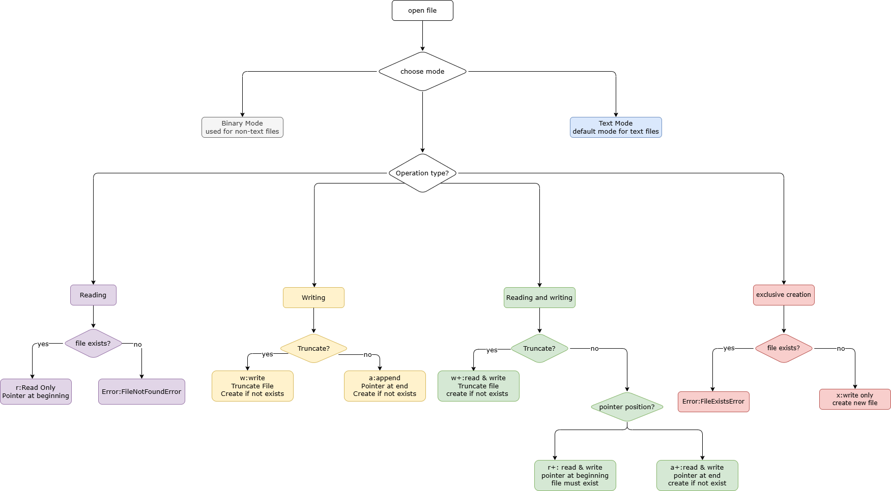

# 一、`OS`模块

`OS`（`Operating System`，操作系统）模块是`Python`标准库中的一个模块，用于与操作系统交互。

它提供了一系列函数和方法，可以执行文件和目录操作、环境变量管理、进程管理以及其他与操作系统相关的任务。

`os`模块的功能主要分为：目录和文件操作、路径操作、环境变量操作、操作系统信息等。

```python

import os

```

## 1.1 常用属性

| 属性         | 描述                                                         |
| ------------ | ------------------------------------------------------------ |
| `os.name`    | 返回操作系统的名称标识字符串                                 |
| `os.sep`     | 返回操作系统用来分隔路径不同部分的字符。在 `POSIX` 上是 `'/'`，在 `Windows` 上是 `'\\'` |
| `os.pathsep` | 返回操作系统通常用于分隔搜索路径中不同部分的字符，如 `POSIX` 上是 `':'`，`Windows` 上是 `';'` |
| `os.linesep` | 返回当前平台用于分隔行的字符串。如 `POSIX` 上是 `'\n'`， `Windows` 上是 `'\r\n'` |
| `os.extsep`  | 返回分隔基本文件名与扩展名的字符                             |
| `os.curdir`  | 返回当前目录符号                                             |
| `os.pardir`  | 返回上级目录符号                                             |
| `os.environ` | 一个 `mapping` 对象，其中键值是代表进程环境的字符串          |

```python

import os

# 常用属性

print(f'os.name:{os.name}')
print(f'os.sep:{os.sep}')
print(f'os.line:{os.linesep}')
print(f'os.pathsep:{os.pathsep}')
print(f'os.extsep:{os.extsep}')
print(f'os.curdir:{os.curdir}')
print(f'os.pardir:{os.pardir}')
print(f'os.environ:{os.environ}')

###############################################
for key,value in os.environ.items():
    print(key,value)
    
```

## 1.2 目录管理

### 1.2.1 `mkdir()`函数

`mkdir()`函数用于创建目录，语法结构：

```python

os.mkdir(path: StrOrBytesPath, mode: int = 0o777) -> None

```

### 1.2.2 `makedirs()`函数

`makedirs()`函数用于递归创建目录，语法结构：

```python

os.makedirs(name: StrOrBytesPath, mode: int = 0o777, exist_ok: bool = False) -> None

```

### 1.2.3 `rmdir()`函数

`rmdir()`函数用于删除空目录，语法结构为：

```python

os.rmdir(path: StrOrBytesPath) -> None

```

### 1.2.4 `removedirs()`函数

`removedirs()`函数用于递归删除空目录，语法结构为：

```python

os.removedirs(name: StrOrBytesPath) -> None

```

### 1.2.5 `listdir()`函数

`listdir()`函数用于返回由指定目录中条目名称组成的列表，语法结构：

```python

os.listdir(path: StrPath | None = None) -> list[str]

os.listdir(path: BytesPath) -> list[bytes]

```

### 1.2.6 `scandir()`函数

`scandir()`函数返回一个 `os.DirEntry` 对象的迭代器，它们对应于指定目录中的条目，语法结构：

```python

os.scandir(path: None = None) -> _ScandirIterator[str]
os.scandir(path: GenericPath[AnyStr]) -> _ScandirIterator[AnyStr]

```

### 1.2.7 `getcwd()`函数

`getcwd()`函数用于返回表示当前工作目录的字符串，语法结构：

```python

os.getcwd()

```

### 1.2.8 `chdir()`函数

`chdir()`函数用于将当前工作目录更改为指定目录，语法结构：

```python

os.chdir(path: FileDescriptorOrPath) -> None

```

## 1.3 路径操作

`os.path` 是 `Python` `os` 模块中的一个子模块，专门用于**路径操作**。

它提供了一系列函数，用于处理文件路径，例如拼接路径、获取文件名或扩展名、检查路径是否存在等。

### 1.3.1 `abspath()`函数

`abspath()` 函数用于将给定的路径转换为绝对路径，语法结构为：

```python

os.path.abspath(path:StrOrBytesPath)

```

### 1.3.2 `isabs()`函数

`isabs()`函数用于返回路径是否为绝对路径，语法结构为：

```python

os.path.isabs(path:StrOrBytesPath)

```

### 1.3.3 `basename()`函数

`basename()`函数用于返回路径中的文件名部分，语法结构为：

```python

os.path.basename(p:StrOrBytesPath)

```

### 1.3.4 `dirname()`函数

`basename()`函数用于返回路径中的目录部分，语法结构为：

```python

os.path.dirname(p:StrOrBytesPath)

```

### 1.3.5 `exists()`函数

`exists()`函数用于返回路径是否存在，语法结构为：

```python

os.path.exists(path:StrOrBytesPath)

```

### 1.3.6 `isfile()`函数

`isfile()`函数用于返回路径是否为文件，语法结构为：

```python

os.path.isfile(path:StrOrBytesPath)

```

### 1.3.7 `isdir()`函数

`isfile()`函数用于返回路径是否为目录，语法结构为：

```python

os.path.isfile(s:StrOrBytesPath)

```

### 1.3.8 `join()`函数

`join()`函数用于智能地合并一个或多个路径部分，语法结构为：

```python

os.path.join(path:StrOrBytesPath, *paths:StrOrBytesPath)

```

### 1.3.9 `split()`函数

`split()`函数用于将路径拆分为元组 -- `head`和`tail`，`tail` 是路径的最后一部分，而 `head` 里是除最后部分外的所有内容，语法结构为：

```python

os.path.split(path:StrOrBytesPath)

```

### 1.3.10 `splitext()`函数

`splitext()`函数用于将路径拆分为元组 -- `root`和`ext`，语法结构为：

```python

os.path.splitext(path:StrOrBytesPath)

```

### 1.3.11 `getsize()`函数

`getsize()`函数用于获取路径的大小 -- 以字节为单位，语法结构为：

```python

os.path.getsize(filename)

```

### 1.3.12 `getctime()`函数

`getctime()`函数用于获取指定路径的创建时间，即文件系统记录的创建或状态更改时间，语法结构为：

```python

os.path.getctime(filename)

```

### 1.3.13 `getmtime()`函数

`getmtime()`函数用于获取指定路径的修改时间，语法结构为：

```python

os.path.getmtime(filename)

```

### 1.3.14 `getatime()`函数

`getatime()`函数用于获取指定路径的访问时间，语法结构为：

```python

os.path.getatime(filename)

```

```python

import os
import time

# 文件路径
filepath = '1.txt'

# 获取绝对路径
realpath = os.path.realpath(filepath)
# 文件名
basename = os.path.basename(realpath)
# 所在目录
dirname = os.path.dirname(realpath)
# 是否存在
exists = os.path.exists(realpath)
# 是否为文件/目录
is_file = os.path.isfile(realpath)
is_dir = os.path.isdir(realpath)
# 路径拆分
parent_dir, file_name = os.path.split(realpath)
file_root, file_ext = os.path.splitext(realpath)

print(f"绝对路径: {realpath}")
print(f"文件名: {basename}")
print(f"所在目录: {dirname}")
print(f"是否存在: {exists}")
print(f"是否为文件: {is_file}")
print(f"是否为目录: {is_dir}")
print(f"父目录: {parent_dir}")
print(f"文件名（含扩展名）: {file_name}")
print(f"文件主名: {file_root}")
print(f"文件扩展名: {file_ext}")

if exists and is_file:
    # 文件大小
    size = os.path.getsize(realpath)
    # 时间戳转为可读时间
    mtime = os.path.getmtime(realpath)
    ctime = os.path.getctime(realpath)
    atime = os.path.getatime(realpath)
    print(f"文件大小: {size} 字节")
    print(f"最后修改时间: {time.ctime(mtime)}")
    print(f"创建时间: {time.ctime(ctime)}")
    print(f"最后访问时间: {time.ctime(atime)}")
elif exists and is_dir:
    print("该路径是一个目录。")
else:
    print("文件或目录不存在，请检查路径。")

```

## 1.4  文件操作

### 1.4.1 `remove()`函数

`remove()` 函数用于删除文件系统中的文件，语法结构为：

```python

os.remove(path:StrOrBytesPath)

```

### 1.4.2 `rename()`函数

`rename()`函数用于重命名文件或目录，语法结构为：

```python

os.rename(src: StrOrBytesPath, dst: StrOrBytesPath)

```

### 1.4.3 `replace()`函数

 替换文件或目录

### 1.4.4 `link()`函数

 创建硬链接

### 1.4.5 `symlink()`函数

 创建符号链接（软链接）

### 1.4.6 `readlink()`函数

 读取符号链接指向的路径

## 1.5 `DirEntry`

由 `scandir()` 生成的对象，用于显示目录内某个条目的文件路径和其他文件属性。

`os.DirEntry` 实例所包含的属性和方法如下：

### 1.5.1  `name`属性

用于返回本条目的基本文件名

### 1.5.2 `path`属性

用于返回本条目的完整路径

### 1.5.3 `is_dir()`方法

`is_dir()`方法在本条目为目录或者指向目录的符号链接时返回`True`，其语法结构为：

```python

item.is_dir()

```

### 1.5.4 `is_file()`

`is_file()`方法在本条目为文件或者指向文件的符号链接时返回`True`，其语法结构为：

```python


item.is_file()

```

## 1.6 环境变量操作

### 1.6.1 `environ`

### 1.6.2 `getenv()`函数

### 1.6.3 `setenv()`函数

# 二、文件操作

在 `Python` 中，文件操作是一个非常重要的功能，主要用于对文件进行创建、读取、写入、删除等操作。

## 2.1 `open()`函数

`open()`函数用于打开 `file` 并返回对应的 `file object`，其语法结构为：

```python

open(file, mode='r',  encoding=None,  closefd=True)

```

● `file`参数要打开的文件路径及名称

常用的路径符号：

● `1.txt`：当前工作目录下的 `1.txt`

● `./1.txt`：当前工作目录下的 `1.txt`，`.` 表示当前目录

● `../1.txt`：上一级目录下的 `1.txt`，`..` 表示上一级目录

● `../../1.txt`：上上一级目录下的 `1.txt`

● `data/1.txt`：当前工作目录下 `data` 文件夹里的 `1.txt`

● `/Users/xuji/Desktop/1.txt`：绝对路径，从系统根目录开始定位文件

注意：这里的“当前目录”通常指程序运行时的**当前工作目录**，可以用 `os.getcwd()` 查看。

● `mode`参数指打开时的模式

| 字符    | 含义                                           |
| :---- | :------------------------------------------- |
| `'r'` | 读取（默认）(`read`)                               |
| `'w'` | 写入，并先截断文件(`write`)，如果文件不存在则自动创建              |
| `'x'` | 排它性创建，如果文件已存在则失败                             |
| `'a'` | 打开文件用于写入，如果文件存在则在末尾追加(`append`)，如果文件不存在则自动创建 |
| `'b'` | 二进制模式                                        |
| `'t'` | 文本模式（默认）                                     |
| `'+'` | 打开用于更新（读取与写入）                                |



## 2.2 `write()`方法

`write()`用于写入内容，语法结构为：

```python

file.write(content)

```

## 2.3 `writelines()`方法

`writelines()`用于写入内容，不添加换行符，语法结构为：

```python

file.writelines(content)

```

## 2.4 `read()`方法

`read()`用于读取全部内容，语法结构为：

```python

file.read()

```

## 2.5 `readline()`方法

`readline()`用于读取一行的内容，语法结构为：

```python

file.readline()

```

## 2.6 `close()`方法

`close()`方法用于关闭文件，语法结构为：

````python

file.close()

````

## 2.7 上下文管理器

### 2.7.1 什么是上下文管理器？

上下文管理器（`Context Manager`）是 `Python` 中用于**管理资源**的工具，可以确保资源在使用后被正确地清理或释放。

上下文管理器通常通过 `with` 语句实现，它能够自动处理资源的初始化和释放，避免开发者手动管理资源的生命周期。

### 2.7.2 上下文管理器的特点

**1.资源管理**

● 用于管理需要显式打开和关闭的资源，例如文件、数据库连接、网络连接等。

● 上下文管理器会在进入和退出代码块时自动执行特定的操作（如打开和关闭资源）。

**2.自动清理**

● 无论代码块是否正常执行，或者发生异常，`with` 语句都会确保资源被正确关闭或释放。

**3.简洁性和安全性**

● 使用上下文管理器可以避免资源泄漏问题，代码更简洁、可读性更强。

### 2.7.3 **上下文管理器的基本语法**

```python

with expression as variable:
    # 在这里使用资源
    pass

# 资源会在这里自动释放

```

● `expression`：返回一个上下文管理器对象，通常是支持上下文管理的对象（如文件对象）。

● `as variable`：可选，绑定上下文管理器对象到变量，以便在代码块中使用。

### 2.7.4 常见的上下文管理器

**1.文件操作**

文件对象是最常见的上下文管理器，使用 `with` 语句可以确保文件在使用后被正确关闭。

```python

# 使用上下文管理器打开文件
with open("example.txt", "w") as file:
    file.write("Hello, World!")  # 写入内容

# 文件会在退出 `with` 代码块时自动关闭
print(file.closed)  # 输出: True

```

**2. 数据库连接**

上下文管理器可以用于管理数据库连接，确保连接在使用后被正确关闭。

```python

import sqlite3

# 使用上下文管理器管理数据库连接
with sqlite3.connect("example.db") as conn:
    cursor = conn.cursor()
    cursor.execute("CREATE TABLE IF NOT EXISTS users (id INTEGER, name TEXT)")
    cursor.execute("INSERT INTO users VALUES (1, 'Alice')")
    conn.commit()

# 数据库连接会自动关闭

```

# 三、`datetime`模块

## 3.1 概述

`datetime` 是 `Python` 标准库中用于处理日期和时间的模块。

提供了丰富的功能，包括日期、时间和日期时间的表示与操作，支持日期和时间的计算、格式化，以及时区处理等功能，是开发中处理时间相关需求的首选工具。

| 类名                 | 说明                   |
| -------------------- | ---------------------- |
| `datetime.date`      | 表示日期（年月日）     |
| `datetime.time`      | 表示时间（时分秒微秒） |
| `datetime.datetime`  | 表示日期和时间的组合   |
| `datetime.timedelta` | 表示时间间隔           |
| `datetime.tzinfo`    | 时区信息抽象基类       |
| `datetime.timezone`  | 时区实现类             |

**常量**

`datetime.MINYEAR`表示`date` 或 `datetime` 对象允许的最小年份数值。 `MINYEAR` 为 `1`。

`datetime.MAXYEAR`表示`date` 或 `datetime` 对象允许的最大年份数值。 `MAXYEAR` 为 `9999`。

```python

import datetime

# 输出 datetime 支持的最小年份
print(f"datetime 支持的最小年份: {datetime.MINYEAR}")

# 输出 datetime 支持的最大年份
print(f"datetime 支持的最大年份: {datetime.MAXYEAR}")

```

## 3.2 `date` 类

`date` 对象表示一个理想化的格里高利历中的日期（年、月和日），不考虑历史上的历法变迁。

该历法被视为在时间轴上向前和向后无限延伸，但在实现中，`date` 对象可表示的日期范围是从公元 1 年 1 月 1 日到公元 9999 年 12 月 31 日。

### 3.2.1 构造方法

```python

datetime.date(year, month, day)

```

所有参数都是必要的。 参数必须是在下面范围内的整数：

● `MINYEAR <= year <= MAXYEAR`

● `1 <= month <= 12`

● `1` <= 日期 <= 给定年月对应的天数

### 3.2.2 类方法

#### 3.2.2.1 `today()`方法

`datetime.date.today()`用于返回当前的本地日期，语法结构为：

```python

datetime.date.today()

```

#### 3.2.2.2 `fromtimestamp()`方法

`datetime.date.fromtimestamp()`方法将返回对应于 `POSIX` 时间戳的当地时间，语法结构：

```python

datetime.date.fromtimestamp(timestamp)

```

#### 3.2.2.3 `fromisoformat()`方法

`datetime.date.fromisoformat()`方法用于从`ISO 8601`格式的字符串构建日期，语法结构：

```python

datetime.date.fromisoformat(date_string)

```

`ISO 8601`日期标准格式：`YYYY-MM-DD`

```python

import datetime

# 获取当前本地日期
today = datetime.date.today()

# 通过时间戳获取日期（1716345600 代表 2024-05-22 00:00:00 UTC）
timestamp_date = datetime.date.fromtimestamp(1716345600)

# 通过 ISO 8601 格式字符串获取日期
iso_date = datetime.date.fromisoformat('2025-01-01')

# 打印结果
print("当前日期:", today)
print("时间戳对应日期:", timestamp_date)
print("ISO格式字符串对应日期:", iso_date)

```

### 3.2.3 实例方法

#### 3.2.3.1`isoformat()`方法

`isoformat()`方法返回以 `ISO 8601` 格式 `YYYY-MM-DD` 表示日期的字符串，语法结构：

```python

date.isoformat()

```

#### 3.2.3.2 `strftime()`方法

`strftime()`方法返回一个由显式格式字符串所控制的日期的字符串，语法结构：

```python

date.strftime(format)

```

#### 3.2.3.3 `weekday()`方法

`weekday()`方法返回一个整数代表星期几，星期一为0，星期天为6，语法结构：

```python

date.weekday()

```

#### 3.2.3.4 `replace()`方法

`replace()`方法返回一个具有同样的值，但更新了指定形参的新的 `date` 对象，语法结构：

```python

date.replace(year=self.year, month=self.month, day=self.day)

```

```python

import datetime

# 创建一个日期对象
d = datetime.date(2025, 5, 22)

# isoformat(): 转为 ISO 8601 格式字符串
iso_str = d.isoformat()
print("isoformat():", iso_str)  # 输出: 2025-05-22

# strftime(): 按指定格式输出日期字符串
formatted = d.strftime("%Y年%m月%d日 %A")
print("strftime():", formatted)  # 输出: 2025年05月22日 Thursday

# weekday(): 获取星期几（0=周一，6=周日）
weekday_num = d.weekday()
print("weekday():", weekday_num)  # 输出: 3（代表星期四）

# replace(): 替换日期的部分字段，返回新日期对象
new_date = d.replace(year=2030, month=1, day=1)
print("replace():", new_date)  # 输出: 2030-01-01

```

### 3.2.4 实例属性

#### 3.2.4.1 `year`属性

`year` 属性返回 `date` 对象表示的年份。

语法结构

```python

date.year

```

在 `MINYEAR` 和 `MAXYEAR` 之间，包含边界。

#### 3.2.4.2 `month`

`month` 属性返回 `date` 对象表示的月份。

语法结构

```python

date.month

```

#### 3.2.4.3 `day`

`day` 属性返回 `date` 对象表示的日期（即某月的第几天）。

语法结构

```python

date.day

```

**示例代码**

```python

import datetime

# 获取今天的日期对象
today = datetime.date.today()

# 分别获取年、月、日
year = today.year
month = today.month
day = today.day

# 格式化输出结果
print(f"今天的日期:{today}")
print(f"年份:{year}")
print(f"月份:{month}")
print(f"日期:{day}")

```

------

## 3.3 `time` 类

`Python` 的 `datetime` 模块中的 `time` 类用于表示一天中的时间部分（不包含日期信息）。

它可以精确到微秒，并支持时、分、秒和微秒的表示，同时还可以包含时区信息。

### 3.3.1 构造方法

````python

import datetime

datetime.time(hour=0, minute=0, second=0, microsecond=0, tzinfo=None)

````

所有参数都是可选的。 `tzinfo` 可以是 `None`，或者是一个 `tzinfo` 子类的实例。 其余的参数必须是在下面范围内的整数：

● `0 <= hour < 24`

● `0 <= minute < 60`

● `0 <= second < 60`

● `0 <= microsecond < 1000000`

### 3.3.2 类方法

#### 3.3.2.1 `fromisoformat()`方法

`datetime.time.fromisoformat()`方法用于从`ISO 8601`格式的字符串构建时间，语法结构：

```python

datetime.time.fromisoformat(time_string)

```

### 3.3.3 实例方法

#### 3.3.3.1 `isoformat()`方法

`isoformat()`方法返回以 `ISO 8601` 格式表示时间的字符串，语法结构：

```python

time.isoformat(timespec='auto')

```

#### 3.3.3.2 `strftime()`方法

`strftime()`方法返回一个由显式格式字符串所控制的时间的字符串，语法结构：

```python

time.strftime(format)

```

#### 3.3.3.3 `replace()`方法

`replace()`方法返回一个具有同样的值，但更新了指定形参的新的 `time` 对象，语法结构：

```python

time.replace(hour=0, minute=0, second=0, microsecond=0, tzinfo=None, fold=0)

```

### 3.3.4 属性

#### 3.3.4.1 `hour`

`hour` 属性返回时间对象的小时部分。

语法结构：

```python

time.hour

```

#### 3.3.4.2 `minute`

`minute` 属性返回时间对象的分钟部分。

语法结构：

```python

time.minute

```

#### 3.3.4.3 `second`

`second` 属性返回时间对象的秒部分。

语法结构：

```python

time.second

```

#### 3.3.4.4 `microsecond`

`microsecond` 属性返回时间对象的微秒部分。

语法结构：

```python

time.microsecond

```

#### 3.3.4.5 `tzinfo`

`tzinfo` 属性返回时间对象的时区信息。

语法结构：

```python

time.tzinfo

```

## 3.4 `datetime` 类

`datetime` 类是 `Python` 的 `datetime` 模块中的核心类，用于表示**日期和时间的组合**（年、月、日、时、分、秒、微秒以及时区信息）。

它是处理日期和时间相关操作的主要工具，提供了丰富的方法用于日期时间的计算、操作和格式化。

### 3.4.1 构造方法

```python

datetime(year, month, day[, hour[, minute[, second[, microsecond[, tzinfo]]]]])

```

### 3.4.2 类方法

#### 3.4.2.1 `now()`方法

`datetime.now()`方法用于返回表示当前地方时的 `date` 和 `time` 对象，语法结构：

```python

datetime.datetime.now(tz=None)

```

#### 3.4.2.2 `utcnow()`方法

`datetime.utcnow()`方法用于返回表示当前地方时的 `date` 和 `time` 对象，语法结构：

```python

datetime.datetime.utcnow()

```

#### 3.4.2.3 `fromtimestamp()`方法

`datetime.fromtimestamp()`方法用于返回 `POSIX` 时间戳对应的本地日期和时间，语法结构：

```python

datetime.datetime.fromtimestamp(timestamp, tz=None)

```

#### 3.4.2.4 `utcfromtimestamp()`方法

`datetime.utcfromtimestamp()`方法用于返回对应于 `POSIX` 时间戳的 `UTC` 日期和时间，语法结构：

```python

datetime.utcfromtimestamp(timestamp)

```

#### 3.4.2.5 `strptime()`方法

`datetime.strptime()`方法用于将字符串解析为日期时间对象，语法结构：

```python

datetime.strptime(date_string,format)

```

#### 3.4.2.6 `combine()`方法

`datetime.combine()`方法用于将日期和时间对象组合成一个完整的 `datetime` 对象，语法结构：

```python

datetime.combine(date, time, tzinfo=time.tzinfo)

```

#### 3.4.2.7 `fromisoformat()`方法

`datetime.fromisoformat()`方法用于将 `ISO` 格式的时间字符串转换为 `datetime.time` 对象，语法结构：

```python

datetime.fromisoformat(date_string)

```

### 3.4.3 实例方法

#### 3.4.3.1 `date()`方法

`date()`方法用于返回具有同样 `year`, `month` 和 `day` 值的 `date` 对象，语法结构：

```python

datetime.date()

```

#### 3.4.3.2 `time()`方法

`time()`方法用于返回具有同样 `hour`, `minute`, `second`, `microsecond` 和 `fold` 值的 `time` 对象，语法结构：

```python

datetime.time()

```

#### 3.4.3.3 `timetz()`方法

`timetz()`方法用于返回具有同样 `hour`, `minute`, `second`, `microsecond`, `fold` 和 `tzinfo` 属性性的 `time` 对象，语法结构：

```python

datetime.timetz()

```

#### 3.4.3.4 `timestamp()`方法

`timestamp()`方法用于返回对应于 `datetime` 实例的 `POSIX` 时间戳，语法结构：

```python

datetime.timestamp()

```

#### 3.4.3.5 `replace()`方法

`replace()` 方法用于**创建一个新的 `datetime` 对象**，并根据指定的参数替换原有的日期或时间字段的值。

语法结构：

```python

datetime.replace(year, month, day, hour, minute, second, microsecond, tzinfo, fold)

```

#### 3.4.3.6 `strftime()` 方法

`strftime()` 方法用于将 `datetime` 对象**格式化为字符串**，以指定的格式输出日期和时间。

语法结构：

```python

datetime.strftime(format)

```

| 格式代码 | 描述                                 | 示例输出    |
| -------- | ------------------------------------ | ----------- |
| `%Y`     | 年份（四位数）                       | 2023        |
| `%y`     | 年份（两位数）                       | 23          |
| `%m`     | 月份（两位数，`01-12`）              | 03          |
| `%B`     | 月份的完整名称                       | `March`     |
| `%b`     | 月份的缩写                           | `Mar`       |
| `%d`     | 日期（两位数，`01-31`）              | 15          |
| `%A`     | 星期的完整名称                       | `Wednesday` |
| `%a`     | 星期的缩写                           | `Wed`       |
| `%H`     | 小时（`24` 小时制，`00-23`）         | 14          |
| `%I`     | 小时（`12` 小时制，`01-12`）         | 02          |
| `%p`     | `AM` 或 `PM`                         | PM          |
| `%M`     | 分钟（00-59）                        | 30          |
| `%S`     | 秒（00-59）                          | 45          |
| `%f`     | 微秒（000000-999999）                | 123456      |
| `%z`     | `UTC` 偏移量（`+HHMM` 或 `-HHMM`）   | +0530       |
| `%Z`     | 时区名称                             | `UTC`       |
| `%j`     | 一年中的第几天（001-366）            | 074         |
| `%U`     | 一年中的第几周（以周日为一周的开始） | 11          |
| `%W`     | 一年中的第几周（以周一为一周的开始） | 10          |

### 3.4.4 实例属性

#### 3.4.4.1 `year`

`year` 属性表示日期时间的年份。语法结构：

```python

datetime.year

```

#### 3.4.4.2 `month`

`year` 属性表示日期时间的年份。语法结构：

```python

datetime.month

```

#### 3.4.4.3 `day`

`day` 属性表示日期时间的具体日期（某月的第几天）。语法结构：

```python

datetime.day

```

#### 3.4.4.4 `hour`

 `hour` 属性表示时间的小时部分。语法结构：

```python

datetime.hour

```

#### 3.4.4.5 `minute`

`minute` 属性表示时间的分钟部分。语法结构：

```python

datetime.minute

```

#### 3.4.4.6 `second`

`second` 属性表示时间的秒部分。语法结构：

```python

datetime.second

```

#### 3.4.4.7 `microsecond`

`microsecond` 属性表示时间的微秒部分。语法结构：

```python

datetime.microsecond

```

# 四、`time`模块

## 4.1 概述

`Python` 的 **`time` 模块**提供了与时间相关的各种功能，包括获取当前时间、暂停程序执行、格式化时间、处理时间戳等。

它主要用于处理**时间相关的任务**，如延迟执行、获取当前时间戳、格式化时间字符串等。

```python

import time

```

**`time` 模块与 `datetime.time` 类的关联与区别**

**1.`time` 模块**

● 偏向于系统级时间操作，基于时间戳。

● 适合获取当前时间戳、暂停程序、格式化时间等操作。

**2.`datetime.time` 类**

● 偏向于表示一天中的具体时间（小时、分钟、秒、微秒）。

● 不包含日期信息，但可以与 `datetime` 类配合使用。

● 适合需要精确表示时间的场景，并支持时区处理。

## 4.2 `time`模块函数

### 4.2.1 `time()`函数

`time()` 函数返回当前时间的时间戳。时间戳是从 `1970-01-01 00:00:00 UTC` 开始到现在的秒数（浮点数）。语法结构：

```python

time.time()

```

### 4.2.2 `strptime()`函数

 `strptime()` 函数用于将一个时间字符串解析为时间对象（`struct_time`），语法结构：

```python

time.strptime(string, format)

```

### 4.2.3 `strftime()`函数

`strftime()` 函数用于将时间对象（如 `struct_time`）格式化为字符串，语法结构：

```python

time.strftime(format, t)

```

### 4.2.4 `localtime()`函数

`localtime()` 函数用于将时间戳转换为**本地时间**的 `struct_time` 对象，语法结构：

```python

time.localtime([secs])

```

### 4.2.5 `ctime()`函数

`ctime()` 函数用于将时间戳转换为**可读的字符串格式**（本地时间），语法结构：

```python

time.ctime([secs])

```

### 4.2.6 `sleep()`函数

`sleep()` 函数用于暂停程序的执行，延迟指定的秒数后继续运行。语法结构：

```python

time.sleep(secs)

```

# 五、`pathlib`模块

## 5.1 概述

`Python` 的 `pathlib` 模块是一个用于处理文件和目录路径的模块，从 `Python 3.4` 开始引入。

它提供了一个面向对象的方式来操作文件系统路径，兼容不同操作系统，并替代了传统的基于字符串的路径操作方式（如 `os` 模块中的 `os.path`）。

**核心类：**

● `Path`：自动根据操作系统选择 `PosixPath` 或 `WindowsPath`。

● `PurePath`：纯路径操作，不涉及实际文件系统。

## 5.2 `Path`类

### 5.2.1 构造函数

```python

from pathlib import Path

path = Path(*args)

```

### 5.2.2 路径属性

| 属性       | 描述                                       |
| ---------- | ------------------------------------------ |
| `name`     | 路径组件的最后字符串                       |
| `stem`     | 最后一个路径组件，除去后缀                 |
| `suffix`   | 最后一个路径组件中以点分割的后一部分       |
| `suffixes` | 由路径后缀组成的列表，经常被称作文件扩展名 |
| `parent`   | 路径的逻辑父路径                           |
| `parents`  |                                            |
| `anchor`   | 驱动器和根的联合                           |
| `drive`    | 驱动器盘符或命名的字符串                   |
| `root`     | 根目录字符串                               |
| `parts`    |                                            |

### 5.2.3 文件/目录操作

#### 5.2.3.1 `mkdir()`方法

`mkdir()`方法用于创建目录，语法结构：

```python

path.mkdir(mode=0o777, parents=False, exist_ok=False)

```

#### 5.2.3.2 `rmdir()` 方法

`rmdir()`方法用于删除空目录，语法结构：

```python

path.rmdir()

```

**注意**：目录必须为空，否则会抛出 `OSError`。

#### 5.2.3.3 `unlink()`方法

`unlink()`方法用于删除文件或符号链接，语法结构：

```python

path.unlink(missing_ok=False)

```

#### 5.2.3.4 `iterdir()`方法

`iterdir()`方法用于返回一个生成器，生成目录中的所有文件和子目录路径，语法结构：

```python

path.iterdir()

```

#### 5.2.3.5 `rename()`方法

`rename()`方法用于重命名文件或目录，语法结构：

```python

path.rename(target)

```

### 5.2.4 目录内容遍历

#### 5.2.4.1 `touch()` 方法

`touch()`方法用于创建一个空文件。如果文件已存在，则更新其修改时间，语法结构：

```python

path.touch(mode=0o666, exist_ok=True)

```

#### 5.2.4.2 `glob()`

**作用**：根据通配符模式匹配目录下的文件和子目录，语法结构：

```python

path.glob(pattern)

```

#### 5.2.4.3 `rglob()`

`rglob()`函数用于递归地匹配目录及其子目录下的文件和子目录，语法结构：

```python

path.rglob(pattern)

```

### 5.2.5 路径转换与字符串

#### 5.2.5.1 `as_posix()`方法

`as_posix()`方法用于将路径转换为 `POSIX` 格式（使用 `/` 作为路径分隔符），语法结构：

```python

path.as_posix()

```

#### 5.2.5.2 `as_uri()`方法

`as_uri()`方法用于将路径转换为文件 `URI` 格式，语法结构：

```python

path.as_uri()

```

#### 5.2.5.3 `resolve()`方法

`resolve()`方法用于返回路径的绝对路径。如果路径是相对路径，则将其转换为绝对路径，语法结构：

```python

path.resolve(strict=False)

```

#### 5.2.5.4 `absolute()`方法

`absolute()`方法返回路径的绝对路径（类似于 `resolve()`），语法结构：

```python

path.absolute()

```

### 5.2.6 路径判断方法

#### 5.2.6.1 `exists()`方法

`exists()`方法用于检查路径是否存在，语法结构：

```python

path.exists()

```

#### 5.2.6.2 `is_file()`

`is_file()`方法用于检查路径是否是一个文件，语法结构：

```python

path.is_file()

```

#### 5.2.6.3 `is_dir()`

`is_dir()`方法用于检查路径是否是一个目录，语法结构：

```python

path.is_dir()

```

#### 5.2.6.4 `is_symlink()`

`is_symlink()`方法用于检查路径是否是符号链接，语法结构：

```python

path.is_symlink()

```

#### 5.2.6.5 `is_absolute()`

`is_absolute()`方法用于检查路径是否是绝对路径，语法结构：

```python

path.is_absolute()

```

#### 5.2.6.6 `is_relative_to()`

`is_relative_to()`方法用于检查路径是否相对于另一个路径，语法结构：

```python

path.is_relative_to(*other)

```

### 5.2.7 文件内容读写

#### 5.2.7.1 `read_text()`方法

`read_text()`方法用于以文本模式读取文件内容，语法结构：

```python

path.read_text(encoding=None, errors=None)

```

#### 5.2.7.2 `write_text()`方法

`write_text()`方法用于以文本模式写入数据到文件，语法结构：

```python

path.write_text(data, encoding=None, errors=None)

```

#### 5.2.7.3 `read_bytes()`

`read_bytes()`方法用于以字节模式读取文件内容，语法结构：

```python

path.read_bytes()

```

#### 5.2.7.4 `write_bytes()`

`write_bytes()`方法用于以字节模式写入数据到文件，语法结构：

```python

path.write_bytes(data)

```

## 5.3 `PurePath`类

`PurePath` 是 `Pathlib` 模块中的一个核心类，用于表示和操作路径。与 `Path` 类不同，`PurePath` 类**不与实际文件系统交互**，仅用于路径的计算和操作。

`PurePath` 是一个抽象类，不能直接实例化，而是通过其两个子类来使用：

● `PurePosixPath`：用于表示 `POSIX` 风格的路径（`Linux`、`macOS` 等）。

● `PureWindowsPath`：用于表示 `Windows` 风格的路径。

`PurePath` 是不可变对象，所有的路径操作方法都会返回一个新的 `PurePath` 对象，而不会修改原始路径。

### 5.3.1 构造函数

```python

import pathlib

pathlib.PurePath(*args)

```

### 5.3.2 属性

#### 5.3.2.1 `name`

`name`属性用于返回路径的文件名或目录名部分，语法结构：

```python

path.name

```

#### 5.3.2.2 `stem`

`stem`属性用于返回文件名，不包括扩展名，语法结构：

```python

path.stem

```

#### 5.3.2.3 `suffix`

`suffix`属性用于返回文件的扩展名（包括 `.`），语法结构：

```python

path.suffix

```

#### 5.3.2.4 `suffixes`

`suffixes`属性用于返回文件的所有扩展名（以列表形式），语法结构：

```PYTHON

path.suffixes

```

#### 5.3.2.5 `parent`

`parent`属性用于返回路径的父目录，语法结构：

```python

path.parent

```

#### 5.3.2.6 `parents`

`parents`属性返回路径的所有父目录（从直接父目录到根目录的可迭代对象），语法结构：

```python

path.parents

```

#### 5.3.2.7 `parts`

`parts`属性用于返回路径的各部分组成的元组，语法结构：

```python

path.parts

```

#### 5.3.2.8 `drive`

`drive`属性用于返回 `Windows` 路径的驱动器部分（仅适用于 `PureWindowsPath`），语法结构：

```python

path.drive

```

#### 5.3.2.9 `anchor`

`anchor`属性用于返回路径的锚部分（根目录标识符，如 `/` 或 `C:\`），语法结构：

```python

path.anchor

```

#### 5.3.2.10 `root`

`root`属性用于返回路径的根目录部分（如 `/`），语法结构：

```python

path.root

```

### 5.3.3 方法

#### 5.3.3.1 `joinpath()`

`joinpath()`方法用于拼接路径，语法结构：

```python

path.joinpath(*other)

```

#### 5.3.3.2 `with_name()`

`with_name()`方法用于返回一个新的路径对象，替换路径中的文件名部分，语法结构：

```python

path.with_name(name)

```

#### 5.3.3.3 `with_suffix()`

`with_suffix()`方法用于返回一个新的路径对象，替换路径中的文件扩展名，语法结构：

```python

path.with_suffix(suffix)

```

#### 5.3.3.4 `relative_to()`

`relative_to()`方法用于计算当前路径相对于另一个路径的相对路径，语法结构：

```python

path.relative_to(*other)

```

#### 5.3.3.5 `match()`

`match()`方法用于检查路径是否匹配指定的通配符模式，语法结构：

```python

path.match(pattern)

```

#### 5.3.3.6 `is_absolute()`

`is_absolute()`方法用于检查路径是否是绝对路径，语法结构：

```python

path.is_absolute()

```

#### 5.3.3.7 `as_posix()`

`as_posix()`方法用于将路径转换为 `POSIX` 格式字符串（使用 `/` 作为分隔符），语法结构：

```python

path.as_posix()

```

#### 5.3.3.8 `as_uri()`

`as_uri()`方法用于将路径转换为文件 `URI` 格式（仅限绝对路径），语法结构：

```python

path.as_uri()

```

# 六、`hashlib`模块

## 6.1 概述

`hashlib` 是 `Python` 标准库中一个用于加密哈希和消息摘要的模块。

它提供了多种常见的哈希算法，比如 `MD5`、`SHA-1`、`SHA-256` 等。这些算法通常用于数据完整性验证、密码存储等场景。

## 6.2 哈希算法与消息摘要算法

### 6.2.1 哈希算法

哈希算法（`Hash Algorithm`）是一种将任意长度的数据通过特定算法压缩或映射为固定长度的值的算法，这个值被称为哈希值或散列值。

哈希算法广泛用于数据查找、数据校验等场景。

**哈希算法的特点**

● 确定性：相同的输入始终产生相同的哈希值。

● 不可逆性（单向性）：从哈希值反推原始输入在计算上是极其困难或不可能的。

● 固定输出长度：无论输入数据是大是小（例如一个字符或一整部电影），输出的长度都是预先定义的。

● 雪崩效应：输入的微小变化（即使只改动一个位）也会导致输出哈希值发生剧烈且不可预测的变化。

● 碰撞抗性：极难找到两个不同的输入能产生相同的哈希值。如果两个不同输入产生了相同输出，则称为哈希碰撞。

**常见的普通哈希算法**

**1.`CRC32（Cyclic Redundancy Check）`**

用途：文件完整性校验、网络传输错误检测等。

特点：生成 32 位的校验和，计算速度非常快，但安全性较低，容易发生碰撞。

示例：常用于压缩文件（如 `ZIP` 文件）的完整性校验。

**2.`Adler-32`**

用途：数据校验。

特点：比 `CRC32` 更快，但安全性更低，适用于对完整性要求不高的场景。

示例：`Zlib` 压缩库中常用。

**3.`MurmurHash`**

用途：哈希表、分布式系统中的一致性哈希。

特点：非加密哈希算法，速度快，碰撞率低。

示例：常用于分布式缓存系统（如 `Memcached`）。

**4.`CityHash/FarmHash`**

用途：高效的哈希函数，适用于哈希表等。

特点：由 `Google` 开发，支持高性能计算，适合大规模数据处理。

示例：用于大数据处理和存储系统。

### 6.2.2 消息摘要算法

消息摘要算法（`Message Digest Algorithm`）是一种特殊的哈希算法，主要用于生成固定长度的摘要或指纹，以唯一地标识输入数据。

消息摘要算法广泛应用于数据完整性校验、数字签名、身份认证等需要高安全性保障的场景。

消息摘要算法是哈希算法的一个子集，专为安全性设计。它们广泛应用于密码学、数据完整性校验和身份认证等领域。

**常见的消息摘要算法**

**1.`MD5（Message Digest Algorithm 5）`**

输出长度：128 位。

特点：曾经广泛使用，但由于已被证明存在严重的安全漏洞（易发生碰撞），不推荐用于安全相关场景。

示例：早期的密码存储、文件校验。

**2.`SHA-1（Secure Hash Algorithm 1）`**

输出长度：160 位。

特点：比 `MD5` 更安全，但已被发现存在碰撞漏洞，不再推荐用于安全敏感场景。

示例：早期的 `SSL/TLS` 协议、数字签名。

**3.`SHA-2（Secure Hash Algorithm 2）`**

包括：`SHA-224`、`SHA-256`、`SHA-384`、`SHA-512`。

输出长度：224 位到 512 位。

特点：目前广泛使用的安全哈希算法，适用于密码存储、数字签名、数据完整性校验等。

示例：`SSL/TLS`、区块链技术（如比特币使用 `SHA-256`）。

**4.`SHA-3（Secure Hash Algorithm 3）`**

包括：`SHA3-224`、`SHA3-256`、`SHA3-384`、`SHA3-512`。

输出长度：224 位到 512 位。

特点：基于 `Keccak` 算法，设计为对 `SHA-2` 的补充，具有更高的安全性，适用于高安全性需求的场景。

示例：密码学应用、数字签名。

**5.`BLAKE2`**

包括：`BLAKE2b`（64 位系统）、`BLAKE2s`（32 位系统）。

输出长度：可变（1 到 64 字节）。

特点：速度快，安全性高，被认为是 `SHA-3` 的强力竞争者。

示例：密码学应用、文件校验。

**6.`Argon2`**

用途：密码哈希。

特点：专为密码哈希设计，支持抗 `GPU` 攻击，适合密码存储。

示例：现代密码存储（推荐替代 `bcrypt`、`PBKDF2`）。

### 6.3 属性

`algorithms_available` 是 `hashlib` 模块的一个属性，属于模块级别，使用时无需实例化哈希对象。

`hashlib.algorithms_available`属性返回一个集合，其中包含在所运行的 `Python` 解释器上可用的哈希算法的名称，语法结构：

```python

hashlib.algorithms_available

```

## 6.4 函数

### 6.4.1 `new()`函数

`new()` 函数用于创建一个哈希对象。它提供了一种动态创建哈希对象的方式，可以根据算法名称字符串动态选择哈希算法，而不需要直接调用具体的哈希函数。

语法结构：

```python

hashlib.new(name, data=None)

```

● 支持的算法可以通过 `hashlib.algorithms_available` 或 `hashlib.algorithms_guaranteed` 查看。

● 常见的算法名称包括：`md5`、`sha1`、`sha256`、`sha512`、`sha3_256` 等。

| 算法       | 输出长度（位） | 输出长度（字节） | 安全性 | 速度 | 主要应用场景         |
| ---------- | :------------: | :--------------: | :----: | :--: | :------------------- |
| `MD5`      |      128       |        16        |  很弱  | 很快 | 校验、非安全场合     |
| `SHA1`     |      160       |        20        |  较弱  | 较快 | 校验、非安全场合     |
| `SHA224`   |      224       |        28        |  较高  | 较快 | 安全性要求较高场合   |
| `SHA256`   |      256       |        32        |   高   | 较快 | 数字签名、证书等     |
| `SHA384`   |      384       |        48        |  很高  | 较慢 | 高安全场合           |
| `SHA512`   |      512       |        64        |  很高  | 较慢 | 高安全场合           |
| `SHA3_224` |      224       |        28        |  很高  | 一般 | 替代`SHA2`的安全场合 |
| `SHA3_256` |      256       |        32        |  很高  | 一般 | 替代`SHA2`的安全场合 |
| `SHA3_384` |      384       |        48        |  很高  | 一般 | 高安全场合           |
| `SHA3_512` |      512       |        64        |  很高  | 一般 | 高安全场合           |

### 6.4.2 命名构造器

命名构造器不是 `Python` 官方语法里的专有名词，更像是一种说法/习惯用语：指那些用固定名字直接创建对象的工厂函数/构造函数。

```python

hashlib.md5([data])

hashlib.sha1([data])

hashlib.sha224([data])

hashlib.sha256([data])

hashlib.sha384([data])

hashlib.sha512([data])

hashlib.sha3_224([data])

hashlib.sha3_256([data])

hashlib.sha3_384([data])

hashlib.sha3_512([data])
```

● 命名构造器：在明确知道所需哈希算法的情况下，推荐使用命名构造器（如 `hashlib.md5()`），因为它更加直观、简洁。

● `new()` 方法：当需要动态选择哈希算法时（例如算法名称在运行时由用户输入），使用 `hashlib.new()` 会更灵活。

### 6.4.3 `update()`方法

`update()`方法用于用 `bytes-like object` 来更新哈希对象，语法结构为：

```python

hash.update(data)

```

### 6.4.4 `hexdigest()`方法

`hexdigest()` 方法用于返回哈希对象当前所有输入数据的哈希值，以十六进制字符串形式表示，语法结构为：

```python

hash.hexdigest()

```

### 6.4.5 `digest()`方法

`digest()`方法用于返回哈希对象当前所有输入数据的哈希值，以二进制字符串形式表示，语法结构为：

```python

hash.digest()

```
