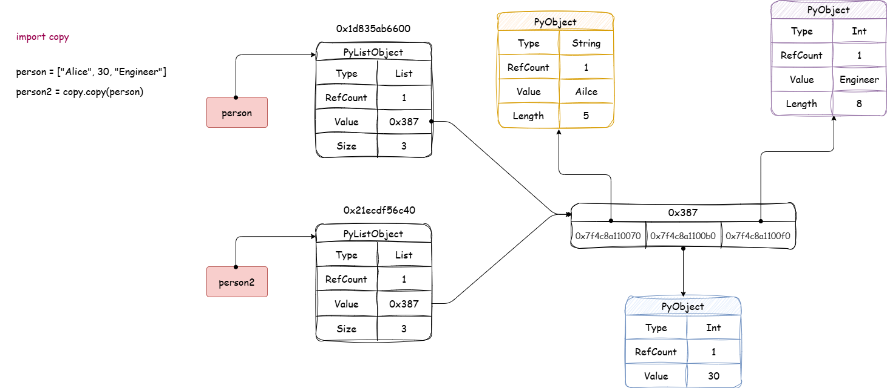
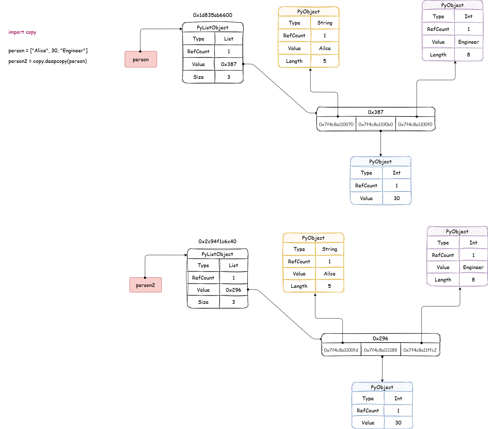

# 一、浅拷贝与深拷贝

## 1.1 浅拷贝

### 什么是浅拷贝（`Shallow Copy`）？

浅拷贝是指创建一个新的对象，该对象实现了对原始对象的部分复制，但只复制了原始对象的第一层内容（顶层内容），而不是递归地复制所有嵌套的子对象。

换句话说，浅拷贝只复制原始对象的引用，而不会复制嵌套对象的内容。

因此，浅拷贝后的新对象与原始对象在顶层是相互独立的，但它们的嵌套子对象是共享的。对嵌套对象的修改会同时影响浅拷贝的对象和原始对象。



### 浅拷贝的特点

● 顶层对象是新的：浅拷贝会创建一个新的顶层对象，与原始对象的内存地址不同。

● 嵌套子对象是共享的：浅拷贝不会递归复制嵌套的子对象，而是直接引用原始对象的子对象。

### 浅拷贝的实现方式

**1.使用 `copy.copy()` 函数**

`copy` 模块提供了 `copy.copy()` 函数，专门用于创建浅拷贝，其语法结构：

```python

import copy

copy.copy(obj)

```

**示例代码**

```python

import copy

original = [1, 2, [3, 4]]
shallow_copy = copy.copy(original)

print(shallow_copy)
print(id(original) == id(shallow_copy))
print(id(original[2]) == id(shallow_copy[2]))

```

**2.列表切片**

对列表使用切片操作可以快速创建一个浅拷贝。

**示例代码**

```python

import copy

original = [1, 2, [3, 4]]
shallow_copy = original[:]

print(shallow_copy)
print(id(original) == id(shallow_copy))
print(id(original[2]) == id(shallow_copy[2]))

```

**3.使用 `list()` 构造函数**

`list()` 构造函数可以创建一个新的列表对象，从而实现浅拷贝。

**示例代码**

```python

import copy

original = [1, 2, [3, 4]]
shallow_copy = list(original)

print(shallow_copy)
print(id(original) == id(shallow_copy))
print(id(original[2]) == id(shallow_copy[2]))

```

**4. 使用字典的 `copy()` 方法**

字典对象自带 `copy()` 方法，可以直接创建浅拷贝。

**示例代码**

```python

import copy

original = {"a": 1, "b": {"c": 2}}
shallow_copy = original.copy()

print(shallow_copy)
print(id(original) == id(shallow_copy))
print(id(original["b"]) == id(shallow_copy["b"]))

```

**5. 使用 `+` 运算符（仅适用于列表）**

将一个列表与空列表相加，也可以实现浅拷贝。

**示例代码**

```python

original = [1, 2, [3, 4]]
shallow_copy = original + []

print(shallow_copy)
print(id(original) == id(shallow_copy))
print(id(original[2]) == id(shallow_copy[2]))

```

**6.使用 `dict()` 构造函数（适用于字典）**

`dict()` 构造函数可以创建字典的浅拷贝。

**示例代码**

```python

original = {"a": 1, "b": {"c": 2}}
shallow_copy = dict(original)

print(shallow_copy)
print(id(original) == id(shallow_copy))
print(id(original["b"]) == id(shallow_copy["b"]))

```

**7.使用 `set.copy()` 方法（适用于集合）**

集合对象的 `copy()` 方法可以创建浅拷贝。

**示例代码**

```python

original = {1, 2, 3}
shallow_copy = original.copy()

print(shallow_copy)
print(id(original) == id(shallow_copy))

```

**8.使用 `copy()` 方法（自定义对象）**

对于自定义类，可以通过实现 `__copy__` 方法来自定义浅拷贝行为。

**示例代码**

```python

import copy

class MyClass:
    def __init__(self, value):
        self.value = value

    def __copy__(self):
        new_obj = MyClass(self.value)
        return new_obj

original = MyClass(10)
shallow_copy = copy.copy(original)

print(original.value)  # 10
print(shallow_copy.value)  # 10
print(id(original) == id(shallow_copy))  # False

```

## 1.2 深拷贝

### 什么是深拷贝`（Deep Copy）`？

深拷贝是指创建一个新的对象，并递归地复制原始对象及其所有嵌套对象的内容，从而使新对象与原始对象完全独立。

深拷贝后，两个对象在内存中是完全独立的，修改其中一个对象的内容不会影响另一个对象。



### 深拷贝的特点

● 完全独立：深拷贝会递归复制所有层级的对象，因此拷贝后的对象与原始对象完全独立。

● 嵌套对象是全新的：深拷贝的嵌套对象不会与原始对象共享内存。

### 深拷贝的实现方式

**1. 使用 `copy.deepcopy()`**

`copy` 模块提供了 `copy.deepcopy()` 函数，专门用于创建深拷贝，其语法结构：

```python

import copy

copy.deepcopy(obj)

```

**示例代码**

```python

import copy

original = [1, 2, [3, 4], {"a": 5, "b": [6, 7]}]
deep_copy = copy.deepcopy(original)

deep_copy[2][0] = 300
deep_copy[3]["b"].append(8)

print("Original:", original)
print("Deep Copy:", deep_copy)

```

**2.使用 `JSON` 序列化（仅限简单数据结构）**

对于只包含基本数据类型（如数字、字符串、列表、字典等）的对象，可以通过将对象序列化为 `JSON` 字符串，然后反序列化为新的对象来实现深拷贝。

不过，`JSON` 不支持复杂的 `Python` 对象（如自定义类、集合等）。

**示例代码**

```python

import json

original = {"a": 1, "b": {"c": 2}}
deep_copy = json.loads(json.dumps(original))

deep_copy["b"]["c"] = 300

print(original)
print(deep_copy)

```

**3.自定义递归拷贝**

在某些情况下，如果你需要对深拷贝的逻辑进行自定义（例如，处理某些特殊对象），可以通过自定义递归函数或实现 `__deepcopy__` 方法来完成深拷贝。

**示例代码**

```python

import copy

class CustomObject:
    def __init__(self, value, nested):
        self.value = value
        self.nested = nested

    def __deepcopy__(self):
        new_obj = CustomObject(self.value, copy.deepcopy(self.nested))
        return new_obj

nested_list = [1, 2, 3]
original = CustomObject(10, nested_list)

deep_copy = copy.deepcopy(original)

deep_copy.nested.append(4)

print(original.nested)
print(deep_copy.nested)

```

## 1.3 浅拷贝和深拷贝在处理可变对象和不可变对象时的行为差异

**1. 不可变对象的行为**

对于不可变对象，浅拷贝和深拷贝都不会创建新的对象，拷贝的是引用。

修改拷贝对象时，实际上创建了新的不可变对象，而不会影响原始对象。

**2. 可变对象的行为**

浅拷贝会共享嵌套的可变对象的引用，因此修改浅拷贝的嵌套对象会影响原始对象。

深拷贝会递归地复制所有层级的可变对象，因此修改深拷贝的嵌套对象不会影响原始对象。

**3. 元组的特殊情况**

元组是不可变对象，但如果元组中包含可变对象（如列表或字典等），元组的行为会变得复杂。

浅拷贝的元组与原始元组共享嵌套的可变对象，因此修改嵌套对象会影响原始元组。

深拷贝的元组会递归复制嵌套的可变对象，因此修改深拷贝的嵌套对象不会影响原始元组。
