## 3.1概述

* **数据存储**

1. 人工管理阶段

   缺点 ：  数据存储量有限，共享处理麻烦，操作容易混乱

2. 文件管理阶段 （.txt  .doc  .xls）
   
   优点 ：  数据可以长期保存,可以存储大量的数据,使用简单。

   缺点 ：  数据一致性差,数据查找修改不方便,数据冗余度可能比较大。

3. 数据库管理阶段

   优点 ： 数据组织结构化降低了冗余度,提高了增删改查的效率,容易扩展,方便程序调用处理

   缺点 ： 需要使用sql 或者其他特定的语句，相对比较专业


* **数据库应用领域**

  数据库的应用领域几乎涉及到了需要数据管理的方方面面，金融机构、游戏网站、购物网站、论坛网站 ... ...都需要数据库进行数据存储管理。 


* **基本概念**
* 数据库 ： 按照数据一定结构，存储管理数据的仓库。数据库是在数据库管理系统管理和控制下，在一定介质上的数据集合。
  
* 数据库管理系统 ：管理数据库的软件，用于建立和维护数据库。
  
* 数据库系统 ： 由数据库和数据库管理系统，开发工具等组成的集合 。

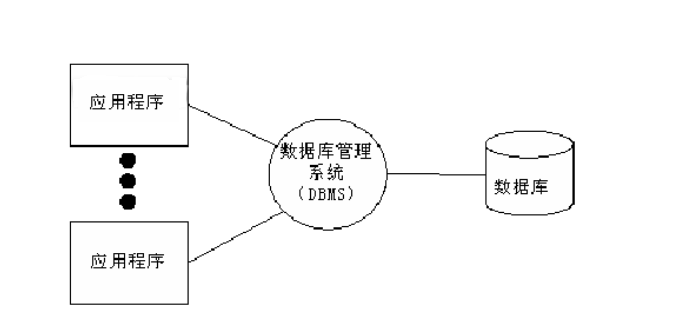


* **数据库分类和常见数据库**
  
  * 关系型数据库和非关系型数据库
	>关系型： 采用关系模型（二维表）来组织数据结构的数据库 
	>
	>非关系型： 不采用关系模型组织数据结构的数据库

  * 开源和非开源	
	>开源：MySQL、SQLite、MongoDB
	>
	>非开源：Oracle、DB2、SQL_Server


  

## 3.2 MySQL

1996年，`MySQL 1.0`发布,作者`Monty Widenius`, 为一个叫`TcX`的公司打工，当时只是内部发布。到了96年10月，`MySQL 3.11.1`发布了，一个月后，`Linux`版本出现了。真正的MySQL关系型数据库于1998年1月发行第一个版本。MySQL是个开源数据库，后来瑞典有了专门的MySQL开发公司，将该数据库发展壮大，在之后被Sun收购，Sun又被Oracle收购。

官网地址：[https://www.mysql.com/](https://www.mysql.com/)


* **MySQL特点**
  1. 是开源数据库，使用C和C++编写 
  2. 能够工作在众多不同的平台上
  3. 提供了用于C、C++、Python、Java、Perl、PHP、Ruby众多语言的API
  4. 存储结构优良，运行速度快
  5. 功能全面丰富


* **MySQL安装**
  * Ubuntu安装MySQL服务
    * 终端执行: sudo apt  install mysql-server
    * 配置文件：/etc/mysql
    * 数据库存储目录 ：/var/lib/mysql
  * Windows安装MySQL
    * 下载MySQL安装包(windows)  [https://dev.mysql.com/downloads/windows/installer/8.0.html](https://dev.mysql.com/downloads/windows/installer/8.0.html)
    * 直接运行安装文件安装


* **启动和连接MySQL服务**

  * 服务端启动
    * 查看MySQL状态 : sudo  service  mysql  status
    * 启动/停止/重启服务：sudo  service  mysql    start/stop/restart

  * 连接数据库

```sql
mysql    -h  主机地址   -u  用户名    -p

mysql -u root -p
```
 
> 注意： 
> 
> 1. 回车后输入数据库密码 （我们设置的是12345678）
> 2. 如果链接自己主机数据库可省略 -h 选项

  * 关闭连接

```sql
ctrl-D
exit;
```

```sql
-h / --host        主机地址
-P / --port        端口号，MySQL默认是3306
-u / --user        用户名
-p / --password    密码
-D / --database    指定要进入的数据库
-e / --execute     登录后直接执行SQL语句

mysql -h 127.0.0.1 -P 3306 -u root -p -D school -e "SHOW TABLES;"
```


* MySQL数据库结构

>数据元素 --> 记录 -->数据表 --> 数据库


* **基本概念解析**
  * 数据表（table） ： 存放数据的表格 
  * 字段（column）： 每个列，用来表示该列数据的含义
  * 记录（row）： 每个行，表示一组完整的数据


## 3.3 SQL语言

* **什么是SQL**

结构化查询语言(Structured Query Language)，一种特殊目的的编程语言，是一种数据库查询和程序设计语言，用于存取数据以及查询、更新和管理关系数据库系统。

* **SQL语言特点**
  * SQL语言基本上独立于数据库本身
  * 各种不同的数据库对SQL语言的支持与标准存在着细微的不同
  * 每条命令以 `;` 结尾
  * SQL命令（除了数据库名和表名）关键字和字符串可以不区分字母大小写


## 3.4 数据库管理

1. 查看已有库

>show databases;

2. 创建库

>create database 库名 [character set utf8];

```sql
e.g. 创建stu数据库，编码为utf8
create database stu character set utf8;
create database stu charset=utf8;
```

> 注意：库名的命名
> 
>1.  数字、字母、下划线,但不能使用纯数字
>2. 库名区分字母大小写
>3. 不要使用特殊字符和mysql关键字

3. 切换库

>use 库名;

```sql
e.g. 使用stu数据库
use stu;
```

4. 查看当前所在库

>select database();

5. 删除库

>drop database 库名;

```sql
e.g. 删除test数据库
drop database test;
```

### 3.4.1 show和select

* **基本理解**

`SHOW` 和 `SELECT` 都可以用来“查看内容”，但是查看的对象不同：

> SHOW：主要查看数据库系统信息、结构信息、状态信息
>
> SELECT：主要查询数据表中的数据，也可以查询表达式和函数结果

* **SHOW的常见用法**

```sql
-- 查看已有数据库

SHOW DATABASES;

-- 查看当前数据库中的数据表

SHOW TABLES;

-- 查看表结构

SHOW COLUMNS FROM 表名;
DESC 表名;

-- 查看建库语句或建表语句

SHOW CREATE DATABASE 库名;
SHOW CREATE TABLE 表名;

-- 查看系统变量

SHOW VARIABLES;
SHOW VARIABLES LIKE 'character%';

-- 查看当前连接进程

SHOW PROCESSLIST;

-- 查看用户权限

SHOW GRANTS;
```

> 注意：`SHOW` 更像是在问 MySQL：“你现在有哪些库、哪些表、结构是什么、状态是什么？”

* **SELECT的常见用法**

```sql
-- 查询表中所有记录

SELECT * FROM 表名;

-- 查询指定字段

SELECT 字段1,字段2 FROM 表名;

-- 按条件查询

SELECT * FROM 表名 WHERE 条件;

-- 排序查询

SELECT * FROM 表名 ORDER BY 字段 DESC;

-- 限制查询数量

SELECT * FROM 表名 LIMIT 10;

-- 聚合统计

SELECT COUNT(*) FROM 表名;

-- 查询函数或表达式结果

SELECT DATABASE();
SELECT VERSION();
SELECT NOW();
SELECT 1 + 2;
```

> 注意：`SELECT` 更像是在问 MySQL：“某张表里有哪些数据？某个函数或表达式的结果是多少？”

* **二者区别**

| 对比 | SHOW | SELECT |
| --- | --- | --- |
| 查询对象 | 数据库、表、字段、状态、权限等信息 | 表中的记录、字段、函数、表达式 |
| 主要作用 | 查看数据库系统和结构信息 | 查询具体数据和计算结果 |
| 常见位置 | 数据库管理、表管理阶段 | 表数据查询阶段 |
| 灵活程度 | 语法相对固定 | 可以配合where、order by、group by、limit等使用 |

```sql
-- 查看当前数据库有哪些表，这是查看结构信息

SHOW TABLES;

-- 查看students表中的所有数据，这是查询表记录

SELECT * FROM students;
```

> 简单记忆：`SHOW` 看“数据库长什么样”，`SELECT` 查“表里有什么数据”。

### 3.4.2老师上课笔记

```sql
-- 输出MySQL服务器版本号

SELECT VERSION();

-- 输出当前的日期和时间

SELECT NOW();

-- 输出当前打开的数据库

SELECT DATABASE();

-- 输出当前所有的数据库列表

SHOW DATABASES;
```

```sql
-- 创建数据库a1,编码方式为默认编码方式

CREATE DATABASE a1;

-- 创建数据库a2,编码方式为utf8

CREATE DATABASE a2 DEFAULT CHARSET='UTF8';

-- 证明a2的编码方式为utf8呢?又怎么知道a1的编码方式?

SHOW CREATE DATABASE a1;

SHOW CREATE DATABASE a2;
```

```sql
-- 打开数据库a1

USE a1;

-- 如何证明数据库a1已经被打开呢？

SELECT DATABASE();
```


## 3.5 数据表管理

* **基本思考过程**
  1. 确定存储内容
  2. 明确字段构成
  3. 确定字段数据类型

### 3.5.1 基础数据类型

* **数字类型：**
  * 整数类型：INT，SMALLINT，TINYINT，MEDIUMINT，BIGINT
  * 浮点类型：FLOAT，DOUBLE，DECIMAL
  * 比特值类型：BIT

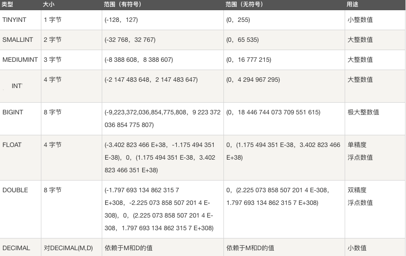

> 注意：
>
> 1. 对于准确性要求比较高的东西，比如money，用decimal类型减少存储误差。声明语法是DECIMAL(M,D)。M是数字的最大数字位数，D是小数点右侧数字的位数。比如 DECIMAL(6,2)最多存6位数字，小数点后占2位,取值范围-9999.99到9999.99。
> 2. 比特值类型指0，1值表达2种情况，如真，假


```sql
-- 整型

TINYINT [UNSIGNED] 占1字节,无符号的存储范是 0~255(2^8-1) 有符号的存储范围是 -128~127(2^7-1)

SMALLINT [UNSIGNED] 占2节,无符号的存储范是 0~65535(2^16-1) 有符号的存储范围是 -32768~32767(2^15-1)

MEDIUMINT [UNSIGNED] 占3字节,无符号的存储范是 0~16777215(2^24-1) 有符号的存储范围是 -8388608~8388607(2^23-1)

INT/INTEGER [UNSIGNED] 占4字节,无符号的存储范是 0~4294967295(2^32-1) 有符号的存储范围是 ~2147483648~2147483647(2^31-1)

BIGINT [UNSIGNED] 占8字节,无符号的存储范是(2^64-1) 有符号的存储范围是(-2^63,2^63-1)

-- 布尔型

BOOL 占1字节,等价于TINYINT(1),0认为是假，其他的都认为是真！

-- 浮点型

FLOAT(M,D) [UNSIGNED] 占4字节,单精度浮点,最高保留到小数点后7位

DOUBLE(M,D) [UNSIGNED] 占8字节,双精度浮点,最高保留到小数点后15位

M表示数字的总长度，D表示小数点后的数据长度，如 FLOAT(7,2)表示整数位最多5位，小数点最多2位，理论上说，最高的存储值为 99999.99

-- 定点型

DECIMAL(M,D) [UNSIGNED] M最大取值为65，D最大取值为30，如果省略 M默认值为10.如果省略D，默认值为0.

所有与货币相关的字段都要存储是定点型！
```

----------------------------------

* **字符串类型：**
  * 普通字符串： CHAR(n)  n代表字符的长度，最大为255，称为定长字符串
	          VARCHAR(n)  n最大为65535，称为变长字符串
  * 存储文本： text
  * 存储二进制数据： BLOB
  * 存储选项型数据：ENUM，SET

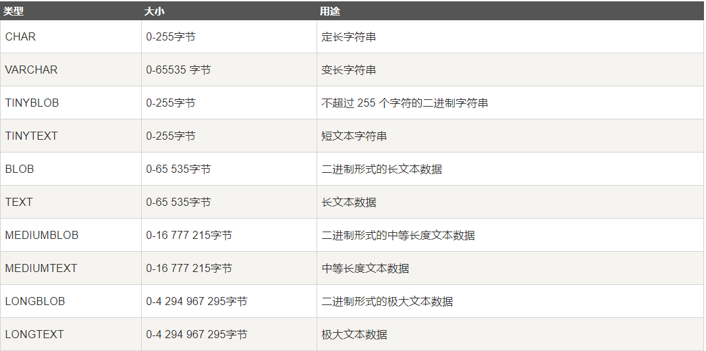

> 注意：
>
> 1. char：定长，即指定存储字节数后，无论实际存储了多少字节数据，最终都占指定的字节大小。默认只能存1字节数据。存取效率高。
> 2. varchar：不定长，效率偏低 ，但是节省空间，实际占用空间根据实际存储数据大小而定。必须要指定存储大小 varchar(50)
> 3. enum用来存储给出的多个值中的一个值,即单选，enum('A','B','C')
> 4. set用来存储给出的多个值中一个或多个值，即多选，set('A','B','C')


```sql
-- 字符型

CHAR(n) n代表的字符的长度，最大为255(2^8-1)，称为定长字符串

VARCHAR(n) n代表的字符的长度，最大为65535(2^16-1)，称为变长字符串

如你定义了一个字段，为CHAR(5)，而存储的内容是'AB',它实际存储的是'AB   '

如你定义了一个字段，为VARCHAR(5)，而存储的内容是'AB',它实际存储的是'AB'

TINYTEXT,最多可存储255(2^8-1)个字节

TEXT,最多可存储65535(2^16-1)个字节

MEDIUMTEXT,最多可存储16777215(2^24-1)个字节

LONGTEXT,最多可存储4294967295(2^32-1)个字节

ENUM(a,b,c,d,...),枚举值

-- 日期时间型

DATE 存储范围1000-01-01 ~9999-12-31

DATETIME 存储范围1000-01-01 00:00:00 ~9999-12-31 23：59：59
```


### 3.5.2 表的基本操作

* 创建表

>create table 表名(字段名 数据类型 约束,字段名 数据类型 约束,...字段名 数据类型 约束);

* 字段约束
  * 如果你想设置数字为无符号则加上 unsigned
  * 如果你不想字段为 NULL 可以设置字段的属性为 NOT NULL， 在操作数据库时如果输入该字段的数据为NULL ，就会报错。
  * DEFAULT 表示设置一个字段的默认值
  * AUTO_INCREMENT定义列为自增的属性，一般用于主键，数值会自动加1。
  * PRIMARY KEY 关键字用于定义列为主键。主键的值不能重复,且不能为空。

```sql
e.g.  创建班级表
create table class_1 (id int primary key auto_increment,name varchar(32) not null,age tinyint unsigned not null,sex enum('w','m'),score float default 0.0);

e.g. 创建兴趣班表
create table interest (id int primary key auto_increment,name varchar(32) not null,hobby set('sing','dance','draw'),level char not null,price decimal(6,2),remark text);
```

* 查看数据表

	> show tables；

* 查看表结构

	> desc 表名;

* 查看数据表创建信息

	>  show create table 表名；

* 删除表

	> drop table 表名;

### 3.5.3老师上课笔记

```sql
-- 创建数据表students

CREATE TABLE students(

username VARCHAR(10),

age TINYINT UNSIGNED,

sex BOOLEAN,

salary DECIMAL(8,2) UNSIGNED,

birthday DATE,

memory MEDIUMTEXT

);

-- 如何证明students数据表创建成功？或者我想查看当前数据库有有哪些数据表呢？

SHOW TABLES;

-- 我想查看students的有哪些字段呢？又有什么类型呢？

DESC students;
```

## 3.6 表数据基本操作

### 3.6.1 插入(insert)

```SQL
insert into 表名 values(值1),(值2),...;
insert into 表名(字段1,...) values(值1),...;
```

```sql
e.g. 
insert into class_1 values (2,'Baron',10,'m',91),(3,'Jame',9,'m',90);

insert into class_1 (name,age,sex,score) values ('Lucy',17,'w',81);

```

```sql
-- 省略字段列表

INSERT students VALUES('张三',21,1,21972.36,'2026-01-05','我是一名优秀的程序员');

-- 指定字段列表

INSERT INTO students(age,username,sex,memory,birthday,salary)

VALUES(22,'李四',0,'我是PYTHON开发工程师','2026-01-05',21478.99);

-- 如何证明记录已经存在？或者说如何查找数据表中的所有记录呢？

SELECT * FROM students;
```
### 3.6.2 查询(select)

```SQL
select * from 表名 [where 条件];
select 字段1,字段2 from 表名 [where 条件];
```

```sql
e.g. 
select * from class_1;
select name,age from class_1;
```

### 3.6.3 老师上课笔记

约束按作用分为：

- **主键约束**:一张数据表只能有一个主键约束,它用于保证记录的唯一性，一般情况下主键约束会与`AUTO_INCREMENT`组合使用。`AUTO_INCREMENT`称为自动编号，所以主键字段往往是整型 -- 通过在定义数据表时添加 `PRIMARY KEY`来定义主键

- **唯一约束**:用于保证记录的唯一性，一张数据表可以有多个唯一约束， 通过在定义数据表时添加 `UNIQUE` 来定义唯一约束，唯一约束的字段允许为空！

- **非空约束**：用于保证在插入记录时必须明确为该字段进行赋值操作（除非该字段有默认值）。主键约束自动添加非空约束。

- **默认约束**:在插入记录时，如果没有明确为该字段进行赋值操作，则自动将默认值赋给该字段。

```sql
CREATE TABLE test1(

id INT UNSIGNED PRIMARY KEY AUTO_INCREMENT,

username VARCHAR(20) UNIQUE

);

-- 想证明一下自动递增的字段可以真的自动递增

INSERT test1(username) VALUES('Tom');

INSERT test1(username) VALUES('Rose');

-- 想证明一下username字段的唯一性

INSERT test1(username) VALUES('Rose');

-- 有的同学想，可不可以为自动递增字段赋值呢？ -- 可以，但不能赋重复值

INSERT test1(id,username) VALUES(6,'Python');

-- 我刚刚写入了一个6，接下来我再写一条没有id的字段，那么它的id多少呢？ -- 是已有的最大ID+1

INSERT test1(username) VALUES('Node.js');

-- 我现在想通过所有字段进行赋值，但是又想让自动递增字段进行自动递增,怎么办？

INSERT test1(id,username) VALUES(NULL,'Java');

INSERT test1(id,username) VALUES(DEFAULT,'C#');

-- 唯一约束的字段允许为空！ -- 疑问 -- 不是说UNIQUE可以保证唯一性吗？因为在创建唯一约束，MySQL将自动创建基于该字段的索引，而NULL值在索引文件里只有一份！

INSERT test1(id,username) VALUES(NULL,NULL);

INSERT test1(id,username) VALUES(DEFAULT,NULL);
```

```sql
-- 研究一下唯一约束与非空约束

CREATE TABLE test2(

id INT UNSIGNED AUTO_INCREMENT PRIMARY KEY ,

mobile VARCHAR(20) NOT NULL UNIQUE ,

age TINYINT UNSIGNED NOT NULL,

email VARCHAR(50) UNIQUE NOT NULL

);

-- 正确

INSERT test2(mobile,age,email) VALUES('13800138000',21,'user1@gmail.com');

-- 错误

INSERT test2(mobile,age) VALUES('13800138001',22);

-- 错误 -- 因为email字段不允许存在重复值

INSERT test2(mobile,age,email) VALUES('13800138001',21,'user1@gmail.com');
```

```sql
-- 验证默认约束

CREATE TABLE test3(

id INT UNSIGNED PRIMARY KEY AUTO_INCREMENT,

username VARCHAR(20) NOT NULL UNIQUE,

age TINYINT NOT NULL DEFAULT 10

);

-- 正确

INSERT test3(id,username,age) VALUES(null,'Tom',20);

-- 正确

INSERT test3(id,username) VALUES(null,'Rose');
```

### 3.6.3 where子句

where子句在sql语句中扮演了重要角色，主要通过一定的运算条件进行数据的筛选，在查询，删除，修改中都有使用。

* 算数运算符

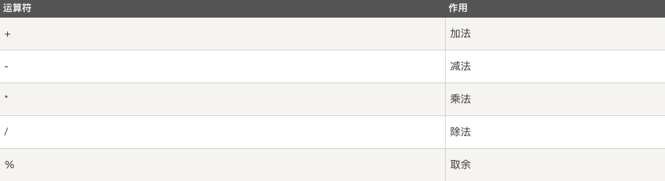

```sql
e.g.
select * from class_1 where age % 2 = 0;
```

* 比较运算符

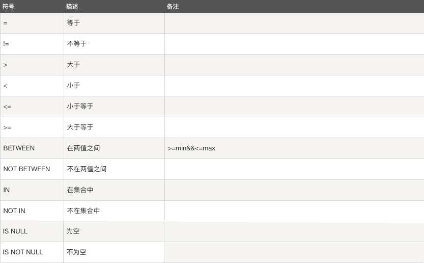

```sql
e.g.
select * from class_1 where age > 8;
select * from class_1 where between 8 and 10;
select * from class_1 where age in (8,9);
```

* 逻辑运算符

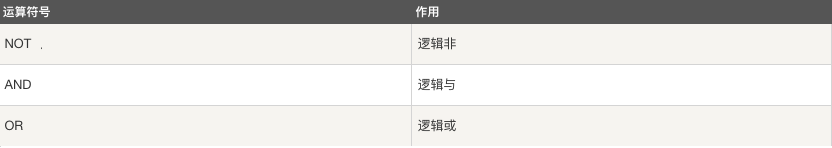

```sql
e.g.
select * from class_1 where sex='m' and age>9;
```


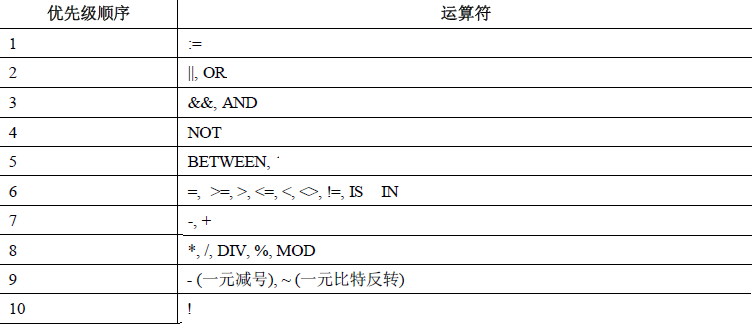


### 3.6.4 更新表记录(update)

```SQL
update 表名 set 字段1=值1,字段2=值2,... where 条件;

注意:update语句后如果不加where条件,所有记录全部更新
```

```sql
e.g.
update class_1 set age=11 where name='Abby';
```


### 3.6.5 删除表记录（delete）

```SQL
delete from 表名 where 条件;

注意:delete语句后如果不加where条件,所有记录全部清空
```
```sql
e.g.
delete from class_1 where name='Abby';
```

```sql
-- 为了演示删除数据表的操作

CREATE TABLE test(

id SMALLINT UNSIGNED PRIMARY KEY AUTO_INCREMENT,

username VARCHAR(20) NOT NULL UNIQUE

);

INSERT test(username) VALUES('A');

INSERT test(username) VALUES('B');

INSERT test(username) VALUES('C');

INSERT test(username) VALUES('D');

SELECT * FROM test;

-- 删除数据表

DROP TABLE test;
```

### 3.6.6 表字段的操作(alter)

```SQL
语法 ：alter table 表名 执行动作;

* 添加字段(add)
    alter table 表名 add 字段名 数据类型;
    alter table 表名 add 字段名 数据类型 first;
    alter table 表名 add 字段名 数据类型 after 字段名;
* 删除字段(drop)
    alter table 表名 drop 字段名;
* 修改数据类型(modify)
    alter table 表名 modify 字段名 新数据类型;
* 修改字段名(change)
    alter table 表名 change 旧字段名 新字段名 新数据类型;
* 表重命名(rename)
    alter table 表名 rename 新表名;
```

```sql
e.g. 
alter table interest add tel char(11) after name;
```

```sql
-- 1.增加主键字段

ALTER TABLE students ADD id INT UNSIGNED PRIMARY KEY AUTO_INCREMENT FIRST;

-- 2.我想在birthday和memory之间添加education字段，类型为ENUM

ALTER TABLE students ADD education ENUM('小学','中学','高中') AFTER birthday;

-- 3.在最后添加address字段，类型为VARCHAR(50)且非空

ALTER TABLE students ADD address VARCHAR(50) NOT NULL;

-- 4.为sex字段添加default默认约束 -- 1

ALTER TABLE students CHANGE sex sex BOOLEAN DEFAULT 1;

-- 如何证明默认值添加成功了呢？

INSERT students(username,age,salary,birthday,education,memory,address) VALUES('测试1',22,568963.33,'2021-1-5','高中','测试案例','北洋');

-- 5.为memory字段添加not null约束

ALTER TABLE students CHANGE memory memory MEDIUMTEXT NOT NULL;

-- 6.为username添加unique约束和not null约束 - 暂时无法成功，因为在数据表中已经存在重复的username

ALTER TABLE students CHANGE username username VARCHAR(10) UNIQUE NOT NULL;

-- 7.先行修改记录，然后再执行6

UPDATE students SET username='张四' WHERE id=1;
```


### 3.5.7 时间类型数据

* 日期 ： DATE
* 日期时间： DATETIME，TIMESTAMP
* 时间： TIME
* 年份 ：YEAR

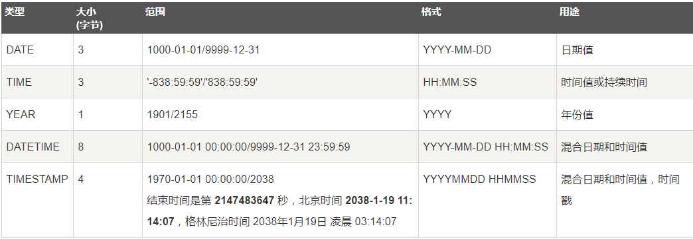

* 时间格式

  ```sql
  date ："YYYY-MM-DD"
  time ："HH:MM:SS"
  datetime ："YYYY-MM-DD HH:MM:SS"
  timestamp ："YYYY-MM-DD HH:MM:SS"
  ```

  > 注意:
  >
  > 1. datetime ：以系统时间存储
  > 2. timestamp ：以标准时间存储但是查看时转换为系统时区，所以表现形式和datetime相同


```sql
e.g.
create table marathon (id int primary key auto_increment,athlete varchar(32),birthday date,registration_time datetime,performance time);
```


* 日期时间函数
  * now()  返回服务器当前日期时间,格式对应datetime类型
  * curdate() 返回当前日期，格式对应date类型
  * curtime() 返回当前时间，格式对应time类型

* 时间操作

  时间类型数据可以进行比较和排序等操作，在写时间字符串时尽量按照标准格式书写。

```sql
  select * from marathon where birthday>='2000-01-01';
  select * from marathon where birthday>="2000-07-01" and performance<="2:30:00";
```


## 3.7 高级查询语句

* 模糊查询和正则查询

  1. 模糊查询

     LIKE用于在where子句中进行模糊查询，SQL LIKE 子句中使用百分号` %`来表示任意0个或多个字符，下划线`_`表示任意一个字符。

	```sql
	SELECT field1, field2,...fieldN 
	FROM table_name
	WHERE field1 LIKE condition1
	```

	```sql
	e.g. 
	mysql> select * from class_1 where name like 'A%';
	```

	2. 正则查询
	
	   mysql中对正则表达式的支持有限，只支持部分正则元字符:

	```sql
	SELECT field1, field2,...fieldN 
	FROM table_name
	WHERE field1 REGEXP condition1
	```

	```sql
	e.g. 
	select * from class_1 where name regexp '^B.+';
	```
* as 用法

  在sql语句中as用于给字段或者表重命名

   ```sql
   select name as 姓名,age as 年龄 from class_1;
   select * from class_1 as c where c.age > 17;
   ```

* 排序

  ORDER BY 子句来设定你想按哪个字段哪种方式来进行排序，再返回搜索结果。

  使用 ORDER BY 子句将查询数据排序后再返回数据：

	```sql
	SELECT field1, field2,...fieldN from table_name1 where field1
	ORDER BY field1 [ASC [DESC]]
	```
	默认情况ASC表示升序，DESC表示降序

	```sql
	select * from class_1 where sex='m' order by age desc;
	```

	复合排序：对多个字段排序，即当第一排序项相同时按照第二排序项排序

	```sql
	select * from class_1 order by score desc,age;
	```


* 限制

	LIMIT 子句用于限制由 SELECT 语句返回的数据数量 或者 UPDATE,DELETE语句的操作数量

	带有 LIMIT 子句的 SELECT 语句的基本语法如下：

	```sql
	SELECT column1, column2, columnN 
	FROM table_name
	WHERE field
	LIMIT [num]
	```

*  联合查询

	UNION 操作符用于连接两个以上的 SELECT 语句的结果组合到一个结果集合中。多个 SELECT 	语句会删除重复的数据。

	UNION 操作符语法格式：

	```sql
	SELECT expression1, expression2, ... expression_n
	FROM tables
	[WHERE conditions]
	UNION [ALL | DISTINCT]
	SELECT expression1, expression2, ... expression_n
	FROM tables
	[WHERE conditions];
	```

	默认UNION后卫 DISTINCT表示删除结果集中重复的数据。如果使用ALL则返回所有结果集，	包含重复数据。

```sql
select * from class_1 where sex='m' UNION ALL select * from class_1 where age > 9;
```
* 子查询
	* 定义 ： 当一个select语句中包含另一个select 查询语句，则称之为有子查询的语句
	* 子查询出现的位置：
		1. from 之后 ，此时子查询的内容作为一个新的表内容，再进行外层select查询
		```sql
		select name from (select * from class_1 where sex='m') as s where s.score > 90;
		```
		>注意：  需要将子查询结果集重命名一下，方便where子句中的引用操作
	
		
		2. where字句中，此时select查询到的内容作为外层查询的条件值
	
		```sql
		 	select *  from class_1 where age = (select age from class_1 where name='Tom');
		```
		> 注意：
		>
		> 1. 子句结果作为一个值使用时，返回的结果需要一个明确值，不能是多行或者多列。
		> 2. 如果子句结果作为一个集合使用，即where子句中是in操作，则结果可以是一个字段的多个记录。
	
*  查询过程

通过之前的学习看到，一个完整的select语句内容是很丰富的。下面看一下select的执行过程：

```sql

(5)SELECT DISTINCT <select_list>                     

(1)FROM <left_table> <join_type> JOIN <right_table> ON <on_predicate>

(2)WHERE <where_predicate>

(3)GROUP BY <group_by_specification>

(4)HAVING <having_predicate>

(6)ORDER BY <order_by_list>

(7)LIMIT <limit_number>
```


## 3.8 聚合操作

聚合操作指的是在数据查找基础上对数据的进一步整理筛选行为，实际上聚合操作也属于数据的查询筛选范围。


### 3.8.1 聚合函数

| 方法          | 功能                 |
| ------------- | -------------------- |
| avg(字段名)   | 该字段的平均值       |
| max(字段名)   | 该字段的最大值       |
| min(字段名)   | 该字段的最小值       |
| sum(字段名)   | 该字段所有记录的和   |
| count(字段名) | 统计该字段记录的个数 |
|               |                      |

eg1 : 找出表中的最大攻击力的值？

```mysql
select max(attack) from sanguo;
```

eg2 : 表中共有多少个英雄？

```mysql
select count(name) as number from sanguo;
```

eg3 : 蜀国英雄中攻击值大于200的英雄的数量

```mysql
select count(*) from sanguo where attack > 200; 
```

> 注意： 此时select 后只能写聚合函数，无法查找其他字段。


### 3.8.2 聚合分组

- **group by**

给查询的结果进行分组

e.g.  : 计算每个国家的平均攻击力

```mysql
select country,avg(attack) from sanguo 
group by country;
```

e.g. :  对多个字段创建索引，此时多个字段都相同时为一组
```mysql
select age,sex,count(*) from class1 group by age,sex;
```


e.g. : 所有国家的男英雄中 英雄数量最多的前2名的 国家名称及英雄数量

```mysql
select country,count(id) as number from sanguo 
where gender='M' group by country
order by number DESC
limit 2;
```

>  注意： 使用分组时select 后的字段为group by分组的字段和聚合函数，不能包含其他内容。group by也可以同时依照多个字段分组，如group by A，B 此时必须A,B两个字段值均相同才算一组。


### 3.8.3 聚合筛选

- **having语句**

对分组聚合后的结果进行进一步筛选

```mysql
eg1 : 找出平均攻击力大于105的国家的前2名,显示国家名称和平均攻击力

select country,avg(attack) from sanguo 
group by country
having avg(attack)>105
order by avg(attack) DESC
limit 2;
```

> 注意
>
> 1. having语句必须与group by联合使用。
> 2. having语句存在弥补了where关键字不能与聚合函数联合使用的不足,where只能操作表中实际存在的字段。


### 3.8.4 去重语句

- **distinct语句**

不显示字段重复值

```mysql
eg1 : 表中都有哪些国家
  select distinct name,country from sanguo;
eg2 : 计算一共有多少个国家
  select count(distinct country) from sanguo;
```

> 注意: distinct和from之间所有字段都相同才会去重


### 3.8.5 聚合运算

- **查询表记录时做数学运算**

运算符 ： +  -  *  /  %  

```mysql
eg1: 查询时显示攻击力翻倍
  select name,attack*2 from sanguo;
eg2: 更新蜀国所有英雄攻击力 * 2
  update sanguo set attack=attack*2 where country='蜀国';
```


## 3.9 索引操作

### 3.9.1 概述

- **定义**

索引是对数据库表中一列或多列的值进行排序的一种结构，使用索引可快速访问数据库表中的特定信息。

- **优缺点**
  - 优点 ： 加快数据检索速度,提高查找效率

  - 缺点 ：占用数据库物理存储空间，当对表中数据更新时,索引需要动态维护,降低数据写入效率

> 注意 ： 
> 1. 通常我们只在经常进行查询操作的字段上创建索引
> 2. 对于数据量很少的表或者经常进行写操作而不是查询操作的表不适合创建索引


### 3.9.2 索引分类

*  普通(MUL) 

> 普通索引 ：字段值无约束,KEY标志为 MUL

* 唯一索引(UNI)

> 唯一索引(unique) ：字段值不允许重复,但可为 NULL,KEY标志为 UNI

* 主键索引（PRI）

> 一个表中只能有一个主键字段, 主键字段不允许重复,且不能为NULL，KEY标志为PRI。通常设置记录编号字段id,能唯一锁定一条记录


### 3.9.3 索引创建

* 创建表时直接创建索引
```mysql
create table 表名(
字段名 数据类型，
字段名 数据类型，
index 索引名(字段名),
index 索引名(字段名),
unique 索引名(字段名)
);
```

* 在已有表中创建索引：

```mysql
create [unique] index 索引名 on 表名(字段名);
```

```sql
e.g.
create unique index name_index on cls(name);
```


- 主键索引添加

 ```sql
 alter table 表名 add primary key(id);
 ```


- 查看索引

```mysql
1、desc 表名;  --> KEY标志为：MUL 、UNI。
2、show index from 表名;
```

- 删除索引

```mysql
drop index 索引名 on 表名;
alter table 表名 drop primary key;  # 删除主键
```


* 扩展： 借助性能查看选项去查看索引性能

```sql
set  profiling = 1； 打开功能 （项目上线一般不打开）

show profiles  查看语句执行信息
```


## 3.10 外键约束和表关联关系

### 3.10.1 外键约束

* 约束 : 约束是一种限制，它通过对表的行或列的数据做出限制，来确保表的数据的完整性、唯一性
* foreign key 功能 : 建立表与表之间的某种约束的关系，由于这种关系的存在，能够让表与表之间的数据，更加的完整，关连性更强，为了具体说明创建如下部门表和人员表。
* 示例

```sql
# 创建部门表
CREATE TABLE dept (id int PRIMARY KEY auto_increment,dname VARCHAR(50) not null);
```

```sql
# 创建人员表
CREATE TABLE person (
  id int PRIMARY KEY AUTO_INCREMENT,
  name varchar(32) NOT NULL,
  age tinyint DEFAULT 0,
  sex enum('m','w','o') DEFAULT 'o',
  salary decimal(8,2) DEFAULT 250.00,
  hire_date date NOT NULL,
  dept_id int
) ;
```

上面两个表中每个人员都应该有指定的部门，但是实际上在没有约束的情况下人员是可以没有部门的或者也可以添加一个不存在的部门，这显然是不合理的。

* 主表和从表：若同一个数据库中，B表的外键与A表的主键相对应，则A表为主表，B表为从表。

- foreign key 外键的定义语法：

  ```sql
  [CONSTRAINT symbol] FOREIGN KEY（外键字段） 
  
  REFERENCES tbl_name (主表主键)
  
  [ON DELETE {RESTRICT | CASCADE | SET NULL | NO ACTION}]
  
  [ON UPDATE {RESTRICT | CASCADE | SET NULL | NO ACTION}]
  ```

  该语法可以在 CREATE TABLE 和 ALTER TABLE 时使用
  

	```sql
	# 创建表时直接简历外键
	CREATE TABLE person (
	  id int PRIMARY KEY AUTO_INCREMENT,
	  name varchar(32) NOT NULL,
	  age tinyint DEFAULT 0,
	  sex enum('m','w','o') DEFAULT 'o',
	  salary decimal(10,2) DEFAULT 250.00,
	  hire_date date NOT NULL,
	  dept_id int ,
	  constraint dept_fk foreign key(dept_id) references dept(id));
	```

	```sql
	# 建立表后增加外键
	alter table person add constraint dept_fk foreign key(dept_id) references dept(id);
	```

	> 注意：
	> 1. 并不是任何情况表关系都需要建立外键来约束，如果没有类似上面的约束关系时也可以不建立。
	> 2. 从表的外键字段数据类型与指定的主表主键应该相同。


* 通过外键名称解除外键约束

	```sql
	alter table person drop foreign key dept_fk;
	
	# 查看外键名称
	show create table person;
	```
	
	> 注意：删除外键后发现desc查看索引标志还在，其实外键也是一种索引，需要将外键名称的索引删除之后才可以。


* 级联动作
  * restrict(默认)  :  on delete restrict  on update restrict
    * 当主表删除记录时，如果从表中有相关联记录则不允许主表删除
    * 当主表更改主键字段值时，如果从表有相关记录则不允许更改
  * cascade ：数据级联更新  on delete cascade   on update cascade
    * 当主表删除记录或更改被参照字段的值时,从表会级联更新
  * set null  :   on delete set null    on update set null
    * 当主表删除记录时，从表外键字段值变为null
    * 当主表更改主键字段值时，从表外键字段值变为null

  

### 3.10.2 表关联设计

当我们应对复杂的数据关系的时候，数据表的设计就显得尤为重要，认识数据之间的依赖关系是更加合理创建数据表关联性的前提。常见的数据关系如下：

- 一对一关系

> 一张表的一条记录一定只能与另外一张表的一条记录进行对应，反之亦然。
>
> 举例 :  学生信息和学籍档案，一个学生对应一个档案，一个档案也只属于一个学生


 ``` sql
create table student(id int primary key auto_increment,name varchar(50) not null);

create table record(id int primary key auto_increment,
comment text not null,
st_id int unique,
constraint st_fk foreign key(st_id) references student(id) 
on delete cascade 
on update cascade
);
 ```


- 一对多关系

> 一张表中有一条记录可以对应另外一张表中的多条记录；但是反过来，另外一张表的一条记录
> 只能对应第一张表的一条记录，这种关系就是一对多或多对一
>
> 举例： 一个人可以拥有多辆汽车，每辆车登记的车主只有一人。

```sql
create table person(
  id varchar(32) primary key,
  name varchar(30),
  sex char(1),
  age int
);

create table car(
  id varchar(32) primary key,
  name varchar(30),
  price decimal(10,2),
  pid varchar(32),
  constraint car_fk foreign key(pid) references person(id)
);
```

- 多对多关系

> 一对表中（A）的一条记录能够对应另外一张表（B）中的多条记录；同时B表中的一条记录
> 也能对应A表中的多条记录
>
> 举例：一个运动员可以报多个项目，每个项目也会有多个运动员参加,这时为了表达多对多关系需要单独创建关系表。

```mysql
CREATE TABLE athlete (
  id int primary key AUTO_INCREMENT,
  name varchar(30),
  age tinyint NOT NULL,
  country varchar(30) NOT NULL,
  description varchar(30)
);

CREATE TABLE item (
  id int primary key AUTO_INCREMENT,
  rname varchar(30) NOT NULL
);

CREATE TABLE athlete_item (
   id int primary key auto_increment,
   aid int NOT NULL,
   tid int NOT NULL,
   CONSTRAINT athlete_fk FOREIGN KEY (aid) REFERENCES athlete (id),
   CONSTRAINT item_fk FOREIGN KEY (tid) REFERENCES item (id)
);
```


### 3.10.3 E-R模型

* **定义**		

```mysql
E-R模型(Entry-Relationship)即 实体-关系 数据模型,用于数据库设计
用简单的图(E-R图)反映了现实世界中存在的事物或数据以及他们之间的关系
```

* **实体、属性、关系**

​	实体

```mysql
1、描述客观事物的概念
2、表示方法 ：矩形框
3、示例 ：一个人、一本书、一杯咖啡、一个学生
```

​	属性

```mysql
1、实体具有的某种特性
2、表示方法 ：椭圆形
3、示例
   学生属性 ：学号、姓名、年龄、性别、专业 ... 
   感受属性 ：悲伤、喜悦、刺激、愤怒 ...
```

​	关系

```mysql
1、实体之间的联系
2、一对一关联(1:1)
3、一对多关联(1:n)
4、多对多关联(m:n) 
```

* **ER图的绘制**

矩形框代表实体,菱形框代表关系,椭圆形代表属性


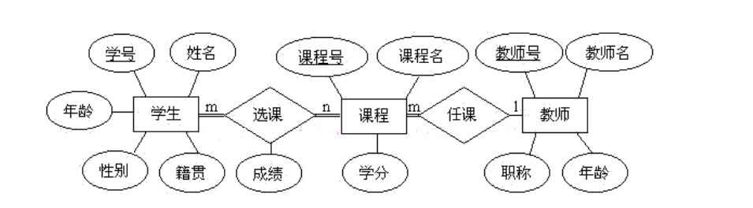

### 3.10.4 表连接

如果多个表存在一定关联关系，可以多表在一起进行查询操作，其实表的关联整理与外键约束之间并没有必然联系，但是基于外键约束设计的具有关联性的表往往会更多使用关联查询查找数据。

* 简单多表查询

多个表数据可以联合查询，语法格式如下：

```sql
select  字段1,字段2... from 表1,表2... [where 条件]
```

```sql
e.g.
select * from dept,person where dept.id = person.dept_id;
```

* 内连接

内连接查询只会查找到符合条件的记录，其实结果和表关联查询是一样的,官方更推荐使用内连接查询。

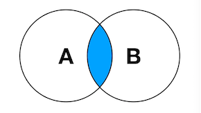

```sql
SELECT 字段列表
    FROM 表1  INNER JOIN  表2
ON 表1.字段 = 表2.字段;
```

```sql
select * from person inner join  dept  on  person.dept_id =dept.id;
```

* 笛卡尔积

笛卡尔积就是将A表的每一条记录与B表的每一条记录强行拼在一起。所以，如果A表有n条记录，B表有m条记录，笛卡尔积产生的结果就会产生n*m条记录。

```sql
select * from person inner join  dept;
```


- 左连接  : 左表全部显示，显示右表中与左表匹配的项

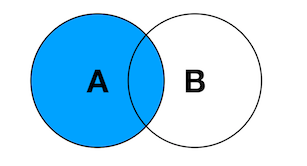

```sql
SELECT 字段列表
    FROM 表1  LEFT JOIN  表2
ON 表1.字段 = 表2.字段;
```

```sql
select * from person left join  dept  on  person.dept_id =dept.id;

# 查询每个部门员工人数
select dname,count(name) from dept left join person on dept.id=person.dept_id group by dname;
```

- 右连接 ：右表全部显示，显示左表中与右表匹配的项

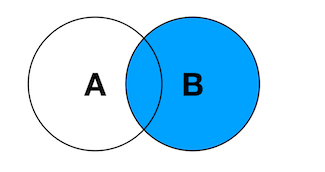

```sql
SELECT 字段列表
    FROM 表1  RIGHT JOIN  表2
ON 表1.字段 = 表2.字段;
```

```sql
select * from person right join  dept  on  person.dept_id =dept.id;
```


> 注意：我们尽量使用数据量大的表作为基准表，即左表


## 3.11 pymysql模块

pymysql是一个第三方库，如果自己的计算机上没有可以在终端使用命令进行安装。

```
sudo pip3 install pymysql
```


* pymysql使用流程

1. 建立数据库连接(db = pymysql.connect(...))
2. 创建游标对象(cur = db.cursor())
3. 游标方法: cur.execute("insert ....")
4. 提交到数据库或者获取数据 : db.commit()/cur.fetchall()
5. 关闭游标对象 ：cur.close()
6. 断开数据库连接 ：db.close()


* 常用函数

```python
db = pymysql.connect(参数列表)
功能: 链接数据库

host ：主机地址,本地 localhost
port ：端口号,默认3306
user ：用户名
password ：密码
database ：库
charset ：编码方式,推荐使用 utf8
```


```
cur = db.cursor() 
功能： 创建游标
返回值：返回游标对象,用于执行具体SQL命令
```


```
cur.execute(sql,list_) 
功能： 执行SQL命令
参数： sql sql语句
      list_  列表，用于给sql语句传递参量
      
cur.executemany(sql命令,list_)
功能： 多次执行SQL命令，执行次数由列表中元组数量决定
参数： sql sql语句
      list_  列表中包含元组 每个元组用于给sql语句传递参量，一般用于写操作。
```


```python
cur.fetchone() 获取查询结果集的第一条数据，查找到返回一个元组否则返回None
cur.fetchmany(n) 获取前n条查找到的记录，返回结果为元组嵌套元组， ((记录1),(记录2))，查询不到内容返回空元组。
cur.fetchall() 获取所有查找到的记录，返回结果形式同上。
cur.close() 关闭游标对象
```


```python
db.commit() 提交到数据库执行
db.rollback() 回滚，用于当commit()出错是回复到原来的数据形态
db.close() 关闭连接
```


* 文件存储
  * 存储文件路径
    * 优点：节省数据库空间，提取方便
    * 缺点：文件或者数据库发生迁移会导致文件丢失
  * 存储文件本身
    * 优点：安全可靠，数据库在文件就在
    * 缺点：占用数据库空间大，文件存取效率低


