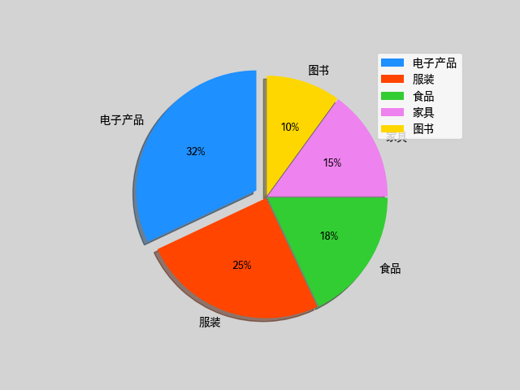

# Numpy 作业

题目 1：广播机制判断

判断以下哪组数组可以进行广播运算，并说明广播过程和结果的 shape；对于不能广播的，说明原因：

1. `A` 的 shape 为 `(3, 4)`，`B` 的 shape 为 `(4,)`
		答：可以进行广播运算，B的shape由（4, ）----> （1, 4）---->  (3, 4)

2. `A` 的 shape 为 `(2, 3)`，`B` 的 shape 为 `(2,)`
		答：不可以广播，因为B的shape由（2， ）扩展为（1, 2）后，第一维是2，既不等于A的第一维，也不等于1。

3. `A` 的 shape 为 `(3, 1)`，`B` 的 shape 为 `(1, 4)
		答：可以广播，A的shape由（3, 1）---> （3, 4）;      B的shape由（1, 4）---> （3, 4）

题目 2：多维数组切片

给定三维数组：

```python

a = np.arange(1, 28).reshape(3, 3, 3)

```

请写出切片表达式，分别取出：

```text
切片表达式：
[[[ 1  2  3]
  [ 4  5  6]
  [ 7  8  9]]

 [[10 11 12]
  [13 14 15]
  [16 17 18]]

 [[19 20 21]
  [22 23 24]
  [25 26 27]]]
```

1. 第 2 页的所有数据
```python
a[1, :, :]
```

2. 所有页的第 1 行
```python
a[:, 0, :]
```

3. 第 0 页第 2 行第 1 列的元素值
```python
a[0, 1, 0]
```

# Matplotlib 作业

题目 1：窗口操作与饼图

某电商平台统计了 5 个品类的年度销售额占比，数据如下：

| 品类     | 销售额占比(%) |

| --------------- | ---------------------- |

| 电子产品 | 32            |

| 服装     | 25            |

| 食品     | 18            |

| 家居     | 15            |

| 图书     | 10            |

请完成以下任务：

1. 创建一个标题为`Sales Distribution`、背景色为 `lightgray` 的图形窗口

2. 绘制饼图，要求：

   - 电子产品扇形与其他扇形之间间距为 0.05，其余间距为 0.01（突出显示最大占比品类）

   - 启用阴影效果

   - 起始角度为 90°

   - 标签显示百分比格式（如 `32%`）

   - 添加图例

3. 设置等轴比例

4. 保存图片到当前目录下的`sales_pie.png`

请写出完整代码，并解释饼图中 `spaces` 参数的作用：如果所有 `spaces` 都设为 0，图表会怎样？

```python
from matplotlib import pyplot as plt

plt.rcParams['font.sans-serif']=['Hei']  
plt.rcParams['axes.unicode_minus']=False

plt.figure('Sales Distribution', facecolor='lightgray')

values = [32, 25, 18, 15, 10]
spaces = [0.05, 0.01, 0.01, 0.01, 0.01]
labels = ['电子产品', '服装', '食品', '家具', '图书']
colors = ['dodgerblue', 'orangered', 'limegreen', 'violet', 'gold']

plt.axis('equal')
plt.pie(
	values,
	spaces,  # 每个扇形之间的间距值，值越大代表扇形越突出，如果都为0代表每个扇形都                 紧密相贴，形成一个无缝隙的圆。
	labels,
	colors,
	'%d%%',
	shadow=True,
	startangle=90
)
plt.legend()
plt.savefig('sales_pie.png')
plt.show()

```




题目 2：子图布局与图表类型综合

在一个窗口中绘制 2×2 的子图布局，要求：

1. 左上子图：绘制散点图，x 数据为`[1, 2, 3, 4, 5]`，y 数据为 `[2, 4, 5, 4, 5]`，点型为菱形，颜色为红色

2. 右上子图：绘制直方图，生成 200 个 60~100 之间的随机整数，分 20 个柱子，添加点状网格线

3. 左下子图：绘制饼图，数据为`[25, 35, 20, 20]`，标签为 `['A', 'B', 'C', 'D']`，设置等轴比例

4. 右下子图：绘制折线图，x 数据为`range(0, 10)`，y 数据为 `[1, 4, 9, 16, 25, 36, 49, 64, 81, 100]`，线条为虚线

请写出完整代码，并说明 `plt.subplot(2, 2, 3)` 中参数 3 的含义。

```python
from matplotlib import pyplot as plt
import numpy as np

plt.figure('Subplot Layout', facecolor='lightgray')

plt.subplot(2, 2, 1)
plt.scatter(
	[1, 2, 3, 4, 5],
	[2, 4, 5, 4, 5],
	marker='d',
	s=10,
	color='r'
)

nums = np.random.randint(60, 101, 200)
plt.subplot(2, 2, 2)
plt.hist(nums, 20)
plt.grid(linestyle=':')

plt.subplot(2, 2, 3) # 参数3的含义是现在操作的是画布中的第二行第一个格子。
plt.axis('equal')
plt.pie(
	[25, 35, 20, 20],
	labels=['A', 'B', 'C', 'D']
)

plt.subplot(2, 2, 4)
plt.plot(
	range(0, 10),
	[1, 4, 9, 16, 25, 36, 49, 64, 81, 
	100],
	linestyle='--'
)

plt.show()
```