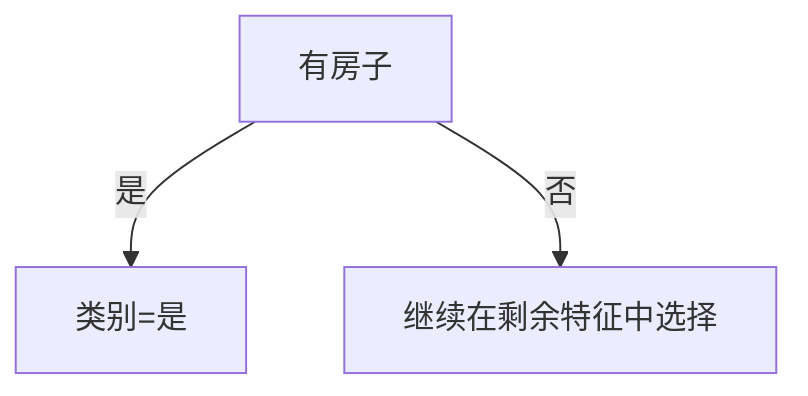

# 决策树信息增益划分贷款案例

> [!abstract] 本文主线
> - 这个例子用 15 个人的个人情况，判断是否给予贷款。
> - 目标变量是“类别”，也就是是否贷款：`是` 表示贷款，`否` 表示不贷款。
> - 4 个可用于划分的特征分别是：年龄、是否有工作、是否有房子、信贷情况。
> - 决策树在选择根节点时，会比较不同特征的信息增益，优先选择信息增益最大的特征。

# 一、案例数据

## 1.1 任务目标

目标：判断一个人是否应该给予贷款。

数据：15 个人的个人情况。

特征：4 类，分别是年龄、是否有工作、是否有房子、信贷情况。

| ID | 年龄 | 有工作 | 有房子 | 信贷情况 | 类别 |
| --- | --- | --- | --- | --- | --- |
| 1 | 青年 | 否 | 否 | 一般 | 否 |
| 2 | 青年 | 否 | 否 | 好 | 否 |
| 3 | 青年 | 是 | 否 | 好 | 是 |
| 4 | 青年 | 是 | 是 | 一般 | 是 |
| 5 | 青年 | 否 | 否 | 一般 | 否 |
| 6 | 中年 | 否 | 否 | 一般 | 否 |
| 7 | 中年 | 否 | 否 | 好 | 否 |
| 8 | 中年 | 是 | 是 | 好 | 是 |
| 9 | 中年 | 否 | 是 | 非常好 | 是 |
| 10 | 中年 | 否 | 是 | 非常好 | 是 |
| 11 | 老年 | 否 | 是 | 非常好 | 是 |
| 12 | 老年 | 否 | 是 | 好 | 是 |
| 13 | 老年 | 是 | 否 | 好 | 是 |
| 14 | 老年 | 是 | 否 | 非常好 | 是 |
| 15 | 老年 | 否 | 否 | 一般 | 否 |

在这 15 条数据中：

- `类别=是` 有 9 个，表示给予贷款。
- `类别=否` 有 6 个，表示不给予贷款。

# 二、划分方式

## 2.1 可以按哪些特征划分

这个数据集一共有 4 个特征，所以第一层根节点有 4 种候选划分方式：

| 候选根节点 | 划分依据 | 特征取值 |
| --- | --- | --- |
| 年龄 | 基于年龄划分 | 青年、中年、老年 |
| 有工作 | 基于是否有工作划分 | 是、否 |
| 有房子 | 基于是否有房子划分 | 是、否 |
| 信贷情况 | 基于信贷情况划分 | 一般、好、非常好 |

问题是：应该选择哪一个特征作为根节点？

判断依据就是信息熵和信息增益。

# 三、信息熵与信息增益

## 3.1 经验熵

经验熵用来衡量数据集的不确定性。类别越混乱，熵越大；类别越纯，熵越小。

信息熵公式：

$$
H(D)=-\sum_{k=1}^{K}p_k\log_2p_k
$$

本案例中，15 条数据里有 9 个 `是`，6 个 `否`，所以训练数据集 $D$ 的经验熵为：

$$
H(D)=-\frac{9}{15}\log_2\frac{9}{15}-\frac{6}{15}\log_2\frac{6}{15}=0.971
$$

这个值表示：在不看任何特征的情况下，是否贷款这个结果还有一定不确定性。

## 3.2 条件熵

条件熵表示：按照某个特征划分之后，剩下的不确定性还有多少。

如果按照特征 $A$ 划分，条件熵为：

$$
H(D|A)=\sum_{v=1}^{V}\frac{|D_v|}{|D|}H(D_v)
$$

含义是：

- 先按特征 $A$ 的不同取值，把数据集分成若干组。
- 每一组分别计算类别熵。
- 再按照每组样本数量占总样本数量的比例加权求和。

## 3.3 信息增益

信息增益表示：使用某个特征划分后，不确定性减少了多少。

$$
g(D,A)=H(D)-H(D|A)
$$

直观理解：

- 划分前的不确定性是 $H(D)$。
- 按某个特征划分后的剩余不确定性是 $H(D|A)$。
- 两者相减，就是这个特征带来的信息量。

> [!important] 根节点选择规则
> 信息增益越大，说明这个特征越能把类别区分开，因此越适合作为当前节点的划分特征。

# 四、逐个特征计算信息增益

## 4.1 基于年龄划分

年龄有 3 个取值：青年、中年、老年。

### 年龄 = 青年

青年共有 5 人，对应类别为：

```text
否、否、是、是、否
```

其中 2 个 `是`，3 个 `否`：

$$
H(青年)=-\frac{2}{5}\log_2\frac{2}{5}-\frac{3}{5}\log_2\frac{3}{5}
$$

### 年龄 = 中年

中年共有 5 人，对应类别为：

```text
否、否、是、是、是
```

其中 3 个 `是`，2 个 `否`：

$$
H(中年)=-\frac{3}{5}\log_2\frac{3}{5}-\frac{2}{5}\log_2\frac{2}{5}
$$

### 年龄 = 老年

老年共有 5 人，对应类别为：

```text
是、是、是、是、否
```

其中 4 个 `是`，1 个 `否`：

$$
H(老年)=-\frac{4}{5}\log_2\frac{4}{5}-\frac{1}{5}\log_2\frac{1}{5}
$$

青年、中年、老年出现的概率都是 $\frac{5}{15}$，所以：

$$
H(D|年龄)=\frac{5}{15}H(青年)+\frac{5}{15}H(中年)+\frac{5}{15}H(老年)=0.888
$$

年龄的信息增益为：

$$
g(D,年龄)=H(D)-H(D|年龄)=0.971-0.888=0.083
$$

## 4.2 基于有工作划分

有工作有 2 个取值：`是` 和 `否`。

| 有工作 | 样本数 | 类别分布 | 熵 |
| --- | ---: | --- | ---: |
| 是 | 5 | 5 个是，0 个否 | 0 |
| 否 | 10 | 4 个是，6 个否 | 0.971 |

所以：

$$
H(D|有工作)=\frac{5}{15}\times0+\frac{10}{15}\times0.971=0.647
$$

信息增益为：

$$
g(D,有工作)=0.971-0.647=0.324
$$

## 4.3 基于有房子划分

有房子有 2 个取值：`是` 和 `否`。

| 有房子 | 样本数 | 类别分布 | 熵 |
| --- | ---: | --- | ---: |
| 是 | 6 | 6 个是，0 个否 | 0 |
| 否 | 9 | 3 个是，6 个否 | 0.918 |

所以：

$$
H(D|有房子)=\frac{6}{15}\times0+\frac{9}{15}\times0.918=0.551
$$

信息增益为：

$$
g(D,有房子)=0.971-0.551=0.420
$$

## 4.4 基于信贷情况划分

信贷情况有 3 个取值：`一般`、`好`、`非常好`。

| 信贷情况 | 样本数 | 类别分布 | 熵 |
| --- | ---: | --- | ---: |
| 一般 | 5 | 1 个是，4 个否 | 0.722 |
| 好 | 6 | 4 个是，2 个否 | 0.918 |
| 非常好 | 4 | 4 个是，0 个否 | 0 |

所以：

$$
H(D|信贷情况)=\frac{5}{15}\times0.722+\frac{6}{15}\times0.918+\frac{4}{15}\times0=0.608
$$

信息增益为：

$$
g(D,信贷情况)=0.971-0.608=0.363
$$

# 五、选择最优划分特征

把 4 个特征的信息增益汇总：

| 特征 | 条件熵 | 信息增益 |
| --- | ---: | ---: |
| 年龄 | 0.888 | 0.083 |
| 有工作 | 0.647 | 0.324 |
| 有房子 | 0.551 | 0.420 |
| 信贷情况 | 0.608 | 0.363 |

信息增益最大的是：

$$
g(D,有房子)=0.420
$$

所以，第一层根节点应该选择 `有房子`。



这个结果的直观含义是：

- 如果一个人有房子，在这份样本中全部都是 `类别=是`，也就是都给予贷款。
- 如果一个人没有房子，类别还不完全确定，需要继续用年龄、是否有工作、信贷情况等特征继续划分。

# 六、记忆方法

## 6.1 信息增益的本质

信息增益不是在问“哪个特征看起来重要”，而是在问：

> 按这个特征切一刀之后，类别混乱程度减少得最多吗？

如果减少得最多，就说明这个特征最适合放在当前节点。

## 6.2 决策树第一层划分步骤

1. 先计算原始数据集的经验熵 $H(D)$。
2. 分别按每个候选特征划分数据。
3. 计算每个特征对应的条件熵 $H(D|A)$。
4. 用 $g(D,A)=H(D)-H(D|A)$ 计算信息增益。
5. 选择信息增益最大的特征作为当前节点。

## 6.3 本案例结论

本案例中，4 个候选特征的信息增益大小为：

```text
有房子 0.420 > 信贷情况 0.363 > 有工作 0.324 > 年龄 0.083
```

因此，第一层根节点选择 `有房子`。
