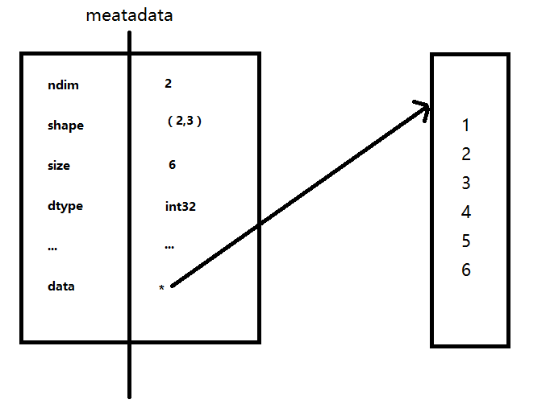
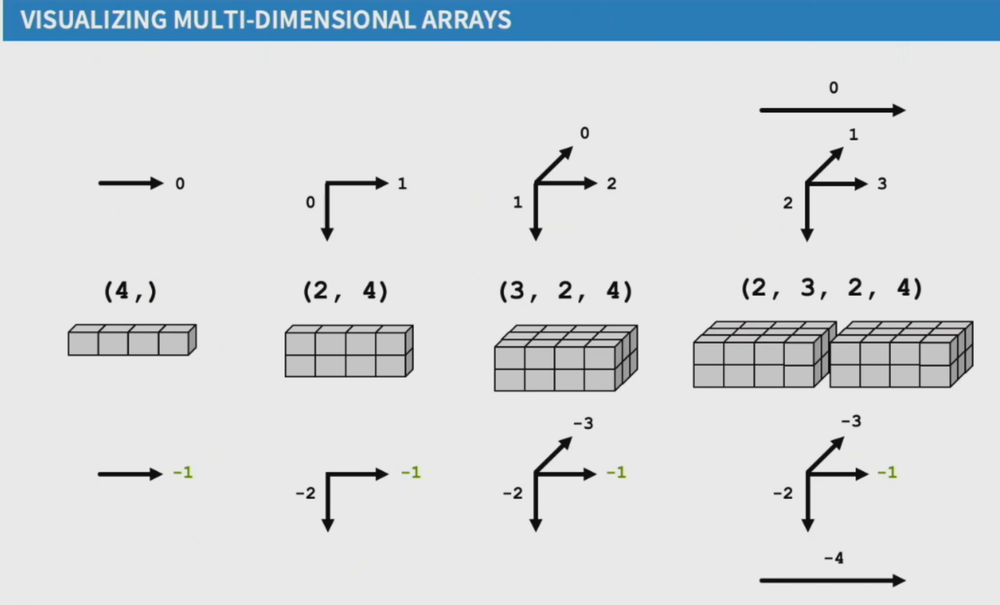
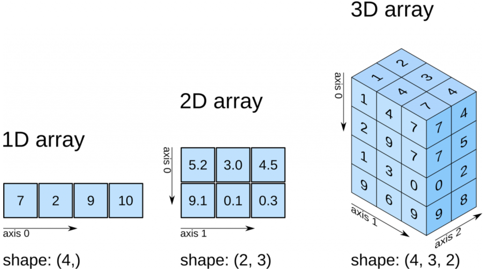
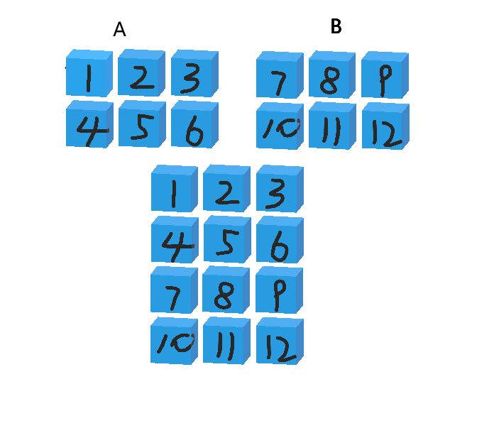
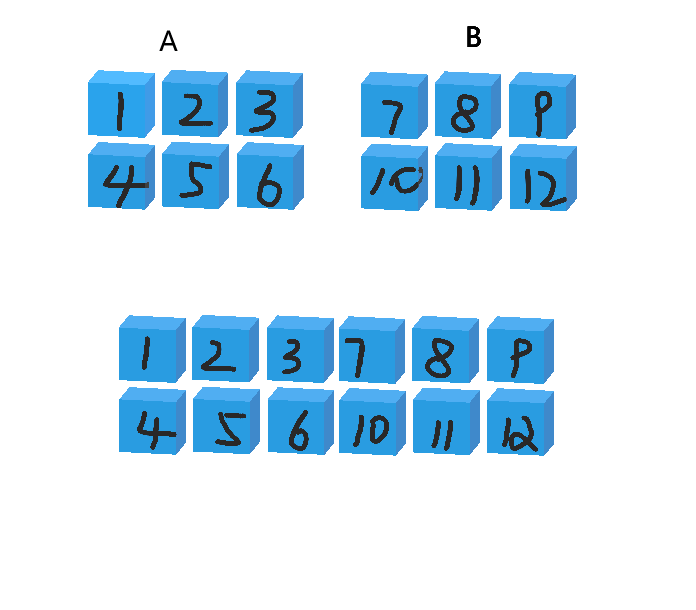

# Python 科学计算库 - Numpy

# 一、Numpy 概述

- **什么是 Numpy**

  一个在 Python 中做科学计算的基础库，重在数值计算，也是大部分 Python 科学计算库（pandas、scikit-learn 等）的基础库，多用于在大型、多维数组上执行数值运算。

  Numpy 的底层核心用 C 实现，并调用高度优化的数学库，运行效率极高。

- **Numpy 的安装**

  ```python
  python -m pip install numpy
  ```

- **Numpy 的核心：多维数组 + 数值计算**

  代码简洁：减少 Python 代码中的循环

  ```python
  import numpy as np
  
  # 创建ndarray数组
  ary = np.array([1,2,3,4,5,6])
  print(ary,type(ary))
  
  list01 = [1,2,3,4,5,6]
  for i in range(len(list01)):
      list01[i] += 3
  print(list01)
  
  # 与列表的区别 - 给每一个元素加3，需要通过for循环遍历然后逐个加3
  # ndarray的运算  - 直接在ndarray数组对象上加3
  print(ary + 3)
  print(ary + ary)
  print(ary * 2)
  print(ary > 3)
  
  ary1 = np.array([[1,2,3],[4,5,6]])
  print(ary1,type(ary1))
  print(ary1 + 3)
  ```

# 二、Numpy 基础

## 2.1 ndarray 数组

用 np.ndarray 类的对象表示 n 维数组

```python
import numpy as np
ary = np.array([1,2,3,4,5,6])
print(type(ary))
```

### 2.1.1 内存中的 ndarray 对象

- **元数据（metadata）**

  存储对目标数组的描述信息，如：ndim、shape、size、dtype、data 等。

- **实际数据**

  完整的数组数据。




将实际数据与元数据分开存放设计的核心特性称为**视图机制**。**视图是共享原始数据、但有自己的元数据（shape、strides、dtype 等）的新数组对象**。优势如下：

- **内存高效的数据共享**

  多个 `ndarray` 可以共享同一份数据，只修改各自的元数据。

  ```python
  import numpy as np
  
  arr = np.array([1, 2, 3, 4, 5, 6])
  view1 = arr[::2]   # 步长2，取[1,3,5]
  view2 = arr[1::2]  # 步长2，取[2,4,6]
  
  # 三个对象共享同一块内存
  # .data 属性是访问原始数据缓冲区
  print(arr.data)      # 内存地址: 0x7f8a1c000000
  print(view1.data)    # 相同地址
  print(view2.data)    # 相同地址
  
  # 修改视图会影响原数组
  view1[0] = 100
  print(arr[0])  # 100
  ```

- **减少对实际数据的访问频率，提高性能**

  通过元数据中的 `strides`（步长），可以实现转置、广播等高维操作，不移动数据。转置、广播、扩展维度都只是元数据的变化，性能极高。

  > NumPy 数组的数据实际存储在一块连续的一维内存中。`strides` 是一个元组，其中的每个整数对应数组的一个维度，代表沿着该维度**前进一个位置**所需的字节数。
  >
  > 定位一个多维数组元素 `a[i, j, k]` 在内存中的位置，可以通过如下公式计算：
  >
  > > ```
  > > offset = i * strides[0] + j * strides[1] + k * strides[2]
  > > ```
  >
  > 这个 `offset` 是相对于数组数据起始位置的字节偏移量。

  ```python
  import numpy as np
  
  arr = np.arange(6).reshape(2, 3)
  print(arr.strides)  # (24, 8)  - 行间步长24字节，列间步长8字节
  
  # 转置 - 只交换元数据中的shape和strides
  transposed = arr.T
  print(transposed.strides)  # (8, 24)  - 步长交换了
  print(transposed.base is arr)  # True - 共享数据
  
  # 广播
  a = np.array([1,2,3])
  b = np.array([[1],[2],[3]])
  c = a + b  # 不复制数据，通过strides实现广播
  ```

### 2.1.2 ndarray 数组对象的特点

1. Numpy 数组是同质数组，即所有元素的数据类型必须相同。
2. Numpy 数组的下标从 0 开始，最后一个元素的下标为数组长度减 1 。

### 2.1.3 ndarray 数组对象的创建

- **np.array(任何可被解释为 Numpy 数组的逻辑结构)**

```python
# np.array(任何可被解释为Numpy数组的逻辑结构)
t1 = np.array([[[1,2],[3,4]],[[5,6],[7,8]]])
print(t1,type(t1))

# np.array({"a":1,"b":2,"c":3}) 
# 有些版本的numpy会报错
# 字典被当作一个标量对象，NumPy 试图把它塞进数组的一个元素里。
# 因为只有一个元素（整个字典），它会创建一个 0 维数组，shape = ()。
# 因为 0 维 object 数组在打印时，会直接调用该对象的 __repr__ 方法。而你存的恰好是字典，所以输出就是字典的字符串
# 取单个元素：0 维数组可以用 [()] 取出值
```

- **np.arange(起始值(0),终止值,步长(1))**

```python
# np.arange(起始值(0)，终止值，步长(1))
t2 = np.arange(0,5,1)
print(t2,type(t2))
t3 = np.arange(0,10,2)
print(t3)
```

- **np.zeros(shape,dtype='类型')**

```python
# np.zeros(shape，dtype="类型")
t4 = np.zeros(10,dtype='int32')
print(t4)
```

- **np.ones(shape,dtype='类型')**

```python
# np.ones(shape，dtype="类型")
t5 = np.ones(10,dtype='bool_')
print(t5)

# 创建一个2行4列的全1数组
t6 = np.ones((2,4),dtype='int32')
print(t6)
```

- **np.zeros_like(ary)   np.ones_like(ary)**

```python
# np.zeros_like(ary)  np.ones_like(ary)
t7 = np.ones_like(t1)
print(t7)
```

- **np.linspace(起始值,终止值,个数)**

```python
# np.linspace(起始值,终止值,个数)
t8 = np.linspace(-10,10,200)
print(t8)
```

- **np.random.normal(期望值,标准差,个数)**

  生成正态分布（高斯分布）随机数

```python
# np.random.normal(期望值,标准差,个数)
t9 = np.random.normal(0,1,100) # 标准正态分布，均值为0标准差为1
print(t9)
```

> 更多随机数方法见 [[数据分析与机器学习/01-Numpy#2.5 numpy.random 常用随机方法|2.5 numpy.random 常用随机方法]]。

思考：创建一个 5 个 0.2 的数组

```python
t10 = np.ones(5) / 5
print(t10)
```

### 2.1.4 Numpy 的内部基本数据类型

| 类型名       | 类型表示符                              | 字符码            |
| ------------ | --------------------------------------- | ----------------- |
| 布尔型       | bool_                                   | ？                |
| 有符号整数型 | int8(-128~127) / int16 / int32 / int64  | i1 / i2 / i4 / i8 |
| 无符号整数型 | uint8(0~255) / uint16 / uint32 / uint64 | u1 / u2 / u4 / u8 |
| 浮点型       | float16 / float32 / float64             | f2 / f4 / f8      |
| 复数型       | complex64 / complex128                  | c8 / c16          |
| 字串型       | str_，每个字符用32位Unicode编码表示     | U                 |

### 2.1.5 ndarray 对象属性的基本操作

- **数组的维度：np.ndarray.shape

```python
import numpy as np

# shape属性
a = np.arange(1,9)
print(a,a.shape)     # (8,)  一维8个数据的数组
# a.shape = (2,4)      # 修改一个数组的shape属性
a.shape = (2,2,2)
print(a,a.shape)

# 二维数组
ary = np.array([
    [1,2,3,4],
    [5,6,7,8]
])
print(type(ary), ary, ary.shape)

# 数组维度的操作
# 1. 视图变维(共享数据) reshape() 与 ravel()
import numpy as np
a = np.arange(1, 9)
b = a.reshape(2, 4)		# 视图变维:变为2行4列的二维数组
c = b.reshape(2, 2, 2)  # 视图变维:变为2页2行2列的三维数组
d = c.ravel()			# 视图变维:变为1维数组

print("a:",a)
print("b:",b)
print("c:",c)
print("d:",d)

# base 属性是 NumPy 数组的一个重要元数据属性，它指向数组数据的原始拥有者。简单说，它告诉你当前数组的数据是从哪个数组"借来"的。
print("a.base:", a.base)        # None (a 是原始数据)
print("b.base is a:", b.base is a)  # True
print("c.base is a:", c.base is a)  # True
print("d.base is a:", d.base is a)  # True

# 2. 复制变维（数据独立） flatten()
e = c.flatten()
print("e:",e)
a += 10
print("a:",a)
print("e:",e)
print("e.base is a:", e.base) # None
print("b:",b) # ？

# 3. 就地变维
# resize直接改变原数组对象的维度，不返回新数组
a.shape = (2, 4)
print("a:",a)
a.resize(2, 2, 2)
print("a:",a)
```

- **元素的类型：np.ndarray.dtype

```python
import numpy as np
ary = np.array([1, 2, 3, 4, 5, 6])
print(type(ary), ary, ary.dtype)
# 转换ary元素的类型
b = ary.astype(float)
print(type(b), b, b.dtype)
# 转换ary元素的类型
c = ary.astype(str)
print(type(c), c, c.dtype)
```

- **数组元素的个数：np.ndarray.size

```python
import numpy as np
ary = np.array([
    [1,2,3,4],
    [5,6,7,8]
])
# 观察维度，size，len的区别
# len() 函数只考虑最外层的元素个数
print(ary.shape, ary.size, len(ary))
```

- **数组元素索引(下标)**

  数组对象[..., 页号, 行号, 列号]

  下标从0开始，到数组len-1结束。

```python
import numpy as np
a = np.array([[[1, 2],
               [3, 4]],
              [[5, 6],
               [7, 8]]])
print(a, a.shape)
print(a[0])
print(a[0][0])
print(a[0][0][0])
print(a[0, 0, 0])

# 打印每一个元素值
for i in range(a.shape[0]):
    for j in range(a.shape[1]):
        for k in range(a.shape[2]):
            print(a[i, j, k])
```

### 2.1.6 轴（axis）

在 numpy 中可以理解为方向，使用0,1,2...数字表示，对于一个一维数组，只有一个0轴，对于2维数组(shape(2,2))，有0轴和1轴，对于三维数组(shape(2,2,3))，有0,1,2轴

有了轴的概念之后，我们计算会更加方便，比如计算一个二维数组的平均值，必须指定是计算哪个方向上面的平均值






**沿轴操作的本质：**

​	"沿某个轴操作" = "这个轴被压缩（消失），其他轴保留"

​	axis=0：沿着垂直方向操作，压缩行

​	axis=1：沿着水平方向操作，压缩列

**轴 = 数组的第几个维度，axis=k 的聚合操作会把第 k 个维度"压缩掉"（对应 shape 中该位消失），而运算本质上就是沿着这个方向把元素合并成一个。**

### 2.1.7 ndarray 数组切片操作

对于刚加载出来的数据，我如果想选择其中的某一列或行或页我们应该怎么做？

二维数组[行的切片，列的切片]

三维数组[页的切片，行的切片，列的切片]

```python
# 数组对象切片的参数设置与列表切片参数类似
# 步长+：默认切从首到尾
# 步长-：默认切从尾到首
# 默认位置步长：1
数组对象[起始位置:终止位置:步长, ...]
```

```python
import numpy as np
a = np.arange(1, 10)
print(a)  # 1 2 3 4 5 6 7 8 9
print(a[:3])  # 1 2 3
print(a[3:6])   # 4 5 6
print(a[6:])  # 7 8 9
print(a[::-1])  # 9 8 7 6 5 4 3 2 1
print(a[:-4:-1])  # 9 8 7
print(a[-4:-7:-1])  # 6 5 4
print(a[-7::-1])  # 3 2 1
print(a[::])  # 1 2 3 4 5 6 7 8 9
print(a[:])  # 1 2 3 4 5 6 7 8 9
print(a[::3])  # 1 4 7
print(a[1::3])  # 2 5 8
print(a[2::3])  # 3 6 9
```

**多维数组的切片操作**

```python
import numpy as np
a = np.arange(1, 28)
a.resize(3,3,3)
print(a)
# 切出1页 
print(a[1, :, :])		
# 切出所有页的1行
print(a[:, 1, :])		
# 切出0页的1行1列
print(a[0, :, 1])
```

### 2.1.8 ndarray 数组的掩码操作

数据很大情况下是凌乱的，并且含有空白的或者无法处理的字符，掩码式数组可以很好的忽略残缺的或者是无效的数据点。掩码分为：布尔掩码 和 索引掩码。布尔掩码是掩出位置为True的值 ，从大数据集中抽取出一小部分。索引掩码是按对应下标的元素输出出来。

```python
import numpy as np
# 布尔掩码
a = np.arange(1, 10)
mask = [True, False,True, False,True, False,True, False,True, False]
print(a[mask])
mask = d % 2 == 0
print(a[mask])

# 索引掩码
products = np.array(['Apple','Mi','Huawei','Oppo'])
inds = [1,3,2,0]
print(products[inds])
```

> **花式索引（Fancy Indexing，即索引掩码）**：用整数数组当下标，按位置取元素；与布尔掩码（用 True/False 数组当下标，按条件筛选）是两种不同的高级索引方式。

**1. numpy array 的花式索引**

`idx` 可以是 Python list 也可以是 numpy array，效果一样：

```python
import numpy as np

a = np.array(['A', 'B', 'C', 'D', 'E'])

# idx 用 Python list
print(a[[0, 2, 4]])            # → ['A', 'C', 'E']

# idx 用 numpy array
print(a[np.array([0, 2, 4])])  # → ['A', 'C', 'E']，效果相同

# 按重要性排序的典型场景
fi = np.array([0.05, 0.60, 0.10, 0.20, 0.03])
sorted_idx = fi.argsort()[::-1]  # → [1, 3, 2, 0, 4]
print(a[sorted_idx])             # → ['B', 'D', 'C', 'A', 'E']
```

花式索引也支持多维数组，按行/页取：

```python
a = np.arange(12).reshape(4, 3)
# [[ 0  1  2]
#  [ 3  4  5]
#  [ 6  7  8]
#  [ 9 10 11]]

print(a[[1, 3]])     # 取第1行和第3行
# [[ 3  4  5]
#  [ 9 10 11]]

print(a[[0, 2, 3]])  # 取第0、2、3行，顺序可任意
# [[ 0  1  2]
#  [ 6  7  8]
#  [ 9 10 11]]
```

**2. pandas Series 的花式索引**

```python
import pandas as pd

s = pd.Series(['Apple', 'Mi', 'Huawei', 'Oppo', 'Vivo'], index=[10, 20, 30, 40, 50])

# idx 用 list
print(s[[10, 30, 50]])              # 按 label 取，不是按位置！
# → 10      Apple
#    30    Huawei
#    50      Vivo

# idx 用 array
print(s[np.array([10, 30, 50])])    # 同样按 label 取，效果相同

# 想按位置取，用 .iloc[]
print(s.iloc[[1, 3, 0]])            # 这才是按位置
# → 20       Mi
#    40     Oppo
#    10    Apple
```

> **注意！** Series 的花式索引默认按 **label（索引名）** 匹配，不是按位置。这和 numpy array 不同。

**3. pandas Index 的花式索引**

```python
import pandas as pd
import numpy as np

idx = pd.Index(['CRIM', 'ZN', 'INDUS', 'CHAS', 'NOX', 'RM'])

# idx 用 list
print(idx[[0, 5, 2]])
# → Index(['CRIM', 'RM', 'INDUS'])

# idx 用 array
print(idx[np.array([5, 0, 3])])
# → Index(['RM', 'CRIM', 'CHAS'])

# 决策树特征重要性的典型场景
fi = np.array([0.05, 0.01, 0.03, 0.00, 0.06, 0.60])
sorted_pos = fi.argsort()[::-1]  # → [5, 4, 0, 2, 1, 3]
print(idx[sorted_pos])
# → Index(['RM', 'NOX', 'CRIM', 'INDUS', 'ZN', 'CHAS'])
```

**4. Python 原生 list 不支持花式索引**

```python
a_list = ['A', 'B', 'C', 'D', 'E']

# ❌ 花式索引报错
a_list[[0, 2, 4]]
# TypeError: list indices must be integers or slices, not list

a_list[np.array([0, 2, 4])]
# TypeError: only integer scalar arrays can be converted to a scalar index

# ✅ 绕过方法
list(np.array(a_list)[[0, 2, 4]])    # 先转 numpy
[a_list[i] for i in [0, 2, 4]]       # 列表推导式
```


### 2.1.9  多维数组的组合拆分

假设：现在有两个表，一个表三列存放三个同学的语数外三科成绩，另外一张表三列存放这三个同学的史地生成绩，现在将这三个同学的成绩合并在一起，那这个就是水平方向的一个合并

假设：现在有两个表，一个表存放三名同学所有成绩，另一张表存放其他三名同学所有成绩，现将这六名同学合并在同一个表，那这个就算是垂直方向的一个合并

**垂直方向操作：**



```python
import numpy as np
a = np.arange(1, 7).reshape(2, 3)
b = np.arange(7, 13).reshape(2, 3)
# 垂直方向完成组合操作，生成新数组
c = np.vstack((a, b))
# 垂直方向完成拆分操作，生成两个数组
d, e = np.vsplit(c, 2)
```

**水平方向操作：**



```python
import numpy as np
a = np.arange(1, 7).reshape(2, 3)
b = np.arange(7, 13).reshape(2, 3)
# 水平方向完成组合操作，生成新数组 
c = np.hstack((a, b))
# 水平方向完成拆分操作，生成两个数组
d, e = np.hsplit(c, 2)
```

**多维数组组合与拆分的相关函数：**

```python
# 通过axis作为关键字参数指定组合的方向，取值如下：
# 若待组合的数组都是二维数组：
#	0: 垂直方向组合
#	1: 水平方向组合
# 若待组合的数组都是三维数组：
#   0: 深度方向组合（堆平面）
#   1: 垂直方向组合（堆行）
#   2: 水平方向组合（拼列）
np.concatenate((a, b), axis=0)
# 通过给出的数组与要拆分的份数，按照某个方向进行拆分，axis的取值同上
np.split(c, 2, axis=0)
```

> 上述方法都属于拼接，不增加维度，它是把现有维度拉长。

**深度方向操作：**

```python
import numpy as np
a = np.arange(1, 7).reshape(2, 3)
b = np.arange(7, 13).reshape(2, 3)
# 深度方向（3维）完成组合操作，生成新数组
# dstack是堆叠，增加维度 相当于stack(...,axis=2)
# stack()：把 K 个形状相同的 N 维数组，沿某个新轴堆叠，得到形状为 (...) 的 (N+1) 维数组。新轴的大小等于 K，位置由 axis 决定。

i = np.dstack((a, b))
# 深度方向（3维）完成拆分操作，生成两个数组
k, l = np.dsplit(i, 2)
```

### 2.1.10 自定义复合类型(结构化数组)

结构化数组允许你在一个 NumPy 数组中存储**不同类型**的数据。

```python
# 自定义复合类型
import numpy as np

data=[
	('zs', [90, 80, 85], 15),
	('ls', [92, 81, 83], 16),
	('ww', [95, 85, 95], 15)
]
#第一种设置dtype的方式
a = np.array(data, dtype='U3, 3int32, int32')   # U3：每个元素最多 3 个 Unicode 字符
print(a)
# 字段名自动生成：'f0','f1','f2'
print(a[0]['f0'], ":", a[1]['f1'])
print("=====================================")

#第二种设置dtype的方式-字典格式
c = np.array(data, dtype={'names': ['name', 'scores', 'ages'],
                    'formats': ['U3', '3int32', 'int32']})
print(c[0]['name'], ":", c[0]['scores'], ":", c.itemsize)
print("=====================================")
```

### 2.1.11 ndarray 数组对象的其他属性

- shape - 维度
- dtype - 元素类型
- size - 元素数量
- ndim - 维数，len(shape)
- itemsize - 元素字节数
- nbytes - 总字节数 = size x itemsize
- real - 复数数组的实部数组
- imag - 复数数组的虚部数组
- T - 数组对象的转置视图
- flat - 扁平迭代器

```python
import numpy as np
a = np.array([[1 + 1j, 2 + 4j, 3 + 7j],
              [4 + 2j, 5 + 5j, 6 + 8j],
              [7 + 3j, 8 + 6j, 9 + 9j]])
print(a.shape)
print(a.dtype)
print(a.ndim)
print(a.size)
print(a.itemsize)
print(a.nbytes)
print(a.real, a.imag, sep='\n')
print(a.T)
print([elem for elem in a.flat])
b = a.tolist()  # list(arr) 只转最外层，内部仍是ndarray  arr.tolist() 递归全部转换，全部转为Python原生类型
print(b)
```

## 2.2 广播机制

广播的核心原则是：当两个数组的维度形状不匹配时，NumPy 会自动扩展较小数组的维度，使其与较大数组的形状兼容。这种扩展仅发生在虚拟层面，不会实际复制数据，这使得 NumPy 操作既内存高效又计算快速。

- **广播机制核心规则**

  广播机制遵循以下规则：

  1. **维度扩展**：若数组维度数不同，较小维度数组的形状会在前面补1，直到维度数相同。
  2. **维度兼容**：从最后一个维度开始向前比较，若两个数组的维度大小相等或其中一个为1，则兼容；否则报错。
  3. **虚拟扩展**：兼容后，NumPy 会在运算时逻辑上扩展大小为1的维度，使其与另一个数组的维度大小相同，但不会实际复制数据。

- **广播示例详解**

  - 示例1：标量与数组

    ```python
    import numpy as np
    
    a = np.array([1, 2, 3])
    b = 10  # 标量 → 视为 shape ()
    
    result = a + b  # [11 12 13]
    ```

    - `a.shape = (3,)`
    - `b.shape = ()` → 自动扩展为 `(1,)` → 再广播为 `(3,)`

  - 示例2：一维与二维

    ```python
    A = np.array([[1, 2, 3],
                  [4, 5, 6]])    # shape (2, 3)
    v = np.array([10, 20, 30])   # shape (3,)
    
    C = A + v
    print(C)
    # [[11 22 33]
    #  [14 25 36]]
    ```

    **广播过程**：

    - 对齐维度：`A: (2, 3)` vs `v: (3,)` → 补全为 `(1, 3)`
    - 比较各维度：
      - 第 1 维：`2` vs `1` → 允许（1 可扩展为 2）
      - 第 2 维：`3` vs `3` → 相等
    - 结果形状：`(2, 3)`

    > 💡 `v` 被“复制”到每一行，但**没有实际复制内存**！（**没有**在内存中分配一个 `(2, 3)` 的新数组来存放重复的 `v`）

  - 示例3：列向量与行向量

    ```python
    row = np.array([1, 2, 3])      # shape (3,)
    col = np.array([[10], [20]])   # shape (2, 1)
    
    result = row + col
    print(result)
    # [[11 12 13]
    #  [21 22 23]]
    ```

    **广播过程**：

    - `row`: (3,) → (1, 3)
    - `col`: (2, 1)
    - 对齐后：
      - 第 1 维：`1` vs `2` → 扩展为 2
      - 第 2 维：`3` vs `1` → 扩展为 3
    - 结果：`(2, 3)`

  - 示例4：广播失败的案例

    维度不兼容

    ```python
    a = np.array([1, 2])        # (2,)
    b = np.array([[1, 2, 3]])   # (1, 3)
    
    # a + b → 报错！
    # 维度对齐：(1,2) vs (1,3)
    # 最后一维：2 ≠ 3，且都不为1 → 无法广播
    ```

    中间维度冲突

    ```python
    A = np.random.rand(2, 3, 4)
    B = np.random.rand(2, 5, 4)
    
    # A + B → 报错！
    # 第2维：3 vs 5 → 无法广播
    ```

## 2.3 numpy 常用统计方法

- **获取最大值最小值位置**    np.argmax(ary,axis=0)    np.argmin(ary,axis=1)

```python
import numpy as np

a = np.arange(1,7).reshape(2,3)
print(a)
print(np.argmax(a,axis=0))
print(np.argmax(a,axis=1))

b = np.array([2,6,3,1,9,5]).reshape(2,3)
print(b)
print(np.argmin(b,axis=0))
print(np.argmin(b,axis=1))
```

- **求和**   ary.sum(axis=None)

```python
import numpy as np

a = np.array([10,5,3,7,4,6]).reshape(2,3)
print(a)
# 将所有元素求和
print(a.sum())
# 将列方向的元素求和
print(a.sum(axis=0))
# 将行方向的元素求和
print(a.sum(axis=1))
```

- **均值**   ary.mean(axis=None)

```python
# 将所有元素求均值
print(a.mean())
# 将列方向的元素求均值
print(a.mean(axis=0))
# 将行方向的元素求均值
print(a.mean(axis=1))
```

- **中值（中位数）**  np.median(ary,axis=None) 

中位数指数组中的各个元素值按大小顺序排列起来,形成一个数列,处于数列中间位置的变量值就称为中位数。当数列的元素个数N为奇数时,处于中间位置的变量值即为中位数；当N为偶数时,中位数则为处于中间位置的2个变量值的平均数。

```python
# 将所有元素求中值
print(np.median(a))
# 将列方向的元素求中值
print(np.median(a,axis=0))
# 将行方向的元素求中值
print(np.median(a,axis=1))
```

- **最大值最小值**   ary.max(axis=None)     ary.min(axis=None)  

```python
# 将所有元素求最大值
print(a.max())
# 将列方向的元素求最大值
print(a.max(axis=0))
# 将行方向的元素求最大值
print(a.max(axis=1))
```

- **极值**  最大值与最小值之差  np.ptp(ary,axis=None)

```python
# 将所有元素求极值
print(np.ptp(a))
# 将列方向的元素求极值
print(np.ptp(a,axis=0))
# 将行方向的元素求极值
print(np.ptp(a,axis=1))
```

- **标准差   ary.std(axis=None)

标准差是一组数据平均值分散程度的一种度量。一个较大的标准差，代表大部分数值和其平均值之间差异较大；一个较小的标准差，代表这些数值较接近平均值反映出数据的波动稳定情况，越大表示波动越大，越不稳定。

```python
# 将所有元素求标准差
print(a.std())
# 将列方向的元素求标准差
print(a.std(axis=0))
# 将行方向的元素求标准差
print(a.std(axis=1))
```

## 2.4 numpy 其他常用函数

### 2.4.1 条件与筛选

- **np.where(条件, x, y)** — 条件三元选择

  满足条件取 `x`，否则取 `y`。

  ```python
  import numpy as np

  a = np.array([3, 7, 2, 9, 4])
  # 大于5的保留，否则置0
  result = np.where(a > 5, a, 0)
  print(result)  # [0 7 0 9 0]
  ```

- **np.where(条件)** — 位置查找

  只传一个条件参数时，返回满足条件的元素下标。

  ```python
  a = np.array([3, 7, 2, 9, 4])
  idx = np.where(a > 5)
  print(idx)        # (array([1, 3]),)
  print(a[idx])     # [7 9]
  ```

  多维数组返回的是各维度的下标元组：

  ```python
  arr = np.array([[1, 6], [3, 8]])
  idx = np.where(arr > 4)
  print(idx)        # (array([0, 1]), array([1, 1]))  → (0,1)和(1,1)两个位置
  print(arr[idx])   # [6 8]
  ```

- **np.clip(arr, min, max)** — 截断

  把小于 `min` 的值拉到 `min`，大于 `max` 的值拉到 `max`。

  ```python
  a = np.array([1, 5, 10, 15, 20])
  print(np.clip(a, 3, 12))  # [ 3  5 10 12 12]
  ```

- **np.isnan(arr)** / **np.isinf(arr)** — NaN / 无穷值检测

  ```python
  a = np.array([1, np.nan, 3, np.inf, 5])
  print(np.isnan(a))   # [False  True False False False]
  print(np.isinf(a))   # [False False False  True False]
  # 结合 where 过滤异常值
  valid = np.where(~np.isnan(a) & ~np.isinf(a))
  print(a[valid])      # [1. 3. 5.]
  ```

### 2.4.2 排序与去重

- **np.sort(arr, axis=-1)** — 排序（返回副本，不改变原数组）

  ```python
  a = np.array([3, 1, 2])
  print(np.sort(a))          # [1 2 3]
  print(a)                   # [3 1 2]  原数组不变

  # 二维：沿指定轴排序
  arr = np.array([[3, 1, 2], [6, 4, 5]])
  print(np.sort(arr, axis=0))  # 每列内排序
  ```

- **np.argsort(arr, axis=-1)** — 返回排序后的下标

  笔记花式索引部分已用过，这里正式讲：它返回的是「排好序后每个元素在原数组中的位置」。

  ```python
  a = np.array([0.3, 0.9, 0.1, 0.6])
  print(np.argsort(a))         # [2 0 3 1]  → 最小的是下标2，其次是0...
  print(a[np.argsort(a)])      # [0.1 0.3 0.6 0.9]  等价于 np.sort(a)

  # 降序：取负或 [::-1]
  print(np.argsort(a)[::-1])   # [1 3 0 2]
  ```

- **np.unique(arr, return_counts=False)** — 去重

  ```python
  a = np.array([2, 1, 2, 3, 1, 3, 3])
  print(np.unique(a))          # [1 2 3]  默认排序

  # 同时返回每个值出现的次数
  vals, counts = np.unique(a, return_counts=True)
  print(vals)                  # [1 2 3]
  print(counts)                # [2 2 3]
  ```

- **np.bincount(x, weights=None, minlength=0)** — 非负整数的频数统计 / 按编号加权求和

  它属于 NumPy 的**计数函数**，不是 `np.random` 中的随机数生成方法，但常用于统计随机模拟结果。

  **1. 基本用法：结果的下标是数值，结果的元素是出现次数**

  ```python
  import numpy as np

  a = np.array([1, 2, 2, 4, 4, 4])
  counts = np.bincount(a)
  print(counts)     # [0 1 2 0 3]
  print(counts[2])  # 2：数字2出现了2次
  print(counts[4])  # 3：数字4出现了3次
  ```

  | 结果下标（被统计的数值） | 0 | 1 | 2 | 3 | 4 |
  | --- | --- | --- | --- | --- | --- |
  | 出现次数 | 0 | 1 | 2 | 0 | 3 |

  **即使原数据没有 0 和 3，也会保留对应位置并填 0。** 对非空输入，默认输出长度为 `x.max() + 1`，因为下标从 0 开始。

  **2. `minlength`：规定输出至少有多少个位置**

  ```python
  import numpy as np

  a = np.array([1, 2, 2, 4, 4, 4])
  print(np.bincount(a, minlength=7))  # [0 1 2 0 3 0 0]，下标0～6
  print(np.bincount(a, minlength=3))  # [0 1 2 0 3]，不会截断已有计数
  ```

  `minlength=7` 表示**至少 7 个位置**，不是“统计到数字 7”。若要保留数值 `0～7` 的位置，要写 `minlength=8`。

  对非空输入，输出长度为 `max(x.max() + 1, minlength)`；`minlength` 是非负整数，不是上限。

  **3. 骰子示例：统计两枚骰子的点数和**

  ```python
  import numpy as np

  rng = np.random.default_rng(42)
  die1 = rng.integers(1, 7, size=10000)
  die2 = rng.integers(1, 7, size=10000)
  totals = die1 + die2

  counts = np.bincount(totals, minlength=13)  # 保留下标0～12
  print(counts[2:13])           # 点数和2～12各自出现的次数
  print(counts[7])              # 点数和为7的次数
  print(counts[7] / totals.size) # 点数和为7的模拟频率，理论概率为1/6
  print(counts.sum())           # 10000：所有次数之和等于模拟次数
  ```

  最小点数和是 2，所以 `counts[0]` 和 `counts[1]` 都为 0。即使某次模拟没有出现 12，`minlength=13` 也能保留 `counts[12]`，避免索引越界。

  **4. `weights`：不再每次加 1，而是把对应权重加起来**

  ```python
  import numpy as np

  groups = np.array([0, 1, 1, 2, 2])  # 每条记录的组编号
  amounts = np.array([10, 20, 30, 40, 50])  # 每条记录的金额

  print(np.bincount(groups))                   # [1 2 2]：每组记录数
  print(np.bincount(groups, weights=amounts))   # [10. 50. 90.]：每组金额之和
  # 第0组：10；第1组：20+30；第2组：40+50
  ```

  `weights` 必须与 `x` 形状相同。加权结果是**分组求和，不是分组平均值，也不会自动归一化为概率**。

  **5. 与 `np.unique(..., return_counts=True)` 的区别**

  ```python
  import numpy as np

  a = np.array([1, 2, 2, 4, 4, 4])
  print(np.bincount(a))  # [0 1 2 0 3]：数值由下标表示，缺失位置补0

  values, counts = np.unique(a, return_counts=True)
  print(values)  # [1 2 4]：只列出实际出现的值
  print(counts)  # [1 2 3]：与values一一对应
  ```

  - `bincount()`：适合从 0 开始、范围不大的非负整数编号，能直接用 `counts[k]` 查询数值 `k` 的计数（前提是该下标在输出范围内）。
  - `unique(..., return_counts=True)`：也适用于负数、浮点数、字符串等可比较的数据；只返回实际出现的值，不为中间缺失的整数补位置。
  - `bincount()` 的输入必须是**一维非负整数序列**；负数、浮点数组（即使值是 `1.0`）、二维数组都不能直接传入。若确实要统计二维数组的全部元素，可先用 `a.ravel()` 展平；它没有 `axis` 参数。
  - 不要为消除报错直接把任意小数强转整数，否则会改变数据含义。连续数值按区间统计通常使用 `np.histogram()`。
  - 输出长度受最大编号影响：若编号很大且稀疏，如 `[1, 100000000]`，会产生大量空位置，此时更适合用 `unique(..., return_counts=True)`。

  参考：[NumPy bincount 官方文档](https://numpy.org/doc/stable/reference/generated/numpy.bincount.html)。

### 2.4.3 逻辑聚合

| 函数 | 含义 | 类比 |
|------|------|------|
| `np.all(cond)` | 全部为 True？ | Python 的 `all()` |
| `np.any(cond)` | 至少一个为 True？ | Python 的 `any()` |

支持 `axis` 参数，沿轴判断：

```python
a = np.array([[True, False], [True, True]])

print(np.all(a))           # False  必须全部 True
print(np.any(a))           # True   至少一个 True

print(np.all(a, axis=0))   # [ True False]  每列：第0列全True，第1列不全True
print(np.any(a, axis=1))   # [ True  True]  每行：都有至少一个True
```

实战中常用于结合条件判断：

```python
scores = np.array([85, 92, 78, 60, 95])
print(np.all(scores >= 60))   # True  → 全班都及格
print(np.any(scores < 60))    # False → 没有不及格的
```

### 2.4.4 累加与差分

- **np.cumsum(arr, axis=None)** — 累加和（前缀和）

  ```python
  a = np.array([1, 2, 3, 4])
  print(np.cumsum(a))  # [ 1  3  6 10]
  ```

- **np.cumprod(arr, axis=None)** — 累乘积

  ```python
  print(np.cumprod(a))  # [ 1  2  6 24]
  ```

- **np.diff(arr, n=1, axis=-1)** — 相邻元素差

  ```python
  a = np.array([1, 3, 6, 10])
  print(np.diff(a))     # [2 3 4]  一阶差分
  print(np.diff(a, n=2))# [1 1]    二阶差分（差分的差分）
  ```

### 2.4.5 矩阵运算

- **np.dot(a, b)** 或 **`a @ b`** — 点积 / 矩阵乘法

  ```python
  a = np.array([1, 2, 3])
  b = np.array([4, 5, 6])
  print(np.dot(a, b))   # 32   向量点积: 1×4 + 2×5 + 3×6

  A = np.array([[1, 2], [3, 4]])
  B = np.array([[5, 6], [7, 8]])
  print(A @ B)          # [[19 22]
                        #  [43 50]]   矩阵乘法
  ```

- **np.eye(n)** — 单位矩阵

  ```python
  print(np.eye(3))
  # [[1. 0. 0.]
  #  [0. 1. 0.]
  #  [0. 0. 1.]]
  ```

### 2.4.6 取整

| 函数 | 方向 | 例子 |
|------|------|------|
| `np.round(3.6)` | 四舍五入 | $4.0$ |
| `np.floor(3.6)` | 向下取整 $\lfloor x \rfloor$ | $3.0$ |
| `np.ceil(3.2)` | 向上取整 $\lceil x \rceil$ | $4.0$ |

```python
a = np.array([1.2, 2.7, 3.5, -1.2, -1.7])
print(np.round(a))   # [ 1.  3.  4. -1. -2.]
print(np.floor(a))   # [ 1.  2.  3. -2. -2.]
print(np.ceil(a))    # [ 2.  3.  4. -1. -1.]
```

### 2.4.7 维度操作

- **np.expand_dims(arr, axis)** — 在指定位置插入一个大小为 1 的新维度

  ```python
  a = np.array([1, 2, 3])            # shape (3,)
  print(np.expand_dims(a, axis=0))   # shape (1, 3) → [[1 2 3]]
  print(np.expand_dims(a, axis=1))   # shape (3, 1) → [[1]
                                      #                  [2]
                                      #                  [3]]
  ```

- **np.squeeze(arr, axis=None)** — 去掉所有（或指定）大小为 1 的维度

  ```python
  a = np.array([[[1, 2]]])           # shape (1, 1, 2)
  print(np.squeeze(a))               # shape (2,) → [1 2]
  print(np.squeeze(a, axis=0))       # shape (1, 2)
  ```

### 2.4.8 集合运算

| 函数 | 操作 |
|------|------|
| `np.intersect1d(a, b)` | 交集 $A \cap B$ |
| `np.union1d(a, b)` | 并集 $A \cup B$ |
| `np.setdiff1d(a, b)` | 差集 $A \setminus B$ |

```python
a = np.array([1, 2, 3, 4, 5])
b = np.array([3, 4, 5, 6, 7])

print(np.intersect1d(a, b))   # [3 4 5]
print(np.union1d(a, b))       # [1 2 3 4 5 6 7]
print(np.setdiff1d(a, b))     # [1 2]    a有b无
print(np.setdiff1d(b, a))     # [6 7]    b有a无
```

### 2.4.9 创建数组（补充）

- **np.full(shape, val)** — 填充指定值
- **np.full_like(arr, val)** — 仿形状填充

```python
print(np.full((2, 3), 7))              # 2×3全填7
a = np.array([[1, 2], [3, 4]])
print(np.full_like(a, 0.5))            # 和a同shape，全填0.5
```

### 2.4.10 数组的存储与读取（IO）

- **np.save(path, arr)** / **np.load(path)** — 单数组存/读 `.npy`

  ```python
  a = np.arange(10)
  np.save('my_array.npy', a)
  b = np.load('my_array.npy')   # b == a
  ```

- **np.savez(path, key1=arr1, key2=arr2)** — 多数组打包存 `.npz`

  ```python
  x = np.array([1, 2, 3])
  y = np.array([4, 5, 6])
  np.savez('data.npz', features=x, labels=y)
  data = np.load('data.npz')
  print(data['features'])   # [1 2 3]
  print(data['labels'])     # [4 5 6]
  ```

> `.npy` / `.npz` 是 NumPy 原生的二进制格式，比 CSV 读写快得多，且保留 dtype 信息。


## 2.5 numpy.random 常用随机方法

`np.random` 是 NumPy 提供的随机数模块，适合一次生成一组数或一个多维数组；与 Python 标准库的 `random` 不是同一个模块。

这里先沿用前面 `np.random.normal()` 的写法介绍常用方法，再给出新接口对照。以下打印的随机值不固定，注释主要说明取值范围、形状和含义。

### 2.5.1 均匀分布随机数

- **np.random.random(size=None)** — 生成 `[0, 1)` 的均匀随机浮点数

  `size` 控制输出形状：不传时返回一个数，传整数时返回一维数组，传元组时返回对应形状的数组。

  ```python
  import numpy as np

  print(np.random.random())        # 一个浮点数，0 <= x < 1
  print(np.random.random(5))       # 一维数组，5个数
  print(np.random.random((2, 3)))  # 二维数组，2行3列
  print(np.random.random(1).shape) # (1,)：含一个数的数组，不是标量
  ```

  `np.random.random_sample()`、`np.random.sample()`、`np.random.ranf()` 是同类传统接口别名。**这里的 `sample()` 不是 Python 标准库中的无放回抽样方法。**

- **np.random.rand(d0, d1, ..., dn)** — 按指定维度生成 `[0, 1)` 均匀随机数组

  与 `random()` 的分布相同，区别在于**形状参数的写法**。

  ```python
  import numpy as np

  print(np.random.rand())         # 一个随机浮点数
  print(np.random.rand(5))        # 5个数
  print(np.random.rand(2, 3))     # 2行3列：维度分开传
  print(np.random.random((2, 3))) # 同样的形状与分布，不保证生成相同的值
  ```

  > `rand(2, 3)` 不写成 `rand((2, 3))`，也不使用 `size=`。

- **np.random.uniform(low=0.0, high=1.0, size=None)** — 指定区间的均匀分布

  通常按 `[low, high)` 理解。连续均匀分布中，区间内**等长小段的概率相同**。

  ```python
  import numpy as np

  print(np.random.uniform(1, 10))              # 1到10之间的一个浮点数
  print(np.random.uniform(1, 10, size=5))      # 5个浮点数
  print(np.random.uniform(-1, 1, size=(2, 3))) # 2行3列
  ```

  > 浮点舍入可能使 `high` 出现；实际使用时要求 `high >= low`，两者相等则返回该值。

### 2.5.2 随机整数

- **np.random.randint(low, high=None, size=None, dtype=int)** — 指定范围的随机整数

  **左闭右开**：包含 `low`，不包含 `high`。只传一个边界时，从 `0` 开始。

  ```python
  import numpy as np

  print(np.random.randint(6))                  # 一个整数：0～5
  print(np.random.randint(1, 7))               # 一个整数：1～6，模拟骰子
  print(np.random.randint(1, 7, size=10))      # 掷10次骰子
  print(np.random.randint(1, 7, size=(2, 3)))  # 2行3列的骰子点数
  ```

  > 注意：标准库 `random.randint(1, 6)` 包含 6；NumPy `np.random.randint(1, 6)` 不包含 6。NumPy 没有这里对应的 `step` 参数；从偶数中抽样可用 `np.random.choice(np.arange(0, 10, 2))`。

### 2.5.3 正态分布随机数

- **np.random.normal(loc=0.0, scale=1.0, size=None)** — 指定均值与标准差的正态分布

  前面创建数组时已使用过。`loc` 是均值（期望值），`scale` 是**标准差，不是方差**，且不能为负。

  ```python
  import numpy as np

  print(np.random.normal(0, 1, 5))             # 标准正态分布，5个数
  print(np.random.normal(10, 2, size=(2, 3)))  # 均值10、标准差2，2行3列
  ```

  上例第二组的总体方差为 `2**2 = 4`。抽出的少量数据，其样本均值不一定恰好为 10；正态分布也不把数据限制在“均值±标准差”的范围内。

- **np.random.randn(d0, d1, ..., dn)** — 标准正态分布

  总体均值为 `0`，标准差为 `1`；可以生成负数，不是 `[0, 1)` 均匀分布。

  ```python
  import numpy as np

  print(np.random.randn())       # 一个标准正态随机数
  print(np.random.randn(2, 3))   # 2行3列，维度分开传
  print(10 + 2 * np.random.randn(5))  # 转换为均值10、标准差2的正态分布
  ```

- **np.random.standard_normal(size=None)** — 另一种标准正态接口

  ```python
  import numpy as np

  print(np.random.standard_normal(size=(2, 3))) # 形状用元组传入
  ```

  **记忆：`rand` 是均匀分布，`randn` 中的 `n` 对应 normal（正态）；`randn(2, 3)` 与 `standard_normal((2, 3))` 的分布和形状一致。**

### 2.5.4 随机抽样

- **np.random.choice(a, size=None, replace=True, p=None)** — 从候选项中抽样

  - `a`：一维候选序列；若传正整数 `n`，表示从 `0～n-1` 中抽取。
  - `size`：抽样结果的形状；不传时抽一个元素。
  - `replace=True`：有放回，可以重复抽中同一位置。
  - `replace=False`：无放回，同一位置只能抽一次。
  - `p`：各候选项的概率；默认等概率，指定时需非负、长度匹配、总和为 1（容许浮点误差）。

  ```python
  import numpy as np

  items = np.array(['Apple', 'Mi', 'Huawei', 'Oppo'])
  print(np.random.choice(items))                         # 抽一个
  print(np.random.choice(items, size=6))                 # 有放回，可重复
  print(np.random.choice(items, size=3, replace=False))  # 无放回
  print(np.random.choice(items, size=5, p=[0.1, 0.2, 0.6, 0.1]))
  print(np.random.choice(10, size=3, replace=False))     # 从0～9抽3个
  print(np.random.choice(list('abc')))                  # 从字符串抽字符，先转列表
  ```

  > 无放回抽样的数量不能超过候选位置数；指定 `p` 时还不能超过概率为正的候选位置数。**无放回不是去重**：`['A', 'A', 'B']` 中两个不同位置的 `'A'` 仍可能同时被抽中。传统 `np.random.choice()` 的候选数组须为一维。

### 2.5.5 打乱顺序

- **np.random.shuffle(x)** — 原地打乱，返回 `None`

  ```python
  import numpy as np

  a = np.array([1, 2, 3, 4, 5])
  result = np.random.shuffle(a)
  print(a)       # 原数组的顺序被打乱，也可能碰巧与原顺序相同
  print(result)  # None

  arr = np.arange(12).reshape(4, 3)
  np.random.shuffle(arr)
  print(arr)     # 二维数组：打乱整行顺序，各行内部顺序不变
  ```

  > 不要写 `a = np.random.shuffle(a)`，否则 `a` 会变成 `None`。传统接口只沿第 0 轴打乱，不能传 `axis=`。

- **np.random.permutation(x)** — 返回随机排列，不修改原数组

  `x` 是数组时返回打乱后的副本；是正整数 `n` 时返回 `0～n-1` 的随机排列。

  ```python
  import numpy as np

  a = np.array([1, 2, 3, 4, 5])
  b = np.random.permutation(a)
  print(a)  # [1 2 3 4 5]，原数组不变
  print(b)  # 新数组，顺序随机
  print(np.random.permutation(5))  # 0、1、2、3、4的随机排列
  ```

  对二维数组，传统 `permutation()` 同样按整行排列，不是把所有元素混在一起。

### 2.5.6 随机种子与复现

- **np.random.seed(seed)** — 重置传统全局随机生成器的起点

  ```python
  import numpy as np

  np.random.seed(42)
  a = np.random.randint(0, 100, size=5)
  b = np.random.randint(0, 100, size=5) # 继续生成后续数字，不是重新开始

  np.random.seed(42)                  # 重置到相同起点
  c = np.random.randint(0, 100, size=5)
  print(a)
  print(b)
  print(np.array_equal(a, c))         # True
  ```

  **种子固定的是序列起点，不是让每次抽样都相同。** 在相同环境、种子和调用顺序下可复现；不要在循环里每轮都重新设置同一个种子。

  > Python 标准库 `random.seed()` 与 `np.random.seed()` 管理不同的状态，不能互相替代。

### 2.5.7 其他常见概率分布

- **np.random.binomial(n, p, size=None)** — 二项分布：`n` 次独立试验的成功次数

  `n` 取非负整数，`p` 是每次试验的成功概率，介于 `0` 和 `1`。

  ```python
  import numpy as np

  # 每组抛10次公平硬币，记录正面次数；模拟5组
  counts = np.random.binomial(n=10, p=0.5, size=5)
  print(counts)  # 每个数是0～10之间的整数

  # n=1：一次成功/失败试验，结果为1或0（伯努利分布）
  print(np.random.binomial(n=1, p=0.3, size=10))
  ```

  > `n=10` 是**每组的试验次数**；`size=5` 是**生成5组结果**，两者不要混淆。

- **np.random.poisson(lam=1.0, size=None)** — 泊松分布：单位区间内的事件次数

  `lam` 是该区间内的平均事件数，必须非负。

  ```python
  import numpy as np

  # 假设每分钟平均有3次到达，模拟10个一分钟区间的到达次数
  counts = np.random.poisson(lam=3, size=10)
  print(counts)  # 非负整数，每个区间不一定恰好是3次
  ```

- **np.random.exponential(scale=1.0, size=None)** — 指数分布：常用于模拟等待时间

  `scale` 是尺度参数；对正尺度的指数分布，它等于平均等待时间，是速率 `λ` 的倒数：`scale = 1 / λ`。

  ```python
  import numpy as np

  # 假设事件以恒定速率每分钟2次发生，平均等待时间为0.5分钟
  waits = np.random.exponential(scale=1 / 2, size=5)
  print(waits)  # 5个非负等待时间，单位为分钟
  ```

  > 二项分布和泊松分布生成**次数（整数）**；指数分布生成**等待时间（浮点数）**。选分布取决于问题假设，而不只是想生成整数还是小数。

### 2.5.8 新写法：np.random.default_rng()

- **np.random.default_rng(seed=None)** — 创建独立的随机生成器

  上面介绍的是常见传统接口；[NumPy 官方文档](https://numpy.org/doc/stable/reference/random/generator.html) 推荐新代码使用生成器对象。`rng` 只是变量名，不是额外的库。

  ```python
  import numpy as np

  rng = np.random.default_rng(42)
  print(rng.random((2, 3)))                 # [0, 1)均匀随机数
  print(rng.integers(1, 7, size=5))         # 1～6的随机整数
  print(rng.integers(1, 6, size=5, endpoint=True)) # 包含上界6
  print(rng.normal(0, 1, size=5))           # 标准正态分布
  print(rng.choice(['A', 'B', 'C'], size=2, replace=False))
  ```

| 目的 | 传统接口 | 新接口（先创建 `rng`） |
| --- | --- | --- |
| `[0, 1)` 均匀分布 | `np.random.random((2, 3))` 或 `np.random.rand(2, 3)` | `rng.random((2, 3))` |
| 指定区间均匀分布 | `np.random.uniform(1, 10, size=5)` | `rng.uniform(1, 10, size=5)` |
| 随机整数 | `np.random.randint(1, 7, size=5)` | `rng.integers(1, 7, size=5)` |
| 标准正态分布 | `np.random.randn(2, 3)` 或 `np.random.standard_normal((2, 3))` | `rng.standard_normal((2, 3))` |
| 指定正态分布 | `np.random.normal(10, 2, size=5)` | `rng.normal(10, 2, size=5)` |
| 随机抽样 | `np.random.choice(a, size=3)` | `rng.choice(a, size=3)` |
| 原地打乱 | `np.random.shuffle(a)` | `rng.shuffle(a)` |
| 随机排列副本 | `np.random.permutation(a)` | `rng.permutation(a)` |
| 二项分布 | `np.random.binomial(10, 0.5, size=5)` | `rng.binomial(10, 0.5, size=5)` |
| 泊松分布 | `np.random.poisson(3, size=5)` | `rng.poisson(3, size=5)` |
| 指数分布 | `np.random.exponential(0.5, size=5)` | `rng.exponential(0.5, size=5)` |
| 设置起点 | `np.random.seed(42)` | `rng = np.random.default_rng(42)` |

**新旧接口的注意事项：**

- `rng` 没有 `rand()`、`randn()`、`randint()`，不能仅把 `np.random` 换成 `rng`。
- `rng.shuffle()`、`rng.permutation()` 支持 `axis`；例如 `axis=1` 可以打乱二维数组的整列顺序。
- `rng.choice()` 支持多维候选数组并可指定 `axis`；传统 `np.random.choice()` 不支持此用法。
- `np.random.seed()` 不会重置已有的 `rng`；复位通常用相同种子重新创建生成器。
- 相同种子不保证新旧接口输出相同；`Generator` 也不承诺跨 NumPy 版本的随机序列始终一致，长期复现应记录版本。

与 Python 标准库的完整比较见 [[Python基础/03-特殊类型与推导式#3.11 常用功能并排对照|random 常用功能对照]]。

> **参考文档：** [传统随机接口](https://numpy.org/doc/stable/reference/random/legacy.html)、[choice](https://numpy.org/doc/stable/reference/random/generated/numpy.random.choice.html)、[binomial](https://numpy.org/doc/stable/reference/random/generated/numpy.random.binomial.html)、[poisson](https://numpy.org/doc/stable/reference/random/generated/numpy.random.poisson.html)、[exponential](https://numpy.org/doc/stable/reference/random/generated/numpy.random.exponential.html)。
