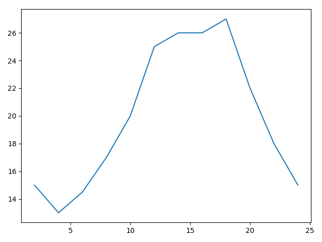
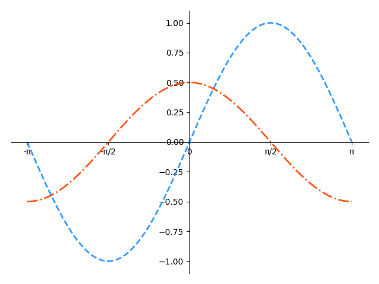
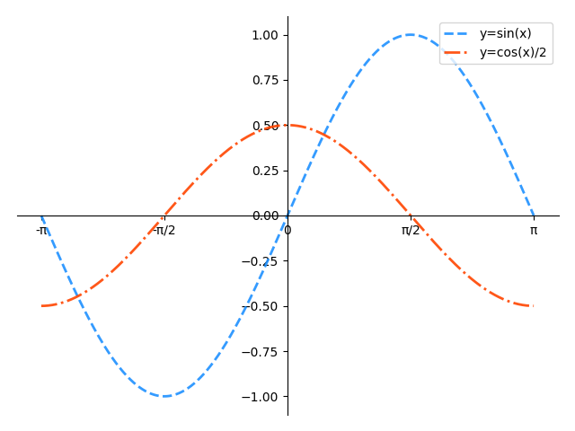
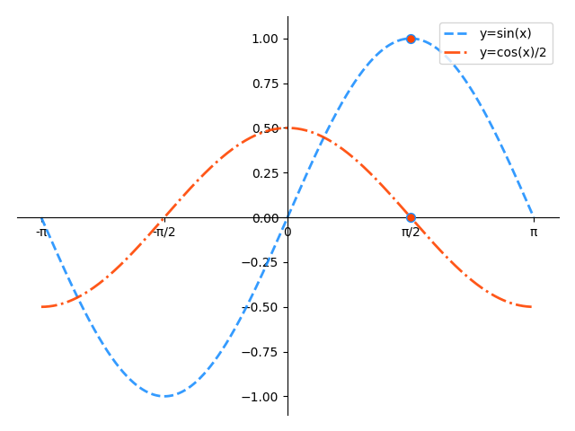
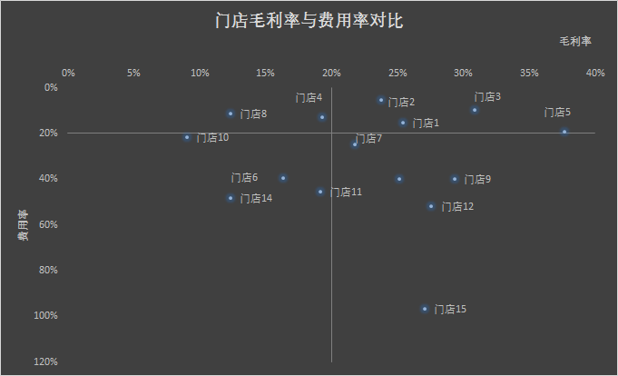
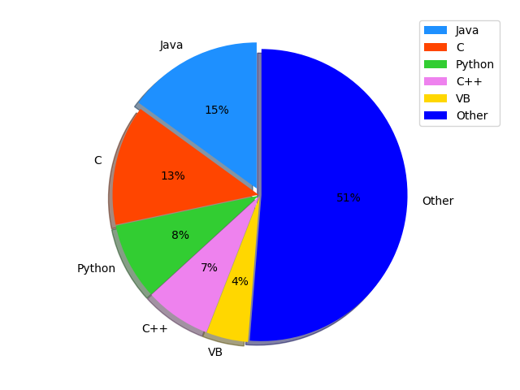

# 可视化工具 - matplotlib

# 1. matplotlib 概述

- #### 为什么要学习 matplotlib

  能将数据进行可视化，更直观的呈现

  使数据更加客观、更具说服力

- #### 什么是 matplotlib 

  最流行的 Python 底层绘图库，主要做数据可视化图表

- #### 安装 matplotlib

  ```shell
  命令：python -m pip install matplotlib
  镜像地址：https://pypi.tuna.tsinghua.edu.cn/simple
  ```

> 问题：了解一天24小时气温的变化趋势
>
> 假设一天中每隔两个小时(range(2,26,2))的气温(℃)分别是[15,13,14.5,17,20,25,26,26,27,22,18,15]

```python
from matplotlib import pyplot as plt
x = range(2,26,2)
y = [15,13,14.5,17,20,25,26,26,27,22,18,15]
plt.plot(x,y)
plt.show()
```



# 2. matplotlib 基本功能 

## 2.1 matplotlib 的基本用法

### 模块的引入方式

```python
from matplotlib import pyplot as plt 
import matplotlib.pyplot as plt
```

## 2.2 基本绘图（在二维平面坐标系中绘制连续的线）

### 2.2.1 基本操作

1. 设置线型、线宽和颜色  
2. 设置坐标轴范围
3. 设置坐标刻度
4. 设置坐标轴
5. 图例
6. 特殊点
7. 备注

### 2.2.2 绘图核心 API

案例：绘制 sinx 函数曲线

```python
import numpy as np
import matplotlib.pyplot as plt

# 从-π到π拆分出1000个数
x = np.linspace(-np.pi,np.pi,1000)
y = np.sin(x)  #求x的正弦函数值

plt.plot(x,y)
plt.show()
```

- #### 设置线型、线宽

  plt.plot(x,y,linestyle=,linewidth=,color=,alpha=)

  x : x 轴上的数值

  y：y 轴上的数值

  linestyle：折线的风格  ==常见取值有实线（'-'）、虚线（'--'）、点虚线（'-.'）、点线（':'）==

  linewidth : 线宽（值为数字）（越大越粗）
  
  alpha: 透明度（0-1）

  color : 颜色（颜色值见下图）  [颜色简写大全](./img/matplotlib_colors.png)

> 常用单字符颜色简写：
>
> | 简写 | 颜色 |
> |------|------|
> | `'b'` | 蓝色 blue |
> | `'g'` | 绿色 green |
> | `'r'` | 红色 red |
> | `'c'` | 青色 cyan |
> | `'m'` | 品红 magenta |
> | `'y'` | 黄色 yellow |
> | `'k'` | 黑色 black |
> | `'w'` | 白色 white |
>
> 此外也支持 HTML 颜色名（如 `'dodgerblue'`、`'orangered'`）和十六进制颜色码（如 `'#FF5733'`）


```python
import matplotlib.pyplot as plt
import numpy as np

# 从-π到π拆分出1000个数
x = np.linspace(-np.pi,np.pi,1000)
sinx = np.sin(x)  #求x的正弦函数值
cosx = np.cos(x) / 2

# plt.plot(x,sinx)
# 设置线宽等属性
plt.plot(x,sinx,linewidth=2,linestyle='--',color='dodgerblue',alpha=0.9)
plt.plot(x,cosx,linewidth=2,linestyle='-.',color='orangered',alpha=0.9)

plt.show()
```

#### 设置坐标轴范围

语法：

```python
#x_limt_min:	<float> x轴范围最小值
#x_limit_max:	<float> x轴范围最大值
plt.xlim(x_limt_min, x_limit_max)
#y_limt_min:	<float> y轴范围最小值
#y_limit_max:	<float> y轴范围最大值
plt.ylim(y_limt_min, y_limit_max)
```

```python
# 设置可视区域
plt.xlim(0,np.pi)
plt.ylim(0,1)
```

#### 设置坐标刻度

语法：

```python
#x_val_list: 	x轴刻度值序列
#x_text_list:	x轴刻度标签文本序列 [可选]
plt.xticks(x_val_list , x_text_list )
#y_val_list: 	y轴刻度值序列
#y_text_list:	y轴刻度标签文本序列 [可选]
plt.yticks(y_val_list , y_text_list )
```

```python
# 设置x轴的坐标刻度
vals = [-np.pi,-np.pi/2,0,np.pi/2,np.pi]
texts = ['-π','-π/2','0','π/2','π']
plt.xticks(vals,texts)
```

#### 设置坐标轴



坐标轴名：left / right / bottom / top

```python
# 获取当前坐标轴字典，{'left':左轴,'right':右轴,'bottom':下轴,'top':上轴 }
ax = plt.gca()
# 获取其中某个坐标轴
axis = ax.spines['坐标轴名']
# 设置坐标轴的位置。 该方法需要传入2个元素的元组作为参数
# type: <str> 移动坐标轴的参照类型  一般为'data' (以数据的值作为移动参照值)
# val:  参照值
axis.set_position((type, val))
# 设置坐标轴的颜色
# color: <str> 颜色值字符串, None代表没有颜色
axis.set_color(color)
# 设置坐标轴是否显示
# True: 显示该轴  False: 隐藏该轴
axis.set_visible(bool)
```

```python
# 设置坐标轴

# 获取当前坐标轴字典
ax = plt.gca()
# 设置顶部轴无色
ax.spines['top'].set_color('none')
# 设置右部轴无色
# ax.spines['right'].set_color('none')
ax.spines['right'].set_visible(False)
# 设置左轴位置, 以数据作为参照值
ax.spines['left'].set_position(('data',0))
# 设置下轴位置, 以数据作为参照值
ax.spines['bottom'].set_position(('data',0))
```

#### 图例



```python
# 再绘制曲线时定义曲线的label
# label: <关键字参数 str> 支持LaTex排版语法字符串
plt.plot(xarray, yarray ... label='', ...)

# 设置图例的位置
# loc: <关键字参数> 制定图例的显示位置 (若不设置loc，则显示默认位置)
#	 ===============   =============
#    Location String   Location Code
#    ===============   =============
#    'best'            0
#    'upper right'     1
#    'upper left'      2
#    'lower left'      3
#    'lower right'     4
#    'right'           5
#    'center left'     6
#    'center right'    7
#    'lower center'    8
#    'upper center'    9
#    'center'          10
#    ===============   =============
plt.legend()
plt.legend(loc='best')
plt.legend(loc=0)
```

#### 特殊点



语法：

```python
# xarray: <序列> 所有需要标注点的水平坐标组成的序列
# yarray: <序列> 所有需要标注点的垂直坐标组成的序列
plt.scatter(xarray, yarray, 
           marker='', 		#点型 ~ matplotlib.markers
           s='', 			#大小
           edgecolor='', 	#边缘色
           facecolor='',	#填充色
           zorder=3			#绘制图层编号 （编号越大，图层越靠上）
)
```
[特殊点样式图片](./img/matplotlib_markers.png)

代码：

```python
# 绘制特殊点
xs = [np.pi/2,np.pi/2]
ys = [0,1]
plt.scatter(
    xs,
    ys,
    marker='o',
    s=50,
    edgecolors='dodgerblue',
    facecolor='orangered',
    zorder=3
)
```

#### 备注

语法：

```python
# 在图表中为某个点添加备注。包含备注文本，备注箭头等图像的设置。
plt.annotate(
    [x,y],			            # 备注中显示的文本内容
    xycoords='data',			# 备注目标点所使用的坐标系（data表示数据坐标系）
    xy=(x, y),	 				# 备注目标点的坐标
    textcoords='offset points',	# 备注文本所使用的坐标系（offset points表示参照点的偏移坐标系）
    xytext=(x, y),				# 备注文本的坐标
    fontsize=14,				# 备注文本的字体大小
    arrowprops=dict(            # 使用字典定义文本指向目标点的箭头样式
        arrowstyle='',		    # 定义箭头样式
        connectionstyle=''	    # 定义连接线的样式
    )			
)
```

箭头样式（arrowstyle）字符串如下

```
============   =============================================
Name           Attrs
============   =============================================
  '-'          None
  '->'         head_length=0.4,head_width=0.2
  '-['         widthB=1.0,lengthB=0.2,angleB=None
  '|-|'        widthA=1.0,widthB=1.0
  '-|>'        head_length=0.4,head_width=0.2
  '<-'         head_length=0.4,head_width=0.2
  '<->'        head_length=0.4,head_width=0.2
  '<|-'        head_length=0.4,head_width=0.2
  '<|-|>'      head_length=0.4,head_width=0.2
  'fancy'      head_length=0.4,head_width=0.4,tail_width=0.4
  'simple'     head_length=0.5,head_width=0.5,tail_width=0.2
  'wedge'      tail_width=0.3,shrink_factor=0.5
============   =============================================

```

连接线样式（connectionstyle）字符串如下

```
============   =============================================
Name           Attrs
============   =============================================
  'angle' 		angleA=90,angleB=0,rad=0.0
  'angle3' 		angleA=90,angleB=0
  'arc'			angleA=0,angleB=0,armA=None,armB=None,rad=0.0
  'arc3' 		rad=0.0
  'bar' 		armA=0.0,armB=0.0,fraction=0.3,angle=None
============   =============================================
```

代码：

```python
# 添加备注
plt.annotate(
    ['π/2',1],
    xycoords='data',
    xy=(np.pi/2,1),
    textcoords='offset points',
    xytext=(30,20),
    fontsize=14,
    arrowprops=dict(arrowstyle='->',connectionstyle='angle3')
)
```

## 2.3 高级绘图

### 2.3.1 图形对象操作(图形窗口)

1. 子图
2. 刻度定位器
3. 刻度网格线
4. 散点图
5. 条形图
6. 直方图
7. 饼图
8. 等高线图
9. 热成像图

### 2.3.2 窗口操作

#### 创建多个窗口，并一起显示

语法：

```python
# 手动构建 matplotlib 窗口
plt.figure(
    'sub-fig',					# 窗口标题栏文本 
    figsize=(4, 3),		        # 窗口大小 <元组>  单位是英寸  默认值是(6.4 4.8)
	facecolor=''		        # 图表背景色
)
plt.show()
```

代码：

```python
import matplotlib.pyplot as plt

plt.figure('Window A',facecolor='gray')
plt.title('Window A')

plt.figure('Window B',figsize=(4,3),facecolor='lightgray')
plt.title('Window B')

plt.show()
```

#### 设置当前窗口的参数

语法：

```python
# 设置图表标题 显示在图表上方
plt.title(title, fontsize=12)
# 设置水平轴的文本
plt.xlabel(x_label_str, fontsize=12)
# 设置垂直轴的文本
plt.ylabel(y_label_str, fontsize=12)
# 设置刻度参数   labelsize设置刻度字体大小
plt.tick_params(..., labelsize=8, ...)
# 设置图表网格线  linestyle设置网格线的样式
	#	-  or solid 粗线
	#   -- or dashed 虚线
	#   -. or dashdot 点虚线
	#   :  or dotted 点线
plt.grid(linestyle='')
# 设置紧凑布局，把图表相关参数都显示在窗口中
plt.tight_layout() 
```

代码：

```python
import matplotlib.pyplot as plt

plt.figure('Window A',facecolor='gray')
plt.title('Window A')
plt.grid(linestyle='-.')  # 设置网格线

plt.figure('Window B',facecolor='lightgray')
plt.title('Window B')
plt.xlabel('Date',fontsize=14)
plt.ylabel('Price',fontsize=14)
plt.grid(linestyle='--')
plt.tight_layout()  # 设置紧凑布局

plt.show()
```

#### 散点图

用两组数据构成多个坐标点，考察坐标点的分布，判断两变量之间是否存在某种关联或者总结坐标点的分布模式。



绘制散点图的相关API：

```python
plt.scatter(
    x, 					# x轴坐标数组
    y,					# y轴坐标数组
    marker='', 			# 点型
    s=10,				# 大小
    color='',			# 颜色
    edgecolor='', 		# 边缘颜色
    facecolor='',		# 填充色
    zorder=			    # 图层序号
)
```

代码：

```python
from matplotlib import pyplot as plt

x = [1,1.5,2,2.5,3,3.5,4,4.5,5]
y = [3,4,4.5,5,7,8,9.5,10,11]

plt.scatter(
    x,
    y,
    marker='D',
    s=10,
    color='r'
)
plt.show()
```

#### 条形图 （柱状图）

绘制柱状图的相关API：

```python
# 设置使中文显示完整
plt.rcParams['font.sans-serif']=['SimHei']
plt.rcParams['axes.unicode_minus']=False
plt.figure('Bar', facecolor='lightgray')
plt.bar(
	x,				# 水平坐标数组
    y,				# 柱状图高度数组
    width,			# 柱子的宽度
    color='', 		# 填充颜色
    label='',		# 
    alpha=0.2		#
)
```

案例：先以柱状图绘制苹果12个月的销量，然后再绘制橘子的销量。

```python
from matplotlib import pyplot as plt
import numpy as np

apples = np.array([30, 25, 22, 36, 21, 29, 20, 24, 33, 19, 27, 15])
oranges = np.array([24, 33, 19, 27, 35, 20, 15, 27, 20, 32, 20, 22])

plt.figure('Bar',facecolor='gray')
plt.title('Bar',fontsize=20)
plt.xlabel('Month',fontsize=14)
plt.ylabel('Price',fontsize=14)
plt.grid(axis='y',linestyle=':')
plt.ylim((0,40))

x = np.arange(apples.size)

plt.bar(
    x-0.2,                  # 横轴数据
    apples,                 # 纵轴数据
    0.4,                    # 柱体宽度
    color='dodgerblue',     # 柱体颜色
    label='Apples'          # 图例
)
plt.bar(
    x+0.2,
    oranges,
    0.4,
    color='orangered',
    label='Oranges',
    alpha=0.8
)

plt.xticks(x, ['Jan', 'Feb', 'Mar', 'Apr', 'May', 'Jun', 'Jul', 'Aug', 'Sep', 'Oct', 'Nov', 'Dec'])

plt.legend()
plt.show()
```

#### 直方图

==条形统计图中，横轴上的数据是孤立的，是一个具体的数据，而直方图中，横轴上的数据是连续的，是一个范围。条形统计图是用条形的高度表示频数的大小，而直方图是用长方形的面积表示频数，长方形的面积越大，就表示这组数据的频数越大。==

绘制直方图相关API：

```python
plt.hist(
    x, 					# 值列表		
    bins, 				# 直方柱数量
    color, 				# 颜色
    edgecolor 			# 边缘颜色
)
```

案例：假设你获取了250部电影的时长，希望统计出这些电影时长的分布状态

```python
from matplotlib import pyplot as plt
import numpy as np

times = np.random.random_integers(80,150,250)
plt.hist(times,25,)
plt.grid(linestyle=':')
plt.show()
```

#### 圆饼图



绘制饼状图的基本API：

```python
plt.pie(
    values, 		# 值列表		
    spaces, 		# 扇形之间的间距列表
    labels, 		# 标签列表
    colors, 		# 颜色列表
    '%d%%',			# 标签所占比例格式
	shadow=True, 	# 是否显示阴影
    startangle=90	# 逆时针绘制饼状图时的起始角度
    radius=1		# 半径
)
```

案例：绘制饼状图显示6门编程语言的流行程度

```python
import matplotlib.pyplot as plt
import numpy as np

plt.figure('pie', facecolor='lightgray')
plt.title('Pie', fontsize=20)
# 整理数据
values = [15, 13.3, 8.5, 7.3, 4.62, 51.28]
spaces = [0.05, 0.01, 0.01, 0.01, 0.01, 0.01]
labels = ['Java', 'C', 'Python', 'C++', 'VB', 'Other']
colors = ['dodgerblue', 'orangered', 'limegreen', 'violet', 'gold','blue']
# 等轴比例
plt.axis('equal')
plt.pie(
    values,  # 值列表
    spaces,  # 扇形之间的间距列表
    labels,  # 标签列表
    colors,  # 颜色列表
    '%d%%',  # 标签所占比例格式，%d=整数，%%=输出一个%符号。可以改成'%.1f%%'显示一位小数
    shadow=True,  # 是否显示阴影
    startangle=90,  # 逆时针绘制饼状图时的起始角度
    radius=1  # 半径  没有单位，相对于坐标轴的比值，默认是1
)
plt.legend()
plt.show()
```

**`labels` vs `label` + `legend`**

| 参数 | 函数 | 效果 | 需要 `plt.legend()`？ |
|------|------|------|---------------------|
| `labels` | `plt.pie()` | 文字**直接标在**每个扇形上 | ✗ 不需要 |
| `label` | `plt.plot()` / `plt.bar()` / `plt.scatter()` | 给曲线/柱子起名，**集中显示**在图例框里 | ✓ 必须调用 `plt.legend()` |

饼图写了 `labels` 再加 `plt.legend()` 就是重复显示，多余且挤占空间。

## 2.4 子图

在一个窗口中，有多个图表

### 矩阵式布局

绘制矩阵式子图布局相关API：

​	所有的图，都是规则的

​	所以的图的大小都是一样的

> `plt.subplot(3, 3, n)` 只做两件事：
>    1. **声明**：当前画布按 3×3 划分
>    2. **切换**：把"画笔"移到第 n 号格子

```python
plt.figure('Subplot Layout', facecolor='lightgray')
# 拆分矩阵
	# rows:	行数
    # cols:	列数
    # num:	编号
plt.subplot(rows, cols, num) 
	#	1 2 3
	#	4 5 6
	#	7 8 9 
plt.subplot(3, 3, 5)		
```

案例：绘制9宫格矩阵式子图，每个子图中写一个数字。

```python
from matplotlib import pyplot as plt
plt.figure('Subplot Layout', facecolor='lightgray')

for i in range(9):
	plt.subplot(3, 3, i+1)
	plt.text(
		0.5, 0.5, # 子图内部相对坐标，范围 0~1
		i+1, # 显示文本
		ha='center', # 文字水平居中（锚点在水平中点）
		va='center', # 文字垂直居中（锚点在垂直中点）
		size=36, # 字号
		alpha=0.5
	)
	plt.xticks([])
	plt.yticks([])

plt.tight_layout()
plt.show()
```

> `plt.subplot()` 相当于**翻到同一本书的不同页码**，而不是换一本书。循环只是让你**依次在每一页写字**，最后 `plt.show()` 把整本书一起展示。

执行结果：


### 补充

  保存图片

```
plt.savefig(图片路径)
```