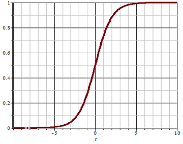
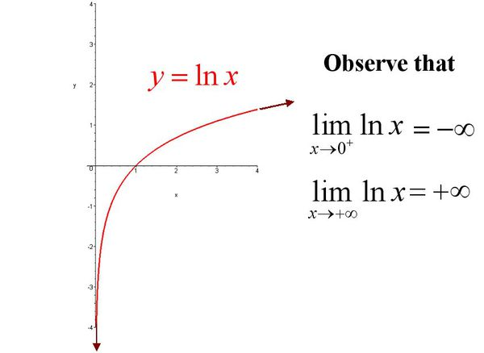
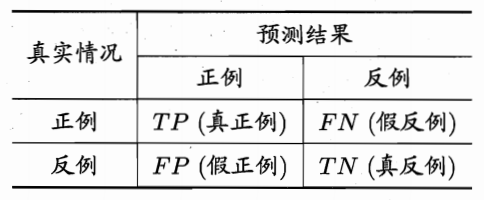

# 逻辑回归

## 概述

###  什么是逻辑回归

逻辑回归（Logistic Regression） 虽然被称为回归，但其实际上是分类模型，常用于二分类。逻辑回归因其简单、可并行化、可解释强而受到广泛应用。二分类（也称为逻辑分类）是常见的分类方法，是将一批样本或数据划分到两个类别，例如一次考试，根据成绩可以分为及格、不及格两个类别，如下表所示：

| 姓名  | 成绩 | 分类 |
| ----- | ---- | ---- |
| Jerry | 86   | 1    |
| Tom   | 98   | 1    |
| Lily  | 58   | 0    |
| ……    | ……   | ……   |

这就是逻辑分类，将连续值映射到两个类别中。

```
1.根据样本数据，构建一个线性回归模型，预测输出（连续）
2.将连续的预测数据，带入到逻辑函数中
3.逻辑函数，将预测值映射到0-1区间范围内（将线性转为非线性）
4.确定一个阈值 0.5
5.大于0.5--->1   小于0.5 ---> 0
```

### 逻辑函数

逻辑回归是一种广义的线性回归，其原理是利用线性模型根据输入计算输出（线性模型输出值为连续），并在逻辑函数作用下，将连续值转换为两个离散值（0或1），其表达式如下：
$$
y = h(w_1x_1 + w_2x_2 + w_3x_3 + ... + w_nx_n + b)
$$
其中，括号中的部分为线性模型，计算结果在函数$h(t)$的作用下，做二值化转换，函数$h(t)$的定义为：
$$
h(t)= \frac{1}{1+e^{-t}}
$$

$$
\quad t=w^Tx+b
$$

该函数称为Sigmoid函数（又称逻辑函数），能将$(-\infty, +\infty)$的值映射到$(0, 1)$之间，其图像为：



可以设定一个阈值（例如0.5），当函数的值大于阈值时，分类结果为1；当函数值小于阈值时，分类结果为0。也可以根据实际情况调整这个阈值。

```python
'''
绘制sigmoid函数图像
'''
import numpy as np
import matplotlib.pyplot as plt

pred_y = np.linspace(-10,10,200)

sigmoid = 1 / (1 + np.e**-pred_y)

plt.plot(pred_y,sigmoid)
plt.show()
```

### 分类问题的损失函数

**深度学习中的交叉熵：**
> [!PDF|yellow] [[深度学习/01_AID_Deeplearning_base-2026.pdf#page=81&selection=14,0,24,8&color=yellow|01_AID_Deeplearning_base-2026, p.81]]
> > 交叉熵（Cross Entropy）。交叉熵是Shannon信息论中一个重要概念， 主要用于度量两个概率分布间的差异性信息，在机器学习中用来作为分类问题的损失函数。
> 
> 

对于回归问题，可以使用均方差作为损失函数，对于分类问题，如何度量预测值与真实值之间的差异？分类问题采用**交叉熵**作为损失函数，当==只有两个类别==时，损失函数表达式为：
$$
E(y, \hat{y}) = -[y \ log(\hat{y}) + (1-y)log(1-\hat{y})]
$$
其中，y为真实值，$\hat{y}$为预测值。

- 当$y=1$时，预测值$\hat{y}$越接近于1，$log(\hat{y})$越接近于0，损失函数值越小，表示误差越小，预测的越准确；当预测时$\hat{y}$接近于0时，$log(\hat{y})$接近于负无穷大，加上符号后误差越大，表示越不准确；
- 当$y=0$时，预测值$\hat{y}$越接近于0，$log(1-\hat{y})$越接近于0，损失函数值越小，表示误差越小，预测越准确；当预测值$\hat{y}$接近于1时，$log(1-\hat{y})$接近于负无穷大，加上符号后误差越大，表示越不准确。



## 逻辑回归的实现

sklearn中，逻辑回归相关API如下：

```python
import sklearn.linearmodel as lm #线性模型

# 创建模型
# solver参数：用于指定求解逻辑回归模型参数的优化算法。
# penalty参数：用于指定正则化类型，其核心作用是防止模型过拟合，通过对模型参数（权重）施加惩罚，平衡模型的拟合能力与泛化能力。
# C参数：正则化的逆强度。较大的C值意味着较小的正则化，而较小的C值则意味着较大的正则化。在逻辑回归中，正则化通常用于防止过拟合。
model = lm.LogisticRegression(solver='liblinear', penalty='l2', C=1)

# 训练
model.fit(x, y) 

# 预测
pred_y = model.predict(x)
```

| 场景                               | 推荐求解器                            | 理由                                     |
| ---------------------------------- | ------------------------------------- | ---------------------------------------- |
| 小型数据集 + 二分类                | `liblinear`                           | 速度快，支持 L1 正则化                   |
| 中型数据集 + 多分类                | `lbfgs` 或 `newton-cg`                | 支持多项式多分类，收敛快                 |
| 大型数据集（无 L1 需求）           | `sag`                                 | 适合大数据，训练效率高                   |
| 大型数据集（有 L1 / 弹性网络需求） | `saga`                                | 唯一支持大型数据 + L1 / 弹性网络的求解器 |
| 特征选择（L1 正则化）              | 小数据用 `liblinear`，大数据用 `saga` | 两者均支持 L1 正则化，适配不同数据规模   |

代码： 

```python
# 逻辑分类器示例
import numpy as np
import sklearn.linear_model as lm
import matplotlib.pyplot as plt

x = np.array([[3, 1], [2, 5], [1, 8], [6, 4],
              [5, 2], [3, 5], [4, 7], [4, -1]])
y = np.array([0, 1, 1, 0, 0, 1, 1, 0])

# 创建逻辑分类器对象
model = lm.LogisticRegression()
model.fit(x, y)  # 训练

# 预测
test_x = np.array([[3, 9], [6, 1]])
test_y = model.predict(test_x)  # 预测
print(test_y)


plt.figure('Logistic Regression', facecolor='lightgray')
plt.title('Logistic Regression', fontsize=20)
plt.xlabel('x', fontsize=14)
plt.ylabel('y', fontsize=14)
plt.tick_params(labelsize=10)
plt.scatter(x[:, 0],  # 样本x坐标
           x[:, 1],  # 样本y坐标
           c=y, cmap='brg', s=80)
plt.scatter(test_x[:, 0], test_x[:, 1], c="red", marker='s', s=80)
plt.show()

# # 计算显示坐标的边界
# left = x[:, 0].min() - 1    # 0
# right = x[:, 0].max() + 1   # 7
# buttom = x[:, 1].min() - 1  # -2
# top = x[:, 1].max() + 1 # 8
# 
# # 产生网格化矩阵
# grid_x, grid_y = np.meshgrid(
#     np.arange(left, right, 0.01),
#     np.arange(buttom, top, 0.01))
# 
# print("grid_x.shape:", grid_x.shape)
# print("grid_y.shape:", grid_y.shape)
# 
# # 将x,y坐标合并成两列
# mesh_x = np.column_stack((grid_x.ravel(), grid_y.ravel()))
# print("mesh_x.shape:", mesh_x.shape)
# 
# # 根据每个点的xy坐标进行预测，并还原成二维形状
# mesh_z = model.predict(mesh_x)
# mesh_z = mesh_z.reshape(grid_x.shape)
# 
# plt.figure('Logistic Regression', facecolor='lightgray')
# plt.title('Logistic Regression', fontsize=20)
# plt.xlabel('x', fontsize=14)
# plt.ylabel('y', fontsize=14)
# plt.tick_params(labelsize=10)
# plt.pcolormesh(grid_x, grid_y, mesh_z, cmap='gray')
# plt.scatter(x[:, 0],  # 样本x坐标
#            x[:, 1],  # 样本y坐标
#            c=y, cmap='brg', s=80)
# plt.scatter(test_x[:, 0], test_x[:, 1], c="red", marker='s', s=80)
# plt.show()
```

  ## 多分类实现

逻辑回归产生两个分类结果，可以通过多个二元分类器实现多元分类（一个多元分类问题转换为多个二元分类问题）。如有以下样本数据：

| 特征1 | 特征2 | 特征3 | 实际类别 |
| ----- | ----- | ----- | -------- |
| $x_1$ | $x_2$ | $x_3$ | A        |
| $x_1$ | $x_2$ | $x_3$ | B        |
| $x_1$ | $x_2$ | $x_3$ | C        |

进行以下多次分类，得到结果：

第一次：分为A类（值为1）和非A类（值为0）

第二次：分为B类（值为1）和非B类（值为0）

第三次：分为C类（值为1）和非C类（值为0）

……

以此类推。

利用逻辑分类器实现多元分类示例代码如下：

```python
# 多元分类器示例
import numpy as np
import sklearn.linear_model as lm
import matplotlib.pyplot as plt

# 输入
x = np.array([[4, 7],
              [3.5, 8],
              [3.1, 6.2],
              [0.5, 1],
              [1, 2],
              [1.2, 1.9],
              [6, 2],
              [5.7, 1.5],
              [5.4, 2.2]])
# 输出（多个类别）
y = np.array([0, 0, 0, 1, 1, 1, 2, 2, 2])

# 创建逻辑分类器对象
model = lm.LogisticRegression(C=200) # 调整该值为1看效果
model.fit(x, y)  # 训练
pred_y=model.predict(x)

# 可视化
plt.figure('Logistic Classification', facecolor='lightgray')

plt.title('Logistic Classification', fontsize=20)
plt.xlabel('x', fontsize=14)
plt.ylabel('y', fontsize=14)
plt.tick_params(labelsize=10)
plt.scatter(x[:, 0], x[:, 1], c=y, cmap='brg', s=80)
plt.show()

# # 坐标轴范围
# left = x[:, 0].min() - 1
# right = x[:, 0].max() + 1
# h = 0.005
# 
# buttom = x[:, 1].min() - 1
# top = x[:, 1].max() + 1
# v = 0.005
# 
# grid_x, grid_y = np.meshgrid(np.arange(left, right, h),
#                              np.arange(buttom, top, v))
# 
# mesh_x = np.column_stack((grid_x.ravel(), grid_y.ravel()))
# mesh_z = model.predict(mesh_x)
# mesh_z = mesh_z.reshape(grid_x.shape)
# 
# # 可视化
# plt.figure('Logistic Classification', facecolor='lightgray')
# plt.title('Logistic Classification', fontsize=20)
# plt.xlabel('x', fontsize=14)
# plt.ylabel('y', fontsize=14)
# plt.tick_params(labelsize=10)
# plt.pcolormesh(grid_x, grid_y, mesh_z, cmap='gray')
# plt.scatter(x[:, 0], x[:, 1], c=y, cmap='brg', s=80)
# plt.show()
```

## 分类模型的评估

- **错误率与精度**

错误率和精度是分类问题中常用的性能度量指标，既适用于二分类任务，也适用于多分类任务. 

1. 错误率（error rate）：指分类错误的样本占样本总数的比例，即 （ 分类错误的数量 / 样本总数数量）

2. 精度（accuracy）：指分类正确的样本占样本总数的比例，即 （分类正确的数量 / 样本总数数量）
  
   $$精度 = 1 - 错误率$$

- **查准率、召回率与F1得分**

错误率和精度虽然常用，但并不能满足所有的任务需求。例如，在一次疾病检测中，我们更关注以下两个问题：

1. 检测出感染的个体中有多少是真正病毒携带者？
2. 所有真正病毒携带者中，有多大比例被检测了出来？

类似的问题在很多分类场景下都会出现，“查准率”（precision）与“召回率”（recall）是更为适合的度量标准。对于二分类问题，可以将真实类别、预测类别组合为“真正例”（true positive）、“假正例”（false positive）、“真反例”（true negative）、“假反例”（false negative）四种情形，见下表：



- 样例总数：TP + FP + TN + FN
- 查准率： TP / (TP + FP)，表示分的准不准
- 召回率：TP / (TP + FN)，表示分的全不全，又称为“查全率”
- F1得分：

$$
f1 = \frac{2 * 查准率 * 召回率}{查准率 + 召回率}
$$

查准率和召回率是一对**矛盾**的度量。一般来说，查准率高时，召回率往往偏低；召回率高时，查准率往往偏低。
例如，在病毒感染者检测中，若要提高查准率，只需要采取更严格的标准即可，这样会导致漏掉部分感染者，召回率就变低了；反之，放松检测标准，更多的人被检测为感染，召回率升高了，查准率又降低了. 通常只有在一些简单任务中，才能同时获得较高查准率和召回率。

查准率和召回率在不同应用中重要性也不同。例如，在商品推荐中，为了尽可能少打扰客户，更希望推荐的内容是用户感兴趣的，此时查准率更重要；而在逃犯信息检索系统中，希望让更少的逃犯漏网，此时召回率更重要。

![[img/PR曲线.png]]
 一般用两个指标评估模型的性能：
 1. 平衡点位置，即查准率和召回率相等的点
 2. 模型PR曲线下的面积，即AP值

```
假设任务是 “预测用户是否点击广告”（正类：点击 = 1，负类：未点击 = 0），数据如下：
真实类别: [1, 0, 1, 1, 0, 0, 1, 0, 1, 0, 1, 1, 0, 0, 1, 0, 0, 1, 0, 1]
预测类别: [1, 0, 1, 0, 0, 1, 1, 0, 1, 0, 0, 1, 0, 1, 1, 0, 0, 1, 1, 1]
查准率：TP / (TP + FP) = 8 / 8 + 3 = 72.7%
召回率：TP / (TP + FN) = 8 / 8 + 2 = 80%
模型预测 “会点击” 的用户中，实际有 72.7% 真的点击了,意味着约 27.3% 的预测是 “误判”，可能导致广告资源浪费；
实际点击广告的用户中，有 80% 被模型正确识别出来（意味着约 20% 的真实点击用户被 “漏掉”，可能损失潜在转化）。
“精准投放” 优先高查准率，“不放过潜在用户” 优先高召回率
```

|                |  预测：正例（点击）   | 预测：反例（未点击）  |    Total     |
| :------------: | :----------: | :---------: | :----------: |
| **真实：正例（点击）**  |  TP = **8**  | FN = **2**  | **真实的正例**：10 |
| **真实：反例（未点击）** |  FP = **3**  | TN = **7**  | **真实的反例**：10 |
|   **Total**    | **预测的正例**：11 | **预测的反例**：9 |      20      |

---

### 四种组合的现实例子

#### 1. 高召回 + 低查准 —— "宁可错杀，不可放过"

**🛂 机场安检**

每天通过安检的旅客上万人，真正携带危险品的不超过几个。

|  | 报警 | 放行 |
|--|:-:|:-:|
| 真危险品 | **5** | 0 |
| 无害物品 | **2000** | 8000 |

$$召回率 = 100\%\text{（全拦住了），}查准率 = \frac{5}{2005} \approx 0.25\%$$

打火机、钥匙、腰带扣全报警，安检员每天被误报淹没，**但一个危险品都不能放过**。

**📧 Gmail 垃圾邮件过滤（宽松模式）**

Gmail 的默认策略是偏召回型——宁可把几封正常邮件丢进垃圾箱，也绝不把垃圾邮件放进收件箱让用户看到。你偶尔去垃圾箱翻，会发现几封被误判的正常邮件。

#### 2. 低召回 + 高查准 —— "不出手则已，出手必中"

**🏛️ 死刑判决**

法院判死刑的标准是"事实清楚，证据确实充分，排除一切合理怀疑"。

|  | 判死刑 | 不判 |
|--|:-:|:-:|
| 真凶手 | **20** | 30 |
| 无辜者 | **0** | 太多 |

$$召回率 = 40\%\text{（漏了不少坏人），}查准率 = 100\%\text{（绝不错杀）}$$

"疑罪从无"原则天然就是低召回 + 高查准。很多真凶因为证据不够确凿没被判死刑，**但只要判了，基本上就是铁案**。

**💎 爱马仕的客户推荐**

爱马仕不会给所有人推鳄鱼皮铂金包，只推给年消费超过百万的顶级 VIP。推了 10 个人，9 个买了。召回率极低（大量潜在客户没被推荐），**但一推就中**。

#### 3. 高召回 + 高查准 —— "又快又准"

**📱 支付宝刷脸支付**

支付宝用你的脸解锁付款：

|  | 通过 | 拒绝 |
|--|:-:|:-:|
| 你本人 | **99.9%** | 0.1% |
| 别人 | **0.001%** | 99.999% |

$$召回率 \approx 99.9\%，查准率 \approx 99.999\%$$

特征极其独特（你的脸 vs 别人的脸差异巨大），模型足够成熟，数据量足够大。**不能把别人的脸认成你（偷钱），也不能把你的脸认错（你付不了款）**，两边都不能拉胯。

**🩸 ABO 血型检测**

你的血型和标准抗血清反应：A 型血遇到抗-A 就凝集，B 型血遇到抗-B 就凝集。规律极其稳定，几乎不存在灰色地带。**医学检验里大量这类"双高"场景**——前提是机制清晰、信号强。

#### 4. 低召回 + 低查准 —— "还不如瞎猜"

**🔮 星座性格预测**

用星座预测一个人是否外向：

|  | 预测：外向 | 预测：内向 |
|--|:-:|:-:|
| 真外向 | **25** | 25 |
| 真内向 | **25** | 25 |

$$召回率 = 50\%，查准率 = 50\%$$

跟抛硬币没有区别。**特征（星座）和标签（性格）之间没有因果关系**——这就是典型的"负迁移"。

**📊 用股票代码预测明天涨跌**

你输入股票代码 600519（茅台），让模型预测明天涨还是跌。模型发现代码里有 6 就预测涨，没有就预测跌：

|  | 预测：涨 | 预测：跌 |
|--|:-:|:-:|
| 真涨 | **50** | 50 |
| 真跌 | **50** | 50 |

**输入特征和输出标签之间毫无信息量**，模型只是在死记硬背，上线即崩。

**🏥 某 AI 诊断系统翻车案例**

某 AI 影像系统被训练来从 X 光片诊断肺炎，准确率号称 95%。后来发现这 95% 里大部分是靠"看片子是用什么机器拍的"来判断的——便携式机器多用在重症病房，重症患者自然肺炎比例高。换了一家医院的数据，模型直接崩成：

|  | 预测：肺炎 | 预测：正常 |
|--|:-:|:-:|
| 真肺炎 | **40** | 60 |
| 真正常 | **55** | 45 |

模型学到的不是"肺炎长什么样"，而是"什么机器的片子更可能有肺炎"。**特征学歪了，两边都烂**。

> **一句话**：现实中多数模型在中间某个位置，极端偏一边是因为**业务代价不对称**（漏判的代价 vs 误判的代价）。只有问题本身信号足够强（刷脸、血型），双高才稳定成立。


**代码示例：**
```python
import sklearn.metrics as sm
sm.precision_score
sm.recall_score
sm.f1_score
sm.classification_report
```

```python
'''
鸢尾花分类
'''
# import matplotlib.pyplot as plt
import pandas as pd
import sklearn.datasets as sd #数据集合
import sklearn.model_selection as ms #模型选择
import sklearn.linear_model as lm #线性模型
import sklearn.metrics as sm #评估模块

iris = sd.load_iris()
# print(iris.keys())
# print(iris.filename)
# print(iris.DESCR) 150个样本，4个特征 3个类别
# print(iris.feature_names)
# print(iris.target_names)
# print(iris.data.shape)
# print(iris.target)

data = pd.DataFrame(iris.data,columns=iris.feature_names)
data['target'] = iris.target

#萼片的可视化
# plt.figure()
# plt.scatter(data['sepal length (cm)'],
#             data['sepal width (cm)'],
#             c=data['target'],
#             cmap='brg')
# plt.colorbar()
#
# #花瓣的可视化
# plt.figure()
# plt.scatter(data['petal length (cm)'],
#             data['petal width (cm)'],
#             c=data['target'],
#             cmap='brg')
# plt.colorbar()
# plt.show()

#在全部数据中挑选2个类别先做二分类:1,2
# sub_data = data.tail(100)
#整理输入和输出
x = data.iloc[:,:-1]
y = data.iloc[:,-1]
#划分训练集和测试集
train_x,\
test_x,\
train_y,\
test_y = ms.train_test_split(x,y,
                             test_size=0.1,
                             random_state=7)
#构建模型
model = lm.LogisticRegression() # 多分类时不写solver='liblinear'
#训练
model.fit(train_x,train_y)
#预测
pred_test_y = model.predict(test_x)
#评估
print('真实类别:',test_y.values)
print('预测类别:',pred_test_y)
print('准确率:',(test_y==pred_test_y).mean())
print('准确率:',sm.accuracy_score(test_y,pred_test_y))
print('查准率:',sm.precision_score(test_y,pred_test_y,average='macro')) # 多分类时必须告诉                                                              sklearn 怎么汇总多个类别的 precision
print('召回率:',sm.recall_score(test_y,pred_test_y,average='macro'))
print('f1:',sm.f1_score(test_y,pred_test_y,average='macro'))
print('分类报告:\n',sm.classification_report(test_y,pred_test_y))
```

