# 决策树

## 1. 概述

### 1.1 什么是决策树

决策树是一种常见的机器学习方法，其核心思想是相同（或相似）的输入产生相同（或相似）的输出，通过树状结构来进行决策，其目的是通过对样本不同属性的判断决策，将具有相同属性的样本划分到一个叶子节点下，从而实现分类或回归。 以下是几个生活中关于决策树的示例：

【示例一】

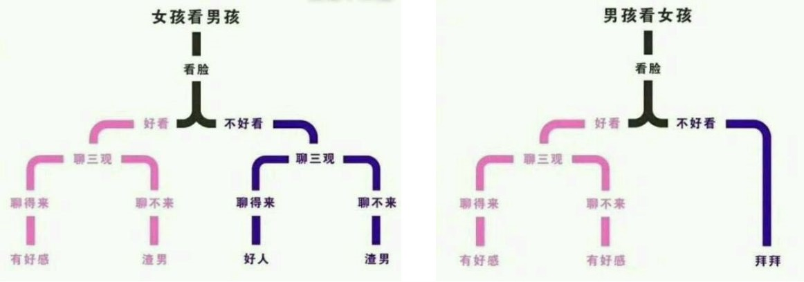

<center><font size=2>男生看女生与女生看男生的决策树模型</font></center>

【示例二】

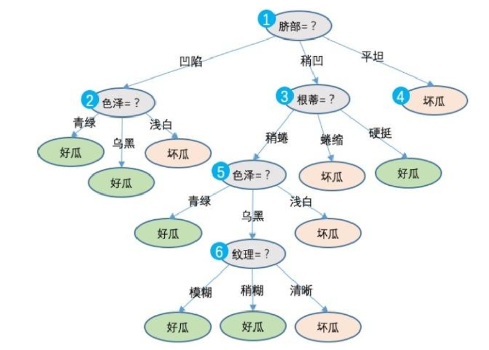

<center><font size=2>挑选西瓜的决策树模型</font></center>

在上述示例模型中，通过对西瓜一系列特征（脐部、色泽、根蒂、纹理等）的判断，最终我们得出结论：这是否为一个好瓜。决策过程中提出的每个判定问题都是对某个属性的“测试”，例如“色泽=？”，“根蒂=？”。每个测试的结果可能得到最终结论，也可能需要进行下一步判断，其考虑问题的范围是在上次决策结果限定范围之内。例如若在“色泽=乌黑”之后再判断“纹理=？”。

决策树是一种可以帮助我们做决策的算法；经常用来做分类和回归，构建决策树的过程就是做决策的过程，因其形状为树状结构，故称之为决策树。

### 1.2 决策树的结构

一般来说，一棵决策树包含一个根节点、若干个内部节点和若干个叶子节点。叶子节点对应最终的决策结果，其它每个节点则对应与一个属性的测试。最终划分到同一个叶子节点上的样本，具有相同的决策属性，可以对这些样本的值求平均值来实现回归，对这些样本进行投票（选取样本数量最多的类别）实现分类。

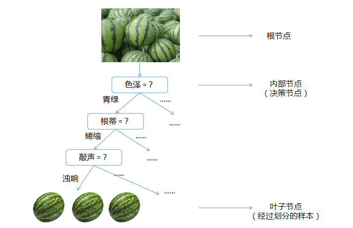

### 1.3 如何构建决策树

决策树学习的算法通常是一个递归地选择最优特征，并根据该特征对训练数据进行分割，使得各个子数据集有一个最好的分类的过程。这一过程对应着对特征空间的划分，也对应着决策树的构建。

- **选择最佳特征**：构建根节点，将所有训练数据都放在根节点，根据某种指标（如信息增益、信息增益比、基尼系数等）选择最能区分数据的特征作为当前节点的分割标准。
- **数据分割**：根据选择的特征将数据集分割成子集，每个子集对应特征的一个取值。如果这些子集已经能够被基本正确分类，那么构建叶节点，并将这些子集分到对应的叶节点中去；如果还有子集不能被基本正确分类，那么就对这些子集选择新的最优特征，继续对其进行分割，构建相应的结点。
- **递归构建子树**：对子集重复上述过程，构建子树，直到满足停止条件（如达到最大树深度、叶节点数据量小于最小样本数等）。
- **生成叶节点**：当无法进一步分割时（基本正确分类或没有合适特征），生成叶节点并赋予分类或回归结果。最后每个子集被分到叶节点上，即都有了明确的类，这样就生成了一颗决策树。

核心是以下两个问题：

- 如何选取特征：决策树构建的每一步，应该挑选最优的特征，进行决策对数据集划分效果最好；
- 决定何时停止分裂子节点。

【示例】

银行希望能够通过一个人的信息（包括职业、年龄、收入、学历）去判断他是否有贷款的意向，从而更有针对性地完成工作。

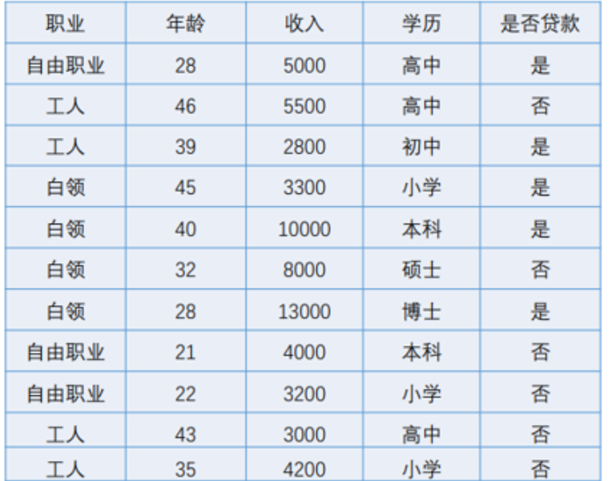

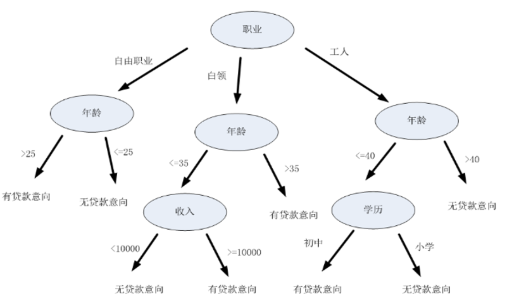

【步骤总结】

步骤1：将所有的数据看成是一个节点，进入步骤2；

步骤2：从所有的数据特征中挑选一个数据特征对节点进行分割，进入步骤3；

步骤3：生成若干子节点，对每一个子节点进行判断，如果满足停止分裂的条件，进入步骤4；否则，进入步骤2；

步骤4：设置该节点是叶子节点，其输出的结果为该节点数量占比最大的类别。

## 2. 如何选择特征

### 2.1 信息熵

信息熵（information entropy）是度量样本集合纯度的常用指标，该值越大，表示该集合纯度越低（或越混乱），该值越小，表示该集合纯度越高（或越有序）。信息熵定义如下：
$$
H = -\sum_{i=1}^{n}{P(x_i)log_2P(x_i)}
$$
其中，$P(x_i)$表示集合中第i类样本所占比例，当$P(x_i)$为1时（只有一个类别，比例为100%）, $log_2P(x_i)$的值为0，整个系统信息熵为0；当类别越多，则$P(x_i)$的值越接近于0，$log_2P(x_i)$趋近去负无穷大，整个系统信息熵就越大。如下图：

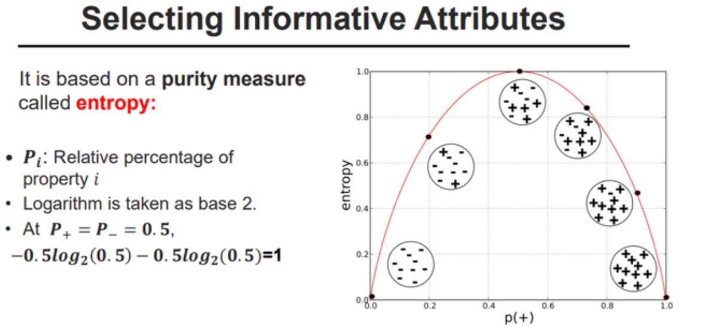

```text
100个样本    0类别：100个				                0		
100个样本	  0类别：50个	1类别：50个	        	     1		
100个样本	  0类别：30个	1类别：50个	   2类别：20个   1.48 
100个样本	  0类别：80个   1类别：20个                 0.64 
```

以下代码，展示了类别数量从1...10的集合信息熵变化：

```python
# 信息熵计算演示
import math
import numpy as np
import matplotlib.pyplot as mp

class_num = 10  # 类别最大数量


def entropy_calc(n):
    p = 1.0 / n  # 计算每个类别的概率  假设这里每个类别的概率相同
    entropy_value = 0.0  # 信息熵

    for i in range(n):
        p_i = p * math.log(p)  # 深度学习里用 e 为底主要是求导方便（ln(x) 导数是 1/x），而决策树用 2 为底是信息论传统
        entropy_value += p_i

    return -entropy_value  # 返回熵值


entropies = []
for i in range(1, class_num + 1):
    entropy = entropy_calc(i)  # 计算类别为i的熵值
    entropies.append(entropy)

print(entropies)

# 可视化回归曲线
mp.figure('Entropy', facecolor='lightgray')
mp.title('Entropy', fontsize=20)
mp.xlabel('Class Num', fontsize=14)
mp.ylabel('Entropy', fontsize=14)
mp.tick_params(labelsize=10)
mp.grid(linestyle='-')
x = np.arange(0, 10, 1)
print(x)
mp.plot(x, entropies, c='orangered', label='entropy')

mp.legend()
mp.show()
```

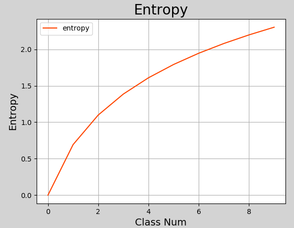

将相同属性的样本，划分到同一个节点下

随着决策树的节点划分，纯度是在不断的提升，熵值不断的减小

优先划分特征属性比较强的特征：

​	通过那个特征进行划分，纯度提升的高，谁的特征属性就比较强

​	谁的纯度提升的高，指的就是谁的信息熵的值减少的多

### 2.2 信息增益

决策树根据属性进行判断，将具有相同属性的样本划分到相同节点下，此时，样本比划分之前更加有序（混乱程度降低），信息熵的值有所降低。用划分前的信息熵减去划分后的信息熵，就是决策树获得的信息增益。可以用以下表达式表示：
$$
Gain(D, a) = Ent(D) - \sum_{v=1}^{V} \frac{|D^v|}{|D|} Ent(D^v)
$$
其中，D 表示样本集合，a 表示属性，v 表示属性可能的取值${v^1, v^2,...,v^n}$, $\frac{|D^v|}{|D|}$表示权重，样本越多的分支对分类结果影响更大，赋予更高的权重,  $Gain(D, a)$表示在样本集合 D 上使用属性 a 来划分子节点所获得的信息增益。 以下是一个关于信息增益计算的示例：

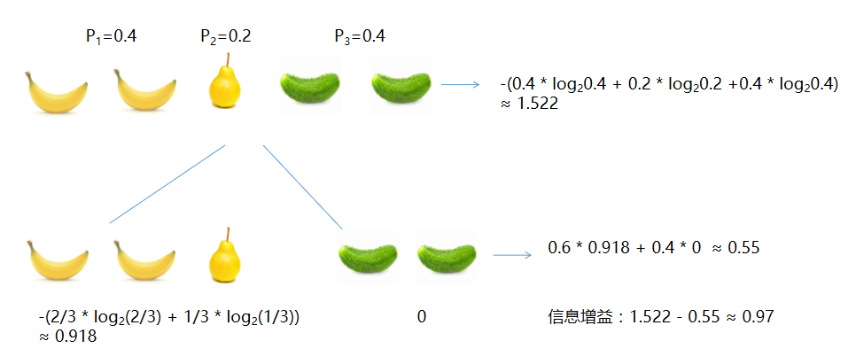

说明：

- 香蕉占2/5，所以$P_1=0.4$；梨占1/5，所以$P_2 = 0.2$；黄瓜占2/5，所以$P_3 = 0.4$
- 根节点信息熵：$-(0.4 * log_2 0.4 + 0.2 * log_2 0.2 + 0.4 * log_2 0.4) \approx 1.522$
- 根据颜色划分后：黄色分支信息熵$-(\frac{2}{3} * log_2 \frac{2}{3} + \frac{1}{3} * log_2 \frac{1}{3}) \approx 0.918$；绿色分支信息熵$-(1.0 * log_2 1.0) = 0$；整个第二层信息熵为$0.6 * 0.918 + 0.4 * 0 \approx 0.55$
- 根据颜色划分后的信息增益：$1.522 - 0.55 \approx 0.97$

由以上示例可知，经过对样本按颜色进行类别划分，划分后的信息熵比原来下降了，下降的值就是信息增益。一般来说，信息增益越大，以该属性划分所获得的“纯度提升”越大。 著名的 ID3 决策树学习算法就是以信息增益为准则来划分属性。

### 2.3 增益率

增益率不直接采用信息增益，而采用信息增益与熵值的比率来作为衡量特征优劣的标准。 C4.5 算法就是使用增益率作为标准来划分属性。 增益率定义为：
$$
Gain\_ratio(D, a) = \frac{Gain(D, a)}{IV(a)}
$$
其中
$$
IV(a) = - \sum_{v=1}^{V} \frac{|D^v|}{|D|} log_2 \frac{|D^v|}{|D|}
$$
假设有一个数据集，我们想根据“天气”特征（取值为{晴，雨}）来划分。

- **划分前**：数据集 $D$ 的熵 $Ent(D) = 0.94$。
- **按“天气”划分后**：
  - “晴”子集：样本数占比 5/14，熵 $Ent(D^{晴}) = 0.971$
  - “雨”子集：样本数占比 9/14，熵 $Ent(D^{雨}) = 0.503$
  - 加权平均熵 $Ent_{天气}(D) = (5/14)*0.971 + (9/14)*0.503 \approx 0.824$
- **信息增益**：
  $Gain(D, 天气) = 0.94 - 0.824 = 0.116$
- **分裂信息 $IV(D, 天气)$**：
  $IV(D, 天气) = -[\frac{5}{14} \log_2(\frac{5}{14}) + \frac{9}{14} \log_2(\frac{9}{14})] \approx 0.940$
- **信息增益率**：
  $Gain_ratio(D, 天气) = \frac{0.116}{0.940} \approx 0.123$

### 2.4 基尼系数

基尼指数（Gini Index）通过度量数据集的不纯度（或不一致性），来决定如何分裂节点。具体来说，基尼系数用于衡量一个节点的纯度程度。

信息熵越大，数据越混乱，信息熵越小，数据越纯；

Gini系数越大，数据越混乱，Gini系数越小，数据越纯。

分类问题中，假设有 K 个类，样本点属于第 k 类的概率为 $p$ ，则基尼系数定义为：
$$
Gini(p) = \sum_{k=1}^{K} p_k (1-p_k)
$$

```
100个样本    0类别：100个								 gini= 0
100个样本	  0类别：50个	1类别：50个					  gini = 0.5
100个样本	  0类别：30个	1类别：50个	    2类别：20个    gini=0.62
100个样本	  0类别：80个   1类别：20个                   gini=0.32
```

 CART决策树（Classification And Regression Tree）使用基尼系数来选择划分属性，选择属性时，选择划分后基尼值最小的属性作为最优属性。

**特征选择**

在特征选择过程中，基尼系数用于评估每一个特征的分裂效果。具体步骤如下：

1. 计算初始节点的基尼系数： 计算当前节点（即父节点）的基尼系数 $Gini(D)$ 。 

2. 计算特征的基尼系数：对于每一个候选特征，基于该特征的不同取值将数据集 $D$ 划分为若干子集 $D_1,D_2,...,D_m$，并计算这些子集的加权基尼系数。假设第 $j$ 个特征有 $m$ 个取值，计算该特征的基尼系数：

$$
Gini(D, j) =  \sum_{i=1}^{m} \frac{|D_i|}{|D|} Gini(D_i)
$$
其中：

$D_i$ 表示根据第 $j$ 个特征划分得到的第 $i$ 个子集。

$|D_i|$ 和 $|D|$ 分别表示子集 $D_i$ 和原始数据集 $D$ 的样本数量。

$Gini(D_i)$ 表示子集 $D_i$ 的基尼系数。

**选择最优特征**：选择基尼系数最小的特征作为当前节点的分裂特征，即选取能够最大程度减少不纯度的特征。

假设数据集 $D$ 包含三类样本 $A$、$B$ 和 $C$，且样本数量分别为 20、30 和 50。计算初始节点的基尼系数：

$P_A$ = 20 / 100 = 0.2        $P_B$ = 30 / 100 = 0.3        $P_C$ = 50 / 100 = 0.5

$Gini(D)$ = 0.2 * 0.8 + 0.3 * 0.7 + 0.5 * 0.5 = 0.62

假设某特征 $X$ 将数据集 $D$ 分为 $D_1$ 和 $D_2$ ，其中 $D_1$ 有40 个样本（包含 10 个 $A$、20 个 $B$ 和 10 个 $C$），$D_2$
有 60 个样本（包含 10 个 $A$、10 个 $B$ 和 40 个 $C$）。计算特征 $X$ 的基尼系数：

$P_{A1}$ = 10 / 40 = 0.25        $P_{B1}$ = 20 / 40 = 0.5        $P_{C1}$ = 10 / 40 = 0.25

$Gini(D_1)$  = 0.25 * 0.75 + 0.5 * 0.5 + 0.25 * 0.75 = 0.625

$P_{A2}$ = 10 / 60 = 0.167        $P_{B2}$ = 10 / 60 = 0.167        $P_{C2}$ = 40 / 60 = 0.667

$Gini(D_2)$  = 0.167 * 0.833 + 0.167 * 0.833 + 0.667 * 0.333 = 0.5

$Gini(D,X)$ = (40 / 100) * 0.625 + (60 / 100) * 0.5 = 0.55 

### 2.5 案例：银行风控

目标：是否给予贷款
数据：15个人---个人情况
特征：4类，分别是年龄，是否有工作，是否有房子，信贷情况

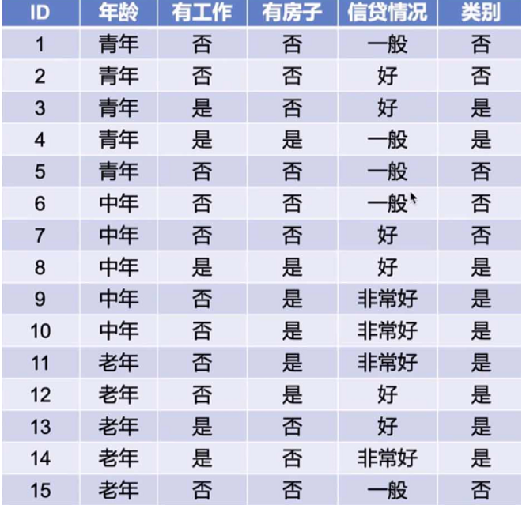

- **划分方式**

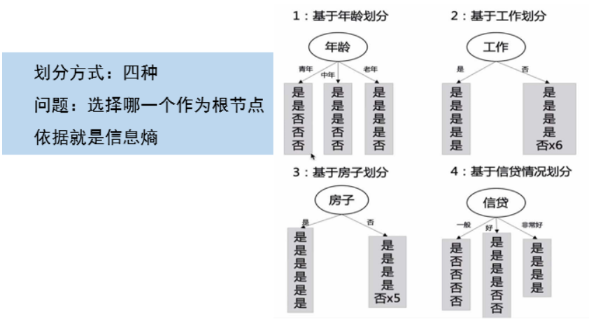

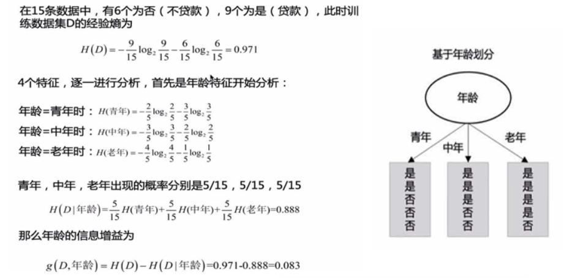

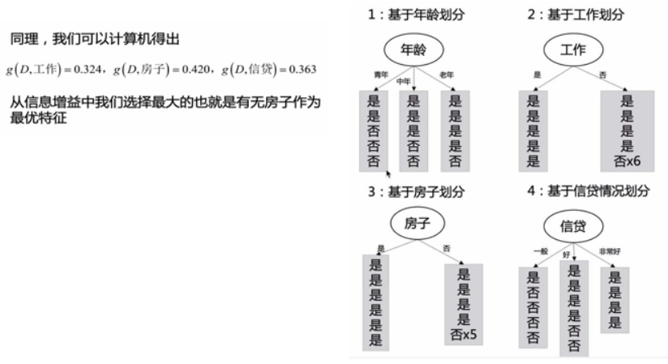

## 3. 如何停止分裂

以下几种情况会停止决策树子节点的构建：

- 当前节点所有样本属于同一个类别，无需划分
- 当前属性集为空，或者所有样本取值相同，无法划分
- 当前节点包含的样本集合为空，不能划分
- 当前节点样本数量少于指定数量
- 达到了人为设定的最大深度

您可以将决策树的构建过程想象成**对一个问题进行连续的是/否提问**。

| 停止条件                    | 类比                                                         |
| --------------------------- | ------------------------------------------------------------ |
| **样本属于同一类**          | 你已经100%确定答案了，无需再问。                             |
| **无属性可用/属性无法区分** | 你没有新问题可问了，或者你的问题无法区分剩下的人。           |
| **节点样本为空**            | 你的问题指向了一个不存在的人群。                             |
| **样本数过少**              | 只剩下很少的人了，再问下去得到的结论会很不可靠（比如问一个人代表全世界）。 |
| **达到最大深度**            | 规定最多只能问5个问题，问完了就必须做决定。                  |

## 4. 常用决策树算法

决策树算法中，ID3、C4.5 和 CART 是三种最基本且广泛应用的算法。每种算法都有其独特的特征选择标准和树构建机制。

- **ID3（Iterative Dichotomiser 3）**

  特点：

  - ID3 是基于信息增益（Information Gain）作为特征选择的标准来构建决策树的。
  - 主要用于分类问题。
  - 只能处理离散特征，不能直接处理数值型数据。
  - 不支持剪枝，容易过拟合。
  - 构建的树通常是二叉树或多叉树。

  计算过程：

  1. 计算数据集的总熵。
  2. 对每个特征，计算信息增益。
  3. 选择信息增益最大的特征作为节点。
  4. 根据选定的特征分割数据集，重复以上步骤，直至所有特征被使用，或数据不再可分。

- **C4.5**

  特点：

  - C4.5 是 ID3 算法的改进版本，使用信息增益率来选择特征。
  - 可以处理离散和连续特征。
  - 引入了树的剪枝技术，减少过拟合。
  - 结果通常是多叉树，而非二叉树。

  计算过程：

  1. 使用信息增益比而非信息增益作为特征选择的标准。
  2. 对于连续特征，找到一个“最优”切分点将数据分为两部分，以最大化信息增益比。
  3. 递归构建决策树。
  4. 构建完整树后，应用剪枝技术，剪去那些对最终预测准确性贡献不大的分支。

- **CART（Classification and Regression Tree）**

  特点：

  - CART 是一种既可以用于分类也可以用于回归的决策树算法。
  - 使用基尼系数作为分类任务的特征选择标准；使用均方误差作为回归任务的标准。
  - 始终构建二叉树。
  - 内置有剪枝机制，使用成本复杂度剪枝（Cost Complexity Pruning）来防止过拟合。

  计算过程：

  1. 对于分类任务，选择基尼指数最小的特征进行分割。
  2. 对于回归任务，选择使得结果变量的平方误差最小化的特征进行分割。
  3. 递归分割直至满足停止条件（如节点大小、树深度等）。
  4. 应用剪枝策略，通过设定不同的参数优化模型的泛化能力。

## 5. 决策树实现

scikit-learn中决策树相关API：

```python
# 模型
model = st.DecisionTreeRegressor(max_depth=4)     # 决策树回归器
model = st.DecisionTreeClassifier(max_depth=4)    # 决策树分类器

# 参数max_depth：规定从 “根节点” 到任意 “叶子节点” 的路径中，最多包含的 “分裂次数”（即内部节点数），或等价的 “路径长度”（边数）。过小可能会出现欠拟合，过大可能会出现过拟合。

# 训练
model.fit(train_x, train_y)
# 预测
pre_test_y = model.predict(test_x)
```

【案例】波士顿房价预测

- 数据集介绍

  该数据集为一个开放房价数据集，包含506笔样本，每个样本包含13个特征和1个标签，具体如下所示：

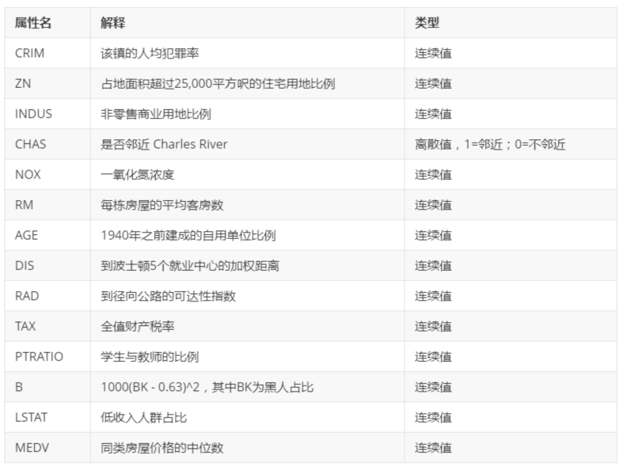

- 代码实现

```python
# 决策树回归示例
# 使用决策树预测波士顿房价

import sklearn.datasets as sd
import sklearn.utils as su  # 工具模块
import sklearn.tree as st
import sklearn.metrics as sm

# 加载boston地区房价数据
boston = sd.fetch_openml(name='boston', version=1, as_frame=True)

# 获取特征名称
feature_names = boston.data.columns.tolist()
print("特征名称:", feature_names)
print("数据形状:", boston.data.shape)
print("目标形状:", boston.target.shape)

random_seed = 7  # 随机种子，计算随机值，相同的随机种子得到的随机值一样
x, y = su.shuffle(boston.data, boston.target, random_state=random_seed)

# 计算训练数据的数量
train_size = int(len(x) * 0.8)  # 以boston.data中80%的数据作为训练数据

# 构建训练数据、测试数据
train_x = x[:train_size]  # 训练输入, x前面80%的数据
test_x = x[train_size:]   # 测试输入, x后面20%的数据
train_y = y[:train_size]  # 训练输出
test_y = y[train_size:]   # 测试输出

# 模型
model = st.DecisionTreeRegressor(max_depth=4)  # 决策回归器

# 训练
model.fit(train_x, train_y)

# 预测
pred_y = model.predict(train_x)
pre_test_y = model.predict(test_x)

# 打印预测输出和实际输出的R2值
print("训练集R2分数:", sm.r2_score(train_y, pred_y))
print("测试集R2分数:", sm.r2_score(test_y, pre_test_y))
```

- 执行结果

```python
['CRIM' 'ZN' 'INDUS' 'CHAS' 'NOX' 'RM' 'AGE' 'DIS' 'RAD' 'TAX' 'PTRATIO'
 'B' 'LSTAT']
(506, 13)
(506,)
0.8938416214458438
0.8202560889408634
```

- **特征重要性**

作为决策树模型训练过程中的副产品，根据每个特征划分子表前后信息熵减少量就标志了该特征的重要程度，此即为该特征重要性的指标。训练后得到的模型对象提供了属性feature_importances_来存储每个特征的重要性。在工程应用上，可以对决策树做一些优化，不必让每一个特征都参与子表划分，而只选择其中较重要的（或者说影响因素较大的）的特征作为子表划分依据。特征重要性的评价指标，就是根据该特征划分子表后所带来的信息熵减少量，熵减越大的就越重要，也就越优先参与子表的划分。

在上述示例中加入如下代码：

```python
import matplotlib.pyplot as mp
import numpy as np

# 获取特征重要性
fi = model.feature_importances_
print("特征重要性:", fi)

# 特征重要性可视化
mp.figure("Feature importances", facecolor="lightgray")
mp.title("DT Feature", fontsize=16)
mp.ylabel("Feature importances", fontsize=14)
mp.grid(linestyle=":", axis='y')

x = np.arange(fi.size)
sorted_idx = fi.argsort()[::-1]  # 重要性排序(倒序)
fi = fi[sorted_idx]  # 根据排序索引重新排特征值

# 使用列表推导式来正确获取特征名称
mp.xticks(x, [feature_names[i] for i in sorted_idx], rotation=45)
mp.bar(x, fi, 0.4, color="dodgerblue", label="DT Feature importances")

mp.legend()
mp.tight_layout()
mp.show()

# 打印排序后的特征重要性
print("\n特征重要性排序（从高到低）:")
for idx in sorted_idx:
    print(f"{feature_names[idx]:<20} 重要性: {model.feature_importances_[idx]:.4f}")
```

执行结果：

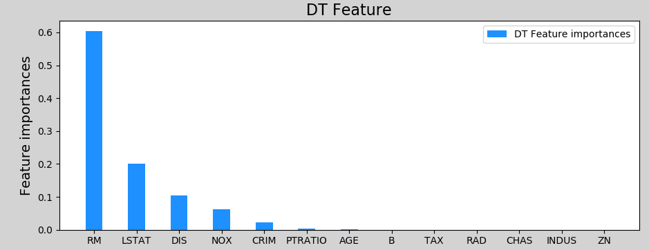

```python
# 网格搜索 (Grid Search) + 交叉验证 (Cross-Validation)
# 定义一个参数网格：列出你想要尝试的一系列 max_depth 值。
# 使用交叉验证：通常使用 5折 或 10折 交叉验证来评估每个 max_depth 值的性能。
# 选择最佳值：选择在交叉验证中平均分数最高（或误差最低）对应的那个 max_depth。

# 5折交叉验证
# 第1步：将所有样本数据（假设1000个样本）平均分成5等份 【折1，折2，折3，折4，折5】
# 第2步：进行5轮训练和验证
		# 第1轮：
		# 训练集：折2 + 折3 + 折4 + 折5 (共800个样本)
		# 验证集：折1 (200个样本)
		# 用训练集训练模型，然后在验证集上测试并得到一个性能分数（比如MSE或R²）。
        # ... ...
# 第3步：计算最终性能
		# 现在你有了5个性能分数 [S1, S2, S3, S4, S5]。
    	# 你计算这5个分数的平均值作为这个模型（在某个特定 max_depth 下）的最终性能估计。
		# 最终性能 = (S1 + S2 + S3 + S4 + S5) / 5
        
# 在 GridSearchCV 中如何工作？
# 当在 GridSearchCV 中设置 cv=5 时，对于你参数网格（param_grid）中的每一个 max_depth 值（比如 3, 5, 7），它都会执行一次完整的5折交叉验证：
# 对于 max_depth=3，进行5折CV，得到一个平均性能分数。
# 对于 max_depth=5，进行5折CV，得到另一个平均性能分数。
# 对于 max_depth=7，进行5折CV，得到第三个平均性能分数。
# 最后，GridSearchCV 会比较所有这些平均分数，然后选择平均分数最高的那个 max_depth 作为最佳参数。


import sklearn.datasets as sd
import sklearn.utils as su
import sklearn.tree as st
import sklearn.model_selection as ms

# 加载boston地区房价数据
boston = sd.fetch_openml(name='boston', version=1, as_frame=True)
# 特征数据
x = boston.data
# 标签数据
y = boston.target
# 训练集和测试集划分
train_x, test_x, train_y, test_y = ms.train_test_split(x,y,test_size=0.2,random_state=7)

# 模型
model = st.DecisionTreeRegressor()  # 决策回归器

# 定义要搜索的参数网格
# 这里尝试从 1 到 15 的深度，以及不限制（用None表示）
param_grid = {
    'max_depth': [None, 1, 2, 3, 4, 5, 6, 7, 8, 9, 10, 12, 15]
}

# 设置GridSearchCV
# scoring: 回归问题常用 'neg_mean_squared_error'（负均方误差）或 'r2'
grid_search = ms.GridSearchCV(estimator=model,
                              param_grid=param_grid,
                              cv=5,  # 5折交叉验证
                              scoring='neg_mean_squared_error',
                              n_jobs=-1)  # 使用所有CPU核心

grid_search.fit(train_x, train_y)

# 输出最佳参数和最佳分数
print("Best Parameters: ", grid_search.best_params_)
print("Best CV Score (Negative MSE): ", grid_search.best_score_)

# 获取最佳模型并评估在测试集上的表现
best_model = grid_search.best_estimator_
test_score = best_model.score(test_x, test_y)
print("Test Set R^2 Score: ", test_score)
```

```python
# 每次网格搜索结果不一致的主要原因在于决策树算法内部的随机性，具体体现在：

# 特征选择的不确定性：
# 当多个特征在某个节点上提供相同的分割质量（相同的MSE减少量）时,算法会随机选择一个特征进行分割,这种随机选择会导致每次构建的树结构不同

# 数据排序的影响：
# 对于具有相同值的特征，排序方式可能影响分割点的选择，这种细微差异在没有固定随机种子的情况下会被放大

# 交叉验证中的累积效应：
# 网格搜索对每个参数组合执行多次交叉验证，每次验证中树的微小差异会累积，导致最终评分不同

import sklearn.datasets as sd
import sklearn.tree as st
import sklearn.model_selection as ms
from collections import defaultdict
import numpy as np

# 加载boston地区房价数据
boston = sd.fetch_openml(name='boston', version=1, as_frame=True)
# 特征数据
x = boston.data
# 标签数据
y = boston.target
# 训练集和测试集划分
train_x, test_x, train_y, test_y = ms.train_test_split(x, y, test_size=0.2, random_state=7)

# 定义要搜索的参数网格
# 这里尝试从 1 到 15 的深度，以及不限制（用None表示）
param_grid = {
    'max_depth': [None, 1, 2, 3, 4, 5, 6, 7, 8, 9, 10, 12, 15]
}

# 多次运网格搜索，
nums = 100  # 运行次数
results = defaultdict(list)  # 创建了一个特殊字典，自动为不存在的键创建一个空列表作为默认值
for run in range(nums):
    print(f"Running iteration {run + 1}/{nums}")

    # 模型
    model = st.DecisionTreeRegressor()  # 决策回归器

    # 设置GridSearchCV
    # scoring: 回归问题常用 'neg_mean_squared_error'（负均方误差）或 'r2'
    grid_search = ms.GridSearchCV(estimator=model,
                                  param_grid=param_grid,
                                  cv=5,  # 5折交叉验证
                                  scoring='neg_mean_squared_error',
                                  n_jobs=-1)  # 使用所有CPU核心

    grid_search.fit(train_x, train_y)

    # 记录每次运行的结果
    for depth, mean_score in zip(
            grid_search.cv_results_["param_max_depth"],
            grid_search.cv_results_["mean_test_score"]
    ):
        results[depth].append(mean_score)

# 计算每个参数的平均性能和标准差
print("Average performance across runs:")
for depth in param_grid["max_depth"]:
    scores = results[depth]
    avg_score = np.mean(scores)
    std_score = np.std(scores)
    print(f"max_depth={depth}:{avg_score:.4f} +- {std_score:.4f}")

# 找出平均性能最好的参数
best_avg_score = -np.inf
best_param = None

for depth, scores in results.items():
    avg_score = np.mean(scores)
    if avg_score > best_avg_score:
        best_avg_score = avg_score
        best_param = depth

print(f"\nBest parameter based on average performance: max_depth={best_param}")
print(f"Average score: {best_avg_score:.4f}")
```

- 案例

```python
# 鸢尾花分类
from sklearn.datasets import load_iris
from sklearn.model_selection import train_test_split
from sklearn.tree import DecisionTreeClassifier, plot_tree
from sklearn.metrics import accuracy_score, classification_report
import matplotlib.pyplot as plt

# 1. 加载数据集
iris = load_iris()
X = iris.data  # 特征：花萼长度、花萼宽度、花瓣长度、花瓣宽度
y = iris.target  # 标签：鸢尾花品种（0:山鸢尾, 1:变色鸢尾, 2:维吉尼亚鸢尾）

# 2. 划分训练集和测试集（70%训练，30%测试）
X_train, X_test, y_train, y_test = train_test_split(
    X, y, test_size=0.3, random_state=42
)

# 3. 创建并训练决策树模型
# 使用基尼系数作为分裂标准，限制树的最大深度为3防止过拟合
clf = DecisionTreeClassifier(criterion='gini', max_depth=3)
clf.fit(X_train, y_train)

# 4. 在测试集上进行预测
y_pred = clf.predict(X_test)

# 5. 评估模型性能
print(f"模型准确率: {accuracy_score(y_test, y_pred):.4f}")
print("\n分类报告:")
print(classification_report(y_test, y_pred, target_names=iris.target_names))

# 6. 可视化决策树
plt.figure("DecisionTreeClassifier",facecolor="lightgray")

# plot_tree 是 scikit-learn 中用于可视化决策树模型的函数。
# 它可以帮助您直观地理解决策树是如何做出决策的。
plot_tree(
    decision_tree=clf, 		 # 必选，要可视化的决策树模型
    feature_names=iris.feature_names,  # 特征名称列表
    class_names=iris.target_names,  # 类别名称列表
    filled=True,  # 是否用颜色填充节点框，默认False
    rounded=True, # 是否使用圆角矩形绘制节点，默认False
    proportion=True,  # 是否显示比例而不是样本数量，默认False
    precision=2  # 显示数值的精度（小数位数）
)
plt.title("iris_classifier_tree",fontsize=30)
plt.show()

# 7. 使用模型进行新样本预测
# 假设一个新样本：花萼长度5.1, 花萼宽度3.5, 花瓣长度1.4, 花瓣宽度0.2
new_sample = [[5.1, 3.5, 1.4, 0.2]]
predicted_class = clf.predict(new_sample)
print(f"\n新样本预测结果: {iris.target_names[predicted_class][0]}")
```

## 6. 决策树的剪枝

剪枝（pruning）是决策树学习算法对付“过拟合”的主要手段。在决策树学习中，为了尽可能正确分类训练样本，节点划分过程将不断重复，有时会造成决策树分支过多，这时就可能因训练样本学的“太好了”，以至于把训练集本身的一些特点当做数据所具有的一般性质而导致过拟合。因此，可通过主动去掉一些分支来降低过拟合风险。

- 预剪枝：决策树生成过程中，对每个节点在划分前进行评估，若当前节点不能带来决策树泛化性能的提升，则停止划分并将当前节点标记为叶子节点。
- 后剪枝：先训练为一颗完整的决策树，然后自低向上对非叶子节点进行考察，若将该节点对应的子树替换为叶节点能带来决策树泛化能力提升，则将该子树替换为叶节点。

【练习】

1. 有一批水果（如下图所示），按照形状进行分类，将长条形、椭圆形各划分到不同子节点中，计算划分后的信息增益。

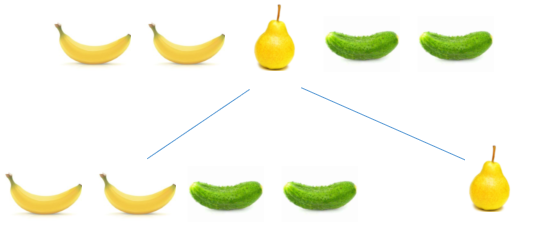

2. 一批样本包含A和B两个类别，计算：当A类别比率依次占0%, 10%, 20%, ..., 100%时，这批样本信息熵值，并以占比作为x轴数值、信息熵作为y轴数值绘制图像。