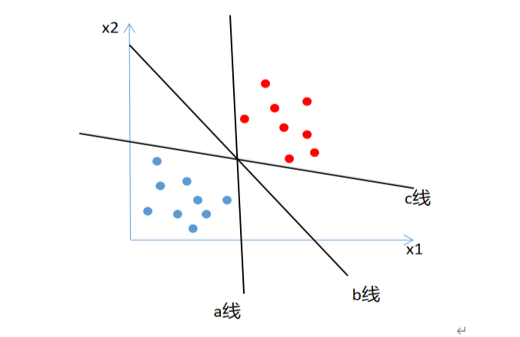
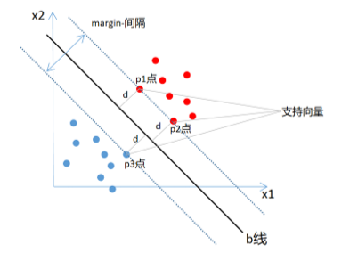
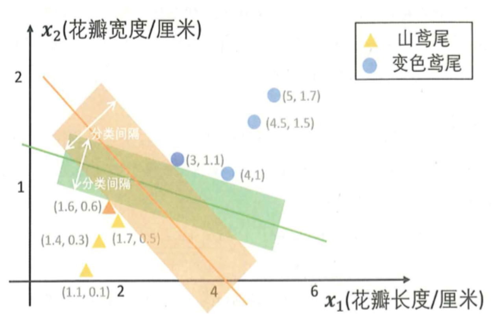
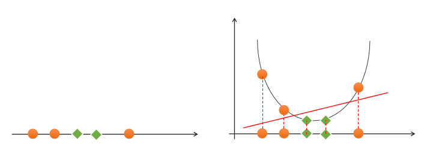
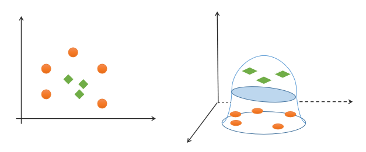
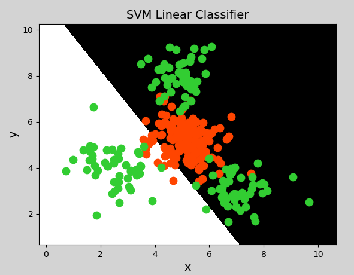
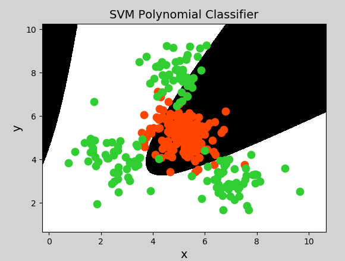
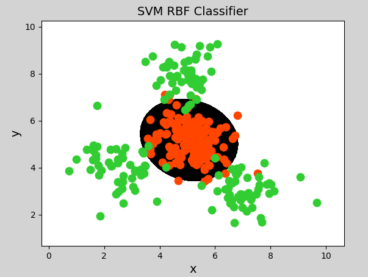

# 支持向量机

## 1. 概述

### 1.1 什么是支持向量机

支持向量机是在深度学习流行起来之前最好的模型。

支持向量机（Support Vector Machines）是一种二分类模型，在机器学习、计算机视觉、数据挖掘中广泛应用，主要用于==解决数据分类问题==，它的目的是寻找一个==超平面==来对样本进行分割，分割的原则是==间隔最大化==（即数据集的边缘点到分界线的距离d最大）

对两类样本点进行分类，如下图，有a线、b线、c线三条线都可以将两类样本点很好的分类，凭直觉就知道b线是最好的，那是为什么呢？



### 1.2 最优分类边界

什么才是最优分类边界？什么条件下的分类边界为最优边界呢？



**向量**：有向线段？（x,y）,（x,y,z）,上图中的每个点就是一个向量。

**支持向量**：到决策边界的距离最小的点。SVM核心就是优化决策超平面参数，使支持向量到超平面的距离最大。

**决策边界**：分离超平面。如果数据是线性可分的，这样的超平面有无穷多个，但是间隔最大的分离超平面是唯一的。

超平面可以用如下线性方程来描述：
$$
w^T x + b = 0
$$
其中，$x=(x_1;x_2;...;x_n)$，$w=(w_1;w_2;...;w_n)$，$b$为偏置项。可以从数学上证明，支持向量到超平面距离为：
$$
\gamma = \frac{1}{||w||}
$$
为了使距离最大，只需最小化$||w||$即可。

算法推导：[知乎上的推导过程](https://zhuanlan.zhihu.com/p/31886934) 或 李航 《统计学方法》



### 1.3 SVM最优边界要求

SVM寻找最优边界时，需满足以下几个要求：

（1）正确性：对大部分样本都可以正确划分类别；

（2）安全性：支持向量，即离分类边界最近的样本之间的距离最远；

（3）公平性：支持向量与分类边界的距离相等；

（4）简单性：采用线性方程（直线、平面）表示分类边界，也称分割超平面。如果在原始维度中无法做线性划分，那么就通过升维变换，在更高维度空间寻求线性分割超平面。从低纬度空间到高纬度空间的变换通过核函数进行。

### 1.4 线性可分与线性不可分

- **线性可分**

如果一组样本能使用一个线性函数将样本正确分类，称这些数据样本是线性可分的。那么什么是线性函数呢？在二维空间中就是一条直线，在三维空间中就是一个平面，以此类推，如果不考虑空间维数，这样的线性函数统称为超平面。

- **线性不可分**

如果一组样本，无法找到一个线性函数将样本正确分类，则称这些样本线性不可分。以下是一个一维线性不可分的示例：


<center><font size=2>一维线性不可分</font></center>

以下是一个二维不可分的示例：


<center><font size=2>二维线性不可分</font></center>

对于该类线性不可分问题，可以通过**升维**，将低纬度特征空间映射为高纬度特征空间，实现线性可分，如下图所示：



<center><font size=2>一维空间升至二维空间实现线性可分</font></center>



<center><font size=2>二维空间升至三维空间实现线性可分</font></center>

那么如何实现升维？这就需要用到核函数。

## 2. 核函数

通过名为核函数的特征转换，增加新的特征，使得低纬度线性不可分问题变为高纬度线性可分问题。

### 2.1 线性核函数

线性核函数（Linear）表示不通过核函数进行升维，仅在原始空间寻求线性分类边界，主要用于线性可分问题。

示例代码：

```python
# 支持向量机示例
import numpy as np
import sklearn.model_selection as ms
import sklearn.svm as svm
import sklearn.metrics as sm
import matplotlib.pyplot as plt

x, y = [], []
with open("./multiple2.txt", "r") as f:
    for line in f.readlines():
        data = [float(substr) for substr in line.split(",")]
        x.append(data[:-1])  # 输入
        y.append(data[-1])  # 输出

# 列表转数组
x = np.array(x)
y = np.array(y, dtype=int)

# 线性核函数支持向量机分类器
model = svm.SVC(kernel="linear")  # 线性核函数

# model = svm.SVC(kernel="poly", degree=3)  # 多项式核函数
# print("gamma:", model.gamma) # 多项式核中的 gamma 是用于缩放样本内积的参数，通过调整它可以控制核函数对样本间相似性的敏感程度，进而影响 SVM 的决策边界。当未显式指定 gamma 时，SVM 会使用默认值 gamma="scale"，此时其值为 1 / (n_features * X.var())（特征数量乘以数据方差的倒数），目的是自动适应数据的尺度。

# 径向基核函数支持向量机分类器
# model = svm.SVC(kernel="rbf",
#                 gamma=0.01,  # 概率密度标准差
#                 C=200)  # 概率强度
model.fit(x, y)

# 计算图形边界
l, r, h = x[:, 0].min() - 1, x[:, 0].max() + 1, 0.005
b, t, v = x[:, 1].min() - 1, x[:, 1].max() + 1, 0.005

# 生成网格矩阵
grid_x = np.meshgrid(np.arange(l, r, h), np.arange(b, t, v))
flat_x = np.c_[grid_x[0].ravel(), grid_x[1].ravel()]  # 合并
flat_y = model.predict(flat_x)  # 根据网格矩阵预测分类
grid_y = flat_y.reshape(grid_x[0].shape)  # 还原形状

plt.figure("SVM Classifier", facecolor="lightgray")
plt.title("SVM Classifier", fontsize=14)

plt.xlabel("x", fontsize=14)
plt.ylabel("y", fontsize=14)
plt.tick_params(labelsize=10)
plt.pcolormesh(grid_x[0], grid_x[1], grid_y, cmap="gray")

C0, C1 = (y == 0), (y == 1)
plt.scatter(x[C0][:, 0], x[C0][:, 1], c="orangered", s=80)
plt.scatter(x[C1][:, 0], x[C1][:, 1], c="limegreen", s=80)
plt.show()
```

绘制图形：



### 2.2 多项式核函数

多项式核函数（Polynomial Kernel）用增加高次项特征的方法做升维变换，当多项式阶数高时复杂度会很高，其表达式为：
$$
K(x，y)=(αx^T·y+c)^d
$$

$$
y = x_1 + x_2
$$
$$
y = x_1^2 + 2x_1x_2 + x_2^2
$$
$$
y = x_1^3 + 3x_1^2x_2 + 3x_1x_2^2 + x_2^3
$$

示例代码（将上一示例中创建支持向量机模型改为一下代码即可）：

```python
model = svm.SVC(kernel="poly", degree=3)  # 多项式核函数
```

生成图像：



### 2.3 径向基核函数

径向基核函数（Radial Basis Function Kernel）具有很强的灵活性，应用很广泛。与多项式核函数相比，它的参数少，因此大多数情况下，都有比较好的性能。在不确定用哪种核函数时，可优先验证径向基核函数。由于类似于高斯函数，所以也称其为高斯核函数。表达式如下：
$$
K(x,y) = exp(-\gamma||x-y||^2)
$$
$$
\gamma=\frac{1}{2\alpha^2}
$$
其中，$α^2$越大（$\gamma$越小），高斯核函数变得越平滑，即得到一个随输入x变化较缓慢，模型的偏差大、方差小，无法充分学习数据特征，容易欠拟合。$α^2$越小（$\gamma$越大），高斯核函数变化越剧烈，模型的偏差小、方差大，模型对噪声样本比较敏感，泛化能力差，容易过拟合。

总结如下：

| 参数                 | 决策边界           | 偏差  | 方差  | 拟合问题    |
| ------------------ | -------------- | --- | --- | ------- |
| $α^2$ 大，$\gamma$ 小 | 核函数平滑，决策边界简单   | 高   | 低   | **欠拟合** |
| $α^2$ 小，$\gamma$ 大 | 核函数剧烈变化，决策边界复杂 | 低   | 高   | **过拟合** |

> **偏差与方差是什么？**
>
> 把模型训练比作射箭——靶心是真实规律，每次训练（不同训练集）就是射一箭：
>
> - **偏差（Bias）**：瞄准的**准度**。偏差高 = 瞄准镜歪了，所有箭都偏离靶心（模型本身假设不对，学不到真实规律）
> - **方差（Variance）**：射击的**稳度**。方差高 = 手抖，每次箭落点差别很大（换一批训练数据，模型输出变化剧烈）
>
> 图示理解：
> ```
> 低偏差 + 低方差 → 🎯 箭箭靶心       （理想状态）
> 高偏差 + 低方差 → 全部偏在左上角    （欠拟合：瞄歪了但手稳）
> 低偏差 + 高方差 → 散布在靶心周围    （过拟合：瞄对了但手抖）
> 高偏差 + 高方差 → 散布在左上角      （最差）
> ```
>
> SVM 中：
> - 核函数太平滑 → 模型过于简单，不管换什么训练数据，都画不出复杂边界 → 高偏差、低方差 → 欠拟合
> - 核函数太剧烈 → 训练数据换一点，决策边界就大变样，死磕局部细节 → 低偏差、高方差 → 过拟合

示例代码（将上一示例中分类器模型改为如下代码即可）：

```python
# 径向基核函数支持向量机分类器
model = svm.SVC(kernel="rbf",
                gamma=0.01, # 概率密度标准差
                C=600)  # 概率强度，该值越大对错误分类的容忍度越小，分类精度越高，但泛化能力越差；该值越小，对错误分类容忍度越大，但泛化能力强

# gamma对模型的影响：
# gamma 过大：
# 每个样本的影响范围有限，模型会过度拟合训练数据中的细节（包括噪声），导致决策边界非常复杂，在训练集上表现极好，但在测试集上泛化能力差（过拟合）。
# gamma 过小：
# 样本影响范围过大，决策边界趋于简单（甚至接近线性），可能无法捕捉数据的非线性特征，导致模型欠拟合。
# 经验取值：
# 通常通过交叉验证（如网格搜索）选择，默认值为 1/(n_features)（特征数量的倒数），实际应用中常用 10^-3, 10^-2, 10^-1, 1, 10 等数量级进行调优。

# 对模型的影响：
# C 过大：
# 模型对错误分类的容忍度极低，会尽力让所有训练样本被正确分类，可能导致决策边界过度复杂，拟合训练集中的噪声，泛化能力下降（过拟合）。
# C 过小：
# 模型允许更多错误分类，决策边界更简单（偏向 “平滑”），可能无法充分拟合数据的真实分布，导致欠拟合。
# 经验取值：
# 通常与 gamma 一起调优，常用 10^-2, 10^-1, 1, 10, 100, 1000 等数量级，通过交叉验证选择最佳组合。

# gamma 和 C 是相互关联的参数，需要协同调优：
# 当 gamma 较小时（全局影响），C 可以适当增大，避免欠拟合；
# 当 gamma 较大时（局部影响），C 需适当减小，防止过拟合。
```

生成图像：



