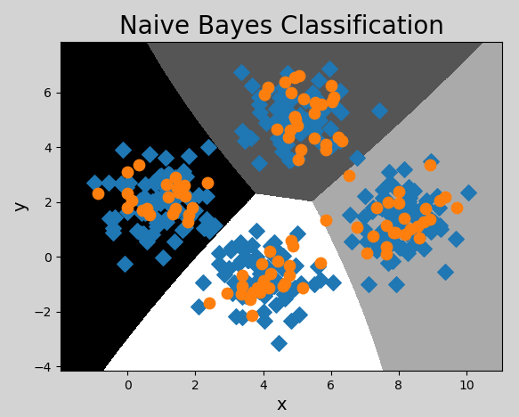

# 朴素贝叶斯

朴素贝叶斯是一组功能强大且易于训练的分类器，它使用贝叶斯定理来确定**给定一组条件的结果的概率**，“朴素”的含义是指所给定的条件都能独立存在和发生. 朴素贝叶斯是多用途分类器，能在很多不同的情景下找到它的应用，例如垃圾邮件过滤、自然语言处理等。

## 1. 概率

### 1.1 定义

概率是反映随机事件出现的可能性大小。随机事件是指在相同条件下，可能出现也可能不出现的事件。例如：

- 抛一枚硬币，可能正面朝上，可能反面朝上，这是随机事件. 正/反面朝上的可能性称为概率；
- 掷骰子，掷出的点数为随机事件. 每个点数出现的可能性称为概率；
- 一批商品包含良品、次品，随机抽取一件，抽得良品/次品为随机事件. 经过大量反复试验，抽得次品率越来越接近于某个常数，则该常数为概率。

我们可以将两个随机事件记为 A 和 B，则$P ( A )$, $P ( B )$表示事件 A 和事件 B 发生的概率。

### 1.2 联合概率与条件概率

- **联合概率**

指包含多个条件且所有条件同时成立的概率，记作$P ( A , B )$ ，或$P(AB)$，或$P(A \bigcap B)$

- **条件概率**

已知事件B发生的条件下，另一个事件A发生的概率称为条件概率，记为：$P(A|B)$

- **事件的独立性**

事件 A 不影响事件 B 的发生，称这两个事件独立，记为：
$$
P(AB)=P(A)P(B)
$$
因为A和B不相互影响，则有：
$$
P(A|B) = P(A)
$$
可以理解为，给定或不给定 B 的条件下，A的概率都一样大。

### 1.3 先验概率与后验概率

- **先验概率**

先验概率也是根据以往经验和分析得到的概率，例如：在没有任何信息前提的情况下，猜测对面来的陌生人姓氏，姓李的概率最大（因为全国李姓为占比最高的姓氏），这便是先验概率。

- **后验概率**

后验概率是指在接收了一定条件或信息的情况下的修正概率，例如：在知道对面的人来自“牛家村”的情况下，猜测他姓牛的概率最大，但不排除姓杨、李等等，这便是后验概率。 

- **两者的关系**

事情还没有发生，求这件事情发生的可能性的大小，是先验概率（可以理解为由因求果）。事情已经发生，求这件事情发生的原因是由某个因素引起的可能性的大小，是后验概率（由果求因）。先验概率与后验概率有不可分割的联系，后验概率的计算要以先验概率为基础。

## 2. 贝叶斯定理

### 2.1 定义

贝叶斯定理由英国数学家托马斯。贝叶斯 ( Thomas Bayes)提出，用来描述两个条件概率之间的关系，定理描述为：
$$
P(A|B) = \frac{P(A)P(B|A)}{P(B)}
$$
其中，$P(A)$和$P(B)$是 A 事件和 B 事件发生的概率. $P(A|B)$称为条件概率，表示 B 事件发生条件下，A 事件发生的概率. 推导过程：
$$
P(A,B) =P(B)P(A|B)\\
P(B,A) =P(A)P(B|A)
$$
其中$P(A,B)$称为联合概率，指事件 B 发生的概率，乘以事件 A 在事件 B 发生的条件下发生的概率。因为$P(A,B)=P(B,A)$, 所以有：
$$
P(B)P(A|B)=P(A)P(B|A)
$$
两边同时除以P(B)，则得到贝叶斯定理的表达式。其中，$P(A)$是先验概率，$P(A|B)$是已知B发生后A的条件概率，也被称作后验概率。

### 2.2 贝叶斯定理示例

【示例一】计算诈骗短信的概率

| 事件                                         | 概率 | 表达式        |
| -------------------------------------------- | ---- | ------------- |
| 所有短信中，诈骗短信                         | 5%   | P（A）= 0.05  |
| 所有短信中，含有“中奖”两个字                 | 4%   | P（B）= 0.04  |
| 所有短信中，是诈骗短信，并且含有“中奖”两个字 | 50%  | P(B\|A) = 0.5 |

求：收到一条新信息，含有“中奖”两个字，是诈骗短信的概率？

$P(A|B) = P(A) P(B|A) / P(B) = 0.05 * 0.5 / 0.04 = 0.625$

【示例二】计算喝酒驾车的概率

| 事件                     | 概率 | 表达式          |
| ------------------------ | ---- | --------------- |
| 所有客人中，驾车         | 20%  | P（A）= 0.2     |
| 所有客人中，喝酒         | 10%  | P（B）= 0.1     |
| 所有客人中，开车并且喝酒 | 5%   | P（B\|A）= 0.05 |

 求：喝过酒仍然会开车的人的比例是多少？

$P(A|B) = P(A) P(B|A) / P(B) = 0.2 * 0.05 / 0.1 = 0.1$

## 3. 朴素贝叶斯分类器

### 3.1 分类原理

朴素贝叶斯分类器就是根据贝叶斯公式计算结果进行分类的模型，“朴素”指事件之间相互独立无影响。例如：有如下数据集：

一个单词为一个特征

| Text                                               | Category                   |
| -------------------------------------------------- | -------------------------- |
| A great game（一个伟大的比赛）                     | Sports（体育运动）         |
| The election was over（选举结束）                  | Not sports（不是体育运动） |
| Very clean match（没内幕的比赛）                   | Sports（体育运动）         |
| A clean but forgettable game（一场难以忘记的比赛） | Sports（体育运动）         |
| It was a close election（这是一场势均力敌的选举）  | Not sports（不是体育运动） |

求：”A very close game“ 是体育运动的概率？数学上表示为 P(Sports | a very close game). 根据贝叶斯定理，是运动的概率可以表示为：
$$
P(Sports | a \ very \ close \ game) = \frac{P(a \ very \ close \ game | sports) * P(sports)}{P(a \ very \ close \ game)}
$$
不是运动概率可以表示为：
$$
P(Not \ Sports | a \ very \ close \ game) = \frac{P(a \ very \ close \ game | Not \ sports) * P(Not \ sports)}{P(a \ very \ close \ game)}
$$
概率更大者即为分类结果。由于分母相同，即比较分子谁更大即可.  我们只需统计”A very close game“ 多少次出现在Sports类别中，就可以计算出上述两个概率。但是”A very close game“ 并没有出现在数据集中，所以这个概率为0，要解决这个问题，就假设每个句子的单词出现都与其它单词无关（事件独立即朴素的含义），所以，P(a very close game)可以写成：
$$
P(a \ very \ close \ game) = P(a) * P(very) * P(close) * P(game) 
$$

$$
P（a \ very \ close \ game|Sports)= \\ P(a|Sports)*P(very|Sports)*P(close|Sports)*P(game|Sports)
$$

统计出“a", "very", "close", "game"出现在"Sports"类别中的概率，就能算出其所属的类别。具体计算过程如下：

- 第一步：计算总词频：Sports类别词语总数11，Not Sports类别词语总数9

- 第二步：计算每个类别的先验概率

  ```python
  # Sports和Not Sports概率
  P(Sports) = 3 / 5 = 0.6 
  P(Not Sports) = 2 / 5 = 0.4 
  
  # Sports条件下各个词语概率
  P(a | Sports) = (2 + 1) / (11 + 14) = 0.12 # +1是防止分子为0，+14是不重复的词语总数，防止概率大于1
  P(very | Sports) = (1 + 1) / (11 + 14) = 0.08
  P(close | Sports) = (0 + 1) / (11 + 14) = 0.04
  P(game | Sports) = (2 + 1) / (11 + 14) = 0.12
  
  # Not Sports条件下各个词语概率
  P(a | Not Sports) = (1 + 1) / (9 + 14) = 0.087
  P(very | Not Sports) = (0 + 1) / (9 + 14) = 0.043
  P(close | Not Sports) = (1 + 1) / (9 + 14) = 0.087
  P(game | Not Sports) = (0 + 1) / (9 + 14) = 0.043
  ```

  其中，分子加1、分母加14的做法叫做**拉普拉斯平滑**，下面展开说明。

**为什么需要拉普拉斯平滑？**

朴素贝叶斯计算 $P(x_i \mid y)$ 时，是用"特征 $x_i$ 在类别 $y$ 中出现的次数 ÷ 类别 $y$ 的总词数"。但这里有一个致命问题：如果某个词在训练集的某类别中**一次都没出现过**，分子就是 0，那么：

$$P(close \mid Sports) = \frac{0}{11} = 0$$

当一个新句子包含 "close" 时，连乘会让整个概率变成 0：
$$P(Sports \mid \text{...close...}) \propto 0.12 \times 0.08 \times \mathbf{0} \times 0.12 = 0$$

哪怕其他三个词都强烈指向 Sports，只要一个词没见过，结果就是 0，这显然不合理。

**拉普拉斯平滑的公式**

$$\hat{P}(x_i \mid y) = \frac{N_{x_i, y} + \alpha}{N_y + \alpha \cdot V}$$

- $N_{x_i, y}$：词 $x_i$ 在类别 $y$ 中的出现次数
- $N_y$：类别 $y$ 的总词数
- $V$：所有不重复词语的总数（词汇表大小）
- $\alpha$：平滑系数，$\alpha = 1$ 就是标准的**拉普拉斯平滑**

**分子为什么加 1？** 确保没有词的概率为 0。哪怕 "close" 在 Sports 中出现 0 次，加 1 后也会有一个很小的概率，不至于让连乘归零。

**分母为什么加 $V$？** 分子加了 $V$ 个 1（每个不重复词都加了 1），分母也必须同步增加，否则所有词的概率加起来会超过 1，不满足概率的归一化要求。

**以本例中的 "close" 为例**：
$$P(close \mid Sports) = \frac{0 + 1}{11 + 14} = \frac{1}{25} = 0.04$$

如果不做平滑就是 $\frac{0}{11} = 0$，拉普拉斯平滑给了它 4% 的小概率，让分类器面对未见过的词也能做出合理判断（而不会直接死掉）。

> **补充**：如果用 $\alpha < 1$ 叫做 Lidstone 平滑，$\alpha$ 可以调节；但在 sklearn 的 MultinomialNB 中默认 `alpha=1` 就是拉普拉斯平滑。

- 第三步：将先验概率带入贝叶斯定理，计算概率：

  是体育运动的概率：

$$
P（a \ very \ close \ game|Sports)= \\ P(a|Sports)*P(very|Sports)*P(close|Sports)*P(game|Sports)= \\
0.12 * 0.08 * 0.04 * 0.12 = 0.00004608
$$

​       不是体育运动的概率：
$$
P（a \ very \ close \ game|Not \ Sports)= \\ 
P(a|Not \ Sports)*P(very|Not \ Sports)*P(close|Not \ Sports)*P(game|Not \ Sports)= \\
0.087 * 0.043 * 0.087 * 0.043 = 0.000013996
$$
分类结果：P(a very close game | Sports) * P(Sports) = 0.00004608 * 0.6 = 0.000027648，
P(a very close game | Not Sports) * P(Not Sports) = 0.000013996 * 0.4 = 0.0000055984，
0.000027648 > 0.0000055984，故分类为体育运动。


### 3.2 实现朴素贝叶斯分类器

在sklearn中，提供了三个朴素贝叶斯分类器，分别是：

- GaussianNB（高斯朴素贝叶斯分类器）：适合用于样本的值是==连续==的，数据呈==正态分布==的情况（比如人的身高、城市家庭收入、一次考试的成绩等等）
- MultinominalNB（多项式朴素贝叶斯分类器）：适合用于大部分属性为==离散==值的数据集
- BernoulliNB（伯努利朴素贝叶斯分类器）：适合用于特征值为==二元离散值或是稀疏的多元离散值==的数据集

**三种算法的直观对比** —— 以"判断一颗水果是不是苹果"为例：

| 算法                | 特征长什么样 | 具体例子                                       | 核心问题                          |
| ----------------- | ------ | ------------------------------------------ | ----------------------------- |
| **GaussianNB**    | 连续数值   | 特征：[重量=182g, 直径=7.5cm, 甜度=14.2]            | "182g在苹果类别的正态分布曲线上，概率密度是多少？"  |
| **MultinomialNB** | 非负计数   | 特征：[红色像素点=8320个, 圆形轮廓点=4100个, 果梗点=120个]    | "8320个红色像素点在苹果图片中出现的频次占比是多少？" |
| **BernoulliNB**   | 0 或 1  | 特征：[有红色=1, 有圆形轮廓=1, 有叶子=0, 有果梗=1, 有标签贴纸=0] | "苹果出现'圆形轮廓'这个特征的概率是多少？"       |

**三个更贴近实际应用的例子**：

- **GaussianNB —— 根据体检数据预测患病风险**
  特征 $X$：年龄(岁)、血糖值(mmol/L)、BMI、血压(mmHg)……这些全是**连续数值**
  标签 $y$：患病 / 未患病
  → 算法会为"患病"和"未患病"分别拟合每个指标的正态分布曲线，新患者来了算概率密度比较即可。

- **MultinomialNB —— 新闻自动归类**
  特征 $X$：文章中每个词出现的**次数**，比如 {"股市": 5, "涨停": 3, "资金": 2, "足球": 0, "进球": 0}
  标签 $y$：财经 / 体育 / 娱乐
  → 财经类文章里"股市"出现的频率高，体育类里"足球"频率高，算法数数就行。

- **BernoulliNB —— 垃圾邮件过滤**
  特征 $X$：邮件中是否**出现**某些敏感词，比如 {含"中奖": 1, 含"免费": 0, 含"赚钱": 1, 含"会议纪要": 0}
  标签 $y$：垃圾邮件 / 正常邮件
  → 不关心"中奖"出现了 1 次还是 5 次，只关心**出现没出现**。短文本场景下这个假设反而更准。

该示例中，样本的值为连续值，且呈正态分布，所以采用GaussianNB模型. 代码如下：

```python
# 朴素贝叶斯分类示例
import numpy as np
import sklearn.naive_bayes as nb
import matplotlib.pyplot as mp

# 输入，输出
x, y = [], []

# 读取数据文件
with open("../data/multiple1.txt", "r") as f:
    for line in f.readlines():
        data = [float(substr) for substr in line.split(",")]
        x.append(data[:-1])  # 输入样本：取从第一列到倒数第二列
        y.append(data[-1])  # 输出样本：取最后一列

x = np.array(x)
y = np.array(y, dtype=int)

# 创建高斯朴素贝叶斯分类器对象
model = nb.GaussianNB()
model.fit(x, y)  # 训练

# 计算显示范围
left = x[:, 0].min() - 1
right = x[:, 0].max() + 1

buttom = x[:, 1].min() - 1
top = x[:, 1].max() + 1

grid_x, grid_y = np.meshgrid(np.arange(left, right, 0.01),
                             np.arange(buttom, top, 0.01))

mesh_x = np.column_stack((grid_x.ravel(), grid_y.ravel()))
mesh_z = model.predict(mesh_x)
mesh_z = mesh_z.reshape(grid_x.shape)

mp.figure('Naive Bayes Classification', facecolor='lightgray')
mp.title('Naive Bayes Classification', fontsize=20)
mp.xlabel('x', fontsize=14)
mp.ylabel('y', fontsize=14)
mp.tick_params(labelsize=10)
mp.pcolormesh(grid_x, grid_y, mesh_z, cmap='gray')
mp.scatter(x[:, 0], x[:, 1], c=y, cmap='brg', s=80)
mp.show()
```

执行结果：



【练习】自己对鸢尾花数据集，使用朴素贝叶斯分类实现分类，最终查看模型的准确率等评估指标。

```python
from sklearn import datasets
from sklearn.model_selection import train_test_split
from sklearn.naive_bayes import GaussianNB
from sklearn.metrics import accuracy_score

# 加载数据
iris = datasets.load_iris()
X = iris.data  # 特征
y = iris.target # 标签

# 划分训练集和测试集
X_train, X_test, y_train, y_test = train_test_split(X, y, test_size=0.2, random_state=42)

# 创建高斯朴素贝叶斯模型并训练
model = GaussianNB()
model.fit(X_train, y_train)

# 预测并评估
y_pred = model.predict(X_test)
print(f"Accuracy: {accuracy_score(y_test, y_pred):.2f}")
```

