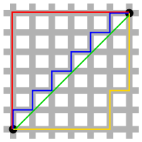
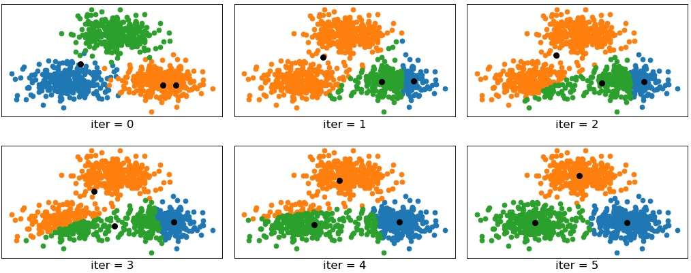
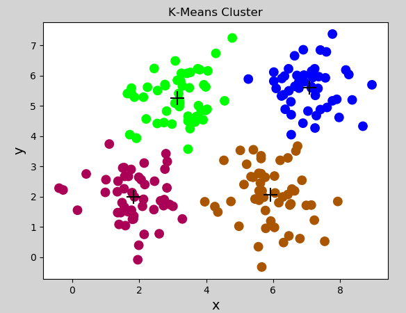
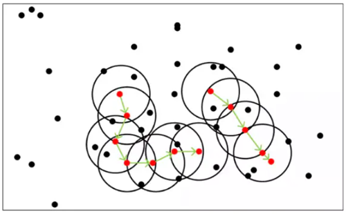
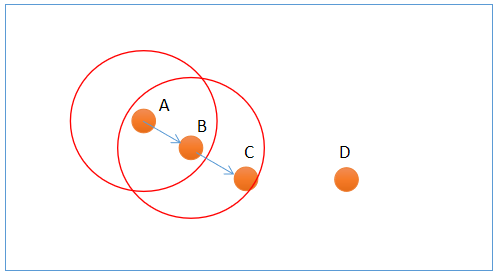
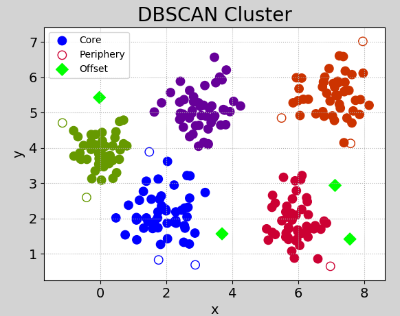
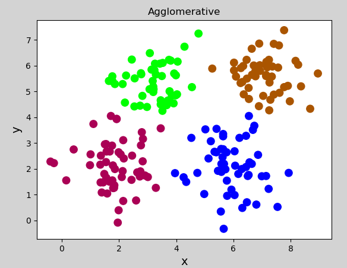
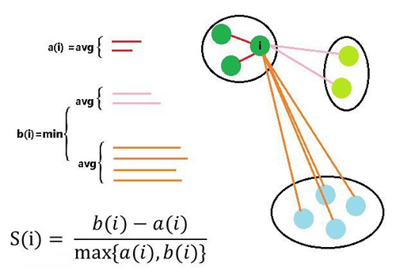

# 聚类

## 1. 概述

聚类（cluster）与分类（class）问题不同，聚类是属于无监督学习模型，而分类属于有监督学习。聚类使用一些算法把样本分为N个群落，群落内部相似度较高，群落之间相似度较低。在机器学习中，通常采用“距离”来度量样本间的相似度，距离越小，相似度越高；距离越大，相似度越低。

## 2. 相似度度量的方式

- **欧氏距离**

相似度使用欧氏距离来进行度量。坐标轴上两点$x_1, x_2$之间的欧式距离可以表示为：
$$
|x_1,x_2| = \sqrt{(x_1-x_2)^2}
$$
平面坐标中两点$(x_1, y_1), (x_2, y_2)$欧式距离可表示为：
$$
|(x_1,y_1),(x_2, y_2)| = \sqrt{(x_1-x_2)^2+(y_1-y_2)^2}
$$
三维坐标系中$(x_1, y_1, z_1), (x_2, y_2, z_2)$欧式距离可表示为：
$$
|(x_1, y_1, z_1),(x_2, y_2, z_2)| = \sqrt{(x_1-x_2)^2+(y_1-y_2)^2+(z_1-z_2)^2}
$$
以此类推，可以推广到N维空间。
$$
|(x_1, y_1, z_1...,n_1),(x_2, y_2, z_2,...n_2)| = \sqrt{(x_1-x_2)^2+(y_1-y_2)^2+(z_1-z_2)^2+...(n_1-n_2)^2}
$$

- **曼哈顿距离**

二维平面两点$a(x_1, y_1)$与$b(x_2, y_2)$两点间的曼哈顿距离为：
$$
d(a, b) = |x_1 - x_2| + |y_1 - y_2|
$$
推广到N维空间，$x(x_1, x_2, ..., x_n)$与$y(y_1, y_2, ..., y_n)$之间的曼哈顿距离为：
$$
d(x,y) = |x_1 - y_1| + |x_2 - y_2| + ... + |x_n - y_n| = \sum_{i=1}^n|x_i - y_i|
$$


在上图中，绿色线条表示的为欧式距离，红色线条表示的为曼哈顿距离，黄色线条和蓝色线条表示的为曼哈顿距离的等价长度。

- **闵可夫斯基距离**

闵可夫斯基距离（Minkowski distance）又称闵氏距离，其定义为：
$$
D(x, y) = (\sum_{i=1}^n |x_i - y_i|^p)^{\frac{1}{p}}
$$

1. 当$p=1$时，即为曼哈顿距离
2. 当$p=2$时，即为欧式距离
3. 当$p \rightarrow \infty$时，即为切比雪夫距离

可见，曼哈顿距离、欧氏距离、切比雪夫距离都是闵可夫斯基的特殊形式。


> 切比雪夫距离可以表达为两个点之间的最大坐标数值差绝对值。具体来说，对于任意两个点A(x1, y1)和B(x2, y2)，其切比雪夫距离可以表示为：d(A, B) = max(|x1 - x2|, |y1 - y2|)

**为什么 $p \rightarrow \infty$ 时就是切比雪夫距离？**

将闵可夫斯基公式中的最大差值 $d_{max}$ 提取出来：
$$
D = \left( d_{max}^p \cdot \sum \left(\frac{d_i}{d_{max}}\right)^p \right)^{\frac{1}{p}} = d_{max} \cdot \left[ \sum \left(\frac{d_i}{d_{max}}\right)^p \right]^{\frac{1}{p}}
$$
- 对于**最大差值本身**：$(d_{max}/d_{max})^p = 1^p = 1$，恒为 1
- 对于**其他差值**：$d_i < d_{max}$，所以 $d_i/d_{max} < 1$。一个小于 1 的数不断增大指数 $p$，会趋近于 0（如 $0.9^{100} \approx 0$）

因此当 $p \rightarrow \infty$ 时，括号内的和趋近于 **1**，整体结果趋近于 $d_{max}$，即 **max(各项差值)**。

拿 A(2, 3) 和 B(5, 10) 举例，差值 d₁ = 3，d₂ = 7，d_max = 7。

| p         | 计算过程                                | 结果          |
| --------- | ----------------------------------- | ----------- |
| 1（曼哈顿）    | (3¹ + 7¹)^(1/1) = 10                | **10**      |
| 2（欧氏）     | (3² + 7²)^(1/2) = √58               | **7.62**    |
| 4         | (3⁴ + 7⁴)^(1/4) = (81 + 2401)^(1/4) | **7.07**    |
| 10        | (3¹⁰ + 7¹⁰)^(1/10)                  | ≈ **7.001** |
| → ∞（切比雪夫） | —                                   | **7**       |


- **距离的性质**

如果$dist(x,y)$度量标准为一个距离，它应该满足以下几个条件：

1. 非负性：距离一般不能为负，即 $dist(x, y) >= 0$
2. 同一性：$dist(x_i, y_i) = 0$，当且仅当$x_i = y_i$
3. 对称性：$dist(x_i, y_i) = dist(y_i, x_i)$
4. 直递性：$dist(x_i, x_j) <= dist(x_i, x_k) + dist(x_k, x_j)$

> 这四条合在一起，刻画了我们直觉中"距离"该有的样子：**不能为负、零点唯一、方向无关、绕路不赚。** 欧氏距离、曼哈顿距离、切比雪夫距离都满足这四条，所以它们都是合法的"距离"。

## 3. 聚类算法的划分

- **原型聚类**

原型聚类也称“基于原型的聚类”（prototype-based clustering），此类算法假设聚类结构能通过一组原型刻画，在现实聚类任务中极为常用。**基于原型的聚类** 是一种认为**每个聚类都可以用一个最具代表性的“原型”来刻画**的聚类方法。这个“原型”通常是属于该聚类的一个“中心点”或“代表性数据点”。 通常情况下，算法先对原型进行初始化，然后对原型进行迭代更新求解。 采用不同的原型表示、不同的求解方式，将产生不同的算法。最著名的原型聚类算法有==K-Means==.

- **密度聚类**

密度聚类也称“基于密度的聚类”（density-based clustering），此类算法假定聚类结构能通过样本分布的紧密程度确定。**基于密度的聚类** 是一种认为**簇是由数据空间中密度较高的区域所构成，并由密度较低的区域分隔开**的聚类方法。它的核心不是寻找中心点，而是发现被低密度区域隔离的高密度区域。通常情况下，密度聚类算法从样本密度的角度来考察样本之间的可连接性，并基于可连接样本不断扩展聚类簇以获得最终的聚类结果。著名的密度聚类算法有==DBSCAN==。

- **层次聚类**

层次聚类（hierarchical clustering）试图在不同层次对数据集进行划分，从而形成树形的聚类结构。数据集的划分可以采用“自底向上”或“自顶向下”的策略。常用的层次聚类有凝聚层次算法等。

## 4. 常用聚类算法

### 4.1 K均值聚类

- **定义**

K均值聚类（k-means clustering）算法是一种常用的、**基于原型**的聚类算法，简单、直观、高效。其步骤为：

第一步：根据**事先已知的聚类数**，随机选择若干样本作为聚类中心，计算每个样本与每个聚类中心的欧式距离，离哪个聚类中心近，就算哪个聚类中心的聚类，完成一次聚类划分。

第二步：计算每个聚类的几何中心，如果几何中心与聚类中心不重合，再以几何中心作为新的聚类中心，重新划分聚类. 重复以上过程，直到某一次聚类划分后，所得到的各个几何中心与其所依据的聚类中心重合或足够接近为止。聚类过程如下图所示：



> 详解见[K均值聚类算法—NBA球星聚类](assets/K均值聚类算法—NBA球星聚类.pptx)

注意事项：

（1）聚类数（K）必须事先已知，来自业务逻辑的需求或性能指标。

（2）最终的聚类结果会因初始中心的选择不同而异，初始中心尽量选择离中心最远的样本。

- **实现**

sklearn 关于 k-means 算法API：

```python
import sklearn.cluster as sc

# 创建模型
model = sc.KMeans(n_clusters)  # n_cluster为聚类数量

 # 获取聚类(几何)中心
centers = model.cluster_centers_  

 # 获取聚类标签（聚类结果）
pred_y = model.labels_  
```

示例代码：

```python
# k-means示例
import numpy as np
import sklearn.cluster as sc
import matplotlib.pyplot as plt
import sklearn.metrics as sm
import pandas as pd

x = []  # 没有输出（无监督学习）
with open("../data/multiple3.txt", "r") as f:
    for line in f.readlines():
        line = line.replace("\n", "")
        data = [float(substr) for substr in line.split(",")]
        x.append(data)

x = np.array(x)

# K均值聚类器
model = sc.KMeans(n_clusters=4)  # n_cluster为聚类数量
model.fit(x)  # 训练

pred_y = model.labels_  # 聚类标签（聚类结果）
centers = model.cluster_centers_  # 获取聚类(几何)中心

print("centers:", centers)
print("labels.shape:", pred_y.shape)
#print("labels:", pred_y)

# 手动验证某个类别的聚类中心
data = pd.DataFrame(x)
data['y'] = pred_y
data0 = data[data['y'] == 0]
print(data0[0].mean(),data0[1].mean())

# 计算并打印轮廓系数
score = sm.silhouette_score(x, pred_y,
                            sample_size=len(x),
                            metric="euclidean")  # 欧式距离度量
print("silhouette_score:", score)

# 可视化
plt.figure("K-Means Cluster", facecolor="lightgray")
plt.title("K-Means Cluster")
plt.xlabel("x", fontsize=14)
plt.ylabel("y", fontsize=14)
plt.tick_params(labelsize=10)
plt.scatter(x[:, 0], x[:, 1], s=80, c=pred_y, cmap="brg")
plt.scatter(centers[:, 0], centers[:, 1], marker="+",
           c="black", s=200, linewidths=1)
plt.show()
```

打印输出：

```
centers: [[7.07326531 5.61061224]
 [1.831      1.9998    ]
 [5.91196078 2.04980392]
 [3.1428     5.2616    ]]
labels.shape: (200,)
silhouette_score: 0.5773232071896658
```

生成图像：



- **特点及使用**
  - 优点
    （1）原理简单，实现方便，收敛速度快；
    （2）聚类效果较优，模型的可解释性较强；		
  - 缺点
    （1）需要事先知道聚类数量；
    （2）聚类初始中心的选择对聚类结果有影响；
    （3）采用的是迭代的方法，只能得到局部最优解；
    （4）对于噪音和异常点比较敏感. 
  - 什么时候选择 k-means
    （1）事先知道聚类数量
    （2）数据分布有明显的中心

### 1.4.2 噪声密度

- **定义**

噪声密度（Density-Based Spatial Clustering of Applications with Noise， 简写DBSCAN，[[../数分与机器额外笔记/DBSCAN 聚类算法介绍与实际应用示例|DBSCAN 聚类算法介绍与实际应用示例]]），==随机选择一个样本==做圆心，以事先给定的半径做圆，凡被该圆圈中的样本都被划为与圆心样本同处一个聚类，再以这些被圈中的样本做圆心，以事先给定的半径继续做圆，不断加入新的样本，扩大聚类的规模，直到再无新的样本加入为止，即完成一个聚类的划分。以同样的方法，在其余样本中继续划分新的聚类，直到样本空间被耗尽为止，即完成整个聚类划分过程。示意图如下：



DBSCAN 通过两个参数来定义簇：

- epsilon（半径）：定义了数据点在被视为邻居时的最大距离。
- MinPts（最小样本数）：定义了构成一个簇所需的最少数据点数。

DBSCAN 算法的步骤如下：

1. 对于数据集中的每个点，找出其在 epsilon 半径内的邻居点。
2. 如果某个点的邻居点数不少于 MinPts，则以该点为核心点形成一个簇。
3. 对于核心点所属的簇，将其邻居点中的所有点归入该簇。如果邻居点也为核心点，则递归地扩展簇。
4. 重复步骤2和3，直到所有点都被处理。
5. 剩余的未归入任何簇的点视为噪声点。  

DBSCAN 算法中，样本点被分为三类：

1. 边界点（Border point）：可以划分到某个聚类，但无法发展出新的样本；
2. 噪声点（Noise）：无法划分到某个聚类中的点；
3. 核心点（Core point）：除了==孤立样本==和==外周样本==以外的样本都是核心点；



上图中，A 和 B 为核心点，C为边界点，D为噪声点。此外，DBSCAN还有两个重要参数：

1. 邻域半径：设置邻域半径大小；
2. 最少样本数目：邻域内最小样本数量，某个样本邻域内的样本超过该数，才认为是核心点。

- **实现**

sklearn 提供了 DBSCAN 模型来实现噪声密度聚类，原型如下：

```python
model = sc.DBSCAN(eps,   # 半径
                  min_samples) # 最小样本数
```

示例代码：

```python
# 噪声密度聚类示例
import numpy as np
import sklearn.cluster as sc
import matplotlib.pyplot as plt
import sklearn.metrics as sm

# 读取样本
x = []
with open("../data/perf.txt", "r") as f:
    for line in f.readlines():
        line = line.replace("\n", "")
        data = [float(substr) for substr in line.split(",")]
        x.append(data)

x = np.array(x)

epsilon = 0.8  # 邻域半径
min_samples = 5  # 最小样本数

# 创建噪声密度聚类器
model = sc.DBSCAN(eps=epsilon,  # 半径
                  min_samples=min_samples)  # 最小样本数
model.fit(x)
score = sm.silhouette_score(x,
                            model.labels_,
                            sample_size=len(x),
                            metric='euclidean')  # 计算轮廓系数
pred_y = model.labels_
print(pred_y) # 打印所有样本类别
# print(model.core_sample_indices_) # 打印所有核心样本索引

# DBSCAN不能进行预测，因为密度聚类（如DBSCAN）的本质是“发现”数据中自然形成的、高密度的区域，而不是“学习”一个通用的规则来对新的数据点进行分类。给你一袋混合的豆子，让你把同类的豆子拣出来分成几堆。（任务完成后，过程就结束了，没有生成一个“豆子分类器”）。

# 区分样本
core_mask = np.zeros(len(x), dtype=bool)
core_mask[model.core_sample_indices_] = True  # 核心样本下标

offset_mask = (pred_y == -1)  # 孤立样本
periphery_mask = ~(core_mask | offset_mask)  # 核心样本、孤立样本之外的样本

# 可视化
plt.figure('DBSCAN Cluster', facecolor='lightgray')
plt.title('DBSCAN Cluster', fontsize=20)
plt.xlabel('x', fontsize=14)
plt.ylabel('y', fontsize=14)
plt.tick_params(labelsize=14)
plt.grid(linestyle=':')
labels = set(pred_y)
print(labels)
cs = plt.get_cmap('brg', len(labels))(range(len(labels)))
print("cs:", cs)

# 核心点
plt.scatter(x[core_mask][:, 0],  # x坐标值数组
           x[core_mask][:, 1],  # y坐标值数组
           c=cs[pred_y[core_mask]],
           s=80, label='Core')
# 边界点
plt.scatter(x[periphery_mask][:, 0],
           x[periphery_mask][:, 1],
           edgecolor=cs[pred_y[periphery_mask]],
           facecolor='none', s=80, label='Periphery')
# 噪声点
plt.scatter(x[offset_mask][:, 0],
           x[offset_mask][:, 1],
           marker='D', c=cs[pred_y[offset_mask]],
           s=80, label='Offset')
plt.legend()
plt.show()
```

执行图像：



- **特点及使用**

  - 算法优点
    （1）不用人为提前确定聚类类别数K；
    （2）聚类速度快；
    （3）能够有效处理噪声点（因为异常点不会被包含于任意一个簇，则认为是噪声）；
    （4）能够应对任意形状的空间聚类。

  - 算法缺点
    （1）当数据量过大时，要求较大的内存支持I/O消耗很大；
    （2）当空间聚类的密度不均匀、聚类间距差别很大时、聚类效果有偏差；
    （3）邻域半径和最少样本数量两个参数对聚类结果影响较大。

  - 何时选择噪声密度
    （1）数据稠密、没有明显中心；
    （2）噪声数据较多；
    （3）未知聚簇的数量。

### 1.4.3 凝聚层次聚类

- **定义**

凝聚层次（Agglomerative）算法，首先将**每个样本看做独立的聚类**，如果聚类数大于预期，则合并两个距离最近的样本作为一个新的聚类，如此反复迭代，不断扩大聚类规模的同时，减少聚类的总数，直到聚类数减少到**预期值**为止。这里的关键问题是如何计算聚类之间的距离。

依据对距离的不同定义，将 Agglomerative Clustering 的聚类方法分为三种：

1. ward：默认选项，簇的合并基于簇内所有点之间的方差最小化准则，即合并后的簇的方差应该尽可能小。这通常会得到大小差不多相等的簇。
2. average 链接（**平均链路**）：将簇中所有点之间平均距离最小的两个簇合并。
3. complete 链接（**全链路**）：也称为最大链接，通过比较两个簇中所有点之间的最大距离来确定簇间距离的。合并两个簇中最不相似的样本（即距离最远的样本）所属的簇。

ward 适用于大多数数据集。如果簇中的成员个数非常不同（比如其中一个比其他所有都大得多），那么 average 或 complete可能效果更好。 

- **实现**

sklearn提供了AgglomerativeClustering聚类器来实现凝聚层次聚类，示例代码如下：

```python
# 凝聚层次聚类示例
import numpy as np
import sklearn.cluster as sc
import matplotlib.pyplot as plt

x = []
with open("../data/multiple3.txt", "r") as f:
    for line in f.readlines():
        line = line.replace("\n", "")
        data = [float(substr) for substr in line.split(",")]
        x.append(data)

x = np.array(x)

# 凝聚聚类
model = sc.AgglomerativeClustering(n_clusters=4)  # n_cluster为聚类数量
model.fit(x)  # 训练
pred_y = model.labels_  # 聚类标签（聚类结果）

# 可视化
plt.figure("Agglomerative", facecolor="lightgray")
plt.title("Agglomerative")
plt.xlabel("x", fontsize=14)
plt.ylabel("y", fontsize=14)
plt.tick_params(labelsize=10)
plt.scatter(x[:, 0], x[:, 1], s=80, c=pred_y, cmap="brg")
plt.show()
```

执行结果：



- **特点及使用**

（1）需要事先给定期望划分的聚类数（k），来自业务或指标优化；

（2）没有聚类中心，无法进行聚类预测，因为不依赖于中心的划分，所以对于中心特征不明显的样本，划分效果更佳稳定；

（3）适合于中心不明显的聚类。

## 5. 聚类的评价指标

理想的聚类可以用四个字概况：内密外疏，即同一聚类内部足够紧密，聚类之间足够疏远。学科中使用“轮廓系数”来进行度量，见下图：



假设我们已经通过一定算法，将待分类数据进行了聚类，对于簇中的每个样本，分别计算它们的轮廓系数。对于其中的一个点 i 来说：
​    a(i) = average(i向量到所有它属于的簇中其它点的距离)
​    b(i) = min (i向量到各个非本身所在簇的所有点的平均距离)
那么 i 向量轮廓系数就为：
$$
S(i)=\frac{b(i)-a(i)}{max(b(i), a(i))}
$$
由公式可以得出:

（1）当$b(i)>>a(i)$时，$S(i)$越接近于1，这种情况聚类效果最好；

（2）当$b(i)<<a(i)$时，$S(i)$越接近于-1，这种情况聚类效果最差；

（3）当$b(i)=a(i)$时，$S(i)$的值为0，这种情况分类出现了重叠。

sklearn提供的计算轮廓系数API：

```python
score = sm.silhouette_score(x, # 样本
                            pred_y, # 标签
                            sample_size=len(x), # 样本数量
                            metric="euclidean")  # 欧式距离度量
```

